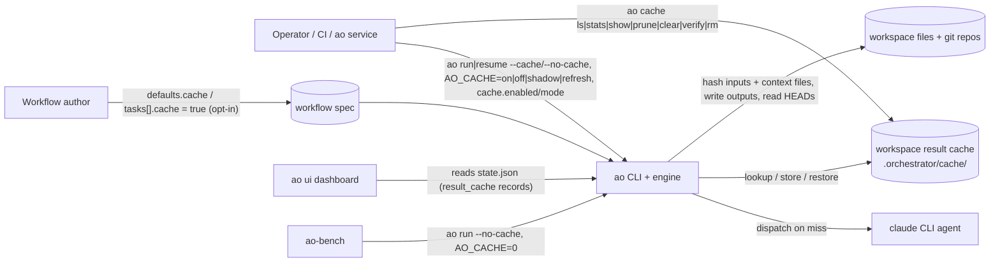
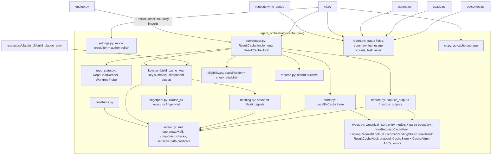
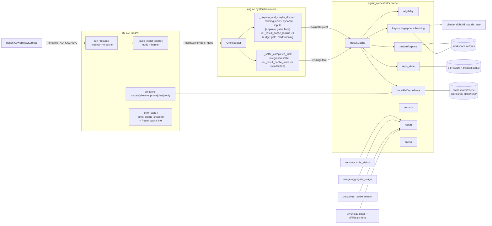
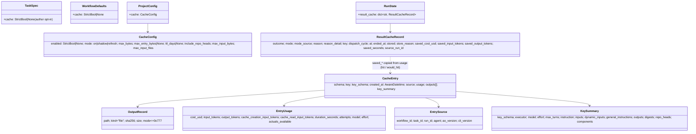
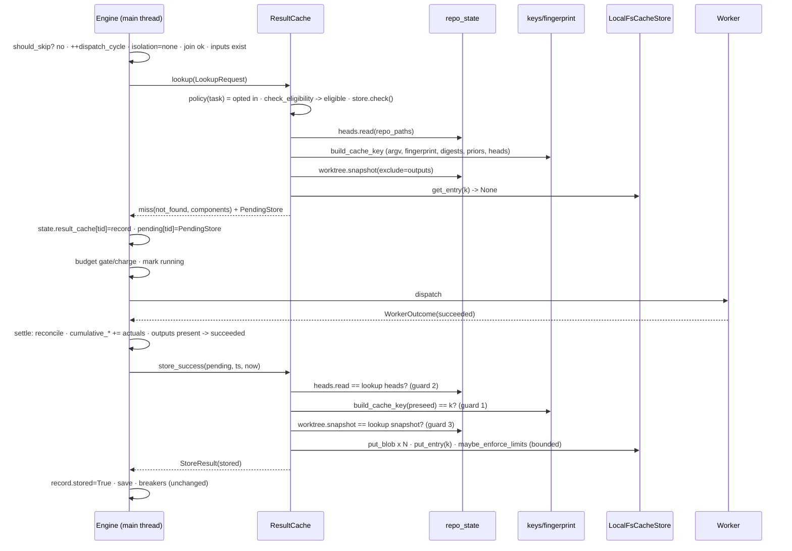
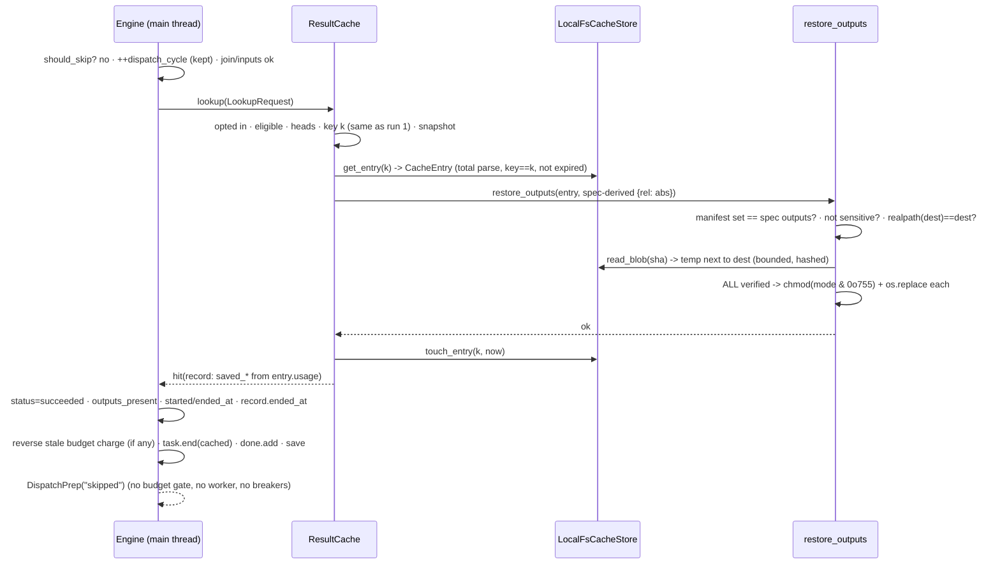
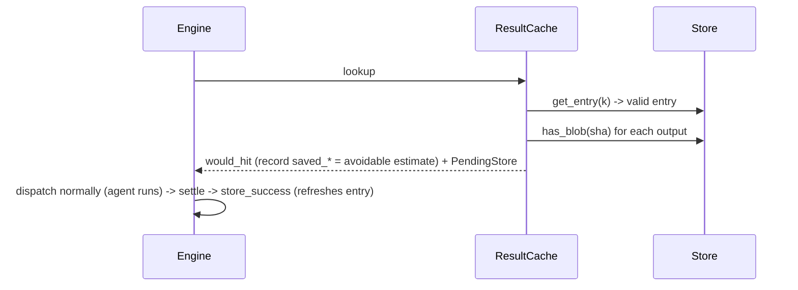
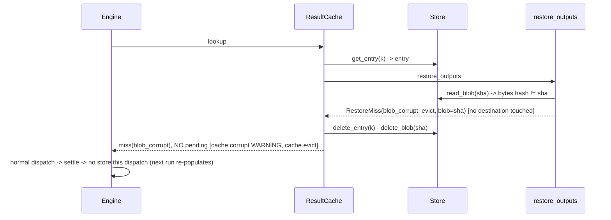
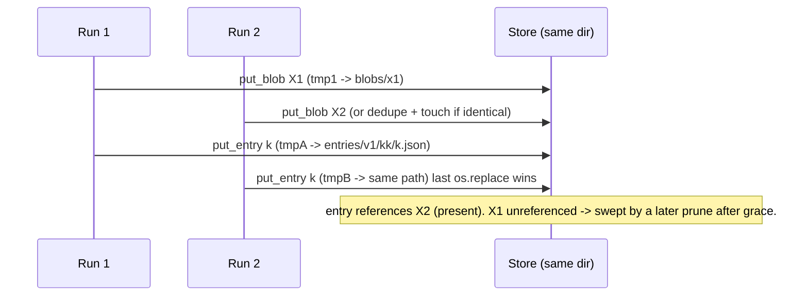

# HLD + LLD — Cross-run result cache (E-Rc4Hk8)

- **Status:** Design complete, **Rev 2**. This revision folds in the Phase-4 consultation:
  `developer`, `reviewer`, `tester`, `dev-security` and `dev-critic` all reviewed Rev 1 against the
  code at `bb6d8a0`. Their findings and how each was resolved are in §23.3–§23.4. The design is
  ready for implementation per the Execution Readiness Gate (§21). One strategic decision is
  flagged for the parent: the value gate G0 (§22.5). No code has been written for this epic yet.
- **Epic:** [`E-Rc4Hk8-cross-run-result-cache`](../meta/tickets/E-Rc4Hk8-cross-run-result-cache/EPIC.md)
- **ADR:** [`ADR-0019`](adr/ADR-0019-cross-run-result-cache.md)
- **Date:** 2026-10-04 (Rev 1) / 2026-10-05 (Rev 2) · **Author:** `architect` · **Base:** `main` @ `bb6d8a0`
- **Related:**
  - ADR-0003 / ADR-0006: settings precedence, and fill-in vs. kill switch.
  - ADR-0007: the main-thread engine core.
  - ADR-0013: isolation.
  - ADR-0015: the Claude *prompt*-cache scope. This is a different feature; see the terminology box
    below.
  - ADR-0017: RunState-level maps, and validating a sha before using it in a path.
  - E-9h3m7k: cumulative usage.
  - Sibling epics E-Ag7Pw3 (approval gates) and E-Da5Tn9 (dashboard auth). See the merge notes in
    §24.2.

> **Terminology: "result cache" vs "prompt cache".** This epic adds a **result cache**: it reuses
> the *declared output files* of a previous, identical, successful task instead of dispatching the
> agent again. It is unrelated to Anthropic **prompt caching**, which covers
> `cache_creation_input_tokens` / `cache_read_input_tokens`, `reporting.CacheEffectiveness`, the
> cache-hit rate in `ao report-timing`, and ADR-0015.
>
> Naming rules:
> - User-facing text says "result cache".
> - Python names use `result_cache` / `ResultCache`.
> - The CLI group is `ao cache`, and its help text says "result cache".
> - The `cache.*` log-event namespace belongs to the result cache.
> - Any user-facing string that could be read either way must say "result cache".

---

## 0. Summary

This epic adds a **double-opt-in, content-addressed, workspace-local result cache**. It is off by
default.

**When a task is cached.** Both of these must be true:

1. **The operator turns it on for the run.** The switch is resolved from `--cache` / `--no-cache`,
   then `AO_CACHE`, then `.ao/config.yaml cache.enabled`/`cache.mode`.
2. **The workflow author opts the task in.** This is done with `defaults.cache: true` or
   `tasks[].cache: true`. The author is the only party who can vouch that a task's entire effect is
   captured by its declared output files.

**Modes.** `on` restores hits. `shadow` only measures, and records "would hit"; it never restores.
`refresh` re-runs the task and replaces the stored entry.

**The cache key.** For each opted-in, structurally eligible plain agent task, the engine computes a
sha256 key over a canonical JSON document describing exactly what the agent would be asked to do:

- the prompt, rendered by the real `build_prompt`;
- the **exact argv** the claude executor would run (from an extracted `build_claude_argv`);
- the effective agent;
- an **executor fingerprint**: CLI version, model-relevant env vars, and `CLAUDE.md` / `.claude/**`
  / `.mcp.json` digests;
- content digests of the instruction, general instructions, inputs and dynamic inputs;
- the declared outputs, with each output's **prior** content;
- the HEAD of every git repo in the repo set.

The key is computed after the existing skip, join and missing-input checks, and **before** the
budget gate.

**On a hit** (mode `on`):

- The stored blobs are restored to spec-derived destinations. Each blob is hash-verified and staged
  before any atomic rename.
- Sensitive destinations (`.git`, `.claude`, `CLAUDE.md`, …) are never written.
- The engine marks the task `succeeded` itself, without dispatching an agent, consuming a retry, or
  charging a budget.
- Avoided spend is recorded separately from real usage.

**On a miss** the task dispatches as today. Its final settled success is stored only if three
guards pass: the key is unchanged at settle, no repo HEAD moved, and no tracked file outside the
declared outputs changed.

**Where the code lives.** All new logic is in a new package, `agent_orchestrator.cache`. Shared
files get small, additive hooks (§24.2).

**When the switch is off (the default), the engine runs and imports no cache code.** Read-side
report helpers are pure and return empty, so `status.json` and the CLI text are byte-identical.

**Key decisions.** The full log is §7.6; the ADR is ADR-0019.

| Decision | Ref |
|----------|-----|
| Double opt-in; modes `on`/`shadow`/`refresh`; `--no-cache` / `AO_CACHE=0` is a kill switch | D1, D26 |
| Key excludes the task id and includes repo HEADs | D4, D5 |
| Key includes prior output content | D6 |
| Key includes argv and an executor fingerprint | D7 |
| Fail-closed allowlist with tripwires and runtime unknown-field rules | D10 |
| Lookup before the budget gate; hit reuses `"skipped"`; engine-owned settle; `dispatch_cycle` keeps its increment | D11, D12 |
| Store at settle with three purity guards | D13 |
| Records on `RunState`, staleness derived | D14 |
| Hostile data is parsed by total functions; a cache error never kills a run | D28, D32 |
| Store ABCs are split and provisional; entries are versioned | D17, D18 |
| Restore paths come only from the current spec; sensitive paths are refused | D20, D29 |
| `ao cache rm` for single-entry invalidation | D27 |

> **Value risk, recorded rather than hidden.** `dev-critic` reviewed Rev 1 and returned a
> STRATEGIC finding: the hit rate for the primary consumer is unproven, and the fail-closed key
> components (D5, D6) narrow it further. Rev 2 responds in three ways:
> - adds `shadow` mode;
> - adds a **G0 value check** before `on` is recommended to any consumer (§22.5);
> - records the alternatives (`--reuse-from <run>`, an executor-level `CachingExecutor`) in
>   ADR-0019.

---

## 1. Requirements

### 1.1 Stated by the parent brief (binding, summarized)

| # | Statement |
|---|-----------|
| P-1 | Opt-in and default OFF. Precedence is CLI `--cache/--no-cache` > env `AO_CACHE` > `.ao/config.yaml cache.enabled`. Plus `WorkflowDefaults.cache` and per-task `cache: bool \| None`. Task beats workflow default. An explicit `cache: false` always means never. `ao run` and `ao resume` share one helper. |
| P-2 | Key = sha256 over versioned canonical JSON of: the prompt as dispatched; the effective agent (no secrets or env); the content hashes of declared inputs (directories as a manifest; a missing input makes the task uncacheable); and the sorted declared output paths. Exclude the run id, timestamps and absolute paths. Decide whether the task id is part of the key. |
| P-3 | Eligibility is a fail-closed ALLOWLIST: at least 1 output; not emit/router/loop/control; isolation resolves to none; no hooks; paths go through the artifact-store guard. Only a FINAL settled success is stored. |
| P-4 | `CacheStore` ABC + `LocalFsCacheStore`: content-addressed blobs, entry JSON, atomic writes, concurrency-safe, LRU size cap, optional TTL. The location is chosen deliberately. |
| P-5 | Restore safety: paths come only from the current spec; the manifest is compared; blobs are verified (corruption is a miss plus evict plus log); restore is atomic. |
| P-6 | Accounting: a hit is `succeeded`, costs no attempt, $0 and 0 tokens, charges no budget and feeds no breaker. Record `saved_*` without double counting against E-9h3m7k. Records live on a `RunState` map. A hit survives `ao resume`. |
| P-7 | `ao-bench` forces the cache off: `--no-cache` in argv plus `AO_CACHE=0` in env. Add a regression test. |
| P-8 | Events `cache.hit\|miss\|store\|evict\|corrupt\|skip` with a reason. `ao cache ls\|stats\|show\|prune\|clear\|verify`, each with `--json`. A run-summary line. A minimal dashboard. |
| P-9 | The lookup sits in `_prepare_and_maybe_dispatch` after `should_skip`; the store happens at `_settle_completed_task`. The parallel and isolation paths stay untouched when the cache is off, and this must be provable. |

### 1.2 Derived requirements

- **R-D1. Prompts carry paths, not contents.** A prompt contains only absolute **paths**, never file
  contents (NFR-1). The key therefore content-hashes the instruction and general-instruction files,
  and renders the prompt from a **normalized** (workspace-relative) context.
- **R-D2. Agents read ambient state.** Agents read repos and outputs that are edited in place. The
  key needs repo HEADs and prior-output content. Store time needs HEAD-moved and
  tracked-worktree-change guards.
- **R-D3. Per-task state survives resume only on `RunState`.** `prepare_resume` replaces
  `TaskRunState` wholesale (`LRN-20260928-taskrunstate-wholesale-replaced-on-resume`), so per-task
  cache state lives on a `RunState` map.
- **R-D4. The cache directory is agent-writable.**
  - Never derive a filesystem path from an entry.
  - Parse cache files with total functions.
  - Never follow symlinks inside the store (`LRN-20260928-agent-writable-launch-record-path-fallback-risk`,
    ADR-0017).
- **R-D5. Naming.** "Cache" already means prompt caching here (see the terminology box).
- **R-D6. Usage metrics.** `aggregate_usage` counts settled tasks with `dispatch_cycle >= 1` as
  dispatched, so current hits must be excluded explicitly.
- **R-D7. `status.json` is a snapshot contract.** When the cache is off, the output must stay
  byte-identical.
- **R-D8. The Claude CLI reads ambient context.** `CLAUDE.md`, `.claude/settings*.json`,
  `.claude/{agents,commands,skills}` and `.mcp.json` shape what an agent does. The primary
  consumer's workspace root is not a git repository, so repo HEADs cannot cover these files, and
  their digests belong in the key.
- **R-D9. Approval ordering.** An approval or human gate from a sibling epic must never be bypassed
  by a hit.

### 1.3 Requirement table (IDs used by tickets)

| ID | Requirement | MVP | Verification |
|----|-------------|-----|--------------|
| FR-1 | **Run-level mode.** `--cache` (on) / `--no-cache` (off) > `AO_CACHE` (`1/true/yes/on`, `0/false/no/off`, `shadow`, `refresh`; empty = unset; anything else = OFF plus a warning) > `.ao/config.yaml cache.enabled` (+ `cache.mode`) > off. One helper, `cli._build_result_cache`, serves `ao run` and `ao resume`. | ✅ | unit (resolver matrix) + e2e |
| FR-2 | **Author opt-in (double opt-in).** `policy(task)` = `task.cache` (an injected task's `true` is ignored), else `defaults.cache`, else **False**. Tasks that are not opted in get no record and no event. | ✅ | unit + integration + e2e |
| FR-3 | **Key schema v1** (§8.2): canonical JSON, GV-1 golden vector, normalization rules, task id excluded, argv and executor fingerprint included. | ✅ | unit |
| FR-4 | **Fail-closed eligibility** (§8.3): full classification of `TaskSpec`, `AgentSpec`, `WorkflowSpec` and `WorkflowDefaults`; tripwires; runtime unknown-field rules; command-basename and resolved-model rules; one reason per exclusion. | ✅ | unit |
| FR-5 | **Lookup placement and hit semantics** (§8.7). The engine settles the hit itself. | ✅ | integration |
| FR-6 | **Store only a final settled success**, guarded by: key recompute, HEAD-moved, tracked-worktree-changed. | ✅ | integration |
| FR-7 | **`CacheStore` (hot path) + `CacheAdmin` (maintenance)**, both provisional, plus `LocalFsCacheStore` (§8.4). | ✅ | unit + multiprocess race |
| FR-8 | **Restore and capture safety** (§8.5): spec-derived and re-validated destinations, sensitive-path refusal, verify-before-commit, mode masking. | ✅ | unit + adversarial |
| FR-9 | **Accounting** (§8.8): `saved_*` kept separate; hits never touch `cumulative_*`, budget counters (except reversing a stale charge) or breakers. | ✅ | integration |
| FR-10 | **Resume.** A restored task stays `succeeded`. Records stay consistent across cache-on and cache-off sessions. | ✅ | integration + e2e |
| FR-11 | **Observability:** `cache.*` events (with key-component digests on a miss); `status.json`; summary line; `report-usage`; `report-outcomes` (`settle_reason: cached`). | ✅ | unit + e2e |
| FR-12 | **`ao cache ls\|stats\|show\|prune\|clear\|verify\|rm`**, each with `--json` and exit codes (§8.9). | ✅ | e2e |
| FR-13 | **Dashboard:** a "cached" tag and a "Result cache" tile. The dashboard file browser does not serve `.orchestrator/cache`. | ✅ | pytest + vitest |
| FR-14 | **`ao-bench` forced off.** | ✅ | regression test |
| FR-15 | **Config:** `cache.{enabled,mode,max_bytes,max_entry_bytes,ttl_days,include_repo_heads,max_input_bytes,max_input_files}`, with bounds; plus the `ao init` template. | ✅ | unit |
| FR-16 | **Modes.** `shadow` records `would_hit`, never restores, and still stores. `refresh` skips the lookup, stores, and overwrites. | ✅ | integration + e2e |
| FR-17 | **Single-entry invalidation:** `ao cache rm <key\|prefix>` and `ao cache rm --run R --task T`. | ✅ | e2e |
| NFR-1 | **No-op when off** (§8.7.5). The engine executes and imports no cache code. `status.json` and CLI text are byte-identical. `state.json` gains `result_cache: {}`. The dashboard JSON gains null keys, following the `integration` precedent. The `report-usage --json` keys are omitted when zero. | ✅ | structural guards, I-1/I-2, full suite |
| NFR-2 | **`engine.py` stays content-free.** All byte I/O happens in `agent_orchestrator.cache`. | ✅ | existing static audits + review |
| NFR-3 | **Deterministic and replayable:** injected clock, canonical JSON, golden vectors. | ✅ | unit |
| NFR-4 | **Bounded work and memory:** hash caps, entry caps, size checks before reads, bounded reads, bounded inline maintenance. | ✅ | unit |
| NFR-5 | **Concurrency-safe across processes;** a same-key race is benign. | ✅ | multiprocess test |
| NFR-6 | **Backward and forward compatible:** versioned entry directory, layout file, open-set record fields. | ✅ | unit |
| NFR-7 | **No magic literals** (`cache/constants.py`). | ✅ | review |
| NFR-8 | **Small, additive shared-file edits.** `engine.py` gains at most 80 formatted lines, and at most 8 of them go inside existing functions (§24.2). | ✅ | review (diff stat) |
| NFR-9 | **Coverage** of at least 85% for `agent_orchestrator.cache`. | ✅ | CI / T-JCOAsq |
| NFR-10 | **Threat-model mitigations** M-1…M-16 (§7.7). | ✅ | gates G1a, G1b, G2 |
| NFR-11 | **Hostile data never raises:** every cache-file parser is total; any failure is a miss or a skip. The engine-facing API never raises cache errors; an unexpected bug disables the cache for the rest of the run (D32). | ✅ | hostile-entry corpus test |

---

## 2. Scope

### 2.1 In scope (MVP)

**New package `src/agent_orchestrator/cache/`.** It contains:

- `constants`, `safeio`, `types` (contracts), `settings`;
- `hashing`, `repo_state`, `fingerprint`, `keys`;
- `eligibility`, `store`, `restore`;
- `records`, `coordinator`, `report`;
- `cli` (the `ao cache` sub-app).

**Additive shared-file hooks:**

| File | Change |
|------|--------|
| `models.py` | spec fields, `ResultCacheRecord`, `RunState.result_cache`, predicate |
| `specs/workflow.schema.json` | schema entries for the new spec fields |
| `project_config.py` | `CacheConfig` |
| `engine.py` | two private methods plus two call sites |
| `executors/claude_cli.py` | behaviour-identical extraction of `build_claude_argv` |
| `cli.py` | flags, helper, summary lines, sub-app, `report-usage` line |
| `runstate.py` | `write_status` |
| `usage.py` | exclude current hits; add totals |
| `outcomes.py` | `settle_reason: "cached"` |
| `ui/runs.py`, `ui/files.py` | `ui/files.py` denies the cache dir |
| `ui/src/types.ts`, `RunDetail.tsx` | frontend types and display |
| `bench/subjects.py` | force the cache off |

**Tests:**

- unit, integration, e2e and adversarial tests, plus a hostile-entry corpus;
- tripwires;
- an AST guard;
- a no-op proof.

**Docs:**

- this HLD and ADR-0019;
- a "Result cache" section in the workflow-authoring skill;
- the docs-refresh ticket;
- the G0 value-check report.

### 2.2 Out of scope (explicit)

- Any change to `should_skip`, `prepare_resume`, the wave scheduler, isolation/integration, budget
  or breaker logic. The one exception is a single call to the existing
  `BudgetManager.reverse_estimate` on a hit (D12).
- Any change to executor *behaviour*. The `build_claude_argv` extraction is behaviour-identical,
  and a golden argv test proves it.
- Making agents deterministic.
- Caching Python values or transcripts.

### 2.3 Non-MVP (recorded, not designed as deliverables)

1. Remote, shared or S3 backends. The ABCs are **provisional** (§7.5).
2. HMAC-authenticated entries. The key would live under `isolation.paths.state_dir()`, and entries
   are already canonical bytes.
3. An executor-level `CachingExecutor` design that works inside isolation worktrees and with hooks
   (ADR-0019 alternative ALT-7).
4. An explicit `ao run --reuse-from <run-id>`, where the operator vouches for a source run
   (ADR-0019 alternative ALT-8).
5. Caching with isolation, with integration active, or with hooks; directory outputs; dynamic
   outputs.
6. Dependency-aware invalidation (for example, a FAIL verdict evicting its producers' keys), cache
   warming, cost-aware eviction, and cross-workspace sharing.
7. Recording the resolved model id from the transcript.
8. User-level (`~/.claude/**`) context fingerprinting.
9. `dir_fd`-walk (openat-style) store and restore I/O, which would close active-race TOCTOU windows
   (§7.7 residual).
10. Memoizing hashes within a run, and reusing a lookup across budget re-gating passes.
11. An `ao validate` warning; `ao cache explain`; dashboard launch controls; a runs-list column;
    surfacing on the Usage tab.
12. Per-entry hit counters.
13. Fixing the pre-existing missing-inputs branch that resets `dispatch_cycle` (engine.py ~1174):
    recommended as a separate bug ticket (§23.2).

---

## 3. Assumption log

| ID | Assumption | Risk if wrong | Mitigation |
|----|-----------|---------------|------------|
| A-1 | **Double opt-in** (operator gate + author opt-in) is acceptable to the parent. Manager proposal A had the author layer defaulting to *allowed*. Reviewer MUST-FIX R1 changes the default to *not opted in* (D1). | Friction: users must also edit workflows. | The banner reports the opted-in count, the authoring guide explains the step, and templates can opt in their pure tasks. |
| A-2 | `include_repo_heads` defaults to `true`. The HEAD-moved store guard is always active. | Low hit rate in repos where commits are frequent. | Operator opt-out. G0 measures the effect. |
| A-3 | Default limits: `max_bytes` 1 GiB; `max_entry_bytes` 64 MiB (clamped to `max_bytes` when unset); `ttl_days` 30; `max_input_bytes` 512 MiB; `max_input_files` 20 000. | Limits too small or too large. | Bounded config knobs. |
| A-4 | Target platform is POSIX/Linux first. | Weaker symlink and FIFO defences on Windows. | `getattr(os, flag, 0)`. Windows is documented as best-effort. |
| A-5 | An opted-in task's effect is fully captured by its declared outputs. The author vouches; the guards spot-check. | A stale or partial replay. | The tracked-worktree guard, the authoring guide, and per-task `cache: false`. |
| A-6 | Model aliases and the CLI version are acceptable key material. | A retargeted alias gives a stale hit. | The CLI version is in the key; the TTL defaults to 30 days; the guide recommends pinned ids. |
| A-7 | E-Ag7Pw3 adds a `TaskSpec` or `WorkflowSpec` field, or a kind. | An approval inferred from an existing value would bypass the allowlist. | Runtime unknown-field rules for both specs, plus the merge checklist (§24.2). |
| A-8 | A display-only dashboard is acceptable. | Users want a launch toggle. | Non-MVP item 11. |
| A-9 | The env allowlist in `fingerprint.CLAUDE_FINGERPRINT_ENV_VARS` names the behaviour-relevant, **non-secret** Claude CLI variables. **TODO (T-uoYW6b):** check the list against the installed CLI's documented env vars. | An unlisted variable causes a stale hit. | The list is easy to extend. Secrets (`*_API_KEY`, auth tokens) are never included. |
| A-10 | `claude --version` is cheap: memoized once per process per binary, with a 10 s timeout. | Auto-updates churn the key, which costs misses but is safe. | Documented, and visible in G0. |
| A-11 | G0 can observe real runs in shadow mode at **no extra spend**: shadow only hashes and stores, it never changes dispatch. | No representative workload is available. | Use this repo's self-dev workflows. Finplan is opportunistic. |

---

## 4. Standards survey

| Area | Standard or practice | Applied as |
|------|--------------------|-----------|
| Architecture docs | C4; ADRs (MADR-style) | §7.1–§7.3; ADR-0019 |
| Data contracts | JSON Schema 2020-12 | §13 |
| Content-addressed storage | git object layout; Bazel CAS; DVC cache | `blobs/<sha[:2]>/<sha>`, `entries/v1/<k[:2]>/<k>.json` |
| Cache-dir hygiene | Cache Directory Tagging Spec (`CACHEDIR.TAG`); self-ignoring dirs | `CACHEDIR.TAG` + `.gitignore` containing `*` |
| Atomic writes | POSIX `rename(2)`; temp file in the same directory | temp file + `os.replace` |
| Secure file handling | CWE-22, -59, -367, -400, -248, -674, -150, -94/-73 | spec-derived paths; `O_NOFOLLOW`; component checks; `O_EXCL`; `S_ISREG`; caps; total parsers; control-character stripping; sensitive-path refusal |
| Hashing | SHA-256 (FIPS 180-4) | keys, blobs, digests |
| Key derivation | Bazel action key (argv + inputs + env); Turborepo hash; Gradle relative paths | normalized paths; hashed argv; env allowlist; content digests |
| Config precedence | ADR-0003/0006 | FR-1; the kill switch works like `--no-isolation` |
| Observability | structured JSON log events | §15 |
| Testing | test pyramid; fixed clocks; golden vectors; hostile corpus | §18 |

---

## 5. Solution landscape (build vs buy vs hybrid)

| Option | What | Verdict |
|--------|------|---------|
| B-1 `diskcache` | SQLite KV store with LRU | **Rejected.** It adds a dependency and stores values in its own DB. Restore-to-spec, verification and key derivation would still have to be built, and it does not dedupe content. |
| B-2 `joblib.Memory` / `cachetools` | Function memoization | **Rejected.** It **pickles** values, and unpickling from an agent-writable directory is code execution. It also has no file-restore semantics. |
| B-3 Embed DVC run-cache or Bazel REAPI | Artifact caches | **Rejected.** These are heavy dependencies that assume a VCS or a daemon, and their keys are command lines rather than agent contracts. |
| B-4 **Build a small CAS on the standard library** | ~1.5k LOC + tests | **Chosen.** It borrows the DVC, Bazel and Turborepo conventions, adds zero runtime dependencies, and gives exact control over the safety properties. |
| B-5 **Explicit reuse** (`ao run --reuse-from <run>`; dev-critic) | The operator names a trusted source run and outputs are copied from it | **Recorded as ADR-0019 alternative ALT-8.** It needs no hidden store and no key contract, but it is not what the brief asks for. It is the fallback if G0 shows a negligible would-hit rate. |

---

## 6. Orchestration landscape and competitor analysis

### 6.1 Comparison matrix (result reuse / memoization)

| Tool | Spec model | Reuse mechanism | Key | What is restored | Expiry / eviction | Concurrency | Known complaints |
|------|-----------|-----------------|-----|------------------|-------------------|-------------|------------------|
| **Airflow** | Python DAGs | None built in. Idempotency is the user's job; `ShortCircuitOperator`; Datasets/Assets | n/a | n/a | n/a | n/a | Re-running re-runs everything unless the user writes skip logic |
| **Prefect** | Python flows/tasks | `cache_policy` (INPUTS, TASK_SOURCE, …), `cache_key_fn`, `cache_expiration`, `refresh_cache` | inputs + task source | Persisted (serialized) Python result | Per-task expiration | Isolation levels / locks (3.x) | Unhashable inputs; hidden dependencies; needs result storage configured; deserializes persisted results |
| **Dagster** | Python assets | Data/code versions + staleness; legacy memoization is deprecated | `code_version` + upstream data versions | Nothing (skip or advise) | n/a | n/a | Heavy versioning model; staleness is advisory |
| **Temporal** | Code | Event-history replay within one execution | n/a | Activity results within the same execution | History retention | Durable | No cross-execution reuse |
| **Argo Workflows** | YAML/K8s | Template `memoize` | **user-written** key | Output parameters (ConfigMap) | `maxAge` | Per ConfigMap | Manual keys; size limits; stale results if the key misses an input |
| **Luigi** | Python | `complete()` = targets exist | existence | Nothing (skip) | n/a | n/a | Stale outputs are never re-run; ao's `skip_if_outputs_exist` has the same shape |
| **Step Functions** | ASL JSON | None (redrive) | n/a | n/a | n/a | n/a | DIY caching |
| **GitHub Actions** | YAML | `actions/cache` | **user-written** key + `hashFiles()` | Directories | 7-day unused eviction; size cap | Branch-scoped | Manual keys → stale or poisoned caches |
| **n8n** | Visual JSON | Pinned data (dev only) | n/a | Node output | n/a | n/a | Not for production |
| **Windmill** | Scripts/flows | `cache_ttl` | script hash + args | Result value | TTL | Server-side | Results only, not files |
| *Adjacent:* **Turborepo / Nx** | JSON graph | Local + remote cache; `--force` | declared inputs + env + deps | Declared outputs + logs | Size/age; optional HMAC signing | Content-addressed | Undeclared env → incorrect hits |
| *Adjacent:* **Bazel** | Starlark | Action cache + CAS | command + inputs + env digest | Declared outputs | LRU / remote | Hermetic sandbox | Steep learning curve |
| *Adjacent:* **DVC** | YAML stages | `dvc.lock` + run-cache | md5(deps/outs) + cmd | Declared outs | `dvc gc` | Content-addressed | Large-data hashing; cache growth |

### 6.2 Gap analysis

**What others do well:**

- content-addressed output reuse (Turborepo, Bazel, DVC);
- explicit expiry (Prefect, Argo, Windmill);
- forced refresh (Turborepo `--force`, Prefect `refresh_cache`);
- signed remote caches (Turborepo).

**Where they fall short for LLM-agent DAGs:**

1. Keys written by users omit inputs.
2. Value caches deserialize payloads.
3. Build tools assume hermetic, deterministic steps; agents read ambient context (repos, `CLAUDE.md`) and are non-deterministic.
4. Nobody separates avoided LLM spend from real spend.
5. Nobody offers a measure-before-trust mode.

**Known complaints that apply to us:** stale hits from undeclared inputs and env; poisoned shared caches; surprising semantics when caching is on by default; no way to re-roll a bad cached result.

### 6.3 Differentiation and positioning

```
We will:
- Match DVC / Turborepo in content-addressed input→output caching with exact, hash-verified
  restore of declared output files, plus a refresh (re-roll) mode like Turborepo --force.
- Beat Argo Workflows / GitHub Actions in key ergonomics: no hand-written keys — the key is
  derived from the task's declared contract, the exact executor argv, and the agent's ambient
  context files (CLAUDE.md / .claude/**), with repo HEADs and prior output content.
- Beat Prefect in payload safety: we restore bytes to spec-derived, non-sensitive paths; nothing
  is ever deserialized or executed from the cache directory.
- Beat all of them on trust-building: a shadow mode measures would-hit rates and avoidable spend
  before anyone lets a cached result stand in for an agent run.
- Avoid the complexity of Bazel (hermetic sandboxes, remote CAS/RBE) and Dagster (versioned
  asset staleness) — one local directory, double opt-in, provisional ABC seams.
```

Each positioning point maps to design decisions. The design follows from three facts about agents,
plus a guard against feature creep:

- **Agents are non-deterministic.** Hence double opt-in, the kill switch, shadow mode before `on`,
  and `refresh`/`rm` for re-rolling (D1, D26, D27).
- **Agents read ambient state.** Hence repo HEADs, prior outputs, the CLI fingerprint, and the
  worktree guard (D5–D7, D13).
- **The store is agent-writable.** Hence spec-derived destinations, sensitive-path refusal, total
  parsers, and verification of every byte (D17, D20, D28, D29).
- **Feature-creep guard.** Each new key component must name the stale-hit class it prevents, and
  remote, HMAC, dependency-invalidation and explain features stay non-MVP.

---
## 7. High-level design

### 7.1 Context (C4 level 1)



### 7.2 Containers and change set (C4 level 2)

| Container | Change | Notes |
|-----------|--------|-------|
| `agent_orchestrator.cache` (NEW) | All logic | §8.0 modules and owners |
| `models.py` | +~55 lines, additive | `TaskSpec.cache` and `WorkflowDefaults.cache` (both `StrictBool \| None`); `ResultCacheRecord` + outcome constants; `RunState.result_cache`; `is_current_result_cache_record()` |
| `specs/workflow.schema.json` | +2 properties | `defaults.cache`, `task.cache` (`boolean`) |
| `project_config.py` | +~45 lines | `CacheConfig` (bounded), `ProjectConfig.cache`, `_INIT_TEMPLATE` block |
| `engine.py` | ≤ 80 formatted lines; ≤ 8 lines inside existing functions | ctor kwarg; `_RunContext` field; `_result_cache_lookup()` + `_result_cache_store()` private methods; one call site in prepare, one in settle |
| `executors/claude_cli.py` | refactor, behaviour-identical | extract pure `build_claude_argv(agent, prompt) -> list[str]`; `execute()` calls it |
| `cli.py` | ~+70 lines | `--cache/--no-cache` on run/resume; `_build_result_cache`; `add_typer(cache_app)`; summary lines; `report-usage` line |
| `runstate.py` | +~4 lines | `write_status` merges `cache.report.result_cache_status_fields(state)` |
| `usage.py` | +~15 lines | excludes current hits from groups; `UsageReport.result_cache_hits/_saved_cost_usd`; payload omits them when zero |
| `outcomes.py` | +~4 lines | `_settle_reason` returns `"cached"` for a current hit |
| `ui/runs.py` | +~12 lines | `TaskStat.result_cache`, `RunDetail.result_cache` (nullable) |
| `ui/files.py` | +~6 lines | the browser refuses paths under `<root>/.orchestrator/cache` |
| `ui/src/types.ts`, `RunDetail.tsx` | +~30 lines | types, "cached" tag, "Result cache" tile; bundle rebuilt |
| `bench/subjects.py` | +3 lines | `--no-cache` + `AO_CACHE=0` |

### 7.3 Component breakdown



**Layering rules.**

- `cache/*` may import `models`, `artifacts`, `executors.prompt`, `executors.claude_cli`
  (`build_claude_argv` only), `isolation.git`, `usage.verdict_path_for`,
  `feedback.validate_run_id` (from `cli.py` only), and `agent_orchestrator.__version__`.
- `cache/*` must **never** import `engine`, `runstate`, `cli` or `ui`.
- `models.py` imports nothing from `cache/`.
- `project_config.py` imports only `cache/constants.py`, which is a leaf module.
- `cache/__init__.py` holds only a docstring.
- `engine.py` imports cache modules **only** under `TYPE_CHECKING`, or lazily inside its two
  private cache methods. This is what makes the off path import-free (§8.7.5).

### 7.4 Integration points

| Seam | Where | Direction |
|------|-------|-----------|
| Run-level mode | `cli._build_result_cache(cache_flag, workspace, wf)` → `Orchestrator(result_cache=...)` | CLI → engine |
| Lookup | `Orchestrator._prepare_and_maybe_dispatch` → `self._result_cache_lookup(...)` | engine → `ResultCacheHook.lookup` |
| Store | `Orchestrator._settle_completed_task` (`succeeded` branch) → `self._result_cache_store(...)` | engine → `ResultCacheHook.store_success` |
| Argv | `keys.build_cache_key` → `executors.claude_cli.build_claude_argv` | cache → executor (pure function) |
| Persistence | `RunState.result_cache[tid]`, written by the engine on the main thread | engine |
| Snapshot | `RunStateStore.write_status` → `cache.report.result_cache_status_fields` | runstate → cache |
| Summary | `cli._print_state` / `_print_status_snapshot` → `cache.report.format_summary_line` | CLI → cache |
| Usage | `usage.aggregate_usage` → `cache.report.current_hit`, `usage_counts` | usage → cache |
| Outcomes | `outcomes._settle_reason` → `cache.report.current_hit` | outcomes → cache |
| Dashboard | `ui.runs.RunRepository.detail` → `cache.report.task_view` / `run_block`; `ui.files` deny-list | ui → cache |
| Bench | `bench.subjects.AoWorkflowSubject.run` argv/env | bench → CLI |
| Management | `ao cache …` → `LocalFsCacheStore` (`CacheStore` + `CacheAdmin`) | CLI → store |

### 7.5 Plugin and extension strategy

- **Core (opinionated).** These are not configurable. They change only through
  `KEY_SCHEMA_VERSION`, the entry-directory version, or an ADR addendum.
  - the key document and its canonicalization;
  - the eligibility allowlist;
  - the restore protocol and sensitive-path refusal;
  - the accounting semantics.
- **Edges (extensible).**
  - **Engine seam.** `ResultCacheHook` is a Protocol with two methods that return value objects.
    The engine depends on the Protocol, not on `ResultCache`, which mirrors the
    `BudgetManager`/`Monitor` injection pattern. Tests inject fakes.
  - **Storage — PROVISIONAL.**
    - The interfaces are `CacheStore` (hot path: entries, blobs, touch, delete, `has_blob`,
      `maybe_enforce_limits`) and `CacheAdmin` (iteration, stats, prune, clear, verify).
    - Their **signatures are provisional for MVP** and are expected to change for a remote backend:
      a blob store with `missing(shas)`, `put(sha, size, src)` and `get(sha)`; an entry store; and
      optional admin.
    - Entries are already written as canonical JSON bytes, so a future signature covers stable
      bytes.
    - Remote backends need per-tenant namespacing and HMAC first (non-MVP 1–2).
  - **Executors.** `CACHEABLE_EXECUTORS` and `CACHEABLE_COMMAND_BASENAMES` are allowlists. Each
    cacheable executor must provide two things:
    - an argv builder (claude_cli: `build_claude_argv`; fake: none);
    - a fingerprint function (`fingerprint.py`).

    A new executor stays ineligible until both are reviewed.
  - **New task kinds or fields.** Tripwire tests U-E1, U-E2 and U-K8, plus the runtime
    unknown-field rules (§8.3).

### 7.6 Decision log

Each decision lists its alternatives and, in the last column, its link to manager proposals A–K or
to the Phase-4 findings in §23.4.

| ID | Decision | Alternatives | Rationale | Source |
|----|----------|--------------|-----------|--------|
| D1 | **Double opt-in; operator mode gate; author policy.** `mode` = CLI (`--cache`→on, `--no-cache`→off) > `AO_CACHE` (on/off/shadow/refresh; anything unknown → off + warning) > config (`cache.enabled: true` + `cache.mode`) > off. `policy(task)` = `task.cache` (an injected `true` is ignored) → `defaults.cache` → **False**. Effective = mode ≠ off AND policy AND eligible. Tasks that are not opted in get no record and no event. | (a) Fill-in semantics like `--isolation`. (b) Spec-only opt-in. (c) Default on. (d) Rev 1's operator-only gate with the author default *allowed*. | Only the author can vouch that a task's whole effect is captured by its declared outputs (reviewer R1). Only the operator can decide that freezing one non-deterministic result is acceptable. Both must agree. `--no-cache` / `AO_CACHE=0` stay true kill switches, which keeps the bench force-off robust. | A (refined), Rev2: reviewer R1 |
| D2 | **Location `<ws>/.orchestrator/cache/`.** It is self-ignoring, holds `CACHEDIR.TAG` and `layout.json`, and is created with mode `0o700`. The root must not be a symlink, must be owned by the effective uid, must have no group/other write (`0o700` is restored if we own it), and must resolve inside the workspace. These checks run per operation. | `.ao/cache/` (committed config dir); XDG cache (cross-workspace, non-MVP); the run dir (not cross-run). | `.orchestrator/` is already engine-managed state: it is in `RESERVED_SHARED_PREFIXES`, discovery skips it, and isolated runs exclude it via `info/exclude`. Self-ignoring prevents committed blobs. | F + security S4 |
| D3 | **Key = sha256(canonical JSON v1)** over `{key_schema, agent, argv, executor_fingerprint, prompt, instruction, general_instructions, inputs, dynamic_inputs, outputs, repo_heads}` (§8.2). | Hash the raw dispatched prompt (absolute paths, no contents). | Covers everything the agent is told, location-independently, by content. | C |
| D4 | **The task id is NOT in the key**, and neither are the workflow id, run id, agent registry name, timeout or retries. | Include the task id. | Neither the prompt nor the argv contains it; tripwires U-K7 and U-K8a prove this. Outputs are in the key, so sharing requires identical declared files. The benefit is limited to renamed tasks and to two workflows producing the same files. **Correction (dev-critic):** built-in templates render `{{ instance_dir }}` into prompt and output paths, so **cross-instance hits do not happen** with them. The Rev 1 claim to the contrary was wrong. | decided; Rev2: critic #1 |
| D5 | **`repo_heads` in the key by default** (`{repo_id: sha \| "unborn"}`). Non-git repos are omitted. Git-ness is decided from the filesystem (a `.git` entry found walking up to the workspace root), not by a probe that hides failures. For a git repo, any failure (`GitError`/`OSError`/`RuntimeError`, short timeout) → uncacheable. `include_repo_heads: false` drops the field, but the **HEAD-moved store guard stays active**. | Omit; always on with no opt-out. | Every prompt names the repos, so committed state is an undeclared input. `GitRepo.probe()` returns None both for "not a repo" and for failures, and a transient failure must not silently drop HEAD (reviewer R8). | D(i); Rev2: reviewer R1/R8, developer #1 |
| D6 | **The prior content of each declared output is in the key** (`outputs: [{path, prior}]`). The settle-time recompute reuses the lookup-time priors (preseed). | Paths only. | Without it, in-place-update tasks get stale hits that **overwrite newer edits**. With `skip_if_outputs_exist: true`, priors are always `"absent"`. | new (Rev 1) |
| D7 | **The exact argv and an executor fingerprint are in the key.** argv = `build_claude_argv(effective_agent, normalized_prompt)`, a behaviour-identical extraction from `ClaudeCliExecutor.execute`; it is `null` for `fake`. The fingerprint (claude_cli) is `{cli_version, env, context_files}`: `claude --version` (memoized per process per binary; failure → uncacheable), an allowlist of behaviour-relevant **non-secret** env vars, and digests or absence markers for `CLAUDE.md`, `CLAUDE.local.md`, `.mcp.json`, `.claude/settings*.json` and `.claude/{agents,commands,skills}` at the workspace root and on the path down to the agent cwd. | Rev 1 relied on a "bump `KEY_SCHEMA_VERSION`" convention; omit ambient files. | A missed version bump is a silently wrong success; an extra bump is just a miss. Hashing the real argv makes `EFFORT_MAX_TURNS` changes and flag-injection changes invalidate automatically. Context files steer every agent, and the primary consumer's root is not a git repo. | Rev2: critic #4, reviewer R7 |
| D8 | **Directory digest** = canonical JSON of `[["D", rel] \| ["F", rel, size, sha]]`, sorted by `os.fsencode(rel)`. A symlink or special file inside → uncacheable. `.git` entries, `<ws>/.orchestrator` and the task's own declared outputs are skipped. | Follow symlinks; hash `.git`. | Fail-closed, stable, no false impurity. | refines P-2 |
| D9 | **NFR-1 carve-out.** Only `agent_orchestrator.cache` reads artifact bytes. `engine.py` and the `ArtifactStore` ABC stay content-free. | Add reads to `ArtifactStore`. | Keeps the engine invariant and its static audits intact. | C |
| D10 | **Allowlist eligibility (§8.3).** Every field of `TaskSpec`, `AgentSpec`, `WorkflowSpec` and `WorkflowDefaults` is classified, and tripwires fail on unclassified fields. **Runtime unknown-field rules** apply to `type(task).model_fields`, `WorkflowSpec` and `WorkflowDefaults`. Further rules: `executor` ∈ {claude_cli, fake}; `command_template[0]` basename ∈ {claude} for claude_cli; the effective `model` must be resolved for claude_cli; integration must not be active; any verdict sidecar must be a declared output; the task must not be a verdict breaker's source. Control-file and sensitive outputs are checked on **resolved** paths during key build. | Denylist; lexical control-path checks. | A future kind or field is non-cacheable by default. A label (`executor: claude_cli`) is not proof that `claude` is the binary. An unresolved model (CLI default) cannot be keyed. | E; Rev2: critic #8c, reviewer R7b/R11, developer #7 |
| D11 | **Lookup placement.** After `should_skip`, the isolation resolution, `_apply_join`, the missing-inputs check and dynamic-input collection; **before** the budget gate. Implemented as `if self._result_cache is not None and self._result_cache_lookup(...): return DispatchPrep(signal="skipped")`. The cache contracts are imported lazily inside the method. | A new `"cached"` signal; lookup before `should_skip`. | Reuses the `skipped` handling of the fill loop. Barriers, `_ready_ids` and the wave scheduler are unchanged (verified by the reviewer). | B |
| D12 | **Hit bookkeeping is owned by the engine** (in `_result_cache_lookup`). `status="succeeded"`, `outputs_present=True`. **`dispatch_cycle` keeps its increment**, so R-21 stays monotonic and `ui/activity.locate_attempt_dirs` finds no transcript for a hit instead of a stale one. `attempts` is unchanged. `started_at` is set if unset, and `ended_at` is set. A `task.end` event is logged with `cached: true`. **A stale charged estimate of the previous cycle is reversed** when a budget manager is present (crash→resume→hit). `cumulative_*`, breakers and the quota timer are untouched. `usage.aggregate_usage` explicitly skips current hits; `outcomes._settle_reason` returns `"cached"`. | Rev 1: the decrement plus mutations in `cache.records`; `attempts=0`. | The reviewer and the critic showed that the decrement breaks R-21 and makes the dashboard show a failed attempt's transcript for a hit. State transitions belong to the engine, as with the ABC-injection pattern (reviewer R5). The budget leak was reviewer R3 / developer #14. | B/H; Rev2: reviewer R3/R4/R5/R6, critic #8a/#8b |
| D13 | **Store at settle with three purity guards.** The store runs on the main thread at the top of the `succeeded` branch, via `_result_cache_store`. The pending token lives on `_RunContext.result_cache_pending`, is popped at every prepare, and is set only for a storable miss. The guards are: (1) the key recomputed with preseeded priors must equal the lookup key; (2) no repo HEAD moved between lookup and settle (independent of `include_repo_heads`); (3) **no tracked file outside the declared outputs changed** (`git status --untracked-files=no` set + mtime/size at lookup vs settle, `.orchestrator` excluded). `restore_failed`, `store_unavailable` and `cache_disabled` misses are not storable. | Store on the worker; ad-hoc checks. | One mechanism per impurity class. Guard (3) spot-checks the author's opt-in claim for the most common violation: editing tracked files without committing (reviewer R1). | B, D(ii); Rev2: reviewer R1, developer #11 |
| D14 | **`RunState.result_cache: dict[str, ResultCacheRecord]`** (default `{}`). A record is *current* iff `rec.dispatch_cycle == ts.dispatch_cycle`, and, for `hit`, also `ts.status == "succeeded"` and `rec.ended_at == ts.ended_at` (binding). `outcome`, `mode` and `mode_source` are open-set strings. `reason` is a closed vocabulary; `reason_detail` carries the variable part. | Rev 1 used cycle equality only, and the engine dropped records. | Staleness is derived, so no engine code runs in cache-off sessions. The `ended_at` binding survives the pre-existing `dispatch_cycle` reset in the missing-inputs branch (reviewer R4). | H; Rev2: reviewer R4, critic #9 |
| D15 | **Report surfaces are additive.** `status.json` keys and the CLI summary line are omitted when the run has no current records. `report-usage --json` omits its two keys when zero. Dashboard payloads gain null keys, following the `integration: null` precedent. | Always emit keys. | Byte-identical `status.json` and CLI text when off (R-D7). | H; Rev2: reviewer R10 |
| D16 | **`saved_*` is an estimate**: the source entry's cumulative usage, including the source run's retries. It is labelled "est.", never netted into cost, and never fed to breakers. | Net savings out of cost. | Keeps E-9h3m7k's real-spend numbers exact. | H |
| D17 | **Store trust boundary.** The store receives only its own namespace. The one exception is `LocalFsCacheStore.for_workspace(ws, ...)`, which computes and validates its root. The ABCs are split into `CacheStore` (hot path) and `CacheAdmin` (maintenance), both **provisional**. Callers verify every byte. | A single 14-method ABC that takes `check_root(workspace)`. | Interface segregation. A remote backend need not implement admin operations. Matches D17's own rule (reviewer R9). | Rev2: reviewer R9, critic #6 |
| D18 | **Layout**: `entries/v1/<k[:2]>/<k>.json` (major version in the path), shared `blobs/<s[:2]>/<s>`, `tmp/`. Entries are canonical JSON bytes. Blobs are written before the entry, via tmp + `os.replace` with unique names; dedupe touches the blob's mtime. **Never overwrite or delete entries in another version directory.** The sweep's mark phase collects every 64-hex token from **every** entry file under `entries/**`, so blobs that newer versions reference are protected. | A single entries dir; overwrite of unparseable entries. | Stable and beta installs run side by side, and the service auto-resumes runs (critic #5). | G; Rev2: critic #5 |
| D19 | **Eviction.** LRU by entry mtime (touched on hit) down to 90% of `max_bytes`. TTL measured from `created_at`. Mark-and-sweep of blobs with a 1 h grace period. **Inline enforcement is bounded**: it streams entries, and if more than `INLINE_PRUNE_MAX_ENTRIES` exist it defers to `ao cache prune` with a WARNING. `clear` creates its trash dir first and verifies the removal. | Full prune inline; unbounded lists. | A planted or huge cache must not stall the scheduler thread (security S7). The Rev 1 `clear` silently did nothing (security S5). | G; Rev2: security S5/S7 |
| D20 | **Restore.** Every output is staged first: a temp file in the destination's directory (`O_EXCL\|O_NOFOLLOW\|O_CLOEXEC`, `0o600`), with size and sha verified. Each destination is re-validated (`realpath(dest) == dest`, inside the workspace, not sensitive). Missing parent directories are created component by component, refusing symlinks. Then `chmod(mode & 0o755)` and `os.replace`. Any failure → temps removed → miss (evict and delete the blob if corrupt). | Direct writes; exact modes. | Partial writes are never accepted, and no special or writable-by-others bits come from an agent-writable store. | G; Rev2: security S4 |
| D21 | **Entry metadata.** Only a non-sensitive key *summary* is stored; never the argv, the prompt template, `extra_args` or the key document. Every string and list in an entry is length-bounded. | Store the key document. | Secrets in argv. The key is one-way. | new |
| D22 | **Naming.** "Result cache", `ao cache`, `--cache`, `AO_CACHE`, `cache:`, `ResultCache`, `RunState.result_cache`, `cache.*` events. The factory is `ResultCache.from_settings`. The text `open(` and `.read(` never appear anywhere in `engine.py`, comments included, because the static NFR-1 audits regex the raw text. | `--result-cache` flags. | The parent fixed the flag names. The audits are regex-based (developer #4). | J; Rev2: developer #4 |
| D23 | **Bench forced off** via argv `--no-cache` plus env `AO_CACHE=0`. | One of the two. | Belt and braces. | P-7 |
| D24 | **Approval gates (E-Ag7Pw3).** The allowlist and the runtime unknown-field rules (task and workflow) reject new fields until they are classified as RULED. The seam comment and the merge checklist require **any approval or human gate to run before the lookup**, and G2 verifies this. | — | A hit must never bypass approval (security S6). | coordination; Rev2: security S6 |
| D25 | **Runs with `integration.active` are ineligible.** | Allow non-isolated tasks in mixed runs. | The checkout HEAD moves at barriers. **Recorded tension:** if isolation becomes the default (roadmap §3.4), the eligible set shrinks. The executor-level alternative (ADR-0019 ALT-7) is the migration path. | new; Rev2: critic #7 |
| D26 | **Modes.** `shadow`: full lookup, but no restore. A valid entry whose blobs are present records `would_hit` (with the `saved_*` estimate) and emits `cache.would_hit`. The task dispatches normally and still stores. `refresh`: no `get_entry`; records `miss` with reason `refresh`; stores and overwrites (the "re-roll"). | Ship `on` only. | Measure before trusting (critic STRATEGIC #1). Re-roll and replace a bad entry (critic #2). | Rev2: critic #1/#2 |
| D27 | **`ao cache rm <key\|prefix>` / `rm --run R --task T`.** The run form validates the run id, loads `state.json` through `RunStateStore`, and validates the record key against the regex before building any path. | Clear everything; wait for the TTL. | Single-entry invalidation (critic MUST #2). | Rev2: critic #2 |
| D28 | **Hostile data is parsed by total functions.** One parse boundary (`types.parse_entry_bytes`) maps *any* failure (including `RecursionError` and `UnicodeDecodeError`) to `CacheIntegrityError`. Models use `AwareDatetime`, finite and bounded numbers (`allow_inf_nan=False`, `le=`), and `max_length` on every string and list. All internal cache-file reads go through `safeio` (`O_NOFOLLOW\|O_NONBLOCK\|O_CLOEXEC` + `S_ISREG`). | `except ValueError` only. | Verified exploits: nested JSON → `RecursionError`; naive datetimes → `TypeError`; `inf` → an unreadable `state.json`; a FIFO at an entry path → a hang (security S1, reviewer R2, developer #6). | Rev2: security S1 |
| D29 | **Sensitive destinations are refused.** An output whose resolved workspace-relative path has a component in `{.git, .claude, .github, .gitlab, .husky, .ao, .orchestrator}`, or a basename in `{CLAUDE.md, CLAUDE.local.md, AGENTS.md, .mcp.json, .envrc}`, makes the task uncacheable (`sensitive_output`). `restore_outputs` re-checks this. | Rely on spec-derived paths only. | An in-workspace symlink `out/a.md → .git/hooks/pre-commit` turns a restore into code execution. A restored `CLAUDE.md` steers the next agent (security S3). | Rev2: security S3 |
| D30 | **Miss diagnostics.** `cache.miss` carries `components` (the first 12 hex characters of the sha256 of each top-level key-document field), so an operator can diff two runs and see which component changed. | Opaque misses. | Diagnosability (reviewer NIT). | Rev2 |
| D31 | **One safe-I/O module (`cache/safeio.py`) plus an AST guard test.** The guard rejects `pickle`, `marshal`, `shelve`, `eval`, `exec`, `subprocess` with `shell=True`, and any bare `open(` / `os.open(` in `cache/` outside `safeio.py`. | Per-module copies of the safe-open logic. | One audited I/O choke point (security S9, reviewer NIT). | Rev2 |
| D32 | **Engine-facing error boundary.** `ResultCache.lookup` and `store_success` never raise to the engine. Expected failures (`OSError`, `CacheError`, `ValidationError`, `GitError`, `ValueError`, `TypeError`, `RecursionError`, `OverflowError`) become a miss or skip with an ERROR log. Any other exception logs ERROR with the traceback, **disables the cache for the rest of the run** (`cache.disabled`) and returns a miss/skip. `ResultCache(strict=True)`, used in tests, re-raises. | Rev 1: propagate unexpected errors. | A cache bug must not kill a long, paid run, or lose a paid success before it is saved (developer #9, reviewer R2). The error is logged loudly, not swallowed. | Rev2: developer #9, reviewer R2 |

### 7.7 Threat model

**Trust boundary.**

- The cache directory is **agent-writable**: agents run as the same user with the workspace as
  their cwd. It is the same trust domain as `state.json` and `.orchestrator/runs/`.
- **Keys are not secrets.** They appear in entry filenames, `status.json`, `state.json` and event
  logs, so tampering requires no key computation (security S2).
- The defences below cover corruption, accidents, persistent planted links, hostile data, resource
  exhaustion and execution sinks.
- They do **not** cover a deliberate same-uid attacker who rewrites an entry and its blobs, or who
  races the cache I/O. That requires HMAC with a key outside the agent's reach, plus OS sandboxing
  (non-MVP 2 and 9).

| # | Threat | Vector | Mitigation | Test |
|---|--------|--------|------------|------|
| M-1 | Path traversal on restore (CWE-22) | Manifest names `../escape` or an absolute path | Destinations come **only** from `store.resolve(declared_output)`; the manifest is used only as a set to compare against; a mismatch is a miss plus evict. | ADV-1 |
| M-2 | Path splicing | Tampered sha or key; CLI argument; record key from `state.json` | `fullmatch` against a hex regex before any path is built; `entry.key` must equal the lookup key and the filename. | ADV-2, U-ST3 |
| M-3 | Corrupt or tampered blob | Bit rot; edits | Size and sha are verified while staging; failure → miss, evict, delete the blob, `cache.corrupt`. | ADV-3 |
| M-4 | Link following inside the cache dir (CWE-59) | Symlinked root, `.orchestrator`, shard dir, entry or blob | Root ownership and mode check plus a per-operation component `lstat` walk under the root; `O_NOFOLLOW` opens; walks skip and report symlinks. | ADV-4 |
| M-5 | Link following at inputs or outputs | Output symlink; symlink inside an input dir | `resolve()` containment; capture refuses non-regular files; a symlink inside an input dir makes the task uncacheable; restore re-validates `realpath(dest) == dest`. | ADV-5 |
| M-6 | Hang on a special file | FIFO or device as an input, an output, **or an internal cache file** | `O_NONBLOCK` + `S_ISREG` before any read, everywhere (`safeio`). | ADV-6a/b/c |
| M-7 | Resource exhaustion (CWE-400) | Huge inputs, outputs or entry JSON; a lying `size` field; a huge planted cache | Caps; stat before read; reads bounded at size + 1; bounded inline maintenance. | U-H*, U-SM*, ADV-7 |
| M-8 | Dangerous mode bits | `mode: 0o4777` in an entry | Schema `≤ 0o777`, so such an entry is corrupt; restore applies `& 0o755`. | ADV-8a/b |
| M-9 | Unsafe deserialization | pickle, eval, YAML loading | None used; the AST guard enforces this. | U-AST |
| M-10 | Secret retention and exposure | Outputs persist after deletion; dashboard browsing | Root mode `0o700`; self-`.gitignore`; entries hold only a summary; the **dashboard refuses `.orchestrator/cache`**; `rm`/`clear`; digests are display-only; retention is documented. | U-ST1, D-1 |
| M-11 | Semantic stale hit | Ambient state; alias drift; non-determinism | Double opt-in; HEADs, priors, argv and fingerprint in the key; three store guards; TTL; `shadow`/`refresh`/`rm`. | integration |
| M-12 | Approval bypass (E-Ag7Pw3) | A gated task served from the cache | Allowlist plus runtime unknown-field rules; gate ordering before the lookup; G2 check. | U-E*, G2 |
| M-13 | Hostile-data crash (CWE-248/674/20) | Nested JSON, naive datetimes, `inf`, unbounded strings | Total parse boundary; strict and bounded models. | ADV-9 (hostile corpus) |
| M-14 | Execution sink via restore (CWE-94/73) | An output resolves into `.git/hooks`, `.claude/`, `CLAUDE.md`, CI config | Sensitive-path refusal at key build **and** at restore. | ADV-10 |
| M-15 | Terminal escape injection (CWE-150) | Entry strings printed by `ao cache ls`/`show` | Control characters stripped in text output. | E-7 |
| M-16 | A cache bug kills a run | Any unexpected exception | Error boundary; cache disabled for the run; strict mode in tests. | U-CO12 |
| — | **Residual: deliberate poisoning** by a same-uid writer | Rewrite an entry and its blobs (keys are visible) | **Not mitigated in MVP.** Recommend `--no-cache` for untrusted workflows, plus `ao cache verify`/`clear`. HMAC is non-MVP 2 and does not stop an attacker who can read its key. | — |
| — | **Residual: active TOCTOU race** | A concurrent malicious writer swaps a path component between check and use | **Not mitigated in MVP.** Persistent plants are caught. `dir_fd` walking is non-MVP 9. | — |
| — | **Residual: user-level context** | `~/.claude/settings.json`, `~/.claude/CLAUDE.md` | **Not fingerprinted.** The CLI version and TTL bound the impact (non-MVP 8). | — |
| — | **Residual: offline guessing** | `key_summary.digests` of low-entropy inputs | Documented. The digests are display-only and live in the same trust domain as the inputs. | — |

---
## 8. Low-level design

### 8.0 Package layout, ownership, dependency rules

```
src/agent_orchestrator/cache/
  __init__.py      docstring only, no imports                                         (T-FJH6LI)
  constants.py     every named constant: defaults, bounds, schemas, modes, REASON_*, EVENT_* (T-FJH6LI, FIRST commit)
  safeio.py        safe open/read/create, dir-chain checks, sensitive-path predicate,
                   control-char stripping; its own small exception types               (T-FJH6LI)
  types.py         canonical_json (the ONE canonical serializer, shared by types/hashing/keys),
                   entry models + parse boundary (parse_entry_bytes, CacheEntry.to_canonical_bytes),
                   Digest/BlobRef/report dataclasses, KeyRequest/KeyDeps/CacheKey,
                   LookupRequest/PendingStore/LookupOutcome/StoreResult, ResultCacheHook Protocol,
                   CacheStore + CacheAdmin ABCs, error types                           (T-FJH6LI)
  settings.py      ResultCacheSettings, resolve_result_cache_settings, task_cache_policy,
                   opted_in_count                                                     (T-28J9oR)
  cli.py           `ao cache` Typer sub-app (skeleton T-28J9oR; commands T-6tRKml)
  hashing.py       HashBudget, digest_path (bounded, safe)                           (T-8tr1H4)
  repo_state.py    RepoHeadReader, WorktreeProbe                                      (T-8tr1H4)
  fingerprint.py   CliVersionReader, claude_cli_fingerprint                           (T-uoYW6b)
  keys.py          build_cache_key, summary_from_doc, AGENT_KEY_FIELDS, component digests (T-uoYW6b)
  eligibility.py   field classification tables, Eligibility, check_eligibility        (T-QgQy08)
  store.py         LocalFsCacheStore (CacheStore: T-U7ckfd; CacheAdmin: T-HjxNQ0)
  restore.py       capture_outputs, restore_outputs                                   (T-u3jG8F)
  records.py       ResultCacheRecord builders (no RunState/TaskRunState mutation)      (T-gDNjN2)
  coordinator.py   ResultCache (implements ResultCacheHook)                           (T-gDNjN2)
  report.py        current-record predicate users: status fields, task_view, run_block,
                   format_summary_line, usage_counts, current_hit                     (T-eyn5UG)
src/agent_orchestrator/executors/claude_cli.py
                   + pure build_claude_argv(agent, prompt) extracted from execute()   (T-OeRYSO)
```

Import graph (acyclic). `constants` is a leaf.

| Module | Imports |
|--------|---------|
| `safeio` | `constants` |
| `types` | `constants`, `safeio`, `pydantic`, `models` (types) |
| `hashing` | `safeio`, `types` |
| `repo_state` | `types`, `isolation.git` |
| `fingerprint` | `hashing`, `safeio`, `types` |
| `keys` | `hashing`, `fingerprint`, `types`, `models`, `executors.prompt`, `executors.claude_cli` |
| `eligibility` | `settings`, `models`, `usage` |
| `store`, `restore` | `safeio`, `types` |
| `records` | `models`, `types` |
| `coordinator` | all of the above, plus `artifacts` and `agent_orchestrator.__version__` |
| `report` | `models`, `constants` |
| `settings` | `constants`; imports `project_config.CacheConfig` lazily |
| `cli` | lazy imports only |

`executors/claude_cli.py` imports nothing from `cache/`.

### 8.1 Module M1 — spec, config and settings (`models.py`, schema, `project_config.py`, `cache/settings.py`, `cache/constants.py`, `cli.py` flags)

**Module definition.**

| | |
|---|---|
| **Purpose** | Declare the spec, config and runtime switches, and resolve the run-level **mode** and the per-task **author policy**. |
| **Inputs** | The CLI flag (`bool \| None`), `os.environ`, `ProjectConfig.cache`, `WorkflowSpec.defaults.cache` and `TaskSpec.cache`. |
| **Outputs** | `ResultCacheSettings`, warnings, `task_cache_policy(...) -> bool`, and `opted_in_count(workflow) -> (n, m)`. |
| **Dependencies** | pydantic, Typer. Nothing from the engine. |

#### 8.1.1 `models.py` additions (exact)

```python
from pydantic import StrictBool   # added to the existing pydantic import line

# --- E-Rc4Hk8 result cache (ADR-0019) -- outcome values the engine writes (open set on read) ---
RESULT_CACHE_HIT: Literal["hit"] = "hit"
RESULT_CACHE_WOULD_HIT: Literal["would_hit"] = "would_hit"
RESULT_CACHE_MISS: Literal["miss"] = "miss"
RESULT_CACHE_INELIGIBLE: Literal["ineligible"] = "ineligible"
RESULT_CACHE_MAX_TEXT = 256          # bound for every free-text record field (ADR-0019 D28)
RESULT_CACHE_MAX_USD = 1_000_000.0   # finite upper bounds: an inf/NaN must never reach state.json
RESULT_CACHE_MAX_TOKENS = 10**12
RESULT_CACHE_MAX_SECONDS = 10**8

class TaskSpec(BaseModel):
    ...
    # Result cache (E-Rc4Hk8, ADR-0019 D1) -- AUTHOR opt-in. True = the author vouches this task's
    # whole effect is captured by its declared outputs; None = inherit defaults.cache (then False);
    # False = never. Only matters inside a run whose OPERATOR enabled the result cache
    # (--cache / AO_CACHE / cache.enabled). An emit_tasks-injected task's True is ignored
    # (narrow-only). StrictBool: the JSON schema is not packaged, so pydantic is the real gate.
    cache: StrictBool | None = None

class WorkflowDefaults(BaseModel):
    ...
    cache: StrictBool | None = None   # workflow-wide author opt-in default for TaskSpec.cache

class ResultCacheRecord(BaseModel):
    """One task's result-cache outcome for its most recent lookup (E-Rc4Hk8, ADR-0019 D14).

    Lives on RunState.result_cache keyed by task id -- never on TaskRunState (prepare_resume
    replaces it wholesale). Written ONLY by engine.py on the main thread. `outcome`/`mode`/
    `mode_source` are open-set strings (SpawnRecord.origin precedent). Read only through
    `is_current_result_cache_record`; a non-current record is ignored by every reader.
    `source_run_id` is display-only provenance from an agent-writable entry: never a path.
    """
    outcome: str                                              # hit | would_hit | miss | ineligible
    mode: str                                                 # on | shadow | refresh
    mode_source: str                                          # cli | env | config
    reason: str | None = Field(default=None, max_length=64)   # closed vocabulary (constants.REASON_*)
    reason_detail: str | None = Field(default=None, max_length=RESULT_CACHE_MAX_TEXT)
    key: str | None = Field(default=None, pattern=r"^[0-9a-f]{64}$")
    dispatch_cycle: int = Field(ge=0)                         # TaskRunState.dispatch_cycle it belongs to
    at: str = Field(max_length=64)                            # ISO-8601 UTC, engine clock
    ended_at: str | None = Field(default=None, max_length=64) # hit binding: == ts.ended_at while current
    stored: bool = False
    store_reason: str | None = Field(default=None, max_length=64)
    saved_cost_usd: float = Field(default=0.0, ge=0, le=RESULT_CACHE_MAX_USD, allow_inf_nan=False)
    saved_input_tokens: int = Field(default=0, ge=0, le=RESULT_CACHE_MAX_TOKENS)
    saved_output_tokens: int = Field(default=0, ge=0, le=RESULT_CACHE_MAX_TOKENS)
    saved_seconds: float = Field(default=0.0, ge=0, le=RESULT_CACHE_MAX_SECONDS, allow_inf_nan=False)
    source_run_id: str | None = Field(default=None, max_length=RESULT_CACHE_MAX_TEXT)

class RunState(BaseModel):
    ...
    # Result cache records (E-Rc4Hk8): task id -> most recent lookup/store outcome. Default {} keeps
    # every pre-epic state.json loadable (NFR-6).
    result_cache: dict[str, ResultCacheRecord] = {}

def is_current_result_cache_record(rec: ResultCacheRecord, ts: TaskRunState | None) -> bool:
    """True iff *rec* describes *ts*'s current incarnation (ADR-0019 D14). Shared by every reader
    (status.json, summary line, usage, outcomes, dashboard) so they can never disagree."""
    if ts is None or rec.dispatch_cycle != ts.dispatch_cycle:
        return False
    if rec.outcome == RESULT_CACHE_HIT:
        return ts.status == "succeeded" and rec.ended_at is not None and rec.ended_at == ts.ended_at
    return True
```

#### 8.1.2 Workflow schema additions (`specs/workflow.schema.json`)

`defaults` and `$defs.task` are `additionalProperties: false`, so each needs this property:

```json
"cache": {
  "type": "boolean",
  "description": "Result cache AUTHOR opt-in (E-Rc4Hk8; NOT Claude prompt caching). true = this task's whole effect is captured by its declared outputs, so an identical previous success may be reused when the OPERATOR enabled the result cache (--cache / AO_CACHE / .ao/config.yaml cache.enabled). Task value beats defaults.cache; unset defaults to false; false always means never."
}
```

#### 8.1.3 Mode and policy precedence (complete)

| Layer | Source | Values | Effect |
|-------|--------|--------|--------|
| 1 | `ao run/resume --cache` / `--no-cache` | flag | mode `on` / `off` (kill switch) |
| 2 | `AO_CACHE` | `1/true/yes/on` → `on`; `0/false/no/off` → `off`; `shadow`; `refresh`; empty or unset → next layer; anything else → **`off`** plus one stderr WARNING | mode |
| 3 | `.ao/config.yaml` `cache.enabled` + `cache.mode` | `enabled: true` → `cache.mode` (default `on`); `enabled: false` → `off`; absent → next layer | mode |
| 4 | default | — | `off` |
| author | `tasks[].cache` → `defaults.cache` → **False** | `true` / `false` / unset | opt-in; an injected task's `true` is ignored |

**Effective rule.** A task is cached only when all three hold:

```
mode ≠ off  AND  policy(task)  AND  eligible(task)
```

**Modes:**

- `on`: look up and restore on a hit.
- `shadow`: look up, but **never** restore; record `would_hit`.
- `refresh`: skip the lookup and store, overwriting any existing entry.

All three modes store on success.

**Other entry points:**

- **`ao resume`.** The mode is resolved fresh on every invocation, so a run can change mode between
  sessions. Hit tasks stay `succeeded`.
- **`ao new --run`, dashboard launches and service-triggered runs.** These inherit layers 2–4.
- **Committed config.** If `.ao/config.yaml` is committed, `cache.enabled: true` enables the cache
  for every clone and every service run. The authoring guide warns about this (dev-critic #3). The
  resolved mode and its source are recorded on every record (`mode`, `mode_source`) and printed in
  the stderr banner.

#### 8.1.4 `CacheConfig` (`project_config.py`)

```python
class CacheConfig(BaseModel):
    """`cache:` block -- the RESULT cache (E-Rc4Hk8, ADR-0019), not Claude prompt caching."""
    enabled: StrictBool | None = None
    mode: Literal["on", "shadow", "refresh"] = MODE_ON
    max_bytes: int = Field(default=DEFAULT_CACHE_MAX_BYTES, ge=1, le=MAX_CONFIG_BYTES)
    max_entry_bytes: int | None = Field(default=None, ge=1, le=MAX_CONFIG_BYTES)   # None -> clamped default
    ttl_days: int | None = Field(default=DEFAULT_CACHE_TTL_DAYS, ge=1, le=MAX_TTL_DAYS)  # null = never
    include_repo_heads: StrictBool = DEFAULT_CACHE_INCLUDE_REPO_HEADS
    max_input_bytes: int = Field(default=DEFAULT_CACHE_MAX_INPUT_BYTES, ge=1, le=MAX_CONFIG_BYTES)
    max_input_files: int = Field(default=DEFAULT_CACHE_MAX_INPUT_FILES, ge=1, le=MAX_INPUT_FILES_LIMIT)

    @model_validator(mode="after")
    def _entry_fits_total(self) -> "CacheConfig":
        if self.max_entry_bytes is not None and self.max_entry_bytes > self.max_bytes:
            raise ValueError(f"cache.max_entry_bytes ({self.max_entry_bytes}) must be <= cache.max_bytes ({self.max_bytes})")
        return self

    @property
    def effective_max_entry_bytes(self) -> int:   # unset -> min(64 MiB, max_bytes): no confusing error
        return self.max_entry_bytes if self.max_entry_bytes is not None else min(DEFAULT_CACHE_MAX_ENTRY_BYTES, self.max_bytes)

class ProjectConfig(BaseModel):
    ...
    cache: CacheConfig = CacheConfig()
```

Add this block to `_INIT_TEMPLATE` after the isolation block:

```yaml
# --- Result cache (E-Rc4Hk8): reuse an identical, previously SUCCESSFUL task's declared output
# files across runs instead of re-dispatching the agent. NOT Claude prompt caching. Off by default.
# DOUBLE opt-in: the operator enables it here / via AO_CACHE / --cache, AND the workflow author
# opts tasks in with `defaults.cache: true` or `tasks[].cache: true`. Agent output is
# non-deterministic: a hit replays ONE earlier result. Committing `enabled: true` turns it on for
# every clone and service run of this repo.
# cache:
#   enabled: false            # AO_CACHE=1|0|shadow|refresh / --cache / --no-cache (CLI/env win)
#   mode: on                  # on | shadow (measure only, never restore) | refresh (re-run + replace)
#   max_bytes: 1073741824     # total size cap; least-recently-used entries evicted to 90%
#   max_entry_bytes: null     # results bigger than this are not stored (default min(64 MiB, max_bytes))
#   ttl_days: 30              # entries older than this are misses (null = never expire)
#   include_repo_heads: true  # key includes HEAD of each git repo in the repo set
#   max_input_bytes: 536870912  # per-lookup hashing cap (bigger => task not cacheable)
#   max_input_files: 20000      # per-lookup file-count cap for directory inputs
# Manage it with `ao cache ls|stats|show|prune|clear|verify|rm`.
```

#### 8.1.5 `cache/constants.py` (complete list; no literals elsewhere)

```python
ENV_CACHE = "AO_CACHE"
MODE_OFF, MODE_ON, MODE_SHADOW, MODE_REFRESH = "off", "on", "shadow", "refresh"
ENV_ON_VALUES = frozenset({"1", "true", "yes", "on"}); ENV_OFF_VALUES = frozenset({"0", "false", "no", "off"})
SOURCE_CLI, SOURCE_ENV, SOURCE_CONFIG, SOURCE_DEFAULT = "cli", "env", "config", "default"
CACHE_DIR_PARTS = (".orchestrator", "cache")
ENTRIES_DIR, ENTRIES_VERSION_DIR, BLOBS_DIR, TMP_DIR, TRASH_DIR_PREFIX = "entries", "v1", "blobs", "tmp", "trash-"
ENTRY_SUFFIX, TMP_SUFFIX = ".json", ".tmp"
GITIGNORE_NAME, GITIGNORE_BODY = ".gitignore", "# ao result cache -- never commit\n*\n"
CACHEDIR_TAG_NAME = "CACHEDIR.TAG"
CACHEDIR_TAG_BODY = "Signature: 8a477f597d28d172789f06886806bc55\n# This file is a cache directory tag created by ao (result cache).\n"
LAYOUT_FILE, LAYOUT_SCHEMA = "layout.json", "ao.result-cache.layout/v1"
ENTRY_SCHEMA = "ao.result-cache.entry/v1"
DIR_DIGEST_SCHEMA = "ao.result-cache.dir/v1"
DIR_ENTRY_DIR, DIR_ENTRY_FILE = "D", "F"
KEY_SCHEMA_VERSION = 1
CACHE_DIR_MODE, TMP_FILE_MODE = 0o700, 0o600
RESTORED_MODE_MASK, STORED_MODE_MASK, GROUP_OTHER_WRITE_BITS = 0o755, 0o777, 0o022
SHA256_HEX_RE = re.compile(r"[0-9a-f]{64}")          # ALWAYS used with .fullmatch()
KEY_PREFIX_RE = re.compile(r"[0-9a-f]{4,64}")        # ALWAYS used with .fullmatch()
HEX64_TOKEN_RE_BYTES = re.compile(rb"[0-9a-f]{64}")  # sweep mark phase (finditer over RAW entry bytes, any version)
SHARD_CHARS = 2
HASH_CHUNK_BYTES = 1024 * 1024
MAX_ENTRY_FILE_BYTES = 1024 * 1024
MAX_LAYOUT_FILE_BYTES = 4096
MAX_PATH_CHARS = 4096; MAX_TEXT_CHARS = 256; MAX_REASON_CHARS = 64; MAX_LIST_ITEMS = 4096
MAX_ENTRY_COST_USD = 1_000_000.0; MAX_ENTRY_TOKENS = 10**12; MAX_ENTRY_SECONDS = 10**8; MAX_ENTRY_ATTEMPTS = 10**6
EVICT_LOW_WATER_RATIO = 0.9
INLINE_PRUNE_MAX_ENTRIES = 5000
BLOB_SWEEP_GRACE_SECONDS = 3600; TMP_SWEEP_GRACE_SECONDS = 3600
DEFAULT_CACHE_MAX_BYTES = 1024**3; DEFAULT_CACHE_MAX_ENTRY_BYTES = 64 * 1024**2; DEFAULT_CACHE_TTL_DAYS = 30
DEFAULT_CACHE_INCLUDE_REPO_HEADS = True
DEFAULT_CACHE_MAX_INPUT_BYTES = 512 * 1024**2; DEFAULT_CACHE_MAX_INPUT_FILES = 20_000
MAX_CONFIG_BYTES = 2**50; MAX_TTL_DAYS = 36_500; MAX_INPUT_FILES_LIMIT = 10**7
CACHE_GIT_TIMEOUT_SECONDS = 10; CLI_VERSION_TIMEOUT_SECONDS = 10; MAX_CLI_VERSION_CHARS = 256
UNBORN_HEAD, PRIOR_ABSENT = "unborn", "absent"
KIND_FILE, KIND_DIR, KIND_ABSENT = "file", "dir", "absent"
KEY_PLACEHOLDER_ID, KEY_PLACEHOLDER_TIMEOUT = "-", 1
COMPONENT_DIGEST_CHARS = 12
RESTORE_TMP_PREFIX = ".ao-result-cache-"
DIR_WALK_SKIP_NAMES = frozenset({".git"})
CACHEABLE_EXECUTORS = frozenset({"claude_cli", "fake"})
CACHEABLE_COMMAND_BASENAMES = frozenset({"claude"})
MODEL_FLAGS = ("--model", "-m")
SENSITIVE_PATH_COMPONENTS = frozenset({".git", ".claude", ".github", ".gitlab", ".husky", ".ao", ".orchestrator"})
SENSITIVE_BASENAMES = frozenset({"CLAUDE.md", "CLAUDE.local.md", "AGENTS.md", ".mcp.json", ".envrc"})
DEFAULT_LS_LIMIT = 50
LS_SORT_KEYS = ("lru", "created", "size")
# REASON_* (§8.3.3, §8.6.4) and EVENT_* (§15) -- every string listed there is a constant here.
```

#### 8.1.6 `cache/settings.py`

```python
@dataclass(frozen=True)
class ResultCacheSettings:
    mode: str              # MODE_OFF|ON|SHADOW|REFRESH
    source: str            # SOURCE_*
    max_bytes: int; max_entry_bytes: int; ttl_days: int | None
    include_repo_heads: bool; max_input_bytes: int; max_input_files: int

FUNCTION resolve_result_cache_settings(cli_flag, environ, cfg) -> (ResultCacheSettings, list[str]):
    warnings = []
    IF cli_flag is True:  mode, source = MODE_ON, SOURCE_CLI
    ELIF cli_flag is False: mode, source = MODE_OFF, SOURCE_CLI
    ELSE:
        raw = environ.get(ENV_CACHE, "").strip().lower()
        IF raw in ENV_ON_VALUES: mode, source = MODE_ON, SOURCE_ENV
        ELIF raw in ENV_OFF_VALUES: mode, source = MODE_OFF, SOURCE_ENV
        ELIF raw in (MODE_SHADOW, MODE_REFRESH): mode, source = raw, SOURCE_ENV
        ELIF raw != "":
            mode, source = MODE_OFF, SOURCE_ENV                                   # fail-closed
            warnings.append(f"{ENV_CACHE}={raw!r} not recognised (use 1|0|shadow|refresh); result cache OFF")
        ELIF cfg is not None and cfg.enabled is True: mode, source = cfg.mode, SOURCE_CONFIG
        ELIF cfg is not None and cfg.enabled is False: mode, source = MODE_OFF, SOURCE_CONFIG
        ELSE: mode, source = MODE_OFF, SOURCE_DEFAULT
    base = cfg if cfg is not None else CacheConfig()
    RETURN ResultCacheSettings(mode, source, base.max_bytes, base.effective_max_entry_bytes, base.ttl_days,
                               base.include_repo_heads, base.max_input_bytes, base.max_input_files), warnings

FUNCTION task_cache_policy(task, workflow, *, injected: bool) -> bool:     # the AUTHOR layer (D1)
    flag = task.cache
    IF injected AND flag is True: flag = None                                # agent-authored manifests may only narrow
    IF flag is not None: RETURN flag
    RETURN workflow.defaults.cache is True                                    # unset -> NOT opted in

FUNCTION opted_in_count(workflow) -> (int, int):                             # static tasks only (banner)
    RETURN sum(task_cache_policy(t, workflow, injected=False) for t in workflow.tasks), len(workflow.tasks)
```

#### 8.1.7 CLI flags and the ONE shared helper (`cli.py`)

The same option on `run` **and** `resume`, appended as the last parameter:

```python
cache: bool | None = typer.Option(
    None, "--cache/--no-cache",
    help=("Result cache: reuse an identical, previously successful task's declared outputs across "
          "runs instead of re-dispatching the agent (NOT Claude prompt caching). Default off. Only "
          "tasks the workflow opts in (defaults.cache / tasks[].cache: true) are cached. --no-cache "
          "is a kill switch that wins over env/config. Env: AO_CACHE (1|0|shadow|refresh). "
          "Config: cache.enabled / cache.mode."),
)
```

The shared helper:

```python
def _build_result_cache(cache_flag: bool | None, workspace: str, wf) -> "ResultCacheHook | None":
    """ONE helper for `ao run` and `ao resume` (FR-1). None => the engine runs no cache code."""
    from .cache.settings import opted_in_count, resolve_result_cache_settings
    cfg = _load_project_config_or_exit()
    settings, warnings = resolve_result_cache_settings(cache_flag, os.environ, cfg.cache if cfg else None)
    for w in warnings:
        typer.echo(f"WARNING: {w}", err=True)
    if settings.mode == MODE_OFF:
        return None
    from .cache.coordinator import ResultCache                    # construction half: T-o95l1M
    rc = ResultCache.from_settings(workspace_root=workspace, settings=settings)
    n, m = opted_in_count(wf)
    note = f"{n} of {m} static task(s) opted in" if n else "but no task opts in (set defaults.cache: true or tasks[].cache: true)"
    typer.echo(f"Result cache: {settings.mode} (source={settings.source}), {note}, at {rc.root}", err=True)
    return rc
```

T-28J9oR delivers the resolution half: it echoes the warnings and returns `None` because
construction is not wired yet. T-o95l1M completes the helper and passes
`result_cache=_build_result_cache(cache, workspace, wf)` to both `Orchestrator(...)` constructions.

**Subtasks.**

1. Model fields, the record model and the predicate.
2. Schema changes.
3. `CacheConfig` and its template.
4. `settings.py`.
5. CLI option and the helper's resolution half.
6. `cache/cli.py` skeleton and `app.add_typer(cache_app, name="cache")`.
7. Tests.

**Edge cases.**

- `AO_CACHE=" Shadow "` → shadow.
- `AO_CACHE=2` → off plus a warning.
- `--cache` with `AO_CACHE=shadow` → on (the CLI wins).
- `cache.mode: shadow` without `enabled: true` → off.
- `cache.max_bytes: 1000000` alone → valid. The entry cap is clamped to 1 000 000.
- `ttl_days: 0` → `ConfigError`. `ttl_days: 40000` → `ConfigError` (above `MAX_TTL_DAYS`).
- `cache: "yes"` in a spec → rejected by `StrictBool` even without the JSON schema.
- An injected task with `cache: true` and `defaults.cache: false` → not opted in.

### 8.2 Module M2 — key building (`safeio.py`, `hashing.py`, `repo_state.py`, `fingerprint.py`, `keys.py`, `claude_cli.build_claude_argv`)

**Module definition.**

| | |
|---|---|
| **Purpose** | Turn "what this agent would be asked to do" into a deterministic sha256 key, a non-sensitive summary and per-component digests. |
| **Inputs** | `KeyRequest` and `KeyDeps`. |
| **Outputs** | `CacheKey`, or `UncacheableError(reason, detail)`. |
| **Dependencies** | `hashlib`, `json`, `os`, `stat`, `shutil`, `subprocess` (CLI version only, `shell=False`), `models`, `executors.prompt.build_prompt`, `executors.claude_cli.build_claude_argv`, `isolation.git.GitRepo`. |

#### 8.2.1 Contracts (`types.py`)

```python
@dataclass(frozen=True)
class Digest:
    kind: str              # KIND_FILE | KIND_DIR
    sha256: str
    size: int              # file: bytes; dir: manifest entries

class UncacheableError(Exception):
    def __init__(self, reason: str, detail: str = "") -> None: ...   # reason in REASON_*; detail bounded

@dataclass(frozen=True)
class KeyRequest:
    task: TaskSpec
    agent: AgentSpec                        # EFFECTIVE agent (models.resolve_effective_agent)
    workspace_root: str                     # LocalFsArtifactStore.root (resolved)
    artifact_store: LocalFsArtifactStore    # resolve() = the engine's path guard
    cache_root: str
    general_instruction_paths: tuple[str, ...]   # ABSOLUTE (Orchestrator._resolve_general_instructions)
    dynamic_input_paths: tuple[str, ...]    # raw strings exactly as handed to the executor
    repo_paths: Mapping[str, str]           # ABSOLUTE ctx.repo_paths
    repo_heads: Mapping[str, str]           # PRECOMPUTED by the coordinator (also used by the HEAD guard)
    include_repo_heads: bool
    control_paths_abs: frozenset[str]       # resolved engine-read control files (router/loop/breaker/prompt)
    environ: Mapping[str, str]              # for the fingerprint env allowlist
    max_input_bytes: int
    max_input_files: int

@dataclass(frozen=True)
class KeyDeps:
    cli_version_of: Callable[[str], str]    # fingerprint.CliVersionReader.version (memoized); tests inject

@dataclass(frozen=True)
class CacheKey:
    key: str
    summary: KeySummary
    output_paths: tuple[str, ...]           # normalized rel paths, sorted
    output_abs: Mapping[str, str]           # rel -> absolute destination (spec-derived, resolved)
    preseed: Mapping[str, Digest | None]    # abs output path -> prior digest (None = absent)
    components: Mapping[str, str]           # top-level doc field -> sha256[:12] (miss diagnostics, D30)
    cli_version: str | None                 # executor_fingerprint.cli_version (None for fake); provenance only
```

#### 8.2.2 `safeio.py` (shared by hashing, fingerprint, store and restore)

```python
O_SAFE_READ = os.O_RDONLY | getattr(os, "O_NOFOLLOW", 0) | getattr(os, "O_NONBLOCK", 0) | getattr(os, "O_CLOEXEC", 0)
O_SAFE_CREATE = os.O_WRONLY | os.O_CREAT | os.O_EXCL | getattr(os, "O_NOFOLLOW", 0) | getattr(os, "O_CLOEXEC", 0)
class SafeIOError(Exception): ...
class NotRegularFileError(SafeIOError): ...      # symlink (ELOOP), dir, FIFO, device, socket
class TooLargeError(SafeIOError): ...
class UnsafePathError(SafeIOError): ...          # symlinked/foreign component, outside root

def open_regular_read(path: str) -> int:
    """fd for a REGULAR file; never follows a final symlink, never blocks on a FIFO."""
    try: fd = os.open(path, O_SAFE_READ)
    except OSError as e: raise NotRegularFileError(path) if e.errno == errno.ELOOP else e   # FileNotFoundError passes through
    if not stat.S_ISREG(os.fstat(fd).st_mode): os.close(fd); raise NotRegularFileError(path)
    return fd

def read_bounded(path: str, max_bytes: int) -> bytes:             # stat-before-read via fstat, never > max_bytes+1
def create_exclusive(path: str, mode: int = TMP_FILE_MODE) -> int: # O_SAFE_CREATE
def check_dir_chain(root: str, path: str) -> None:                 # every existing component root..path: lstat, S_ISDIR, not symlink
def ensure_dir_chain(root: str, path: str, mode: int) -> None:      # os.mkdir one component at a time; EEXIST -> lstat check
def check_root_dir(root: str, *, workspace_root: str) -> None:     # not symlink, S_ISDIR, st_uid == geteuid(),
                                                                  # no group/other write (chmod 0o700 if owned), realpath inside ws
def is_sensitive_rel_path(rel: str) -> bool:                       # any component in SENSITIVE_PATH_COMPONENTS or
                                                                  # basename in SENSITIVE_BASENAMES
def posix_rel(path: str, base: str) -> str:                        # normpath(relpath(path, base)) with "/" separators
def strip_control_chars(text: str) -> str:                         # CLI text output (CWE-150)
```

#### 8.2.3 Bounded hashing (`hashing.py`)

```python
class HashBudget:
    def __init__(self, max_bytes: int, max_files: int): self.bytes = 0; self.files = 0; ...
    def charge(self, nbytes, nfiles):
        self.bytes += nbytes; self.files += nfiles
        IF self.bytes > self.max_bytes OR self.files > self.max_files:
            RAISE UncacheableError(REASON_INPUT_TOO_LARGE, f"bytes={self.bytes} files={self.files}")

FUNCTION hash_regular_file(abs_path, budget) -> Digest:
    TRY fd = safeio.open_regular_read(abs_path)
    EXCEPT FileNotFoundError: RAISE UncacheableError(REASON_INPUT_MISSING, abs_path)
    EXCEPT NotRegularFileError: RAISE UncacheableError(REASON_INPUT_NOT_REGULAR, abs_path)
    EXCEPT OSError: RAISE UncacheableError(REASON_INPUT_UNREADABLE, abs_path)
    TRY:
        size = os.fstat(fd).st_size; budget.charge(size, 1)              # bounded BEFORE reading
        h = sha256(); n = 0
        WHILE chunk := os.read(fd, HASH_CHUNK_BYTES):
            n += len(chunk)
            IF n > size: RAISE UncacheableError(REASON_INPUT_UNSTABLE, abs_path)
            h.update(chunk)
        IF n != size: RAISE UncacheableError(REASON_INPUT_UNSTABLE, abs_path)
        RETURN Digest(KIND_FILE, h.hexdigest(), n)
    EXCEPT OSError: RAISE UncacheableError(REASON_INPUT_UNREADABLE, abs_path)
    FINALLY os.close(fd)

FUNCTION hash_directory(abs_dir, budget, *, exclude_abs, skip_abs) -> Digest:
    entries = []; stack = [abs_dir]
    WHILE stack:
        d = stack.pop()
        TRY it = os.scandir(d) EXCEPT OSError: RAISE UncacheableError(REASON_INPUT_UNREADABLE, d)
        WITH it:
            FOR e IN it:
                IF e.name in DIR_WALK_SKIP_NAMES OR e.path in skip_abs OR e.path in exclude_abs: CONTINUE
                rel = posix_rel(e.path, abs_dir)
                IF e.is_symlink(): RAISE UncacheableError(REASON_INPUT_NOT_REGULAR, e.path)
                IF e.is_dir(follow_symlinks=False): budget.charge(0, 1); entries.append([DIR_ENTRY_DIR, rel]); stack.append(e.path)
                ELIF e.is_file(follow_symlinks=False):
                    dg = hash_regular_file(e.path, budget); entries.append([DIR_ENTRY_FILE, rel, dg.size, dg.sha256])
                ELSE: RAISE UncacheableError(REASON_INPUT_NOT_REGULAR, e.path)     # FIFO/socket/device: never opened
    entries.sort(key=lambda x: os.fsencode(x[1]))
    RETURN Digest(KIND_DIR, sha256(canonical_json({"schema": DIR_DIGEST_SCHEMA, "entries": entries}).encode("ascii")).hexdigest(), len(entries))

FUNCTION digest_path(abs_path, budget, *, exclude_abs=frozenset(), skip_abs=frozenset()) -> Digest:
    TRY st = os.lstat(abs_path) EXCEPT FileNotFoundError: RAISE UncacheableError(REASON_INPUT_MISSING, abs_path)
                                EXCEPT OSError: RAISE UncacheableError(REASON_INPUT_UNREADABLE, abs_path)
    IF S_ISDIR: RETURN hash_directory(...); IF S_ISREG: RETURN hash_regular_file(...)
    RAISE UncacheableError(REASON_INPUT_NOT_REGULAR, abs_path)
```

#### 8.2.4 Repo state (`repo_state.py`)

```python
def has_git_marker(path: str) -> bool:
    """Deterministic, failure-free 'is this inside a git work tree': walk up from *path* to the
    filesystem root looking for a `.git` entry (lstat; dir or file). Replaces GitRepo.probe(), which
    returns None for both 'not a repo' AND 'git failed' (reviewer R8)."""

class RepoHeadReader:
    def __init__(self, *, runner=None, hooks_dir=None, timeout=CACHE_GIT_TIMEOUT_SECONDS): ...  # tests inject runner + hooks_dir
    FUNCTION read(self, repo_paths: Mapping[str, str]) -> dict[str, str]:
        out = {}
        FOR rid IN sorted(repo_paths):
            path = repo_paths[rid]
            IF NOT has_git_marker(path): CONTINUE                                  # non-git: omitted
            TRY:
                g = self._repo_for(path)          # memo: toplevel via GitRepo(path,...)._run(["rev-parse","--show-toplevel"])
                sha = g.rev_parse("HEAD")
                IF sha is None:
                    IF g.current_branch() is not None: out[rid] = UNBORN_HEAD; CONTINUE
                    RAISE UncacheableError(REASON_REPO_HEAD_UNAVAILABLE, rid)
                out[rid] = sha
            EXCEPT (GitError, OSError, RuntimeError, subprocess.TimeoutExpired) as e:
                RAISE UncacheableError(REASON_REPO_HEAD_UNAVAILABLE, f"{rid}:{type(e).__name__}")
        RETURN out

class WorktreeProbe:                                   # store guard (3), D13
    FUNCTION snapshot(self, repo_paths, workspace_root, exclude_abs: frozenset[str]) -> frozenset[tuple]:
        """Tracked changes only: {(toplevel, path, index_code, worktree_code, mtime_ns|None, size|None)} for
        `git status --porcelain -z --untracked-files=no` of every git repo in the set, EXCLUDING paths under
        <ws>/.orchestrator and paths in *exclude_abs* (the task's declared outputs)."""
        entries = set()
        FOR top IN sorted({toplevel of each git repo among repo_paths}):
            FOR se IN self._repo(top).status_porcelain(top, untracked=False):      # GitError on failure
                a = os.path.normpath(os.path.join(top, se.path))
                IF a IN exclude_abs OR under(a, join(workspace_root, CACHE_DIR_PARTS[0])): CONTINUE
                TRY st = os.lstat(a); sig = (st.st_mtime_ns, st.st_size) EXCEPT FileNotFoundError: sig = (None, None)
                entries.add((top, se.path, se.index, se.worktree, *sig))
        RETURN frozenset(entries)
    # failures: (GitError, OSError, RuntimeError, TimeoutExpired) -> UncacheableError(REASON_REPO_WORKTREE_PROBE_FAILED)
```

#### 8.2.5 Executor fingerprint (`fingerprint.py`) and argv (`claude_cli.build_claude_argv`)

```python
# executors/claude_cli.py (T-OeRYSO) -- behaviour-identical extraction; execute() now calls it.
def build_claude_argv(agent: AgentSpec, prompt: str) -> list[str]:
    """The exact argv ClaudeCliExecutor.execute runs for *agent* and *prompt* (pure; no I/O).
    Shared with the result-cache key (ADR-0019 D7) so ANY argv-construction change -- EFFORT_MAX_TURNS,
    flag injection, tool policy, stream flags -- changes cache keys automatically."""
    argv = [(a.replace("{prompt}", prompt) if "{prompt}" in a else a) for a in agent.command_template] + agent.extra_args
    IF agent.model and "--model" not in argv and "-m" not in argv: argv += ["--model", agent.model]
    IF "--max-turns" not in argv:
        mt = agent.max_turns if agent.max_turns is not None else (EFFORT_MAX_TURNS[agent.effort] if agent.effort else None)
        IF mt is not None: argv += ["--max-turns", str(mt)]
    argv = _apply_tool_policy(argv, tuple(agent.disallowed_tools), tuple(agent.forced_disallowed_tools))
    argv = _ensure_exclude_dynamic_sections(argv, agent.exclude_dynamic_system_prompt_sections)
    RETURN _ensure_stream_capture_flags(argv)

# cache/fingerprint.py (T-uoYW6b)
CLAUDE_FINGERPRINT_ENV_VARS = ("ANTHROPIC_MODEL", "ANTHROPIC_SMALL_FAST_MODEL", "ANTHROPIC_DEFAULT_OPUS_MODEL",
    "ANTHROPIC_DEFAULT_SONNET_MODEL", "ANTHROPIC_DEFAULT_HAIKU_MODEL", "CLAUDE_CODE_SUBAGENT_MODEL",
    "CLAUDE_CODE_MAX_OUTPUT_TOKENS", "MAX_THINKING_TOKENS", "CLAUDE_CONFIG_DIR")
    # A-9 TODO: verify against the installed CLI's documented env vars. NEVER add a secret (API keys, auth tokens).
CLAUDE_CONTEXT_PATHS = ("CLAUDE.md", "CLAUDE.local.md", ".mcp.json", ".claude/settings.json",
    ".claude/settings.local.json", ".claude/agents", ".claude/commands", ".claude/skills")

class CliVersionReader:            # memoized per resolved binary path, per process
    FUNCTION version(self, binary: str) -> str:
        path = shutil.which(binary)
        IF path is None: RAISE UncacheableError(REASON_EXECUTOR_FINGERPRINT_UNAVAILABLE, binary)
        IF path not in self._memo:
            TRY cp = subprocess.run([path, "--version"], capture_output=True, timeout=CLI_VERSION_TIMEOUT_SECONDS, check=False)
            EXCEPT (OSError, subprocess.TimeoutExpired): RAISE UncacheableError(REASON_EXECUTOR_FINGERPRINT_UNAVAILABLE, binary)
            out = cp.stdout.decode("utf-8", "replace").strip()
            IF cp.returncode != 0 OR NOT out: RAISE UncacheableError(REASON_EXECUTOR_FINGERPRINT_UNAVAILABLE, binary)
            self._memo[path] = out[:MAX_CLI_VERSION_CHARS]
        RETURN self._memo[path]

FUNCTION claude_cli_fingerprint(req: KeyRequest, deps: KeyDeps, budget) -> dict:
    cli_version = deps.cli_version_of(req.agent.command_template[0])
    env = {k: req.environ[k] for k in CLAUDE_FINGERPRINT_ENV_VARS if k in req.environ}
    guard = lambda raw: guarded_resolve(req, raw)                # defined in this module, shared with keys.py
    cwd_abs = guard(req.agent.working_dir or ".")                 # same resolution the dispatch uses
    dirs = [req.workspace_root] + every directory strictly below it on the way down to cwd_abs   # D7
    context = []
    FOR d IN dirs:
        FOR c IN CLAUDE_CONTEXT_PATHS:
            raw = posix_rel(join(d, c), req.workspace_root)
            IF NOT os.path.lexists(join(d, c)): context.append({"path": raw, "kind": KIND_ABSENT}); CONTINUE
            a = guard(raw)                                       # a symlinked CLAUDE.md is followed ONLY inside the workspace
            dg = digest_path(a, budget)                          # symlinks INSIDE context dirs -> uncacheable (fail-closed)
            context.append({"path": raw, "kind": dg.kind, "sha256": dg.sha256, "size": dg.size})
    RETURN {"cli_version": cli_version, "env": env, "context_files": context}
```

#### 8.2.6 `build_cache_key` (`keys.py`)

```python
AGENT_KEY_FIELDS = frozenset({"executor", "command_template", "prompt_template", "context_window", "extra_args",
    "model", "effort", "max_turns", "working_dir", "disallowed_tools", "forced_disallowed_tools",
    "exclude_dynamic_system_prompt_sections"})
AGENT_NON_KEY_FIELDS = frozenset({"forbidden_task_models"})        # validation-only policy, never in argv

# Shared path guards -- defined ONCE in fingerprint.py (keys.py imports them; fingerprint must not import keys):
FUNCTION guarded_resolve(req, raw) -> str:
    TRY a = req.artifact_store.resolve(raw)
    EXCEPT (ArtifactPathError, OSError, RuntimeError, ValueError):     # Path.resolve: RuntimeError (loop), ValueError (NUL)
        RAISE UncacheableError(REASON_PATH_REJECTED, raw)
    IF a == req.cache_root OR a.startswith(req.cache_root + os.sep): RAISE UncacheableError(REASON_PATH_IN_CACHE_DIR, raw)
    RETURN a
FUNCTION guarded_abs(req, a) -> str: containment in workspace_root + not in cache root, else the same reasons

FUNCTION build_cache_key(req: KeyRequest, deps: KeyDeps, *, preseed=None) -> CacheKey:
    ws = req.workspace_root; rel = lambda p: safeio.posix_rel(p, ws)
    guard = lambda raw: guarded_resolve(req, raw); guard_abs = lambda a: guarded_abs(req, a)
    instr = guard(req.task.instruction); gis = [guard_abs(p) for p in req.general_instruction_paths]
    ins = [guard(p) for p in req.task.inputs]; dyn = [guard(p) for p in req.dynamic_input_paths]
    outs = [guard(p) for p in req.task.outputs]
    IF len(set(outs)) != len(outs): RAISE UncacheableError(REASON_DUPLICATE_OUTPUT)
    FOR o IN outs:
        IF safeio.is_sensitive_rel_path(rel(o)): RAISE UncacheableError(REASON_SENSITIVE_OUTPUT, rel(o))   # D29
        IF o IN req.control_paths_abs: RAISE UncacheableError(REASON_CONTROL_OUTPUT, rel(o))
    repos = {rid: rel(guard_abs(p)) for rid, p in sorted(req.repo_paths.items())}
    budget = HashBudget(req.max_input_bytes, req.max_input_files); memo = dict(preseed or {})
    skip_abs = frozenset({os.path.join(ws, CACHE_DIR_PARTS[0])}); exclude_abs = frozenset(outs)
    FOR o IN outs:                                                     # priors (D6)
        IF o NOT IN memo:
            IF NOT os.path.lexists(o): memo[o] = None
            ELSE:
                st = os.lstat(o)
                IF NOT stat.S_ISREG(st.st_mode): RAISE UncacheableError(REASON_OUTPUT_NOT_REGULAR, rel(o))
                memo[o] = hash_regular_file(o, budget)
    FUNCTION dg(a):                                                    # inputs; outputs reuse the memo (N-5)
        IF a IN memo:
            IF memo[a] is None: RAISE UncacheableError(REASON_INPUT_MISSING, rel(a))
            RETURN memo[a]
        memo[a] = digest_path(a, budget, exclude_abs=exclude_abs, skip_abs=skip_abs); RETURN memo[a]
    entry = lambda a: {"path": rel(a), "kind": dg(a).kind, "sha256": dg(a).sha256, "size": dg(a).size}
    norm = TaskContext(run_id=KEY_PLACEHOLDER_ID, task_id=KEY_PLACEHOLDER_ID, agent=req.agent,
        instruction_path=rel(instr), general_instruction_paths=[rel(p) for p in gis],
        input_paths=[rel(p) for p in ins], output_paths=[rel(p) for p in outs], output_manifest_path=None,
        dynamic_input_paths=[rel(p) for p in dyn], repo_paths=repos, timeout_seconds=KEY_PLACEHOLDER_TIMEOUT)
    TRY prompt = build_prompt(norm) EXCEPT Exception as e: RAISE UncacheableError(REASON_PROMPT_RENDER_ERROR, type(e).__name__)
    is_claude = req.agent.executor == "claude_cli"
    argv = build_claude_argv(req.agent, prompt) IF is_claude ELSE None
    fp = claude_cli_fingerprint(req, deps, budget) IF is_claude ELSE None
    doc = {"key_schema": KEY_SCHEMA_VERSION,
           "agent": {f: getattr(req.agent, f) for f in sorted(AGENT_KEY_FIELDS)},
           "argv": argv, "executor_fingerprint": fp, "prompt": prompt,
           "instruction": entry(instr), "general_instructions": [entry(p) for p in gis],
           "inputs": [entry(p) for p in ins], "dynamic_inputs": [entry(p) for p in dyn],
           "outputs": sorted(({"path": rel(o), "prior": PRIOR_ABSENT if memo[o] is None else memo[o].sha256}
                              for o in outs), key=lambda x: x["path"]),
           "repo_heads": dict(req.repo_heads) IF req.include_repo_heads ELSE None}
    TRY text = canonical_json(doc) EXCEPT (TypeError, ValueError): RAISE UncacheableError(REASON_KEY_ENCODING)
    components = {f: sha256(canonical_json(doc[f]).encode("ascii")).hexdigest()[:COMPONENT_DIGEST_CHARS] for f in doc}
    RETURN CacheKey(key=sha256(text.encode("ascii")).hexdigest(), summary=summary_from_doc(doc, components),
                    output_paths=tuple(sorted(rel(o) for o in outs)), output_abs={rel(o): o for o in outs},
                    preseed={o: memo[o] for o in outs}, components=components,
                    cli_version=fp["cli_version"] IF fp ELSE None)

# types.py (T-FJH6LI) -- defined ONCE there because types.to_canonical_bytes and hashing's directory
# digest need it too, and neither may import keys.py (keys imports both: the graph must stay acyclic).
def canonical_json(obj) -> str:
    return json.dumps(obj, sort_keys=True, separators=(",", ":"), ensure_ascii=True, allow_nan=False)

# keys.py (T-uoYW6b) -- the non-sensitive summary stored in the entry (D21): paths, model/effort/max_turns,
# display digests, repo heads and component digests. NEVER argv, prompt, prompt_template or extra_args.
FUNCTION summary_from_doc(doc, components) -> KeySummary:
    agent = doc["agent"]
    files = [doc["instruction"], *doc["general_instructions"], *doc["inputs"], *doc["dynamic_inputs"]]
    RETURN KeySummary(key_schema=doc["key_schema"], executor=agent["executor"], model=agent["model"],
        effort=agent["effort"], max_turns=agent["max_turns"], instruction=doc["instruction"]["path"],
        inputs=[e["path"] for e in doc["inputs"]], dynamic_inputs=[e["path"] for e in doc["dynamic_inputs"]],
        general_instructions=[e["path"] for e in doc["general_instructions"]],
        outputs=[o["path"] for o in doc["outputs"]],
        digests={e["path"]: e["sha256"] for e in files if "sha256" in e},
        repo_heads=doc["repo_heads"], components=dict(components))
```

**Normalization rules** (each one has a test in §18):

| Rule | Detail |
|------|--------|
| N-1 | Every path in the key is the **resolved** (symlinks collapsed), workspace-relative, POSIX, `normpath`ed path. |
| N-2 | Inputs, dynamic inputs, general instructions and argv keep their order. Outputs are sorted in the structured field, but keep their declared order inside the prompt. |
| N-3 | The absolute workspace root never appears in the key, so a moved workspace keeps its keys. |
| N-4 | Excluded from the key: run id, task id, timestamps, timeout, retries, `skip_if_outputs_exist`, `depends_on`, `join`, `touches`, `forbidden_task_models` (D4). |
| N-5 | An input that is also a declared output uses its **prior** digest, so lookup-time and settle-time digests match. |
| N-6 | Directory walks exclude this task's declared outputs, `.git`, and `<ws>/.orchestrator`. |
| N-7 | `dynamic_input_paths` are resolved with `artifact_store.resolve(raw)`, i.e. relative to the workspace root. Pre-existing ambiguity: when the agent has a non-root `working_dir`, an agent may resolve a relative dynamic path against that cwd instead. A missing file at the root-relative path → `input_missing` (OQ-5). |
| N-8 | Context files are listed for every directory from the workspace root down to the agent cwd, in a fixed path order. Absent files appear as `{"path", "kind": "absent"}`. |

#### 8.2.7 Key schema v1

| Field | Type | Content |
|-------|------|---------|
| `key_schema` | int | `KEY_SCHEMA_VERSION` (1) |
| `agent` | object | `AGENT_KEY_FIELDS` projection of the EFFECTIVE agent |
| `argv` | array \| null | `build_claude_argv(effective_agent, prompt)` for claude_cli; null for fake |
| `executor_fingerprint` | object \| null | `{cli_version, env, context_files}` for claude_cli; null for fake |
| `prompt` | string | `build_prompt(normalized TaskContext)` |
| `instruction` | object | `{path, kind, sha256, size}` |
| `general_instructions` / `inputs` / `dynamic_inputs` | array | the same objects, in order |
| `outputs` | array | `[{path, prior}]` sorted by path; `prior` is `"absent"` or a sha256 |
| `repo_heads` | object \| null | `{repo_id: sha \| "unborn"}`; null when `include_repo_heads: false` |

**Versioning.**

- Composition changes alter keys automatically. This includes any change to argv construction, now
  that argv is hashed (D7).
- `KEY_SCHEMA_VERSION` must still be bumped when the **meaning** of a field changes while its
  serialized form stays the same. Example: the executor starts reading a new file that is not in
  `CLAUDE_CONTEXT_PATHS`.
- A pointer comment placed **next to `EFFORT_MAX_TURNS` in `models.py`, and in `claude_cli.py`**
  (T-bdQZW4) states the rule.
- The U-K8 and U-K8a tripwires fail when the `AgentSpec` fields or the argv golden change.

**Worked example (golden vector GV-1, Rev 2).** T-uoYW6b's test must reproduce this exactly. It
uses real files in a temp workspace, a `KeyDeps` whose `cli_version_of` returns
`"2.1.278 (Claude Code)"`, `environ={}`, no context files,
`repo_heads={"core": "0123456789abcdef0123456789abcdef01234567"}` and `include_repo_heads=True`.

- Agent: `AgentSpec(executor="claude_cli", model="sonnet", effort="medium")`, otherwise defaults.
- Instruction `specs/instr/summarize.md` = `"Summarize the inputs.\n"`.
- Input `docs/notes.md` = `"alpha\n"`.
- General instruction `.ao/house-rules.md` = `"Be concise.\n"`.
- Output `out/summary.md`, absent.
- Repo set `{core: <ws root>}`.

The values below were computed at base `bb6d8a0` by running the real `build_prompt` and the real
`claude_cli` argv helpers:

```text
argv = ["claude","-p","<prompt>","--model","sonnet","--max-turns","30","--output-format","stream-json","--verbose"]
canonical JSON =
{"agent":{"command_template":["claude","-p","{prompt}"],"context_window":"isolated","disallowed_tools":[],"effort":"medium","exclude_dynamic_system_prompt_sections":false,"executor":"claude_cli","extra_args":[],"forced_disallowed_tools":[],"max_turns":null,"model":"sonnet","prompt_template":"Follow the instructions in {instruction}. Input artifacts: {inputs}. Write outputs to: {outputs}. Repos: {repos}.","working_dir":null},"argv":["claude","-p","Follow the instructions in specs/instr/summarize.md. Input artifacts: docs/notes.md. Write outputs to: out/summary.md. Repos: core=.. Also follow the general instructions that apply to every task in this workspace: .ao/house-rules.md.","--model","sonnet","--max-turns","30","--output-format","stream-json","--verbose"],"dynamic_inputs":[],"executor_fingerprint":{"cli_version":"2.1.278 (Claude Code)","context_files":[{"kind":"absent","path":"CLAUDE.md"},{"kind":"absent","path":"CLAUDE.local.md"},{"kind":"absent","path":".mcp.json"},{"kind":"absent","path":".claude/settings.json"},{"kind":"absent","path":".claude/settings.local.json"},{"kind":"absent","path":".claude/agents"},{"kind":"absent","path":".claude/commands"},{"kind":"absent","path":".claude/skills"}],"env":{}},"general_instructions":[{"kind":"file","path":".ao/house-rules.md","sha256":"f06035e1c8efe836f95ef6287060ff940639c2ba63a572588174e6d6af74f4a7","size":12}],"inputs":[{"kind":"file","path":"docs/notes.md","sha256":"b6a98d9ce9a2d9149288fa3df42d377c3e42737afdcdaf714e33c0a100b51060","size":6}],"instruction":{"kind":"file","path":"specs/instr/summarize.md","sha256":"11d258df326d3c80a3cb7ddaa1515ea6b15b46f52c43cfd444f219a561c61ae9","size":22},"key_schema":1,"outputs":[{"path":"out/summary.md","prior":"absent"}],"prompt":"Follow the instructions in specs/instr/summarize.md. Input artifacts: docs/notes.md. Write outputs to: out/summary.md. Repos: core=.. Also follow the general instructions that apply to every task in this workspace: .ao/house-rules.md.","repo_heads":{"core":"0123456789abcdef0123456789abcdef01234567"}}
key = 6646469e94a695fe1a994d35f54ca74e007262911255552b03c54ce2e5d0319f
components = agent ced58570dab6 · argv 315cfbdef1cf · dynamic_inputs 4f53cda18c2b ·
             executor_fingerprint 620dc66502c3 · general_instructions 80c58b832f5c · inputs 6518d7ac7319 ·
             instruction 8f7ad8e7e8d2 · key_schema 6b86b273ff34 · outputs 2789b49e50b4 ·
             prompt 25e61c2662b6 · repo_heads b1e77f36ac12
```

The Rev 1 GV-1 (`536533b0…`) is superseded, because Rev 2 adds `argv` and `executor_fingerprint`.

**Trade-offs.**

- With repo heads in the key (the default), any commit invalidates every key. Without them
  (`include_repo_heads: false`), correctness rests on declared inputs, the context fingerprint and
  the store guards. G0 measures the difference.
- The CLI version in the key means an auto-update invalidates the cache. That is safe but churns.

**Subtasks.**

| Task | Scope |
|------|-------|
| T-OeRYSO | Argv extraction, plus golden argv tests |
| T-8tr1H4 | hashing, plus `repo_state` |
| T-uoYW6b | fingerprint, plus keys and the GV-1 / invariance / tripwire tests |

`safeio` lives in T-FJH6LI.

**Edge cases.**

- Input-side failures, each with its own reason: missing, FIFO, symlink inside a directory, too
  large, unreadable, or unstable (the file changes mid-hash).
- `duplicate_output`; `output_not_regular_file`; `path_rejected` (including a symlink loop or a
  NUL byte).
- `path_in_cache_dir`; `sensitive_output` (including an output symlinked into `.git/hooks`);
  `control_output`.
- Git: an unborn HEAD gives `"unborn"`; any git failure, or a read-only HOME, gives
  `repo_head_unavailable`.
- Missing `claude` binary or a version failure → `executor_fingerprint_unavailable`.
- A `CLAUDE.md` symlink pointing outside the workspace → `path_rejected`.
- An unknown template placeholder → `prompt_render_error`.
- Non-UTF-8 names go through surrogate escapes. Reordered inputs give a new key.

### 8.3 Module M3 — eligibility (`cache/eligibility.py`)

**Module definition.**

| | |
|---|---|
| **Purpose** | A fail-closed, **structural** allowlist predicate, run after the author-policy check: "is this a plain agent-dispatch task that the cache can handle?" |
| **Inputs** | `task`, `workflow`, `agents`, `integration_active`. |
| **Outputs** | `Eligibility(eligible, reason, detail)`. |
| **Dependencies** | `models` (`resolve_task_isolation`, `strip_iter_suffix`, `resolve_effective_agent`), `usage.verdict_path_for`. |

It is pure: no I/O, no logging. Checks on resolved paths (control and sensitive outputs) live in
`keys.py`.

#### 8.3.1 Field classification (tripwire-tested)

**`TaskSpec`.** Tripwire U-E1 asserts:

```python
set(TaskSpec.model_fields) == TASK_ANY_VALUE | set(TASK_VALUE_RULED)
```

| Field | Class | Rule and reason |
|-------|-------|-----------------|
| `id` | any | not in the key (D4) |
| `agent`, `model`, `effort`, `max_turns` | any | covered by the effective agent and argv in the key |
| `instruction`, `inputs`, `outputs` | any | content and paths are in the key |
| `depends_on`, `retries`, `timeout_seconds`, `skip_if_outputs_exist`, `join`, `touches` | any | scheduling or execution bounds only |
| `cache` | any | author policy (`settings.task_cache_policy`) |
| `emit_tasks` | ruled | must be `False` → `emit_tasks` |
| `task_manifest_path` | ruled | must be `None` → `task_manifest_path` |
| `output_manifest` | ruled | must be `None` → `output_manifest` |
| `pre_hook`, `post_hook` | ruled | must be `None` → `pre_hook` / `post_hook` |
| `isolation` | ruled | `resolve_task_isolation(...)` must be `"none"` → `isolation_worktree` |
| `verdict_path` | ruled | covered by the verdict-sidecar rule → `verdict_sidecar_undeclared` |

**Runtime rule.** This iterates `type(task).model_fields`, so subclass fields are seen. Any field
outside both sets with a non-default value makes the task ineligible: reason `unknown_task_field`,
detail = the field name.

The tripwire's failure message reads:

> classify the field in cache/eligibility.py — ANY only if it can change neither what the agent is
> asked to do nor which files the task produces; otherwise RULED (default-only); an approval/
> human-gate field (E-Ag7Pw3) is ALWAYS RULED

**`AgentSpec`.** Covered by `AGENT_KEY_FIELDS` / `AGENT_NON_KEY_FIELDS` (§8.2.6), with tripwire U-K8.

**`WorkflowSpec` and `WorkflowDefaults`.** Tripwire U-E2 asserts that the coverage maps
`WORKFLOW_FIELD_COVERAGE` / `DEFAULTS_FIELD_COVERAGE` cover every field. A runtime rule applies the
same check: any uncovered field with a non-default value → `unknown_workflow_field`, with the field
name as detail.

| Field | How it is covered |
|-------|-------------------|
| `version`, `id`, `name` | not semantic |
| `repo_set` | repo paths enter the prompt through `repo_paths`; HEADs enter the key |
| `tasks` | per-task eligibility |
| `defaults` | its subfields, classified below |
| `defaults.retries`, `defaults.timeout_seconds` | not semantic |
| `defaults.isolation` | isolation rule |
| `defaults.model` | effective agent and argv |
| `defaults.cache` | author policy |
| `budget`, `triggers`, `scheduling` | not semantic for outputs |
| `loops`, `branches` | loop-member and router rules; control outputs |
| `circuit_breakers` | breaker-verdict-source rule; control outputs |
| `general_instructions`, `prompt_path` | content in the key; `prompt_path` is also a control path |
| `integration` | integration-active rule |
| `hooks` | no-hooks rule |

#### 8.3.2 Predicate

```python
FUNCTION check_eligibility(task, workflow, agents, *, integration_active) -> Eligibility:
    # The author policy (opt-in) is checked by the coordinator BEFORE this; not-opted-in tasks never get here.
    IF integration_active: RETURN no(REASON_RUN_INTEGRATION_ACTIVE)
    FOR f IN sorted(type(task).model_fields):
        IF f IN TASK_ANY_VALUE: CONTINUE
        IF f IN TASK_VALUE_RULED:
            rule = TASK_VALUE_RULED[f]
            IF rule.ok is not None AND NOT rule.ok(getattr(task, f)): RETURN no(rule.reason)
            CONTINUE
        IF getattr(task, f) != type(task).model_fields[f].get_default(call_default_factory=True):
            RETURN no(REASON_UNKNOWN_TASK_FIELD, detail=f)
    FOR (obj, cov, prefix) IN ((workflow, WORKFLOW_FIELD_COVERAGE, ""), (workflow.defaults, DEFAULTS_FIELD_COVERAGE, "defaults.")):
        FOR f IN sorted(type(obj).model_fields):
            IF f NOT IN cov AND getattr(obj, f) != type(obj).model_fields[f].get_default(call_default_factory=True):
                RETURN no(REASON_UNKNOWN_WORKFLOW_FIELD, detail=prefix + f)
    IF resolve_task_isolation(task, workflow) != ISOLATION_NONE: RETURN no(REASON_ISOLATION_WORKTREE)
    IF any(r.router_task_id == task.id for r in workflow.branches): RETURN no(REASON_ROUTER_TASK)
    base = strip_iter_suffix(task.id)
    IF any(base == l.gate_task_id OR base IN l.body for l in workflow.loops): RETURN no(REASON_LOOP_MEMBER)
    IF NOT task.outputs: RETURN no(REASON_NO_OUTPUTS)
    agent = agents.get(task.agent)
    IF agent is None: RETURN no(REASON_AGENT_UNKNOWN)
    IF agent.executor NOT IN CACHEABLE_EXECUTORS: RETURN no(REASON_EXECUTOR_NOT_CACHEABLE, detail=agent.executor)
    IF agent.executor == "claude_cli":
        eff = resolve_effective_agent(task, agent, workflow.defaults.model)
        base_cmd = posixpath.basename(eff.command_template[0]) IF eff.command_template ELSE ""
        IF base_cmd NOT IN CACHEABLE_COMMAND_BASENAMES: RETURN no(REASON_COMMAND_NOT_CACHEABLE, detail=base_cmd[:MAX_TEXT_CHARS])
        argv_tokens = [*eff.command_template, *eff.extra_args]
        IF eff.model is None AND NOT any(t in MODEL_FLAGS OR t.startswith("--model=") for t in argv_tokens):
            RETURN no(REASON_MODEL_UNRESOLVED)                      # the CLI's own default model cannot be keyed
    outs = {posixpath.normpath(o) for o in task.outputs}
    sidecar = verdict_path_for(task)
    IF sidecar is not None AND posixpath.normpath(sidecar) NOT IN outs: RETURN no(REASON_VERDICT_SIDECAR_UNDECLARED)
    IF any(b.condition == "verdict" AND b.task_id == task.id for b in workflow.circuit_breakers):
        RETURN no(REASON_BREAKER_VERDICT_SOURCE)
    RETURN Eligibility(True)
```

#### 8.3.3 Ineligibility reasons (complete; `outcome: "ineligible"`, a record is written)

Not-opted-in tasks get **no record**; at most a DEBUG-level `cache.skip` with `reason=not_opted_in`.

| `reason` (+ `reason_detail`) | Trigger | Owner |
|---|---|---|
| `run_integration_active` | `state.integration.active` (D25) | eligibility |
| `unknown_task_field` (+name) / `unknown_workflow_field` (+name) | unclassified field with a non-default value | eligibility |
| `emit_tasks` / `task_manifest_path` / `output_manifest` / `pre_hook` / `post_hook` | ruled-field violation | eligibility |
| `isolation_worktree` | resolved isolation ≠ none | eligibility |
| `router_task` / `loop_member` / `no_outputs` / `agent_unknown` | structural | eligibility |
| `executor_not_cacheable` (+executor) / `command_not_cacheable` (+basename) / `model_unresolved` | executor allowlist | eligibility |
| `verdict_sidecar_undeclared` / `breaker_verdict_source` | control semantics | eligibility |
| `artifact_store_unsupported` | the engine store is not a `LocalFsArtifactStore` | coordinator |
| `path_rejected` / `path_in_cache_dir` / `duplicate_output` / `sensitive_output` / `control_output` | path guards | keys |
| `input_missing` / `input_not_regular` / `input_unstable` / `input_too_large` / `input_unreadable` / `output_not_regular_file` | bounded hashing | hashing / keys |
| `repo_head_unavailable` / `repo_worktree_probe_failed` | git state | repo_state |
| `executor_fingerprint_unavailable` / `prompt_render_error` / `key_encoding` | key document | fingerprint / keys |

**Subtasks.**

1. Classification tables and coverage maps.
2. `check_eligibility`.
3. Tripwires U-E1 and U-E2.
4. One test per row of §8.3.3 that eligibility owns.

**Edge cases.**

- Injected tasks: `cache: true` with `defaults.cache: false` → not opted in (no record).
- `dev__iter3` → `loop_member`.
- An agent with `command_template[0] = "/usr/local/bin/claude"` → basename `claude` → eligible.
- A wrapper script → `command_not_cacheable`.
- An agent whose `command_template` bakes in `--model opus` → resolved → eligible.
- A `review.md` output without a declared sibling `review-verdict.json` → ineligible.
- Isolation degraded at runtime → still ineligible (the declared mode is used).

---
### 8.4 Module M4 — store (`types.py` contracts, `store.py` `LocalFsCacheStore`)

**Module definition.**

| Aspect | Details |
|--------|---------|
| Purpose | A local store of entries and blobs. It is content-addressed, crash-safe, safe across processes and against hostile data. It enforces size and age limits and provides maintenance operations. |
| Inputs | Keys, `CacheEntry` objects and binary file objects. The only workspace path it ever receives is the one passed to its factory (D17). |
| Outputs | Entries, blob streams, reports. |
| Dependencies | `os`, `json`, `uuid`, `threading`, `shutil`, `pydantic`, `safeio`, `types`, `constants`. |

#### 8.4.1 Layout

```
<workspace>/.orchestrator/cache/          (0o700 on creation; owned by euid; no group/other write; not a symlink)
  .gitignore            "# ao result cache -- never commit\n*\n"
  CACHEDIR.TAG          Cache Directory Tagging Spec signature
  layout.json           {"schema": "ao.result-cache.layout/v1"}
  entries/v1/<k[:2]>/<key>.json     (major entry version IN THE PATH; other version dirs are never touched)
  blobs/<s[:2]>/<sha256>            (shared by all entry versions)
  tmp/<pid>-<thread_ident>-<uuid4hex>.<blob|entry>.tmp
  trash-<uuid4hex>/                 (transient; created by clear())
```

**Factory.** `LocalFsCacheStore.for_workspace(workspace_root, *, max_bytes, ttl_days)` computes
`root = <ws>/.orchestrator/cache` and records the resolved workspace root for its checks. Nothing is
created until the first write.

**Per-operation checks.** Before every operation:

- `safeio.check_root_dir(root, workspace_root=…)`. The root must:
  - not be a symlink;
  - be a directory;
  - be owned by `geteuid()`;
  - have no group or other write bit. If we own it, `chmod 0o700` instead of failing.
  - resolve inside the workspace.

  `.orchestrator` itself must not be a symlink.
- `safeio.check_dir_chain(root, target_dir)`: every existing path component under the root must be
  a real directory, not a symlink.

**Lazy layout.** `ensure_layout()` runs on the first write:

- Directories are created one component at a time with `safeio.ensure_dir_chain`.
- The layout files are written only if absent, via a temp file plus `os.replace`.
- `layout.json` is read through `safeio.read_bounded(MAX_LAYOUT_FILE_BYTES)`.
- An unknown layout schema raises `CacheLayoutError`.

#### 8.4.2 Entry schema and parse boundary (`types.py`)

Bounded, strict pydantic models. `extra="ignore"` gives additive forward compatibility within v1.

```python
class OutputRecord(BaseModel):
    model_config = ConfigDict(extra="ignore")
    path: str = Field(max_length=MAX_PATH_CHARS)          # normalized rel path (COMPARISON ONLY, never I/O)
    kind: Literal["file"] = KIND_FILE                     # reserved for future directory outputs (critic #5)
    sha256: str = Field(pattern=r"^[0-9a-f]{64}$")
    size: int = Field(ge=0, le=MAX_CONFIG_BYTES)
    mode: int = Field(ge=0, le=STORED_MODE_MASK)

class EntryUsage(BaseModel):                              # original run's actuals (saved_* estimates)
    model_config = ConfigDict(extra="ignore")
    cost_usd: float = Field(default=0.0, ge=0, le=MAX_ENTRY_COST_USD, allow_inf_nan=False)
    input_tokens: int = Field(default=0, ge=0, le=MAX_ENTRY_TOKENS)
    output_tokens: int = Field(default=0, ge=0, le=MAX_ENTRY_TOKENS)
    cache_creation_input_tokens: int = Field(default=0, ge=0, le=MAX_ENTRY_TOKENS)   # Claude PROMPT-cache counters, verbatim
    cache_read_input_tokens: int = Field(default=0, ge=0, le=MAX_ENTRY_TOKENS)
    duration_seconds: float = Field(default=0.0, ge=0, le=MAX_ENTRY_SECONDS, allow_inf_nan=False)
    attempts: int = Field(default=0, ge=0, le=MAX_ENTRY_ATTEMPTS)
    model: str | None = Field(default=None, max_length=MAX_TEXT_CHARS)
    effort: str | None = Field(default=None, max_length=MAX_TEXT_CHARS)
    actuals_available: bool = False

class EntrySource(BaseModel):                             # provenance, display-only
    model_config = ConfigDict(extra="ignore")
    workflow_id: str = Field(max_length=MAX_TEXT_CHARS); task_id: str = Field(max_length=MAX_TEXT_CHARS)
    run_id: str = Field(max_length=MAX_TEXT_CHARS); agent: str = Field(max_length=MAX_TEXT_CHARS)
    ao_version: str = Field(max_length=MAX_TEXT_CHARS); cli_version: str | None = Field(default=None, max_length=MAX_TEXT_CHARS)

class KeySummary(BaseModel):                              # non-sensitive key description (D21)
    model_config = ConfigDict(extra="ignore")
    key_schema: int = Field(ge=1, le=1000)
    executor: str = Field(max_length=64); model: str | None = Field(default=None, max_length=MAX_TEXT_CHARS)
    effort: str | None = Field(default=None, max_length=64); max_turns: int | None = Field(default=None, ge=0, le=10**6)
    instruction: str = Field(max_length=MAX_PATH_CHARS)
    inputs: list[str] = Field(default=[], max_length=MAX_LIST_ITEMS)      # each item max_length MAX_PATH_CHARS
    dynamic_inputs: list[str] = Field(default=[], max_length=MAX_LIST_ITEMS)
    general_instructions: list[str] = Field(default=[], max_length=MAX_LIST_ITEMS)
    outputs: list[str] = Field(default=[], max_length=MAX_LIST_ITEMS)
    digests: dict[str, str] = Field(default={}, max_length=MAX_LIST_ITEMS)  # rel path -> sha256 (display-only)
    repo_heads: dict[str, str] | None = None
    components: dict[str, str] = {}                                       # D30, also shown by `ao cache show`

class CacheEntry(BaseModel):
    model_config = ConfigDict(populate_by_name=True, extra="ignore")      # alias avoids shadowing BaseModel.schema()
    schema_: str = Field(alias="schema", max_length=64)
    key: str = Field(pattern=r"^[0-9a-f]{64}$")
    key_schema: int = Field(ge=1, le=1000)
    created_at: AwareDatetime                                             # naive datetimes rejected (D28)
    source: EntrySource
    usage: EntryUsage
    outputs: list[OutputRecord] = Field(min_length=1, max_length=MAX_LIST_ITEMS)
    key_summary: KeySummary

    def to_canonical_bytes(self) -> bytes:                                # sorted keys, compact, ASCII (future HMAC)
        return canonical_json(self.model_dump(mode="json", by_alias=True)).encode("ascii")

def parse_entry_bytes(raw: bytes, expected_key: str) -> CacheEntry:
    """THE parse boundary for hostile cache data (ADR-0019 D28). A TOTAL function: returns an entry or
    raises CacheIntegrityError -- never anything else."""
    try:
        data = json.loads(raw)                              # may raise ValueError, RecursionError, UnicodeDecodeError
        if not isinstance(data, dict): raise CacheIntegrityError(REASON_CORRUPT_ENTRY, "not an object")
        if data.get("schema") != ENTRY_SCHEMA: raise CacheIntegrityError(REASON_CORRUPT_ENTRY, "schema")
        entry = CacheEntry.model_validate(data)
    except CacheIntegrityError: raise
    except Exception as exc:                                # hostile input: ANY failure is "corrupt"
        raise CacheIntegrityError(REASON_CORRUPT_ENTRY, type(exc).__name__) from None
    if entry.key != expected_key: raise CacheIntegrityError(REASON_KEY_MISMATCH, "entry key != file name")
    return entry
```

Every list-item string (`KeySummary.inputs` and similar) is also bounded with
`Annotated[str, Field(max_length=MAX_PATH_CHARS)]`.

**Example entry** (`entries/v1/66/6646469e…319f.json`, pretty-printed here; stored as canonical
compact bytes):

```json
{"schema": "ao.result-cache.entry/v1",
 "key": "6646469e94a695fe1a994d35f54ca74e007262911255552b03c54ce2e5d0319f",
 "key_schema": 1, "created_at": "2026-10-05T10:15:02+00:00",
 "source": {"workflow_id": "doc-pipeline", "task_id": "summarize", "run_id": "doc-pipeline-20261005T101450Z",
            "agent": "writer", "ao_version": "0.1.0", "cli_version": "2.1.278 (Claude Code)"},
 "usage": {"cost_usd": 0.4123, "input_tokens": 12000, "output_tokens": 3400, "cache_creation_input_tokens": 0,
           "cache_read_input_tokens": 8000, "duration_seconds": 95.2, "attempts": 1, "model": "sonnet",
           "effort": "medium", "actuals_available": true},
 "outputs": [{"path": "out/summary.md", "kind": "file", "sha256": "9c1f…(64 hex)", "size": 1834, "mode": 420}],
 "key_summary": {"key_schema": 1, "executor": "claude_cli", "model": "sonnet", "effort": "medium", "max_turns": null,
                 "instruction": "specs/instr/summarize.md", "inputs": ["docs/notes.md"], "dynamic_inputs": [],
                 "general_instructions": [".ao/house-rules.md"], "outputs": ["out/summary.md"],
                 "digests": {"specs/instr/summarize.md": "11d2…", "docs/notes.md": "b6a9…", ".ao/house-rules.md": "f060…"},
                 "repo_heads": {"core": "0123456789abcdef0123456789abcdef01234567"},
                 "components": {"agent": "ced58570dab6", "argv": "315cfbdef1cf", "...": "..."}}}
```

#### 8.4.3 ABCs (provisional; D17) and `LocalFsCacheStore`

```python
class CacheStore(ABC):                     # HOT PATH (engine-facing via the coordinator). PROVISIONAL.
    root: str
    def check(self) -> None: ...                                            # CacheLayoutError | SafeIOError; root/ownership/layout, creates nothing
    def get_entry(self, key: str) -> CacheEntry | None: ...                 # CacheIntegrityError
    def put_entry(self, entry: CacheEntry) -> int: ...                      # CacheTooLargeError | OSError
    def touch_entry(self, key: str, at: datetime) -> None: ...              # never raises for a missing entry
    def delete_entry(self, key: str) -> bool: ...
    def has_blob(self, sha256: str) -> bool: ...                            # shadow-mode restorability check
    def put_blob(self, src: BinaryIO, *, max_bytes: int) -> BlobRef: ...    # CacheTooLargeError | OSError
    def read_blob(self, sha256: str, dest: BinaryIO, *, max_bytes: int) -> int: ...   # CacheBlobMissingError | CacheIntegrityError
    def delete_blob(self, sha256: str) -> bool: ...
    def maybe_enforce_limits(self, *, now: datetime) -> PruneReport | None: ...       # bounded (D19)

class CacheAdmin(ABC):                     # MAINTENANCE (`ao cache ...`). PROVISIONAL.
    def iter_entries(self) -> Iterator[EntryInfo]: ...                      # streaming; never follows symlinks
    def stats(self, *, now: datetime) -> CacheStats: ...
    def prune(self, *, now: datetime, max_bytes: int | None, ttl_days: int | None, dry_run: bool = False) -> PruneReport: ...
    def clear(self) -> ClearReport: ...
    def verify(self, *, repair: bool) -> VerifyReport: ...
```

```python
class LocalFsCacheStore(CacheStore, CacheAdmin):
    @classmethod
    def for_workspace(cls, workspace_root, *, max_bytes, ttl_days) -> "LocalFsCacheStore": ...   # no I/O

    # ---------- paths (validate BEFORE splicing; M-2) ----------
    def _entry_path(self, key):  IF NOT SHA256_HEX_RE.fullmatch(key): RAISE ValueError("invalid key")
                                 RETURN join(root, ENTRIES_DIR, ENTRIES_VERSION_DIR, key[:SHARD_CHARS], key + ENTRY_SUFFIX)
    def _blob_path(self, sha):   IF NOT SHA256_HEX_RE.fullmatch(sha): RAISE ValueError("invalid sha")
                                 RETURN join(root, BLOBS_DIR, sha[:SHARD_CHARS], sha)

    def check(self):                     # coordinator pre-flight (every lookup); creates nothing
        IF NOT os.path.lexists(self.root): RETURN                     # created lazily by the first write
        safeio.check_root_dir(self.root, workspace_root=self._ws)     # also: .orchestrator not a symlink
        self._read_layout_if_present()                                # unknown LAYOUT_SCHEMA -> CacheLayoutError

    # ---------- entries ----------
    def get_entry(self, key):
        self._checks(dirname(self._entry_path(key)))       # root + chain checks (missing dirs are fine)
        TRY raw = safeio.read_bounded(self._entry_path(key), MAX_ENTRY_FILE_BYTES)
        EXCEPT FileNotFoundError: RETURN None
        EXCEPT (NotRegularFileError, TooLargeError) as e: RAISE CacheIntegrityError(REASON_CORRUPT_ENTRY, type(e).__name__)
        RETURN types.parse_entry_bytes(raw, key)            # total function

    def put_entry(self, entry):
        self.ensure_layout(); body = entry.to_canonical_bytes()
        IF len(body) > MAX_ENTRY_FILE_BYTES: RAISE CacheTooLargeError(REASON_ENTRY_TOO_LARGE)
        self._atomic_write_bytes(self._entry_path(entry.key), body, kind="entry"); self._add_approx(len(body))
        RETURN len(body)

    def touch_entry(self, key, at):   TRY os.utime(self._entry_path(key), (at.timestamp(), at.timestamp()), follow_symlinks=False)
                                      EXCEPT FileNotFoundError: pass                 # other OSError -> caller's boundary
    def delete_entry(self, key):      TRY os.unlink(self._entry_path(key)); RETURN True EXCEPT FileNotFoundError: RETURN False

    # ---------- blobs ----------
    def has_blob(self, sha):          RETURN stat.S_ISREG(os.lstat(self._blob_path(sha)).st_mode) (FileNotFoundError -> False)
    def put_blob(self, src, *, max_bytes):
        self.ensure_layout(); tmp, fd = self._new_tmp("blob")                       # safeio.create_exclusive, 0o600
        TRY:
            h = sha256(); n = 0
            WHILE chunk := src.read(min(HASH_CHUNK_BYTES, max_bytes + 1 - n)):
                n += len(chunk)
                IF n > max_bytes: RAISE CacheTooLargeError(REASON_ENTRY_TOO_LARGE)
                h.update(chunk); os.write(fd, chunk)          # (loop on short writes)
            os.close(fd); fd = None; sha = h.hexdigest(); dst = self._blob_path(sha)
            safeio.ensure_dir_chain(self.root, dirname(dst), CACHE_DIR_MODE)
            IF os.path.lexists(dst): os.utime(dst, None, follow_symlinks=False); RETURN BlobRef(sha, n, new=False)  # dedupe: refresh grace
            os.replace(tmp, dst); self._add_approx(n); RETURN BlobRef(sha, n, new=True)
        FINALLY: close fd if open; unlink tmp if it still exists

    def read_blob(self, sha, dest, *, max_bytes):
        TRY fd = safeio.open_regular_read(self._blob_path(sha))
        EXCEPT FileNotFoundError: RAISE CacheBlobMissingError(sha)
        EXCEPT (NotRegularFileError, OSError): RAISE CacheIntegrityError(REASON_BLOB_CORRUPT, "unreadable/irregular")
        TRY: n = 0
             WHILE chunk := os.read(fd, min(HASH_CHUNK_BYTES, max_bytes + 1 - n)):
                 n += len(chunk); dest.write(chunk)
                 IF n > max_bytes: BREAK                    # caller sees n > expected -> corrupt
             RETURN n
        FINALLY os.close(fd)

    # ---------- admin ----------
    def iter_entries(self):            # STREAMING generator over entries/v1/*/*.json; symlinks/junk -> anomaly records
        FOR shard IN scandir(join(root, ENTRIES_DIR, ENTRIES_VERSION_DIR)) (skip non-dirs/symlinks -> anomaly):
            FOR f IN scandir(shard):
                IF f.is_symlink() OR NOT f.name.endswith(ENTRY_SUFFIX) -> YIELD anomaly; CONTINUE
                key = f.name[:-len(ENTRY_SUFFIX)]; IF NOT SHA256_HEX_RE.fullmatch(key) -> YIELD anomaly; CONTINUE
                st = f.stat(follow_symlinks=False)
                TRY entry = self.get_entry(key); err = None EXCEPT CacheIntegrityError as e: entry, err = None, e.reason
                YIELD EntryInfo(key, size=st.st_size, mtime=st.st_mtime, entry=entry, error=err)

    def _referenced_blobs(self, *, exclude_v1_keys: set[str]) -> set[str]:
        """MARK phase: every 64-hex token in EVERY entry file under entries/** (any version, parseable or not)
        protects the blob of that name -- except v1 entries being removed by this prune (D18)."""
        refs = set()
        FOR each regular file under join(root, ENTRIES_DIR) (recursive, no symlink following):
            IF it is entries/v1/<shard>/<key>.json AND key IN exclude_v1_keys: CONTINUE
            TRY raw = safeio.read_bounded(path, MAX_ENTRY_FILE_BYTES) EXCEPT (SafeIOError, OSError): CONTINUE
            refs.update(m.group(0).decode("ascii") for m in HEX64_TOKEN_RE_BYTES.finditer(raw))
        RETURN refs

    def prune(self, *, now, max_bytes, ttl_days, dry_run=False):
        remove = {}                                                      # key -> reason (v1 entries only)
        live = []                                                        # (mtime, key, size, blob shas)
        FOR info IN self.iter_entries():                                 # streaming; anomalies counted, never deleted
            IF info.entry is None: remove[info.key] = "invalid"; CONTINUE
            IF ttl_days is not None AND is_expired(info.entry.created_at, now, ttl_days): remove[info.key] = "expired"; CONTINUE
            live.append((info.mtime, info.key, info.size, [o.sha256 for o in info.entry.outputs]))
        blobs = {sha: (size, mtime)} from scanning blobs/*/* (regular files with hex names only)
        refcount = Counter(s for (_, _, _, shas) in live for s in shas)
        total = sum(size for (_, _, size, _) in live) + sum(blobs[s][0] for s in refcount if s in blobs)
        IF max_bytes is not None AND total > max_bytes:                  # "is not None": 0 is a valid explicit value
            target = int(max_bytes * EVICT_LOW_WATER_RATIO)
            FOR (mtime, key, size, shas) IN sorted(live):                # LRU; key tie-break = deterministic
                IF total <= target: BREAK
                remove[key] = "lru"; total -= size
                FOR s IN shas:
                    refcount[s] -= 1
                    IF refcount[s] == 0 AND s IN blobs: total -= blobs[s][0]
        protected = self._referenced_blobs(exclude_v1_keys=set(remove))  # dry_run computes the same set (reads only)
        orphans = [s for s, (sz, mt) in blobs.items() if s not in protected and now.timestamp() - mt > BLOB_SWEEP_GRACE_SECONDS]
        stale_tmp = [t for t in scandir(tmp) if now.timestamp() - mtime(t) > TMP_SWEEP_GRACE_SECONDS]
        stale_trash = [d for d in scandir(root) if d.name.startswith(TRASH_DIR_PREFIX) and is real dir]
        IF NOT dry_run: delete remove-entries, orphans, stale_tmp, rmtree(stale_trash)   # each tolerant of FileNotFoundError
        self._approx_total = None
        RETURN PruneReport(removed_entries=Counter(remove.values()), removed_blobs=len(orphans), removed_tmp=len(stale_tmp),
                           bytes_before=..., bytes_after=..., dry_run=dry_run)

    def maybe_enforce_limits(self, *, now):                              # INLINE, bounded (D19, security S7)
        IF self._approx_total is None:
            scan = self._scan_sizes(entry_limit=INLINE_PRUNE_MAX_ENTRIES)  # lstat-only walk; stops counting past the limit
            IF scan.entries_over_limit: RETURN PruneReport(deferred=True)  # coordinator logs cache.evict reason=deferred (WARNING)
            self._approx_total = scan.total_bytes                          # entries + blobs bytes
        IF self._approx_total <= self.max_bytes: RETURN None
        IF self._entry_count_hint > INLINE_PRUNE_MAX_ENTRIES: RETURN PruneReport(deferred=True)
        RETURN self.prune(now=now, max_bytes=self.max_bytes, ttl_days=self.ttl_days)   # resets _approx_total

    def clear(self):
        trash = join(root, TRASH_DIR_PREFIX + uuid4().hex); os.mkdir(trash, CACHE_DIR_MODE)   # FIX: create first (security S5)
        FOR d IN (ENTRIES_DIR, BLOBS_DIR, TMP_DIR):
            TRY os.replace(join(root, d), join(trash, d)) EXCEPT FileNotFoundError: pass
        counts = count files under trash (no symlink following); shutil.rmtree(trash)        # NOT ignore_errors
        FOR d IN (ENTRIES_DIR, BLOBS_DIR, TMP_DIR):
            IF os.path.lexists(join(root, d)): RAISE CacheError(REASON_STORE_ERROR, f"clear incomplete: {d}")
        also rmtree any stale trash-* dirs; self._approx_total = None; RETURN ClearReport(...)

    def verify(self, *, repair):
        problems = []
        FOR info IN self.iter_entries(): invalid -> corrupt_entry / key_mismatch; FOR o IN outputs: NOT has_blob -> missing_blob
        FOR other version dirs under entries/: report foreign_version (informational; never repaired)
        FOR each blob: re-hash via read_blob(max_bytes=st_size) -> name != sha OR size != st_size -> corrupt_blob
        orphans (unreferenced by any hex token) -> orphan_blob (informational, NOT a failure)
        symlinks/junk -> symlink / unexpected_file
        IF repair: delete corrupt/key-mismatch entries, entries with missing/corrupt blobs, corrupt blobs, junk files
        RETURN VerifyReport(ok = no corrupt_entry/key_mismatch/missing_blob/corrupt_blob/symlink problems, problems, repaired)

def is_expired(created_at: datetime, now: datetime, ttl_days: int) -> bool:   # ONE TTL helper (lookup + prune)
    RETURN (now - created_at) > timedelta(days=ttl_days)     # both aware; ttl_days <= MAX_TTL_DAYS -> no overflow
```

**`_atomic_write_bytes(dst, body)`.**

1. `ensure_dir_chain(root, dirname(dst))`.
2. Write to the temp file returned by `safeio.create_exclusive`. Loop until every byte is written,
   then close.
3. `os.replace(tmp, dst)`.
4. In `finally`, unlink the temp file if it still exists.

There is no fsync, which matches `RunStateStore.save`. A torn blob fails verification and becomes
a miss.

#### 8.4.4 Failure matrix (store)

| Situation | Behaviour | Outcome / event |
|-----------|-----------|-----------------|
| Entry absent | `get_entry` returns None | miss `not_found` |
| Entry is oversized, a FIFO, a symlink, invalid JSON, deeply nested, schema-invalid, has a naive `created_at`, contains `inf`, or has an unbounded string | `parse_entry_bytes` or `safeio` raises `CacheIntegrityError` | evict; miss `corrupt_entry`; `cache.corrupt` (WARNING) |
| `entry.key` ≠ filename or lookup key | `CacheIntegrityError(key_mismatch)` | evict; miss `key_mismatch` |
| Entry in another version directory (`entries/v2/…`) | never looked at by v1 lookups | `ao cache verify` reports `foreign_version`; prune never deletes it; its blob references are protected (D18) |
| Blob absent | `CacheBlobMissingError` | evict; miss `blob_missing` |
| Blob bytes or size wrong, or the blob is irregular | detected by restore or `read_blob` | evict + delete the blob; miss `blob_corrupt` |
| Root or `.orchestrator` is a symlink, foreign-owned, group/other-writable while not ours, outside the workspace, or has an unknown layout | `CacheLayoutError` | lookup `store_unavailable` (not storable); WARNING once per run |
| A symlinked shard or intermediate directory | `UnsafePathError` → `CacheIntegrityError` | miss `corrupt_entry` (no evict, because the path is unsafe); `cache.corrupt` |
| Disk full / EACCES / ENAMETOOLONG | `OSError` | store skipped `store_error` (WARNING); run unaffected |
| Concurrent same-key writers | blobs first, then `os.replace` of the entry | last writer wins; each entry self-consistent |
| Concurrent `prune` vs `put` | grace period on fresh blobs; dedupe touch | rarely a dangling entry, which is later a miss + evict (benign) |
| Concurrent `clear` vs `put` | the put's `os.replace` fails ENOENT, or the entry lands referencing trashed blobs | skipped store, or later a miss + evict (benign) |
| Huge or planted cache, more than `INLINE_PRUNE_MAX_ENTRIES` entries | inline enforcement deferred | `cache.evict` with `reason=deferred` (WARNING); `ao cache prune` needed |
| Clock skew (future `created_at`) | age is negative, so not expired | documented |

**Concurrency.**

- **Within a run:** lookups and stores happen only on the engine's main thread (ADR-0007 D3).
- **Across processes:** atomic renames, content addressing and grace periods. No locks.

**Subtasks.**

| Task | Scope |
|------|-------|
| T-U7ckfd | factory; checks; `ensure_layout`; entries; blobs; `has_blob`; `_atomic_write_bytes` |
| T-HjxNQ0 | streaming `iter_entries`; the mark phase; `stats`; `prune`; bounded `maybe_enforce_limits`; `clear` (fixed); `verify` |

**Edge cases.**

- An empty cache is a no-op.
- If `max_bytes` is smaller than one entry, the entry just written may be evicted immediately. The
  coordinator logs it.
- Junk files are reported, never parsed as entries.
- A leftover `trash-*` directory is removed by the next `prune` or `clear`.

### 8.5 Module M5 — capture and restore (`cache/restore.py`)

**Module definition.**

| Aspect | Details |
|--------|---------|
| Purpose | All workspace-side byte I/O. Reads declared outputs into blobs (store), and writes verified blobs to spec-derived, re-validated, non-sensitive destinations (hit). |
| Inputs | Spec-derived `{rel: abs}` maps, `CacheEntry`, `CacheStore`, limits, `workspace_root`. |
| Outputs | `capture_outputs` returns `list[OutputRecord]` or raises `StoreSkip(reason)`. `restore_outputs` returns `RestoreResult` or raises `RestoreMiss(reason, evict, blob, detail)`; a restore miss is never storable. |
| Dependencies | `os`, `stat`, `hashlib`, `threading`, `uuid`, `safeio`, `types`, `constants`. |

```python
FUNCTION capture_outputs(output_abs, store, *, max_entry_bytes) -> list[OutputRecord]:
    records = []; remaining = max_entry_bytes
    FOR rel IN sorted(output_abs):
        a = output_abs[rel]
        TRY fd = safeio.open_regular_read(a)
        EXCEPT FileNotFoundError: RAISE StoreSkip(REASON_OUTPUT_MISSING, rel)
        EXCEPT NotRegularFileError: RAISE StoreSkip(REASON_OUTPUT_NOT_REGULAR, rel)
        EXCEPT OSError: RAISE StoreSkip(REASON_STORE_ERROR, rel)
        WITH os.fdopen(fd, "rb") as fh:
            st = os.fstat(fh.fileno())
            IF st.st_size > remaining: RAISE StoreSkip(REASON_ENTRY_TOO_LARGE, rel)
            TRY ref = store.put_blob(fh, max_bytes=remaining) EXCEPT CacheTooLargeError: RAISE StoreSkip(REASON_ENTRY_TOO_LARGE, rel)
            remaining -= ref.size
            records.append(OutputRecord(path=rel, sha256=ref.sha256, size=ref.size, mode=stat.S_IMODE(st.st_mode) & STORED_MODE_MASK))
    RETURN records

FUNCTION restore_outputs(entry, expected, store, *, workspace_root, max_entry_bytes) -> RestoreResult:
    """`expected` = {normalized rel path: absolute destination} derived ONLY from the current spec."""
    manifest = {}
    FOR o IN entry.outputs:
        IF o.path IN manifest: RAISE RestoreMiss(REASON_MANIFEST_MISMATCH, evict=True)
        manifest[o.path] = o
    IF set(manifest) != set(expected): RAISE RestoreMiss(REASON_MANIFEST_MISMATCH, evict=True)   # '../escape' lands here (M-1)
    IF sum(o.size for o in entry.outputs) > max_entry_bytes: RAISE RestoreMiss(REASON_CORRUPT_ENTRY, evict=True)
    staged = []
    TRY:
        FOR rel IN sorted(expected):                                     # phase 1: validate + stage + verify ALL
            rec = manifest[rel]; dest = expected[rel]
            IF safeio.is_sensitive_rel_path(rel): RAISE RestoreMiss(REASON_SENSITIVE_OUTPUT, evict=False)  # re-assert (M-14)
            parent = os.path.dirname(dest)
            safeio.ensure_dir_chain(workspace_root, parent, mode=0o777)  # component-wise, refuses symlinks (umask applies)
            IF os.path.realpath(dest) != dest: RAISE RestoreMiss(REASON_RESTORE_FAILED, evict=False)   # a link appeared (M-5)
            tmp = os.path.join(parent, f"{RESTORE_TMP_PREFIX}{os.getpid()}-{threading.get_ident()}-{uuid4().hex}{TMP_SUFFIX}")
            fd = safeio.create_exclusive(tmp, TMP_FILE_MODE); staged.append((tmp, dest, rec.mode))
            WITH os.fdopen(fd, "wb") as fh:
                hw = HashingWriter(fh)
                TRY n = store.read_blob(rec.sha256, hw, max_bytes=rec.size)
                EXCEPT CacheBlobMissingError: RAISE RestoreMiss(REASON_BLOB_MISSING, evict=True)
                EXCEPT CacheIntegrityError: RAISE RestoreMiss(REASON_BLOB_CORRUPT, evict=True, blob=rec.sha256)
            IF n != rec.size OR hw.hexdigest() != rec.sha256: RAISE RestoreMiss(REASON_BLOB_CORRUPT, evict=True, blob=rec.sha256)
        FOR (tmp, dest, mode) IN staged:                                 # phase 2: commit
            os.chmod(tmp, mode & RESTORED_MODE_MASK)                     # M-8
            os.replace(tmp, dest)
        committed = len(staged); staged = []
        RETURN RestoreResult(files=committed, bytes=sum(o.size for o in entry.outputs))
    EXCEPT (OSError, SafeIOError) as e: RAISE RestoreMiss(REASON_RESTORE_FAILED, evict=False, detail=type(e).__name__)
    FINALLY:
        FOR (tmp, _, _) IN staged: TRY os.unlink(tmp) EXCEPT FileNotFoundError: pass
```

Every `RestoreMiss` raised by `restore_outputs` is **not storable** for this dispatch: the coordinator
sets no pending token. A partially committed restore contradicts the "absent" prior preseed
(developer #11). The task still dispatches normally.

**Atomicity statement.**

- Every output is validated, staged and verified **before any destination is touched**.
- Each commit is an atomic `rename(2)`.
- A crash or `OSError` part-way through the commit loop can leave some destinations new and others
  untouched. That state is never accepted as a success:
  - the engine marks the task `succeeded` only after `restore_outputs` returns;
  - a failed restore falls through to a real dispatch, which rewrites every declared output;
  - after a crash, the task resumes as `pending`.
- Temp files are removed on every failure path. Only a hard crash can leave
  `.ao-result-cache-*.tmp` litter, which is documented.

**Failure matrix (restore).**

| Situation | Reason | Evict | Delete blob | Storable this dispatch |
|-----------|--------|-------|-------------|------------------------|
| Manifest ≠ spec outputs; duplicates; `../escape` | `manifest_mismatch` | yes | no | no |
| Sum of sizes > `max_entry_bytes` | `corrupt_entry` | yes | no | no |
| Blob missing | `blob_missing` | yes | no | no |
| Blob bytes, size or type wrong | `blob_corrupt` | yes | yes | no |
| Destination sensitive (re-check) | `sensitive_output` | no | no | no |
| Destination is a directory; a link appeared; EACCES; ENOSPC; unsafe parent chain | `restore_failed` | no | no | no |

**Subtasks.**

1. `HashingWriter`.
2. `capture_outputs`.
3. `restore_outputs`: validate, stage, verify, commit.
4. Temp-file cleanup.
5. Adversarial tests ADV-1, ADV-3, ADV-5, ADV-6, ADV-8 and ADV-10, run against `InMemoryCacheStore`.

**Edge cases.**

- A missing parent directory is created component by component.
- An existing destination file is replaced atomically.
- A zero-byte output becomes a valid empty blob.
- When two outputs share a blob, it is read twice.
- A stored mode of `0o000` is restored as `0o000`.

---
### 8.6 Module M6 — coordinator and records (`cache/coordinator.py`, `cache/records.py`)

**Module definition.**

| | |
|---|---|
| **Purpose** | The single engine-facing implementation of `ResultCacheHook`. It runs the author policy, eligibility, repo state, key build, store lookup, mode handling, restore, guards, logging and record construction. **It never raises into the engine** (D32), and it **never mutates `RunState`**; the engine does that (D12). |
| **Inputs** | `LookupRequest` (at prepare time). `PendingStore` plus `TaskRunState` (at settle time). |
| **Outputs** | `LookupOutcome(hit, record, pending)`, `StoreResult(stored, reason)`. |
| **Dependencies** | `settings`, `eligibility`, `repo_state`, `fingerprint`, `keys`, `store`, `restore`, `records`, `artifacts.LocalFsArtifactStore`, `agent_orchestrator.__version__`. |

#### 8.6.1 Contracts (`types.py`)

```python
@dataclass(frozen=True)
class LookupRequest:
    task: TaskSpec; workflow: WorkflowSpec; agents: Mapping[str, AgentSpec]
    run_id: str
    injected: bool                            # state.tasks[tid].origin == "injected"
    integration_active: bool                  # state.integration.active
    artifact_store: ArtifactStore             # the engine's self._store
    general_instruction_paths: tuple[str, ...]
    dynamic_input_paths: tuple[str, ...]
    repo_paths: Mapping[str, str]             # ctx.repo_paths (absolute)
    dispatch_cycle: int                       # ts.dispatch_cycle AFTER the engine's increment (kept, D12)
    now: datetime                             # engine clock

@dataclass(frozen=True)
class PendingStore:                           # carried on _RunContext.result_cache_pending[tid]
    request: LookupRequest
    key: CacheKey
    heads: Mapping[str, str]                  # lookup-time HEADs (guard 2, always)
    worktree: frozenset[tuple]                # lookup-time tracked-change snapshot (guard 3)

@dataclass(frozen=True)
class LookupOutcome:
    hit: bool
    record: ResultCacheRecord | None          # None => not opted in / cache disabled: write nothing
    pending: PendingStore | None              # set ONLY for a storable miss / would_hit / refresh

@dataclass(frozen=True)
class StoreResult:
    stored: bool
    reason: str | None = None

class ResultCacheHook(Protocol):              # what engine.py depends on (mirrors BudgetManager/Monitor injection)
    def lookup(self, request: LookupRequest, log: logging.LoggerAdapter) -> LookupOutcome: ...
    def store_success(self, pending: PendingStore, *, ts: TaskRunState, now: datetime,
                      log: logging.LoggerAdapter) -> StoreResult: ...
```

#### 8.6.2 `ResultCache`

```python
EXPECTED_ERRORS = (OSError, CacheError, SafeIOError, ValidationError, GitError, ValueError, TypeError,
                   RecursionError, OverflowError, subprocess.SubprocessError)

class ResultCache:                                                   # implements ResultCacheHook
    def __init__(self, store, settings, *, workspace_root, cache_root, heads=None, worktree=None,
                 cli_versions=None, environ=None, strict=False): ...   # every collaborator injectable for tests
    @classmethod
    def from_settings(cls, *, workspace_root, settings) -> "ResultCache":   # NO I/O; never named `open`
        ws = str(Path(workspace_root).resolve())
        store = LocalFsCacheStore.for_workspace(ws, max_bytes=settings.max_bytes, ttl_days=settings.ttl_days)
        RETURN cls(store, settings, workspace_root=ws, cache_root=store.root, environ=os.environ)
    root = property(lambda self: self._cache_root)

    # ---------------- engine-facing boundary (D32) ----------------
    FUNCTION lookup(self, req, log) -> LookupOutcome:
        IF self._disabled: RETURN LookupOutcome(False, None, None)
        TRY RETURN self._lookup(req, log)
        EXCEPT EXPECTED_ERRORS as e:
            log.error("result cache lookup failed (%s); treating as a miss", type(e).__name__, exc_info=True,
                      extra={"event": EVENT_SKIP, "phase": "lookup", "reason": REASON_STORE_ERROR})
            RETURN LookupOutcome(False, make_miss_record(req, REASON_STORE_ERROR, None, self._mode, self._source), None)
        EXCEPT Exception:
            IF self._strict: RAISE
            self._disabled = True
            log.error("result cache disabled for the rest of this run after an unexpected error", exc_info=True,
                      extra={"event": EVENT_DISABLED})
            RETURN LookupOutcome(False, None, None)

    FUNCTION store_success(self, pending, *, ts, now, log) -> StoreResult:   # same boundary shape
        IF self._disabled: RETURN StoreResult(False, REASON_CACHE_DISABLED)
        TRY RETURN self._store_success(pending, ts=ts, now=now, log=log)
        EXCEPT EXPECTED_ERRORS as e: log.error(..., exc_info=True, extra={"event": EVENT_SKIP, "phase": "store",
                                                "reason": REASON_STORE_ERROR}); RETURN StoreResult(False, REASON_STORE_ERROR)
        EXCEPT Exception: IF self._strict: RAISE; self._disabled = True; log.error(... EVENT_DISABLED ...)
                          RETURN StoreResult(False, REASON_CACHE_DISABLED)

    # ---------------- lookup ----------------
    FUNCTION _lookup(self, req, log) -> LookupOutcome:
        IF NOT task_cache_policy(req.task, req.workflow, injected=req.injected):
            log.debug("not opted in", extra={"event": EVENT_SKIP, "phase": "lookup", "reason": REASON_NOT_OPTED_IN})
            RETURN LookupOutcome(False, None, None)                                  # no record (D1)
        el = check_eligibility(req.task, req.workflow, req.agents, integration_active=req.integration_active)
        IF NOT el.eligible: RETURN self._ineligible(req, el.reason, el.detail, log)
        IF NOT isinstance(req.artifact_store, LocalFsArtifactStore): RETURN self._ineligible(req, REASON_ARTIFACT_STORE_UNSUPPORTED, None, log)
        TRY self._store.check()                                                       # root + ownership + layout (per op)
        EXCEPT (CacheLayoutError, SafeIOError) as e:
            self._warn_store_unavailable_once(log, e)
            RETURN LookupOutcome(False, make_miss_record(req, REASON_STORE_UNAVAILABLE, None, self._mode, self._source), None)
        TRY:
            heads = self._heads.read(req.repo_paths)                                   # always: also guard 2
            agent = resolve_effective_agent(req.task, req.agents[req.task.agent], req.workflow.defaults.model)
            key = build_cache_key(self._key_request(req, agent, heads), self._deps)
            worktree = self._worktree.snapshot(req.repo_paths, self._ws, exclude_abs=frozenset(key.output_abs.values()))
        EXCEPT UncacheableError as e: RETURN self._ineligible(req, e.reason, e.detail, log)
        pending = PendingStore(req, key, heads, worktree)
        IF self._mode == MODE_REFRESH:                                                 # re-roll: no lookup, store + overwrite
            RETURN self._miss(req, REASON_REFRESH, key, pending, log)
        TRY entry = self._store.get_entry(key.key)
        EXCEPT CacheIntegrityError as e:
            self._evict(key.key, e.reason, log, corrupt=True)                          # delete_entry is path-validated
            RETURN self._miss(req, e.reason, key, pending, log)
        IF entry is None: RETURN self._miss(req, REASON_NOT_FOUND, key, pending, log)  # event carries key.components (D30)
        IF self._ttl is not None AND is_expired(entry.created_at, req.now, self._ttl):
            self._evict(key.key, REASON_EXPIRED, log); RETURN self._miss(req, REASON_EXPIRED, key, pending, log)
        IF self._mode == MODE_SHADOW:                                                  # measure, never restore (D26)
            IF NOT all(self._store.has_blob(o.sha256) for o in entry.outputs):
                self._evict(key.key, REASON_BLOB_MISSING, log, corrupt=True)
                RETURN self._miss(req, REASON_BLOB_MISSING, key, pending, log)
            log.info("result cache would hit", extra={"event": EVENT_WOULD_HIT, "key": key.key,
                     "saved_cost_usd": entry.usage.cost_usd, "source_run_id": entry.source.run_id})
            RETURN LookupOutcome(False, make_would_hit_record(entry, key.key, req, self._mode, self._source), pending)
        TRY restore_outputs(entry, key.output_abs, self._store, workspace_root=self._ws, max_entry_bytes=self._max_entry)
        EXCEPT RestoreMiss as m:
            IF m.evict:
                self._evict(key.key, m.reason, log, corrupt=True)
                IF m.blob: self._store.delete_blob(m.blob)                             # content-addressed and wrong
            RETURN self._miss(req, m.reason, key, None, log)                           # NOT storable (developer #11)
        TRY self._store.touch_entry(key.key, req.now) EXCEPT OSError: log.debug(...)  # LRU best effort
        log.info("result cache hit", extra={"event": EVENT_HIT, "key": key.key,
                 "outputs": [{"path": o.path, "sha256": o.sha256} for o in entry.outputs],   # durable audit trail in run.log
                 "bytes": sum(o.size for o in entry.outputs), "saved_cost_usd": entry.usage.cost_usd,
                 "source_run_id": entry.source.run_id, "source_created_at": entry.created_at.isoformat(),
                 "source_ao_version": entry.source.ao_version})
        RETURN LookupOutcome(True, make_hit_record(entry, key.key, req, self._mode, self._source), None)

    # ---------------- store ----------------
    FUNCTION _store_success(self, pending, *, ts, now, log) -> StoreResult:
        req = pending.request
        TRY:
            heads_now = self._heads.read(req.repo_paths)
            IF dict(heads_now) != dict(pending.heads): RETURN self._skip(REASON_REPO_HEAD_MOVED, log)        # guard 2 (always)
            agent = resolve_effective_agent(req.task, req.agents[req.task.agent], req.workflow.defaults.model)
            again = build_cache_key(self._key_request(req, agent, heads_now), self._deps, preseed=pending.key.preseed)
            IF again.key != pending.key.key: RETURN self._skip(REASON_KEY_CHANGED_DURING_RUN, log, components=again.components)  # guard 1
            wt = self._worktree.snapshot(req.repo_paths, self._ws, exclude_abs=frozenset(pending.key.output_abs.values()))
            IF wt != pending.worktree: RETURN self._skip(REASON_REPO_WORKTREE_CHANGED, log)                 # guard 3
        EXCEPT UncacheableError as e: RETURN self._skip(e.reason, log)
        TRY outputs = capture_outputs(pending.key.output_abs, self._store, max_entry_bytes=self._max_entry)
        EXCEPT StoreSkip as s: RETURN self._skip(s.reason, log)
        entry = CacheEntry(schema=ENTRY_SCHEMA, key=pending.key.key, key_schema=KEY_SCHEMA_VERSION, created_at=now,
            source=EntrySource(workflow_id=clip(req.workflow.id), task_id=clip(req.task.id), run_id=clip(req.run_id),
                               agent=clip(req.task.agent), ao_version=clip(__version__), cli_version=pending.key.cli_version),
            usage=EntryUsage(cost_usd=min(ts.cumulative_cost_usd, MAX_ENTRY_COST_USD), input_tokens=..., output_tokens=...,
                             cache_creation_input_tokens=..., cache_read_input_tokens=..., duration_seconds=clamped(ts.started_at, ts.ended_at),
                             attempts=ts.attempts, model=ts.model, effort=ts.effort,
                             actuals_available=ts.cumulative_cost_usd > 0 or ts.cumulative_input_tokens > 0),
            outputs=outputs, key_summary=pending.key.summary)
        self._store.put_entry(entry)
        log.info("result cache store", extra={"event": EVENT_STORE, "key": entry.key, "outputs": len(outputs),
                 "bytes": sum(o.size for o in outputs)})
        TRY report = self._store.maybe_enforce_limits(now=now) EXCEPT (CacheError, OSError, SafeIOError): report = None
        IF report is not None AND report.deferred:
            log.warning("result cache over its size cap; run `ao cache prune`", extra={"event": EVENT_EVICT, "reason": REASON_EVICT_DEFERRED})
        ELIF report is not None AND report.total_removed:
            log.info("result cache evicted", extra={"event": EVENT_EVICT, "reason": REASON_EVICT_LRU, "entries": report.total_removed})
        RETURN StoreResult(True)

    FUNCTION _control_paths_abs(self, req) -> frozenset[str]:      # resolved; unresolvable control paths ignored
        raw = [r.verdict_path for r in req.workflow.branches] + [l.gate_output_path for l in req.workflow.loops] \
              + [b.verdict_path for b in req.workflow.circuit_breakers if b.verdict_path] \
              + [b.path for b in req.workflow.circuit_breakers if b.path] + ([req.workflow.prompt_path] if req.workflow.prompt_path else [])
        RETURN frozenset(a for a in (try_resolve(req.artifact_store, p) for p in raw) if a is not None)
```

The helpers behave as follows:

| Helper | Behaviour |
|---|---|
| `_ineligible` | Builds `make_ineligible_record` and emits `cache.skip` (`phase=lookup`, INFO). It returns no pending. |
| `_miss` | Builds `make_miss_record` and emits `cache.miss` (INFO). The event carries `reason`, `key`, and `components` when a key exists. It returns the given pending. |
| `_evict` | Calls `delete_entry`, then emits `cache.evict`. When `corrupt=True`, it also emits `cache.corrupt` (WARNING). |
| `_skip` | Emits `cache.skip` (`phase=store`, INFO). For `store_error` it logs at WARNING. It returns `StoreResult(False, reason)`. |
| `clip()` | Truncates to `MAX_TEXT_CHARS`. |

#### 8.6.3 `records.py` (builders only)

```python
FUNCTION make_hit_record(entry, key, req, mode, source) -> ResultCacheRecord:
    RETURN ResultCacheRecord(outcome=RESULT_CACHE_HIT, mode=mode, mode_source=source, key=key,
        dispatch_cycle=req.dispatch_cycle, at=req.now.isoformat(), ended_at=None,    # engine fills ended_at
        saved_cost_usd=entry.usage.cost_usd, saved_input_tokens=entry.usage.input_tokens,
        saved_output_tokens=entry.usage.output_tokens, saved_seconds=entry.usage.duration_seconds,
        source_run_id=entry.source.run_id)
FUNCTION make_would_hit_record(...)          -> same with outcome=RESULT_CACHE_WOULD_HIT
FUNCTION make_miss_record(req, reason, key, mode, source, detail=None)        -> outcome=RESULT_CACHE_MISS
FUNCTION make_ineligible_record(req, reason, detail, mode, source)            -> outcome=RESULT_CACHE_INELIGIBLE, key=None
```

#### 8.6.4 Record lifecycle and reasons

| Moment | Who writes | What |
|--------|-----------|------|
| A prepare pass reaches the lookup (cache on) and the task is opted in | engine (`_result_cache_lookup`) | `state.result_cache[tid] = outcome.record` (overwrites). `dispatch_cycle` = the post-increment value. |
| Not opted in, or the cache was disabled after an error | — | nothing |
| Hit | engine | additionally sets `record.ended_at = ts.ended_at` (binding, D14) |
| Settle of that dispatch, success with a pending token | engine (`_result_cache_store`) | `stored` / `store_reason` |
| Settle failure or requeue | — | nothing; the next prepare overwrites it |
| A later session with the cache off re-dispatches the task | — | nothing; the record goes **stale** (cycle or `ended_at` mismatch) and every reader ignores it |

**Miss reasons:**

| Reason | Storable? |
|--------|-----------|
| `not_found` | storable |
| `expired` | storable |
| `corrupt_entry` | storable |
| `key_mismatch` | storable |
| `refresh` | storable |
| `blob_missing` (shadow mode) | storable |
| `manifest_mismatch` | **not** storable |
| `blob_missing` (restore) | **not** storable |
| `blob_corrupt` | **not** storable |
| `sensitive_output` (restore re-check) | **not** storable |
| `restore_failed` | **not** storable |
| `store_unavailable` | **not** storable |
| `store_error` | **not** storable |

**Store-skip reasons:**

- `repo_head_moved`
- `key_changed_during_run`
- `repo_worktree_changed`
- `repo_worktree_probe_failed`
- `output_missing`
- `output_not_regular_file`
- `entry_too_large`
- `store_error`
- `cache_disabled`
- any key-build reason from the recompute

**Subtasks:**

1. Contracts (T-FJH6LI).
2. `from_settings` and the per-operation `check`.
3. `_lookup` with the three modes.
4. `_store_success` with the three guards.
5. The boundary and strict flag.
6. Events.
7. `records.py`.
8. Unit tests using fakes for store, heads, worktree, CLI version and clock.

**Edge cases:**

- `ttl_days=None` means the cache never expires.
- A `created_at` in the future is not expired.
- `refresh` mode on a corrupt entry still stores, because it never reads the entry.
- `shadow` mode never writes into the workspace.
- A HEAD read that fails at settle → `repo_head_unavailable` skip.
- A disabled cache returns nothing for the rest of the run.

### 8.7 Module M7 — engine integration (`engine.py`)

#### 8.7.1 Exact seams (≤ 80 formatted lines total; ≤ 8 lines inside existing functions)

**(a) Constructor.** Add one keyword parameter after `run_prompt`, plus its docstring entry. Import
`ResultCacheHook` and `PendingStore` from `.cache.types` **under `TYPE_CHECKING` only**.

```python
        result_cache: ResultCacheHook | None = None,
    ...
        # Result cache (E-Rc4Hk8, ADR-0019). None (the default, and what the CLI passes unless the operator
        # enabled it) means NO cache code runs or is imported anywhere in the engine (NFR-1).
        self._result_cache = result_cache
```

**(b) `_RunContext` field.**

```python
    # E-Rc4Hk8: task id -> PendingStore for a storable result-cache lookup of the CURRENT dispatch; popped
    # at every prepare pass and at settle; never written when the result cache is off.
    result_cache_pending: dict[str, PendingStore] = field(default_factory=dict)
```

**(c) Call site in `_prepare_and_maybe_dispatch`.** Place it immediately after the dynamic-input
collection loop and immediately **before** `_estimate = 0` (engine.py ~1182–1189). It is 4
formatted lines:

```python
        # E-Rc4Hk8 result cache (ADR-0019 D11). Approval/human gates (E-Ag7Pw3) MUST run BEFORE this.
        if self._result_cache is not None and self._result_cache_lookup(
            tid, task, workflow, state, ctx, ts_pre, dynamic_input_paths, task_log
        ):
            return DispatchPrep(signal="skipped")
```

**(d) Call site in `_settle_completed_task`.** Place it at the top of
`if ts.status == "succeeded":` (engine.py ~2032), before `task_log.info("Task succeeded", ...)`. It
is 2 lines:

```python
            if self._result_cache is not None:
                self._result_cache_store(tid, ts, state, ctx, task_log)
```

**(e) Two new private methods.** Put them next to the other private helpers.

```python
    def _result_cache_lookup(
        self, tid: str, task: TaskSpec, workflow: WorkflowSpec, state: RunState, ctx: _RunContext,
        ts: TaskRunState, dynamic_input_paths: list[str], task_log: logging.LoggerAdapter,
    ) -> bool:
        """E-Rc4Hk8 (ADR-0019 D11/D12): result-cache lookup; on a hit, settle the task HERE and return True.

        Mirrors the should_skip branch (done + save + "skipped"): a hit never reaches the budget gate, a
        worker, breaker evaluation or the quota timer. dispatch_cycle keeps the increment made above, so
        R-21 stays monotonic. Cache contracts are imported lazily so the cache-off path imports nothing.
        """
        from .cache.types import LookupRequest

        assert self._result_cache is not None
        ctx.result_cache_pending.pop(tid, None)
        started = self._clock()
        outcome = self._result_cache.lookup(
            LookupRequest(
                task=task, workflow=workflow, agents=ctx.agents, run_id=state.run_id,
                injected=ts.origin == SPAWN_ORIGIN_INJECTED,
                integration_active=state.integration.active, artifact_store=self._store,
                general_instruction_paths=tuple(self._resolve_general_instructions(workflow)),
                dynamic_input_paths=tuple(dynamic_input_paths), repo_paths=ctx.repo_paths,
                dispatch_cycle=ts.dispatch_cycle, now=started,
            ),
            task_log,
        )
        if outcome.record is not None:
            state.result_cache[tid] = outcome.record
        if not outcome.hit:
            if outcome.pending is not None:
                ctx.result_cache_pending[tid] = outcome.pending
            return False
        ended = self._clock().isoformat()
        ts.status = "succeeded"
        ts.outputs_present = True
        if ts.started_at is None:
            ts.started_at = started.isoformat()
        ts.ended_at = ended
        state.result_cache[tid] = state.result_cache[tid].model_copy(update={"ended_at": ended})
        if self._budget_manager is not None:  # crash -> resume -> hit: release the stale cycle's charge
            stale = ts.dispatch_cycle - 1
            if cycle_key(tid, stale) in state.budget_counters.charged_estimate:
                self._budget_manager.reverse_estimate(tid, state.budget_counters, cycle=stale)
        task_log.info(
            "Task succeeded (result cache hit)",
            extra={"event": "task.end", "status": "succeeded", "cached": True},
        )
        ctx.done.add(tid)
        self._runstate.save(state)
        return True

    def _result_cache_store(
        self, tid: str, ts: TaskRunState, state: RunState, ctx: _RunContext, task_log: logging.LoggerAdapter
    ) -> None:
        """E-Rc4Hk8 (ADR-0019 D13): store this dispatch's FINAL settled success (main thread)."""
        assert self._result_cache is not None
        pending = ctx.result_cache_pending.pop(tid, None)
        if pending is None:
            return
        result = self._result_cache.store_success(pending, ts=ts, now=self._clock(), log=task_log)
        record = state.result_cache.get(tid)
        if record is not None:
            state.result_cache[tid] = record.model_copy(
                update={"stored": result.stored, "store_reason": result.reason}
            )
```

The record update persists with the next `self._runstate.save(state)` in the same settle body, which
happens before breaker evaluation.

**Static-audit rule (developer #4).** The NFR-1 audits regex the raw text of `engine.py`, comments
included, for `\bopen\s*\(` and `\.read\s*\(`. So the factory is named `from_settings`, and no
comment in `engine.py` may contain either pattern.

#### 8.7.2 Order inside `_prepare_and_maybe_dispatch` with the cache on

```
not_taken? -> skipped
in done?   -> skipped
should_skip & integration_allows_skip -> status=skipped                (UNCHANGED)
ts.dispatch_cycle += 1 ; provenance                                     (UNCHANGED)
isolation resolve / activate / ensure / sync_checkout                   (UNCHANGED)
_apply_join -> not_taken                                                (UNCHANGED)
missing required inputs -> failed/halt                                  (UNCHANGED)
collect dynamic_input_paths                                             (UNCHANGED)
[approval/human gates of E-Ag7Pw3, if any, MUST be inserted here]
>>> _result_cache_lookup (NEW; guarded) -> hit: settled, done, save, "skipped"
budget gate / charge -> mark running -> DISPATCH                        (UNCHANGED)
```

#### 8.7.3 Behaviour under parallelism, resume, budget, breakers, quota and cancellation

| Concern | Behaviour |
|---------|-----------|
| `max_parallel > 1` | Lookups and stores run inside the serialized main-thread prepare and settle. A hit returns `skipped`, so it **takes no worker slot**. A hit's dependents become ready on the next `_ready_ids`. Restore I/O briefly blocks the main thread (bounded); workers keep running. A sibling that commits concurrently trips guard 2, and one that edits tracked files trips guard 3, so a task running alongside it is not stored. That is safe and documented (test I-19). |
| Barriers | Every barrier task is ineligible. Barrier logic is unchanged. |
| Isolation | Ineligible (resolved mode or integration active). The isolation path runs **before** the lookup and is unmodified. Test I-12. |
| Budget | A hit never calls `gate`, `charge_estimate` or `reconcile`. A **stale** charge left by a crashed earlier cycle is reversed on hit (reviewer R3). Note that budget `blocked` re-gating repeats the lookup on each pass; that is documented, and memoization is non-MVP 10. Test I-6, I-6b. |
| Breakers | A hit never reaches `evaluate_breakers`, mirroring `should_skip`. `cumulative_*` stay 0 for a first-pass hit, so `task_cost_usd` and `run_cost_usd` never see saved amounts. A `verdict` breaker's source task is ineligible. Test I-7. |
| Quota | A hit does not reset `ctx.quota_exhausted_since`. A requeued task (quota, 429, self-heal) gets a fresh lookup on its next pass. A hit then keeps the real spend already in `cumulative_*` and counts as a current hit. Test I-20. |
| Resume | A hit stays `succeeded` with its outputs present. `prepare_resume` keeps it, and the initial `done` set includes it, so it is never looked up again. If its outputs were deleted, it is reset to pending and then either re-hit (cache on) or re-dispatched (cache off, so the record goes stale). Tests I-8, I-9. |
| `join: any`, `not_taken` | Join resolution happens **before** the lookup, so a `not_taken` task never hits. Test I-21. |
| Missing inputs | The existing failure happens **before** the lookup. Test I-22. |
| Cancellation | Unchanged (checked at the top of the loop). Restore is bounded. |
| `_drain_remaining` | Drained successes go through the same store seam. |
| Exit codes | A hit is a success. Exit codes are unchanged. |
| `ui/activity` | A hit task has `dispatch_cycle = N` but no capture directory, so `locate_attempt_dirs` returns `[]`. It shows "no activity" rather than an older attempt (critic #8a). |

#### 8.7.4 Hit path compared with `should_skip` (and the success choke point)

**Same as `should_skip`:**
- The `TaskRunState` is mutated in place.
- Then `ctx.done.add(tid)` → `save` → `"skipped"`.

**Different:**
- The status is `succeeded`, so `prepare_resume` keeps the task.
- A record is written.
- Timestamps are set.
- A `task.end` event is logged with `cached: true`.
- A stale budget charge is reversed.

**Success side effects that live only in `_settle_completed_task`** (critic #8b). Hits do not run
these:
- `ctx.quota_exhausted_since = None`
- the router hook (routers are ineligible)
- emit and loop handling (ineligible)
- breaker evaluation
- `start_heads` / `end_heads` recording. A hit has no commit window, so empty heads are correct for
  `report-survival`.

**Rule for future success-side effects** (recorded in the merge notes): any new success-side effect
added to `_settle_completed_task` must state whether it applies to result-cache hits. The comment at
seam (c) points here.

#### 8.7.5 No-op when the mode is off (NFR-1): the exact claim and the evidence

**Claim (reworded after reviewer R10).** When the mode is off:
- `engine.py` **executes no cache code and imports no cache module**.
- Read-side helpers in `runstate`, `usage`, `outcomes`, `cli` and `ui` **do** run, but they are
  pure and return empty results.
- `status.json` and all CLI text output are **byte-identical** to before this epic.
- `state.json` gains `"result_cache": {}`, following the `spawned_by` precedent.
- `report-usage --json` is byte-identical, because the zero-valued keys are omitted.
- The dashboard JSON gains `null` keys (`tasks[].result_cache`, `result_cache`), following the
  `integration: null` precedent, and renders identically.

**Structural argument.**
1. `_build_result_cache` returns None for mode `off` and constructs nothing.
2. Call sites (c) and (d) are guarded by `self._result_cache is not None`.
3. The only module-level imports of cache types in `engine.py` are under `TYPE_CHECKING`. The
   runtime import is lazy, inside `_result_cache_lookup`.
4. `_RunContext.result_cache_pending` stays empty.
5. `result_cache_status_fields` returns `({}, None)`, so no keys are added.
6. `format_summary_line(None)` returns None, so no line is printed.
7. `usage_counts` returns `(0, 0.0)`, so the payload keys are popped.

**Evidence.** T-XpF1pF's acceptance criteria include I-1, I-2, U-AST-E and the full suite. T-JCOAsq
authors I-1 and I-2 in Sprint 1/2, before T-XpF1pF merges.

- **I-1, poisoned hook.** Patch `Orchestrator._result_cache_lookup`, `Orchestrator._result_cache_store`
  and every public `ResultCache` method to raise. Run representative workflows with
  `result_cache=None`: serial; `max_parallel=3`; emit; loop; router with `join: any`; budget wait;
  breakers; hooks; isolation on a real git repo.
  Expected: they all complete; no `.orchestrator/cache` directory exists; `status.json` has no
  `result_cache` key at any level; `state.result_cache == {}`; and
  `sys.modules` gains no `agent_orchestrator.cache.coordinator` from the engine run. Run that check
  in a subprocess so earlier imports cannot contaminate it.
- **I-2, byte-identical snapshot.** For the golden fixture workflow, with a fixed clock, a fixed run
  id and the cache off, `status.json` and `ao run` stdout equal the golden files captured at base
  `bb6d8a0`. Normalize the absolute workspace path to `<WS>`, because `output_artifact_path` is
  absolute.
- **U-AST-E (static).** Parse `engine.py` and assert that every `ImportFrom` with module
  `.cache...` sits inside either an `if TYPE_CHECKING:` block or the body of
  `_result_cache_lookup`.
- **Full suite.** The baseline of 5041 passed / 8 skipped / 2 known bench failures must hold. The
  no-op proof makes **no** edit to `tests/conftest.py`, because the NFR-2 regression gate
  (`tests/test_nfr2_regression_gate.py::TestPreEpicTestsUnedited`) forbids it (developer #2). Each
  new cache test module controls `AO_CACHE` itself, with `monkeypatch.delenv` / `setenv`.

### 8.8 Module M8 — observability and reporting (`cache/report.py`, `runstate.py`, `usage.py`, `outcomes.py`, `cli.py`)

#### 8.8.1 `report.py` helpers

These are pure, O(tasks), and depend only on `models`.

```python
def current_records(state) -> dict[str, ResultCacheRecord]       # filtered by is_current_result_cache_record
def current_hit(state, tid) -> bool                              # current record with outcome == hit
def task_view(rec) -> dict                                       # per-task object (§13.5)
def run_block(state) -> dict | None                              # None when no current records
def result_cache_status_fields(state) -> tuple[dict[str, dict], dict | None]
def format_summary_line(block: dict | None) -> str | None
def usage_counts(state) -> tuple[int, float]                     # (current hits, their saved_cost_usd)
```

#### 8.8.2 `status.json` additions (`runstate.write_status`, about 4 lines)

```python
        rc_tasks, rc_run = result_cache_status_fields(state)          # ({}, None) when nothing current
        ... per-task dict: **({"result_cache": rc_tasks[tid]} if tid in rc_tasks else {}),
        ... after building `snapshot`:
        if rc_run is not None:
            snapshot["result_cache"] = rc_run
```

The per-task object for a hit:

```json
{"outcome": "hit", "hit": true, "mode": "on", "mode_source": "env", "reason": null, "reason_detail": null,
 "key": "6646469e94a695fe1a994d35f54ca74e007262911255552b03c54ce2e5d0319f", "stored": false, "store_reason": null,
 "saved_cost_usd": 0.4123, "saved_input_tokens": 12000, "saved_output_tokens": 3400, "saved_seconds": 95.2,
 "source_run_id": "doc-pipeline-20261005T101450Z"}
```

Other outcomes:
- shadow: `{"outcome": "would_hit", "hit": false, "mode": "shadow", ..., "stored": true, ...}`
- ineligible: `{"outcome": "ineligible", "hit": false, "reason": "unknown_task_field", "reason_detail": "approval", "key": null, ...}`

The run block is present only if at least one current record exists:

```json
"result_cache": {"hits": 2, "would_hits": 0, "misses": 1, "ineligible": 1, "stored": 1,
                 "saved_cost_usd": 1.2345, "saved_input_tokens": 45000, "saved_output_tokens": 9000,
                 "saved_seconds": 312.4, "avoidable_cost_usd": 0.0}
```

`saved_*` sums current **hits**. `avoidable_cost_usd` sums current **would_hits**.
`usage_totals` (E-9h3m7k) is **unchanged** and never double-counts.

#### 8.8.3 Run-summary line (`_print_state`, `_print_status_snapshot`)

The line is printed after `Total cost:`, and only when the run block exists. The same formatter is
used for both callers.

```
Result cache: hits=2 (saved ~$1.2345 est., ~54000 tokens, ~312s) would_hits=0 misses=1 stored=1 ineligible=1
```

#### 8.8.4 `ao report-usage` and `ao report-outcomes`

- **`usage.aggregate_usage`.**
  - A task for which `current_hit(state, tid)` is true is **excluded** from group metrics (D12, R-D6).
  - `UsageReport.result_cache_hits: int = 0` and `UsageReport.result_cache_saved_cost_usd: float = 0.0`
    accumulate `usage_counts(state)`.
  - `usage_report_payload` **pops** both keys when `result_cache_hits == 0`.
  - The text output adds one line after the header, only when hits are greater than 0:

    ```
    Result cache: 3 hit(s) across scanned runs, ~$1.6500 avoided (est.; source-run cost incl. retries; not in costs below)
    ```

- **`outcomes._settle_reason(ts, state, tid)`** returns `"cached"` for a current hit, so
  `ao report-outcomes --grade` hooks know that the agent did not run (reviewer R6). The
  `SettleReason` Literal is widened additively, and its callers pass `state` and `tid`.

### 8.9 Module M9 — `ao cache` CLI (`cache/cli.py`)

The sub-app is registered with `app.add_typer(cache_app, name="cache")`. Group help:

> Manage the RESULT cache (reuse of identical, previously successful task outputs across runs) —
> unrelated to Claude prompt caching.

**Options shared by every subcommand.**

- `--workspace/-w`. The workspace is resolved as `--workspace`, then `AO_WORKSPACE_ROOT`, then the
  config-discovered spec triplet (via `cli._resolve_workspace_root(ws, None, None, None)`, imported
  lazily).
- `--json`: prints exactly **one** JSON document on stdout, including on exit 1.

**Common behaviour.**

- Limits come from `.ao/config.yaml cache.*`.
- The wall clock is read through a module-level `_now()` so tests can patch it.
- Text output passes every entry-derived string through `safeio.strip_control_chars`.
- Every regex check uses `fullmatch`.
- The commands work even when the run mode is off.

| Command | Options | Text output | `--json` schema id | Exit codes |
|---------|---------|-------------|--------------------|------------|
| `ls` | `--limit N` (default `DEFAULT_LS_LIMIT`), `--sort` (a `str` validated against `LS_SORT_KEYS`, default `lru` = most recent first) | key[:12], last used, created, outputs, bytes, source task/run, cost | `ao.result-cache.ls/v1` | 0. An empty cache also exits 0 and prints "(result cache is empty: <root>)". 2 for a bad `--sort`. |
| `stats` | — | counts, bytes, limits, oldest/newest, expired, anomalies, foreign versions | `ao.result-cache.stats/v1` | 0 |
| `show <key-or-prefix>` | — | pretty-printed entry, blob presence, `components` | `ao.result-cache.show/v1` | 0 found; 1 not found or ambiguous (candidates listed); 2 malformed (`KEY_PREFIX_RE.fullmatch` fails) |
| `rm <key-or-prefix>` \| `rm --run R --task T` | exactly one form | removed key | `ao.result-cache.rm/v1` | 0 removed; 1 not found, no record, or ambiguous; 2 malformed key or run id, or both forms or neither given |
| `prune` | `--max-bytes N`, `--older-than DAYS` (overrides `ttl_days`; `0` = every entry expired, like `ao prune --older-than 0`; negative → exit 2), `--dry-run` | removed counts by reason; bytes before and after | `ao.result-cache.prune/v1` | 0 |
| `clear` | `--yes` | removed counts | `ao.result-cache.clear/v1` | 0; 1 when the removal could not be verified, or when it refused (no `--yes` and stdin is not a TTY: "refusing to clear without --yes") |
| `verify` | `--repair` | problems by kind | `ao.result-cache.verify/v1` | 0 clean (orphan blobs and foreign versions alone count as clean); 1 corruption found, even if repaired |

**`rm --run R --task T`.**

1. Validate R with `feedback.validate_run_id`. On failure, exit 2.
2. Load the run with `RunStateStore(ws, LocalFsArtifactStore(ws)).load(R)`. If it is missing, exit 1.
3. Read `rec = state.result_cache.get(T)`. If the record or its key is absent, exit 1.
4. Check `SHA256_HEX_RE.fullmatch(rec.key)`. If it fails, exit 1 with "tampered record". The key
   comes from `state.json`, which is agent-writable, so it is validated before any path is built
   (M-2).
5. `delete_entry`. Blobs are swept by a later `prune`.

**Prefix resolution (`show`, `rm`).**

1. `KEY_PREFIX_RE.fullmatch`.
2. List `entries/v1/<prefix[:2]>/`; this is safe because step 1 already passed.
3. Keep stems that fullmatch `SHA256_HEX_RE` and start with the prefix.
4. Expect exactly one stem.

### 8.10 Module M10 — dashboard (`ui/runs.py`, `ui/files.py`, `ui/src/types.ts`, `ui/src/components/RunDetail.tsx`)

**Backend.**

`ui/runs.py` gets two nullable fields:

```python
@dataclass(frozen=True)
class TaskStat:
    ...
    result_cache: dict | None = None       # E-Rc4Hk8 RESULT cache (not the prompt-cache fields above): task_view or None
@dataclass(frozen=True)
class RunDetail:
    ...
    result_cache: dict | None = None       # run_block(state); None when the run has no current records
```

`ui/files.py`: the browser refuses any resolved path equal to or under `<root>/.orchestrator/cache`
and raises `PathNotAllowedError`. Blobs are opaque copies of outputs, some already deleted, and
`ao cache show` is the right tool for inspecting them (M-10, critic #8d, security NIT d).

`ui/app.py` and `ui/service.py` are **not** touched.

**Frontend.**

- `types.ts`: add two interfaces, `ResultCacheTaskView` and `ResultCacheRunBlock`, and the optional
  fields that use them.
- `RunDetail.tsx`:
  - show a `cached` tag next to the existing origin tag when `task.result_cache?.hit`. Its tooltip
    shows the source run id as **plain text**.
  - show a "Result cache" tile when `detail.result_cache` is present: `${hits} hit(s)` /
    `~${formatCost(saved)} saved (est.)`. When `would_hits > 0`, show
    `${would_hits} would-hit(s) (shadow)` instead.
- Never reuse the prompt-cache components or names (`CacheDetails`, `cache_hit_rate`).
- Rebuild the committed bundle (`npm ci && npm run build`). **Never hand-merge it.**

### 8.11 Module M11 — bench forced off (`bench/subjects.py`)

```python
_AO_NO_CACHE_FLAG = "--no-cache"          # bench must measure real dispatch cost (ADR-0019 D23)
        argv = ["uv", "run", "ao", "run", "--workflow", ..., "--agents", str(agents_path), _AO_NO_CACHE_FLAG]
        env = dict(os.environ); ...; env[ENV_CACHE] = "0"
```

**Regression test.** Monkeypatch `_run_with_timeout` to capture argv and env. Assert that
`--no-cache` is in argv and that `env["AO_CACHE"] == "0"`, including when the outer env sets `AO_CACHE=1`.

### 8.12 Cross-module edge-case catalogue

| # | Case | Expected |
|---|------|----------|
| EC-1 | A malformed spec `cache` value (string, number) | `StrictBool` and the schema reject it; `ao validate` exits 1 |
| EC-2 | Cyclic dependencies | Unchanged: `CycleError` is raised before any lookup |
| EC-3 | Missing inputs | The engine failure happens before the lookup. A missing optional input under `join: any` → `input_missing` |
| EC-4 | A failed, retried or cancelled task | Never stored. A requeued task gets a fresh lookup |
| EC-5 | Duplicate node ids or outputs | Ids: unchanged spec validation. Outputs: `duplicate_output` |
| EC-6 | Store or backend failure | `store_unavailable` / `store_error`. An unexpected bug disables the cache for the run, and the run continues |
| EC-7 | Clock or timezone | UTC engine clock. Aware datetimes only. A future `created_at` stays valid |
| EC-8 | Two runs, same workspace, same key | Benign race |
| EC-9 | Workspace moved | Keys unchanged (N-3) |
| EC-10 | Task renamed | Hit (D4). Template instances do **not** share entries, because their output paths differ |
| EC-11 | Agent prompt template, global `--model` or `EFFORT_MAX_TURNS` changed | Miss (agent projection or argv) |
| EC-12 | `CLAUDE.md` / `.claude/agents/*.md` edited (even uncommitted) | Miss (fingerprint) |
| EC-13 | Outputs present, `skip_if_outputs_exist: true` | `should_skip` → `skipped`; no lookup |
| EC-14 | Outputs present with different starting content, `skip: false` | Miss (prior); the task runs and stores under a new key |
| EC-15 | The agent mutates its own input or instruction | Not stored (`key_changed_during_run`) |
| EC-16 | The agent commits | Not stored (`repo_head_moved`), whatever `include_repo_heads` is set to |
| EC-17 | The agent edits an undeclared tracked file without committing | Not stored (`repo_worktree_changed`) |
| EC-18 | A hit task's outputs are deleted, then `ao resume` | Reset to pending → re-hit (on) or re-dispatched (off, so the record goes stale) |
| EC-19 | An E-Ag7Pw3 approval-gate task | `unknown_task_field` / `unknown_workflow_field` until it is classified RULED. The gate must run before the lookup |
| EC-20 | Users delete outputs to force a redo with the cache on | They get a hit (replay). The authoring guide says to use `AO_CACHE=refresh`, `--no-cache` or `ao cache rm` |
| EC-21 | A committed `.ao/config.yaml` with `cache.enabled: true` | The cache is on for every clone and service run. The stderr banner and the `mode_source` field show it; the docs warn about it |

---
## 9. ADR log

[ADR-0019](adr/ADR-0019-cross-run-result-cache.md) records the durable decisions:

| Topic | Decisions |
|-------|-----------|
| Double opt-in and modes | D1, D26 |
| Location | D2 |
| Key contents: task id excluded, repo heads, priors, argv and fingerprint | D3–D7 |
| NFR-1 carve-out | D9 |
| Allowlist eligibility | D10 |
| Lookup placement and engine-owned hit settle | D11, D12 |
| Store guards | D13 |
| Persistence and staleness | D14 |
| Provisional split ABCs and versioned layout | D17, D18 |
| Restore protocol and sensitive paths | D20, D29 |
| Hostile-data parsing | D28 |
| Error boundary | D32 |
| Naming | D22 |

The ADR also records the alternatives that were not chosen (ALT-1…ALT-8). Two of them stay open: the executor-level
`CachingExecutor` (ALT-7, the migration path if isolation becomes the default) and explicit `--reuse-from` (ALT-8, the
fallback if G0 is negative).
§7.6 is the complete per-decision log, including the disposition of the manager's proposals. §23.4 maps every Phase-4 finding to the change it caused.

---

## 10. Block diagram



---

## 11. Spec and data schema diagram



---

## 12. Sequence diagrams

### 12.1 Miss → dispatch → store (run 1, mode on)



### 12.2 Hit → restore (run 2, outputs absent, mode on)



### 12.3 Shadow mode (measure only)



### 12.4 Failure — corrupt blob on restore



### 12.5 Failure — tampered manifest (`../escape`) and hostile entry

- **Tampered manifest.** `entry.outputs[0].path == "../escape"`, so
  `set(manifest) != set(spec outputs)`. Result: `RestoreMiss(manifest_mismatch, evict=True)`. **No
  filesystem write happens at any path named by the entry.** The task dispatches for real. Test
  ADV-1.
- **Hostile entry.** Covers nested `[[[[…`, a naive `created_at`, `cost_usd: 1e999`, a 1 MiB
  `run_id`, and a FIFO at the entry path. `parse_entry_bytes` and `safeio` raise
  `CacheIntegrityError`. Result: a miss plus eviction. The run is never killed, and `state.json`
  still loads. Test ADV-9 (hostile corpus).

### 12.6 Resume after a hit

```mermaid
sequenceDiagram
  participant CLI as ao resume
  participant RS as RunStateStore.prepare_resume
  participant E as Engine
  CLI->>RS: load + prepare_resume
  RS->>RS: A (hit): succeeded + outputs present -> kept
  RS->>RS: B (failed): reset to pending (cumulative_* carried, dispatch_cycle carried)
  CLI->>E: run(run_state=existing, result_cache=None or ResultCache)
  E->>E: done = {A, ...} -> A never looked up; record A current (cycle & ended_at match)
  E->>E: B: lookup (cache on) or plain dispatch (cache off)
```

### 12.7 Concurrent same-key stores (two processes)



---

## 13. Spec and data schemas (JSON Schema 2020-12)

### 13.1 Workflow spec additions

Two new `boolean` properties: `defaults.cache` and `$defs.task.cache` (§8.1.2). Both are optional
and absence means unset. The pydantic type is `StrictBool | None`.

### 13.2 Project config (`.ao/config.yaml` → `cache`)

```json
{"$schema": "https://json-schema.org/draft/2020-12/schema", "$id": "ao.project-config.cache/v1",
 "type": "object", "additionalProperties": false,
 "properties": {
   "enabled": {"type": ["boolean", "null"]},
   "mode": {"enum": ["on", "shadow", "refresh"], "default": "on"},
   "max_bytes": {"type": "integer", "minimum": 1, "maximum": 1125899906842624, "default": 1073741824},
   "max_entry_bytes": {"type": ["integer", "null"], "minimum": 1, "maximum": 1125899906842624},
   "ttl_days": {"type": ["integer", "null"], "minimum": 1, "maximum": 36500, "default": 30},
   "include_repo_heads": {"type": "boolean", "default": true},
   "max_input_bytes": {"type": "integer", "minimum": 1, "maximum": 1125899906842624, "default": 536870912},
   "max_input_files": {"type": "integer", "minimum": 1, "maximum": 10000000, "default": 20000}}}
```

`CacheConfig`, a pydantic model, is the authoritative gate; this schema documents it. Test U-C3
asserts that pydantic rejects every invalid example of this schema.

### 13.3 Cache entry (`entries/v1/<k[:2]>/<k>.json`)

```json
{"$schema": "https://json-schema.org/draft/2020-12/schema", "$id": "ao.result-cache.entry/v1",
 "type": "object",
 "required": ["schema", "key", "key_schema", "created_at", "source", "usage", "outputs", "key_summary"],
 "properties": {
   "schema": {"const": "ao.result-cache.entry/v1"},
   "key": {"type": "string", "pattern": "^[0-9a-f]{64}$"},
   "key_schema": {"type": "integer", "minimum": 1, "maximum": 1000},
   "created_at": {"type": "string", "format": "date-time", "description": "timezone-aware"},
   "source": {"type": "object", "required": ["workflow_id", "task_id", "run_id", "agent", "ao_version"],
              "properties": {"workflow_id": {"type": "string", "maxLength": 256}, "task_id": {"type": "string", "maxLength": 256},
                             "run_id": {"type": "string", "maxLength": 256}, "agent": {"type": "string", "maxLength": 256},
                             "ao_version": {"type": "string", "maxLength": 256}, "cli_version": {"type": ["string", "null"], "maxLength": 256}}},
   "usage": {"type": "object", "properties": {
       "cost_usd": {"type": "number", "minimum": 0, "maximum": 1000000},
       "input_tokens": {"type": "integer", "minimum": 0, "maximum": 1000000000000},
       "output_tokens": {"type": "integer", "minimum": 0, "maximum": 1000000000000},
       "cache_creation_input_tokens": {"type": "integer", "minimum": 0, "maximum": 1000000000000},
       "cache_read_input_tokens": {"type": "integer", "minimum": 0, "maximum": 1000000000000},
       "duration_seconds": {"type": "number", "minimum": 0, "maximum": 100000000},
       "attempts": {"type": "integer", "minimum": 0, "maximum": 1000000},
       "model": {"type": ["string", "null"], "maxLength": 256}, "effort": {"type": ["string", "null"], "maxLength": 256},
       "actuals_available": {"type": "boolean"}}},
   "outputs": {"type": "array", "minItems": 1, "maxItems": 4096, "items": {"type": "object",
       "required": ["path", "sha256", "size", "mode"],
       "properties": {"path": {"type": "string", "maxLength": 4096}, "kind": {"const": "file"},
                      "sha256": {"type": "string", "pattern": "^[0-9a-f]{64}$"},
                      "size": {"type": "integer", "minimum": 0}, "mode": {"type": "integer", "minimum": 0, "maximum": 511}}}},
   "key_summary": {"type": "object"}}}
```

**Parsing.** Entries are stored as canonical JSON bytes (sorted keys, compact, ASCII). A v1 reader
accepts additive fields via `extra="ignore"`. Other major versions live in `entries/vN/` and are
never read or modified by a v1 reader.

### 13.4 `ao cache --json` outputs

```json
{"$id": "ao.result-cache.ls/v1", "type": "object", "required": ["schema", "root", "entries"],
 "properties": {"schema": {"const": "ao.result-cache.ls/v1"}, "root": {"type": "string"},
   "entries": {"type": "array", "items": {"type": "object", "required": ["key", "status"],
     "properties": {"key": {"type": "string"}, "status": {"enum": ["ok", "invalid", "expired"]},
       "created_at": {"type": ["string", "null"]}, "last_used": {"type": "string"},
       "outputs": {"type": "integer"}, "bytes": {"type": "integer"},
       "source": {"type": ["object", "null"]}, "cost_usd": {"type": ["number", "null"]},
       "model": {"type": ["string", "null"]}, "error": {"type": ["string", "null"]}}}}}}

{"$id": "ao.result-cache.stats/v1", "required": ["schema", "root", "exists"],
 "properties": {"schema": {"const": "ao.result-cache.stats/v1"}, "root": {"type": "string"},
   "exists": {"type": "boolean"}, "entries": {"type": "integer"}, "invalid_entries": {"type": "integer"},
   "expired_entries": {"type": "integer"}, "foreign_version_dirs": {"type": "array", "items": {"type": "string"}},
   "blobs": {"type": "integer"}, "orphan_blobs": {"type": "integer"}, "tmp_files": {"type": "integer"},
   "trash_dirs": {"type": "integer"}, "anomalies": {"type": "integer"},
   "bytes": {"type": "object", "properties": {"entries": {"type": "integer"}, "blobs": {"type": "integer"},
       "referenced_blobs": {"type": "integer"}, "orphan_blobs": {"type": "integer"}, "total": {"type": "integer"}}},
   "limits": {"type": "object", "properties": {"max_bytes": {"type": "integer"},
       "max_entry_bytes": {"type": "integer"}, "ttl_days": {"type": ["integer", "null"]}}},
   "oldest_created_at": {"type": ["string", "null"]}, "newest_created_at": {"type": ["string", "null"]}}}

{"$id": "ao.result-cache.show/v1", "required": ["schema", "entry", "blobs"],
 "properties": {"schema": {"const": "ao.result-cache.show/v1"}, "entry": {"$ref": "ao.result-cache.entry/v1"},
   "last_used": {"type": "string"}, "expired": {"type": "boolean"},
   "blobs": {"type": "array", "items": {"type": "object", "properties": {"sha256": {"type": "string"},
       "present": {"type": "boolean"}, "size_on_disk": {"type": ["integer", "null"]}}}}}}

{"$id": "ao.result-cache.rm/v1", "required": ["schema", "removed"],
 "properties": {"schema": {"const": "ao.result-cache.rm/v1"}, "removed": {"type": "array", "items": {"type": "string"}},
   "error": {"type": ["string", "null"]}}}

{"$id": "ao.result-cache.prune/v1", "required": ["schema", "dry_run", "removed_entries", "removed_blobs", "bytes_before", "bytes_after"],
 "properties": {"schema": {"const": "ao.result-cache.prune/v1"}, "dry_run": {"type": "boolean"},
   "removed_entries": {"type": "object", "properties": {"expired": {"type": "integer"}, "lru": {"type": "integer"},
       "invalid": {"type": "integer"}}},
   "removed_blobs": {"type": "integer"}, "removed_tmp": {"type": "integer"}, "removed_trash": {"type": "integer"},
   "bytes_before": {"type": "integer"}, "bytes_after": {"type": "integer"}}}

{"$id": "ao.result-cache.clear/v1", "required": ["schema", "removed_entries", "removed_blobs", "bytes_freed"],
 "properties": {"schema": {"const": "ao.result-cache.clear/v1"}, "removed_entries": {"type": "integer"},
   "removed_blobs": {"type": "integer"}, "bytes_freed": {"type": "integer"}, "error": {"type": ["string", "null"]}}}

{"$id": "ao.result-cache.verify/v1", "required": ["schema", "ok", "problems", "repaired"],
 "properties": {"schema": {"const": "ao.result-cache.verify/v1"}, "ok": {"type": "boolean"},
   "entries_checked": {"type": "integer"}, "blobs_checked": {"type": "integer"}, "repaired": {"type": "integer"},
   "problems": {"type": "array", "items": {"type": "object", "required": ["kind"],
     "properties": {"kind": {"enum": ["corrupt_entry", "key_mismatch", "missing_blob", "corrupt_blob",
         "orphan_blob", "foreign_version", "symlink", "unexpected_file"]},
       "key": {"type": ["string", "null"]}, "blob": {"type": ["string", "null"]}, "detail": {"type": ["string", "null"]}}}}}}
```

T-6tRKml stores these schemas as test fixtures under `tests/fixtures/result_cache/schemas/`.

### 13.5 `status.json` and `RunState` record additions

```json
{"$defs": {
  "resultCacheTask": {"type": "object", "required": ["outcome", "hit", "mode", "stored"],
    "properties": {"outcome": {"type": "string"}, "hit": {"type": "boolean"}, "mode": {"type": "string"},
      "mode_source": {"type": "string"}, "reason": {"type": ["string", "null"]}, "reason_detail": {"type": ["string", "null"]},
      "key": {"type": ["string", "null"], "pattern": "^[0-9a-f]{64}$"},
      "stored": {"type": "boolean"}, "store_reason": {"type": ["string", "null"]},
      "saved_cost_usd": {"type": "number"}, "saved_input_tokens": {"type": "integer"},
      "saved_output_tokens": {"type": "integer"}, "saved_seconds": {"type": "number"},
      "source_run_id": {"type": ["string", "null"]}}},
  "resultCacheRun": {"type": "object", "required": ["hits", "would_hits", "misses", "ineligible", "stored", "saved_cost_usd"],
    "properties": {"hits": {"type": "integer"}, "would_hits": {"type": "integer"}, "misses": {"type": "integer"},
      "ineligible": {"type": "integer"}, "stored": {"type": "integer"}, "saved_cost_usd": {"type": "number"},
      "saved_input_tokens": {"type": "integer"}, "saved_output_tokens": {"type": "integer"},
      "saved_seconds": {"type": "number"}, "avoidable_cost_usd": {"type": "number"}}}},
 "comment": "tasks[].result_cache (resultCacheTask) and top-level result_cache (resultCacheRun) are OMITTED when there is no current record"}
```

---

## 14. Interface and API contracts

### 14.1 Python

The full signatures are in §8.4.3 (`CacheStore`, `CacheAdmin`), §8.6.1 (`ResultCacheHook` and the
contracts), §8.2 (keys, fingerprint, `repo_state`, `safeio`), §8.5 (restore/capture) and §8.8.1
(report).

The error types live in `types.py`, except `safeio` errors, which live in `safeio.py`.

```python
class CacheError(Exception): reason: str                    # never escapes ResultCache to the engine (D32)
class CacheIntegrityError(CacheError): ...                  # corrupt_entry | key_mismatch | blob_corrupt
class CacheBlobMissingError(CacheError): ...                # blob_missing
class CacheTooLargeError(CacheError): ...                   # entry_too_large
class CacheLayoutError(CacheError): ...                     # store_unavailable
class UncacheableError(Exception): reason: str; detail: str  # eligibility / key build
class StoreSkip(Exception): reason: str                      # capture-time skip
class RestoreMiss(Exception): reason: str; evict: bool; blob: str | None; detail: str   # never storable
class SafeIOError(Exception); NotRegularFileError(SafeIOError); TooLargeError(SafeIOError); UnsafePathError(SafeIOError)
```

**Engine contract.** `Orchestrator(..., result_cache: ResultCacheHook | None = None)`. Neither
`ResultCacheHook.lookup` nor `store_success` raises to the engine. In strict mode (tests only),
unexpected exceptions propagate.

**Idempotency.**
- A lookup on an unchanged workspace restores the same bytes.
- Storing the same key again overwrites the entry with an equivalent one.
- The engine's record writes overwrite, so repeating one produces the same state.
- `rm` of a missing entry returns exit 1, with no side effects.

**Versioning.**

| Item | Rule |
|------|------|
| `KEY_SCHEMA_VERSION` | see §8.2.7 |
| Entry major version | lives in the path (`entries/v1`) |
| `ENTRY_SCHEMA` | must match inside v1 |
| `LAYOUT_SCHEMA` | an unknown value means `store_unavailable` |
| Record `outcome`, `mode`, `mode_source` | open string sets |
| `--json` schema ids | `…/v1` |

### 14.2 CLI

```
ao run    [...existing] [--cache | --no-cache]
ao resume [...existing] [--cache | --no-cache]
AO_CACHE=on|off|shadow|refresh   (1/true/yes/on, 0/false/no/off)
ao cache ls      [-w WS] [--json] [--limit N] [--sort lru|created|size]
ao cache stats   [-w WS] [--json]
ao cache show    KEY_OR_PREFIX [-w WS] [--json]
ao cache rm      (KEY_OR_PREFIX | --run RUN_ID --task TASK_ID) [-w WS] [--json]
ao cache prune   [-w WS] [--json] [--max-bytes N] [--older-than DAYS] [--dry-run]
ao cache clear   [-w WS] [--json] [--yes]
ao cache verify  [-w WS] [--json] [--repair]
```

**Errors.**
- Errors go to stderr as `ERROR: <message>`, with the exit codes from §8.9.
- With `--json`, the command prints exactly one JSON document, which includes an `error`, `ok` or
  `problems` field on failure.

---

## 15. Trigger and event schema

**Triggers.** None are added. Cron- and event-triggered runs (the E-Sc9Rt4 service) inherit the
mode from env/config. Set `AO_CACHE` in the service environment.

**Event catalog.** Events are structured JSON lines written through the run logger, which adds
`run_id`; `task_id` comes from the task logger. The `cache.*` namespace belongs to the result cache.

| Event | Level | Phase | Fields (besides `run_id`/`task_id`) | When |
|-------|-------|-------|-------------------------------------|------|
| `cache.hit` | INFO | lookup | `key`, `outputs` ([{path, sha256}] — durable audit trail), `bytes`, `saved_cost_usd`, `source_run_id`, `source_created_at`, `source_ao_version` | outputs restored |
| `cache.would_hit` | INFO | lookup (shadow) | `key`, `saved_cost_usd`, `source_run_id` | a valid entry exists; nothing restored |
| `cache.miss` | INFO | lookup | `key`, `reason`, `components` (field → sha256[:12], D30) | eligible, not served |
| `cache.skip` | INFO (DEBUG for `not_opted_in`; WARNING for `store_unavailable`/`store_error`) | `lookup` \| `store` | `phase`, `reason`, `reason_detail?`, `key?`, `components?` | ineligible / not stored |
| `cache.store` | INFO | store | `key`, `outputs`, `bytes` | entry written |
| `cache.evict` | INFO (WARNING for `deferred`) | lookup \| store \| prune | `key?`, `reason` (`expired`/`lru`/`corrupt_entry`/`key_mismatch`/`manifest_mismatch`/`blob_missing`/`blob_corrupt`/`invalid`/`deferred`), `entries?`, `bytes?` | entry removed / inline prune deferred |
| `cache.corrupt` | WARNING | lookup \| verify | `key`, `reason`, `blob?` | integrity failure |
| `cache.disabled` | ERROR | lookup \| store | `error_type` (+ `exc_info`) | an unexpected error disabled the cache for the rest of the run (D32) |
| `task.end` (existing event, new field) | INFO | lookup (hit) | `status: succeeded`, `cached: true` | a hit settles the task |

`ao cache` maintenance commands log to the package logger (stderr), not to `run.log`.

---

## 16. Deployment and upgrade

**Packaging.**
- No new runtime dependency.
- `specs/workflow.schema.json` is not packaged (pre-existing). `StrictBool` keeps the installed wheel
  strict.

**Upgrading (old → new).**
- Old `state.json` files load with `result_cache={}`.
- Old specs remain valid.
- No migration is needed.
- **One-time cosmetic warning:** the new spec fields change every static-spec sha256
  (`canonical_spec_json` dumps defaults), so resuming a run started before the upgrade logs
  `run.spec_changed_on_resume` once. This is expected, and the release notes document it
  (developer #15).

**Downgrading (new → old).**
- An old `ao` ignores `RunState.result_cache` (`extra="ignore"`). If it **resumes** a run, it
  re-saves `state.json` without the records (critic #5c). The durable trail survives in the
  `run.log` `cache.hit` events.
- An old `ao` rejects specs that contain `cache:` (`additionalProperties: false`), as it would any
  newer field.
- `.orchestrator/cache/` is inert to an old `ao`.

**Side-by-side flavours (stable/beta).** Entry versions sit in versioned directories. Blobs are
shared and protected across versions, and neither version overwrites or deletes the other's entries
(D18).

**Global install staleness.** Re-run `install.sh --reinstall`. On a stale install,
`ao run --cache` fails loudly ("no such option").

**Rollout.**
1. Merge with the mode off (the default).
2. **G0 (§22.5):** run `AO_CACHE=shadow` on this repo's self-dev workflows, and on finplan if
   available, then measure the would-hit rate and the avoidable spend.
3. Only if G0 is positive: document `on` for specific workflows. Authors opt in their pure tasks.
4. Never enable the cache in `ao-bench`.

**Disk.** Bounded by `max_bytes` plus transient tmp space. `ao prune` does **not** touch the result
cache; use `ao cache prune`.

**Multi-workspace service.** Each workspace has its own cache, so the service needs no change.

---

## 17. Developer and operator experience

**Operator.**
- **Visibility:**
  - a stderr banner (mode, source, opted-in task count, root);
  - the run-summary line;
  - `status.json` per-task outcome, reason and `reason_detail`;
  - dashboard tag and tile;
  - `ao cache stats|ls|show|verify`.
- **Diagnosis:** `status.json` `tasks[].result_cache.reason`, plus `run.log`
  `cache.miss.components`. Diff the components of two runs' miss events to see which key component
  changed.
- **Kill switch:** `--no-cache` or `AO_CACHE=0`.
- **Re-roll one result:** `AO_CACHE=refresh` for the run, or `ao cache rm --run R --task T`.
- **Reset:** `ao cache clear --yes`.

**Workflow authors.** T-bdQZW4 adds a "Result cache" section to the workflow-authoring skill and the
docs. Outline:

1. **What it is.** The result cache is a double opt-in: the operator turns it on, and the author
   opts each task in. It is not prompt caching, and a hit replays **one** earlier successful
   result.
2. **When to opt a task in** (`cache: true`, or `defaults.cache: true` plus per-task `false`):
   only when the task's **whole effect is captured by its declared outputs**. Pure document
   transforms are the typical fit.
3. **Never opt in a task that:**
   - edits undeclared files. The worktree guard refuses to store tasks that change tracked files,
     but untracked and non-git edits are not detected.
   - has external side effects (network, tickets, git push);
   - exists to produce a fresh answer (status checks, research);
   - reads ambient state that the key does not cover (`~/.claude`, the network).
4. **Eligibility.** Follow the table in §8.3.3. Opted-in tasks that cannot be cached show the
   reason in `status.json`.
5. **`skip_if_outputs_exist` interplay.**
   - With `true` (the default), the cache only helps when the outputs are absent: a clean
     checkout, a fresh clone with the same cache, or deleted outputs.
   - With `false` and outputs already present, a hit requires the outputs to start with identical
     content (D6).
6. **Deleting outputs to force a redo does NOT redo the work when the cache is on.** It restores the
   cached result. Use `AO_CACHE=refresh`, `--no-cache`, or `ao cache rm` instead (EC-20).
7. **Key behaviour you should expect.**
   - Committed repo changes invalidate the key, unless `include_repo_heads: false`.
   - Uncommitted edits to declared inputs, the instruction, `CLAUDE.md` or `.claude/**` also
     invalidate it.
   - Uncommitted edits to other files do **not**.
8. **Pin model ids**, for example `claude-sonnet-5-5` rather than `sonnet`. Aliases drift. The CLI
   version is part of the key, and the TTL defaults to 30 days.
9. **Do not commit `cache.enabled: true`** unless every clone and service run should use the cache.
10. **Bench and CI.** `ao-bench` always runs with `--no-cache`. Do the same for cost measurements.

**Local iteration example.** A developer has a 10-task linear workflow in which every task is opted
in. They edit task 7's instruction **without committing** and re-run with `--cache` in a checkout
where all outputs were deleted:

- Tasks 1–6 hit.
- Task 7 misses, because its instruction content changed.
- Tasks 8–10 miss, because their inputs changed.

If the edit had been **committed**, every task would miss with `include_repo_heads: true`, the
default. That is the fail-closed trade-off, and G0 measures it.

---
## 18. Test strategy

### Pyramid

- **Unit tests (most).** Pure modules, tested with fakes kept in `tests/cache/fakes.py`
  (delivered by T-FJH6LI): `InMemoryCacheStore`, `FakeRepoHeadReader`, `FakeWorktreeProbe`, a fake
  `cli_version_of`, and a fake git runner.
- **Integration tests.** An `Orchestrator` driven by a test-local `CountingExecutor(FakeExecutor)`,
  using a fixed clock, temporary workspaces, and real git repos where a test needs them.
- **End-to-end tests.** `typer.testing.CliRunner` against `agent_orchestrator.cli.app`, using
  `executor: fake` agents. Every e2e test:
  - calls `monkeypatch.chdir(tmp_path)`, so the repo's committed `.ao/config.yaml` is never picked up;
  - writes a test workflow that **opts in**, with `"defaults": {"cache": true}`;
  - counts dispatches by monkeypatching `agent_orchestrator.executors.fake.FakeExecutor.execute`;
  - monkeypatches `agent_orchestrator.runstate._utc_now` to an advancing clock, so back-to-back runs
    get distinct run ids (run ids have 1 s granularity; developer #15).
- **Adversarial tests and the hostile-entry corpus** live in their own modules.

### Determinism

- Fixed and stepping clocks only. No `sleep`.
- FIFO tests run in a thread joined with a 5 s timeout, so a FIFO cannot hang the suite.
- Multiprocess tests use a bounded number of iterations and joins with timeouts.
- Git tests use temporary repos, an injected `hooks_dir`, and `AO_STATE_DIR` pointed at
  `tmp_path`, following the pattern already used in `tests/test_survival.py`.
- Every new cache test module sets or deletes `AO_CACHE` itself. **`tests/conftest.py` is NOT
  edited**, because the NFR-2 regression gate forbids it.

### Coverage and baseline

- Line coverage of `agent_orchestrator.cache` must be at least 85%; the project-wide 80% gate must
  still hold.
- If `.github/workflows/*.yml` already runs `pytest --cov`, T-JCOAsq adds the per-package
  threshold. Otherwise it records the coverage number in STATUS and proposes the CI change.
- Baseline: 5041 passed / 8 skipped / 2 known bench failures. **No new failures are allowed.**

### 18.1 Test catalogue (mapped to requirements)

| ID | Level | What | Req | Task |
|----|-------|------|-----|------|
| U-S1 | unit | Mode resolver matrix. CLI is None/True/False. `AO_CACHE` is unset/""/"1"/" ON "/"0"/"off"/"shadow"/"Refresh"/"maybe". Config is None, enabled True with each mode, or False. Checks `mode`, `source` and the single warning. | FR-1 | T-28J9oR |
| U-S2 | unit | `task_cache_policy`: task False/True/None × defaults False/True/None × injected. Unset means NOT opted in; an injected `true` is ignored. | FR-2 | T-28J9oR |
| U-S3 | unit | `opted_in_count` returns the right number; the banner text covers both the zero and non-zero cases. | FR-1 | T-28J9oR |
| U-C1..C4 | unit | `CacheConfig` defaults; bounds (0, too large, `ttl_days` 0/40000); `max_entry_bytes` clamped when unset and rejected when explicitly above `max_bytes`; `StrictBool`; mode enum; the init template parses. | FR-15 | T-28J9oR |
| U-M1..M4 | unit | Spec fields reject `"yes"`/`1` (`StrictBool`). An old `state.json` loads. Truth table for `is_current_result_cache_record`, including the `ended_at` binding. A copy of the pre-epic `RunState` loads new JSON. A record with `saved_cost_usd=inf` is rejected. | FR-2, NFR-6, D14 | T-28J9oR |
| U-T1..T5 | unit | Entry bounds and patterns. `AwareDatetime` rejects naive values. `inf`/`nan` are rejected. `to_canonical_bytes` is deterministic. `parse_entry_bytes` is **total**: a corpus of nested JSON (RecursionError), invalid UTF-8, a non-object, wrong schema, a 1 MiB string and a key mismatch must each raise `CacheIntegrityError` and nothing else. | NFR-11 | T-FJH6LI |
| U-IO1..IO7 | unit | `safeio`. `open_regular_read` refuses a symlink, a directory and a FIFO, and never hangs (timeout-guarded). `read_bounded` enforces its limit. `create_exclusive` fails when the file exists. `check_dir_chain` and `ensure_dir_chain` refuse a symlinked component. `check_root_dir` rejects a root owned by another user (simulated by monkeypatching `os.geteuid`), rejects a group-writable root it does not own, and chmods a root it does own. `is_sensitive_rel_path` table. `strip_control_chars`. | M-4, M-6, M-14, M-15 | T-FJH6LI |
| U-AST | unit | AST guard over `cache/`: no `pickle`/`marshal`/`shelve`/`eval`/`exec`/`shell=True`, and no bare `open(`/`os.open(` outside `safeio.py`. | M-9, D31 | T-FJH6LI |
| U-A1..A3 | unit | **Behaviour-identical extraction.** For a matrix of agents (model set or unset, baked-in `--model`, effort, `max_turns`, disallowed/forced tools, own tool policy, `exclude_dynamic`, custom `--system-prompt`, own `--output-format`), `build_claude_argv(agent, p)` equals the argv that `ClaudeCliExecutor.execute` passes to `subprocess.Popen` (captured with a FakePopen). **U-K8a tripwire:** argv is invariant to run id and task id. | D7 | T-OeRYSO |
| U-H1..H10 | unit | File digest. Directory digest is deterministic regardless of creation order. Empty directory. Non-UTF-8 names. A symlink inside a directory, or a FIFO inside a directory (timeout-guarded), makes the task uncacheable. Budget limits on bytes and files. A file that changes while being read → `input_unstable`. `.git` and `<ws>/.orchestrator` are skipped. The task's own outputs are excluded. | FR-3, NFR-4 | T-8tr1H4 |
| U-G1..G6 | unit | `has_git_marker`. Head reader cases: not git → omitted; unborn → `"unborn"`; a `rev_parse` failure, a timeout, an `OSError` or a `RuntimeError` (read-only HOME, simulated) → `repo_head_unavailable`. Results are memoized. The worktree snapshot excludes outputs and `.orchestrator`, detects a tracked edit (mtime/size), and maps a failure to `repo_worktree_probe_failed`. | D5, D13 | T-8tr1H4 |
| U-F1..F5 | unit | `CliVersionReader`: memoized; a timeout, a missing binary or a non-zero exit → `executor_fingerprint_unavailable`. The env allowlist copies only listed vars, and **`ANTHROPIC_API_KEY` never appears**. Context files: absent markers; a symlinked `CLAUDE.md` inside the workspace is followed, one pointing outside → `path_rejected`; the cwd chain; a symlink inside `.claude/agents` → uncacheable. | D7 | T-uoYW6b |
| U-K1..K12 | unit | **GV-1 (Rev 2) exact**, including the component digests. Determinism (100 runs; moved workspace). **Sensitivity**: instruction, general instruction, input or dynamic input; outputs; prior; heads; model, effort or max_turns; prompt template, command template or extra args; disallowed tools; working dir; argv (`EFFORT_MAX_TURNS` monkeypatched); CLI version; env allowlist var; `CLAUDE.md`, `.claude/agents/x.md`, `.mcp.json`; input order. **Insensitivity**: task or run id; timeout; retries; depends_on; touches; skip flag; join; `forbidden_task_models`; a non-allowlisted env var; the workspace path. **U-K7**: `build_prompt` is invariant to placeholders. **U-K8**: `AgentSpec` tripwire. Normalization N-1…N-8. `sensitive_output` (including a symlink into `.git/hooks`), `control_output`, `path_rejected` (symlink loop, NUL), `path_in_cache_dir`, `duplicate_output`, `output_not_regular_file`, `prompt_render_error`. Preseed (N-5). | FR-3 | T-uoYW6b |
| U-E1 / U-E2 | unit | **Tripwires** for `TaskSpec` and for `WorkflowSpec`/`WorkflowDefaults`, with instructive failure messages. | FR-4 | T-QgQy08 |
| U-E3..E26 | unit | One test per §8.3.3 eligibility row, including `unknown_task_field` (on a `TaskSpec` subclass), `unknown_workflow_field` (on `WorkflowSpec` and `defaults` subclasses), `command_not_cacheable` (a wrapper vs `/usr/local/bin/claude`), `model_unresolved` (and its counter-case: `--model` baked into the command template), isolation via task and via defaults, the `__iter3` clone, both verdict-sidecar cases, and the breaker verdict source. Also determinism of the first reason reported, and purity (no I/O). | FR-4 | T-QgQy08 |
| U-ST1..ST14 | unit | Store core: the factory does no I/O; root and chain checks run on **every** operation; layout files and modes; a `git check-ignore` assertion; the `entries/v1` path; canonical bytes on disk; a key validated before any filesystem access (spy); a hostile entry corpus read through `get_entry` gives `CacheIntegrityError` only; a symlinked entry, blob or **shard dir** → integrity error; a FIFO at an entry path does not hang; an interrupted `os.replace` leaves neither a partial file nor a temp file; dedupe touch; bounded `read_blob`; `has_blob`; unknown layout → `CacheLayoutError`. | FR-7, M-2, M-4, M-6 | T-U7ckfd |
| U-SM1..SM12 | unit | Maintenance: TTL; LRU with low-water mark and tie-break; shared blobs; grace period; tmp sweep; **mark-phase hex tokens protect blobs referenced by `entries/v2/` entries; foreign version directories are never deleted**; stale trash removed; `clear` creates its trash dir and verifies (a patched failure gives exit-1 semantics); `verify` kinds, plus `--repair`; streaming `iter_entries` (no list built); the bounded inline `maybe_enforce_limits` defers above `INLINE_PRUNE_MAX_ENTRIES` (spy shows no parsing). | FR-7, D18, D19 | T-HjxNQ0 |
| U-SM13 | unit (multiprocess) | **Same-key race**: 8 writers and 2 readers. Every observed entry is valid, its blobs exist, and the shas match. `verify().ok` afterwards. | NFR-5 | T-HjxNQ0 |
| U-R1..R12 | unit | Capture: a regular file; a directory, symlink or FIFO is refused without hanging; missing output; size cap; a file that grows during capture. Restore: bytes and mode; manifest mismatch; corrupt blob leaves **no destination touched**; missing blob; destination is a directory; a sensitive destination is re-checked; a destination that becomes a symlink before staging → `restore_failed`; an interrupted commit cleans up its temp files; the `O_CLOEXEC` flag is present. | FR-8 | T-u3jG8F |
| U-CO1..CO16 | unit | Coordinator (fakes): not opted in → **no record**; ineligible → record plus `cache.skip`; `not_found` → pending plus `components`; hit → record and full `cache.hit` fields (outputs, source); expired; corrupt → evict; blob corrupt → evict, delete, **not storable**; `restore_failed` → not storable; `store_unavailable` warned once; **shadow** → `would_hit`, no restore, blob-presence check, pending set; **refresh** → `get_entry` never called; the three guards (`repo_head_moved` even with `include_repo_heads=False`, `key_changed_during_run`, `repo_worktree_changed`); the boundary turns expected errors into miss/skip with an ERROR log; an unexpected error gives `cache.disabled` and later calls return nothing; strict mode re-raises. | FR-5, FR-6, FR-16, D32 | T-gDNjN2 |
| U-RC1..RC3 | unit | Record builders (hit, would_hit, miss, ineligible), including the field bounds. | D14 | T-gDNjN2 |
| U-RP1..RP8 | unit | `current_records` (cycle plus `ended_at` binding); `task_view` shape (jsonschema §13.5); `run_block` sums, including `would_hits`/`avoidable`; exact `format_summary_line` text; `usage_counts`; `current_hit`; **stale filtering through every helper**. | FR-11 | T-eyn5UG |
| U-RS1 | unit | With an empty map, `write_status` produces the exact pre-epic top-level key set and per-task key set (literal lists). | NFR-1 | T-eyn5UG |
| U-US1..US3 | unit | `aggregate_usage` excludes current hits from groups; totals; `usage_report_payload` **pops** the keys when they are zero. | FR-11 | T-eyn5UG |
| U-OC1 | unit | `outcomes._settle_reason` returns `"cached"` for a current hit and `"dispatched"` for a stale hit. | FR-11 | T-eyn5UG |
| U-AST-E | unit | AST check that `engine.py` imports cache modules only under `TYPE_CHECKING` or inside `_result_cache_lookup`, and that the text contains no `open(`/`.read(` (static audit). | NFR-1, NFR-2 | T-XpF1pF |
| I-1 | integ | **Poisoned hook** plus a subprocess check of `sys.modules` (§8.7.5). | NFR-1 | T-JCOAsq (authored) / gate for T-XpF1pF |
| I-2 | integ | `status.json` and stdout are byte-identical to the base-commit golden, with `<WS>` normalized. | NFR-1 | T-JCOAsq (authored) / gate for T-XpF1pF |
| I-3 | integ | Miss → store → (outputs deleted) → hit: 0 dispatches, identical bytes, records, events. | FR-5, FR-6 | T-XpF1pF |
| I-4 | integ | Chain `a → b`: both hit. | FR-5 | T-XpF1pF |
| I-5 | integ | `max_parallel=4` with mixed hits and misses: hits never reach a worker, and the result equals the serial run. | FR-5 | T-XpF1pF |
| I-6 / I-6b | integ | Budget never charged by a hit. **Crash after charge, then resume, then hit → the stale charge is reversed** (`charged_estimate` empty, consumed tokens restored). | FR-9, D12 | T-XpF1pF |
| I-7 | integ | Breakers are not fed by hits; a verdict-source task is ineligible. | FR-9 | T-XpF1pF |
| I-8 | integ | Resume after a hit. | FR-10 | T-XpF1pF |
| I-9 | integ | Cache-off resume after a deleted-output hit: re-dispatched, the record is stale, and it is omitted everywhere. | FR-10, D14 | T-JCOAsq |
| I-10 | integ | Purity: an input mutated → `key_changed_during_run`; a commit → `repo_head_moved` (also with `include_repo_heads: false`); an undeclared tracked edit → `repo_worktree_changed`. | FR-6 | T-JCOAsq |
| I-11 | integ | The prior-output rule. | D6 | T-JCOAsq |
| I-12 | integ | Isolation workflow with the cache on: all tasks ineligible, and integration commits identical. | FR-4 | T-JCOAsq |
| I-13 | integ | Corrupt blob between runs: miss (not storable) on run 2, re-stored on run 3. | FR-8 | T-JCOAsq |
| I-14 | integ/adv | `../escape` tamper: no file outside the workspace. | M-1 | T-JCOAsq |
| I-15 | integ | Two processes on the same workspace: both succeed, and `verify` is ok. | NFR-5 | T-JCOAsq |
| I-16 | integ | `emit_tasks` children; an injected task can only narrow. | FR-2 | T-JCOAsq |
| I-17 | integ | TTL with a stepping clock. | FR-7 | T-JCOAsq |
| I-18 | integ | `dispatch_cycle` keeps its increment on a hit; `ui.activity.locate_attempt_dirs` returns `[]`; a later real dispatch uses `cycle-2/`. | D12 | T-XpF1pF |
| I-19 | integ | A committing sibling at `max_parallel=2` → a concurrent cacheable task is **not stored**, which is safe. | D13 | T-JCOAsq |
| I-20 | integ | A quota requeue followed by a hit: real spend is preserved in `cumulative_*`, and the task counts as a hit. | D12 | T-JCOAsq |
| I-21 | integ | `join: any` with a `not_taken` dependency → the task never hits and gets no record. | FR-5 | T-XpF1pF |
| I-22 | integ | A missing input fails **before** the lookup → no record. | FR-5 | T-XpF1pF |
| I-23 / I-24 | integ | **Shadow** end-to-end: `would_hit`, the agent still runs, outputs are untouched by the cache, the entry is refreshed. **Refresh**: the entry is overwritten with new bytes. | FR-16 | T-JCOAsq |
| I-25 | integ | An unexpected exception injected into the coordinator → `cache.disabled`, the run **completes** normally, and strict mode re-raises. | D32 | T-JCOAsq |
| I-26 | integ | A concurrent `prune` and store race is benign. | NFR-5 | T-JCOAsq |
| E-1 | e2e | `ao run --cache` twice, with outputs deleted in between (opted-in workflow): the second run makes **0** dispatches and prints `Result cache: hits=2 …`. Companion negative: the same with the cache off counts 2 dispatches. | FR-5, FR-11 | T-JCOAsq |
| E-2 | e2e | A plain run: no cache directory and no "Result cache" text. Stdout matches the golden. | NFR-1 | T-JCOAsq |
| E-3 / E-4 | e2e | `--no-cache` wins over env and config. The full precedence matrix, including `AO_CACHE=shadow|refresh|maybe`. | FR-1 | T-JCOAsq |
| E-5 | e2e | Double opt-in: the operator enables, but a workflow without `cache: true` → banner "no task opts in" and no records. `defaults.cache: false` plus one task with `true` → only that task is cached. | FR-2 | T-JCOAsq |
| E-6 | e2e | `ao resume --cache` and `--no-cache` after a failure. | FR-10 | T-JCOAsq |
| E-7 | e2e | `ao cache ls/stats/show/rm/prune/clear/verify`, text and `--json`, validated against the §13.4 fixtures, including every exit code, control-character stripping, and `rm --run/--task` with a tampered record key. | FR-12, FR-17, M-15 | T-6tRKml |
| E-8 | e2e/unit | Bench forced off. | FR-14 | T-ZTxN1x |
| E-9 / E-10 | e2e | The status line; the `report-usage` line and the JSON omission when zero. | FR-11 | T-o95l1M |
| E-11 | e2e | The banner shows the mode, source and opted-in count. | FR-1 | T-o95l1M |
| D-1 | pytest + vitest | Dashboard payload fields; tag and tile; text-only `source_run_id`; **the file browser refuses `.orchestrator/cache/**`**. | FR-13, M-10 | T-bLpoze |
| ADV-1..10 | adversarial | `../escape`; key splicing (CLI arguments, entry names, `rm --run` record); corrupt blob; symlinked root/shard/blob; output symlink and symlink inside an input dir; FIFO as input, inside a directory and as a cache file (6a/b/c); lying `size`; mode `0o4777` (corrupt) vs `0o777` restored as `0o755` (8a/b); **hostile-entry corpus** (9); **sensitive outputs** including `.git/hooks`, `CLAUDE.md`, `.github/workflows` (10). | NFR-10 | T-JCOAsq (+ the unit owners) |

---

## 19. Acceptance criteria matrix

| Req | Acceptance criterion (pass/fail) | Tests |
|-----|----------------------------------|-------|
| FR-1 | **No setting:** a plain `ao run` creates no cache directory, runs no cache code, and prints no banner. **Kill switch:** `--no-cache` wins over `AO_CACHE=1` and `cache.enabled: true`. **Unrecognized env value:** `AO_CACHE=maybe` turns the cache off and prints one warning. **Shadow and refresh:** both resolve from env and from config. | U-S1, E-2, E-3, E-4, E-11 |
| FR-2 | The operator enables the cache, but no task is opted in → no records, and the banner says so. Only tasks with an effective `cache: true` are considered. An injected `true` is ignored. | U-S2, E-5, I-16 |
| FR-3 | GV-1 (Rev 2) is reproduced exactly. Every sensitivity change alters the key; every insensitivity change does not. | U-K* |
| FR-4 | Each eligibility reason is produced only by its trigger. A new unclassified field on `TaskSpec`, `AgentSpec`, `WorkflowSpec` or `WorkflowDefaults` fails a tripwire **and**, if its value is not the default, makes the task ineligible at runtime. | U-E*, U-K8 |
| FR-5 | Run 2 with outputs absent makes 0 executor calls for opted-in, eligible tasks. Output bytes are identical and the tasks are `succeeded`. `join` / `not_taken` and missing-inputs paths never hit. | I-3, I-4, I-5, I-21, I-22, E-1 |
| FR-6 | Only a final `succeeded` dispatch is stored. Mutated inputs, a moved HEAD and undeclared tracked edits all prevent storing. | U-CO*, I-10, I-19 |
| FR-7 | Writes are atomic, the race test passes, and LRU, TTL, sweep and inline bounds follow §8.4.3. Foreign-version entries and the blobs they reference survive maintenance. | U-ST*, U-SM* |
| FR-8 | A restore never writes outside spec-derived, non-sensitive, re-validated destinations. A corrupt or missing blob, or a mismatched manifest, gives a miss with eviction and no destination modified. File modes are masked. | U-R*, ADV-*, I-13, I-14 |
| FR-9 | A hit leaves `cumulative_*` and `tripped_breakers` unchanged. `budget_counters` change only to reverse a **stale** charge. `saved_*` equals the entry's usage. | I-6, I-6b, I-7, U-CO* |
| FR-10 | After `ao resume`, a restored task is still `succeeded`, is not re-dispatched, and its record is current. Stale records are ignored. | I-8, I-9, E-6 |
| FR-11 | Every §15 event is emitted with its fields. `status.json`, the summary line, `report-usage` and `report-outcomes` match §8.8 exactly. | U-RP*, U-US*, U-OC1, E-9, E-10 |
| FR-12 / FR-17 | Every `ao cache` `--json` output validates against §13.4, and the exit codes match §8.9. `rm` removes exactly one entry. | E-7 |
| FR-13 | The tag appears only for current hits; the tile appears only when the run block exists. The file browser refuses the cache directory. | D-1 |
| FR-14 | The bench argv contains `--no-cache` and `AO_CACHE == "0"`. | E-8 |
| FR-15 | Config keys validate, including bounds and clamping. The init template documents them. | U-C* |
| FR-16 | Shadow never writes to the workspace, records `would_hit`, and stores. Refresh never reads an entry and overwrites it. | I-23, I-24, U-CO* |
| NFR-1 | I-1, I-2, U-AST-E and E-2 pass. The full suite has no new failures. `tests/conftest.py` is unedited. | I-1, I-2, U-AST-E, E-2 |
| NFR-2 | The `engine.py` static audits pass and the diff is within §24.2. | existing tests + U-AST-E + review |
| NFR-4 / NFR-11 | Every cap triggers its reason. A FIFO never hangs. The hostile corpus never raises past the parse boundary, and `state.json` stays loadable. | U-H*, U-T*, ADV-6, ADV-7, ADV-9 |
| NFR-5 | U-SM13, I-15 and I-26 pass. | U-SM13, I-15, I-26 |
| NFR-9 | Coverage is at least 85%. | T-JCOAsq report |
| NFR-10 | Gates G1a, G1b and G2 each close with 0 MUST-FIX. | T-fXWbqg |

---

## 20. Design artifacts checklist

**After HLD:**
- [x] Logical architecture diagram (§7.1, §10).
- [x] Component breakdown (§7.3).
- [x] Integration points (§7.4).
- [x] Plugin/extension strategy, including provisional ABCs (§7.5).

**After LLD:**
- [x] All interfaces and contracts defined (§14, §8.6.1).
- [x] All schemas defined (§13, §8.4.2).
- [x] Pseudocode for every module (§8.1–§8.11).
- [x] Edge cases covered (per module and §8.12).
- [x] ADR created (ADR-0019; §7.6).

**Before sprint planning:**
- [x] Tasks are atomic and have exclusive file scopes (§22.2).
- [x] Tasks are testable (`TASK.md` acceptance criteria).
- [x] Tasks are unambiguous: exact seams, names, reasons, JSON shapes, and GV-1.

**Phase 4 (consultation):**
- [x] Five consultations completed.
- [x] Every finding dispositioned in §23.4.

---

## 21. Execution readiness gate

| Question | Answer |
|----------|--------|
| Can a junior implement this without guessing? | **Yes.** Each module specifies exact names, signatures, constants, reasons, JSON shapes and pseudocode. GV-1 is pinned by a golden test. The engine seams are given as code (§8.7.1). |
| Can an AI agent execute it without ambiguity? | **Yes.** Each task has an exclusive file scope, explicit dependencies and pass/fail acceptance criteria. One partial dependency exists: T-28J9oR needs T-FJH6LI's first commit (`constants.py`), and both tickets say so. |
| Are all interfaces and schemas fully defined? | **Yes.** See §8.6.1, §13 and §14. |
| Are all failure scenarios handled? | **Yes.** See §8.4.4, §8.5, §8.6.4, §8.7.3, §8.12 and the threat model in §7.7. |
| Remaining ambiguity | OQ-1…OQ-6 (§23.2). Each has a default and none blocks implementation. **G0 (§22.5) is a business go/no-go for enabling the cache, not a design ambiguity.** |

**Gate: PASS.** The design is ready for implementation.

---
## 22. Sprint plan

### 22.1 Team and capacity math

**Team.** Three developers with less than 4 years of experience (Dev A, Dev B, Dev C) and one tester
(T). The review gates are run by the `reviewer` and `dev-security` agents; T-fXWbqg accounts for
those hours separately. The value check (G0) is run by the `manager` with the tester. Sprints are
2 weeks of 5-day weeks, with 40% overhead.

**Estimate convention.** Estimates are in **focus hours**. "1 day" means 8 focus hours, the repo's
ticket convention (for example, E-k3AMEr tickets). Each task is at most 24 focus hours, which is
3 days. At 60% net focus, a task takes about 1.7× as long in calendar time (developer #10). That
factor is built into the critical-path figure below.

**Capacity per sprint** (team_size = 4):

- `GrossHoursPerSprint = 4 × 10 × 8 = 320 h`
- `NetFocusHoursPerSprint = 320 × 0.60 = 192 h`
- `CommitmentHoursPerSprint = 192 × (0.70..0.85) = 134..163 h`
- Per person: 80 h gross, 48 h net, 34–41 h committed. That is 4.8 focus hours per working day.

**Totals.**

- **288 h** over 20 tasks.
  - Developers: 234 h.
  - Tester: 24 h.
  - Gates: 24 h.
  - G0 analysis: 6 h.
- **Dependency critical path:** T-FJH6LI (16) → T-uoYW6b (20) → T-gDNjN2 (20) → T-XpF1pF (16) →
  T-o95l1M (8) → T-JCOAsq final (8) → G2 (8) → T-bdQZW4 (8) = **104 focus hours**, about 22 working
  days at 4.8 h/day.
- **Resource-constrained path (Dev C's queue):** T-OeRYSO (6) → T-8tr1H4 (14) → T-U7ckfd (16) →
  T-u3jG8F (16) → T-HjxNQ0 (16) → T-6tRKml (20), then T-JCOAsq final → G2 → T-bdQZW4 (24) ≈
  **114 focus hours**, about 24 working days.

**Plan: 3 sprints.** Both paths exceed the 20 working days of two sprints. The third sprint is
forced by the critical path, not by total hours.

| Sprint | Planned | Contents |
|--------|---------|----------|
| S1 | 118 h | Build: contracts, surface, key building, store core |
| S2 | 128 h | Build: restore, coordinator, engine, reporting, wiring, dashboard; T-6tRKml starts (8 h) |
| S3 | 42 h + buffer | T-6tRKml finishes (12 h), final hardening, G2, the G0 shadow observation window, docs |

Every sprint is below the 134–163 h commitment band. Per-person commitment stays within 34–41 h:

| Person | S1 | S2 |
|--------|----|----|
| Dev A | 36 h | 36 h |
| Dev B | 32 h | 34 h |
| Dev C | 36 h | 40 h |

**S3 slack is deliberate.** It absorbs:

- fix-up loops from G1b and G2 (a junior team on security-sensitive code);
- the merge with the two sibling epics (R-7);
- the G0 observation window, which needs several days of real runs.

If S2 finishes early, Dev A and Dev B pull fix-ups forward. They never pull in non-MVP work.

### 22.2 Tasks

| # | Task | Owner | Est | Sprint | Depends on | Exclusive file scope |
|---|------|-------|-----|--------|------------|----------------------|
| 1 | `T-FJH6LI-cache-contracts` | Dev A | 16 h | S1 | — | `cache/__init__.py`, `cache/constants.py` (**commit 1**), `cache/safeio.py` (**commit 2**), `cache/types.py`, `tests/cache/{__init__,fakes,store_contract,test_types,test_safeio,test_ast_guard}.py`, `tests/fixtures/result_cache/corpus/**` (hostile-entry corpus) |
| 2 | `T-28J9oR-cache-spec-config-surface` | Dev B | 16 h | S1 | T-FJH6LI (constants commit) | `models.py`, `specs/workflow.schema.json`, `project_config.py`, `cli.py` (options + helper resolution half + `add_typer`), `cache/settings.py`, `cache/cli.py` (skeleton), tests |
| 3 | `T-OeRYSO-executor-argv-builder` | Dev C | 6 h | S1 | — | `executors/claude_cli.py` (extraction only), `tests/test_claude_cli_argv_builder.py` |
| 4 | `T-8tr1H4-cache-hashing` | Dev C | 14 h | S1 | T-FJH6LI (safeio commit) | `cache/hashing.py`, `cache/repo_state.py`, tests |
| 5 | `T-uoYW6b-cache-key-builder` | Dev A | 20 h | S1 | T-FJH6LI, T-OeRYSO, T-8tr1H4 | `cache/fingerprint.py`, `cache/keys.py`, tests (GV-1) |
| 6 | `T-QgQy08-cache-eligibility` | Dev B | 12 h | S1 | T-28J9oR | `cache/eligibility.py`, tests |
| 7 | `T-ZTxN1x-bench-cache-force-off` | Dev B | 4 h | S1 | T-28J9oR | `bench/subjects.py`, `tests/bench/test_bench_cache_forced_off.py` |
| 8 | `T-U7ckfd-cache-store-core` | Dev C | 16 h | S1 | T-FJH6LI | `cache/store.py` (CacheStore methods), tests |
| 9 | `T-u3jG8F-cache-restore-capture` | Dev C | 16 h | S2 | T-FJH6LI | `cache/restore.py`, tests |
| 10 | `T-eyn5UG-cache-reporting` | Dev B | 16 h | S2 | T-28J9oR | `cache/report.py`, `runstate.py` (`write_status`), `usage.py`, `outcomes.py`, tests |
| 11 | `T-HjxNQ0-cache-store-maintenance` | Dev C | 16 h | S2 | T-U7ckfd | `cache/store.py` (CacheAdmin methods + `maybe_enforce_limits`), tests |
| 12 | `T-gDNjN2-cache-coordinator` | Dev A | 20 h | S2 | T-uoYW6b, T-QgQy08, T-U7ckfd, T-u3jG8F, T-8tr1H4 | `cache/coordinator.py`, `cache/records.py`, tests |
| 13 | `T-XpF1pF-cache-engine-integration` | Dev A | 16 h | S2 | T-gDNjN2; I-1/I-2 test code from T-JCOAsq | `engine.py`, `tests/cache/test_engine_result_cache.py` |
| 14 | `T-o95l1M-cache-cli-wiring` | Dev B | 8 h | S2 | T-XpF1pF, T-eyn5UG | `cli.py` (construction half, `Orchestrator(result_cache=)`, banner, summary lines, `report-usage` line), `tests/cache/test_cli_result_cache_wiring.py` |
| 15 | `T-bLpoze-cache-dashboard-surface` | Dev B | 10 h | S2 | T-eyn5UG | `ui/runs.py`, `ui/files.py` (deny), `ui/src/types.ts`, `ui/src/components/RunDetail.tsx`, UI tests, `src/agent_orchestrator/ui/static/**` (rebuild) |
| 16 | `T-6tRKml-cache-cli-commands` | Dev C | 20 h | S2 tail (8 h) → S3 (12 h) | T-HjxNQ0, T-28J9oR | `cache/cli.py`, `tests/test_e2e_cli_result_cache_admin.py`, `tests/fixtures/result_cache/schemas/**` |
| 17 | `T-JCOAsq-cache-test-hardening` | Tester | 24 h | S1 6 / S2 10 / S3 8 | final part: T-o95l1M, T-6tRKml, T-ZTxN1x | `tests/cache/test_noop_proof.py`, `tests/cache/test_adversarial.py`, `tests/cache/test_integration_hardening.py`, `tests/test_e2e_cli_result_cache.py`, `tests/fixtures/result_cache/golden/**` (reads the corpus owned by T-FJH6LI; **never `tests/conftest.py`**) |
| 18 | `T-fXWbqg-cache-review-gates` | reviewer + dev-security | 24 h | G1a end S1 / G1b end S2 / G2 S3 | per gate (§22.4) | ticket docs; `output/E-Rc4Hk8-cross-run-result-cache/review-*.md` |
| 19 | `T-nPMuz4-cache-shadow-value-check` | manager + tester | 6 h (+ observation window) | S3 | T-o95l1M merged (shadow mode usable) | `output/E-Rc4Hk8-cross-run-result-cache/g0-shadow-report.md`, epic `STATUS.md` |
| 20 | `T-bdQZW4-cache-docs-refresh` | Dev B (+ architect sign-off) | 8 h | S3 | G2 PASS | `docs-md/**`, `README.md`, `meta/ROADMAP.md`, `.claude/skills/workflow-authoring/SKILL.md`, pointer comments in `models.py` (next to `EFFORT_MAX_TURNS`) and `executors/claude_cli.py` |

**Shared files.** Every shared file is touched by tasks that are ordered by dependency, so no two
tasks edit the same file at the same time.

| File | Tasks, in order |
|------|-----------------|
| `models.py` | T-28J9oR, then T-bdQZW4 (comment only) |
| `cli.py` | T-28J9oR, then T-o95l1M |
| `executors/claude_cli.py` | T-OeRYSO, then T-bdQZW4 (comment) |
| `cache/store.py` | T-U7ckfd, then T-HjxNQ0 |
| `cache/cli.py` | T-28J9oR, then T-6tRKml |
| `engine.py` | T-XpF1pF only |
| `runstate.py`, `usage.py`, `outcomes.py` | T-eyn5UG only |
| `ui/*` | T-bLpoze only |

### 22.3 Execution order and safe parallelism

1. **Wave 1 (S1, days 1–3).**
   - T-FJH6LI lands `constants.py` as commit 1 (≤ 3 h), then `safeio.py` (≤ 5 h), then the
     contracts and fakes.
   - In parallel, with disjoint files:
     - T-OeRYSO (Dev C);
     - T-28J9oR (Dev B), which starts once `constants.py` lands;
     - the tester's golden capture at base `bb6d8a0` (T-JCOAsq part 1).
2. **Wave 2 (S1, days 3–10).** In parallel, with disjoint files:
   - Dev A: T-uoYW6b. Develop it against the contracts; it integrates `hashing`/`repo_state` when
     T-8tr1H4 lands.
   - Dev C: T-8tr1H4 (after `safeio.py`), then T-U7ckfd.
   - Dev B: T-QgQy08, then T-ZTxN1x.
   - **Gate G1a** at the end of S1: `safeio`, `hashing`, `repo_state`, `fingerprint`, `keys`,
     store core, argv builder.
3. **Wave 3 (S2).** In parallel, with disjoint files:
   - Dev A: T-gDNjN2 (fakes first; integrates T-u3jG8F around day 4), then T-XpF1pF. T-XpF1pF
     must pass I-1/I-2.
   - Dev B: T-eyn5UG, then T-bLpoze, then T-o95l1M (after T-XpF1pF).
   - Dev C: T-u3jG8F, then T-HjxNQ0, then starts T-6tRKml (read-only commands first: `ls`,
     `stats`, `show`).
   - **Gate G1b** at the end of S2: restore, store maintenance, coordinator, settings, eligibility,
     engine seams, CLI wiring.
4. **Wave 4 (S3).**
   - Dev C: finishes T-6tRKml (`rm`, `prune`, `clear`, `verify`).
   - Dev A and Dev B: G1b and G2 fix-ups; they support the tester on the final hardening.
   - Tester: T-JCOAsq part 3.
   - Manager + tester: **G0** (T-nPMuz4). Observe shadow-mode runs during S3.
   - **Gate G2.**
   - Fixes.
   - T-bdQZW4 (last).

### 22.4 Gates

| Gate | When | Scope | Exit criteria |
|------|------|-------|---------------|
| **G1a** (reviewer + dev-security) | end of S1 | T-FJH6LI (`safeio`, parse boundary), T-OeRYSO, T-8tr1H4, T-uoYW6b, T-U7ckfd | 0 MUST-FIX. M-2, M-4, M-6, M-7, M-9, M-13 and M-14 verified with file:line evidence. Hostile corpus and AST guard green. GV-1 reproduced. |
| **G1b** (reviewer + dev-security) | end of S2 | T-u3jG8F, T-HjxNQ0 (destructive maintenance), T-28J9oR and T-QgQy08 (kill switch, eligibility), T-gDNjN2, T-XpF1pF, T-o95l1M | 0 MUST-FIX. M-1, M-3, M-5, M-8, M-10, M-12 and M-16 verified. I-1/I-2 green. Engine diff ≤ 80 formatted lines. |
| **G2** (reviewer + dev-security delta) | S3, after T-JCOAsq, T-6tRKml, T-bLpoze | everything | 0 MUST-FIX. Full suite numbers pasted, coverage ≥ 85%, merge notes match the diff. Approval-ordering check, CLI argument handling and dashboard text-only rendering verified. |

### 22.5 G0 — value check before recommending `on` (dev-critic STRATEGIC #1)

**This is a business go/no-go, not a build blocker.**

**Why.** The critic argued that, for the primary consumer, hits may be rare. The fail-closed key
components (repo HEADs, priors), committing tasks, per-epic output paths, and
`skip_if_outputs_exist: false` tasks all reduce the hit rate. G0 measures that hit rate before
anyone enables `on`.

**How (T-nPMuz4).**

1. **Choose workflows.** Pick at least 3 of this repo's self-dev workflows, plus finplan workflows
   if the operator agrees.
2. **Opt tasks in.** Only tasks that are pure by inspection.
3. **Observe.** Run them under `AO_CACHE=shadow` for the normal course of S3. Shadow never changes
   dispatch and only adds hashing and storage, so it costs no extra spend.
4. **Collect from `status.json` and `run.log`:**
   - `would_hits`, `misses` by reason, `ineligible` by reason;
   - store skips by reason (`repo_head_moved`, `repo_worktree_changed`, `key_changed_during_run`);
   - `avoidable_cost_usd`;
   - the miss `components` that differ most often.
5. **Report.** Write `output/E-Rc4Hk8-cross-run-result-cache/g0-shadow-report.md`.

**Decision rule (recommendation to the parent).**

| Outcome | Recommendation |
|---------|----------------|
| would-hit rate ≥ 10% of eligible lookups, **or** avoidable spend ≥ $5 per week per workflow | Document `on` for the measured workflows. |
| Otherwise | Keep the feature shipped but off. Record the dominant miss components. Re-evaluate with `include_repo_heads: false` or the `--reuse-from` alternative (ADR-0019 ALT-8). |

The thresholds are placeholders: **OQ-6, for the parent to confirm.**

---

## 23. Risks, dependencies, open questions

### 23.1 Risk register

| ID | Risk | L | I | Mitigation | Owner |
|----|------|---|---|------------|-------|
| R-1 | **Stale hits from ambient state the key does not cover.** Examples: uncommitted non-input files, `~/.claude`, the network, unlisted env vars. | M | H | Double opt-in; key includes HEADs, priors, argv and a fingerprint; three store guards; `shadow`, `refresh` and `rm`; TTL; guide. | architect / docs |
| R-2 | **Model-alias drift.** | M | M | CLI version and TTL in the key; guide recommends pinned ids. | docs |
| R-3 | **A bad non-deterministic result gets frozen.** | M | M | `refresh` mode, `ao cache rm`, the "cached" tag, durable `cache.hit` audit lines. | operator |
| R-4 | **Deliberate cache poisoning** by a same-uid writer. | L | H | Documented in §7.7; `--no-cache` for untrusted workflows; HMAC is non-MVP. | dev-security |
| R-5 | **Disk growth.** | L | M | Caps, LRU, TTL, bounded inline pruning, `ao cache prune`, `CACHEDIR.TAG`. | store |
| R-6 | **Clock skew.** | L | L | Aware datetimes; a future `created_at` stays valid; LRU only affects eviction order. | store |
| R-7 | **Merge conflicts with E-Ag7Pw3 / E-Da5Tn9.** | H | M | Small additive hunks; merge notes in §24.2; tripwires; the bundle is rebuilt, never merged. | parent |
| R-8 | **Hashing cost on the main thread.** | M | L | Caps; observed in G0; memoization is non-MVP. | dev |
| R-9 | **Junior-written, security-sensitive code.** | M | H | Pseudocode-level LLD; adversarial tests and the hostile corpus; gates G1a, G1b and G2. | reviewer / dev-security |
| R-10 | **Eligibility drift as specs grow.** | M | H | Tripwires plus runtime unknown-field rules. | tester |
| R-11 | **Users think the cache "doesn't work"** (`skip_if_outputs_exist`, double opt-in). | H | L | Banner shows the opted-in count; summary line; guide; records with reasons. | docs |
| R-12 | **Users delete outputs to redo work and get a replay instead.** | M | M | Guide (EC-20); `refresh` and `rm`; a hit is visible in the summary and the dashboard. | docs |
| R-13 | **A stale global install doesn't know the new flags.** | M | L | Loud Typer error; release note. | operator |
| R-14 | **STRATEGIC: low hit rate / unproven value** (dev-critic #1). | M | H | Shadow mode; G0 (§22.5); ADR-0019 alternatives ALT-7/ALT-8. **The parent decides.** | parent / manager |
| R-15 | **STRATEGIC: roadmap tension.** If isolation becomes the default (roadmap §3.4), almost no task is eligible (D25). | M | M | Migrate to the executor-level design (ADR-0019 ALT-7) when isolation is defaulted. | architect |
| R-16 | **Churn from CLI auto-updates** (version in the key). | M | L | Measured in G0; documented. | operator |
| R-17 | **The env allowlist drifts from the CLI's real env vars.** | M | M | A-9 TODO in T-uoYW6b; easy to extend; never include secrets. | dev |
| R-18 | **Double opt-in friction** slows adoption. | M | L | Templates opt in their pure tasks; the banner gives guidance. | docs |

### 23.2 Dependencies and open questions

**Dependencies.**
- No hard dependency on sibling epics.
- Merge-time coordination with E-Ag7Pw3 and E-Da5Tn9 (§24.2).
- External: git, for HEAD and status reads; the `claude` CLI, for the version fingerprint.

**Follow-ups found during design (outside this epic).**
1. **Bug.** The missing-inputs branch in `_prepare_and_maybe_dispatch` (engine.py ~1174) rebuilds
   `TaskRunState` without carrying `dispatch_cycle`, which violates R-21 (reviewer R4). Recommended
   as a separate bug ticket. D14's `ended_at` binding makes this epic robust to it.
2. **Pre-existing.** `ui/files.read_file` opens a planted FIFO (security NIT d). Recommended for
   E-Da5Tn9 or a security follow-up.
3. **Shared HEAD reader.** Share one HEAD reader with `survival.current_heads`. Their failure
   semantics differ today: `survival` omits a repo where the cache must fail closed (critic NIT).

**Open questions.** None blocks implementation; each has a default.

| ID | Question | Default chosen |
|----|----------|----------------|
| OQ-1 | `ao validate` warning for `cache: true` on an ineligible task? | Not in MVP; the reason shows in `status.json`. |
| OQ-2 | Should `ao prune` also prune the result cache? | No; it stays separate (`ao cache prune`). |
| OQ-3 | Should `include_repo_heads` be per workflow? | Config-only; revisit after G0. |
| OQ-4 | How does E-Ag7Pw3 represent approval gates (a field or a kind)? | Either way, the runtime unknown-field rules reject it until it is classified RULED. Confirm at merge. |
| OQ-5 | Pre-existing ambiguity: raw relative `dynamic_input_paths` with a non-root `working_dir`. | Root-relative resolution; a missing path → uncacheable. |
| OQ-6 | **G0 thresholds and who decides.** | Placeholders in §22.5; the parent confirms. |

### 23.3 Phase-4 hardening consultation record

The round ran on 2026-10-04/05. Each agent received a read-only brief and checked the documents
against the code at `bb6d8a0`. No files were edited.

| Order | Agent | Verdict on Rev 1 | MUST-FIX | SHOULD-FIX | NIT / other | Rev 2 response |
|-------|-------|------------------|----------|------------|-------------|----------------|
| 1 | `manager` | (input) parent brief + analysis A–K | — | — | — | Disposition of every item is in §7.6 |
| 2 | `developer` | feasible with fixes | 2 | 8 | 6 | All adopted (§23.4) |
| 3 | `reviewer` | approve with changes | 3 | 7 | 7 | All adopted (§23.4) |
| 4 | `tester` | conditional pass | 3 | 5 | 4 | All adopted or already covered (§23.4) |
| 5 | `dev-security` | sound but not G1-ready | 1 | 6 | 5 + gate scoping | 1 + 5 adopted; HMAC and `dir_fd` deferred with reasons; `gates_cleared` replaced by checklist + G2 (§23.4) |
| 6 | `dev-critic` | **no-go on the full build until value is validated** | 2 | 5 | 2 STRATEGIC + NITs | 2 MUST adopted. STRATEGIC: shadow mode + G0 + alternatives recorded, and **the go/no-go is escalated to the parent**. |

**Residual concerns.**

1. **Unproven value (critic).** Addressed by G0. The architect cannot overrule the parent's brief,
   so the go/no-go decision belongs to the parent.
2. **Not protected against a deliberate same-uid poisoner** (security). This is documented, and
   HMAC is non-MVP.
3. **Tension with an isolation-by-default future** (critic). The migration path is ADR-0019 ALT-7.

### 23.4 Finding-by-finding disposition

The status column uses these values:

- **Adopted:** applied, with the location given.
- **Partial:** part applied, the remainder explained.
- **Deferred:** moved to non-MVP, with a reason.
- **Declined:** not applied, with a reason.
- **Covered:** already in the design.

| # | Finding (source) | Severity | Status | Where / why |
|---|------------------|----------|--------|-------------|
| 1 | Golden capture determinism: run id, clock, tmp paths (tester T1) | MUST | Adopted | §8.7.5 I-2: `<WS>` normalization, fixed clock and run id. The T-JCOAsq part 1 HANDOFF documents the fixture. |
| 2 | Module-attribute patch discipline (tester T2) | MUST | Adopted (superseded) | The engine now calls the injected hook and its own private methods. I-1 patches `Orchestrator._result_cache_*` and `ResultCache`. U-AST-E. |
| 3 | E-1 dispatch counting validity (tester T3) | MUST | Adopted | Spy on `FakeExecutor.execute`, plus a companion test with the cache off (§18.1 E-1). |
| 4 | Stale filtering in every consumer (tester T4) | SHOULD | Adopted | U-RP8 runs through every helper. |
| 5 | Unsupported-schema entries waste disk (tester T5) | SHOULD | Adopted (by design) | Versioned `entries/vN/`, never touched by other versions; `verify` reports `foreign_version` (D18). |
| 6 | FIFO inside a directory (tester T6) | SHOULD | Adopted | ADV-6b/6c. |
| 7 | Config negative tests (tester T7) | SHOULD | Covered + extended | U-C1..C4 (bounds, clamp). |
| 8 | Concurrent prune + store race (tester T8) | SHOULD | Adopted | I-26. |
| 9 | Multiprocess race may pass vacuously (tester T9) | NIT | Adopted | U-SM13 notes the ≥ 2 CPU assumption; bounded. |
| 10 | Per-module coverage targets (tester T10) | NIT | Adopted | Task ACs set ≥ 90% on core modules. |
| 11 | Root-symlink test (tester T11) | NIT | Covered | U-ST (per-operation checks). |
| 12 | Store JSON schemas as fixtures (tester T12) | NIT | Adopted | §13.4; T-6tRKml. |
| 13 | **Value unproven / no consumer (critic #1)** | STRATEGIC | Partial | Shadow mode (D26) and G0 (§22.5). D4 and §17 claims corrected. ADR-0019 alternatives ALT-7/ALT-8 recorded. "No-go on the full build" is **escalated to the parent**; the architect cannot overrule the brief. |
| 14 | No single-entry invalidation (critic #2) | MUST | Adopted | `ao cache rm` (D27) and `refresh` mode (D26). Evicting on a FAIL verdict is non-MVP 6. |
| 15 | A committed config enables the cache silently (critic #3) | SHOULD | Partial | `mode`/`mode_source` on every record, the banner, and a docs warning (EC-21). **Declined:** a non-committed-only config layer, because the brief binds `cache.enabled` and it would add a new config layer. |
| 16 | The `KEY_SCHEMA_VERSION` convention will rot; ambient files (critic #4) | MUST / SHOULD | Adopted | argv hashed via `build_claude_argv` (D7); fingerprint (CLI version, env allowlist, context files); `model_unresolved`; pointer comment next to `EFFORT_MAX_TURNS`. Recording the resolved model is non-MVP 7. |
| 17 | Version skew: overwrites, evictions, downgrade-resume (critic #5) | SHOULD | Adopted | Versioned entry dirs; never overwrite or delete foreign versions; hex-token mark phase; `kind` reserved; durable trail via `run.log` `cache.hit` events (instead of a separate jsonl). |
| 18 | ABC overstates remote readiness (critic #6) | SHOULD | Adopted | Split `CacheStore`/`CacheAdmin`, marked **provisional**; canonical entry bytes; no workspace path except the factory. S3 output-I/O seam is non-MVP (`artifact_store_unsupported`). |
| 19 | Executor-level design fits the isolation roadmap better (critic #7) | STRATEGIC | Deferred | Recorded as ADR-0019 ALT-7 and R-15. Not MVP: the brief (P-9) places the lookup in the engine, and the executor-level design forces a budget pre-charge on hits. |
| 20 | `dispatch_cycle` decrement breaks R-21 and the dashboard (critic #8a, reviewer R4) | SHOULD | Adopted | The increment is kept; usage excludes hits explicitly (D12). |
| 21 | Hits bypass settle-side effects (critic #8b) | SHOULD | Adopted | `task.end` emitted on a hit; a documented list of settle-side effects; merge-note rule (§8.7.4). |
| 22 | Unknown WorkflowSpec fields are only test-caught (critic #8c) | SHOULD | Adopted | Runtime `unknown_workflow_field` rule (D10). |
| 23 | Dashboard exposes blobs (critic #8d, security NIT d) | SHOULD | Adopted | `ui/files.py` denies `.orchestrator/cache`. |
| 24 | Cut `--json` ids, tile, totals, `--repair` (critic #9) | NIT | Declined | The brief (P-8) requires them; they are labelled "est.". |
| 25 | Split reason and detail (critic #9) | NIT | Adopted | `reason` + `reason_detail` (D14). |
| 26 | Share the HEAD reader with survival (critic #9) | NIT | Deferred | The failure semantics differ (follow-up 3). |
| 27 | **Hostile data is not parsed by total functions (security S1)** | MUST | Adopted | D28: `parse_entry_bytes`, bounded strict models, `safeio`, FIFO-safe internal reads; ADV-9 corpus. |
| 28 | Poisoning needs no key computation; HMAC (security S2) | SHOULD | Partial | Threat model reworded; `cache.hit` logs restored paths and sha256; canonical bytes. HMAC deferred (non-MVP 2): a same-uid agent can read the key, so the benefit is marginal in MVP. |
| 29 | Execution sinks via restore (security S3) | SHOULD | Adopted | D29, with checks at key build and at restore; ADV-10. |
| 30 | TOCTOU / symlinked components (security S4) | SHOULD | Partial | Per-operation root and chain checks, ownership and mode, realpath re-validation, component-wise mkdir. `dir_fd` walking deferred (non-MVP 9): active races are outside the MVP threat model. |
| 31 | `clear` silently does nothing (security S5) | SHOULD | Adopted | Trash dir created first; removal verified (D19). |
| 32 | Approval ordering is prose (security S6) | SHOULD | Partial | Seam comment, merge checklist, G2 check, runtime unknown-field rules. **Declined:** a required `gates_cleared` field, because there is no gate to test and it would be a speculative API. |
| 33 | Inline prune can stall the scheduler (security S7) | SHOULD | Adopted | Bounded, streaming, deferred above `INLINE_PRUNE_MAX_ENTRIES` (D19). |
| 34 | Mode test contradiction; `fullmatch`; control chars; digest oracle (security S8) | NIT | Adopted | ADV-8a/b; `fullmatch` everywhere; `strip_control_chars`; oracle documented. |
| 35 | Gate scoping too narrow (security S9) | SHOULD | Adopted | G1a, G1b and G2 with evidence requirements (§22.4). |
| 36 | **Default policy is not fail-closed (reviewer R1)** | MUST | Adopted | Double opt-in (D1); HEAD guard always on; tracked-worktree guard (D13). |
| 37 | The "never leaks I/O errors" contract is broken (reviewer R2) | MUST | Adopted | D32 boundary and strict flag; bounded models. |
| 38 | Budget double-charge on crash → resume → hit (reviewer R3, developer #14) | MUST | Adopted | Stale-cycle reverse on a hit (D12, I-6b). |
| 39 | Staleness assumes a monotonic cycle (reviewer R4) | SHOULD | Adopted | `ended_at` binding (D14). Engine bug recorded as follow-up 1. |
| 40 | A plugin owns a core state transition (reviewer R5) | SHOULD | Adopted | The engine owns the transition; `ResultCacheHook` Protocol; lazy imports. |
| 41 | `report-outcomes` is told cached tasks ran (reviewer R6) | SHOULD | Adopted | `settle_reason: "cached"`. |
| 42 | argv golden; command basename; `model=None` / CLI version (reviewer R7) | SHOULD | Adopted | U-A*, U-K8a; `command_not_cacheable`; `model_unresolved`; CLI version in the fingerprint. |
| 43 | `probe()` hides failures (reviewer R8) | SHOULD | Adopted | `has_git_marker` (D5). |
| 44 | `check_root(workspace)` contradicts D17; ISP (reviewer R9) | SHOULD | Adopted | Factory plus the split ABCs (D17). |
| 45 | The no-op claim overstates (reviewer R10) | SHOULD | Adopted | Claim reworded; I-1/I-2 gate T-XpF1pF; `report-usage` JSON omits empty keys. |
| 46 | NITs: single safe-open helper, TTL helper, literals, resolved control paths, `type(task)`, miss components, §23.4 citation (reviewer R11) | NIT | Adopted | `safeio`, `is_expired`, constants list, keys-phase control check, `type(task)`, D30, this section. |
| 47 | `RepoHeadReader` misses OSError/RuntimeError; 300 s timeout (developer #1) | MUST | Adopted | §8.2.4: exception set, `CACHE_GIT_TIMEOUT_SECONDS`, injected runner and `hooks_dir`. |
| 48 | `tests/conftest.py` edit fails the NFR-2 gate (developer #2) | MUST | Adopted | No conftest edit; per-module `AO_CACHE` control. |
| 49 | Engine line budget (developer #3) | SHOULD | Adopted | Private methods; ≤ 80 formatted lines, ≤ 8 inside existing functions. |
| 50 | Static audit regex vs "open(" in comments (developer #4) | SHOULD | Adopted | `from_settings`; the D22 rule. |
| 51 | `resolve()` raises RuntimeError/ValueError (developer #5) | SHOULD | Adopted | `guarded_resolve`. |
| 52 | pydantic pitfalls (developer #6) | SHOULD | Adopted | `AwareDatetime`, `allow_inf_nan`, bounds, `to_canonical_bytes`, `schema=` construction. |
| 53 | `type(task).model_fields`; `tasks` in the table (developer #7) | SHOULD | Adopted | §8.3.1–8.3.2. |
| 54 | Version string forks git (developer #8) | SHOULD | Adopted | `agent_orchestrator.__version__`. |
| 55 | `store_success` exceptions lose paid work (developer #9) | SHOULD | Adopted | D32. |
| 56 | Sizing, dependencies, ownership, CI gate (developer #10) | SHOULD | Adopted | §22.1 convention; tasks split (+4); key-set check removes the golden dependency; single owner for `__init__`; coverage item. |
| 57 | `restore_failed` must be non-storable (developer #11) | NIT | Adopted | §8.5, §8.6.4. |
| 58 | `StrictBool` (developer #12) | NIT | Adopted | §8.1.1. |
| 59 | `max_entry_bytes` clamp (developer #13) | NIT | Adopted | §8.1.4. |
| 60 | `spec_sha` warning on upgrade; run-id collisions (developer #15) | NIT | Adopted | §16; e2e advancing clock. |
| 61 | `fullmatch`, `--sort` as str, `O_CLOEXEC` (developer #16) | NIT | Adopted | §8.1.5, §8.9, `safeio`. |

---

## 24. Handoffs and ownership

### 24.1 Ownership and handoff chain

- **Contracts.** T-FJH6LI hands over the constants, `safeio`, types and fakes to every cache task.
  Its `HANDOFF.md` lists the frozen names; changing one requires a note in each consumer's
  `STATUS.md`.
- **Surface.** T-28J9oR feeds T-QgQy08, T-eyn5UG, T-ZTxN1x, T-6tRKml and T-o95l1M.
- **Key path.** T-OeRYSO and T-8tr1H4 feed T-uoYW6b. T-uoYW6b, T-QgQy08, T-U7ckfd and T-u3jG8F
  feed T-gDNjN2. T-gDNjN2 feeds T-XpF1pF, which feeds T-o95l1M.
- **Surfaces.** T-eyn5UG feeds T-o95l1M and T-bLpoze. T-HjxNQ0 feeds T-6tRKml.
- **Verification.** All of the above feed T-JCOAsq, then T-fXWbqg (G2), then T-bdQZW4. T-nPMuz4
  (G0) runs in parallel during S3.
- **Ticket sync.** `manager` / `dev-epic` mirror every status change across the task's `TASK.md`,
  `STATUS.md` and `HANDOFF.md`, and the epic's `EPIC.md` and `STATUS.md`.

### 24.2 Merge notes (every shared-file touchpoint)

All changes are **additive and localized**. Sibling epics: E-Ag7Pw3 (approval gates) and E-Da5Tn9
(dashboard auth).

| File | Exact additive change | Conflict guidance |
|------|----------------------|-------------------|
| `src/agent_orchestrator/models.py` | Add `StrictBool` to the pydantic import. New constants `RESULT_CACHE_*` and their bounds. `TaskSpec.cache: StrictBool \| None = None` (after `verdict_path`). `WorkflowDefaults.cache` (after `model`). `class ResultCacheRecord`. `RunState.result_cache` (after `record_git_heads`). `def is_current_result_cache_record`. T-bdQZW4 later adds one pointer comment next to `EFFORT_MAX_TURNS`. | E-Ag7Pw3 likely adds a `TaskSpec` or `WorkflowSpec` field. **After the merge, tripwires U-E1/U-E2 fail until that field is classified in `cache/eligibility.py` as RULED (default-only).** An approval field is never ANY. The runtime unknown-field rules keep cached runs safe in the meantime. |
| `specs/workflow.schema.json` | `cache` property in `defaults` and in `$defs.task` | Take both sides. |
| `src/agent_orchestrator/project_config.py` | `class CacheConfig`, `ProjectConfig.cache`, template block | Take both sides. |
| `src/agent_orchestrator/engine.py` | `TYPE_CHECKING` imports; ctor kwarg; `_RunContext.result_cache_pending`; call site (c) before `_estimate = 0`; call site (d) at the top of the `succeeded` branch; two private methods | **E-Ag7Pw3 ordering rule:** an approval or human-gate check must run **before** call site (c). A hit must never satisfy or bypass an approval; G2 verifies this. A new `DispatchSignal` from E-Ag7Pw3 does not affect the lookup. **Any new success-side effect** added to `_settle_completed_task` must state whether it applies to hits (§8.7.4). |
| `src/agent_orchestrator/executors/claude_cli.py` | Extract `build_claude_argv(agent, prompt)` (behaviour-identical); `execute()` calls it. Pointer comment (T-bdQZW4). | If another epic changes argv construction, make the change **inside** `build_claude_argv`, and re-run U-A* and GV-1. |
| `src/agent_orchestrator/cli.py` | `--cache/--no-cache` on run/resume (last parameter); `_build_result_cache`; `add_typer(cache_app)`; summary lines; `report_usage` line | Additive; take both sides. |
| `src/agent_orchestrator/runstate.py` | About 4 lines in `write_status` | Independent. |
| `src/agent_orchestrator/usage.py` | Exclude current hits; 2 `UsageReport` fields; payload pops them when zero | Independent. |
| `src/agent_orchestrator/outcomes.py` | `SettleReason` gains `"cached"`; `_settle_reason(ts, state, tid)` | Independent. |
| `src/agent_orchestrator/ui/runs.py` | `TaskStat.result_cache`, `RunDetail.result_cache`, and the code that fills them | This epic touches **no** `ui/app.py` or `ui/service.py`. |
| `src/agent_orchestrator/ui/files.py` | About 6 lines: refuse paths under `<root>/.orchestrator/cache` | If E-Da5Tn9 touches `files.py`, take both sides; the deny-list is independent of auth. |
| `ui/src/types.ts`, `ui/src/components/RunDetail.tsx` | Interfaces; `cached` tag; "Result cache" tile | Small hunks. |
| `src/agent_orchestrator/ui/static/**` (committed bundle) | Rebuilt | **Never hand-merge.** After all epics are merged, run `npm ci && npm run build` once. |
| `src/agent_orchestrator/bench/subjects.py` | `--no-cache` argv and `AO_CACHE=0` env | Independent. |
| `tests/conftest.py`, `tests/test_nfr2_regression_gate.py` | **NOT edited** (NFR-2 gate) | — |

**Post-merge verification (parent).**

1. Full `pytest`: expect only the 2 known bench failures.
2. U-E1/U-E2 green after the approval field is classified.
3. `ruff` and `mypy` clean.
4. Rebuild the UI bundle and run vitest.
5. GV-1 and U-A* still green. A sibling's change to argv construction **is expected** to change
   GV-1: update GV-1 with the reason, and decide whether `KEY_SCHEMA_VERSION` must be bumped.

---

## 25. Post-implementation docs refresh (mandatory)

**Ticket:** `T-bdQZW4-cache-docs-refresh`. It runs last, after G2 PASS. Mark it Done only after every
statement has been confirmed against the implemented code.

**Steps.**

1. **This HLD.** Add a "§0 Implementation outcome and deviations" section, following the
   `run-graph-canvas-hld.md` precedent. It must cover:
   - what shipped;
   - the resolved open questions, including the G0 decision;
   - every deviation, with its reason;
   - follow-ups.

   Also re-verify GV-1 and the component digests against the code.
2. **ADR-0019.** Mark it Accepted, or add an addendum.
3. **`docs-md/hld-agent-orchestrator.md`.** Add:
   - the cache component (§2);
   - the NFR-1 carve-out (§4);
   - the lookup step (§5).
4. **`.claude/skills/workflow-authoring/SKILL.md`.** Add a "Result cache" section based on the §17
   outline: double opt-in, when to opt in, guards, `skip_if_outputs_exist`, `refresh`/`rm`, pinned
   models.
5. **`README.md`.** Add a "Result cache (opt-in)" section covering the flags, env, config, modes and
   `ao cache` commands, with a "not prompt caching" note.
6. **`meta/ROADMAP.md`.** Add a "Just landed" entry, put the non-MVP list (§2.3) in §3.6, and note
   R-15 under §3.4.
7. **`docs-md/usage-analytics.md`** and **`docs-md/benchmarking-framework-hld.md`.** Document the
   `result_cache_*` totals, `settle_reason: cached`, and that the bench always runs with
   `--no-cache`.
8. **Cross-links.** `docs-md/cost-caching-optimization-hld.md` gets the terminology box and a
   pointer. `docs-md/token-budgeting-hld.md` notes that a hit charges no budget and that stale
   charges are reversed.
9. **Pointer comments.** Next to `models.EFFORT_MAX_TURNS` and in `executors/claude_cli.py`, add a
   comment saying that a behaviour-relevant change not visible in argv or the fingerprint must bump
   `KEY_SCHEMA_VERSION`.
10. **Learnings.** Only if genuinely new; candidates:
    - the tripwire-plus-runtime-rule classification pattern;
    - prior-output key components;
    - "hostile cache data needs total parsers".
