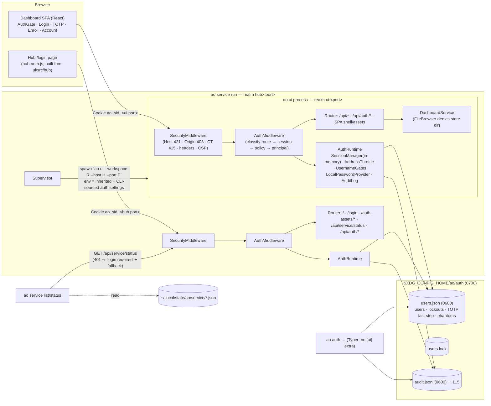
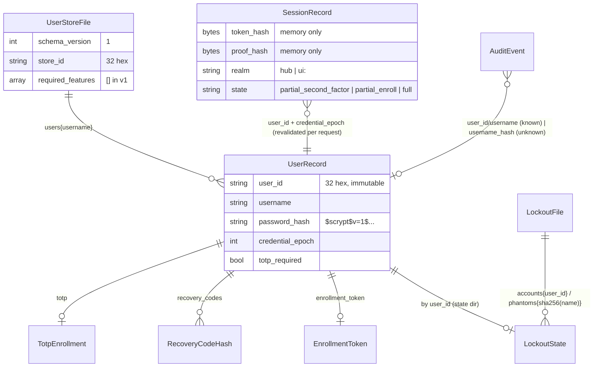
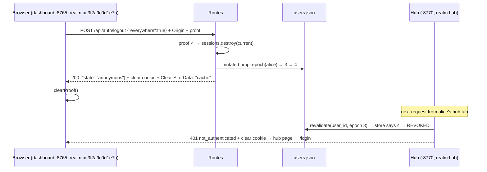
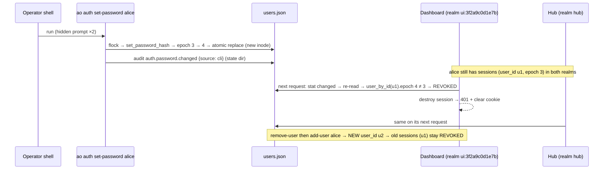
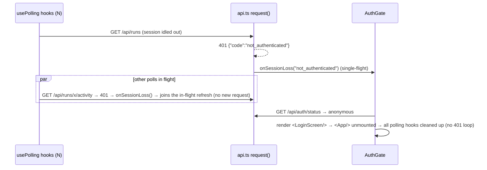
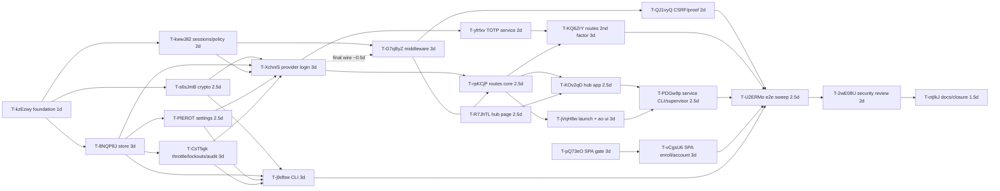

# Dashboard & hub authentication — local accounts + optional TOTP 2FA — HLD + LLD (E-Da5Tn9)

- **Status:** **Draft v2** (2026-10-05), ready for the independent design review and security
  review. v2 folds in the Phase-4 consultations (developer, reviewer, tester, dev-security,
  dev-critic); see §28. **No code has been written.** Everything below is a design for the tickets
  under [`meta/tickets/E-Da5Tn9-dashboard-auth-totp/`](../meta/tickets/E-Da5Tn9-dashboard-auth-totp/EPIC.md)
  to implement.
- **Epic:** `E-Da5Tn9-dashboard-auth-totp` · **ADR:** [ADR-0021](adr/ADR-0021-dashboard-authentication-and-totp.md)
- **Author:** architect (agent) · **Driver:** manager (agent) · **Owner:** Avadhoot Divekar
- **Related:**
  - ADR-0003 (settings precedence)
  - ADR-0005 (headless tool policy; see §2.6 hardening note)
  - ADR-0010 (dashboard architecture)
  - ADR-0011 D3 (the dashboard origin is a transport-layer trust boundary)
  - ADR-0012 (multi-workspace service)
  - [`meta/ROADMAP.md`](../meta/ROADMAP.md) §3.1
  - [`multi-workspace-service-hld.md`](multi-workspace-service-hld.md) §8
  - [`dashboard-and-general-instructions-hld.md`](dashboard-and-general-instructions-hld.md) §2.7
  - [`install-flavors.md`](install-flavors.md) (the stable and beta flavors share the store)
- **Downstream consumer of the identity contract:** the approval-gates epic (sibling). The contract
  is §2.6. **v2 changed it** (`roles` is now a tuple; fields added; `require_principal`). The manager
  must relay this before that epic freezes.

Conventions in this document:
- `MUST`, `MUST NOT` and `SHOULD` are normative.
- Every named constant is defined once in §12.6 and referenced by name elsewhere.
- `ASSUMPTION:` and `OPEN_QUESTION:` markers are collected in §5 and §25.

### Required-section index (architect template → this document)

| # | Required section | Here |
|---|---|---|
| 1 | Requirements | §3 |
| 2 | Scope | §4 |
| 3 | Assumption log | §5 |
| 4 | Standards survey | §7 |
| 5 | Solution landscape (build/buy/hybrid) | §8 |
| 6 | Orchestration landscape & competitor analysis | §9 |
| 7 | HLD | §10 |
| 8 | LLD (pseudocode, interfaces, schemas, subtasks, edge cases per module) | §11 |
| 9 | ADR log | §1 (decision log) + ADR-0021 |
| 10 | Block diagram | §10.1 |
| 11 | Spec/data schema diagram | §12.0 |
| 12 | Sequence diagrams | §14 |
| 13 | Spec schema (JSON/YAML) | §12 (config schema §12.5) |
| 14 | Interface/API contracts | §2 (HTTP), §11 (Python), §11.19 (CLI) |
| 15 | Trigger/event schema | §12.4 (audit events; this epic adds no cron/event triggers) |
| 16 | Deployment/upgrade | §18 |
| 17 | Developer/operator experience | §19 |
| 18 | Test strategy | §20 |
| 19 | Acceptance criteria matrix | §21 |
| 20 | Design artifacts checklist | §22 |
| 21 | Execution readiness gate | §23 |
| 22 | Sprint plan | §24 |
| 23 | Risks / dependencies / open questions | §25 |
| 24 | Handoffs and ownership | §26 |
| 25 | Post-implementation docs-refresh ticket | §27 |

---

## 0. TL;DR

The dashboard (`ao ui`) and the service hub (`ao service run`) get **opt-in** authentication. With it
**off** (the default), every byte on the wire is identical to today. The one deliberate exception is
that the user-store directory is never browsable. With it **on**:

1. **Local accounts.**
   - A username plus a scrypt-hashed password, each with an immutable `user_id`.
   - Credentials live in `users.json` in `$XDG_CONFIG_HOME/ao/auth/` (0600 file in a 0700 directory).
     Mutable state (`lockouts.json`, `audit.jsonl`) lives in `$XDG_STATE_HOME/ao/auth/`.
   - The CLI (`ao auth add-user`) is the only way to create accounts. There are no default
     credentials and no web sign-up.
   - With auth enabled and zero users, the server refuses to start (exit 78).
2. **Optional TOTP.**
   - RFC 6238 (SHA-1, 6 digits, 30 s, ±1 step) under the policy `off | optional | required`.
   - Codes are single-use across every server sharing the store (strictly increasing step).
   - Ten single-use recovery codes.
   - **An enrolled user is always challenged**, whatever the policy.
   - Forced enrollment requires a **CLI-issued one-time enrollment token**, so a stolen password
     alone cannot bind an attacker's authenticator.
   - Enrollment is refused over plain HTTP from a non-loopback client, because the seed and the
     recovery codes would cross the network in clear.
3. **Sessions.**
   - Each server is its own realm with in-memory sessions; sessions do not survive a restart.
   - The cookie name carries the server's own port: `ao_sid_8765`, or `__Host-ao_sid_8765` over
     https. Flags: `HttpOnly; SameSite=Strict; Path=/`.
   - **Session proof header:** every protected API call must also carry `X-AO-Session-Proof`. The
     proof is a second secret held in the origin's (port-isolated) storage. A cookie harvested by
     another listener on the same host is therefore useless against the API.
   - The **hub-run login handoff** is the recommended first follow-up (D3).
4. **Deny by default.**
   - A pure ASGI `AuthMiddleware` sits inside `SecurityMiddleware`.
   - Each request is classified by the **route object it will hit**, looked up in **one explicit
     policy table per app**.
   - A route-enumeration test (5 methods × every route context) asserts 401 on everything that is
     not allowlisted.
5. **Identity contract.**
   - `request.state.principal` is a `Principal(username, auth_method, roles: tuple, user_id, realm,
     session_id, amr, auth_time, provider)` or `None`.
   - `request.state.auth_enabled` is always set.
   - Helpers for the approval-gates epic: `current_principal()`, `require_principal()`,
     `audit_log_for()`.
6. **Hardening.**
   - Every mutating request needs a same-origin `Origin`; `Sec-Fetch-Site` is enforced.
   - `X-Frame-Options: DENY`; `Cache-Control: no-store` on every protected response and on `/api`;
     `Clear-Site-Data: "cache"` on logout.
   - Throttling per canonical address (IPv6 /64) before any scrypt work, plus a shared per-account
     lockout, with uniform treatment of unknown usernames.
   - Compare-and-swap credential writes.
   - No secrets in logs (a record-factory redaction), in audit, in URLs or in errors.
   - Workspace config can only **tighten** security settings.
7. **Hub.**
   - The protected server-rendered index sends anonymous visitors (303) to `/login`.
   - `/login` is a tiny dependency-free page and script covering password, TOTP or recovery code,
     and text-only forced enrollment with the CLI token.
8. **SPA.** Login, second factor, forced enrollment (with QR), the account menu, the session-proof
   handling, and a single-flight 401 handler that cannot loop.
9. **CLI.** `ao auth add-user|remove-user|list-users|set-password|enable-2fa|disable-2fa|reset-2fa|enrollment-token|unlock|revoke-sessions|status`.
   It works without the `[ui]` extra.
10. **Internal callers.**
    - `ao service list/status` read the hub's 401 as "running, login required" and fall back to the
        persisted state.
    - The supervisor passes CLI-sourced settings to children.
    - A child's exit 78 is terminal.

**Threat-model boundary:** dashboard auth defends the **HTTP/browser surface**. It does **not**
defend the local OS account, because agent tasks run as the same OS user (§6.3 A6). A cloned
repository's `.ao/config.yaml` is treated as **attacker input** (A12).

---

## 1. Decision log (D1..D25)

Each decision lists the alternatives considered. **[ADR]** marks decisions that are hard to reverse;
[ADR-0021](adr/ADR-0021-dashboard-authentication-and-totp.md) restates them. Each "(v2: …)" note
records a change made after a Phase-4 consultation.

**D1 — Opt-in, off by default, byte-identical when off.**
- `ui.auth.enabled` is off unless set.
- With auth off, `AuthMiddleware` is a pass-through. It only sets
  `request.state.principal = None` and `request.state.auth_enabled = False`. No headers, cookies or
  response bytes change.
- The only additions with auth off are `GET /api/auth/status` (it answers `{"enabled": false, ...}`)
  and the store-directory denial (§11.4).
- *Rejected:*
  - On by default with an auto-generated password. A behaviour change for everyone, and the classic
    "default credentials in a log" finding.
  - Refusing non-loopback binds without auth. Breaks existing `--host 0.0.0.0` and
    `AO_UI_ALLOWED_HOSTS=*` deployments. Kept as a recommendation (§4.3), with a deprecation notice
    starting now (D22).

**D2 — Settings layering; workspace config can only tighten. [ADR]**
- Dashboard: CLI > env > workspace `.ao/config.yaml` (`ui.auth.*`) > default.
- Hub: CLI > env > default.
- Every value records its source; `ao auth status` prints them.
- **v2 — the workspace layer is tighten-only** (dev-security finding, attacker class A12: a cloned
  repository's config is attacker input):
  - The workspace config may only set values at least as strict as the default: shorter session
    lifetimes, lower thresholds, a longer minimum password length, a stricter TOTP policy. Anything
    that loosens a default is a config error (fail closed), and the message points to env or CLI.
  - `trusted_proxies` comes from CLI or env **only**.
  - `store_dir` stays allowed in config, as the brief's per-workspace override. It must be absolute
    and outside the workspace, and the store-safety checks (S13) apply. Ownership by the euid plus
    file mode 0600 cannot be produced by a `git clone`, so a planted store fails closed.
- Fail-closed rules are a pure `decide()` (§11.3.4):
  - an invalid env value → refuse;
  - an invalid `ui.auth` block → refuse unless CLI or env explicitly disable auth;
  - an unparseable config file → refuse when auth might be intended (CLI/env says enabled, or the
    user count is **> 0 or unknown**);
  - enabled with zero users → refuse.
- *Rejected:* letting `ProjectConfig` validate the block, because an invalid auth block would break
  port pinning. The auth package parses its own block.

**D3 — Session model across the hub and N dashboards: per-server realm, in memory; the cookie name carries the port; stable realm ids. [ADR]**
- Each server process owns an in-memory `SessionStore`. The cookie is `ao_sid_<port>`
  (`__Host-ao_sid_<port>` over https).
- The **realm id** is the stable label used in audit and `Principal.realm`: `hub`, or
  `ui:<workspace_id>` with `workspace_id = sha256(resolved root)[:12]`. Ports can be reassigned
  (ADR-0012 D3), so the port appears **only** in the cookie name (v2, dev-critic finding).
- Tokens are found only in the table of the process that issued them, so realms are isolated by
  construction. Sessions do not survive a restart.
- *Rejected / deferred:*
  - **(D) Hub-run handoff — RECOMMENDED FIRST FOLLOW-UP** (v2, dev-critic finding).
    - The hub becomes the single login page, TOTP step and future OIDC client, with a stable port and
      redirect URI. It issues single-use, short-lived tickets bound to one realm.
    - This keeps per-realm sessions and the proof header, and it removes the "one TOTP step per
      realm" cost.
  - **(B) Store-scoped SSO** (a shared `sessions.json`). Second choice: on-disk session state,
    locking, and it does not compose with origin-bound proofs without per-origin binding.
  - **(C) Stateless signed cookies.** Rejected: no revocation, a shared key, and the brief requires
    server-side hash-only sessions.
- **Residual (§6.3 A4):** cookies are host-scoped. Another same-host listener the browser talks to
  receives every `ao_sid_*` cookie, and it can also *set* them (cookie tossing). v2 counters this:
  - the **session proof header (D25)** makes a harvested cookie useless for every API route;
  - duplicate realm cookies are rejected;
  - idle sliding ignores cross-site navigations.
  - Remaining: a harvester could view the hub's server-rendered index (a cookie-only navigation) and
    could force a logout.

**D4 — Cookie flags, CSRF, Fetch Metadata and caching. [ADR]**
- **Cookie:** always `HttpOnly; SameSite=Strict; Path=/`, with no `Domain`, `Max-Age` or `Expires`.
  Over https: `Secure` plus the `__Host-` prefix.
- **Duplicates:** the raw `Cookie` header is parsed by `auth/http/responses.py`. Starlette's parser
  keeps the last value. If the realm cookie name appears **more than once**, the request is treated
  as having no session and one WARNING is logged per process (v2, dev-security finding: cookie
  tossing).
- **Origin:** with auth enabled, every `POST/PUT/PATCH/DELETE` MUST carry an `Origin` equal to the
  request's own origin (`origin_matches_host`). Otherwise 403 `origin_required` or
  `origin_mismatch`. This does not depend on the Host allowlist.
- **Fetch Metadata:** on a non-PUBLIC route, or any mutating request, a present `Sec-Fetch-Site` must
  be `same-origin` or `none`. The exception is a top-level `GET`/`HEAD` navigation
  (`Sec-Fetch-Mode: navigate`, `Sec-Fetch-Dest: document`). Otherwise 403 `cross_site_request`.
- **Caching** (v2, dev-security finding):
  - `X-Frame-Options: DENY` on every response produced at or below `AuthMiddleware`;
  - `Cache-Control: no-store` on every `/api/*` response, `/login`, and **every non-PUBLIC
    response** (including the hub index);
  - `Clear-Site-Data: "cache"` on logout. Never `"cookies"`, which is site-wide and would log the
    user out of other realms.
  - The SPA re-checks status on a back-forward-cache restore (`pageshow` with `persisted`).
- *Why no synchronizer token:* the session proof (D25) plus Origin, Fetch Metadata, SameSite and no
  CORS already cover it.
- *Trade-off:* non-browser clients cannot mutate without an `Origin` and a proof. API tokens are
  NON-MVP.

**D5 — Identity store: user-level, forward-compatible; credentials and state split. [ADR]**
- **Credentials:** `users.json` in the store directory: `$AO_AUTH_DIR` > `$XDG_CONFIG_HOME/ao/auth`
  > `~/.config/ao/auth`.
- **Mutable state:** `lockouts.json` and `audit.jsonl` (rotated) live in the state directory:
  `$AO_AUTH_STATE_DIR` > `$XDG_STATE_HOME/ao/auth` > `~/.local/state/ao/auth`. For an overridden
  `store_dir` the state directory is `<store_dir>/state`.
  - *Why the split* (v2, reviewer and dev-security findings): failed logins never rewrite the
    credential file, so no realm's stat cache is invalidated by an attack. Attacker-keyed phantom
    entries stay out of the credential file. Mutable data stays out of a synced `~/.config`.
- **Writes:** writers hold a sidecar flock (`*.lock`) through `fsutil.FileLock` with a timeout.
  Each write is an O_EXCL/O_NOFOLLOW temp file, fsync, `os.replace`, then an fsync of the directory.
  Stale temp files from this writer are removed under the lock.
- **Forward compatibility** (v2, dev-critic finding: the stable and beta flavors share the store):
  - pydantic `extra="allow"` preserves unknown fields;
  - `required_features` gates incompatible changes;
  - a reader refuses only when `schema_version` is too new or a required feature is unknown;
  - breaking migrations happen only through an explicit `ao auth migrate` (future).
  - Workspace **config** stays `extra="forbid"`, so typos fail closed.
- **Safety checks:**
  - the store and state directories are 0700, owned by the euid, and not group/other-writable;
  - their **parent** directories are not group/other-writable (unless root-owned with the sticky
    bit);
  - files are 0600, regular files, never symlinks;
  - the server refuses to start otherwise.
- **Never browsable:** both directories are denied by `FileBrowser.resolve()`, whether auth is on or
  off.
- *Rejected:* a per-workspace default store, SQLite, the OS keyring.

**D6 — Password hashing: stdlib scrypt `ln=15, r=8, p=3`. [ADR]**
- 32 MiB per hash, about 165 ms (measured, OpenSSL 3.0.16). OWASP-equivalent to `2^17/8/1`.
- `dklen=32`, 16-byte salt, explicit `maxmem` (the OpenSSL default rejects these parameters).
- Encoded as `$scrypt$v=1$ln=15,r=8,p=3$<b64>$<b64>`.
- `parse_hash` caps `ln ≤ 17`, `r ≤ 16`, `p ≤ 16` and `128·N·r ≤ 128 MiB`. A hostile hash string
  therefore cannot request gigabytes (v2, dev-security finding).
- NFKC normalization; length 12..256 (minimum configurable, floor 8); no control characters; not
  equal to the username.
- Rehash on login, as a **compare-and-swap** (D10).
- Hashing is bounded: `HASH_CONCURRENCY=2` concurrent hashes per process, `HASH_QUEUE_MAX=16` queued.
  A rejection when the queue is full **counts as a failed attempt** for its address, so a flood
  cannot starve real logins (v2).
- Unknown users verify against a dummy hash with the current parameters.
- *Alternatives:*
  - `ln=16, p=1` (118 ms measured, 64 MiB). Equivalent strength, double the memory; not chosen.
  - argon2id and bcrypt. Rejected: they need dependencies.
  - PBKDF2. Rejected: not memory-hard.

**D7 — TOTP: global strictly-increasing step, sticky enrollment, token-gated forced enrollment, secure transport. [ADR]**
- **TOTP parameters:** SHA-1, 6 digits, 30 s, `T0=0`, ±1 window, 160-bit secret. The `otpauth://`
  URI and the Base32 secret are always shown.
- **Replay:** the matched step must be **strictly greater** than `last_used_step`. The check runs
  under the store flock, so a code is single-use across all realms (RFC 6238 §5.2).
- **Policy:**
  - `off` → no new enrollment;
  - `optional` → enroll or disable at will;
  - `required` → users without TOTP get an enrollment-only partial session, and self-disable is
    refused.
- **Per-user flag `totp_required`** (set by `add-user --require-totp` and `reset-2fa`; cleared by
  `disable-2fa`) applies `required` to one user.
- **Sticky:** an enrolled user is challenged under **every** policy.
- **v2 — under policy `off`, a user with `totp_required` who is not enrolled cannot log in.** The
  response is 403 `totp_required` with operator guidance, rather than silently getting a
  password-only session (dev-security finding).
- **v2 — forced enrollment needs a one-time enrollment token** (dev-security finding):
  - The token is issued only by the CLI: `add-user --require-totp`, `reset-2fa`, and
    `ao auth enrollment-token <user>`.
  - It is 80-bit, stored hashed, single-use, and expires after `ENROLLMENT_TOKEN_TTL_SECONDS`.
  - The E4 begin call in forced mode must present it. A thief with only the password cannot enroll
    their own device first.
  - Voluntary enrollment from a full session needs the password again, not a token.
- **v2 — secure transport:** E4, E5 and E7 (seed and recovery-code disclosure) are refused with 403
  `insecure_transport` when the request is plain HTTP **and** the client is not loopback. CLI
  enrollment always works.
- *Rejected:* per-realm replay (violates RFC 6238 §5.2); policy-governed challenge (allows a silent
  downgrade); untokenized forced enrollment (first-come binding).

**D8 — Recovery codes. [ADR]**
- 10 × 80-bit, 16 Crockford characters (`XXXX-XXXX-XXXX-XXXX`), salted SHA-256 each, single-use,
  consumed under the flock, shown once.
- A recovery login gives `auth_method="password+totp"` with `amr=("pwd","rcv","mfa")`.
- One-time enrollment tokens (D7) use the same format and hashing.

**D9 — Throttling and lockout.**
1. **Canonical client key** (v2, dev-security finding):
   - parsed with `ipaddress`;
   - IPv4-mapped IPv6 unwrapped;
   - IPv6 keyed by its **/64**;
   - unparseable or absent → `"unknown"`.
2. **Per-address throttle:** in memory, LRU, checked **before** any scrypt work. Hash-queue `busy`
   rejections count as failures.
3. **Per-account lockout** in `lockouts.json`, keyed by `user_id`:
   - exponential backoff `min(max, base·2^(failures−threshold))` after `threshold` failures;
   - shared by every realm;
   - counts password, second-factor and re-auth failures;
   - not reset while a second factor is pending.
4. **Phantom entries:** unknown usernames get identical treatment through phantom entries keyed by
   `sha256(normalized name)` in the same file, capped at `PHANTOM_LOCKOUT_MAX_ENTRIES=4096` with
   oldest-first eviction. The flood-eviction oracle (dev-security finding #9) needs more than 4096
   distinct names, each paying throttled attempts. It is documented as a residual.
5. **Per-username `asyncio.Lock`** gate per process.
6. `ao auth unlock` clears a lockout.

**D10 — Revocation: immutable `user_id` plus `credential_epoch`; compare-and-swap writes. [ADR]**
- Sessions record the `user_id` and the epoch. Each request re-checks both against the stat-cached
  store (keyed by inode, mtime and size).
- `remove-user` deletes the `user_id`, so re-adding the same username yields a new id and the old
  sessions die (v2, dev-critic and dev-security finding).
- **v2 — no straddling** (dev-security finding):
  - The identity's `user_id` and epoch are taken from **the same snapshot that supplied the verified
    hash**, never re-read after the 165 ms verify. A login racing a password change therefore gets the
    old epoch and dies on its next request.
  - `rehash_password` and `mark_login` are **compare-and-swap** (CAS) inside `mutate`: they apply
    only if the `user_id`, epoch and hash still equal the verified ones.
- The epoch is bumped by every credential change, by logout everywhere and by `revoke-sessions`.

**D11 — Pluggable provider seam. [ADR]**
- The `AuthProvider` ABC is FastAPI-free: `check_ready`, `revalidate → Revalidation`, `user_view`.
- `LocalPasswordProvider` implements the login side; `LocalTotpService` the second factor. Both use
  `AttemptGuard`.
- HTTP routes come from `register_route_builder(provider_id, fn)`, where `fn` is a callable.
- `build_auth_runtime(..., provider=)` lets a test or a future provider inject itself.
- Core modules see only `VerifiedIdentity`.
- v2 removed the speculative protocols (reviewer finding).
- **Seam proof:** a fake provider with a **redirect-shaped** flow (start → 302 → cross-site callback
  GET → session) signs a user in without core edits (v2, dev-critic finding).

**D12 — Principal and audit contract for the approvals epic. [ADR]**
- `request.state.principal` is a `Principal` (§2.6) or `None`. `request.state.auth_enabled` is
  always set.
- `current_principal()`, `require_principal()` (401 if auth is on and the principal is missing;
  `None` if auth is off), `auth_enabled()`, `audit_log_for()`.
- **v2:**
  - `roles: tuple[str, ...]`: hashable and immutable. The dev-critic, the reviewer and dev-security
    all asked for this. It deviates from the brief's literal `list[str]` and is flagged to the
    manager.
  - Added `user_id`, `amr`, `auth_time`, `provider`.
  - §2.6 states what a principal attests.

**D13 — Hub login UX.**
- The protected index and `/api/service/status`. An anonymous or partial browser navigation → 303
  `/login`.
- `/login` uses `/auth-assets/hub-auth.js`, which is built from TypeScript and committed, and has no
  inline script. It covers:
  - the password step;
  - the TOTP or recovery-code step;
  - **text-only forced enrollment with the CLI enrollment token** (refused over insecure remote
    transport);
  - logout and keepalive.
- The auth-on index is registered by `register_hub_auth_routes` in the http layer, because of the
  `hub.py` annotation trap (v2, developer finding).
- Account management lives in the SPA and the CLI only.

**D14 — Internal callers keep working.**
- `ao service list/status`: a 401 means "running, login required", then the persisted-state
  fallback.
- The supervisor (`popen.poll()`), boot-resume and the status provider make no HTTP calls.
- Tests and scripts run with auth off.
- Matrix: §15.

**D15 — Service integration.**
- `ao service run` calls `prepare_auth()` **before** `supervisor.start()` and exits 78 on failure,
  before any child is spawned.
- The supervisor injects **CLI-sourced** settings into child environments.
- A child exiting 78 is terminal: `stopped`, no restart, no port reassignment.
- The systemd unit gets `RestartPreventExitStatus=78`.
- `EXIT_CONFIG` is defined once in root `errors.py` (v2, reviewer finding).

**D16 — Fail-closed configuration.** See D2 and §11.3.4.

**D17 — Trusted proxies.**
- With auth on, uvicorn runs with `proxy_headers=False` unless `trusted_proxies` (IP literals, CLI or
  env only) is set; then `proxy_headers=True` and `forwarded_allow_ips=<list>`. uvicorn's default
  would trust `X-Forwarded-*` from 127.0.0.1.
- The client key is canonicalized as in D9.
- The proxy MUST preserve `Host` (`proxy_set_header Host $host;`) and send `X-Forwarded-Proto`.
  `X-Forwarded-Host` is not trusted.
- With auth off, uvicorn's defaults are untouched.

**D18 — Audit log.**
- `audit.jsonl` (0600) lives in the **state** directory, rotated at `AUDIT_MAX_BYTES` ×
  `AUDIT_BACKUP_COUNT`.
- No secrets. Unknown usernames appear only as `username_hash`.
- **Flood coalescing:** more than `AUDIT_FAILURE_EVENTS_PER_MINUTE` failure events per minute per
  process become a single `auth.failure.burst` event. `auth.lockout` is never suppressed.
- Async callers use `run_sync`.
- The detail-key allowlist applies to `auth.*` events only.
- Approval records belong in run state, with the audit log as a mirror (§2.6).

**D19 — `/api/health` stays public and unchanged.** The public SPA shell already fingerprints the
build.

**D20 — Frontend.**
- `AuthGate` state machine.
- A single-flight session-loss handler (401 with codes `not_authenticated`,
  `second_factor_required` or `enrollment_required`) unmounts `App`, so polling stops.
- The session proof is held in `localStorage` (memory fallback) and sent on every API request
  (D25).
- `pageshow` with `persisted` re-checks status.
- Keepalive fires only on user input; polling never slides the session.
- The QR is rendered with `qrcode-generator@2.0.4` in a lazy chunk as an SVG path.
- A test bans any `mode:` option on `fetch`.

**D21 — CLI.**
- `ao auth` is a Typer app with heavy imports inside each command.
- Passwords come only from a hidden prompt or `--password-stdin`.
- Additions beyond the brief: `unlock`, `revoke-sessions`, and `enrollment-token` (v2).

**D22 — Plain HTTP on a non-loopback bind.**
- A loud startup warning and a runtime warning once per process. The SPA shows a banner.
- Enrollment endpoints are refused remotely over plain HTTP (D7).
- **Deprecation notice now:** with auth off and a non-loopback bind, one extra line after the
  existing warning: `NOTE: a future release will refuse non-loopback binds without --auth (or an
  explicit opt-out flag).`

**D23 — Expiry on a suspend-aware monotonic timeline.**
- Defaults: idle 30 min, absolute 12 h. Partial sessions last 300 s.
- `Clock.monotonic()` is `CLOCK_BOOTTIME` on Linux (counts suspend; verified on Python 3.11) and
  `time.monotonic()` elsewhere (documented).
- Rotation never extends the absolute deadline.
- Idle slides only on:
  - mutating requests;
  - keepalive;
  - top-level navigations whose `Sec-Fetch-Site` is `same-origin` or `none`. A sibling port's page
    cannot keep a session alive (v2, dev-security finding).
- v2 replaced v1's dual-clock design (reviewer finding: simpler, same guarantee on Linux).

**D24 — Layering and import boundary.**
- Package layers L0–L4 (§11.1), enforced by an AST import test.
- Only `auth/http/middleware.py` and `auth/http/routes.py` import fastapi or starlette.
- `auth/cli.py` and every non-http module import cleanly without fastapi, starlette and uvicorn.

**D25 — Origin-bound session proof header. [ADR]** (v2: dev-security HIGH #2 plus dev-critic #6; an
owner decision with default **include**)
- **Two secrets per session.**
  - The cookie token is `HttpOnly` and host-scoped.
  - A **proof** (32 random bytes, base64url) is returned only in the JSON body of a
    session-issuing response, as `session_proof`.
  - The server stores `sha256(proof)`.
- **Client storage and use.**
  - The SPA and the hub script keep the proof in `localStorage`, which is **origin-isolated, so
    port-isolated**, falling back to memory.
  - They send it as `X-AO-Session-Proof` on every `/api/*` request.
- **Server enforcement.**
  - Every non-PUBLIC `/api/*` route, and the partial-step routes, require a valid proof. A missing or
    wrong proof → 401 `not_authenticated`, and the server session is **not** destroyed.
  - `GET /api/auth/status` reports `anonymous` unless the proof matches, so a thief learns nothing.
  - `POST /api/auth/logout` destroys the server session only with a matching proof.
  - **HTML navigations** (the hub index) are cookie-only, because a navigation cannot carry a header.
    Residual: hub index read access.
- **What this defeats.** A cookie harvested by another same-host listener cannot call any API.
  Cookie-tossing fixation into an attacker's session fails too, because the victim's tab holds a
  different proof.
- **Cost:** about 1.5 dev-days.
- **Alternatives:**
  - Defer to a follow-up (the v1 stance).
  - Per-server `*.localhost` hostnames (an operator burden; WebAuthn-compatible later).
- **OPEN_QUESTION OQ-9:** the owner may defer D25. If so, A4 reverts to the v1 residual, and the
  README must say so.

---

## 2. HTTP contract (frozen for parallel frontend/backend work)

This section is the **only** source the SPA (§17) and the hub page need. Changing it after T-pQ73eO
starts requires a manager-approved contract change, recorded in the epic `STATUS.md`.

### 2.1 Conventions

- **Paths and bodies:**
  - All auth endpoints live under `/api/auth/`.
  - Request bodies are JSON objects with `Content-Type: application/json`. `SecurityMiddleware`
    already enforces 415 for bodied mutating requests.
  - Unknown request keys → 400 `invalid_request`; the message names the key, never the value.
  - Bodies over `MAX_AUTH_BODY_BYTES` (16 KiB) → 413.
- **Origin:** every mutating request MUST send a same-origin `Origin` when auth is enabled (D4).
  - `fetch()` does this. Empirically (Chrome 138, page served with `Referrer-Policy: no-referrer`),
    a same-origin `fetch()` POST carries the real `Origin` in both `cors` and `same-origin` modes,
    while an HTML `<form>` POST sends `Origin: null` (§25.4).
  - **Rule:** use `fetch()` with no `mode` option (a vitest string check bans it), and never post a
    form.
- **Session proof (D25):** send `X-AO-Session-Proof: <session_proof>` on **every** `/api/*` request
  once a session has been issued. The latest value from any session-issuing response replaces the
  stored one.
- **Response headers** (from an auth-enabled server):
  - `X-Frame-Options: DENY`;
  - `Cache-Control: no-store` on every `/api/*` response and every protected page;
  - `Clear-Site-Data: "cache"` on the logout response.
- **Timestamps:** ISO-8601 UTC with a `Z` suffix and second precision.

### 2.2 Error envelope and codes

```json
{ "detail": "Human-readable message.", "code": "machine_code" }
```

Extra keys appear per code. `detail` is always a string, so the existing `api.ts` `request()` keeps
showing it.

| HTTP | `code` | When | Extra keys / headers |
|---|---|---|---|
| 400 | `invalid_request` | The body is not a JSON object, has an unknown key, or a field is missing, the wrong type or too long (including deeply nested JSON) | — |
| 400 | `password_policy` | The new password violates the policy | `violations: string[]` ⊆ `too_short`, `too_long`, `control_characters`, `equals_username` |
| 401 | `not_authenticated` | No valid session for a route that needs one: none, expired, revoked, unknown, duplicate cookie, **missing or wrong session proof**, or a partial session that ran out of time or attempts | `WWW-Authenticate: AO-Session realm="<realm id>"`; the cookie is cleared only when the session is **gone** server-side |
| 401 | `second_factor_required` | A second-factor-pending session called anything but its step | as above |
| 401 | `enrollment_required` | An enrollment-pending session called anything but enrollment | as above |
| 401 | `invalid_credentials` | Wrong username or password (uniform), or a wrong `current_password` | — |
| 401 | `invalid_code` | A wrong, replayed or malformed TOTP or recovery code, or a wrong enrollment token | `reason: "invalid" \| "replayed"`, `attempts_remaining: int` (partial steps) |
| 403 | `origin_required` / `origin_mismatch` / `cross_site_request` | CSRF and Fetch-Metadata rules (D4) | — |
| 403 | `insecure_transport` | E4, E5 or E7 over plain HTTP from a non-loopback client (D7) | — |
| 403 | `totp_disabled_by_policy` | Enrollment while the policy is `off` | — |
| 403 | `totp_required` | Disabling while TOTP is required (by policy or per user), **or** login under policy `off` by a `totp_required` user who is not enrolled | — |
| 403 | `forbidden` | **Reserved** for future RBAC. Never sent in the MVP. | — |
| 409 | `already_authenticated` / `totp_already_enrolled` / `totp_not_enrolled` / `no_pending_enrollment` | As named | — |
| 413 | `body_too_large` | Auth request body over 16 KiB | — |
| 429 | `too_many_attempts` | The address throttle or the account lockout is active | `retry_after_seconds`; `Retry-After` |
| 503 | `busy` | The hash queue is full (counts as a failure for the address) | `retry_after_seconds: 1`; `Retry-After: 1` |
| 503 | `store_unavailable` | The store or state file is locked longer than `STORE_LOCK_TIMEOUT_SECONDS`, or is unreadable or corrupt. Sessions are kept. | `Retry-After: 5` |

Existing error shapes are unchanged: `SecurityMiddleware`'s 421/403/415 plain text, and the routes'
FastAPI `{"detail": ...}`.

### 2.3 Cookie and proof

| Aspect | Value |
|---|---|
| Cookie name | `ao_sid_<port>` over http; `__Host-ao_sid_<port>` over https. `<port>` is the server's **own listening port**, passed explicitly (§11.16). |
| Cookie value | base64url (no padding) of 32 random bytes: 43 characters. A malformed value is treated as absent and never logged. |
| Set | `Set-Cookie: <name>=<value>; Path=/; HttpOnly; SameSite=Strict` (+ `; Secure` on https). Built byte-exactly by `auth/http/responses.py`. |
| Clear | `Set-Cookie: <name>=; Path=/; HttpOnly; SameSite=Strict; Max-Age=0; Expires=Thu, 01 Jan 1970 00:00:00 GMT` (+ `; Secure` on https) |
| Duplicates | Two or more occurrences of the realm cookie name in `Cookie` → treated as no session (D4) |
| Proof | `session_proof`: base64url of 32 random bytes, in the JSON body of each session-issuing response (E2, E3, E5, E6, E7, E8). Clients send it back as `X-AO-Session-Proof`. |
| Server storage | `sha256(token)` as the table key and `sha256(proof)` in the record. Plaintext exists only in the issuing response. |

### 2.4 Endpoints

Policies (§13.2): `PUBLIC`, `PARTIAL_SECOND_FACTOR`, `ENROLLMENT`, `AUTHENTICATED`. **Every
non-PUBLIC `/api/*` route also requires the session proof.**

#### E1 `GET /api/auth/status` — PUBLIC, always mounted

- **Request:** no body. Send the proof header if you have one.
- **Side effects:** none. It never slides the idle timer.
- **200 with auth disabled:**
  ```json
  {"enabled": false, "state": "disabled", "user": null, "pending_username": null, "second_factors": null,
   "enrollment_token_required": null, "policy": null, "session": null, "transport": null}
  ```
  The keys appear in exactly this order in both modes. The disabled body is a named constant, so
  AC-2 can compare it byte-for-byte.
- **200 with auth enabled:**
  ```json
  {
    "enabled": true,
    "state": "anonymous | second_factor_required | enrollment_required | authenticated",
    "user": null | {
      "username": "alice",
      "auth_method": "password | password+totp",
      "roles": [],
      "totp_enrolled": true,
      "recovery_codes_remaining": 8,
      "totp_required": false,
      "can_enroll_totp": false,
      "can_disable_totp": true
    },
    "pending_username": null | "alice",
    "second_factors": null | ["totp", "recovery_code"],
    "enrollment_token_required": null | true,
    "policy": {"totp": "off | optional | required", "min_password_length": 12, "max_password_length": 256},
    "session": null | {"idle_timeout_seconds": 1800, "idle_expires_at": "2026-10-04T12:30:00Z",
                       "absolute_expires_at": "2026-10-05T00:00:00Z"},
    "transport": {"secure": false, "client_is_loopback": true}
  }
  ```
- **Field rules:**
  - The state is reported as non-anonymous **only if the session proof matches**. A valid cookie
    with no proof, or a wrong one, reports `anonymous`.
  - `user` is set only when authenticated. `pending_username`, `second_factors` and
    `enrollment_token_required` are set only in the matching partial states.
  - `can_enroll_totp = !totp_enrolled && policy.totp != "off"`.
  - `can_disable_totp = totp_enrolled && policy.totp != "required" && !totp_required`.

#### E2 `POST /api/auth/login` — PUBLIC

- **Request:** `{"username": string (1..64), "password": string (0..1024)}`
- **200** (sets a new cookie; the body includes `session_proof`). A presented session is destroyed
  first **only if its proof matches** (D25: a missing proof never destroys anything); otherwise the
  old session is simply left to expire. Possible bodies:
  - `{"state": "authenticated", "user": {…}, "session_proof": "…"}`
  - `{"state": "second_factor_required", "second_factors": ["totp", "recovery_code"], "session_proof": "…"}`
  - `{"state": "enrollment_required", "enrollment_token_required": true, "session_proof": "…"}`
- **Errors:**
  - 400; 401 `invalid_credentials` (byte-identical for an unknown user and a wrong password);
  - 403 `totp_required` (policy `off` and a `totp_required` user who is not enrolled);
  - 403 `origin_*` / `cross_site_request`; 429; 503.

#### E3 `POST /api/auth/totp/verify` — PARTIAL_SECOND_FACTOR (+ proof)

- **Request:** exactly one of `{"code": "123456"}` or `{"recovery_code": "ABCD-EFGH-JKMN-PQRS"}`.
  Codes are normalized by `normalize_totp_code` and `normalize_recovery_code` (§11.7–§11.8):
  whitespace and dashes are ignored, and recovery codes are case-insensitive with Crockford
  I/L→1 and O→0.
- **200** (rotated cookie and proof):
  `{"state": "authenticated", "user": {…}, "used_recovery_code": false, "session_proof": "…"}`
- **Errors:**
  - 401 `invalid_code` with `reason` and `attempts_remaining`. After `MAX_SECOND_FACTOR_ATTEMPTS`
    failures the partial session is destroyed.
  - 401 `not_authenticated`; 409 `already_authenticated`; 429; 503.

#### E4 `POST /api/auth/totp/enroll/begin` — ENROLLMENT (+ proof)

- **Request:**
  - From a full session (voluntary): `{"current_password": string}`.
  - From an enrollment-pending session (forced): `{"enrollment_token": "XXXX-XXXX-XXXX-XXXX"}`,
    the CLI-issued token. It is verified and **consumed** (single use, TTL) **before** the secret
    is generated, so an abandoned or failed setup needs a new token. A wrong token gives 401
    `invalid_code` and counts toward the lockout. A **missing** `enrollment_token` is treated as a
    wrong one: the key is optional in the body schema, so the attempt is counted rather than
    rejected as `invalid_request`.
- **200:**
  ```json
  {"secret": "JBSWY3DPEHPK3PXPJBSWY3DPEHPK3PXP", "otpauth_uri": "otpauth://totp/ao%40devbox:alice?secret=...&issuer=ao%40devbox&algorithm=SHA1&digits=6&period=30",
   "issuer": "ao@devbox", "account": "alice", "algorithm": "SHA1", "digits": 6, "period": 30}
  ```
  The pending secret is held server-side in the session. Calling begin again replaces it.
- **Errors:** 401 `invalid_credentials` / `invalid_code`; 403 `insecure_transport` /
  `totp_disabled_by_policy`; 409 `totp_already_enrolled`; 429; 503.

#### E5 `POST /api/auth/totp/enroll/confirm` — ENROLLMENT (+ proof)

- **Request:** `{"code": "123456"}`
- **200** (rotated cookie and proof):
  `{"state": "authenticated", "user": {…}, "recovery_codes": [10 items], "session_proof": "…"}`
- **Errors:** 401 `invalid_code` (+`attempts_remaining`; the pending secret is discarded after
  `MAX_ENROLL_CONFIRM_ATTEMPTS`); 403 `insecure_transport` / `totp_disabled_by_policy`; 409
  `totp_already_enrolled` / `no_pending_enrollment`.

#### E6 `POST /api/auth/totp/disable` — AUTHENTICATED (+ proof)

- **Request:** `{"current_password": string, "code": string}` (a TOTP code or a recovery code).
- **200** (rotated): `{"state": "authenticated", "user": {…}, "session_proof": "…"}`. Other sessions
  are revoked.
- **Errors:** 401 `invalid_credentials` / `invalid_code`; 403 `totp_required`; 409
  `totp_not_enrolled`; 429; 503.

#### E7 `POST /api/auth/totp/recovery-codes` — AUTHENTICATED (+ proof)

- **Request:** `{"current_password": string, "code": string}`
- **200** (rotated): `{"recovery_codes": [10 items], "user": {…}, "session_proof": "…"}`
- **Errors:** as E6, plus 403 `insecure_transport`; `totp_required` never applies.

#### E8 `POST /api/auth/password` — AUTHENTICATED (+ proof)

- **Request:** `{"current_password": string, "new_password": string}`
- **200** (rotated, absolute deadline kept): `{"state": "authenticated", "user": {…}, "session_proof": "…"}`.
  Other sessions are revoked.
- **Errors:** 400 `password_policy`; 401 `invalid_credentials`; 429; 503.

#### E9 `POST /api/auth/keepalive` — AUTHENTICATED (+ proof), no body

- **200:** `{"idle_expires_at": "…Z", "absolute_expires_at": "…Z", "idle_timeout_seconds": 1800}`

#### E10 `POST /api/auth/logout` — PUBLIC (idempotent)

- **Request:** `{}` or `{"everywhere": true}`. The body is optional.
- **Behaviour:**
  - With a **matching proof**: destroys the presented session (full or partial).
  - `everywhere: true` with a full session also bumps the epoch, which revokes every realm.
- **200:** `{"state": "anonymous"}`, plus a clear-cookie header and `Clear-Site-Data: "cache"`,
  always.

#### Hub-only routes (when hub auth is enabled)

| Route | Policy | Response |
|---|---|---|
| `GET /login` | PUBLIC | `200 text/html`: static page (§17.6), `Cache-Control: no-store` |
| `GET /auth-assets/hub-auth.js` / `hub-auth.css` | PUBLIC | Package data with the exact content type. Any other name → 404. |
| `GET /` (index) | AUTHENTICATED (**cookie only**: a navigation cannot carry the proof) | Full session → today's HTML plus a signed-in bar and the script, with `no-store`. Otherwise → **303 `/login`**. |
| `GET /api/service/status` | AUTHENTICATED (+ proof) | Unchanged JSON. Otherwise 401. |

#### Existing dashboard routes

- Every existing `/api/*` route is AUTHENTICATED (+ proof), including `/api/docs` and
  `/api/openapi.json`. The exception is `GET /api/health`, which is PUBLIC and unchanged (D19).
- The SPA routes are PUBLIC: `GET /` (`spa_root` or `missing_frontend`), the `/assets` mount, and
  `GET /{full_path:path}` (`spa_fallback`). The SPA shell must be able to render the login screen.
- Under `/api/`, a PUBLIC policy holds only for an API route's own table entry. So `spa_fallback`
  never makes `/api/<anything>` public: an anonymous unknown `/api/x` gets 401.
- Paths are evaluated on the **route path** (with `root_path` stripped, §13.1).

### 2.5 TypeScript types (copy into `ui/src/types.ts`)

```ts
export type AuthState =
  | "disabled" | "anonymous" | "second_factor_required" | "enrollment_required" | "authenticated";
export type AuthMethod = "password" | "password+totp";
export type SecondFactor = "totp" | "recovery_code";
export type TotpPolicy = "off" | "optional" | "required";
export interface AuthUser {
  username: string; auth_method: AuthMethod; roles: string[];
  totp_enrolled: boolean; recovery_codes_remaining: number | null;
  totp_required: boolean; can_enroll_totp: boolean; can_disable_totp: boolean;
}
export interface AuthStatus {
  enabled: boolean; state: AuthState; user: AuthUser | null; pending_username: string | null;
  second_factors: SecondFactor[] | null; enrollment_token_required: boolean | null;
  policy: { totp: TotpPolicy; min_password_length: number; max_password_length: number } | null;
  session: { idle_timeout_seconds: number; idle_expires_at: string; absolute_expires_at: string } | null;
  transport: { secure: boolean; client_is_loopback: boolean } | null;
}
export interface AuthStepResponse {
  state: Exclude<AuthState, "disabled" | "anonymous">; user?: AuthUser;
  second_factors?: SecondFactor[]; enrollment_token_required?: boolean;
  used_recovery_code?: boolean; recovery_codes?: string[]; session_proof: string;
}
export interface TotpEnrollment {
  secret: string; otpauth_uri: string; issuer: string; account: string;
  algorithm: "SHA1"; digits: 6; period: 30;
}
export interface KeepaliveResponse {
  idle_expires_at: string; absolute_expires_at: string; idle_timeout_seconds: number;
}
export type AuthErrorCode =
  | "invalid_request" | "password_policy" | "not_authenticated" | "second_factor_required"
  | "enrollment_required" | "invalid_credentials" | "invalid_code" | "origin_required"
  | "origin_mismatch" | "cross_site_request" | "insecure_transport" | "totp_disabled_by_policy"
  | "totp_required" | "forbidden" | "already_authenticated" | "totp_already_enrolled"
  | "totp_not_enrolled" | "no_pending_enrollment" | "body_too_large" | "too_many_attempts"
  | "busy" | "store_unavailable";
/** 401 codes meaning "your session is gone or incomplete" — the ONLY ones that trigger the global handler. */
export const SESSION_LOSS_CODES: readonly AuthErrorCode[] =
  ["not_authenticated", "second_factor_required", "enrollment_required"];
export const SESSION_PROOF_HEADER = "X-AO-Session-Proof";
```

### 2.6 Python identity contract (for the approvals epic)

```python
# agent_orchestrator/auth/principal.py  (L0, no FastAPI import)
AuthMethod = Literal["password", "password+totp"]           # from auth/model.py

@dataclass(frozen=True, slots=True)
class Principal:
    # --- the brief's minimum contract (roles type changed in v2: see note) ---
    username: str                 # normalized lowercase account name; a display/audit label, NOT a stable key
    auth_method: AuthMethod       # "password+totp" also covers a recovery-code login (see amr)
    roles: tuple[str, ...]        # always () in the MVP; immutable and hashable
    # --- additive fields (v2, Phase-4 consultations) ---
    user_id: str                  # immutable random id (32 hex): the STABLE key to persist
    realm: str                    # "hub" | "ui:<workspace_id>" (stable across port reassignment)
    session_id: str               # non-secret uuid4 hex for audit correlation
    amr: tuple[str, ...]          # ("pwd",) | ("pwd","otp","mfa") | ("pwd","rcv","mfa"); "rcv" = recovery code (local extension of RFC 8176)
    auth_time: datetime           # UTC instant this session lineage became fully authenticated
    provider: str                 # "local-password" in the MVP

def current_principal(request: Any) -> Principal | None    # request.state.principal
def auth_enabled(request: Any) -> bool                      # request.state.auth_enabled (always set by AuthMiddleware)
def require_principal(request: Any) -> Principal | None:
    """Auth enabled -> the Principal, or raise AuthError(NOT_AUTHENTICATED) if absent. Use it on any route
    that must never run anonymously, even if it was accidentally marked PUBLIC (defence in depth).
    Auth disabled -> None, explicitly; the caller decides its auth-off behaviour."""
```

**Guarantees:**
1. `AuthMiddleware` is installed in every mode, so `principal` and `auth_enabled` always exist.
2. With auth enabled, every non-PUBLIC route runs only with a non-`None` principal.
3. With auth disabled, `principal is None` and `auth_enabled is False`. **Never** infer "auth off"
   from `principal is None` alone; use `auth_enabled()` (v2, dev-security finding #6).
4. Persist `user_id`, never `username`.
5. `audit_log_for(request) -> AuditLog | None` (`None` when auth is off).

**Contract change from the brief:** the brief specified `roles: list[str]`.
- v2 makes it `tuple[str, ...]` because the dev-critic, the reviewer and dev-security each flagged
  that `hash()` raises on a frozen dataclass holding a list.
- Read-only consumers (`"admin" in p.roles`, iteration) are unaffected.
- **The manager must confirm this with the approval-gates epic before either side freezes** (OQ-8).

**What a `Principal` does and does not attest** (dev-critic finding):
- It attests that this HTTP request carried a **fully authenticated browser session**: a valid
  cookie **and** a valid session proof.
- It does **not** attest that a human is present, nor that the request did not come from an agent
  running as the same OS user. Such an agent can read the store and create accounts (A6).
- An approval gate that must hold against the very agents it constrains needs per-run sandboxing
  (ROADMAP §3.1).
- **Interim hardening, recommended to the owner** as a cross-epic task: ADR-0005
  `disallowed_tools` / path rules that deny agent tasks `ao auth` and the auth store and state
  directories.

**Approval records belong in run state** (OQ-5 revised): `audit.jsonl` rotates by size and is a
mirror, not the system of record.

---

## 3. Requirements

### 3.1 Problem

Today `ao ui` and the `ao service` hub are **unauthenticated**. The protections they do have are
loopback binding by default plus `ui/security.py` (Host allowlist 421, Origin check 403 when Origin
is present, JSON Content-Type 415, security headers, SPA CSP). That is all that stands between a
caller and:

- **reading any workspace file:** source, `.env`, transcripts, prompts;
- **launching, resuming or cancelling runs:** arbitrary code execution as the OS user, plus spend on
  the API;
- **the hub's view of every registered workspace:** roots, ports, pids, log paths and errors.

The roadmap (§3.1) ranks authentication as the highest-priority gap before any non-loopback or
multi-user use.

### 3.2 Goals

| ID | Goal |
|---|---|
| G1 | A person must authenticate before any data or action is available, on both the dashboard and the hub, whenever an operator opts in. |
| G2 | A second factor that works with standard authenticator apps, with policy control, and that cannot be silently downgraded. |
| G3 | Zero behaviour change for anyone who does not opt in. |
| G4 | A clean identity contract (`request.state.principal`) plus an audit seam that the approval-gates epic can build on. |
| G5 | Operable from a terminal: bootstrap, recovery (lost device, lockout) and status, all through the CLI. |
| G6 | No new Python dependencies. A small, well-scoped frontend dependency is acceptable. |
| G7 | Every internal caller (CLI probes, the supervisor, tests, scripts) keeps a working path. |
| G8 | A seam real enough that OIDC, LDAP or WebAuthn can be added later without rewriting the core. |

### 3.3 Binding decisions → requirements traceability

| Binding decision (brief) | Requirements | Design |
|---|---|---|
| B1 Config, default off, layering, refuse with zero users | FR-1, FR-2, FR-25, NFR-1 | D1, D2, D15, D16, §11.3 |
| B2 Crypto with no new deps (scrypt, TOTP, recovery codes, compare_digest, QR + manual secret + URI) | FR-3, FR-4, FR-5, FR-6 | D6, D7, D8, D20, §11.6–§11.8 |
| B3 Pluggable `AuthProvider` | FR-7 | D11, §11.15 |
| B4 Identity contract, partial sessions, MVP authz, helper | FR-8, FR-9 | D12, §2.6, §13 |
| B5 User store, sessions | FR-10, FR-11, FR-24 | D5, D3, D10, D23, §11.9–§11.10 |
| B6 Cross-port cookies | FR-12 | D3, D4, §10.4 |
| B7 Deny by default, internal callers, route enumeration, hub | FR-13, FR-14, FR-15, FR-26 | D13, D14, §13, §15 |
| B8 Hardening (throttling, uniform errors and timing, re-auth, CSRF, no secrets, plain-HTTP warning) | FR-16 … FR-21 | D4, D9, D17, D18, D22, §11.11–§11.13 |
| B9 CLI | FR-22 | D21, §11.19 |
| B10 Audit | FR-23 | D18, §12.4 |
| B11 SPA | FR-6, FR-24 | D20, §17 |

### 3.4 Functional requirements

| ID | Requirement (MUST unless stated) | Acceptance |
|---|---|---|
| FR-1 | Auth settings resolve as **CLI > env > workspace `ui.auth` > default** for `ao ui`, and **CLI > env > default** for the hub. Default is off. Each value records its source. | AC-1, AC-2 |
| FR-2 | With auth enabled, the server refuses to start with exit `EXIT_CONFIG` (78) and an actionable message when: the store has zero users; the store is missing, unreadable or corrupt; store permissions are unsafe; or the config or env is invalid (fail-closed table, §11.3.4). There are no default credentials and no web sign-up. | AC-3, AC-4 |
| FR-3 | Passwords are hashed with stdlib `hashlib.scrypt`, using a per-hash random salt and parameters encoded in the hash string. Passwords are NFKC-normalized, between `min_password_length` and `MAX_PASSWORD_LENGTH` characters long, and free of control characters. `needs_rehash` upgrades the hash on login. Every comparison uses `hmac.compare_digest`. | AC-5 |
| FR-4 | TOTP follows RFC 6238 (SHA-1, 6 digits, 30 s, ±1 step) and passes the RFC test vectors. A code whose step is ≤ the user's `last_used_step` is rejected, and that check is atomic across processes. | AC-6, AC-7 |
| FR-5 | `RECOVERY_CODE_COUNT` single-use recovery codes are generated at enrollment and regeneration. They are stored hashed and returned exactly once. | AC-8 |
| FR-6 | Enrollment always shows the manual secret and the `otpauth://` URI. The SPA also renders a QR code; the hub and the CLI show text only. | AC-9 |
| FR-7 | An `AuthProvider` ABC exists. `LocalPasswordProvider` is the only MVP provider. A test-only provider, including a redirect-shaped one (start → 302 → cross-site callback), can be registered through `register_route_builder` and `build_auth_runtime(provider=)` without editing any core module. | AC-10 |
| FR-8 | `request.state.principal` exists on every request. It is a `Principal` (§2.6 v2) for a full session with a valid proof, and `None` otherwise, including when auth is off. `request.state.auth_enabled` distinguishes auth off from anonymous. `current_principal()`, `auth_enabled()` and `require_principal()` are exported. | AC-11 |
| FR-9 | A partial session can reach only PUBLIC routes plus its own step routes: `totp/verify` for a TOTP-pending session, or `totp/enroll/*` for an enrollment-pending one. | AC-12 |
| FR-10 | The user store is a schema-versioned JSON file in a 0700 directory. The file is 0600, written atomically under flock. The default location is user-level, with a per-workspace override that must lie outside the workspace. Mutable security state (lockouts, audit) lives in a separate state directory. Unknown fields written by newer versions are preserved. | AC-13, AC-42 |
| FR-11 | Sessions live server-side. Tokens are 256-bit, and only their SHA-256 is kept. A session token is rotated on login, on 2FA completion, on enrollment and on credential change. Logout invalidates it server-side. Idle and absolute expiry apply. Sessions do not survive a restart. | AC-14, AC-15 |
| FR-12 | The cookie name carries the server's own port; the `__Host-` prefix and `Secure` are added on https. A session issued by one realm is rejected by every other realm. | AC-16 |
| FR-13 | Requests pass a deny-by-default `AuthMiddleware` that sits inside `SecurityMiddleware`. Only routes listed in the app's policy table are reachable without a full session, and a route-enumeration test enforces this. | AC-17 |
| FR-14 | Every internal HTTP caller has a working path with auth both off and on (§15). | AC-18 |
| FR-15 | The hub is protected. It has a login page that covers password, TOTP or recovery code, and text-only forced enrollment. An anonymous navigation gets a 303 to `/login`. | AC-19 |
| FR-16 | Failed attempts are throttled per client address, in memory and before any hashing. Client addresses are canonicalized (IPv4-mapped unwrapped, IPv6 /64). Attempts are also throttled per account with exponential backoff, shared through `lockouts.json` in the state directory (keyed by `user_id`), including phantom entries for unknown names. `X-Forwarded-For` is honoured only from configured trusted proxies. | AC-20 |
| FR-17 | An unknown user and a wrong password produce the same status, body and headers. Timing is uniform by construction: each path runs exactly one scrypt verify and exactly one lockout-file write. | AC-21 |
| FR-18 | Changing the password requires the current password. Enabling 2FA from a full session requires the password again. Disabling 2FA or regenerating recovery codes requires the password plus a valid code. | AC-22 |
| FR-19 | With auth enabled, mutating requests need a same-origin `Origin`. `Sec-Fetch-Site` is enforced when present. Responses carry `X-Frame-Options: DENY` and `Cache-Control: no-store`. The existing Host, Content-Type and CSP checks stay in place. | AC-23 |
| FR-20 | No password, code, recovery code, token, secret or hash ever appears in logs, exceptions, audit records, error responses, status JSON or URLs. | AC-24 |
| FR-21 | A non-loopback bind with auth enabled and no trusted proxy produces a loud startup warning. The first plain-HTTP login from a non-loopback client logs a warning. The SPA shows a banner. | AC-25 |
| FR-22 | `ao auth add-user`, `remove-user`, `list-users`, `set-password`, `enable-2fa`, `disable-2fa`, `reset-2fa`, `enrollment-token`, `unlock`, `revoke-sessions` and `status` all exist. Passwords come only from a hidden prompt or `--password-stdin`. These commands work without the `[ui]` extra. | AC-26, AC-27 |
| FR-23 | An append-only JSONL audit log (0600, rotated) records the event set in §12.4 and never contains secrets. An `AuditLog.record()` seam is exported. | AC-28 |
| FR-24 | The SPA provides a login screen, a 2FA step with a recovery-code option, forced enrollment (QR, secret, URI, recovery codes), and an account menu (change password, 2FA enable/disable/regenerate, logout, log out everywhere). It handles 401s globally without loops, and has vitest coverage. The file browser and preview never serve the store. | AC-29, AC-30, AC-13 |
| FR-25 | The supervisor passes CLI-sourced auth settings to its children. The hub refuses to start before spawning children. A child's exit 78 does not restart-loop. | AC-31 |
| FR-26 | `ao service list` and `ao service status` report "running, login required" for a 401 from the hub, and fall back to the persisted state files. | AC-18 |
| FR-27 | **(v2)** Every non-PUBLIC `/api/*` request must carry the session proof (`X-AO-Session-Proof`), which only issuing responses return (D25). A cookie without the proof grants nothing on the API. | AC-35 |
| FR-28 | **(v2)** Forced enrollment requires a CLI-issued, single-use, time-limited enrollment token (D7). The `ao auth enrollment-token` command exists. | AC-36 |
| FR-29 | **(v2)** TOTP seeds and recovery codes are never sent over plain HTTP to a non-loopback client: 403 `insecure_transport` (D7). | AC-37 |
| FR-30 | **(v2)** Workspace `ui.auth` settings can only tighten the defaults. `trusted_proxies` is CLI/env-only (D2, A12). | AC-38 |
| FR-31 | **(v2)** Accounts carry an immutable `user_id`. Revalidation, CAS writes and the epoch snapshot rule prevent session revival or straddling (D10). | AC-39 |

### 3.5 Non-functional requirements

| ID | Requirement |
|---|---|
| NFR-1 | **With auth off, behaviour is byte-identical.** Every existing test passes unchanged, and existing responses gain no headers. The only additions are the new `GET /api/auth/status` route and the SPA's single extra status request at boot. **One deliberate exception:** the user-store directory (§11.4) is never browsable through the dashboard file browser or preview, even with auth off. It holds password hashes and TOTP seeds whenever accounts exist. This only affects workspaces that contain that directory, such as `--workspace ~`. |
| NFR-2 | **No new Python dependency.** The one new frontend runtime dependency (`qrcode-generator@2.0.4`, pinned exactly) is justified per `ui/README.md`. Main chunk budget: +≤ 12 KB gzip. QR lazy chunk budget: ≤ 12 KB gzip. `npm audit --omit=dev --audit-level=high` must be clean. |
| NFR-3 | **Import boundary.** `agent_orchestrator.auth.cli` and every non-HTTP auth module import with fastapi, starlette and uvicorn absent. |
| NFR-4 | **Determinism.** Every time-dependent or random unit test injects a clock, rng and hasher. TOTP tests use RFC vectors and fixed times. There is no `time.sleep` in unit tests. |
| NFR-5 | **Performance.** Authenticated request overhead is p95 ≤ 1 ms: a dict lookup plus one `os.stat` when the store is unchanged. Login p95 is ≤ 600 ms on the dev box. Hashing memory is ≤ `HASH_CONCURRENCY` × 32 MiB per process. |
| NFR-6 | **Coverage.** The new `agent_orchestrator.auth` package needs ≥ 90 % line coverage. The existing UI gate (≥ 80 %) still passes. |
| NFR-7 | **No magic literals.** Every number and string in §12.6 is a named constant. |
| NFR-8 | **Observability.** The audit log, structured log lines (event, realm, session_id; never secrets), and `ao auth status` with the source of every setting plus the server's UTC time. |
| NFR-9 | **Robustness.** A corrupt or locked store fails closed with an actionable error and never crashes the server. A server that cannot read the store denies every authenticated request rather than allowing it. |
| NFR-10 | **Accessibility.** Auth screens use labelled inputs and correct `autocomplete` values (`username`, `current-password`, `new-password`, `one-time-code`). They work fully from the keyboard, announce errors with `aria-live`, and never rely on colour alone. |

---

## 4. Scope

### 4.1 In scope (MVP)

- **New package `src/agent_orchestrator/auth/`** (module list in §11.1).
- **Dashboard wiring**:
  - `create_app` gains an `auth` parameter, the middleware, the routes, and public markers.
  - `create_app_from_env`.
  - `ao ui` gains flags, settings resolution, the refuse-to-start check, uvicorn proxy settings, warnings, and file-browser denial.
- **Hub wiring**:
  - `build_hub_app` gains an `auth` parameter, the protected index, the login page and assets.
  - `ao service run` gains flags and refuses to start before spawning children.
  - The `ao service list/status` probe handles 401.
  - Supervisor changes: `child_env`, and exit 78 is terminal.
  - The systemd unit gains `RestartPreventExitStatus=78`.
- **`ao auth` CLI.**
- **SPA**: auth gate, login, 2FA step, forced enrollment with QR, account menu, keepalive, 401 handling. **Hub page script**: TypeScript built to a committed asset.
- **Tests**: unit, integration (TestClient), e2e (CliRunner plus a real subprocess), vitest, an opt-in browser smoke test, and a log-scrubbing sweep.
- **Docs**: this HLD, ADR-0021, README, ROADMAP, cross-links, and the `ao init` template comment.

### 4.2 Out of scope (NON-MVP; not designed in detail here)

| Item | Note / seam |
|---|---|
| OIDC / SSO / LDAP providers | `AuthProvider` ABC + route-builder registry (D11) |
| WebAuthn / passkeys | Same seam: a second-factor service beside `LocalTotpService` plus a `second_factors` entry. Needs a canonical hostname (§10.7) |
| RBAC / authorization beyond "authenticated = full access" | `Principal.roles` is carried, always `()` |
| API tokens (CLI-to-dashboard, automation, curl) | Would also relax D4's Origin requirement for token-authenticated requests |
| Email password reset, self-service sign-up | Never planned. Reset is `ao auth set-password` |
| Fail-closed refusal of remote binds without auth | §4.3 recommendation |
| **Hub-run login handoff** (log in once at the hub; single-use realm-bound tickets) | **Recommended first follow-up** (D3 D; dev-critic finding) |
| Store-scoped SSO (shared `sessions.json`; sessions survive restarts) | Second choice (D3 B) |
| "Stay signed in" prompt before idle expiry | UX follow-up (R4) |
| Mandatory Firefox/WebKit browser smoke in CI; gitleaks/Semgrep on `auth/` | Process hardening (dev-security #13). The CI bundle-rebuild diff check, and the opt-in smoke on Firefox/WebKit when they are installed, are **in** T-U2ERMo; the rest are recommendations. |
| Native TLS flags on `ao ui` / `ao service run` | Use a TLS reverse proxy with `trusted_proxies` today |
| At-rest encryption of TOTP seeds (externally supplied key) | §6.3 A7 |
| Re-authentication modal that keeps form state on expiry | §17 |
| Per-session management UI (list/revoke individual sessions) | Today: "log out everywhere" plus `revoke-sessions` |
| Breached/common-password blocklist | NIST SP 800-63B SHOULD. A min length of 12 covers most of the gap |
| CIDR ranges in `trusted_proxies` | IP literals only (uvicorn version floor, §11.3) |
| Rate limiting of non-auth endpoints | Out of scope |
| The hub reporting each child's auth state | §15 note |

### 4.3 Recommendations recorded but not implemented

1. **Fail closed for remote binds.** A future release SHOULD refuse a non-loopback `--host`, or
   `AO_UI_ALLOWED_HOSTS=*`, unless auth is enabled or an explicit
   `--i-understand-this-is-unauthenticated` flag is passed. That would be a breaking change, so it
   is not done here (brief binding 8).
2. **Pull the hub-run login handoff forward** (D3 alternative D; store-scoped SSO, alternative B, is
   the second choice) if the multi-workspace + TOTP experience proves too slow in practice. Logging
   into N realms needs N distinct TOTP steps (§19.3).

---

## 5. Assumption log

| ID | ASSUMPTION | Risk if wrong | Mitigation / validation |
|---|---|---|---|
| A-1 | One OS user runs the service, its dashboards and `ao auth`, so they share `$XDG_CONFIG_HOME`. | The hub and children read different stores, so a login on one realm doesn't match the accounts on another. | `ao auth status` prints the store path. The refuse-to-start message names the exact path. `AO_AUTH_DIR` can pin it. |
| A-2 | At most 1000 users (`MAX_USERS`) and 10,000 live sessions per realm. | Re-parsing a large JSON file on every change; memory. | Hard caps enforced; documented. |
| A-3 | The store directory is on a local POSIX filesystem where `flock` and `os.replace` are atomic. | On NFS, lost updates (replay check, lockout counters). | Documented as unsupported. `fileio` relies only on POSIX semantics. |
| A-4 | Browsers are modern: Chromium ≥ 90, Firefox ≥ 90, Safari ≥ 16.4. | Old browsers may omit `Sec-Fetch-*`. | Checks run only "when present". `Origin` plus `SameSite=Strict` still protect. Verified on Chrome 138 (§25.4). |
| A-5 | The server clock is NTP-synced to within ±30 s. | Every TOTP code fails. | ±1 step window. `ao auth status` prints server UTC time. The error message says "check the time on this machine and your phone". |
| A-6 | The approvals epic consumes only the §2.6 contract. | Contract drift. | The contract is frozen and an integration test pins it (AC-11). |
| A-7 | uvicorn is the only supported ASGI server, launched by `ao ui` or `ao service run`. | Under another server, `proxy_headers` handling differs and client addresses could be spoofed. | Documented. `create_app` stays server-agnostic; only the launchers pass uvicorn kwargs. |
| A-8 | One process per realm: no uvicorn `--workers`. | In-memory sessions would not be shared between workers. | `ao ui` never passes `workers`. A test asserts the uvicorn kwargs. |
| A-9 | Typer's `prompt(hide_input=True, confirmation_prompt=True)` is available (typer ≥ 0.12). | Compatibility. | Already a floor in `pyproject.toml`. |
| A-10 | Built frontend assets (the SPA bundle and `auth/assets/hub-auth.js`) are rebuilt and committed by the task that changes their sources. | A stale bundle. | Same convention as today (`ui/README.md`). A test asserts the hub asset exists and is non-empty. |
| A-11 | Authenticated users are fully trusted in the MVP. | One user can act as another (e.g. launch runs). | Stated in the threat model (A10). RBAC is NON-MVP. |
| A-12 | Consumers that curl the hub JSON (e.g. the finplan skills) switch to `ao service status` when they enable auth. | Their scripts get a 401. | Documented in §15 and in the README release note. |
| A-13 | About 165 ms per scrypt (`ln=15, p=3`) is acceptable login latency on target hosts. A Pi-class host could take about 1 s. | Slow logins. | Parameters live inside each hash string. A future default can be lowered or raised without breaking existing hashes (rehash on login). |
| A-15 | The browser offers `localStorage` for the dashboard origin (D25). | With storage blocked the proof lives in memory only: every page reload needs a new login. | Documented; the SPA detects missing storage and says so on the login screen. |
| A-16 | `time.CLOCK_BOOTTIME` exists on the Linux hosts (verified on Python 3.11). | On other OSes, `time.monotonic()` may not count suspend. | Documented; the absolute 12 h deadline still applies. |
| A-14 | `qrcode-generator@2.0.4` (2025-08-07, MIT, zero dependencies) stays installable from npm. | Supply chain. | Pinned exactly. `npm audit`. The bundle is committed, so runtime never fetches. The dependency is replaceable behind a one-file wrapper (`QrCode.tsx`). |

---

## 6. Threat model

### 6.1 Assets

| ID | Asset | Why it matters |
|---|---|---|
| AS1 | Run control: start, resume, cancel, delete | Starting a run executes agent code as the OS user and spends API budget, so this is effectively remote code execution plus spend. |
| AS2 | Workspace file contents (browser, preview) | Source, `.env` files, transcripts, prompts. |
| AS3 | Run metadata, logs, costs, the hub's workspace list (roots, ports, pids, log paths) | Reconnaissance; the information is sensitive in its own right. |
| AS4 | Credentials | Password hashes, TOTP seeds, recovery-code hashes, session tokens, pending enrollment secrets (held in memory). |
| AS5 | The audit log | Integrity (who did what) and confidentiality (usernames, client addresses). |
| AS6 | Availability | Login DoS, lockout DoS, scrypt CPU and memory. |

### 6.2 Trust boundaries

| ID | Boundary | Defended by this epic? |
|---|---|---|
| TB1 | Browser ↔ server (HTTP over loopback or the network) | **Yes.** This is the primary boundary. |
| TB2 | Other origins in the same browser: cross-site pages, and same-site pages on other localhost ports | **Yes** (SameSite, Origin, Fetch Metadata, XFO). Cookie harvesting is the exception (A4). |
| TB3 | The network path (LAN, plain HTTP vs a TLS proxy) | Partially: warnings, plus `Secure`/`__Host-` cookies when behind TLS. |
| TB4 | The local OS: other OS users, and same-user processes such as agents | Only through file permissions. **The same-user boundary is not defended** (A6). |
| TB5 | Filesystem: the store (0700/0600, outside the workspace) vs the workspace (agent-writable, browsable) | Yes: location rules, permission checks, file-browser denial. |
| TB6 | A reverse proxy listed in `trusted_proxies` | Trusted only when configured (D17). |

### 6.3 Attacker classes, mitigations and residual risk

**A1 — Remote network attacker reaching a non-loopback bind (LAN or Internet)**
- **Capabilities:** sends arbitrary HTTP requests.
- **Attacks and mitigations:**
  - **Unauthenticated access** → deny by default (§13); the route-enumeration test.
  - **Online guessing** → per-address throttle on a **canonical** client key (IPv6 /64, v4-mapped addresses unwrapped; v2) before any scrypt work; per-username exponential
    backoff shared across realms; scrypt cost; minimum 12-character passwords; TOTP when enrolled.
  - **Username enumeration** → identical responses and identical work for unknown and known users
    (phantom lockouts, dummy hash, one store write either way).
  - **CPU/memory DoS through login** → `HASH_CONCURRENCY`, `HASH_QUEUE_MAX`, and the throttle runs
    before any hashing.
  - **Large bodies** → 16 KiB cap on auth bodies.
- **Residual risk:**
  - **Lockout DoS of a known username.** It is time-bounded at `DEFAULT_LOCKOUT_MAX_SECONDS` (15 min),
    `ao auth unlock` clears it, and it is audited.
  - **Plain-HTTP exposure** (see A8).
  - Public routes stay reachable: the SPA shell, health, auth status and login.

**A2 — Malicious web page in the user's browser (cross-site)**
- **Attacks and mitigations:**
  - **CSRF on run control** → `SameSite=Strict` (no cookie on cross-site requests); with auth on, a
    same-origin `Origin` is required on every mutation (D4); JSON Content-Type (existing); no CORS
    (no preflight is ever answered).
  - **Login CSRF** (logging the victim into an attacker's account) → `Origin` required on
    `/api/auth/login`.
  - **Clickjacking** → `X-Frame-Options: DENY`.
  - **Reading responses** → the same-origin policy plus no CORS.
- **Residual risk:** none known for real browsers.

**A3 — DNS rebinding**
- **Mitigations:**
  - The Host allowlist (421) is unchanged.
  - Even with `AO_UI_ALLOWED_HOSTS=*`, cookies stay bound to the original hostname, so a rebound
    origin has **no session**. It can reach only PUBLIC routes, where it is a rate-limited A1 at
    best.
- **Residual risk:** same as A1 for public routes.

**A4 — Another listener on the same host, different port, that the user's browser talks to**
- **Who this is:** another OS user's dev server, a compromised local tool, a process inside an
  `ssh -L` forward, or any localhost page the user opens.
- **Facts (verified, §25.4, Chrome 138):**
  - Cookies are host-scoped. Every `ao_sid_*` cookie reaches any same-host port the browser talks
    to, on a top-level navigation or a credentialed `fetch` from that port's page.
  - Such a listener can also **set** `ao_sid_*` cookies for the host (cookie tossing).
- **Mitigations (v2):**
  - **Driving the dashboard through the browser** → `Origin` and `Sec-Fetch-Site: same-site`
    rejections (403). The same-origin policy and no CORS block reads. XFO blocks framing.
  - **Harvesting the cookie and replaying it with curl** → **defeated for every API route by the
    session proof (D25).** The proof lives in the dashboard origin's own `localStorage`, which a
    different port cannot read.
  - **Cookie tossing for fixation** → defeated: the victim's tab holds a different proof.
  - **Duplicate-cookie tricks** (different `Path` values) → duplicate realm cookies are rejected.
  - **Keeping a stolen session alive** → keepalive needs the proof, and idle slides only on
    same-origin or user-typed navigations.
- **Residual (accepted, documented):**
  - **read access to the hub's server-rendered index** with a harvested hub cookie (navigation
    is cookie-only), until expiry or logout;
  - **forced logout** by cookie tossing.
  - Follow-ups: the hub-run handoff, plus a client-rendered hub index carrying the proof.
- If the owner defers D25 (OQ-9), API replay becomes possible again until expiry, as in v1. The
  README must state this.

**A5 — Another local OS user on the same machine**
- **Mitigations:**
  - They can reach loopback ports, so they are an A1 with source `127.0.0.1`. Authentication is
    required.
  - They cannot read the 0700/0600 store (unless they are root). The server refuses to start if the
    permissions are unsafe.
  - They can act as A4.
- **Residual risk:**
  - Per-address throttling is shared with the legitimate user's own `127.0.0.1`, so per-username
    backoff is the main control.
  - Lockout DoS (as A1).

**A6 — Same-user process, including a prompt-injected agent task — OUT OF SCOPE (stated explicitly)**
- **Capabilities:** agents run as the same OS user. They can read and modify `~/.config/ao/auth/**`,
  edit `.ao/config.yaml` and `service.env`, kill and restart servers, and launch runs directly.
  **Dashboard auth does not and cannot defend the local OS account.**
- **What still helps** (defence in depth, raising the bar against accidents and casual abuse):
  - the store lives outside the workspace, where agents do not routinely write (D5);
  - the file browser never serves it;
  - **CLI and env outrank workspace config**, so service deployments that enable auth through
    `service.env` or `--auth` are immune to agent edits of `.ao/config.yaml`;
  - a broken config fails closed when users exist (D16);
  - a startup notice appears when auth is off but users exist;
  - **sticky TOTP**: a policy downgrade never weakens an enrolled account (D7);
  - the audit log is written outside the workspace.

**A7 — Stolen user-store file (backup leak, permissions mistake, disk theft)**
- **Exposure and mitigations:**
  - **Password hashes** → scrypt `ln=15, r=8, p=3`: about 165 ms CPU and 32 MiB per guess. With a
    minimum of 12 characters, cracking a good password is infeasible; a weak one may be cracked.
  - **TOTP seeds** are stored in clear (they must be usable). They give 2FA bypass **only together
    with** the password.
  - **Recovery-code hashes** → 80-bit codes; inverting them is infeasible.
  - **Sessions** are in memory, so they are not in the file.
- **Response:** `ao auth set-password` plus `ao auth reset-2fa` for the affected users (both bump the
  epoch, revoking every session).
- **Residual risk:** offline cracking of weak passwords; seed exposure. At-rest seed encryption with
  an external key is NON-MVP.

**A8 — Network observer, MITM on plain HTTP, shoulder-surfer**
- **Mitigations:**
  - A loud startup warning and an SPA banner on non-loopback HTTP (D22).
  - Behind a TLS proxy with `trusted_proxies`: `Secure` and `__Host-` cookies.
  - TOTP replay is rejected **across realms**, so a shoulder-surfed code is useless once used.
  - Recovery codes are single-use.
  - **v2:** TOTP seeds and recovery codes are **never** served over plain HTTP to a non-loopback
    client (`insecure_transport`). Enrollment happens on loopback, behind TLS, or via the CLI.
- **Residual risk:** on plain HTTP, the password, the cookie **and the proof** can be sniffed, so the
  session can be hijacked until it expires. TLS is recommended, not enforced.

**A9 — XSS in the dashboard origin (e.g. a sanitizer bypass, ADR-0011)**
- **Mitigations:** the cookie is `HttpOnly`, so it cannot be read. The ADR-0011 layers are the
  primary control.
- **Residual risk:**
  - XSS can act as the user while it runs, as it can today.
  - XSS during enrollment could read the secret and recovery codes on screen.
  - Auth does not make XSS worse, and XSS defeats auth's protection within the origin.

**A10 — An authenticated but malicious user**
- **MVP stance:** out of scope. Every authenticated user has full access (B4), including launching
  agents that can read the store.
- **Note:** the file-browser denial (D5) prevents *accidental* disclosure. It is **not** a boundary
  against a determined authenticated user.
- **Follow-up:** RBAC.

**A11 — Someone who can read logs and the audit log but not the store**
- **Mitigations:** FR-20 and the log-scrubbing tests. Unknown-username failures are recorded as a
  hash. Tokens are never logged; only the non-secret `session_id` is. Passwords and codes never
  appear in messages, exceptions or `repr()` (`Field(repr=False)`).
- **Residual risk:** usernames and client addresses in the audit log are personal data (0600).

**A12 — Malicious workspace content or config: a cloned repository (v2, dev-security finding)**
- **Capabilities:**
  - `.ao/config.yaml` and workspace files are authored by whoever authored the repository.
  - Agent-written markdown can carry links (the ADR-0011 navigation gap).
- **Mitigations:**
  - The workspace `ui.auth` layer is **tighten-only** (D2). It cannot loosen lifetimes or
    thresholds, and cannot set `trusted_proxies`.
  - A config `store_dir` must be absolute and outside the workspace, and must pass the ownership
    and 0700/0600/no-symlink checks, which a `git clone` cannot satisfy.
  - `enabled: false` in config cannot override env or CLI (the recommended service deployment).
  - Links that send the user to another local port are covered under A4.
- **Residual:** a repository config can **enable** auth (a tightening) or set a stricter TOTP
  policy. Neither weakens security.

### 6.4 Security invariants (each one is a test; see §21)

| ID | Invariant |
|---|---|
| S1 | With auth enabled, every route that is not explicitly PUBLIC, PARTIAL_SECOND_FACTOR or ENROLLMENT returns 401 to a request without a full session. |
| S2 | A partial session can reach only PUBLIC routes plus its own step routes. |
| S3 | A token issued by realm A is rejected by realm B, and by realm A after a restart. |
| S4 | With auth enabled, a mutating request without a same-origin `Origin` is rejected (403), whatever `AO_UI_ALLOWED_HOSTS` says. |
| S5 | Session cookies are always `HttpOnly; SameSite=Strict; Path=/`. They are `Secure` and use the `__Host-` name **if and only if** the scheme is https. |
| S6 | Login failure is identical (status, body, headers, hasher calls, store writes) for an unknown user and a wrong password. |
| S7 | A TOTP code's step is accepted at most once per user across all realms sharing a store. |
| S8 | A recovery code is accepted at most once. |
| S9 | An enrolled user is challenged for a second factor under every policy, including `off`. |
| S10 | Under `required`: self-disable is refused, and a user who is not enrolled can reach only the enrollment endpoints. |
| S11 | No secret sentinel value appears in captured logs, the audit file, error responses, status JSON or request URLs. |
| S12 | The store directory cannot be listed, read or previewed through the dashboard, including through a symlink or an absolute path. |
| S13 | The store directory is created 0700 and its files 0600. A server with auth enabled refuses to start when the directory is group/other-writable, the file is group/other-accessible, or either is not owned by the effective uid. |
| S14 | With auth enabled and zero users, `ao ui` and `ao service run` exit 78 and spawn no children. |
| S15 | A credential change or user removal invalidates every other session of that user, in every running realm, on that session's next request. |
| S16 | The per-address throttle rejects a request before any scrypt work. The per-username lockout is shared across realms. |
| S17 | With auth off, the existing suites pass unchanged and responses carry no new headers. |
| S18 | `agent_orchestrator.auth.cli` imports, and `ao auth --help` runs, with fastapi, starlette and uvicorn blocked. |
| S19 | `X-Forwarded-For` and `X-Forwarded-Proto` are ignored unless `trusted_proxies` is configured. |
| S20 | Polling `GET` requests never extend the idle deadline. Neither do navigations whose `Sec-Fetch-Site` is not `same-origin`/`none`. |
| S21 | **(v2)** A valid cookie without a matching session proof is rejected (401) on every non-PUBLIC `/api/*` route, and `GET /api/auth/status` reports it as anonymous. |
| S22 | **(v2)** Forced enrollment cannot begin without a valid, unused, unexpired CLI enrollment token. |
| S23 | **(v2)** E4, E5 and E7 are refused over plain HTTP from non-loopback clients. |
| S24 | **(v2)** No workspace `ui.auth` value can loosen a default. `trusted_proxies` cannot come from workspace config. |
| S25 | **(v2)** Removing and re-adding a username never revives old sessions. A login racing a password change never yields a session valid under the new credentials. A stale rehash never overwrites a newer hash. |
| S26 | **(v2)** A request presenting the realm cookie name more than once is treated as having no session. |

---

## 7. Standards survey

| Standard | What we take | Where |
|---|---|---|
| OWASP ASVS (v4.0.3 V2/V3/V4/V7; v5 equivalents) | Authentication, session management, access control and logging requirements used as a checklist (rotation, flags, timeouts, generic errors, no secrets in logs) | §11, §13, §20 |
| OWASP Password Storage Cheat Sheet | scrypt parameter equivalences (N=2^15, r=8, p=3 ≡ N=2^17, r=8, p=1); per-hash salt; upgrading old hashes | D6 |
| OWASP Session Management Cheat Sheet | 128+ bit tokens (we use 256); rotation on privilege change; HttpOnly/Secure/SameSite; idle plus absolute timeouts; server-side invalidation | D3, D23 |
| OWASP CSRF Prevention Cheat Sheet | Fetch Metadata resource-isolation policy; Origin verification; SameSite as defence in depth | D4 |
| OWASP Authentication Cheat Sheet | Generic error messages; uniform responses; lockout trade-offs (DoS) | D9, FR-17 |
| NIST SP 800-63B | Memorized secrets: ≥ 8 characters, allow ≥ 64, NFKC normalization, throttling; OTP replay prevention; re-authentication for sensitive changes | D6, D7, FR-18 |
| RFC 4226 (HOTP), RFC 6238 (TOTP), Google "Key Uri Format" | Algorithm, dynamic truncation, test vectors, `otpauth://totp/...` URI | D7, §11.7 |
| RFC 4648 | Base32 for secrets; Crockford base32 for recovery codes | §11.7, §11.8 |
| RFC 6265 / RFC 6265bis | Cookie scoping (host, not port), `SameSite`, `__Host-` prefix | D3, D4 |
| RFC 9110 | 401 with `WWW-Authenticate`, 303, 429 + `Retry-After`, 413, 503 | §2 |
| W3C Fetch Metadata | `Sec-Fetch-Site/Mode/Dest` semantics; only sent to potentially trustworthy URLs (https, localhost) | D4 |
| PHC string format (spirit) | Self-describing `$alg$v=$params$salt$hash` | D6 |
| XDG Base Directory spec | `$XDG_CONFIG_HOME/ao/auth` (mirrors `service/paths.py`) | D5 |
| JSON Schema 2020-12 | Store and audit schemas (§12) | §12 |
| C4 model, ADR (Nygard) | Diagrams; ADR-0021 | §10, ADR |
| Test pyramid | Unit tests for pure crypto and policy; integration via TestClient; few e2e tests through the CLI/subprocess; one opt-in browser smoke | §20 |

---

## 8. Solution landscape — build vs buy vs hybrid

| Option | What | Pros | Cons | Verdict |
|---|---|---|---|---|
| **Buy: auth reverse proxy** (oauth2-proxy, Authelia, Caddy `basicauth`/`forward_auth`, nginx `auth_request`) | Put an authenticating proxy in front of every port | Mature; SSO; MFA (Authelia) | Extra moving parts per host and per port; does not protect **loopback** access (users on the box still hit the raw port); the app gets no identity unless it trusts headers; does nothing for the approvals epic's identity needs | **Not the MVP.** Supported as a *deployment option* (`trusted_proxies`). A "trusted header" provider is a natural future `AuthProvider`. |
| **Buy: Python libraries** (`fastapi-users`, `Authlib`, `pyotp`, `passlib`, `argon2-cffi`, `bcrypt`, `itsdangerous`, Starlette `SessionMiddleware`) | Assemble from packages | Less code | **Violates the "no new Python deps" binding.** Several (`fastapi-users`) bring an ORM or JWT model we do not want. Starlette's `SessionMiddleware` stores state client-side in a signed cookie (no server-side revocation) and needs `itsdangerous`. | Rejected |
| **Build on the stdlib** (`hashlib.scrypt`, `hmac`, `hashlib`, `secrets`, `base64`, `fcntl`) | Compose RFC-specified primitives; no custom cryptography | No dependencies; small; fully testable with RFC vectors; fits the existing FastAPI/pydantic stack | We own correctness of the composition (TOTP, hash format, sessions) | **Chosen**, with these mitigations: stdlib primitives only, RFC vectors, a security-review task, the test invariants in §6.4 |
| **Hybrid (recommended long-term)** | Built-in local accounts **plus** the provider seam for OIDC or trusted headers, plus `trusted_proxies` for TLS proxies | Covers the solo user (built in) and the team (SSO) | Two code paths eventually | **Chosen direction.** The MVP builds the local half; the seam is real (D11) |

---

## 9. Landscape and competitor analysis (authentication of orchestrator UIs and APIs)

Other HLDs in this repo already compare these tools on DAG/scheduling dimensions (see
`scheduler-triggers-hld.md` §21 and `run-graph-canvas-hld.md`). This matrix covers only the dimension
this epic changes: **how the UI and API authenticate people.**

*Claims reflect public documentation as of mid-2026 and SHOULD be re-verified before being quoted
externally.*

| Tool | Built-in UI auth (OSS) | MFA | Bootstrap | Multi-instance / SSO | Authorization | Operational burden | Strengths | Weaknesses / common complaints |
|---|---|---|---|---|---|---|---|---|
| **Airflow** (2.x FAB; 3.x auth managers) | Yes: DB users (Flask-AppBuilder); 3.x has a pluggable "auth manager" (simple / FAB) | No native TOTP; via an OAuth IdP | **CLI** `airflow users create` | LDAP / OAuth / OIDC / REMOTE_USER | Roles (Admin/Op/User/Viewer/Public) plus fine-grained permissions | Medium–high (FAB config) | Mature RBAC; CLI bootstrap | FAB complexity; RBAC configuration friction; recurring FAB advisories |
| **Prefect** (3.x OSS server) | Minimal: a single shared basic-auth string for the server API (3.x); historically none | No | Environment setting | Cloud only (SSO) | Cloud only (RBAC, API keys, audit) | Low | Simple | No per-user identity in OSS; "put it behind a proxy" |
| **Dagster** (OSS webserver) | None (deploy behind auth) | — | — | Dagster+ only | Dagster+ only | Shifted to proxy | — | No OSS auth at all |
| **Temporal** | Server: mTLS plus pluggable ClaimMapper/Authorizer (JWT); Web UI: OIDC | Via the IdP | IdP configuration | OIDC | Authorizer plugin (namespace-level) | High | A real pluggable seam | Heavy for one user; no local accounts |
| **Argo Workflows** | `--auth-mode` server/client/sso; SSO via OIDC (often Dex) | Via the IdP | Kubernetes | OIDC | Kubernetes RBAC via service-account mapping | High (Kubernetes) | Leverages Kubernetes RBAC | Kubernetes-only mental model; SSO setup friction |
| **n8n** | Yes: owner plus member accounts (email/password) | **Yes (TOTP)** | First-run owner setup in the **web UI** | SAML/OIDC/LDAP (enterprise tiers) | Roles; more in paid tiers | Low | Closest analogue: local accounts plus TOTP | Web first-run setup can be raced on exposed instances (we avoid this: CLI-only bootstrap) |
| **Windmill** | Yes: users (email/password), OAuth/SSO | Varies by edition (verify) | First-run web/admin | SSO | Workspace roles | Medium | Polished multi-user | Enterprise-gated features |
| **Luigi** (central scheduler UI) | None | — | — | — | — | Proxy | Simple | No auth |
| **Jupyter Server** (adjacent) | Token or password **on by default** | Via extensions/IdP | Token printed at start | JupyterHub for multi-user | Hub-level | Low | Secure-by-default token; per-port cookie naming (from memory; verify) | Tokens in URLs and logs; local-port issues |
| **code-server** (adjacent) | Password **on by default** | No | Config file | Proxy/IdP | None | Low | Simple default password | Single user |
| **Ray dashboard** (adjacent) | None by default | — | — | — | — | Low | — | Exposed dashboards were exploited ("ShadowRay", 2024) — the cautionary tale |
| **AWS Step Functions** | AWS IAM (console/API) | Via AWS | AWS account | AWS SSO | IAM policies | Managed | Strong IAM | Cloud lock-in; not self-hostable |
| **GitHub Actions** | GitHub identity | Via GitHub | GitHub org | GitHub/Enterprise SSO | Repo/org permissions | Managed | Zero setup | Not a self-hosted UI |

### 9.1 Gap analysis

- **What they do well:**
  - Airflow's CLI user bootstrap.
  - n8n's built-in TOTP.
  - Temporal's and Airflow 3's *pluggable* auth seams.
  - Argo and Temporal delegating to an IdP.
- **Where they fall short for our persona** (a solo developer or small team running agents on their
  own box, often loopback, sometimes on the LAN):
  - Dagster, Luigi and Prefect OSS ship no real per-user auth, and "use a proxy" leaves loopback
    access open.
  - Temporal and Argo need an IdP or Kubernetes.
  - n8n's web first-run owner setup is a known exposure window on public instances.
  - FAB-style RBAC is configuration-heavy.

### 9.2 Differentiation and positioning

- **What we do better:**
  - Built-in local accounts **and** TOTP with zero new Python dependencies. It is opt-in, not on by
    default: Jupyter and code-server **are** secure by default, and we are not yet (§4.3 recommends
    getting there).
  - CLI-only bootstrap, so there is no web setup race.
  - Deny-by-default enforced by a route-enumeration test.
  - Sticky enrollment that a config downgrade cannot weaken.
  - A written threat model of the localhost cookie-port problem, **plus** an origin-bound session
    proof that closes API replay. Jupyter is understood (from memory, verify) to address cookie
    collisions with per-port cookie naming; we go further on replay.
- **Intentionally excluded (to avoid bloat):** RBAC, SSO, API tokens, email flows, a user-admin web
  UI. Account administration is CLI-only.

```
We will:
- Match n8n in built-in local accounts + TOTP 2FA (and Airflow in CLI-driven user bootstrap)
- Beat Dagster / Prefect OSS / Luigi / Ray in built-in security (opt-in auth with 2FA, no proxy, no new deps)
- Avoid the complexity of Airflow FAB RBAC, Argo's Kubernetes RBAC and Temporal's mTLS + claim mappers
  in the MVP — one role, one local provider, and a real provider seam for SSO later
```

**Tie-back to the design:**
- One role → `Principal.roles == []` (D12).
- CLI-only administration → D21.
- Provider seam → D11.
- No new Python dependencies → D6 and D7.
- These are the guard-rails against feature creep. A request for a web user-admin page or
  per-workspace roles is a new epic, not scope creep into this one.

---

## 10. High-level design

### 10.1 Block diagram (logical architecture)



### 10.2 Component breakdown

Layers L0–L4 are enforced by an import test (§11.1 R4). "Task" names the implementing ticket.

| Layer | Component | Responsibility | Framework import | Task |
|---|---|---|---|---|
| shared | `agent_orchestrator/errors.py` (+`EXIT_CONFIG`) | the single exit-code constant (78) used by auth, the supervisor and systemd | none | T-kzEzwy |
| shared | `agent_orchestrator/fsutil.py` (new, neutral) | `FileLock` (flock + timeout), `atomic_write_bytes` (O_EXCL/O_NOFOLLOW temp, fsync, replace, dir fsync), `remove_stale_temp_files`, `ensure_private_dir` (+ parent check), `check_private_file` | none | T-8NQP8J |
| shared | `agent_orchestrator/xdg.py` (+`resolve_config_dir`) | `$OVERRIDE` > `$XDG_CONFIG_HOME/<sub>` > `~/.config/<sub>`, the twin of the existing `resolve_state_dir` | none | T-8NQP8J |
| L0 | `auth/constants.py` | every named constant (§12.6), including the route-path constants | none | T-kzEzwy |
| L0 | `auth/errors.py` | `ErrorCode`, `AuthError(OrchestratorError)` family, `AuthConfigError(ConfigError)` family | none | T-kzEzwy |
| L0 | `auth/seams.py` | `Clock` / `Entropy` protocols and system implementations (`CLOCK_BOOTTIME` timeline). The fakes live in `tests/auth/helpers.py`. | none | T-kzEzwy |
| L0 | `auth/model.py` | `AuthMethod`, `SessionState` (with `.api_state` and `.denial_code`), `TotpPolicy`, `TotpRequirement`, `SecondFactor`, `AuditEventName` (StrEnum) | none | T-kzEzwy |
| L0 | `auth/principal.py` | the frozen `Principal` contract, `current_principal()`, `auth_enabled()`, `require_principal()` | none | T-kwwJ82 |
| L1 | `auth/passwords.py`, `totp.py`, `recovery.py` | pure crypto (§11.6–§11.8) | none | T-s6sJmB |
| L1 | `auth/policy.py` | `RoutePolicy`, the per-app **policy tables**, `proof_required`, `policy_allows`, `totp_requirement()` | none | T-kwwJ82 |
| L1 | `auth/paths.py` | store-dir resolution, `StorePaths`, `is_within`, `default_denied_paths` | none | T-8NQP8J |
| L2 | `auth/store.py` | `users.json`: forward-compatible models, cached snapshot with `user_id` index, locked `mutate`, pure user mutations | pydantic | T-8NQP8J |
| L2 | `auth/lockouts.py` | `LockoutState`, `LockoutPolicy` (pure maths), and `LockoutStore` for `lockouts.json`: per-`user_id` and phantom entries | pydantic | T-CsT5gk |
| L2 | `auth/audit.py` | `AuditEvent`, `AuditLog` (JSONL, flock, rotation, flood coalescing, strict mode for tests), `AuditLog.for_state_dir(state_dir)` | none | T-CsT5gk |
| L2 | `auth/scrub.py` | `SECRET_PATTERNS`, `redact()`, `auth_logger()`, `install_log_redaction()` (LogRecord factory, idempotent) | none | T-CsT5gk |
| L2 | `auth/settings.py` | `UIAuthConfig`, `AuthSettings`, `resolve_auth_settings`, the pure fail-closed `decide()` | pydantic, yaml | T-PlEROT |
| L3 | `auth/sessions.py` | `SessionRecord`, `SessionStore` ABC, `InMemorySessionStore`, `SessionManager` (every mutation ends in `put()`; `principal_for`) | none | T-kwwJ82 |
| L3 | `auth/throttle.py` | `canonical_client_key()`, `AddressThrottle`, `UsernameGates` (in memory) | none | T-CsT5gk |
| L3 | `auth/guard.py` | `AttemptGuard.attempt(...)`: the **single** throttle → gate → lockout → verify → record → audit sequence | none | T-XchniS |
| L3 | `auth/provider.py` | `AuthProvider` ABC, `VerifiedIdentity`, `UserView`, `Revalidation` | none | T-XchniS |
| L3 | `auth/local_provider.py` | `LocalPasswordProvider`: login side (`authenticate`, re-auth, password change, logout everywhere, `revalidate`, `check_ready`) | none | T-XchniS |
| L3 | `auth/totp_service.py` | `LocalTotpService`: second factor (verify, enroll begin/confirm, disable, regenerate) | none | T-yfrfxv |
| L3 | `auth/runtime.py` | `Realm` (stable id; port for the cookie), `AuthRuntime`, `build_auth_runtime(..., provider=)`, `runtime_of(app)`, `audit_log_for(request)` (L3, because it needs `runtime_of`; re-exported from `auth/__init__.py` lazily) | none | T-XchniS |
| L3 | `auth/launch.py` | `prepare_auth(...) -> AuthLaunch`: settings, runtime, warnings, uvicorn kwargs, child env, denied paths. The one startup sequence for `ao ui`, `create_app_from_env` and `ao service run`. | none | T-jVqH8w |
| L4 | `auth/http/origin.py` | pure `origin_matches_host()` | none (lives in http) | T-QJ1vyQ |
| L4 | `auth/http/responses.py` | byte-exact `Set-Cookie` builders and the error-envelope builder, shared by middleware and routes | none | T-G7qByZ |
| L4 | `auth/http/middleware.py` | `AuthMiddleware` (pure ASGI, policy-table classification) | starlette | T-G7qByZ, T-QJ1vyQ |
| L4 | `auth/http/routes.py` | `install_auth_routes` (flat), core / password / second-factor route builders, `register_route_builder`, `register_hub_auth_routes`, `auth_error_handler` | fastapi | T-rpKCjP, T-KQ6ZrY, T-KOv2qD |
| L4 | `auth/http/hub_page.py` | hub login HTML, signed-in bar, package-asset reader | none | T-KOv2qD |
| L4 | `auth/cli.py` | the `ao auth` Typer app (heavy imports inside command bodies) | typer | T-j9dfsw |
| asset | `auth/assets/hub-auth.js` / `.css` | hub login page script (built) and stylesheet | — | T-R7JhTL |
| frontend | `ui/src/auth/*`, `ui/src/api.ts` | SPA auth gate, screens, 401 handling, keepalive | React | T-pQ73eO, T-vCgsU6 |

### 10.3 Request lifecycle and middleware order

Starlette builds the stack so that **the last `add_middleware` call is the outermost**. The required
order, outermost first, is:

```
ServerErrorMiddleware (Starlette built-in)
  └─ SecurityMiddleware      Host 421 → Origin(if present) 403 → Content-Type 415 → [inner] → security headers + SPA CSP
       └─ AuthMiddleware     classify route → CSRF strengthening → body cap → cookie (dup check) + session lookup → proof → revalidate → policy → principal → sliding → [inner] → XFO/no-store/clear-cookie headers
            └─ ExceptionMiddleware → Router → route handler
```

`create_app` (and `build_hub_app`) MUST therefore contain, in this order:

```python
app.add_middleware(AuthMiddleware, runtime=auth, policies=DASHBOARD_ROUTE_POLICIES)   # 1st call → inner (hub: HUB_ROUTE_POLICIES)
app.add_middleware(SecurityMiddleware, allowed_hosts=effective_hosts)  # 2nd call → outer (unchanged line)
```

Why Security sits outside Auth:
- A DNS-rebinding `Host` gets 421 before any session work.
- Auth's own 401/403 responses still receive the security headers and the CSP.
- The existing `SecurityMiddleware` tests stay valid unchanged.

A test pins the order. It inspects `app.user_middleware` and asserts
`[m.cls for m in app.user_middleware] == [SecurityMiddleware, AuthMiddleware]`, because
`user_middleware[0]` is the outermost.

### 10.4 The cross-port / multi-server session model (D3, D4, D25)

```
Browser cookie jar for host 127.0.0.1  (cookies are scoped by HOST, never by PORT)
 ├─ ao_sid_8770 = <hub token>        ← set by hub      (realm "hub",            in-memory table #1)
 ├─ ao_sid_8765 = <dashboard token>  ← set by ao ui A  (realm "ui:<ws-id A>",   in-memory table #2)
 └─ ao_sid_8766 = <dashboard token>  ← set by ao ui B  (realm "ui:<ws-id B>",   in-memory table #3)

Browser localStorage (ORIGIN-scoped = scheme+host+PORT; isolated per server):
 ├─ http://127.0.0.1:8770  → hub proof
 ├─ http://127.0.0.1:8765  → dashboard A proof
 └─ http://127.0.0.1:8766  → dashboard B proof

Every request to ANY 127.0.0.1:<port> carries ALL three cookies, but only that origin's own JS can send its proof.
Each server reads ONLY the cookie named for its own port, looks its hash up ONLY in its own table, and (for /api)
requires the matching proof header.
```

**Isolation argument (tested by AC-16 and AC-35):**
1. A server reads only `cookie_name(own_port, scheme)`. Duplicates of that name mean no session.
2. Suppose dashboard A's token is copied under dashboard B's cookie name. B finds nothing in its own
   table → 401. The tables are per-process, and tokens are 256-bit.
3. A restarted server has an empty table, so old cookies get 401 and are cleared.
4. A harvested cookie **without** its proof gets 401 on every non-PUBLIC `/api/*` route (D25). The
   proof lives only in the issuing origin's storage.
5. Records carry `realm`, `store_id` and `user_id` for the handoff and SSO seams (§10.7).

**Remaining UX cost:** **each realm needs its own login**. With TOTP enrolled, each also needs a
fresh 30 s step (D7). The UI explains this when a just-used code is rejected:

> This code was already used. Wait for the next code from your authenticator app.

The hub-run handoff follow-up removes this cost.

### 10.5 Hub vs dashboards

| Concern | Hub (`ao service run`) | Dashboard (`ao ui`) |
|---|---|---|
| Settings layers | CLI > env > default | CLI > env > workspace config (tighten-only) > default |
| Realm id / cookie | `hub` / `ao_sid_<hub_port>` | `ui:<workspace_id>` / `ao_sid_<port>` |
| Login UI | `/login` static page + `hub-auth.js` (no QR; enrollment token field) | SPA `AuthGate` (QR in a lazy chunk; enrollment token field) |
| Account management | None (points the user to the CLI or any dashboard) | Account menu |
| Protected content | `GET /` HTML index (cookie only), `GET /api/service/status` (+ proof) | Everything under `/api/` except health and auth status/login/logout (+ proof) |
| Anonymous HTML navigation | 303 → `/login` | The SPA shell is public; the SPA renders login |
| Refuses to start (zero users / unsafe store) | Yes, **before** spawning children | Yes (exit 78; a supervised child is then terminal for this boot) |

### 10.6 Integration points (summary)

1. **`ui/app.py`:** `create_app(..., auth=)`; middleware order (Auth with the dashboard policy table,
   then Security); `install_auth_routes` (flat, **before** `_mount_frontend`); `create_app_from_env`
   via `prepare_auth`. **No decorator edits:** policies come from the table.
2. **`service/hub.py`:** `build_hub_app(..., auth=)`, with lazy imports. When auth is on, the hub
   index is registered by `register_hub_auth_routes`.
3. **`service/cli.py`:** `run` uses `prepare_auth` before `supervisor.start()`; `list`/`status`
   handle a 401.
4. **`service/supervisor.py`:** `child_env`; exit `EXIT_CONFIG` is terminal.
5. **`service/systemd.py`:** `RestartPreventExitStatus={EXIT_CONFIG}`.
6. **`cli.py`:** `ao auth` registration; `ao ui` flags plus `prepare_auth`.
7. **`ui/files.py` + `ui/service.py`:** denied paths.
8. **Shared modules:** `errors.py` (+`EXIT_CONFIG`), `xdg.py` (+`resolve_config_dir`), new
   `fsutil.py`.
9. **`tests/conftest.py`:** the hermetic auth environment.
10. **`ui/`:** SPA, `vite.hub.config.ts`, `package.json`.
11. **`.github/workflows/ci.yml`:** the auth coverage gate and the bundle-rebuild diff check.

Exact edits are in §16. The caller matrix is in §15.

### 10.7 Extension strategy (plugins and seams)

| Future capability | Seam that exists in the MVP | What the future change touches |
|---|---|---|
| **Hub-run login handoff** (**first follow-up**) | `SessionManager.issue()` is the single issuance path; identities carry `user_id` and `store_id`; per-realm sessions plus proofs | A short-lived, single-use ticket store in the state directory. A hub "open dashboard" route issues a realm-bound ticket. A dashboard redeem route exchanges it for its own session and proof. |
| OIDC / LDAP / trusted-header providers | `AuthProvider` ABC + `VerifiedIdentity` + `register_route_builder` + `build_auth_runtime(provider=)`. The **redirect-shaped** seam test proves the session seam (D11). AC-10 composes a test app with its own policy table and captures the proof. | A provider module plus a route builder, **plus two follow-up seams (OQ-10):** (1) **provider-contributed PUBLIC policy entries** (today the per-app tables are static, so a real provider needs `create_app(..., extra_policies=...)` or builder-returned entries); (2) a **proof handoff for redirect flows** (the callback redirects to `/#auth=<one-time ticket>`; the SPA exchanges the single-use, 60 s, session-bound ticket for `session_proof`; a cookie-only proof endpoint would defeat D25). The OIDC callback is a cross-site top-level GET. Its state and nonce must live server-side or in a separate `SameSite=Lax` state cookie, because the session cookie stays Strict. Sessions, middleware and principal are untouched. |
| WebAuthn / passkeys | `SessionState.PARTIAL_SECOND_FACTOR` plus `second_factors[]` on the wire (add `"webauthn"`) | A second-factor service and routes. **Constraint:** WebAuthn rejects IP-literal origins, so a canonical hostname (`localhost` or `*.localhost`) and a configurable hub link host are needed first. |
| Store-scoped SSO (second choice) | `SessionStore` ABC (every mutation ends in `put()`); records carry `realm` and `store_id`; the single `Realm.cookie_name()` | A `FileSessionStore` with locking and rate-limited activity writes, a cookie naming switch, and per-origin proof binding |
| RBAC | `Principal.roles` (tuple) plus the per-app policy tables | Role bindings plus per-route role requirements in the tables; the reserved `forbidden` error code |
| API tokens | `RoutePolicy` + `AuthMiddleware` step order | A token lookup before the cookie lookup, with its own Origin and proof rule for token-authenticated requests |

**Core vs edge.**
- **Core (opinionated):** one session model, one cookie scheme plus proof, one store format, scrypt,
  TOTP SHA-1/6/30, deny by default.
- **Edges (extensible):** providers, second factors, the session store backend.

---

## 11. Low-level design (module by module)

Each module section has the same parts: definition, interfaces, pseudocode, subtasks and edge cases.
Constant names refer to §12.6.

### 11.1 Package layout, layering and import boundary

```
src/agent_orchestrator/
  errors.py            (+ EXIT_CONFIG = 78)                                   shared, additive
  fsutil.py            NEW neutral helpers (FileLock, atomic_write_bytes, private dir/file checks)
  xdg.py               (+ resolve_config_dir)                                 shared, additive
  auth/
    __init__.py        lazy re-exports only (PEP 562 __getattr__, like ui/__init__.py)
    L0  constants.py  errors.py  seams.py  model.py  principal.py
    L1  passwords.py  totp.py  recovery.py  policy.py  paths.py
    L2  store.py  lockouts.py  audit.py  scrub.py  settings.py
    L3  sessions.py  throttle.py  guard.py  provider.py  local_provider.py  totp_service.py  runtime.py  launch.py
    L4  http/__init__.py  http/origin.py  http/responses.py  http/middleware.py  http/routes.py  http/hub_page.py
    L4  cli.py
    assets/hub-auth.js  assets/hub-auth.css
```

**Rules:**

- **R1 — framework boundary.**
  - Only `auth/http/middleware.py` and `auth/http/routes.py` import `fastapi`/`starlette`, and they
    do so at module scope.
  - `http/origin.py`, `http/responses.py` and `http/hub_page.py` are pure (stdlib only), even
    though they live in `http/`.
  - Every module outside `auth/http/` MUST import without fastapi, starlette and uvicorn.
- **R2 — dependency direction.**
  - `ui` and `service` → `auth`. `auth` never imports `ui.app`, `ui.service` or `service.*`.
  - One exception: `auth/http/middleware.py` imports the **constant** `MUTATING_METHODS` from
    `ui.security`. It is a one-way constant import, so the HTTP-method list is not duplicated.
- **R3 — UI reuse of paths.** `ui/service.py` and `ui/files.py` may import `auth.paths`, which is
  stdlib-only.
- **R4 — layers.**
  - A module may import only from its own layer or a lower one, plus the shared modules
    (`errors`, `fsutil`, `xdg`, `project_config`).
  - The two L4 groups (`http/*` and `cli.py`) never import each other.
  - `tests/auth/test_import_boundary.py` enforces R1 and R4 with an **AST walk** over every
    `auth/**.py`: it parses the imports and compares each module's layer against the table above. It
    also runs a subprocess import of `agent_orchestrator.cli` and every non-http module with
    `sys.modules['fastapi'|'starlette'|'uvicorn'] = None`.
- **R5 — named keys.**
  - App state: `APP_STATE_AUTH_KEY = "ao_auth"`, read **only** through `runtime_of(app)`
    (`runtime.py`).
  - Scope state: `SCOPE_PRINCIPAL_KEY = "principal"` and `SCOPE_SESSION_KEY = "auth_session"`
    (`constants.py`).
  - No other module spells these strings.

**Wheel packaging:** `auth/assets/*` MUST ship. Add `"src/agent_orchestrator/auth/assets/**"` to
`[tool.hatch.build.targets.wheel].artifacts` **unconditionally**, mirroring `ui/static/**` (reviewer
finding R-12). Verify with `uv build` + `unzip -l`.

### 11.2 `errors.py`, `model.py` and `seams.py` (L0)

**Purpose:** a typed error vocabulary that never carries secret values, one state vocabulary, and
injectable time and randomness.

```python
# agent_orchestrator/errors.py (shared, ADDITIVE)
EXIT_CONFIG = 78   # sysexits EX_CONFIG: configuration error. Used by `ao ui`, `ao service run`, `ao auth`,
                   # the supervisor (terminal child exit) and the systemd unit (RestartPreventExitStatus).

# auth/errors.py
class ErrorCode(StrEnum):
    INVALID_REQUEST = "invalid_request"; PASSWORD_POLICY = "password_policy"
    NOT_AUTHENTICATED = "not_authenticated"; SECOND_FACTOR_REQUIRED = "second_factor_required"
    ENROLLMENT_REQUIRED = "enrollment_required"; INVALID_CREDENTIALS = "invalid_credentials"
    INVALID_CODE = "invalid_code"; ORIGIN_REQUIRED = "origin_required"; ORIGIN_MISMATCH = "origin_mismatch"
    CROSS_SITE_REQUEST = "cross_site_request"; INSECURE_TRANSPORT = "insecure_transport"
    TOTP_DISABLED_BY_POLICY = "totp_disabled_by_policy"
    TOTP_REQUIRED = "totp_required"; ALREADY_AUTHENTICATED = "already_authenticated"
    TOTP_ALREADY_ENROLLED = "totp_already_enrolled"; TOTP_NOT_ENROLLED = "totp_not_enrolled"
    NO_PENDING_ENROLLMENT = "no_pending_enrollment"; BODY_TOO_LARGE = "body_too_large"
    TOO_MANY_ATTEMPTS = "too_many_attempts"; BUSY = "busy"; STORE_UNAVAILABLE = "store_unavailable"
    FORBIDDEN = "forbidden"            # RESERVED for future RBAC (403); never emitted in the MVP

STATUS_BY_CODE: Mapping[ErrorCode, int]   # exactly the §2.2 table (FORBIDDEN -> 403)
DEFAULT_DETAIL: Mapping[ErrorCode, str]   # user-facing message per code; no "{" placeholders (tested)

class AuthError(OrchestratorError):       # HTTP-mappable; `detail` never contains secrets
    def __init__(self, code: ErrorCode, detail: str | None = None, *,
                 extra: Mapping[str, object] | None = None, headers: Mapping[str, str] | None = None,
                 cause_for_log: str | None = None) -> None   # cause_for_log: logged once for 5xx, never sent
class TooManyAttemptsError(AuthError)     # TOO_MANY_ATTEMPTS; extra {"retry_after_seconds": n}; Retry-After header
class BusyError(AuthError)                # BUSY; Retry-After: 1
class StoreUnavailableError(AuthError)    # STORE_UNAVAILABLE; Retry-After: STORE_RETRY_AFTER_SECONDS

class AuthConfigError(ConfigError)        # startup/CLI configuration problem -> EXIT_CONFIG; str() is the operator message
class AuthNotReadyError(AuthConfigError)  # zero users / missing / unsafe / corrupt store
class UnsafePermissionsError(AuthConfigError)
class StoreCorruptError(OrchestratorError)
class StoreLockTimeoutError(OrchestratorError)
# Store DOMAIN errors live in auth/store.py (L2), all subclassing OrchestratorError: StoreMissingError,
# UserExistsError, UserNotFoundError, TooManyUsersError, AlreadyEnrolledError, NotEnrolledError, StaleIdentityError.
# The CLI maps them to exit 1; the services map StaleIdentityError -> NOT_AUTHENTICATED (401),
# AlreadyEnrolledError -> TOTP_ALREADY_ENROLLED (409), NotEnrolledError -> TOTP_NOT_ENROLLED (409).

# auth/model.py — ONE vocabulary for session states (reviewer finding R-11)
AuthMethod = Literal["password", "password+totp"]
class TotpPolicy(StrEnum): OFF = "off"; OPTIONAL = "optional"; REQUIRED = "required"
class SecondFactor(StrEnum): TOTP = "totp"; RECOVERY_CODE = "recovery_code"
class SessionState(StrEnum):
    PARTIAL_SECOND_FACTOR = "partial_second_factor"
    PARTIAL_ENROLL = "partial_enroll"
    FULL = "full"
    @property
    def api_state(self) -> str: ...     # "second_factor_required" | "enrollment_required" | "authenticated"
    @property
    def denial_code(self) -> ErrorCode: ...  # SECOND_FACTOR_REQUIRED | ENROLLMENT_REQUIRED | (FULL never denied by state)
class AuditEventName(StrEnum): ...      # every event in §12.4 (auth.login.success, …); no string literals elsewhere

# auth/seams.py
class Clock(Protocol):
    def now_utc(self) -> datetime: ...   # tz-aware UTC wall clock (display, audit, lockout timestamps, TOTP)
    def monotonic(self) -> float: ...    # session-expiry timeline
class Entropy(Protocol):
    def token_bytes(self, n: int) -> bytes: ...
SYSTEM_CLOCK: Clock      # monotonic() = time.clock_gettime(time.CLOCK_BOOTTIME) where available (Linux; COUNTS SUSPEND),
                         # else time.monotonic() (documented: may not count suspend on other platforms)
SYSTEM_ENTROPY: Entropy  # secrets.token_bytes
```

**Test doubles** (`FakeClock`, `SeededEntropy`, `FastFakeHasher`, `TEST_PARAMS`, `run_async`,
`make_client`, `same_origin_headers`) live in `tests/auth/helpers.py`. They **never** ship in the
wheel (reviewer finding R-12).

**Edge cases:**
- An `AuthError` built with a caller-supplied value in `detail`. Forbidden: the scrub sweep (AC-24)
  catches leaks.
- A naive `datetime` from a clock. `now_utc()` returns aware UTC, and the helpers assert it.
- `time.CLOCK_BOOTTIME` missing (non-Linux). The fallback is explicit and logged once at DEBUG.

### 11.3 `settings.py` — layered resolution and fail-closed rules

**Purpose:** compute an immutable `AuthSettings` from CLI, env, workspace config and defaults,
recording the source of each value, and refusing unsafe or invalid input.

**Inputs:**
- `AuthCliOverrides`
- an env mapping
- an optional workspace root
- a user-count probe (a seam)

**Output:** `AuthSettings`, or a raised `AuthConfigError`.

#### 11.3.1 Interfaces

```python
# TotpPolicy lives in auth/model.py (L0)

class UIAuthConfig(BaseModel):                 # the workspace `ui.auth:` block; every field optional
    model_config = ConfigDict(extra="forbid", hide_input_in_errors=True)  # typo -> fail closed; never echo values
    enabled: bool | None = None
    totp: TotpPolicy | None = None             # before-validator: YAML `off` (parsed as False) -> "off"; True -> error
    session_idle_minutes: int | None = Field(None, ge=1, le=MAX_IDLE_MINUTES)
    session_absolute_hours: int | None = Field(None, ge=1, le=MAX_ABSOLUTE_HOURS)
    lockout_threshold: int | None = Field(None, ge=1, le=MAX_LOCKOUT_THRESHOLD)
    lockout_base_seconds: int | None = Field(None, ge=1, le=MAX_LOCKOUT_BASE_SECONDS)
    lockout_max_seconds: int | None = Field(None, ge=1, le=MAX_LOCKOUT_MAX_SECONDS)
    address_threshold: int | None = Field(None, ge=1, le=MAX_ADDRESS_THRESHOLD)
    min_password_length: int | None = Field(None, ge=MIN_PASSWORD_LENGTH_FLOOR, le=MAX_PASSWORD_LENGTH)
    store_dir: str | None = None               # MUST be absolute (after ~ expansion) when it comes from config
    trusted_proxies: list[str] | None = None   # PRESENT ONLY to give a precise error: CLI/env only (A12)
    totp_issuer: str | None = Field(None, min_length=1, max_length=MAX_TOTP_ISSUER_CHARS)

@dataclass(frozen=True)
class AuthCliOverrides:
    enabled: bool | None = None          # --auth / --no-auth (None = flag not given)
    totp: TotpPolicy | None = None       # --auth-totp
    store_dir: str | None = None         # --auth-dir

@dataclass(frozen=True)
class AuthSettings:
    enabled: bool
    totp: TotpPolicy
    session_idle_seconds: int
    session_absolute_seconds: int
    lockout_threshold: int
    lockout_base_seconds: int
    lockout_max_seconds: int
    address_threshold: int
    min_password_length: int
    store_dir: Path                         # absolute, resolved (users.json)
    state_dir: Path                         # absolute, resolved (lockouts.json, audit.jsonl) — D5
    trusted_proxies: tuple[str, ...]        # normalized IP literals
    totp_issuer: str
    sources: Mapping[str, str]              # field -> "cli" | "env:<VAR>" | "config:<path>" | "default"
    config_path: Path | None
    warnings: tuple[str, ...]               # non-fatal findings to print at startup
    # v2: the launch adapters (uvicorn kwargs, child env, denied paths) moved to auth/launch.py (§11.20),
    # so AuthSettings is pure data (reviewer finding R-3).

def resolve_auth_settings(*, cli: AuthCliOverrides, env: Mapping[str, str],
                          workspace_root: Path | None,
                          count_users: Callable[[Path], int | None] = count_store_users) -> AuthSettings
# count_store_users returns None when the store exists but is unreadable or corrupt (UNKNOWN, fail-closed probe; dev-security #10)
def decide(explicit_enabled: bool | None, problem: ConfigProblem | None, user_count: int | None) -> Decision
    # PURE: the §11.3.4 table as a function (reviewer finding R-7); unit-tested row by row
def load_auth_block(config_path: Path) -> tuple[UIAuthConfig | None, ConfigProblem | None]
```

**Environment variables** (each one maps to a single field; full table in §12.5):

| Variable | Field |
|---|---|
| `AO_UI_AUTH` | `enabled` |
| `AO_UI_AUTH_TOTP` | `totp` |
| `AO_AUTH_DIR` | `store_dir` |
| `AO_AUTH_STATE_DIR` | `state_dir` (no config key) |
| `AO_UI_AUTH_IDLE_MINUTES` | `session_idle_minutes` |
| `AO_UI_AUTH_ABSOLUTE_HOURS` | `session_absolute_hours` |
| `AO_UI_AUTH_LOCKOUT_THRESHOLD` | `lockout_threshold` |
| `AO_UI_AUTH_LOCKOUT_BASE_SECONDS` | `lockout_base_seconds` |
| `AO_UI_AUTH_LOCKOUT_MAX_SECONDS` | `lockout_max_seconds` |
| `AO_UI_AUTH_ADDRESS_THRESHOLD` | `address_threshold` |
| `AO_UI_AUTH_MIN_PASSWORD_LENGTH` | `min_password_length` |
| `AO_UI_AUTH_TRUSTED_PROXIES` | `trusted_proxies` (comma-separated) |
| `AO_UI_AUTH_TOTP_ISSUER` | `totp_issuer` |

**Parsing rules:**
- **Booleans:** `1|true|yes|on` / `0|false|no|off`, case-insensitive, surrounding whitespace
  stripped.
- **Integers:** decimal, bounds from the model.
- **Empty or whitespace-only value:** `AuthConfigError` (ADR-0003 pitfall: empty is not unset).
- **Quoting in error messages:** messages quote **at most `MAX_QUOTED_CONFIG_CHARS` characters** of
  the bad value. Auth settings are never secret, but the cap keeps log lines bounded.

#### 11.3.2 Pseudocode

```
FUNCTION resolve_auth_settings(cli, env, workspace_root, count_users):
  # 1. env layer (strict)
  env_vals = {}
  FOR (field, VAR, parse) IN ENV_BINDINGS:
     IF VAR in env:
        raw = env[VAR]
        IF raw.strip() == "": RAISE AuthConfigError(f"{VAR} is set but empty; unset it or set a value")
        env_vals[field] = parse(VAR, raw)            # raises AuthConfigError naming VAR and the accepted values
  explicit_enabled = cli.enabled IF cli.enabled IS NOT None ELSE env_vals.get("enabled")   # True | False | None

  # 2. workspace layer
  cfg, cfg_path, problem = None, None, None
  IF workspace_root IS NOT None:
     cfg_path = find_project_config(workspace_root)            # existing helper; walks up to the git root
     IF cfg_path: cfg, problem = load_auth_block(cfg_path)     # never raises
  IF problem IS NOT None:
     IF explicit_enabled IS False:
        warnings += f"ignoring invalid ui.auth configuration in {cfg_path} ({problem.message}) because auth is explicitly disabled by {source of explicit_enabled}"
        cfg = None
     ELIF explicit_enabled IS True:
        RAISE AuthConfigError(f"invalid ui.auth configuration in {cfg_path}: {problem.message}")
     ELIF problem.kind == UNPARSEABLE:
        probe_dir = path(cli.store_dir OR env_vals.store_dir OR xdg_default_store_dir(env))
        n = count_users(probe_dir)                    # int, or None when the store is unreadable/corrupt
        IF n IS None OR n > 0:
           RAISE AuthConfigError(f"{cfg_path} cannot be parsed ({problem.message}) and {n} account(s) exist in "
                                 f"{probe_dir}; refusing to guess whether dashboard authentication is required. "
                                 f"Fix the file, or pass --auth / --no-auth explicitly.")
        warnings += f"{cfg_path} cannot be parsed; continuing without workspace auth settings (no accounts exist)"
        cfg = None
     ELSE:  # INVALID: the block is present but violates the schema
        RAISE AuthConfigError(f"invalid ui.auth configuration in {cfg_path}: {problem.message}")

  # 3. merge per field: cli > env > config > default, recording the source
  FOR field IN FIELDS:
     value, source = first_present(
        (cli.<field>, "cli") IF field in {"enabled","totp","store_dir"},
        (env_vals.<field>, f"env:{VAR}"),
        (cfg.<field>, f"config:{cfg_path}"),
        (DEFAULTS[field], "default"))

  # 3b. v2 — the workspace layer is TIGHTEN-ONLY (A12: a cloned repo's config is attacker input)
  IF cfg IS NOT None:
     IF cfg.trusted_proxies IS NOT None: RAISE AuthConfigError("ui.auth.trusted_proxies may only be set via the "
                                                         "AO_UI_AUTH_TRUSTED_PROXIES environment variable")
     FOR (field, stricter_is) IN TIGHTEN_RULES:      # session_idle_minutes: lower, session_absolute_hours: lower,
                                                    # lockout_threshold: lower, lockout_base_seconds: higher,
                                                    # lockout_max_seconds: higher, address_threshold: lower,
                                                    # min_password_length: higher
        IF cfg.<field> IS NOT None AND loosens(cfg.<field>, DEFAULTS[field], stricter_is):
           RAISE AuthConfigError(f"ui.auth.{field}={cfg.<field>} would weaken the default ({DEFAULTS[field]}); "
                                 f"workspace config may only tighten auth settings — set it via env/CLI instead")

  # 4. derived values and cross-field checks
  store_dir = Path(value_of("store_dir") OR xdg_default_store_dir(env)).expanduser()
  IF source_of("store_dir") starts with "config:" AND NOT store_dir.is_absolute():
     RAISE AuthConfigError("ui.auth.store_dir must be an absolute path (relative paths would live inside the workspace)")
  store_dir = store_dir.resolve()
  IF source_of("store_dir") starts with "config:" AND workspace_root AND is_within(store_dir, workspace_root.resolve()):
     RAISE AuthConfigError(f"ui.auth.store_dir {store_dir} is inside the workspace {workspace_root}; the user store must live outside every dashboard-browsable root")
  IF workspace_root AND is_within(store_dir, workspace_root.resolve()):
     warnings += f"the user store {store_dir} is inside the served workspace; it is never served by the dashboard, but agent tasks can write there"
  IF lockout_base_seconds > lockout_max_seconds: RAISE AuthConfigError("lockout_base_seconds must be <= lockout_max_seconds")
  state_dir = path(env AO_AUTH_STATE_DIR) IF set ELSE (store_dir / STATE_SUBDIR IF source_of("store_dir") != "default"
              ELSE xdg.resolve_state_dir(AO_AUTH_STATE_DIR_ENV, "ao/auth", "ao/auth"))
  trusted = []
  FOR p IN trusted_proxies: TRY trusted.append(str(ipaddress.ip_address(p.strip())))
                            EXCEPT ValueError: RAISE AuthConfigError(f"trusted_proxies entry {p!r:.64} is not an IP address (CIDR ranges are not supported yet)")
  issuer = value_of("totp_issuer") OR f"{DEFAULT_TOTP_ISSUER_PREFIX}{short_hostname()}"
  IF ":" in issuer OR not issuer.isprintable(): RAISE AuthConfigError("totp_issuer must be printable and must not contain ':'")
  RETURN AuthSettings(..., idle=minutes*60, absolute=hours*3600, ...)
```

#### 11.3.3 `load_auth_block` pseudocode

```
TRY data = yaml.safe_load(read_text(cfg_path)) OR {}
EXCEPT (OSError, yaml.YAMLError) AS e: RETURN None, ConfigProblem(UNPARSEABLE, first_line(str(e))[:200])
IF NOT isinstance(data, dict): RETURN None, ConfigProblem(UNPARSEABLE, "top level is not a mapping")
ui = data.get("ui");  IF ui IS None: RETURN None, None
IF NOT isinstance(ui, dict): RETURN None, ConfigProblem(INVALID, "`ui` must be a mapping")
block = ui.get("auth"); IF block IS None: RETURN None, None
IF NOT isinstance(block, dict): RETURN None, ConfigProblem(INVALID, "`ui.auth` must be a mapping")
TRY RETURN UIAuthConfig.model_validate(block), None
EXCEPT ValidationError AS e:
   RETURN None, ConfigProblem(INVALID, "; ".join(f"ui.auth.{'.'.join(map(str, err['loc']))}: {err['msg']}" for err in e.errors()))
   # NEVER include err["input"] — keeps messages bounded and value-free
```

#### 11.3.4 Fail-closed decision table (`ao ui`; the hub uses rows 1–2 and 6–9)

| # | Situation | `enabled` decided by CLI/env? | Outcome |
|---|---|---|---|
| 1 | An auth env var is set but empty, or cannot be parsed | — | **Refuse** (78) |
| 2 | `--no-auth` / `AO_UI_AUTH=0` | yes, false | Start **without** auth. An invalid `ui.auth` block is ignored with a warning. If users exist, print a notice. |
| 3 | Config YAML cannot be parsed | no | **Refuse** if the store has ≥ 1 user **or its user count is unknown** (unreadable or corrupt store); otherwise start without auth and warn |
| 4 | Config YAML cannot be parsed | yes, true | **Refuse** |
| 5 | `ui.auth` block present but invalid (unknown key, wrong type or range, `totp: true`) | not false | **Refuse** |
| 6 | Enabled; store dir or `users.json` missing; or zero users | — | **Refuse** (78) with the bootstrap command (§11.15.3) |
| 7 | Enabled; dir/file not owned by the euid, dir group/other-writable, or file group/other-accessible | — | **Refuse** (78) with the `chmod` fix |
| 8 | Enabled; `users.json` corrupt or with an unknown `schema_version` | — | **Refuse** (78) |
| 9 | Disabled; store has users | — | Start, and print `Note: dashboard authentication is disabled (ui.auth.enabled=false from <source>) although <n> account(s) exist in <store>.` |
| 10 | Config-sourced `store_dir` is relative or inside the workspace | — | **Refuse** whenever the block is used (see pseudocode) |
| 11 | `totp: off` while enrolled users exist | — | Start, and warn `totp=off only disables new enrollment; <n> enrolled user(s) will still be challenged` |
| 12 | **(v2)** A workspace `ui.auth` value **loosens** a default, or sets `trusted_proxies` | — | **Refuse** (78), naming the key and the env/CLI alternative |
| 13 | **(v2)** Enabled; the parent of the store or state directory is group/other-writable (and not root-owned with the sticky bit) | — | **Refuse** (78) with the fix |

#### 11.3.5 Launch adapters

`child_env`, `uvicorn_kwargs` and `denied_paths` are computed by `auth/launch.py` (§11.20).
Their rules are unchanged from v1:
- **`child_env`:** only CLI-sourced `enabled`, `totp` and `store_dir`, as `AO_UI_AUTH`,
  `AO_UI_AUTH_TOTP` and `AO_AUTH_DIR`.
- **`uvicorn_kwargs`:**
  - `{}` when auth is off;
  - `{"proxy_headers": False}` when on without trusted proxies;
  - `{"proxy_headers": True, "forwarded_allow_ips": "<csv>"}` when trusted proxies are set.
- **`denied_paths`:** the XDG default store and state directories, `$AO_AUTH_DIR` and
  `$AO_AUTH_STATE_DIR` when set, and the effective store and state directories.

**Subtasks:**
- the `UIAuthConfig` model and the YAML-`off` validator;
- the env parsers;
- `load_auth_block`;
- the merge with sources;
- the derived checks;
- the pure `decide()` and the tighten-only rules;
- the `count_users` seam wiring. `count_store_users` itself lives in `store.py` (T-8NQP8J). It
  returns 0 when `users.json` is missing, the count when readable, and `None` when the file exists
  but is unreadable or corrupt (the fail-closed probe of §11.3.1).

**Edge cases:**
- YAML `totp: off` (parsed as boolean False) maps to `off`; `totp: on` (True) is an error.
- `enabled: "yes"` is accepted by pydantic's lax bool parsing.
- The env var is present twice: impossible.
- `AO_AUTH_DIR=~/x` is expanded.
- `store_dir` is a symlink into the workspace: `resolve()` follows it, then the containment check
  runs.
- The workspace is `$HOME` and the store is the default `~/.config/ao/auth`: not refused (only a
  config-sourced path is refused). A warning is issued and the file browser denies the store.
- A non-UTF-8 config: treated as `UNPARSEABLE`.
- A config file outside the git root: `find_project_config` semantics are unchanged.

### 11.4 `paths.py` (L1) and the file-browser denial

```python
AO_AUTH_DIR_ENV = "AO_AUTH_DIR"; AO_AUTH_STATE_DIR_ENV = "AO_AUTH_STATE_DIR"
def xdg_default_store_dir(env: Mapping[str, str] | None = None) -> Path   # xdg.resolve_config_dir(None, "ao/auth") — NOT AO_AUTH_DIR
def xdg_default_state_dir(env: Mapping[str, str] | None = None) -> Path   # xdg.resolve_state_dir(..., "ao/auth", "ao/auth") — NOT AO_AUTH_STATE_DIR
def default_denied_paths(env: Mapping[str, str] | None = None) -> tuple[Path, ...]
    # resolved, de-duplicated: {xdg store, xdg state, $AO_AUTH_DIR if set, $AO_AUTH_STATE_DIR if set}
@dataclass(frozen=True)
class StorePaths:
    store_dir: Path; state_dir: Path
    users_file: Path      # store_dir / USERS_FILENAME
    users_lock: Path      # store_dir / USERS_LOCK_FILENAME
    lockouts_file: Path   # state_dir / LOCKOUTS_FILENAME
    lockouts_lock: Path   # state_dir / LOCKOUTS_LOCK_FILENAME
    audit_file: Path      # state_dir / AUDIT_FILENAME
    audit_lock: Path      # state_dir / AUDIT_LOCK_FILENAME
    @classmethod
    def at(cls, store_dir: Path, state_dir: Path) -> StorePaths
def is_within(path: Path, root: Path) -> bool   # both resolved; os.path.normcase on the strings; path == root or root in path.parents
def check_private_paths(store_dir: Path, users_file: Path) -> None
    # fsutil.ensure_private_dir(store_dir, create=False, fix=False) + fsutil.check_private_file(users_file, fix=False);
    # maps the neutral fsutil.UnsafePathError to auth's UnsafePermissionsError (keeps fsutil free of auth imports)
def check_state_dir(state_dir: Path) -> None
    # fsutil.ensure_private_dir(state_dir, create=True, fix=False); UnsafePathError -> UnsafePermissionsError
```

**`xdg.py` (shared, additive):** add
`resolve_config_dir(override_env: str | None, subpath: str, *, env: Mapping[str, str] | None = None) -> Path`
with the precedence `$<override_env>` > `$XDG_CONFIG_HOME/<subpath>` > `~/.config/<subpath>`. It is
the twin of the existing `resolve_state_dir`. `resolve_state_dir` gains the same optional
keyword-only `env` mapping and accepts `override_env=None`. Both are additive: existing callers
are unchanged, and `env=None` means `os.environ`. `service/paths.py` and `systemd.py` keep their own copies; migrating
them is out of scope (reviewer finding R-8: no churn in unrelated files).

**File-browser denial** (the touchpoint in `ui/files.py` and `ui/service.py`):

```
FileBrowser gains:  denied_paths: list[str] = field(default_factory=list)   # resolved in __post_init__
FileBrowser.resolve(root_name, rel_path):   (existing body unchanged; AFTER `resolved = target.resolve()`
                                              and AFTER the existing containment check)
    IF any(is_within(resolved, d) FOR d IN self._denied):
        RAISE PathNotAllowedError(f"path is not browsable: {rel_path}")     # generic; never says "auth store"
FileBrowser.list_dir(...): omit an entry when is_within(entry_path, d) for any denied d. Only SYMLINK entries need
                           Path.resolve() (dirent.is_symlink()); for the rest, the already-resolved parent + name suffices
                           (reviewer finding R-12: no per-entry resolve cost)
DashboardService.__init__ gains: denied_paths: list[str] | None = None
    -> default FileBrowser(roots=[...], denied_paths=denied_paths if not None else [str(p) for p in default_denied_paths()])
```

`ao ui` passes `AuthLaunch.denied_paths` (§11.20). The default protects every direct construction in
tests too. HTML preview inlining goes through `resolve()`.

**Edge cases:**
- **Symlinks:** a symlink into the store is resolved first, then denied.
- **Absolute paths:** denied.
- **Listing the store's parent:** the entry is omitted.
- **Case-insensitive filesystems:** handled by `normcase`.
- **A denied directory that does not exist yet:** still denied by path.

### 11.5 `agent_orchestrator/fsutil.py` (shared, NEW, neutral) — file primitives

This is a new neutral module, so auth adds no further copies of flock and atomic-write logic
(reviewer finding R-8). Existing call sites (`isolation/locks.py`, `service/registry.py`,
`feedback.py`) are **not** migrated in this epic.

```python
class FileLock:   # exclusive advisory lock on a SIDECAR file (data files are replaced by rename, so they cannot be locked)
    def __init__(self, lock_path: Path, *, timeout: float, poll: float = LOCK_POLL_SECONDS,
                 monotonic: Callable[[], float] = time.monotonic, sleep: Callable[[float], None] = time.sleep) -> None
    def __enter__(self) -> FileLock     # os.open(path, O_RDWR|O_CREAT|O_NOFOLLOW, 0o600); loop fcntl.flock(fd, LOCK_EX|LOCK_NB)
                                        # until deadline -> close fd, RAISE LockTimeoutError(path)
    def __exit__(self, *exc) -> None    # flock(fd, LOCK_UN); os.close(fd) (always)
class LockTimeoutError(OSError)         # auth maps it to StoreLockTimeoutError -> 503 / CLI exit 1
class UnsafePathError(OSError)          # ownership/mode/symlink/parent problems; auth maps it to UnsafePermissionsError

def atomic_write_bytes(path: Path, data: bytes, *, mode: int = 0o600) -> None:
    # tmp = path.with_name(f".{path.name}.{secrets.token_hex(8)}.tmp")
    # fd = os.open(tmp, O_WRONLY|O_CREAT|O_EXCL|O_NOFOLLOW, mode)   # the same safe pattern as feedback._atomic_write
    # write all; fsync(fd); close; os.replace(tmp, path); dfd = os.open(path.parent, O_RDONLY); fsync(dfd); close
    # on BaseException: best-effort unlink(tmp); RAISE
def remove_stale_temp_files(path: Path) -> int   # unlink ".{name}.*.tmp" siblings; CALL ONLY WHILE HOLDING THE WRITER LOCK
def ensure_private_dir(path: Path, *, create: bool, fix: bool) -> list[str]
    # create: mkdir(parents=True), then chmod 0o700 (umask-proof)
    # verify path: lstat -> is_dir and not symlink; st_uid == geteuid(); mode & 0o077 == 0 (fix -> chmod 0700 + notice)
    # verify PARENT (dev-security finding #12): not group/other-writable, UNLESS owned by root with the sticky bit
    #   -> else RAISE UnsafePathError naming the exact chmod   (a neutral OSError subclass; auth maps it)
def check_private_file(path: Path, *, fix: bool) -> list[str]
    # lstat: regular file, NOT a symlink; owner == euid; mode & 0o077 == 0 (fix -> chmod 0600 + notice)
```

**Who may fix permissions:**
- The **server** calls these with `create=False, fix=False` for the credential store, and any
  problem means refusing to start (S13). It may **create** the state directory (0700, parent
  checked) with `create=True, fix=False`, but it never fixes permissions.
- **Mutating CLI commands** use `create=True, fix=True` and print the notices.

**Edge cases:**
- **Stale temp files** (old hashes and seeds) are removed by the next writer under the lock
  (dev-security #12). `ao auth status` lists any it finds.
- **A hung lock holder:** after the timeout, `LockTimeoutError`, surfaced as 503 or a CLI error
  naming the lock file.
- **A read-only filesystem:** `OSError`, surfaced as `StoreUnavailableError`.
- **A symlinked lock or temp file:** `O_NOFOLLOW` makes it fail.

### 11.6 `passwords.py`

```python
@dataclass(frozen=True)
class ScryptParams:
    log2_n: int; r: int; p: int; dklen: int = SCRYPT_DKLEN
    @property
    def n(self) -> int: return 1 << self.log2_n
    def maxmem(self) -> int: return max(SCRYPT_MAXMEM_BYTES, 2 * 128 * self.n * self.r)
CURRENT_PARAMS = ScryptParams(SCRYPT_LOG2_N, SCRYPT_R, SCRYPT_P)
# TEST_PARAMS = ScryptParams(10, 8, 1) lives in tests/auth/helpers.py (~1 ms); never shipped (reviewer R-12)

def normalize_password(raw: str) -> str       # unicodedata.normalize("NFKC", raw) — no strip, no case change
@dataclass(frozen=True)
class PasswordPolicy:
    min_length: int; max_length: int = MAX_PASSWORD_LENGTH
    def violations(self, raw: str, *, username: str | None) -> list[str]   # computed on normalize_password(raw)
    def check(self, raw: str, *, username: str | None) -> None             # RAISE AuthError(PASSWORD_POLICY, extra={"violations": [...]})
def format_hash(params: ScryptParams, salt: bytes, dk: bytes) -> str     # "$scrypt$v=1$ln=15,r=8,p=3$<b64>$<b64>" (std base64, '=' stripped)
def parse_hash(encoded: str) -> ParsedHash                                # strict regex + bounds; RAISE MalformedHashError
def hash_password(raw: str, *, params: ScryptParams = CURRENT_PARAMS, entropy: Entropy = SYSTEM_ENTROPY) -> str
def verify_password(raw: str, encoded: str) -> bool                      # constant-time compare; malformed -> False + one ERROR log line
def needs_rehash(encoded: str, *, params: ScryptParams = CURRENT_PARAMS) -> bool

class PasswordHasher(Protocol):                # what the provider depends on (fakeable)
    dummy_hash: str
    async def verify(self, raw: str, encoded: str) -> bool: ...
    async def hash(self, raw: str) -> str: ...
    def needs_rehash(self, encoded: str) -> bool: ...

class BoundedScryptHasher:                     # production PasswordHasher
    def __init__(self, *, params: ScryptParams = CURRENT_PARAMS, concurrency: int = HASH_CONCURRENCY,
                 queue_max: int = HASH_QUEUE_MAX, entropy: Entropy = SYSTEM_ENTROPY) -> None
        # self._executor = ThreadPoolExecutor(max_workers=concurrency, thread_name_prefix="ao-auth-hash")
        # self._pending = 0  (event-loop-confined counter; no lock needed)
        # self.dummy_hash = hash_password(token_bytes(32).hex(), params=params)   # computed ONCE at construction (startup)
```

**Pseudocode:**

```
ASYNC FUNCTION BoundedScryptHasher.verify(raw, encoded):
  IF self._pending >= self._queue_max: RAISE BusyError()
  self._pending += 1
  TRY: RETURN AWAIT loop.run_in_executor(self._executor, verify_password, raw, encoded)
  FINALLY: self._pending -= 1

FUNCTION verify_password(raw, encoded):
  TRY parsed = parse_hash(encoded) EXCEPT MalformedHashError: log_error_once("malformed password hash in store"); RETURN False
  pw = normalize_password(raw).encode("utf-8")
  IF len(pw) > MAX_PASSWORD_BYTES: compute anyway on pw[:MAX_PASSWORD_BYTES]   # uniform work; can't match (policy forbids)
  dk = hashlib.scrypt(pw, salt=parsed.salt, n=parsed.params.n, r=parsed.params.r, p=parsed.params.p,
                      maxmem=parsed.params.maxmem(), dklen=parsed.params.dklen)
  RETURN hmac.compare_digest(dk, parsed.dk)
```

`MAX_PASSWORD_BYTES = 4 × MAX_LOGIN_PASSWORD_CHARS` bounds the PBKDF2 pre-hash input.

**Policy checks** (`violations()`, on the normalized string `s`):
- `len(s) < min_length` → `too_short`
- `len(s) > max_length` → `too_long`
- any `ord(c) < 0x20` or `ord(c) == 0x7F` → `control_characters`
- `username` given and `s.casefold() == username.casefold()` → `equals_username`

**Edge cases:**
- The empty password: hashed and compared like any other, so the work stays uniform; it fails
  `too_short` at set time.
- The same password with different Unicode compositions is equal after NFKC (AC-5).
- A hash string with `ln=31`, or one demanding more than 128 MiB: `parse_hash` rejects it. Bounds: `10 ≤ ln ≤ SCRYPT_MAX_LOG2_N (17)`, `r ≤ 16`, `p ≤ 16`, `128·N·r ≤ SCRYPT_MAX_HASH_MEMORY_BYTES (128 MiB)`. This stops a hostile hash string from requesting gigabytes (dev-security #12).
- A hash from a future version (`v=2`): `MalformedHashError`, so the verify fails and the CLI's
  `status` reports `unsupported hash version`.
- `maxmem` too small for a future parameter set: covered by `maxmem()`.

### 11.7 `totp.py`

```python
def new_totp_secret(entropy: Entropy = SYSTEM_ENTROPY) -> bytes                 # TOTP_SECRET_BYTES
def b32encode_secret(secret: bytes) -> str                                        # base64.b32encode().decode().rstrip("=")
def b32decode_secret(text: str) -> bytes                                          # remove spaces, upper(), pad "=" to len % 8 == 0, b32decode; RAISE ValueError
def hotp(key: bytes, counter: int, *, digits: int = TOTP_DIGITS) -> str          # RFC 4226 §5.3, HMAC-SHA-1, dynamic truncation, zero-padded
def totp_step(unix_seconds: float, *, period: int = TOTP_PERIOD_SECONDS) -> int  # floor(unix_seconds / period)  (T0 = 0)
def normalize_totp_code(raw: str) -> str | None                                   # drop ' ' and '-'; exactly TOTP_DIGITS ASCII digits else None
def match_totp_step(key: bytes, code: str, now_unix: float, *, window: int = TOTP_WINDOW_STEPS) -> int | None
def otpauth_uri(secret_b32: str, *, issuer: str, account: str) -> str
```

**Pseudocode:**

```
FUNCTION hotp(key, counter, digits):
  mac = hmac.new(key, counter.to_bytes(8, "big"), hashlib.sha1).digest()
  offset = mac[-1] & 0x0F
  value = int.from_bytes(mac[offset:offset + 4], "big") & 0x7FFFFFFF
  RETURN str(value % 10**digits).zfill(digits)

FUNCTION match_totp_step(key, code, now_unix, window):
  s = totp_step(now_unix); matched = []
  FOR candidate IN range(s - window, s + window + 1):          # ALL candidates are computed (no early exit)
     IF candidate >= 0 AND hmac.compare_digest(hotp(key, candidate).encode(), code.encode()): matched.append(candidate)
  RETURN max(matched) IF matched ELSE None

FUNCTION otpauth_uri(secret_b32, issuer, account):
  label = quote(issuer, safe="") + ":" + quote(account, safe="")
  query = urlencode([("secret", secret_b32), ("issuer", issuer), ("algorithm", "SHA1"),
                     ("digits", str(TOTP_DIGITS)), ("period", str(TOTP_PERIOD_SECONDS))], quote_via=quote)
  RETURN f"otpauth://totp/{label}?{query}"                      # pure ASCII (QR byte mode safe)
```

**Replay** (`step > last_used_step`) is **not** in this module. It is enforced inside the store
mutation `consume_totp` (§11.9), under the flock.

**Edge cases:**
- Leading zeros: `"081804"` must round-trip as a string, never as an int.
- `now_unix` exactly on a step boundary: `floor` gives the new step.
- Negative candidates near the epoch: skipped.
- A code with spaces or a hyphen (`"123 456"`, `"123-456"`) normalizes.
- Non-ASCII digits (e.g. Arabic-Indic): rejected by the ASCII check (`str.isdecimal` is too broad,
  so the check is `all("0" <= c <= "9" ...)`).

### 11.8 `recovery.py`

```python
CROCKFORD_ALPHABET = "0123456789ABCDEFGHJKMNPQRSTVWXYZ"
CROCKFORD_ALIASES = {"I": "1", "L": "1", "O": "0"}
def generate_recovery_codes(entropy: Entropy = SYSTEM_ENTROPY, *, count: int = RECOVERY_CODE_COUNT) -> list[str]
    # per code: 10 random bytes (80 bits) -> 16 Crockford chars (5 bits each, MSB first) -> "XXXX-XXXX-XXXX-XXXX"
def normalize_recovery_code(raw: str) -> str | None
    # upper(); drop ' ' and '-'; map aliases; MUST be RECOVERY_CODE_CHARS chars, all in the alphabet; else None
def hash_recovery_code(normalized: str, salt: bytes) -> str         # sha256(salt + normalized.encode("ascii")).hexdigest()
def new_recovery_records(codes: list[str], entropy: Entropy) -> list[RecoveryCodeHash]   # salt = token_bytes(RECOVERY_SALT_BYTES) per code
def find_unused_match(normalized: str, records: list[RecoveryCodeHash]) -> int | None
    # compute the candidate hash for EVERY record (each has its own salt); compare_digest each; no early exit;
    # return the index of the first unused match, else None
```

**Edge cases:**
- A used code presented again → `None`, giving `invalid_code`. The response is the same as for a
  wrong code.
- A code from a previous generation (regenerated) → not found.
- Lowercase input or ambiguous characters → normalized.
- The code is typed into the TOTP field: the format check fails, so the user is pointed to the
  recovery option.

### 11.9 `store.py` (L2) — `users.json`

**Purpose:** the only module that reads or writes `users.json`.
- Reads are cheap and cached.
- Writes are serialized, validated, atomic and **compare-and-swap** where it matters.
- Lockout state is **not** here. It lives in `lockouts.py` / `lockouts.json` (D5, D9).

```python
_STORE_MODEL_CONFIG = ConfigDict(extra="allow", hide_input_in_errors=True)
# extra="allow": unknown fields written by a NEWER ao (e.g. the beta flavor) are preserved verbatim (D5).
# hide_input_in_errors: a ValidationError never echoes a hash, seed or code (dev-security #11).
class TotpEnrollment(BaseModel):   model_config = _STORE_MODEL_CONFIG
    secret_b32: str = Field(repr=False); algorithm: Literal["SHA1"] = "SHA1"; digits: Literal[6] = 6
    period: Literal[30] = 30; enrolled_at: str; last_used_step: int
class RecoveryCodeHash(BaseModel): model_config = _STORE_MODEL_CONFIG
    salt_hex: str = Field(repr=False); hash_hex: str = Field(repr=False); used_at: str | None = None
class EnrollmentToken(BaseModel):  model_config = _STORE_MODEL_CONFIG      # v2 (D7): CLI-issued, single use
    salt_hex: str = Field(repr=False); hash_hex: str = Field(repr=False); expires_at: str
class UserRecord(BaseModel):       model_config = _STORE_MODEL_CONFIG
    user_id: str                                  # 32 hex, random at add_user, NEVER changes (D10)
    username: str; password_hash: str = Field(repr=False)
    created_at: str; updated_at: str; password_changed_at: str
    credential_epoch: int = 1; roles: list[str] = []
    totp: TotpEnrollment | None = None; recovery_codes: list[RecoveryCodeHash] = []
    totp_required: bool = False                   # per-user "must have TOTP" (add-user --require-totp, reset-2fa)
    enrollment_token: EnrollmentToken | None = None
    last_login_at: str | None = None
class UserStoreFile(BaseModel):    model_config = _STORE_MODEL_CONFIG
    schema_version: int = 1; store_id: str; created_at: str
    required_features: list[str] = []             # refuse if it lists a feature not in KNOWN_STORE_FEATURES (frozenset() in v1)
    users: dict[str, UserRecord] = {}

class UserStore:
    def __init__(self, paths: StorePaths, *, clock: Clock = SYSTEM_CLOCK, entropy: Entropy = SYSTEM_ENTROPY,
                 lock_timeout: float = STORE_LOCK_TIMEOUT_SECONDS) -> None
    def exists(self) -> bool
    def snapshot(self) -> UserStoreFile            # cached; EMPTY if missing; RAISE StoreCorruptError / StoreUnavailableError(OSError)
    def user_by_id(self, user_id: str) -> UserRecord | None   # from the current snapshot's index
    def mutate(self, fn: Callable[[UserStoreFile], T], *, create: bool = False) -> T
    def count_users(self) -> int | None            # None = exists but unreadable/corrupt (UNKNOWN, fail-closed probe)
```

**Pseudocode:**

```
FUNCTION snapshot():
  TRY st = os.stat(users_file) EXCEPT FileNotFoundError: RETURN EMPTY_STORE (store_id="")
  key = (st.st_ino, st.st_mtime_ns, st.st_size)
  IF key == self._cache_key: RETURN self._cache
  TRY raw = read_bytes(users_file) EXCEPT OSError: RAISE StoreUnavailableError()
  TRY data = json.loads(raw) EXCEPT (ValueError, RecursionError): RAISE StoreCorruptError("users.json is not valid JSON")
  IF NOT isinstance(data.get("schema_version"), int) OR data["schema_version"] > STORE_SCHEMA_VERSION:
     RAISE StoreCorruptError("users.json schema_version is newer than this ao supports (<= 1); upgrade ao")
  IF set(data.get("required_features", [])) - KNOWN_STORE_FEATURES:
     RAISE StoreCorruptError("users.json requires features this ao does not support; upgrade ao")
  model = UserStoreFile.model_validate(data)   (ValidationError -> StoreCorruptError with field paths only)
  self._by_user_id = {rec.user_id: name FOR name, rec IN model.users.items()}
  self._cache, self._cache_key = model, key    # guarded by a threading.Lock
  RETURN model

FUNCTION mutate(fn, create):
  WITH fsutil.FileLock(users_lock, timeout):
     fsutil.remove_stale_temp_files(users_file)
     IF users_file missing:
        IF NOT create: RAISE StoreMissingError(path)
        current = UserStoreFile(store_id=entropy.token_bytes(16).hex(), created_at=iso(now))
     ELSE: current = parse fresh (bypassing the cache, same validation as snapshot)
     result = fn(current)                                   # fn mutates `current` in place, or raises
     validated = UserStoreFile.model_validate(current.model_dump())   # defensive; hide_input_in_errors
     fsutil.atomic_write_bytes(users_file, canonical_json(validated.model_dump(mode="json")))
     refresh the cache and the index from the written file
  RETURN result
```

**Pure mutation functions.** Each is `(f: UserStoreFile, ..., now) -> result`. Each raises a domain
error. The CLI and the provider share them.

| Function | Effect | Raises |
|---|---|---|
| `add_user(f, username, password_hash, *, now, entropy, totp_required=False)` | new record: `user_id = token_bytes(USER_ID_BYTES).hex()`, epoch 1 | `UserExistsError`, `TooManyUsersError` |
| `remove_user(f, username) -> str` | delete; returns the removed `user_id` (the caller also clears that user's lockout entry) | `UserNotFoundError` |
| `set_password_hash(f, username, new_hash, *, now)` | hash; `password_changed_at`; epoch +1 | `UserNotFoundError` |
| `cas_rehash_password(f, username, *, user_id, epoch, old_hash, new_hash, now) -> bool` | **CAS** (D10): applies only if the record's `user_id`, epoch and `password_hash` still equal the verified ones; returns whether it applied; **no** epoch bump | — |
| `cas_mark_login(f, username, *, user_id, epoch, now) -> bool` | **CAS**: `last_login_at=now` only if the `user_id` and epoch match | — |
| `consume_totp(f, username, code, *, user_id, epoch, now_unix) -> TotpOutcome` | requires a matching `user_id` and epoch (else `STALE`); `match_totp_step`; `None` → `INVALID`; `step <= last_used_step` → `REPLAYED`; else `last_used_step=step` → `OK(step)` | `NotEnrolledError` |
| `consume_recovery(f, username, normalized, *, user_id, epoch, now) -> RecoveryOutcome` | requires a matching `user_id` and epoch; `find_unused_match` → `used_at` → `(ok, remaining)` | `NotEnrolledError` |
| `issue_enrollment_token(f, username, *, entropy, now) -> str` | **(v2)** generate an 80-bit token (recovery-code format); store a salted hash with `expires_at = now + ENROLLMENT_TOKEN_TTL_SECONDS`; replaces any previous token; returns the plaintext **once** | `UserNotFoundError`, `AlreadyEnrolledError` |
| `consume_enrollment_token(f, username, normalized, *, user_id, now) -> bool` | **(v2)** valid, unexpired and matching → clear it, return True; else False (expired tokens are cleared) | — |
| `enroll_totp(f, username, *, user_id, epoch, secret_b32, step, records, now, completes_login) -> int` | requires a matching `user_id` and epoch, and not enrolled; `totp`; codes; epoch +1; `enrollment_token=None`; if `completes_login`, `last_login_at` | `AlreadyEnrolledError`, `StaleIdentityError` |
| `remove_totp(f, username, *, now, set_required: bool \| None) -> int` | `totp=None`; codes cleared; `enrollment_token` cleared when `set_required` is False; `totp_required` set if given (reset-2fa: True; CLI disable-2fa: False; web self-disable: None); epoch +1 when anything changed | `NotEnrolledError` **only** when the user is not enrolled **and** `set_required is None` (web self-disable). With `set_required` given it never raises for a non-enrolled user, so `disable-2fa` can clear the flag and `reset-2fa` is idempotent. |
| `replace_recovery_codes(f, username, records, *, now) -> int` | codes replaced; epoch +1 | `NotEnrolledError` |
| `bump_epoch(f, username, *, now) -> int` | epoch +1 | `UserNotFoundError` |

**Identity-guarded web writes (D10).** `with_identity(mutation, *, username, user_id, epoch)` is a pure
wrapper. It returns a function for `mutate()` that first re-reads the record inside the lock and raises
`StaleIdentityError` unless `user_id` **and** `credential_epoch` still match the session's. Only then
does it apply `mutation`. **Every web-initiated credential write uses it:**
- `set_password_hash` (E8);
- `remove_totp` (E6);
- `replace_recovery_codes` (E7);
- `bump_epoch` (logout everywhere).

The CLI calls the bare mutations, because an operator action is authoritative. `cas_*`, `consume_*`
and `enroll_totp` carry the check in their own signatures. Defined once in `store.py` (T-8NQP8J) and
used by T-XchniS and T-yfrfxv; no flow re-implements the check.

**Edge cases:**
- **Concurrent writers:** flock serializes them; there are no lost updates (the AC-13 multiprocess
  test).
- **A crash mid-write:** the temp file is orphaned, and the next writer removes it under the lock.
- **A JSON edited invalid by hand:** the server refuses at startup. At runtime the result is
  `StoreUnavailable`: logins get 503 and revalidation reports `UNAVAILABLE`, which keeps sessions and
  returns 503 (D10).
- **Remove then re-add the same username:** a new `user_id`, so old sessions are `REVOKED`.
- **A newer flavor's fields:** preserved on rewrite.
- **More than `MAX_USERS` users:** refused.

### 11.10 `sessions.py` (L3)

```python
@dataclass
class SessionRecord:
    session_id: str                         # uuid4().hex — non-secret, safe to log and audit
    token_hash: bytes = field(repr=False)   # sha256(cookie token)
    proof_hash: bytes = field(repr=False)   # sha256(session proof)  (D25)
    realm: str; store_id: str; username: str; user_id: str; provider: str
    roles: tuple[str, ...]
    state: SessionState                     # auth/model.py — the ONE state vocabulary
    auth_method: AuthMethod | None          # set only when FULL
    second_factor: Literal["none", "totp", "recovery_code"]
    auth_time: datetime | None              # set on a fresh FULL issue; kept on keep_absolute_deadline rotations
    amr: tuple[str, ...]                    # derived at FULL issue from auth_method + second_factor
    credential_epoch: int
    created_mono: float; last_activity_mono: float; absolute_deadline_mono: float   # Clock.monotonic() timeline (D23)
    created_at: datetime                    # wall clock, display/audit only
    client_key: str                         # canonical client key (D9)
    second_factor_failures: int = 0
    pending_totp_secret: bytes | None = field(default=None, repr=False)
    pending_confirm_failures: int = 0

class SessionStore(ABC):                    # the future handoff/SSO seam
    @abstractmethod
    def get(self, token_hash: bytes) -> SessionRecord | None: ...
    @abstractmethod
    def put(self, record: SessionRecord) -> None: ...   # EVERY mutation ends here (reviewer finding R-5)
    @abstractmethod
    def delete(self, token_hash: bytes) -> None: ...
    @abstractmethod
    def records(self) -> list[SessionRecord]: ...       # snapshot copy
class InMemorySessionStore(SessionStore): ...           # dict + threading.Lock; get() returns a COPY (dataclasses.replace)

@dataclass(frozen=True)
class IssuedSession:
    token: str = field(repr=False); proof: str = field(repr=False); record: SessionRecord

class SessionManager:
    def __init__(self, store: SessionStore, *, realm: str, idle_seconds: int, absolute_seconds: int,
                 clock: Clock, entropy: Entropy) -> None
    def issue(self, identity: VerifiedIdentity, state: SessionState, *, client_key: str,
              auth_method: AuthMethod | None, second_factor: str = "none",
              replacing: SessionRecord | None = None, keep_absolute_deadline: bool = False) -> IssuedSession
    def lookup(self, cookie_value: str | None) -> SessionRecord | None
    def proof_matches(self, record: SessionRecord, proof_header: str | None) -> bool   # compare_digest of sha256
    def touch(self, record: SessionRecord) -> None                 # FULL only; ends in put()
    def record_second_factor_failure(self, record: SessionRecord) -> int   # returns remaining attempts; destroys at 0
    def set_pending_secret(self, record: SessionRecord, secret: bytes) -> None
    def record_confirm_failure(self, record: SessionRecord) -> int          # clears the pending secret at the limit
    def clear_pending(self, record: SessionRecord) -> None
    def destroy(self, record: SessionRecord) -> None
    def destroy_user_sessions(self, user_id: str, *, except_session_id: str | None = None) -> int   # this realm only
    def principal_for(self, record: SessionRecord) -> Principal   # the ONLY Principal builder (reviewer finding R-1)
    def times(self, record: SessionRecord) -> SessionTimes         # wall-clock projections for /status and keepalive
```

**Pseudocode:**

```
FUNCTION issue(identity, state, client_key, auth_method, second_factor, replacing, keep_absolute_deadline):
  now = clock.monotonic(); now_w = clock.now_utc()
  IF replacing: store.delete(replacing.token_hash)
  token = entropy.token_bytes(SESSION_TOKEN_BYTES); proof = entropy.token_bytes(SESSION_PROOF_BYTES)
  keep = keep_absolute_deadline AND replacing AND replacing.state == FULL AND state == FULL
  absolute = replacing.absolute_deadline_mono IF keep
             ELSE now + (absolute_seconds IF state == FULL ELSE PARTIAL_SESSION_TTL_SECONDS)
  record = SessionRecord(session_id=uuid4().hex, token_hash=sha256(token), proof_hash=sha256(proof),
                         realm, store_id=identity.store_id, username=identity.username, user_id=identity.user_id,
                         provider=identity.provider, roles=identity.roles, state, auth_method, second_factor,
                         auth_time=(replacing.auth_time IF keep ELSE (now_w IF state == FULL ELSE None)),
                         amr=amr_for(auth_method, second_factor) IF state == FULL ELSE (),
                         credential_epoch=identity.credential_epoch, created_mono=now, last_activity_mono=now,
                         absolute_deadline_mono=absolute, created_at=now_w, client_key=client_key)
  enforce_bounds(new_record=record)   # GC expired; evict per user > MAX_SESSIONS_PER_USER (oldest first),
                                      # partial > MAX_PARTIAL_SESSIONS, total > MAX_SESSIONS_TOTAL (oldest last_activity)
  store.put(record)
  RETURN IssuedSession(token=b64url_nopad(token), proof=b64url_nopad(proof), record)

FUNCTION lookup(cookie_value):
  IF cookie_value IS None OR len != SESSION_TOKEN_B64_CHARS OR not base64url: RETURN None
  rec = store.get(sha256(b64url_decode(cookie_value))); IF rec IS None: RETURN None
  now = clock.monotonic()
  expired = now >= rec.absolute_deadline_mono OR (rec.state == FULL AND now >= rec.last_activity_mono + idle_seconds)
  IF expired: store.delete(rec.token_hash); RETURN None
  RETURN rec

FUNCTION proof_matches(rec, header):
  IF header IS None OR len(header) != SESSION_PROOF_B64_CHARS: RETURN False
  TRY raw = b64url_decode(header) EXCEPT: RETURN False
  RETURN hmac.compare_digest(sha256(raw), rec.proof_hash)

amr_for(auth_method, second_factor): "password" -> ("pwd",); totp -> ("pwd", "otp", "mfa"); recovery_code -> ("pwd", "rcv", "mfa")
```

**Edge cases:**
- **Rotation while another tab holds the old token:** the cookie jar is shared, so every tab uses the
  new cookie. The proof is updated in `localStorage`, and other tabs read it per request.
- **Eviction:** an evicted session simply gets 401.
- **Partial sessions** never slide.
- **Suspend:** on Linux, `CLOCK_BOOTTIME` advances during suspend, so a suspended laptop's session
  idles out. Tests drive `FakeClock.advance()`. A single timeline needs no dual-clock cases (reviewer
  finding R-7).
- **`get()` returns a copy.** Callers must mutate through `SessionManager` methods, which end in
  `put()`. This keeps a future file-backed store correct.
### 11.11 `lockouts.py` (L2), `throttle.py` (L3) and `guard.py` (L3)

**`lockouts.py`.** `LockoutState` sits next to its policy, which breaks the v1 store↔throttle cycle
(reviewer finding R-1). It is persisted in `lockouts.json` in the **state** directory (D5).

```python
class LockoutState(BaseModel):  model_config = ConfigDict(extra="allow", hide_input_in_errors=True)
    failures: int = 0; last_failure_at: str | None = None; locked_until: str | None = None
class LockoutFile(BaseModel):   model_config = ConfigDict(extra="allow", hide_input_in_errors=True)
    schema_version: int = 1
    accounts: dict[str, LockoutState] = {}      # key = user_id
    phantoms: dict[str, LockoutState] = {}      # key = sha256(normalized unknown username) hex; cap PHANTOM_LOCKOUT_MAX_ENTRIES

@dataclass(frozen=True)
class LockoutPolicy:                            # pure maths
    threshold: int; base_seconds: int; max_seconds: int; reset_after_seconds: int = LOCKOUT_RESET_AFTER_SECONDS
    def effective_failures(self, s: LockoutState, now: datetime) -> int    # 0 if last failure is older than reset_after
    def retry_after(self, s: LockoutState, now: datetime) -> int | None    # ceil(locked_until - now) if in the future
    def register_failure(self, s: LockoutState, now: datetime) -> LockoutState
        # failures = effective + 1; locked_until = now + min(max, base * 2 ** (failures - threshold)) if failures >= threshold
    def register_success(self) -> LockoutState                              # all reset

@dataclass(frozen=True)
class LockoutKey:                               # exactly one of the two
    user_id: str | None = None; phantom: str | None = None

class LockoutStore:                             # same snapshot/mutate pattern as UserStore (fsutil.FileLock + atomic write)
    def __init__(self, paths: StorePaths, *, clock: Clock, lock_timeout: float = STORE_LOCK_TIMEOUT_SECONDS) -> None
    def state(self, key: LockoutKey) -> LockoutState                        # cached read; missing -> LockoutState()
    def record_failure(self, key: LockoutKey, policy: LockoutPolicy) -> LockoutState    # locked RMW; phantom eviction
    def reset(self, user_id: str, *, repair_corrupt: bool = False) -> None  # locked; no write when already clear;
                                                                            # repair_corrupt=True (ao auth unlock) rewrites a corrupt file
    def forget(self, user_id: str) -> None                                  # on remove-user
    def check_readable(self) -> None                                        # parse lockouts.json if present; StoreCorruptError if corrupt
```

**`throttle.py`.** In memory, per process, event-loop confined.

```python
def canonical_client_key(raw: str | None) -> str
    # v2 (dev-security #3):
    #   ip = ipaddress.ip_address(raw)            (ValueError/TypeError -> UNKNOWN_CLIENT_KEY)
    #   IPv4-mapped IPv6 (::ffff:a.b.c.d)  -> str(ip.ipv4_mapped)
    #   IPv4                               -> str(ip)
    #   other IPv6                         -> str(ipaddress.ip_network(f"{ip}/{IPV6_THROTTLE_PREFIX_LEN}", strict=False))
    #   None / unparseable                 -> UNKNOWN_CLIENT_KEY ("unknown")

class AddressThrottle:
    def __init__(self, *, threshold: int, window_seconds: int = ADDRESS_WINDOW_SECONDS,
                 base_seconds: int = ADDRESS_BACKOFF_BASE_SECONDS, max_seconds: int = ADDRESS_BACKOFF_MAX_SECONDS,
                 max_entries: int = ADDRESS_TABLE_MAX_ENTRIES, clock: Clock = SYSTEM_CLOCK) -> None
        # self._failures: OrderedDict[str, deque[float]]  (monotonic timestamps; deque maxlen = threshold + ADDRESS_HISTORY_SLACK)
    def retry_after(self, key: str) -> int | None
        # prune timestamps older than now - window; count = len(deque)
        # IF count < threshold: RETURN None
        # until = last_failure + min(max_seconds, base_seconds * 2 ** (count - threshold)); remaining = until - now
        # RETURN ceil(remaining) IF remaining > 0 ELSE None
    def record_failure(self, key: str) -> None
        # append now; move_to_end(key); WHILE len(self._failures) > max_entries: popitem(last=False)
        # callers: AttemptGuard on every failed verify AND on every BusyError (D6)

class UsernameGates:                                   # per-process asyncio.Lock per normalized username
    def __init__(self, *, max_entries: int = USERNAME_GATE_MAX_ENTRIES) -> None
    @asynccontextmanager
    async def hold(self, username: str) -> AsyncIterator[None]
        # lock = get-or-create (OrderedDict, move_to_end); when over max_entries, evict the oldest entries that are NOT locked
        # async with lock: yield
```

**Throttle edge cases:**
- **Many addresses** (distributed attack): the per-account lockout still applies.
- **Peer `"unknown"`** (no `scope.client`): one shared bucket, which is conservative.
- **IPv6 privacy addresses rotating within a /64:** one bucket (v2). An attacker with many /64s
  still meets the per-account lockout.
- **Clock skew between processes:** none. Wall-clock timestamps are shared and the address throttle
  is per process.

**`guard.py`.** The **single** security sequence (reviewer finding R-4).

```python
@dataclass(frozen=True)
class AttemptSubject:
    username: str                 # normalized input
    user_id: str | None           # None -> unknown/phantom
    lockout_key: LockoutKey

@dataclass(frozen=True)
class AttemptResult:
    ok: bool
    reason: str | None = None     # "invalid_credentials" | "invalid" | "replayed" (no secrets)
    recovery_codes_remaining: int | None = None

class AttemptGuard:
    def __init__(self, *, address_throttle: AddressThrottle, gates: UsernameGates, lockouts: LockoutStore,
                 lockout_policy: LockoutPolicy, audit: AuditLog, realm: str, clock: Clock) -> None
    async def attempt(self, subject: AttemptSubject, client: ClientInfo, *,
                      verify: Callable[[], Awaitable[AttemptResult]], failure_event: AuditEventName,
                      reset_on_success: bool) -> AttemptResult
```

```
ASYNC FUNCTION AttemptGuard.attempt(subject, client, verify, failure_event, reset_on_success):
  IF (r := address_throttle.retry_after(client.key)): RAISE TooManyAttemptsError(r)          # before ANY scrypt
  ASYNC WITH gates.hold(subject.username):
     IF (r := lockout_policy.retry_after(AWAIT run_sync(lockouts.state, subject.lockout_key), clock.now_utc())):
        RAISE TooManyAttemptsError(r)                                                       # uniform; no verify
     TRY result = AWAIT verify()                  # the caller's credential check: one scrypt, OR one TOTP/recovery/token mutate
     EXCEPT BusyError: address_throttle.record_failure(client.key); RAISE                    # D6: floods cannot starve
     IF NOT result.ok:
        new = AWAIT run_sync(lockouts.record_failure, subject.lockout_key, lockout_policy)   # exactly ONE write, known or phantom
        address_throttle.record_failure(client.key)
        AWAIT run_sync(audit.record, AuditEvent(failure_event, FAILURE,
                       username=subject.username IF subject.user_id ELSE None,
                       username_hash=None IF subject.user_id ELSE short_hash(subject.username),
                       user_id=subject.user_id, realm=realm, client_addr=client.key,
                       details={"reason": result.reason}))
        IF new.failures == lockout_policy.threshold: AWAIT run_sync(audit.record, AuditEvent(AUTH_LOCKOUT, INFO, ...))
        RETURN result
     IF reset_on_success AND subject.user_id: AWAIT run_sync(lockouts.reset, subject.user_id)
     RETURN result
```

**Adapting store outcomes to `AttemptResult`** (`guard.py`, pure helpers; every `verify` callable in
§11.15 uses them, so no flow invents its own mapping):

| Source | Outcome | `AttemptResult` / effect |
|---|---|---|
| `ok_if(flag: bool)` (password verify, enrollment token) | `True` / `False` | `ok=True` / `ok=False, reason="invalid_credentials"` for passwords or `"invalid"` for tokens (the `reason` argument) |
| `from_totp_outcome(o)` | `OK` / `INVALID` / `REPLAYED` | `ok=True` / `ok=False, reason="invalid"` / `ok=False, reason="replayed"` |
| `from_recovery_outcome(o)` | `(True, remaining)` / `(False, _)` | `ok=True, recovery_codes_remaining=remaining` / `ok=False, reason="invalid"` |
| any CAS-guarded consume | `STALE` | **raise** `AuthError(NOT_AUTHENTICATED)` inside `verify`. The guard records **no** failure for it, because the credential changed under the session and nothing was guessed. |

**Worked example** (defaults `threshold=5, base=30, max=900`):
- failures 1–4: no lock;
- failure 5: 30 s;
- failures 6, 7, 8, 9: 60, 120, 240, 480 s;
- failure 10 and later: 900 s.
- A success resets the count, and so do 24 h without a failure.

**Edge cases:**
- More than 4096 distinct phantom names evict the oldest. This is a documented oracle bound
  (dev-security #9).
- A `::ffff:` loopback address unwraps to `127.0.0.1`.
- An IPv6 /64 is one bucket.
- An unknown or empty peer is the bucket `"unknown"`.
- Two realms can each hold their own per-username gate, so up to N concurrent attempts are possible,
  one per realm. The shared lockout file still counts every one.

### 11.12 `audit.py` (L2)

```python
class AuditOutcome(StrEnum): SUCCESS = "success"; FAILURE = "failure"; INFO = "info"
AUDIT_EVENT_NAME_RE = re.compile(r"^[a-z][a-z0-9_]*(\.[a-z][a-z0-9_]*)+$")
AUTH_DETAIL_KEYS: frozenset[str] = frozenset({"reason", "second_factor", "recovery_codes_remaining", "policy",
    "retry_after_seconds", "lockout_failures", "source", "target_username", "everywhere", "rehashed", "suppressed"})
FAILURE_CLASS_EVENTS: frozenset[AuditEventName]   # the *.failure events (coalescing applies to these only)

@dataclass(frozen=True)
class AuditEvent:
    event: str                                          # AuditEventName for auth.*; other namespaces must match AUDIT_EVENT_NAME_RE
    outcome: AuditOutcome
    username: str | None = None                         # ONLY for known accounts
    username_hash: str | None = None                    # sha256(normalized)[:AUDIT_USERNAME_HASH_CHARS] for unknown names
    user_id: str | None = None                          # v2: the stable account key (known accounts only)
    realm: str | None = None                            # "hub" | "ui:<workspace_id>" | "cli"
    client_addr: str | None = None                      # canonical client key (§11.11)
    session_id: str | None = None                       # non-secret
    auth_method: str | None = None
    details: Mapping[str, str | int | bool | None] = field(default_factory=dict)

class AuditLog:
    def __init__(self, audit_file: Path, audit_lock: Path, *, clock: Clock = SYSTEM_CLOCK, strict: bool = False,
                 max_bytes: int = AUDIT_MAX_BYTES, backups: int = AUDIT_BACKUP_COUNT,
                 failures_per_minute: int = AUDIT_FAILURE_EVENTS_PER_MINUTE) -> None
    @classmethod
    def for_state_dir(cls, state_dir: Path, *, strict: bool = False, clock: Clock = SYSTEM_CLOCK) -> AuditLog
    def record(self, event: AuditEvent) -> None         # sync; async callers use `await run_sync(audit.record, ev)`
class NullAuditLog(AuditLog): ...                      # record() is a no-op (tests, explicit opt-out)
```

**`record()` pseudocode:**

```
FUNCTION record(event):
  problems = validate(event)
     # name: AUDIT_EVENT_NAME_RE; for "auth.*": event ∈ AuditEventName AND detail keys ⊆ AUTH_DETAIL_KEYS
     # every namespace: detail values are str (≤ AUDIT_MAX_DETAIL_CHARS) | int | bool | None
     # username and username_hash are never both set
  IF problems:
     IF strict: RAISE ValueError(problems)                      # tests: a programming error must fail loudly
     log_error_once(event.event, problems)                       # production: never raises (reviewer R-6)
     event = replace(event, details={})                          # write a REDUCED event with the same name/outcome/identity
  IF event.event IN FAILURE_CLASS_EVENTS AND event.event != AUTH_LOCKOUT:
     minute = floor(clock.now_utc() to the minute)
     IF minute != self._minute: flush_burst(); self._minute = minute; self._count = 0
     self._count += 1
     IF self._count > failures_per_minute: self._suppressed += 1; RETURN    # flood coalescing (D18)
  ELSE IF self._suppressed and minute changed: flush_burst()
  write_line(event)

FUNCTION flush_burst():   # called when a new minute starts (on the next record() call; no timer thread)
  IF self._suppressed > 0:
     write_line(AuditEvent(AUTH_FAILURE_BURST, INFO, details={"suppressed": self._suppressed}))
     self._suppressed = 0

FUNCTION write_line(event):
  line = json.dumps({"v": AUDIT_SCHEMA_VERSION, "ts": iso_millis(clock.now_utc()), "pid": os.getpid(),
                     "event": ..., "outcome": ..., "username": ..., "username_hash": ..., "user_id": ...,
                     "realm": ..., "client_addr": ..., "session_id": ..., "auth_method": ..., "details": {...}},
                    sort_keys=True, ensure_ascii=True, separators=(",", ":")) + "\n"
  TRY:
    WITH fsutil.FileLock(audit_lock, timeout=AUDIT_LOCK_TIMEOUT_SECONDS):
      IF audit_file exists AND size + len(line) > max_bytes: rotate()   # .{n-1}->.{n} … .jsonl->.1 via os.replace; drop > backups
      fd = os.open(audit_file, O_WRONLY | O_APPEND | O_CREAT | O_NOFOLLOW, STORE_FILE_MODE)
      write(fd, line); os.fsync(fd); close(fd)
  EXCEPT (OSError, LockTimeoutError) AS e:
    log ERROR "audit: failed to record <event.event> (<type(e).__name__>)"   # event name only, never the payload
```

**v2 changes** (summary):
1. The audit files live in the **state** directory.
2. Names come from `AuditEventName`.
3. The detail allowlist applies to `auth.*` only. There is no global `register_detail_keys`.
4. `strict` mode exists.
5. `run_sync` is used for async callers.
6. Flood coalescing writes `auth.failure.burst`.
7. Events carry `user_id`.
8. The constructor is `for_state_dir`. The request accessor `audit_log_for(request)` lives in
   `runtime.py` (L3), because it needs `runtime_of`.

**Failing open on audit errors is deliberate.** A full disk must not lock users out. The failure is
logged and covered by a test (AC-28).

**Edge cases:**
- **Concurrent writers across processes:** serialized by the lock. The per-minute coalescing counter
  is per process, which is acceptable: the burst bound is per writer.
- **Rotation while another process writes:** safe. It happens under the same lock, and writers open
  the file by name for each event.
- **An event recorded before the state directory exists:** the error is logged once. `prepare_auth`
  and the CLI create the state directory (0700) before the first audit.
- **Flooding:** `auth.lockout` is never suppressed, so the account-level signal always survives.

### 11.13 `scrub.py` (L2)

```python
REDACTED = "[REDACTED]"
SECRET_PATTERNS: tuple[re.Pattern[str], ...] = (
    re.compile(r"((?:__Host-)?ao_sid_\d+=)[A-Za-z0-9_-]{16,}"),                        # cookie values
    re.compile(r"((?i:x-ao-session-proof)\s*[:=]\s*)[A-Za-z0-9_-]{16,}"),               # v2: proof header values
    re.compile(r"otpauth://\S+"),                                                      # otpauth URIs
    re.compile(r"\$scrypt\$\S+"),                                                      # password hash strings
    re.compile(r"\b[A-Z2-7]{32}\b"),                                                   # base32 TOTP secrets (20 bytes)
    re.compile(r"\b[0-9A-HJKMNP-TV-Z]{4}(?:-[0-9A-HJKMNP-TV-Z]{4}){3}\b"),               # recovery codes AND enrollment tokens
    re.compile(r'("?(?:password|current_password|new_password|code|recovery_code|enrollment_token|secret|token|session_proof)"?\s*[:=]\s*)("[^"]*"|\S+)', re.I),
)
def redact(text: str) -> str                          # applies every pattern; group 1 (if any) is kept, the value becomes REDACTED
class SecretRedactingFilter(logging.Filter):          # record.msg = redact(record.getMessage()); record.args = None; return True
def auth_logger(name: str) -> logging.Logger           # getLogger(name) + attach ONE SecretRedactingFilter (idempotent)
def install_log_redaction() -> None
    # v2 (dev-security #11): uvicorn's loggers do not propagate, so handler filters miss them.
    # Wrap the current LogRecord factory: factory(*a, **kw) -> record; record.msg = redact(record.getMessage()); record.args = None
    # Idempotent: a marker attribute on the installed factory prevents double wrapping.
```

- Every auth module gets its logger with `logger = auth_logger(__name__)`.
- `prepare_auth` calls `install_log_redaction()` when auth is enabled (§11.20). It covers uvicorn's
  access and error loggers and third-party loggers.
- Redaction is defence in depth. **The primary control is never logging secrets.**
- The sweep test (AC-24) runs once with redaction and once without, so redaction cannot mask a real
  leak.

**Edge cases:**
- **A message without secrets:** unchanged. Byte-identical output is asserted for a sample line.
- **Formatting arguments that raise in `getMessage()`:** the message is replaced by the fixed text
  `[unformattable log message]` (never the raw arguments), and one ERROR is logged.
- **Performance:** the patterns are precompiled, and the factory runs only when auth is enabled.

### 11.14 `model.py`, `principal.py` (L0) and `policy.py` (L1)

`model.py` and `principal.py` are specified in §11.2 and §2.6.

`principal.py` also holds `current_principal()`, `auth_enabled()` and `require_principal()`:

```python
def current_principal(request: Any) -> Principal | None: return getattr(getattr(request, "state", None), SCOPE_PRINCIPAL_KEY, None)
def auth_enabled(request: Any) -> bool: return bool(getattr(getattr(request, "state", None), SCOPE_AUTH_ENABLED_KEY, False))
def require_principal(request: Any) -> Principal | None:
    if not auth_enabled(request): return None
    p = current_principal(request)
    if p is None: raise AuthError(ErrorCode.NOT_AUTHENTICATED)
    return p
```

`policy.py` holds **one explicit table per app** (reviewer finding R-7). Path strings come from
`constants.py`.

```python
class RoutePolicy(StrEnum):
    PUBLIC = "public"; PARTIAL_SECOND_FACTOR = "partial_second_factor"
    ENROLLMENT = "enrollment"; AUTHENTICATED = "authenticated"      # AUTHENTICATED = default for anything not in a table
RouteKey = tuple[str, str]   # (HTTP method or "MOUNT", route.path template or mount name)

AUTH_ROUTE_POLICIES: Mapping[RouteKey, RoutePolicy] = {
    ("GET", AUTH_STATUS_PATH): PUBLIC, ("POST", AUTH_LOGIN_PATH): PUBLIC, ("POST", AUTH_LOGOUT_PATH): PUBLIC,
    ("POST", AUTH_TOTP_VERIFY_PATH): PARTIAL_SECOND_FACTOR,
    ("POST", AUTH_ENROLL_BEGIN_PATH): ENROLLMENT, ("POST", AUTH_ENROLL_CONFIRM_PATH): ENROLLMENT,
}   # every other /api/auth/* route (password, keepalive, totp/disable, totp/recovery-codes) is AUTHENTICATED by omission
DASHBOARD_ROUTE_POLICIES: Mapping[RouteKey, RoutePolicy] = {
    **AUTH_ROUTE_POLICIES,
    ("GET", HEALTH_PATH): PUBLIC,                        # "/api/health"
    ("GET", "/"): PUBLIC,                                # spa_root or missing_frontend
    ("GET", SPA_FALLBACK_PATH): PUBLIC,                  # "/{full_path:path}" — never for /api/* (guard in §13.1)
    ("MOUNT", SPA_ASSETS_MOUNT_NAME): PUBLIC,            # "assets"
}
HUB_ROUTE_POLICIES: Mapping[RouteKey, RoutePolicy] = {
    **AUTH_ROUTE_POLICIES,
    ("GET", HUB_LOGIN_PATH): PUBLIC, ("GET", HUB_ASSET_ROUTE_PATH): PUBLIC,   # "/login", "/auth-assets/{name}"
}   # hub "/" and "/api/service/status" are AUTHENTICATED by omission
def proof_required(policy: RoutePolicy, route_path_is_api: bool) -> bool
    # D25: True for every non-PUBLIC policy on an /api path; False for PUBLIC and for non-API (navigation) routes
def policy_allows(policy: RoutePolicy, state: SessionState | None) -> bool    # the table below
def totp_requirement(policy: TotpPolicy, user_totp_required: bool) -> TotpRequirement
    # PURE, the ONE place for "is TOTP required for this user" (reviewer finding R-4):
    #   required = policy == REQUIRED or user_totp_required
    #   -> NONE (not required) | ENROLL_ALLOWED (required and policy != OFF) | BLOCKED (required but policy == OFF)
```

| Policy \ session state | none | PARTIAL_SECOND_FACTOR | PARTIAL_ENROLL | FULL |
|---|---|---|---|---|
| PUBLIC | allow | allow | allow | allow |
| PARTIAL_SECOND_FACTOR | 401 `not_authenticated` | allow | 401 `enrollment_required` | allow (the route answers 409) |
| ENROLLMENT | 401 `not_authenticated` | 401 `second_factor_required` | allow | allow |
| AUTHENTICATED | 401 `not_authenticated` | 401 `second_factor_required` | 401 `enrollment_required` | allow |

**Why a table instead of decorators:**
- One reviewable diff per app.
- `ui/app.py` needs no decorator edits.
- A renamed route path falls back to AUTHENTICATED, which is the safe direction.
- The enumeration test fails on stale entries that match no route.

### 11.15 `provider.py`, `local_provider.py`, `totp_service.py` (L3)

#### 11.15.1 Interfaces

```python
@dataclass(frozen=True)
class ClientInfo:
    key: str                      # canonical_client_key(peer) (D9)
    is_loopback: bool             # canonical address is loopback
    secure: bool                  # scope["scheme"] == "https"

@dataclass(frozen=True)
class VerifiedIdentity:
    user_id: str; username: str; roles: tuple[str, ...]
    credential_epoch: int         # FROM THE SAME SNAPSHOT that supplied the verified hash (D10)
    store_id: str
    next_state: SessionState      # FULL | PARTIAL_SECOND_FACTOR | PARTIAL_ENROLL (one vocabulary, reviewer finding R-11)
    provider: str = LOCAL_PROVIDER_ID

@dataclass(frozen=True)
class UserView:
    user_id: str; username: str; roles: tuple[str, ...]; totp_enrolled: bool
    recovery_codes_remaining: int | None; totp_required: bool

class Revalidation(StrEnum): VALID = "valid"; REVOKED = "revoked"; UNAVAILABLE = "unavailable"

class AuthProvider(ABC):          # FastAPI-free; the only seam type (protocols dropped, reviewer finding R-5)
    provider_id: ClassVar[str]
    @abstractmethod
    def check_ready(self) -> None: ...                                   # RAISE AuthNotReadyError (actionable)
    @abstractmethod
    def revalidate(self, user_id: str, credential_epoch: int) -> Revalidation: ...
    @abstractmethod
    def user_view(self, username: str) -> UserView | None: ...
    def startup_warnings(self) -> list[str]: return []
```

- **Module seeding.** `VerifiedIdentity` is needed in S1 by `SessionManager.issue`. T-kwwJ82 therefore
  creates `provider.py` containing **only** the frozen `VerifiedIdentity` dataclass, exactly as above.
  T-XchniS extends the same module with the rest and never redefines the dataclass.
- `LocalPasswordProvider(AuthProvider)` takes `store, lockouts, guard, hasher, settings, audit, clock`
  in its constructor. It implements the login side.
- `LocalTotpService` takes `store, lockouts, guard, provider: LocalPasswordProvider (for re-auth),
  settings, audit, clock, entropy`. It implements the second factor.
- Both route every credential check through `AttemptGuard.attempt`.

#### 11.15.2 Audit responsibility (who emits what)

| Event | Emitted by |
|---|---|
| `auth.login.failure`, `auth.second_factor.failure`, `auth.reauth.failure`, `auth.enrollment_token.failure`, `auth.lockout` | `AttemptGuard` (inside `attempt`, so every flow emits them identically) |
| `auth.login.second_factor_pending` | `LocalPasswordProvider.authenticate` |
| `auth.login.success` (with the **new** full `session_id`), `auth.logout`, `auth.logout_all` | route (it knows the session) |
| `auth.recovery_code.used` | route, together with `auth.login.success` |
| `auth.totp.enrolled`, `auth.totp.disabled`, `auth.recovery_codes.regenerated`, `auth.password.changed` | the services (`source="web"`) or the CLI (`source="cli"`) |
| `auth.user.added`, `auth.user.removed`, `auth.user.unlocked`, `auth.sessions.revoked`, `auth.totp.reset`, `auth.enrollment_token.issued` | CLI |
| `auth.failure.burst` | `AuditLog` itself (coalescing, §11.12) |
| `auth.startup.refused` | `prepare_auth` when it raises for exit 78. Best-effort: the state directory may not exist. |

#### 11.15.3 `check_ready()` and `startup_warnings()`

```
FUNCTION check_ready():                                  # LocalPasswordProvider; called by prepare_auth only
  paths = store.paths
  IF NOT paths.store_dir.exists() OR NOT paths.users_file.exists():
     RAISE AuthNotReadyError(bootstrap_message())
  check_private_paths(paths.store_dir, paths.users_file)            # paths.py: owner == euid, dir 0700, file 0600,
                                                                     # no symlink, parent not group/world-writable;
                                                                     # fsutil.UnsafePathError -> UnsafePermissionsError
  check_state_dir(paths.state_dir)                                   # paths.py: fsutil.ensure_private_dir(create=True, fix=False);
                                                                     # created on demand (0700, parent checked); UnsafePathError mapped
  TRY snap = store.snapshot()
  EXCEPT StoreCorruptError AS e: RAISE AuthNotReadyError(f"user store {paths.users_file} is unusable: {e}")
  IF len(snap.users) == 0: RAISE AuthNotReadyError(bootstrap_message())
  TRY lockouts.check_readable()                                     # parses lockouts.json if present
  EXCEPT StoreCorruptError AS e: RAISE AuthNotReadyError(f"lockout state {paths.lockouts_file} is unusable: {e}; "
                                                         "run `ao auth unlock <user>` to rewrite it")
```

**Bootstrap message** (exact wording; `<…>` are substitutions):

```
Dashboard authentication is enabled (ui.auth.enabled from <source>) but the user store
<users_file> has no accounts. Create the first account on this machine, as this OS user:

    ao auth add-user <username><" --auth-dir " + store_dir if store_dir is not the XDG default>

then start again. To run without authentication instead, pass --no-auth (or set AO_UI_AUTH=0).
```

**`startup_warnings()`** returns these strings, each only when its condition holds:
- `totp=off only disables new enrollment; N enrolled user(s) will still be asked for a code`, when
  `settings.totp == OFF` and any user is enrolled.
- `totp=off: M user(s) require two-factor authentication but cannot enroll while the policy is off;
  they cannot log in (run ao auth disable-2fa <user> or raise the policy)`, when any user's
  `totp_requirement(...)` is `BLOCKED`.
- `the user store <dir> is inside the served workspace; it is never served by the dashboard, but
  agent tasks can write there`. This one comes from `resolve_auth_settings` (§11.3), not from the
  provider.

#### 11.15.4 `LocalPasswordProvider.authenticate()`

```
ASYNC FUNCTION authenticate(username_raw, password, client) -> VerifiedIdentity:
  uname = normalize_username(username_raw)                        # NFKC -> strip -> lower
  snap = snapshot_or_503()                                        # ONE snapshot for this attempt (D10)
  rec = snap.users.get(uname) IF USERNAME_RE.fullmatch(uname) ELSE None
  subject = AttemptSubject(uname, rec.user_id IF rec ELSE None,
                           LockoutKey(user_id=rec.user_id) IF rec ELSE LockoutKey(phantom=sha256_hex(uname)))
  verified_hash = rec.password_hash IF rec ELSE hasher.dummy_hash
  ASYNC FUNCTION verify_password():                     # NO short-circuit: the scrypt verify ALWAYS runs (S6)
     matched = AWAIT hasher.verify(password, verified_hash)
     RETURN ok_if(matched AND rec IS NOT None)
  result = AWAIT guard.attempt(subject, client, failure_event=AUTH_LOGIN_FAILURE, reset_on_success=False,
                               verify=verify_password)
              # unknown users still run exactly one verify (dummy) and, via the guard, exactly one lockout write
  IF NOT result.ok: RAISE AuthError(INVALID_CREDENTIALS)
  IF hasher.needs_rehash(verified_hash):                          # CAS (D10)
     AWAIT run_sync(store.mutate, cas_rehash_password(uname, user_id=rec.user_id, epoch=rec.credential_epoch,
                                                       old_hash=verified_hash, new_hash=AWAIT hasher.hash(password), now))
     # not applied -> a concurrent credential change won; harmless (the session's epoch will be stale)
  req = totp_requirement(settings.totp, rec.totp_required)
  IF rec.totp IS NOT None:                     next_state = PARTIAL_SECOND_FACTOR    # sticky: every policy (S9)
  ELIF req == ENROLL_ALLOWED:                  next_state = PARTIAL_ENROLL
  ELIF req == BLOCKED:                         RAISE AuthError(TOTP_REQUIRED)         # v2: policy off cannot downgrade a required user
  ELSE:                                        next_state = FULL
  IF next_state == FULL:
     AWAIT run_sync(lockouts.reset, rec.user_id)
     AWAIT run_sync(store.mutate, cas_mark_login(uname, user_id=rec.user_id, epoch=rec.credential_epoch, now))
  ELSE:
     AWAIT run_sync(audit.record, AuditEvent(AUTH_LOGIN_SECOND_FACTOR_PENDING, INFO, username=uname, user_id=rec.user_id,
                    details={"second_factor": next_state.api_state}))
     # lockout NOT reset until the second factor succeeds
  RETURN VerifiedIdentity(rec.user_id, uname, tuple(rec.roles), rec.credential_epoch, snap.store_id, next_state)
```

#### 11.15.5 `LocalTotpService.verify_second_factor()`

```
ASYNC FUNCTION verify_second_factor(session, code, recovery_code, client) -> SecondFactorResult:
  subject = AttemptSubject(session.username, session.user_id, LockoutKey(user_id=session.user_id))
  method = TOTP IF code IS NOT None ELSE RECOVERY_CODE
  result = AWAIT guard.attempt(subject, client, failure_event=AUTH_SECOND_FACTOR_FAILURE, reset_on_success=True,
              verify=lambda: run_sync(store.mutate,
                  consume_totp(session.username, normalize_totp_code(code), user_id=session.user_id,
                               epoch=session.credential_epoch, now_unix) IF method == TOTP
                  ELSE consume_recovery(session.username, normalize_recovery_code(recovery_code),
                                        user_id=session.user_id, epoch=session.credential_epoch, now)))
              # outcome STALE (user_id/epoch changed) -> RAISE AuthError(NOT_AUTHENTICATED) inside verify
  IF NOT result.ok: RAISE AuthError(INVALID_CODE, extra={"reason": result.reason})        # "invalid" | "replayed"
  AWAIT run_sync(store.mutate, cas_mark_login(session.username, user_id=session.user_id, epoch=session.credential_epoch, now))
  RETURN SecondFactorResult(method, result.recovery_codes_remaining)
```

#### 11.15.6 Enrollment, disable, regenerate, password change, logout everywhere

```
ASYNC FUNCTION begin_enrollment(session, client, *, current_password=None, enrollment_token=None) -> EnrollmentChallenge:
  IF NOT client.secure AND NOT client.is_loopback: RAISE AuthError(INSECURE_TRANSPORT)           # D7, v2
  IF settings.totp == OFF: RAISE AuthError(TOTP_DISABLED_BY_POLICY)
  rec = current record for session.user_id; IF rec.totp: RAISE AuthError(TOTP_ALREADY_ENROLLED)
  IF session.state == FULL:      AWAIT provider.verify_current_password(session, current_password, client)   # guard + one scrypt
  ELIF session.state == PARTIAL_ENROLL:
     token_result = AWAIT guard.attempt(subject_for(session), client, failure_event=AUTH_ENROLLMENT_TOKEN_FAILURE,
              reset_on_success=False,
              verify=lambda: ok_if(enrollment_token IS NOT None AND
                                   AWAIT run_sync(store.mutate, consume_enrollment_token(session.username,
                                         normalize_recovery_code(enrollment_token), user_id=session.user_id, now)),
                                   reason="invalid"))
              # a MISSING token is a failed attempt too (counted; S22). The E4 body schema makes it optional.
     IF NOT token_result.ok: RAISE AuthError(INVALID_CODE, extra={"reason": "invalid"})
  secret = new_totp_secret(entropy); b32 = b32encode_secret(secret)
  RETURN EnrollmentChallenge(secret, b32, otpauth_uri(b32, issuer=settings.totp_issuer, account=session.username), ...)

ASYNC FUNCTION confirm_enrollment(session, code, client) -> EnrollmentResult:
  IF NOT client.secure AND NOT client.is_loopback: RAISE AuthError(INSECURE_TRANSPORT)
  IF settings.totp == OFF: RAISE AuthError(TOTP_DISABLED_BY_POLICY)
  step = match_totp_step(session.pending_totp_secret, normalize_totp_code(code), now_unix)   # pending secret from the session
  IF step IS None: RAISE AuthError(INVALID_CODE, extra={"reason": "invalid"})               # the route counts pending attempts
  codes = generate_recovery_codes(entropy)
  epoch = AWAIT run_sync(store.mutate, enroll_totp(session.username, user_id=session.user_id, epoch=session.credential_epoch,
                         secret_b32=b32encode_secret(session.pending_totp_secret), step=step,
                         records=new_recovery_records(codes, entropy), now=now,
                         completes_login=(session.state == PARTIAL_ENROLL)))     # AlreadyEnrolled -> 409; Stale -> 401
  IF session.state == PARTIAL_ENROLL: AWAIT run_sync(lockouts.reset, session.user_id)
  AWAIT run_sync(audit.record, AuditEvent(AUTH_TOTP_ENROLLED, SUCCESS, username=session.username, user_id=session.user_id,
                 details={"source": "web"}))
  RETURN EnrollmentResult(epoch, codes)

ASYNC FUNCTION verify_current_password(session, password, client):              # LocalPasswordProvider
  snap = snapshot_or_503(); rec = store.user_by_id(session.user_id)
  IF rec IS None OR rec.credential_epoch != session.credential_epoch: RAISE AuthError(NOT_AUTHENTICATED)
  result = AWAIT guard.attempt(subject_for(session), client, failure_event=AUTH_REAUTH_FAILURE, reset_on_success=False,
                               verify=lambda: ok_if(AWAIT hasher.verify(password, rec.password_hash)))
  IF NOT result.ok: RAISE AuthError(INVALID_CREDENTIALS)

ASYNC FUNCTION disable_totp(session, current_password, code, client) -> int:     # LocalTotpService
  rec = current record
  IF totp_requirement(settings.totp, rec.totp_required) != NONE: RAISE AuthError(TOTP_REQUIRED)
  IF rec.totp IS None: RAISE AuthError(TOTP_NOT_ENROLLED)
  AWAIT provider.verify_current_password(session, current_password, client)
  AWAIT verify a TOTP code (consume_totp, with replay) OR a recovery code (consume_recovery) through guard.attempt -> else INVALID_CODE
  epoch = AWAIT run_sync(store.mutate, with_identity(remove_totp(session.username, now=now, set_required=None),
                                                     username=session.username, user_id=session.user_id,
                                                     epoch=session.credential_epoch))       # StaleIdentityError -> 401
  audit AUTH_TOTP_DISABLED (source web); RETURN epoch

ASYNC FUNCTION regenerate_recovery_codes(session, current_password, code, client) -> (int, list[str]):
  IF NOT client.secure AND NOT client.is_loopback: RAISE AuthError(INSECURE_TRANSPORT)
  require enrolled; verify_current_password; verify code (as disable)
  codes = generate_recovery_codes(entropy)
  epoch = AWAIT run_sync(store.mutate, with_identity(replace_recovery_codes(session.username,
                         new_recovery_records(codes, entropy), now=now), username=session.username,
                         user_id=session.user_id, epoch=session.credential_epoch))
  audit AUTH_RECOVERY_CODES_REGENERATED; RETURN (epoch, codes)

ASYNC FUNCTION change_password(session, current, new, client) -> int:            # LocalPasswordProvider
  AWAIT verify_current_password(session, current, client)
  PasswordPolicy(settings.min_password_length).check(new, username=session.username)       # 400 password_policy
  epoch = AWAIT run_sync(store.mutate, with_identity(set_password_hash(session.username, AWAIT hasher.hash(new), now=now),
                         username=session.username, user_id=session.user_id, epoch=session.credential_epoch))
  audit AUTH_PASSWORD_CHANGED (source web); RETURN epoch

ASYNC FUNCTION logout_everywhere(session) -> int:
  RETURN AWAIT run_sync(store.mutate, with_identity(bump_epoch(session.username, now=now), username=session.username,
                        user_id=session.user_id, epoch=session.credential_epoch))   # the route audits AUTH_LOGOUT_ALL

# with_identity(...) is the pure store.py wrapper of §11.9: it re-checks user_id + credential_epoch inside the
# locked mutate and raises StaleIdentityError (-> AuthError(NOT_AUTHENTICATED)) on mismatch (D10). The CLI
# calls the bare mutations (an operator action is authoritative); every WEB-initiated write uses the wrapper.
# Mutations are shown here partially applied for readability: mutate() passes the UserStoreFile as `f`.
```

#### 11.15.7 `revalidate()` and `user_view()`

```
FUNCTION revalidate(user_id, epoch) -> Revalidation:               # SYNC, on the event loop; cheap on a cache hit
  TRY snap = store.snapshot()                                      # a cache miss re-parses: bounded by MAX_USERS (~10–20 ms),
                                                                   # once per credential-file change per realm. Failed logins
                                                                   # no longer touch users.json (D5), so attacks cannot force misses.
  EXCEPT (StoreCorruptError, StoreUnavailableError): log_error_once("user store unreadable; answering 503"); RETURN UNAVAILABLE
  rec = store.user_by_id(user_id)
  RETURN VALID IF rec IS NOT None AND rec.credential_epoch == epoch ELSE REVOKED

FUNCTION user_view(username) -> UserView | None:
  rec = store.snapshot().users.get(username); IF rec IS None: RETURN None
  remaining = sum(1 FOR c IN rec.recovery_codes IF c.used_at IS None) IF rec.totp ELSE None
  RETURN UserView(rec.user_id, rec.username, tuple(rec.roles), rec.totp IS NOT None, remaining, rec.totp_required)
```

`UserView` carries no hashes, secrets or token state. The E1 `user` object is built from it plus
`can_enroll_totp` and `can_disable_totp` (§2.4).

**Provider edge cases:**
- **Sticky TOTP under `off`:** the user is challenged (S9).
- **A TOTP-required user who is not enrolled, under `off`:** 403 `totp_required`.
- **Forced enrollment without a token, or with an expired or used token:** 401 `invalid_code`,
  counted toward the lockout (S22).
- **The enrollment token is consumed by `begin`, not by `confirm`.** If confirmation is abandoned or
  fails, the user needs a fresh token from the operator (`ao auth enrollment-token`). That covers
  `MAX_ENROLL_CONFIRM_ATTEMPTS` wrong codes and a partial session expiring after
  `PARTIAL_SESSION_TTL_SECONDS`. The enrollment screens say so (§17.8). Consuming at `begin` keeps
  one token from opening several concurrent enrollments.
- **Enrollment over insecure remote transport:** 403 (S23).
- **A password change racing a login:** the login's epoch is stale, so its next request gets 401
  (S25).
- **Two realms verify the same code:** the flock serializes them and one gets `REPLAYED`.
- **A rehash lost to a concurrent `set-password`:** the CAS skips it (S25).

### 11.16 `runtime.py` (L3)

```python
@dataclass(frozen=True)
class Realm:
    kind: Literal["ui", "hub"]
    port: int                                   # ONLY for the cookie name
    workspace_root: Path | None = None          # dashboards only
    @property
    def id(self) -> str:                        # stable label (D3): HUB_REALM_ID or
                                                # f"ui:{sha256(str(workspace_root.resolve()).encode()).hexdigest()[:WORKSPACE_ID_HEX_CHARS]}"
    def cookie_name(self, *, secure: bool) -> str: return f"{SECURE_COOKIE_PREFIX if secure else ''}{COOKIE_BASENAME}_{self.port}"
    @property
    def login_path(self) -> str: return HUB_LOGIN_PATH if self.kind == "hub" else "/"

@dataclass
class AuthRuntime:
    settings: AuthSettings; realm: Realm; paths: StorePaths
    store: UserStore; lockouts: LockoutStore; audit: AuditLog
    provider: AuthProvider                      # the ABC: LocalPasswordProvider in production, a fake in seam tests
    totp: LocalTotpService | None               # None for providers without TOTP
    sessions: SessionManager; address_throttle: AddressThrottle; clock: Clock
    first_insecure_login_warned: bool = False

def build_auth_runtime(settings: AuthSettings, realm: Realm, *, clock: Clock = SYSTEM_CLOCK,
                       entropy: Entropy = SYSTEM_ENTROPY, hasher: PasswordHasher | None = None,
                       audit: AuditLog | None = None, session_store: SessionStore | None = None,
                       provider: AuthProvider | None = None) -> AuthRuntime
    # requires settings.enabled; pure construction; does NOT call check_ready() (prepare_auth does)
def runtime_of(app: Any) -> AuthRuntime | None: return getattr(app.state, APP_STATE_AUTH_KEY, None)   # the ONE accessor (R5)
def audit_log_for(request: Any) -> AuditLog | None:      # §2.6 seam for the approvals epic; None when auth is off
    rt = runtime_of(request.app); return rt.audit if rt is not None else None
```

### 11.17 `http/middleware.py` (L4) — `AuthMiddleware`

```python
class AuthMiddleware:   # pure ASGI
    def __init__(self, app: ASGIApp, *, runtime: AuthRuntime | None,
                 policies: Mapping[RouteKey, RoutePolicy]) -> None
    async def __call__(self, scope: Scope, receive: Receive, send: Send) -> None
```

The algorithm is in **§13.3**, and this section uses its numbering:
- **Preamble:** lifespan pass-through; scope-state initialisation; full pass-through when auth is
  off, with `auth_enabled=False`; websocket deny.
1. route classification through the policy table, on the route path;
2. CSRF and Fetch Metadata;
3. the auth body cap;
4. cookie read with duplicate rejection, and session lookup;
5. the **proof check** for proof-required routes;
6. tri-state revalidation;
7. the policy decision;
8. principal injection;
9. activity sliding (same-origin or typed navigations only);
10. dispatch with header injection (`X-Frame-Options`, `no-store` for API and protected
    responses, cookie clear).

**Split for task sizing:**
- T-G7qByZ owns the preamble (including websocket deny), steps 1, 4 and 6–10, and `deny()`. It also
  **computes `proof_ok`** (`sessions.proof_matches`) and sets the `SCOPE_PROOF_OK_KEY` scope key.
  E1 and E10 in T-rpKCjP, which is on the critical path, depend only on that key.
- T-QJ1vyQ owns step 2 (`http/origin.py`), step 3 and the **enforcement** half of step 5: for
  proof-required routes, `proof_ok == False` makes the request anonymous. It plugs into the step
  skeleton that T-G7qByZ leaves as clearly marked pass-through hooks.

### 11.18 `http/routes.py`, `http/responses.py`, `http/origin.py`, `http/hub_page.py` (L4)

```python
# http/origin.py (pure)
def origin_matches_host(origin: str, *, scheme: str, host_header: str) -> bool
    # reject "@" and "null"; urlsplit; scheme in {http, https} and == scheme; path in ("", "/"), no query/fragment;
    # hostname == Host hostname (lowercase, brackets stripped); port == Host port, with default ports normalized
    # (http.client.HTTP_PORT / HTTPS_PORT). ui/security.py is NOT switched to it in this epic: different edge
    # semantics would change auth-off behaviour (NFR-1). Unifying them is a follow-up; an origin-parity test documents the differences.

# http/responses.py (pure; byte-exact, used by BOTH middleware and routes — reviewer finding R-9)
def session_cookie_header(realm: Realm, token: str, *, secure: bool) -> tuple[bytes, bytes]       # ("set-cookie", value) per §2.3
def clear_cookie_header(realm: Realm, *, secure: bool) -> tuple[bytes, bytes]
def parse_realm_cookie(cookie_header: str | None, name: str) -> tuple[str | None, bool]          # (value, duplicated)
def error_body(code: ErrorCode, detail: str | None = None, **extra: object) -> bytes            # {"detail","code",...}
def error_headers(err: AuthError, realm: Realm, *, www_authenticate: bool) -> list[tuple[bytes, bytes]]

# http/routes.py (fastapi)
RouteBuilder = Callable[[FastAPI, AuthRuntime], None]
def register_route_builder(provider_id: str, fn: RouteBuilder) -> None       # callable, not "module:function" (R-5)
def install_auth_routes(app: FastAPI, runtime: AuthRuntime | None) -> None
    # app.state.<APP_STATE_AUTH_KEY> = runtime
    # None  -> add_disabled_auth_routes(app)                                    (GET /api/auth/status only)
    # given -> add_core_auth_routes(app, runtime)                               (status, logout, keepalive)
    #          ROUTE_BUILDERS[runtime.provider.provider_id](app, runtime)       (login, password; + totp routes if runtime.totp)
    #          app.add_exception_handler(AuthError, auth_error_handler)
    #          assert_flat_auth_routes(app)
    # FLAT ONLY: app.add_api_route(...). include_router() hides routes from classification (developer D-1).
    # MUST run BEFORE the SPA fallback is registered.
def assert_flat_auth_routes(app: FastAPI) -> None    # every AUTH_ROUTE_POLICIES key must be a DIRECT member of app.router.routes
def register_hub_auth_routes(app: FastAPI, runtime: AuthRuntime, *, status_provider: StatusProvider,
                             render_index: Callable[[dict, Principal | None], str]) -> None
    # flat: GET / (index; AUTHENTICATED; cookie-only navigation) + GET /login + GET /auth-assets/{name}
    # lives here, not in service/hub.py (developer D-2: Request annotation trap)
async def auth_error_handler(request: Request, exc: AuthError) -> Response
    # body/headers from http/responses.py; 5xx -> log ERROR once with exc.cause_for_log (reviewer R-10)
async def read_json_object(request: Request, *, allowed: frozenset[str], required: frozenset[str] = frozenset(),
                           optional_body: bool = False) -> dict
    # empty body -> {} if optional_body (E10 logout) else invalid_request; non-object/unknown key -> invalid_request;
    # catches (ValueError, RecursionError); names keys, never values
def require_str(data: dict, key: str, *, min_len: int = 0, max_len: int, optional: bool = False) -> str | None
def client_info(scope: Scope) -> ClientInfo     # canonical key + loopback + secure
```

**Handler outline.** Every handler is `async def` and reads the session and `proof_ok` through
`request.state.<SCOPE_SESSION_KEY>` / `<SCOPE_PROOF_OK_KEY>`, both set by the middleware.

| Handler (path constant) | Policy | Steps |
|---|---|---|
| `auth_status` | PUBLIC | `session` and `proof_ok` come from the middleware. Report non-anonymous **only if** `proof_ok`. Build the E1 body. |
| `auth_login` | PUBLIC | `read_json_object` → `provider.authenticate` → `sessions.issue(identity, identity.next_state, replacing=session IF proof_ok ELSE None)` (D25: a missing proof never destroys anything; an unproven old session simply expires) → for FULL, audit `auth.login.success` (new `session_id`) → E2 body with `session_proof` + cookie |
| `auth_totp_verify` | PARTIAL_SECOND_FACTOR (+ proof) | FULL → 409. Exactly one of `code`/`recovery_code` → `runtime.totp.verify_second_factor`. On `INVALID_CODE`: `remaining = sessions.record_second_factor_failure(session)` (destroys at 0; clear the cookie then) → re-raise with `attempts_remaining`. On `NOT_AUTHENTICATED`: `sessions.destroy` → re-raise. On success: `issue(FULL, "password+totp", second_factor=method, replacing=session)` → audit success (+ `auth.recovery_code.used`) → E3 |
| `auth_totp_enroll_begin` | ENROLLMENT (+ proof) | `runtime.totp.begin_enrollment(session, client, current_password=…, enrollment_token=…)` → `sessions.set_pending_secret(session, secret)` → E4 |
| `auth_totp_enroll_confirm` | ENROLLMENT (+ proof) | No pending secret → 409. `runtime.totp.confirm_enrollment` → on `INVALID_CODE`: `sessions.record_confirm_failure` (clears at the limit) → re-raise. On success: `issue(FULL, "password+totp", replacing=session, keep_absolute_deadline=(state==FULL))` with identity epoch = the new epoch → `destroy_user_sessions(user_id, except_session_id=new)` → audit login success if a login was completed → E5 |
| `auth_totp_disable` | AUTHENTICATED (+ proof) | `runtime.totp.disable_totp` → rotate (keep absolute, `"password"`) → destroy others → E6 |
| `auth_recovery_regenerate` | AUTHENTICATED (+ proof) | `runtime.totp.regenerate_recovery_codes` → rotate → destroy others → E7 |
| `auth_password_change` | AUTHENTICATED (+ proof) | `provider.change_password` → rotate (keep absolute) → destroy others → E8 |
| `auth_keepalive` | AUTHENTICATED (+ proof) | Return `sessions.times(session)` (the middleware already slid it) → E9 |
| `auth_logout` | PUBLIC | If `session` and `proof_ok`: `sessions.destroy`. If `everywhere` and FULL: `provider.logout_everywhere` + audit `auth.logout_all`; else audit `auth.logout`. Always: clear cookie + `Clear-Site-Data: "cache"` → E10 |

**Rotation identity.** Rotation builds a fresh `VerifiedIdentity` from the **post-change** record:
the same `user_id` and the new epoch.

**`http/hub_page.py`** (pure):
- `HUB_ASSET_TYPES`;
- `render_login_page()`: the static §17.6 skeleton, including the enrollment-token field;
- `render_signed_in_bar(username, auth_method)` (escaped);
- `hub_head_tags()`;
- `read_hub_asset(name)` (`importlib.resources`; KeyError → 404).

**Edge cases:**
- A wrong policy state reaching a handler is unreachable, because the middleware decides. Handlers
  re-check defensively.
- A stale cookie from another realm is ignored.
- Concurrent logout and keepalive: 401.
- A duplicate realm cookie means no session (S26).

### 11.19 `cli.py` (L4) — `ao auth`

Registered in `cli.py`: `from .auth.cli import app as auth_app` and
`app.add_typer(auth_app, name="auth")`. Module-level imports are typer and the stdlib only. Heavy
imports (pydantic models, the store, the crypto) happen **inside** command bodies, so `ao --help`
startup is unaffected (developer finding D-8).

**Common options** (every command):
- `--auth-dir PATH` (env `AO_AUTH_DIR`): the store directory.
- `--workspace PATH`: also applies that workspace's tighten-only `ui.auth` layer (its `store_dir`,
  password policy and TOTP policy).

**Common behaviour:**
- Settings come from `resolve_auth_settings(cli=AuthCliOverrides(store_dir=auth_dir), env=os.environ,
  workspace_root=workspace)`. An `AuthConfigError` exits `EXIT_CONFIG` (78).
- Every command prints the store path as `store: <path>` on its first line.
- Mutating commands create or tighten the directory and file permissions, and record an audit event
  (`realm="cli"`, `source="cli"`).
- **Passwords and tokens are never accepted through argv or env.**
  - Passwords come from a hidden prompt with confirmation (a mismatch re-prompts, as click does;
    EOF → exit 1), or from `--password-stdin`: the first line, with exactly one trailing `\n` or
    `\r\n` stripped, rejected if empty.
  - Tokens and recovery codes are printed once to stdout under a "store these now" banner. They are
    never logged or audited.
- Exit codes: 0 success; 1 domain error (no such user, exists, policy, mismatch, store busy, EOF);
  78 configuration.

| Command | Behaviour |
|---|---|
| `add-user USERNAME [--password-stdin] [--require-totp]` | Validates `USERNAME_PATTERN` (otherwise exit 1 with the rule). Reads the password. `PasswordPolicy.check` (violations listed). Hashes with `CURRENT_PARAMS`. `store.mutate(add_user, create=True)` creates the `user_id`. With `--require-totp`: `totp_required=True`, then `issue_enrollment_token` and print the token. Prints `Created user '<u>'` plus a hint for enabling auth. Audit `auth.user.added` (+ `auth.enrollment_token.issued`). |
| `remove-user USERNAME [--yes] [--force]` | Confirms unless `--yes`. If it is the last user and auth is enabled under the resolved settings, refuses unless `--force`: removing it would lock everyone out, and the servers would refuse to start. `remove_user`, then `lockouts.forget(user_id)`. Audit `auth.user.removed`. |
| `list-users [--json]` | Table: `USERNAME  2FA  TOTP_REQUIRED  RECOVERY_LEFT  LOCKED_UNTIL  LAST_LOGIN  CREATED`. `LOCKED_UNTIL` comes from `lockouts.json`. `--json` prints a list of `UserView`-like objects plus the lock and login fields. **No hashes, secrets or token state.** |
| `set-password USERNAME [--password-stdin]` | Policy check, then `set_password_hash` (epoch +1: revokes sessions everywhere). Audit `auth.password.changed`. |
| `enable-2fa USERNAME` | Works over any transport and under any policy; prints a note when the resolved policy is `off`, because enrollment is sticky. Refuses if already enrolled (hint: `reset-2fa` first). Generates a secret and prints it (grouped in 4s) plus the `otpauth://` URI. Prompts `Code from your authenticator:` up to `CLI_TOTP_CONFIRM_ATTEMPTS` (3) times, using `match_totp_step` at the real clock. Then `enroll_totp` (the current step becomes `last_used_step`), and prints the 10 recovery codes **once**. Audit `auth.totp.enrolled`. Interactive by design: closed stdin → exit 1. |
| `disable-2fa USERNAME [--yes]` | `remove_totp(set_required=False)` (epoch +1). It also clears `totp_required` for a user who is **not** enrolled, with no error. Warns if the policy is `required` (the user will be forced to enroll again). Audit `auth.totp.disabled`. |
| `reset-2fa USERNAME [--yes]` | `remove_totp(set_required=True)`. Idempotent; the epoch is bumped when anything changed. Then issues and prints an enrollment token, and advises `ao auth set-password USERNAME` if the device may have been lost together with the credentials. Audit `auth.totp.reset` + `auth.enrollment_token.issued`. |
| **`enrollment-token USERNAME`** (v2) | Issues and prints a fresh one-time token for **any user who is not enrolled**, replacing any previous token. An enrolled user → exit 1 (hint: `reset-2fa`). If the CLI's resolved settings suggest the token is unnecessary (policy not `required` and the user not `totp_required`) or blocked (policy `off`), it prints a NOTE but still issues the token, because the server may run with a different environment (`service.env`). Audit `auth.enrollment_token.issued`. |
| `unlock USERNAME` | `lockouts.reset(user_id, repair_corrupt=True)` in the state directory, which also rewrites a corrupt `lockouts.json`. Audit `auth.user.unlocked`. |
| `revoke-sessions USERNAME` | `bump_epoch` (all realms). Audit `auth.sessions.revoked`. |
| `status [--json]` | Effective settings, each with its source (`git config --show-origin` style); the store and state directories; permission-check results (including parent directories); user, enrolled, locked and `totp_required` counts; the **count** of pending enrollment tokens; `lockouts.json` health; audit file size; stray `*.tmp` files; server UTC time; warnings. **Never prints secrets or token values.** Exit 78 on an `AuthConfigError`. |

**Edge cases:**
- **A password passed in argv:** there is no such option. A test asserts that no command has a
  `--password` option.
- **Env `AO_AUTH_PASSWORD`:** never read.
- **CliRunner input:** `typer.prompt` reads the CliRunner `input`.
- **`--password-stdin` with a trailing space:** preserved; only the newline is stripped.
- **Non-ASCII passwords:** NFKC (AC-5).
- **The store is locked by a running server:** waits up to `STORE_LOCK_TIMEOUT_SECONDS`, then exits
  1 with `the user store is busy (locked by another ao process); try again`.
- **A user who no longer exists:** exit 1, `no such user: <u>` (usernames are not secret).
- **Enrolling with the CLI consumes the current TOTP step.** A web login with the same code inside
  the same 30 s step is rejected as replayed; the next code works.

### 11.20 `launch.py` (L3) — the one startup sequence (reviewer finding R-3)

```python
@dataclass(frozen=True)
class AuthLaunch:
    settings: AuthSettings
    runtime: AuthRuntime | None                 # None when auth is disabled
    warnings: tuple[str, ...]                   # settings + provider + transport warnings, ready to print
    uvicorn_kwargs: dict[str, object]           # {} when off (byte-identical uvicorn defaults)
    child_env: dict[str, str]                   # CLI-sourced relay (supervisor children, --reload)
    denied_paths: tuple[Path, ...]              # for DashboardService / FileBrowser

def prepare_auth(*, cli: AuthCliOverrides, env: Mapping[str, str], workspace_root: Path | None,
                 realm_kind: Literal["ui", "hub"], port: int, bind_host: str,
                 clock: Clock = SYSTEM_CLOCK) -> AuthLaunch
    # 1 settings = resolve_auth_settings(...)                     (AuthConfigError propagates)
    # 2 if enabled: runtime = build_auth_runtime(settings, Realm(realm_kind, port, workspace_root));
    #               runtime.provider.check_ready()                 (AuthNotReadyError propagates; best-effort audit auth.startup.refused)
    #               warnings += provider.startup_warnings()
    #               if bind_host not loopback and not settings.trusted_proxies: warnings += LOUD plain-HTTP warning (D22)
    #               install_log_redaction()
    # 3 else: if bind_host not loopback: warnings += DEPRECATION_NOTICE (D22);
    #         if count_store_users(settings.store_dir) not in (0, None): warnings += "Note: ... account(s) exist ..."
    # 4 compute uvicorn_kwargs, child_env, denied_paths (rules in §11.3.5)
```

**Call sites** are about 8 lines each:
- `cli.py::ui_cmd`;
- `ui/app.py::create_app_from_env` (with `cli=AuthCliOverrides()` and `port=int(env[AO_UI_BOUND_PORT])`);
- `service/cli.py::run`.

Each catches `AuthConfigError` and prints `ERROR: <message>`. The CLI sites then
`raise typer.Exit(EXIT_CONFIG)`; the factory re-raises.

**Tests:** `prepare_auth` is pure apart from the store reads, so the refuse-to-start,
`child_env`, warnings and uvicorn-kwargs ACs are tested here once, not three times.

---

## 12. Data schemas

### 12.0 Schema diagram



### 12.1 `users.json` (store directory) — JSON Schema (draft 2020-12)

```json
{
  "$schema": "https://json-schema.org/draft/2020-12/schema",
  "$id": "https://agent-orchestrator.local/schemas/auth-users-v1.json",
  "type": "object",
  "additionalProperties": true,
  "required": ["schema_version", "store_id", "created_at", "users"],
  "properties": {
    "schema_version": {"const": 1},
    "required_features": {"type": "array", "items": {"type": "string"}, "maxItems": 0},
    "store_id": {"type": "string", "pattern": "^[0-9a-f]{32}$"},
    "created_at": {"$ref": "#/$defs/ts"},
    "users": {"type": "object", "maxProperties": 1000,
              "propertyNames": {"pattern": "^[a-z0-9][a-z0-9._-]{0,31}$"},
              "additionalProperties": {"$ref": "#/$defs/user"}}
  },
  "$defs": {
    "ts": {"type": "string", "pattern": "^\\d{4}-\\d{2}-\\d{2}T\\d{2}:\\d{2}:\\d{2}Z$"},
    "salted": {"type": "object", "additionalProperties": true, "required": ["salt_hex", "hash_hex"],
               "properties": {"salt_hex": {"type": "string", "pattern": "^[0-9a-f]{32}$"},
                              "hash_hex": {"type": "string", "pattern": "^[0-9a-f]{64}$"}}},
    "user": {"type": "object", "additionalProperties": true,
             "required": ["user_id", "username", "password_hash", "created_at", "updated_at", "password_changed_at",
                          "credential_epoch", "roles", "totp", "recovery_codes", "totp_required", "enrollment_token",
                          "last_login_at"],
             "properties": {
               "user_id": {"type": "string", "pattern": "^[0-9a-f]{32}$"},
               "username": {"type": "string"},
               "password_hash": {"type": "string",
                                 "pattern": "^\\$scrypt\\$v=1\\$ln=\\d{1,2},r=\\d{1,2},p=\\d{1,2}\\$[A-Za-z0-9+/]+\\$[A-Za-z0-9+/]+$"},
               "created_at": {"$ref": "#/$defs/ts"}, "updated_at": {"$ref": "#/$defs/ts"},
               "password_changed_at": {"$ref": "#/$defs/ts"},
               "credential_epoch": {"type": "integer", "minimum": 1},
               "roles": {"type": "array", "items": {"type": "string"}},
               "totp": {"oneOf": [{"type": "null"},
                        {"type": "object", "additionalProperties": true,
                         "required": ["secret_b32", "algorithm", "digits", "period", "enrolled_at", "last_used_step"],
                         "properties": {"secret_b32": {"type": "string", "pattern": "^[A-Z2-7]{32}$"},
                                        "algorithm": {"const": "SHA1"}, "digits": {"const": 6}, "period": {"const": 30},
                                        "enrolled_at": {"$ref": "#/$defs/ts"},
                                        "last_used_step": {"type": "integer", "minimum": 0}}}]},
               "recovery_codes": {"type": "array", "maxItems": 10,
                                  "items": {"allOf": [{"$ref": "#/$defs/salted"},
                                            {"properties": {"used_at": {"oneOf": [{"type": "null"}, {"$ref": "#/$defs/ts"}]}}}]}},
               "totp_required": {"type": "boolean"},
               "enrollment_token": {"oneOf": [{"type": "null"},
                                    {"allOf": [{"$ref": "#/$defs/salted"},
                                               {"required": ["expires_at"], "properties": {"expires_at": {"$ref": "#/$defs/ts"}}}]}]},
               "last_login_at": {"oneOf": [{"type": "null"}, {"$ref": "#/$defs/ts"}]}}}
  }
}
```

**Forward compatibility (D5):**
- `additionalProperties: true`, plus pydantic `extra="allow"`, preserves fields written by a newer
  `ao`.
- Readers refuse only when `schema_version > 1` or `required_features` names something unknown. In
  v1 the known set is empty, hence `maxItems: 0`.
- A future **breaking** v2 runs a pure `migrate_v1_to_v2()` **only** through an explicit
  `ao auth migrate`, which writes `users.json.v1.bak` first. Never on a login write.
- Additive changes need no bump.

**Example user** (illustrative values):

```json
"alice": {"user_id": "6c1e0b5f2a7d4e9c8b3a1f0e9d8c7b6a", "username": "alice",
          "password_hash": "$scrypt$v=1$ln=15,r=8,p=3$q83vEjRWeJq83vEjRWeJqw$Wm9vYmFyLi4u...",
          "created_at": "2026-10-04T12:00:00Z", "updated_at": "2026-10-04T12:30:05Z",
          "password_changed_at": "2026-10-04T12:00:00Z", "credential_epoch": 3, "roles": [],
          "totp": {"secret_b32": "<32 base32>", "algorithm": "SHA1", "digits": 6, "period": 30,
                   "enrolled_at": "2026-10-04T12:10:00Z", "last_used_step": 59382734},
          "recovery_codes": [{"salt_hex": "<32 hex>", "hash_hex": "<64 hex>", "used_at": null}],
          "totp_required": false, "enrollment_token": null, "last_login_at": "2026-10-04T12:30:05Z"}
```

### 12.1b `lockouts.json` (state directory) — JSON Schema

```json
{
  "$schema": "https://json-schema.org/draft/2020-12/schema",
  "$id": "https://agent-orchestrator.local/schemas/auth-lockouts-v1.json",
  "type": "object", "additionalProperties": true,
  "required": ["schema_version", "accounts", "phantoms"],
  "properties": {
    "schema_version": {"const": 1},
    "accounts": {"type": "object", "propertyNames": {"pattern": "^[0-9a-f]{32}$"},
                 "additionalProperties": {"$ref": "#/$defs/lockout"}},
    "phantoms": {"type": "object", "maxProperties": 4096, "propertyNames": {"pattern": "^[0-9a-f]{64}$"},
                 "additionalProperties": {"$ref": "#/$defs/lockout"}}
  },
  "$defs": {"lockout": {"type": "object", "additionalProperties": true,
                        "properties": {"failures": {"type": "integer", "minimum": 0},
                                       "last_failure_at": {"type": ["string", "null"]},
                                       "locked_until": {"type": ["string", "null"]}}}}
}
```

If `lockouts.json` is corrupt, it is treated as unavailable: logins get 503 `store_unavailable`,
which fails closed. `ao auth unlock` rewrites it.

### 12.2 Hash string formats

| Kind | Format | Notes |
|---|---|---|
| Password | `$scrypt$v=1$ln=<log2 N>,r=<r>,p=<p>$<salt>$<dk>` | 16-byte salt, 32-byte dk, standard base64 with no padding. `v=1` = NFKC + UTF-8. Bounds: `10 ≤ ln ≤ 17`, `r ≤ 16`, `p ≤ 16`, `128·N·r ≤ 128 MiB`. |
| Recovery code / enrollment token | `hash_hex = sha256(salt ‖ normalized_ascii).hexdigest()` | Per-item 16-byte salt. The normalized form is 16 Crockford characters. |
| Session token / proof | memory only: `sha256(raw 32 bytes)` | Never persisted |
| Unknown username (phantom key / audit) | `sha256(normalized.encode("utf-8")).hexdigest()` (the audit log keeps the first 16 characters) | Bounded size; no raw attacker strings |

### 12.3 Session record (in memory)

See §11.10. Not persisted. For the handoff and SSO follow-ups, the fields that would need to
persist are `token_hash`, `proof_hash`, `realm`, `store_id`, `user_id`, `roles`, `state`,
`auth_method`, `credential_epoch`, the deadlines and `last_activity`.

### 12.4 Audit event schema (JSONL line, state directory)

This is the **writer** schema: what this version emits, so AC-28 validates every line against it.
Readers MUST tolerate unknown keys and events, because flavors can differ.

```json
{
  "$schema": "https://json-schema.org/draft/2020-12/schema",
  "$id": "https://agent-orchestrator.local/schemas/auth-audit-event-v1.json",
  "type": "object", "additionalProperties": false,
  "required": ["v", "ts", "pid", "event", "outcome"],
  "properties": {
    "v": {"const": 1},
    "ts": {"type": "string", "pattern": "^\\d{4}-\\d{2}-\\d{2}T\\d{2}:\\d{2}:\\d{2}\\.\\d{3}Z$"},
    "pid": {"type": "integer"},
    "event": {"type": "string", "pattern": "^[a-z][a-z0-9_]*(\\.[a-z][a-z0-9_]*)+$"},
    "outcome": {"enum": ["success", "failure", "info"]},
    "username": {"type": ["string", "null"]},
    "username_hash": {"type": ["string", "null"], "pattern": "^[0-9a-f]{16}$"},
    "user_id": {"type": ["string", "null"], "pattern": "^[0-9a-f]{32}$"},
    "realm": {"type": ["string", "null"], "pattern": "^(hub|cli|ui:[0-9a-f]{12})$"},
    "client_addr": {"type": ["string", "null"]},
    "session_id": {"type": ["string", "null"], "pattern": "^[0-9a-f]{32}$"},
    "auth_method": {"type": ["string", "null"], "enum": ["password", "password+totp", null]},
    "details": {"type": "object", "additionalProperties": {"type": ["string", "integer", "boolean", "null"]}}
  }
}
```

Field rules not expressible in the schema:
- `username` and `username_hash` are never both non-null.
- For `auth.*` events, the `details` keys are a subset of `AUTH_DETAIL_KEYS` (§11.12).
- String detail values are at most `AUDIT_MAX_DETAIL_CHARS` long.

**Location:** `<state_dir>/audit.jsonl`. **Rotation:** at `AUDIT_MAX_BYTES` the files shift
`.jsonl → .1 → … → .AUDIT_BACKUP_COUNT`; the oldest is dropped.

**Event catalogue (`AuditEventName`):**
- `auth.login.success`, `auth.login.failure`, `auth.login.second_factor_pending`
- `auth.second_factor.failure`, `auth.reauth.failure`, `auth.enrollment_token.failure`
- `auth.lockout`, `auth.failure.burst`
- `auth.logout`, `auth.logout_all`
- `auth.recovery_code.used`, `auth.recovery_codes.regenerated`
- `auth.password.changed`
- `auth.totp.enrolled`, `auth.totp.disabled`, `auth.totp.reset`
- `auth.enrollment_token.issued`
- `auth.user.added`, `auth.user.removed`, `auth.user.unlocked`
- `auth.sessions.revoked`
- `auth.startup.refused`

Readers MUST tolerate unknown keys and unknown events, because flavors can differ. Other epics use
their own namespace, such as `approval.*`.

**Example line:**

```json
{"auth_method":"password+totp","client_addr":"127.0.0.1","details":{"second_factor":"totp"},"event":"auth.login.success","outcome":"success","pid":4242,"realm":"ui:3f2a9c0d1e7b","session_id":"9b2f4c0e5d8a4f7e9b2f4c0e5d8a4f7e","ts":"2026-10-04T12:30:05.123Z","user_id":"6c1e0b5f2a7d4e9c8b3a1f0e9d8c7b6a","username":"alice","username_hash":null,"v":1}
```

### 12.5 Configuration schema, environment variables and defaults

```yaml
# .ao/config.yaml (workspace) — every key optional; absent block == defaults (auth off).
# v2: the workspace layer may only TIGHTEN (A12); loosening values are rejected (exit 78).
ui:
  auth:
    enabled: false                 # AO_UI_AUTH | ao ui --auth/--no-auth
    totp: "off"                    # AO_UI_AUTH_TOTP | --auth-totp off|optional|required  (quote "off"; bare off also works)
    session_idle_minutes: 30       # AO_UI_AUTH_IDLE_MINUTES          config: <= 30 only
    session_absolute_hours: 12     # AO_UI_AUTH_ABSOLUTE_HOURS        config: <= 12 only
    lockout_threshold: 5           # AO_UI_AUTH_LOCKOUT_THRESHOLD     config: <= 5 only
    lockout_base_seconds: 30       # AO_UI_AUTH_LOCKOUT_BASE_SECONDS  config: >= 30 only
    lockout_max_seconds: 900       # AO_UI_AUTH_LOCKOUT_MAX_SECONDS   config: >= 900 only
    address_threshold: 20          # AO_UI_AUTH_ADDRESS_THRESHOLD     config: <= 20 only
    min_password_length: 12        # AO_UI_AUTH_MIN_PASSWORD_LENGTH   config: >= 12 only
    store_dir: null                # AO_AUTH_DIR | --auth-dir   (config: absolute, OUTSIDE the workspace)
    totp_issuer: null              # AO_UI_AUTH_TOTP_ISSUER (default "ao@<short hostname>")
    # trusted_proxies: NOT allowed here — env AO_UI_AUTH_TRUSTED_PROXIES only
```

| Setting | CLI | Env | Config key | Default | Config rule |
|---|---|---|---|---|---|
| enabled | `--auth/--no-auth` | `AO_UI_AUTH` | `ui.auth.enabled` | `false` | any |
| totp | `--auth-totp` | `AO_UI_AUTH_TOTP` | `ui.auth.totp` | `off` | any (every value is ≥ the default) |
| store dir | `--auth-dir` (also `ao auth *`) | `AO_AUTH_DIR` | `ui.auth.store_dir` | `$XDG_CONFIG_HOME/ao/auth` | absolute, outside the workspace, safe permissions |
| state dir | — | `AO_AUTH_STATE_DIR` | — | `$XDG_STATE_HOME/ao/auth`, or `<store_dir>/state` when overridden | — |
| idle / absolute | — | `AO_UI_AUTH_IDLE_MINUTES` / `AO_UI_AUTH_ABSOLUTE_HOURS` | `ui.auth.session_*` | 30 min / 12 h | ≤ default |
| lockout threshold / base / max | — | `AO_UI_AUTH_LOCKOUT_*` | `ui.auth.lockout_*` | 5 / 30 / 900 | threshold ≤, base and max ≥ |
| address threshold | — | `AO_UI_AUTH_ADDRESS_THRESHOLD` | `ui.auth.address_threshold` | 20 | ≤ default |
| min password length | — | `AO_UI_AUTH_MIN_PASSWORD_LENGTH` | `ui.auth.min_password_length` | 12 | ≥ default |
| trusted proxies | — | `AO_UI_AUTH_TRUSTED_PROXIES` | **not allowed** | `[]` | — |
| TOTP issuer | — | `AO_UI_AUTH_TOTP_ISSUER` | `ui.auth.totp_issuer` | `ao@<host>` | any (cosmetic) |
| (internal relay) | — | `AO_UI_BOUND_PORT` | — | set by `ao ui --reload` | — |

**Recommended service deployment:**
- `AO_UI_AUTH=1` and optionally `AO_UI_AUTH_TOTP=required` in `~/.config/ao/service.env`.
- Env outranks workspace config, so an agent or a cloned repository cannot switch auth off for the
  service.

### 12.6 Named constants

The single source is `auth/constants.py`, plus root `errors.py` for `EXIT_CONFIG` and
`ui/src/auth/constants.ts` on the frontend. Changes from v1 are in **bold**.

| Constant | Value | Constant | Value |
|---|---|---|---|
| `EXIT_CONFIG` (root `errors.py`) | `78` | `COOKIE_BASENAME` | `"ao_sid"` |
| `SECURE_COOKIE_PREFIX` | `"__Host-"` | `SESSION_TOKEN_BYTES` / `SESSION_TOKEN_B64_CHARS` | `32` / `43` |
| **`SESSION_PROOF_BYTES` / `SESSION_PROOF_B64_CHARS`** | `32` / `43` | **`SESSION_PROOF_HEADER`** | `"X-AO-Session-Proof"` |
| `PARTIAL_SESSION_TTL_SECONDS` | `300` | `MAX_SECOND_FACTOR_ATTEMPTS` / `MAX_ENROLL_CONFIRM_ATTEMPTS` | `5` / `5` |
| `MAX_SESSIONS_TOTAL` / `MAX_SESSIONS_PER_USER` / `MAX_PARTIAL_SESSIONS` | `10_000` / `32` / `1_000` | `DEFAULT_SESSION_IDLE_MINUTES` / `DEFAULT_SESSION_ABSOLUTE_HOURS` | `30` / `12` |
| `MAX_IDLE_MINUTES` / `MAX_ABSOLUTE_HOURS` | `1440` / `720` (env/CLI ceiling) | `DEFAULT_LOCKOUT_THRESHOLD` / `_BASE_SECONDS` / `_MAX_SECONDS` | `5` / `30` / `900` |
| `MAX_LOCKOUT_THRESHOLD` / `MAX_LOCKOUT_BASE_SECONDS` / `MAX_LOCKOUT_MAX_SECONDS` | `100` / `3600` / `86_400` | `LOCKOUT_RESET_AFTER_SECONDS` | `86_400` |
| `DEFAULT_ADDRESS_THRESHOLD` / `MAX_ADDRESS_THRESHOLD` | `20` / `10_000` | `ADDRESS_WINDOW_SECONDS` | `900` |
| `ADDRESS_BACKOFF_BASE_SECONDS` / `ADDRESS_BACKOFF_MAX_SECONDS` | `1` / `900` | `ADDRESS_TABLE_MAX_ENTRIES` / `ADDRESS_HISTORY_SLACK` | `4096` / `32` |
| **`IPV6_THROTTLE_PREFIX_LEN`** | `64` | **`UNKNOWN_CLIENT_KEY`** | `"unknown"` |
| `USERNAME_GATE_MAX_ENTRIES` | `4096` | **`PHANTOM_LOCKOUT_MAX_ENTRIES`** | **`4096`** |
| `USERNAME_PATTERN` | `r"^[a-z0-9][a-z0-9._-]{0,31}$"` | `MAX_USERNAME_CHARS` | `64` |
| `DEFAULT_MIN_PASSWORD_LENGTH` / `MIN_PASSWORD_LENGTH_FLOOR` / `MAX_PASSWORD_LENGTH` | `12` / `8` / `256` | `MAX_LOGIN_PASSWORD_CHARS` / `MAX_PASSWORD_BYTES` | `1024` / `4096` |
| `SCRYPT_LOG2_N` / `SCRYPT_R` / `SCRYPT_P` / `SCRYPT_DKLEN` / `SCRYPT_SALT_BYTES` | `15` / `8` / `3` / `32` / `16` | `SCRYPT_MAXMEM_BYTES` | `64 MiB` |
| **`SCRYPT_MAX_LOG2_N` / `SCRYPT_MAX_R` / `SCRYPT_MAX_P` / `SCRYPT_MAX_HASH_MEMORY_BYTES`** | `17` / `16` / `16` / `128 MiB` | `HASH_FORMAT_VERSION` / `HASH_CONCURRENCY` / `HASH_QUEUE_MAX` | `1` / `2` / `16` |
| `TOTP_DIGITS` / `TOTP_PERIOD_SECONDS` / `TOTP_ALGORITHM` / `TOTP_SECRET_BYTES` / `TOTP_WINDOW_STEPS` | `6` / `30` / `"SHA1"` / `20` / `1` | `DEFAULT_TOTP_ISSUER_PREFIX` / `MAX_TOTP_ISSUER_CHARS` | `"ao@"` / `64` |
| `RECOVERY_CODE_COUNT` / `_CHARS` / `_GROUP` / `_BYTES` / `RECOVERY_SALT_BYTES` | `10` / `16` / `4` / `10` / `16` | **`ENROLLMENT_TOKEN_TTL_SECONDS`** | `3600` |
| `MAX_AUTH_BODY_BYTES` | `16_384` | `STORE_LOCK_TIMEOUT_SECONDS` / `LOCK_POLL_SECONDS` / `STORE_RETRY_AFTER_SECONDS` | `5.0` / `0.05` / `5` |
| `MAX_USERS` / **`USER_ID_BYTES`** | `1000` / `16` | `STORE_SCHEMA_VERSION` / **`KNOWN_STORE_FEATURES`** | `1` / `frozenset()` |
| `STORE_DIR_MODE` / `STORE_FILE_MODE` | `0o700` / `0o600` | `USERS_FILENAME` / `USERS_LOCK_FILENAME` | `"users.json"` / `"users.lock"` |
| **`LOCKOUTS_FILENAME` / `LOCKOUTS_LOCK_FILENAME` / `STATE_SUBDIR`** | `"lockouts.json"` / `"lockouts.lock"` / `"state"` | `AUDIT_FILENAME` / `AUDIT_LOCK_FILENAME` | `"audit.jsonl"` / `"audit.lock"` |
| `AUDIT_SCHEMA_VERSION` / `AUDIT_MAX_BYTES` / `AUDIT_BACKUP_COUNT` | `1` / `10 MiB` / `5` | `AUDIT_LOCK_TIMEOUT_SECONDS` / `AUDIT_USERNAME_HASH_CHARS` / `AUDIT_MAX_DETAIL_CHARS` | `2.0` / `16` / `200` |
| **`AUDIT_FAILURE_EVENTS_PER_MINUTE`** | `60` | `MAX_QUOTED_CONFIG_CHARS` | `64` |
| **`AUTH_API_PREFIX`** | `API_PREFIX + "/auth"` (`"/api/auth"`) | **`AO_UI_BOUND_PORT_ENV`** | `"AO_UI_BOUND_PORT"` |
| `API_PREFIX` (equals `ui.app.API_PREFIX`; a test pins equality) | `"/api"` | **`HEALTH_PATH` / `SPA_FALLBACK_PATH` / `SPA_ASSETS_MOUNT_NAME`** | `"/api/health"` / `"/{full_path:path}"` / `"assets"` |
| **`AUTH_STATUS_PATH`, `AUTH_LOGIN_PATH`, `AUTH_LOGOUT_PATH`, `AUTH_KEEPALIVE_PATH`, `AUTH_PASSWORD_PATH`** | `"/api/auth/status"`, `…/login`, `…/logout`, `…/keepalive`, `…/password` | **`AUTH_TOTP_VERIFY_PATH`, `AUTH_ENROLL_BEGIN_PATH`, `AUTH_ENROLL_CONFIRM_PATH`, `AUTH_TOTP_DISABLE_PATH`, `AUTH_RECOVERY_CODES_PATH`** | `"/api/auth/totp/verify"`, `…/totp/enroll/begin`, `…/totp/enroll/confirm`, `…/totp/disable`, `…/totp/recovery-codes` |
| `HUB_LOGIN_PATH` / **`HUB_ASSET_ROUTE_PATH`** | `"/login"` / `"/auth-assets/{name}"` | **`HUB_REALM_ID` / `WORKSPACE_ID_HEX_CHARS`** | `"hub"` / `12` |
| **`APP_STATE_AUTH_KEY`** | `"ao_auth"` | **`SCOPE_PRINCIPAL_KEY` / `SCOPE_SESSION_KEY` / `SCOPE_AUTH_ENABLED_KEY` / `SCOPE_PROOF_OK_KEY`** | `"principal"` / `"auth_session"` / `"auth_enabled"` / `"auth_proof_ok"` |
| `WWW_AUTHENTICATE_SCHEME` / `WS_POLICY_VIOLATION` | `"AO-Session"` / `1008` | **`LOCAL_PROVIDER_ID` / `CLI_REALM` / `SOURCE_CLI` / `SOURCE_WEB`** | `"local-password"` / `"cli"` / `"cli"` / `"web"` |
| **`CLI_TOTP_CONFIRM_ATTEMPTS`** | `3` | frontend `KEEPALIVE_MIN_INTERVAL_MS` | `60_000` |
| frontend `QR_ECC_LEVEL` / `QR_QUIET_ZONE_MODULES` / `QR_RENDER_PX` | `"M"` / `4` / `224` | frontend **`PROOF_STORAGE_KEY`** | `"ao-session-proof"` |

---

## 13. Middleware algorithm and allowlist

### 13.1 Route classification (policy-table lookup on the route path)

```
FUNCTION route_path(scope) -> str:            # dev-security #8: root_path-safe, the same rule Starlette uses
  path = scope["path"]; root = scope.get("root_path", "")
  RETURN path[len(root):] OR "/" IF root AND path.startswith(root) ELSE path
FUNCTION is_api_path(p) -> bool: RETURN p == API_PREFIX OR p.startswith(API_PREFIX + "/")

FUNCTION classify(scope, policies) -> (route | None, RoutePolicy):
  router = scope["app"].router
  full, partial = None, None
  FOR route IN router.routes:                  # SAME order Starlette's router uses
     match, _ = route.matches(scope)
     IF match == Match.FULL: full = route; BREAK
     IF match == Match.PARTIAL AND partial IS None: partial = route   # path matched, method did not (-> 405 later)
  chosen = full OR partial
  IF chosen IS None:                 policy = AUTHENTICATED
  ELIF isinstance(chosen, Mount):    policy = policies.get(("MOUNT", chosen.name), AUTHENTICATED)
  ELIF hasattr(chosen, "path"):      policy = policies.get((scope["method"] IF full ELSE first(chosen.methods), chosen.path), AUTHENTICATED)
  ELSE:                              policy = AUTHENTICATED       # e.g. an opaque _IncludedRouter (developer D-1): never public
  IF is_api_path(route_path(scope)) AND policy != AUTHENTICATED AND NOT str(getattr(chosen, "path", "")).startswith(API_PREFIX + "/"):
     policy = AUTHENTICATED                   # spa_fallback can never open /api/*
  RETURN chosen, policy
```

**Notes:**
- A HEAD request to a GET-only API route is a PARTIAL match. It gets that route's policy, then a 405.
- **Flat routes only.** `include_router()` stores an opaque `_IncludedRouter`, whose routes classify
  as AUTHENTICATED: safe, but never public. Auth routes are added flat, and
  `assert_flat_auth_routes()` checks this.
- The enumeration test walks `fastapi.routing.iter_route_contexts(app.router.routes)`, so it also
  sees nested routes.
- The dev-security probes are kept as regression tests: `//api/x`, `/API/x`, `%2F`, `..` and
  `/api/x/` all classify the way Starlette dispatches. Non-`/api` spellings reach the PUBLIC SPA
  fallback, which serves only the static `index.html`.

### 13.2 Allowlist (the complete set of non-AUTHENTICATED routes)

| App | Method + path | Policy | Proof (D25) | Why |
|---|---|---|---|---|
| dashboard | `GET /api/health` | PUBLIC | no | liveness for tests, scripts and monitors (D19) |
| dashboard | `GET /` (`spa_root` / `missing_frontend`) | PUBLIC | no | the SPA shell renders login |
| dashboard | `GET /{full_path:path}` (`spa_fallback`) | PUBLIC (never for `/api/*`) | no | deep links and static files |
| dashboard | `/assets` mount | PUBLIC | no | the SPA bundle |
| both | `GET /api/auth/status` | PUBLIC | optional: state is reported only with a matching proof | gate state |
| both | `POST /api/auth/login` | PUBLIC | no | — |
| both | `POST /api/auth/logout` | PUBLIC | destroys the server session only with a matching proof | — |
| both | `POST /api/auth/totp/verify` | PARTIAL_SECOND_FACTOR | **yes** | second-factor step |
| both | `POST /api/auth/totp/enroll/begin` | ENROLLMENT | **yes** | — |
| both | `POST /api/auth/totp/enroll/confirm` | ENROLLMENT | **yes** | — |
| hub | `GET /login` | PUBLIC | no | static page |
| hub | `GET /auth-assets/{name}` | PUBLIC | no | fixed two-file allowlist |

**Everything else is AUTHENTICATED by default.** Every AUTHENTICATED route under `/api/` also
**requires the proof**. The hub's `GET /` index is AUTHENTICATED and cookie-only, because it is a
navigation.

The enumeration test asserts two things:
- the computed non-AUTHENTICATED `(method, template)` set equals this table exactly;
- every table entry matches a real route, so there are no stale entries.

**Configuration-dependent entries.** The no-stale-entry check skips the three
`/api/auth/totp/*` entries (`AUTH_TOTP_VERIFY_PATH`, `AUTH_ENROLL_BEGIN_PATH`,
`AUTH_ENROLL_CONFIRM_PATH`) **iff `runtime.totp is None`**, because their routes are only installed
with a TOTP service. Together with one test helper, this makes the merge order safe:
- **Before any real auth route exists** (T-G7qByZ in S1), tests call
  `install_stub_auth_routes(app)` from `tests/auth/helpers.py`. It registers trivial **flat**
  handlers at all ten `/api/auth/*` paths, so the full table is checked from day 1. T-rpKCjP
  removes its use.
- **After T-rpKCjP and before T-KQ6ZrY**, enumerations such as T-KOv2qD's hub check build the
  runtime with `totp=None`. The expected set then excludes the three TOTP rows.
- **T-KQ6ZrY** adds the full-configuration enumeration for both apps.

No `xfail` is needed.

### 13.3 Request algorithm (auth enabled)

```
ASYNC FUNCTION AuthMiddleware.__call__(scope, receive, send):
  IF scope["type"] == "lifespan": AWAIT app(scope, receive, send); RETURN
  state = scope.setdefault("state", {})
  state[SCOPE_PRINCIPAL_KEY] = None; state[SCOPE_SESSION_KEY] = None; state[SCOPE_PROOF_OK_KEY] = False
  state[SCOPE_AUTH_ENABLED_KEY] = runtime IS NOT None
  IF runtime IS None: AWAIT app(scope, receive, send); RETURN                     # auth OFF: pure pass-through
  IF scope["type"] == "websocket": AWAIT send({"type": "websocket.close", "code": WS_POLICY_VIOLATION}); RETURN
  headers = Headers(scope=scope); method = scope["method"]; rpath = route_path(scope)

  1. route, policy = classify(scope, policies)

  2. CSRF strengthening (EVERY route, public included):
     IF method IN MUTATING_METHODS:                              # imported from ui.security (R2 exception)
        origin = headers.get("origin")
        IF origin IS None: RETURN deny(403, ORIGIN_REQUIRED)
        IF NOT origin_matches_host(origin, scheme=scope["scheme"], host_header=headers.get("host", "")):
           RETURN deny(403, ORIGIN_MISMATCH)
     sfs = headers.get("sec-fetch-site")
     navigation = method IN {"GET","HEAD"} AND headers.get("sec-fetch-mode") == "navigate"
                  AND headers.get("sec-fetch-dest") == "document"
     IF sfs IS NOT None AND sfs NOT IN {"same-origin", "none"} AND (policy != PUBLIC OR method IN MUTATING_METHODS)
        AND NOT navigation:
        RETURN deny(403, CROSS_SITE_REQUEST)

  3. Auth body cap: IF method mutating AND rpath.startswith(AUTH_API_PREFIX + "/"): Content-Length > cap -> 413;
     buffer up to MAX_AUTH_BODY_BYTES (over -> 413); replay the body to the app

  4. Cookie + session:
     secure = scope["scheme"] == "https"
     value, duplicated = parse_realm_cookie(headers.get("cookie"), runtime.realm.cookie_name(secure=secure))
     IF duplicated: log_warning_once("duplicate realm cookie"); value = None          # S26: tossing defence
     session = runtime.sessions.lookup(value)
     clear_cookie = value IS NOT None AND session IS None AND NOT duplicated          # a stale/expired cookie -> clear it

  5. Proof (D25):
     proof_ok = session IS NOT None AND runtime.sessions.proof_matches(session, headers.get(SESSION_PROOF_HEADER))
     state[SCOPE_PROOF_OK_KEY] = proof_ok
     IF proof_required(policy, is_api_path(rpath)) AND session IS NOT None AND NOT proof_ok:
        session = None                                       # treat as anonymous for THIS request; do NOT destroy, do NOT clear the cookie

  6. Revalidation (tri-state; developer D-7):
     IF session IS NOT None:
        r = runtime.provider.revalidate(session.user_id, session.credential_epoch)
        IF r == REVOKED:     runtime.sessions.destroy(session); session = None; clear_cookie = True
        IF r == UNAVAILABLE: RETURN deny(503, STORE_UNAVAILABLE)                  # session KEPT
     state[SCOPE_SESSION_KEY] = session

  7. Policy decision:
     st = session.state IF session ELSE None
     IF NOT policy_allows(policy, st):
        IF method IN {"GET","HEAD"} AND NOT is_api_path(rpath) AND "text/html" IN headers.get("accept", ""):
           RETURN redirect(303, runtime.realm.login_path, clear_cookie)
        RETURN deny(401, denial_code(st), www_authenticate=True, clear_cookie=clear_cookie)

  8. Principal: IF session AND session.state == FULL: state[SCOPE_PRINCIPAL_KEY] = runtime.sessions.principal_for(session)

  9. Sliding (FULL only):
     IF session AND session.state == FULL AND (method IN MUTATING_METHODS OR rpath == AUTH_KEEPALIVE_PATH
        OR (navigation AND sfs IN {None, "same-origin", "none"})):                  # dev-security #2
        runtime.sessions.touch(session)

  10. Dispatch with header injection (send wrapper on "http.response.start"):
        X-Frame-Options: DENY                                                    (every response)
        Cache-Control: no-store   IF is_api_path(rpath) OR policy != PUBLIC OR rpath == HUB_LOGIN_PATH   (unless already set)
        Set-Cookie: <clear>       IF clear_cookie AND the app did not set this cookie itself
      AWAIT app(scope, receive, send_wrapper)

FUNCTION deny(status, code, *, www_authenticate=False, clear_cookie=False):
  body = error_body(code)   # http/responses.py — the SAME builder routes use
  headers: Content-Type application/json; X-Frame-Options DENY; Cache-Control no-store;
           WWW-Authenticate: AO-Session realm="<realm.id>" (401 only); Set-Cookie clear (if clear_cookie)
```

**Notes for implementers:**
- **Order:** step 2 runs before the session lookup. A missing proof (step 5) never destroys or clears
  anything, so a harvester cannot log the victim out through it.
- **`origin_matches_host`** compares against the request's `Host`, not the allowlist (S4).
- **Header scope:** `SecurityMiddleware`'s early 421/403/415 plain-text replies never pass through
  `AuthMiddleware`, so they carry only its headers.
- **TestClient:**
  - use `make_client()`, i.e. `TestClient(app, client=("127.0.0.1", 50000))`;
  - use `follow_redirects=False` to see the 303;
  - use `same_origin_headers(client, proof)` for mutating requests and API calls.
- **The hub index** is a navigation, so it is checked without a proof (step 5 applies only to
  `/api` routes).

---

## 14. Sequence diagrams

### 14.1 Login with password only (policy `off`/`optional`, not enrolled)

```mermaid
sequenceDiagram
  autonumber
  participant B as Browser (SPA)
  participant S as SecurityMiddleware
  participant A as AuthMiddleware
  participant R as /api/auth/login
  participant P as LocalPasswordProvider
  participant G as AttemptGuard
  participant ST as users.json (config dir, flock)
  participant LK as lockouts.json + audit.jsonl (state dir)
  B->>S: POST /api/auth/login {username,password}<br/>Origin: http://127.0.0.1:8765
  S->>A: Host ok, Origin allowed, CT json
  A->>A: classify → PUBLIC; Origin == Host ✓; body ≤ 16 KiB; no session
  A->>R: dispatch
  R->>P: authenticate(u, pw, client)
  P->>ST: snapshot() → rec (user_id, epoch 3, hash)  [ONE snapshot]
  P->>G: attempt(subject, client, verify=scrypt(pw, rec.hash))
  G->>G: address throttle ok → gate(u) → lockout state ok (LK)
  G->>G: verify() → scrypt in thread pool (≤ 2 concurrent) ✓
  G-->>P: ok
  P->>ST: CAS cas_mark_login(user_id, epoch 3) (+ cas_rehash_password if params are old)
  P->>LK: lockouts.reset(user_id)
  P-->>R: VerifiedIdentity(user_id, epoch 3 from the same snapshot, next_state=FULL)
  R->>R: sessions.issue(FULL, "password") → token + proof
  R->>LK: audit auth.login.success (session_id, user_id)
  R-->>B: 200 {"state":"authenticated","user":{…},"session_proof":"…"}<br/>Set-Cookie: ao_sid_8765=…; HttpOnly; SameSite=Strict; Path=/
  B->>B: localStorage["ao-session-proof"] = session_proof (origin-scoped)
  B->>A: GET /api/runs + Cookie + X-AO-Session-Proof (every /api call)
  A->>A: lookup ✓ → proof ✓ → revalidate(user_id, 3) VALID → FULL ✓ → principal set
```

### 14.2 Login with TOTP

```mermaid
sequenceDiagram
  autonumber
  participant B as Browser
  participant A as AuthMiddleware
  participant R as Routes
  participant T as LocalTotpService
  participant ST as users.json
  B->>A: POST /api/auth/login
  A->>R: PUBLIC
  R->>R: provider.authenticate → password ✓, user enrolled → next_state=PARTIAL_SECOND_FACTOR (lockout NOT reset)
  R-->>B: 200 {"state":"second_factor_required","second_factors":["totp","recovery_code"],"session_proof":"p1"} + Set-Cookie (partial, TTL 300 s)
  B->>A: GET /api/runs + proof p1 (stray poll)
  A-->>B: 401 {"code":"second_factor_required"}
  B->>A: POST /api/auth/totp/verify {"code":"287082"} + proof p1
  A->>R: PARTIAL_SECOND_FACTOR allowed (proof ✓)
  R->>T: verify_second_factor(session, code)
  T->>ST: guard → mutate consume_totp(user_id, epoch): match ±1 step → step s > last_used_step → last_used_step = s
  T-->>R: SecondFactorResult(method="totp"); lockouts.reset(user_id)
  R->>R: issue(FULL, "password+totp", replacing=partial) → NEW token + NEW proof p2
  R-->>B: 200 {"state":"authenticated","session_proof":"p2"} + Set-Cookie (rotated)
  Note over B,ST: Same code on the hub in the same 30 s step → s ≤ last_used_step → 401 invalid_code {"reason":"replayed"}
```

### 14.3 Forced enrollment (`totp: required` or a `totp_required` user, not enrolled)

```mermaid
sequenceDiagram
  autonumber
  participant Op as Operator shell
  participant B as Browser (SPA EnrollScreen / hub page)
  participant R as Routes
  participant T as LocalTotpService
  participant ST as users.json
  Op->>ST: ao auth enrollment-token alice (or add-user --require-totp / reset-2fa) → prints XXXX-XXXX-XXXX-XXXX once
  Op-->>B: hands the token to alice (out of band)
  B->>R: POST /api/auth/login → password ✓
  R-->>B: 200 {"state":"enrollment_required","enrollment_token_required":true,"session_proof":"p1"} + Set-Cookie (PARTIAL_ENROLL)
  B->>R: POST /api/auth/totp/enroll/begin {"enrollment_token":"XXXX-…"} + proof p1
  R->>T: begin_enrollment(session, client, enrollment_token=…)
  T->>T: https or loopback? (else 403 insecure_transport) · policy != off · not enrolled
  T->>ST: guard → mutate consume_enrollment_token(user_id) (hash match, not expired, single use)
  T-->>R: EnrollmentChallenge(secret, otpauth_uri)
  R->>R: sessions.set_pending_secret(session, secret) (memory only)
  R-->>B: 200 {secret, otpauth_uri, issuer, account, …}
  B->>B: SPA renders QR (lazy chunk) + secret + URI; hub renders text only
  B->>R: POST /api/auth/totp/enroll/confirm {"code":"…"} + proof p1
  R->>T: confirm_enrollment(session, code, client)
  T->>ST: mutate enroll_totp(user_id, epoch, completes_login=True): totp{secret, last_used_step=s}, 10 recovery hashes, epoch+1, last_login_at
  T-->>R: EnrollmentResult(new epoch, codes); lockouts.reset(user_id)
  R->>R: issue(FULL, "password+totp", replacing=partial) → p2; destroy alice's other sessions in this realm
  R-->>B: 200 {"state":"authenticated","recovery_codes":[10],"session_proof":"p2"} + Set-Cookie
  B->>B: show codes once → user ticks "I stored these" → app
```

### 14.4 Recovery-code login (lost phone)

```mermaid
sequenceDiagram
  participant B as Browser
  participant R as Routes
  participant T as LocalTotpService
  participant ST as users.json
  B->>R: login → second_factor_required (proof p1)
  B->>R: POST /api/auth/totp/verify {"recovery_code":"abcd efgh jkmn pqrs"} + proof p1
  R->>T: verify_second_factor(session, recovery_code=…)
  T->>ST: guard → mutate consume_recovery(user_id, epoch): normalize → compare ALL unused → used_at = now
  T-->>R: method="recovery_code", remaining=9
  R->>R: issue(FULL, "password+totp"), amr=("pwd","rcv","mfa"); audit auth.login.success{second_factor: recovery_code} + auth.recovery_code.used{recovery_codes_remaining: 9}
  R-->>B: 200 {"used_recovery_code":true,"user":{"recovery_codes_remaining":9},"session_proof":"p2"}
  B->>B: banner: "You used a recovery code — set up a new authenticator (Account → Two-factor)"
```

### 14.5 Logout and "log out everywhere"



### 14.6 Password change

```mermaid
sequenceDiagram
  participant B as SPA (Account → Change password)
  participant R as Routes
  participant P as LocalPasswordProvider
  participant ST as users.json
  B->>R: POST /api/auth/password {current_password,new_password} + proof
  R->>P: change_password → verify_current_password (guard: throttled, counted) → policy check → scrypt hash
  P->>ST: mutate set_password_hash → epoch + 1
  R->>R: rotate session (keep absolute deadline, new epoch, new proof); destroy alice's other sessions in this realm
  R-->>B: 200 {"state":"authenticated","session_proof":"p3"} + Set-Cookie (rotated)
```

### 14.7 Revocation after a CLI change (`ao auth set-password`, `reset-2fa`, `remove-user`, `revoke-sessions`)



### 14.8 Startup refusal and the supervisor

```mermaid
sequenceDiagram
  participant Sys as systemd
  participant SR as ao service run
  participant ST as users.json
  participant Sup as Supervisor
  participant C as child ao ui
  Sys->>SR: ExecStart (env AO_UI_AUTH=1 from service.env)
  SR->>SR: prepare_auth(realm_kind="hub") → resolve (CLI > env > default; no workspace layer for the hub)
  SR->>ST: provider.check_ready() → 0 users
  SR-->>Sys: stderr bootstrap message; exit 78 (no children spawned)
  Sys->>Sys: RestartPreventExitStatus=78 → no restart loop
  Note over Sup,C: Variant: the hub has users, but workspace W's config tries to loosen a setting
  Sup->>C: spawn ao ui --workspace W (env inherited + launch.child_env)
  C->>C: prepare_auth → AuthConfigError ("would weaken the default…")
  C-->>Sup: exit 78 (log names the key and the env/CLI alternative)
  Sup->>Sup: _on_child_exit(EXIT_CONFIG): state=stopped, last_error explains, NO restart, NO port reassignment
```

### 14.9 Hub login (anonymous browser)

```mermaid
sequenceDiagram
  participant B as Browser
  participant H as Hub
  B->>H: GET / (Accept: text/html)
  H-->>B: 303 Location: /login
  B->>H: GET /login → static HTML (SPA_CSP applies; no inline script; no-store)
  B->>H: GET /auth-assets/hub-auth.js, hub-auth.css
  B->>H: GET /api/auth/status (+ stored proof, if any) → anonymous
  B->>H: POST /api/auth/login (fetch, JSON, Origin) → second_factor_required + proof p1
  B->>H: POST /api/auth/totp/verify + proof p1 → authenticated (Set-Cookie ao_sid_8770, proof p2 stored)
  B->>H: location.replace("/") → cookie-only navigation → 200 index HTML + signed-in bar + logout button
```

### 14.10 Failure paths (summary)

| Flow | Trigger | Response | State change |
|---|---|---|---|
| Lockout | 5th consecutive failure for `alice` (any realm) | That attempt: 401; the next one: 429 `Retry-After: 30` | `lockouts.json` `accounts[user_id].locked_until` (state dir); audit `auth.lockout` |
| Address throttle | 20 failures in 15 min from one canonical client key | 429 before any scrypt | in-memory deque |
| Replayed code | same step used in another realm | 401 `invalid_code` `{"reason":"replayed"}` | lockout failure +1 |
| Partial session expired | > 300 s between password and code | 401 `not_authenticated` + cookie cleared | session deleted |
| Partial session attempts exhausted | 5 wrong codes | 5th: 401 `invalid_code` `attempts_remaining: 0` + cookie cleared | session destroyed |
| Store locked > 5 s | a CLI process hangs holding `users.lock` | 503 `store_unavailable` `Retry-After: 5` | the address throttle counts it (D6) |
| Cross-port page POST | page on :9999 fetches :8765 with credentials | 403 `origin_mismatch` (or `cross_site_request`) | none |
| Harvested cookie replayed (curl) | another local listener captured `ao_sid_8765` | 401 `not_authenticated` (no proof) | session untouched (the victim stays logged in) |
| Duplicate realm cookie | tossed `ao_sid_8765` with another Path | 401 `not_authenticated` | WARNING logged once |
| Remote enrollment over plain HTTP | E4 from 192.168.x.x over http | 403 `insecure_transport` | none |
| Forced enrollment without a valid token | E4 with a wrong, expired or used token | 401 `invalid_code` | lockout failure +1 |
| Required user, policy `off` | login by a `totp_required` user who is not enrolled | 403 `totp_required` | none (password verified, no session) |
| Credential change during login | `set-password` lands between verify and issue | login 200, next request 401 | session destroyed on revalidation |
| Corrupt store at runtime | `users.json` broken by hand | 503 `store_unavailable` (sessions kept) | none |

### 14.11 401 during polling (SPA)



---

## 15. Internal callers matrix

Verified by grep on `bb6d8a0`. Search terms: `api/health`, `/api/service/status`, `urlopen`, `httpx.`,
`playwright`, `curl`, `Popen(`, `child_spawner`.

| # | Caller | What it calls | Auth OFF | Auth ON |
|---|---|---|---|---|
| 1 | `service/cli.py::_probe_hub_status` (`ao service list`/`status`) | stdlib `urlopen` GET `http://127.0.0.1:<hub>/api/service/status` | unchanged | 401 → the function raises `HubLoginRequired`. `list` shows registry and persisted ports plus the note `hub running with dashboard authentication enabled — live state is shown in the browser after login`. `status` prints `Service daemon running on port N (login required for the live view); persisted state:` and then the fallback JSON (`supervisor.json`, `port_resolution.json`, `boot_resume.json`), read directly as the same OS user. Exit 0. |
| 2 | `Supervisor.tick()` child monitoring | `popen.poll()`, no HTTP | unchanged | unchanged |
| 3 | `default_child_spawner` | `ao ui --workspace R --host H --port P`, `cwd=R`, inherited env | unchanged (`extra_env=None` keeps the exact current `Popen` call) | `env = {**os.environ, **launch.child_env}` (CLI-sourced settings only). A child that refuses exits `EXIT_CONFIG` (78) and becomes terminal (D15). |
| 4 | Boot-resume (`service/boot_resume.py`, `Supervisor._run_boot_resume`) | `RunRepository`/`ProcessSupervisor` directly | unchanged | unchanged |
| 5 | Hub status provider (`build_status_provider`) | `Supervisor.status_snapshot()` + `RunRepository.aggregate()` in-process | unchanged | unchanged (it serves only authenticated requests) |
| 6 | Hub index → dashboard links | browser navigation to `http://127.0.0.1:<port>/` | unchanged | Each dashboard is its own realm: the user lands on the dashboard's login screen (D3). Links unchanged. |
| 7 | SPA (`ui/src/api.ts`) | `fetch('/api/…')` | +1 `GET /api/auth/status` at boot → `{"enabled": false}` → app renders as today | cookie session **+ `X-AO-Session-Proof` on every call (D25)**; global 401 handler; keepalive |
| 8 | Vite dev server (`npm run dev`, proxy `/api` → `:8765`, `changeOrigin`) | proxied fetch | unchanged | The proxy rewrites `Host` but not `Origin`, so mutating requests get 403. A dev-only `configure` hook in `vite.config.ts` sets `origin` to the target (T-pQ73eO). Cookies work, because they are stored for the page host. |
| 9 | `tests/ui/test_e2e_ui.py`, `test_activity_e2e.py`, `test_e2e_graph.py` | spawn real `ao ui`, poll `/api/health`, call APIs with `httpx` | unchanged; **hermetic env fixture** (§16 #10) guarantees auth stays off even if the developer's shell exports `AO_UI_AUTH=1` | n/a (the new auth e2e lives in `tests/auth/test_e2e_subprocess.py`) |
| 10 | `tests/ui/test_ui_command.py` | `CliRunner` `ao ui` with stub uvicorn | unchanged (auth off → `launch.uvicorn_kwargs == {}` → identical kwargs) | new cases in `tests/auth/test_ui_command_auth.py` |
| 11 | `tests/ui/test_security.py`, `test_api_integration.py`, … (`create_app(service)` in-process) | TestClient | unchanged: `create_app` with no `auth` installs the pass-through middleware | — |
| 12 | `tests/service/test_hub.py` (`build_hub_app(provider)`) | TestClient | unchanged | new `tests/service/test_hub_auth.py` |
| 13 | `scripts/helper/epics/E-iafh2F/shoot.py` | spawns `ao ui`, polls `/api/health`, Playwright screenshots | unchanged (auth off) | n/a: health stays public; pages would need login |
| 14 | `scripts/helper/epics/E-GIytcL-multi-workspace-service/e2e-subprocess-test.sh` | `curl` hub `/api/service/status` | unchanged (auth off) | would get 401; documented: run with auth off or use `ao service status` |
| 15 | Opt-in Playwright browser smoke (`tests/ui/test_e2e_graph.py -m browser`) | real browser | unchanged | new opt-in `tests/auth/test_browser_smoke.py -m browser` (login, TOTP, forced enrollment) |
| 16 | **External: `ao-runner-finplan` skills** `ao-ui-start/debug/stop` (out of repo) | `curl` hub `/api/service/status`; `curl` dashboard `/` expecting 200 | unchanged | dashboard `/` → **200** (SPA shell is public) ✓; hub status → 401 → those skills must switch to `ao service status`. **Doc note only**: this epic does not edit finplan. |
| 17 | `ui/processes.py` (launches `ao run`/`ao resume`) | subprocess with the full `os.environ` (`processes.py:361`), no HTTP to the dashboard | unchanged | unchanged, **accepted**: launched runs inherit the relayed `AO_UI_AUTH*` / `AO_AUTH_DIR` / `AO_UI_BOUND_PORT` values. These are settings, never secrets (passwords and codes never travel through env). An agent that itself starts `ao ui` inherits auth-on, which fails safe. Stripping server-only variables is a LOW follow-up (dev-critic). |
| 18 | Approval-gates epic (sibling) | `request.state.principal`, `current_principal()`, `audit_log_for()`, `AuditLog.record()` | `principal is None` | `Principal` |
| 19 | Cross-run cache epic (sibling) | none expected | — | — |

---

## 16. Shared-file touchpoint ledger (every edit outside `src/agent_orchestrator/auth/`)

| # | File | Exact intended change (minimal, additive) | Why | Task | Verification |
|---|---|---|---|---|---|
| 1 | `src/agent_orchestrator/ui/app.py` | (a) `create_app(..., auth: AuthRuntime \| None = None)` (keyword-only, default `None`). (b) `app.add_middleware(AuthMiddleware, runtime=auth, policies=DASHBOARD_ROUTE_POLICIES)` **immediately before** the existing `SecurityMiddleware` line. (c) `install_auth_routes(app, auth)` right after the middleware lines, i.e. before every route and before `_mount_frontend`. **(d) No decorator edits:** policies come from the table (§11.14). (e) `create_app_from_env` → `prepare_auth(cli=AuthCliOverrides(), env=os.environ, workspace_root=…, realm_kind="ui", port=int(env[AO_UI_BOUND_PORT]), bind_host=…)`, then pass `denied_paths` + `auth=launch.runtime` (about 8 lines). (f) Module docstring update. (g) A test pins `auth.constants.API_PREFIX == ui.app.API_PREFIX`. | FR-13 | T-G7qByZ (a–c, f, g), T-jVqH8w (e) | existing `tests/ui/*` unchanged and green; middleware-order test; route enumeration |
| 2 | `src/agent_orchestrator/ui/files.py` | `FileBrowser.denied_paths: list[str] = field(default_factory=list)` (resolved in `__post_init__`); a deny check in `resolve()` after the containment check; skip denied entries in `list_dir` | FR-24 / S12 | T-jVqH8w | `tests/ui/test_files.py` unchanged + new denial tests |
| 3 | `src/agent_orchestrator/ui/service.py` | `DashboardService.__init__(..., denied_paths: list[str] \| None = None)`; the default `FileBrowser` gets `denied_paths` or `default_denied_paths()` | FR-24 | T-jVqH8w | `tests/ui/test_service.py` unchanged |
| 4 | `src/agent_orchestrator/cli.py` | (a) `from .auth.cli import app as auth_app` + `app.add_typer(auth_app, name="auth")` next to the `service` registration. (b) `ui_cmd` gains `--auth/--no-auth`, `--auth-totp`, `--auth-dir`; **one `prepare_auth(...)` call** (exit 78 on `AuthConfigError`), print `launch.warnings`, `DashboardService(ws, denied_paths=launch.denied_paths)`, `create_app(..., auth=launch.runtime)`, `uvicorn.run(..., **launch.uvicorn_kwargs)`; for `--reload`: `os.environ.update(launch.child_env)` + `AO_UI_BOUND_PORT`. (c) The module docstring lists `ao auth`. The existing "UNAUTHENTICATED" warning text is unchanged when auth is off. | FR-1/2/21/22 | T-j9dfsw (a), T-jVqH8w (b, c) | `tests/ui/test_ui_command.py` unchanged + new tests |
| 5 | `src/agent_orchestrator/service/hub.py` | `build_hub_app(status_provider, *, auth: AuthRuntime \| None = None)`. All auth imports are **lazy inside** `build_hub_app`, so `hub.py` stays importable without fastapi (existing AC1 at `tests/service/test_hub.py:130`). Middleware lines as in #1 + `install_auth_routes(app, auth)`. **Auth off:** the existing `index()` route is unchanged. **Auth on:** `register_hub_auth_routes(app, auth, status_provider=status_provider, render_index=_render_index_html)` registers `GET /` itself in `auth/routes.py`. A nested `def index(request: Request)` in `hub.py` would get 422, because `from __future__ import annotations` plus the lazy import leave `Request` unresolvable (developer finding). `_render_index_html(payload, principal=None)` adds `hub_head_tags()` + `render_signed_in_bar()` only when the principal is not `None`. | FR-15 | T-KOv2qD | `tests/service/test_hub.py` unchanged (auth-off HTML byte-identical) + `test_hub_auth.py` |
| 6 | `src/agent_orchestrator/service/cli.py` | (a0) `run` calls the shared `prepare_auth(..., workspace_root=None, realm_kind="hub", port=hub_port, bind_host=hub_host)` **before** `supervisor.start()`. It is testable without uvicorn (developer D-9 / reviewer R-3). (a) `run` gains `--auth/--no-auth`, `--auth-totp`, `--auth-dir`; one `launch = prepare_auth(...)` call **before** `supervisor.start()` (it resolves settings, runs `check_ready()`, collects warnings and installs log redaction; `AuthConfigError` → exit 78 with no child spawned); print `launch.warnings`; `Supervisor(..., child_env=launch.child_env)`; `build_hub_app(..., auth=launch.runtime)`; `uvicorn.Config(..., **launch.uvicorn_kwargs)`. (b) `_probe_hub_status` raises the new `HubLoginRequired` on HTTP 401: an `except urllib.error.HTTPError` branch placed **before** the existing `except (OSError, URLError, ValueError)`. (c) `list`/`status` catch `HubLoginRequired` (messages per §15 #1). (d) The `--host`/`--hub-host` help texts say "unauthenticated unless --auth / AO_UI_AUTH". | FR-25/26 | T-PDGw9p | `tests/service/test_cli_e2e.py` unchanged + new tests. `_probe_hub_status(hub_port)` keeps its **single-argument** signature, because tests monkeypatch it with `lambda port: ...`. |
| 7 | `src/agent_orchestrator/service/supervisor.py` | (a) `Supervisor.__init__(..., child_env: Mapping[str, str] \| None = None)`, passed only to `default_child_spawner(self._ao_executable, extra_env=child_env)`. (b) `default_child_spawner(ao_executable, extra_env=None)`: `env={**os.environ, **extra_env} if extra_env else None`. (c) `_on_child_exit`: `if exit_code == EXIT_CONFIG` (imported from root `errors.py`) set `last_error`, `next_retry_at=None`, write the snapshot, log WARNING, return (no `_register_failure`). | FR-25 | T-PDGw9p | `tests/service/test_supervisor.py` unchanged + new tests using `_sleep_child_spawner("exit 78")` |
| 8 | `src/agent_orchestrator/service/systemd.py` | Add the line `RestartPreventExitStatus={exit_config}` after `Restart=on-failure` in `_UNIT_TEMPLATE`, rendered from `errors.EXIT_CONFIG` (no literal 78). Add a hint line in `install`'s "Next steps" output (in `service/cli.py`) about `AO_UI_AUTH=1` in `service.env`. | D15 | T-PDGw9p | `tests/service/test_systemd.py` uses substring checks, so nothing breaks (developer-verified). Add one assertion for the new line. |
| 9 | `src/agent_orchestrator/project_config.py` | **Optional:** a commented `ui.auth` block in `_INIT_TEMPLATE` (comments only; no model change) | docs | T-otjIkJ | `tests/test_project_config.py` green |
| 10 | `tests/conftest.py` (root) | Autouse fixture `_hermetic_auth_env`: `monkeypatch.delenv` every `AO_UI_AUTH*` var, `AO_UI_BOUND_PORT` and `AO_AUTH_STATE_DIR`, and `monkeypatch.setenv("AO_AUTH_DIR", <tmp dir>)` (the state directory then resolves to `<tmp dir>/state`), so no test ever reads the developer's real store or env | NFR-1, NFR-4 | T-kzEzwy (foundation; moved earlier on tester + developer advice, so no test in S1/S2 can touch the developer's real store) | full suite green on a machine that has a real store and `AO_UI_AUTH=1` exported |
| 11 | `ui/src/api.ts`, `ui/src/types.ts`, `ui/src/main.tsx`, `ui/src/App.tsx` | `ApiError` gains an optional `code`/`retryAfterSeconds`; the session-loss handler; the proof header; `authApi` (§17.3); types from §2.5. `main.tsx` wraps `<App/>` in `<AuthGate>`. `App.tsx` adds `<AccountMenu/>` in the sidebar when auth is enabled. | FR-24 | T-pQ73eO, T-vCgsU6 | vitest + `tsc -b` + build |
| 12 | `ui/package.json` (+ lock) | Dependency `qrcode-generator` **`2.0.4` exact**. Scripts: `"build": "tsc -b && vite build && vite build --config vite.hub.config.ts"`, `"build:hub"` | FR-6, D13 | T-vCgsU6 (QR), T-R7JhTL (hub build) | `npm audit --omit=dev --audit-level=high` clean; gzip budget recorded |
| 13 | `ui/vite.config.ts` | Dev-only proxy `configure` hook setting the `origin` header to the proxy target (§15 #8) | dev UX | T-pQ73eO | manual `npm run dev` login |
| 14 | `ui/vite.hub.config.ts` (new) | Library build of `ui/src/hub/hubAuth.ts` → `src/agent_orchestrator/auth/assets/hub-auth.js` (IIFE, no hash, `emptyOutDir: false`) | D13 | T-R7JhTL | asset exists and is non-empty (pytest) |
| 15 | `src/agent_orchestrator/ui/static/**` | Rebuilt and committed bundle (as today) | FR-24 | T-vCgsU6 | `make ui-build` |
| 16 | `pyproject.toml` | Add `"src/agent_orchestrator/auth/assets/**"` to `[tool.hatch.build.targets.wheel].artifacts` **unconditionally**, mirroring `ui/static/**` (reviewer R-12). No dependency changes. | packaging | T-KOv2qD | `uv build` + `unzip -l` |
| 19 | `src/agent_orchestrator/errors.py` | Add `EXIT_CONFIG = 78` (sysexits `EX_CONFIG`), with a docstring. Additive. | D15 / reviewer R-10 | T-kzEzwy | import test |
| 20 | `src/agent_orchestrator/xdg.py` | Add `resolve_config_dir(override_env, subpath, *, env=None)`, the twin of `resolve_state_dir`. `resolve_state_dir` gains the same optional keyword-only `env` and accepts `override_env=None`. Additive; existing callers untouched (§11.4). | D5 / reviewer R-8 | T-8NQP8J | `tests/test_xdg.py` + new cases |
| 21 | `src/agent_orchestrator/fsutil.py` (NEW) | `FileLock` (flock + timeout), `atomic_write_bytes` (O_EXCL/O_NOFOLLOW temp, fsync, replace, dir fsync), `remove_stale_temp_files`, `ensure_private_dir`, `check_private_file`. Old call sites are not migrated. | D5 / reviewer R-8 | T-8NQP8J | `tests/test_fsutil.py` |
| 18 | `.github/workflows/ci.yml` | (a) One step next to the existing per-package coverage gates: `pytest tests/auth -q --cov=agent_orchestrator.auth --cov-report=term --cov-fail-under=90`. (b) In the frontend job, after `npm run build`: `git diff --exit-code -- src/agent_orchestrator/ui/static src/agent_orchestrator/auth/assets`. Committed bundles must equal a clean rebuild (dev-security #13). | NFR-6 / security | T-U2ERMo | CI run |
| 17 | Docs (`README.md`, `meta/ROADMAP.md`, `docs-md/dashboard-and-general-instructions-hld.md` §2.7, `docs-md/multi-workspace-service-hld.md` §8, `ui/README.md` runtime deps) | Reconcile with the implementation | §27 | T-otjIkJ | docs review |

**Accepted residual (developer finding):** `DashboardService.start_run` (`ui/service.py:652`)
accepts an absolute `workflow_path`, and launch logs are returned to the browser. Launching a
"workflow" that points at `users.json` would fail validation, and the error could echo file
content into the launch log. This is **not** blocked: anyone who may launch runs may already
execute arbitrary agent code as the OS user (A10, and A6 when auth is off), so this path adds no
capability. The file-browser denial (S12) targets *accidental* disclosure through the
browse/preview surfaces that the brief names. T-2wE08U re-evaluates this.

**Files explicitly NOT touched:** `ui/security.py` (its logic stays; auth adds its checks in its own
middleware), `service/ports.py`, `service/registry.py`, `service/paths.py`, the engine, and specs.
`xdg.py` gets only the additive change of row 20.

---

## 17. Frontend design (SPA + hub page)

### 17.1 Files

```
ui/src/auth/
  authReducer.ts      PURE: AuthView state, events, reducer (no React, no fetch) — unit-tested exhaustively
  AuthGate.tsx        fetches status, owns the reducer, registers the session-loss handler, renders screen or <App/>
  context.ts          AuthContext { status: AuthStatus | null, refresh(): Promise<void>, logout(everywhere?: boolean) }
  constants.ts        KEEPALIVE_MIN_INTERVAL_MS, QR_ECC_LEVEL, QR_QUIET_ZONE_MODULES, QR_RENDER_PX
  LoginScreen.tsx     username + password; transport banner; error + 429 countdown
  TotpStep.tsx        6-digit code; "Use a recovery code instead" toggle; "Sign out"
  EnrollScreen.tsx    begin → <QrCode/> (lazy) + grouped secret + URI (copy) → confirm → <RecoveryCodes/>
  RecoveryCodes.tsx   ordered list, Copy all, Download .txt (Blob), "I have stored these codes" checkbox gate
  QrCode.tsx          the ONLY importer of qrcode-generator; default-exported for React.lazy
  AccountMenu.tsx     sidebar footer: user + method; Change password; Two-factor (enable | disable | regenerate); Log out; Log out everywhere
  ChangePasswordDialog.tsx · DisableTotpDialog.tsx · RegenerateCodesDialog.tsx · EnableTotpDialog.tsx (wraps EnrollScreen in voluntary mode)
  useKeepalive.ts     user-activity keepalive (throttled; visible tab only)
  proof.ts            PURE-ish: get/set/clear the session proof (localStorage key PROOF_STORAGE_KEY, guarded; memory fallback)
ui/src/hub/hubAuth.ts framework-free DOM script for the hub /login page and index (built to auth/assets/hub-auth.js)
```

### 17.2 `AuthGate` state machine (`authReducer.ts`)

States:
- `loading`
- `error{message}`
- `disabled`
- `anonymous{notice?}`
- `second_factor{username, factors}`
- `enroll{username, forced: true}`
- `authenticated{status}`

| From | Event | To |
|---|---|---|
| loading | `STATUS_OK(s)` | per `s.state` (`disabled`/`anonymous`/`second_factor_required`→`second_factor`/`enrollment_required`→`enroll`/`authenticated`) |
| loading | `STATUS_FAILED` | error (Retry button → loading) |
| loading | `STATUS_404` (old backend without the route) | disabled |
| anonymous | `LOGIN_OK(authenticated)` | authenticated (re-fetch status for `session`) |
| anonymous | `LOGIN_OK(second_factor_required)` | second_factor |
| anonymous | `LOGIN_OK(enrollment_required)` | enroll(forced) |
| second_factor | `VERIFY_OK` | authenticated |
| second_factor / enroll | `SESSION_LOST` | anonymous{notice: "Your sign-in timed out. Please sign in again."} |
| enroll | `ENROLL_DONE` (codes acknowledged) | authenticated |
| authenticated | `SESSION_LOST(code)` | loading → re-fetch status (single-flight) |
| any | `LOGOUT_OK` | anonymous{notice: "You have been signed out."} |

`<App/>` is rendered **only** in `disabled` and `authenticated`. Every other state unmounts it, which
unmounts every `usePolling` hook. That alone makes a 401 polling loop structurally impossible.

### 17.3 `api.ts` changes

```ts
export class ApiError extends Error {
  constructor(message: string, readonly status: number, readonly code?: string,
              readonly retryAfterSeconds?: number, readonly extra?: Record<string, unknown>) { super(message); this.name = "ApiError"; }
}
type SessionLossHandler = (code: string) => void;
let sessionLossHandler: SessionLossHandler | null = null;
export function setSessionLossHandler(fn: SessionLossHandler | null): void { sessionLossHandler = fn; }

async function request<T>(path: string, init?: RequestInit): Promise<T> {
  const proof = readProof();                                   // proof.ts; null before login
  const headers: Record<string, string> = { "Content-Type": "application/json" };
  if (proof) headers[SESSION_PROOF_HEADER] = proof;            // D25: every /api call carries it
  const response = await fetch(`${BASE}${path}`, { ...init, headers: { ...headers, ...(init?.headers ?? {}) } });   // NO `mode` option ever
  if (!response.ok) {
    let detail = response.statusText; let code: string | undefined; let extra: Record<string, unknown> | undefined;
    try { const body = await response.json();
          if (body && typeof body.detail === "string") detail = body.detail;
          if (body && typeof body.code === "string") { code = body.code; extra = body; } } catch { /* non-JSON */ }
    const ra = Number(response.headers.get("Retry-After")); const retry = Number.isFinite(ra) && ra > 0 ? ra : undefined;
    if (response.status === 401 && code && SESSION_LOSS_CODES.includes(code as AuthErrorCode)) sessionLossHandler?.(code);
    throw new ApiError(detail, response.status, code, retry, extra);
  }
  const data = (await response.json()) as T;
  const issued = (data as { session_proof?: unknown })?.session_proof;
  if (typeof issued === "string") writeProof(issued);         // every session-issuing response rotates it
  return data;
}
export const authApi = { status, login, verifyTotp, verifyRecovery, enrollBegin, enrollConfirm,
                         disableTotp, regenerateRecoveryCodes, changePassword, keepalive, logout };   // §2.4 bodies
```

- The existing call sites are unchanged. `ApiError(message, status)` stays source-compatible because
  the new parameters are optional.
- **Never** pass a `mode` option or use `<form>` posts (§2.1). A vitest string check over
  `ui/src/**` and `ui/src/hub/**` fails if `mode:` appears in a `fetch` call (dev-security #13).
- **The proof is never logged, never put in a URL, and never rendered.** `logout` (any variant)
  and a status of `anonymous` call `clearProof()`.
- If `localStorage` throws, the proof is kept in memory, and the login screen shows: "This browser
  is blocking site storage, so you will need to sign in again after reloading the page."

### 17.4 Single-flight session-loss handling

```
AuthGate (mount): setSessionLossHandler(onLoss); (unmount): setSessionLossHandler(null)
let inflight: Promise<void> | null = null
FUNCTION onLoss(code):
  IF inflight: RETURN                                 # coalesce N concurrent 401s into ONE status fetch
  inflight = authApi.status().then(s => dispatch(STATUS_OK(s)), () => dispatch(STATUS_FAILED))
                              .finally(() => { inflight = null })
```

**Back-forward cache:** `AuthGate` listens for `pageshow`. When `event.persisted` is true (the
page came back from the bfcache, possibly after a logout), it calls `onLoss("not_authenticated")`,
which re-fetches status before showing any data (dev-security #7).

### 17.5 Keepalive (`useKeepalive`)

- Active only in `authenticated`.
- Listens on `window` (passive) for `pointerdown`, `keydown`, `wheel` and `touchstart`, and for
  `visibilitychange` when the page becomes visible.
- Posts `authApi.keepalive()` when the document is visible **and**
  `now - lastSent >= KEEPALIVE_MIN_INTERVAL_MS`.
- Errors are ignored; a 401 is handled globally.
- No timers run while idle, so an idle tab sends nothing and the session idles out as designed.

### 17.6 Hub login page (`render_login_page()` skeleton) and `hubAuth.ts`

```html
<!doctype html>
<html lang="en"><head><meta charset="utf-8"><meta name="viewport" content="width=device-width, initial-scale=1">
<title>Sign in · Agent Orchestrator Service</title>
<link rel="stylesheet" href="/auth-assets/hub-auth.css"><script src="/auth-assets/hub-auth.js" defer></script></head>
<body><main id="ao-auth" data-page="login">
  <h1>Agent Orchestrator Service</h1>
  <p id="ao-transport-warning" class="ao-warn" hidden>This connection is not encrypted. Your password and codes can be read on the network.</p>
  <div id="ao-error" role="alert" aria-live="assertive" hidden></div>
  <form id="ao-login-form" novalidate>
    <label>Username <input id="ao-username" name="username" autocomplete="username" required></label>
    <label>Password <input id="ao-password" name="password" type="password" autocomplete="current-password" required></label>
    <button type="submit">Sign in</button></form>
  <form id="ao-totp-form" novalidate hidden>
    <label id="ao-code-label">Authentication code <input id="ao-code" inputmode="numeric" autocomplete="one-time-code" maxlength="7"></label>
    <label id="ao-recovery-label" hidden>Recovery code <input id="ao-recovery" autocomplete="off" maxlength="24"></label>
    <button type="button" id="ao-toggle-recovery">Use a recovery code instead</button>
    <button type="submit">Verify</button> <button type="button" id="ao-signout">Sign out</button></form>
  <section id="ao-enroll" hidden>
    <h2>Set up two-factor authentication</h2>
    <p>Add this account to your authenticator app with "Enter a setup key", then type the 6-digit code it shows.
       (QR codes are shown in workspace dashboards.)</p>
    <form id="ao-enroll-token-form" novalidate><label>Enrollment token (from your operator: <code>ao auth enrollment-token &lt;you&gt;</code>)
      <input id="ao-enroll-token" autocomplete="off" maxlength="24"></label><button type="submit">Continue</button></form>
    <p>Setup key: <code id="ao-enroll-secret"></code> <button type="button" id="ao-copy-secret">Copy</button></p>
    <p>Setup URI: <code id="ao-enroll-uri"></code> <button type="button" id="ao-copy-uri">Copy</button></p>
    <form id="ao-enroll-form" novalidate><label>Code <input id="ao-enroll-code" inputmode="numeric" autocomplete="one-time-code"></label>
      <button type="submit">Confirm</button></form></section>
  <section id="ao-recovery-codes" hidden>
    <h2>Save your recovery codes</h2><p>Each code works once. They are shown only now.</p>
    <ol id="ao-recovery-list"></ol><button type="button" id="ao-copy-codes">Copy all</button>
    <label><input type="checkbox" id="ao-codes-ack"> I have stored these codes</label>
    <button type="button" id="ao-continue" disabled>Continue</button></section>
  <noscript>Signing in requires JavaScript.</noscript>
</main></body></html>
```

**`hubAuth.ts` behaviour.** It uses only DOM APIs: `textContent`, `hidden`, `addEventListener`. There
is **no** `innerHTML`.
- On `DOMContentLoaded`, if `#ao-auth` exists:
  - fetch `/api/auth/status` and show the step for the current state;
  - if the state is `authenticated`, call `location.replace("/")`;
  - show `#ao-transport-warning` when `transport.secure` and `transport.client_is_loopback` are both
    false.
- Each form submit calls `preventDefault()` and then `fetch` with JSON. **v2:** the script stores
  `session_proof` from login, verify and confirm responses in the hub origin's `localStorage`, and
  sends `X-AO-Session-Proof` on every `/api` call (status, verify, enroll, logout, keepalive).
- **Forced enrollment:** first ask for the enrollment token (`#ao-enroll-token-form`), then call
  begin with `{enrollment_token}`, then show the secret and URI.
- **On the index page** (`#ao-logout` exists):
  - logout posts `/api/auth/logout` and then calls `location.replace("/login")`;
  - keepalive works as in §17.5.
- Error codes map to the messages in §17.8.

### 17.7 QR library decision (per `ui/README.md` conventions)

| Criterion | `qrcode-generator@2.0.4` (chosen) | Alternatives |
|---|---|---|
| License / deps | MIT, **zero runtime dependencies** (verified: `npm view` → no `dependencies`) | `qrcode` (node-qrcode) pulls `pngjs`, `dijkstrajs`, `yargs` for its CLI; `uqr@0.1.3` (pre-1.0); `@paulmillr/qr@0.3` (larger) |
| Size | `dist/qrcode.mjs` is 51.9 KB raw / **11.2 KB gzip unminified** (measured); the minified share is expected at ~7–8 KB gzip | — |
| Maturity | Kazuhiko Arase, maintained since 2009; 2.0.4 published 2025-08-07; TypeScript typings included | — |
| Safety | We use only `qrcode(0, "M")`, `addData`, `make`, `getModuleCount` and `isDark`, and render our own `<svg><path>`. **Never** `createSvgTag`/`createImgTag` + `dangerouslySetInnerHTML`. | — |
| Budget | lazy chunk (`React.lazy(() => import("./QrCode"))`), loaded only on the enrollment screen: **main chunk +0 KB** from QR | — |

Gates for T-vCgsU6:
- pin **exactly** `"qrcode-generator": "2.0.4"`;
- record the measured gzip sizes in the task STATUS;
- `npm audit --omit=dev --audit-level=high` is clean;
- add the dependency to the `ui/README.md` runtime-dependency list with a link to ADR-0021. T-vCgsU6
  adds this entry; T-otjIkJ only reconciles it during the docs refresh.

The QR is black on white **regardless of theme**, because scanners need contrast. This is the one
documented exception to "colors come from theme tokens". `QrCode.tsx` encodes the `otpauth://` URI,
which is pure ASCII (§11.7), so byte mode is safe.

### 17.8 UX copy (exact strings; shared by the SPA and the hub)

| Code / situation | Message |
|---|---|
| `invalid_credentials` | "Invalid username or password." |
| `too_many_attempts` | "Too many attempts. Try again in {n} seconds." (live countdown; submit disabled) |
| `invalid_code` (`reason: invalid`) | "That code didn't work. Check the time on this computer and your phone, then try the current code. ({attempts_remaining} attempts left)" |
| `invalid_code` (`reason: replayed`) | "This code was already used (codes work once, across the hub and every dashboard). Wait for the next code from your authenticator app." |
| `not_authenticated` during a 2FA step | "Your sign-in timed out. Please sign in again." |
| `busy` / `store_unavailable` | "The server is busy. Please try again in a moment." |
| Transport banner | "This connection is not encrypted. Your password and codes can be read on the network." |
| After a recovery-code login | "You signed in with a recovery code. {n} codes left. Set up a new authenticator under Account → Two-factor." |
| `insecure_transport` | "Setting up two-factor authentication needs a secure connection (HTTPS) or a local connection. Ask the operator to run `ao auth enable-2fa <you>` on the host, or connect over TLS." |
| `totp_required` on login (policy off) | "Your account requires two-factor authentication, but enrollment is disabled on this server. Ask the operator." |
| Enrollment token prompt | "Enter the one-time enrollment token your operator gave you (`ao auth enrollment-token <you>`). The token works once: if setup is interrupted, ask for a new one." |
| Forced enrollment intro | "Two-factor authentication is required for your account. Scan the QR code (or enter the setup key) in your authenticator app, then enter the 6-digit code." |

### 17.9 Accessibility (NFR-10)

- Every input has a `<label>`.
- `autoFocus` goes to the first field of each step.
- Errors go to a `role="alert"` region.
- `autocomplete`: `username`, `current-password`, `new-password`, `one-time-code`.
- The code input uses `inputMode="numeric"`.
- Everything is keyboard-operable.
- Buttons have visible focus rings, and color is never the only indicator.

### 17.10 Vitest plan (AC-29) — new files under `ui/src/test/`

| File | Covers |
|---|---|
| `auth-reducer.test.ts` | every row of §17.2 |
| `auth-gate.test.tsx` | disabled renders App unchanged; anonymous → LoginScreen; status 404 → disabled; status failure → error + retry |
| `auth-api.test.ts` | `ApiError.code`/`retryAfterSeconds` parsing; **10 concurrent 401s → exactly 1 status fetch**; non-session 401 codes (`invalid_credentials`, `invalid_code`) do **not** trigger the handler |
| `login-screen.test.tsx` | submit; error; 429 countdown with fake timers; transport banner |
| `totp-step.test.tsx` | code submit; recovery toggle; replayed vs invalid messages; `attempts_remaining`; timeout → anonymous |
| `enroll-screen.test.tsx` | begin → secret grouped + URI + QR (`vi.mock("../auth/QrCode")`); confirm → codes; Continue gated by checkbox |
| `qr-code.test.tsx` | real `qrcode-generator`: renders an `<svg>` with `role="img"`, a quiet zone and a non-empty path for a known URI; no `dangerouslySetInnerHTML` in the source (string check) |
| `account-menu.test.tsx` | change password (policy errors), enable/disable/regenerate dialogs, logout everywhere |
| `keepalive.test.ts` | throttle at 60 s with fake timers; hidden tab sends nothing |
| `proof.test.ts` | Stored on issuing responses; sent on every request; cleared on logout/anonymous; memory fallback when `localStorage` throws |
| `fetch-mode-ban.test.ts` | String check: no `mode:` in fetch calls under `ui/src/**` (including `hub/`) |
| `hub-auth.test.ts` | DOM fixture from the §17.6 skeleton: login → totp → `location.replace` stubbed; enrollment text-only; logout button; `textContent` only |

**Mandatory for every time-dependent test** (tester finding T-6): `vi.useFakeTimers()` and
`vi.setSystemTime(...)`. This covers countdowns, keepalive and anything reading `Date.now()`.

### 17.11 Bundle budget (NFR-2)

- Measure `gzip -c` of each emitted JS chunk before and after.
- Main chunk: ≤ +12 KB gzip (auth screens without QR).
- QR chunk: ≤ 12 KB gzip.
- `hub-auth.js`: ≤ 6 KB gzip.
- Record the numbers in the T-vCgsU6 and T-R7JhTL STATUS files.

---

## 18. Deployment, rollout, upgrade and compatibility

1. **Default off. Upgrading is a no-op** for every existing user (NFR-1). There is no data migration;
   the store is created by the first `ao auth add-user`.
2. **Enable for one dashboard:**
   1. `ao auth add-user alice` (prompts)
   2. `ao ui --auth`, or `ui.auth.enabled: true` in `.ao/config.yaml`, or `AO_UI_AUTH=1`
   3. Optionally `--auth-totp required`.
3. **Enable for the service (recommended path):**
   1. `ao auth add-user alice`
   2. Add `AO_UI_AUTH=1` (and optionally `AO_UI_AUTH_TOTP=required`) to `~/.config/ao/service.env`
   3. `systemctl --user restart ao`
   - The hub and every child inherit it, and an agent editing workspace config cannot switch it off.
   - Optionally re-run `ao service install` to pick up `RestartPreventExitStatus=78`. Existing units
     still work without it; systemd then gives up after `StartLimitBurst=5` within
     `StartLimitIntervalSec=120`.
4. **Remote access:**
   1. Put a TLS reverse proxy (e.g. Caddy) in front.
   2. Set `AO_UI_AUTH_TRUSTED_PROXIES=127.0.0.1` (env or CLI only).
   3. Make the proxy **preserve `Host`** and send `X-Forwarded-Proto` (nginx:
      `proxy_set_header Host $host;`).
   4. Cookies become `Secure` and `__Host-` automatically.
   - Plain-HTTP LAN use works but warns loudly, and **TOTP enrollment is refused remotely** (D7).
     Enroll on the host with `ao auth enable-2fa`, or over TLS.
5. **Stale global installs.** A globally installed `ao` is a non-editable snapshot (`install.sh`). An
   `ao` that predates this epic **silently ignores** `ui.auth`, `AO_UI_AUTH` and `--auth` (the flag
   errors out, but env and config are ignored). So after upgrading:
   - re-run `install.sh --reinstall`;
   - verify with `ao auth status`, which only exists in new builds;
   - restart `ao.service`.
   - This is documented prominently in the README and the release note (R7).
6. **Rollback:**
   - Set `AO_UI_AUTH=0` or `--no-auth` (or remove the config key) and restart.
   - The store stays on disk, harmless, and the startup notice reminds you it exists.
   - Downgrading the binary has the stale-install effect (auth silently off). Warned.
7. **Backup and restore:**
   - Copy `~/.config/ao/auth/` (credentials: hashes and TOTP seeds; keep it private).
   - Optionally copy `~/.local/state/ao/auth/` (lockouts and audit; safe to lose).
   - A restore requires 0700/0600 permissions, which `ao auth status` checks.
   - Restoring an older `users.json` lowers epochs, so newer sessions die (D10).
8. **Enabling `required` for existing users:** for each user who is not enrolled, run
   `ao auth enrollment-token <user>` and hand over the printed token. The token is valid for
   `ENROLLMENT_TOKEN_TTL_SECONDS`. Users enter it on first login.
9. **Version skew:**
   - The SPA bundle and the backend ship in the same wheel.
   - The hub and its children run the same binary, because the supervisor spawns
     `sys.executable -m agent_orchestrator.cli`.
   - The hub page asset ships in the same wheel.
10. **CI:** no new jobs. The existing pytest, ruff, mypy, vitest, tsc and build jobs cover the new
   code. Add `--cov=agent_orchestrator.auth --cov-fail-under=90` to the UI/auth coverage job (T-U2ERMo).

---

## 19. Developer and operator experience

### 19.1 Operator troubleshooting

| Symptom | Cause | Fix (the message itself says this) |
|---|---|---|
| `ao ui` exits 78: "…has no accounts" | auth enabled, empty store | `ao auth add-user <name>` (with `--auth-dir` if shown) |
| exit 78: "permissions … chmod 600" | the store was copied with lax permissions | `chmod 700 ~/.config/ao/auth && chmod 600 ~/.config/ao/auth/users.json` |
| exit 78: "invalid ui.auth configuration … ui.auth.enable: Extra inputs are not permitted" | typo | fix the key (`enabled`) |
| "That code didn't work" | the clock is off | `ao auth status` prints the server's UTC time; enable NTP |
| "This code was already used" | logged in to another realm in the same 30 s | wait for the next code |
| 429 "Too many attempts" | lockout | wait (≤ 15 min) or `ao auth unlock <user>` |
| Lost phone | — | log in with a recovery code, then Account → Two-factor; or the operator runs `ao auth reset-2fa <user>`, which prints a one-time enrollment token |
| "Enter the one-time enrollment token" | forced enrollment (policy `required`, or `--require-totp`) | the operator runs `ao auth enrollment-token <user>` |
| 403 `insecure_transport` | enrolling over plain HTTP from another machine | enroll on the host (`ao auth enable-2fa`), over TLS, or via an SSH tunnel to loopback |
| 403 `totp_required` at login | the user must have TOTP but the policy is `off` | set the policy to `optional`/`required`, or `ao auth disable-2fa <user>` (clears the requirement) |
| Signed out after every page reload | the browser blocks site storage (the session proof cannot persist) | allow site storage for the dashboard origin (D25) |
| exit 78 "…would weaken the default…" | a workspace config tried to loosen a setting | set it via env/CLI instead (A12) |
| Signed out on every dashboard restart | sessions are in memory by design (D3) | expected; store-scoped SSO is the follow-up |
| Logged in at `localhost:8765` but not `127.0.0.1:8765` | different cookie hosts | use one host consistently (the hub links use 127.0.0.1) |
| `ao service status` says "login required" | hub auth is on | expected; it shows persisted state; the browser shows live state |
| A child shows `stopped` with "configuration error (exit 78)" | that workspace's store override is empty, or its config is invalid | read the child log path shown, fix, `systemctl --user restart ao` |

### 19.2 Developer workflow

- `ao ui --auth --reload` works, but every reload drops sessions (in memory). The dev proxy needs the
  `vite.config.ts` Origin hook (§15 #8).
- **Tests:**
  - Construct `build_auth_runtime(settings, Realm("ui", 8765), clock=FakeClock(...),
    entropy=SeededEntropy(1), hasher=FastFakeHasher())` from `tests/auth/helpers.py`.
  - Use `TEST_PARAMS` for real scrypt where needed.
  - `same_origin_headers()` provides the `Origin` header for mutating requests.
- The hermetic root fixture keeps `AO_AUTH_DIR` and `AO_UI_AUTH*` out of every test.

### 19.3 Known UX costs (documented, accepted for the MVP)

- One login per realm (the hub plus each dashboard). With TOTP, each needs a fresh 30 s step (D3/D7).
  This is the main argument for the store-scoped SSO follow-up.
- A passive tab watching a long run idles out after 30 min without input, because polling does not
  extend the session. Use `session_idle_minutes` to tune it. **OPEN_QUESTION OQ-2.**

---

## 20. Test strategy

### 20.1 Pyramid and files

| Level | Files (new) | What |
|---|---|---|
| Unit (pure, fast) | `tests/test_fsutil.py`, `tests/test_xdg.py` (+cases); `tests/auth/test_passwords.py`, `test_totp.py`, `test_recovery.py`, `test_settings.py` (incl. `decide()` and tighten-only), `test_paths.py`, `test_store.py` (incl. CAS mutations, enrollment tokens, forward-compat), `test_lockouts.py`, `test_throttle.py` (incl. `canonical_client_key`), `test_guard.py`, `test_sessions.py` (incl. proof), `test_policy.py` (tables, `totp_requirement`), `test_audit.py` (strict/non-strict, coalescing), `test_scrub.py` (record factory), `test_local_provider.py`, `test_totp_service.py`, `test_launch.py`, `test_import_boundary.py` (AST layers + blocked frameworks) | crypto vectors, policy maths, store semantics, fail-closed table, session expiry/rotation/bounds/proof with `FakeClock`, provider flows with a fake hasher |
| Integration (TestClient) | `tests/auth/test_responses.py` (byte pins), `test_origin.py` (incl. parity vs `ui/security.py`), `test_middleware.py`, `test_route_enumeration.py`, `test_partial_confinement.py`, `test_csrf.py`, `test_body_cap.py`, `test_proof.py`, `test_routes_core.py`, `test_routes_second_factor.py`, `test_cookie_isolation.py`, `test_revocation.py` (incl. remove→re-add, straddle, CAS), `test_provider_seam.py` (redirect-shaped), `test_event_loop.py`, `test_auth_off_regression.py`; `tests/ui/test_file_browser_denial.py`; `tests/service/test_hub_auth.py`, `test_cli_probe_auth.py`, `test_supervisor_auth.py` | the HTTP contract (every endpoint and error code in §2), deny by default, isolation, CSRF and proof matrices, hub, supervisor |
| E2E (outer boundary) | `tests/auth/test_cli_e2e.py`, `tests/auth/test_ui_command_auth.py`, `tests/auth/test_service_run_auth.py`, `tests/auth/test_e2e_subprocess.py` (`-m e2e`) | from the CLI or a real subprocess down to the core |
| Sweep | `tests/auth/test_log_scrub_sweep.py` | S11 across every flow, with and without redaction |
| Frontend | `ui/src/test/*` (§17.10) | vitest + jsdom, fake timers |
| Browser (opt-in) | `tests/auth/test_browser_smoke.py` (`-m browser`, system Chrome via `executable_path`; Firefox/WebKit when installed) | login, forced enrollment (QR), TOTP, hub login, **proof behaviour across two ports**, no CSP console errors. Screenshots go to `output/E-Da5Tn9-dashboard-auth-totp/`. |

### 20.2 Determinism and harness

- **Test doubles** live in `tests/auth/helpers.py`, never in the package:
  - `FakeClock` (wall + monotonic; `advance`);
  - `SeededEntropy`;
  - `FastFakeHasher` (`verify` compares `"fake$" + raw`, counts calls, and has a `dummy_hash`
    parsing to the current params);
  - `TEST_PARAMS`;
  - `run_async(coro)` (`asyncio.run`, the repo precedent `tests/ui/test_e2e_graph.py`; **no
    pytest-asyncio**);
  - `make_client(app)` (`TestClient(app, client=("127.0.0.1", 50000))`);
  - `same_origin_headers(client, proof=None)`;
  - `make_store(tmp_path, users=...)`.
- **TOTP tests** use RFC vectors and a fixed `now_unix`.
- The only real-time test is the subprocess e2e. It uses TOTP **once**, uses recovery codes for any
  later login, and is run 3× in T-U2ERMo for evidence. The CLI `enable-2fa` confirmation has
  already consumed the current step, so the e2e's web TOTP login sends the code for **step + 1**,
  which the ±1 window accepts. The same code would be rejected as replayed.
- **Multiprocess tests:**
  - `multiprocessing.get_context("spawn")`;
  - module-level target functions;
  - `join(timeout=…)` with exit-code asserts;
  - `STORE_LOCK_TIMEOUT_SECONDS` patched small.

  No test can block forever: the lock has a timeout.
- **S6 uniformity is a structural gate:** equal hasher and lockout-write call counts and identical
  bytes. `dummy_hash` uses `CURRENT_PARAMS`. The wall-clock timing comparison is opt-in (`-m slow`)
  and informational, because CI timing noise makes it unfit as a gate.

### 20.3 Key test designs

1. **Route enumeration (S1).**
   - For the dashboard (built and unbuilt) and the hub, collect every route context via
     `iter_route_contexts`.
   - For **each of GET, POST, PUT, PATCH, DELETE × each template**, send anonymously with a
     same-origin `Origin`.
   - Assert that non-allowlisted pairs get 401 `not_authenticated` and allowlisted pairs do not.
   - Assert that the computed non-AUTHENTICATED set equals §13.2 exactly.
   - Assert that every table entry matches a real route.
   - A probe route added with `include_router` must classify AUTHENTICATED.
2. **Partial confinement (S2).** The same enumeration with a PARTIAL_SECOND_FACTOR session and a
   PARTIAL_ENROLL session (each **with** its proof).
3. **Proof (S21).**
   - Every AUTHENTICATED `/api` route with a full session but **no** proof, or a **wrong** proof
     → 401.
   - With the proof → passes.
   - `GET /api/auth/status` without the proof → `anonymous`.
   - Logout without the proof → the server session is still valid afterwards.
   - The hub index navigation works with the cookie alone.
4. **Cookie isolation (S3) and tossing (S26).**
   - Two dashboard apps (ports 8765 and 8766) and a hub sharing a store.
   - A token under the wrong name → 401.
   - A new instance on the same port → 401.
   - A duplicate realm cookie → 401.
5. **CSRF matrix (S4).** Methods × Origin variants (none, same, other port, scheme, host, `null`,
   userinfo) × {allowlist on, `allowed_hosts=None`} × `Sec-Fetch-Site` variants, plus the
   navigation exemption.
6. **Uniformity (S6).** Spies on the hasher and lockouts. Unknown user vs wrong password: identical
   status, body bytes and header names; one verify and one lockout write each.
7. **Revocation and races (S15, S25).**
   - Two apps; log in on both; CLI `set-password` → 401 on both.
   - **remove-user then add-user with the same name → the old cookie and proof get 401.**
   - **Straddle:** patch the hasher to run `set-password` inside `verify` → the issued session gets
     401 on its next request.
   - **CAS:** a stale rehash after `set-password` → `users.json` keeps the new hash.
8. **Tighten-only (S24).** Every loosening config value → exit 78. `trusted_proxies` in config → 78.
   Tightening values → accepted.
9. **Forced enrollment (S22, S23).**
   - **9a (tokens):**
     - no token, a wrong one, an expired one or a used one → 401 `invalid_code` and lockout +1;
     - a valid token → begin succeeds once, and the token is consumed;
     - a re-issued token replaces the old one.
   - **9b (transport):** a plain-HTTP non-loopback client
     (`TestClient(base_url="http://…", client=("10.0.0.5", 1))`) → 403 `insecure_transport` for
     E4, E5 and E7. A loopback client over http, or any https client, passes.
10. **Event loop (developer D-6, reviewer R-6).** Patch `UserStore.mutate`, `LockoutStore.*` and
    `AuditLog.record` to assert `threading.current_thread() is not main_event_loop_thread` during the
    login, verify and enroll flows.
11. **Import layers (R4).** An AST test of every `auth/**.py`, plus a subprocess import with the
    frameworks blocked.
12. **Byte pins.** `Set-Cookie` and clear-cookie bytes exactly as §2.3; error envelope bytes; the
    middleware and routes produce identical bytes for the same error.
13. **Scrub sweep (S11).**
    - Sentinels: passwords, TOTP secret, codes, recovery codes, **enrollment token, session proof**,
      cookie token, hashes.
    - Run every flow and CLI command at DEBUG, with and without redaction.
    - Grep logs, audit, responses (except
      `ALLOWED_SECRET_LOCATIONS = {E4: {secret, otpauth_uri}, E5: {recovery_codes}, E7: {recovery_codes}, session-issuing responses: {session_proof}}`),
      URLs, and CLI output (except intended interactive printouts).
14. **Auth-off regression (S17).** The existing suites are unchanged, plus header-name snapshots of
    `/api/health`, `/api/runs` and `/` against a hard-coded expected set.

### 20.4 Coverage and commands

- **Coverage:** `agent_orchestrator.auth` ≥ 90 % line (a CI gate, §16 #18). The UI gate stays
  ≥ 80 %.
- **Commands** (repo standard; agent worktrees use the manager-provided interpreter):
  - `pytest -q tests/auth tests/ui tests/service tests/test_fsutil.py tests/test_xdg.py`
  - `pytest -q -m e2e tests/auth`
  - `pytest -q -m browser tests/auth/test_browser_smoke.py`
  - `pytest tests/auth -q --cov=agent_orchestrator.auth --cov-report=term --cov-fail-under=90`
  - `ruff check . && ruff format --check . && mypy src`
  - `cd ui && npm run test && npm run typecheck && npm run build && npm audit --omit=dev --audit-level=high && git diff --exit-code -- ../src/agent_orchestrator/ui/static ../src/agent_orchestrator/auth/assets`

---

## 21. Acceptance criteria matrix

Every AC is an objective pass/fail check bound to a test (tester finding T-2).

| AC | Statement (pass/fail) | FR / S | Tests | Task |
|---|---|---|---|---|
| AC-1 | For `enabled`, `totp` and `store_dir`, every layer pair resolves CLI > env > config > default, and `settings.sources[...]` names the winning layer. The hub (`workspace_root=None`) ignores a `.ao/config.yaml` in the cwd. `ao auth status` prints each source. | FR-1 | `test_settings.py`, `test_cli_e2e.py` | T-PlEROT, T-j9dfsw |
| AC-2 | With no auth settings: `prepare_auth(...).uvicorn_kwargs == {}`; the `ao ui` stub-uvicorn kwargs are exactly `{host, port}`; `GET /api/auth/status` equals the E1 disabled body byte-for-byte; the header-name snapshots match (§20.3 #14); the existing suites pass unmodified | FR-1, NFR-1, S17 | `test_auth_off_regression.py`, `test_launch.py`, existing suites | T-kzEzwy (hermetic fixture), T-G7qByZ, T-jVqH8w |
| AC-3 | An empty or missing store with auth on → `ao ui` and `ao service run` exit 78; stderr contains `ao auth add-user`; `uvicorn.run` and `Supervisor.start` are not called | FR-2, S14 | `test_ui_command_auth.py`, `test_service_run_auth.py`, `test_launch.py` | T-jVqH8w, T-PDGw9p |
| AC-4 | Every row of the §11.3.4 fail-closed table has a passing parametrized case owned by exactly one task. **4a** (`decide()`, `resolve_auth_settings`): rows 1–5, 10 and 12, where row 3 uses the `count_users` seam returning 0, >0 or `None` (T-PlEROT, `test_settings.py`). **4b** (`check_ready` / `startup_warnings`): rows 6–8, 11 and 13 (T-XchniS, `test_local_provider.py`). **4c** (`prepare_auth`): row 9, with `count_store_users` returning >0 (T-jVqH8w, `test_launch.py`). | FR-2, D16 | `test_settings.py`, `test_local_provider.py`, `test_launch.py` | T-PlEROT, T-XchniS, T-jVqH8w |
| AC-5 | Hash round-trip; verify true/false; malformed or `v=2` → False plus one log line; `parse_hash` rejects `ln=18`, `r=17`, `p=17` and > 128 MiB; NFKC-equivalent passwords verify; policy violations listed; `hmac.compare_digest` used; one `CURRENT_PARAMS` run succeeds; a rehash is applied **with no epoch bump**, and a stale CAS rehash is **not** applied | FR-3, S25 | `test_passwords.py`, `test_store.py` | T-s6sJmB, T-8NQP8J |
| AC-6 | The RFC 4226 vectors (0–9) and RFC 6238 SHA-1 vectors (59 → 94287082, 1111111109 → 07081804, 1111111111 → 14050471, 1234567890 → 89005924, 2000000000 → 69279037, 20000000000 → 65353130) pass; ±1 step accepted, ±2 rejected | FR-4 | `test_totp.py` | T-s6sJmB |
| AC-7 | Step s accepted once; s again → `REPLAYED`; s+1 → OK. Two spawn-context processes consuming the same code → exactly one OK. Across two apps sharing a store, the same code on the second app → 401 `invalid_code` with `reason: "replayed"`. | FR-4, S7 | `test_store.py`, `test_routes_second_factor.py` | T-8NQP8J, T-KQ6ZrY |
| AC-8 | 10 codes in the Crockford 4-4-4-4 format; no plaintext in `users.json` (grep); single use; normalization (case, separators, I/L/O); regeneration invalidates the old codes | FR-5, S8 | `test_recovery.py`, `test_routes_second_factor.py` | T-s6sJmB, T-KQ6ZrY |
| AC-9 | E4 returns `secret` and an ASCII `otpauth_uri` (the SPA test asserts the QR SVG, the hub test asserts text only). **9b:** a user enrolled under `optional`, restarted under `off` → E2 returns `state == "second_factor_required"`, and a following `GET /api/runs` (with proof) → 401 `second_factor_required`. **9c:** under `required`, a user not enrolled → E2 `enrollment_required`; every route except PUBLIC and enroll → 401 `enrollment_required`; E6 for an enrolled user → 403 `totp_required`. | FR-6, S9, S10 | `test_totp_service.py`, `test_routes_second_factor.py`, `enroll-screen.test.tsx`, `hub-auth.test.ts` | T-yfrfxv, T-KQ6ZrY, T-vCgsU6, T-R7JhTL |
| AC-10 | A fake provider with a **redirect-shaped** flow (`GET /api/auth/test/start` → 302 to an external URL; cross-site `GET /api/auth/test/callback?state=…` → session + 303 `/`), registered through `register_route_builder` and `build_auth_runtime(provider=…)`, signs a user in. An AST check shows `sessions.py`, `http/middleware.py` and `principal.py` never import `local_provider`. | FR-7 | `test_provider_seam.py` | T-KQ6ZrY |
| AC-11 | Auth off → a probe route sees `principal is None` and `auth_enabled is False`. Full session plus proof → `Principal` with exactly the §2.6 field names, in order and with those types (`roles` is a tuple), and `require_principal` returns it. Partial session → `None`, and `require_principal` raises 401. With auth off, `require_principal` returns `None`. | FR-8 | `test_middleware.py` | T-G7qByZ |
| AC-12 | The partial-confinement enumeration (§20.3 #2) | FR-9, S2 | `test_partial_confinement.py` | T-G7qByZ |
| AC-13 | Created modes 0700/0600 under umasks 022 and 077. Unsafe permissions, a symlinked file, or a group-writable parent → refuse. A simulated `os.replace` failure leaves the original intact and removes the temp file. A 20-process `add_user` run → 20 users. Stale temp files are removed by the next writer. Denial covers list, read, HTML preview, symlink, absolute path and listing omission, with auth off **and** on. | FR-10, FR-24, S12, S13 | `test_fsutil.py`, `test_store.py`, `test_file_browser_denial.py` | T-8NQP8J, T-jVqH8w |
| AC-14 | The cookie value and the proof are each 43 base64url characters; memory holds only their hashes. The token **and** proof change on login, 2FA, enrollment, password change, disable and regenerate, and the old pair → 401. After logout, the replayed pair → 401. | FR-11, FR-27 | `test_sessions.py`, `test_routes_core.py` | T-kwwJ82, T-rpKCjP |
| AC-15 | With `FakeClock`: idle expiry at `idle_seconds` without a slide; a slide via keepalive, a mutation, or a same-origin or typed navigation; **no** slide via GET polling or a cross-site navigation; absolute expiry always; a new app instance rejects old cookies | FR-11, S20 | `test_sessions.py`, `test_middleware.py` | T-kwwJ82, T-G7qByZ |
| AC-16 | Cross-realm isolation (§20.3 #4). Cookie names `ao_sid_<port>`. Flags `HttpOnly`, `SameSite=Strict`, `Path=/` always; `Secure` + `__Host-` **iff** https. Realm ids are `hub` / `ui:<12 hex>` and do not change when the port changes. | FR-12, S3, S5 | `test_cookie_isolation.py` | T-rpKCjP |
| AC-17 | Route enumeration (§20.3 #1) for the dashboard (built and unbuilt) and the hub; middleware order `[SecurityMiddleware, AuthMiddleware]`; `assert_flat_auth_routes` raises when an auth route is added through `include_router`. The TOTP entries follow the §13.2 configuration rule. | FR-13, S1 | `test_route_enumeration.py`, `test_middleware.py`, `test_routes_core.py` | T-G7qByZ (dashboard), T-KOv2qD (hub), T-rpKCjP (`assert_flat_auth_routes`), T-KQ6ZrY (full configuration) |
| AC-18 | `_probe_hub_status` raises `HubLoginRequired` on HTTP 401 and returns `None` on other failures. `ao service list/status` print the §15 #1 messages plus the fallback JSON and exit 0. The existing `test_cli_e2e.py` passes unmodified. | FR-14, FR-26 | `test_cli_probe_auth.py` | T-PDGw9p |
| AC-19 | Hub: anonymous `GET /` with `Accept: text/html` → 303 `/login`; `/api/service/status` → 401. After API login, `GET /` (cookie only) → 200 with the signed-in bar and `no-store`. `/login` has no inline script, no `on*` attributes and no `<style>`. Assets have exact content types; an unknown asset → 404. With auth off the HTML is byte-identical. | FR-15 | `test_hub_auth.py` | T-KOv2qD |
| AC-20 | While throttled, `hasher.verify` is not called. `canonical_client_key` maps `::ffff:127.0.0.1` to `127.0.0.1` and two addresses in one IPv6 /64 to one key. The lockout is shared by two runtimes on one state directory. The backoff schedule (with `FakeClock`) is 30/60/120/240/480/900 s after failures 5–10+. `ao auth unlock` clears it. `busy` counts as an address failure. | FR-16, S16, S19 | `test_throttle.py`, `test_guard.py`, `test_local_provider.py` | T-CsT5gk, T-XchniS |
| AC-21 | §20.3 #6, plus the phantom table capped at 4096 with oldest-first eviction | FR-17, S6 | `test_local_provider.py`, `test_lockouts.py` | T-XchniS, T-CsT5gk |
| AC-22 | E8 requires `current_password` (wrong → 401, counted). E4 from a full session requires the password; from an enrollment-pending session it requires the enrollment token. E6 and E7 require the password plus a valid code. | FR-18, FR-28 | `test_local_provider.py`, `test_totp_service.py`, `test_routes_core.py`, `test_routes_second_factor.py` | T-XchniS, T-yfrfxv, T-rpKCjP, T-KQ6ZrY |
| AC-23 | The CSRF matrix (§20.3 #5) passes. Responses produced at or below `AuthMiddleware` carry `X-Frame-Options: DENY`, and `no-store` on `/api` and protected routes, with auth on. Neither header appears with auth off. | FR-19, S4 | `test_csrf.py`, `test_auth_off_regression.py` | T-QJ1vyQ, T-G7qByZ |
| AC-24 | The scrub sweep (§20.3 #13) passes in both modes | FR-20, S11 | `test_log_scrub_sweep.py` | T-U2ERMo |
| AC-25 | `prepare_auth` with a non-loopback bind and no trusted proxies → warnings include the loud plain-HTTP text, which contains `not encrypted`; a loopback bind → none. Two logins from client `10.0.0.5` over http in one process → exactly one WARNING record (`caplog`). With auth off and a non-loopback bind → the deprecation notice. | FR-21 | `test_launch.py`, `test_routes_core.py` | T-jVqH8w (`prepare_auth`), T-rpKCjP (first-login warning) |
| AC-26 | The `ao auth` lifecycle (§11.19), including `enrollment-token`, the tokens printed by `add-user --require-totp` and `reset-2fa`, exit codes, the last-user guard, no `--password` option, and no secrets in the `list-users` and `status` output | FR-22 | `test_cli_e2e.py` | T-j9dfsw |
| AC-27 | With fastapi, starlette and uvicorn blocked in a subprocess: `ao auth --help` and `ao auth status` exit 0, and every non-http auth module imports. The AST layer test passes. | NFR-3, S18 | `test_import_boundary.py` | T-kzEzwy (skeleton), T-j9dfsw |
| AC-28 | Every audit line validates against §12.4. Mode 0600 in the state directory. Rotation at a small `max_bytes`. Fail-open (`os.open` patched to raise → login still 200, plus one ERROR). Strict mode raises on a bad detail key; non-strict writes a reduced event. More than 60 failures in a minute → one `auth.failure.burst` with `suppressed=n`. | FR-23 | `test_audit.py` | T-CsT5gk |
| AC-29 | The vitest files listed in §17.10 exist, cover the cases listed there, and `npm run test` exits 0. Every time-dependent test uses fake timers. | FR-24 | `ui/src/test/*` | T-pQ73eO, T-vCgsU6, T-R7JhTL |
| AC-30 | §17.11 budgets are met and recorded; `npm audit --omit=dev --audit-level=high` exits 0; `npm run build` emits the SPA and `hub-auth.js`; `tsc` is clean; `git diff --exit-code` on the built output is clean after a rebuild | FR-24, NFR-2 | CI + STATUS evidence | T-vCgsU6, T-R7JhTL, T-U2ERMo |
| AC-31 | `child_env` reaches the child (a dump-env spawner); with `child_env=None`, `Popen` gets no `env`. A child exiting 78 → `stopped`, no respawn after 5 ticks, port unchanged. The unit text contains `RestartPreventExitStatus=78`, rendered from `EXIT_CONFIG`. | FR-25 | `test_supervisor_auth.py`, `test_systemd.py` | T-PDGw9p |
| AC-32 | Coverage: `agent_orchestrator.auth` ≥ 90 % (CI gate); the UI gate is still ≥ 80 % | NFR-6 | CI | T-U2ERMo |
| AC-33 | Real-subprocess e2e (§20.2), passing 3× in a row | FR-11, FR-13 | `test_e2e_subprocess.py` | T-U2ERMo |
| AC-34 | Opt-in browser smoke: no CSP console errors on the login, enroll and hub pages; the QR renders; a page on a second localhost port **cannot** call the dashboard API with the dashboard's cookie (no proof → 401); screenshots saved | FR-24, FR-15, S21 | `test_browser_smoke.py` | T-U2ERMo |
| AC-35 | **(v2)** The proof matrix (§20.3 #3). **35a** (middleware): every AUTHENTICATED `/api` route with no proof or a wrong one → 401; with the proof it passes; the hub index works with the cookie only (T-QJ1vyQ; T-G7qByZ provides `proof_ok`). **35b** (routes): status reports `anonymous` without the proof; logout without the proof leaves the server session valid (T-rpKCjP). | FR-27, S21 | `test_proof.py`, `test_routes_core.py` | T-QJ1vyQ, T-rpKCjP |
| AC-36 | **(v2)** Enrollment-token rules (§20.3 #9a): issued only by the CLI, 80-bit, stored hashed, single use, `ENROLLMENT_TOKEN_TTL_SECONDS` expiry with `FakeClock`, replaced by re-issue | FR-28, S22 | `test_store.py`, `test_totp_service.py`, `test_routes_second_factor.py`, `test_cli_e2e.py` | T-8NQP8J, T-yfrfxv, T-KQ6ZrY, T-j9dfsw |
| AC-37 | **(v2)** `insecure_transport` (§20.3 #9b), and CLI `enable-2fa` works regardless of transport | FR-29, S23 | `test_totp_service.py`, `test_routes_second_factor.py` | T-yfrfxv, T-KQ6ZrY |
| AC-38 | **(v2)** Tighten-only (§20.3 #8) | FR-30, S24 | `test_settings.py` | T-PlEROT |
| AC-39 | **(v2)** Revocation races (§20.3 #7) | FR-31, S25 | `test_revocation.py`, `test_local_provider.py`, `test_totp_service.py` | T-XchniS, T-yfrfxv, T-rpKCjP |
| AC-40 | **(v2)** Event-loop safety (§20.3 #10) | NFR-5 | `test_event_loop.py` | T-XchniS (harness + login), T-yfrfxv (second factor) |
| AC-41 | **(v2)** Byte pins (§20.3 #12) and origin parity: `origin_matches_host` agrees with `ui/security.py::_is_origin_allowed` on every common same-origin and cross-origin case; documented differences are asserted explicitly | FR-19 | `test_responses.py`, `test_origin.py` | T-G7qByZ, T-QJ1vyQ |
| AC-42 | **(v2)** Forward compatibility: an unknown top-level or user field written into `users.json` survives a `set-password` rewrite; `required_features: ["x"]` → refuse; `schema_version: 2` → refuse | D5 | `test_store.py` | T-8NQP8J |

---

## 22. Design artifacts checklist

**After HLD:**
- [x] Logical architecture diagram (§10.1)
- [x] Component breakdown (§10.2)
- [x] Integration points (§10.6, §15, §16)
- [x] Plugin/extension strategy (§10.7)

**After LLD:**
- [x] All interfaces and contracts defined (§2, §11)
- [x] All schemas defined (§12)
- [x] Pseudocode for every module (§11, §13)
- [x] Edge cases covered (per module)
- [x] ADRs created (ADR-0021, v2 incl. D25)

**Before sprint planning:**
- [x] Tasks are atomic, with single ownership (§24)
- [x] Tasks are testable: every AC maps to tests (§21)
- [x] Tasks are unambiguous: the remaining OPEN_QUESTIONs (§25.3) do not block implementation; each
  has a stated default.

## 23. Execution readiness gate

| Question | Answer |
|---|---|
| Can a junior implement this without guessing? | **Yes**, with these anchors: exact signatures (§11), pseudocode for every flow (§11, §13), exact constants (§12.6), exact HTTP shapes (§2), the exact touchpoint edits (§16), and AC-to-test mapping (§21). |
| Can an AI agent execute without ambiguity? | **Yes.** Every task names its files, dependencies, ACs and verification commands. The contract-change rule is in §2. |
| Are all interfaces and schemas fully defined? | **Yes** (§2, §11, §12). The hub page script's internal structure is left to the implementer, within the §17.6 DOM contract and the §17.8 strings. |
| Are all failure scenarios handled? | **Yes**: §11 edge cases, §13 deny paths, §14.10 failure table, §11.3.4 fail-closed table. |

**Gate result: READY for implementation (v2).** All five Phase-4 consultations (§28) are folded in;
no BLOCKER or MAJOR finding is open. The open questions in §25.3 have defaults that do not block
any task. Two of them need an owner decision before the affected tasks start:
- **OQ-8** (Principal field shapes): before T-kwwJ82 freezes `principal.py`.
- **OQ-9** (session proof in the MVP): before T-QJ1vyQ starts step 5.

If the owner overrides either default, the delta is local: one module plus its ACs.

---

## 24. Sprint plan

This plan was re-baselined after the Phase-4 consultations (§28). The developer found six tasks
over the ≤ 3-day cap and a hidden foundation prerequisite. dev-security's fixes add work: the
session proof, enrollment tokens, CAS writes and the state directory.

### 24.1 Capacity

**ASSUMPTION:** a team of 5 developers with less than 4 years of experience:
- backend A, backend B, backend C
- frontend F
- one developer-in-test Q, who also takes backend tasks

The manager runs these lanes as agents. The arithmetic below is the mandated planning basis.

```
GrossHoursPerSprint      = team_size * 10 days * 8 h = 5 * 10 * 8   = 400 h
NetFocusHoursPerSprint   = Gross * 0.60                              = 240 h
CommitmentHoursPerSprint = Net * (0.70 .. 0.85)                      = 168 .. 204 h  ≈ 21.0 .. 25.5 dev-days
Per person per sprint                                                ≈ 4.2 .. 5.1 dev-days
Epic demand (22 tasks, below)                                        = 55 dev-days
3 sprints capacity                                                   = 63 .. 76.5 dev-days → fits with 13–28 % buffer
Critical path                                                        ≈ 24 dev-days (≈ 4.8 weeks) < 6 weeks (3 sprints)
```

**Why five people and three sprints:**
- With 4 people, three sprints give 50.4–61.2 dev-days, which cannot reliably hold 55.
- Two sprints cannot hold the 24-day critical path.
- The 13–28 % buffer covers T-2wE08U's fix-ups. If it runs short, OQ-9 (deferring the D25 proof
  header) gives back about 1.5 days.

### 24.2 Tasks (each ≤ 3 days; details in each `TASK.md`)

| # | Task ID | Title | Agent | Est (d) | Depends on | Sprint | Lane |
|---|---|---|---|---|---|---|---|
| 0 | `T-kzEzwy-auth-foundation` | `auth/` skeleton; `constants.py` (all of §12.6), `errors.py` (+ root `EXIT_CONFIG`), `seams.py`, `model.py`; `tests/auth/helpers.py` (fakes, `run_async`, `make_client`); the **root hermetic fixture**; the import-boundary/AST test skeleton | developer | 1 | — | S1 | B |
| 1 | `T-s6sJmB-auth-crypto-primitives` | passwords (bounded parse, `hide_input_in_errors`) / TOTP / recovery codes | developer | 2.5 | #0 | S1 | A |
| 2 | `T-8NQP8J-auth-user-store` | `fsutil.py`, `xdg.resolve_config_dir`, `paths.py`, `store.py` (forward-compatible, `user_id`, CAS mutations, enrollment tokens) | developer | 3 | #0 (#1 stubbed) | S1 | B |
| 3 | `T-kwwJ82-auth-sessions-policy-principal` | sessions (proof hash, `put()` mutations, `principal_for`), principal (`require_principal`, `auth_enabled`), policy tables, `totp_requirement` | developer | 2 | #0 | S1 | C |
| 4 | `T-PlEROT-auth-settings-layering` | settings resolution, pure `decide()`, tighten-only, state dir, tri-state user probe | developer | 2.5 | #0, #2 | S1 | A |
| 5 | `T-CsT5gk-auth-throttle-audit-scrub` | `canonical_client_key` + `AddressThrottle` + `UsernameGates`; `lockouts.py` (`LockoutStore`); audit (strict mode, coalescing, state dir); scrub (record factory) | developer | 3 | #0, #2 | S1 | Q |
| 6 | `T-XchniS-auth-local-provider-runtime` | `guard.py`, `AuthProvider` ABC, `LocalPasswordProvider` (authenticate with the snapshot epoch + CAS, re-auth, password change, logout everywhere, tri-state `revalidate`, `check_ready`), `runtime.py` (`Realm` ids, `provider=`, `runtime_of`) | developer | 3 | #1–#5 | S2 | A |
| 7 | `T-yfrfxv-auth-provider-second-factor` | `LocalTotpService`: verify, enrollment begin (token or password, secure transport) / confirm, disable, regenerate | developer | 2 | #6 | S2 | C |
| 8 | `T-G7qByZ-auth-middleware-app-integration` | `AuthMiddleware` §13.3 preamble (incl. websocket deny) and steps 1, 4, 6–10 (classification, cookie/duplicates, revalidate, policy, principal, sliding, headers) + computing `proof_ok` + `http/responses.py` + `create_app` wiring + route enumeration + partial confinement + auth-off regression | developer | 3 | #3 (stub runtime), #6 (final wire) | S1→S2 | C |
| 9 | `T-QJ1vyQ-auth-csrf-fetch-metadata` | middleware §13.3 steps 2, 3 and the **enforcement half of step 5 (session proof)** + `http/origin.py` (+ parity test) + CSRF, body-cap and proof matrices | developer | 2 | #8 | S2 | B |
| 10 | `T-rpKCjP-auth-http-routes` | `install_auth_routes` (flat, `assert_flat_auth_routes`) + status/login/logout/keepalive/password + error handler + cookie/proof issuance + isolation + revocation races + conformance for these | developer | 2.5 | #6, #8 | S2 | A |
| 11 | `T-KQ6ZrY-auth-routes-second-factor` | `totp/verify`, `enroll/begin\|confirm`, `disable`, `recovery-codes` routes + cross-realm replay + attempt counting + enrollment-token and `insecure_transport` flows + the redirect-shaped provider-seam test | developer | 3 | #7, #10 | S3 | C |
| 12 | `T-j9dfsw-ao-auth-cli` | `ao auth …` (incl. `enrollment-token`; tokens printed by `add-user --require-totp` and `reset-2fa`) + registration + import boundary | developer | 3 | #1, #2, #4, #5 | S2 | B |
| 13 | `T-jVqH8w-ao-ui-auth-wiring` | **`launch.py` (`prepare_auth`)** + `ao ui` flags and wiring + `create_app_from_env` + file-browser denial (incl. the state dir) | developer | 3 | #4, #6, #8, #10 | S3 | B |
| 14 | `T-KOv2qD-hub-service-auth` | **hub app**: `hub.py` (lazy imports), `http/hub_page.py`, `register_hub_auth_routes` (index/login/assets), hub enumeration, wheel `artifacts` | developer | 2.5 | #10, #16 | S3 | A |
| 15 | `T-PDGw9p-service-cli-supervisor-auth` | `ao service run` via `prepare_auth` (refuse before spawn), probe 401, `list`/`status`, supervisor `child_env` + exit `EXIT_CONFIG`, systemd | developer | 2.5 | #13, #14 | S3 | Q |
| 16 | `T-R7JhTL-hub-login-page` | `ui/src/hub/hubAuth.ts` (incl. proof + enrollment token) + `vite.hub.config.ts` + `hub-auth.css` + vitest + built asset | developer (frontend) | 2.5 | §2 contract only | S1 | F |
| 17 | `T-pQ73eO-spa-auth-gate-login` | `api.ts` (proof header, single-flight 401, fetch-mode ban), `proof.ts`, `AuthGate` + reducer, Login, second-factor step, `pageshow`, dev-proxy Origin hook | developer (frontend) | 3 | §2 contract only | S1 | F |
| 18 | `T-vCgsU6-spa-enroll-account-qr` | Enroll (token or password) + QR (lazy) + recovery codes + account menu + keepalive + bundle/audit | developer (frontend) | 3 | #17 | S2 | F |
| 19 | `T-U2ERMo-auth-e2e-regression-sweep` | subprocess e2e, scrub sweep, browser smoke (incl. the cross-port proof check), coverage gate + bundle-diff CI step, full regression | tester | 2.5 | #6–#18 | S3 | Q |
| 20 | `T-2wE08U-auth-security-review` | dev-security audit + reviewer pass + fix-up coordination | dev-security / reviewer | 2 | #19 (may overlap) | S3 | review |
| 21 | `T-otjIkJ-auth-docs-refresh-closure` | **post-implementation docs refresh**: README, ROADMAP, cross-links, `ao init` template, ADR status, as-built reconciliation | developer / manager | 1.5 | #20 | S3 | B |

Total: **55 dev-days.**

### 24.3 Dependency DAG, parallel lanes and critical path



- **Critical path:** T-kzEzwy (1) → T-8NQP8J (3) → T-CsT5gk (3) → T-XchniS (3) → T-rpKCjP (2.5) →
  T-jVqH8w (3) → T-PDGw9p (2.5) → T-U2ERMo (2.5) → T-2wE08U (2) → T-otjIkJ (1.5) = **≈ 24
  dev-days**.
- **This critical path assumes** T-G7qByZ is built in S1–S2 against a duck-typed `StubRuntime` and
  `StubRealm` in `tests/auth/helpers.py`, which use the exact §11.16 attribute names. `runtime.py`,
  `AuthProvider` and `LocalTotpService` do not exist yet in S1. Only its final wiring (about 0.5 d,
  the dotted edge) waits for T-XchniS, and mypy must be clean only after that wiring.
  - If T-G7qByZ instead starts only after T-XchniS completes, the path becomes T-XchniS →
    T-G7qByZ (3) → T-rpKCjP, about **27 dev-days**.
  - That still fits inside three sprints (30 working days), but with almost no slack.
  - **The manager should therefore start T-G7qByZ in S1.**
- **Lane plan:**

| Sprint | A | B | C | F | Q |
|---|---|---|---|---|---|
| **S1** | #1, #4 | #0, #2 | #3, then start #8 on a stub runtime | #17, #16 | #5 |
| **S2** | #6, #10 | #9, #12 | finish #8, #7 | #18 | §20 harnesses for #19 |
| **S3** | #14 | #13, #21 | #11 | browser-smoke support | #15, #19; #20 (review) overlaps |

---

## 25. Risks, dependencies and open questions

### 25.1 Risks

| ID | Risk | Likelihood / impact | Mitigation |
|---|---|---|---|
| R1 | A composition bug in TOTP, hash format or sessions | M / H | stdlib primitives only; RFC vectors; invariants S1–S26 as tests; security-review task |
| R2 | A route accidentally public, or the SPA broken by deny-by-default | M / H | route-identity classification; exact-set enumeration test; browser smoke |
| R3 | Regression with auth off | L / H | pass-through middleware; header snapshot; full suite; hermetic env fixture |
| R4 | Multi-realm login friction (N logins, TOTP step waits) | H / M | documented; clear messages; SSO follow-up (OQ-1) |
| R5 | Cookie harvesting by a local listener (A4) | L / H | **D25 session proof** closes API replay (OQ-9). Residual: the hub index renders with a harvested cookie, and cookie tossing forces a logout. Expiry; logout everywhere; the handoff follow-up |
| R6 | Lockout used as a DoS against a known username | M / M | bounded backoff (≤ 15 min); `ao auth unlock`; audit |
| R7 | A stale global install silently ignores auth config | M / H | README and release note; `ao auth status` as a probe; `install.sh --reinstall` |
| R8 | Store on NFS, or a filesystem without flock | L / M | documented unsupported; local-FS assumption A-3 |
| R9 | Contract drift with the approval-gates epic | M / M | frozen §2.6; contract test AC-11; manager owns change control |
| R10 | Flaky tests (time, multiprocess) | M / M | `FakeClock`; timing measurement opt-in only; multiprocess tests with generous timeouts |
| R11 | Frontend supply chain | L / M | exact pin; `npm audit`; lazy chunk; one-file wrapper |
| R12 | Per-request route classification cost | L / L | micro-benchmark; fall back to an LRU keyed by `(method, path)` if p95 > 1 ms |
| R13 | Merge conflicts with sibling epics (`app.py`, `cli.py`, `service/*`) | M / M | small additive edits (§16); land T-jVqH8w (#13), T-KOv2qD (#14) and T-PDGw9p (#15) early in S3; rebase often |
| R14 | An agent disables auth through workspace config (same-user, out of scope) | M / M | recommend env/CLI enablement for services; disabled-with-users notice; sticky TOTP |
| R15 | **(v2)** Session-proof UX: blocked storage means re-login on every reload; multi-tab proof rotation | L / M | memory fallback plus an explicit message; per-request storage read; browser smoke (AC-34) |
| R16 | **(v2)** Enrollment-token friction when switching to `required` | M / L | `ao auth enrollment-token`; the token is printed by `add-user --require-totp` and `reset-2fa`; documented procedure (§18 #8) |
| R17 | **(v2)** Contract change (`roles` tuple, new fields) collides with the approvals epic's assumptions | M / M | OQ-8 flagged to the manager; field names frozen in AC-11 |

### 25.2 Dependencies

- **Internal:**
  - `project_config.find_project_config`, read-only reuse.
  - `ui/security.py`, unchanged, as the outer middleware.
  - Starlette routing and state APIs (verified on Starlette 1.3.1, FastAPI 0.139.2, uvicorn 0.51.0).
- **External:** `qrcode-generator@2.0.4` (npm). System Chrome for the opt-in browser smoke.
- **Sibling epics:**
  - approval gates consume §2.6;
  - the cross-run result cache has no expected interaction;
  - the third sibling epic is unknown to this design.
  - **OQ-8** must be agreed with the approval-gates epic before either side freezes `Principal`.
  - The manager coordinates merge order for `app.py`, `cli.py` and `service/*`.

### 25.3 Open questions (defaults chosen; none blocks implementation)

| ID | OPEN_QUESTION | Default taken |
|---|---|---|
| OQ-1 | Pull a cross-realm single login into this epic? The recommended form is now the **hub-run handoff** (D3 D, about +3 dev-days); store-scoped SSO (B) is second choice. | **No.** Ship per-realm and make the handoff the first follow-up. |
| OQ-2 | Idle 30 min / absolute 12 h. A passive "watching a run" tab idles out because polling never extends sessions. | 30 min / 12 h; operators tune via config. Revisit after dogfooding. |
| OQ-3 | Should `ao service install` gain `--auth`, to bake the flag into ExecStart? | No; use `service.env` (documented). |
| OQ-4 | Should the hub show each child's auth state? The dev-critic argues yes: it is the only way an agent switching auth off (R14) becomes visible. | No for the MVP: it changes the hub status JSON even with auth off (NFR-1). Recommended follow-up. |
| OQ-5 | Where do approval records live? | **Revised:** in run state as the system of record, mirrored to `AuditLog.record`. With auth off they may construct `AuditLog.for_state_dir(settings.state_dir)` themselves, where `settings = resolve_auth_settings(...)` (§11.3). That function resolves the state directory even when auth is disabled (§2.6, §11.12). |
| OQ-6 | Default TOTP issuer `ao@<short hostname>`? | Yes; configurable. |
| OQ-7 | Should the README state plainly that "authenticated = full access, including agents that can read the store"? | Yes (A10). |
| OQ-8 | **(v2)** `Principal.roles` changed from the brief's `list[str]` to `tuple[str, ...]`, and fields were added (§2.6). | **Changed** (3 reviewers). The manager must confirm with the approval-gates epic before either side freezes. |
| OQ-9 | **(v2)** Ship the session proof header (D25) in the MVP? About +1.5 dev-days. It closes API replay of harvested cookies (A4). | **Yes (default).** The owner may defer it, in which case the README must state the A4 residual as in v1. |
| OQ-10 | **(v2, from ticket authoring)** Provider seam gaps for a real OIDC provider: (1) provider-contributed PUBLIC policy entries (today's per-app tables are static); (2) a proof handoff for redirect flows (§10.7). | **Not in the MVP.** The first OIDC follow-up adds `create_app(..., extra_policies=...)` and a one-time proof ticket. AC-10 composes a test app with its own table. |

### 25.4 Empirical evidence gathered for this design (2026-10-04)

| Claim | Evidence |
|---|---|
| A scrypt memory limit must be passed for `N=2^15, r=8` | Python 3.11.2 / OpenSSL 3.0.16: `hashlib.scrypt(n=2**15, r=8, p=1)` → `ValueError: memory limit exceeded`; it works with `maxmem=64 MiB` |
| Scrypt cost | Dev box: `ln=15, r=8, p=1` ≈ 57 ms; **`ln=15, r=8, p=3` ≈ 165–169 ms (32 MiB)**; `ln=16, p=1` ≈ 120 ms (64 MiB); `ln=17, p=1` ≈ 240 ms (128 MiB) |
| RFC vectors | Computed with stdlib `hmac`: HOTP 0–9 = 755224, 287082, 359152, 969429, 338314, 254676, 287922, 162583, 399871, 520489; TOTP-SHA1 8-digit values as in AC-6 |
| Same-origin `fetch` POST carries the real `Origin` under `Referrer-Policy: no-referrer` | Chrome 138 headless (Playwright, system Chrome): default mode → `Origin: http://127.0.0.1:<A>`, `Sec-Fetch-Site: same-origin`. `mode: "same-origin"` → the same. |
| Cookies are sent to other ports on the same host, even with `SameSite=Strict` | Same run: a credentialed `fetch` from A's page to B carried `ao_sid_test=…` with `Origin: http://127.0.0.1:<A>`, `Sec-Fetch-Site: same-site`. A top-level navigation A→B carried the cookie with `Sec-Fetch-Site: same-site`, `Sec-Fetch-Mode: navigate`, `Sec-Fetch-Dest: document`. |
| uvicorn trusts `X-Forwarded-*` from 127.0.0.1 by default | `uvicorn/config.py`: `proxy_headers=True`, `forwarded_allow_ips` defaults to env `FORWARDED_ALLOW_IPS` or `"127.0.0.1"` |
| `request.state` is backed by `scope["state"]` | Starlette 1.3.1 `requests.py` (`scope.setdefault("state", {})`) |
| The last `add_middleware` call is the outermost | Starlette 1.3.1 `applications.py` (`user_middleware.insert(0, ...)`) |

The evidence script is not committed. It was a scratchpad file. The browser facts are re-asserted by
the opt-in smoke test AC-34.

---

## 26. Handoffs and ownership

| Boundary | From | To | Artifact |
|---|---|---|---|
| Design → implementation | architect | manager | this HLD, ADR-0021, tickets |
| HTTP contract freeze | architect / manager | frontend lane (T-pQ73eO, T-R7JhTL, T-vCgsU6) and backend routes (T-rpKCjP) | §2. Changes need a manager-approved STATUS entry |
| Python identity contract | this epic | approval-gates epic | §2.6. Contract test AC-11 |
| Foundation → everything | T-kzEzwy | every implementation task | `constants`, `errors`, `seams`, `model`, test helpers, hermetic fixture |
| Core auth package → HTTP layer | T-s6sJmB, T-8NQP8J, T-kwwJ82, T-PlEROT, T-CsT5gk | T-XchniS, T-yfrfxv → T-G7qByZ, T-QJ1vyQ, T-rpKCjP, T-KQ6ZrY | module interfaces in §11 |
| HTTP layer → integration | T-G7qByZ, T-QJ1vyQ, T-rpKCjP, T-KQ6ZrY | T-jVqH8w (`ao ui`), T-KOv2qD (hub), T-PDGw9p (service CLI/supervisor) | `install_auth_routes`, `AuthMiddleware`, `prepare_auth` |
| Implementation → verification | all implementation tasks | T-U2ERMo (tester) | AC matrix §21 |
| Verification → security gate | T-U2ERMo | T-2wE08U (dev-security + reviewer) | threat model §6, invariants §6.4 |
| Security gate → closure | T-2wE08U | T-otjIkJ | as-built deltas |

**Ownership:**
- The manager owns sequencing, sibling-epic merge order, and contract change control.
- Each task's assigned agent owns its `TASK.md`, `STATUS.md` and `HANDOFF.md` sync.

## 27. Post-implementation docs-refresh ticket

`T-otjIkJ-auth-docs-refresh-closure` (Sprint 3, 1.5 d) is complete **only after** the docs have been
checked against the merged code. It covers:

- **This HLD:** an "As built" section listing every deviation from §1–§24, including the final
  outcome of OQ-8 and OQ-9.
- **ADR-0021:** status → Accepted, plus any amendments.
- **`README.md`:**
  - the Dashboard section: an authentication subsection replacing the "no authentication" warning;
  - an `ao auth` CLI reference;
  - the environment-variables table;
  - the per-project config example, with the **tighten-only** rule (A12);
  - the credential directory and the state directory (`~/.config/ao/auth`, `~/.local/state/ao/auth`);
  - service setup with `service.env`;
  - the `required`-policy procedure with `ao auth enrollment-token` (§18 #8);
  - the residual threat statement (A4/A10: "authenticated = full access; same-user processes are
    out of scope"), worded to match whether D25 shipped;
  - a stale-install warning;
  - the release note.
- **`meta/ROADMAP.md`:**
  - §1 table: Authentication → "New, opt-in"; Dashboard and Service rows updated;
  - §3.1: auth delivered, with the follow-ups listed in priority order: the hub-run handoff,
    store-scoped SSO, RBAC, API tokens, OIDC, fail-closed remote binds, the hub showing child auth
    state (OQ-4), and the session proof header if D25 was deferred;
  - §4: the "Dashboard is unauthenticated" gap rewritten.
- **`docs-md/dashboard-and-general-instructions-hld.md` §2.7:** a pointer here.
- **`docs-md/multi-workspace-service-hld.md` §8:** a hub-auth pointer.
- **`ui/README.md`:** the runtime-dependency list (+ `qrcode-generator`, ADR-0021) and the layout
  (`src/auth/`, `src/hub/`).
- **`project_config.py` `_INIT_TEMPLATE`:** a commented `ui.auth` block.

---

## 28. Phase-4 consultation record

The consultations ran in the order the architect template requires, against **draft v1** of this
HLD (2026-10-04/05). dev-security also probed the v1 revocation model with follow-up questions.
This document is **v2**: it incorporates the dispositions below. Each finding either changed the
design or was dispositioned explicitly. The independent design review and the
security review that the manager runs next are **separate** from these consultations.

### 28.1 manager (scope and delivery fit)

- **Input:** the binding brief (decisions 1–11) and the manager's stated leanings:
  - per-realm sessions with port-named cookies;
  - epoch revalidation;
  - shared TOTP step and shared lockout;
  - sticky enrollment;
  - keepalive instead of sliding on polls;
  - the hub login page;
  - the service probe fallback;
  - supervisor env propagation;
  - trusted proxies.
- **Outcome:** every leaning was adopted. Refinements:
  - phantom lockout entries, for uniform behaviour across realms;
  - expiry that counts suspend (D23);
  - the hub-run handoff ranked as the first follow-up (per the dev-critic, 28.6).
- **Residual:** OQ-1 and OQ-2 (§25.3) remain for the manager or owner.

### 28.2 developer (implementation feasibility)

Verdict on v1: *not ready* (1 BLOCKER, 4 MAJOR, 5 MINOR). Dispositions:

| # | Finding | Disposition in v2 |
|---|---|---|
| D-1 BLOCKER | FastAPI 0.139.2 `include_router` appends an opaque `_IncludedRouter`, so route-identity classification cannot see auth route policies, and login would be unreachable (reproduced) | **Fixed.** Every auth route is registered flat with `app.add_api_route`. `assert_flat_auth_routes()` checks this at construction. The enumeration test uses `fastapi.routing.iter_route_contexts`. Routes that other epics add through `include_router` stay AUTHENTICATED (§11.18, §13.1). |
| D-2 MAJOR | `hub.py` (`from __future__ import annotations` plus a lazy fastapi import): a nested `def index(request: Request)` gets 422 | **Fixed.** The auth-on hub index is registered by `register_hub_auth_routes` in the http layer. `hub.py` keeps today's index for auth off, and its auth imports stay lazy (§16 #5). |
| D-3 MAJOR | Task graph: S1 tasks needed `constants`/`errors`/`seams`; the hermetic fixture landed too late (S3) | **Fixed.** New 1-day foundation task `T-kzEzwy` owns `constants`, `errors`, `seams`, test helpers and the root hermetic fixture (§24). |
| D-4 MAJOR | Six tasks broke the 3-day cap; the total was about 48 days | **Fixed.** Re-baselined: `T-XchniS` split (login side) and `T-yfrfxv` (second factor); `T-G7qByZ` split and `T-QJ1vyQ` (CSRF/fetch metadata); `T-rpKCjP` split and `T-KQ6ZrY` (second-factor routes); `T-KOv2qD` (hub) split and `T-PDGw9p` (service CLI/supervisor). After the dev-security additions: 22 tasks, 55 dev-days, team of 5, critical path about 24 days (§24). |
| D-5 MAJOR | No async test harness (no pytest-asyncio) | **Fixed.** `tests/auth/helpers.py::run_async` (`asyncio.run`), following `tests/ui/test_e2e_graph.py` (§20.2). No new dev dependency. |
| D-6 MINOR | `AuditLog.record` blocking the event loop; `snapshot()` re-parse on the loop | **Fixed / documented.** Async callers use `await run_sync(audit.record, …)`. The cache-miss re-parse is bounded and documented (§11.12, §11.15.7). |
| D-7 MINOR | A corrupt store destroyed sessions instead of returning 503; `OSError` became a 500; `RecursionError` in JSON parsing | **Fixed.** Tri-state `Revalidation` (UNAVAILABLE gives 503 and keeps the session). `snapshot()` wraps `OSError`. `read_json_object` catches `RecursionError` (§11.9, §11.15.7, §11.18, §13.3). |
| D-8 MINOR | Typer: a mismatch re-prompts and EOF exits 1; `ao` startup time | **Fixed.** The behaviour is documented, and `auth/cli.py` imports lazily inside command bodies (§11.19). |
| D-9 MINOR | Ledger gaps (`ci.yml`, systemd tests are substring checks, probe signature, `run()` monolith, `start_run` bypass, XFO scope, `list_dir` performance) | **Fixed.** Ledger rows #18 and #6 (`prepare_auth`, single-argument probe kept), XFO scope note (§13.3). `start_run` recorded as an accepted residual (§16), to be re-evaluated in T-2wE08U. |
| D-10 MINOR | TestClient defaults (`follow_redirects`, the `"testclient"` peer); `is_api_path` undefined | **Fixed.** `make_client()` helper; `is_api_path` defined over `API_PREFIX` (§13.1, §13.3). |

### 28.3 reviewer (architecture quality and maintainability)

Verdict on v1: *approve with changes* (0 BLOCKER, 8 MAJOR, 4 MINOR). Dispositions:

| # | Finding | Disposition in v2 |
|---|---|---|
| R-1 MAJOR | Intra-package DAG had bad edges (`LockoutState` in store vs policy in throttle; `principal_from_session` cycle; unnamed state keys) | **Fixed.** Layered package (L0 leaf … L4 http/cli) enforced by an AST import test (R4). Lockouts get their own module and file. `principal_from_session` removed (`SessionManager.principal_for` is the single builder). Named app-state and scope-state keys plus `runtime_of(app)` (§11.1). |
| R-2 MAJOR | Origin logic duplicated with `ui/security.py` | **Partly adopted.** One pure `origin_matches_host()` in `auth/http/origin.py` is the only implementation auth uses. `ui/security.py` is **not** switched to it in this epic, because its semantics differ in edge cases (no Host equality; explicit default ports) and changing them would break NFR-1 for auth-off users. Unifying is a recorded follow-up with an origin-parity test (§13.3, §20). `MUTATING_METHODS` is imported from `ui.security`, a one-way constant import from the http layer only. |
| R-3 MAJOR | No shared launch helper (three call sites repeat the startup sequence) | **Fixed.** A framework-free `auth/launch.py::prepare_auth(...) -> AuthLaunch` holds settings, runtime, warnings, uvicorn kwargs, child env and denied paths. One exit-78 wrapper. Each call site is about 8 lines (§11.20, §16). |
| R-4 MAJOR | `LocalPasswordProvider` was too big; the security sequence was written four times; the TOTP-requirement predicate was repeated | **Fixed.** `auth/guard.py::AttemptGuard.attempt(...)` is the single throttle → gate → lockout → verify → record → audit sequence. The provider is split into `LocalPasswordProvider` (login side) and `LocalTotpService` (second factor). Pure `policy.totp_requirement(policy, user)` (§11.15). |
| R-5 MAJOR | Speculative protocols; `build_auth_runtime` lacked `provider=`; session mutations bypassed `put()` | **Fixed.** Protocols dropped, ABC kept. `register_route_builder(id, fn)` takes a callable. `build_auth_runtime(..., provider=)`. Every session mutation goes through `SessionManager` methods that end in `store.put()` (§11.10, §11.15, §11.16). |
| R-6 MAJOR | Audit blocking the loop; "never raises" contradicted by validation | **Fixed.** `run_sync` for async callers. Validation raises only in `strict=True`, which tests use. In production an invalid event is logged and written in a reduced form (§11.12). |
| R-7 MAJOR | Hot spots: keep two, cut three | **Adopted.** Fail-closed table → a pure `decide()` tested against §11.3.4. Route-identity classification kept, but markers are replaced by **one policy table per app** (`policy.py`), so `ui/app.py` gets no decorator edits. (a) Dual-clock → a single `CLOCK_BOOTTIME` timeline (counts suspend on Linux; verified on Python 3.11). (b) Lockouts (including phantoms) **moved out of `users.json` into `lockouts.json`**, so failed logins never rewrite the credential file or bust revalidation caches. (c) The detail-key allowlist applies to `auth.*` events only. |
| R-8 MAJOR | Duplicate file primitives | **Fixed.** A neutral `agent_orchestrator/fsutil.py` (flock with timeout; O_EXCL/O_NOFOLLOW fsync'd atomic write; private dir/file checks) and an additive `xdg.resolve_config_dir()`. Existing call sites are left alone (§11.5, §16). |
| R-9 MINOR | Cookie and envelope built twice; Starlette `delete_cookie` bytes differ | **Fixed.** `auth/http/responses.py` builds `Set-Cookie` and error bodies byte-exactly for both middleware and routes. Byte-pin tests (§11.18). |
| R-10 MINOR | Error roots; `EXIT_CONFIG` location; 5xx logging | **Fixed.** `AuthError(OrchestratorError)` and `AuthConfigError(ConfigError)`. `EXIT_CONFIG = 78` defined once in root `errors.py`, used by auth, the supervisor and the systemd template. `auth_error_handler` logs 5xx once with the cause (§11.2). |
| R-11 MINOR | Naming: one concept, five names; two partial states, five vocabularies | **Fixed.** Per-user flag `totp_required`; error code `totp_required`; CLI `--require-totp`. One `SessionState` enum with `.api_state` and `.denial_code`, and `VerifiedIdentity.next_state: SessionState`. `Principal` is `frozen=True, slots=True` with `roles: tuple[str, ...]` (hashable). This is a
contract change from the brief, which dev-security and the dev-critic also asked for; it is OQ-8
for the manager. |
| R-12 MINOR | Missing literals; test fakes shipping in the wheel; `hub.py` TYPE_CHECKING; `list_dir` performance; wheel artifacts | **Fixed.** Audit event names become a `StrEnum`; the remaining literals are named. Fakes and `TEST_PARAMS` moved to `tests/auth/helpers.py`. `list_dir` resolves only symlink entries. `artifacts` added unconditionally (§16). |

### 28.4 tester (testability and acceptance-gate quality)

Verdict on v1: comprehensive, with hardening needed. Dispositions:

| # | Finding | Disposition in v2 |
|---|---|---|
| T-1 BLOCKER | The hermetic env fixture must exist before any auth-reading code | **Fixed.** It is in the foundation task `T-kzEzwy` (§16 #10, §24). |
| T-2 MAJOR | Some ACs were imprecise (AC-2, AC-9, AC-20, AC-25, AC-29) | **Fixed.** Rewritten with objective assertions (§21). |
| T-3 MAJOR | Real-time TOTP in the subprocess e2e | **Fixed.** TOTP is used once per e2e run, later logins use recovery codes, and the run is repeated 3× for evidence (T-U2ERMo). |
| T-4 MAJOR | S6 is structural, not timing | **Kept structural as the gate** (equal hasher and store call counts, plus the dummy hash using `CURRENT_PARAMS`). The timing measurement is opt-in and informational: CI timing is too noisy to gate on (§20.2). |
| T-5 MAJOR | Route enumeration × all methods | **Fixed.** 5 methods × every route context, including nested ones (§20.3 #1). |
| T-6 MAJOR | Vitest fake timers | **Fixed.** Mandatory `vi.useFakeTimers()` / `vi.setSystemTime()` for any time-dependent test (§17.10). |
| T-7..T-10 MINOR | Fail-closed parametrization; CI gate wiring; scrub allowlist; multiprocess timeouts | **Fixed.** §20.3, §16 #18, `ALLOWED_SECRET_LOCATIONS`, and `join(timeout=…)` with a lock-timeout override (§20.2). |

### 28.5 dev-security (untrusted input, sandboxing, artifact-path safety)

Verdict on v1: *freeze after fixes. Findings 1 and 3–7 must land; finding 2 needs an owner
decision.* 2 HIGH, 5 MEDIUM and 6 LOW findings. The reviewer probed v1 with scratch scripts (not
committed). Dispositions:

| # | Severity | Finding | Disposition in v2 |
|---|---|---|---|
| 1 | HIGH | **Revocation holes.** (a) `remove-user` then `add-user` with the same name restarts the epoch at 1, which revives old sessions. (b) A credential change between the password verify and session issue is missed (an epoch read from a later snapshot). (c) The opportunistic rehash had no compare-and-swap, so it could overwrite a concurrent `set-password`. | **Fixed (D10).** Immutable random `user_id` is revalidated together with the epoch. The epoch comes **from the same snapshot** as the verified hash (`VerifiedIdentity`). CAS mutations: `cas_rehash_password`, `cas_mark_login`, and `consume_*` / `enroll_totp` keyed by `user_id` + epoch, returning STALE. Tests: AC-39 (remove→re-add, straddle, stale rehash). |
| 2 | HIGH | **Cookie harvesting and tossing across local ports (A4).** Any process listening on another localhost port receives the realm cookie on navigations and credentialed requests, and can replay it with curl. It can also toss a duplicate cookie. | **Owner decision, default adopted: D25 session proof header** (OQ-9). Every `/api` call must carry `X-AO-Session-Proof`, a second 256-bit secret delivered in the JSON body and kept in origin-scoped `localStorage`, which other ports cannot read. Duplicate realm cookies mean no session (D4). Sliding only on same-origin or typed navigations. **Residual:** a harvested cookie can still render the hub index (a cookie-only navigation) and can force a logout by tossing; both are documented in A4. |
| 3 | MEDIUM | **Throttle keys and floods.** Raw peer strings let IPv6 hosts rotate addresses and let `::ffff:` forms split buckets; `busy` (503) responses were free for the attacker. | **Fixed (D9).** `canonical_client_key` (v4-mapped unwrap, IPv6 /64, `unknown`). `BusyError` counts as an address failure. Lockouts live in `lockouts.json`, keyed by `user_id` (AC-20). |
| 4 | MEDIUM | **TOTP enrollment over plain HTTP** exposes the shared secret to a network observer, permanently. | **Fixed (D7).** E4, E5 and E7 return 403 `insecure_transport` unless the request is https or from a loopback client. CLI enrollment is unaffected (AC-37). |
| 5 | MEDIUM | **First-come forced enrollment.** Under `required`, anyone holding the password could enroll their own device first. Separately, policy `off` silently made a per-user `totp_required` flag inert. | **Fixed (D7).** Forced enrollment needs a CLI-issued one-time **enrollment token** (80-bit, hashed, single use, `ENROLLMENT_TOKEN_TTL_SECONDS`), checked through `AttemptGuard`. `totp_requirement()` returns BLOCKED, so a required user under policy `off` gets 403 `totp_required` at login (AC-36, AC-9c). |
| 6 | MEDIUM | **The identity contract conflated "auth disabled" with "unauthenticated"** (`principal is None` in both cases), and `roles: list` is unhashable on a frozen dataclass. | **Fixed (§2.6).** `auth_enabled(request)`, `require_principal(request)`, `roles: tuple[str, ...]` (OQ-8). |
| 7 | MEDIUM | **Caching.** Protected HTML and JSON could be served from the HTTP cache or the bfcache after logout. | **Fixed (D4).** `Cache-Control: no-store` on every `/api` response and every non-PUBLIC response; `Clear-Site-Data: "cache"` on logout; the SPA re-checks status on `pageshow` with `persisted` (§17.4). |
| 8 | LOW | **`root_path` and path-spelling probes** (`//api/x`, `/API/x`, `/api/x/`, encoded slashes) | **Fixed.** Classification strips `root_path` the way Starlette does. Probes are kept as regression tests. Every non-`/api` spelling reaches only the static SPA shell (§13.1). |
| 9 | LOW | **Phantom-lockout eviction is an oracle** (an attacker can flush a phantom entry by spraying names) | **Accepted and bounded.** Cap 4096 with oldest-first eviction, documented. Real accounts are keyed by `user_id` and are never evicted. |
| 10 | LOW | **Workspace config can loosen security** (a cloned repository is attacker input) | **Fixed (D2, A12).** Workspace config may only tighten; `trusted_proxies` is accepted only from CLI or env; an unreadable user store with auth enabled fails closed (AC-38). |
| 11 | LOW | **Secrets in logs and errors** (pydantic echoing input values; uvicorn loggers not propagating; test fakes shipped in the wheel) | **Fixed.** `hide_input_in_errors=True` on every auth model. A LogRecord factory installed by `install_log_redaction()`. Fakes moved to `tests/auth/helpers.py`. The scrub sweep covers proofs and tokens (AC-24). |
| 12 | LOW | **Store hygiene** (orphaned temp files; group-writable parent directories; unbounded hash parameters; dummy-hash timing for legacy parameters) | **Fixed.** `remove_stale_temp_files`, parent-directory checks, `parse_hash` bounds (AC-5), and the credential/state directory split (D5). The dummy hash uses `CURRENT_PARAMS`; a residual difference for users still on legacy parameters is documented, and disappears after their first login rehash. The `ln=16, p=1` alternative (about 120 ms, 64 MiB) is recorded in ADR-0021 for owners who prefer memory hardness over parallelism. |
| 13 | LOW | **Evidence and process** (Chrome-only evidence; no guard against `fetch` `mode`; committed bundles not verified) | **Adopted where cheap.** A `fetch` `mode` ban (vitest string check). A CI rebuild diff (`git diff --exit-code`) over built assets. The browser smoke runs Firefox/WebKit when installed. gitleaks and Semgrep are recommended to the owner as repository-wide follow-ups, not added in this epic. |

**Not adopted:** dev-security suggested a 900 s enrollment-token TTL. v2 keeps **3600 s**, because:
- The token is useless without the account password: it only gates enrollment after a password
  login.
- Every token attempt counts toward the account lockout.
- Operator-to-user hand-off is often asynchronous.
- `ao auth enrollment-token` re-issues at any time.

The value is one named constant, so changing it is a one-line decision for the owner.

### 28.6 dev-critic (lock-in and second-order risk)

Verdict on v1: *MVP sound; fix #1–#4 before §2.6 and §12.1 freeze*. Dispositions:

| # | Finding | Disposition in v2 |
|---|---|---|
| C-1 HIGH | Version skew between flavors sharing a strict, migrate-on-write store | **Fixed.** Store models use `extra="allow"` (fields preserved). `required_features` gating. Breaking migrations only through an explicit `ao auth migrate` (D5, §12.1). |
| C-2 HIGH | Reusable usernames and epoch restart revive sessions; the realm id included a reassignable port | **Fixed.** Immutable `user_id`, revalidated with the epoch (D10). Stable realm ids (`hub`, `ui:<workspace_id>`); the port stays only in the cookie name (D3). |
| C-3 HIGH | A `Principal` over-attests against same-user agents; approval records in a rotating log | **Fixed (contract text) + recommended.** §2.6 states exactly what a principal attests. Approvals should own their records in run state, with audit as a mirror (OQ-5 revised). Audit flood coalescing (D18). `disallowed_tools` hardening for agents is recommended to the owner. |
| C-4 MEDIUM | `Principal` shape: unhashable list; closed `auth_method`; no `auth_time`; `None` is ambiguous | **Fixed.** `roles: tuple[str, ...]` (OQ-8); `user_id`, `amr`, `auth_time` and `provider` added; `auth_enabled(request)` and `require_principal(request)` (§2.6). |
| C-5 MEDIUM | Provider seam is credential-shaped (OIDC redirect, WebAuthn) | **Fixed.** Wire state renamed to `second_factor_required` with `second_factors[]`. A redirect-shaped seam test (start → 302 → cross-site callback GET). WebAuthn's need for a canonical hostname is recorded as a follow-up constraint (§10.7). |
| C-6 MEDIUM | Wrong first follow-up | **Adopted.** The hub-run handoff (D3 D) is the first follow-up and SSO (B) the second. "Stay signed in" prompt added to the follow-ups (§4.2). |
| C-7 LOW | Env leak to agents; proxies that rewrite `Host`; app-coverage test; hub auth-state visibility | **Dispositioned.** Env leak accepted (settings only, §15 #17). Proxy requirement documented (D17). Both app factories are enumerated (AC-17). OQ-4 kept at "no" for the MVP because of the NFR-1 trade-off, with the critic's argument recorded (§25.3). |
| C-8 LOW | Positioning overstates; peers missing | **Fixed.** §9 wording corrected; Jupyter, code-server and Ray dashboard added; deprecation notice for remote binds without auth (D22). |

### 28.7 Residual concerns carried to the manager's reviews

- **Owner decisions with defaults (none blocks the start of implementation):**
  - **OQ-9** (D25 session proof in the MVP; default yes).
  - **OQ-8** (`Principal.roles` tuple and additive fields; must be agreed with the approval-gates
    epic before T-kwwJ82 freezes `principal.py`).
  - **OQ-1** (handoff vs SSO timing).
  - **OQ-2** (idle timeout vs passive tabs).
- **The A4 residual with D25:**
  - a harvested cookie still renders the hub index page (a cookie-only navigation);
  - a tossed duplicate cookie forces a logout.

  Without D25 (if OQ-9 is overridden), API replay is also open, as in v1.
- **Same-user agents (A6/A10)** remain out of scope. The `disallowed_tools` hardening is recommended
  as a cross-epic task.
- **`start_run` bypass:** an accepted residual, to be re-evaluated in T-2wE08U.
- **Browser evidence** is Chrome 138 only. Firefox and WebKit are checked by the opt-in smoke when
  installed (AC-34).

### 28.8 Ticket-authoring cross-check (v2, 2026-10-05)

Writing the 22 v2 tickets against this HLD surfaced gaps, and this HLD now resolves them:
- **Missing items:**
  - `INSECURE_TRANSPORT` in `ErrorCode` (§11.2);
  - `AUTH_API_PREFIX` and `AO_UI_BOUND_PORT_ENV` constants (§12.6);
  - the audit writer schema (§12.4);
  - the per-command CLI detail (§11.19);
  - the full audit, scrub and throttle module specs (§11.11–§11.13);
  - `check_ready` and `startup_warnings` (§11.15.3);
  - `user_view` (§11.15.7).
- **Layering:**
  - `audit_log_for` moved to `runtime.py` (L3);
  - `fsutil` raises a neutral `UnsafePathError` that auth maps (§11.5);
  - additive `env` and `override_env=None` support in `xdg` (§11.4, ledger row 20).
- **Security precision:**
  - every web-initiated credential write goes through the identity-guarded `with_identity` (§11.9);
  - login destroys a presented session only with a matching proof (§2.4 E2, §11.18);
  - a missing enrollment token counts as a failed attempt (§2.4 E4, §11.15.6);
  - the token is consumed by `begin` (§11.15 edge cases);
  - realm ids hash the **resolved** workspace root (§11.16).
- **Ownership:**
  - `launch.py` → T-jVqH8w (§10.2);
  - step 5 split: T-G7qByZ computes `proof_ok`, T-QJ1vyQ enforces (§11.17, §24.2);
  - AC-4 split into 4a, 4b and 4c;
  - AC-17 and AC-35 owners (§21);
  - a configuration-dependent no-stale-entry rule, so the route enumeration is merge-order safe (§13.2);
  - `VerifiedIdentity` seeded by T-kwwJ82 (§11.15.1).
- **Correctness:**
  - `remove_totp` raises `NotEnrolledError` only for web self-disable (§11.9);
  - `read_json_object(optional_body=)` for E10;
  - the e2e TOTP login uses step + 1 after CLI enrollment (§20.2);
  - a uniform-verify pseudocode fix (§11.15.4: no short-circuit before scrypt).
- **New open question:** OQ-10 (provider-contributed policies and the proof handoff for redirect
  flows), non-blocking for the MVP.
