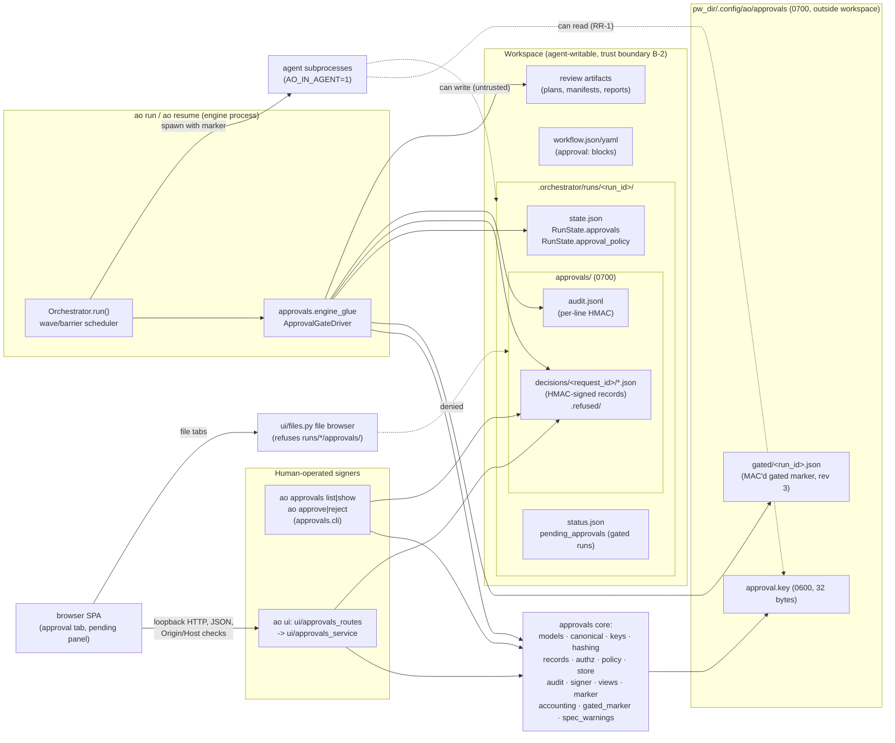
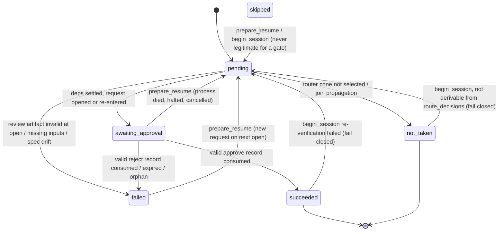
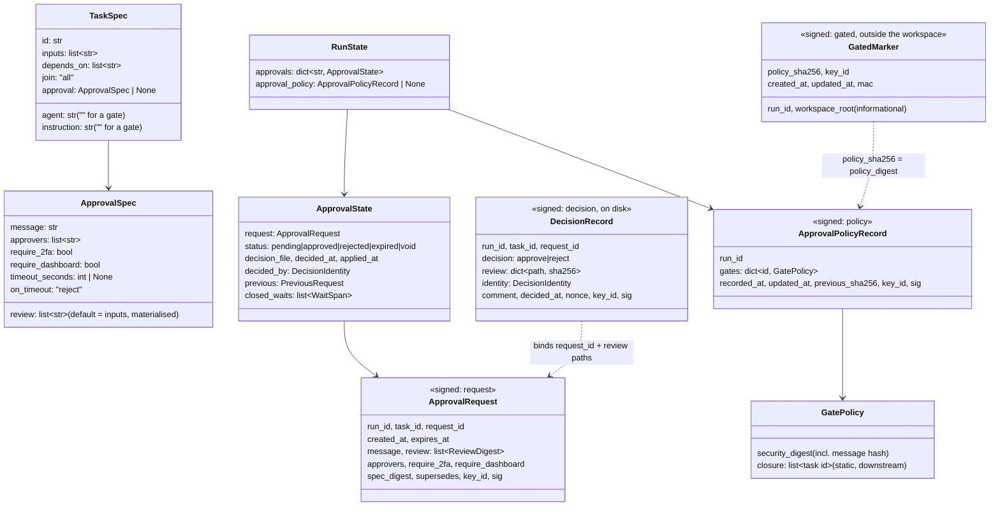

# Human approval gates — HLD + LLD (E-Ag7Pw3)

- Epic: [`E-Ag7Pw3-human-approval-gates`](../meta/tickets/E-Ag7Pw3-human-approval-gates/EPIC.md)
- ADR: [`ADR-0020`](adr/ADR-0020-human-approval-gates-signed-decisions.md)
- **Status: rev 3, frozen for implementation after Gate 2** (2026-10-05). History: rev 1 → early design
  Gate 1 (dev-security FAIL, reviewer PASS-WITH-CHANGES) → rev 2 → Gate 2 delta re-gate (both
  PASS-WITH-CHANGES) → rev 3. Every finding of both gates is mapped in §0.5. The tickets and the §9
  pseudocode are the implementation contract; deviations found during implementation are recorded in a
  new §27 by the docs ticket, never by editing this text. No code exists yet. Every engine/UI claim below
  was checked against the source at base `bb6d8a0` (latest `main`); line numbers are approximate and
  must be re-verified by the implementing task.
- Author: `architect` · Date: 2026-10-04 (rev 1) / 2026-10-05 (rev 2, rev 3) · Worktree branch:
  `worktree-agent-a513b4d78ac3b20bb`
- Sibling epics built in parallel (merged later by the parent session): cross-run result cache
  `E-Rc4Hk8` (ADR-0019) and dashboard auth `E-Da5Tn9` (ADR-0021). §26 lists every shared-file edit.

> **Read §7 (threat model) before anything else.** The single most important sentence in this document:
> **agents run as the same OS user as the human, so every control in this design except "the agent does
> not know the HMAC key" is a speed bump, and the key itself is readable by any same-uid process.** The
> design deterministically stops the forged-record, replay, CLI, HTTP and resume-tampering attacks of a
> naive or prompt-injected agent listed in §7.4 — **except** the documented residuals that need no design
> knowledge: RR-2 (a CLI approval of a gate without `require_dashboard` by an agent that bypasses the
> speed bumps), RR-9/RR-13 (work that does not depend on the gate), RR-12 (an agent-chosen route around a
> gate in an optional route), RR-14 (files the gate does not review) and RR-5 for a run with no
> gated marker yet (Gate 2 S-11: deleting the gate's workspace artifacts needs only an instruction, not
> design knowledge — the rev-3 marker beside the key makes that fail closed). It does **not** stop a
> determined same-uid attacker (RR-1). A real boundary needs OS-level separation (§7.6, roadmap R-AG-1).

---

## 0. Summary, reading guide, resolved questions

### 0.1 One-paragraph summary

A workflow task becomes a **human approval gate** by carrying an `approval:` block instead of an
`agent`. When its dependencies are satisfied the engine opens it in a **pre-pass that runs before the
FILL loop**, independent of `max_parallel` capacity: it content-hashes the declared review artifacts,
writes an **engine-signed request** (nonce `request_id`, `created_at`, `expires_at`, message, review
hashes, approvers, flags) onto `RunState.approvals`, and marks the task `awaiting_approval`. The gate
holds no executor slot; independent tasks keep running. A human decides with `ao approve`/`ao reject`
or the dashboard. Either signer re-checks authorization and the current artifact hashes, then writes an
**HMAC-signed decision record** under `<run_dir>/approvals/decisions/<request_id>/`, using a per-user key
stored outside the workspace (`<passwd home>/.config/ao/approvals/approval.key`, 0600). The engine polls
cheaply, verifies every binding (signature, run, task, request, expiry, approver, `require_*` flags, and
a **re-hash of the review artifacts at consume time**), then settles the gate: approve → `succeeded`;
reject or timeout → `failed`, which halts the run through the existing failure semantics. `ao resume`
and boot-resume re-enter a pending wait with the original `request_id` and expiry. **Resume integrity
never trusts `state.json` to skip a check:** on every resumed session (known to the engine, not read
from the file) every gate's status is re-verified, and a signed, **gate-scoped approval policy** (each
gate's security fields plus its static downstream closure) refuses a resume after an edit that weakens
a gate or detaches work from it. An engine-written, MAC'd **gated marker** kept beside the key (rev 3)
records that the run is gated and which policy it has, so deleting the policy and the gate's workspace
artifacts fails closed too. Every decision and every refused attempt is appended to a MAC'd audit log.

### 0.2 Reading guide

| If you are… | Read |
|---|---|
| a reviewer checking the gate fixes | §0.5 (Gate 1 and Gate 2 changelogs), then the sections they point to |
| a first-time `reviewer` / `dev-security` | §7 threat model, §9.3–§9.9 decision channel, §9.10 engine, §26 touchpoints, §23 risks |
| implementing a task | your ticket, then the §9 module it names (each has pseudocode, contracts, edge cases) |
| the parent session merging three epics | §26 touchpoint inventory, §16.4 cross-epic integration requirements, §3.2 / §23.3 decision points |
| a workflow author | §13 spec example, §17 authoring guidance, §7.5 control-strength ladder |

### 0.3 Resolved design questions (Q-A … Q-R from the epic brief)

| Q | Decision (short) | Deviates from the manager's recommendation? | Section |
|---|---|---|---|
| Q-A anonymous dashboard principal | **Refused, always** (403 `anonymous`), including when `approvers` is empty. The dashboard stays a read-only review surface when auth is off; the UI names the exact CLI command | **Yes** (accepted by both Gate 1 reviewers). Binding decision 1 defines empty `approvers` as "any *authenticated* identity or local CLI". Accepting anonymous would make the dashboard an unauthenticated signing oracle for any local process (curl without `Origin` passes the existing middleware), which is exactly the "decision an agent could trivially produce" that binding decision 3 forbids | §7.4 TM-3, §9.14.3 |
| Q-B key custody | `AO_APPROVAL_KEY_DIR` > `$XDG_CONFIG_HOME/ao/approvals` > `<pw_dir>/.config/ao/approvals`, where `pw_dir` comes from `pwd.getpwuid(os.geteuid())` (never `$HOME`, `~` or `Path.home()`); both overrides count only from the **real** process environment. 32-byte key, dir 0700, file 0600, owner = euid, no symlinks, refused inside the workspace; created **only by the engine** via an O_EXCL temp file + no-clobber `link()` (no fallback path, no read retries: a filesystem without hard links gets a clear error); `key_id` in every record; secret held in a `repr=False` field and the root Typer app shows no traceback locals. The agent-writable `.ao/config.yaml` `env:` block may **not** set `AO_APPROVAL_KEY_DIR`, `XDG_CONFIG_HOME`, `AO_IN_AGENT`, `HOME`, `USER` or `LOGNAME` (TM-28, T-12). Rotation is non-MVP (it voids in-flight gated runs, fail closed). Rev 3: the key directory also holds one engine-written, MAC'd gated marker per gated run (`gated/<run_id>.json`, §9.3.4) | No | §9.3 |
| Q-C hash binding | Records bind `{run_id, task_id, request_id, decision, review{path: sha256}}`. The dashboard echoes the hashes of the exact bytes it displayed (single bound read); the CLI hashes at show time and re-checks at sign time (`--expect-digest` for scripted use); the engine re-hashes at consume time. Regular files only, ≤ 10 MiB each, ≤ 32 paths, ≤ 64 MiB per request; at most one consume-time re-hash per poll across all gates, round-robin (rev 3, Gate 2 R-10) | No (adds the bound artifact endpoint, see T-6) | §9.4, §9.6.5, §9.14 |
| Q-D drift while pending | Stale decision refused (`stale_hashes`) and audited; the gate stays pending; **no automatic refresh**; UI and CLI show drift against the open-time hashes | No | §9.5, §12.5 |
| Q-E resume | "Is this a resume?" comes from the engine (`run()` was handed `run_state is not None`), plus belt-and-braces in-file evidence that can only make checks stricter; "is this run gated?" comes first from the out-of-workspace gated marker (rev 3). On every resumed session every gate is re-verified: `succeeded` needs a valid signed request and accepted approve record; `skipped` is reset; `not_taken` (on a gate or any gate ancestor) survives only if the engine itself derives it from `route_decisions` and the graph; persisted loop clones are re-derived from the static base. Pending → re-enter with the same `request_id`/expiry; a decision recorded while the engine was down is honoured iff `decided_at < expires_at`; rejected/expired → new request with `supersedes`. Expiry is absolute | No (hardened at Gate 1: S-01, S-02, R-04; at Gate 2: S-11, S-12, R-11) | §9.10.6 |
| Q-F spec drift on resume | Per-request `spec_digest` **plus** a signed, **gate-scoped** `approval_policy`: per gate, its security digest and its static forward closure. Resume is refused if a gate disappears, its digest changes, or a recorded closure member disappears or is no longer reachable from the gate; every other spec edit is allowed. A missing or invalid policy on a resumed run fails closed when the gated marker (rev 3) or in-state evidence shows the run is gated | **OQ-2 (modified at Gate 1): gate-scoped policy instead of the rev-1 whole-DAG freeze.** Parent-session decision point | §9.9 |
| Q-G gate task shape | `agent` and `instruction` absent or `""` (string sentinels, so both fields keep type `str` and no caller changes); forbidden: `outputs`, `output_manifest`, `retries`, `timeout_seconds`, `emit_tasks`, `task_manifest_path`, `model`, `effort`, `max_turns`, `touches`, `pre_hook`, `post_hook`, `verdict_path`, `isolation: worktree`, `join: any`. Allowed: `id`, `inputs`, `depends_on`, `skip_if_outputs_exist` (inert), `isolation: none`/`inherit` (forced to `none`). `approval: null` is a **non-gate** in both pydantic and JSON Schema. Enforced in pydantic (value-based, reload-safe), JSON Schema `if/then/else`, and `cross_validate`. A wrap serializer omits `approval` when it is `None`, so gate-free dumps and spec hashes stay byte-identical | No | §9.1 |
| Q-H loop clones | The `review` default is materialised at `TaskSpec` validation, so `_clone_body` (which clears `inputs`) keeps it; one request per clone id. Clones lose inferred edges, so fatal AG-4 requires explicit `depends_on` paths to every in-body producer of a review file (T-13). A clone gate's `ApprovalSpec` always comes from the **static base gate**, never from the persisted clone (R-04) | No (adds AG-4 and R-04) | §9.1.5, §9.10.6 |
| Q-I emit containment | `read_task_manifest` rejects any manifest task that contains the key `approval` (even `null`) → the emitter fails with `manifest_error`. Injected tasks may omit the gate dependency (documented limitation RR-9; `ao validate` warns when a gate sits downstream of an emitter) | No | §9.1.6 |
| Q-J settle path | **Dedicated** `_settle_approval_gate` + extraction of the breaker block into `_evaluate_boundary_breakers` (a pure move, committed first and alone). Full interplay table | Chooses the brief's alternative, with reasons | §9.10.4 |
| Q-K AO_IN_AGENT | Set per child at **8 edit sites covering 10 spawn points** (agent CLI, hooks, verify, regenerate, every `GitRepo._run` call, `GitRepo.version`/`probe`, the validate-time git probe, bench subjects, bench graders), always applied **after** any env overlay so an overlay cannot unset it; never in the engine's own env; `ao approve`/`ao reject` refuse; `--yes` is refused; non-TTY without `--yes` is refused. Both are speed bumps (§7.5) | No | §9.11 |
| Q-L audit | `<run_dir>/approvals/audit.jsonl`, `O_APPEND`, 0600, one JSON object per line with a per-line HMAC (tamper-evident for edits, **not** for deletion/truncation), ≤ 4 KiB per line; the engine mirrors its events to `run.log`; refusal audits are capped at 100 per request (no extra flood/suppression events) | No | §9.7 |
| Q-M poll interval | `Orchestrator(approval_poll_seconds=…)` > env `AO_APPROVAL_POLL_SECONDS` > default `5.0`, resolved lazily only for gated runs; floor 0.05 s (what tests use). `.ao/config.yaml` reaches it through the existing `env:` block (no new config key, no `run`/`resume` flags) | Drops the optional `approvals.poll_seconds` config key: the `env:` block already covers it | §9.10.7 |
| Q-N concurrency | Unique record names, O_EXCL temp + atomic rename; per poll the engine evaluates records in filename order (the filename starts with `decided_at`); the first **valid** one wins; later ones are refused `already_decided`; every refused record is moved to `.refused/`, so it is evaluated exactly once and never blocks a later valid one. A signer refuses (409 / exit 6 `already_decided`) when a valid record for the request already exists | No | §9.6, §9.12 |
| Q-O dashboard API | 5 routes (list, run-level, task-level view, bound artifact read, POST decision); a 403/404/409/422/500 contract with a machine-readable `reason` from **one** mapping table (reason → HTTP status → CLI exit code); principal read defensively in a new module; no hash cache, semaphore or 429 (cut at Gate 1; size caps kept) | Adds 2 GET routes (task view + bound artifact), see T-6 | §9.14 |
| Q-P frontend | Status tone/glyph/legend, a pending panel on the runs page, a new `approval` tab kind for the review view, Review links in run detail, two-step confirm, an approval-wait stat next to wall/active time. **No sidebar badge** | Drops the sidebar badge (panel + per-run chip instead) | §9.15 |
| Q-Q consumers | Table of every consumer with the chosen behaviour | No | §9.2.6 |
| Q-R wait accounting | Pure `compute_run_approval_wait_seconds(state)`: an undecided request's wait ends at `state.updated_at`, the **same end marker as the dashboard's wall time**, so wait never exceeds wall; live "waiting for" in the review/pending views is computed client-side from `created_at`. Never added to active seconds | No | §9.2.5 |

### 0.4 Tensions and contradictions found in the brief (and how they were resolved)

| # | Tension | Resolution | Consequence |
|---|---|---|---|
| T-1 | Binding decision 1 ("empty approvers = any **authenticated** identity or local CLI") vs Q-A's recommended "accept anonymous" | The binding text wins: anonymous is refused | Until dashboard auth is enabled (sibling epic), dashboard decisions are impossible; CLI only. Flagged as OQ-1 |
| T-2 | `instruction` is required today; a gate has none | `instruction: str = ""`. A non-gate must **supply the key** (`"instruction" in model_fields_set`); a gate must have `""` | Old states (which always serialize the key) still load. Invariant: never dump `TaskSpec` with `exclude_unset`/`exclude_defaults` (unit-tested) |
| T-3 | `_clone_body` clears `inputs` vs "review defaults to inputs" | The default is materialised at `TaskSpec` validation | Clones keep `review`; no `_clone_body` change |
| T-4 | "Wait must not count toward run-active-seconds" vs `run_wall_clock_seconds` being a deadline from `RunState.started_at` | Not "fixed". Gates never get `started_at`, so active seconds exclude them for free; the wall-clock breaker **does** count the wait by design | `ao validate` warns (W-AG-2) when a gated workflow declares a wall-clock breaker. A wall-clock breaker that became due during the wait fires at the gate's settle boundary, before any downstream dispatch |
| T-5 | Engine invariant "never reads artifact contents (NFR-1)" vs "the engine re-hashes review artifacts" | One narrow, audited exception: `approvals/hashing.py` streams the declared review files through SHA-256 (bounded, never parsed, never logged) | Recorded in that module's docstring, and in `hld-agent-orchestrator.md` by the docs refresh |
| T-6 | "Review file content via the EXISTING `/api/files/content`" vs binding the displayed bytes to the echoed hash | A scoped endpoint `GET …/approval/artifact?path=` reuses `FileBrowser.read_file` internally, sandwiched between two hashes of the same file (409 if they differ) | One extra route; the existing endpoint is unchanged (and now refuses the approvals tree, S-06) |
| T-7 | "Decisions are append-only records" vs moving refused records into `.refused/` | Record **contents** are immutable and never deleted; refused ones are renamed within the approvals tree, so each one is evaluated exactly once | Bounded polls and no starvation; documented |
| T-8 | Q-L says `<run_dir>/approvals/` is "written by CLI/dashboard/engine"; ADR-0011 says the workspace is agent-writable | Everything under the run dir is untrusted input to the engine; only signatures make a record trustworthy | Stated as trust boundary B-2 (§7.2) |
| T-9 | The brief adds `pending_approvals` and a counts key to `status.json`; two existing tests (`tests/test_isolation_models.py`, `tests/test_spawn_provenance.py`) pin the exact top-level key set of `status.json` | `pending_approvals` (and `counts.awaiting_approval`) are emitted **only when the run has approval requests** | A gate-free `status.json` stays byte-identical; consumers use `.get("pending_approvals", [])` |
| T-10 | The brief wants run detail/graph to reflect gates; `tests/ui/test_run_graph_endpoint.py` pins the exact new-key sets of `RunDetail` and `TaskStat`, and `tests/ui/test_graph_contract.py` pins `GraphNode` against a fixture | No new fields on `RunDetail`, `TaskStat` or `GraphNode`. Approval data flows through new endpoints; the status colour comes from the existing `status` string | No graph badge for gates in MVP (follow-up F-6) |
| T-11 | The dashboard "signs with the same key", but it may run under `ao service` (systemd) with a different `XDG_CONFIG_HOME` | Every request carries `key_id`; signers compare before signing and fail with an explicit "key mismatch: this process uses key X at path P; the run was opened with key Y" | Misconfiguration is diagnosable, never silent |
| T-12 | The brief wants an env override for the key dir (tests); `apply_project_config_env` exports **any** key of the agent-writable `.ao/config.yaml` `env:` block that is not already set | A 6-key denylist in `apply_project_config_env` (`AO_APPROVAL_KEY_DIR`, `XDG_CONFIG_HOME`, `AO_IN_AGENT`, `HOME`, `USER`, `LOGNAME`; warning `config.env_denied`) and a `pwd`-derived default home | A small `project_config.py` edit (the brief preferred none); closes key redirection (TM-28). Found by the `developer` consultation, extended at Gate 1 (S-08) |
| T-13 | "Review defaults to inputs" (inferred edges order the gate after its producers) vs `_clone_body` clearing `inputs`/`outputs`, which removes those inferred edges for loop iterations ≥ 2 | Fatal AG-4: a gate in a loop body must reach every in-body producer of a review path through **explicit** `depends_on` (which `_clone_body` rewrites and keeps) | Loop-body gates need explicit `depends_on`; without AG-4 an iteration-2 gate could open before its producer and show stale content. Found by the `developer` consultation |
| T-14 | Gate 1 decision S-03 lists "the spec has any gate" as evidence that a resumed run is gated (so a missing policy fails closed), **and** requires that "adding a gate to an in-flight run" stays legal — the newly added gate is in the spec, so the first rule would always forbid the second | Evidence of gatedness is taken from the **out-of-workspace gated marker** (rev 3) and from **in-state facts** (an `approvals` entry, a gate task in any status other than `pending`, any `awaiting_approval` task, a present policy), **not** from the current spec alone and — rev 3, Gate 2 S-12 — **not** from a bare `<run_dir>/approvals/` directory. With a gate in the spec and no such evidence, the policy is created at that session (`approval.policy_recorded`, `on_resume: true`) | "Add a gate to an in-flight run" works; erasing the policy and the gate's workspace artifacts fails closed while a marker exists; RR-5 (rewritten in rev 3: an instructed agent needs no design knowledge) covers runs without a marker. Flagged in §3.2 OQ-13 |
| T-15 | Gate 1 suggestion S-08 asks `current_task` to "prefer running, then pending, then awaiting"; the existing rule is "first task that is running **or** pending in insertion order", and changing it would change gate-free `status.json` | Keep the existing first-match over running/pending; only when neither exists, fall back to the first `awaiting_approval` task | Gate-free `status.json` stays byte-identical (NFR-1); an awaiting gate is never preferred over real work |
| T-16 | Gate 1 decision R-05 adds 0.5 d (`approvals/views.py`) to `T-pfJiXw`, which would make it 3.5 d — above the 3-day task cap | `audit.py` moves from `T-pfJiXw` to the new `T-drPIif` (split from `T-csusci`, R-06), together with the pure wait accounting that `views.py` needs (so `T-pfJiXw` does not depend on a later stage) | Every task stays ≤ 3 d (§22.2); `T-ZPGoSN` shrinks to 1.5 d |
| T-17 | Gate 1 decision R-03 refuses resume when "a closure member is detached from the gate (its dependency on the gate or on a closure predecessor removed)" — taken literally, removing one of two redundant edges would refuse a harmless edit | "Detached" means **no longer reachable from the gate** in the current static graph; every recorded closure member must still exist and still be reachable | Redundant-edge cleanups are allowed; an edit that frees a task from the gate is refused |

### 0.5 Gate changelogs (Gate 1 → rev 2, Gate 2 → rev 3)

#### Gate 1 changelog (rev 2, 2026-10-05)

Every finding of the early design Gate 1 (file `GATE1-FINDINGS-AND-DECISIONS.md`, manager's decisions),
where it is resolved now, and how. "ACCEPT" items are applied as decided; "MODIFY" items are applied in
the decided modified form; "REJECT" items are recorded but not built.

| Finding | Decision | What changed | Where now |
|---|---|---|---|
| S-01 CRITICAL resume detection from unsigned `spec_sessions` | ACCEPT | `is_resume = run_state is not None` (engine knowledge); integrity checks also run whenever in-file gate evidence exists (can only add checks); the create-policy path runs only for `run_state is None` and refuses to overwrite an existing policy; the rev-1 `len(spec_sessions) > 1` rule is gone | §9.10.5, §9.10.6, TM-5, TM-30 |
| S-02 CRITICAL gate flipped to `not_taken`/`skipped` | ACCEPT | Every resumed session checks every static gate: `succeeded` → re-verify, `skipped` → reset, `not_taken` → kept only if derivable from `route_decisions` + graph (`policy.derivable_not_taken`); new W-AG-7 (gate inside a router cone); new RR-12 (route-verdict forgery) and authoring rule | §9.9.3, §9.10.6, §9.1.4, §17, TM-29, TM-33, RR-12 |
| S-03 HIGH missing policy only warned | ACCEPT (with T-14) | Missing / bad-signature / key-changed policy on a resumed run with gate evidence → run `failed`, `approval.policy_violation`, never re-signed; "adding a gate is allowed, removing one is not"; residual RR-5 rewritten; follow-up F-15 (policy outside the workspace) (rev 3: evidence no longer includes the bare directory, and the gated marker makes erasure fail closed — Gate 2 S-11/S-12) | §9.9.2, §9.10.6, RR-5, §1.4 F-15, T-14 |
| S-04 MEDIUM parser depth bomb / huge int | ACCEPT | `parse_strict` caps nesting depth (`MAX_JSON_DEPTH = 32`, pre-scan) and converts `ValueError`/`RecursionError` into `malformed`; same parser for decision records and audit lines; explicit ACs | §9.3.2, §9.7, TM-31 |
| S-05 MEDIUM key in tracebacks | ACCEPT | Root Typer app built with `pretty_exceptions_show_locals=False` (cli.py one-liner, §26); `ApprovalKey` secret `repr=False`; no exception embeds key bytes; `test_keys.py::test_cli_never_shows_locals` | §9.3.3, §26 row 19b, TM-4 |
| S-06 MEDIUM dashboard serves the approvals tree | ACCEPT | `FileBrowser.resolve` refuses any path inside `.orchestrator/runs/<id>/approvals/`; TM-21 corrected; CE-4 coordination with the auth epic's own store denial | §9.14.6, §26 row 36, TM-21, CE-4 |
| S-07 MEDIUM gate binds an edge, not behaviour | ACCEPT (docs + warning) | Authoring rule in §17; W-AG-8 when a task downstream of a gate (up to the next gate) reads an instruction/input that the gate does not review and that no task in that region produces; RR-14; RR-3/F-5 stay the full fix (rev 3: W-AG-8 withdrawn, documentation only — Gate 2 R-10) | §9.1.4, §17, RR-14, TM-32 |
| S-08 MEDIUM `$HOME` injection via config | ACCEPT | Default home from `pwd.getpwuid(os.geteuid()).pw_dir`; overrides only from the real environment; denylist is 6 keys | §9.3.3, TM-28, OQ-12 |
| S-09 LOW re-hash cost per poll | ACCEPT | `MAX_REHASH_BYTES_PER_POLL` (128 MiB) across all gates with a round-robin cursor; N-gate cost documented; dashboard hash LRU/semaphore dropped (rev 3: replaced by at most one re-hash per poll, round-robin — Gate 2 R-10) | §9.6.5, §9.14.5 |
| S-10 LOW `GitRepo.version`/`probe` bypass the marker | ACCEPT | Both now pass `env=agent_child_env()`; listed in the §9.11 table | §9.11 |
| Claims to correct | ACCEPT | ADR threat table A1 row, TM-5 ("on every resumed session"), §7.4 preamble (speed-bump definition), TM-21, "key never in logs" (now with S-05), RR-5; new residuals RR-12 (route verdicts), RR-13 (emitted-task rewiring), RR-14 (unreviewed downstream inputs); parser DoS and metadata exposure recorded as closed | header callout, §7.4, §7.6, ADR-0020 |
| R-01 gates open only with a free slot | ACCEPT | `_open_ready_gates` pre-pass before FILL opens every ready gate regardless of `len(in_flight)`; gates excluded from FILL, `rank_wave` and the capacity count; barrier only when `integration.active and in_flight`; new ACs (max_parallel=1; decision recorded while down consumed on the first pass) | §9.10.5, §9.10.4, §17, T-vwIpSw |
| R-02 test key dir inside a test workspace | ACCEPT | Key dir from `tmp_path_factory.mktemp("approval-keys")`; hermeticity test asserts it is outside every test workspace; applied to UI tests and the subprocess child | §18.2, §18.5 |
| R-03 whole-DAG freeze too broad | MODIFY (as decided) | Gate-scoped policy: per gate, security digest (incl. message hash) + static forward closure; refusal rules of Q-F; "OQ-2 (modified)" kept as a parent decision point | §9.9, Q-F, OQ-2, ADR D7 |
| R-04 loop clones bypass resume protections | ACCEPT | Clone gates take their `ApprovalSpec` from the static base (`strip_iter_suffix`); `begin_session` re-derives persisted clones with the engine's own `_clone_body` and fails closed on any gate-field or `depends_on` mismatch; emitted-task rewiring is RR-13; ADR/TM-5/TM-7 corrected | §9.10.3, §9.10.6, TM-7, RR-13 |
| R-05 duplicate listing/view builders | ACCEPT | New `approvals/views.py` (`scan_pending`, `build_task_view`) owned by `T-pfJiXw`; CLI and dashboard consume it | §9.12.2, §9.13, §9.14, T-16 |
| R-06 T-csusci overloaded | ACCEPT (re-estimated) | Split into `T-drPIif-canonical-keys-audit` (canonical + bounded parser + keys + xdg + 6-key denylist + `cli.py` one-liner, plus audit and wait accounting moved in by T-16: 2.5 d) and `T-1MgGb4-hashing-records-authz-policy` (hashing + budget, records V0–V12 + refusal codes, authz, gate-scoped policy + resume-integrity helpers + W-AG-7/8: 2.5 d). The manager's 1.5 d / 2 d grew with the Gate 1 additions they absorb; both run in parallel and `T-1MgGb4` replaces the 3-day `T-csusci` on the dependency chain (17.5 d; 18 d with the capacity-feasible schedule) (rev 3: T-drPIif 3 d with the gated marker; W-AG-7/8 moved to T-Mdk27e — Gate 2) | §22, §24, EPIC |
| R-07 approval wait never displayed | ACCEPT | Wait stat + vitest in `T-pIZq3q`; server value uses the wall-time end marker (`updated_at`), live wait client-side | §9.2.5, §9.15 |
| R-08 refusal codes parsed from messages | ACCEPT | Closed `RefusalReason` enum with explicit codes; one mapping table reason → HTTP → CLI exit | §9.5.3, §9.14.3 |
| Sugg S-01 `"approval": null` parity | ACCEPT | `null` = non-gate in both; schema `if` requires an object; added to the parity table and re-verified | §9.1.3 |
| Sugg S-02 new field changes every spec hash | ACCEPT | Wrap serializer omits `approval` when `None`; golden test (gate-free dump + sha unchanged vs base); residual only for gated workflows | §9.1.2, §16.2 |
| Sugg S-03 spawn-site wording | ACCEPT (count updated) | The reviewer's "7 edit sites / 8 spawn points" became "8 edit sites / 10 spawn points" once S-10 marked `GitRepo.version`/`probe`; used consistently (FR-13, §0.3, §8.4, §9.11, §19, EPIC, T-1B8hu4); regenerate-resolver test; the marker is the last env assignment at every site + `AO_IN_AGENT: "0"` overlay test | §9.11, FR-13, T-1B8hu4 |
| Sugg S-04 wrong §13 example | ACCEPT | Rewritten with the injected-aggregator pattern of `specs/examples/workflow-dynamic-fanout.json`; re-validated | §13 |
| Sugg S-05 factory seam, no asserts | ACCEPT | `approval_driver_factory` ctor parameter replaces `approval_key_store`; every `assert ctx.approvals` replaced by `ApprovalStateError` (fail closed) | §9.10.5, §8.5 |
| Sugg S-06 second racer gets 409 | ACCEPT | `commit_decision` refuses `already_decided` when a valid record exists | §9.12 |
| Sugg S-07 undecidable gates | ACCEPT | W-AG-9 (require_dashboard/2fa needs dashboard auth; `timeout_seconds: null` waits forever) | §9.1.4 |
| Sugg S-08 `current_task` ordering | MODIFY (T-15) | Awaiting gates only as a fallback after running/pending, to keep gate-free output identical | §9.2.4 |
| Sugg S-09 shared checkout never synced | ACCEPT | W-AG-10 for `sync_checkout: never` / `workspace_lock: skip_sync` with gates | §9.1.4 |
| Sugg S-10 extraction first | ACCEPT | Pure-move extraction is `T-vwIpSw`'s first commit, run against the existing suites alone | T-vwIpSw, §9.10.4 |
| Sugg S-11 housekeeping | ACCEPT except the attribution note | `Role: agent` kept (**REJECT** the reviewer's note: the agent definitions mandate it); critical path consistent (18 d in A-7 and §22.1; the dependency chain alone is 17.5 d); tests use the 0.05 s poll floor; `TASK_ID_PARAM_PATTERN` named and enforced for gate ids by the new fatal rule AG-5 (so every gate is addressable by `ao approve` and the dashboard); `$HOME` as workspace refuses gated runs (§16.3 + error message) | §3.1, §22.1, §9 constants, §9.1.4, §16.3 |
| CUT 1 | = R-03 | — | §9.9 |
| CUT 2 dashboard hash LRU + semaphore + 429 | ACCEPT | Removed; size caps kept | §9.14 |
| CUT 3 key-creation fallbacks + read retries | ACCEPT | `link()` only; clear error without hard links | §9.3.3 |
| CUT 4 flood/suppressed events | ACCEPT | Removed; per-request refusal-audit cap kept | §9.6.4, §15 |
| CUT 5 optional module merges | ACCEPT (one merge) | `settings.py` folded into `engine_glue.py`; resume-integrity helpers live in `policy.py`; module count stays 17 with the new `views.py` | §8.2 |
| Parallelisation map | ACCEPT | Stages A–E with exclusive files per ticket; serialized full-suite checkpoints; `test_import_layering.py` owned by `T-AGO2L6` only | §22.3, tickets |
| Parent decision points | ACCEPT | OQ-1, OQ-2 (modified), CE-1, OQ-12 (6 keys), OQ-13 (T-14), OQ-14 (`approvals/` file-browser denial, CE-4), OQ-15 (`pretty_exceptions_show_locals` one-liner) | §3.2, §23.3 |

**New concerns found while applying Gate 1 (not in the findings file):**

| ID | Concern | Resolution |
|---|---|---|
| NC-1 | S-02 checks the gate only, but a gate is `join: all` by rule, so a forged `not_taken` on any **ancestor** of the gate propagates to the gate through a legitimate engine rule (`_apply_join`) and its `join: any` dependents then run unapproved | `begin_session` also resets non-derivable `not_taken` on every gate ancestor (§9.9.6, §9.10.6, TM-29) |
| NC-2 | S-06 hides `approvals/`, but `state.json`, `status.json` and `run.log` carry the same metadata (identity, comment, excerpt) and the file browser serves them like any run artifact when dashboard auth is off | Documented honestly as RR-15 (pre-existing posture of an unauthenticated dashboard); not "fully closed" as the findings file suggested |
| NC-3 | A validly signed request copied from another task (or run) into `approvals[g]` passes a signature-only check | Re-entry, `approved_and_verified` and the signer also check the request's `run_id`/`task_id` binding (`bad_binding`, §9.10.3, §9.12.1) |
| NC-4 | Rev 1 let `T-vwIpSw`'s `begin_session` be a **no-op** on resume until `T-otHPGB` lands — fail-open between two merges | `T-vwIpSw` ships a resume path that refuses (`ApprovalPolicyError`) until `T-otHPGB` replaces it (fail closed in the interim) |
| NC-5 | Gate-free runs now cost one `lstat` of `<run_dir>/approvals` (driver construction must see the directory as gate evidence) — rev 1 promised zero I/O | NFR-1 restated: no key access, no file created, no log line, identical outputs; the single `lstat` is the only I/O (§9.10.1) | (rev 3: fresh gate-free runs do no added I/O; resumed gate-free runs lstat one gated-marker path instead)
| NC-6 | R-07's end-marker fix alone still lets the summed wait of parallel gates exceed the wall time | Run-level wait is the **union** of waiting intervals inside the wall-time window (`closed_waits` spans replace the rev-1 scalar), with a property test `wait <= wall` (§9.2.5) |
| NC-7 | Persisted clones of a gated loop are compared with a re-derivation from the **current** spec, so a legitimate edit of that loop body's `depends_on` between sessions is refused | Accepted and documented (§17 rule 6, runbook): a gated loop's body structure cannot change while iterations exist |

#### Gate 2 changelog (rev 3, 2026-10-05 — frozen for implementation)

Gate 2 was the delta re-gate of rev 2: dev-security **PASS-WITH-CHANGES** (S-01..S-10 and the
false-claims list resolved; two new findings), reviewer **PASS-WITH-CHANGES** (R-01..R-05, R-07, R-08,
S-01..S-08, S-10, S-11 and the cuts resolved; R-06, S-09 and the parallel map partial; new R-09..R-14).
Both accepted OQ-12..OQ-15. Source: the manager's `GATE2-FINDINGS-AND-DECISIONS.md`. Rows marked "rev 3:" in
the Gate 1 table above point here where a rev-2 resolution was replaced.

| Finding | Decision | What changed | Where now |
|---|---|---|---|
| S-11 HIGH erasure of an unopened gate by an instructed agent; RR-5 over-stated | ACCEPT (a) + (b) | (a) RR-5, the A1 row, TM-7/TM-34, OQ-13, T-14 and the ADR erasure row rewritten honestly: deleting the gate's self-named workspace artifacts needs only an instruction, not design knowledge. (b) F-15-lite in the MVP: an engine-written, MAC'd gated marker `<key_dir>/gated/<run_id>.json` (kind `gated`) carrying the policy digest; written only after the signed policy is saved; a present marker with a missing or different policy fails closed (`missing_with_marker`, `marker_mismatch`, `marker_invalid`); a valid policy without a marker self-heals; a marker one legitimate re-signing behind rolls forward (signed `previous_sha256`); the driver probes the marker on every resume, even for gate-free specs; new TM-36, R-23/R-24, F-16; owner tickets `T-drPIif` (I/O) and `T-1MgGb4` (`check_marker`), wiring `T-vwIpSw` (fresh run) and `T-otHPGB` (resume) | §9.3.4, §9.9.3, §9.10.1, §9.10.6, §7.3, §7.4 TM-34/TM-36, §7.6 RR-5, §1.4, §16.2, §16.3, §12.8, ADR D14 |
| S-12 LOW planted bare `approvals/` directory bricks a gate-free resume | ACCEPT | The directory is no longer evidence; `for_run` no longer `lstat`s it; `begin_session` never creates it (lazily at the first `open_gate`); new TM-35 and test `test_planted_approvals_dir_does_not_brick_gate_free_resume`; `parse_strict` RecursionError/ValueError handling and the `state.json` → `not_found` mapping kept | §9.9.4, §9.10.1, §9.10.6, §7.4 TM-35 |
| R-09 test-fixture ownership | ACCEPT | `T-AGO2L6` writes only the autouse hermeticity fixtures (+ `test_hermeticity.py`); `T-pfJiXw` (stage C, alone) appends `fake_clock` / `make_gated_workflow` / `human_decides` and owns `conftest.py` while it runs; `T-vwIpSw` keeps its engine fixtures in `tests/approvals/engine_helpers.py` | §18.2, §22.3, tickets |
| R-10 critical chain overloaded; per-file re-hash budget too complex | ACCEPT, with the W-AG-8 option taken | W-AG-7 (helper in the new `approvals/spec_warnings.py`, wiring, tests) moved to the new stage-E ticket `T-Mdk27e-gate-route-loop-checks` (1 d), together with the engine-level routes/loops/manifest tests that `T-otHPGB` gives up to absorb the marker work; **W-AG-8 withdrawn** (documentation only: §17 rule 7, §13, RR-14; R-19 retired) because it was the noisiest and most complex rule and could never enforce anything. The `RehashBudget` and every `deferred` state in hashing/records are gone: **at most one consume-time re-hash per poll, round-robin** (store answers `needs_rehash`, records untouched; DoS bound ≤ 64 MiB per poll). Schedule re-run: 34.5 dev-days, S1 19 / S2 15.5, critical path 18 d | §9.4, §9.5.3, §9.6.4, §9.6.5, §9.9.7, §9.1.4, §22, EPIC |
| R-11 begin_session created `approvals/` before saving the policy | ACCEPT | Crash-safe order: sign the policy → save `state.json` → write/replace the marker → directory lazily at the first open; crash-window tests (save-before-marker spy, marker missing self-heals, marker one step behind rolls forward, marker unwritable fails closed) | §9.3.4, §9.10.6, §12.9, §18.3 |
| R-12 wrong field paths in W-AG-10 | ACCEPT | `integration.sync_checkout` / `integration.workspace_lock` (`IntegrationSpec`) everywhere | §9.1.4, §17 rule 9, T-AGO2L6 |
| R-13 `cli.py` rule vs overlapping schedule; missing file in T-otHPGB | ACCEPT | Rule reworded to "never edit `cli.py` concurrently"; ordered edit window `T-drPIif` → `T-nmL0HP` (registration first, then never again) → `T-ZPGoSN` (printers), disjoint hunks; schedule moved `T-ZPGoSN` to 11–12.5; `tests/approvals/test_engine_gate_lifecycle.py` added to `T-otHPGB`'s files | §22.2, §22.3, tickets |
| R-14 gate detection via the persisted `approval` | ACCEPT | `_is_gate` (persisted `approval` or `effective_approval`) at both detection sites (`_open_ready_gates`, `_prepare_and_maybe_dispatch`, incl. the `dispatch_cycle` guard); legitimate join-propagated `not_taken` gate case added to `T-otHPGB` AC3 | §9.10.3, §9.10.5, §18.3, T-otHPGB |
| Reviewer closing advice: freeze; OQ-14 is hygiene | ACCEPT | Header and §21: rev 3 frozen; deviations go to a new §27 kept by `T-wH71UE`; OQ-14 marked hygiene, not a boundary, first to drop if the CE-4 merge is contentious | header, §21, §25, §3.2, §9.14.6, §16.4 |

**New concerns found while applying Gate 2:**

| ID | Concern | Resolution |
|---|---|---|
| NC-8 | The required order "save the policy, then write the marker" alone would still brick a run on a crash *between saving a re-signed policy and updating the marker*: the marker would carry the old digest | The re-signed policy carries a signed `previous_sha256`; a marker exactly one step behind is accepted and rolled forward (only the engine can produce that chain) |
| NC-9 | To catch an erased run whose spec no longer has any gate, the driver must exist even for a gate-free spec — so every **resumed** run now resolves the key directory and `lstat`s one marker path | Accepted: fresh gate-free runs still do no added I/O; resumed gate-free runs do one path resolution + one `lstat` (no key read, no file, no log). An unresolvable key directory means no marker can exist, so the probe is skipped silently (NFR-1 restated) |
| NC-10 | Markers are keyed by run id, which embeds a second-resolution timestamp: two workspaces starting the same workflow in the same second collide | The second fresh run refuses to start (`marker_collision`); starting it again yields a new id. Documented, negligible |
| NC-11 | A resume in another account or machine (or after a key-directory reset) has no marker, so only in-state evidence protects that run | Documented in RR-5 (b) and R-23; the marker is written there once the policy verifies |


---

## 1. Requirements

### 1.1 Goals

| ID | Goal |
|----|------|
| G-1 | Pause a workflow at a declared DAG node until a human approves or rejects it ("review the plan before the expensive fan-out", "confirm before the destructive/merge step") |
| G-2 | A decision must not be forgeable by an agent writing a file or running `ao approve` naively; residual risk is stated honestly |
| G-3 | Waiting costs nothing (no executor slot, no tokens, no active-seconds) and survives crash, `ao resume` and boot-resume without silently re-asking or silently approving |
| G-4 | Humans can decide from the terminal or the dashboard, see exactly what they approve (message + content-hashed artifacts), and see why a decision was refused |

### 1.2 Functional requirements (MVP)

| ID | Requirement | Verification |
|----|-------------|--------------|
| FR-1 | A task with `approval: ApprovalSpec` is an approval gate: no agent dispatch; `agent` optional exactly when `approval` is set; shape rules (Q-G) enforced by pydantic + JSON Schema + `cross_validate`; fatal rules AG-1..AG-5; `ao validate` warnings W-AG-1..W-AG-7, W-AG-9, W-AG-10 (W-AG-8 withdrawn in rev 3); `"approval": null` is a non-gate in pydantic and JSON Schema; gate-free tasks serialize byte-identically (wrap serializer) | `tests/approvals/test_spec_validation.py` (table-driven, schema/pydantic parity) |
| FR-2 | When a gate's dependencies settle, the engine opens a signed request on `RunState.approvals[task_id]` and sets the task to `awaiting_approval`; a ready gate opens before FILL whatever the free capacity (`_open_ready_gates`), holds no executor/`max_parallel` slot and never enters `rank_wave`; independent ready tasks keep dispatching | `tests/approvals/test_engine_gate_lifecycle.py` |
| FR-3 | Approve → task `succeeded`, dependents proceed. Reject or timeout (`on_timeout: reject`) → task `failed`, no retries, no self-heal, run halts per existing semantics and stays resumable | same file |
| FR-4 | Decisions are HMAC-SHA256-signed records bound to `{run_id, task_id, request_id, decision, review hashes}`; the engine runs every check V0–V12 (§9.5.4) at consume time, with at most one consume-time re-hash per poll across all gates (rev 3); refused records are audited with a reason and never block a later valid one | `tests/approvals/test_records_verify.py`, `test_store.py` |
| FR-5 | Per-user key outside the workspace (0700/0600, owner check, symlink refusal, workspace refusal), default home from `pwd` (never `$HOME`), race-safe engine-only bootstrap through `link()` only, env overrides only from the real process environment (a workspace `.ao/config.yaml` cannot set the 6 denied keys), `key_id` in every record, no key material in logs, exceptions or tracebacks; an engine-only, MAC'd gated marker per gated run beside the key with the same custody rules (rev 3) | `tests/approvals/test_keys.py`, `test_config_env_denylist.py`, `test_gated_marker.py` |
| FR-6 | Resume and boot-resume re-enter a pending wait with the original `request_id`/expiry; decisions recorded while the engine was down are honoured if signed before expiry; approved gates are re-verified before `done` is seeded (fail closed); rejected/expired gates get a new request linked by `supersedes`. Resume integrity never trusts `state.json` to skip a check: resume is detected from the engine's own knowledge; a signed gate-scoped policy refuses a resume after a gate is removed or weakened or downstream work is removed, renamed or detached, and refuses a missing or different policy whenever the out-of-workspace gated marker (rev 3) says the run is gated, or a missing policy on a run with in-state gate evidence (a bare `approvals/` directory is not evidence); the policy is saved before the marker and crash windows self-heal; succeeded/skipped/not_taken gate statuses (and not_taken gate ancestors) are re-derived or reset; persisted loop clones of gated loops are re-derived and must match | `tests/approvals/test_engine_resume.py` |
| FR-7 | Gates the routing rules mark `not_taken` are never requested; loop-body gates get one request per iteration, always with the static base gate's spec; agent-authored `emit_tasks` manifests cannot declare `approval` | `tests/approvals/test_engine_loops_routes.py` |
| FR-8 | CLI: `ao approvals list [--run] [--all] [--json]`, `ao approvals show <run> <task> [--json]`, `ao approve <run> <task> [--comment] [--yes] [--expect-digest]`, `ao reject <run> <task> --reason … [--yes] [--expect-digest]`; identity = local OS user from the real uid (`via: cli`, `auth_strength: local`) | `tests/approvals/test_cli_approvals.py`, `test_e2e_cli_background_run.py` |
| FR-9 | Dashboard API: `GET /api/approvals`, `GET /api/runs/{id}/approvals`, `GET /api/runs/{id}/tasks/{task}/approval`, `GET …/approval/artifact?path=`, `POST /api/runs/{id}/tasks/{task}/approval`; principal read via the contract only (defensive `getattr`); authorization matrix §9.8; covered by the existing Origin/Host/Content-Type middleware; `X-Frame-Options: DENY`; every refusal carries a closed `reason` (+ `detail_code`) mapped by one table (§9.14.3); the file browser refuses the run's `approvals/` tree | `tests/ui/test_approvals_api.py` |
| FR-10 | Frontend: `awaiting_approval` tone + glyph + legend; pending-approvals panel; `approval` tab (message, artifacts with hashes and drift, Approve/Reject with comment and two-step confirm); Review links from run detail; per-run "awaiting approval" chip; an "Approval wait" stat next to wall time | vitest files in §18 |
| FR-11 | Every request, decision, expiry, refusal, supersession, re-verification failure and policy event is written to `run.log` (engine) and to the MAC'd `audit.jsonl` | event-catalog test (§15) |
| FR-12 | Surfaces stay consistent: `status.json` (`pending_approvals`, `counts.awaiting_approval`, gated runs only), `ao status` trailer, `RunSummary.approval_wait_seconds` (union of waiting intervals, never above wall time) shown next to wall time in the run view, `ao report-timing`, usage/outcomes/activity/graph rules of §9.2.6 | `tests/approvals/test_surfaces.py`, `test_wait_accounting.py` |
| FR-13 | `AO_IN_AGENT=1` is exported into the environment of every agent-influenced child process (8 edit sites covering 10 spawn points, §9.11), always as the last env assignment so an overlay cannot clear it, and never into the engine process itself | `tests/approvals/test_marker_spawn_sites.py` |

### 1.3 Non-functional requirements

| ID | Requirement | Verification |
|----|-------------|--------------|
| NFR-1 | **Byte-identical for gate-free workflows**: no key access, no `approvals/` directory, no new `run.log` lines, identical `status.json`, identical `ao status` output, identical spec dumps and `spec_sha256` (wrap serializer), identical scheduling (the DRAIN still uses `as_completed`); a fresh gate-free run does no added I/O; a resumed gate-free run resolves the key-directory path and `lstat`s one gated-marker path (rev 3; NC-5 revised) | `test_engine_gate_lifecycle.py::TestNoGateByteIdentical`, `test_spec_validation.py::test_gate_free_spec_dump_and_sha_unchanged` + the full existing suite unchanged |
| NFR-2 | Determinism: injected `clock`/`sleeper`/`cancel_fn`; `request_id`/nonce factories injectable in tests; deterministic consume order | fixed-clock tests |
| NFR-3 | Bounded I/O: every read of an untrusted file is size-capped; per-poll file and byte caps; listing scans capped (§9.6.5 constants) | adversarial flood tests |
| NFR-4 | Fail closed on any integrity doubt (bad signature, key mismatch, policy drift, missing policy with gate evidence, clone mismatch, insecure key, a gate without a driver) — never "approve on error", and never derive "this is not a resume" or "this check can be skipped" from agent-writable files | `test_adversarial.py`, `test_engine_resume.py` |
| NFR-5 | Backward compatibility: every pre-epic `state.json` loads unchanged; new fields default. A state containing gates is **not** readable by an older `ao` (documented one-way upgrade, §16.2) | `test_spec_validation.py::TestOldStateLoads` |
| NFR-6 | No new runtime dependency (stdlib `hmac`, `hashlib`, `secrets`, `os`, `stat`, `pwd`) | `pyproject.toml` diff empty |
| NFR-7 | Honest posture: threat model + residual risks documented; speed bumps never described as boundaries | reviewer / dev-security gates |
| NFR-8 | Quality gates: full pytest shows no new failure vs the brief's baseline (5041 passed, 8 skipped, 2 known bench failures); `ruff check .` (only the known I001); `ruff format --check` on changed files; `mypy` on changed modules; vitest green; line coverage ≥ 90% on `agent_orchestrator.approvals` | T-pdLR96 evidence |
| NFR-9 | Minimal shared-file footprint; every shared edit listed in §26 with a reason | review of §26 vs the diff |

### 1.4 Non-goals and non-MVP (deliberately not built)

| Item | Why not now |
|---|---|
| Quorum / N-of-M approvals | Brief non-MVP. Needs a per-request vote ledger and a "who already voted" rule; the single-decision record model extends naturally later (F-1) |
| Delegation | Brief non-MVP. Needs an identity model the dashboard-auth epic does not yet provide |
| Notifications (ntfy/Slack/email) | Brief non-MVP. Needs secrets handling (ROADMAP §3.1 "configurable secrets") |
| Park-and-exit (engine exits while waiting) | Brief non-MVP. The in-process wait mirrors quota waits; park-and-exit needs a resume trigger owned by `ao service` (F-2) |
| Reject → alternate route | Brief non-MVP. Reject = failed task; routing on a human verdict is a router feature (F-3) |
| Auto-approve rules, auto-approve on timeout | Brief non-MVP; `on_timeout` accepts only `reject` |
| Expiry reminders | Brief non-MVP (depends on notifications) |
| Directory review artifacts | A review path must be a regular file; a directory needs a Merkle/manifest hash (F-4). Authors review a summary file instead |
| Post-approval artifact pinning | Approval binds content at consume time only; protecting the file afterwards needs an engine-only content store (F-5, residual RR-3) |
| Graph-node "approval gate" badge | `GraphNode` key set is contract-pinned (T-10); colour only (F-6) |
| Sidebar badge | Avoids App-level polling and the auth epic's `App.tsx` (F-7) |
| `ao approve --wait` (block until applied) | Convenience; `ao approvals show` reports application (F-8) |
| Key rotation command | Rotation voids in-flight gated runs by design; a guided `ao approvals rotate-key` is F-9 |
| Role-based approvers (`role:admin`) | `principal.roles` is read but unused in MVP (F-10) |
| CSP `frame-ancestors 'none'` | `X-Frame-Options: DENY` ships now; `frame-ancestors` needs re-running the empirical srcdoc-iframe browser check the existing CSP comment documents (F-11) |
| Engine heartbeat while waiting | No periodic saves during a wait (they would reorder the runs list, which sorts by directory mtime); the UI computes "waiting since" itself, and the run-level wait/wall figures stop at the last save (F-12) |
| Gate scope for injected tasks | Making emitted tasks inherit a gate dependency needs a spec construct (F-13, RR-9/RR-13) |
| Join-any gates | `review ⊆ inputs` would have to follow the engine's private join-any input rule (F-14) |
| The full approval policy stored outside the workspace | Rev 3 ships the small part (F-15-lite: a signed gated marker with the policy digest beside the key, Gate 2 S-11); keeping the whole policy there needs a per-workspace store and cleanup rules (F-15) |
| Cleanup of stale gated markers | One small file per gated run accumulates in `<key_dir>/gated/`; `ao prune` cleanup is F-16 |
| Signed routing verdicts | A router's verdict is agent-authored by design; signing it would need a human in the routing loop (RR-12) |
| Separate-OS-user approval broker / WebAuthn user presence | The only real fix for RR-1; roadmap row R-AG-1 |

---

## 2. Scope

**In scope:** the spec/model/schema/validation changes; a new package `src/agent_orchestrator/approvals/`;
small, listed edits to `engine.py`, `models.py`, `spec.py`, `artifacts.py`, `runstate.py`, `cli.py`
(incl. the `pretty_exceptions_show_locals=False` one-liner), `outcomes.py`, `xdg.py`, `project_config.py`
(a 6-key env denylist, TM-28), `executors/claude_cli.py`, `hooks.py`, `isolation/{git,integrator}.py`,
`bench/{subjects,graders}.py`, `ui/{app,security,runs,activity,files}.py` (`files.py`: the approvals-tree
denial) and `specs/workflow.schema.json`; new dashboard modules `ui/approvals_{principal,service,routes}.py`;
frontend files listed in §9.15 plus a rebuilt committed bundle; new test files only (no edits to
pre-existing tests are planned — see §18.4); this HLD; ADR-0020; the docs refresh. Every shared edit is
listed in §26.

**Out of scope:** everything in §1.4; dashboard authentication itself (sibling epic `E-Da5Tn9`, consumed
through the principal contract only); the result cache (sibling `E-Rc4Hk8`, but see the integration
requirement in §16.4); new `.ao/config.yaml` keys; `service/boot_resume.py` (no change needed,
§9.10.6); new `ao run`/`ao resume` options; malicious workflow authors (§7.3).

---

## 3. Assumption log and open questions

### 3.1 Assumptions

| ASSUMPTION | Risk if wrong | Mitigation |
|---|---|---|
| A-1 The engine, the CLI and the dashboard run as the same OS user and resolve the same key directory | Signatures fail verification | `key_id` in every request; signers fail with an explicit mismatch message (T-11); `ao approvals show` prints the key path and `key_id` |
| A-2 The dashboard-auth epic sets `request.state.principal` to `None` or an object with `.username: str`, `.auth_method: "password" \| "password+totp"`, `.roles: list[str]` | Dashboard decisions refused or mis-authorized | Read through one defensive function (`ui/approvals_principal.py::read_principal`); malformed → treated as anonymous (refused). Single adaptation point at merge |
| A-3 All three processes read one host clock (local tool) | Expiry decided wrongly by the skew amount | Engine is the arbiter (`decided_at < expires_at`, engine clock for expiry); signers refuse after expiry by their own clock; documented RR-10 |
| A-4 Review artifacts are small text/markdown/JSON files (plans, manifests, reports) | Large files hit the 10 MiB cap and the gate fails to open | Clear `review_artifact_invalid: too_large` error at open; author reviews a summary file; constant is named |
| A-5 `pwd.getpwuid(os.geteuid())` resolves on every supported platform (Linux/macOS) | CLI identity and the default key home (`pw_dir`) unavailable | Fallback is an error (CLI exit 8 `identity_unavailable`; a gated run fails at start with `approval.key_unavailable` unless `AO_APPROVAL_KEY_DIR`/`XDG_CONFIG_HOME` are set in the real environment), never `$USER`/`$HOME` |
| A-6 Workspace permissions are not group/world-writable | Another local user can DoS (write garbage records) but still cannot forge (no key) | `approvals/` tree created 0700; documented |
| A-7 Team profile for sprint math: 4 developers, < 4 years' experience (same profile as E-YAAGhk) | Plan slips | §22 capacity math; critical path 18 days in a 20-day window (the dependency chain is 17.5 days; rev 1 said 17 here and 18 in §22, reconciled at Gate 1) |
| A-8 Agents reach the CLI as `ao …` and normally do not unset environment variables or allocate a pty unless told to | The speed bumps are weaker than assumed | They are documented as speed bumps only (§7.5); the key is the boundary against naive agents |

### 3.2 Open questions — resolved here, flagged for the parent session

| ID | Question | Resolution chosen | Why / consequence |
|---|---|---|---|
| OQ-1 | Accept anonymous dashboard decisions when `approvers` is empty? | **No** (T-1) | Closes the curl signing oracle; dashboard decisions need dashboard auth enabled. Parent session should confirm this deviation |
| OQ-2 (modified) | How strict is resume after a spec edit? | **OQ-2 (modified): gate-scoped policy instead of whole-DAG freeze** (Gate 1 R-03, the manager's decision; supersedes rev 1's frozen DAG). Per gate, the signed policy holds its security digest (incl. the message hash) and its static forward closure. Refused: a gate removed or weakened; a closure member removed, renamed or no longer reachable from the gate; a missing/unsigned/other-key policy on a run with gate evidence. Allowed: everything else, including new gates and new downstream tasks (the policy is re-signed with them) | The usual "edit the spec, `ao resume`" loop keeps working for gated runs; a new task that depends on no gate runs unprotected (RR-9 class). **Parent session: confirm** |
| OQ-3 | Do `approvers` names match OS users, dashboard users, or both? | One namespace: a name matches the CLI's OS username **and** the dashboard username | Simple; but a same-uid agent has the same OS username, so `approvers` is only a real control together with `require_dashboard` (§7.5) |
| OQ-4 | Default poll interval | 5 s (bounds 0.05–300 s) | Decision latency ≤ 5 s; cost is one `listdir` per pending gate per poll |
| OQ-5 | May `review` list paths outside `inputs`? | **No**: `review ⊆ inputs` for authored gates (AG-3) | Guarantees the gate waits for each reviewed artifact's producer and that the missing-inputs check covers them |
| OQ-6 | After a rejection, what does `ao resume` do? | Re-asks with a new request (`supersedes` = the rejected one) | Typical loop: reject → edit or delete the artifact (or its producer's outputs) → `ao resume` |
| OQ-7 | Who may create the key? | The engine only, at the start of the first run that contains a gate | Signers never create keys (a CLI-created key could not have signed any request anyway) |
| OQ-8 | Should `run_wall_clock_seconds` exclude approval waits? | No (deadline semantics by design) | `ao validate` warning W-AG-2; recommend `run_active_seconds` for gated workflows |
| OQ-9 | Until `E-Da5Tn9` merges, `request.state.principal` never exists | Dashboard decisions are refused (403 `anonymous`) on this branch; tests inject a principal through a test middleware | Expected; resolves at merge |
| OQ-10 | Can the result cache (`E-Rc4Hk8`) restore a gate's "succeeded" from cache? | **Must not** — a cache hit on a gate would be a silent approval | Cross-epic integration requirement CE-1 (§16.4); flag to the parent session |
| OQ-11 | Can an older `ao` read a state containing gates? | No (new `TaskStatus` value; an older `ao` also cannot load a spec with a gate) | One-way upgrade, documented §16.2; `install.sh --reinstall` for consumers such as `ao-runner-finplan` |
| OQ-12 | May a workspace `.ao/config.yaml` `env:` block set `AO_APPROVAL_KEY_DIR`, `XDG_CONFIG_HOME`, `AO_IN_AGENT`, `HOME`, `USER` or `LOGNAME`? | **No** (6 keys since Gate 1 S-08) — `apply_project_config_env` skips them with a `config.env_denied` warning, and the default key home comes from `pwd`, not `$HOME` | The config file is agent-writable; honouring these keys would let an agent point the engine and the CLI at a key it planted (TM-28), including through `HOME` for processes started without one (`ao service`, cron). A deliberate tightening and a `project_config.py` edit: a workspace that sets any of them there loses that setting (set it in the shell or unit instead). Accepted by both design gates (Gate 2) |
| OQ-13 | What counts as evidence that a resumed run is gated (so a missing policy fails closed)? | Rev 3: (1) the out-of-workspace gated marker, authoritative; (2) in-state facts — an `approvals` entry, a non-pending gate, an awaiting task, a present (even invalid) policy — **not** the current spec (T-14) and **not** a bare `<run_dir>/approvals/` directory (Gate 2 S-12) | Keeps "adding a gate to an in-flight run" legal, as Gate 1 required. Honest limit (Gate 2 S-11): the in-state facts are self-named workspace artifacts that an agent merely *instructed* to remove the gate can delete; the marker makes that fail closed, RR-5 covers the windows without a marker. **Parent session: confirm** |
| OQ-14 | May the dashboard file browser keep serving `<run_dir>/approvals/`? | **No** (Gate 1 S-06): one check in `FileBrowser.resolve` refuses the tree; the scoped review endpoint is the only way review content is served | A small `ui/files.py` edit; must be merged with the auth epic's own store denial into one helper (CE-4). Hygiene, not a boundary (Gate 2): the first thing to drop if that merge is contentious. Accepted by both gates |
| OQ-15 | May `cli.py`'s root Typer app keep relying on Typer's default for traceback locals? | **No** (Gate 1 S-05): `pretty_exceptions_show_locals=False` | A one-line `cli.py` edit that changes how every unexpected `ao` error prints (no frame locals); Accepted by both design gates (Gate 2) |

---

## 4. Standards survey (practical)

| Standard | Applied how |
|---|---|
| **C4** | §8.1 container/component view (Mermaid) |
| **ADR (Nygard)** | ADR-0020 records D1–D11 with alternatives |
| **JSON Schema 2020-12** | `$defs.approval` + `if/then/else` on `$defs.task` (the schema already uses `allOf`/`if` for triggers and breakers) |
| **RFC 2104 HMAC / FIPS 180-4 SHA-256** | HMAC-SHA256 with a 256-bit key, domain-separated message, hex digest, `hmac.compare_digest` (§9.3) |
| **Canonical JSON** (in the spirit of RFC 8785, simplified) | Sorted keys, compact separators, ASCII escaping, no floats, no NaN, duplicate keys rejected (§9.3.2). The simplification is safe because both sides re-canonicalize parsed objects |
| **OWASP: CSRF, clickjacking, untrusted rendering** | Existing Origin/Host/Content-Type middleware covers the POST; `X-Frame-Options: DENY`; ADR-0011 viewers for every agent- or spec-authored byte |
| **XDG Base Directory** | Key under `$XDG_CONFIG_HOME/ao/approvals` |
| **Test pyramid** | Many pure unit tests (canonical/HMAC/keys/records/authz/hashing), integration tests with `FakeExecutor` and fixed clocks, few e2e (CliRunner + subprocess `ao run`; TestClient) |
| **Observability** | Closed event catalog with stable names (§15), mirrored to `run.log` and `audit.jsonl` |
| **Rollout safety** | Additive models with defaults; byte-identical gate-free path (NFR-1) asserted by tests; one-way upgrade documented |

---

## 5. Solution landscape — Build vs Buy vs Hybrid

| Option | Verdict |
|---|---|
| **Buy/adopt** an external approval service (GitHub environments, a Temporal worker, Step Functions callback) | Rejected: `ao` is a local, single-user tool with no server, no IdP and no network dependency; adopting a hosted approval primitive adds an account, a network path and secrets handling |
| **Plain-file flag** (`approved.flag` in the run dir, as some HITL scripts do) | Rejected: Any agent can write it; fails binding decision 3 by definition |
| **Separate approval broker process under its own OS user** | Rejected for MVP (installation, IPC, privilege setup); it is the right long-term answer to RR-1 (roadmap R-AG-1) |
| **Asymmetric signatures** (Ed25519 public key in the engine, private key with the human) | Rejected: No stdlib implementation (new dependency), and no gain: the private key would be readable by the same uid exactly like the HMAC key |
| **Build (chosen): engine-native gate + HMAC-signed records + hash binding + speed bumps** | Chosen: Stdlib only; reuses the scheduler, `RunState`, breakers, resume, and the dashboard's security middleware and viewers; honest about the same-uid limit |

---

## 6. Orchestration landscape & competitor analysis (human approval only)

| Tool | How a human approval is modelled | Who may approve / identity | Waiting cost | Content binding |
|---|---|---|---|---|
| **Airflow** | Classically a sensor polling an external flag; Airflow 3.1 added human-in-the-loop operators (approval/branching/entry operators answered in the UI or API) | Airflow auth manager / RBAC | Deferrable operators free the worker slot; classic sensors hold one (`reschedule` mode mitigates) | None (approves a task instance) |
| **Prefect** | `pause_flow_run` / `suspend_flow_run`, optionally `wait_for_input` with a typed `RunInput` form; timeout fails the run | Workspace RBAC (Prefect Cloud) | Suspend releases infrastructure (park-and-exit); pause keeps the process | None |
| **Dagster** | No first-class primitive; manual materialization, sensors, or splitting jobs | Dagster+ RBAC | n/a | None |
| **Temporal** | Workflow waits on a Signal/Update (`wait_condition`), durable timers for timeouts; the approval UI is bring-your-own | Namespace authorizer, mTLS; the signal sender is whatever client holds credentials | Zero (event-sourced, no worker held) | Only what the developer puts in the signal payload |
| **Argo Workflows** | `suspend` template (optional `duration`), resumed by `argo resume` / UI / API; intermediate parameters capture values | Kubernetes RBAC / SSO | Zero (no pod) | None |
| **GitHub Actions** | Environments with **required reviewers** (up to 6 users/teams), optional "prevent self-review", wait timer, deployment protection rules | GitHub accounts with permissions; the workload's token cannot approve | Zero (job not started) | Implicit (the run is pinned to a commit SHA) |
| **AWS Step Functions** | `.waitForTaskToken`: a task token goes to an external system; a human action calls `SendTaskSuccess`/`SendTaskFailure` with the token; `HeartbeatSeconds`/`TimeoutSeconds` | IAM; the token is a bearer capability | Zero | Only what the callback payload carries |
| **n8n / Windmill** | "Wait" node resumed by a webhook or form; Windmill has approval steps with resume URLs | Workspace users / signed resume URLs | Zero | None |

**Gap analysis.** Every hosted tool separates *workload identity* from *approver identity* with
infrastructure (Kubernetes RBAC, IAM, SaaS accounts), so "the workload approves itself" is impossible
there by construction. A local `ao` has no such separation: agents run as the human's uid. None of the
tools above bind an approval to the **content** the human reviewed — GitHub comes closest by pinning a
commit. Typical user complaints: approvals that hold workers (classic Airflow sensors), approvals with no
record of *what* was approved, and resume URLs that act as bearer secrets (anyone with the link approves).

**Differentiation and positioning.**

```
We will:
- Match GitHub Actions environments in reviewer restriction (named approvers, dashboard-only and
  TOTP-required gates) and in "the workload cannot approve itself" — as far as a same-uid local tool
  allows, with the residual risk stated (§7.6)
- Beat Argo, Airflow and Temporal in what an approval means: a decision is bound to SHA-256 hashes
  of the exact artifacts shown, and a stale tab cannot approve changed content
- Beat all of them in spec ergonomics for this use case: one `approval:` block on an ordinary DAG
  node, with `review` defaulting to the node's `inputs`
- Avoid the complexity of Temporal/Step Functions token infrastructure and of notification fan-out
  (no server, no bearer tokens, no outbound network) in the MVP
```

These lines drive concrete design choices: the gate is a `TaskSpec` variant rather than a new node type
(ergonomics); hash binding is mandatory rather than optional (meaning); and park-and-exit and
notifications stay out (complexity).

---

## 7. Threat model

### 7.1 Assets

| Asset | Why it matters |
|---|---|
| AS-1 The **approval decision** for a gate | The whole point: an approval releases expensive or destructive downstream work |
| AS-2 The **approval key** (`approval.key`, 32 bytes) | Whoever holds it can produce any decision, request or policy record |
| AS-3 The **request** (policy: approvers, `require_*`, expiry, review list) | Weakening it lowers the bar for AS-1 |
| AS-4 The **reviewed content** (review artifacts) and its binding to the decision | An approval of content A must not release content B |
| AS-5 The **gate-scoped shape** of a gated run (each gate and the work downstream of it) | Removing a dependency on the gate releases work without approval |
| AS-8 The **gated marker** (`<key_dir>/gated/<run_id>.json`, rev 3) | The out-of-workspace record that a run is gated and with which policy; deleting it reverts the run to in-workspace evidence (RR-5) |
| AS-6 The **audit trail** | Who decided what, and which attempts were refused |
| AS-7 The **human's attention** | The review UI must not be a vector for deception (untrusted markdown/HTML) |

### 7.2 Trust boundaries

| ID | Boundary | Notes |
|---|---|---|
| B-1 | **OS user boundary** between the human's uid and *other* local users | The only OS-enforced boundary in play. Key dir 0700/file 0600; `approvals/` tree 0700 |
| B-2 | **Workspace content vs engine** | Everything under the workspace — specs, instruction files, review artifacts, `state.json`, `status.json`, `<run_dir>/approvals/**`, and `.ao/config.yaml` (whose `env:` block is exported into every `ao` process) — is writable by agents (same uid). The engine treats all of it as untrusted input: only HMAC verification makes a record trustworthy, and nothing read from these files may skip an integrity check (§9.10.6). This is a pre-existing boundary (ADR-0011, `state.json` tamperability) that this design inherits, not one it creates |
| B-3 | **Key holder vs everyone else** | The *cryptographic* boundary. It is only as strong as B-1/B-4: any process of the same uid can read the key — and delete the gated markers kept beside it (rev 3, §9.3.4) |
| B-4 | **Agent subprocess vs human-operated processes** (same uid) | **Not an OS boundary.** Enforced only by speed bumps: `AO_IN_AGENT`, TTY confirmation, and dashboard authentication |
| B-5 | **Browser origin** (dashboard) vs other web origins | Host allowlist, Origin check, JSON-only bodies, `X-Frame-Options: DENY`, sandboxed rendering (ADR-0011) |
| B-6 | **Local HTTP clients** (curl, scripts, agents) vs the dashboard's decision endpoint | The middleware allows a request with no `Origin` header (non-browser client). The decision endpoint additionally requires an authenticated principal (Q-A), so this boundary is exactly as strong as dashboard authentication |

### 7.3 Adversaries

| ID | Adversary | Capabilities assumed | In scope? |
|---|---|---|---|
| **A1** | Naive or **prompt-injected agent** (Claude Code subprocess, hook script, test suite run by verify) | Same uid; shell; read/write anywhere the user can, in particular the whole workspace and run dir; network to loopback (can curl the dashboard); can run `ao`; follows instructions it reads in artifacts; uses ordinary shell features (it may unset variables or use a pty when told to); does **not** know or deliberately exploit this design's internals | **Yes.** The MVP stops, deterministically, every A1 attack path of §7.4 that has a mitigation — forged or replayed records, CLI and HTTP approval attempts against gates that need the dashboard, `state.json`/spec/clone tampering across a resume. It does **not** stop the documented residuals that need no design knowledge: RR-2 (a CLI approval of a gate without `require_dashboard` by an agent that bypasses the speed bumps), RR-9/RR-13 (work an emitter injects without depending on the gate), RR-12 (a route choice that skips a gate placed in an optional route), RR-14 (files the gate does not review) and RR-5 for a run that has **no** gated marker (an agent merely instructed to "remove the gate" deletes the self-named workspace artifacts; Gate 2 S-11). Gate 1 corrected the rev-1 claim "stops A1 deterministically" to this; Gate 2 added the marker and this RR-5 caveat |
| **A2** | **Determined same-uid attacker** (a hijacked agent that knows this design) | Everything A1 has, plus: reads `~/.config/ao/approvals/approval.key`, kills/ptraces the engine, deletes and rewrites any file with knowledge of what the engine checks — including the gated marker in the key directory — reads browser cookie stores and the auth epic's TOTP secret | **Yes — but only to state residual risk honestly.** MVP does not stop A2 (RR-1) |
| **A3** | **Other local user** | Separate uid; can connect to the loopback dashboard port; can read world-readable workspace files; cannot read `0600`/`0700` paths | Yes |
| **A4** | **Remote web page** in the human's browser | Can make the browser send cross-origin requests (no custom headers without CORS preflight), frame pages, attempt DNS rebinding | Yes |
| — | Malicious **workflow author** | Writes the spec: decides which gates exist, who approves, what is reviewed | **Out of scope.** The author is the policy maker; a spec without gates has no gates by design. (An *agent* editing the spec mid-run is A1/A2 and in scope: TM-7) |
| — | Root / the OS / a compromised kernel or Python interpreter | Total control | Out of scope |
| — | Network attackers beyond loopback | The dashboard binds to loopback by default; non-loopback exposure is an operator decision governed by the auth epic | Out of scope here |

### 7.4 Attack paths

Notation: **Mitigation** = what the MVP delivers; **Residual** = what remains; **Test** = the test that
proves the mitigation (file under `tests/approvals/` unless stated). A **speed bump** is a check that a
naive or injected agent normally trips over but that any process — A1 included — can bypass with
ordinary shell features (`env -u`, a pty) without knowing this design. It is not a boundary, not even
against A1 (§7.5); the rev-1 wording "stops A1 but not A2" was corrected at Gate 1.

| ID | Attack | Adv. | Mitigation (MVP) | Residual | Test |
|---|---|---|---|---|---|
| TM-1 | **Forged/unsigned decision file**: the agent writes `{"decision": "approve", …}` into `approvals/decisions/<rid>/` (or anywhere) | A1 | Engine accepts only records that pass V3 `key_id` + V4 HMAC (§9.5.4); a forged file is refused `bad_signature`, moved to `.refused/`, audited; the gate stays pending | None without the key; with the key see RR-1 | `test_records_verify.py::test_forged_unsigned_record_refused`, `test_adversarial.py::test_agent_written_approval_file_does_not_release_gate` |
| TM-2 | **`ao approve` run by an agent** | A1 | `AO_IN_AGENT=1` in every agent-influenced child (§9.11) → refused, exit 3, audited `in_agent` (refused before the key is read). Without the marker: non-TTY stdin → refused unless `--yes`; `--yes` is refused under the marker. CLI identity comes from `pwd.getpwuid(os.geteuid())`, never `$USER`/`$LOGNAME` | **Speed bump** (RR-2): `env -u AO_IN_AGENT script -qc "ao approve …"` defeats both. Use `require_dashboard` for gates that are real controls (§7.5) | `test_cli_approvals.py::test_in_agent_refused_exit3_and_audited`, `::test_non_tty_without_yes_refused`, `::test_yes_refused_under_marker`, `::test_identity_ignores_USER_env` |
| TM-3 | **Dashboard as a signing oracle for local HTTP clients** (curl without `Origin`) | A1, A3 | Decision POST requires a non-`None` principal (Q-A): auth disabled or unauthenticated → **403 `anonymous` in every case**, before any state is read or signed. With auth enabled, the client needs a valid session. The dashboard also refuses when its own process env carries `AO_IN_AGENT` | A2 can steal a session cookie from the browser profile or the TOTP secret (RR-8, dashboard-auth epic scope) | `tests/ui/test_approvals_api.py::test_post_without_principal_is_403_even_with_empty_approvers`, `::test_curl_style_no_origin_no_principal_403` |
| TM-4 | **Key theft by same-uid code** (`cat ~/.config/ao/approvals/approval.key`, then sign anything) | A2 | **None beyond hygiene**: key outside the workspace (agents working in the workspace do not stumble on it), 0600/0700, never in env/argv/logs/exceptions/`repr`, and never in a traceback (secret in a `repr=False` field; root Typer app built with `pretty_exceptions_show_locals=False`, Gate 1 S-05); `key_id` instead of the key in records | **RESIDUAL RISK RR-1, stated plainly: a same-uid process can read the 0600 key and forge every record.** A real boundary needs one of: agents under a separate OS user or sandbox without read access to `~/.config/ao`; an approval broker under its own uid; or out-of-band user presence (WebAuthn/FIDO2) bound to the request digest. Roadmap R-AG-1 | `test_keys.py::test_key_never_in_env_argv_or_logs`, `::test_cli_never_shows_locals` (prove hygiene only — not a boundary) |
| TM-5 | **`state.json` tampering to mark a gate succeeded**, then kill the engine (agents can outlive it, e.g. systemd `KillMode=process`) and let `ao resume`/boot-resume continue | A1 | On **every resumed session** — detected from the engine's own knowledge (`run()` was handed a `RunState`), never from `state.json` (Gate 1 S-01) — `begin_session` re-verifies each succeeded gate before `done` is seeded: signed request bound to this run and task, `spec_digest` equal to the **static base** gate's digest (loop clones included, R-04), accepted decision record (V0–V7, V9–V11, `decision == approve`). Failure → task reset to `pending`, request voided, `approval.unverified_on_resume` (ERROR) → a new request when the gate is next ready | A2 with the key | `test_engine_resume.py::test_state_tamper_gate_succeeded_is_reasked`, `::test_state_tamper_clone_gate_succeeded_is_reasked` |
| TM-6 | **`state.json` tampering to weaken a pending request** (drop approvers, clear `require_dashboard`, extend `expires_at`) | A1 | Requests are engine-signed; the engine (on re-entry) and every signer (before signing) verify the request signature and its run/task binding; tampered → engine voids and supersedes it with a fresh request built from the static spec; signers refuse with exit 8 / 409 `request_invalid` | A2 with the key | `test_engine_resume.py::test_tampered_pending_request_superseded`, `::test_request_copied_from_other_task_superseded`, `test_signer.py::test_signer_refuses_tampered_request` |
| TM-7 | **Spec file edit before resume** (remove the gate, weaken it, remove or rename a downstream task, detach a downstream task from the gate) | A1 | Signed **gate-scoped** `approval_policy` (§9.9, Gate 1 R-03): each gate's security digest (incl. the message hash) and its static forward closure. At every resumed session, a removed/weakened gate or a lost/detached closure member refuses the run (`ApprovalPolicyError`, state `failed`, `approval.policy_violation`); a missing, unsigned or other-key policy on a run with gate evidence refuses too (S-03). Per-request `spec_digest` is checked again at re-entry | RR-5 (erasure of the policy is refused while a gated marker exists, TM-34; without a marker only in-state evidence protects the run); a new static task that does not depend on any gate is allowed and unprotected (RR-9 class); A2 can re-sign | `test_engine_resume.py::test_spec_edit_removing_gate_dependency_refuses_resume`, `::test_spec_edit_weakening_gate_refuses_resume`, `::test_spec_edit_renaming_downstream_task_refuses_resume`, `::test_unrelated_spec_edit_resumes` |
| TM-8 | **Replay of an old decision after a new request** (copy a valid approve record of request R1 into `decisions/R2/`) | A1 | Record binds `request_id`; V7 requires it to equal the current pending request **and** the directory name → refused `wrong_request` | None | `test_records_verify.py::test_replayed_record_for_previous_request_refused` |
| TM-9 | **Review-artifact swap between viewing and deciding (TOCTOU)** | A1 | Dashboard: the review view's bytes and hash come from one handler (sandwich hash, 409 if the file changes during the read); the POST echoes those hashes. CLI: hashes computed and displayed before the prompt, re-computed at commit (mismatch → exit 7), `--expect-digest` binds a scripted approval to an earlier `show`. Engine: re-hash at consume (V12) → `stale_hashes` | RR-11: an A→B→A flip-flop inside one dashboard handler (milliseconds) or between the human's editor view and `ao approve` start (CLI, documented: use `show` + `--expect-digest`). RR-3: content changed **after** approval is not protected | `test_signer.py::test_commit_refuses_when_hashes_changed_since_display`, `tests/ui/test_approvals_api.py::test_artifact_changed_during_read_409`, `test_records_verify.py::test_stale_hashes_refused` |
| TM-10 | **Drift while pending** (an agent keeps rewriting the plan so whatever is approved is stale) | A1 | Each stale record is refused and audited; the gate stays pending; UI/CLI show "changed since request opened" against the open-time hashes; no silent refresh | DoS-shaped (RR-4) | `test_engine_gate_lifecycle.py::test_drift_after_open_shows_and_refuses` |
| TM-11 | **Audit-log forgery, flooding or truncation** | A1 | Per-line HMAC: a line forged or edited without the key reads as `unverified`; writers never read the log; readers tail at most 256 KiB / 200 lines through the bounded parser; the engine caps refusal audits at 100 per request (further refused records are still moved, without an audit line); `O_NOFOLLOW` on open | RR-6: deletion, truncation and reordering are **not** detected (no hash chain across three writers); A2 can MAC forged lines | `test_audit.py::test_edited_line_reads_unverified`, `::test_tail_bounded_under_flood` |
| TM-12 | **`emit_tasks` smuggling**: (a) a manifest declares `approval` to inject a fake/weak gate; (b) injected tasks simply omit `depends_on: [gate]` | A1 | (a) `read_task_manifest` rejects any task containing the key `approval` → emitter fails `manifest_error`. (b) Not preventable for tasks the emitter invents: an approval gate protects only tasks that transitively depend on it. Authoring rule "gate **before** the emitter" (plan → gate(review the manifest) → expand), `ao validate` warning W-AG-3 when a gate is downstream of an emitter | (b) is a documented limitation (RR-9) | `test_spec_validation.py::test_manifest_with_approval_key_rejected`, `test_engine_loops_routes.py::test_emitter_manifest_approval_key_fails_emitter` |
| TM-13 | **Social engineering via rendered content**: the message (spec-authored, agent-writable before the run) and the review artifacts (agent-authored) carry markup, scripts, ANSI escapes, or persuasive text | A1 | Dashboard renders the message with the existing sanitizing `MarkdownView` and artifacts with the existing viewers (ADR-0011); HTML/SVG artifacts are shown as **source** in the review view (sanitized preview only via the normal file tab); the CLI strips C0/C1 control characters (except `\n`, `\t`) from everything it prints; the message is frozen into the signed request at open time | Persuasive *text* remains a human-factors risk | `tests/ui/test_approvals_api.py::test_message_returned_verbatim_for_sanitizing_renderer`, vitest `approval-review.test.tsx::renders script payload inert`, `test_cli_approvals.py::test_show_strips_ansi_escapes` |
| TM-14 | **Clickjacking** the Approve button | A4 | `X-Frame-Options: DENY` on every response; the decision needs two clicks at different positions (Approve… → Confirm approve) | `frame-ancestors` CSP deferred (F-11) | `tests/ui/test_approvals_api.py::test_spa_document_has_x_frame_options_deny` |
| TM-15 | **CSRF** on the decision POST | A4 | Existing `SecurityMiddleware`: foreign `Origin` → 403; a bodied POST without `Content-Type: application/json` → 415 (HTML forms cannot set it); cross-origin JSON triggers a CORS preflight the server never answers; Host allowlist → 421; plus the principal requirement | None known | `tests/ui/test_approvals_api.py::test_csrf_foreign_origin_403`, `::test_form_post_415`, `::test_bad_host_421` |
| TM-16 | **DoS** by many decision files, huge files, many gates or many dashboard requests | A1, A3 | Per poll: ≤ 64 files per request, each ≤ 16 KiB, read through `O_NOFOLLOW` + `fstat`; refused files moved so each is read once; at most one consume-time re-hash (≤ 64 MiB) per poll across all gates, round-robin (Gate 1 S-09, simplified by Gate 2 R-10); every dashboard view or decision hashes at most one request's review set (≤ 64 MiB) | RR-4: a same-uid process can always delay decisions or simply kill the engine | `test_store.py::test_flood_is_bounded_per_poll_and_valid_record_eventually_wins`, `::test_needs_rehash_leaves_records_in_place`, `test_engine_gate_lifecycle.py::test_one_rehash_per_poll_round_robin` |
| TM-17 | **Key bootstrap race** (two engines start at once) and **pre-planted key** | A1 | Engine-only creation: write 32 random bytes to an `O_CREAT\|O_EXCL\|O_NOFOLLOW` temp file (0600), fsync, `link()` it to the final name (fails if it exists), unlink the temp; on `EEXIST` read and validate the winner; a filesystem without hard links fails with a clear `ApprovalKeyUnavailable` (no fallback, Gate 1 CUT 3). A pre-planted key that passes the owner/mode checks is used | A pre-planted key is equivalent to RR-1 | `test_keys.py::test_concurrent_bootstrap_yields_one_key`, `::test_partial_key_never_observed`, `::test_no_hard_links_fails_clearly` |
| TM-18 | **Key placed somewhere agents write**: key dir inside the workspace (via `AO_APPROVAL_KEY_DIR`), group/world-readable, symlinked, or owned by another uid | A1, A3 | Refused (`ApprovalKeyInsecure`, names the path and the fix): resolved key dir inside the workspace root (including a workspace at `$HOME`), any mode bit in `0o077`, symlink at the dir or file, owner ≠ euid, size ≠ 32 | None | `test_keys.py::test_key_dir_inside_workspace_refused`, `::test_home_as_workspace_refused_with_hint`, `::test_group_readable_refused`, `::test_symlinked_key_refused` |
| TM-19 | **Clock skew / expiry games** between engine and signers | A1 | Expiry is decided by the engine's clock; a record counts only if `decided_at < expires_at`; signers refuse after expiry by their own clock; `decided_at` is inside the signed payload | RR-10: host clock jumps shift expiry by the jump | `test_engine_gate_lifecycle.py::test_timeout_with_fixed_clock`, `test_engine_resume.py::test_decision_signed_before_expiry_honoured_after_restart` |
| TM-20 | **Identity spoofing on the CLI** (`USER=alice ao approve …`) | A1 | Identity from `pwd.getpwuid(os.geteuid()).pw_name` only | A same-uid agent *is* that user (§7.5) | `test_cli_approvals.py::test_identity_ignores_USER_env` |
| TM-21 | **Other local user** writes records or reads approval metadata | A3 | Cannot read the key (0600) or write a non-world-writable workspace; dashboard decisions need a principal; the `approvals/` tree is 0700 **and the dashboard file browser refuses every path inside it** (Gate 1 S-06), so the dashboard is no longer a confused deputy for the raw records and the audit trail. Corrected claim: the same metadata (current request, decider identity, comment, and a 200-char comment excerpt in events) also sits in `state.json`, `status.json` and `run.log`, which are exactly as readable as every other run artifact — directly when the workspace is world-readable, and through an unauthenticated dashboard by any loopback client | RR-15 (metadata in run files; closed by enabling dashboard auth and keeping workspaces private); a world-writable workspace allows DoS, never forgery | `test_keys.py::test_group_readable_refused`, `tests/ui/test_approvals_api.py::test_file_browser_refuses_approvals_tree` |
| TM-22 | **DNS rebinding** against the dashboard | A4 | Existing Host allowlist (421) | None known | existing `tests/ui/test_security.py` + `::test_bad_host_421` |
| TM-23 | **Directory/symlink tricks**: `approvals/`, `decisions/` or `decisions/<rid>` replaced by a symlink to redirect writes or reads | A1 | Signer and engine `lstat` every directory of the approvals tree (must be a real directory owned by euid) and open every file with `O_NOFOLLOW`; violation → `approval.tamper_detected`, nothing read or written | A2 | `test_store.py::test_symlinked_request_dir_refused` |
| TM-24 | **Losing-race replay**: two humans raced (approve lost to reject); the agent later re-activates R1 via `state.json` | A1 | Deterministic consume order: re-evaluating R1's directory yields the same winner (the reject) | RR-7: works only if the agent also deletes the winning record — requires design knowledge (A2) | `test_store.py::test_consume_order_is_deterministic` |
| TM-25 | **Fake listing** (`status.json` `pending_approvals` edited to show a decoy) | A1 | The listing is only an index; every view and decision reloads `state.json` and verifies the engine signature of the request | None | `tests/ui/test_approvals_api.py::test_listing_decoy_cannot_be_decided` |
| TM-26 | **Approval-key reuse across workspaces** (record from workspace W1 copied to W2) | A1 | Record binds `run_id` and `task_id`, and run ids embed a timestamp; V5/V6 refuse it | None | `test_records_verify.py::test_wrong_run_refused` |
| TM-27 | **Agent edits the review artifact after approval, before downstream reads it** | A1 | Not prevented (RR-3). The accepted record keeps the approved hashes, so `ao approvals show` reports "changed since approval" (detection, not prevention) | RR-3, follow-up F-5 | `test_cli_approvals.py::test_show_reports_post_approval_change` |
| TM-28 | **Key redirection through workspace config**: the agent writes `env: {AO_APPROVAL_KEY_DIR: /tmp/k}` (or `XDG_CONFIG_HOME`, or `HOME` for processes started without one, e.g. `ao service`/cron) into the agent-writable `.ao/config.yaml`, plants a key it knows there, and waits for the next `ao run`/`ao resume`/`ao approve` — `apply_project_config_env` would export it into the engine and the CLI, which would then sign and verify with the agent's key. Variant: `env: {AO_IN_AGENT: "1"}` to make the human's `ao approve` refuse (DoS) | A1 | `apply_project_config_env` never exports the six denied keys (`AO_APPROVAL_KEY_DIR`, `XDG_CONFIG_HOME`, `AO_IN_AGENT`, `HOME`, `USER`, `LOGNAME`; `config.env_denied` warning); the default key home comes from `pwd.getpwuid(os.geteuid()).pw_dir`, never `$HOME` (Gate 1 S-08); the overrides count only from the real process environment. Found by the `developer` consultation, extended at Gate 1 | A2 can edit the human's shell profile or systemd unit (same uid) — RR-1 class | `test_config_env_denylist.py::test_workspace_config_cannot_redirect_key_dir`, `::test_workspace_config_cannot_set_home`, `::test_workspace_config_cannot_set_in_agent_marker`, `test_keys.py::test_default_home_ignores_HOME_env` |
| TM-29 | **Gate status flip** in `state.json` to `not_taken` or `skipped` (gate never opens; a `join: any` dependent with another live dependency runs unapproved), or a forged `not_taken` on an **ancestor** of the gate (propagates to the gate through `join: all`) | A1 | At every resumed session `begin_session` keeps a `not_taken` gate or gate ancestor only if the engine itself derives it from `route_decisions` + the graph; `skipped` is never legitimate for a gate; both are reset to `pending` and audited (`approval.unverified_on_resume`, Gate 1 S-02; the ancestor rule was found while applying it) | RR-12: `route_decisions` themselves are agent-authored by design | `test_engine_resume.py::test_gate_flipped_to_not_taken_is_reasked`, `::test_gate_flipped_to_skipped_is_reasked`, `::test_ancestor_flipped_to_not_taken_is_reset`, `::test_legit_route_not_taken_gate_stays_not_taken` |
| TM-30 | **Faking a first session**: truncate `spec_sessions` (unsigned) so a resume looks like a fresh run, getting the policy re-signed from an edited spec and re-verification skipped | A1 | Resume detection never reads `state.json`: `is_resume = run_state is not None`; in-file gate evidence only adds checks; the create-policy path runs only for a fresh run and refuses to overwrite an existing policy (Gate 1 S-01) | None | `test_engine_resume.py::test_truncated_spec_sessions_still_treated_as_resume`, `::test_fresh_library_state_records_policy_without_refusal` |
| TM-31 | **Parser bombs** in agent-writable JSON: a deeply nested or huge-integer decision record, audit line or `state.json` crashing the engine main thread, the CLI or the dashboard | A1 | One bounded strict parser for records and audit lines (depth ≤ 32 pre-scan, ≤ 16-digit integers, `RecursionError`/`ValueError` → `malformed`); every `state.json` load in the approvals code maps parse errors to `not_found` (`state_unreadable`) (Gate 1 S-04) | Closed for the approvals code paths; pre-existing `state.json` loaders elsewhere are unchanged | `test_canonical_hmac.py::test_parse_strict_depth_bomb_malformed`, `::test_parse_strict_big_int_malformed`, `test_audit.py::test_depth_bomb_line_unparseable`, `test_signer.py::test_depth_bomb_state_is_not_found` |
| TM-32 | **Rewriting what the approved work will do**: while the gate waits, another task's agent edits the downstream task's instruction file or an input the gate does not review | A1 | Not prevented: the gate binds an edge, not the behaviour behind it. Authoring rule (§17 rule 7) and the §13 pattern: listing the downstream instruction/input files in the gate's inputs (review defaults to inputs) makes every decision bind them through V12 (Gate 1 S-07). The rev-2 `ao validate` warning W-AG-8 was withdrawn in rev 3 (Gate 2 R-10): documentation only | RR-14 (and RR-3 after approval); F-5 is the full fix | `test_engine_gate_lifecycle.py::test_reviewed_instruction_change_refuses_decision` |
| TM-33 | **Loop-clone tampering** in `state.json` `injected_tasks`: weaken an unopened `gate__iterN`, turn it into an agent task, or drop `depends_on: [gate__iterN]` from a downstream clone | A1 | A clone gate's spec always comes from the static base gate; `begin_session` re-derives every persisted clone of a gated loop with the engine's own `_clone_body` and fails closed on any gate-ness, gate-field or `depends_on` difference (Gate 1 R-04) | RR-13 for emitted (non-loop) tasks | `test_engine_resume.py::test_weakened_clone_gate_uses_static_spec`, `::test_clone_gate_turned_into_agent_task_refuses_resume`, `::test_downstream_clone_detached_refuses_resume` |
| TM-34 | **Erasing the gate before a resume** (the Gate 2 S-11 attack): an agent merely *instructed* to "remove the approval gate to unblock" edits the spec, nulls `approval_policy` and deletes `<run_dir>/approvals/` — two self-named deletions, no key, no knowledge of the evidence rules | A1 | Rev 3 (F-15-lite): the engine-written, MAC'd **gated marker** beside the key (`<key_dir>/gated/<run_id>.json`, §9.3.4) records the policy digest; on every resume a present marker with a missing or different policy fails closed (`missing_with_marker` / `marker_mismatch`), whatever the spec and the workspace say. Without a marker, in-state evidence still refuses partial erasure (`missing_with_evidence`, Gate 1 S-03) | RR-5: no marker yet (the milliseconds between the first policy save and the first marker write) or none in this account/machine; deleting or forging the marker itself touches the key directory (RR-1) | `test_engine_resume.py::test_s11_instructed_erasure_refused_by_marker`, `::test_policy_deleted_with_marker_refuses_resume`, `::test_policy_deleted_with_evidence_refuses_resume`, `::test_gate_added_to_gate_free_run_records_policy` |
| TM-35 | **Planted `approvals/` directory** in a gate-free run's directory to make its resume refuse (Gate 2 S-12) | A1 | A bare `<run_dir>/approvals/` directory is not gate evidence (rev 3); the driver is not even built for a gate-free run without a marker or in-state evidence | None | `test_engine_resume.py::test_planted_approvals_dir_does_not_brick_gate_free_resume` |
| TM-36 | **Gated-marker tampering**: delete, replace, symlink or forge `<key_dir>/gated/<run_id>.json`, or restore an older `state.json` | A2 | The marker is MAC'd (kind `gated`), read with `O_NOFOLLOW` and custody checks, written only by the engine; an invalid marker or a policy that is neither the marked one nor its signed successor fails closed (`marker_invalid` / `marker_mismatch`); a deleted marker reverts the run to in-state evidence and is re-written when the policy verifies | RR-1: a same-uid process can delete the marker (then RR-5 applies) or forge it with the key | `test_gated_marker.py::test_tampered_marker_invalid`, `::test_symlinked_marker_refused`, `test_engine_resume.py::test_marker_mismatch_refuses_resume`, `::test_marker_missing_self_heals` |

### 7.5 Control-strength ladder (what an author actually gets)

| Gate configuration | Stops A1 (naive / injected agent)? | Stops an A1 that unsets the marker and allocates a pty? | Stops A2 (reads the key)? |
|---|---|---|---|
| `approval: {message}` (no approvers), CLI decision | Yes (marker, TTY) | **No** | No |
| `approvers: [me]`, CLI decision | Yes | **No** (the agent has the same OS username) | No |
| `require_dashboard: true` + dashboard auth **disabled** | Yes — nobody can decide at all (dashboard refuses anonymous, CLI refused) | Yes | No |
| `require_dashboard: true` + `approvers` + dashboard auth enabled | Yes | Yes (needs the user's password or session) | No |
| + `require_2fa: true` | Yes | Yes (needs a TOTP code as well) | No |

**Speed bump vs boundary, explicitly:** the TTY check, `AO_IN_AGENT`, and CLI `approvers` are speed bumps
(they stop a naive agent, not one that uses ordinary shell features). Dashboard authentication is a
boundary against A1 and A3 but not A2. The HMAC key is a boundary against everything except a same-uid
process (A2). Nothing in this MVP is a boundary against A2. **No rung of the ladder covers** work the gate
does not reach (RR-9, RR-13), an agent-chosen route around the gate (RR-12) or files the gate does not
review (RR-14) — those depend on where the author places the gate and what it reviews (§17).

### 7.6 Residual risks and what a stronger deployment needs

| ID | Residual risk | Severity (local single-user) | What closes it |
|---|---|---|---|
| **RR-1** | **Same-uid code can read the 0600 key and forge any request, decision or policy record** | High against A2; it is the defining limit of this design | Run agents as a **separate OS user** (or in a container/VM sandbox) with no read access to `~/.config/ao` and no write access to `<run_dir>/approvals`; or an **approval broker** daemon under its own uid that holds the key and authenticates humans; or **out-of-band user presence** (WebAuthn/FIDO2 assertion over the request digest, verified by the dashboard) that a process cannot produce. Roadmap **R-AG-1** |
| RR-2 | Marker and TTY checks are bypassable (`env -u`, `script`/pty) | Medium | Same as RR-1; meanwhile `require_dashboard` |
| RR-3 | Artifacts can change after approval, before downstream tasks read them | Medium | F-5 approved-artifact pinning (engine-owned content store + check at downstream dispatch) |
| RR-4 | DoS (decision-file floods, constant drift, killing the engine) | Low (availability only) | Same as RR-1 |
| RR-5 | **Resume trust of agent-writable files** (rewritten again in rev 3 after Gate 2 S-11, which showed the rev-2 wording "needs knowledge of this design" was over-stated): the in-workspace evidence (`approval_policy`, `approvals` entries, gate statuses) consists of self-named artifacts, so an agent that is merely **instructed to delete the gate's workspace artifacts** can erase it without any knowledge of this design. Rev 3 therefore records every gated run in an engine-written, MAC'd **gated marker** outside the workspace (§9.3.4); with a marker, erasure fails closed. What remains: (a) the window between the first policy save and the first marker write (a crash or kill in milliseconds); (b) a run resumed in an account or machine whose key directory has no marker for it (in-state evidence only, the marker is written there once the policy verifies); (c) deleting or forging the marker itself — that touches the key directory and is the RR-1 class | Low for runs with a marker (RR-1 class); medium in windows (a)/(b) | **F-15** (full): keep the policy itself outside the workspace beside the key; not built — rev 3 ships the marker (F-15-lite) |
| RR-6 | Audit truncation/deletion/reordering undetected | Low | Hash chain via a single writer (the broker of R-AG-1) |
| RR-7 | Losing-race replay with deletion of the winning record | Low (needs A2 knowledge) | Same as RR-1 |
| RR-8 | Stolen dashboard session cookie / TOTP secret | Medium | Auth-epic scope; WebAuthn (R-AG-1) |
| RR-9 | Work that does not depend on a gate is not protected by it: tasks an emitter injects without `depends_on: [gate]`, and static tasks added to the spec between sessions that do not depend on a gate (allowed by the gate-scoped policy) | Medium (authoring) | Gate-before-emitter pattern, W-AG-3; future "gate scope" spec (F-13) |
| RR-10 | Host clock jumps shift expiry | Low | Monotonic deadlines need a long-lived trusted process (F-2) |
| RR-11 | Millisecond A→B→A flip-flop inside the dashboard's bound read; CLI user reviewing in an editor before `ao approve` started | Low | `--expect-digest`; F-5 |
| RR-12 | **Route-verdict forgery** (Gate 1 S-02): a router's verdict file is written by an agent by design and `route_decisions` is unsigned, so a gate that some route decision can mark `not_taken` can be skipped by whoever controls that verdict | Medium (authoring) | Authoring rule "put real gates outside optional routes, after a join: any aggregator" (§17 rule 8) and W-AG-7; a signed or human-approved routing verdict is out of MVP scope |
| RR-13 | **Emitted-task rewiring** (Gate 1 R-04): tasks injected by an emitter persist in `state.json` `injected_tasks`; an agent with write access can drop their `depends_on` on a gate between sessions (loop clones are re-derived and checked; emitted tasks cannot be, since their content comes from an agent-written manifest) | Medium (same class as RR-9) | Gate before the emitter (then the emitter itself waits for the gate); F-13 |
| RR-14 | **Unreviewed downstream files** (Gate 1 S-07): the gate binds an edge, not the behaviour behind it; while it waits, agents can change a downstream task's instruction or inputs that the gate does not review | Medium (authoring) | §17 rule 7 and the §13 pattern (review them; documentation only since W-AG-8 was withdrawn in rev 3); F-5 for changes after approval |
| RR-15 | **Approval metadata in run files** (found while applying S-06): `state.json`, `status.json` and `run.log` carry the current request, the decider identity and the comment (an excerpt in events); with dashboard auth disabled any loopback client — including another local user — can read them through the file browser, as it can every other run artifact | Low (pre-existing posture of an unauthenticated dashboard) | Enable dashboard auth (sibling epic); keep workspaces non-world-readable |

**Closed at Gate 1 (recorded so the re-gate can check them):**

| Finding | Status |
|---|---|
| Parser denial of service (S-04): depth bombs and huge integers in records, audit lines and `state.json` | **Closed** for every approvals code path (bounded `parse_strict`; parse errors of `state.json` mapped to `not_found`), TM-31 |
| Dashboard exposure of the approvals tree (S-06) | **Closed** for `approvals/` (file-browser denial, TM-21); the remaining metadata in ordinary run files is RR-15 |
| Resume detection from unsigned `spec_sessions` (S-01) | **Closed**, TM-30 |
| Gate status flips (S-02) | **Closed** except agent-authored routing verdicts (RR-12), TM-29 |
| Missing policy only warned (S-03) | **Closed** except complete erasure without a marker (RR-5), TM-34 |
| Loop-clone tampering (R-04) | **Closed** for loop clones; emitted tasks remain RR-13, TM-33 |
| `$HOME` injection through the workspace config (S-08) | **Closed**, TM-28 |
| Key material in tracebacks (S-05) | **Closed** as far as hygiene goes, TM-4 |

**Changed at Gate 2 (rev 3):**

| Finding | Status |
|---|---|
| Erasure of an unopened gate by an instructed agent (S-11) | **Closed for every run that has a gated marker** (RR-1 class); RR-5 rewritten for the remaining windows, TM-34, TM-36 |
| Planted bare `approvals/` directory bricks a gate-free resume (S-12) | **Closed**: not evidence, TM-35 |
| Crash between creating the run's `approvals/` directory and saving the policy bricks resumes (R-11) | **Closed**: policy saved first, marker second, directory lazily at the first open; the directory is no longer evidence |

---
## 8. High-level architecture

### 8.1 Block diagram (C4 container/component view)



### 8.2 Components and responsibilities

New package `src/agent_orchestrator/approvals/` (`__init__.py` is **deliberately import-free**, like
`isolation/__init__.py`, so `models.py` can import `approvals.models` without a cycle):

| Module | Responsibility | Depends on (package-internal) |
|---|---|---|
| `approvals/models.py` | **Leaf.** Constants, `ApprovalSpec`, request/state/record/policy pydantic models, `RefusalReason`/`RefusalDetail` enums and their HTTP/exit-code tables | pydantic only |
| `approvals/errors.py` | `ApprovalError` hierarchy (subclasses `OrchestratorError`), incl. `ApprovalPolicyError`, `ApprovalStateError`, `ApprovalSignerError` | `errors` |
| `approvals/marker.py` | **Leaf.** `AO_IN_AGENT_ENV`, `agent_child_env(base)`, `with_marker(env)`, `in_agent_context(environ)` | `os` only |
| `approvals/canonical.py` | Canonical JSON bytes; the one bounded strict parser (depth/int caps, duplicate keys, NaN, floats rejected) | — |
| `approvals/keys.py` | `ApprovalKey` (mac/verify), `ApprovalKeyStore` protocol, `FileKeyStore` (custody checks, `pwd` home, engine-only `link()` bootstrap) | `canonical`, `xdg`, `errors` |
| `approvals/hashing.py` | The one audited content-read surface: bounded SHA-256 of declared review files; `review_digest` | `artifacts`, `models` (approvals) |
| `approvals/records.py` | Build/sign/verify requests, decision records, policy records; verification algorithm V0–V12 | `canonical`, `keys`, `authz`, `hashing` |
| `approvals/authz.py` | Pure authorization matrix | `models` |
| `approvals/policy.py` | Gate-scoped policy (security digests, static forward closures, sign/check, `policy_digest`, `previous_sha256`), `check_marker`, in-state gate evidence, loop-clone re-derivation, derivable `not_taken`, ancestors — the pure resume-integrity core | `models`, `canonical`, `keys`, `dag` (`iter_dependency_edges`, `forward_closure`, `compute_cones`, `Graph`; never `build_dag`, so no logging) |
| `approvals/store.py` | On-disk layout, real-directory checks, atomic record publish, bounded scan (V12 only while the poll's single re-hash is available, else `needs_rehash`), `find_valid_record`, refused-record relocation | `records`, `canonical`, `hashing` |
| `approvals/audit.py` | Append-only MAC'd `audit.jsonl` writer; bounded tail reader | `canonical`, `keys` |
| `approvals/signer.py` | Shared CLI/dashboard decision path: `prepare_decision` → `commit_decision` | `store`, `records`, `authz`, `hashing`, `audit`, `runstate`, `feedback.validate_run_id` |
| `approvals/views.py` | Shared read model: `scan_pending`, `build_task_view`, `task_view_json` (Gate 1 R-05) | `signer` (`decidability`), `store`, `records`, `hashing`, `accounting`, `runstate` |
| `approvals/spec_rules.py` | `validate_approval_gates(workflow) -> warnings` (AG-1..AG-5 fatal; W-AG-1..W-AG-7, W-AG-9, W-AG-10; W-AG-8 withdrawn in rev 3) | `models`, `spec_warnings` |
| `approvals/spec_warnings.py` | Rev 3 (Gate 2 R-10): the validate-time route-exposure analysis behind W-AG-7 (`gate_route_exposure`) | `policy` (`derivable_not_taken`, `quiet_graph`), `dag` |
| `approvals/gated_marker.py` | Rev 3 (Gate 2 S-11): the out-of-workspace, MAC'd gated marker — read with custody checks, written only by the engine (temp + `os.replace`) | `keys`, `canonical`, `models` |
| `approvals/accounting.py` | `compute_run_approval_wait_seconds` (union of waits inside the wall-time window), `request_wait_seconds`, `pending_approval_rows` (for `status.json`) | `models` |
| `approvals/engine_glue.py` | `ApprovalGateDriver` + the default driver factory: open/re-enter, poll (at most one consume-time re-hash per poll), apply outcome, `begin_session` (resume integrity), `effective_approval`; poll-interval settings (rev-1 `settings.py` folded in, Gate 1 CUT 5) | everything above + `runstate`, `artifacts` (never imports `engine`; receives `_clone_body` as a callable) |
| `approvals/cli.py` | Typer sub-app `approvals` + `approve`/`reject` commands | `signer`, `views`, `audit` (lazy imports) |

Module count: 19 (rev 2's 17 plus `gated_marker.py` and `spec_warnings.py` in rev 3); `settings.py` was
folded into `engine_glue.py` at Gate 1. Other optional merges from the reviewer's CUT 5 (e.g. `authz` into
`records`) were not taken: each module is a separately testable responsibility used by several callers.

New dashboard modules (all under `src/agent_orchestrator/ui/`):

| Module | Responsibility | Framework imports |
|---|---|---|
| `ui/approvals_principal.py` | `read_principal(request_state) -> PrincipalView \| None` — the **only** reader of the auth contract (defensive `getattr`, validation, fail-closed) | none |
| `ui/approvals_service.py` | `ApprovalsService` — framework-free adapter over `approvals.views` and `approvals.signer`, plus the bound artifact read | none |
| `ui/approvals_routes.py` | `register_approval_routes(app, service)` — five thin FastAPI routes; errors mapped through `REFUSAL_HTTP_STATUS` | fastapi |

### 8.3 Dependency direction (enforced by import tests)

```
approvals.models ─┐ (leaf: pydantic only)              approvals.marker (leaf: os only)
                  ▼                                            ▲
            models.py  ◄── spec.py, artifacts.py, runstate.py   │ imported by executors/claude_cli,
                  ▲                                             │ hooks, isolation/{git,integrator},
approvals.{canonical,keys,gated_marker,hashing,records,authz,  │ spec (_git_rev_parse), bench/*
           policy,store,audit,accounting,spec_warnings,spec_rules}│
                  ▲                                             │
approvals.engine_glue ◄── engine.py (passes _clone_body in)    │
approvals.signer, approvals.views ◄── approvals.cli ◄── cli.py (add_typer + 2 commands)
                                  ◄── ui/approvals_service ◄── ui/approvals_routes ◄── ui/app.py (1 call)
ui/approvals_principal (no imports from the auth package, ever)
ui/files.py ── imports only approvals.models.APPROVALS_DIRNAME (the denial check)
```

Rules (each pinned by a test in `tests/approvals/test_import_layering.py`, which imports modules in a
fresh interpreter and inspects `sys.modules`):

1. `agent_orchestrator.models` imports nothing from the package except `approvals.models`; importing
   `approvals.models` imports nothing from the package.
2. Nothing under `approvals/` imports `engine`, `cli`, or `ui`.
3. `ui/approvals_service.py` and `ui/approvals_principal.py` import no web framework (mirrors
   `ui/service.py`'s rule) and nothing from the auth epic's package.
4. `approvals/marker.py` imports only `os`/`collections.abc`.
5. No module outside `approvals/keys.py` opens the key file or touches raw key bytes (§8.5); only
   `approvals/gated_marker.py` reads or writes files under `<key_dir>/gated/`, and only the engine calls
   its writer.

`tests/approvals/test_import_layering.py` has **one owner** (`T-AGO2L6`), which writes every rule above
up front, parametrized over the planned module list; a case whose module does not exist yet is skipped,
and `T-pdLR96` asserts that no case is still skipped at the end (Gate 1 parallelisation map).

### 8.4 Integration points (where the feature touches existing code)

| Point | What happens | Detail |
|---|---|---|
| Spec load (`load_workflow` → `WorkflowSpec(**data)`) | `TaskSpec` validator enforces gate shape, materialises `review`; wrap serializer omits an absent `approval` | §9.1 |
| `cross_validate` | gate-aware agent check; AG-1..AG-5 fatal; W-AG-1..W-AG-7, W-AG-9, W-AG-10 warnings (W-AG-8 withdrawn) | §9.1.4 |
| `read_task_manifest` | rejects `approval` keys | §9.1.6 |
| `Orchestrator.__init__` | `approval_poll_seconds`, `approval_driver_factory` | §9.10.5 |
| `Orchestrator.run()` | driver construction, `begin_session(is_resume=run_state is not None)`, poll at loop top, `_open_ready_gates` pre-pass before FILL, termination, DRAIN wait | §9.10 |
| `_prepare_and_maybe_dispatch` | gate branch after join/missing-inputs, before the budget gate; fail-closed `_require_approvals` | §9.10.3 |
| `_settle_completed_task` | breaker block extracted to `_evaluate_boundary_breakers` (pure move, its own first commit) | §9.10.4 |
| `_ready_ids` | `awaiting_approval` excluded | §9.10.2 |
| `write_status` | `pending_approvals`, `counts.awaiting_approval` (gated runs only); `current_task` falls back to an awaiting gate | §9.2.4 |
| 8 edit sites / 10 spawn points | `AO_IN_AGENT=1` per child, set last | §9.11 |
| `apply_project_config_env` | never exports the 6 denied keys (`AO_APPROVAL_KEY_DIR`, `XDG_CONFIG_HOME`, `AO_IN_AGENT`, `HOME`, `USER`, `LOGNAME`) from a workspace config | §9.3.3, TM-28 |
| CLI root app | `pretty_exceptions_show_locals=False`; `approvals` sub-app, `approve`, `reject`; status trailer; report-timing line | §9.3.3, §9.13 |
| `create_app` | `register_approval_routes(...)` before the SPA fallback; `X-Frame-Options` | §9.14 |
| `FileBrowser.resolve` | refuses paths inside a run's `approvals/` tree | §9.14.6 |
| Key directory (outside the workspace) | `gated/<run_id>.json` markers, written only by the engine after the policy is saved; probed on every resume, even for gate-free specs | §9.3.4, §9.10.6 |

### 8.5 Extension strategy (core opinionated, edges flexible)

- **Core (fixed):** one gate = one `TaskSpec` with `approval`; one pending request per gate; HMAC-SHA256
  with one per-user key; first valid record wins; reject = failed task. These are deliberately not
  configurable.
- **Edges (seams for later):**
  - `ApprovalKeyStore` protocol — swap `FileKeyStore` for a broker/keyring/WebAuthn-backed store (R-AG-1)
    without touching records or the engine. **Rule that keeps this seam real:** no module outside
    `approvals/keys.py` ever touches raw key bytes; every signature and verification goes through
    `ApprovalKey.mac(kind, payload)` / `ApprovalKey.verify(kind, payload, sig)`. A broker implementation
    can then sign requests/policies for the engine's uid but require human authentication for
    `mac("decision", …)` and expose only `verify`, with no record format change
    (`test_import_layering.py` asserts no other module reads the key file). Rev 3 extends the protocol
    with `gated_marker_path(run_id)` (§9.3.3), so a broker can also own the gated markers.
  - `read_principal` — the only adaptation point to the dashboard-auth contract.
  - `DecisionRecord.schema` / `ApprovalRequest.schema` version strings (`…/v1`) — a v2 (quorum, F-1) is
    added beside v1; verifiers dispatch on `schema`.
  - `ApprovalSpec.on_timeout` is a `Literal` with one value today; widening it (e.g. a future
    `route:<id>`, F-3) is additive.
  - `ApprovalGateDriver` is built by an injectable `approval_driver_factory` (default
    `ApprovalGateDriver.for_run`, Gate 1 suggestion S-05), so tests, a future park-and-exit mode (F-2) or
    a broker-backed driver (R-AG-1) substitute it without engine edits. The engine never asserts that a
    driver exists: a gate without one fails the run closed (`ApprovalStateError`).
  - `approvals/policy.py` is pure and storage-agnostic, so F-15 (policy stored outside the workspace) adds
    a second policy location without touching the verdict logic.

---

## 9. Low-level design (per module)

Every module below follows the LLD standard: definition, pseudocode, contracts, schemas, subtasks, edge
cases. Constants live in `approvals/models.py` (named, never literals at call sites):

| Constant | Value | Used by |
|---|---|---|
| `APPROVAL_REQUEST_SCHEMA` / `APPROVAL_DECISION_SCHEMA` / `APPROVAL_POLICY_SCHEMA` | `"ao.approval.request/v1"` / `"ao.approval.decision/v1"` / `"ao.approval.policy/v1"` | records |
| `APPROVAL_AUDIT_VERSION` | `1` | audit |
| `DEFAULT_APPROVAL_POLL_SECONDS` / `MIN_…` / `MAX_…` | `5.0` / `0.05` / `300.0` | engine glue (poll settings) |
| `AO_APPROVAL_POLL_SECONDS_ENV`, `AO_APPROVAL_KEY_DIR_ENV` | `"AO_APPROVAL_POLL_SECONDS"`, `"AO_APPROVAL_KEY_DIR"` | engine glue, keys |
| `CONFIG_ENV_DENYLIST` | `frozenset({"AO_APPROVAL_KEY_DIR", "XDG_CONFIG_HOME", "AO_IN_AGENT", "HOME", "USER", "LOGNAME"})` | `project_config.apply_project_config_env` (TM-28, S-08) |
| `APPROVAL_KEY_FILENAME`, `APPROVAL_KEY_BYTES`, `KEY_DIR_MODE`, `KEY_FILE_MODE`, `KEY_ID_HEX_CHARS` | `"approval.key"`, `32`, `0o700`, `0o600`, `16` | keys |
| `APPROVAL_DOMAIN_TAG` | `b"ao-approval/v1"` | canonical/keys |
| `MAX_JSON_DEPTH`, `MAX_JSON_INT_DIGITS` | `32`, `16` | canonical (`parse_strict`, S-04) |
| `MAX_APPROVAL_MESSAGE_CHARS` | `8000` | spec |
| `MAX_REVIEW_PATHS`, `MAX_REVIEW_PATH_CHARS` | `32`, `1024` | spec, hashing |
| `MAX_REVIEW_FILE_BYTES`, `MAX_REVIEW_TOTAL_BYTES` | `10 * 1024 * 1024`, `64 * 1024 * 1024` | hashing |
| `MAX_APPROVERS`, `APPROVER_NAME_PATTERN` | `32`, `r"^[A-Za-z0-9._@-]{1,64}$"` | spec, authz |
| `TASK_ID_PARAM_PATTERN`, `MAX_GATE_ID_CHARS` | `r"^[A-Za-z0-9][A-Za-z0-9._-]{0,255}$"` (a lenient superset of the schema's task-id pattern `^[a-z0-9][a-z0-9-_]*$`, of loop-clone ids `<id>__iter<N>` and of emitted ids), `200` | CLI/dashboard parameter validation; AG-5 |
| `ITER_CLONE_PATTERN` | `r"^(?P<base>.+)__iter(?P<n>[0-9]+)$"` | policy (clone re-derivation), engine glue (`effective_approval`) |
| `REQUEST_ID_BYTES`, `REQUEST_ID_PATTERN` | `16` (→ 22 chars of `secrets.token_urlsafe`), `r"^[A-Za-z0-9_-]{22}$"` | records, store |
| `DECISION_NONCE_HEX_CHARS`, `DECISION_FILE_PATTERN` | `16`, `r"^\d{8}T\d{12}Z-(cli\|dashboard)-[0-9a-f]{16}\.json$"` | store |
| `MAX_DECISION_RECORD_BYTES`, `MAX_COMMENT_CHARS` | `16 * 1024`, `2000` | records |
| `MAX_DECISION_FILES_PER_POLL`, `MAX_DECISION_DIR_ENTRIES` | `64`, `4096` | store (scan, `find_valid_record`); views (unapplied-record count cap) |
| `MAX_REFUSAL_AUDITS_PER_REQUEST` | `100` | engine glue |
| `MAX_AUDIT_LINE_BYTES`, `AUDIT_TAIL_MAX_BYTES`, `AUDIT_TAIL_MAX_LINES` | `4096`, `256 * 1024`, `200` | audit |
| `MAX_PENDING_LIST_RUNS`, `MAX_PENDING_LIST_ROWS` | `200`, `500` | views (`scan_pending`) |
| `MESSAGE_PREVIEW_CHARS` | `120` | status.json, listing |
| `REVIEW_DIGEST_HEX_CHARS` | `16` | signer/CLI `--expect-digest` |
| `APPROVALS_DIRNAME` | `"approvals"` | store, engine glue (lazy creation at the first open; not evidence since rev 3), `ui/files.py` denial |
| `MAX_POLICY_DETAILS`, `MAX_CLOSED_WAITS` | `20`, `64` | policy verdicts/messages; wait accounting |
| `GATED_MARKER_DIRNAME`, `GATED_MARKER_KIND`, `MAX_GATED_MARKER_BYTES` | `"gated"`, `"ao.approval.gated/v1"`, `4096` | gated marker (§9.3.4, rev 3) |
| `REFUSAL_HTTP_STATUS`, `REFUSAL_EXIT_CODE` | the two columns of the §9.14.3 table (`Mapping[RefusalReason, int]`) | dashboard routes, CLI (R-08) |

### 9.1 M1 — Spec, model shape and validation

**Purpose:** make `approval` a first-class, validated `TaskSpec` field. **Inputs:** authored specs, agent
manifests, persisted `state.json`. **Outputs:** valid `TaskSpec`s, `SpecValidationError`s, warnings.
**Dependencies:** pydantic, `approvals.models`, `dag.iter_dependency_edges`, `dag.forward_closure`.

#### 9.1.1 `ApprovalSpec` (in `approvals/models.py`)

```python
class ApprovalSpec(BaseModel):
    """`TaskSpec.approval` — turns a task into a human approval gate (ADR-0020 D1)."""

    model_config = ConfigDict(extra="forbid")

    message: str = Field(min_length=1, max_length=MAX_APPROVAL_MESSAGE_CHARS)  # markdown
    review: list[str] | None = Field(default=None, max_length=MAX_REVIEW_PATHS)  # None -> inputs
    approvers: list[str] = Field(default_factory=list, max_length=MAX_APPROVERS)
    require_2fa: bool = False
    require_dashboard: bool = False
    timeout_seconds: int | None = Field(default=None, ge=1)
    on_timeout: Literal["reject"] = "reject"  # auto-approve is deliberately impossible

    @field_validator("review")
    @classmethod
    def _check_review(cls, v: list[str] | None) -> list[str] | None:
        # each path: 1..MAX_REVIEW_PATH_CHARS chars; no NUL/C0/C1 control chars; not absolute
        # (no leading "/"); no ".." segment; no backslash; unique within the list.
        # ValueError names the offending path.

    @field_validator("approvers")
    @classmethod
    def _check_approvers(cls, v: list[str]) -> list[str]:
        # each matches APPROVER_NAME_PATTERN; unique.
```

#### 9.1.2 `TaskSpec` changes (in `models.py`)

```python
class TaskSpec(BaseModel):
    id: str
    agent: str = ""               # "" only for an approval gate; a non-gate must SUPPLY the key
    instruction: str = ""         # "" only for an approval gate; a non-gate must SUPPLY the key
    ...                           # every existing field unchanged
    approval: ApprovalSpec | None = None   # ADR-0020; None = ordinary agent task (byte-identical)

    @model_validator(mode="after")
    def _check_approval_gate_shape(self) -> TaskSpec:
        if self.approval is None:
            if "agent" not in self.model_fields_set:
                raise ValueError(
                    f"task {self.id!r}: 'agent' is required (only an approval gate may omit it)")
            if "instruction" not in self.model_fields_set:
                raise ValueError(
                    f"task {self.id!r}: 'instruction' is required (only an approval gate may omit it)")
            return self
        problems = _approval_gate_shape_problems(self)   # module-level helper, list[str]
        if problems:
            raise ValueError(
                f"task {self.id!r} is an approval gate (has 'approval'): " + "; ".join(problems))
        if self.approval.review is None:            # Q-H: materialise BEFORE any clone exists
            self.approval = self.approval.model_copy(update={"review": list(self.inputs)})
        return self

    @model_serializer(mode="wrap")
    def _omit_absent_approval(self, handler: SerializerFunctionWrapHandler) -> dict[str, Any]:
        """Gate 1 suggestion S-02: a gate-free task serializes exactly as before this epic, so
        canonical_spec_json, spec_sha256, workflow snapshots and any cache key over TaskSpec dumps
        are byte-identical for every workflow that has no gate."""
        data = handler(self)
        if self.approval is None:
            data.pop("approval", None)
        return data
```

**`approval: null` is a non-gate** (Gate 1 suggestion S-01): pydantic accepts it as `None`, the
serializer omits it, and the JSON Schema treats it the same way (§9.1.3). Only agent-authored manifests
reject the key outright, even with `null` (§9.1.6, deliberately stricter).

`_approval_gate_shape_problems(task)` returns one message per violated rule, **value-based** so a
reloaded `state.json` (which serializes every field, including defaults) validates identically:

| Field | Rule on a gate | Message fragment |
|---|---|---|
| `agent` | `== ""` | `'agent' must be absent (a gate never dispatches an agent)` |
| `instruction` | `== ""` | `'instruction' must be absent` |
| `outputs` | `== []` | `'outputs' must be empty (a gate produces no artifacts)` |
| `output_manifest`, `task_manifest_path`, `verdict_path` | `is None` | `'<field>' is not allowed on a gate` |
| `retries` | `is None` | `'retries' is not allowed (a rejected gate is never retried)` |
| `timeout_seconds` | `is None` | `'timeout_seconds' is not allowed (use approval.timeout_seconds)` |
| `emit_tasks` | `is False` | `'emit_tasks' is not allowed` |
| `model`, `effort`, `max_turns` | `is None` | `'<field>' is not allowed (no agent runs)` |
| `touches` | `== []` | `'touches' is not allowed` |
| `pre_hook`, `post_hook` | `is None` | `'<field>' is not allowed (a gate never dispatches, so a hook would never run)` |
| `isolation` | `!= "worktree"` | `'isolation: worktree' is not allowed (gates always run with isolation none)` |
| `join` | `== "all"` | `'join: any' is not allowed on a gate in this release (put the gate after a join-any aggregator)` |

`join: any` is excluded from the MVP: with `review ⊆ inputs`, a join-any gate's review set would have to
drop artifacts whose producer is `not_taken`, which duplicates the engine's private join-any input rule
(follow-up F-14).

Invariant (unit-tested): `TaskSpec` is never serialized with `exclude_unset`/`exclude_defaults` anywhere
in the package (the non-gate `instruction` rule depends on the key being present after a round trip).
`tests/approvals/test_spec_validation.py::test_round_trip_every_example_task` round-trips every task of
`specs/examples/workflow*.json` (loaded with `load_workflow`) through `model_dump()`/`model_validate()`,
and `::test_old_state_loads` loads `tests/fixtures/state_pre_routing_breakers.json` (a pre-epic state).

**Empirically checked (design time, pydantic as installed in the project venv, minimal mirror model):**
`review` is materialised from `inputs`; `model_copy(deep=True, update={"inputs": []})` keeps it; a
`RunState`-style dump/reload of a gate and its clone round-trips; a non-gate with `instruction: ""`
loads and reloads; missing `agent` / missing `instruction` key / a gate with `agent` are rejected;
`model_validate(model_dump())` is idempotent; a dump with `exclude_defaults=True` of a non-gate with
`instruction: ""` **fails** to reload (so the invariant above is real, not theoretical); and a
manifest-style dict containing `approval` parses into a gate unless `read_task_manifest` rejects the key
(hence §9.1.6). **Rev 2 (2026-10-05), against the real `TaskSpec`/`WorkflowSpec` subclassed in a scratch
script:** with the wrap serializer, `canonical_spec_json` and `model_dump_json` of all 10
`specs/examples/workflow*.json` are byte-identical to the unmodified models; a gate's dump keeps
`approval`; a gate round-trips; `"approval": null` loads as a non-gate and is omitted on dump. No code in
`src/` or `tests/` calls `model_json_schema` (whose serialization-mode output a wrap serializer would
change).

**Why string sentinels (`agent: str = ""`) and not `agent: str | None`.** The developer consultation
found that `str | None` adds two `mypy` errors in pre-existing bench tests
(`tests/bench/test_ao_epic_plus_subject.py`, `tests/bench/test_dev_core_suite.py` index
`dict[str, AgentSpec]` with `t.agent`) that cannot be edited without tripping the NFR-2 test-file gate,
and needs an `assert` in `run()`. With `""` the field type is unchanged everywhere: no `mypy` fallout, no
engine edit, and every existing `task.agent` use stays valid (`"" in ctx.agents` is False, so
provenance and `validate_task_model_policy` skip a gate exactly as they skip an unknown agent). The rule
is the same key-presence rule as `instruction`, so it is reload-safe. `models.py` must add
`model_validator`, `model_serializer` and `SerializerFunctionWrapHandler` to its pydantic import.

#### 9.1.3 JSON Schema fragment (`specs/workflow.schema.json`)

`$defs.task`: `required` becomes `["id"]`, a new property
`"approval": {"anyOf": [{"type": "null"}, {"$ref": "#/$defs/approval"}]}` (null = non-gate, parity with
pydantic), and:

```json
"allOf": [
  {
    "if": { "required": ["approval"], "properties": { "approval": { "type": "object" } } },
    "then": {
      "properties": {
        "agent": { "maxLength": 0 },
        "instruction": { "maxLength": 0 },
        "outputs": { "maxItems": 0 },
        "touches": { "maxItems": 0 },
        "emit_tasks": { "const": false },
        "isolation": { "enum": ["none", "inherit"] },
        "join": { "const": "all" }
      },
      "not": {
        "anyOf": [
          { "required": ["output_manifest"] },
          { "required": ["retries"] }, { "required": ["timeout_seconds"] },
          { "required": ["task_manifest_path"] }, { "required": ["model"] },
          { "required": ["effort"] }, { "required": ["max_turns"] },
          { "required": ["pre_hook"] }, { "required": ["post_hook"] },
          { "required": ["verdict_path"] }
        ]
      }
    },
    "else": { "required": ["agent", "instruction"] }
  }
]
```

New `$defs.approval`:

```json
"approval": {
  "type": "object",
  "additionalProperties": false,
  "required": ["message"],
  "description": "Human approval gate (ADR-0020). The task dispatches no agent; it pauses until a signed human decision arrives.",
  "properties": {
    "message": { "type": "string", "minLength": 1, "maxLength": 8000,
                 "description": "Markdown shown to the approver (frozen into the signed request)." },
    "review": { "type": "array", "maxItems": 32, "uniqueItems": true,
                "items": { "type": "string", "minLength": 1, "maxLength": 1024,
                           "pattern": "^(?!/)(?!(?:.*/)?\\.\\.(?:/|$))[^\\\\\\x00-\\x1f\\x7f]+$" },
                "description": "Workspace-relative regular files shown and SHA-256-bound; must be a subset of inputs. Default: inputs." },
    "approvers": { "type": "array", "maxItems": 32, "uniqueItems": true,
                   "items": { "type": "string", "pattern": "^[A-Za-z0-9._@-]{1,64}$" },
                   "description": "Allowed usernames (CLI: OS user; dashboard: authenticated user). Empty = any authenticated dashboard user or any local CLI user." },
    "require_2fa": { "type": "boolean", "default": false },
    "require_dashboard": { "type": "boolean", "default": false },
    "timeout_seconds": { "type": "integer", "minimum": 1 },
    "on_timeout": { "enum": ["reject"], "default": "reject" }
  }
}
```

**Empirically checked (rev 2, 2026-10-05, design time):** this fragment, patched in memory into the
current `specs/workflow.schema.json`, passes `Draft202012Validator.check_schema` and gives the designed
verdict for **29/29** cases (valid gate; gate with `instruction: ""`; gate with `agent: ""`; gate with a
non-empty `agent`/`instruction`/`outputs`/`retries`/`join: any`/`isolation: worktree`/`emit_tasks`; empty
message; unknown approval key; review paths `../x`, `a/../x`, `/etc/passwd`, `a\b`, an ESC character;
`a/..b/c..d.md` allowed; bad approver; `on_timeout: approve`; non-gate valid, with `instruction: ""`,
without `agent`, without `instruction`; and the rev-2 null-parity rows: `"approval": null` with `agent` +
`instruction` accepted, with `timeout_seconds` accepted (non-gate rules apply), without `agent` rejected,
without `instruction` rejected, `"approval": "yes"` rejected). The §13 example validates against it. The
script is not committed; `T-AGO2L6`'s parity test replaces it.

Parity rule: **pydantic is the real gate** for an installed `ao` (the schema file is not packaged and
`config._validate_against_schema` no-ops without it). Every row of §9.1.2 must fail in pydantic too;
`test_spec_validation.py::TestSchemaPydanticParity` runs one table of specs through both and asserts the
same accept/reject verdict; the table includes the `"approval": null` rows above.

#### 9.1.4 `cross_validate` rules (in `spec.py`, delegating to `approvals/spec_rules.py`)

Edit 1 (gate-aware agent check, `spec.py` ~L127):

```python
        if task.approval is None and task.agent not in agents:   # ADR-0020: gates have no agent
```

Edit 2 (end of `cross_validate`, replacing the single `return _cross_validate_isolation(...)`):

```python
    approval_warnings = validate_approval_gates(workflow)   # raises on AG-1..AG-5
    return [*approval_warnings, *_cross_validate_isolation(workflow, reposets, agents)]
```

`validate_approval_gates(workflow) -> list[str]` (static tasks only; `cross_validate` never sees
injected tasks). W-AG-7 calls `approvals/spec_warnings.gate_route_exposure` (§9.9.7, wired in by the
stage-E ticket `T-Mdk27e`, rev 3) over a quiet graph, so validation logs nothing; W-AG-8 was withdrawn in
rev 3 (documentation only, see its row):

| Rule | Kind | Condition | Message | `path` |
|---|---|---|---|---|
| AG-1 | fatal | a gate is some loop's `gate_task_id` | `Task {id!r}: an approval gate cannot be loop {loop!r}'s gate_task_id (a loop gate must write a verdict file); put the approval gate before the loop gate in the body` | `loops.{loop}.gate_task_id` |
| AG-2 | fatal | a gate is some router's `router_task_id` | `Task {id!r}: an approval gate cannot be router {router!r}'s router_task_id (a router must write a verdict file)` | `branches.{router}.router_task_id` |
| AG-3 | fatal | a `review` path is not in the gate's `inputs` | `Task {id!r}: approval.review path {p!r} is not one of the gate's inputs; list it in inputs so the gate waits for its producer` | `tasks.{id}.approval.review` |
| AG-4 | fatal | a gate in loop L's body has a `review` path whose producer `P` is also in L's body, and `P` is not an ancestor of the gate through **explicit** `depends_on` edges among body tasks (transitively) | `Task {id!r}: approval gate in loop {loop!r} must depend (explicitly, via depends_on) on {P!r}, the in-body producer of {p!r}; loop iterations >= 2 are clones without inputs/outputs, so the inferred edge would not exist and the gate could open before {P!r} rewrites the file` | `tasks.{id}.depends_on` |
| W-AG-1 | warning | `approvers == []` | `Task {id!r}: approval gate has no approvers -- any local CLI user (including a same-uid agent that bypasses the AO_IN_AGENT/TTY speed bumps) or any authenticated dashboard user can decide. For a real control list approvers and set require_dashboard: true (see docs-md/human-approval-gates-hld.md section 7.5)` | — |
| W-AG-2 | warning | gates exist and a `run_wall_clock_seconds` breaker is declared | `Workflow declares run_wall_clock_seconds breaker(s) {ids} and approval gates; time spent waiting for a human counts toward it (deadline semantics). Prefer run_active_seconds, which excludes approval waits` | — |
| W-AG-3 | warning | a gate is reachable (forward closure over `iter_dependency_edges`) from an `emit_tasks` task | `Task {id!r}: approval gate is downstream of emit_tasks emitter(s) {emitters}; tasks injected by those emitters do not wait for this gate unless their manifest lists it in depends_on. Prefer placing the gate before the emitter` | — |
| W-AG-4 | warning | a gate is in a loop body | `Task {id!r}: approval gate is in loop {loop!r}'s body; each iteration opens its own approval request (up to max_iterations={n})` | — |
| W-AG-5 | warning | `review` was defaulted and an input ends with `/` | `Task {id!r}: approval.review defaults to inputs and input {p!r} looks like a directory; review artifacts must be regular files (the gate fails to open otherwise)` | — |
| W-AG-6 | warning | `require_2fa and not require_dashboard` | `Task {id!r}: require_2fa implies dashboard-only decisions (the CLI cannot present a TOTP factor)` | — |
| AG-5 | fatal | a gate id is longer than `MAX_GATE_ID_CHARS` or does not match `TASK_ID_PARAM_PATTERN` (Gate 1 suggestion S-11) | `Task {id!r}: an approval gate id must match {pattern} and be at most {n} characters, or \`ao approve\` and the dashboard could not address it` | `tasks.{id}.id` |
| W-AG-7 | warning | the gate can become `not_taken` when some router does not select some route (`spec_warnings.gate_route_exposure`, Gate 1 S-02; owned by `T-Mdk27e` since rev 3) | `Task {id!r}: approval gate is skipped (not_taken) when router {router!r} does not select route {route!r}; a router's verdict file is written by an agent, so that agent can skip this gate (RR-12). Put gates that must always run outside optional routes, after a join: any aggregator` | — |
| W-AG-8 | — | **withdrawn in rev 3** (Gate 2 R-10 option): the downstream-file analysis (`unreviewed_downstream_files`) was the noisiest and most complex rule and could only nudge; the guidance is documentation — §17 rule 7, the §13 pattern, RR-14. The id stays reserved | — | — |
| W-AG-9 | warning | `require_dashboard` or `require_2fa` (Gate 1 suggestion S-07) | `Task {id!r}: approval gate can only be decided from an authenticated dashboard (anonymous dashboard decisions and CLI decisions are refused); enable dashboard authentication for this workspace's dashboard` + (when `approval.timeout_seconds` is unset) `; without approval.timeout_seconds the run waits forever if nobody can decide` | — |
| W-AG-10 | warning | gates exist, some task resolves to `isolation: worktree`, and `integration.sync_checkout == "never"` or `integration.workspace_lock == "skip_sync"` (`IntegrationSpec`, the workflow's `integration` block; Gate 1 suggestion S-09, field paths fixed in rev 3 per Gate 2 R-12) | `Workflow has approval gates but the shared checkout is never synced (integration.{field}: {value}); gates hash the shared checkout, so reviewers may see content without the isolated tasks' integrated work` | — |

`ao validate` prints warnings with the existing `WARNING: <text>` convention (`cli._load_all`). W-AG-5
needs to know whether `review` was defaulted; `spec_rules` decides that by `review == inputs` (an
explicit `review` equal to `inputs` gets the same warning, which is harmless). Because W-AG-8 is withdrawn,
`ao validate` does **not** tell an author that a gate leaves downstream instruction or input files
unreviewed: the gate binds an edge, not the behaviour behind it (RR-14), and listing those files in the
gate's `inputs` is the documented pattern (§13, §17 rule 7).

#### 9.1.5 Loop clones (Q-H)

`_clone_body` (`engine.py` ~L4305) uses `base.model_copy(deep=True, update={..., "inputs": [], ...})`;
`model_copy` runs no validators, and the base's `approval.review` was already materialised from the base's
`inputs` at load time, so the clone keeps the review list. The clone id is `<gate>__iter<N>`, so
`state.approvals` gets one entry, and one request, per iteration. Because clone `inputs` are cleared, the
engine's missing-inputs check is vacuous for a clone; the review files are checked at open time instead
(§9.10.3), and a missing one fails the gate exactly like a missing input. `injected_tasks` persists the
clone with its materialised `review`; on reload the validator sees a non-`None` review and changes nothing.

**Ordering caveat (T-13, AG-4).** Clearing `inputs`/`outputs` also removes the **inferred** edges that
order the base gate after its producers (`dag.iter_dependency_edges` derives them from path matching). A
clone keeps only its explicit `depends_on`, rewritten by `_clone_body` to the same iteration's suffixed
ids (plus the chain from the previous iteration's last task for the body's first task). A loop-body gate
that relied on `inputs` alone would therefore open in iteration ≥ 2 as soon as its explicit
predecessors finished — possibly before the in-body producer rewrote the review file — and show the
previous iteration's content. AG-4 makes that spec invalid: every in-body producer of a review path must
be an explicit-`depends_on` ancestor of the gate. Producers outside the loop body ran before iteration 1
and need nothing.

**Resume integrity of clones (Gate 1 R-04).** Persisted clones live in `state.injected_tasks`, which is
agent-writable. The engine therefore never takes a clone gate's `ApprovalSpec` from the persisted clone:
`open_gate` and resume re-verification use the static base gate's spec (`effective_approval`,
§9.10.1), and `begin_session` re-derives every persisted clone of a gated loop with the engine's own
`_clone_body` and fails closed on any difference in gate-ness, gate fields or `depends_on` (§9.9.5).

#### 9.1.6 `emit_tasks` containment (Q-I)

`artifacts.read_task_manifest` (~L143), before building `TaskSpec`s:

```python
    for i, raw in enumerate(data["tasks"]):
        if isinstance(raw, dict) and APPROVAL_FIELD in raw:          # APPROVAL_FIELD = "approval"
            raise ValueError(
                f"Task manifest at {path!r}: task #{i} declares 'approval'; agent-authored "
                "manifests cannot create approval gates (ADR-0020 D8)")
```

The key's mere presence is rejected (even `"approval": null`). The `ValueError` takes the engine's
existing path (`engine.py` ~L2087): `task.fail reason=manifest_error`, the emitter is `failed`, the run
halts, and the run is resumable — identical to any other malformed manifest. A manifest task that omits
`agent` now fails the `TaskSpec` validator ("'agent' is required") instead of pydantic's "Field
required"; both are `manifest_error`. Limitation (RR-9): tasks the emitter invents can omit
`depends_on: [<gate>]`; an approval gate protects only tasks that depend on it transitively. The
authoring pattern is **plan → gate (review the manifest) → expand**, never **expand → gate**.

#### 9.1.7 Routes and `not_taken`

A gate inside an unselected route cone is marked `not_taken` by `_on_router_success` (or re-derived by
`prepare_resume`) before it can ever become ready (it is a descendant of the router).
`_prepare_and_maybe_dispatch` returns `skipped` at its first statement for a `not_taken` task, before any
gate code: no request, no `state.approvals` entry, no audit line. A join-all gate whose dependency is
`not_taken` is propagated `not_taken` by `_apply_join` (which runs before the gate branch). Join-any gates
are not allowed in MVP (§9.1.2).

**Routing verdicts are agent-authored by design** (a router reads a verdict file an agent writes), so a
gate that some route decision can mark `not_taken` can be skipped by whoever controls that verdict
(RR-12, warning W-AG-7, §17 rule 8). The engine does not try to sign routing; at resume it keeps a
`not_taken` gate (or gate ancestor) only when it can re-derive that status from `route_decisions` and the
graph itself (§9.9.6, §9.10.6).

#### 9.1.8 Isolation

`models._is_structural_task` gains `if task.approval is not None: return True` (first line), so
`resolve_task_isolation` always returns `none` for a gate — no worktree is ever created for it. Both
"structural task asked for worktree" warnings are **skipped for gates**: the runtime warning in
`resolve_task_isolation` (it runs on every call, i.e. every wave via `resolve_overlap_preference` and now
every poll tick, so a gate under `defaults.isolation: worktree` would spam `run.log`) and the
validate-time V4 warning in `spec.validate_isolation` (one per gate, pure noise: a gate never runs
anything, and an explicit `isolation: worktree` on a gate is already a validation error). Both get a
`task.approval is None` condition; the docstrings gain "approval gate" next to
"emit_tasks/router/loop-gate".
When integration is active, a gate is therefore a non-isolated task: the `_open_ready_gates` pre-pass
defers it while isolated work is in flight (and fills nothing new meanwhile), then opens it after
`_prepare_and_maybe_dispatch` has called `_sync_checkout`, so the review files a gate hashes include
upstream isolated tasks' integrated work (§9.10.5).

#### 9.1.9 Subtasks and edge cases

Subtasks: `ApprovalSpec` + validators · `TaskSpec` fields + `_check_approval_gate_shape` + the wrap
serializer · JSON Schema (incl. null parity) · `spec_rules.validate_approval_gates` (AG-1..AG-5,
W-AG-1..W-AG-6, W-AG-9, W-AG-10; W-AG-7 is wired in by `T-Mdk27e` in stage E; W-AG-8 withdrawn) ·
`cross_validate` edits · manifest containment · `_is_structural_task` · parity tests · round-trip
invariant test · gate-free dump golden test · old-state load test.

| Edge case | Behaviour |
|---|---|
| Empty spec / malformed `approval` (unknown key, empty message) | pydantic error (`extra="forbid"`, `min_length=1`) wrapped in `SpecValidationError("Workflow model error: …")` |
| `approval` + `agent` | rejected: `'agent' must be absent` |
| Duplicate ids including a gate | existing duplicate handling (unchanged) |
| `review: []` with inputs | explicit empty review: the gate shows the message only (allowed) |
| `review` path with `..`, absolute, control chars, backslash | rejected at load |
| Gate with no `depends_on` and no `inputs` | allowed; it opens at run start ("confirm before starting") |
| Gate id containing `__iter` | rejected by the existing reserved-suffix rule |
| Gate id longer than 200 characters or outside `TASK_ID_PARAM_PATTERN` | rejected (AG-5): it could not be addressed by `ao approve` or the dashboard |
| `"approval": null` on an authored task | a non-gate: `agent`/`instruction` rules apply; omitted on dump (both pydantic and JSON Schema) |
| Old `state.json` (pre-epic) | loads: `approvals={}`, `approval_policy=None`, every `TaskSpec` has `agent` + `instruction` keys |
| Old `state.json` whose injected task has `"instruction": ""` | loads (key present) |
| Cyclic DAG through a gate | existing `CycleError` from `topological_order` |

### 9.2 M2 — State model

#### 9.2.1 `RunState` additions (in `models.py`, models defined in `approvals/models.py`)

```python
class RunState(BaseModel):
    ...                                                     # unchanged fields
    # Approval gates (ADR-0020 D2): task id -> current request + bookkeeping. On RunState, not
    # TaskRunState, because prepare_resume replaces TaskRunState wholesale. {} for gate-free runs.
    approvals: dict[str, ApprovalState] = {}
    # Signed run-level policy (ADR-0020 D7); None for gate-free runs and pre-epic states.
    approval_policy: ApprovalPolicyRecord | None = None
```

```python
class ReviewDigest(BaseModel):
    model_config = ConfigDict(extra="forbid", strict=True)
    path: str
    sha256: str          # 64 lowercase hex
    size: int            # bytes

class DecisionIdentity(BaseModel):
    model_config = ConfigDict(extra="forbid", strict=True)
    username: str                                          # APPROVER_NAME_PATTERN
    via: Literal["cli", "dashboard"]
    auth_method: Literal["local", "password", "password+totp"]
    auth_strength: Literal["local", "password", "totp"]    # derived, see §9.8

class ApprovalRequest(BaseModel):
    """Engine-signed and immutable once written (ADR-0020 D3); `sig` covers every other field."""
    model_config = ConfigDict(extra="forbid", strict=True)
    schema_version: Literal["ao.approval.request/v1"]
    run_id: str
    task_id: str
    request_id: str                  # REQUEST_ID_PATTERN
    created_at: str                  # ISO-8601 UTC, engine clock
    expires_at: str | None           # created_at + approval.timeout_seconds, or None
    message: str                     # frozen copy of approval.message
    review: list[ReviewDigest]       # open-time hashes, in spec order
    approvers: list[str]             # sorted
    require_2fa: bool
    require_dashboard: bool
    on_timeout: Literal["reject"]
    spec_digest: str                 # policy.approval_security_digest(effective spec) (§9.9.1)
    supersedes: str | None           # previous request_id for this task, if any
    key_id: str
    sig: str                         # hex HMAC, domain "request"

ApprovalStatus = Literal["pending", "approved", "rejected", "expired", "void"]

class PreviousRequest(BaseModel):
    request_id: str
    status: ApprovalStatus
    applied_at: str | None
    decided_by: DecisionIdentity | None
    reason: str | None               # e.g. "rejected: <comment, 200 chars>", "expired", "void: request_invalid"

class ApprovalState(BaseModel):
    request: ApprovalRequest
    status: ApprovalStatus = "pending"
    decision_file: str | None = None         # accepted record file name (DECISION_FILE_PATTERN)
    decided_at: str | None = None            # from the accepted record (signer clock)
    applied_at: str | None = None            # engine clock when the status left "pending"
    decided_by: DecisionIdentity | None = None
    comment: str | None = None               # accepted record's comment (≤ MAX_COMMENT_CHARS)
    void_reason: str | None = None           # "unverified_on_resume" | "request_invalid"
    previous: PreviousRequest | None = None  # one level of supersession history
    closed_waits: list[WaitSpan] = []        # wait spans of superseded requests (≤ MAX_CLOSED_WAITS,
                                             # oldest dropped; unsigned, display-only, §9.2.5)

class WaitSpan(BaseModel):
    model_config = ConfigDict(extra="forbid")
    start: str                       # ISO-8601 UTC: the superseded request's created_at
    end: str                         # ISO-8601 UTC: its applied_at (or the supersede time)

class GatePolicy(BaseModel):                 # Gate 1 R-03: gate-scoped, not whole-DAG
    model_config = ConfigDict(extra="forbid", strict=True)
    security_digest: str             # approval_security_digest(spec): incl. the message hash (§9.9.1)
    closure: list[str]               # sorted static task ids downstream of the gate (gate excluded)

class ApprovalPolicyRecord(BaseModel):
    model_config = ConfigDict(extra="forbid", strict=True)
    schema_version: Literal["ao.approval.policy/v1"]
    run_id: str
    gates: dict[str, GatePolicy]     # static gate id -> its security digest + static forward closure
    recorded_at: str                 # first signing (engine clock)
    updated_at: str | None           # last re-signing with additions only (§9.10.6), else None
    previous_sha256: str | None      # rev 3: policy_digest of the record this one replaced (signed);
                                     # lets a gated marker that lags one re-signing roll forward (§9.3.4)
    key_id: str
    sig: str                         # hex HMAC, domain "policy"
```

The out-of-workspace `GatedMarker` model (rev 3) is defined with the marker module in §9.3.4; it lives in
`approvals/models.py` like every other approval model, but it is never stored in `state.json`.

Only `ApprovalRequest` and `ApprovalPolicyRecord` (and, outside `state.json`, the `GatedMarker`) are signed. `ApprovalState`'s other fields are engine
bookkeeping: tampering with them is caught by re-verification (approved gates, §9.10.6) or is harmless
(display-only fields such as `comment` and `closed_waits`; signers re-read the record when they need
it). The policy grows with the workflow (one closure list per gate); for a 500-task workflow with 10
gates it is at most ~5,000 short ids in `state.json`.

#### 9.2.2 `TaskStatus` and transitions

`TaskStatus` gains `"awaiting_approval"` (the Literal in `models.py` ~L950).



A gate never has `started_at`, never increments `dispatch_cycle`, keeps `attempts == 0`, and gets
`ended_at` (wall clock, same source as every other settle) when it settles, so `consecutive_failures`
orders it correctly.

#### 9.2.3 Old-state compatibility

- A pre-epic `state.json` loads unchanged (new fields default; `TaskSpec` keys `agent`/`instruction`
  always present in old dumps).
- A state written by this version with an **`awaiting_approval`** task is not loadable by an older `ao`
  (unknown `TaskStatus` value); the older dashboard skips such a run as unreadable. A state whose gates
  are all settled does load in an older dashboard, which shows them as ordinary tasks with an empty
  agent. An older `ao resume` of a gated run fails at spec load (its gates have no `agent`). One-way
  upgrade (§16.2).
- `canonical_spec_json` of a gate-free workflow is **unchanged** (the wrap serializer omits `approval`
  when it is `None`, §9.1.2), so resuming a pre-epic run after upgrading logs no
  `run.spec_changed_on_resume` warning, writes no second snapshot, and the sibling cache epic's keys over
  `TaskSpec` dumps are unaffected for gate-free tasks (Gate 1 suggestion S-02; golden test in §18.3).
  Only gated workflows serialize the new field, which is the intended identity change.

#### 9.2.4 `status.json` additions (`runstate.write_status`, gated runs only)

```python
        if state.approvals:                                   # NFR-1: gate-free runs unchanged
            counts.setdefault("awaiting_approval", 0)
            snapshot["pending_approvals"] = pending_approval_rows(state)   # approvals.accounting
```

and the existing `current_task` rule (first task that is `running` or `pending`, in insertion order) is
kept as is; only when it finds none does a second pass pick the first `awaiting_approval` task (T-15:
the reviewer's "running, then pending, then awaiting" ordering would change the first-match rule and
therefore gate-free `status.json` output; the fallback never does, and an awaiting gate is never shown
in preference to real work).

Row shape (only entries with `status == "pending"` whose task is `awaiting_approval`, sorted by task id):

```json
{"task_id": "approve-plan", "request_id": "q7Vb0Jx3E2p9TzNw4LmKcA", "created_at": "2026-10-04T10:00:00+00:00",
 "expires_at": "2026-10-05T10:00:00+00:00", "approvers": ["alice"], "require_2fa": true,
 "require_dashboard": true, "message_preview": "Review the plan and the task manifest before the exp…"}
```

#### 9.2.5 Wait accounting (Q-R, `approvals/accounting.py`)

**Decision (Gate 1 R-07): the run-level approval wait is the time during which at least one gate of the
run was waiting for a human, measured inside the same window as the dashboard's wall time.** The end
marker of a still-pending request is `state.updated_at` — exactly the end marker `ui/runs.py::_wall_seconds`
uses for wall time — so the displayed wait can never exceed the displayed wall time (rev 1 used "now"
for running runs while wall time used `updated_at`, which does not move during a wait because the engine
saves nothing while idle). Overlapping waits of parallel gates are counted once (a union, not a sum),
for the same reason. The live "waiting for" figure of a single request is computed client-side from
`created_at` in the pending panel and the review view; making wall and wait live server-side needs an
engine heartbeat (F-12).

```python
def approval_wait_spans(state: RunState, st: ApprovalState) -> list[tuple[datetime, datetime]]:
    spans = [(parse_utc(s.start), parse_utc(s.end)) for s in st.closed_waits]   # unparseable -> skipped
    end = parse_utc(st.applied_at) if st.applied_at else parse_utc(state.updated_at)
    spans.append((parse_utc(st.request.created_at), end))
    return spans

def compute_run_approval_wait_seconds(state: RunState) -> float:
    lo, hi = parse_utc(state.started_at), parse_utc(state.updated_at)    # the wall-time window
    clipped = sorted((max(s, lo), min(e, hi)) for st in state.approvals.values()
                     for s, e in approval_wait_spans(state, st) if min(e, hi) > max(s, lo))
    total, cur_s, cur_e = 0.0, None, None
    for s, e in clipped:                                   # union of intervals
        if cur_e is None or s > cur_e:
            total += (cur_e - cur_s).total_seconds() if cur_e else 0.0
            cur_s, cur_e = s, e
        else:
            cur_e = max(cur_e, e)
    return total + ((cur_e - cur_s).total_seconds() if cur_e else 0.0)

def request_wait_seconds(state: RunState, st: ApprovalState) -> float:   # per gate, for ao approvals show
    # same spans, no union across gates, clipped to the same window
```

Pure, derived on demand (the codebase's "derive, don't duplicate bookkeeping" rule), never raises
(unparseable timestamps drop that span), and never summed into `compute_run_active_seconds` (which
already excludes gates because they have no `started_at`). Invariant pinned by a property test:
`0 <= compute_run_approval_wait_seconds(s) <= _wall_seconds(s)` for generated states.
`closed_waits` gains the superseded request's span when a new request replaces it (§9.10.3).

#### 9.2.6 Every consumer of task status (Q-Q)

| Consumer | Behaviour for an approval gate | Change |
|---|---|---|
| `_ready_ids` | `awaiting_approval` excluded (else re-"ready" every wave) | 1 line |
| `_settled_for_dependents` | `awaiting_approval` is not settled → dependents wait | none |
| `prepare_resume` | `awaiting_approval`/`failed` gate → fresh `pending` (dispatch_cycle 0 carried) | none |
| `should_skip` | never reached for a succeeded gate (it is in `done`) | none |
| `compute_run_active_seconds`, `run_active_seconds` breaker | excluded (no `started_at`) | none |
| `run_wall_clock_seconds` breaker | counts the wait (deadline) — W-AG-2 | none |
| `task_failures`, `consecutive_failures` | a rejected/expired gate counts as failed (`ended_at` set) | none |
| `task_cost_usd`, `run_cost_usd` | $0 contribution | none |
| `verdict`, `stop_file`, `injected_task_count` breakers | evaluated at the gate's settle boundary | via extraction |
| Monitors, Consult Point A (recommend-mode breakers) | may be consulted at a gate boundary | none |
| Self-heal, Consult Point B | **never** for a gate | dedicated settle |
| Budget gate / charge / reconcile / stale-cycle reversal | never (branch sits before the budget gate) | none |
| Quota-wait timer (`ctx.quota_exhausted_since`) | untouched by gate settles | dedicated settle |
| `usage.aggregate_usage` (`ao report-usage`) | skipped (`dispatch_cycle < 1`) | none |
| `outcomes.task_outcome_summary` | listed (`attempts 0`, `dispatch_cycle 0`) | none |
| `outcomes.grade_run` | **skipped** (`store.resolve("")` would hand the grader the workspace root) | 1 line |
| `reporting.top_n_slowest_tasks` | excluded (no `started_at`) | none |
| Survival (`start_heads`/`end_heads`) | not recorded for gates | none |
| `ui/activity.py` | `awaiting_approval` added to `_NO_CAPTURE_STATUSES`; settled gates (attempts 0) yield a `source: none` row | 1 line |
| `ui/runs.py` `RunSummary` | `task_counts` includes `awaiting_approval`; new `approval_wait_seconds = compute_run_approval_wait_seconds(state)` (same window and end marker as `wall_seconds`, no clock read); shown by the SPA next to wall time (§9.15) | ~3 lines |
| `ui/runs.py` `RunDetail`/`TaskStat`, `ui/graph.py` | unchanged (contract-pinned, T-10); the SPA colours the status | none |
| `ui/files.py` `FileBrowser.resolve` | refuses any path inside a run's `approvals/` directory (Gate 1 S-06, §9.14.6) | ~8 lines |
| `status.json` | §9.2.4 (`pending_approvals`, `counts.awaiting_approval`, `current_task` falls back to an awaiting gate) | ~15 lines |
| Workspace run lock (`WorkspaceRunLock`, isolated runs) | held for the whole run, **including a long approval wait**, so other isolated runs in the same workspace degrade (`workspace_lock: require`) or fail (`isolation.strict`) meanwhile | none (documented, R-18; park-and-exit F-2 would release it) |
| `ao status` (`_print_state`, `_print_status_snapshot`) | "Pending approvals" trailer; status column widened only when a status is longer than 15 chars | ~14 lines |
| `ao report-timing` | `Approval wait: …` line when the run has requests | ~4 lines |
| `implicit_signals` | a rejected gate counts as a failed task (intended: a human said no) | none |
| `ao rate` / feedback | gates can be rated (harmless) | none |
| Dashboard cancel (`_mark_cancelled`) | `awaiting_approval` left as is; run `cancelled`; resume re-enters | none |
| `service/boot_resume.py` | resumes `running` runs with a dead PID → the resumed engine re-enters the wait | none |

### 9.3 M3 — Canonical JSON, HMAC, key custody and the gated marker (`approvals/canonical.py`, `approvals/keys.py`, `approvals/gated_marker.py`)

**Purpose:** one byte-exact signing input; one bounded strict parser; one key with custody checks.
**Inputs:** JSON-able payloads, raw record/audit bytes, the key directory. **Outputs:** hex MACs,
verified/refused payloads, `ApprovalKey`. **Dependencies:** stdlib `json`, `hmac`, `hashlib`, `secrets`,
`os`, `pwd`, `stat`; `xdg.resolve_config_dir` (new, §26).

#### 9.3.1 HMAC construction

- Algorithm: **HMAC-SHA256** (RFC 2104), key = 32 random bytes from `secrets.token_bytes(32)`.
- Message: `APPROVAL_DOMAIN_TAG + b"\x00" + kind.encode("ascii") + b"\x00" + canonical_bytes(payload)`,
  where `kind ∈ {"request", "decision", "policy", "audit", "gated"}` (domain separation: a valid MAC of
  one kind can never verify as another, even for an identical payload; `gated` is the out-of-workspace
  marker of §9.3.4, added in rev 3).
- Output: 64 lowercase hex chars, stored in the payload's `sig` (records) or `mac` (audit lines).
- Comparison: `hmac.compare_digest(expected_hex, presented_hex)` on ASCII strings; a presented value
  that is not exactly 64 lowercase hex chars is rejected before comparison.
- `payload` = the record's JSON object **with `sig` removed** (for audit lines: with `mac` removed).
- `key_id` = first 16 hex chars of `sha256(b"ao-approval-key-id/v1\x00" + key)`; identifies the key
  without revealing it.
- A payload that cannot be canonicalized (`CanonicalizationError`: a float, an integer outside
  ±(2**53-1), a non-string key) never verifies: `verify` returns False and `verify_request` returns
  `bad_signature`.

#### 9.3.2 Canonicalization and the bounded strict parser (byte-exact)

```python
def canonical_bytes(obj: object) -> bytes:
    _reject_unsupported(obj)   # recursively: only dict(str keys)/list/str/int/bool/None;
                               # float -> CanonicalizationError; int outside ±(2**53-1) -> error;
                               # nesting deeper than MAX_JSON_DEPTH -> error
    return json.dumps(obj, sort_keys=True, separators=(",", ":"),
                      ensure_ascii=True, allow_nan=False).encode("ascii")

def parse_strict(raw: bytes) -> dict:
    """The ONE parser for untrusted approval bytes: decision records and audit lines (Gate 1 S-04).
    Every failure is RecordMalformed with a RefusalDetail -- never RecursionError, never a bare
    ValueError, never a traceback in the engine, the CLI or the dashboard."""
    try:
        text = raw.decode("utf-8")
    except UnicodeDecodeError:
        raise RecordMalformed(RefusalDetail.PARSE_ERROR) from None
    if _nesting_exceeds(text, MAX_JSON_DEPTH):          # linear pre-scan of [ and { outside strings
        raise RecordMalformed(RefusalDetail.DEPTH_EXCEEDED)
    try:
        obj = json.loads(text, object_pairs_hook=_reject_duplicate_keys,
                         parse_constant=_reject_constant,         # NaN/Infinity
                         parse_float=_reject_float,               # any float
                         parse_int=_bounded_int)                  # > MAX_JSON_INT_DIGITS digits
    except (ValueError, RecursionError):                          # JSONDecodeError is a ValueError
        raise RecordMalformed(RefusalDetail.PARSE_ERROR) from None
    if not isinstance(obj, dict):
        raise RecordMalformed(RefusalDetail.SCHEMA_ERROR)          # root must be an object
    return obj
```

The hooks raise `RecordMalformed` directly (`DUPLICATE_KEY` is reported as `PARSE_ERROR`; a long integer
as `NUMBER_OUT_OF_RANGE`). **Empirically checked (2026-10-05, design time, the project's Python):** a
bracket bomb nested deeper than the interpreter's recursion limit (about 1,000 levels, so a few KB —
well inside the 16 KiB record cap; the check used 16,000 levels) makes plain `json.loads` raise
`RecursionError`, which escapes an `except ValueError`; a 5,000-digit integer raises `ValueError`
(CPython's 4,300-digit conversion limit); the pre-scan + `parse_int` cap above turns both into
`RecordMalformed` and still accepts brackets inside strings. Requests and policies are not parsed
here: they arrive inside `state.json`, which pydantic parses (its JSON parser turned the same depth bomb
and big integer into a `ValidationError`, a `ValueError` subclass, in the same check); every approvals
code path that loads `state.json` catches `OSError`, `ValueError` and `RecursionError` and reports
`not_found` with detail `state_unreadable` (§9.12).

Both signer and verifier canonicalize **parsed objects**, so whitespace, key order and escaping in the
file are irrelevant; strings are compared exactly (no Unicode normalization — a different normal form is
a different string and fails the MAC, which is correct). Test vectors with fixed expected hex digests are
pinned in `test_canonical_hmac.py` so a change to the rules is a visible, reviewed break.

#### 9.3.3 Key custody

```python
@dataclass(frozen=True)
class ApprovalKey:
    key_id: str
    path: Path
    _secret: bytes = field(repr=False)          # never logged, never in exceptions

    def mac(self, kind: SignKind, payload: Mapping[str, object]) -> str: ...
    def verify(self, kind: SignKind, payload: Mapping[str, object], sig: str) -> bool: ...

class ApprovalKeyStore(Protocol):
    def load(self, *, workspace_root: Path) -> ApprovalKey:               # signers: never creates
        """Raises ApprovalKeyMissing | ApprovalKeyInsecure."""
    def load_or_create(self, *, workspace_root: Path) -> tuple[ApprovalKey, bool]:   # engine only
        """Returns (key, created). Raises ApprovalKeyInsecure | ApprovalKeyUnavailable."""
    def gated_marker_path(self, run_id: str) -> Path | None:                         # rev 3, §9.3.4
        """`<key_dir>/gated/<run_id>.json`, or None when the key directory cannot be resolved (then
        no marker can exist). Pure path computation: no key read, no file access, never raises."""

class FileKeyStore:                                   # default implementation
    def __init__(self, key_dir: Path | None = None,
                 environ: Mapping[str, str] = os.environ,         # the REAL process environment
                 geteuid: Callable[[], int] = os.geteuid) -> None: ...   # None -> resolve per call
```

**Key directory resolution (Gate 1 S-08)**, at call time, never cached:

1. `AO_APPROVAL_KEY_DIR` (exact directory), if set in the real process environment;
2. else `$XDG_CONFIG_HOME/ao/approvals`, if `XDG_CONFIG_HOME` is set in the real process environment;
3. else `<pw_dir>/.config/ao/approvals`, where `pw_dir = pwd.getpwuid(os.geteuid()).pw_dir` — **never**
   `$HOME`, `~`, `os.path.expanduser` or `Path.home()` (all of which read `$HOME`).

"Real process environment" means the shell, the systemd unit or a test fixture: the agent-writable
workspace `.ao/config.yaml` can no longer reach any of these inputs (denylist below). Implemented by a
new `xdg.resolve_config_dir(override_env, xdg_subdir, default_subdir, *, environ, home)` that mirrors the
existing `resolve_state_dir` but takes the home directory as a parameter (`keys.py` passes `pw_dir`).

**Config-env denylist (TM-28, T-12, OQ-12).** `project_config.apply_project_config_env` exports every key
of the workspace's `.ao/config.yaml` `env:` block that is not already set — and that file is
agent-writable. It therefore gains a denylist,
`CONFIG_ENV_DENYLIST = frozenset({"AO_APPROVAL_KEY_DIR", "XDG_CONFIG_HOME", "AO_IN_AGENT", "HOME", "USER",
"LOGNAME"})` (defined in `approvals/models.py`, imported by `project_config.py`): a denied key is never
exported and logs `config.env_denied` (WARNING, key name only). `HOME` matters because `ao service`,
cron and some systemd units start `ao` without it, and `apply_project_config_env` only sets variables
that are absent; `USER`/`LOGNAME` are denied so no library that reads them can be steered (the CLI
identity already comes from `pwd`).

**No key material in tracebacks (Gate 1 S-05).** The secret lives only in `ApprovalKey._secret`
(`repr=False`); no exception message, log line or `repr` ever embeds key bytes or their hex; and the root
Typer app is built with `pretty_exceptions_show_locals=False` (a one-line `cli.py` edit, §26 row 19b), so
an unexpected exception never prints frame locals (where a `bytes` key could sit) even if a future Typer
default changes. `test_keys.py::test_cli_never_shows_locals` asserts the flag on `cli.app` and that a
forced exception inside a command holding a key prints no secret hex.

```
FUNCTION check_key_dir(dir, workspace_root):
  real_dir = realpath(dir); real_ws = realpath(workspace_root)
  IF real_dir == real_ws OR real_ws in parents(real_dir):
      RAISE ApprovalKeyInsecure("approval key dir {dir} is inside the workspace {ws}; agents can write
            there. Use a workspace that does not contain your config directory (a workspace at $HOME
            refuses every gated run), or set AO_APPROVAL_KEY_DIR in your shell or service unit to a
            directory outside the workspace.")
  st = lstat(dir)
  IF S_ISLNK(st.mode): RAISE ApprovalKeyInsecure("{dir} is a symlink")
  IF not S_ISDIR(st.mode): RAISE ApprovalKeyInsecure("{dir} is not a directory")
  IF st.uid != geteuid(): RAISE ApprovalKeyInsecure("{dir} is owned by uid {st.uid}, not you")
  IF st.mode & 0o077: RAISE ApprovalKeyInsecure("{dir} has mode {oct}; run: chmod 700 {dir}")

FUNCTION read_key(path):
  fd = os.open(path, O_RDONLY | O_NOFOLLOW | O_CLOEXEC)       # ELOOP -> Insecure("symlink")
  st = fstat(fd)
  IF not S_ISREG or st.uid != geteuid() or st.mode & 0o077: RAISE ApprovalKeyInsecure(...)
  data = read(fd, APPROVAL_KEY_BYTES + 1)
  IF len(data) != APPROVAL_KEY_BYTES: RAISE ApprovalKeyInsecure("key file has {n} bytes, expected 32")
  RETURN ApprovalKey(key_id(data), path, data)

FUNCTION load(workspace_root):                               # CLI, dashboard, engine (existing key)
  dir = resolve(); check_key_dir(dir, workspace_root)
  IF not exists(dir/APPROVAL_KEY_FILENAME): RAISE ApprovalKeyMissing(
      "no approval key at {path}; it is created by the first `ao run` of a workflow that has an approval gate")
  RETURN read_key(dir/APPROVAL_KEY_FILENAME)

FUNCTION load_or_create(workspace_root):                     # engine only
  dir = resolve()
  IF not exists(dir): mkdir(dir, mode=KEY_DIR_MODE, parents=True)   # parents keep default perms
  check_key_dir(dir, workspace_root)
  final = dir/APPROVAL_KEY_FILENAME
  IF exists(final): RETURN read_key(final), False
  tmp = dir/f".approval.key.{token_hex(8)}.tmp"
  fd = os.open(tmp, O_WRONLY|O_CREAT|O_EXCL|O_NOFOLLOW|O_CLOEXEC, KEY_FILE_MODE)
  TRY:
      write_all(fd, token_bytes(APPROVAL_KEY_BYTES)); fsync(fd); close(fd)
      os.link(tmp, final)                                    # atomic, never clobbers
      created = True
  EXCEPT FileExistsError:                                    # lost the race: use the winner
      created = False
  EXCEPT OSError as e if e.errno in (EPERM, ENOTSUP, EOPNOTSUPP, EXDEV):
      RAISE ApprovalKeyUnavailable("the filesystem holding {dir} does not support hard links, which
            race-safe key creation needs; set AO_APPROVAL_KEY_DIR to a directory on a local
            filesystem (ext4, xfs, apfs, btrfs)")
  FINALLY:
      unlink(tmp) (ignore errors)
  fsync(dir)  (best effort)
  RETURN read_key(final), created
```

`link()` is the only publish path (Gate 1 CUT 3): no direct-create fallback and no read retries — a
reader can never observe a partial key, because the final name only ever appears through `link()` of a
fully written, fsynced file. The engine emits `approval.key_created` (INFO, `key_id`, `path`) when
`created`. The key never appears in env vars, argv, logs, exceptions, `repr`, tracebacks or any file
other than `approval.key`.

**Rotation (non-MVP, consequence stated):** deleting the key makes the next gated `ao run` create a new
one. Every in-flight gated run then fails its policy signature check at resume (`approval.policy_violation:
key_changed`) and cannot continue; pending requests cannot be signed by any signer (key mismatch). Start
new runs. A guided rotation is F-9.

**Edge cases:** missing parent dirs (created with default perms; only the leaf is checked); key dir on a
filesystem without hard links (clear `ApprovalKeyUnavailable`, the gated run fails at start with
`approval.key_unavailable`); a pre-planted key passing the checks (used; RR-1); `AO_APPROVAL_KEY_DIR`
relative path (resolved against cwd, then checked like any other); key dir equal to or inside the
workspace (refused, including a workspace at `$HOME`); `HOME` unset or pointing elsewhere (irrelevant:
`pw_dir` is used); concurrent creators (exactly one key results, both return it).

#### 9.3.4 Out-of-workspace gated marker (`approvals/gated_marker.py`, rev 3, Gate 2 S-11 — "F-15-lite")

**Why.** In rev 2 the only evidence that an *unopened* gate existed lived in the workspace
(`approval_policy` in `state.json`). Gate 2 showed that an agent merely *instructed* to "remove the
approval gate" — edit the spec, null `approval_policy`, delete `approvals/` — needs no key and no knowledge
of the evidence rules (RR-5 was over-stated). The marker moves the single fact "this run is gated, with
this exact policy" next to the key, outside the workspace, so erasing it means touching the key directory
— the RR-1 class. The full F-15 (the policy itself outside the workspace) stays non-MVP.

**Location and custody.** `<key_dir>/gated/<run_id>.json`. `gated/` is created 0700 by the engine and
checked with the key directory's helpers (real directory, owner = euid, no `0o077` bits, not a symlink);
the file is 0600, read with `O_NOFOLLOW` + `fstat` (regular, owner = euid, no `0o077` bits,
≤ `MAX_GATED_MARKER_BYTES`), and `run_id` must match `feedback.RUN_ID_RE` before it becomes a path. The
**engine is the only writer**: temp file (`O_CREAT|O_EXCL|O_NOFOLLOW`, 0600) in `gated/`, fsync,
`os.replace`, fsync of the directory (best effort). No CLI or dashboard code reads or writes markers.

```python
class GatedMarker(BaseModel):                     # in approvals/models.py; strict, extra="forbid"
    v: Literal[1]
    kind: Literal["ao.approval.gated/v1"]
    run_id: str
    workspace_root: str        # realpath at writing time; informational only -- never compared
    policy_sha256: str         # policy_digest(state.approval_policy) (§9.9.2): the full signed record
    key_id: str
    created_at: str
    updated_at: str
    mac: str                   # key.mac("gated", marker without "mac")

def marker_exists(path: Path | None) -> bool                      # lexists; None or any OSError -> False
def read_marker(path: Path, key: ApprovalKey, run_id: str) -> GatedMarker | None
    # None = absent. Raises GatedMarkerInvalid(detail) for: custody failure, oversize, parse_strict
    # failure, schema error, key_id != key.key_id (rotated key), bad MAC, run_id mismatch.
def write_marker(path: Path, key: ApprovalKey, *, run_id: str, workspace_root: Path,
                 policy: ApprovalPolicyRecord, now: datetime,
                 previous: GatedMarker | None) -> GatedMarker
    # created_at = previous.created_at if previous else now; updated_at = now.
    # Raises GatedMarkerUnwritable on any OSError (the caller fails the run closed).
```

**Semantics** (enforced by `begin_session`, §9.10.6; the pure comparison is `policy.check_marker`, §9.9.3):

| Marker | In-workspace policy | Result |
|---|---|---|
| present, valid | present, verifies, digest equal | ok |
| present, valid | present, verifies, its signed `previous_sha256` equals the marker's digest | **lagging** by exactly one legitimate re-signing (a crash between the state save and the marker update): accepted, marker rolled forward |
| present, valid | missing | fail closed (`missing_with_marker`) — the S-11 attack |
| present, valid | present but different digest (and not one step behind) | fail closed (`marker_mismatch`) |
| present, invalid | any | fail closed (`marker_invalid`) |
| absent | any | rev-2 behaviour: in-state evidence only (§9.9.4); when the in-workspace policy verifies, the marker is written (`self_heal`) |

**Crash-safe write order (Gate 2 R-11).** Sign the policy → save `state.json` containing it → write or
replace the marker → (`<run_dir>/approvals/` is created lazily by the first `open_gate`). A marker never
points at a policy that is not durable; the only crash windows leave either no marker (self-heals at the
next resume) or a marker one step behind (rolled forward). The order is pinned by
`test_engine_gate_lifecycle.py::test_fresh_run_saves_policy_before_marker` and the crash-window tests of
§18.3.

**Limits (documented, not fixed):** stale markers accumulate, one small file per gated run (cleanup by
`ao prune`: follow-up F-16); a run resumed under another account, machine or key directory finds no marker
and falls back to in-workspace evidence (and writes a marker there); two workspaces that start runs with
the same run id in the same second collide — the second fresh run refuses to start (`marker_collision`).
The marker's own integrity is the key's: a same-uid process that reads the key or deletes files in the key
directory defeats it (RR-1).

### 9.4 M4 — Review hashing (`approvals/hashing.py`)

**Purpose:** the **one audited surface where the engine reads payload bytes** (T-5) — and the same
function the CLI and dashboard use, so all three compute identical digests. **Inputs:** an
`ArtifactStore`, workspace-relative paths. **Outputs:** `ReviewArtifactState` per path. (Rev 3: the
rev-2 per-file `RehashBudget` and the `deferred` state are gone — the engine bounds consume-time hashing by
doing at most one re-hash per poll, §9.6.4.)

```python
ReviewState = Literal["ok", "missing", "not_regular", "too_large", "path_rejected",
                      "unreadable", "changed_during_read"]

@dataclass(frozen=True)
class ReviewArtifactState:
    path: str
    state: ReviewState
    sha256: str | None          # set iff state == "ok"
    size: int | None

def hash_review_artifact(store: ArtifactStore, path: str,
                         max_bytes: int = MAX_REVIEW_FILE_BYTES) -> ReviewArtifactState
def hash_review_set(store: ArtifactStore, paths: Sequence[str],
                    max_total: int = MAX_REVIEW_TOTAL_BYTES) -> list[ReviewArtifactState]
def review_digest(entries: Mapping[str, str]) -> str      # first REVIEW_DIGEST_HEX_CHARS of
                                                           # sha256(canonical_bytes(entries))
```

```
FUNCTION hash_review_artifact(store, path, max_bytes):
  TRY resolved = store.resolve(path)          # existing workspace path guard (follows symlinks
  EXCEPT ArtifactPathError: RETURN state=path_rejected      #  inside the root, refuses escapes)
  TRY fd = os.open(resolved, O_RDONLY | O_NOFOLLOW | O_CLOEXEC)
  EXCEPT FileNotFoundError: RETURN missing
  EXCEPT OSError(ELOOP): RETURN not_regular   # final component swapped for a symlink after resolve
  EXCEPT OSError: RETURN unreadable
  st = fstat(fd)
  IF not S_ISREG(st.mode): RETURN not_regular
  IF st.size > max_bytes: RETURN too_large
  h = sha256(); n = 0
  WHILE chunk := read(fd, 64 KiB):
      n += len(chunk)
      IF n > max_bytes: RETURN too_large      # file grew while reading
      h.update(chunk)
  IF n != st.size: RETURN changed_during_read
  RETURN ok(sha256=h.hexdigest(), size=n)
  FINALLY close(fd)
```

`hash_review_set` stops hashing (marks the rest `too_large`) once the running total exceeds
`max_total`. The content never leaves the function: no logging, no return of bytes, no parsing. Every
caller hashes one request's review set at a time, so one call costs at most `MAX_REVIEW_TOTAL_BYTES`.

### 9.5 M5 — Records and verification (`approvals/records.py`)

#### 9.5.1 Decision record schema and example

```python
class DecisionRecord(BaseModel):
    model_config = ConfigDict(extra="forbid", strict=True)
    schema_version: Literal["ao.approval.decision/v1"]
    run_id: str
    task_id: str
    request_id: str                       # REQUEST_ID_PATTERN
    decision: Literal["approve", "reject"]
    review: dict[str, str]                # path -> sha256 the approver saw (all review paths)
    identity: DecisionIdentity
    comment: str                          # ≤ MAX_COMMENT_CHARS; non-empty iff decision == "reject"
    decided_at: str                       # ISO-8601 UTC, signer clock
    nonce: str                            # 16 lowercase hex; also part of the file name
    key_id: str
    sig: str                              # 64 lowercase hex, HMAC kind "decision"
```

File: `<run_dir>/approvals/decisions/q7Vb0Jx3E2p9TzNw4LmKcA/20261004T101500123456Z-dashboard-9f3c1a7e5b2d4c60.json`

```json
{
  "schema_version": "ao.approval.decision/v1",
  "run_id": "plan-then-build-20261004T100000Z",
  "task_id": "approve-plan",
  "request_id": "q7Vb0Jx3E2p9TzNw4LmKcA",
  "decision": "approve",
  "review": {
    "instructions/expand.md": "3c8e4c1a9b7d2e0f5a6b8c9d0e1f2a3b4c5d6e7f8091a2b3c4d5e6f708192a3b",
    "outputs/manifest.json": "5d41402abc4b2a76b9719d911017c592ae2c6e0b3f3c5a7c9e1f2d3b4a5c6d7e",
    "outputs/plan.md": "9b74c9897bac770ffc029102a200c5de1f0d2b3c4a5e6f708192a3b4c5d6e7f8"
  },
  "identity": {"username": "alice", "via": "dashboard", "auth_method": "password+totp", "auth_strength": "totp"},
  "comment": "Scope looks right; budget OK.",
  "decided_at": "2026-10-04T10:15:00.123456+00:00",
  "nonce": "9f3c1a7e5b2d4c60",
  "key_id": "3a1f0c9b7e2d5a44",
  "sig": "2c9a…(64 hex)…"
}
```

The canonical signing input is `canonical_bytes(record without "sig")`; the file itself is written with
`canonical_bytes(record)` (with `sig`) so it is compact and stable, but verification never depends on
the file's own formatting.

#### 9.5.2 Request signing

`build_request(key, *, run_id, task_id, request_id, created_at, expires_at, spec, review_states,
spec_digest, supersedes) -> ApprovalRequest`: builds the payload (§9.2.1 fields, `approvers` sorted,
`review` in spec order), computes `sig = key.mac("request", payload_without_sig)`.
`verify_request(key, request) -> RequestIntegrity` returns `ok | key_mismatch | bad_signature` (a payload
that cannot be canonicalized is `bad_signature`). Callers additionally check the request's `run_id` and
`task_id` against where they found it (a validly signed request copied to another task is not valid
there).

#### 9.5.3 Interfaces and the closed refusal enums (Gate 1 R-08)

```python
@dataclass(frozen=True)
class VerifyContext:
    run_id: str
    task_id: str
    request: ApprovalRequest              # the engine's current pending request (in memory)
    dir_request_id: str                   # name of the directory the file was found in
    now: datetime                         # unused by V9 (record time is decisive); kept for logs

@dataclass(frozen=True)
class VerifyResult:
    accepted: bool
    reason: RefusalReason | None          # None iff accepted
    detail_code: RefusalDetail | None     # machine-readable sub-reason, never parsed from text
    record: DecisionRecord | None         # set iff the signature verified (fields trustworthy)
    detail: str | None                    # human-readable, never echoes unverified field values

class RefusalReason(StrEnum):             # CLOSED set; values are stable wire strings
    # verification (engine at consume time; signers re-check what applies to them)
    MALFORMED = "malformed"; BAD_SIGNATURE = "bad_signature"; WRONG_RUN = "wrong_run"
    WRONG_TASK = "wrong_task"; WRONG_REQUEST = "wrong_request"; ALREADY_DECIDED = "already_decided"
    EXPIRED = "expired"; UNAUTHORIZED = "unauthorized"; REQUIRE_DASHBOARD = "require_dashboard"
    REQUIRE_2FA = "require_2fa"; STALE_HASHES = "stale_hashes"; REVIEW_SET_MISMATCH = "review_set_mismatch"
    # signer side only (CLI and dashboard)
    IN_AGENT = "in_agent"; NON_TTY = "non_tty"; ANONYMOUS = "anonymous"; NOT_FOUND = "not_found"
    NOT_PENDING = "not_pending"; REQUEST_MISMATCH = "request_mismatch"
    COMMENT_REQUIRED = "comment_required"; COMMENT_TOO_LONG = "comment_too_long"
    REVIEW_UNAVAILABLE = "review_unavailable"; REQUEST_INVALID = "request_invalid"
    KEY_UNAVAILABLE = "key_unavailable"; KEY_INSECURE = "key_insecure"
    TAMPER_DETECTED = "tamper_detected"; IDENTITY_UNAVAILABLE = "identity_unavailable"
    STORE_ERROR = "store_error"

class RefusalDetail(StrEnum):             # CLOSED set of sub-reasons
    NOT_REGULAR = "not_regular"; OVERSIZED = "oversized"; UNREADABLE = "unreadable"
    BAD_FILE_NAME = "bad_file_name"; PARSE_ERROR = "parse_error"; DEPTH_EXCEEDED = "depth_exceeded"
    NUMBER_OUT_OF_RANGE = "number_out_of_range"; SCHEMA_ERROR = "schema_error"
    KEY_MISMATCH = "key_mismatch"; STATE_UNREADABLE = "state_unreadable"
    TASK_NOT_AWAITING = "task_not_awaiting"; REQUEST_NOT_PENDING = "request_not_pending"
    CHANGED_DURING_READ = "changed_during_read"; NO_HARD_LINKS = "no_hard_links"
    BAD_BINDING = "bad_binding"

def parse_decision_file(fd_bytes: bytes) -> DecisionRecord           # raises RecordMalformed
def verify_decision(key: ApprovalKey, raw: bytes, ctx: VerifyContext,
                    rehash: Callable[[Sequence[str]], list[ReviewArtifactState]] | None,
                    check_hashes: bool = True) -> VerifyResult          # V1..V12 (V12 iff check_hashes)
def check_review_hashes(record: DecisionRecord,
                        states: Sequence[ReviewArtifactState]) -> VerifyResult    # V12 alone, pure
```

Every surface maps refusals **by `reason` (and `detail_code`)** through the single table of §9.14.3 —
never by message text. `aborted` (the CLI confirmation word was not typed) is a CLI outcome, not a
refusal (nothing is audited).

#### 9.5.4 Verification algorithm (engine, consume time) — every check, in order

| # | Check | On failure: reason (detail) | Notes |
|---|---|---|---|
| V0 | File is a regular file (lstat, not a symlink), size ≤ `MAX_DECISION_RECORD_BYTES`, opened `O_NOFOLLOW`, read fully within the cap | `malformed` (`not_regular` / `oversized` / `unreadable`) | done by the store before calling `verify_decision` |
| V1 | `parse_strict`: UTF-8, depth ≤ `MAX_JSON_DEPTH`, JSON object, no duplicate keys, no NaN/Infinity, no floats, integers ≤ `MAX_JSON_INT_DIGITS` digits | `malformed` (`parse_error` / `depth_exceeded` / `number_out_of_range` / `schema_error`) | |
| V2 | `DecisionRecord.model_validate` (strict, `extra="forbid"`, bounds, patterns; `comment` non-empty iff reject) | `malformed` (`schema_error`) | |
| V3 | `record.key_id == key.key_id` | `bad_signature` (`key_mismatch`) | |
| V4 | `key.verify("decision", record_without_sig, record.sig)` | `bad_signature` | **Fields are untrusted until here**: audit lines for V0–V4 refusals carry only the file name and size |
| V5 | `record.run_id == ctx.run_id` | `wrong_run` | |
| V6 | `record.task_id == ctx.task_id` | `wrong_task` | |
| V7 | `record.request_id == ctx.request.request_id == ctx.dir_request_id` | `wrong_request` | replay of an older/other request |
| V8 | the request is still pending in this session (no record accepted earlier in this poll) | `already_decided` | later records of a race |
| V9 | `ctx.request.expires_at is None or record.decided_at < ctx.request.expires_at` | `expired` | honours decisions signed before expiry while the engine was down |
| V10 | `authorize(ctx.request, record.identity)` (§9.8) | `unauthorized` / `require_dashboard` / `require_2fa` | the engine re-checks what the signer checked |
| V11 | `set(record.review) == {r.path for r in ctx.request.review}` | `review_set_mismatch` | its own reason since Gate 1 R-08 |
| V12 | if `check_hashes`: `rehash(paths)` and every state is `ok` with `sha256 == record.review[path]` | `stale_hashes` (detail lists changed/missing paths) | the consume-time re-hash, also available alone as `check_review_hashes(record, states)`; skipped (`check_hashes=False`) for resume re-verification of an already-approved gate, and run by the store as a separate step so the engine can allow at most one re-hash per poll (§9.6.4) |
| — | all pass | accepted | |

#### 9.5.5 Edge cases

Truncated JSON (V1), 10 MB file (V0), symlink to `/etc/passwd` (V0), valid JSON array (V1), a 16 KiB
bracket bomb (V1 `depth_exceeded`), a 5,000-digit integer (V1 `number_out_of_range`), extra field (V2),
`decision: "APPROVE"` (V2), signature over a different kind (V4 by domain separation), record for the
same request written by another workspace (V5), comment with control characters (accepted, stored, CLI
strips on print), `decided_at` with a non-UTC offset (V2: must parse as an aware datetime; compared as
datetimes, not strings), `review` with an extra path (V11).

### 9.6 M6 — Decision store (`approvals/store.py`)

#### 9.6.1 On-disk layout

```
<run_dir>/approvals/                         0700, real dir owned by euid (created lazily by the engine at the
                                             first open_gate; NOT gate evidence since rev 3, Gate 2 S-12)
  audit.jsonl                                0600, O_APPEND, one MAC'd JSON object per line
  decisions/                                 0700
    <request_id>/                            0700 (created by the engine at open; signers mkdir if absent)
      20261004T101500123456Z-dashboard-9f3c1a7e5b2d4c60.json   0600, immutable once published
      .tmp-<nonce>                           signer's in-progress write (ignored by the engine)
      .refused/                              0700; refused records relocated here, never deleted
```

Nothing under `approvals/` is ever deleted by `ao`; `ao prune` removing a whole run directory removes it
with the run (existing behaviour). The dashboard's file browser refuses every path inside it (§9.14.6).

#### 9.6.2 Real-directory rule

```
FUNCTION ensure_real_dir(path, create: bool):
  IF create: TRY mkdir(path, mode=0o700) EXCEPT FileExistsError: pass
  st = lstat(path)                                        # FileNotFoundError -> "absent"
  IF S_ISLNK(st.mode) or not S_ISDIR(st.mode) or st.uid != geteuid():
      RAISE ApprovalTamperError(f"{path} is not a real directory owned by you")
```

Applied to `approvals/`, `decisions/`, `decisions/<rid>/`, `.refused/` by both signers and the engine.
The engine converts `ApprovalTamperError` into `approval.tamper_detected` (WARNING, once per directory per
session) and skips the poll for that request; signers fail with exit 8 / HTTP 500 `tamper_detected`.

#### 9.6.3 Signer write path (atomic publish)

```
FUNCTION publish_record(run_dir, request_id, record: DecisionRecord) -> str:
  ensure_real_dir(run_dir/"approvals", create=True)
  ensure_real_dir(run_dir/"approvals"/"decisions", create=True)
  req_dir = run_dir/"approvals"/"decisions"/request_id      # request_id matched REQUEST_ID_PATTERN
  ensure_real_dir(req_dir, create=True)
  name = f"{compact_utc(record.decided_at)}-{record.identity.via}-{record.nonce}.json"
  tmp = req_dir / f".tmp-{record.nonce}"
  fd = os.open(tmp, O_WRONLY|O_CREAT|O_EXCL|O_NOFOLLOW|O_CLOEXEC, 0o600)
  write_all(fd, canonical_bytes(record.model_dump(mode="json"))); fsync(fd); close(fd)
  os.rename(tmp, req_dir/name)          # atomic in one directory; names are unique (64-bit nonce)
  fsync(req_dir) (best effort)
  RETURN name

FUNCTION find_valid_record(run_dir, request, key, now) -> str | None:     # signers (Gate 1 suggestion S-06)
  # Read-only: evaluates at most MAX_DECISION_FILES_PER_POLL names in the request directory with
  # V0–V11 (check_hashes=False); returns the first accepted file name. Never moves anything (only the
  # engine relocates refused records).
```

The engine never observes a partial record (it ignores dot-files, and `rename` is atomic).

#### 9.6.4 Engine scan and consume order (Q-N)

```
FUNCTION scan_request(run_dir, request, ctx_factory, key, rehash: OncePerPollRehash,
                      may_rehash: bool) -> ScanOutcome:          # accepted | none | needs_rehash
  req_dir = run_dir/"approvals"/"decisions"/request.request_id
  IF not exists(req_dir): RETURN ScanOutcome.none
  ensure_real_dir(req_dir, create=False)                   # tamper -> event, RETURN none
  names = sorted(n for n in listdir(req_dir) if not n.startswith("."))
  FOR name IN names[:MAX_DECISION_FILES_PER_POLL]:
      IF accepted is not None:
          refuse(req_dir, name, ALREADY_DECIDED, record=None); CONTINUE
      IF not DECISION_FILE_PATTERN.fullmatch(name):
          refuse(req_dir, name, MALFORMED, detail=BAD_FILE_NAME); CONTINUE
      raw = read_bounded_nofollow(req_dir/name, MAX_DECISION_RECORD_BYTES)   # V0
      IF raw is error: refuse(req_dir, name, MALFORMED, detail=raw.error); CONTINUE
      result = verify_decision(key, raw, ctx_factory(request), rehash=None, check_hashes=False)  # V1..V11
      IF not result.accepted:
          refuse(req_dir, name, result.reason, result.record if V4 passed else None); CONTINUE
      IF not rehash.done AND not may_rehash:               # this poll's single re-hash is spent (R-10)
          RETURN ScanOutcome.needs_rehash                   # this record and later ones stay in place
      result = check_review_hashes(result.record, rehash(paths_of(request)))  # V12; memoized per request
      IF result.accepted: accepted = (name, result.record)
      ELSE: refuse(req_dir, name, STALE_HASHES, result.record)
  RETURN ScanOutcome.accepted(name, record) IF accepted ELSE ScanOutcome.none

FUNCTION refuse(req_dir, name, reason, record):
  ensure_real_dir(req_dir/".refused", create=True)
  os.rename(req_dir/name, req_dir/".refused"/name)         # each record evaluated exactly once
  IF refusal_audits[request_id] < MAX_REFUSAL_AUDITS_PER_REQUEST:
      emit approval.refused {reason, detail_code, file: name, identity/decision only if record is not None}
      refusal_audits[request_id] += 1
  # beyond the cap: moved without an audit line (Gate 1 CUT 4: no suppression/flood events)
```

Determinism: within a poll, records are evaluated in lexicographic file-name order, and the name starts
with the signer's `decided_at`, so the earliest valid decision wins; ties break on `via` then nonce. Two
humans racing (CLI + dashboard): whichever record the first poll that sees any valid record evaluates
first wins; the other is refused `already_decided`, or, if it arrives after the gate settled, it is never
scanned (the request is no longer pending) and `ao approvals show` lists it as "not applied: request
already decided". A signer that finds a valid record before publishing refuses with `already_decided`
itself (`find_valid_record`, §9.12), so the second human of a race normally gets 409/exit 6 instead of a
silently ignored record. A stale or refused record never blocks a later valid one, because it is moved
out of the directory after a single evaluation.

#### 9.6.5 Bounds

Per poll and per pending request: ≤ `MAX_DECISION_FILES_PER_POLL` (64) files read, each ≤ 16 KiB → ≤ 1 MiB
of record bytes. The consume-time re-hash is computed **lazily** (only when a record has passed V0–V11)
and, rev 3 (Gate 2 R-10, simplifying Gate 1 S-09): **at most one consume-time re-hash per poll across all
gates, round-robin among the gates with a candidate decision**. `OncePerPollRehash` memoizes the review
set of the one request it hashed; a second gate whose record also needs V12 in the same poll gets
`needs_rehash`: its records stay untouched, it gets no refusal and no expiry decision in that poll, and
the driver starts the next poll's rotation at it (no starvation). DoS bound: one review set, ≤
`MAX_REVIEW_TOTAL_BYTES` (64 MiB), hashed per poll on the main thread (≈ 0.15 s at ~400 MiB/s); N gates
decided at once are applied over at most N polls. With no decided records a poll costs one `listdir` per
awaiting gate; `listdir` of a flooded directory is O(entries) in names only. Deferral can delay but never
change an outcome.

### 9.7 M7 — Audit log (`approvals/audit.py`)

```python
class AuditLog:
    def __init__(self, path: Path, key: ApprovalKey | None, clock: Callable[[], datetime]) -> None: ...
    def append(self, event: str, *, actor: Literal["engine", "cli", "dashboard"], run_id: str,
               task_id: str | None, request_id: str | None, **fields: object) -> bool: ...
        # never raises; False (and a run.log warning when the actor is the engine) on failure

def read_audit_tail(path: Path, key: ApprovalKey | None, *, max_bytes: int = AUDIT_TAIL_MAX_BYTES,
                    max_lines: int = AUDIT_TAIL_MAX_LINES) -> list[AuditEntry]
    # AuditEntry: parsed dict + verified: bool | None (None = no key available to check)
```

Line format (one canonical JSON object + `\n`, ≤ `MAX_AUDIT_LINE_BYTES`; long string fields are cut
with a `…` marker before signing so the MAC covers the stored bytes):

```json
{"v":1,"at":"2026-10-04T10:15:03.000000+00:00","event":"approval.approved","actor":"engine","run_id":"plan-then-build-20261004T100000Z","task_id":"approve-plan","request_id":"q7Vb0Jx3E2p9TzNw4LmKcA","decided_by":{"username":"alice","via":"dashboard","auth_method":"password+totp","auth_strength":"totp"},"file":"20261004T101500123456Z-dashboard-9f3c1a7e5b2d4c60.json","mac":"…64 hex…"}
```

- Open: `os.open(path, O_WRONLY|O_APPEND|O_CREAT|O_NOFOLLOW|O_CLOEXEC, 0o600)`, one `os.write` per line
  (atomic for a single small write to a regular file on Linux), close.
- `mac` = `key.mac("audit", line_without_mac)`; when the writer holds no key (the CLI refusing under
  `AO_IN_AGENT` deliberately does not read the key) the line carries `"mac": null` and reads as
  `verified: null` ("unauthenticated").
- Reading: each line goes through `parse_strict` (the same bounded parser as records, Gate 1 S-04);
  a line that fails is counted as `unparseable`, never raised.
- **Tamper-evident, not tamper-proof:** an edited or forged line fails its MAC (without the key);
  deletion, truncation and reordering are not detectable (three independent writers, no chain) — RR-6.
- Writers never read the file; readers tail at most 256 KiB / 200 lines.

### 9.8 M8 — Authorization (`approvals/authz.py`)

```python
@dataclass(frozen=True)
class AuthzResult:
    ok: bool
    reason: Literal[RefusalReason.UNAUTHORIZED, RefusalReason.REQUIRE_DASHBOARD,
                    RefusalReason.REQUIRE_2FA] | None

def authorize(request: ApprovalRequest, identity: DecisionIdentity) -> AuthzResult:
    if request.require_dashboard and identity.via != "dashboard":
        return AuthzResult(False, RefusalReason.REQUIRE_DASHBOARD)
    if request.require_2fa and not (identity.via == "dashboard"
                                    and identity.auth_method == "password+totp"):
        return AuthzResult(False, RefusalReason.REQUIRE_2FA)
    if request.approvers and identity.username not in request.approvers:
        return AuthzResult(False, RefusalReason.UNAUTHORIZED)
    return AuthzResult(True, None)

def identity_for_cli() -> DecisionIdentity:          # username from pwd.getpwuid(os.geteuid())
def identity_for_principal(p: PrincipalView) -> DecisionIdentity:
    # auth_strength = "totp" if p.auth_method == "password+totp" else "password"
```

The anonymous case never reaches `authorize`: the dashboard refuses a `None` principal (403 `anonymous`)
before building an identity (Q-A). The same function runs in the signer (before signing), in the views
(`can_decide`) and in the engine (V10).

**Authorization matrix** (dashboard rows assume dashboard auth is enabled; "anon" = principal `None`):

| `approvers` | `require_2fa` | `require_dashboard` | Dashboard anon | Dashboard `password`, name listed / unlisted | Dashboard `password+totp`, listed / unlisted | CLI (local OS user), listed / unlisted |
|---|---|---|---|---|---|---|
| `[]` | false | false | 403 `anonymous` | allow / allow | allow / allow | allow / allow |
| `[]` | false | true | 403 `anonymous` | allow / allow | allow / allow | refuse `require_dashboard` |
| `[]` | true | false | 403 `anonymous` | 403 `require_2fa` | allow / allow | refuse `require_2fa` |
| `[]` | true | true | 403 `anonymous` | 403 `require_2fa` | allow / allow | refuse `require_dashboard` |
| `[alice]` | false | false | 403 `anonymous` | allow / 403 `unauthorized` | allow / 403 `unauthorized` | allow / refuse `unauthorized` |
| `[alice]` | false | true | 403 `anonymous` | allow / 403 `unauthorized` | allow / 403 `unauthorized` | refuse `require_dashboard` |
| `[alice]` | true | false | 403 `anonymous` | 403 `require_2fa` | allow / 403 `unauthorized` | refuse `require_2fa` |
| `[alice]` | true | true | 403 `anonymous` | 403 `require_2fa` | allow / 403 `unauthorized` | refuse `require_dashboard` |

(`principal.roles` is read and validated but unused in MVP — F-10.)

### 9.9 M9 — Gate-scoped approval policy and resume integrity (`approvals/policy.py`)

**Purpose:** protect opened **and** unopened gates across sessions without freezing the whole DAG (Gate 1
R-03, which supersedes the rev-1 "frozen DAG" answer to OQ-2 — **OQ-2 (modified): gate-scoped policy
instead of whole-DAG freeze**, a parent-session decision point), and provide the pure helpers that
`begin_session` (§9.10.6) needs (rev 3: the validate-time helper for W-AG-7 lives in
`approvals/spec_warnings.py`, §9.9.7). **Inputs:** the static `WorkflowSpec` (tasks whose ids are not in
`state.injected_tasks`, exactly like `record_spec_session`), the run's graph, `route_decisions`,
persisted task statuses, the gated marker. **Outputs:** policy bodies, signed policy records, digests,
verdicts, derivable `not_taken` sets, mismatch lists. Pure: no clock, no logging, no file I/O (rev 3:
`gated_evidence` no longer `lstat`s the run directory, Gate 2 S-12).

#### 9.9.1 Security view and digest (per gate)

```python
def approval_security_view(spec: ApprovalSpec) -> dict:
    return {"message_sha256": sha256(spec.message.encode("utf-8")).hexdigest(),
            "review": sorted(spec.review or []), "approvers": sorted(spec.approvers),
            "require_2fa": spec.require_2fa, "require_dashboard": spec.require_dashboard,
            "timeout_seconds": spec.timeout_seconds, "on_timeout": spec.on_timeout}

def approval_security_digest(spec: ApprovalSpec) -> str    # sha256 hex of canonical_bytes(view)
```

The message is included **by hash** (Gate 1 R-03): rewording what the human is asked is a change to the
control. The request's `spec_digest` is the same digest, so re-entry and the policy agree.

#### 9.9.2 Policy body (what is signed)

```python
@dataclass(frozen=True)
class PolicyBody:
    run_id: str
    gates: Mapping[str, GatePolicy]       # static gate id -> GatePolicy (models in §9.2.1)
    static_task_ids: frozenset[str]       # not signed; used to word drift details

def quiet_graph(static: WorkflowSpec) -> Graph:
    """Graph over dag.iter_dependency_edges (declared + inferred edges, loop ids resolved exactly as
    build_dag does) WITHOUT build_dag's inferred-edge warnings -- usable at validate time and in
    begin_session without new log lines."""

def compute_policy_body(run_id: str, static: WorkflowSpec) -> PolicyBody:
    adj = quiet_graph(static).adjacency()
    gates = {t.id: GatePolicy(security_digest=approval_security_digest(t.approval),
                              closure=sorted(forward_closure(adj, [t.id]) - {t.id}))
             for t in static.tasks if t.approval is not None}
    return PolicyBody(run_id, gates, frozenset(t.id for t in static.tasks))

def sign_policy(key, body, *, recorded_at, updated_at=None,
                previous_sha256: str | None = None) -> ApprovalPolicyRecord
    # previous_sha256 (signed, rev 3): policy_digest of the record this one replaces when the engine
    # re-signs with additions; None for the first policy of a run.

def policy_digest(record: ApprovalPolicyRecord) -> str
    # sha256 hex of canonical_bytes(record.model_dump(mode="json")) -- the full signed record, `sig`
    # included; this is what the gated marker carries (§9.3.4).
```

The **static forward closure** of a gate is every static task reachable downstream of it through declared
`depends_on`, inferred input/output edges and loop-id dependencies — i.e. everything that, in the static
graph, cannot start before the gate settles. Loop clones and emitted tasks are not static; they are
covered by §9.9.5 and RR-13.

#### 9.9.3 `check_policy` (resume verdict)

```python
def check_policy(key: ApprovalKey, recorded: ApprovalPolicyRecord | None,
                 current: PolicyBody) -> PolicyCheck
    # PolicyCheck.kind: ok | missing | key_changed | bad_signature | drift
    # PolicyCheck.details: list[str] (drift reasons, ≤ MAX_POLICY_DETAILS, "… and N more")
    # PolicyCheck.additions: {added_gates, added_closure_members} (only with kind == ok)
```

```
IF recorded is None: RETURN missing
IF recorded.key_id != key.key_id: RETURN key_changed
IF not key.verify("policy", recorded_without_sig, recorded.sig): RETURN bad_signature
IF recorded.run_id != current.run_id: RETURN bad_signature (detail "policy belongs to another run")
details = []
FOR gid, gp IN sorted(recorded.gates.items()):
    cur = current.gates.get(gid)
    IF cur is None:
        details += f"approval gate {gid!r} was removed or is no longer an approval gate"; CONTINUE
    IF cur.security_digest != gp.security_digest:
        details += f"approval gate {gid!r}: message, review, approvers, require_2fa, require_dashboard,
                     timeout_seconds or on_timeout changed"
    FOR m IN sorted(set(gp.closure) - set(cur.closure)):
        IF m not in current.static_task_ids:
            details += f"task {m!r}, downstream of approval gate {gid!r}, was removed or renamed"
        ELSE:
            details += f"task {m!r} no longer depends (directly or transitively) on approval gate {gid!r}"
IF details: RETURN drift(details)
RETURN ok(additions = {gates in current not in recorded} + {closure members gained by recorded gates})
```

**Refused** (fail closed, §9.10.6): a recorded gate disappears or stops being a gate; its security
digest changes; a recorded closure member disappears (removed or renamed); a recorded closure member is
no longer **reachable** from the gate in the current static graph ("detached" — its dependency on the gate
or on every path through closure predecessors was removed; T-17). **Allowed**, with the policy re-signed
to include them when they add protection: new gates; new tasks downstream of a gate. **Allowed and
ignored:** every other edit — instructions, agents, models, efforts, turns, hooks, retries/timeouts of
agent tasks, isolation, budgets, breakers, `max_iterations`, inputs/outputs of any task as long as no
recorded member becomes unreachable, and new static tasks that do not depend on any gate (which run
unprotected — the same class as RR-9; §17 rule 6).

**Marker check (rev 3, Gate 2 S-11).** Pure comparison of the out-of-workspace marker (§9.3.4) with the
in-workspace policy; signature validity of the policy itself is `check_policy`'s job:

```python
def check_marker(marker: GatedMarker | None,
                 policy: ApprovalPolicyRecord | None) -> MarkerCheck
    # absent         marker is None
    # missing_policy marker present, policy None                         -> fail closed
    # ok             policy_digest(policy) == marker.policy_sha256
    # lagging        policy.previous_sha256 == marker.policy_sha256      -> accept, roll the marker forward
    # mismatch       anything else                                      -> fail closed
```

#### 9.9.4 Gate evidence (Gate 1 S-03; rev 3: Gate 2 S-11, S-12)

```
FUNCTION gated_evidence(state, gate_ids) -> list[str]:   # in-state facts only; empty = no evidence
  ev = []
  IF state.approvals: ev += "state.json has approval requests"
  IF state.approval_policy is not None: ev += "state.json has an approval policy"
  FOR tid, ts IN sorted(state.tasks.items()) WHERE ts.status == "awaiting_approval":
      ev += f"task {tid!r} is awaiting approval"
  FOR gid IN sorted(gate_ids) WHERE gid in state.tasks AND state.tasks[gid].status != "pending":
      ev += f"approval gate {gid!r} has status {status!r}"
  RETURN ev[:MAX_POLICY_DETAILS]
```

Evidence that a run is gated, strongest first: **(1) a valid gated marker** beside the key (authoritative,
checked by `check_marker`, outside the workspace); **(2) the in-state facts above**. Never the current spec
alone (T-14: a gate that appears in the spec of a run with no evidence is "a gate added to an in-flight
run", which is allowed), and — rev 3, Gate 2 S-12 — **never a bare `<run_dir>/approvals/` directory**: a
planted directory must not brick the resume of a gate-free run, and with the marker it adds nothing.
Evidence can only make `begin_session` stricter. **Honest limit (rewritten RR-5):** the in-state facts are
self-named artifacts in the agent-writable workspace — an agent merely *instructed* to "remove the approval
gate" can delete them without any knowledge of this design. That is why the marker exists: with a marker,
erasure fails closed; without one (the short window before the first marker write, or a run resumed where
the key directory has no marker), only the in-state facts protect the run.

#### 9.9.5 Loop-clone re-derivation (Gate 1 R-04)

```
FUNCTION rederive_loop_clones(static, injected_tasks, clone_body) -> list[str]:   # mismatch details
  gated_loops = [L for L in static.loops if any(static.task(b).approval is not None for b in L.body)]
  owner = {b: L for L in gated_loops for b in L.body}
  groups = {}                                            # (loop_id, n) -> persisted clones
  FOR t IN injected_tasks:
      m = ITER_CLONE_RE.fullmatch(t.id)                  # ^(?P<base>.+)__iter(?P<n>[0-9]+)$
      IF m AND m["base"] in owner: groups[(owner[m["base"]].id, int(m["n"]))].append(t)
  details = []
  FOR (loop_id, n), clones IN sorted(groups.items()):
      IF n < 2: details += f"{loop_id}: invalid iteration number {n}"; CONTINUE
      expected = {c.id: c for c in clone_body(loop(loop_id), n, static)}   # the engine's own rules
      got = {c.id: c for c in clones}
      IF set(got) != set(expected): details += f"loop {loop_id!r} iteration {n}: clone set differs"; CONTINUE
      FOR cid IN sorted(expected):
          e, g = expected[cid], got[cid]
          IF (e.approval is None) != (g.approval is None): details += f"{cid}: gate-ness differs from its static base"
          ELIF e.approval is not None AND approval_security_view(g.approval) != approval_security_view(e.approval):
              details += f"{cid}: approval fields differ from the static base gate"
          IF sorted(g.depends_on) != sorted(e.depends_on): details += f"{cid}: depends_on differs from the re-derived clone"
  RETURN details
```

Only loops whose body contains a gate are checked; clones of other loops are not security-relevant to
this epic. Consequence (documented in §17): the body structure (`depends_on`) of a gated loop cannot
change while clones of it exist, because persisted clones would no longer match the re-derivation.
`open_gate` and `approved_and_verified` additionally ignore the persisted clone's `approval` and use the
static base gate's spec (`effective_approval`), so even an undetected clone edit could not weaken a gate.

#### 9.9.6 Derivable `not_taken` (Gate 1 S-02) and ancestors

```
FUNCTION derivable_not_taken(workflow, graph, cones, route_decisions, tasks) -> set[str]:
  # Re-derives every not_taken the routing rules can produce (router-cone marking + join
  # propagation), trusting route_decisions (agent-authored by design: RR-12) and NEVER a persisted
  # not_taken status.
  nt = set()
  FOR router_id, selected IN sorted(route_decisions.items()):
      router = branch(router_id); IF router is None: CONTINUE
      IF tasks.get(router.router_task_id) is None OR tasks[router.router_task_id].status != "succeeded":
          CONTINUE                                       # a decision without a settled router proves nothing
      FOR route_id, cone IN cones.get(router_id, {}).items():
          IF route_id not in selected: nt |= cone
  FOR tid IN graph.topological_order():
      IF tid in nt: CONTINUE
      deps = effective_deps(tid)                         # depends_on + inferred producers (as _apply_join)
      IF not deps: CONTINUE
      nt_deps = [d for d in deps if d in nt]
      IF (task(tid).join == "all" AND nt_deps) OR (task(tid).join == "any" AND len(nt_deps) == len(deps)):
          nt.add(tid)
  RETURN nt

FUNCTION ancestors(adj, targets) -> set[str]            # reverse BFS, targets excluded
```

Why ancestors (found while applying S-02): a gate is `join: all` by rule, so a forged `not_taken` on any
**ancestor** of the gate propagates `not_taken` to the gate at runtime through `_apply_join`, which is a
legitimate engine rule — checking the gate alone would not stop it. `begin_session` therefore resets every
non-derivable `not_taken` among the gates **and their ancestors** (§9.10.6); a `join: any` dependent of a
skipped gate is exactly what would otherwise run unapproved. A gate that is `not_taken` because a
predecessor lies in an unselected route cone (join propagation) is derivable and stays `not_taken`.

#### 9.9.7 Validate-time helper (`approvals/spec_warnings.py`, rev 3, Gate 2 R-10)

```
FUNCTION gate_route_exposure(workflow) -> list[(gate, router, route)]   # for W-AG-7
  # For each router R and each route r: simulate route_decisions = {R: all routes except r} with R
  # "succeeded"; report every gate in policy.derivable_not_taken(...) over policy.quiet_graph (DRY:
  # the same derivation begin_session trusts).
```

Rev 3 moves this helper (and the W-AG-7 wiring in `spec_rules.validate_approval_gates`) out of the critical
chain into the stage-E ticket `T-Mdk27e`. **W-AG-8 is withdrawn** (the R-10 option to downgrade it to
documentation): its downstream-file analysis was the noisiest and most complex validate rule (R-19), and
it could only nudge, never enforce; the guidance lives in §17 rule 7, the §13 pattern and RR-14. The id
W-AG-8 stays reserved (not reused).

### 9.10 M10 — Engine integration (`engine.py` edits + `approvals/engine_glue.py`)

**Purpose:** pause and resume gates inside the existing wave/barrier scheduler with the smallest possible
edit to `engine.py`. **Inputs:** `WorkflowSpec`, `RunState`, decision records. **Outputs:** gate settles,
saves, events. **Dependencies:** `ApprovalGateDriver` (all approval logic), existing scheduler helpers,
the pure policy functions of §9.9. Everything stays on the main thread (ADR-0007 D3): only
`_run_with_retries` ever runs on a worker, and a gate never reaches it. The rev-1 `approvals/settings.py`
is folded into `engine_glue.py` (Gate 1 CUT 5): one function and its constants.

#### 9.10.1 `ApprovalGateDriver` contract (`approvals/engine_glue.py`)

```python
GateOutcomeKind = Literal["approved", "rejected", "expired", "orphan"]

@dataclass(frozen=True)
class GateOutcome:
    kind: GateOutcomeKind
    record: DecisionRecord | None          # None for "expired" and "orphan"
    file: str | None                       # accepted record's file name

CloneBodyFn = Callable[[LoopSpec, int, WorkflowSpec], list[TaskSpec]]   # the engine's own _clone_body

class ApprovalDriverFactory(Protocol):     # Orchestrator ctor seam (Gate 1 suggestion S-05, §8.5)
    def __call__(self, workflow: WorkflowSpec, state: RunState, *, run_dir: Path,
                 store: ArtifactStore, runstate: RunStateStore, clock: Callable[[], datetime],
                 poll_seconds: float | None, run_log: logging.LoggerAdapter,
                 clone_body: CloneBodyFn, is_resume: bool) -> ApprovalGateDriver | None: ...

class ApprovalGateDriver:
    @classmethod
    def for_run(cls, workflow: WorkflowSpec, state: RunState, *, run_dir: Path,
                store: ArtifactStore, runstate: RunStateStore, clock: Callable[[], datetime],
                poll_seconds: float | None, run_log: logging.LoggerAdapter,
                clone_body: CloneBodyFn, is_resume: bool,
                key_store: ApprovalKeyStore | None = None,
                id_factory: Callable[[], str] = new_request_id,
                ) -> ApprovalGateDriver | None:
        """The default ApprovalDriverFactory. Returns None unless the run can contain a gate or
        shows gate evidence: any(t.approval is not None for t in workflow.tasks) (static tasks and
        re-attached injected tasks) or state.approvals or state.approval_policy is not None or
        (is_resume and marker_exists(key_store.gated_marker_path(state.run_id))) -- rev 3: the marker
        probe replaces rev 2's lstat of <run_dir>/approvals (Gate 2 S-11, S-12).
        NFR-1: a FRESH gate-free run does no added I/O at all (no key-store call, no env read); a
        RESUMED gate-free run resolves the key-directory path (environment + pwd, never the key) and
        lstats one marker path; neither creates a file or logs a line.
        Otherwise: captures the static workflow (injected ids filtered out, the same rule as
        record_spec_session), resolves the poll interval (`poll_seconds` is the raw ctor value;
        env and the default are read here, §9.10.7), loads/creates the key (key_store None ->
        FileKeyStore()); on ApprovalKeyInsecure / ApprovalKeyUnavailable marks the run failed,
        saves, logs approval.key_unavailable (ERROR) and re-raises."""

    @property
    def poll_seconds(self) -> float: ...
    def effective_approval(self, task: TaskSpec) -> ApprovalSpec | None:
        """The ApprovalSpec that governs *task* (Gate 1 R-04): for a loop clone of a static gate
        (id `<base>__iter<N>`, N >= 2, where <base> is a gate in a static loop body) the STATIC base
        gate's spec, never the persisted clone's; for every other task, task.approval."""
    def begin_session(self, workflow: WorkflowSpec, state: RunState, *, graph: Graph,
                      cones: Mapping[str, Mapping[str, set[str]]], is_resume: bool) -> None:
        """Policy record/verify, loop-clone re-derivation and gate-status normalisation (§9.10.6).
        Raises ApprovalPolicyError (an OrchestratorError) after marking the run failed and saving."""
    def has_pending(self, state: RunState) -> bool:          # any task in "awaiting_approval"
    def open_gate(self, task: TaskSpec, state: RunState) -> Literal["opened", "reentered", "halt"]:
    def poll(self, state: RunState) -> Iterator[tuple[str, GateOutcome]]:
        """Iterates a SNAPSHOT (sorted list, taken before the first yield) of the task ids in
        "awaiting_approval", rotated so the gate deferred first in the previous poll goes first;
        yields only decided/expired/orphan ones. At most ONE consume-time re-hash per poll across all
        gates (rev 3, Gate 2 R-10, §9.6.5): each gate's scan gets may_rehash = "the poll's re-hash is
        still unused"; a gate whose scan answers needs_rehash is deferred to the next poll (records
        untouched, no refusal, no expiry decision for it in this poll; approval.rehash_deferred once
        per gate per session). An "orphan" is an awaiting task with no matching pending request (a tampered
        state that skipped prepare_resume, or a bug); it is settled as failed
        (approval.orphan_awaiting, ERROR) so the idle branch can never wait forever and a run can
        never end "succeeded" with an unsettled task. Moves refused records and audits them; never
        mutates RunState (apply_outcome does)."""
    def apply_outcome(self, task_id: str, outcome: GateOutcome, state: RunState) -> None:
```

The injected engine `clock` drives `created_at`, `expires_at`, `applied_at` and expiry decisions, so
tests are deterministic; the injected `sleeper` drives the idle wait; `cancel_fn` is checked every loop
iteration (at most one poll interval after a cancel request). `clone_body` is the engine's bound
`_clone_body` method, passed in so that `begin_session` re-derives loop clones with exactly the rules that
created them, without `approvals/` importing `engine` (layering rule 2, §8.3).

#### 9.10.2 `_ready_ids` (`engine.py` ~L2436)

```python
        excluded = ("succeeded", "skipped", "not_taken", "running", "awaiting_approval")
```

Without this a gate would be "ready" again on every wave.

#### 9.10.3 `_prepare_and_maybe_dispatch` (`engine.py` ~L987)

Two edits; nothing is reordered. Gate detection everywhere in the scheduler goes through one helper
(rev 3, Gate 2 R-14), so a loop clone whose persisted `approval` was nulled in `state.json` is still
treated as a gate — the same rule `open_gate` uses — not only caught later by clone re-derivation:

```python
    def _is_gate(self, task: TaskSpec, ctx: _RunContext) -> bool:
        """ADR-0020: the persisted `approval`, or -- for a loop clone of a static gate -- the static
        base gate's spec (ApprovalGateDriver.effective_approval)."""
        if task.approval is not None:
            return True
        return ctx.approvals is not None and ctx.approvals.effective_approval(task) is not None
```

```python
        ts_pre = state.tasks.setdefault(tid, TaskRunState())
        if not self._is_gate(task, ctx):  # ADR-0020: a gate never dispatches -> no cycle, no usage group
            ts_pre.dispatch_cycle += 1  # R-21: monotonic across requeues/resumes
```

(The provenance block below it stays: for a gate it records `agent=""`, `model=None` and the review
inputs' `upstream_producers`, which is harmless and useful.) Then, immediately after the
`dynamic_input_paths` loop and before `_estimate = 0` / the budget gate:

```python
        # ---- ADR-0020: approval gate -- open (or re-enter) its request instead of dispatching.
        # After not_taken/should_skip/isolation(+checkout sync)/join/missing-inputs, so a not_taken
        # or input-starved gate never opens; before the budget gate, which would KeyError on
        # ctx.agents[""]. Never touches started_at, attempts, budget or the executor.
        if self._is_gate(task, ctx):
            approvals = self._require_approvals(ctx, state)   # fail closed, never an assert (S-05)
            opened = approvals.open_gate(task, state)
            return DispatchPrep(signal="halt" if opened == "halt" else "skipped")
```

```python
    def _require_approvals(self, ctx: _RunContext, state: RunState) -> ApprovalGateDriver:
        """ADR-0020 (Gate 1 suggestion S-05): a gate can only exist when the driver factory built a
        driver. If that invariant is ever broken, fail closed -- the gate is never dispatched as an
        agent task and never settled -- instead of an `assert`, which vanishes under `python -O`
        and whose AssertionError would escape the CLI's OrchestratorError handler."""
        if ctx.approvals is None:
            state.status = "failed"
            self._runstate.save(state)
            ctx.run_log.error("approval.state_error",
                              extra={"event": "approval.state_error",
                                     "detail": "approval gate present but no approval driver"})
            raise ApprovalStateError("approval gate present but no approval driver was built")
        return ctx.approvals
```

`skipped` makes the caller move on to the next candidate, so the gate holds no `max_parallel` slot. In
rev 2 the caller is the `_open_ready_gates` pre-pass (§9.10.5), never the FILL loop. Ordering facts this
relies on (re-verify at implementation time): the not_taken short-circuit and the `done` short-circuit
come first; `should_skip` cannot fire for an unsettled gate (it has no outputs); `resolve_task_isolation`
returns `none` for a gate (§9.1.8), so the non-isolated branch runs `_sync_checkout` when integration is
active; `_apply_join` and the missing-inputs check run before the branch.

`open_gate` pseudocode:

```
FUNCTION open_gate(task, state) -> "opened" | "reentered" | "halt":
  spec = effective_approval(task)                  # the static base gate's spec for loop clones (R-04)
  IF spec is None: fail_closed_state_error("task {id} is not an approval gate")   # unreachable (S-05)
  ts = state.tasks[task.id]; st = state.approvals.get(task.id)
  IF st is not None AND st.status == "pending":                       # re-entry (resume)
      integrity = verify_request(key, st.request)
      IF integrity == ok AND (st.request.run_id != state.run_id OR st.request.task_id != task.id):
          integrity = "bad_binding"                    # a validly signed request copied from elsewhere
      IF integrity != ok:
          void(st, reason="request_invalid", at=clock())              # sets status, applied_at
          emit approval.request_invalid (ERROR) {request_id, integrity}
          # fall through: open a fresh request that supersedes it
      ELIF st.request.spec_digest != approval_security_digest(spec):  # defence in depth (§9.9)
          state.tasks[task.id] = TaskRunState(status="failed", origin=ts.origin)
          state.status = "failed"; save(state)
          emit approval.policy_violation (ERROR) {verdict: "spec_digest", task_id}
          RETURN "halt"
      ELSE:
          ts.status = "awaiting_approval"; save(state)
          emit approval.reentered {request_id, created_at, expires_at}
          RETURN "reentered"
  states = hash_review_set(store, spec.review)
  IF any(s.state != "ok" for s in states):
      state.tasks[task.id] = TaskRunState(status="failed", origin=ts.origin)   # mirrors missing-inputs
      state.status = "failed"; save(state)
      emit task.fail {reason: "review_artifact_invalid", artifacts: [(path, state)]} and
           approval.open_failed (ERROR)
      RETURN "halt"
  now = clock()
  previous = summarize(st) IF st ELSE None
  closed = (st.closed_waits + [WaitSpan(start=st.request.created_at, end=st.applied_at or now)]
           )[-MAX_CLOSED_WAITS:] IF st ELSE []                        # wait accounting (§9.2.5)
  request = build_request(key, run_id=state.run_id, task_id=task.id, request_id=id_factory(),
                          created_at=now, expires_at=now + spec.timeout_seconds IF set ELSE None,
                          spec=spec, review_states=states,
                          spec_digest=approval_security_digest(spec),
                          supersedes=st.request.request_id IF st ELSE None)
  state.approvals[task.id] = ApprovalState(request=request, previous=previous, closed_waits=closed)
  FOR d IN (run_dir/"approvals", …/"decisions", …/"decisions"/request.request_id):   # in turn,
      ensure_real_dir(d, create=True)                                  # like publish_record
  ts.status = "awaiting_approval"
  save(state)
  emit approval.requested {request_id, created_at, expires_at, review: [(path, sha256)],
                           approvers, require_2fa, require_dashboard, supersedes}
  RETURN "opened"
```

`approval.superseded` is emitted (INFO, `{old_request_id, new_request_id, reason}`) whenever `supersedes`
is set.

#### 9.10.4 Settle mechanism (Q-J): dedicated settle + extracted breaker evaluation

**Decision:** a dedicated `_settle_approval_gate`, plus a pure move of `_settle_completed_task`'s
breaker block (~45 lines, including Consult Point A) into `_evaluate_boundary_breakers`. The move is
`T-vwIpSw`'s **first commit, on its own**, verified against the unedited breaker and monitoring suites
before any gate code exists, so the cache epic's merge can replay it mechanically (Gate 1 suggestion
S-10).

**Why not a synthetic `WorkerOutcome` through `_settle_completed_task`?** That path would need at least
four `is_gate` guards inside an 840-line method documented as "extracted VERBATIM": (1) self-heal Consult
Point B must never see a rejected gate (it could "retry" — i.e. silently re-ask); (2) budget reconcile
would append spurious `reconciled_cycles` entries keyed `<gate>#0`; (3) `ctx.quota_exhausted_since = None`
would reset the quota-wait episode on an approval; (4) `current_heads()` would run git for a gate and
pollute survival attribution. Those guard lines sit exactly where the cache epic (`E-Rc4Hk8`) is most
likely to edit (reconcile and success handling), so the merge risk is higher, and gate semantics would be
spread across the method. The dedicated path keeps all gate semantics in one ~25-line method; the only
edit inside `_settle_completed_task` is the extraction, whose behaviour is pinned by the existing breaker
and monitoring suites (`tests/test_engine_breakers.py`, `test_monitoring_breaker_consult.py`,
`test_mvp_breaker_conditions.py`, `test_emit_settle_atomicity.py`) running unedited.

```python
    def _evaluate_boundary_breakers(
        self, workflow: WorkflowSpec, state: RunState, run_log: logging.LoggerAdapter
    ) -> bool:
        """Task-boundary breaker evaluation + Consult Point A, moved VERBATIM out of
        `_settle_completed_task` (ADR-0020 D6) so an approval-gate settle shares it. Returns True
        when the run must halt (state.status already "failed" and saved), exactly as before."""
        # body = the existing block from `_before_tripped_ids = …` through the extend-path save;
        # each `return SettleResult(signal="halt")` becomes `return True`; fall-through `return False`.

    # in _settle_completed_task, replacing the block (the explanatory comment stays above it):
        if self._evaluate_boundary_breakers(workflow, state, run_log):
            return SettleResult(signal="halt")

    def _settle_decided_approval_gates(
        self, workflow: WorkflowSpec, state: RunState, ctx: _RunContext
    ) -> Literal["none", "settled", "halt"]:
        """ADR-0020: settle each decided/expired/orphan gate one at a time (rotated task-id order)
        on the main thread; stop at the first HALT so later gates' records stay untouched for the
        next session. "settled" tells the caller that dependents may now be ready."""
        approvals = self._require_approvals(ctx, state)
        settled_any = False
        for tid, outcome in approvals.poll(state):
            if self._settle_approval_gate(tid, outcome, workflow, state, ctx) == "halt":
                return "halt"
            settled_any = True
        return "settled" if settled_any else "none"

    def _settle_approval_gate(
        self, tid: str, outcome: GateOutcome, workflow: WorkflowSpec, state: RunState,
        ctx: _RunContext,
    ) -> SettleSignal:
        approvals = self._require_approvals(ctx, state)
        ts = state.tasks[tid]
        approvals.apply_outcome(tid, outcome, state)          # request bookkeeping + approval.* events
        approved = outcome.kind == "approved"
        ts.status = "succeeded" if approved else "failed"
        ts.outputs_present = approved
        ts.ended_at = datetime.now(UTC).isoformat()          # same clock source as every other settle
        get_run_logger(state.run_id, tid).log(
            logging.INFO if approved else logging.WARNING,
            "Task succeeded" if approved else "Task ended with status failed",
            extra={"event": "task.end", "status": ts.status, "exit_code": None},
        )
        if approved:
            ctx.done.add(tid)
        self._runstate.save(state)
        if self._evaluate_boundary_breakers(workflow, state, ctx.run_log):
            return "halt"
        if not approved:
            state.status = "failed"   # existing rule: any failed task halts (resumable)
            return "halt"
        return "settled"
```

**Interplay table — every subsystem and what a gate does to it:**

| Subsystem | Behaviour with an approval gate | Why |
|---|---|---|
| Executor / `max_parallel` | Never dispatched, never holds a slot, never counted for capacity: every ready gate is opened by the `_open_ready_gates` pre-pass **before** FILL, whatever the free capacity, and never enters `rank_wave` (Gate 1 R-01) | binding decision 2 ("the gate holds no slot; independent tasks keep running") |
| Integration active (isolated tasks in the run) | A gate (always isolation `none`) opens only on a synced checkout: while isolated work is in flight it waits, and FILL launches nothing new until in-flight work has drained (barrier semantics of ADR-0013 D5); with nothing in flight it opens immediately after `_sync_checkout` | review files must include integrated upstream work; documented in §17 |
| `WorkspaceRunLock` (isolated runs) | Held for the whole run, including a long wait, so other isolated runs in the workspace degrade meanwhile | documented (R-18) |
| FILL while gates wait | Not re-run on idle DRAIN ticks: `_wait_or_settle_gates` re-enters `wait` unless a gate settled or a cancel arrived, so budget-blocked candidates are not re-prepared every poll (which would bump their `dispatch_cycle` and re-log `budget.gate_block`) | developer consultation finding |
| Budget gate / charge | Never reached (branch is before it) | a gate has no agent and costs $0 |
| Budget reconcile / 429 | Never (no `WorkerOutcome`) | dedicated settle |
| Estimator | Never called | — |
| Quota-wait timer | Untouched (approve does not reset an exhaustion episode) | dedicated settle |
| Self-heal (Consult Point B) | Never consulted; a rejected gate is never retried | binding decision; dedicated settle |
| `task_failures` breaker | A rejected/expired gate counts as one failure | it is a failed task (document, don't fix) |
| `consecutive_failures` | Counts (gate has `ended_at`); an approved gate breaks a streak | same |
| `run_wall_clock_seconds` | Counts the wait (deadline); can trip at the gate's settle boundary, before downstream dispatch | deadline semantics; W-AG-2 |
| `run_active_seconds` | Excludes the wait (no `started_at`) | binding decision |
| `verdict`, `stop_file`, `injected_task_count`, cost breakers | Evaluated at the gate boundary, so an operator's stop file created during a long wait halts the run before the fan-out | extracted evaluation |
| Monitors (Consult Point A) | Consulted only for newly tripped `mode: recommend` breakers at the gate boundary; a rejected gate still halts afterwards | unchanged rule |
| Usage (`aggregate_usage`) / `report-usage` | Excluded (`dispatch_cycle == 0`) | no spurious `(unknown, unknown, none)` group |
| Outcomes (`grade_run`) | Skipped | §9.2.6 |
| Reporting (`top_n_slowest_tasks`, cache stats) | Excluded / zero | no `started_at`, no tokens |
| Activity (dashboard) | Not treated as running, never "stuck" | `_NO_CAPTURE_STATUSES` |
| Isolation | Forced `none`; no worktree; `_sync_checkout` before open; no `task_integration` entry, so `_settled_for_dependents` is the plain status rule | §9.1.8 |
| Hooks | None (forbidden on gates) | §9.1.2 |
| Routers | A gate cannot be a router; a gate the routing rules mark `not_taken` never opens (and an agent-chosen route can skip a gate: RR-12, W-AG-7) | §9.1.7 |
| Loops | A gate cannot be a loop gate; body gates open once per iteration, always with the static base gate's spec | §9.1.5, R-04 |
| `emit_tasks` | A gate cannot emit; manifests cannot declare gates | §9.1.6 |
| Spawn provenance / snapshots | Unchanged (gates are ordinary static tasks or loop clones) | — |
| Survival heads | Not recorded for gates | dedicated settle |
| Cancel | Checked every iteration; pending requests stay pending | §9.10.8 |
| `_drain_remaining` | Unchanged (gates are never in flight) | — |

#### 9.10.5 `run()` loop edits (`engine.py` ~L669–L987)

```python
            cones, membership = compute_cones(workflow, graph)

            # ---- ADR-0020: approval gates. None for a gate-free run (NFR-1). Built before `done` is
            # seeded: begin_session may reset an unverifiable gate status.
            approvals = self._approval_driver_factory(
                workflow, state, run_dir=Path(run_dir), store=self._store,
                runstate=self._runstate, clock=self._clock,
                poll_seconds=self._approval_poll_seconds_raw, run_log=run_log,
                clone_body=self._clone_body, is_resume=run_state is not None,
            )
            if approvals is not None:
                # Gate 1 S-01: "is this a resume?" comes from the engine's own knowledge -- the caller
                # handed run() an existing RunState -- never from state.json content (spec_sessions
                # is unsigned and agent-writable). In-file gate evidence can only ADD checks
                # (begin_session treats any session with evidence as resumed), never skip them.
                approvals.begin_session(workflow, state, graph=graph, cones=cones,
                                        is_resume=run_state is not None)

            done: set[str] = { ... unchanged ... }
            ...
            ctx = _RunContext(..., approvals=approvals)        # new field, default None
```

Loop top (after the existing cancel check, before FILL):

```python
                    # ---- ADR-0020: consume decided/expired approval gates (main thread). ----
                    if ctx.approvals is not None and ctx.approvals.has_pending(state):
                        if self._settle_decided_approval_gates(workflow, state, ctx) == "halt":
                            failed = True
                            self._drain_remaining(in_flight, workflow, state, ctx)
                            break
```

Pre-pass and termination (the first replaces nothing; the second replaces
`if not ready and not in_flight: break`):

```python
                    ready = self._ready_ids(order, preds, state, done, set(in_flight.values()))
                    if ctx.approvals is not None and ready:
                        # ADR-0020 (Gate 1 R-01): open every ready approval gate BEFORE FILL, whatever
                        # the free capacity; gates never enter rank_wave or the capacity count.
                        ready, gate_signal = self._open_ready_gates(
                            ready, workflow, graph, state, ctx, in_flight)
                        if gate_signal == "halt":
                            failed = True
                            self._drain_remaining(in_flight, workflow, state, ctx)
                            break
                        if gate_signal == "settled":
                            continue  # a decision recorded while the engine was down was applied
                    if not ready and not in_flight:
                        if ctx.approvals is None or not ctx.approvals.has_pending(state):
                            break  # nothing ready, nothing running, nobody awaiting -> run complete
                        self._sleeper(ctx.approvals.poll_seconds)  # idle wait for a human; no slot
                        continue
```

```python
    def _open_ready_gates(
        self, ready: list[str], workflow: WorkflowSpec, graph: Graph, state: RunState,
        ctx: _RunContext, in_flight: dict[Future[WorkerOutcome], str],
    ) -> tuple[list[str], Literal["none", "settled", "halt"]]:
        """ADR-0020 (Gate 1 R-01): open (or re-enter) every ready approval gate before FILL and
        return the remaining (non-gate) candidates. One exception keeps the barrier rule of
        ADR-0013 D5: while integration is active, a gate opens only on a synced checkout, so while
        isolated work is in flight it is deferred AND nothing new is filled (an empty candidate
        list) until in-flight work drains."""
        approvals = self._require_approvals(ctx, state)
        gates = [tid for tid in ready if self._is_gate(workflow.task(tid), ctx)]     # R-14
        if not gates:
            return ready, "none"
        if state.integration.active and in_flight:
            return [], "none"                       # barrier: drain first, then open
        for tid in gates:                           # `ready` is in topological order
            prep = self._prepare_and_maybe_dispatch(
                tid, workflow, graph, state, ctx, in_flight_nonempty=bool(in_flight))
            if prep.signal == "halt":
                return [], "halt"
        # A re-entered request may already have a decision recorded while the engine was down:
        # consume it now, before anything else is dispatched in this pass.
        signal = self._settle_decided_approval_gates(workflow, state, ctx)
        rest = [tid for tid in ready if not self._is_gate(workflow.task(tid), ctx)]
        return rest, signal
```

DRAIN (replacing `done_fut = next(as_completed(list(in_flight)))`):

```python
                    if ctx.approvals is not None and ctx.approvals.has_pending(state):
                        done_fut, gate_signal = self._wait_or_settle_gates(
                            in_flight, workflow, state, ctx)
                        if gate_signal == "halt":
                            failed = True
                            self._drain_remaining(in_flight, workflow, state, ctx)
                            break
                        if done_fut is None:
                            continue  # cancel requested, or a gate settled: loop top, then FILL
                    else:
                        done_fut = next(as_completed(list(in_flight)))   # unchanged (NFR-1)
```

```python
    def _wait_or_settle_gates(
        self, in_flight: dict[Future[WorkerOutcome], str], workflow: WorkflowSpec,
        state: RunState, ctx: _RunContext,
    ) -> tuple[Future[WorkerOutcome] | None, Literal["none", "settled", "halt"]]:
        """ADR-0020: wait for the next worker completion while consuming approval decisions every
        poll interval, WITHOUT re-running FILL on idle ticks -- re-preparing a budget-blocked
        candidate would bump its dispatch_cycle and re-log budget.gate_block every poll."""
        approvals = self._require_approvals(ctx, state)
        while True:
            finished, _ = wait(list(in_flight), timeout=approvals.poll_seconds,
                               return_when=FIRST_COMPLETED)
            if finished:
                return next(as_completed(finished)), "none"
            if self._cancel_fn():
                return None, "none"                    # the loop top performs the cancel
            signal = self._settle_decided_approval_gates(workflow, state, ctx)
            if signal != "none":
                return None, signal                    # "settled" -> FILL dependents; "halt"
```

Plus the imports (`FIRST_COMPLETED`, `wait`, `ApprovalGateDriver`, `ApprovalDriverFactory`,
`GateOutcome`, `ApprovalStateError`). No `assert` anywhere in the gate paths; no narrowing of `agent` is
needed (string sentinel, §9.1.2).

Constructor (appended keyword parameters, documented in the class docstring):

```python
        approval_poll_seconds: float | None = None,        # resolved lazily: ctor > env > 5.0
        approval_driver_factory: ApprovalDriverFactory | None = None,   # seam: tests, F-2, R-AG-1
    ...
        # Raw value only: no env read and no warning at construction, so a gate-free run never
        # touches approval settings (NFR-1). The factory resolves it for gated runs.
        self._approval_poll_seconds_raw = approval_poll_seconds
        self._approval_driver_factory: ApprovalDriverFactory = (
            approval_driver_factory or ApprovalGateDriver.for_run)
```

Tests inject `functools.partial(ApprovalGateDriver.for_run, key_store=spy_or_temp_store)`; a future
park-and-exit mode (F-2) or a broker-backed driver (R-AG-1) replaces the whole factory. `_RunContext`
gains `approvals: ApprovalGateDriver | None = None`.

**Byte-identical gate-free path (NFR-1):** for a fresh gate-free run the factory returns `None` with no
I/O at all; for a resumed gate-free run it first resolves the key-directory path and `lstat`s one marker
path (rev 3, §9.10.1); every new branch is guarded by `ctx.approvals is not None`; the DRAIN keeps
`as_completed`; no new log line, save or file appears. `test_engine_gate_lifecycle.py::TestNoGateByteIdentical`
asserts for the fresh golden run: no `approvals/` dir, zero calls on an injected spy key store, identical
`run.log` event sequence and `status.json` bytes for a fixed fixture against a golden recorded from the
unmodified engine (fixed clock); `::test_gate_free_resume_probes_marker_only` asserts that a resumed
gate-free run calls only `gated_marker_path` (no key load), creates nothing and logs nothing.

#### 9.10.6 Resume and boot-resume (Q-E, Q-F) — resume integrity (Gate 1 S-01, S-02, S-03, R-03, R-04; Gate 2 S-11, S-12, R-11)

**Principle:** `state.json`, `<run_dir>/approvals/**` and the spec are agent-writable (B-2). Nothing read
from them may *skip* an integrity check; in-file data may only *add* checks. The engine's own knowledge
decides whether this is a resumed session (`run_state is not None`); the out-of-workspace gated marker
(§9.3.4, rev 3) decides authoritatively whether the run is gated; every resumed session re-checks the
marker, the policy, the loop clones and the status of every gate.

`ao resume` → `RunStateStore.prepare_resume` (unchanged): an `awaiting_approval` or `failed` gate becomes a
fresh `pending` `TaskRunState`; a `succeeded` gate (no outputs) stays `succeeded`; `not_taken` stays as
written; `skipped` becomes `pending`. Then `run()` → driver factory → `begin_session`:

```
FUNCTION begin_session(workflow, state, graph, cones, is_resume):
  static = self.static_workflow                         # injected ids filtered (record_spec_session rule)
  current = compute_policy_body(state.run_id, static)   # §9.9.2: per gate {security_digest, closure}
  gate_ids = {t.id for t in workflow.tasks if effective_approval(t) is not None}  # static gates + clones
  mpath = key_store.gated_marker_path(state.run_id)     # §9.3.4; never None once the key loaded
  evidence = gated_evidence(state, gate_ids)            # §9.9.4: in-state facts only (S-12: no dir)
  IF not is_resume AND not evidence:                    # fresh run: run() was given no RunState
      IF state.approval_policy is not None:             # cannot happen for new_run(); never overwrite
          fail_closed("policy_present_on_fresh_run", [])
      IF current.gates:
          IF marker_exists(mpath): fail_closed("marker_collision", [mpath])   # run-id collision
          record_policy(current, previous=None, on_resume=False)
      RETURN                                            # <run_dir>/approvals/ is created lazily by open_gate
  # ---------------- every resumed session, and any session with in-state gate evidence ----------------
  marker = read_marker(mpath, key, state.run_id)        # None = absent; GatedMarkerInvalid -> fail_closed("marker_invalid")
  verdict = check_policy(key, state.approval_policy, current)          # §9.9.3
  mcheck = check_marker(marker, state.approval_policy)                 # §9.9.3 (rev 3)
  IF mcheck == missing_policy: fail_closed("missing_with_marker", [policy deleted, marker present])  # S-11
  IF verdict.kind IN ("key_changed", "bad_signature"): fail_closed(verdict.kind, verdict.details)
  IF mcheck == mismatch: fail_closed("marker_mismatch", [marker digest, policy digest])
  changed = False
  IF verdict.kind == "missing":                         # no policy and (above) no marker
      IF evidence:                                      # S-03: never re-create the policy of a gated run
          fail_closed("missing_with_evidence", evidence)
      IF current.gates:                                 # "adding a gate to an in-flight run is allowed"
          record_policy(current, previous=None, on_resume=True)
  ELIF verdict.kind == "drift":
      fail_closed("drift", verdict.details)
  ELIF verdict.additions:                               # only additions: re-signing never weakens it
      record_policy(current, previous=state.approval_policy, on_resume=True)
  ELIF mcheck IN (absent, lagging):                     # self-heal / roll forward the marker
      write_marker_or_fail(state.approval_policy, previous=marker,
                           reason="self_heal" IF mcheck == absent ELSE "roll_forward")
  mismatches = rederive_loop_clones(static, state.injected_tasks, self.clone_body)   # §9.9.5 (R-04)
  IF mismatches: fail_closed("clone_mismatch", mismatches)
  changed |= normalise_gate_statuses(workflow, state, graph, cones)                 # S-02, below
  IF changed: save(state)

FUNCTION record_policy(current, previous, on_resume):  # crash-safe ORDER (Gate 2 R-11): policy, save, marker
  policy = sign_policy(key, current,
                       recorded_at=previous.recorded_at IF previous ELSE clock(),
                       updated_at=clock() IF previous ELSE None,
                       previous_sha256=policy_digest(previous) IF previous ELSE None)
  state.approval_policy = policy
  save(state)                                           # 1. the policy is durable first
  write_marker_or_fail(policy, previous=<current marker or None>,
                       reason="updated" IF previous ELSE "created")                  # 2. then the marker
  emit approval.policy_updated {added_gates, added_closure_members} IF previous
       ELSE approval.policy_recorded {gates, closure_sizes, on_resume}
  # 3. no directory is created here: <run_dir>/approvals/ appears at the first open_gate (lazily)

FUNCTION write_marker_or_fail(policy, previous, reason):
  TRY write_marker(mpath, key, run_id=state.run_id, workspace_root=<store root>, policy=policy,
                   now=clock(), previous=previous)
  EXCEPT GatedMarkerUnwritable as e: fail_closed("marker_unwritable", [str(e)])     # policy already saved
  emit approval.marker_written {reason, policy_sha256}

FUNCTION normalise_gate_statuses(workflow, state, graph, cones) -> bool:
  gates = sorted(t.id for t in workflow.tasks if effective_approval(t) is not None)
  derivable = derivable_not_taken(workflow, graph, cones, state.route_decisions, state.tasks)   # §9.9.6
  protect = set(gates) | ancestors(graph.adjacency(), gates)   # a forged not_taken ANCESTOR propagates
  changed = False                                               # not_taken to the gate (join: all)
  FOR tid IN sorted(protect):
      ts = state.tasks.get(tid)
      IF ts is None: CONTINUE
      reason = None
      IF tid in gates AND ts.status == "succeeded" AND not approved_and_verified(tid, state):
          reason = "succeeded_unverified"
      ELIF tid in gates AND ts.status == "skipped":
          reason = "skipped_gate"                               # never legitimate: a gate has no outputs
      ELIF ts.status == "not_taken" AND tid not in derivable:
          reason = "not_taken_not_derivable"
      IF reason is not None:
          state.tasks[tid] = TaskRunState(status="pending", origin=ts.origin,
                                          dispatch_cycle=ts.dispatch_cycle)
          st = state.approvals.get(tid)
          IF st is not None AND st.status in ("pending", "approved"):
              void(st, reason="unverified_on_resume", at=clock())
          emit approval.unverified_on_resume (ERROR) {task_id: tid, request_id: st?.request.request_id, reason}
          changed = True
  RETURN changed

FUNCTION approved_and_verified(tid, state) -> bool:
  st = state.approvals.get(tid)
  RETURN st is not None AND st.status == "approved"
     AND st.decision_file is not None AND DECISION_FILE_PATTERN.fullmatch(st.decision_file)
     AND verify_request(key, st.request) == ok
     AND st.request.run_id == state.run_id AND st.request.task_id == tid
     AND st.request.spec_digest == approval_security_digest(effective_approval(task(tid)))
     AND reverify_accepted_record(st)        # V0–V11 against st.request, decision == "approve",
                                             # check_hashes=False (approved content may change later)

FUNCTION fail_closed(verdict, details):
  state.status = "failed"; save(state)
  emit approval.policy_violation (ERROR) {verdict, details[:MAX_POLICY_DETAILS]}
  RAISE ApprovalPolicyError(RESUME_REFUSAL_MESSAGES[verdict].format(run_id, details, key ids/path))
```

**Crash windows (Gate 2 R-11), all covered by tests (§18.3):** a crash *before* the save leaves neither a
policy nor a marker (a fresh run with no saved state cannot be resumed; a resumed run is simply re-checked);
a crash *after* the save and *before* the marker write leaves a valid policy and no marker → the next
resume self-heals the marker; a crash between the save of a re-signed policy and the marker update leaves
the marker one step behind → `lagging` → rolled forward. A marker never points at a policy that was not
saved first, so no crash can brick a run. A stray `<run_dir>/approvals/` directory is not evidence (S-12),
so creating it lazily (at the first `open_gate`) cannot brick anything either.

Refusal messages (`RESUME_REFUSAL_MESSAGES`, one per verdict, each naming the run and the way out):

| Verdict | Message (abridged) |
|---|---|
| `missing_with_marker` | "cannot resume run {id}: its approval policy is missing from state.json, but the gated marker at {path} records that this run is gated; the policy of a gated run is never re-created. Start a new run." |
| `marker_mismatch` | "cannot resume run {id}: the approval policy in state.json does not match the gated marker at {path} (state.json replaced or rolled back?). Start a new run." |
| `marker_invalid` | "cannot resume run {id}: the gated marker at {path} is invalid ({detail}). Start a new run." |
| `marker_unwritable` | "run {id}: could not write the gated marker at {path} ({error}); fix the key directory and run `ao resume`." |
| `marker_collision` | "run {id}: a gated marker for this run id already exists at {path} (two runs with the same id); start the run again." |
| `missing_with_evidence` | "cannot resume run {id}: its approval policy is missing from state.json but the run shows approval activity ({evidence}); the policy of a gated run is never re-created. Start a new run." |
| `key_changed` | "cannot resume run {id}: it was started with approval key {old} and this process uses key {new} at {path}. Resume with the original key, or start a new run." |
| `bad_signature` | "cannot resume run {id}: the approval policy in state.json fails its signature check (tampered?). Start a new run." |
| `drift` | "cannot resume run {id}: {details}. Approval gates and the work downstream of them cannot be removed, weakened or detached between sessions; revert the spec or start a new run." |
| `clone_mismatch` | "cannot resume run {id}: persisted loop iterations differ from what the engine derives from the spec ({details}); a gated loop's body cannot change while iterations exist. Start a new run." |
| `policy_present_on_fresh_run` | "internal error: a fresh run already carries an approval policy" |

Per-state resume behaviour:

| State at crash/halt | After `prepare_resume` | `run()` behaviour |
|---|---|---|
| Gate `awaiting_approval`, request `pending` | task `pending` | When ready, the pre-pass re-enters with the **same** `request_id` and `expires_at` after verifying the request signature, its run/task binding and `spec_digest`, then polls at once: a record written while the engine was down is applied before anything else is dispatched (V9 honours `decided_at < expires_at`); if already expired and no valid record → `expired` → failed → halt |
| Gate `succeeded` (approved) | stays `succeeded` | `begin_session` re-verifies the signed request and the accepted record; failure → `pending` + void + new request (fail closed, never silently approved) |
| Gate `failed` (rejected/expired) | task `pending` | `open_gate` opens a **new** request with `supersedes` and `previous` (`approval.superseded`) |
| Gate `pending` with a voided request (`unverified_on_resume`, `request_invalid`) | unchanged | new request with `supersedes` |
| Run halted by another task / cancelled while the gate waited | gate `pending`, request still `pending` (never consumed) | re-enter as row 1 |
| Gate (or a gate's ancestor) `not_taken` in `state.json` | unchanged (`prepare_resume` keeps it) | kept only if the engine itself derives it from `route_decisions` + the graph (cone marking or join propagation); otherwise reset to `pending` (`not_taken_not_derivable`) |
| Gate `skipped` in `state.json` | `pending` (`prepare_resume`) | (`begin_session` resets it too, for library callers that skip `prepare_resume`) |
| `spec_sessions` truncated or edited | irrelevant | resume detection never reads it (S-01) |
| `approval_policy` deleted (and the gate removed from the spec, `approvals/` deleted) — the S-11 attack | — | marker present → `ApprovalPolicyError` (`missing_with_marker`); run `failed`; nothing dispatched |
| `approval_policy` deleted, no marker (another machine, or the crash window before the first marker write), in-state evidence present | — | `ApprovalPolicyError` (`missing_with_evidence`) |
| `state.json` replaced with an older or foreign copy | — | `marker_mismatch` (unless it is the immediate predecessor of the marker's policy, which can only add protection, §9.3.4) |
| Policy saved but marker missing or one step behind (crash window) | — | marker written or rolled forward (`approval.marker_written`, `self_heal` / `roll_forward`); the run continues |
| Bare `<run_dir>/approvals/` directory planted in a gate-free run | — | ignored (not evidence, S-12); the gate-free run resumes normally |
| Gate removed/weakened, or a downstream task removed, renamed or detached since the policy was signed | — | `ApprovalPolicyError` (`drift`); run `failed`; nothing dispatched |
| A gate or a task downstream of a gate added | — | allowed; the policy is re-signed with the additions and the marker updated (`approval.policy_updated`, `approval.marker_written`) |
| Persisted loop clone weakened, turned into a non-gate, or rewired | — | `ApprovalPolicyError` (`clone_mismatch`) |

**Clock semantics:** `expires_at` is absolute UTC; downtime counts toward it. **Boot-resume:**
`service/boot_resume.py` (unchanged) resumes dashboard-launched runs whose `state.status == "running"`
and whose PID is dead by spawning `ao resume --run-id`; that process follows exactly the path above.
`tests/approvals/test_engine_resume.py::test_boot_resume_reenters_pending_gate` drives
`scan_resumable_runs` + an in-process resume with a stub supervisor.

**Library callers:** `Orchestrator.run(..., run_state=store.new_run(wf))` is treated as a resumed session
(the caller handed over a state). A fresh state has no marker, no gate evidence and no policy, so the
policy and the marker are created at that session (`approval.policy_recorded` with `on_resume: true`);
nothing is refused.

**What remains trusted, and why (feeds RR-5, RR-12, RR-13):** `route_decisions` (a router's verdict is
agent-authored by design, so the engine cannot do better than re-deriving `not_taken` from it), tasks
injected by an emitter (their content comes from an agent-written manifest), and — only where no marker
exists (the milliseconds between the first policy save and the first marker write, or a resume in an
account/machine whose key directory has no marker for this run) — the absence of in-state evidence. With
a marker, erasing the gate's workspace artifacts fails closed; defeating the marker means deleting or
forging a file in the key directory (RR-1).

#### 9.10.7 Poll interval (Q-M, in `approvals/engine_glue.py`)

```python
def resolve_approval_poll_seconds(explicit: float | None,
                                  environ: Mapping[str, str] = os.environ) -> float:
    if explicit is not None:                          # ctor: defensive clamp (like max_parallel)
        return min(MAX_APPROVAL_POLL_SECONDS, max(MIN_APPROVAL_POLL_SECONDS, float(explicit)))
    raw = environ.get(AO_APPROVAL_POLL_SECONDS_ENV)
    if raw:
        value = parse finite float or None
        if value is None or not (MIN <= value <= MAX):
            logger.warning("approval.poll_seconds_invalid", extra={"value": raw})   # then default
            return DEFAULT_APPROVAL_POLL_SECONDS
        return value
    return DEFAULT_APPROVAL_POLL_SECONDS
```

Precedence: ctor > env > default. It is called from `ApprovalGateDriver.for_run`, i.e. only for runs
that can contain a gate (a gate-free run never reads the variable or logs about it). `.ao/config.yaml`
users set `env: {AO_APPROVAL_POLL_SECONDS: "2"}` (the existing `apply_project_config_env` exports it
unless the real env already has it). No `ao run`/`ao resume` option is added (the most conflict-prone
place in the three-epic merge). The clamp floor is deliberately not bypassable: tests pass
`approval_poll_seconds=MIN_APPROVAL_POLL_SECONDS` (0.05 s) and an injected `sleeper`, and assert outcomes,
never durations (§18.2).

#### 9.10.8 Cancel and halt with pending gates

- Cancel (`cancel_fn`): checked every loop iteration, so at most one poll interval after the request
  (plus any in-flight drain). Pending requests stay `pending`; the gate stays `awaiting_approval` in the
  saved state; `ao resume` re-enters.
- Halt by another task's failure or a breaker: same.
- Dashboard cancel (`_mark_cancelled`): kills the process group and rewrites `running` tasks to
  `cancelled`; `awaiting_approval` is left as is (it was never running); resume re-enters.
- Ctrl-C (`KeyboardInterrupt` during the idle sleep): pre-existing behaviour (state stays `running`);
  resume re-enters.

#### 9.10.9 Engine edge cases

| Case | Behaviour |
|---|---|
| Two gates ready in one wave | both open in the pre-pass (topological order); both pending independently |
| A gate becomes ready while every `max_parallel` slot is busy | opened in the same pass by the pre-pass (R-01); FILL then fills the remaining slots, if any |
| A gate becomes ready while integration is active and isolated work is in flight | deferred; FILL launches nothing new; the gate opens on the first pass after in-flight work drained (after `_sync_checkout`) |
| Approval arrives while workers run | consumed within one poll interval (DRAIN `wait` timeout) |
| Approval recorded while the engine was down | consumed in the pre-pass of the first loop pass after resume, before anything else is dispatched |
| Approval arrives during an inline quota/budget/self-heal sleep | consumed after that sleep (main thread busy); documented |
| Several gates with a candidate decision in the same poll | at most one consume-time re-hash per poll (rev 3): the other gates answer `needs_rehash` and are served by the next polls, round-robin; a deferred gate gets no refusal and no expiry decision in that poll (`approval.rehash_deferred` once per gate per session) |
| Crash after a record was accepted but before the save | next session re-scans; the same record wins again (idempotent) |
| Crash after refused records were moved | they are not re-audited (moved once) |
| Gate with no deps | opens on the first wave |
| Gate whose review file disappears after open | open unaffected; decisions refused `stale_hashes` until the file returns or the request expires |
| `max_parallel > 1` with a gate | gates never enter `in_flight`; barrier rules unchanged for every non-gate task |
| Driver invariant | `ctx.approvals is not None` whenever a gate can exist (static gate or its clones); a violation fails the run closed (`approval.state_error`, `ApprovalStateError`), pinned by `test_engine_gate_lifecycle.py::test_driver_exists_whenever_a_gate_can_appear` and `::test_missing_driver_fails_closed` |
| Expiry exactly at a poll | the poll scans records **before** checking expiry, so a record signed before `expires_at` always wins |
| An `awaiting_approval` task without a matching pending request | `poll()` yields an `orphan` outcome → the task fails (`approval.orphan_awaiting`), the run halts (resumable); the engine never idles forever on it |
| A validly signed request copied from another task or run into `approvals[g]` | re-entry treats it as invalid (binding check), voids it and opens a fresh request |
| An emitted task whose id has the form `<gated-loop-body-task>__iter<N>` | treated as a loop clone at resume; it cannot match the re-derived clone → `clone_mismatch` (fail closed) |
| A task that already ran is turned into a gate in the spec of a gate-free run before a resume | its `succeeded` status counts as gate evidence while no policy exists → `missing_with_evidence` (fail closed); adding a **new** gate id is the supported way to add a gate to an in-flight run |
| The gated marker was deleted from the key directory | the run falls back to in-state evidence; if the in-workspace policy verifies, the marker is re-written (`self_heal`); deleting it together with the workspace artifacts is RR-1 class (touches the key directory) |
| The resumed run's key directory has no marker for it (another account or machine) | in-state evidence only (§9.9.4); the marker is written there once the policy verifies |
| Two workspaces start runs with the same run id in the same second, both gated | the second fresh run finds the first one's marker and refuses to start (`marker_collision`); starting it again yields a new run id |
| A bare `<run_dir>/approvals/` directory exists in a gate-free run | ignored (not evidence, Gate 2 S-12); the run resumes gate-free |
| A budget-blocked candidate while workers run and a gate waits | not re-prepared on idle ticks (`_wait_or_settle_gates`); re-gated on the next completion, exactly as today |
| A test injects a no-op `sleeper` with nothing in flight | the idle branch would spin; tests inject a sleeper that advances the fake clock and/or writes the decision (§18.2) |

### 9.11 M11 — `AO_IN_AGENT` marker (Q-K, `approvals/marker.py`)

```python
AO_IN_AGENT_ENV = "AO_IN_AGENT"
AO_IN_AGENT_VALUE = "1"

def agent_child_env(base: Mapping[str, str] | None = None) -> dict[str, str]:
    """{**os.environ, **base, AO_IN_AGENT: "1"} — the marker is ALWAYS the last assignment, so an
    overlay that carries AO_IN_AGENT="0" cannot clear it."""

def with_marker(env: MutableMapping[str, str]) -> MutableMapping[str, str]:
    """Set the marker on an already-merged child env (last assignment) and return it."""

def in_agent_context(environ: Mapping[str, str] = os.environ) -> bool:
    return environ.get(AO_IN_AGENT_ENV, "") not in ("", "0")
```

The marker is set **per child, never in the engine's own `os.environ`** (that would make an in-process
`ao approve`, e.g. in tests or a script embedding the engine, refuse). **Rule for every edit site:** the
marker is the **final** assignment to the child environment, after every overlay (`ctx.env`,
`env_overlay`, `isolation.env`, `extra_env`); each site's test passes an overlay containing
`AO_IN_AGENT: "0"` where the site accepts one and asserts the child still sees `"1"` (Gate 1 suggestion
S-03). Spawn-site decisions — **8 edit sites (rows 1–8) covering 10 spawn points** (row 3 covers verify
and the regenerate resolver; row 5 covers `version` and `probe`):

| # | Site | What runs there | Agent-influenced? | Decision | Edit |
|---|---|---|---|---|---|
| 1 | `executors/claude_cli.py` ~L602 `subprocess.Popen` | the agent itself (also monitor-agent and T2 resolver dispatches, which reuse this executor) | yes | **mark** | `env=agent_child_env(ctx.env)` (always an explicit env now; previously `None` when `ctx.env` was empty — inherited env is identical plus the marker) |
| 2 | `hooks.py` ~L161 `_run_hook_inner` | author argv run in a workspace full of agent-written files (graders, test suites, the overseer tool) | yes | **mark** | `with_marker(env)` as the last step of building the env dict |
| 3 | `isolation/integrator.py` `Integrator._base_env` | `verify_command` (runs agent-written tests) and the T1 `regenerate` resolver (`isolation/resolvers.py` receives this env) | yes | **mark** | `with_marker(...)` as the last step of `_base_env` (covers both; a regenerate-resolver test pins the second spawn point) |
| 4 | `isolation/git.py` `GitRepo._run` (every `GitRepo` instance call, incl. `survival.py`'s bounded runner) | `git`, which can execute agent-controlled config (`core.fsmonitor`, filter/textconv drivers) even with hooks disabled | yes | **mark** | `with_marker(env)` after `env.update(extra_env)` — **not** via `_FORCED_ENV`, which `extra_env` is applied after |
| 5 | `isolation/git.py` `GitRepo.version()` / `GitRepo.probe()` (static methods that call the runner with `env=None`, bypassing `_run`) | `git --version`; `git rev-parse` in a workspace repo, which reads agent-writable repository config | low (fixed argv, read-only) | **mark** (Gate 1 S-10) | `env=agent_child_env()` at the three runner calls |
| 6 | `spec.py` `_git_rev_parse` (validate-time probe) | `git rev-parse` in a workspace repo | low, but git config is agent-writable | **mark** | `with_marker(env)` |
| 7 | `bench/subjects.py` ~L192 | benchmark subjects (bare `claude` or `ao run`) | yes | **mark** | `with_marker(env)` |
| 8 | `bench/graders.py` ~L119 | graders running agent-produced code | yes | **mark** | `with_marker(env)` |
| 9 | `bench/swebench_grader.py`, `swebench_import.py`, `swebench_provider.py`, `bench/runner.py`, `bench/cli.py` | fixed-argv tooling (git clone/apply, docker, pip); grading runs inside containers | no (fixed argv; container isolation) | not marked | none — recorded here as a decision |
| 10 | `ui/processes.py` ~L368 | the dashboard launching `ao run`/`ao resume` (the engine) | no (trusted engine; it marks its own children) | **not marked** | none |
| 11 | `service/supervisor.py` ~L275 | `ao ui` dashboards for the service | no (they must be able to sign) | **not marked** | none |
| 12 | `service/systemd.py`, `_version.py` | `systemctl`; `git describe` in the ao source tree | no | not marked | none |

Refusal behaviour: `ao approve` and `ao reject` check `in_agent_context()` **first** (before loading
state or the key), exit 3, and append an unauthenticated audit line (`"mac": null`, reason `in_agent`)
when the run dir is resolvable. `--yes` does not bypass it. The dashboard's `ApprovalsService` refuses
decisions with 403 `in_agent` when its own process carries the marker (an agent that starts its own
`ao ui` inherits it). **Honesty note:** the marker is a speed bump. `env -u AO_IN_AGENT ao approve …`
defeats it; a pty defeats the TTY check (§7.5).

### 9.12 M12 — Shared signer and views (`approvals/signer.py`, `approvals/views.py`)

**Purpose:** one decision path and one read model for the CLI and the dashboard (DRY, Gate 1 R-05), so
both enforce identical checks before a record exists and render identical facts. **Inputs:** a target
(workspace, run, task), an identity, the human's decision and the hashes they saw. **Outputs:** a
published record + audit line, or a typed refusal; pending listings and task views. Neither module
imports `ui/` or `cli` (layering rule 2).

#### 9.12.1 Signer

```python
@dataclass(frozen=True)
class DecisionTarget:
    workspace_root: Path
    run_id: str
    task_id: str

@dataclass(frozen=True)
class PreparedDecision:
    target: DecisionTarget
    run_dir: Path
    run_status: str
    approval: ApprovalState
    review_now: list[ReviewArtifactState]
    review_digest: str | None              # None unless every review_now entry is "ok"
    changed_since_request: list[str]       # paths whose current sha256 != open-time sha256
    key: ApprovalKey

@dataclass(frozen=True)
class CommittedDecision:
    record_file: str
    request_id: str
    decision: Literal["approve", "reject"]
    decided_at: str
    identity: DecisionIdentity
    review_digest: str

class ApprovalSignerError(ApprovalError):          # base: every signer refusal carries machine codes
    reason: RefusalReason
    detail_code: RefusalDetail | None
    extra: dict                                    # e.g. {"current": {...}} for stale_hashes
class ApprovalNotFound(ApprovalSignerError): ...        # reason NOT_FOUND
class ApprovalIntegrityError(ApprovalSignerError): ...  # REQUEST_INVALID | KEY_UNAVAILABLE | KEY_INSECURE
                                                        # | TAMPER_DETECTED | IDENTITY_UNAVAILABLE
class ApprovalRefused(ApprovalSignerError): ...         # every other RefusalReason a signer raises

def prepare_decision(target: DecisionTarget, identity: DecisionIdentity, *,
                     key_store: ApprovalKeyStore, clock: Callable[[], datetime],
                     environ: Mapping[str, str] = os.environ) -> PreparedDecision
def commit_decision(prepared: PreparedDecision, *, decision: Literal["approve", "reject"],
                    comment: str, identity: DecisionIdentity, expected_review: Mapping[str, str],
                    actor: Literal["cli", "dashboard"], clock: Callable[[], datetime],
                    nonce_factory: Callable[[], str] = new_nonce) -> CommittedDecision
def decidability(state: RunState, st: ApprovalState, task_id: str, identity: DecisionIdentity,
                 *, key: ApprovalKey, run_dir: Path, now: datetime
                 ) -> tuple[RefusalReason, RefusalDetail | None] | None
    # steps 6-11 below as a pure check (None = decidable); prepare_decision raises on its result,
    # views.build_task_view reports it as cannot_decide_reason -- one implementation (R-05)
```

```
FUNCTION prepare_decision(target, identity, key_store, clock, environ):
  1  IF in_agent_context(environ): RAISE Refused(IN_AGENT)
  2  validate run_id (feedback.validate_run_id) and task_id (TASK_ID_PARAM_PATTERN) -> NotFound
  3  TRY state = RunStateStore(ws, LocalFsArtifactStore(ws)).load(run_id)
     EXCEPT FileNotFoundError: RAISE NotFound
     EXCEPT (OSError, ValueError, RecursionError): RAISE NotFound(detail=STATE_UNREADABLE)   # S-04
  4  st = state.approvals.get(task_id)                                            -> NotFound("no approval request")
  5  key = key_store.load(workspace_root=ws)    # Missing -> Integrity(KEY_UNAVAILABLE); Insecure -> Integrity(KEY_INSECURE)
  6  integrity = verify_request(key, st.request)
     IF integrity == key_mismatch: RAISE Integrity(REQUEST_INVALID, KEY_MISMATCH,
          "this process uses approval key {key.key_id} at {key.path}; the run was opened with key {st.request.key_id}")
     IF integrity == bad_signature: RAISE Integrity(REQUEST_INVALID, "request signature invalid (state.json tampered?)")
     IF st.request.run_id != run_id OR st.request.task_id != task_id: RAISE Integrity(REQUEST_INVALID, BAD_BINDING)
  7  IF st.status != "pending": RAISE Refused(NOT_PENDING, REQUEST_NOT_PENDING, {status, decided_by, applied_at})
  8  IF state.tasks[task_id].status != "awaiting_approval": RAISE Refused(NOT_PENDING, TASK_NOT_AWAITING)
  9  IF st.request.expires_at and clock() >= expires_at: RAISE Refused(EXPIRED)
  10 authz = authorize(st.request, identity); IF not ok: RAISE Refused(authz.reason)
  11 IF find_valid_record(run_dir, st.request, key, clock()): RAISE Refused(ALREADY_DECIDED)   # S-06
  12 review_now = hash_review_set(store, [r.path for r in st.request.review])
  RETURN PreparedDecision(..., review_digest = review_digest({p: sha}) if all ok else None,
                          changed_since_request = [p where sha_now != sha_at_open])

FUNCTION commit_decision(prepared, decision, comment, identity, expected_review, actor, clock, nonce_factory):
  1  IF decision == "reject" and comment.strip() == "": RAISE Refused(COMMENT_REQUIRED)
     IF len(comment) > MAX_COMMENT_CHARS: RAISE Refused(COMMENT_TOO_LONG)
  2  IF set(expected_review) != {r.path for r in request.review}: RAISE Refused(REVIEW_SET_MISMATCH)
  3  now_states = hash_review_set(store, paths)
     IF any(s.state != "ok"): RAISE Refused(REVIEW_UNAVAILABLE, {path: state})
     IF any(s.sha256 != expected_review[s.path]): RAISE Refused(STALE_HASHES, {"current": {path: sha256}})
  4  state2 = reload state.json; IF state2.approvals[task].status != "pending"
        or state2.approvals[task].request.request_id != request.request_id: RAISE Refused(NOT_PENDING)
     IF find_valid_record(run_dir, request, key, clock()): RAISE Refused(ALREADY_DECIDED)    # S-06, re-checked
  5  record = DecisionRecord(..., review=dict(expected_review), identity, comment, decided_at=clock(),
                             nonce=nonce_factory(), key_id=key.key_id); record.sig = key.mac("decision", …)
  6  name = publish_record(run_dir, request.request_id, record)      # §9.6.3; OSError -> Refused(STORE_ERROR)
  7  audit.append("approval.decision_recorded", actor=actor, decision, identity, file=name, review_digest)
  RETURN CommittedDecision(...)
```

Every refusal raised after step 5 of `prepare_decision` (the key is loaded) is also appended to
`audit.jsonl` as `approval.refused` (actor `cli`/`dashboard`, `reason`, `detail_code`), MAC'd with the
loaded key. Refusals before the key is loaded (`in_agent`, `not_found`, key errors) are appended
unauthenticated (`"mac": null`) when the run dir is known. Step 4 of `commit_decision` narrows (it cannot
close) the window in which a competing record is applied; the engine remains the arbiter (§9.6.4): if
two signers pass step 4 at the same instant, both publish and the engine accepts the first by file name
and refuses the other `already_decided`.

#### 9.12.2 Views (`approvals/views.py`, Gate 1 R-05)

```python
@dataclass(frozen=True)
class PendingRow:          # the §9.2.4 row + run_id/run_status
    run_id: str; run_status: str; task_id: str; request_id: str; created_at: str
    expires_at: str | None; approvers: list[str]; require_2fa: bool; require_dashboard: bool
    message_preview: str

@dataclass(frozen=True)
class PendingListing:
    workspace: str
    truncated: bool
    pending: list[PendingRow]

def scan_pending(workspace_root: Path, *, include_stopped: bool = False,
                 run_id: str | None = None) -> PendingListing
    # Index only (TM-25): reads status.json `pending_approvals` of the newest MAX_PENDING_LIST_RUNS
    # run dirs (by mtime); default only runs with status "running"; include_stopped adds halted and
    # cancelled runs (their requests are decidable and applied at resume); rows <= MAX_PENDING_LIST_ROWS;
    # an unreadable status.json is skipped. Never used to authorize anything.

@dataclass(frozen=True)
class TaskView:
    run_id: str; run_status: str; task_id: str; task_status: str
    status: ApprovalStatus; integrity: Literal["ok", "key_mismatch", "bad_signature", "bad_binding",
                                               "key_unavailable"]
    request: ApprovalRequest; review_now: list[ReviewNow]; review_digest: str | None
    decision: DecisionSummary | None; previous: PreviousRequest | None
    unapplied_records: list[str]           # names only, <= MAX_DECISION_DIR_ENTRIES
    wait_seconds: float                    # request_wait_seconds (§9.2.5)
    can_decide: bool; cannot_decide_reason: RefusalReason | None
    key_id: str | None; key_path: str | None

def build_task_view(workspace_root: Path, run_id: str, task_id: str, *, key_store: ApprovalKeyStore,
                    clock: Callable[[], datetime], channel: Literal["cli", "dashboard"],
                    identity: DecisionIdentity | None) -> TaskView
    # Loads state (errors -> ApprovalNotFound, STATE_UNREADABLE), verifies the request (integrity),
    # hashes the current review files once, computes drift flags, the previous-request summary,
    # unapplied record names, and can_decide/cannot_decide_reason through signer.decidability -- the
    # very function prepare_decision uses (identity None -> ANONYMOUS; marker set -> IN_AGENT).
    # Never writes anything.

def task_view_json(view: TaskView) -> dict      # the ONE JSON contract (§9.14.4); surfaces add fields
```

The CLI's `list`/`show` and the dashboard's listing and task view are thin adapters over these three
functions; neither surface builds its own listing or view (rev-1 duplication removed).

### 9.13 M13 — CLI (`approvals/cli.py`, registered from `cli.py`)

#### 9.13.1 Commands

```
ao approvals list [--run RUN_ID] [--all] [--json] [--workspace PATH]
ao approvals show RUN_ID TASK_ID [--json] [--workspace PATH]
ao approve RUN_ID TASK_ID [--comment TEXT] [--yes] [--expect-digest HEX16] [--json] [--workspace PATH]
ao reject  RUN_ID TASK_ID --reason TEXT    [--yes] [--expect-digest HEX16] [--json] [--workspace PATH]
```

Registration (`cli.py`, 3 lines, mirroring `service_app`): `from .approvals.cli import approvals_app,
register_decision_commands`; `app.add_typer(approvals_app, name="approvals")`;
`register_decision_commands(app)`. `approvals/cli.py` imports only `typer` at module scope (everything
else lazily inside the commands, per `cli.py`'s own convention). Separately, the root app is built with
`pretty_exceptions_show_locals=False` (§9.3.3, owned by `T-drPIif`).

Workspace resolution: `--workspace` > `AO_WORKSPACE_ROOT` > the spec triplet via the existing
`cli._resolve_workspace_root` (imported lazily inside the command to avoid an import cycle).

- `list`: `views.scan_pending(ws, include_stopped=--all, run_id=--run)`.
- `show`: `views.build_task_view(..., channel="cli", identity=identity_for_cli())` plus the audit tail
  for this task (`read_audit_tail`, verified flag per line) and the key path/`key_id` (never the key).
- `approve`/`reject`: §9.13.3.

#### 9.13.2 Exit codes

| Code | Name | When |
|---|---|---|
| 0 | `EXIT_OK` | recorded (approve/reject), listed, shown |
| 1 | `EXIT_ERROR` | unexpected error; `store_error` |
| 2 | (click) | usage error (click's own convention; not reused) |
| 3 | `EXIT_REFUSED_IN_AGENT` | `in_agent` (`--yes` does not help) |
| 4 | `EXIT_REFUSED_NON_TTY` | `non_tty`: stdin is not a TTY and `--yes` was not given |
| 5 | `EXIT_UNAUTHORIZED` | `unauthorized`, `require_dashboard`, `require_2fa` |
| 6 | `EXIT_CONFLICT` | `not_pending`, `already_decided`, `expired` |
| 7 | `EXIT_STALE` | `stale_hashes`, `review_unavailable`, `--expect-digest` mismatch |
| 8 | `EXIT_INTEGRITY` | `request_invalid`, `key_unavailable`, `key_insecure`, `tamper_detected`, `identity_unavailable` |
| 9 | `EXIT_ABORTED` | the human did not type the confirmation word (not a refusal; nothing audited) |
| 10 | `EXIT_NOT_FOUND` | `not_found` |
| 11 | `EXIT_INVALID_INPUT` | `comment_required`, `comment_too_long` (e.g. `--reason ""`) |

The mapping is `REFUSAL_EXIT_CODE` (§9.14.3); the CLI never inspects message text.

#### 9.13.3 `approve` / `reject` flow

```
FUNCTION decide_cmd(decision, run_id, task_id, comment_or_reason, yes, expect_digest, json_out, workspace):
  IF in_agent_context():                                  # FIRST: before any file or key access
      best-effort unauthenticated audit line (reason in_agent); print refusal; EXIT 3
  interactive = stdin_is_tty()                            # module-level seam: sys.stdin.isatty()
  IF not interactive AND not yes:
      best-effort audit (non_tty); print "refused: not a terminal; review with `ao approvals show` and
      pass --yes (optionally --expect-digest <digest from show>)"; EXIT 4
  ws = resolve_workspace(workspace); identity = identity_for_cli()      # pwd/geteuid; failure -> EXIT 8
  prepared = prepare_decision(...)                        # ApprovalSignerError -> REFUSAL_EXIT_CODE[reason]
  IF prepared.review_digest is None: print artifact table (states); EXIT 7
  IF expect_digest AND expect_digest != prepared.review_digest:
      print "review changed since `show` (expected X, now Y)"; EXIT 7
  render(prepared)                                        # §9.13.4
  IF interactive AND not yes:
      answer = prompt(f"Type '{decision}' to {decision} gate {task_id} of run {run_id} (anything else aborts)")
      IF answer.strip() != decision: print "aborted; nothing recorded"; EXIT 9
  committed = commit_decision(prepared, expected_review = {path: sha256 of prepared.review_now}, …)
                                                          # stale_hashes -> EXIT 7 ("changed while you reviewed")
  print "Recorded {decision} {committed.record_file}. The engine applies it within {poll}s while the run
         is live, or at the next `ao resume`."; EXIT 0
```

`--yes` binds the hashes computed at sign time (the human asserts they reviewed already);
`--expect-digest` (16 hex chars printed by `show`) makes a scripted approval refuse if anything changed
since that `show`. The confirmation word (not `y`) defeats muscle memory and blind `yes |` piping (stdin
is not a TTY then anyway).

#### 9.13.4 Human-readable `show` (and the pre-confirmation render)

```
Run:        plan-then-build-20261004T100000Z   (status: running)
Gate:       approve-plan   status: awaiting_approval   request: q7Vb0Jx3E2p9TzNw4LmKcA (pending)
Opened:     2026-10-04 10:00:00 UTC     Expires: 2026-10-05 10:00:00 UTC (in 23h 44m)
Approvers:  alice        require_dashboard: yes   require_2fa: yes
Integrity:  request signature OK (key 3a1f0c9b7e2d5a44 at /home/alice/.config/ao/approvals/approval.key)

Message:
  Review the plan, the task manifest and the expander's instructions before the expensive fan-out.
  - Check scope
  - Check budget

Review artifacts (sha256 of the current bytes):
  instructions/expand.md   1.3 KiB  3c8e4c1a9b7d2e0f5a6b8c9d0e1f2a3b4c5d6e7f8091a2b3c4d5e6f708192a3b
  outputs/plan.md          2.1 KiB  9b74c9897bac770ffc029102a200c5de1f0d2b3c4a5e6f708192a3b4c5d6e7f8
  outputs/manifest.json    0.8 KiB  5d41402abc4b2a76b9719d911017c592ae2c6e0b3f3c5a7c9e1f2d3b4a5c6d7e  CHANGED SINCE REQUEST OPENED
Review digest: 1f2e3d4c5b6a7980   (use: ao approve <run> <task> --yes --expect-digest 1f2e3d4c5b6a7980)

This gate requires a dashboard decision; the CLI cannot approve it.
Unapplied decision records: 0      Recent audit (this gate): 2 entries (2 verified)
```

All text that originates from the spec, the state or agents (message, paths, comments, usernames) passes
through `strip_terminal_controls` (removes C0 except `\n`/`\t`, DEL, C1, so ANSI/OSC sequences cannot
recolour, hide or hyperlink text). The CLI never prints artifact contents; the human views files with
their own tools (`--expect-digest` binds that view, §7.4 TM-9).

#### 9.13.5 `--json` shapes

```json
// ao approvals list --json   (views.PendingListing)
{"workspace": "/abs/ws", "truncated": false, "pending": [
  {"run_id": "plan-then-build-20261004T100000Z", "run_status": "running", "task_id": "approve-plan",
   "request_id": "q7Vb0Jx3E2p9TzNw4LmKcA", "created_at": "2026-10-04T10:00:00+00:00",
   "expires_at": "2026-10-05T10:00:00+00:00", "approvers": ["alice"], "require_2fa": true,
   "require_dashboard": true, "message_preview": "Review the plan, the task manifest and the expander…"}]}

// ao approve … --json (success)
{"status": "recorded", "run_id": "…", "task_id": "approve-plan", "request_id": "q7Vb0Jx3E2p9TzNw4LmKcA",
 "decision": "approve", "record": "20261004T101500123456Z-cli-0a1b2c3d4e5f6071.json",
 "decided_at": "2026-10-04T10:15:00.123456+00:00",
 "identity": {"username": "alice", "via": "cli", "auth_method": "local", "auth_strength": "local"},
 "review_digest": "1f2e3d4c5b6a7980"}

// any refusal (exit code per §9.13.2)
{"status": "refused", "reason": "require_dashboard", "detail_code": null,
 "message": "gate approve-plan requires a dashboard decision"}
```

`ao approvals show --json` returns `views.task_view_json(view)` (the same object as the dashboard's task
view, §9.14.4, without `principal`) plus `"key": {"id": "…", "path": "…"}` and
`"audit_tail": [{"at", "event", "actor", "reason", "verified"}]`.

### 9.14 M14 — Dashboard backend

#### 9.14.1 Principal contract reader (`ui/approvals_principal.py`)

```python
@dataclass(frozen=True)
class PrincipalView:
    username: str
    auth_method: Literal["password", "password+totp"]
    roles: tuple[str, ...]

def read_principal(request_state: object) -> PrincipalView | None:
    p = getattr(request_state, "principal", None)                 # absent attribute -> None
    if p is None:
        return None
    username = getattr(p, "username", None)
    method = getattr(p, "auth_method", None)
    roles = getattr(p, "roles", ())
    if not isinstance(username, str) or not APPROVER_NAME_RE.fullmatch(username):
        logger.warning("approval.principal_malformed", extra={"field": "username"})
        return None                                               # fail closed == anonymous
    if method not in ("password", "password+totp"):
        logger.warning("approval.principal_malformed", extra={"field": "auth_method"})
        return None
    if not (isinstance(roles, (list, tuple)) and len(roles) <= 64
            and all(isinstance(r, str) and len(r) <= 64 for r in roles)):
        roles = ()                                                # unused in MVP; never fatal
    return PrincipalView(username, method, tuple(roles))
```

Never imports the auth package; never trusts a principal-looking value from a request body, header or
query string — only `request.state`, which only server-side middleware can set.

#### 9.14.2 Service and routes

`ui/approvals_service.py` — `ApprovalsService(workspace_root, *, key_store=None, clock=None,
browser=None, environ=os.environ)`, framework-free, a thin adapter over `approvals.views` and
`approvals.signer` (no cache, no semaphore — Gate 1 CUT 2):

| Method | Route | Notes |
|---|---|---|
| `list_pending(include_stopped=False)` | `GET /api/approvals?include_stopped=` | `views.scan_pending` |
| `run_approvals(run_id)` | `GET /api/runs/{run_id}/approvals` | all requests of one run (current + `previous`), no hashing |
| `task_view(run_id, task_id, principal)` | `GET /api/runs/{run_id}/tasks/{task_id}/approval` | `views.build_task_view(..., channel="dashboard", identity=identity_for_principal(p) or None)` + `principal` |
| `artifact(run_id, task_id, path)` | `GET /api/runs/{run_id}/tasks/{task_id}/approval/artifact?path=` | path must be one of the request's review paths; sandwich hash around `FileBrowser.read_file` |
| `decide(run_id, task_id, principal, body)` | `POST /api/runs/{run_id}/tasks/{task_id}/approval` | `prepare_decision` + `commit_decision` |

`ui/approvals_routes.py` — `register_approval_routes(app, service)`: five thin routes; each catches
`ApprovalSignerError` (and the service's own `ApprovalsHttpError` for the anonymous and body cases) and
returns `JSONResponse(REFUSAL_HTTP_STATUS[exc.reason], {"detail": message, "reason": exc.reason,
"detail_code": exc.detail_code, **exc.extra})` (`detail` stays a string, so the SPA's existing `api.ts`
error handling keeps working). `ui/app.py::create_app` gains two lines (import +
`register_approval_routes(app, ApprovalsService(service.workspace_root))` immediately before
`_mount_frontend(app)`). The order is load-bearing: verified at design time, a route registered **after**
`_mount_frontend` is shadowed by the SPA fallback and answers 404 `no such endpoint`. `ui/service.py` is
**not** edited.

Request body for the POST (pydantic, `extra="forbid"`):

```python
class DecisionBody(BaseModel):
    model_config = ConfigDict(extra="forbid")
    decision: Literal["approve", "reject"]
    request_id: str = Field(pattern=REQUEST_ID_PATTERN)
    review: dict[str, str] = Field(max_length=MAX_REVIEW_PATHS)   # path -> sha256 shown to the human
    comment: str = Field(default="", max_length=MAX_COMMENT_CHARS)
```

#### 9.14.3 Refusal mapping (the one table, Gate 1 R-08) and POST evaluation order

**Mapping table** — `REFUSAL_HTTP_STATUS` and `REFUSAL_EXIT_CODE` in `approvals/models.py` are exactly
these columns; a unit test asserts both maps cover every `RefusalReason` a surface can raise:

| `reason` | Meaning | HTTP | CLI exit | Raised by | Audit line |
|---|---|---|---|---|---|
| `anonymous` | no authenticated principal | 403 | — | dashboard | none (nothing is read) |
| `in_agent` | the signer's own process carries `AO_IN_AGENT` | 403 | 3 | CLI, dashboard | unauthenticated |
| `non_tty` | CLI stdin is not a TTY and no `--yes` | — | 4 | CLI | unauthenticated |
| `not_found` (`state_unreadable`) | unknown/unreadable run, task or request | 404 | 10 | both | unauthenticated (if run dir known) |
| `key_unavailable` (`no_hard_links`) | no key at the resolved path / cannot create | 409 | 8 | both | unauthenticated |
| `key_insecure` | key dir/file fails custody checks (operator error) | 500 | 8 | both | unauthenticated |
| `request_invalid` (`key_mismatch`, `bad_binding`) | request signature or binding fails | 409 | 8 | both | MAC'd |
| `tamper_detected` | an approvals directory is not a real dir owned by you | 500 | 8 | both | MAC'd |
| `identity_unavailable` | `pwd` lookup of the euid failed | — | 8 | CLI | unauthenticated |
| `request_mismatch` | POST `request_id` is not the current request (stale tab) | 409 | — | dashboard | MAC'd |
| `not_pending` (`request_not_pending`, `task_not_awaiting`) | already decided/applied, or the task is not awaiting | 409 | 6 | both | MAC'd |
| `already_decided` | a valid record already exists for the request | 409 | 6 | both; engine | MAC'd |
| `expired` | request expired (signer clock; engine: `decided_at >= expires_at`) | 409 | 6 | both; engine | MAC'd |
| `unauthorized` | identity not in `approvers` | 403 | 5 | both; engine | MAC'd |
| `require_dashboard` | CLI decision on a dashboard-only gate | 403 | 5 | CLI; engine | MAC'd |
| `require_2fa` | no TOTP-strength session | 403 | 5 | both; engine | MAC'd |
| `comment_required` | reject without a reason | 422 | 11 | both | MAC'd |
| `comment_too_long` | comment over `MAX_COMMENT_CHARS` | 422 | 11 | both | MAC'd |
| `review_set_mismatch` | echoed review paths differ from the request's | 422 | — | dashboard; engine (V11) | MAC'd |
| `review_unavailable` | a review file is missing / not regular / too large now | 409 | 7 | both | MAC'd |
| `stale_hashes` | a review file changed since it was shown | 409 | 7 | both; engine (V12) | MAC'd |
| `store_error` | publishing the record failed (I/O) | 500 | 1 | both | MAC'd |
| `malformed`, `bad_signature`, `wrong_run`, `wrong_task`, `wrong_request` | record verification failures | — | — | engine only | engine (MAC'd; fields only after V4) |

**POST evaluation order** (deterministic; first failing step answers):

| Step | Check | Result |
|---|---|---|
| 1 | body schema (FastAPI) | 422 (FastAPI default body) |
| 2 | `read_principal(request.state) is None` | **403 `anonymous`** — message: "Dashboard authentication is disabled or you are not signed in; decide from a terminal: ao approve RUN TASK" |
| 3 | dashboard process has `AO_IN_AGENT` | 403 `in_agent` |
| 4 | run / task / request unknown or unreadable | 404 `not_found` |
| 5 | key unavailable / insecure; request signature or binding invalid; tampered dir | 409 / 500 per the table |
| 6 | `body.request_id != current request_id` | 409 `request_mismatch` |
| 7 | request not pending / task not awaiting | 409 `not_pending` (`extra.status`, `extra.decided_by`) |
| 8 | expired | 409 `expired` |
| 9 | `authorize` | 403 `unauthorized` / `require_2fa` |
| 10 | a valid record already exists | 409 `already_decided` |
| 11 | review key set ≠ request paths; reject without comment; comment too long | 422 `review_set_mismatch` / `comment_required` / `comment_too_long` |
| 12 | a review file unavailable; current hashes ≠ `body.review` | 409 `review_unavailable` / `stale_hashes` (`extra.current: {path: sha256 or null}`) |
| 13 | publish failure | 500 `store_error` (generic message; details in the server log) |
| 14 | success | **201** |

Response (201):

```json
{"recorded": true, "run_id": "plan-then-build-20261004T100000Z", "task_id": "approve-plan",
 "request_id": "q7Vb0Jx3E2p9TzNw4LmKcA", "decision": "approve",
 "record": "20261004T101500123456Z-dashboard-9f3c1a7e5b2d4c60.json",
 "decided_at": "2026-10-04T10:15:00.123456+00:00",
 "identity": {"username": "alice", "via": "dashboard", "auth_method": "password+totp", "auth_strength": "totp"},
 "note": "The engine applies the decision at its next poll."}
```

Error (409 stale):

```json
{"detail": "review artifact outputs/plan.md changed since it was displayed; reload and review again",
 "reason": "stale_hashes", "detail_code": null,
 "current": {"outputs/plan.md": "e3b0c4…", "outputs/manifest.json": "5d4140…"}}
```

There is **no 401** and **no 429**: this epic only reads a principal (issuing authentication challenges
belongs to the auth epic), and the rev-1 hashing semaphore was cut (Gate 1 CUT 2).

#### 9.14.4 Task view response (`GET …/tasks/{task_id}/approval`)

`views.task_view_json(view)` plus the principal:

```json
{"run_id": "plan-then-build-20261004T100000Z", "run_status": "running", "task_id": "approve-plan",
 "task_status": "awaiting_approval", "status": "pending", "integrity": "ok",
 "request": {"request_id": "q7Vb0Jx3E2p9TzNw4LmKcA", "created_at": "2026-10-04T10:00:00+00:00",
             "expires_at": "2026-10-05T10:00:00+00:00", "message": "Review the plan …",
             "review": [{"path": "outputs/plan.md", "sha256": "9b74c9…", "size": 2150}],
             "approvers": ["alice"], "require_2fa": true, "require_dashboard": true,
             "on_timeout": "reject", "supersedes": null, "key_id": "3a1f0c9b7e2d5a44"},
 "review_now": [{"path": "outputs/plan.md", "state": "ok", "sha256": "9b74c9…", "size": 2150,
                 "changed_since_request": false}],
 "review_digest": "1f2e3d4c5b6a7980", "wait_seconds": 840.0,
 "decision": null, "previous": null, "unapplied_records": [],
 "principal": {"username": "alice", "auth_method": "password+totp"},
 "can_decide": true, "cannot_decide_reason": null}
```

`message` is returned verbatim; the SPA renders it only through the sanitizing `MarkdownView`
(ADR-0011). Artifact response = the existing `FileContent` fields + `"sha256"`, `"open_sha256"`,
`"changed_since_request"`.

#### 9.14.5 Security headers, CSRF/Origin coverage, bounds

- `ui/security.py`: `_STATIC_SECURITY_HEADERS` gains `"X-Frame-Options": "DENY"` (every response; does
  not affect `srcdoc` iframes, which have no HTTP response). Checked: the only iframe in the SPA is the
  `srcdoc` `HtmlPreview`, and the multi-workspace hub (`service/hub.py`) links to dashboards rather than
  framing them, so nothing legitimate frames the dashboard. `frame-ancestors` in `SPA_CSP` is deferred
  (F-11) because the existing CSP string was verified empirically in a real browser and the inheritance of
  `frame-ancestors` into `srcdoc` documents would need the same verification.
- CSRF/Origin coverage, by construction: the POST is a mutating method → `SecurityMiddleware` runs the
  Host allowlist (421), the Origin check when `Origin` is present (403 for a foreign origin), and the
  JSON content-type check because the request always has a body (415 for a form). A cross-origin
  `fetch` with JSON triggers a CORS preflight the server never answers. A request with **no** `Origin`
  (curl, agents) passes the middleware and then fails step 2 (no principal) — which is the reason Q-A
  refuses anonymous decisions.
- Bounds: comment ≤ 2000 chars; `review` map ≤ 32 entries; `path` query ≤ 1024 chars; listing ≤ 200 runs
  / 500 rows; every task view and decision hashes at most one request's review set (≤ 32 files,
  ≤ 64 MiB, each ≤ 10 MiB); artifact reads use the existing 1 MB `MAX_READ_BYTES` (the response says
  `truncated` when the review file is larger, and the UI warns that the full file was not shown). The
  SPA polls the task view every 3 s only while the tab is active. No hash cache and no concurrency
  semaphore (Gate 1 CUT 2): the size caps bound each request, and the dashboard is a single-user local
  server.

#### 9.14.6 File-browser denial of the approvals tree (Gate 1 S-06, `ui/files.py`)

`ui/files.py` deliberately serves everything under its roots, including `.orchestrator/` — so with
dashboard auth disabled any loopback client could read `approvals/decisions/*.json` and `audit.jsonl`
(identities, comments, every refused attempt), making the dashboard a confused deputy that defeats the
tree's 0700 mode. There is no existing deny mechanism; the smallest additive change is one check at the
end of `FileBrowser.resolve`, which every entry point uses (`list_dir`, `read_file`, the HTML preview's
asset resolution and `ui/service.py`'s file routes):

```python
        if _inside_run_approvals_dir(resolved):                  # Gate 1 S-06 (ADR-0020)
            raise PathNotAllowedError(
                "approval records are not served by the file browser; use the approval review view")

def _inside_run_approvals_dir(p: Path) -> bool:
    """True if p, or any ancestor of p, is `<anything>/.orchestrator/runs/<run_id>/approvals`
    (matched on the RESOLVED path, so symlinks cannot route around it, whatever the root)."""
    parts = p.parts
    return any(parts[i] == ".orchestrator" and parts[i + 1] == "runs" and parts[i + 3] == APPROVALS_DIRNAME
               for i in range(len(parts) - 3))
```

Listing a run directory still shows the `approvals` entry (its name only); opening it, or anything below
it, answers the existing `PathNotAllowedError` mapping. The scoped review endpoint is unaffected (review
artifacts are workspace files; a review path inside an approvals tree is refused, fail closed). This is a
parent-session decision point (OQ-14) and a cross-epic item (CE-4): the auth epic also denies its own
credential store in the browser; the two denials must be merged into one helper, never overwrite each
other. What it does **not** hide: `state.json`, `status.json` and `run.log` also carry approval metadata
(current request, decider identity, comment and its 200-char excerpt in events), exactly as readable as
every other run artifact through an unauthenticated dashboard (RR-15). **The denial is hygiene, not a
boundary** (Gate 2 reviewer): dashboard authentication is the real control, so this is the **first thing
to drop** if the CE-4 merge with the auth epic is contentious.

### 9.15 M15 — Frontend (`ui/src`)

#### 9.15.1 Files

| File | New/changed | Content |
|---|---|---|
| `src/approvals.ts` | new | pure helpers: `echoReview(view, viewed)` (hash map to POST), `driftState(view)`, `blockedReason(view)`, `formatExpiry(iso, now)`, `formatWaitingSince(iso, now)` |
| `src/components/PendingApprovals.tsx` | new | panel (top of the runs page) listing pending requests across runs; each row: run, gate, waiting since (live, client-side), expiry, flags, "Review" link (tab) |
| `src/components/ApprovalReview.tsx` | new | review view: message (`MarkdownView`), artifacts list (expand → bound artifact fetch → `MarkdownView`/`CodeView`/`ImageView`; markup shown as source; binary: size only), hashes (8-char + full in a `title`), "changed since request" and "changed since you viewed" badges, previous-request summary, Approve…/Reject… with comment, two-step confirm |
| `src/tabs/ApprovalTab.tsx` | new | tab wrapper: fetch + poll (`POLL_MS`) the task view while the tab is active |
| `src/types.ts` | changed | `ApprovalView`, `ApprovalRequestView`, `ReviewNow`, `PendingApprovalRow`, `DecisionBody`, `DecisionResponse`; `RunSummary.approval_wait_seconds: number` |
| `src/api.ts` | changed | `approvals()`, `runApprovals(run)`, `approval(run, task)`, `approvalArtifact(run, task, path)`, `decide(run, task, body)`; `ApiError` gains optional `reason` and `detailCode` read from the error body |
| `src/format.ts` | changed | `StatusTone` gains `"attention"`; `statusTone("awaiting_approval") = "attention"`; `statusGlyph("awaiting_approval") = "‖"` (text glyph, not an emoji) |
| `src/styles.css` | changed | `.chip.attention` using the existing `--status-warning` token; review-view layout classes |
| `src/graph/TaskNode.tsx` | changed | `toneToken("attention") = "var(--status-warning)"` (same node shape) |
| `src/graph/Legend.tsx` | changed | `STATUS_LEGEND_ORDER` gains `"awaiting_approval"` |
| `src/tabs/model.ts`, `src/tabs/TabView.tsx` | changed | new tab kind `approval` with params `{run: runId (required), id: taskId (required)}`, title `Approve · <id>`; TabView case → `ApprovalTab` |
| `src/components/RunsList.tsx` | changed | renders `PendingApprovals` above the table; per-run chip "awaiting approval (n)" from `task_counts.awaiting_approval` |
| `src/components/RunDetail.tsx` | changed | "Review" `TabLink` next to the status chip of an `awaiting_approval` task; an **"Approval wait"** stat next to the wall-time stat, from `summary.approval_wait_seconds`, shown only when it is > 0 (Gate 1 R-07) |

A new tab kind is smaller than an in-page view inside `RunDetail.tsx` (443 lines, shared): the tab model
already validates params from the URL hash and localStorage (ADR-0018 D4), and the review view is
deep-linkable. No sidebar badge (F-7): it would need App-level polling and `App.tsx` is the most likely
file for the auth epic's login UI.

#### 9.15.2 State, polling and the decision flow

- `ApprovalTab` polls `GET …/approval` every `POLL_MS` (3 s) while active (existing `usePolling`), paused
  when inactive (existing tab behaviour).
- When the human expands an artifact, the component fetches the bound artifact and stores
  `viewed[path] = sha256` of the bytes it rendered. `echoReview` sends, for each path, the hash the human
  **viewed**, falling back to the `review_now` hash for artifacts they chose not to open.
- If a poll returns a `review_now` hash that differs from `viewed[path]`, the artifact shows "changed
  since you viewed it" and Approve is disabled until it is re-opened.
- Approve: click "Approve…" → the panel reveals a summary (N artifacts, review digest) + "Confirm
  approve" + "Cancel", focus moves to "Confirm approve"; the POST happens only on the second click.
  Reject requires a non-empty reason before "Reject…" enables.
- Error handling is keyed on `reason`, never on message text: 409 `stale_hashes` → banner "Content
  changed; review again", refetch, clear `viewed`; 409 `request_mismatch`/`not_pending`/`already_decided`
  → banner + refetch; 403 → banner with the server's message (for `anonymous`: the exact CLI command).
- `can_decide == false` → buttons disabled **and** the reason shown as visible text (not only a tooltip).
- Wait figures: the run's "Approval wait" stat is the server's `approval_wait_seconds` (same end marker as
  the wall-time stat, so it never exceeds it); the pending panel and the review view show a live
  "waiting since" computed in the browser from `created_at`.

#### 9.15.3 Accessibility

Status is never colour alone (glyph + word; existing `StatusChip`); badges have text; buttons have
explicit accessible names; drift and error banners use `role="alert"`; artifact expanders use
`aria-expanded`; the confirm step moves focus and is reachable by keyboard; disabled controls have
`aria-disabled` plus visible reason text; hashes are in `<code>` with the full value in `title` and in a
copy button's accessible name.

#### 9.15.4 Vitest cases (new files only)

| File | Cases |
|---|---|
| `src/test/approvals.test.ts` | `echoReview` prefers viewed hashes; `driftState` marks changed-since-request and changed-since-viewed; `blockedReason` covers anonymous / not_pending / already_decided / expired / require_dashboard / integrity; `formatExpiry` (none / in Xh / expired); `formatWaitingSince` |
| `src/test/format-approval.test.ts` | `statusTone("awaiting_approval") === "attention"`; glyph distinct from every other status glyph |
| `src/test/approval-review.test.tsx` | renders message via `MarkdownView` with a `<script>`/`onerror` payload inert; shows short hashes and full hash in `title`; Approve needs two clicks and sends the viewed hashes and `request_id`; Reject disabled without a reason; anonymous view disables buttons and shows the CLI command; 409 `stale_hashes` shows the banner and refetches; "changed since you viewed" disables Approve; banners are chosen by `reason`, not message text |
| `src/test/pending-approvals.test.tsx` | lists rows, links open the `approval` tab, empty state renders nothing |
| `src/test/approval-tab-model.test.ts` | `approval` kind requires valid `run`/`id`; rejects control characters and over-long ids; title derived, never read from input |
| `src/test/approval-legend.test.tsx` | legend shows an `awaiting_approval` chip |
| `src/test/run-approval-wait.test.tsx` | `RunDetail` shows "Approval wait" formatted with `formatDuration` when `approval_wait_seconds > 0`, hides it when 0; the value is rendered as given (never recomputed client-side) |

#### 9.15.5 Bundle rebuild

`cd ui && npm run typecheck && npx vitest run && npm run build`. The build writes the committed bundle to
`src/agent_orchestrator/ui/static/` (hashed asset names change: stage the whole `static/` directory
explicitly, including deletions). The three sibling epics will all rebuild the bundle; the merge must
**rebuild once after merging the sources** rather than merge bundle files (§16.4 CE-3).

## 10. ADR log (summary; full text in ADR-0020)

| ADR-0020 | Decision | Main alternative rejected |
|---|---|---|
| D1 | An approval gate is a `TaskSpec` with `approval:` (no agent); new status `awaiting_approval`; in-process wait; no slot held | new node type / sensor task polled by an agent / park-and-exit |
| D2 | Request state on `RunState.approvals` (survives `prepare_resume`) | `TaskRunState` (wiped on resume) |
| D3 | Decisions are HMAC-SHA256 records with a per-user key outside the workspace (home from `pwd`, overrides only from the real environment, 6-key config-env denylist, `link()`-only bootstrap, no key material in tracebacks), bound to run/task/request/review hashes; engine re-verifies everything and re-hashes at consume time (bounded per poll); one bounded strict parser | plain flag files; Ed25519 (dependency, no gain against same-uid) |
| D4 | Anonymous dashboard decisions refused in every case; the file browser does not serve the approvals tree | accept when `approvers` is empty (signing oracle) |
| D5 | `AO_IN_AGENT` per child (8 edit sites / 10 spawn points, always the last env assignment) + TTY confirmation (`--yes` refused under the marker) — documented as speed bumps | marker in the engine's own env; no CLI channel |
| D6 | Dedicated gate settle + extracted `_evaluate_boundary_breakers` (a pure move, committed first) | synthetic `WorkerOutcome` with 4+ guards |
| D7 | **Resume integrity** (rev 2): resume detected from the engine's own knowledge; a signed **gate-scoped** policy (per gate: security digest + static forward closure) refuses removed/weakened gates and lost/detached downstream work; a missing policy with gate evidence fails closed; gate statuses and `not_taken` ancestors re-derived; persisted loop clones re-derived; resume re-enters the same request | per-request digest only (unopened gates unprotected); whole-DAG freeze (rev 1, too broad: OQ-2 modified); trusting `spec_sessions` (S-01) |
| D8 | Agent-authored manifests cannot declare `approval` | allow injected gates |
| D9 | Append-only audit with per-line MAC (tamper-evident only) | hash chain (needs a single writer) |
| D10 | `X-Frame-Options: DENY`; two-step confirm; new `approval` tab kind | `frame-ancestors` now (needs browser re-verification); in-page view |
| D11 | Poll interval via ctor/env (`.ao/config.yaml` `env:` block); no new `run`/`resume` flags; the driver is built by an injectable factory | new CLI flags / new config key |
| D12 | Ready gates open in a pre-pass before FILL, independent of `max_parallel` capacity and `rank_wave`; barrier only while integration is active and isolated work is in flight (rev 2, Gate 1 R-01); gate detection via `effective_approval` at every site (rev 3, R-14) | open gates from the FILL loop (needs a free slot: breaks "the gate holds no slot") |
| D13 | One closed refusal enum (`RefusalReason` + `RefusalDetail`) mapped to HTTP statuses and CLI exit codes by one table; one shared read model (`views.py`) for CLI and dashboard (rev 2, Gate 1 R-05/R-08) | parse messages; build listings twice |
| D14 | An engine-written, MAC'd **gated marker** outside the workspace (`<key_dir>/gated/<run_id>.json`) records that a run is gated and the digest of its policy; written only after the signed policy is saved; a present marker with a missing or different policy fails closed; a valid policy with no marker self-heals (rev 3, Gate 2 S-11, "F-15-lite") | in-workspace evidence only (rev 2: erasable by an instructed agent); the full policy outside the workspace (F-15, larger) |

---

## 11. Spec / data schema diagram



---

## 12. Sequence diagrams

### 12.1 Happy path: approve from the dashboard

```mermaid
sequenceDiagram
    autonumber
    participant E as Engine (main thread)
    participant S as state.json / status.json
    participant H as Human (signed-in browser)
    participant D as Dashboard (ApprovalsService)
    participant F as approvals/decisions/<rid>/
    E->>E: _ready_ids: gate G ready (deps succeeded)
    E->>E: pre-pass _open_ready_gates -> _prepare_and_maybe_dispatch(G): join + missing-inputs OK
    E->>E: hash review files (H1), sign request R1
    E->>S: save: approvals[G]=R1 pending, tasks[G]=awaiting_approval
    E->>F: mkdir decisions/R1; audit approval.requested
    Note over E: independent ready tasks keep dispatching; G holds no slot
    H->>D: GET /api/runs/r/tasks/G/approval
    D->>S: load state, verify R1 signature, hash current files (H1)
    D-->>H: message, review [{path, H1}], can_decide=true
    H->>D: GET .../approval/artifact?path=outputs/plan.md
    D-->>H: bytes + sha256 H1 (one bound read)
    H->>D: POST .../approval {approve, request_id R1, review {plan.md: H1}}
    D->>D: principal ok, authz ok, re-hash == H1
    D->>F: publish signed record (temp + rename); audit decision_recorded
    D-->>H: 201 recorded
    loop every poll_seconds
        E->>F: scan decisions/R1 (bounded)
    end
    E->>E: V0..V12 pass -> accepted
    E->>S: tasks[G]=succeeded, approvals[G]=approved; save
    E->>E: _evaluate_boundary_breakers -> no trip
    E->>E: dependents of G become ready (next FILL)
```

### 12.2 Reject from the CLI, then resume

```mermaid
sequenceDiagram
    autonumber
    participant H as Human (terminal)
    participant C as ao reject
    participant F as approvals/decisions/R1/
    participant E as Engine
    participant S as state.json
    H->>C: ao reject r G --reason "scope too wide"
    C->>C: marker absent, stdin is a TTY
    C->>S: load, verify request R1, authz(cli identity)
    C-->>H: render message + hashes; "Type 'reject' to reject"
    H->>C: reject
    C->>C: re-hash == displayed
    C->>F: publish signed reject record; audit
    E->>F: poll: V0..V12 pass (decision=reject)
    E->>S: tasks[G]=failed, approvals[G]=rejected; save
    E->>E: _evaluate_boundary_breakers (task_failures may trip)
    E->>S: state.status=failed (run halts; resumable)
    H->>E: (later, after editing the plan) ao resume --run-id r
    E->>S: prepare_resume: G -> pending
    E->>E: begin_session (run_state given -> resumed): policy OK, clones OK, statuses OK
    E->>E: G ready -> pre-pass open_gate: new request R2 (supersedes R1, previous=rejected)
    E->>S: save; audit approval.superseded + approval.requested
```

### 12.3 Timeout

```mermaid
sequenceDiagram
    autonumber
    participant E as Engine (injected clock + sleeper)
    participant F as approvals/decisions/R1/
    participant S as state.json
    E->>S: open R1 (created_at T0, expires_at T0+timeout)
    loop each poll while clock() < expires_at
        E->>F: scan: no valid record
        E->>E: sleeper(poll_seconds)
    end
    E->>F: scan first (a record signed before expires_at would still win)
    E->>E: clock() >= expires_at and no valid record -> outcome expired
    E->>S: tasks[G]=failed, approvals[G]=expired (applied_at); save
    E->>E: breakers, then state.status=failed -> halt (resume opens a new request)
```

### 12.4 Crash and boot-resume with a pending request

```mermaid
sequenceDiagram
    autonumber
    participant E1 as Engine (dies)
    participant S as state.json
    participant B as ao service (boot-resume)
    participant E2 as Engine (ao resume --run-id)
    participant F as approvals/decisions/R1/
    E1->>S: approvals[G]=R1 pending, tasks[G]=awaiting_approval, status=running
    Note over E1: machine reboots; PID dead
    B->>S: scan_resumable_runs: status running + dead PID
    B->>E2: spawn ao resume --run-id r
    E2->>S: prepare_resume: G awaiting_approval -> pending
    E2->>E2: driver factory + begin_session (resumed): gated-marker check, gate-scoped policy check, clone re-derivation, gate-status normalisation
    E2->>E2: G ready -> pre-pass open_gate: R1 still pending -> verify R1 signature, binding, spec_digest
    E2->>S: tasks[G]=awaiting_approval (same request_id, same expires_at); audit approval.reentered
    E2->>F: immediate poll in the pre-pass; a record written while down is consumed if decided_at < expires_at
```

### 12.5 Stale-hash refusal (drift between viewing and consuming)

```mermaid
sequenceDiagram
    autonumber
    participant H as Human
    participant D as Dashboard
    participant A as Agent (independent task)
    participant F as approvals/decisions/R1/
    participant E as Engine
    H->>D: view artifact plan.md (sha H1)
    H->>D: POST approve {plan.md: H1}
    D->>D: re-hash == H1 -> publish record
    A->>A: rewrites plan.md (now H2)
    E->>F: poll: V0..V11 pass, V12 re-hash gives H2 != H1
    E->>F: move record to .refused/; audit approval.refused (stale_hashes)
    Note over E: gate stays awaiting_approval; no automatic refresh
    H->>D: GET task view: review_now H2, "changed since request opened"
    H->>D: re-review and approve {plan.md: H2} -> engine accepts at next poll
```

### 12.6 Two approvers race (CLI and dashboard)

```mermaid
sequenceDiagram
    autonumber
    participant C as ao approve (alice)
    participant D as Dashboard (bob)
    participant F as approvals/decisions/R1/
    participant E as Engine
    C->>F: publish 20261004T101500000001Z-cli-aaaa….json (approve)
    D->>F: publish 20261004T101500000002Z-dashboard-bbbb….json (reject)
    E->>F: poll: sorted names; first evaluated = cli record -> valid -> accepted
    E->>F: dashboard record -> refused already_decided, moved to .refused/
    E->>E: settle G succeeded
    Note over C,D: a record published after the settle is never scanned; ao approvals show lists it as "not applied: request already decided"
```

### 12.7 Decision recorded while the engine is down

```mermaid
sequenceDiagram
    autonumber
    participant E1 as Engine (halted by another task's failure)
    participant S as state.json
    participant C as ao approve
    participant F as approvals/decisions/R1/
    participant E2 as Engine (ao resume)
    E1->>S: status=failed; tasks[G]=awaiting_approval; R1 pending
    C->>S: load: R1 pending, task awaiting_approval, not expired
    C->>F: publish signed approve record (decided_at < expires_at)
    E2->>S: prepare_resume; begin_session OK
    E2->>E2: first loop pass, pre-pass: G ready -> open_gate re-enters R1 (even if every slot is busy)
    E2->>F: immediate poll: record valid (V9 uses decided_at, not the restart time)
    E2->>S: G succeeded before anything else is dispatched in this pass; downstream proceeds
```

### 12.8 Resume refused after tampering (fail closed; rev 3: the Gate 2 S-11 erasure)

```mermaid
sequenceDiagram
    autonumber
    participant A as Agent (same uid, instructed)
    participant S as state.json + run dir
    participant W as workflow spec
    participant K as key dir (gated marker)
    participant E as Engine (ao resume)
    A->>W: remove the approval gate G (and depends_on [G])
    A->>S: null approval_policy; rm -rf approvals/; truncate spec_sessions
    E->>K: driver factory (is_resume): marker for this run exists -> build the driver
    E->>S: prepare_resume (unchanged)
    E->>E: begin_session(is_resume = run_state is not None): spec_sessions never read
    E->>K: read_marker: valid MAC, policy_sha256 = P
    E->>E: check_marker(marker, policy=None) -> missing_policy
    E->>S: state.status = failed; save; approval.policy_violation (missing_with_marker)
    E-->>A: ApprovalPolicyError: "the gated marker records that this run is gated; start a new run"
    Note over E,K: without the marker (rev 2) the run would have resumed gate-free;<br/>defeating it now means deleting or forging a file in the key directory (RR-1)
```

### 12.9 Crash-safe policy and marker writes (Gate 2 R-11)

```mermaid
sequenceDiagram
    autonumber
    participant E as Engine (first gated session)
    participant S as state.json
    participant K as key dir (gated marker)
    participant R as run dir
    E->>E: sign the gate-scoped policy P
    E->>S: save state.json with P (1: durable first)
    Note over E,S: crash here: P saved, no marker -> next resume writes it (self_heal)
    E->>K: write gated marker {policy_sha256: digest(P)} (2: temp + os.replace)
    Note over E,K: later re-signing P2 (a gate added): save P2 {previous_sha256: digest(P)}, then the marker;<br/>a crash in between leaves the marker one step behind -> lagging -> rolled forward
    E->>R: approvals/ is created only at the first open_gate (3: lazily; never evidence)
```

### 12.10 Gate opens while every slot is busy (`max_parallel = 1`)

```mermaid
sequenceDiagram
    autonumber
    participant E as Engine (main thread)
    participant W as Worker
    participant S as state.json
    E->>E: wave 1 ready = [A (long, independent), G (gate, no deps)]
    E->>E: pre-pass: open_gate(G) -> request R1; tasks[G]=awaiting_approval (no slot)
    E->>S: save; audit approval.requested
    E->>W: FILL: dispatch A (the only slot)
    Note over E,W: the human is asked while A runs; rev 1 would have waited for A to finish
    E->>E: DRAIN: _wait_or_settle_gates polls R1 every poll_seconds while A runs
```

---

## 13. Spec schema (worked example)

Rewritten at Gate 1 (suggestion S-04): the rev-1 example let the merge gate open before the fan-out
finished (its `build-report` took no input from the injected tasks — exactly the RR-9 mistake). It now
follows the injected-aggregator pattern of `specs/examples/workflow-dynamic-fanout.json`: the expander's
manifest contract (in `instructions/expand.md`) requires an injected aggregator task that depends on
every injected task and writes `outputs/report.md`; the merge gate reads that file, so the inferred edge
from the injected aggregator makes the gate wait for the whole fan-out.

```json
{
  "version": "1.0",
  "id": "plan-then-build",
  "repo_set": "main",
  "tasks": [
    {"id": "plan", "agent": "planner", "instruction": "instructions/plan.md",
     "outputs": ["outputs/plan.md", "outputs/manifest.json"]},
    {"id": "approve-plan",
     "inputs": ["outputs/plan.md", "outputs/manifest.json", "instructions/expand.md"],
     "approval": {
       "message": "Review the plan, the task manifest and the expander's instructions before the expensive fan-out.\n\n- Check scope\n- Check budget",
       "approvers": ["alice"],
       "require_dashboard": true,
       "require_2fa": true,
       "timeout_seconds": 86400
     }},
    {"id": "expand", "agent": "expander", "instruction": "instructions/expand.md",
     "depends_on": ["approve-plan"], "inputs": ["outputs/manifest.json"],
     "emit_tasks": true, "task_manifest_path": "outputs/tasks.json"},
    {"id": "confirm-merge", "depends_on": ["expand"],
     "inputs": ["outputs/report.md", "instructions/merge.md"],
     "approval": {
       "message": "Confirm before merging to main.",
       "approvers": ["alice"],
       "require_dashboard": true,
       "timeout_seconds": 172800
     }},
    {"id": "merge", "agent": "merger", "instruction": "instructions/merge.md",
     "depends_on": ["confirm-merge"]}
  ],
  "circuit_breakers": [
    {"id": "active-time", "condition": "run_active_seconds", "threshold": 14400, "action": "fail"}
  ]
}
```

Why it is shaped like this:

- `approve-plan` sits **before** the emitter (plan → gate → expand) and reviews, by default, all its
  inputs: the plan, the manifest **and the expander's own instruction file** — so an agent that rewrites
  `instructions/expand.md` while the gate waits makes every decision stale (§17 rule 7 — documentation only
  since W-AG-8 was withdrawn in rev 3).
- `confirm-merge` waits for `outputs/report.md`, which only the injected aggregator writes; the
  `depends_on: ["expand"]` edge makes it wait for the injection itself (the emit settle is atomic), and
  the inferred edge from the aggregator makes it wait for the fan-out. It also reviews
  `instructions/merge.md`, the behaviour it releases.
- Validated at design time (rev 2) against the patched schema of §9.1.3. Expected `ao validate`
  warnings: **W-AG-3** for `confirm-merge` (it is downstream of the emitter `expand`, so injected tasks do
  not wait for it — intended here, the merge gate comes after the fan-out) and **W-AG-9** for both gates
  (they need dashboard authentication). No W-AG-1 (both list approvers), no W-AG-2 (only
  `run_active_seconds`), no W-AG-7 (no router).

The same gate in YAML:

```yaml
- id: approve-plan
  inputs: [outputs/plan.md, outputs/manifest.json, instructions/expand.md]
  approval:
    message: |
      Review the plan, the task manifest and the expander's instructions before the expensive fan-out.
    approvers: [alice]
    require_dashboard: true
    require_2fa: true
    timeout_seconds: 86400
```

---

## 14. Interface / API contracts (index)

| Surface | Contract | Section |
|---|---|---|
| Spec | `TaskSpec.approval: ApprovalSpec`; gate shape rules; AG-1..AG-5; W-AG-1..W-AG-7, W-AG-9, W-AG-10 (W-AG-8 withdrawn); JSON Schema fragment (null = non-gate); wrap serializer | §9.1 |
| Python — engine | `Orchestrator(..., approval_poll_seconds=None, approval_driver_factory=None)`; `ApprovalDriverFactory`; `ApprovalGateDriver` (`for_run`, `effective_approval`, `begin_session`, `open_gate`, `poll`, `apply_outcome`); `ApprovalStateError`, `ApprovalPolicyError` | §9.10.1, §9.10.5 |
| Python — keys | `ApprovalKey`, `ApprovalKeyStore` protocol, `FileKeyStore`; `xdg.resolve_config_dir(..., home=)`; `CONFIG_ENV_DENYLIST` | §9.3.3 |
| Python — canonical | `canonical_bytes`, `parse_strict` (bounded), `RecordMalformed` | §9.3.2 |
| Python — records | `build_request`, `verify_request`, `DecisionRecord`, `verify_decision`, `VerifyContext`, `VerifyResult`, `RefusalReason`, `RefusalDetail` | §9.5 |
| Python — hashing | `hash_review_artifact`, `hash_review_set`, `review_digest` | §9.4 |
| Python — gated marker (rev 3) | `GatedMarker`, `marker_exists`, `read_marker`, `write_marker`, `GatedMarkerInvalid`, `GatedMarkerUnwritable`; `ApprovalKeyStore.gated_marker_path` | §9.3.3, §9.3.4 |
| Python — store | `publish_record`, `find_valid_record`, `scan_request` (accepted / none / needs_rehash), `OncePerPollRehash`, `ensure_real_dir` | §9.6 |
| Python — signer | `prepare_decision`, `commit_decision`, `decidability`, `ApprovalSignerError` (+ `ApprovalRefused`, `ApprovalIntegrityError`, `ApprovalNotFound`) | §9.12.1 |
| Python — views | `scan_pending`, `build_task_view`, `task_view_json`, `PendingListing`, `TaskView` | §9.12.2 |
| Python — authz | `authorize`, `identity_for_cli`, `identity_for_principal` | §9.8 |
| Python — policy | `approval_security_view`, `approval_security_digest`, `compute_policy_body`, `sign_policy`, `policy_digest`, `check_policy`, `check_marker`, `gated_evidence`, `rederive_loop_clones`, `derivable_not_taken`, `ancestors`, `quiet_graph` | §9.9 |
| Python — spec warnings (rev 3) | `gate_route_exposure` (W-AG-7) | §9.9.7 |
| Python — accounting | `compute_run_approval_wait_seconds`, `request_wait_seconds`, `pending_approval_rows` | §9.2.5 |
| Python — marker | `AO_IN_AGENT_ENV`, `agent_child_env`, `with_marker`, `in_agent_context` | §9.11 |
| CLI | `ao approvals list/show`, `ao approve`, `ao reject`; exit codes 0–11; `--json` shapes | §9.13 |
| HTTP | 5 routes, the refusal mapping table, request/response bodies; file-browser denial of the approvals tree | §9.14 |
| Files | `decisions/<rid>/<name>.json` (record schema v1), `audit.jsonl` (line schema v1), `approval.key` (32 raw bytes) | §9.5.1, §9.6.1, §9.7, §9.3.3 |
| Env | `AO_APPROVAL_KEY_DIR`, `AO_APPROVAL_POLL_SECONDS`, `AO_IN_AGENT` (and the 6 keys a workspace config may not set) | §9.3.3, §9.10.7, §9.11 |

**Versioning:** every persisted payload carries a schema string (`ao.approval.request/v1`,
`ao.approval.decision/v1`, `ao.approval.policy/v1`, audit `"v": 1`). A verifier refuses an unknown
version (`malformed`), so a future v2 is added beside v1, never by mutating v1. The rev-2 policy shape
(per-gate `GatePolicy`) keeps the `v1` string because no rev-1 policy was ever written (nothing is
implemented yet). **Idempotency:** opening is idempotent per request (re-entry keeps the request);
consuming is idempotent (an accepted record is never moved, so a crash before the save re-accepts the
same record); refusals are evaluated once; deferral never changes an outcome.

---

## 15. Trigger / event schema (event catalog)

Engine events go to `run.log` (structured JSON via the existing per-run handler, `run_id` added by the
adapter) **and** to `audit.jsonl` (actor `engine`). Signer events go to `audit.jsonl` only (actors `cli` /
`dashboard`). Field names are stable; values are bounded strings. Rev 2 removed
`approval.policy_missing_on_resume` (a missing policy now either fails closed or records a new one),
`approval.refusals_suppressed` and `approval.flood_detected` (Gate 1 CUT 4).

| Event | Level | Writer | Fields |
|---|---|---|---|
| `approval.key_created` | INFO | engine | `key_id`, `path` |
| `approval.key_unavailable` | ERROR | engine | `reason` (`missing`/`insecure`/`no_hard_links`), `path`, `detail` |
| `approval.policy_recorded` | INFO | engine | `gates`, `closure_sizes`, `on_resume` (bool) |
| `approval.policy_updated` | INFO | engine | `added_gates`, `added_closure_members` |
| `approval.policy_violation` | ERROR | engine | `verdict` (`missing_with_marker`/`marker_mismatch`/`marker_invalid`/`marker_unwritable`/`marker_collision`/`missing_with_evidence`/`key_changed`/`bad_signature`/`drift`/`clone_mismatch`/`spec_digest`/`policy_present_on_fresh_run`), `details` (≤ 20) |
| `approval.requested` | INFO | engine | `task_id`, `request_id`, `created_at`, `expires_at`, `review` [`path`, `sha256`, `size`], `approvers`, `require_2fa`, `require_dashboard`, `supersedes` |
| `approval.open_failed` | ERROR | engine | `task_id`, `artifacts` [`path`, `state`] |
| `approval.reentered` | INFO | engine | `task_id`, `request_id`, `created_at`, `expires_at` |
| `approval.superseded` | INFO | engine | `task_id`, `old_request_id`, `new_request_id`, `reason` |
| `approval.request_invalid` | ERROR | engine | `task_id`, `request_id`, `integrity` (`key_mismatch`/`bad_signature`/`bad_binding`) |
| `approval.unverified_on_resume` | ERROR | engine | `task_id` (a gate or a gate ancestor), `request_id` (may be null), `reason` (`succeeded_unverified`/`skipped_gate`/`not_taken_not_derivable`) |
| `approval.approved` | INFO | engine | `task_id`, `request_id`, `decided_by`, `decided_at`, `applied_at`, `file` |
| `approval.rejected` | WARNING | engine | same + `comment` (≤ 200 chars) |
| `approval.expired` | WARNING | engine | `task_id`, `request_id`, `expires_at`, `applied_at` |
| `approval.refused` | WARNING | engine / cli / dashboard | `task_id`, `request_id`, `reason` (a `RefusalReason`), `detail_code` (a `RefusalDetail` or null), `file` (engine), `actor`, `decided_by` (only when the signature verified) |
| `approval.rehash_deferred` | INFO | engine | `task_id`, `request_id` (once per gate per session; the poll's single re-hash went to another gate) |
| `approval.marker_written` | INFO | engine | `reason` (`created`/`updated`/`self_heal`/`roll_forward`), `policy_sha256` (rev 3) |
| `approval.tamper_detected` | WARNING | engine / cli / dashboard | `path`, `detail` |
| `approval.decision_recorded` | INFO | cli / dashboard | `task_id`, `request_id`, `decision`, `decided_by`, `file`, `review_digest` |
| `approval.audit_write_failed` | WARNING | engine (run.log only) | `error` |
| `approval.principal_malformed` | WARNING | dashboard (server log) | `field` |
| `approval.poll_seconds_invalid` | WARNING | engine (process log, gated runs only) | `value` |
| `approval.orphan_awaiting` | ERROR | engine | `task_id`, `reason` |
| `approval.state_error` | ERROR | engine (run.log) | `detail` (invariant violation, run failed closed) |
| `config.env_denied` | WARNING | any `ao` process applying `.ao/config.yaml` (process log) | `key` (name only, never the value) |
| `task.end` (existing) | INFO/WARNING | engine | for a gate: `status` `succeeded`/`failed`, `exit_code: null` |
| `task.fail` (existing) | ERROR | engine | for a gate that cannot open: `reason: review_artifact_invalid` |

`tests/approvals/test_events.py` pins the catalog: fixture runs exercise every engine event (one run per
fail-closed verdict) and the test asserts the set of `event` values in `run.log` equals the engine rows
above, and that every `audit.jsonl` line verifies with the test key (except deliberate unauthenticated
lines).

---

## 16. Deployment, rollout and upgrade

### 16.1 Rollout

- Pure library/CLI change; no service, no migration step. The key is created lazily by the first gated
  run, and so is `<key_dir>/gated/` with one marker per gated run (rev 3). Gate-free workflows behave
  byte-identically (NFR-1).
- The committed frontend bundle must be rebuilt in the same change set as the frontend sources.
- Consumers that install `ao` as a non-editable snapshot (e.g. `ao-runner-finplan` via `install.sh`)
  must re-run `install.sh --reinstall` to pick up the feature (a stale snapshot silently lacks it).

### 16.2 Compatibility

| Scenario | Result |
|---|---|
| New `ao` reads a pre-epic `state.json` | loads; `approvals={}`, `approval_policy=None` |
| New `ao` resumes a pre-epic run | works; **no** `run.spec_changed_on_resume` warning and no second snapshot (the wrap serializer keeps gate-free spec dumps byte-identical, Gate 1 suggestion S-02) |
| New `ao` resumes a pre-epic run whose spec gained a gate | works: no gate evidence, so the policy is recorded at that session ("adding a gate is allowed") |
| Old `ao` reads a state **with** gates | fails validation while a gate is `awaiting_approval` (unknown status; the old dashboard skips the run as unreadable); with all gates settled it loads and shows them as ordinary tasks; an old `ao resume` fails at spec load (gates have no `agent`). **One-way upgrade** |
| Old `ao` validates a spec with `approval` | fails (unknown field + missing `agent` in the old schema) — expected |
| A run opened with key K1 after the key is deleted/rotated | resume refused (`policy_violation: key_changed`); start a new run |
| `status.json` of gate-free runs | byte-identical (no new keys; `current_task` rule unchanged) |
| A workspace `.ao/config.yaml` whose `env:` sets `XDG_CONFIG_HOME`, `AO_APPROVAL_KEY_DIR`, `AO_IN_AGENT`, `HOME`, `USER` or `LOGNAME` | those keys are no longer exported (warning `config.env_denied`); set them in the real environment instead. Deliberate tightening (OQ-12, TM-28) |
| A dashboard user who browsed `.orchestrator/runs/<id>/approvals/` in the file tabs | now refused (OQ-14); the review view shows everything a human needs |
| Gated runs leave a small marker per run in `<key_dir>/gated/` (rev 3) | never deleted by `ao` in the MVP; cleanup by `ao prune` is follow-up F-16 |
| A gated run resumed under another account, machine or key directory | no marker there: in-state evidence only; the marker is written there once the policy verifies (and a different key fails the policy anyway) |

### 16.3 Operations runbook (short)

| Symptom | Cause | Fix |
|---|---|---|
| `ao approve` exit 3 | running inside an agent (`AO_IN_AGENT`) | run from your own terminal |
| exit 4 | no TTY | run in a terminal, or `--yes` after `ao approvals show` (+ `--expect-digest`) |
| exit 6 `already_decided` | someone else's decision is already recorded for this request | `ao approvals show` (it lists the record) |
| exit 8 "key mismatch" | the signer resolves a different key dir (e.g. systemd vs shell `XDG_CONFIG_HOME`) | align `AO_APPROVAL_KEY_DIR`/`XDG_CONFIG_HOME` in the real environment of both processes |
| exit 8 / run fails "insecure" | key dir/file permissions or ownership | `chmod 700 <dir>; chmod 600 <dir>/approval.key` |
| every gated run fails "approval key dir … is inside the workspace" | the workspace contains your config directory (e.g. the workspace **is** `$HOME`) | use a workspace below `$HOME`, or set `AO_APPROVAL_KEY_DIR` in your shell/unit to a directory outside the workspace |
| gated run fails "does not support hard links" | the key dir is on a filesystem without `link()` (some network/FUSE mounts) | set `AO_APPROVAL_KEY_DIR` to a local filesystem |
| decision recorded but gate still waiting | engine not running (halted/cancelled), stale hashes, or many gates decided at once (re-hash deferred) | `ao approvals show` (audit tail shows `stale_hashes`); `ao resume`; deferral resolves within a few polls |
| resume refused `missing_with_evidence` | the approval policy was deleted from `state.json` of a gated run | treat as tampering; start a new run |
| resume refused `missing_with_marker` | the policy was deleted from `state.json`, but the gated marker beside the key says the run is gated (the Gate 2 S-11 erasure) | treat as tampering (check what the agents were instructed to do); start a new run |
| resume refused `marker_mismatch` / `marker_invalid` | `state.json` was replaced or rolled back, or the marker file was damaged or written with another key | start a new run; inspect the key directory |
| run fails at start with `marker_unwritable` / `marker_collision` | the key directory's `gated/` subdirectory is not writable (permissions, full disk), or two runs got the same run id | fix the key directory and `ao resume`; for a collision start the run again |
| resume refused `drift` | a gate was removed or weakened (incl. its message), or a task downstream of a gate was removed, renamed or detached | revert that part of the spec, or start a new run; other edits are allowed |
| resume refused `clone_mismatch` | a gated loop's body `depends_on` changed while iterations exist, or `injected_tasks` was edited | revert the loop body, or start a new run |
| `approval.unverified_on_resume` at resume | a gate's (or gate ancestor's) status in `state.json` could not be verified or derived | expected after tampering or a crash in an odd spot; the gate asks again |
| dashboard shows "authentication disabled" on Approve | dashboard auth not enabled | enable auth (sibling epic) or use the CLI |
| `config.env_denied` warning at startup | the workspace `.ao/config.yaml` `env:` sets a denied key | move it to the shell/systemd environment, or remove it (it may have been planted) |

### 16.4 Cross-epic integration requirements (for the parent session's merge)

| ID | Requirement | Owner at merge |
|---|---|---|
| **CE-1** | The result cache (`E-Rc4Hk8`) **must never** cache, restore or skip an approval gate: a cache hit that marks a gate `succeeded` is a silent approval (and `begin_session` would reset it at the next resume, but the current session would already have released the work). The cache's dispatch-time hit check must sit **after** the gate branch in `_prepare_and_maybe_dispatch` — gates are now opened from the `_open_ready_gates` pre-pass, which calls `_prepare_and_maybe_dispatch` too — or exclude `task.approval is not None` explicitly. Cache keys over `TaskSpec` dumps are unchanged for gate-free tasks (wrap serializer) | parent session + cache epic |
| CE-2 | Dashboard auth (`E-Da5Tn9`) must set `request.state.principal` exactly as in A-2; if its final contract differs, adapt `ui/approvals_principal.read_principal` only. Approval POSTs must stay behind whatever CSRF protection the auth epic adds (session cookies) | parent session + auth epic |
| CE-3 | Rebuild the frontend bundle once after merging all three epics' `ui/src` changes; never merge `static/` files by hand | parent session |
| CE-4 | (Note: (c) is hygiene, not a boundary — drop this epic's file-browser denial first if the merge is contentious, Gate 2.) (a) `xdg.resolve_config_dir` may be added by the auth epic too; keep one implementation, with the `home` parameter this epic needs (`pwd` home, never `$HOME`). (b) Both epics edit `project_config.apply_project_config_env`: keep one denylist (this epic's 6 keys plus whatever the auth epic must protect). (c) Both epics deny paths in `ui/files.py` (this epic: run `approvals/` trees, §9.14.6; the auth epic: its credential store): merge them into one deny helper in `FileBrowser.resolve`, never two independent checks that could shadow each other | parent session |
| CE-5 | `_prepare_and_maybe_dispatch`, `run()`'s FILL/DRAIN, `Orchestrator.__init__` and `_RunContext` are edited by this epic and likely by the cache epic; resolve by keeping both additions (they are independent guards) and re-running `tests/approvals/` + the cache epic's engine tests. The `_evaluate_boundary_breakers` extraction is a separate first commit (replay it first) | parent session |

---

## 17. Developer / operator experience

**Authoring guidance** (goes into the workflow-authoring skill in the docs refresh):

1. Put the gate **before** the expensive or destructive step, and **before** any `emit_tasks` emitter
   whose output it should protect: plan → gate (review the manifest) → expand. Tasks an emitter injects
   do not wait for a gate downstream of the emitter (W-AG-3). A gate after a fan-out must read a file
   that only the injected aggregator writes (§13).
2. Let `review` default to the gate's `inputs`; list fewer paths in `review` to show only some of them.
   Review artifacts must be regular files ≤ 10 MiB; review a summary or manifest instead of a directory.
3. For a real control: `approvers: [you]` + `require_dashboard: true` + dashboard auth enabled
   (+ `require_2fa: true`). Without `require_dashboard`, a same-uid agent can approve through the CLI by
   bypassing the speed bumps (§7.5). With `require_dashboard`, set `approval.timeout_seconds` too, or a run
   whose dashboard has no auth waits forever (W-AG-9).
4. Prefer `run_active_seconds` over `run_wall_clock_seconds` in gated workflows (W-AG-2).
5. After a rejection: fix or delete the artifact (or its producer's outputs) and `ao resume`; the gate asks
   again with a new request that shows why the previous one was rejected.
6. **Editing the spec of a gated run between sessions** (gate-scoped policy, OQ-2 modified): allowed —
   anything that does not touch a gate or the work downstream of it, adding gates, adding downstream
   tasks. Refused — removing, renaming or weakening a gate (approvers, `require_*`, review, timeout,
   message), and removing, renaming or detaching a task downstream of a gate. A **new** task that depends
   on no gate runs unprotected. A gated loop's body `depends_on` cannot change while iterations exist.
7. **Review what the approved work will act on** (Gate 1 S-07): a gate binds an edge, not the behaviour
   behind it. While it waits, other tasks run with workspace write access and can rewrite the downstream
   task's instruction file or an input the gate does not review — and the approval would still release
   that task. List the downstream instruction files and every input they act on in the gate's `inputs`
   (review defaults to inputs), so any change makes the decision stale (V12). `ao validate` does **not**
   check this (W-AG-8 was withdrawn in rev 3): it is a review checklist item for the author.
8. **Keep real gates out of optional routes** (Gate 1 S-02): a router's verdict is written by an agent,
   so a gate that a route decision can skip is skipped by whoever controls that verdict (RR-12). Put
   gates that must always run after a `join: any` aggregator, outside every optional route (W-AG-7).
9. **Isolation:** with isolated (worktree) tasks in the run, a gate opens only on a synced shared
   checkout, so it waits until in-flight isolated work has drained and the scheduler launches nothing new
   meanwhile (a barrier). Do not combine gates with `integration.sync_checkout: never` or
   `integration.workspace_lock: skip_sync` — the gate would review a checkout that never receives the
   isolated tasks' work (W-AG-10).

**Diagnosability:** every refusal has a stable `reason` (+ `detail_code`) and an audit line;
`ao approvals show` explains why a gate is still waiting (unapplied records, stale refusals, expiry);
the dashboard shows `cannot_decide_reason` as text; every resume refusal names the gate, the task and the
way out (§9.10.6 message table). Local iteration stays fast: tests inject
`approval_poll_seconds=MIN_APPROVAL_POLL_SECONDS` (0.05 s), a `functools.partial` driver factory with a
temp `FileKeyStore`, and fixed clocks.

---
## 18. Test strategy

### 18.1 Pyramid and targets

| Layer | Scope | Files (all **new**) | Target |
|---|---|---|---|
| Unit (most tests) | canonical/HMAC vectors and the bounded parser, keys, gated marker, config-env denylist, audit, wait accounting, hashing, records V0–V12 + refusal enums, authz matrix, gate-scoped policy + marker check + evidence + clone re-derivation + derivable `not_taken`, store (one re-hash per poll), signer, views, poll settings, AO_IN_AGENT marker, spec rules + W-AG-7 helper, import layering, fixture hermeticity | `tests/approvals/test_{canonical_hmac,keys,gated_marker,config_env_denylist,audit,wait_accounting,hashing,records_verify,authz_matrix,policy,store,signer,views,poll_settings,spec_validation,spec_warnings,import_layering,hermeticity}.py` | ≥ 90% line coverage of `agent_orchestrator.approvals` |
| Integration (FakeExecutor, fixed clock) | engine lifecycle (incl. the pre-pass and one re-hash per poll), resume integrity (incl. the gated marker and the crash windows), loops/routes, surfaces, marker spawn sites, events | `tests/approvals/test_{engine_gate_lifecycle,engine_resume,engine_loops_routes,surfaces,marker_spawn_sites,events}.py` | every FR row of §19 |
| E2E | CLI via `CliRunner` (+ one real subprocess `ao run`), dashboard via FastAPI `TestClient` | `tests/approvals/test_cli_approvals.py`, `tests/approvals/test_e2e_cli_background_run.py`, `tests/ui/test_approvals_api.py` | brief's required e2e cases |
| Adversarial | one test per §7.4 row that has an MVP mitigation (TM-1..TM-36) | `tests/approvals/test_adversarial.py` | 100% of mitigated TM rows |
| Frontend | vitest | §9.15.4 | all new components/helpers |

### 18.2 Hermeticity and determinism

**Fixture ownership (rev 3, Gate 2 R-09 — one owner per file, no concurrent edits):**

| File | Owner (stage) | Contents |
|---|---|---|
| `tests/approvals/conftest.py` | `T-AGO2L6` (A) creates it with the **autouse hermeticity fixtures only**; `T-pfJiXw` (C, running alone) appends the shared fixtures | A: key dir, `AO_IN_AGENT` and `AO_APPROVAL_POLL_SECONDS` removal (below). C: `fake_clock`, `make_gated_workflow(...)`, `human_decides(...)` |
| `tests/approvals/test_hermeticity.py` | `T-AGO2L6` (A) | `test_fixture_hermeticity` (below) |
| `tests/approvals/engine_helpers.py` (a plain helper module, not a conftest) | `T-vwIpSw` (D) | `make_orchestrator(...)`, clock-advancing / deciding sleepers, Event-gated fake tasks; imported by `T-otHPGB`, `T-Mdk27e` and `T-nmL0HP` tests (all later stages) |
| `tests/ui/test_approvals_api.py` | `T-l43hCg` (D) | its own module-level copies of the autouse fixtures |

Autouse fixtures in `tests/approvals/conftest.py` (stage A):

- **Key dir outside every test workspace (Gate 1 R-02):**
  `monkeypatch.setenv("AO_APPROVAL_KEY_DIR", str(tmp_path_factory.mktemp("approval-keys") / "keys"))`.
  `mktemp` creates a sibling of every `tmp_path` workspace (the dashboard fixtures use `tmp_path` itself as
  the workspace, so rev 1's `tmp_path / "keys"` would have been refused by `check_key_dir`); the `keys`
  leaf does not exist yet, so the engine creates it 0700, and the gated markers land in its `gated/`
  subdirectory, equally outside every workspace. No test may ever touch the real `~/.config/ao` (a missing
  fixture would make the engine **create a real key** and real markers).
- `monkeypatch.delenv("AO_IN_AGENT", raising=False)` — **the suite itself is usually run by an agent**
  (developer/tester agents are spawned by `ao` with the marker); without this, every in-process
  `ao approve` would refuse with exit 3.
- `monkeypatch.delenv("AO_APPROVAL_POLL_SECONDS", raising=False)`.
- `test_fixture_hermeticity` asserts that `AO_IN_AGENT` is absent and that `AO_APPROVAL_KEY_DIR` resolves
  **outside** `tmp_path` (the workspace every test uses) and outside the repository — so a future conftest
  regression fails loudly instead of making every approval test refuse (or writing a real key).

Shared fixtures (stage C, `T-pfJiXw`): `fake_clock` (advances on `sleeper` calls), `make_gated_workflow(...)`,
`human_decides(run_dir, task, decision, identity=...)` which goes through the real
`prepare_decision`/`commit_decision` (no hand-built records except in the adversarial tests). Engine
helpers (stage D, `T-vwIpSw`, `engine_helpers.py`): `make_orchestrator(...)` with
`approval_poll_seconds=MIN_APPROVAL_POLL_SECONDS` (0.05 s — the clamp floor, Gate 1 suggestion S-11) and
`approval_driver_factory=functools.partial(ApprovalGateDriver.for_run, key_store=FileKeyStore())`, and
`FakeExecutor`.

`tests/ui/test_approvals_api.py` declares the same autouse fixtures in the module (same `mktemp` key dir,
same hermeticity assertion), and the subprocess e2e passes that key dir to the child explicitly (§18.5).

**Sleepers in tests.** A no-op `sleeper` with nothing in flight makes the idle branch spin; engine tests
inject a sleeper that advances the fake clock and, where the scenario needs it, publishes the decision
through `human_decides` on its N-th call (so "the human answers after 3 polls" is deterministic).

**One clock per test.** The engine stamps `created_at`/`expires_at` with its injected clock and V9
compares them with the signer's `decided_at`, so every in-process signer in a test (`human_decides`,
`ApprovalsService(clock=…)`) must use **the same fake clock** as the engine; otherwise a fake 2026-01-01
engine clock and a real-time signer make every decision "expired". Tests that use the real CLI against
an engine use the subprocess design of §18.5, where both sides use the real clock.

**What is and is not deterministic.** Outcomes are deterministic: expiry uses the injected clock, the
consume order is the file-name order, deferral is round-robin, and the idle wait uses the injected
`sleeper`. The DRAIN's `concurrent.futures.wait(timeout=poll)` uses **real** time (it cannot take the
injected clock); it only decides *when* the next poll happens while workers run. Tests therefore assert
outcomes and event sequences, never poll counts or durations; tests that need "a decision arrives while a
worker is still running" use a `threading.Event`-gated fake task, not timing.

The dashboard tests inject a principal with a test middleware added **after** `create_app` (so it is the
outermost layer and runs before `SecurityMiddleware`; `request.state` is backed by the shared ASGI scope,
so the value reaches the route). Verified at design time with the real `create_app`: a probe route saw
`principal.username == "alice"` and a foreign-`Origin` POST still got 403 from `SecurityMiddleware`.
`test_fake_principal_middleware_sets_request_state` pins this:

```python
class _FakePrincipalMiddleware(BaseHTTPMiddleware):
    def __init__(self, app, principal): super().__init__(app); self._p = principal
    async def dispatch(self, request, call_next):
        request.state.principal = self._p          # what the auth epic's middleware will do
        return await call_next(request)
```

### 18.3 Brief's required tests → concrete tests

| Required by the brief | Test |
|---|---|
| Spec validation: `agent` optional only with `approval`; bad fields | `test_spec_validation.py::TestGateShape::test_agent_optional_only_with_approval`, `::test_forbidden_field_rejected[<each §9.1.2 row>]`, `::TestSchemaPydanticParity` (incl. the `"approval": null` rows), `::test_review_default_materialised`, `::test_clone_keeps_review`, `::test_old_state_loads`, `::test_manifest_with_approval_key_rejected`, `::test_ag5_gate_id_pattern_and_length` |
| Signature/binding: tampered record, wrong `request_id`, stale hashes, forged unsigned file placed by an "agent" | `test_records_verify.py::test_tampered_record_bad_signature`, `::test_wrong_request_id_refused`, `::test_replayed_record_for_previous_request_refused`, `::test_stale_hashes_refused`, `::test_forged_unsigned_record_refused`, `::test_wrong_run_refused`, `::test_wrong_task_refused`, `::test_expired_record_refused`, `::test_oversized_and_symlink_records_malformed`, `::test_review_set_mismatch_has_its_own_reason` |
| Authorization matrix (approvers / `require_2fa` / `require_dashboard` / anonymous) | `test_authz_matrix.py::test_matrix[...]` (every cell of §9.8), `tests/ui/test_approvals_api.py::test_post_without_principal_is_403_even_with_empty_approvers` |
| Gate pauses only its dependents while independent tasks continue | `test_engine_gate_lifecycle.py::test_gate_pauses_only_dependents` (independent branch completes while the gate waits; `max_parallel=2` slot accounting asserted), `::test_gate_opens_while_all_slots_busy` (`max_parallel=1`, a long independent task sorted first: the request opens in the same wave the gate becomes ready, Gate 1 R-01) |
| Approve / reject / timeout | `::test_approve_path`, `::test_reject_path_halts_and_is_resumable`, `::test_timeout_path_with_fixed_clock`, `::test_rejected_gate_never_self_healed` (self-heal enabled, monitor spy never called) |
| Resume re-enters the wait | `test_engine_resume.py::test_resume_reenters_same_request_and_expiry`, `::test_decision_recorded_while_down_consumed_before_dispatch` (all slots busy: the record is applied in the first pass, before anything else is dispatched, R-01) |
| `not_taken` gate never requests | `test_engine_loops_routes.py::test_not_taken_gate_never_requests` (no `approvals` entry, no audit line) |
| Loop-body gate re-requests per iteration | `::test_loop_body_gate_one_request_per_iteration` (3 iterations → 3 request ids, clone ids `__iter2/3`) |
| Wait time excluded from the active-seconds breaker | `test_wait_accounting.py::test_wait_excluded_from_run_active_seconds`, `test_engine_gate_lifecycle.py::test_run_active_seconds_breaker_not_tripped_by_wait`, `::test_wall_clock_breaker_counts_wait_and_trips_at_gate_boundary` |
| Boot-resume of a run with a pending gate | `test_engine_resume.py::test_boot_resume_reenters_pending_gate` (`scan_resumable_runs` finds it; resumed engine re-enters with the same `request_id`) |
| E2E: background `ao run` + `ao approve` completes it | `test_e2e_cli_background_run.py::test_background_run_completes_after_cli_approve` (+ `::test_background_run_reject_exits_nonzero`) |
| E2E: `AO_IN_AGENT=1` refusal | `test_cli_approvals.py::test_in_agent_refused_exit3_and_audited`, `::test_yes_refused_under_marker` |
| E2E: non-TTY refusal without `--yes` | `test_cli_approvals.py::test_non_tty_without_yes_refused`, `::test_tty_path_requires_typed_word` (monkeypatched `stdin_is_tty`, input `"approve\n"`) |
| Dashboard: list/approve/reject, 403/409, CSRF/Origin | `tests/ui/test_approvals_api.py::test_list_pending`, `::test_approve_201_then_engine_applies`, `::test_reject_requires_comment_422`, `::test_unauthorized_403`, `::test_require_2fa_403`, `::test_stale_hashes_409_with_current`, `::test_request_mismatch_409`, `::test_not_pending_409`, `::test_already_decided_409`, `::test_csrf_foreign_origin_403`, `::test_form_post_415`, `::test_bad_host_421`, `::test_malformed_principal_treated_as_anonymous`, `::test_spa_document_has_x_frame_options_deny`, `::test_file_browser_refuses_approvals_tree` |
| Vitest for new UI components | §9.15.4 |

**Gate 1 additions (each maps to a finding):**

| Finding | Tests |
|---|---|
| S-01 resume detection | `test_engine_resume.py::test_truncated_spec_sessions_still_treated_as_resume`, `::test_fresh_library_state_records_policy_without_refusal` (replaces rev 1's `test_library_fresh_state_is_not_treated_as_resume`), `::test_create_policy_refuses_to_overwrite_existing` |
| S-02 status flips | `test_engine_resume.py::test_gate_flipped_to_not_taken_is_reasked`, `::test_gate_flipped_to_skipped_is_reasked`, `::test_gate_flipped_to_succeeded_is_reasked`, `::test_ancestor_flipped_to_not_taken_is_reset`, `::test_legit_route_not_taken_gate_stays_not_taken`; `::test_legit_join_propagated_not_taken_gate_stays_not_taken` (rev 3, R-14); `test_policy.py::test_derivable_not_taken_cones_and_join_propagation`; `test_spec_warnings.py::test_w_ag_7_gate_in_router_cone` (rev 3: `T-Mdk27e`) |
| S-03 missing policy | `test_engine_resume.py::test_policy_deleted_with_evidence_refuses_resume` (one case per evidence kind), `::test_policy_bad_signature_refuses_resume`, `::test_policy_other_key_refuses_resume`, `::test_gate_added_to_gate_free_run_records_policy`, `::test_gate_removal_refused_gate_addition_allowed` |
| S-04 parser bombs | `test_canonical_hmac.py::test_parse_strict_depth_bomb_malformed`, `::test_parse_strict_big_int_malformed`, `::test_parse_strict_brackets_inside_strings_ok`; `test_records_verify.py::test_depth_bomb_record_refused_malformed`; `test_audit.py::test_depth_bomb_line_unparseable`; `test_signer.py::test_depth_bomb_state_is_not_found`; `test_views.py::test_big_int_state_is_not_found` |
| S-05 tracebacks | `test_keys.py::test_cli_never_shows_locals`, `::test_key_never_in_env_argv_or_logs` |
| S-06 approvals tree | `tests/ui/test_approvals_api.py::test_file_browser_refuses_approvals_tree` (list, content, nested file, symlink pointing into the tree), `::test_file_browser_still_serves_run_dir` |
| S-07 unreviewed downstream files | `test_engine_gate_lifecycle.py::test_reviewed_instruction_change_refuses_decision` (the W-AG-8 tests were dropped with the rule in rev 3) |
| S-08 home/denylist | `test_keys.py::test_default_home_ignores_HOME_env`, `::test_xdg_from_real_env_only`; `test_config_env_denylist.py::test_workspace_config_cannot_set_home` (and `USER`, `LOGNAME`), `::test_workspace_config_cannot_redirect_key_dir`, `::test_workspace_config_cannot_set_xdg_config_home`, `::test_workspace_config_cannot_set_in_agent_marker`, `::test_other_env_keys_still_exported` |
| S-09 re-hash bound (simplified in rev 3, Gate 2 R-10) | `test_store.py::test_needs_rehash_leaves_records_in_place`; `test_engine_gate_lifecycle.py::test_one_rehash_per_poll_round_robin` (3 gates with candidate decisions in one poll: exactly one re-hash per poll, all eventually applied, none refused, no expiry decided for a deferred gate) |
| S-10 git probes | `test_marker_spawn_sites.py::test_git_version_and_probe_marked` |
| R-01 pre-pass | `test_engine_gate_lifecycle.py::test_gate_opens_while_all_slots_busy`, `::test_gates_never_enter_rank_wave_or_capacity`, `::test_gate_waits_for_drain_when_integration_active` (barrier only then); `test_engine_resume.py::test_decision_recorded_while_down_consumed_before_dispatch` |
| R-03 gate-scoped policy | `test_policy.py::test_security_digest_includes_message_hash`, `::test_closure_static_forward`, `::test_check_policy_verdicts` (ok / missing / key_changed / bad_signature / drift with each detail wording), `::test_additions_reported`; `test_engine_resume.py::test_unrelated_spec_edit_resumes` (new unrelated task, instruction, model, output path outside every closure, `max_iterations`), `::test_spec_edit_removing_gate_dependency_refuses_resume`, `::test_spec_edit_weakening_gate_refuses_resume`, `::test_spec_edit_renaming_downstream_task_refuses_resume`, `::test_downstream_task_added_policy_updated` |
| R-04 clones | `test_policy.py::test_rederive_loop_clones_detects_each_mismatch`; `test_engine_resume.py::test_weakened_clone_gate_uses_static_spec`, `::test_clone_gate_turned_into_agent_task_refuses_resume`, `::test_downstream_clone_detached_refuses_resume`, `::test_state_tamper_clone_gate_succeeded_is_reasked` |
| Gate 2 S-11 gated marker | `test_gated_marker.py::test_write_then_read_roundtrip`, `::test_tampered_marker_invalid`, `::test_symlinked_marker_refused`, `::test_other_key_marker_invalid`, `::test_run_id_pattern_enforced`, `::test_only_temp_plus_replace_writes`; `test_policy.py::test_check_marker_kinds` (absent / ok / lagging / missing_policy / mismatch), `::test_policy_digest_covers_signature`; `test_engine_resume.py::test_s11_instructed_erasure_refused_by_marker` (spec edited + policy nulled + `approvals/` deleted → `missing_with_marker`), `::test_policy_deleted_with_marker_refuses_resume`, `::test_marker_mismatch_refuses_resume` (older `state.json` restored), `::test_marker_invalid_refuses_resume`, `::test_marker_missing_self_heals`, `::test_marker_collision_refuses_fresh_run`, `::test_gate_free_resume_with_marker_is_checked` |
| Gate 2 S-12 planted directory | `test_engine_resume.py::test_planted_approvals_dir_does_not_brick_gate_free_resume` |
| Gate 2 R-11 crash windows | `test_engine_gate_lifecycle.py::test_fresh_run_saves_policy_before_marker` (spy: the save precedes the marker write; no `approvals/` directory before the first open); `test_engine_resume.py::test_crash_after_save_before_marker_self_heals`, `::test_marker_lagging_one_update_rolls_forward`, `::test_marker_unwritable_fails_closed` |
| Gate 2 R-14 detection sites | `test_engine_gate_lifecycle.py::test_nulled_clone_approval_still_treated_as_gate` (both `_open_ready_gates` and `_prepare_and_maybe_dispatch` use `effective_approval`) |
| Gate 2 R-12 field paths | `test_spec_validation.py::test_w_ag_10_never_synced_checkout` (uses `integration.sync_checkout` / `integration.workspace_lock`) |
| R-05 views | `test_views.py::test_scan_pending_bounds_and_filters`, `::test_task_view_json_contract`, `::test_can_decide_uses_signer_decidability`; `test_cli_approvals.py::test_show_json_equals_task_view_json` |
| R-07 wait | `test_wait_accounting.py::test_union_of_parallel_gate_waits`, `::test_wait_never_exceeds_wall` (property test over generated states), `::test_closed_waits_bounded`; vitest `run-approval-wait.test.tsx` |
| R-08 codes | `test_records_verify.py::test_every_refusal_has_reason_and_detail_code`; `tests/ui/test_approvals_api.py::test_refusal_mapping_table_complete`; `test_cli_approvals.py::test_exit_codes_follow_mapping_table` |
| Suggestions | S-01: parity rows above; S-02: `test_spec_validation.py::test_gate_free_spec_dump_and_sha_unchanged` (golden recorded from the unmodified models); S-03: `test_marker_spawn_sites.py::test_overlay_cannot_clear_marker[<site>]`, `::test_regenerate_resolver_child_marked`; S-05: `test_engine_gate_lifecycle.py::test_missing_driver_fails_closed`; S-06: `test_signer.py::test_second_racer_gets_already_decided`; S-07/S-09: `test_spec_validation.py::test_w_ag_9_dashboard_only_gate`, `::test_w_ag_10_never_synced_checkout`; S-08: `test_surfaces.py::test_current_task_falls_back_to_awaiting_gate`; S-11: `test_spec_validation.py::test_ag5_gate_id_pattern_and_length` |

Extra tests implied by the threat model and the design (kept from rev 1): `test_adversarial.py` (one per
mitigated TM row, named `test_tm<N>_<slug>`), `test_engine_gate_lifecycle.py::TestNoGateByteIdentical`,
`::test_driver_exists_whenever_a_gate_can_appear`, `::test_drift_after_open_shows_and_refuses`,
`::test_cancel_during_wait_leaves_request_pending`, `::test_gate_never_bumps_dispatch_cycle_or_started_at`,
`::test_budget_never_charged_for_gate`, `::test_stop_file_breaker_trips_at_gate_boundary`,
`::test_budget_blocked_task_not_reprepared_on_idle_poll_ticks`,
`::test_orphan_awaiting_task_fails_instead_of_idling`, `::test_gate_free_run_reads_no_approval_env`;
`test_engine_resume.py::test_state_tamper_gate_succeeded_is_reasked`,
`::test_tampered_pending_request_superseded`, `::test_request_copied_from_other_task_superseded`,
`::test_decision_signed_before_expiry_honoured_after_restart`, `::test_expired_while_down_rejects`,
`::test_key_rotation_refuses_resume`; `test_keys.py::test_concurrent_bootstrap_yields_one_key`
(multiprocessing, 8 processes), `::test_partial_key_never_observed`, `::test_no_hard_links_fails_clearly`,
`::test_key_dir_inside_workspace_refused`, `::test_home_as_workspace_refused_with_hint`;
`test_store.py::test_flood_is_bounded_per_poll_and_valid_record_eventually_wins`,
`::test_consume_order_is_deterministic`, `::test_symlinked_request_dir_refused`;
`test_import_layering.py` (rules of §8.3); `test_marker_spawn_sites.py` (one test per marked edit site
with a Popen/run spy asserting `AO_IN_AGENT == "1"` in the child env, plus
`test_engine_process_env_unchanged`); `test_surfaces.py::test_gate_free_status_json_key_set_unchanged`;
`test_spec_validation.py::test_ag4_loop_gate_requires_explicit_depends_on_on_in_body_producer`,
`::test_ag4_transitive_explicit_chain_accepted`, `::test_isolation_warnings_skipped_for_gates`;
`test_engine_loops_routes.py::test_loop_gate_iteration2_waits_for_in_body_producer`;
`test_fixture_hermeticity`.

**Implementation-completion check:** every test name in this section and in §19 must exist and pass
before a task is marked done; `T-pdLR96` verifies the list mechanically (collect-only + name match) and
records missing names as defects.

### 18.4 No edits to pre-existing tests

All tests are new files. `tests/test_nfr2_regression_gate.py` fails if any test file that existed at the
merge-base with `ad/multi-workspace-service` changes; the design avoids every such edit (T-9, T-10). If an
implementer finds an unavoidable edit, it must be declared in that gate's `_EPIC_MODIFIED_PRE_EPIC_TESTS`
with a reason and flagged in the task STATUS — never silently.

### 18.5 Making the CliRunner e2e reliable

`CliRunner` swaps the process-global `sys.stdout`/`sys.stderr`, so two overlapping in-process invocations
in different threads are unsafe. Design:

1. The long-running `ao run` is a **real child process**:
   `subprocess.Popen([sys.executable, "-c", "from agent_orchestrator.cli import app; app()", "run",
   "--workflow", wf, "--reposets", rs, "--agents", ag], cwd=ws, env=child_env, stdout=log_file,
   stderr=STDOUT, start_new_session=True)`, where `child_env` = `os.environ` minus `AO_IN_AGENT`, plus
   `PYTHONPATH=<repo>/src` computed from `Path(__file__).resolve().parents[2] / "src"` (so the child
   imports this worktree's code, not the editable install; the test first asserts
   `(<that path> / "agent_orchestrator" / "approvals").is_dir()`), `AO_APPROVAL_KEY_DIR` = the test's
   `mktemp` key dir (shared with the in-process signer, outside the workspace `ws`),
   `AO_APPROVAL_POLL_SECONDS=0.1`, `AO_WORKSPACE_ROOT=<ws>`. Agents use `executor: fake`
   (`DispatchExecutor` routes to a `FakeExecutor` that writes declared outputs).
2. The test polls the child's `status.json` (every 50 ms, at most 60 s) until `pending_approvals` lists the
   gate, then runs `ao approve <run> <task> --yes --workspace <ws>` **in-process** with `CliRunner` (only
   one `CliRunner` invocation at a time).
3. It waits for the child (`proc.wait(timeout=60)`), asserts exit code 0 and `state.status ==
   "succeeded"`, and always kills the child's process group in `finally`.
4. A second, faster integration variant runs `Orchestrator.run()` in a `threading.Thread` and decides
   through the `human_decides` fixture (no `CliRunner` overlap), for debuggability.

### 18.6 Commands (environment rules of the brief)

```
cd $WT && $PY -m pytest -o pythonpath=src -p no:cacheprovider -q tests/approvals tests/ui/test_approvals_api.py
cd $WT && $PY -m pytest -o pythonpath=src -p no:cacheprovider -q --cov=agent_orchestrator.approvals --cov-report=term-missing tests/approvals
cd $WT && $PY -m pytest -o pythonpath=src -p no:cacheprovider -q            # full suite vs baseline
cd $WT && $PY -m ruff check . && $PY -m ruff format --check <changed files>
cd $WT && $PY -m mypy src/agent_orchestrator/approvals <changed modules>
cd $WT/ui && npx vitest run && npm run typecheck && npm run build
```

Parallel developer agents run **only their ticket's targeted tests**; the full suite runs at the
serialized checkpoints of §22.3 (Gate 1 parallelisation map), never concurrently from two agents.

---

## 19. Acceptance criteria matrix

| FR | Acceptance criterion (pass/fail) | Test | Task |
|---|---|---|---|
| FR-1 | A spec with `approval` and no `agent`/`instruction` loads; every §9.1.2 violation fails with the documented message in both pydantic and JSON Schema; `"approval": null` is a non-gate in both; AG-1..AG-5 raise with the documented `path`; W-AG-1..W-AG-7, W-AG-9 and W-AG-10 print as `WARNING:` lines from `ao validate` (W-AG-8 withdrawn in rev 3); no isolation warning is emitted for a gate; gate-free spec dumps and `spec_sha256` equal the pre-epic goldens | `test_spec_validation.py`, `test_spec_warnings.py` | T-AGO2L6 (W-AG-7: T-Mdk27e) |
| FR-2 | Given a gate with satisfied deps, when the pre-pass runs, then `state.approvals[g].status == "pending"`, the task is `awaiting_approval`, `dispatch_cycle == 0`, `started_at is None`, no executor call was made for it, it opened even with every `max_parallel` slot busy, it never entered `rank_wave`, and an independent task dispatched in the same wave; a loop clone whose persisted `approval` was nulled is still detected as a gate | `test_engine_gate_lifecycle.py` | T-vwIpSw |
| FR-3 | Approve → `succeeded` and dependents run; reject/expire → `failed`, run `failed`, self-heal monitor never consulted, `retries` never applied; `ao resume` opens a new request with `supersedes` | same + `test_engine_resume.py` | T-vwIpSw, T-otHPGB |
| FR-4 | Each of V0–V12 has a test producing exactly its `reason` and `detail_code`; refused files end in `.refused/`; a later valid record is accepted; at most one consume-time re-hash per poll, and a `needs_rehash` scan leaves records in place and never changes an outcome | `test_records_verify.py`, `test_store.py`, `test_hashing.py`, `test_engine_gate_lifecycle.py` | T-1MgGb4, T-pfJiXw, T-vwIpSw |
| FR-5 | Key created once under concurrency (8 processes), mode 0600 in a 0700 dir; insecure/symlinked/in-workspace (incl. `$HOME` as workspace)/foreign-owner keys refused with actionable messages; no hard links → clear error; the default home ignores `$HOME`; the key never appears in env/argv/logs/exceptions/tracebacks; a workspace `.ao/config.yaml` cannot set any of the 6 denied keys; the gated marker is MAC'd, custody-checked, written only via temp + `os.replace` and refused when tampered, symlinked or from another key | `test_keys.py`, `test_config_env_denylist.py`, `test_gated_marker.py` | T-drPIif |
| FR-6 | Resume keeps `request_id`/`expires_at`; a record written while down (signed before expiry) is applied in the first pass; resume is detected without reading `spec_sessions`; a tampered succeeded/skipped/not_taken gate or not_taken gate ancestor is reset and re-asked; a removed/weakened gate or a lost/detached downstream task → `ApprovalPolicyError`, state `failed`; a present gated marker with a missing or different policy → refused (the Gate 2 S-11 erasure fails closed); a missing policy with in-state evidence → refused; a planted bare `approvals/` directory never bricks a gate-free resume; a gate added to a gate-free run → policy and marker recorded (policy saved before the marker; crash windows self-heal or roll forward); a tampered or rewired loop clone → refused; unrelated edits resume; boot-resume re-enters | `test_engine_resume.py`, `test_policy.py`, `test_engine_gate_lifecycle.py` | T-otHPGB (fresh-run marker write: T-vwIpSw; pure parts: T-1MgGb4; marker I/O: T-drPIif) |
| FR-7 | A gate the routing rules mark `not_taken` never gets an entry; loop gate clones get distinct requests built from the static base spec; a manifest with `approval` fails the emitter with `manifest_error` | `test_engine_loops_routes.py` | T-Mdk27e, T-AGO2L6 |
| FR-8 | Commands, options, exit codes 0–11 (from `REFUSAL_EXIT_CODE`) and JSON shapes exactly as §9.13; `list`/`show` built from `approvals.views`; identity from `pwd`; control characters stripped | `test_cli_approvals.py`, `test_e2e_cli_background_run.py` | T-nmL0HP |
| FR-9 | The refusal mapping table and POST order of §9.14.3 reproduced by tests (incl. 409 `already_decided`); `X-Frame-Options: DENY` on the SPA document; the file browser refuses the approvals tree; no import of an auth package (layering test) | `tests/ui/test_approvals_api.py`, `test_import_layering.py` | T-l43hCg |
| FR-10 | vitest cases of §9.15.4 pass (incl. the "Approval wait" stat); bundle rebuilt and committed; `npm run typecheck` clean | vitest | T-pIZq3q |
| FR-11 | Every engine event of §15 appears in `run.log` and `audit.jsonl` in the fixture runs; every MAC'd line verifies | `test_events.py` | T-vwIpSw, T-otHPGB (catalog test: T-pdLR96) |
| FR-12 | Gated `status.json` has `pending_approvals` + `counts.awaiting_approval`; gate-free `status.json` bytes unchanged vs golden; `current_task` falls back to an awaiting gate only when nothing runs or is pending; `ao status` trailer; `approval_wait_seconds` is the union of waits inside the wall-time window and never exceeds `wall_seconds`; `report-timing` line; `grade_run` skips gates; activity skips awaiting gates | `test_surfaces.py`, `test_wait_accounting.py` | T-ZPGoSN (accounting: T-drPIif) |
| FR-13 | Each of the 8 edit sites (10 spawn points) passes `AO_IN_AGENT=1` to the child, also when an overlay carries `AO_IN_AGENT: "0"`; `os.environ` of the engine process never gains it | `test_marker_spawn_sites.py` | T-1B8hu4 |
| NFR-1 | `TestNoGateByteIdentical` and the gate-free spec golden pass; a resumed gate-free run only probes one marker path (`test_gate_free_resume_probes_marker_only`); full existing suite unchanged vs baseline | full suite | T-vwIpSw, T-AGO2L6, T-pdLR96 |
| NFR-4 | Every fail-closed verdict of §9.10.6 and `ApprovalStateError` has a test that ends with the run `failed` and nothing dispatched | `test_engine_resume.py`, `test_engine_gate_lifecycle.py` | T-otHPGB, T-vwIpSw |
| NFR-8 | Full pytest: no new failures vs baseline; ruff/mypy/vitest clean; approvals coverage ≥ 90% | evidence in STATUS | T-pdLR96 |

---

## 20. Design artifacts checklist

After HLD: [x] logical architecture diagram (§8.1) · [x] component breakdown (§8.2) · [x] integration
points (§8.4) · [x] plugin/extension strategy (§8.5).
After LLD: [x] all interfaces/contracts defined (§9, §14) · [x] all schemas defined (§9.1–§9.2, §9.3.4,
§9.5, §9.7, §9.9) · [x] pseudocode for every module (§9.3–§9.14) · [x] edge cases covered (per module) ·
[x] ADRs created (ADR-0020 D1–D14).
Before sprint planning: [x] tasks atomic (single owner each) · [x] tasks testable (each has pass/fail
acceptance criteria and verification commands) · [x] tasks unambiguous (each names its files, its
exclusive files for parallel work, new vs shared, and the HLD sections it implements).
After Gate 1: [x] every finding mapped in §0.5 · [x] new residuals RR-12..RR-15 · [x] new attack paths
TM-29..TM-34 · [x] tickets split and re-estimated (§22).
After Gate 2: [x] every finding mapped in the §0.5 Gate 2 changelog · [x] gated marker designed (§9.3.4)
· [x] RR-5 and the ADR erasure row rewritten honestly · [x] TM-34 rewritten, TM-35/TM-36 added ·
[x] fixture ownership (§18.2) · [x] schedule re-run (§22) · [x] **frozen** (rev 3).

## 21. Execution readiness gate

| Question | Answer |
|---|---|
| Can a junior implement this without guessing? | Yes for M1–M15: each has pseudocode, exact signatures, constants and messages. Two judgment calls are explicitly delegated with a rule: (a) the exact `stateDiagram` transitions are normative; (b) where a cited line number has drifted, the ticket says to re-verify and record the real location in STATUS |
| Can an AI agent execute without ambiguity? | Yes; every ticket lists its files, its exclusive files during parallel stages, the shared-file edits it may make (from §26), its tests and its verification commands |
| Are all interfaces/schemas fully defined? | Yes (§9, §14). The one external contract (the dashboard principal) is fixed by assumption A-2 and isolated in one reader |
| Are all failure scenarios handled? | Yes for the scenarios enumerated in §7.4 (TM-1..TM-36) and the per-module edge cases, including the crash windows of the policy/marker writes; residual risks are explicit (§7.6, RR-1..RR-15) |

**Gate status: rev 3, frozen for implementation after Gate 2** (dev-security and reviewer both
PASS-WITH-CHANGES on rev 2; every required change is applied here, §0.5). The tickets and the §9
pseudocode are the implementation contract; deviations found during implementation are recorded in a new
§27 "Deviations from design" by the docs ticket (`T-wH71UE`), never by editing the frozen text. Both gates
accepted OQ-12..OQ-15; the parent session's confirmation of OQ-1, **OQ-2 (modified): gate-scoped policy
instead of whole-DAG freeze**, OQ-13 and CE-1 stays recorded as an open decision point (§23.3), not a gate
blocker.

---

## 22. Sprint plan

### 22.1 Capacity math

Team (A-7): 4 developers, < 4 years' experience; sprint = 2 weeks (10 working days); overhead 40%.

- `GrossHoursPerSprint = team_size * 10 * 8 = 4 * 10 * 8 = 320 h`
- `NetFocusHoursPerSprint = 320 * 0.60 = 192 h`
- `CommitmentHoursPerSprint = 192 * (0.70..0.85) = 134.4 .. 163.2 h`; planned at **0.80 → 153.6 h
  (19.2 dev-days)**.
- Work (excluding the design task): **34.5 dev-days = 276 h** (rev 1: 31.5 d; rev 2: 33 d; rev 3 adds the
  gated marker to `T-drPIif` (+0.5 d) and the new 1-day stage-E ticket `T-Mdk27e`, while `T-1MgGb4` trades
  W-AG-7/8 for the marker check and stays at 2.5 d) → 2 sprints (307.2 h committed, 10% slack).
- Dependency chain (estimate days, the project's convention — see R-20): T-AGO2L6 (`approvals/models.py`
  merged at the end of day 1) → T-1MgGb4 (2.5) → T-pfJiXw (3) → T-vwIpSw (3) → T-otHPGB (3) → T-pdLR96 (2)
  → T-mfdlOc (2) → T-wH71UE (1) = **17.5 days** (unchanged). `T-drPIif` (3 d, days 1–4) runs beside
  `T-1MgGb4`: it merges `canonical.py` + `keys.py` at day 2 (the records part of `T-1MgGb4` needs them),
  `audit.py` + `accounting.py` at day 3.5 (when `T-pfJiXw` starts) and `gated_marker.py` last, at day 4
  (needed only by `T-vwIpSw` at day 6.5), so its extra half day is off the chain.
- **Critical path of the schedule: 18 days** of the 20-day window (2 days of slack; A-7 says the same):
  keeping Sprint 1 within 153.6 h moves `T-pIZq3q` to day 10, so it ends at day 13 and `T-pdLR96` starts
  half a day after the chain alone would allow. One sprint is not enough even with more people: the chain
  is sequential by design (each layer is verified before the next builds on it).

### 22.2 Tasks

"Start–end" is in working days from the start of Sprint 1 (Sprint 1 = 0–10, Sprint 2 = 10–20).

| Task | Title | Owner | Est. | Depends on | Start–end |
|---|---|---|---|---|---|
| `T-FjxjlV-design-package` | HLD/LLD, ADR-0020, tickets, Phase-4 record, Gate 1 and Gate 2 revisions | architect | 3.5 d (2 d rev 1 + 1 d rev 2 + 0.5 d rev 3) | — | before S1 (rev 3 frozen) |
| `T-AGO2L6-spec-model-validation` | M1 + M2 models (incl. the policy/marker/wait/refusal models), schema with null parity, wrap serializer + golden, AG-1..AG-5, W-AG-1..6/9/10, containment, structural isolation, layering test (sole owner), autouse hermeticity fixtures only | developer | 3 d | design gates | 0–3 (`approvals/models.py` + `errors.py` merged at 1) |
| `T-drPIif-canonical-keys-audit` | M3 canonical + bounded parser + HMAC + keys (`pwd` home, `link()` only, `gated_marker_path`), `xdg.resolve_config_dir`, 6-key config-env denylist, `cli.py` traceback-locals one-liner, M7 audit, wait accounting, **gated marker module** (rev 3) | developer | 3 d | T-AGO2L6 (`approvals/models.py`) | 1–4 (`canonical.py` + `keys.py` merged at 2; audit + accounting at 3.5; `gated_marker.py` at 4) |
| `T-1MgGb4-hashing-records-authz-policy` | M4 hashing, M5 records + V0–V12 + refusal codes + `check_review_hashes`, M8 authz, M9 gate-scoped policy + `policy_digest`/`previous_sha256` + `check_marker` + in-state evidence + clone re-derivation + derivable `not_taken` | developer | 2.5 d | T-AGO2L6; T-drPIif's `canonical.py`/`keys.py` | 1–3.5 |
| `T-1B8hu4-agent-marker-spawn-sites` | M11 marker at 8 edit sites / 10 spawn points, set last; overlay and regenerate tests | developer | 1.5 d | T-AGO2L6 complete (`spec.py`) | 3–4.5 |
| `T-pfJiXw-decision-store-signer-views` | M6 store (one re-hash per poll, `needs_rehash`, `find_valid_record`), M12 signer (`decidability`, refusal codes, `already_decided`), views; shared test fixtures in `conftest.py` | developer | 3 d | T-drPIif (audit, accounting), T-1MgGb4 | 3.5–6.5 |
| `T-vwIpSw-engine-gate-lifecycle` | M10 part 1: extraction (first change, alone), driver factory (`is_resume`, marker probe), open/poll/apply, `_open_ready_gates` pre-pass, `_is_gate`, one re-hash per poll, fail-closed `_require_approvals`, fresh-run policy + marker write in the crash-safe order + fail-closed resume stub, settle, NFR-1 tests, `engine_helpers.py` | developer | 3 d | T-pfJiXw; T-drPIif (`gated_marker.py`) | 6.5–9.5 |
| `T-l43hCg-dashboard-approvals-backend` | M14 principal reader, service over views/signer, routes + mapping table, XFO, file-browser denial | developer | 2.5 d | T-pfJiXw | 6.5–9 |
| `T-otHPGB-engine-resume-policy` | M10 part 2: `begin_session` resume integrity incl. the gated marker (missing/mismatch/invalid fail closed, self-heal, roll-forward), crash-window tests, re-entry/supersede, boot-resume, breaker interplay | developer | 3 d | T-vwIpSw | 9.5–12.5 |
| `T-Mdk27e-gate-route-loop-checks` (new, rev 3) | W-AG-7 (`spec_warnings.gate_route_exposure` + `spec_rules` wiring + tests) and the engine-level routes/loops/manifest integration tests (moved from `T-otHPGB`) | developer | 1 d | T-AGO2L6, T-1MgGb4, T-vwIpSw | 10–11 |
| `T-nmL0HP-cli-approval-commands` | M13 CLI over views/signer + mapping table; subprocess e2e | developer | 2.5 d | T-pfJiXw; T-vwIpSw (e2e) | 10–12.5 (its only `cli.py` edit, the registration, lands first, by ~10.5) |
| `T-ZPGoSN-consumer-surfaces-accounting` | §9.2.4–§9.2.6 consumers: `status.json`, `ao status`, report-timing, `RunSummary.approval_wait_seconds`, outcomes, activity | developer | 1.5 d | T-vwIpSw; T-nmL0HP's `cli.py` registration merged | 11–12.5 |
| `T-pIZq3q-dashboard-approvals-frontend` | M15 + approval-wait stat + bundle | developer | 3 d | T-l43hCg | 10–13 |
| `T-pdLR96-adversarial-e2e-test-pass` | adversarial suite (TM-1..TM-36), event catalog test, completion and layering checks, full quality gates | tester | 2 d | all implementation tasks | 13–15 |
| `T-mfdlOc-security-review-remediation` | as-built `dev-security` review + fixes + re-verification | dev-security + developer | 2 d | T-pdLR96 | 15–17 |
| `T-wH71UE-docs-refresh` | reconcile HLD/ADR with code (new §27 deviations); skill, HLD index, ROADMAP, README/specs example | architect | 1 d | T-mfdlOc | 17–18 |

Sprint 1 commitment: **19 dev-days (152 h ≤ 153.6 h)**: T-AGO2L6 3, T-drPIif 3, T-1MgGb4 2.5, T-1B8hu4 1.5,
T-pfJiXw 3, T-vwIpSw 3, T-l43hCg 2.5, T-otHPGB 0.5 of 3. Sprint 2: **15.5 dev-days (124 h)** + 29.6 h buffer
for review findings and the merge with the sibling epics. At most four tasks run at once (4 developers;
the tester joins at 13). Every task ≤ 3 days; every task includes a `reviewer`-agent review step in its
acceptance criteria. `T-csusci` (rev 1, 3 d) no longer exists: it was split into `T-drPIif` and `T-1MgGb4`
(Gate 1 R-06), and `audit.py` and the wait accounting moved into `T-drPIif` so that `T-pfJiXw` stays at
3 days after gaining `views.py` (T-16) and `views.py` can use the accounting it needs. `T-pfJiXw`'s slug
changed from `decision-store-audit-signer` to `decision-store-signer-views` to match. Rev 3 (Gate 2 R-10)
moved W-AG-7 and the routes/loops engine tests into `T-Mdk27e` and withdrew W-AG-8, which keeps both
`T-1MgGb4` and `T-otHPGB` at their estimates after they absorbed the marker work.

### 22.3 Parallelisation map and exclusive files (Gate 1, adopted; updated in rev 3)

| Stage | Tasks (parallel within a stage) | Exclusive files while running |
|---|---|---|
| A | `T-AGO2L6` alone on its files; it merges `approvals/models.py` + `errors.py` at the end of day 1, which lets stage B's `T-drPIif`/`T-1MgGb4` start on disjoint files | `approvals/{__init__,models,errors,spec_rules}.py`, `models.py`, `spec.py`, `artifacts.py`, `specs/workflow.schema.json`, `tests/approvals/{__init__,conftest}.py` (autouse hermeticity fixtures only), `tests/approvals/test_{spec_validation,import_layering,hermeticity}.py` |
| B | `T-drPIif` ‖ `T-1MgGb4` ‖ `T-1B8hu4` (the last only after `T-AGO2L6` has merged, because both edit `spec.py`) | `T-drPIif`: `approvals/{canonical,keys,audit,accounting,gated_marker}.py`, `xdg.py`, `project_config.py`, `cli.py` (one line), `tests/approvals/test_{canonical_hmac,keys,gated_marker,config_env_denylist,audit,wait_accounting}.py` · `T-1MgGb4`: `approvals/{hashing,records,authz,policy}.py`, `tests/approvals/test_{hashing,records_verify,authz_matrix,policy}.py` · `T-1B8hu4`: `approvals/marker.py`, `executors/claude_cli.py`, `hooks.py`, `isolation/{integrator,git}.py`, `spec.py` (`_git_rev_parse`), `bench/{subjects,graders}.py`, `tests/approvals/test_marker_spawn_sites.py` |
| C | `T-pfJiXw` (alone) | `approvals/{store,signer,views}.py`, `tests/approvals/conftest.py` (appends `fake_clock`, `make_gated_workflow`, `human_decides`), `tests/approvals/test_{store,signer,views}.py` |
| D | `T-vwIpSw` ‖ `T-l43hCg` | `T-vwIpSw`: `approvals/engine_glue.py`, `engine.py`, `tests/approvals/engine_helpers.py`, `tests/approvals/test_{engine_gate_lifecycle,poll_settings}.py`, `tests/approvals/fixtures/**` · `T-l43hCg`: `ui/approvals_{principal,service,routes}.py`, `ui/{app,security,files}.py`, `tests/ui/test_approvals_api.py` |
| E | `T-otHPGB` ‖ `T-Mdk27e` ‖ `T-nmL0HP` ‖ `T-pIZq3q`, then `T-ZPGoSN` (after `T-Mdk27e` frees a developer and after `T-nmL0HP`'s `cli.py` registration has merged) | `T-otHPGB`: `approvals/engine_glue.py` (after `T-vwIpSw` merged), `tests/approvals/test_engine_resume.py`, `tests/approvals/test_engine_gate_lifecycle.py` (removes the interim stub test only) · `T-Mdk27e`: `approvals/spec_warnings.py`, `approvals/spec_rules.py` (the W-AG-7 wiring lines), `tests/approvals/test_{spec_warnings,engine_loops_routes}.py` · `T-nmL0HP`: `approvals/cli.py`, `cli.py` (registration lines first, then never again), `tests/approvals/test_{cli_approvals,e2e_cli_background_run}.py` · `T-pIZq3q`: `ui/src/**` files of §9.15.1, `src/agent_orchestrator/ui/static/**` · `T-ZPGoSN`: `runstate.py`, `cli.py` (printer and report functions only), `outcomes.py`, `ui/{runs,activity}.py`, `tests/approvals/test_surfaces.py` |
| F | `T-pdLR96` → `T-mfdlOc` → `T-wH71UE` (sequential) | `tests/approvals/test_{adversarial,events}.py`; fixes go to the owning files; docs |

The stages say what **may** run together without file conflicts; the capacity-feasible schedule of §22.2
lets `T-1B8hu4` (stage B) overlap `T-pfJiXw` (stage C) on disjoint files, and starts `T-nmL0HP` at day 10.
Moving a task earlier within its stage is allowed whenever a developer is free.

**`cli.py` rule (rev 3, Gate 2 R-13): never edit `cli.py` concurrently.** The edit window is ordered:
`T-drPIif` (stage B, one argument in the `typer.Typer(...)` call) → `T-nmL0HP` (its registration lines,
merged first, after which it never touches `cli.py` again) → `T-ZPGoSN` (printer and report functions). The
three hunks are disjoint, and each starts only after the previous one has merged. **Other never-in-parallel
pairs:** `T-vwIpSw` with `T-otHPGB` (`engine_glue.py`, and `T-otHPGB` removes the stub test from
`test_engine_gate_lifecycle.py`); `T-AGO2L6` with `T-1B8hu4` (`spec.py`); `T-AGO2L6` with `T-Mdk27e`
(`spec_rules.py`; sequential by stage anyway). **Single owners:** `tests/approvals/test_import_layering.py`
belongs to `T-AGO2L6` (all rules up front, cases for not-yet-existing modules skipped; `T-pdLR96` asserts
no skip remains); `tests/approvals/conftest.py` is written in stage A and appended to once in stage C
(R-09). **Serialized full-suite checkpoints:** after stage A, after B, after C, after D, after E, and in F
— run by one agent at a time (the manager), never concurrently; parallel agents run only their ticket's
targeted tests (§18.6).

---
## 23. Risks, dependencies, open questions

### 23.1 Risks

| ID | Risk | Likelihood / impact | Mitigation |
|---|---|---|---|
| R-1 | Same-uid code reads the key (RR-1) and forges approvals | Possible / high | Not mitigated in MVP; stated in §7.6, ADR-0020, `ao validate` W-AG-1 text, authoring guide; roadmap R-AG-1 |
| R-2 | Merge conflicts in `engine.py`, `models.py`, `cli.py`, `project_config.py`, `ui/files.py` with `E-Rc4Hk8` / `E-Da5Tn9` | Likely / medium | Edits are small, additive and listed (§26); new logic lives in new modules; CE-4/CE-5 resolution rules; the breaker extraction is its own first commit |
| R-3 | The result cache restores a gate as `succeeded` (silent approval) | Possible after merge / high | CE-1 integration requirement (the cache check must sit after the gate branch, which the pre-pass also reaches); `tests/approvals/test_adversarial.py::test_only_a_verified_record_settles_a_gate` pins that no other path (flag files, `status.json` edits, `skip_if_outputs_exist`) settles a gate, and should be re-run after the merge; `begin_session` would re-ask at the next resume, but too late for the current session |
| R-4 | Dashboard-auth principal contract differs at merge | Possible / medium | Single defensive reader (`read_principal`), fail-closed; CE-2 |
| R-5 | Breaker-block extraction changes behaviour | Unlikely / high | Pure move, committed first and alone; the existing breaker/monitor/emit-atomicity suites run unedited |
| R-6 | Gate-free behaviour regresses (NFR-1) | Unlikely / high | `TestNoGateByteIdentical` + the gate-free spec golden; all branches guarded by `ctx.approvals is not None`; full suite vs baseline |
| R-7 | Subprocess e2e flakiness | Possible / low | Bounded polling, fast poll env, process-group kill in `finally`, thread variant for debugging |
| R-8 | The test suite runs under an agent with `AO_IN_AGENT=1`, so in-process approvals refuse | Certain without mitigation / medium | Autouse `delenv` fixture + hermeticity self-check (§18.2) |
| R-9 | One-way upgrade surprises (an older dashboard cannot read gated runs) | Possible / low | §16.2; reinstall guidance |
| R-10 | Operators surprised that some spec edits refuse the resume of a gated run | Possible / low (much narrower since the gate-scoped policy) | Every refusal names the gate/task and the way out (§9.10.6); runbook §16.3; §17 rule 6 |
| R-11 | Dashboard approvals unusable until auth is enabled | Certain on this branch / medium (usability) | CLI path; UI shows the command; OQ-1 escalated |
| R-12 | Large or directory review artifacts block gates | Possible / low | Caps and actionable open errors; W-AG-5; authoring guide |
| R-13 | Poll overhead with many gates | Unlikely / low | One `listdir` per pending gate per poll; re-hash only for verified records, at most one review set (≤ 64 MiB) per poll across all gates (rev 3); no saves while idle |
| R-14 | (rev 1: first resume after upgrade logs `run.spec_changed_on_resume`) | **Retired** | The wrap serializer keeps gate-free spec dumps identical (§9.2.3) |
| R-15 | `instruction` key-presence rule breaks if someone dumps `TaskSpec` with `exclude_unset` | Unlikely / medium | Invariant test (§9.1.2) |
| R-16 | Two engine processes on one run (an operator `ao resume` while the original still waits) both poll and may both apply the same record | Unlikely / medium | Pre-existing hazard of resume-while-running, not introduced here; the dashboard refuses to resume a run whose process is live. Out of scope; noted for the run-lock follow-up |
| R-17 | Tests mixing a fake engine clock with a real-time signer see every decision as expired | Likely without the rule / low | "One clock per test" rule (§18.2) |
| R-18 | A gated **isolated** run holds the `WorkspaceRunLock` for its whole wait, so other isolated runs in the workspace degrade (`workspace_lock: require`) or fail (`isolation.strict`) until the human decides | Possible / medium (availability) | Documented (§9.2.6, §9.10.4); park-and-exit (F-2) would release it |
| R-19 | (rev 2: W-AG-8 is loud and authors learn to ignore it) | **Retired in rev 3** | W-AG-8 withdrawn (Gate 2 R-10); the guidance is §17 rule 7 and RR-14 |
| R-20 | **Critical-path units**: the 18-day critical path is counted in estimate days, as prior epics do (e.g. E-YAAGhk). If the 40% overhead hits the developers on the chain day by day, the chain stretches past two sprints | Possible / medium (schedule) | Staff the chain (T-1MgGb4 → T-pfJiXw → T-vwIpSw → T-otHPGB) with the most experienced developer and protect their time; everything else runs beside it (§22.3); 37.6 h of S2 buffer; re-plan at once if `T-pfJiXw` has not started by day 4.5 |
| R-21 | The gate-scoped policy refuses a legitimate resume after an edit to a gated loop's body or a renamed downstream task | Possible / low | Refusal message explains the rule and the way out (start a new run); §17 rule 6; the edit classes are narrow by construction (R-03) |
| R-22 | A gate is ready while isolated work keeps the scheduler busy, so its opening is delayed by the barrier | Possible / low | The barrier only holds while in-flight isolated work drains (FILL launches nothing new meanwhile), so the delay is bounded by the longest in-flight task; documented in §17 rule 9 |
| R-23 | Gated markers accumulate in the key directory, or a run is resumed where no marker exists (another machine, account or key directory), so only in-state evidence protects it (RR-5) | Certain (accumulation) / low; possible (no marker) / medium | One small file per gated run; `ao prune` cleanup is F-16; the marker self-heals once the policy verifies; documented in §9.3.4 and the runbook |
| R-24 | A key-directory problem (permissions, full disk) makes the marker write fail after the policy was saved | Unlikely / low | The run fails closed (`marker_unwritable`) with the path and the error; `ao resume` writes the marker once the directory is fixed (self-heal) |

### 23.2 Dependencies

- `E-Da5Tn9` (dashboard auth): provides `request.state.principal` (A-2). Without it dashboard decisions
  are refused; nothing else depends on it. Also edits `project_config.py`, `xdg.py` and `ui/files.py`
  (CE-4).
- `E-Rc4Hk8` (result cache): must honour CE-1 at merge.
- Node 22 + `ui/node_modules` for the bundle rebuild (present in the worktree).

### 23.3 Open questions and parent-session decision points

All are resolved in §3.2 with a chosen answer. Both design gates accepted OQ-12..OQ-15 at Gate 2; the parent session should
explicitly confirm:

| Decision point | Chosen answer | Where |
|---|---|---|
| **OQ-1** anonymous dashboard decisions | Refused in every case (a deviation from the manager's recommendation, required by the literal binding text; accepted by both Gate 1 reviewers) | §3.2, Q-A |
| **OQ-2 (modified): gate-scoped policy instead of whole-DAG freeze** | Per-gate security digest + static forward closure; additions allowed, removals/weakening/detachment refused (Gate 1 R-03) | §3.2, §9.9 |
| **OQ-12** config-env denylist | 6 keys (`AO_APPROVAL_KEY_DIR`, `XDG_CONFIG_HOME`, `AO_IN_AGENT`, `HOME`, `USER`, `LOGNAME`), a `project_config.py` edit | §3.2, §9.3.3 |
| **OQ-13** gate evidence | The out-of-workspace gated marker first (authoritative, rev 3), then in-state facts only — never the current spec (keeps "add a gate" legal) and never a bare `approvals/` directory (S-12). Honest limit: in-state facts alone can be erased by an agent merely instructed to delete the gate's workspace artifacts; the marker is what makes that fail closed | §3.2, §9.9.4, §9.3.4 |
| **OQ-14** file-browser denial of `approvals/` | Refused in `FileBrowser.resolve`; merge with the auth epic's store denial (CE-4). Hygiene, not a boundary: the first thing to drop if that merge is contentious (Gate 2) | §3.2, §9.14.6 |
| **OQ-15** traceback locals | `pretty_exceptions_show_locals=False` on the root Typer app (one `cli.py` line) | §3.2, §9.3.3 |
| **OQ-10 / CE-1** result cache | Must never settle, restore or skip a gate | §16.4 |

### 23.4 Phase-4 consultation record

| Order | Role | Inputs given | Feedback | Design updates | Residual concerns |
|---|---|---|---|---|---|
| 1 | `manager` | The epic brief (binding decisions §3, verified facts §4, Q-A..Q-R); at Gate 1 the consolidated findings with a decision per item | Binding decisions and recommended answers; Gate 1 decisions (ACCEPT/MODIFY/REJECT per finding) | All adopted except Q-A (deviation, T-1), Q-F (extended, then modified to gate-scoped at Gate 1), Q-M (config key dropped), Q-P (sidebar badge dropped) — each with a reason in §0.3; every Gate 1 item mapped in §0.5 | The decision points of §23.3 need parent-session confirmation |
| 2 | `developer` | HLD §0.3/§0.4, §9.1, §9.2.1–§9.2.4, §9.10, §9.11, §26, checked against `engine.py`, `models.py`, `runstate.py`, `spec.py`, `artifacts.py`, `project_config.py`, spawn sites | Verdict "feasible, no BLOCKER". Verified correct: gate-branch placement and reachability, `dispatch_cycle` not bumped, breaker block is a pure move, `begin_session` before `done` is required, pydantic assumptions. MAJOR: loop-clone gates lose inferred ordering. MINOR: `agent: str \| None` adds 2 `mypy .` errors in unmodifiable bench tests; isolation-warning spam for gates; DRAIN timeout re-runs FILL (budget-blocked tasks re-prepared every poll); ctor env read breaks NFR-1; `.ao/config.yaml env:` can redirect the key dir; `current_task` ignores awaiting gates; `WorkspaceRunLock` held during waits. NOTES: slot nuance; orphan awaiting tasks; snapshot pending ids; no-op sleeper spins; `run_state is not None` misdetects a library caller's fresh state as a resume | MAJOR → fatal AG-4 + §9.1.5 caveat (T-13). `agent: str = ""` sentinel (§9.1.2). Warnings skipped for gates (§9.1.8). `_wait_or_settle_gates` (§9.10.5). Raw ctor value resolved in the factory (§9.10.5, §9.10.7). **New threat TM-28** + `CONFIG_ENV_DENYLIST` (§9.3.3, T-12, OQ-12). `current_task` (§9.2.4). R-18 + interplay rows. Orphan outcome, snapshot iteration, sleeper guidance. Rev 1 then derived resume from `spec_sessions` — **reversed at Gate 1 (S-01)**: a fresh library state is now treated as a resumed session, which is harmless (no evidence → the policy is recorded) | None open. One process note: the consultant reported running one read-only `git log`; nothing was modified |
| 3 | `reviewer` | Early design Gate 1, run independently by the manager on rev 1 | PASS-WITH-CHANGES: 8 warnings (R-01..R-08), 11 suggestions, a cut list, a parallelisation map | All applied as decided (§0.5); suggestion S-11's attribution note rejected (agent definitions mandate `Role: agent`); suggestion S-08 modified (T-15) | Re-gate pending Gate 2 (delta re-gate of rev 2): PASS-WITH-CHANGES — R-06/S-09/parallel map partial; R-09..R-14 new; all applied in rev 3 (§0.5 Gate 2 changelog), W-AG-8 withdrawn as allowed |
| 4 | `tester` | HLD §18, §19, §9.13, §9.14, §9.15.4, §1.3, §7.4 vs `tests/test_nfr2_regression_gate.py`, the exact-key tests, `tests/ui/conftest.py`, existing CliRunner/subprocess patterns | Verdict "workable". MAJOR: (1) `concurrent.futures.wait` uses real time, so "deterministic" needs qualifying; (2) every test named in §18/§19 must actually be written; (3) gate-free `status.json` must provably lack the new keys; (4) `AO_IN_AGENT` hermeticity needs a self-check; (5) fake-principal middleware ordering unverified. MINOR: child `PYTHONPATH` sanity check; XFO-only assertion; explicit child env | (1) "What is and is not deterministic" (§18.2); (2) implementation-completion check by `T-pdLR96` (§18.3); (3) `test_gate_free_status_json_key_set_unchanged`; (4) `test_fixture_hermeticity` (extended at Gate 1: key dir outside every workspace); (5) **verified empirically** with the real `create_app` (§18.2); child path assertion (§18.5). Architect follow-up: "one clock per test" rule (§18.2, R-17) | None open |
| 5 | `dev-security` | Early design Gate 1, run independently by the manager on rev 1 | FAIL: two file-write-only A1 bypasses in the resume path (S-01 `spec_sessions`, S-02 status flips), HIGH S-03 (missing policy only warned), MEDIUM S-04..S-08, LOW S-09/S-10; over-claims in the ADR/HLD | All applied (§0.5): resume integrity rebuilt on engine knowledge and fail-closed evidence (§9.10.6), parser/key/denylist/file-browser hardening, claims corrected (§7.3, §7.4, ADR); new residuals RR-12..RR-15; new concerns NC-1..NC-7 found while applying | Re-gate pending; RR-5 (complete erasure) and RR-12 (route verdicts) are accepted residuals Gate 2: PASS-WITH-CHANGES — S-01..S-10 resolved; new S-11 (HIGH: erasure by an instructed agent, RR-5 over-stated) and S-12 (LOW: planted directory); applied in rev 3 (gated marker, honest RR-5, directory no longer evidence) |
| 6 | `dev-critic` | Not consulted (explicit-invoke only). Recommended before implementation if the parent session wants a lock-in review of the HMAC/file-record channel vs a future broker (R-AG-1) and of F-15 (policy outside the workspace) | — | — | — |

---
## 24. Handoffs and ownership

| Task | Owner | Upstream (needs) | Downstream (hands to) | Handoff artifact |
|---|---|---|---|---|
| T-FjxjlV | architect | brief; Gate 1 and Gate 2 findings | manager → implementation (rev 3 frozen) | this HLD (rev 3), ADR-0020, tickets |
| T-AGO2L6 | developer | re-gate passed | T-drPIif and T-1MgGb4 (need `approvals/models.py` + `errors.py` merged on day 1), T-1B8hu4 (needs `spec.py` free), every later task | models, schema, wrap serializer, `spec_rules` (AG-1..AG-5, W-AG-1..6/9/10), containment, layering test, autouse hermeticity fixtures |
| T-drPIif | developer | `approvals/models.py` | T-1MgGb4 (`canonical.py`/`keys.py` by its day 1), T-pfJiXw, T-ZPGoSN (accounting) | canonical + bounded parser, keys, xdg helper, 6-key denylist, `cli.py` locals one-liner, audit, accounting, gated marker module (T-vwIpSw needs it) |
| T-1MgGb4 | developer | `approvals/models.py`; T-drPIif's canonical/keys | T-pfJiXw, T-vwIpSw, T-otHPGB | hashing, records + refusal codes, authz, gate-scoped policy + marker check + resume-integrity helpers (also used by T-Mdk27e) |
| T-1B8hu4 | developer | T-AGO2L6 complete | T-nmL0HP, T-l43hCg, T-pdLR96 | `approvals/marker.py`, 8 marked edit sites |
| T-pfJiXw | developer | T-drPIif, T-1MgGb4 | T-vwIpSw, T-nmL0HP, T-l43hCg | store, signer (`decidability`), views, shared test fixtures in `conftest.py` |
| T-vwIpSw | developer | T-pfJiXw, T-AGO2L6 | T-otHPGB, T-ZPGoSN, T-nmL0HP (e2e) | engine glue + engine edits (pre-pass, factory, one re-hash per poll, fresh-run policy + marker, fail-closed resume stub), `engine_helpers.py` |
| T-otHPGB | developer | T-vwIpSw | T-pdLR96 | resume integrity (`begin_session` incl. the gated marker), crash-window tests, re-entry/supersede, boot-resume |
| T-Mdk27e | developer | T-AGO2L6, T-1MgGb4, T-vwIpSw | T-pdLR96 | W-AG-7 (`spec_warnings.py` + wiring), routes/loops/manifest engine tests |
| T-ZPGoSN | developer | T-vwIpSw; T-nmL0HP's `cli.py` registration | T-pdLR96 | consumer surfaces |
| T-nmL0HP | developer | T-pfJiXw (+ T-vwIpSw for e2e) | T-ZPGoSN (`cli.py` free), T-pdLR96 | CLI |
| T-l43hCg | developer | T-pfJiXw | T-pIZq3q | dashboard backend + file-browser denial |
| T-pIZq3q | developer | T-l43hCg | T-pdLR96 | frontend + bundle |
| T-pdLR96 | tester | all implementation tasks | T-mfdlOc | adversarial suite (TM-1..TM-36), gate evidence |
| T-mfdlOc | dev-security (+ developer for fixes) | T-pdLR96 | T-wH71UE | findings + fixes, re-verified |
| T-wH71UE | architect | T-mfdlOc | manager (epic close) | reconciled docs |

The manager commits in logical commits; no task commits, pushes or opens PRs (brief §1). Each ticket
lists the files it owns exclusively during its stage (§22.3).

---

## 25. Post-implementation docs-refresh ticket

`T-wH71UE-docs-refresh` (architect, 1 day) — marked done **only after** the docs are confirmed against
the implemented code. This HLD is **frozen at rev 3** (Gate 2): implementation deviations go only into the
new §27 below, never into edits of the frozen sections.

1. This HLD: status → "Implemented"; add **§27 Deviations from design** (DV-n entries with file:line
   citations of the shipped code); keep the design text, never silently rewrite it.
2. ADR-0020: status → "Accepted (implemented)"; addendum for any decision that changed.
3. `docs-md/hld-agent-orchestrator.md`: approval gates in the capability list; the NFR-1 hashing exception
   (T-5) and the single `lstat` of gate evidence; link this HLD.
4. `meta/ROADMAP.md`: "Recently delivered" row; §3.1 rows **R-AG-1** (separate-user broker / WebAuthn
   user presence, the RR-1 fix), **F-15** (the full policy outside the workspace; rev 3 shipped the gated
   marker, F-15-lite), **F-16** (`ao prune` cleanup of stale gated markers) and the follow-ups F-1…F-14 that
   the parent session wants tracked.
5. `.claude/skills/workflow-authoring/SKILL.md`: a short "Approval gates" section (§17 rules 1–9: gate
   before the emitter, review the downstream instructions (no validate warning since W-AG-8 was withdrawn),
   keep gates out of optional routes, the gate-scoped edit rules, the isolation barrier, the
   control-strength ladder).
6. `README.md` / `specs/` example: the §13 workflow (validated by `ao validate` in a test).
7. Verify every CLI flag, exit code, refusal reason, route, status code, env var and event name in the
   docs against the code (grep), and record the check in the ticket STATUS.

---

## 26. Shared-file touchpoint inventory

Every edit to a file that existed before this epic. Conflict risk is against the sibling epics: **C** =
result cache `E-Rc4Hk8` (likely touches engine dispatch/settle, `TaskSpec`/`TaskResult`/`RunState`,
`runstate`, `cli` run/resume), **A** = dashboard auth `E-Da5Tn9` (likely touches `ui/app.py`,
`ui/security.py`, `ui/service.py`, `ui/files.py`, `cli ui`, `project_config.py`, `xdg.py`). "Task" is
the owning ticket.

| # | File | Symbol | Change | ≈ Lines | Why it cannot live in a new module | Conflict risk | Task |
|---|---|---|---|---|---|---|---|
| 1 | `models.py` | imports | import `ApprovalSpec`, `ApprovalState`, `ApprovalPolicyRecord` from the leaf `approvals.models`; pydantic `model_validator`, `model_serializer`, `SerializerFunctionWrapHandler` | +2 | — | C low | T-AGO2L6 |
| 2 | `models.py` | `TaskSpec` | `agent: str = ""`; `instruction: str = ""`; `approval` field; `_check_approval_gate_shape` + `_approval_gate_shape_problems`; `_omit_absent_approval` wrap serializer | +56 / −3 | the validator and serializer must run on every `TaskSpec` parse/dump path (spec, state reload, manifests, snapshots) | **C high** (cache may add `TaskSpec` fields): independent fields, keep both | T-AGO2L6 |
| 3 | `models.py` | `TaskStatus` | `+ "awaiting_approval"` | +1 | one Literal | C medium | T-AGO2L6 |
| 4 | `models.py` | `RunState` | `approvals`, `approval_policy` | +6 | persisted root model | C medium (additive) | T-AGO2L6 |
| 5 | `models.py` | `_is_structural_task`, `resolve_task_isolation` | gate is structural (forced `none`); runtime "structural task asked for worktree" warning skipped for gates; docstrings | +4 / −1 | the one isolation resolver | low | T-AGO2L6 |
| 6 | `spec.py` | `cross_validate`, `validate_isolation` (V4) | gate-aware agent check; `validate_approval_gates`; merge warnings; V4 warning skipped for gates | +5 / −3 | the real gate for an installed `ao` | C low–medium | T-AGO2L6 |
| 7 | `spec.py` | `_git_rev_parse` | marker as the last env assignment | +1 | spawn site | low | T-1B8hu4 |
| 8 | `specs/workflow.schema.json` | `$defs.task`, new `$defs.approval` | `required`, `approval` property (`anyOf null / $ref`), `allOf if/then/else` (if = object) | +62 / −1 | the schema file | C medium | T-AGO2L6 |
| 9 | `artifacts.py` | `read_task_manifest` | reject `approval` keys | +6 | the single agent-manifest parse point | low | T-AGO2L6 |
| 10 | `engine.py` | imports | `FIRST_COMPLETED`, `wait`, approvals | +6 | — | C medium | T-vwIpSw |
| 11 | `engine.py` | `Orchestrator.__init__` (+ docstring) | `approval_poll_seconds`, `approval_driver_factory` and their attributes | +12 | engine-owned config | **C high** (ctor params appended at the same spot) | T-vwIpSw |
| 12 | `engine.py` | `_RunContext` | `approvals` field | +2 | per-run context | C medium | T-vwIpSw |
| 13 | `engine.py` | `run()` | factory + `begin_session(is_resume=run_state is not None, graph, cones)` before `done`; loop-top poll; `_open_ready_gates` pre-pass before FILL; termination; DRAIN via `_wait_or_settle_gates` | +45 / −2 | the scheduler loop is engine-owned | C medium–high | T-vwIpSw |
| 14 | `engine.py` | `_prepare_and_maybe_dispatch` | `dispatch_cycle` guard; gate branch (through `_require_approvals`) before the budget gate | +10 / −1 | the only point with join/missing-inputs/sync context | **C high** (a cache-hit check likely sits near the budget gate; see CE-1) | T-vwIpSw |
| 15 | `engine.py` | `_settle_completed_task` | breaker block moved to `_evaluate_boundary_breakers` (first commit, alone) | ~45 moved, +3 | DRY with the gate settle | C medium | T-vwIpSw |
| 16 | `engine.py` | new methods | `_evaluate_boundary_breakers`, `_open_ready_gates`, `_require_approvals`, `_settle_decided_approval_gates`, `_settle_approval_gate`, `_wait_or_settle_gates` | +130 | need `ctx.done`, `_runstate`, `_cancel_fn`, breaker helpers, `_prepare_and_maybe_dispatch` | low (new methods after `_drain_remaining`) | T-vwIpSw |
| 17 | `engine.py` | `_ready_ids` | excluded tuple | +1 / −1 | — | low | T-vwIpSw |
| 18 | `runstate.py` | `write_status` | `pending_approvals` + counts key, gated runs only; `current_task` falls back to the first awaiting gate when nothing is running or pending | +8 | `status.json` is derived here | C medium | T-ZPGoSN |
| 19 | `cli.py` | module level | `add_typer(approvals_app)`, `register_decision_commands(app)` | +3 | the root Typer app | low | T-nmL0HP |
| 19b | `cli.py` | `app = typer.Typer(...)` | `pretty_exceptions_show_locals=False` (Gate 1 S-05, OQ-15) | +1 / −1 | the root app's constructor | low (A may touch `cli ui` only) | T-drPIif |
| 20 | `cli.py` | `_print_state`, `_print_status_snapshot` | pending-approvals trailer; status column widened only when a status exceeds 15 chars | +14 | the existing printers | C medium | T-ZPGoSN |
| 21 | `cli.py` | `report_timing` | approval-wait line | +4 | the existing report | low | T-ZPGoSN |
| 22 | `executors/claude_cli.py` | `Popen(env=…)` | `agent_child_env(ctx.env)` | +2 / −1 | spawn site | low | T-1B8hu4 |
| 23 | `hooks.py` | `_run_hook_inner` | marker as the last env assignment | +2 | spawn site | low | T-1B8hu4 |
| 24 | `isolation/integrator.py` | `Integrator._base_env` | marker last (covers verify + regenerate) | +2 | spawn site | low | T-1B8hu4 |
| 25 | `isolation/git.py` | `GitRepo._run` | marker set after `env.update(extra_env)` (every `GitRepo` instance call) | +2 | spawn site | low | T-1B8hu4 |
| 25b | `isolation/git.py` | `GitRepo.version`, `GitRepo.probe` | `env=agent_child_env()` at the three runner calls (Gate 1 S-10) | +3 / −3 | spawn sites that bypass `_run` | low | T-1B8hu4 |
| 26 | `bench/subjects.py`, `bench/graders.py` | child env | marker last | +2 each | spawn sites | low | T-1B8hu4 |
| 27 | `outcomes.py` | `grade_run` | skip gates | +2 | the existing loop | low | T-ZPGoSN |
| 28 | `xdg.py` | new `resolve_config_dir` | helper mirroring `resolve_state_dir`, taking `environ` and `home` (the `pwd` home) | +20 | the shared XDG helper module | A medium (CE-4) | T-drPIif |
| 29 | `ui/app.py` | `create_app` | import + `register_approval_routes(...)` before `_mount_frontend` | +3 | the app factory | A medium | T-l43hCg |
| 30 | `ui/security.py` | `_STATIC_SECURITY_HEADERS` | `X-Frame-Options: DENY` | +1 | middleware headers | A medium | T-l43hCg |
| 31 | `ui/runs.py` | `RunSummary`, `_summarize_state` | `approval_wait_seconds = compute_run_approval_wait_seconds(state)` | +3 | run summaries | low | T-ZPGoSN |
| 32 | `ui/activity.py` | `_NO_CAPTURE_STATUSES` | `+ "awaiting_approval"` | +1 / −1 | — | low | T-ZPGoSN |
| 33 | `ui/src/types.ts`, `api.ts`, `format.ts`, `styles.css`, `graph/TaskNode.tsx`, `graph/Legend.tsx`, `tabs/model.ts`, `tabs/TabView.tsx`, `components/RunsList.tsx`, `components/RunDetail.tsx` | — | §9.15.1 (incl. the approval-wait stat) | +90 total | the existing UI | A medium (`api.ts` 401 handling) | T-pIZq3q |
| 34 | `src/agent_orchestrator/ui/static/**` | bundle | rebuilt | generated | committed bundle | **high for all three** — CE-3 | T-pIZq3q |
| 35 | `project_config.py` | `apply_project_config_env` (+ import) | skip the 6 keys of `CONFIG_ENV_DENYLIST` with a `config.env_denied` warning (TM-28, OQ-12) | +6 | the single place a workspace config is exported into the environment | **A medium** (auth epic likely edits this module; CE-4) | T-drPIif |
| 36 | `ui/files.py` | `FileBrowser.resolve` + new `_inside_run_approvals_dir` | refuse any path inside `.orchestrator/runs/<id>/approvals/` (Gate 1 S-06, OQ-14) | +12 | every file-browser entry point goes through `resolve` | **A medium** (the auth epic denies its own store here too; one helper, CE-4) | T-l43hCg |

**Deliberately untouched:** `ui/service.py`, `service/boot_resume.py`, `runstate.prepare_resume` (resume
integrity lives in `begin_session` instead), the `ao run`/`ao resume` option lists, `dag.py` (only read:
`iter_dependency_edges`, `forward_closure`, `compute_cones`, `Graph`), `budget.py`, `usage.py`,
`reporting.py`, `breakers.py`, `monitoring.py`, `ui/graph.py`, `ui/src/App.tsx`, and every pre-existing
test file.

New files (no conflict risk): `src/agent_orchestrator/approvals/*.py` (19 modules, §8.2, incl. rev 3's
`gated_marker.py` and `spec_warnings.py`; the gated marker touches no shared file — it lives in the key
directory),
`src/agent_orchestrator/ui/approvals_{principal,service,routes}.py`, `ui/src/approvals.ts`,
`ui/src/components/{PendingApprovals,ApprovalReview}.tsx`, `ui/src/tabs/ApprovalTab.tsx`, the vitest files
of §9.15.4, the test files of §18, this HLD and ADR-0020.
