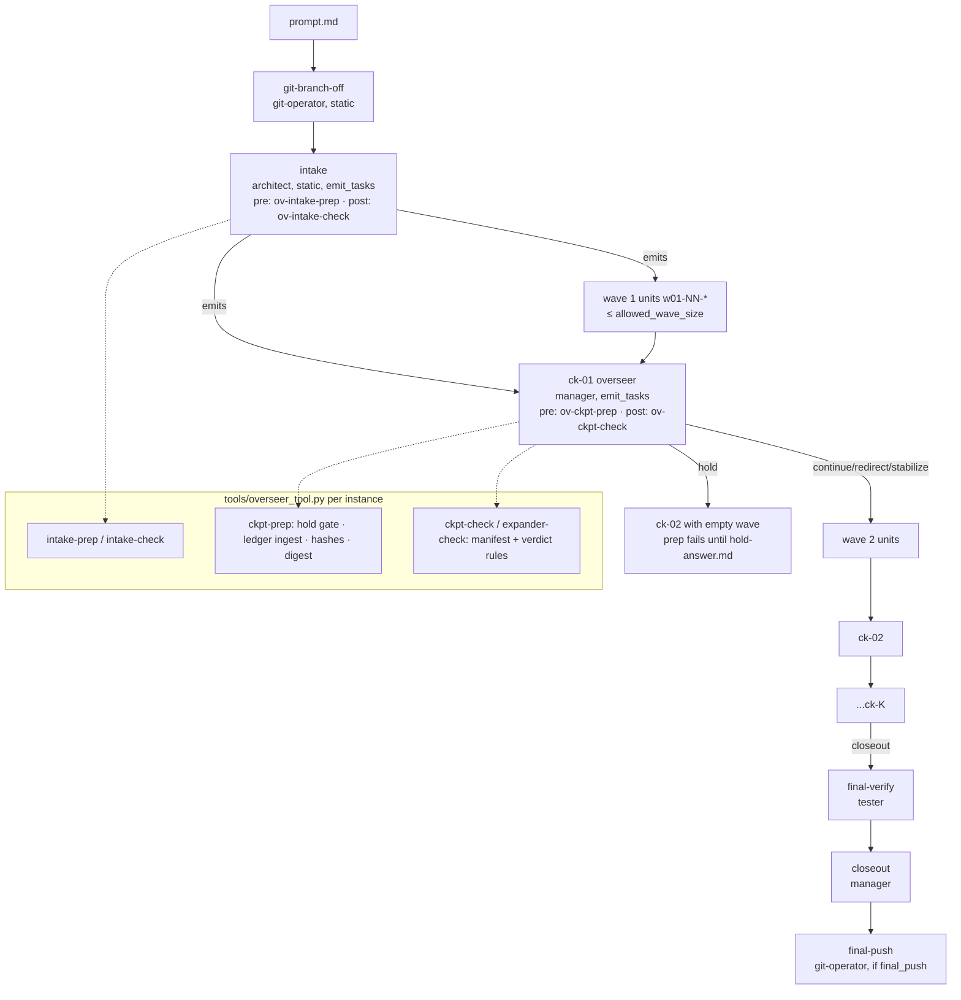
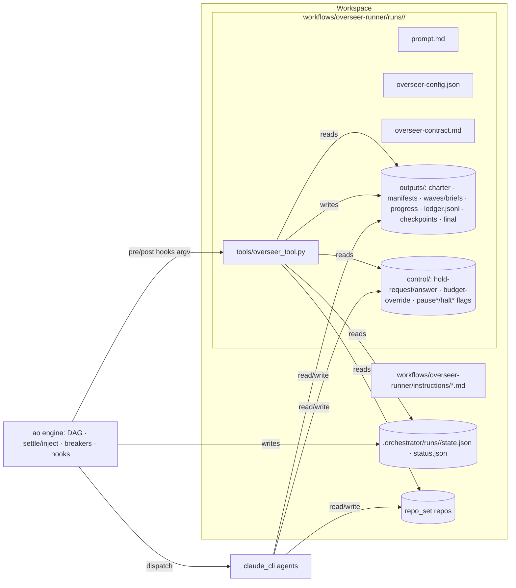
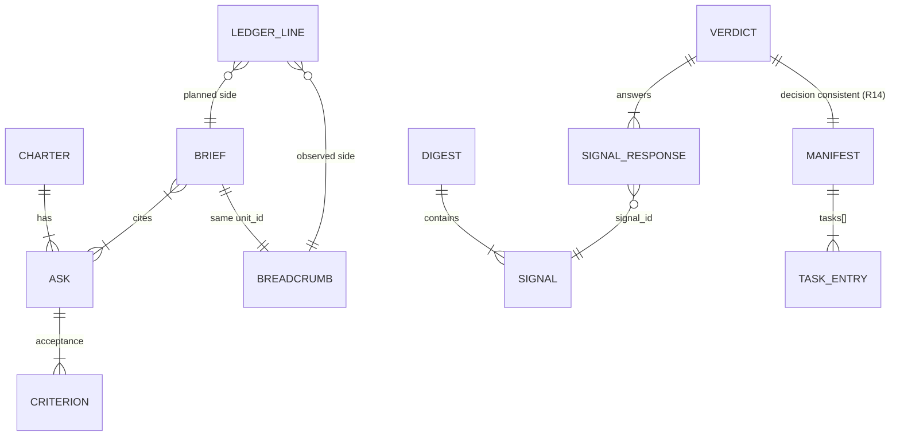
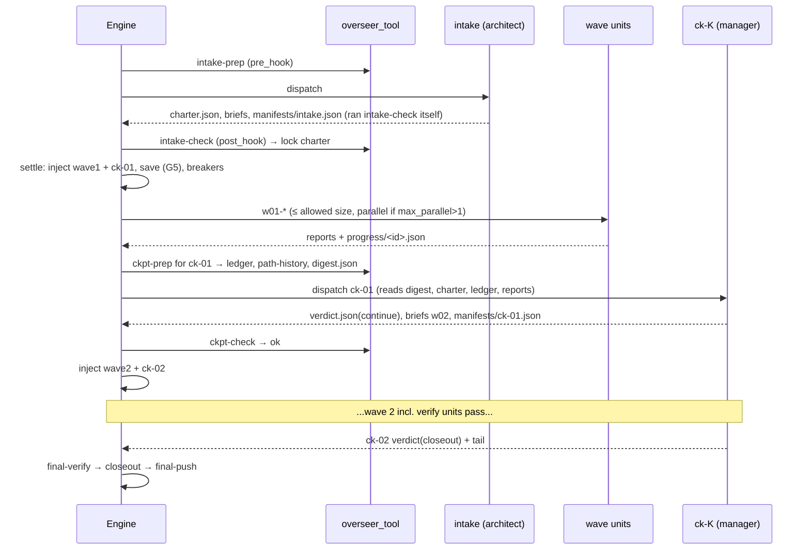

# Overseer-runner template — HLD + LLD (E-YAAGhk)

- Epic: [`E-YAAGhk-overseer-runner-template`](../meta/tickets/E-YAAGhk-overseer-runner-template/EPIC.md)
- ADR: [`ADR-0016`](adr/ADR-0016-overseer-runner-cadence-and-budget-governance.md)
- Status: **Design Rev 2 (after the Phase-4 consultations recorded in §23.3); not yet implemented**
- Author: `architect` · Date: 2026-09-26 · Branch: `ad/overseer-runner-workflow` (cut from `main` @ `8c13320`)

> Every engine claim below was checked against source at `8c13320`. The one engine defect this
> design depends on fixing (§7.4, **G5**) was **reproduced empirically**. The repro is at
> [`output/E-YAAGhk-overseer-runner-template/repro_emit_lost_on_breaker_trip.py`](../output/E-YAAGhk-overseer-runner-template/repro_emit_lost_on_breaker_trip.py).
> `run1: failed {'emit': 'succeeded'} injected= []` → `run2: succeeded {'emit': 'succeeded'} injected= []`.

---

## 0. One-paragraph summary

`overseer-runner` is a new built-in `ao` template (`ao new overseer-runner`). It takes one open-ended
`prompt.md`, which may hold several separate asks, and works on it in **bounded waves**. The waves are
dynamically injected sub-DAGs within one run, and a **checkpoint ("overseer") task** closes each one.
The checkpoint is an ordinary `emit_tasks` agent task. It (a) reads a **deterministic digest** that a
template-shipped stdlib tool computes from the run's `state.json`, a structured progress ledger, and git
content hashes, (b) judges alignment, loops/rework, and progress, and (c) emits exactly one of:
*the next wave plus the next checkpoint* (recursion), *a stabilization wave plus the next checkpoint*,
*a human-input hold*, or *the fixed close-out tail*. The overseer governs the budget in stages. At
80%, 90%, and 95% of `run_budget_usd` (based on projected cost, and the stages latch) it moves
**explore → converge → stabilize → closeout**, so the deliverable ends **usable** and not
half-finished. A single hard `run_cost_usd` breaker at 100% is only the dumb backstop. Wave size is
the "every N tasks" cadence. The wave size also adapts to observed durations, which approximates a
time cadence. There is no new engine primitive. The one exception is a **small, separately scoped
engine correctness fix (G5)**: emissions must persist before breakers are evaluated, or a breaker
trip at a checkpoint silently truncates the run on resume.

---

## 1. Requirements

### 1.1 Goals (from the user's ask, restated)
| ID | Goal |
|----|------|
| G-1 | Open-ended decomposition of one `prompt.md` (possibly several distinct asks) into sub-DAGs decided at run time |
| G-2 | A periodic overseer checkpoint (every N tasks; time-approximate) that checks alignment with the original ask, loops/cycles (A→B→B→A, A→B→C→D→A→B→C→D), and real progress versus rework |
| G-3 | The overseer re-triggers **every** wave, not once |
| G-4 | Budget-staged graceful degradation at about 80/90/95% of a fixed budget, which brings current work to a **usable** state (code *or* docs/plans/any deliverable) before stopping |
| G-5 | Delivered as a reusable built-in template that mirrors `routed-runner` conventions |

### 1.2 Functional requirements

**MVP (must ship)**

| ID | Requirement | Verification |
|----|-------------|--------------|
| FR-1 | New builtin `src/agent_orchestrator/templates/builtin/overseer-runner/` with `template.yaml`, `workflow.json.tmpl`, `overseer-contract.md.tmpl`, `overseer-config.json.tmpl`, `prompt.md.tmpl`, `tools/overseer_tool.py`, `instructions/*.md`, `README.md`; `ao new overseer-runner` renders a spec that passes `ao validate` | e2e `CliRunner` `ao new` + `ao validate` |
| FR-2 | **Intake** (static, `emit_tasks`) turns `prompt.md` into an immutable **charter** (`charter.json`: asks, acceptance criteria, per-ask *usable bar*) and emits wave 1 plus `ck-01` | e2e fake-executor run; checker unit tests |
| FR-3 | **Wave/checkpoint recursion**: checkpoint `ck-K` reviews wave K and emits exactly one of {wave K+1 + `ck-(K+1)`, hold (`ck-(K+1)` with an empty wave), close-out tail}. Mechanically enforced by the `ckpt-check` post-hook | checker unit tests + e2e multi-wave run |
| FR-4 | **Cadence**: a wave has ≤ `allowed_wave_size` units. The digest computes it as min(`wave_size`, time cap from `wave_max_minutes` × observed median unit duration, budget cap) | tool unit tests (fixed inputs) |
| FR-5 | **Progress breadcrumbs**: every wave unit declares `outputs/progress/<unit-id>.json` (schema §13.4), so the engine's missing-output check enforces it. The checkpoint pre-hook folds them into an append-only, idempotent `outputs/ledger.jsonl` | tool unit tests; e2e |
| FR-6 | **Loop/rework detection (deterministic)**: the digest reports `period_repeat`, `mirror_flipflop`, `content_oscillation`, `breadcrumb_integrity`, `stall`, `attempt_cap`, `repeated_failure`, `ask_starvation`, `prompt_changed`, and `blocked_units` signals (§8.3; `wave_signature_repeat` deferred, NFR-X10). The overseer must acknowledge every signal in its verdict | tool unit tests with scripted sequences |
| FR-7 | **Alignment**: every unit's brief cites ≥1 charter `ask_id`. The charter is hash-locked at intake, and any later change fails the checkpoint pre-hook. The overseer writes a per-ask alignment status | checker + tool tests |
| FR-8 | **Budget stages**: the digest computes `stage ∈ {explore, converge, stabilize, closeout}` from actual *and projected* spend against `converge_pct/stabilize_pct/closeout_pct` of `run_budget_usd`. The stage is **latched** (monotonic), and `allowed_decisions` is derived from it. The checker rejects a decision the stage forbids | tool + checker unit tests; e2e with scripted costs |
| FR-9 | **Graceful degradation**: in `stabilize`, the overseer may only emit stabilization/verify/document units against each ask's *usable bar*. In `closeout`, or when `must_close` is set (stage, `max_waves`, `max_stabilize_passes`), it must emit the close-out tail (`final-verify` → `closeout` → `final-push`) | checker tests; e2e |
| FR-10 | **Hard backstop**: a `run_cost_usd` breaker at 100% of `run_budget_usd`, `mode: "hard"`, `action: "stop"` | assets test on rendered JSON |
| FR-11 | **Human-in-the-loop hold**: decision `hold` writes `control/hold-request.json` and emits `ck-(K+1)` with an empty wave. That checkpoint's pre-hook fails the task (zero LLM cost, resumable) until `control/hold-answer.md` exists and is newer than the request | tool tests; e2e hold → answer → resume |
| FR-12 | **Close-out report**: `outputs/final/closeout.md` states per ask what is done, what is usable, what is not done, and how to continue. `outputs/final/verify.md` gives the honest verification status | instruction content + e2e presence |
| FR-13 | **Engine fix (G5)**: an `emit_tasks` task's manifest injection is persisted in the same `RunState` save as its success, *before* circuit-breaker evaluation. A breaker trip at an emitter's boundary never loses the emission | engine unit test (the repro above flips to pass) |
| FR-14 | README documents the route, params, breaker rationale, budget stages, hold workflow, the three engine gaps and how the design avoids them, and isolation guidance | README-section tests |
| FR-16 | **Budget override (Rev 2: promoted to MVP, per manager)**: `control/budget-override.json` (`{"run_budget_usd": <n>, "reason": ...}`) re-bases stage computation and un-latches the stage. It is **honored only if** `state.json.breaker_overrides["run-budget-backstop"] ≥ n`, so the operator must also have run `ao resume --extend-breaker run-budget-backstop` (an engine-recorded operator act; dev-security #4). Every application is recorded in the hash-chained ledger | tool tests (honored / refused-without-extension / lower budget) |
| FR-17 | **Live smoke run (Rev 2: promoted to MVP, per manager and critic)**: real `claude_cli`, a toy two-ask prompt, `run_budget_usd` about $25, scaled-down stage thresholds. The evidence (ledger, digests, verdicts, closeout, cost split overseer vs work) goes under `output/`. This is the only validation of NFR-8 and of real-LLM contract adherence | evidence files + recorded numbers |
| FR-19 | **Operator close-out on demand (Rev 2, found while specifying e2e (e))**: `overseer_tool.py request-closeout --workspace-root … --instance-dir … --reason <text>`. It refuses unless `state.json.status ∈ {failed, cancelled}` (the run must be halted, so it can't race in-flight dispatch). For every **pending** wave unit it writes a `no_op` report and breadcrumb ("skipped: operator requested close-out"), and it appends the chained ledger event `forced_closeout`. On `ao resume` the engine **skips** those units at dispatch ($0; `skip_if_outputs_exist: true` + outputs present, `engine.py:1007` / `runstate.should_skip`) *before* their unit-gate pre-hook. The next checkpoint's digest has `must_close` (reason `forced_closeout`), so only the close-out tail runs. It serves two cases: the post-backstop close-out without more work, and "stop now, but leave it usable" at any time | tool test + e2e (e) |
| FR-18 | **Unit budget gate (Rev 2, from the critic's latch finding)**: every wave unit carries `pre_hook: ov-unit-gate`, which fails at $0 if `spent ≥ effective budget` (config budget or an honored override). Breakers **latch** (`breakers.py:603`, which records each id at most once), so after a backstop trip a *plain* `ao resume` would otherwise run the pending wave with no wall. With the gate, a plain resume refuses the first pending work unit at $0 (`BUDGET:` failure → halt). The operator then chooses FR-19 close-out or extend+override | tool test + e2e (e) |

**MVP-Should (in this epic, below the cut line in §22)**

| ID | Requirement |
|----|-------------|
| FR-15 | **Nested sub-DAGs (depth 2)**: a wave unit of kind `expand` (`emit_tasks: true`) emits ≤ `sub_wave_size` leaf units plus one fixed-id sub-aggregator `<unit>--done`. The checkpoint waits on it through a pre-declared input path (inferred edge). Leaves may not expand (depth cap). `max_expanders_per_wave: 0` disables it |

**Non-MVP (deferred, with reasoning)**

| ID | Deferred item | Why deferred / later validation |
|----|---------------|---------------------------------|
| NFR-X1 | **True time-based preemptive checkpoints** (a checkpoint fires at T+M minutes even mid-wave) | Needs an engine timer that injects tasks into a live run. There is no such primitive, and a cron trigger re-runs the *whole workflow*. MVP approximates it with adaptive wave sizing (FR-4). Revisit if field runs show wave durations are highly variable |
| NFR-X2 | Independent child `ao run`s per sub-problem | Explicitly out of scope (user decision 1) |
| NFR-X3 | Cross-repo multi-part problem statements with per-ask `repo_set` routing | A single `repo_set` (possibly multi-repo) covers MVP. Per-ask repo routing needs a spec feature (per-task `repo_set`) that does not exist |
| NFR-X4 | Engine-level "run task X, then halt" breaker action (`action: "drain"`) | Would make graceful stop a breaker effect. The design shows it is unnecessary when self-governance works. Record it as a future engine epic if field data shows the backstop firing often |
| NFR-X5 | Monitor-ABC-based "pulse" supervision | Monitor ABC is too shallow (§7.3). Revisit only if Monitor gains history/DAG visibility and task injection |
| NFR-X6 | First-class *pause-with-reason* (a hold that does not show as `failed`) | The MVP hold uses a failing pre-hook, which reads as `failed` in `ao status`. Needs an engine run status such as `paused` |
| NFR-X7 | `prepare_resume` re-injection for *legacy* runs halted before G5 landed (`ao resume --reinject <task>`) | G5 prevents new occurrences. Legacy recovery is a rare manual fix, done by deleting the emitter's outputs and resuming |
| NFR-X8 | LLM-graded semantic similarity (embeddings) for alignment drift | The deterministic signals plus the overseer's judgment are enough for MVP. Embeddings add a dependency and non-determinism |
| NFR-X9 | Shipping an `agents.recommended.json` asset | It would collide with `routed-runner`'s workspace-root `agents.recommended.json` (both `keep_existing`, first writer wins). The README gives the recommendation inline instead |
| NFR-X10 | `wave_signature_repeat` detector | Rev 2 (critic #7): it overlaps with `stall` + `period_repeat`. Add it later if FR-17/field data shows cycles those two miss |
| NFR-X11 | Tamper-*proof* governance artifacts | Agents have full workspace write access, and there's no trust boundary between tasks (`isolation: none`). The MVP is **tamper-evident** (hash-chained ledger, charter lock, hold recorded in the ledger). The only hard containment is engine-side (breakers, backstop) |

### 1.3 Non-functional requirements

| ID | NFR |
|----|-----|
| NFR-1 | **Path safety**: every path the tool reads or writes stays under `workspace_root`. It resolves the path and requires `is_relative_to`, and it rejects symlinks that escape. This matches the engine's NFR-1 path guard |
| NFR-2 | **Determinism**: every tool computation is a pure function of files on disk plus an injectable clock. Fixed-clock tests are byte-reproducible. No network, no randomness |
| NFR-3 | **Idempotency**: `ckpt-prep` re-run on resume gives the same ledger (keyed by `unit_id`, never double-appended) and the same digest, apart from `generated_at` |
| NFR-4 | **Fail-closed**: any tool error (malformed status/breadcrumb, missing charter lock, tampered charter) exits non-zero → pre-hook `fail_task` → the run halts in a resumable state. The overseer never runs blind |
| NFR-5 | **Stdlib only**, Python ≥ 3.11 (matching `requires-python`). No `{{ ident }}` sequences in the tool source, because it is rendered through `_render` |
| NFR-6 | **Bounded input**: every agent-authored JSON the tool reads has a 1 MiB cap (mirrors `MAX_CONTROL_FILE_BYTES`). Content hashing covers ≤ 200 paths and skips files > 50 MiB |
| NFR-7 | **Backward compatibility**: `routed-runner` and every existing workflow behave byte-identically, *except* for the intended G5 ordering fix |
| NFR-8 | **Cost overhead**: overseer checkpoints cost ≤ ~10% of run spend at defaults (target, measured in the FR-17 smoke run) |
| NFR-9 | **Legibility**: a reviewer or operator can reconstruct "why did the run do X" from `ledger.jsonl` + `checkpoints/ck-*/{digest,verdict,report}` alone |

---

## 2. Scope

**In scope:** the new template directory and its tool, contract, instructions, and README; the G5
engine ordering fix plus its tests; template tests (assets, render, e2e via `CliRunner` with
`FakeExecutor`-scripted manifests); an ADR; this doc; the docs refresh.

**Out of scope:** new schema fields/engine primitives (cadence, drain action, pause status), Monitor
ABC changes, post-run grading changes (ADR-0015 stands), child runs, changes to `routed-runner`'s
behavior (it benefits from G5 passively), the dashboard UI (the template shows up in
"From template" automatically), and `E-Grpp0X` (dangling injected-`depends_on` validation; the
checker makes this template independent of it).

---

## 3. Assumption log

| ASSUMPTION | Risk if wrong | Mitigation |
|---|---|---|
| A-1 `python3` (≥3.11) is on the `PATH` that hooks inherit | Every prep/check hook fails (fail-closed), so the run halts at intake | `python_bin` template param; `intake-prep` prints the interpreter version; README preflight line |
| A-2 Run state lives at `<workspace_root>/.orchestrator/runs/<run_id>/state.json` (`RunStateStore._path`). The tool reads **`state.json`, not `status.json`**. Rev 2, developer #1: `status.json`'s per-task rows (`runstate.py:115-148`) carry no `started_at`/`ended_at`, while `state.json` (the full `RunState` dump) has `tasks[*].{status, started_at, ended_at, cumulative_cost_usd}`, `injected_tasks`, and `breaker_overrides`. The tool computes `spent = Σ tasks[*].cumulative_cost_usd`, the same computation as `models.compute_run_usage_totals`, and a test asserts it equals `status.json.usage_totals.cost_usd` | `state.json` is an internal pydantic dump whose fields could be renamed | Tolerant reader (only the listed fields, and a missing field → ST-2 fail-closed with the field name); a contract test pins the field set against `models.RunState`/`TaskRunState`; `runs_root` config key (default `.orchestrator/runs`) |
| A-3 Agents' `working_dir` is unset, or the hook's argv is absolute | Relative tool paths break | Hook argv uses `{{ workspace_root }}/{{ instance_dir }}/tools/overseer_tool.py` (absolute at render). Moving the workspace needs `ao new --force` to re-render. Documented |
| A-4 `usage_totals.cost_usd` counts only *settled* tasks | In-flight spend is invisible, so the backstop can overshoot by up to the in-flight units' spend | Stage logic uses projection plus a reserve (§8.2). With `max_parallel=P`, overshoot is bounded by ≈P×unit cost. Documented |
| A-5 LLM agents follow the contract most of the time | Malformed manifests | Mechanical `*-check` post-hooks (`fail_task`), plus agents run the same checker themselves before exiting (self-correct loop) |
| A-6 Checkpoints are barriers (`emit_tasks` ⇒ barrier, ADR-0007) | Concurrent state writes during prep | Verified at `engine.py` `_is_barrier` (`if task.emit_tasks`) |
| A-7 A wave unit "failing" at the protocol level is rare, because units report hard work as `outcome: blocked` and still exit 0 | Any task failure halts the run (engine semantics) | Instruction rule plus `max_attempts: 3`. Operator resume is the standard path |
| A-8 Team profile for the sprint math: **4** developers (Rev 2; was 3), <4 years' experience | Plan slips | §22 capacity math (14% MVP slack); FR-15 sits below the cut line |

---

## 4. Standards survey (practical)

| Standard | Applied how |
|---|---|
| **C4** | §10 context/container/component views (Mermaid) |
| **ADR (Nygard)** | ADR-0016 records D1–D9 |
| **JSON Schema 2020-12** | §13 defines every tool-read artifact as a versioned schema (`ao.overseer.<kind>/v1`). The tool validates with a hand-rolled stdlib validator for the exact subset used (types, required, enum, maxLength, pattern). There is no `jsonschema` dependency (NFR-5) |
| **AsyncAPI-style event naming** | Signals and decisions are closed enums with stable string ids (§15) |
| **Test pyramid** | Tool unit tests (majority), template render/assets tests, engine unit test (G5), CliRunner e2e (few, full path) (§18) |
| **Observability** | Structured JSONL ledger + per-checkpoint digest/verdict/report; engine `run.log` events unchanged |
| **Rollout safety** | A new template is purely additive. G5 is an ordering change with an explicit regression test and an NFR-2 gate review (§16) |

### 4A. Phase-4 consultation record

See §23.3 for the full record (inputs, feedback, design updates, residual concerns per role).

---

## 5. Solution landscape — Build vs Buy vs Hybrid

| Option | Verdict |
|---|---|
| **Buy/adopt** a supervisor from an agent framework (LangGraph supervisor, CrewAI hierarchical process, AutoGen GroupChat manager) | ✗ It would bypass `ao`'s DAG, breakers, resume, and cost accounting. The user's constraint is to stay inside `ao` |
| **Build in-engine**: new `cadence:` schema block + `drain` breaker action + Monitor pulse | ✗ About 3 engine epics. It reopens the rejected mid-run settlement hook (ADR-0015 D2), and the MVP value is reachable without it |
| **Hybrid (chosen)**: spec-level recursion plus an agent-level overseer plus a **deterministic template-shipped tool** invoked through existing `pre_hook`/`post_hook`. One small engine *correctness* fix (G5) | ✓ Reuses shipped primitives (`emit_tasks`, hooks, breakers, run `state.json`). The deterministic parts (budget math, cycle detection, manifest validation) are code and testable. The judgment parts (alignment, what to do next) stay with the LLM |

The tool lives **in the template** (a per-instance file `tools/overseer_tool.py`) and not in the core
package. Each run gets a copy pinned to its own contract version, following the same "existing run
instances keep their old contract" rule as `routed-runner`. Core `ao` gains no template-specific CLI
surface. See ADR-0016 D4 for the alternative (`ao overseer …` subcommands) and the trigger for
migrating to it (a second template needing the same tool).

---

## 6. Orchestration landscape & competitor analysis (feature-focused)

The comparison is scoped to the three capabilities this epic adds: **runtime-decided recursive
decomposition**, **periodic in-run supervision (alignment/loops/progress)**, and **budget-staged
graceful degradation**.

| Tool | Spec/DSL | Dynamic/recursive decomposition | In-run supervision / loop detection | Budget / graceful stop | Retries/resume | Extensibility | Isolation | Ops burden |
|---|---|---|---|---|---|---|---|---|
| **Airflow** | Python DAG files | Dynamic Task Mapping (`expand`) at runtime, but only one level, and DAG structure is fixed per DAG version; no recursion | None built in; SLAs/callbacks fire on lateness, not semantics | None (no cost model); `dagrun_timeout` hard-kills | Task retries; clear/re-run | Operators/providers | Worker/K8s pods | High (scheduler, DB, webserver) |
| **Prefect** | Imperative Python | Fully dynamic (it's just code), subflows | "Automations" react to state events *outside* the flow; no loop semantics | None; timeouts only | Retries, result persistence/caching | Blocks, integrations | Work pools | Medium |
| **Dagster** | Python assets/ops | Dynamic outputs/mapping; one level per op | **Asset checks** (quality gates) are the closest analog to a checkpoint, but they block/warn and cannot re-plan | None | Re-execution from failure | Resources/IO managers | Run launchers | Medium–High |
| **Temporal** | Code (workflows-as-code) | Child workflows; **continue-as-new** bounds history (the closest analog to our wave recursion) | Anything you code; no built-in loop detection | None; timeouts per activity/workflow | Durable replay; determinism constraints | SDK interceptors | Worker processes | High (cluster) |
| **Argo Workflows** | YAML (K8s CRD) | **Recursive templates** + `withParam` fan-out (true recursion, the depth guard is on you) | None | `activeDeadlineSeconds`; **`onExit` handler** runs a template before finishing, the only one here with a native "clean up then stop" | `retryStrategy`; resubmit | Templates/plugins | Pods | High (K8s) |
| **Step Functions** | JSON (ASL) | Map/Distributed Map; nested state machines | None | None; Catch → fallback states (graceful path is authored per state) | Retry/Catch; redrive | Service integrations | Managed | Low (vendor lock-in) |
| **GitHub Actions** | YAML | Dynamic matrix via `fromJSON`; reusable workflows with a nesting limit | None | `timeout-minutes` | Re-run failed jobs | Actions marketplace | Runners | Low |
| **n8n / Windmill** | Visual/JSON; Windmill scripts | Loops, sub-flows | Windmill **suspend/approval steps** ≈ our hold | None | Retries | Nodes/scripts | Workers | Low–Medium |
| **Luigi** | Python | Dynamic dependencies via `yield` | None | None | Target-existence idempotency (like our `skip_if_outputs_exist`) | Targets | Processes | Low |
| **LangGraph** (agent-adjacent) | Python graph | Cycles allowed; supervisor pattern | `recursion_limit` (default 25) is a **counter, not a detector**, and a hard error when hit | None | Checkpointers | Nodes/tools | In-process | Low |
| **CrewAI / AutoGen** (agent-adjacent) | Python | Hierarchical manager agent re-plans | Manager judgment only; known complaints: agents loop, re-do work, burn tokens | `max_iter`/`max_rpm`, hard caps | Weak | Tools | In-process | Low |

**Gap analysis.** Data orchestrators do dynamic fan-out well (Airflow mapping, Argo recursion,
Temporal continue-as-new). None of them have *semantic* supervision (is the work still about the
user's ask, and is it cycling?), because their tasks are deterministic code. Agent frameworks have
supervisors, but the supervision is pure LLM judgment with **counter-based** loop guards
(LangGraph `recursion_limit`, CrewAI `max_iter`). The known user complaints there are runaway loops,
repeated work, and costs that end in a hard stop leaving half-finished output. No surveyed tool has
**budget-staged degradation to a usable state**. Argo's `onExit` and Step Functions' `Catch` are the
nearest mechanisms, but they are failure/finish hooks, not budget-aware re-planning.

**Differentiation / positioning**

```
We will:
- Match Argo Workflows in recursive, runtime-decided sub-DAG expansion (recursive emit_tasks waves,
  depth-capped at 2) and Temporal's continue-as-new in bounding each recursion step (fixed wave size).
- Beat LangGraph / CrewAI in loop handling: deterministic cycle/oscillation/stall *detectors* that
  feed evidence to an LLM overseer, whose response is *mechanically enforced* (attempt caps,
  signal acknowledgement), not a bare iteration counter that hard-errors.
- Beat every surveyed tool in budget governance: projected-spend stages that re-plan the remaining
  work toward a usable deliverable before a hard backstop is ever reached.
- Avoid the complexity of Temporal/Argo in infrastructure (no cluster, no new engine primitive),
  and of an in-engine supervisor (no Monitor/engine coupling; the overseer is an ordinary task).
```

**Intentionally excluded** (to prevent feature creep): preemptive timers (NFR-X1), child runs
(NFR-X2), embedding similarity (NFR-X8), a pluggable "detector" registry (the fixed signal enum in
§8.3 is the MVP contract; new detectors are additive enum values in a later version), and per-unit
`model` overrides (cost control, §13.2 rule R9).

---

## 7. Engine gaps and how the design avoids them

| # | Gap (verified) | How the design avoids it | New engine code? |
|---|---|---|---|
| **G1** | **No cadence primitive**: no "every N tasks / N minutes" construct exists, and `LoopSpec` is unusable because `spec.py` rejects a loop gate with `emit_tasks=True` | Cadence is **structural**: each emission holds ≤ N units plus one checkpoint that `depends_on` all of them, and that checkpoint is itself `emit_tasks`, so it recurses. "Every N tasks" = wave size. Time is approximated by sizing the next wave from observed unit durations (`wave_max_minutes`, FR-4) | None |
| **G2** | **Breaker actions are flat**: `fail/stop/pause` all map to "halt, resumable `failed`" (`breakers.map_action`), with no "run X then halt" | Graceful degradation is **agent-level self-governance**. The overseer reads projected spend at every checkpoint and moves explore→converge→stabilize→closeout *before* the budget is exhausted. The single `run_cost_usd` breaker at 100% is `mode: "hard"`, only a backstop for when self-governance fails (for example a crash or runaway unit) | None |
| **G3** | **Monitor ABC is shallow**: it sees only trip/failure summaries, has a fixed verdict space, cannot inject, and has no pulse | The overseer is a **plain author-defined agent task** (`manager` role) with an explicit contract. It reads a digest built from `state.json`, the ledger, and git hashes by a deterministic tool running as its `pre_hook` | None |
| **G4** | **Grading is post-run only** (ADR-0015 D2 rejected an in-engine mid-run settlement hook) | Mid-run evaluation happens in the checkpoint task itself (`pre_hook` digest → LLM judgment → `post_hook` check), which is the sanctioned pattern. Nothing from the rejected design comes back. Hooks run inside the checkpoint's own dispatch, in the checkpoint's own shared checkout (checkpoints are forced `isolation: none`) | None |
| **G5** | **Emission lost on a breaker trip or crash at the emitter's settle** (new finding). `Orchestrator._settle` saves the emitter as `succeeded` (engine.py ~L1992), evaluates breakers (~L2008), and returns `halt` **before** the `emit_tasks` block (~L2057). `prepare_resume` keeps a succeeded task with its outputs present, so the manifest is **never read again**. The resumed run ends **`succeeded`** with the recursion silently truncated. The same happens on a process crash between the two saves | Unavoidable at template level. Every wave boundary in this design is an emitter settle, and the $ backstop is most likely to trip exactly near budget exhaustion, which is when graceful close-out matters most. A template-only workaround (a `recommend`-mode backstop) would let spend reach 2× the budget. **Fix (T-pYt478):** run the `emit_tasks` injection *before* the save+breaker block, so success and injection persist in one save. A breaker then halts with the injected tasks `pending`, and resume runs them. This also fixes a latent `routed-runner` bug (a trip at `task-breakdown`'s settle) | **Yes, small and separately scoped** (§8.6) |

---

## 8. HLD + LLD

### 8.1 High-level architecture



Only `git-branch-off` and `intake` are static. **Everything else is emitted.** A static tail cannot
exist. A static `final` task would depend only on `intake` (future ids can't be named), become ready
right after `intake`, and fail with `missing_inputs` (engine.py ~L1100) because its input has no
producer yet. `routed-runner`'s static `full-test` works only because its single aggregator is
injected by its *direct* predecessor. With recursion, the producer of the final input is injected
K levels later. So the tail is part of the terminal emission (FR-9), and the run's completion
marker is `outputs/final/closeout.md` (the README documents that a `succeeded` run without it is
anomalous).

### 8.2 Budget self-governance (the stage machine)

```
Inputs:  B = run_budget_usd (or budget-override), spent = status.usage_totals.cost_usd,
         pct = {converge: c, stabilize: s, closeout: x}   (validated 0 < c < s < x < 100)
         est_unit = median(cost of settled wave units in the last 2 waves) else default_unit_cost_usd
         est_ckpt = median(cost of settled ck-*) else default_ckpt_cost_usd
         reserve_tail = 3 * est_unit            # final-verify + closeout + final-push

FUNCTION stage_of(amount):  pct_used = 100*amount/B
    RETURN explore if pct_used < c ; converge if < s ; stabilize if < x ; else closeout

TAIL_TASKS = 3 if cfg.final_push else 2                         # named constant (reviewer #4)
reserve_tail = TAIL_TASKS * est_unit                            # replaces the "3 *" above
stage_raw  = stage_of(spent)                                    # informational only (digest)
n_plan     = min(wave_size, time_cap)                           # what we'd like to run next
stage_proj = stage_of(spent + n_plan*est_unit + est_ckpt + reserve_tail)   # ≥ stage_raw always
stage      = max(stage_proj, prev_stage)                        # latched (monotonic); Rev 2 simplification (critic #7)
             # prev_stage ignored iff a newer, HONORED budget-override exists (FR-16) → recorded in ledger
budget_cap = largest n in [0..wave_size] with
             spent + n*est_unit + est_ckpt + reserve_tail <= B * next_threshold(stage)/100
             where next_threshold(explore)=c, (converge)=s, (stabilize)=x, (closeout)=100
allowed_wave_size =
   explore/converge : max(1, min(wave_size, time_cap, budget_cap))
                      # max(1, ·) keeps the run moving; the projection escalates the stage next time
   stabilize        : max(1, min(stabilize_wave_size, budget_cap_to_100pct))
   closeout         : 0
must_close = stage == closeout OR K >= max_waves OR stabilize_passes >= max_stabilize_passes
             OR ledger has a forced_closeout event (FR-19)
```

`allowed_decisions`:

| stage | allowed |
|---|---|
| explore | `continue`, `redirect`, `hold`, `stabilize`, `closeout`* |
| converge | `continue`†, `redirect`†, `hold`, `stabilize`, `closeout`* |
| stabilize | `stabilize`, `closeout`, `hold` |
| closeout / `must_close` | `closeout` |

\* `closeout` before the stabilize stage is only allowed when the ledger shows, for every
non-deferred ask, a `verify`-kind unit with `verdict: pass` after that ask's last
`implement/fix/stabilize/document` unit (rule R14). This means "done early" is verified, not claimed.
† In `converge`, units may only target **existing** work items (no new scope, rule R11).

**Why hard at 100% and not `recommend` at 95%.** `mode: "recommend"`'s bounded auto-extension adds
the *original threshold again* (`apply_breaker_extension`: `new = current + spec.threshold`). On a
$2000 budget with a 95% breaker, that allows spend up to $3800, which contradicts a fixed budget.
The 80/90/95% points are agent-level stages, and 100% is the wall. An operator who wants more money
decides explicitly (`--extend-breaker` plus FR-16 override).

### 8.3 Loop / rework / progress detection (deterministic signals)

The overseer assigns every unit a stable **work item** key (`<ask_id>/<slug>`, e.g. `A2/parser`) and
a **kind** (enum §13.3), and writes them into the unit's brief *before* dispatch. The planner
(overseer) supplies the loop signature. It is **not self-reported by the unit**, so it stays stable
and can't be gamed. The unit reports `outcome`/`verdict`/`changed_paths` in its breadcrumb.

Token for unit u: `tok(u) = f"{u.kind}:{u.verdict}"`; per-work-item sequence `S[w]` ordered by
(wave, unit id). Detector thresholds are named module constants (`MAX_PERIOD = 4`,
`MIRROR_HALF_LENGTHS = (2, 3)`, `MIN_REPS_PERIODIC = 2`, `MIN_REPS_SINGLE = 3`,
`MAX_TRACKED_PATHS = 200`, `GOAL_SIMILARITY_REJECT = 0.6`), never inline literals (reviewer #7).

| Signal | Rule (deterministic) | Severity |
|---|---|---|
| `period_repeat` | For `p` in 1..4, the largest `r` such that `S[w][-p*r:]` is `r` copies of one `p`-block. Flag if `r ≥ 2` and `p ≥ 2`, or `r ≥ 3` and `p = 1`. Catches `review:fail, fix:pass, review:fail, fix:pass` and A→B→C→D→A→B→C→D | high if r ≥ 3 else medium |
| `mirror_flipflop` | For m in 2..3: `S[w][-2m:]` is a palindrome whose first half has ≥2 distinct tokens (A→B→B→A, A→B→C→C→B→A) | medium |
| ~~`wave_signature_repeat`~~ | Deferred to NFR-X10 (Rev 2) | — |
| `content_oscillation` | For a tracked path, `h_K == h_j` for some `j ≤ K-2` with `h_{K-1} != h_K`, meaning the file returned to an earlier state after changing. The tool records a per-checkpoint sha256 of every tracked path in `outputs/overseer/path-history.json`. **Tracked paths** (Rev 2, reviewer #6) = the union of breadcrumb `changed_paths` and, for each repo that is a git work tree, `git -C <repo> diff --name-only <head_at_ck(K-1)>` plus `git status --porcelain` (bounded subprocess, 30 s timeout). A unit that omits a reverted path therefore can't hide it. Paths are confined to repo roots from hook `context.json` `repo_paths` (≤ `MAX_TRACKED_PATHS`=200). `repo_heads` per checkpoint are stored in path-history. **Trim-first** if T-C6uQJW slips (manager #9): ship it in a follow-up, not at the cost of the other detectors | high if ≥2 paths or ≥2 returns, else medium |
| `breadcrumb_integrity` | (Rev 2, dev-security #5) A breadcrumb `changed_paths` entry with an unknown `repo_id`, an absolute path, `..`, or a path that resolves (following symlinks) outside its repo root. The entry is excluded from hashing and reported. It isn't silently skipped, and it doesn't fail closed either (one LLM path typo must not halt the run) | high |
| `stall` | No work item reached `outcome: done` with `verdict ∈ {pass, na}`, **and** the verdict-reported `criteria_met` count did not rise, for `stall_waves` consecutive waves | high |
| `repeated_failure` | The last 2 units on the same work item have `verdict: fail` | medium |
| `attempt_cap` | Units on work item `w` ≥ `max_attempts_per_item` | high (the checker then forbids a new unit on `w` without `approach_change`; > cap+1 is forbidden outright) |
| `ask_starvation` | A non-met, non-deferred ask got zero units in the last `stall_waves` waves | medium |
| `blocked_units` | Any unit in wave K reported `outcome: blocked` or `needs_input: true` | medium |
| `prompt_changed` | `sha256(prompt.md) != charter.prompt_sha256` | high (the overseer must `hold` or acknowledge) |

The charter hash is checked separately as **integrity, not a signal**: a mismatch between
`charter.json` and `outputs/overseer/charter.lock.json` makes `ckpt-prep` exit 2. That's fail-closed,
because the goal must not be rewritten mid-run.

**Enforcement.** Every signal gets a stable id `S-<KK>-<NN>`. The verdict must carry one
`signal_responses[]` entry per id (R12). `response ∈ {redirect, descope, accept, hold}`. `accept` on
a `high` signal requires a rationale ≥ 40 chars. The checker enforces caps (R13). The **rename
dodge** (reviewer #1) is closed mechanically by R13c. A new work-item key whose brief `goal` has
token-set Jaccard similarity ≥ `GOAL_SIMILARITY_REJECT` with the latest brief of any *capped* item,
or whose `prior_attempts`/`touches` intersect a capped item's, is rejected. The rejection message
tells the overseer to reuse the capped key with `approach_change`, descope it, or hold. The LLM's
judgment covers semantic alignment (does the wave's goal serve the quoted ask?) and choosing the
response. The machine guarantees the evidence is seen and the loop cannot continue unchanged.

**Integrity model (Rev 2, dev-security #2/#3; NFR-X11).** The artifacts are tamper-*evident*, not
tamper-proof. Every task can write the whole workspace, so there is no inter-task trust boundary to
lean on.
- The ledger is **hash-chained**: each line carries `prev_sha256`, the sha256 of the previous line's
  canonical JSON. `ckpt-prep` verifies the chain and fails closed on a break (INT-3).
- Tool-owned `event` lines record checkpoint decisions and verdict hashes (written by `ckpt-check`),
  hold requests, hold answers, and honored overrides. The chain makes a hold undeletable. If the
  last `checkpoint` event has `decision: hold` and no later `hold_answered` event exists, a missing
  `hold-request.json` is **INT-2** (fail closed). Deleting the request can no longer bypass the gate.
- Hard **cost** containment stays engine-side: the 100% backstop plus the FR-18 unit gate.

### 8.4 Module decomposition (LLD)

Five modules. M1–M3 are in `tools/overseer_tool.py` (one file, sections per module, stdlib only).
M4 is template content. M5 is the engine fix.

#### M1 — Config, state snapshot, ledger, budget (`intake-prep`, the first half of `ckpt-prep`)

- **Purpose**: validate the rendered config; load run state; fold wave breadcrumbs into the ledger;
  compute the budget stage and cadence.
- **Inputs**: `overseer-config.json`; `$AO_HOOK_CONTEXT_PATH` (`run_id`, `task_id`, `repo_paths`,
  `output_paths`; developer #4 confirmed these at engine.py:3849-3863 / hooks.py:155);
  `<runs_root>/<run_id>/state.json` (A-2); `outputs/waves/wKK/briefs/*.json`;
  `outputs/progress/*.json`; the previous `digest.json`; `control/budget-override.json` (optional).
- **Outputs**: `outputs/ledger.jsonl` (append-only), `outputs/overseer/path-history.json`, and the
  budget/cadence sections of `digest.json`.
- **Dependencies**: stdlib (`json`, `hashlib`, `statistics`, `pathlib`, `argparse`, `datetime`).

```
FUNCTION main(argv):
  args = parse(argv)                          # subcommand, --workspace-root, --instance-dir, --now (test only)
  TRY: dispatch[args.subcommand](args); EXIT 0
  EXCEPT Violation as v: print_rules(v, stderr); write_result(v); EXIT 2
  EXCEPT Exception as e: print("overseer_tool internal error: " + repr(e), stderr); EXIT 1

FUNCTION load_config(inst):
  cfg = read_json_bounded(inst/"overseer-config.json", schema=CONFIG_V1)
  REQUIRE 0 < cfg.converge_pct < cfg.stabilize_pct < cfg.closeout_pct < 100   ELSE Violation("CFG-1")
  REQUIRE cfg.wave_size >= 1 AND cfg.max_waves >= 1 AND cfg.run_budget_usd > 0 ELSE Violation("CFG-2")
  need = cfg.max_waves*(cfg.wave_size+1+cfg.max_expanders_per_wave*(cfg.sub_wave_size+1)) + 3
  REQUIRE cfg.max_injected_tasks >= need   ELSE Violation("CFG-3", need=need)
  RETURN cfg

FUNCTION intake_prep(args):                      # pre_hook of `intake`
  cfg = load_config(inst); print("python", sys.version); ctx = read_hook_context()
  state_path(ws, cfg, ctx.run_id) MUST exist    ELSE Violation("ST-1")
  mkdir inst/outputs/{overseer,manifests,progress,waves,checkpoints,final}

FUNCTION load_state(path):                        # A-2: state.json, tolerant subset reader
  s = read_json_bounded(path, max_bytes=STATE_MAX_BYTES)   # 16 MiB; state.json can be large
  REQUIRE s.tasks is object, each value has status; started_at/ended_at/cumulative_cost_usd optional-null
                                                  ELSE Violation("ST-2", field=<missing>)
  RETURN {tasks, injected_ids: [t.id for t in s.injected_tasks], breaker_overrides: s.breaker_overrides or {},
          spent: Σ tasks[*].cumulative_cost_usd}

FUNCTION ckpt_prep(args):                         # pre_hook of `ck-K`
  cfg = load_config(inst); ctx = read_hook_context(); K = parse_ck(ctx.task_id)   # "ck-03" -> 3
  verify_ledger_chain(inst)                       # Violation("INT-3") on any break
  hold_gate(inst, K)                              # may raise Violation("HOLD"/"INT-2") -> exit 2
  verify_charter_lock(inst)                       # Violation("INT-1") on mismatch
  state = load_state(state_path(...))
  units  = wave_units(state, K)                   # injected ids matching ^w{K:02d}-\d{2}-  (+ '--' leaves)
  ingest_ledger(inst, units, state)               # idempotent, chained
  update_path_history(inst, K, ctx.repo_paths, units)   # breadcrumb paths ∪ git-derived paths (§8.3)
  budget = compute_budget(cfg, state, inst, K)    # §8.2 incl. override validation (FR-16)
  signals = detect_signals(cfg, inst, K)          # M2
  digest = assemble(budget, signals, progress(inst, K), must_close, allowed_decisions)
  write_json_atomic(inst/outputs/checkpoints/ck-KK/digest.json, digest)

FUNCTION hold_gate(inst, K):
  last_ck = last ledger event of type "checkpoint"; answered = exists event "hold_answered" after it
  req = inst/control/hold-request.json ; ans = inst/control/hold-answer.md
  IF last_ck is None OR last_ck.decision != "hold" OR answered:
     IF exists(req): RAISE Violation("INT-4", "stray hold-request.json not backed by a hold decision")
     RETURN
  IF not exists(req): RAISE Violation("INT-2", "hold decided at " + last_ck.checkpoint + " but request file missing")
  IF not exists(ans) OR mtime(ans) < mtime(req):
     RAISE Violation("HOLD", "HOLD: overseer requested human input: see " + req.needs_input_path +
                     "; write your answer to control/hold-answer.md then `ao resume`")
  archive req+ans -> inst/outputs/checkpoints/ck-KK/hold/{request.json,answer.md}; delete req and ans
  append_event("hold_answered", {checkpoint: "ck-KK", answer_sha256})

FUNCTION ingest_ledger(inst, units, state):
  have = {line.unit_id for line in read_jsonl(ledger) if line.type == "unit"}
  FOR u in sorted(units) WHERE u.id not in have AND state.tasks[u].status in ("succeeded","failed","skipped"):
     brief = read_brief(u)           # planned: ask_ids, work_item, kind, approach_change
     crumb = read_breadcrumb(u) IF exists ELSE synthesized {outcome:"failed", verdict:"fail"}
     REQUIRE crumb.unit_id == u.id   ELSE Violation("BC-1")
     append_chained({type:"unit", seq, wave:K, unit_id, ask_ids, work_item, kind, attempt_no, outcome, verdict,
                     engine_status, cost_usd, duration_s (ended_at-started_at; null if either missing),
                     changed_paths[:50], needs_input, recorded_at})
  # NOTE: failed units are only possible after an operator resume (the engine halts the run on failure)

FUNCTION append_chained(line):  line.prev_sha256 = sha256(canonical_json(last_line)) or "GENESIS"; append
FUNCTION verify_ledger_chain(inst): walk lines, recompute, RAISE Violation("INT-3", line_no) on mismatch

FUNCTION effective_budget(cfg, state, inst):               # FR-16
  ov = read_json_bounded(inst/control/budget-override.json) IF exists ELSE None
  IF ov is None: RETURN cfg.run_budget_usd, None
  ext = state.breaker_overrides.get("run-budget-backstop")
  IF ext is None OR ext < ov.run_budget_usd: RETURN cfg.run_budget_usd, {refused: true, reason: "no matching --extend-breaker"}
  append_event_once("budget_override", {run_budget_usd: ov.run_budget_usd, reason: ov.reason}); RETURN ov.run_budget_usd, {refused: false}

FUNCTION unit_gate(args):                         # pre_hook of every wave unit (FR-18); must be fast, $0
  cfg = load_config(inst); state = load_state(...); B, _ = effective_budget(cfg, state, inst)
  IF state.spent >= B: RAISE Violation("BUDGET", "BUDGET: spent $%.2f >= budget $%.2f; new work refused. "
        "To continue: write control/budget-override.json AND run `ao resume --extend-breaker run-budget-backstop`")
  IF len(state.injected_ids) > cfg.max_injected_tasks: RAISE Violation("FANOUT", ...)

FUNCTION request_closeout(args):                   # operator CLI (FR-19), never a hook
  state = load_state(...); REQUIRE state.status in ("failed","cancelled")  ELSE Violation("RUNNING")
  K = highest wave number with any injected unit; pending = [u in wave_units(state,K) (+ later) if tasks[u].status == "pending"]
  FOR u in pending: IF not exists(report(u)) AND not exists(breadcrumb(u)):
       write report(u) "skipped: operator requested close-out (<reason>)"
       write breadcrumb(u) {unit_id:u, outcome:"no_op", verdict:"na", summary:"skipped: forced close-out", changed_paths:[], needs_input:false}
  append_chained({type:"event", event:"forced_closeout", reason, pending_units: pending})
  print("OK: resume with `ao resume`; pending units will be skipped and the next checkpoint will close out")
  # must_close ← any forced_closeout event (reason "forced_closeout"), consulted by compute_budget/assemble

FUNCTION compute_budget(...):  as §8.2 with B = effective_budget(...); latched prev_stage from ck-(K-1)/digest.json (absent -> explore)
```

- **Interface**: CLI `overseer_tool.py {intake-prep|intake-check|ckpt-prep|ckpt-check|unit-gate|expander-check|request-closeout} --workspace-root <abs> --instance-dir <rel> [--now <iso>] [--dry-run --task-id <id>]`. Exit codes: `0` pass, `2` contract violation, hold, or budget refusal (stderr carries a rule id and message, also written to `.../check-result.json` or `prep-result.json`), `1` internal error.
- **Clock note (tester #2).** The engine stamps `started_at`/`ended_at` with `datetime.now(UTC)` (engine.py:1349/1694), so real durations are non-deterministic. The tool itself uses only `--now` (or `datetime.now(UTC)` when absent) for `generated_at`/`recorded_at`. Byte-reproducibility tests run the tool on **fixture** `state.json` files with `--now` fixed. E2E tests assert structure and stage transitions, never durations.
- **Idempotency**: the ledger is keyed by `unit_id`. `path-history` entries are keyed by `K`, and a re-run overwrites K's entry. The digest is a pure function of the files except for `generated_at`, which comes from `--now` in tests.
- **Versioning**: every artifact carries `schema: "ao.overseer.<kind>/v1"`. The tool refuses an unknown major version (`Violation("VER-1")`).
- **Subtasks**: config validation · hook-context reader · bounded JSON/JSONL IO + atomic write · status loader · wave-unit selector · ledger ingest · path history/hash (confinement) · budget math · hold gate · charter lock verify · digest assembly.
- **Edge cases**: `state.json` missing (Violation ST-1) or missing a required field (ST-2) · ledger chain broken (INT-3) · a stray `hold-request.json` without a hold decision (INT-4, which stops a wave unit from forging a hold to stall the run) · zero-unit wave, as in hold (ingest no-op, `stall` counter not incremented for hold waves) · a unit present in status but its brief missing (Violation BR-1) · first checkpoint with no settled-unit cost data (defaults) · `est_unit == 0` from fake executors (treat as `default_unit_cost_usd` only when **no** settled units exist; zeros are real data) · clock/timezone: all timestamps ISO-8601 UTC. Duration comes from `started_at/ended_at` (engine clock). No local time is used anywhere · `budget-override` with a lower budget (accepted, stage re-derived, *may* jump to closeout) · non-numeric rendered param (JSON parse error → CFG-0).

#### M2 — Signal detectors (the second half of `ckpt-prep`)

- **Purpose**: turn ledger + path history + previous verdicts into §8.3 signals.
- **Inputs**: ledger lines, path history, previous `verdict.json`s (for `criteria_met`), charter.
- **Outputs**: `signals[]`, `progress{}` in the digest.

```
FUNCTION detect_period(seq, max_p=4):
  best = None
  FOR p in 1..max_p:
    r = 0
    WHILE len(seq) >= p*(r+1) AND seq[len(seq)-p*(r+1) : len(seq)-p*r] == seq[-p:]: r += 1
    IF (p >= 2 AND r >= 2) OR (p == 1 AND r >= 3): best = best or (p, r)   # smallest period wins
  RETURN best

FUNCTION detect_mirror(seq):
  FOR m in (2,3):
    tail = seq[-2m:]
    IF len(tail) == 2m AND tail == reversed(tail) AND len(set(tail[:m])) >= 2: RETURN m
  RETURN None

FUNCTION detect_signals(cfg, inst, K):
  L = ledger lines; by_item = group L by work_item ordered (wave, unit_id)
  FOR w, units in by_item:
     seq = [u.kind + ":" + u.verdict for u in units]
     emit period_repeat / mirror_flipflop / repeated_failure / attempt_cap as rules §8.3
  FOR path, hist in path_history: IF returns_to_earlier(hist): emit content_oscillation
  FOR entry in rejected_changed_paths(K): emit breadcrumb_integrity
  stall_count = consecutive trailing waves with no new done item AND non-increasing criteria_met (hold waves skipped)
  IF stall_count >= cfg.stall_waves: emit stall
  ask_starvation, blocked_units, prompt_changed as §8.3
  assign ids S-KK-NN in deterministic order (type, work_item, path)
```

- **Edge cases**: a sequence shorter than 2p (no flag) · the same work item across asks (the key includes the ask, so they're distinct) · renamed work items. A redirect *must* keep the key and set `approach_change`, and the contract forbids re-keying an existing item (R13b: a brief whose goal duplicates a capped item under a new key is a reviewer-judgment issue, and the digest lists capped items so the overseer sees them) · path deleted (hash `"<absent>"` is a valid state, so delete→restore counts as an oscillation) · binary files (hashed the same way) · > 200 tracked paths (keep the 200 most recently changed and emit an `info` note).

#### M3 — Contract checkers (`intake-check`, `ckpt-check`, `expander-check`)

- **Purpose**: mechanically validate an emitter's manifest, briefs, verdict, and charter against the
  contract, *before* the engine injects anything. This closes the dangling-`depends_on` crash
  (`E-Grpp0X`) for this template, plus the unknown-hook `KeyError` and id collisions.
- **Inputs**: manifest, briefs, verdict, digest, charter, config, `state.json` (existing ids).
- **Outputs**: exit code plus `check-result.json` (`{ok, violations:[{rule, message, path}]}`). At
  `intake-check` it also writes `outputs/overseer/charter.lock.json` (`{sha256, prompt_sha256, locked_at}`).

```
FUNCTION ckpt_check(args):                # post_hook of ck-K (on_failure: fail_task)
  cfg, digest, verdict, manifest = load all (bounded, schema-validated)       # R1, R15
  existing = set(status.tasks) ; V = []
  entries = classify(manifest.tasks)       # unit | expander | next_ckpt | tail | unknown -> V R3
  check R2 fields whitelist per class; R3 id patterns + uniqueness + not in existing
  check R4 len(units+expanders) <= digest.allowed_wave_size ; R5 expanders <= cfg.max_expanders_per_wave
  FOR u in units+expanders: check R6 brief exists/valid, ask_ids ⊆ charter,
                                agent == cfg.kind_map[kind].agent AND instruction == cfg.kind_map[kind].instruction
                                (exact match; dev-security #1: no instruction redirection to workspace content),
                            R7 outputs == [report, breadcrumb], inputs ∋ brief,
                            R8 depends_on ∋ emitter AND depends_on ⊆ {emitter} ∪ manifest ids,
                            R9 pre_hook == {"use":"ov-unit-gate"} exactly (FR-18); no post_hook/model/max_turns;
                               effort ∈ {low,medium,high}
                            R11 converge: work_item ∈ ledger items ; stabilize: kind ∈ {stabilize,verify,document}
                            R13 attempt caps (approach_change required at cap; forbidden > cap+1)
                            R13c rename dodge: new work_item whose goal Jaccard ≥ GOAL_SIMILARITY_REJECT vs a capped
                                 item's latest goal, or prior_attempts/touches ∩ capped item's ≠ ∅ → reject
  R10 exactly one of {next_ckpt, tail}; next_ckpt exact shape (id ck-(K+1), instruction, hooks,
      emit_tasks, manifest path, outputs, effort, depends_on == all unit ids or [emitter] if none,
      inputs ⊇ all unit breadcrumbs ∪ expander '--done' breadcrumbs); tail exact shape, final-push iff cfg.final_push
  R12 verdict: decision ∈ digest.allowed_decisions; every digest signal id answered; high+accept has rationale;
      every alignment status "deferred" carries deferred_reason ∈ {out_of_budget, blocked_needs_input,
      human_descoped, infeasible} and evidence ≥ 40 chars (reviewer #2); human_descoped requires a
      hold_answered ledger event; the closeout report must list every deferred ask (instruction + e2e check)
  R14 decision/manifest consistency: continue|redirect|stabilize ⇒ next_ckpt with ≥1 unit;
      hold ⇒ next_ckpt with 0 units AND control/hold-request.json valid; closeout ⇒ tail;
      early closeout (stage ∈ explore/converge) ⇒ verified-per-ask evidence in ledger
  R16 must_close ⇒ decision == closeout
  IF V: RAISE Violation(V)
  IF not args.dry_run: append_chained({type:"event", event:"checkpoint", checkpoint:"ck-KK", decision,
                                       verdict_sha256, manifest_sha256})
                       IF decision == "hold": append_chained({type:"event", event:"hold_requested", ...})
```

- **Single source for the kind map (reviewer #3).** `overseer-config.json.tmpl` holds
  `kind_map: {kind: {agent, instruction}}`. The checker reads only that. The contract's rendered
  table is hand-written in `overseer-contract.md.tmpl`, and a template test parses that table and
  asserts it equals the config's `kind_map` (a drift guard). The renderer has no loops, so the table
  can't be generated.
- **Split for delivery (manager #3).** The structural rules R1–R10 and R15 are in T-HPJcc6. The
  semantic rules R11–R14, R16, and R13c, plus the verdict/deferral checks and the ledger events, are
  in T-tAKBBB.

- **Rule catalogue**: R1–R16 are listed verbatim in the rendered contract (§13.2). Every rule has a unit test with one passing and one failing fixture.
- **Edge cases**: empty manifest `{"tasks": []}` (R10 violation, since the recursion must never end silently) · duplicate ids inside the manifest (R3) · a unit depending on a *previous* wave's unit id (R8 violation, use inputs instead) · a trailing comma or comments (R1 JSON error) · `ck-(K+1)` already exists after a resumed re-run of `ck-K` (R3 collision, which cannot happen after G5 because a succeeded `ck-K` is not re-run, but the checker still guards it) · verdict decision `closeout` with a next_ckpt present (R10/R14) · `final_push: false` config with a `final-push` entry (R10).

#### M4 — Template content (manifest, spec, contract, instructions, README)

Specified concretely in §13–§15 and the task tickets. Instruction set (materialized to
`workflows/overseer-runner/instructions/`, `keep_existing: true`):

| File | Task(s) | Agent |
|---|---|---|
| `01-git-branch-off.md` | `git-branch-off` | git-operator |
| `00-intake.md` | `intake` | architect |
| `10-work-unit.md` | every `w*` unit of kind research/design/implement/test/review/fix/document/verify | architect/developer/tester/reviewer per kind map |
| `11-stabilize-unit.md` | kind `stabilize` | developer |
| `20-checkpoint.md` | `ck-*` | manager |
| `30-expander.md` / `31-sub-aggregate.md` | kind `expand` / `<unit>--done` (FR-15) | architect / manager |
| `40-final-verify.md` | `final-verify` | tester |
| `41-closeout.md` | `closeout` | manager |
| `90-final-push.md` | `final-push` | git-operator |

Every instruction starts with `instructions-version: 1` and states: *"The per-run
`overseer-contract.md` is authoritative for ids, paths, and JSON shapes. Where this file and the
contract disagree, the contract wins."*

**Kind → agent map (enforced by R6):** research, design → `architect`; implement, fix, document,
stabilize → `developer`; test, verify → `tester`; review → `reviewer`; expand → `architect`.

**Role decision:** no new agent role. The overseer runs as `manager`, which already exists in every
`routed-runner` workspace and matches its charter ("delivery with evidence gates"). In `ao`, role
*behavior* lives in the instruction file. A role name only selects executor/model/effort config.
A new `overseer` role would force every workspace to add an `agents.json` entry (and `ao validate`
fails until it does) and buys nothing the instruction plus the `overseer_effort` param (rendered into
every `ck-*` entry's `effort`) doesn't already give. Independence from the work being judged comes
from context isolation (each task is a fresh session) and the deterministic digest, not from a role
label. `required_agents`: `architect, developer, git-operator, manager, reviewer, tester`
(`merge-resolver` only if the operator opts into worktree isolation, which the README covers).
**Decoupling (Rev 2, critic #5).** Reusing `manager` couples the overseer's model to `closeout`,
the sub-aggregator, and `routed-runner`'s aggregator. An optional `overseer_model` param (default
`""`) is copied into config. When non-empty, the contract tells the emitter to add
`"model": "<overseer_model>"` to every `ck-*` entry, and OV-R10 enforces equality (absent when
empty). This uses the existing per-task `model` override (E-Tk7Qp2), so no new role is needed. Known
caveat: a global `--model`/`AO_MODEL` still clobbers per-agent models (memory
`project_model_override_clobbers_agents`). The README warns about it.

#### M5 — Engine fix G5: emit-before-breakers atomic settle (`engine.py::_settle`)

- **Purpose**: an emitter's manifest injection persists together with its success, before
  breakers are evaluated.
- **Inputs/Outputs**: unchanged signatures. The `SettleResult` signal is `reshaped` or `halt`.

```
# inside _settle, after outcome handling + router-success hook, replacing the current order
IF ts.status == "succeeded" AND task.emit_tasks:
    TRY new_specs = read_task_manifest(...)                         # unchanged error handling:
    EXCEPT ValueError: mark task failed; state.status="failed"; save; RETURN halt
    validate_isolation(...) (unchanged; on SpecValidationError -> failed/halt)
    TRY self._inject(new_specs, ...) EXCEPT InjectionError -> failed/halt (unchanged)
    graph = build_dag(workflow); order, cursor = self._recompute_order(graph, ctx.done)
    injected = True
self._runstate.save(state)                                          # ONE save: success + injection
breaker evaluation block (unchanged)                                # may RETURN halt; injected tasks stay pending
IF ts.status not in ("succeeded","skipped"): ...halt (unchanged)
IF injected: log "Injected %d tasks"; RETURN SettleResult("reshaped", graph, order)
loop-gate hook (unchanged; emit tasks are never loop gates per spec.py rule)
```

- **Edge cases**: a breaker trip at the emitter boundary (injected tasks persisted as `pending`; resume runs them, which is **the repro test's inverted assertion**) · `injected_task_count` now sees the new injection at the *same* boundary, so a runaway is detected one boundary earlier (intended; any existing test asserting the later boundary gets updated with an NFR-2-gate note) · manifest error (unchanged failure semantics; breakers are not evaluated on that boundary, which is documented) · a monitor `extend` consult (falls through to `reshaped`) · a crash between the success and the injection (window eliminated because it's one save) · `max_parallel > 1` (emitters are barriers, so no in-flight siblings).
- **Subtasks**: reorder · single save · regression tests (repro, runaway boundary, manifest-error path, resume after trip) · NFR-2 gate allowlist entry for every existing test that changes.
- **Blast radius (Rev 2, developer #3, manager #7).** Known candidates to update:
  `tests/test_mvp_breaker_conditions.py` (injected_task_count fixtures ~L589-639) and
  `tests/test_resume_replay.py` (AC4 ~L323-379 asserts the `injected_task_count` trip after resume).
  Suites to run and inspect: `test_dynamic_injection`, `test_wave_scheduler`,
  `test_engine_conflict_escalation`, `test_isolation_*`, `test_engine_routing`,
  `test_routing_breaker_models`, `test_loop_construct`, `test_engine_breakers`,
  `test_monitoring_breaker_consult`. The allowlist entry in `tests/test_nfr2_regression_gate.py` is
  added **in the same commit** as the behavior change, with rationale text. The estimate is raised
  to 3 days to cover this.
- **Latch semantics are unchanged, and deliberately so (critic #1).** Breakers latch
  (`breakers.py:603`, one record per id). After G5, a plain `ao resume` following a trip dispatches
  the persisted injected tasks. Before G5 it silently dispatched *nothing* (lost emission). G5 does
  not re-arm tripped breakers on resume, because that would change global resume semantics for
  every workflow and is out of scope. For this template the budget wall is re-armed at $0 by the
  FR-18 unit gate. `runaway-fanout` is covered by the unit gate's `FANOUT` check. A regression test
  pins the documented resume behavior.
- **Delivery (manager #6).** T-pYt478 merges to `main` as its **own PR ahead of the template PR**,
  so `routed-runner` gets the fix independently of template review churn. The release note says the
  `injected_task_count` trip now happens one boundary earlier (critic #6).

### 8.5 Error / idempotency / versioning model

| Situation | Behavior |
|---|---|
| Unit agent exits non-zero / timeout | Engine retries (`max_attempts: 3`). If exhausted, the task fails, the run halts `failed`, and `ao resume` re-runs it |
| Unit forgets its breadcrumb/report | Engine `missing_outputs` → task failed → retry/halt (FR-5 enforcement) |
| Emitter writes a malformed manifest | Its own post-hook check fails → task `failed` (no injection) → halt. Resume re-runs the emitter (a failed task goes back to `pending`), and the agent sees `check-result.json` in its checkpoint dir (the instruction tells it to read the previous result if present) |
| Tool internal error | exit 1 → the pre/post hook fails the task → halt (fail-closed) |
| Budget backstop trips mid-wave | Run halts `failed` (resumable). With G5, pending emitted tasks survive. Because breakers latch, a **plain** `ao resume` has no engine wall any more. The FR-18 unit gate refuses the first pending unit at $0 with a `BUDGET:` failure, which halts the run again. The checkpoint depends on those units, so it is **not** reached (corrected in Rev 2; e2e (e) pins it). The `BUDGET:` message names the operator's two options: **(1) close out without more work**: `overseer_tool.py request-closeout` (FR-19), then `ao resume`, which skips the pending units at $0 and forces the next checkpoint to emit the tail; or **(2) continue working**: write `control/budget-override.json` **and** run `ao resume --extend-breaker run-budget-backstop` (the override is honored only when both are present) |
| Hold | `ck-(K+1)` pre-hook exits 2 with a `HOLD:`-prefixed message → the task shows failed, attempts=0, $0 (it also adds 1 to the `consecutive_failures` streak). Answer, then `ao resume` |
| Re-running `ao new` on an existing instance | Per `routed-runner`: the rendered contract/config/tool are overwritten (`files`), `prompt.md` is kept. **Do not re-render mid-run**, because the charter lock detects a changed prompt and the tool/contract version would change under a live run. README warning |
| Versioning | Artifact schemas `…/v1`. Template `version: "1.0"`. The contract and tool carry `contract_version: 1` and cross-check it (VER-1) |

---

## 9. ADR log (summary; full text in ADR-0016)

| ADR | Decision |
|---|---|
| ADR-0016 D1 | Cadence = recursive emit waves (structural), not an engine cadence primitive or `LoopSpec` |
| ADR-0016 D2 | Graceful degradation = agent-level stage machine on projected spend; one `hard` 100% backstop, not staged `recommend` breakers |
| ADR-0016 D3 | Overseer = ordinary `emit_tasks` task (`manager` role, no new role); Monitor ABC not used |
| ADR-0016 D4 | Deterministic tool shipped per instance inside the template (stdlib), invoked through `pre_hook`/`post_hook`; not core CLI |
| ADR-0016 D5 | Loop signature supplied by the planner (brief) and not self-reported. Breadcrumbs are declared outputs (engine-enforced) folded into a tool-owned ledger (single writer at a barrier) |
| ADR-0016 D6 | Hold via a failing pre-hook of the next checkpoint (re-armable, $0), not `stop_file` breakers (which latch once per run) |
| ADR-0016 D7 | Engine fix G5: emission is persisted before breaker evaluation (the only engine change) |
| ADR-0016 D8 | No static tail: the close-out chain is part of the terminal emission |
| ADR-0016 D9 | (Rev 2) Governance integrity is tamper-evident (hash-chained ledger events, charter lock, override coupled to the engine-recorded extension). Budget containment is re-armed per unit by the `ov-unit-gate` pre-hook because breakers latch |

---

## 10. Block diagram (C4 container/component)



## 11. Spec / data schema diagram



## 12. Sequence diagrams

**12.1 Happy path (two waves, early verified close-out)**



**12.2 Budget stages (the $2000 example)**

```mermaid
sequenceDiagram
  participant C as ck-K
  participant T as digest
  Note over T: spent $1,450; projected next wave $1,650 ≥ 80% → stage=converge
  C->>C: continue on existing work items only (R11)
  Note over T: spent $1,760; projected ≥ 90% → stage=stabilize (latched)
  C->>C: emit stabilize wave (build green / remove half-done / docs reflect reality) + ck-(K+1)
  Note over T: spent $1,905 ≥ 95% → stage=closeout, must_close
  C->>C: emit final-verify → closeout → final-push
  Note over C: hard backstop at $2,000 only if the above failed (crash/runaway unit)
```

**12.3 Failure paths**

```mermaid
sequenceDiagram
  participant E as Engine
  participant T as tool
  participant C as ck-K
  C-->>E: manifest with dangling depends_on
  E->>T: ckpt-check → exit 2 (R8)
  E->>E: ck-K failed, no injection, run failed (resumable)
  Note over E: ao resume → ck-K re-dispatched; reads previous check-result.json; fixes
  C-->>E: verdict(hold) + ck-(K+1) empty wave + control/hold-request.json
  E->>T: ckpt-prep for ck-(K+1) → HOLD exit 2 ($0)
  Note over E: human writes control/hold-answer.md; ao resume → prep passes → overseer reads answer
  E->>E: run_cost_usd ≥ budget at ck-K settle → (G5) injection already saved → halt
  Note over E: plain resume → first pending unit fails ov-unit-gate (BUDGET:, $0) → halt
  Note over E: operator: request-closeout → resume → pending units skipped ($0) → ck forced closeout → tail
  Note over E: OR operator: budget-override + --extend-breaker → resume continues real work
  Note over E: cancel (ao cancel / halt.flag): halt at next boundary; resume continues
```

---

## 13. Spec schemas (concrete)

### 13.1 `template.yaml` (params)

```yaml
version: "1.0"
name: overseer-runner
id_pattern: "o-{rand6}-{slug}"
instance_dir: "workflows/overseer-runner/runs/{id}"
params:
  repo_set:              {required: true}
  run_budget_usd:        {default: "2000"}   # total USD; 100% = hard backstop
  task_budget_usd:       {default: "75"}     # per-task cap (recommend, as routed-runner)
  converge_pct:          {default: "80"}
  stabilize_pct:         {default: "90"}
  closeout_pct:          {default: "95"}
  wave_size:             {default: "6"}      # "every N tasks"
  max_waves:             {default: "12"}
  wave_max_minutes:      {default: "90"}     # time-approximate cadence (FR-4)
  max_attempts_per_item: {default: "3"}
  max_expanders_per_wave: {default: "0"}     # FR-15 opt-in (MVP-Should); T-zLHc7Q documents enabling it (e.g. 1)
  max_injected_tasks:    {default: "160"}    # ≥ max_waves*(wave_size+1+exp*(4+1))+3 = 87 at exp=0, 147 at exp=1
  final_push:            {default: "true", enum: ["true", "false"]}
  overseer_effort:       {default: "high", enum: [medium, high, xhigh]}
  overseer_model:        {default: ""}       # optional per-ck model override (critic #5); "" = inherit manager's
  python_bin:            {default: "python3"}
# Tunable vs fixed (reviewer #5). Params = knobs an operator plausibly sets per run at `ao new`.
# Constants in overseer-config.json.tmpl (stall_waves, stabilize_wave_size, max_stabilize_passes,
# sub_wave_size, default_*_cost_usd, kind_map) are detector/heuristic internals. They are still
# editable per instance in the rendered overseer-config.json *before* `ao run`, and the README says so.
dirs: [outputs, outputs/overseer, outputs/manifests, outputs/progress, outputs/waves,
       outputs/checkpoints, outputs/final, control, needs-input, tools]
files:
  - {source: workflow.json.tmpl, target: workflow.json}
  - {source: prompt.md.tmpl, target: prompt.md, keep_existing: true}
  - {source: overseer-contract.md.tmpl, target: overseer-contract.md}
  - {source: overseer-config.json.tmpl, target: overseer-config.json}
  - {source: tools/overseer_tool.py, target: tools/overseer_tool.py}
assets:
  - {source: instructions/, target: workflows/overseer-runner/instructions/, keep_existing: true}
required_agents: [architect, developer, git-operator, manager, reviewer, tester]
```

### 13.2 `workflow.json.tmpl` (static part; abbreviated where it mirrors routed-runner verbatim)

```json
{
  "version": "1.0", "id": "{{ id }}", "name": "overseer-runner: {{ id }}",
  "repo_set": "{{ params.repo_set }}", "prompt_path": "{{ instance_dir }}/prompt.md",
  "defaults": {"retries": {"max_attempts": 3, "backoff_seconds": 60}, "timeout_seconds": 7200, "isolation": "none"},
  "triggers": [{"type": "manual"}],
  "hooks": {
    "ov-intake-prep":  {"command": ["{{ params.python_bin }}", "{{ workspace_root }}/{{ instance_dir }}/tools/overseer_tool.py", "intake-prep",  "--workspace-root", "{{ workspace_root }}", "--instance-dir", "{{ instance_dir }}"], "timeout_seconds": 120, "on_failure": "fail_task"},
    "ov-intake-check": {"command": ["…same…", "intake-check", "…"], "timeout_seconds": 120, "on_failure": "fail_task"},
    "ov-ckpt-prep":    {"command": ["…same…", "ckpt-prep", "…"],    "timeout_seconds": 300, "on_failure": "fail_task"},
    "ov-ckpt-check":   {"command": ["…same…", "ckpt-check", "…"],   "timeout_seconds": 120, "on_failure": "fail_task"},
    "ov-expander-check": {"command": ["…same…", "expander-check", "…"], "timeout_seconds": 120, "on_failure": "fail_task"},
    "ov-unit-gate":    {"command": ["…same…", "unit-gate", "…"],    "timeout_seconds": 60,  "on_failure": "fail_task"}
  },
  "tasks": [
    {"id": "git-branch-off", "agent": "git-operator", "instruction": "workflows/overseer-runner/instructions/01-git-branch-off.md",
     "inputs": ["{{ instance_dir }}/prompt.md"], "outputs": ["{{ instance_dir }}/outputs/git-go-ahead.md"],
     "depends_on": [], "skip_if_outputs_exist": false, "timeout_seconds": 1800, "isolation": "none"},
    {"id": "intake", "agent": "architect", "instruction": "workflows/overseer-runner/instructions/00-intake.md",
     "inputs": ["{{ instance_dir }}/prompt.md", "{{ instance_dir }}/overseer-contract.md",
                "{{ instance_dir }}/overseer-config.json", "{{ instance_dir }}/outputs/git-go-ahead.md"],
     "outputs": ["{{ instance_dir }}/outputs/charter.json", "{{ instance_dir }}/outputs/charter.md"],
     "emit_tasks": true, "task_manifest_path": "{{ instance_dir }}/outputs/manifests/intake.json",
     "pre_hook": {"use": "ov-intake-prep"}, "post_hook": {"use": "ov-intake-check", "on_failure": "fail_task"},
     "depends_on": ["git-branch-off"], "skip_if_outputs_exist": false, "timeout_seconds": 3600, "effort": "high"}
  ],
  "circuit_breakers": [
    {"id": "human-input-gate",   "condition": "stop_file", "path": "{{ instance_dir }}/control/pause.flag",   "action": "pause"},
    {"id": "human-input-gate-2", "condition": "stop_file", "path": "{{ instance_dir }}/control/pause-2.flag", "action": "pause"},
    {"id": "human-input-gate-3", "condition": "stop_file", "path": "{{ instance_dir }}/control/pause-3.flag", "action": "pause"},
    {"id": "operator-kill",      "condition": "stop_file", "path": "{{ instance_dir }}/control/halt.flag",    "action": "stop"},
    {"id": "operator-kill-2",    "condition": "stop_file", "path": "{{ instance_dir }}/control/halt-2.flag",  "action": "stop"},
    {"id": "run-deadline",   "condition": "run_wall_clock_seconds", "threshold": 432000, "action": "stop", "mode": "recommend"},
    {"id": "run-active-cap", "condition": "run_active_seconds",     "threshold": 432000, "action": "stop", "mode": "recommend"},
    {"id": "systemic-breakage", "condition": "consecutive_failures", "threshold": 3, "action": "fail", "mode": "recommend"},
    {"id": "runaway-fanout",  "condition": "injected_task_count", "threshold": {{ params.max_injected_tasks }}, "action": "fail"},
    {"id": "task-budget-cap", "condition": "task_cost_usd", "threshold": {{ params.task_budget_usd }}, "action": "fail", "mode": "recommend"},
    {"id": "run-budget-backstop", "condition": "run_cost_usd", "threshold": {{ params.run_budget_usd }}, "action": "stop"}
  ]
}
```

Breaker rationale: `runaway-fanout` is **hard** (default mode). Its bound is structural and already
enforced by the checker (CFG-3, R4/R5/R10), so a trip means the checker was bypassed, and doubling
it would mask that. `run-budget-backstop` is **hard** (§8.2). The time, systemic, and per-task
breakers keep `routed-runner`'s `recommend` rationale. The stop-file gates remain for *generic*
agents and operators. The overseer's own hold uses D6 instead, because stop-file breakers latch.

### 13.3 Emitted-entry shapes (rendered into `overseer-contract.md`)

Let `E` = the emitter id (`intake` or `ck-KK`), `J` = next wave number (`K+1`, or `1` from intake), `JJ` = zero-padded.

**Unit** (`kind ∈ {research, design, implement, test, review, fix, document, verify, stabilize}`):
```json
{"id": "wJJ-NN-<slug>", "agent": "<per kind map>",
 "instruction": "workflows/overseer-runner/instructions/10-work-unit.md",   // 11-stabilize-unit.md for kind=stabilize
 "depends_on": ["E", "...same-manifest unit ids only..."],
 "inputs": ["<inst>/overseer-contract.md", "<inst>/outputs/charter.json",
            "<inst>/outputs/waves/wJJ/briefs/wJJ-NN-<slug>.json", "...optional context paths..."],
 "outputs": ["<inst>/outputs/waves/wJJ/wJJ-NN-<slug>.md", "<inst>/outputs/progress/wJJ-NN-<slug>.json"],
 "pre_hook": {"use": "ov-unit-gate"},
 "timeout_seconds": 7200, "skip_if_outputs_exist": true, "effort": "medium",
 "touches": ["optional globs"], "isolation": "optional none|worktree|inherit"}
```
**Next checkpoint:**
```json
{"id": "ck-JJ", "agent": "manager", "instruction": "workflows/overseer-runner/instructions/20-checkpoint.md",
 "depends_on": ["<every unit id in this manifest>"]  /* or ["E"] when zero units (hold) */,
 "inputs": ["<inst>/overseer-contract.md", "<inst>/overseer-config.json", "<inst>/outputs/charter.json",
            "<inst>/outputs/progress/<each unit id>.json", "<inst>/outputs/progress/<each expander id>--done.json"],
 "outputs": ["<inst>/outputs/checkpoints/ck-JJ/digest.json", "<inst>/outputs/checkpoints/ck-JJ/verdict.json",
             "<inst>/outputs/checkpoints/ck-JJ/report.md"],
 "emit_tasks": true, "task_manifest_path": "<inst>/outputs/manifests/ck-JJ.json",
 "pre_hook": {"use": "ov-ckpt-prep"}, "post_hook": {"use": "ov-ckpt-check", "on_failure": "fail_task"},
 "timeout_seconds": 3600, "skip_if_outputs_exist": false, "effort": "{{ params.overseer_effort }}"}
```
**Tail** (terminal emission only; ids fixed, never reused):
```json
{"id": "final-verify", "agent": "tester", "instruction": ".../40-final-verify.md", "depends_on": ["E"],
 "inputs": ["<inst>/outputs/charter.json", "<inst>/outputs/checkpoints/ck-KK/verdict.json"],
 "outputs": ["<inst>/outputs/final/verify.md"], "timeout_seconds": 7200, "skip_if_outputs_exist": false}
{"id": "closeout", "agent": "manager", "instruction": ".../41-closeout.md", "depends_on": ["final-verify"],
 "inputs": ["<inst>/outputs/charter.json", "<inst>/outputs/final/verify.md"],
 "outputs": ["<inst>/outputs/final/closeout.md"], "timeout_seconds": 3600, "skip_if_outputs_exist": false}
{"id": "final-push", "agent": "git-operator", "instruction": ".../90-final-push.md", "depends_on": ["closeout"],
 "inputs": ["<inst>/outputs/final/closeout.md"], "outputs": ["<inst>/outputs/final/push-report.md"],
 "timeout_seconds": 2400, "skip_if_outputs_exist": false, "isolation": "none"}   // only when final_push=true
```
**Expander (FR-15)**: unit shape with `"kind": "expand"` in its brief, `agent: architect`,
`instruction: 30-expander.md`, plus `"emit_tasks": true`,
`"task_manifest_path": "<inst>/outputs/manifests/<unit-id>.json"`,
`"post_hook": {"use": "ov-expander-check", "on_failure": "fail_task"}`. Its manifest holds ≤
`sub_wave_size` leaves `<unit-id>--NN-<slug>` (the unit shape, never `emit_tasks`), and exactly one
`<unit-id>--done` (agent `manager`, `31-sub-aggregate.md`, `depends_on` all leaves, outputs
`waves/wJJ/<unit-id>--done.md` + `progress/<unit-id>--done.json`).

**Hard rules R1–R16** (contract text, each with a rule id the checker prints):
R1 strict JSON `{"tasks":[…]}` · R2 field whitelist per entry class · R3 id patterns, unique, not
pre-existing · R4 units ≤ `allowed_wave_size` · R5 expanders ≤ `max_expanders_per_wave`, leaves
never emit · R6 brief exists and is valid, `ask_ids ⊆ charter`, `agent` **and `instruction`**
exactly as `kind_map[kind]` · R7 unit outputs exactly [report, breadcrumb], inputs include the brief
· R8 `depends_on` ∋ E and ⊆ {E} ∪ this manifest · R9 units carry exactly
`pre_hook: {"use": "ov-unit-gate"}`, no `post_hook/model/max_turns`, `effort ∈ {low, medium, high}`
· R10 exactly one of {next checkpoint, tail}, exact shapes (`model` on `ck-*` iff `overseer_model` is
set) · R11 stage restrictions (converge: existing work items only; stabilize: stabilize/verify/
document only) · R12 the verdict answers every signal id; `accept` on high needs a rationale ≥ 40
chars; `deferred` needs `deferred_reason` plus evidence ≥ 40 chars · R13 attempt cap
(`approach_change` at cap; forbidden above cap+1), R13c rename dodge · R14 decision ↔ manifest
consistency, including verified early closeout · R15 all JSON within 1 MiB, schema version `v1` ·
R16 `must_close` ⇒ `closeout`.

**Namespacing (critic #3).** The checker prints every rule id with the `OV-` prefix (`OV-R8`,
`OV-INT-2`, `OV-HOLD`), and the contract uses the same prefix, so these ids never collide with
engine rule ids (V1–V13, R-21, …). The `ao.overseer.*` schemas and `OV-*` ids are **internal to this
template**, with no stability promise to other templates or tools (ADR-0016 D4).

### 13.4 Artifact schemas (JSON-Schema-style summaries; normative field lists)

```
charter.json  (ao.overseer.charter/v1)       — written by intake, locked by intake-check
  schema, prompt_sha256: hex64,
  asks: [ { ask_id: "A<n>", statement: str≤1000 (verbatim excerpt of prompt.md),
            deliverable_type: code|doc|plan|analysis|other,
            acceptance: [ {id: "A<n>.<m>", text: str≤400} ] (≥1),
            usable_bar: [str≤300] (≥1),            # what "usable" means if we must stop early
            priority: int≥1 } ] (1..12),
  global_constraints: [str], assumptions: [str], out_of_scope: [str], open_questions: [str]

brief (outputs/waves/wJJ/briefs/<unit>.json, ao.overseer.brief/v1) — written by the emitter
  schema, unit_id, wave: int, ask_ids: [ask_id] (≥1), work_item: "^A\d+/[a-z0-9-]{1,40}$",
  kind: enum, goal: str≤1500, acceptance: [str≤300] (≥1), approach_change: str≤600|null,
  prior_attempts: [unit_id], context_paths: [str], touches: [str]

breadcrumb (outputs/progress/<unit>.json, ao.overseer.breadcrumb/v1) — written by the unit
  schema, unit_id, outcome: done|partial|blocked|no_op, verdict: pass|fail|na,
  summary: str≤300, changed_paths: ["<repo_id>:<rel path>"] (≤50), acceptance_met: [int],
  followups: [str≤200] (≤5), needs_input: bool

ledger line (outputs/ledger.jsonl, ao.overseer.ledger/v1) — tool-owned, append-only, hash-chained
  common: schema, type: unit|event, seq, prev_sha256 ("GENESIS" for line 1), recorded_at
  type=unit:  wave, unit_id, ask_ids, work_item, kind, attempt_no, outcome, verdict, engine_status,
              cost_usd, duration_s|null, changed_paths, needs_input
  type=event: event: checkpoint|hold_requested|hold_answered|budget_override|charter_locked|forced_closeout,
              checkpoint?, decision?, verdict_sha256?, manifest_sha256?, answer_sha256?, run_budget_usd?, reason?

digest (ck-KK/digest.json, ao.overseer.digest/v1) — tool-owned
  schema, contract_version, checkpoint, wave, run_id, generated_at,
  budget: {run_budget_usd, override_applied, spent_usd, pct_used, est_unit_cost_usd, est_ckpt_cost_usd,
           reserve_tail_usd, stage_raw, stage_projected, stage, thresholds{converge,stabilize,closeout}},
  cadence: {wave_size, time_cap, budget_cap, allowed_wave_size, median_unit_duration_s},
  must_close: bool, must_close_reasons: [str], allowed_decisions: [decision], stabilize_passes: int,
  progress: {work_items_total, work_items_done, newly_done, stall_waves, criteria_met_prev,
             per_ask: [{ask_id, units, cost_usd, done_items, last_wave_touched}]},
  capped_work_items: [work_item], signals: [ {id, type, severity, work_item?, ask_id?, path?, evidence{}, message} ]

verdict (ck-KK/verdict.json, ao.overseer.verdict/v1) — written by the overseer
  schema, checkpoint, stage (echo), decision: continue|redirect|hold|stabilize|closeout,
  rationale: str≤2000, next_wave_goal: str≤400,
  alignment: [ {ask_id, status: on_track|at_risk|drifted|met|deferred, evidence: str≤600,
                deferred_reason?: out_of_budget|blocked_needs_input|human_descoped|infeasible} ] (every ask),
  criteria: [ {id, status: met|unmet|deferred} ] (every criterion),
  signal_responses: [ {signal_id, response: redirect|descope|accept|hold, rationale} ],
  hold_questions: [str] (required iff decision=hold)

hold-request (control/hold-request.json, ao.overseer.hold/v1)
  schema, checkpoint, created_at, questions: [str] (≥1), needs_input_path

config (overseer-config.json, ao.overseer.config/v1) — rendered from params plus constants:
  stall_waves 2, stabilize_wave_size 4, max_stabilize_passes 2, sub_wave_size 4,
  default_unit_cost_usd 8, default_ckpt_cost_usd 5, runs_root ".orchestrator/runs", contract_version 1,
  overseer_model (param), final_push (param, bool),
  kind_map: { research|design|expand: {agent: architect, instruction: .../10-work-unit.md | 30-expander.md},
              implement|fix|document: {agent: developer, instruction: .../10-work-unit.md},
              stabilize: {agent: developer, instruction: .../11-stabilize-unit.md},
              test|verify: {agent: tester, instruction: .../10-work-unit.md},
              review: {agent: reviewer, instruction: .../10-work-unit.md} }   # single source (reviewer #3)
```

---

## 14. Interface / API contracts

- **Tool CLI**: see M1. It is invoked only through the hooks, *and* by agents themselves as a
  self-check (`… ckpt-check --dry-run` validates without writing the lock or result, so an agent can
  iterate before exiting). Hooks read `AO_HOOK_CONTEXT_PATH` (engine-provided). Under `--dry-run`
  the tool takes `--task-id` explicitly instead.
- **Engine surfaces relied on (unchanged)**: `emit_tasks` + `task_manifest_path`,
  `HookSpec/HookRef` (`on_failure: fail_task`), missing-output enforcement, the `state.json` run-state dump (read-only),
  `stop_file` / `run_cost_usd` / `injected_task_count` / `task_cost_usd` breakers, barrier scheduling
  for emitters, inferred input→output edges.
- **Engine surface changed**: `_settle` ordering (M5). No public API change.

## 15. Trigger / event schema

- **Triggers**: `manual` only (as `routed-runner`). A cron trigger would re-run the whole workflow
  (a new run with fresh budget accounting), which is not a checkpoint. This is documented as
  explicitly unsupported for this template.
- **Internal "events"** (closed enums, versioned with the artifact schemas): decisions
  `{continue, redirect, hold, stabilize, closeout}`; stages `{explore, converge, stabilize,
  closeout}`; signal types (§8.3); tool rule ids `CFG-*, ST-*, INT-*, BR-*, BC-*, VER-*, HOLD, R1–R16`.
- Engine `run.log` events are unchanged. The G5 fix emits the existing `task.injected` event at the
  same settle, before any `breaker.trip`.

## 16. Deployment / rollout / upgrade

1. **G5 engine fix first** (T-pYt478), shipped independently. It is behavior-visible only when a
   breaker trips or a crash happens at an emitter's settle, and it makes `routed-runner` safer. Tests
   are in the NFR-2 regression gate.
2. **Template** ships as a new builtin (additive). `install.sh` users must re-run it (memory:
   non-editable `uv tool` snapshots go stale). Hatch packages everything under
   `src/agent_orchestrator`, including `tools/overseer_tool.py`, and a wheel-content test
   asserts it.
3. **Upgrades**: a run instance keeps its rendered contract/config/tool. Instructions are
   workspace-level `keep_existing`. A future `contract_version: 2` must stay tolerant of v1 instructions or
   bump `instructions-version`, and the tool refuses mismatched *artifact* majors (VER-1).
4. **Rollback**: delete the builtin dir. G5 can be reverted independently (tests pin the new behavior).

## 17. Developer / operator experience

- **Author (`prompt.md`)**: a template with an "Asks" section (one bullet per distinct ask), a
  "What usable means to me" section, and budget/constraints. Intake quotes each ask verbatim into the charter.
- **Operator**: `ao status` shows `ck-*` progression. The latest `ck-KK/report.md` is the
  human-readable state. `ledger.jsonl` + `digest.json` answer "why". A hold reads as a failed
  `ck-*` with the message `HOLD: … write control/hold-answer.md then ao resume`. Preflight:
  `python3 --version` ≥3.11 on the service's PATH.
- **Diagnosability**: every rejection prints a rule id plus the offending id/path, and is written to
  `check-result.json`, which the agent reads on re-dispatch.
- **Local iteration**: the tool is a plain script, so `python3 tools/overseer_tool.py ckpt-prep
  --dry-run --task-id ck-02 …` can replay any checkpoint's digest against a copied run dir.

## 18. Test strategy

| Level | What | Where | Target |
|---|---|---|---|
| Unit (tool) | Config validation (CFG-0..3), budget math as a table-driven matrix whose rows include: the $2000 example (§12.2), zero-cost first wave (defaults used), all-zero settled costs (zeros are real data), projection crossing a threshold, latch, honored/refused override, lower override. Also: cadence caps, each detector (scripted sequences for A→B→A→B, A→B→B→A, ABCD×2, oscillation via fake files and a git fixture repo, stall, starvation, breadcrumb_integrity incl. symlink escape + unknown repo_id), ledger idempotency + hash chain (INT-3), hold gate (HOLD / INT-2 deleted request / INT-4 stray request), unit gate (BUDGET/FANOUT), charter lock (INT-1), every rule R1–R16 + R13c pass+fail, size caps, **byte-reproducible digest** for fixed fixture + `--now`, and a `state.json` field contract test against `models.RunState` | `tests/test_overseer_tool_*.py`. The tool is imported from its **source path** `src/agent_orchestrator/templates/builtin/overseer-runner/tools/overseer_tool.py` via `importlib.util.spec_from_file_location` | ≥90% line coverage, measured with `pytest --cov=src/agent_orchestrator/templates/builtin/overseer-runner/tools` (path-based source, tester #5) |
| Unit (engine) | G5: the repro inverted (injection survives a trip; resume runs children), crash-window single save, runaway detected at the same boundary, manifest-error path unchanged, documented plain-resume-after-trip behavior (latch unchanged) | `tests/test_emit_settle_atomicity.py` + updated suites listed in M5 | all new branches |
| Template | Manifest params/defaults, rendered JSON validity + `ao validate` clean, breaker set/modes, hooks argv absolute, **render-then-`py_compile`** of the tool plus an assertion that `_VAR_RE` finds no match in its source (developer #5), contract kind-map table == config `kind_map` (reviewer #3), README sections present, wheel contains the tool | `tests/test_builtin_overseer_runner_assets.py` | — |
| E2E core (T-WruPiv) | `CliRunner`: `ao new overseer-runner --param python_bin=<sys.executable>` → `ao run` / `ao resume`, with the scripted executor harness (below): (a) 2 waves + early verified closeout; (b) cost-scripted stage escalation explore→converge→stabilize→closeout; (c) malformed manifest with a **dangling `depends_on` (OV-R8)** → failed, no injection → corrected on resume; (d) hold → `HOLD:` failure at $0 → answer → resume, **asserting the ledger `unit` line count is unchanged across the re-run prep** (idempotency, tester #4) | `tests/test_e2e_builtin_overseer_runner.py` | all four |
| E2E failure (T-vmI0jI) | (e) backstop trip at a checkpoint settle → injected tasks persisted (G5) → plain resume → the first pending unit fails `ov-unit-gate` with `BUDGET:` at $0 → `request-closeout` → resume → units skipped at $0 → the next checkpoint is forced to closeout → tail → `closeout.md` exists (G5 + FR-18 + FR-19 end to end); a variant runs extend+override instead and continues work; (f) scripted `period_repeat` → the verdict must answer it, an unanswered variant fails OV-R12; (g) cancel via `control/halt.flag` mid-wave → halt → resume continues without re-running settled units; (h) `max_parallel=2` (via `.ao/config.yaml` or the CLI flag) with two independent units in one wave → both settle before the checkpoint dispatches (the checkpoint is a barrier) | `tests/test_e2e_overseer_runner_failures.py` | all four |
| Live (T-23yMMB, MVP) | FR-17 smoke (real claude, ≤$25) | evidence under `output/` | recorded, not CI |

Determinism: `--now` injected, costs scripted, no network. All suites run under `pytest -q`, with
`ruff`/`mypy` clean on new `.py` files (the tool included).

**E2E harness (verified against source; the tester's "instance timing" blocker was refuted).**
`DispatchExecutor()` is constructed **per CLI invocation** (`cli.py:1108`, `cli.py:1461`), and its
`__init__` resolves `FakeExecutor` from the `agent_orchestrator.executors` module global at that
moment. Patching the module attribute before `CliRunner.invoke` therefore takes effect. As a
belt-and-braces measure, the harness asserts the patched class ran (the scripted executor records
its invocations). The stock `FakeExecutor` cannot drive this template as-is.
It overwrites every declared output with `"fake output for <id>"` (`executors/fake.py` ~L210), which
is not valid breadcrumb/charter JSON, and its `token_outputs` never set `TaskResult.cost_usd`, so
`status.json` totals would stay at 0. `DispatchExecutor.__init__` (`executors/__init__.py` L14)
builds `FakeExecutor()` from its module global. The e2e therefore
`monkeypatch.setattr(agent_orchestrator.executors, "FakeExecutor", ScriptedOverseerExecutor)`. That
is a **test-local** subclass that calls `super().execute`, then overwrites the declared outputs,
briefs, and the task manifest with scripted valid JSON keyed by task id, and returns a `TaskResult`
with a scripted `cost_usd`. The CLI (`CliRunner` `ao new` → `ao run`/`ao resume`) stays the outer
boundary. The e2e renders with `--param python_bin=<sys.executable>` so the hooks run under the test
interpreter. No production executor change is needed.

## 19. Acceptance criteria matrix

| FR | Task(s) | Test evidence |
|---|---|---|
| FR-1 | T-eGXqXH | assets test + e2e `ao new`/`ao validate` |
| FR-2 | T-5ZzAZp, T-HPJcc6 | e2e (a); checker charter tests |
| FR-3 | T-HPJcc6, T-tAKBBB, T-eGXqXH, T-ltBLUY | R10/R14 tests; e2e (a) |
| FR-4 | T-ABDjSj | cadence table tests |
| FR-5 | T-ABDjSj, T-5ZzAZp | ledger tests; e2e missing-breadcrumb case |
| FR-6 | T-C6uQJW | detector tests; e2e (f) |
| FR-7 | T-HPJcc6, T-ABDjSj | R6 tests; charter-lock tamper test |
| FR-8, FR-9 | T-ABDjSj, T-tAKBBB | budget tests; R11/R14/R16 tests; e2e (b) |
| FR-10 | T-eGXqXH | rendered-breaker test |
| FR-11 | T-ABDjSj, T-5ZzAZp | hold-gate tests; e2e (d) |
| FR-12 | T-5ZzAZp | instruction content test; e2e presence |
| FR-13 | T-pYt478 | `test_emit_settle_atomicity.py`; e2e (e) |
| FR-14 | T-ltBLUY | README section tests |
| FR-15 | T-zLHc7Q | expander-check tests; e2e variant |
| FR-16 | T-ABDjSj | override tests (honored / refused / lower) |
| FR-17 | T-23yMMB | `output/E-YAAGhk-overseer-runner-template/smoke/` |
| FR-18 | T-ABDjSj, T-HPJcc6 (R9), T-vmI0jI | unit-gate tests; e2e (e) |
| FR-19 | T-ABDjSj, T-vmI0jI | request-closeout tests; e2e (e) |

## 20. Design artifacts checklist

**After HLD:** [x] logical architecture diagram (§8.1, §10) · [x] component breakdown (§8.4 M1–M5) ·
[x] integration points (§14) · [x] extension strategy (enum-versioned signals/decisions, template-local tool, D4 migration trigger).
**After LLD:** [x] interfaces/contracts (§14, §13.3) · [x] schemas (§13) · [x] pseudocode per module
(M1–M5) · [x] edge cases per module · [x] ADRs (ADR-0016 D1–D9).
**Before sprint planning:** [x] tasks atomic (single owner each) · [x] testable (AC per task) ·
[x] unambiguous (rule ids, exact paths, exact shapes).

## 21. Execution readiness gate

| Question | Answer |
|---|---|
| Can a junior implement without guessing? | **Yes** for M1–M5. Every path, id pattern, schema field, rule, and formula is specified. The e2e harness approach is verified against source (§18) |
| Can an AI agent execute without ambiguity? | **Yes**. Rules have ids, and each task has pass/fail ACs tied to named tests |
| Are all interfaces/schemas fully defined? | **Yes** (§13, §14). Instruction *prose* is authored in T-5ZzAZp against the fixed contract |
| Are all failure scenarios handled? | **Yes** (§8.5, §12.3), with residual risks listed in §23 |

**Verdict: ready for dev-epic decomposition and implementation**, with T-pYt478 (G5) scheduled first.

## 22. Sprint plan

**Capacity (mandated model; ASSUMPTION A-8 revised in Rev 2: team_size = 4)**
- `GrossHoursPerSprint = 4 × 10 × 8 = 320 h`
- `NetFocusHoursPerSprint = 320 × 0.60 = 192 h`
- `CommitmentHoursPerSprint = 192 × (0.70..0.85) = 134.4..163.2 h` → plan at **144 h** (0.75)

**Why 4 developers and 2 sprints.** The Rev 2 consultations re-estimated G5 (+1 d, blast radius),
split the checker (manager #3) and the e2e work (manager #4), and promoted FR-16 and FR-17 to MVP.
MVP total is **248 h**. With 3 developers, two sprints commit at most 2 × 122.4 = 244.8 h at the
ceiling factor, which is under 248 h with zero slack. With 4 developers at 0.75, two sprints give
288 h, which is 14% slack on MVP and fits FR-15 (+16 h). A third sprint of 3 developers would also
work, but it adds 2 calendar weeks for no scope gain. Neither critical path exceeds its sprint:
S1 is M1 → M2 = 6 d, and S2 is checkers → e2e failure → smoke → docs, about 9 d with the e2e harness
started on day 1 in parallel.

| Sprint | Task | Est | Depends on | Owner (single) |
|---|---|---|---|---|
| S1 | T-kD6L76 design package (this doc, ADR, tickets, consultations) | done | — | architect |
| S1 | T-pYt478 emit-settle atomicity (G5, engine) — **own PR to `main` first** | 3 d / 24 h | — | developer |
| S1 | T-ABDjSj tool M1: config/state/ledger chain/budget+override/cadence/hold/unit gate | 3 d / 24 h | — | developer |
| S1 | T-C6uQJW tool M2: loop/progress detectors (content_oscillation trim-first) | 3 d / 24 h | T-ABDjSj (ledger format, day 2) | developer |
| S1 | T-eGXqXH template scaffold (yaml/spec/config/prompt/hooks/breakers) | 2 d / 16 h | — | developer |
| S1 | T-ltBLUY contract `.md.tmpl` + README | 2 d / 16 h | T-eGXqXH | developer |
| S1 | T-5ZzAZp agent instructions (8 MVP files; FR-15's 2 in T-zLHc7Q) | 3 d / 24 h | T-ltBLUY | developer |
| | **S1 subtotal** | **128 h** (≤ 144) | | |
| S2 | T-HPJcc6 tool M3a: structural checkers R1–R10, R15, charter lock, `--dry-run` | 3 d / 24 h | T-ABDjSj, T-ltBLUY | developer |
| S2 | T-tAKBBB tool M3b: semantic checkers R11–R14, R16, R13c, verdict/deferral, ledger events | 3 d / 24 h | T-ABDjSj, T-C6uQJW | developer |
| S2 | T-WruPiv e2e harness + core scenarios (a)–(d) | 3 d / 24 h | S1 all; T-HPJcc6/T-tAKBBB by day 4 | tester |
| S2 | T-vmI0jI e2e failure scenarios (e)–(h) | 3 d / 24 h | T-WruPiv (harness), T-pYt478 | tester |
| S2 | T-3FlD46 security code review + hardening (starts as soon as the checkers merge) | 1 d / 8 h | T-HPJcc6, T-tAKBBB | dev-security |
| S2 | T-23yMMB live smoke run (FR-17, MVP) | 1 d / 8 h | T-WruPiv | tester |
| S2 | T-gbccdr post-implementation docs refresh | 1 d / 8 h | all above | architect |
| | — **cut line** (MVP-Should below) — | | | |
| S2 | T-zLHc7Q nested expander sub-DAG (FR-15) | 2 d / 16 h | T-HPJcc6, T-tAKBBB | developer |
| | **S2 subtotal** | **136 h** (120 h above cut; ≤ 144) | | |

Reviews: every task's AC includes a `reviewer`-agent review step recorded in its STATUS.md. The
reviewer checks; the task keeps a single owner (manager #5).

## 23. Risks, dependencies, open questions

**Risks**

| Risk | Likelihood / impact | Mitigation |
|---|---|---|
| LLM overseer ignores the stage and keeps exploring | M / H | Mechanical R11/R14/R16 checks; hard 100% backstop |
| In-flight overshoot past 100% with `max_parallel > 1` | M / M | Projection + reserve; README: overshoot ≲ P × unit cost; per-task cap |
| Detector false positives cause needless redirects | M / M | Severity levels; `accept` with rationale allowed; thresholds constant in config (tunable later) |
| Overseer cost overhead > 10% | L / M | `overseer_effort` param; measured in FR-17 |
| G5 blast radius: ≥2 named test files change (`test_mvp_breaker_conditions`, `test_resume_replay`) and ~10 suites need inspection | H / M | 3-day estimate; NFR-2 allowlist in the same commit; own PR ahead of the template |
| Breaker latch: after any trip, a plain `ao resume` has no engine-side wall | H / H (pre-existing, engine-wide) | Template: FR-18 unit gate re-arms budget/fan-out at $0. Engine-wide re-arm is out of scope, recorded as a follow-up candidate in ADR-0016 D7 |
| Hold shows as `failed`, bumps `consecutive_failures`, and counts as a failure in outcome/ao-bench grading | M / M | `HOLD:` error prefix (a machine-matchable convention); README; NFR-X6 (first-class paused status) planned as the replacement |
| Governance artifacts are forgeable by any task (no inter-task trust boundary) | M / M | Tamper-evident (hash chain, charter lock, hold/override events, override coupled to the engine-recorded `--extend-breaker`); cost containment is engine-side (NFR-X11) |
| `keep_existing` instructions drift from a newer per-run contract | M / M | "Contract wins" clause + `instructions-version` header |
| The per-instance tool copy means tool bug/security fixes don't reach live runs | M / M | Re-render the instance's `tools/overseer_tool.py` (T-eGXqXH verifies the re-render path) before resuming; ADR-0016 D4 migration triggers |
| Wave units exiting non-zero halt the run | M / M | Instruction: report `blocked`, exit 0; retries |
| Security review lands late in S2 | M / M | The design-level security review is already done (§23.3 #5); T-3FlD46 starts as soon as the checkers merge, not at sprint end |

**Dependencies:** none blocking except G5 (inside this epic). `E-Grpp0X` is related but not
required, because the checker covers this template.

**Open questions** (none blocking; defaults chosen):
- OPEN_QUESTION-1: Should `run_budget_usd` be *required* (forcing a conscious choice) instead of defaulting to 2000? *Default kept at the user's example; revisit after FR-17.*
- OPEN_QUESTION-2: Should the final push be skipped automatically when the run ends in forced closeout with failing verification? *MVP pushes (the branch is not `main`) and marks the state in the push report and closeout.*

### 23.3 Phase-4 consultation record

Consultations ran on 2026-09-26 against Rev 1 of this document. Each row records the inputs, the
feedback, the design updates made in Rev 2, and the residual concerns.

Inputs for every consultant: Rev 1 of this doc plus the named source files. Every consultant was
read-only.

| # | Role | Key feedback (severity) | Design update (Rev 2) | Residual |
|---|---|---|---|---|
| 1 | manager | FR-16 needed for the MVP recovery path (MAJOR); FR-17 is the only real-LLM validation (MAJOR); checker and e2e under-estimated (MAJOR ×2); G5 test blast radius unstated (MAJOR); dual owners (MINOR); G5 as its own PR (MINOR); security review too late (MINOR); content_oscillation should trim first (MINOR) | FR-16 and FR-17 promoted to MVP; checker split (T-HPJcc6/T-tAKBBB) and e2e split (T-WruPiv/T-vmI0jI); G5 moved to 3 d with named suites; single owners; G5 own PR; security starts at checker merge; trim-first noted; team 4 × 2 sprints | Plan has ~14% MVP slack; the S2 critical path depends on the e2e harness starting day 1 |
| 2 | developer | **BLOCKER**: `status.json` lacks `started_at`/`ended_at` (runstate.py:108-148); G5 reorder confirmed feasible; named tests change (`test_mvp_breaker_conditions`, `test_resume_replay`); hooks confirmed (post-hook fail blocks injection; context fields; cwd; pre-hook attempts=0); `{{ ident }}` risk unguarded by tests; escape_json/bare numbers confirmed | Tool reads **`state.json`** (full RunState), with a field-contract test, and no engine change; M5 lists the blast radius; render+`py_compile` + `_VAR_RE` test added | `state.json` is an internal dump (pinned by the contract test) |
| 3 | reviewer | Rename dodge of attempt_cap (MAJOR); `deferred` without rationale defeats the usable bar (MAJOR); kind→agent map duplicated (MAJOR); magic "3" tail (MINOR); tunable/fixed boundary undocumented (MINOR); self-reported `changed_paths` evadable (MINOR); detector constants (MINOR) | R13c Jaccard/overlap rule; `deferred_reason` + evidence under R12; `kind_map` single source in config + drift test; `TAIL_TASKS`; param/constant rationale; git-derived tracked paths; named constants | Jaccard threshold 0.6 is a heuristic, to be tuned by FR-17 data |
| 4 | tester | "BLOCKER": executor instance timing (**refuted**: `DispatchExecutor()` is built per CLI call, cli.py:1108/1461); determinism of time sources (BLOCKER); missing parallel, cancel, and idempotency scenarios (MAJOR ×3); scenario (c) rule unspecified (MAJOR); NFR-2 allowlist timing (MINOR); coverage of a path-loaded file (MINOR); cadence edge rows (MINOR) | Clock note: fixture-based byte-reproducibility, e2e never asserts durations; scenarios (g) cancel, (h) `max_parallel=2`, ledger-count assertion in (d); (c) = OV-R8; allowlist in the same commit; `--cov=<tools source path>`; explicit edge rows | None blocking |
| 5 | dev-security | **CRITICAL**: `instruction` not pinned, so a unit could point at workspace content; HIGH: hold-request deletion undetectable; MEDIUM: ledger rewritable, override forgeable, `changed_paths` confinement; LOW: argv injection closed (escape_json) | R6 pins `instruction` exactly via `kind_map`; hold recorded as chained ledger events (INT-2/INT-4); hash chain (INT-3); override honored only with a matching engine-recorded `--extend-breaker`; `breadcrumb_integrity` signal + symlink/repo_id confinement | NFR-X11: tamper-evident, not tamper-proof (no inter-task trust boundary exists) |
| 6 | dev-critic | Latch: plain resume after a trip has no wall once G5 persists emissions (MAJOR); hold-as-failed leaks into metrics (MAJOR); artifact schemas becoming a public API (MAJOR); D4 migration trigger too narrow (MAJOR); manager role coupling (MINOR); G5 release note (MINOR); over-building detectors/dual staging (MINOR); ADR file missing at the time (MINOR) | FR-18 unit gate; `HOLD:` prefix + NFR-X6; `OV-` namespace + "internal to template" statement; D4 triggers widened; `overseer_model` param; release note; `wave_signature_repeat` deferred, staging simplified to projected+latch; ADR-0016 written | **Partially declined**: kept `mirror_flipflop`, `content_oscillation`, and `ask_starvation` in MVP. The user explicitly named A→B→B→A flip-flops, "genuine rework", and multi-ask prompts. Kept the verified-early-closeout rule R14, which is what stops a "claimed done". Declined extracting `overseer_core` into the package now. Reason: the hook would then need `ao`'s own venv interpreter, and per-instance pinning is a feature. Widened migration triggers instead |

## 24. Handoffs and ownership

| Boundary | From → To | Artifact |
|---|---|---|
| Design → decomposition | architect → dev-epic | this doc, ADR-0016, tickets |
| G5 → e2e (e) | developer → tester | `test_emit_settle_atomicity.py` green |
| Tool M1/M2 → checker | developer → developer | ledger/digest schemas frozen (§13.4) |
| Contract → instructions | developer → developer | `overseer-contract.md.tmpl` merged |
| All → security | → dev-security | checker + tool + hooks |
| Implementation → docs | → T-gbccdr | final code |

## 25. Post-implementation docs-refresh ticket

`T-gbccdr-docs-refresh`: reconcile this HLD (mark deviations), update
`docs-md/workflow-templates-hld.md` (builtin list), `docs-md/guide-dynamic-task-injection.md` (G5
ordering), `.claude/skills/workflow-authoring/SKILL.md` (recursive-wave pattern plus G5 note in
"common failure modes"), and the `routed-runner` README's note on emitter boundary semantics. Mark it
done only after checking the docs against the merged code.
