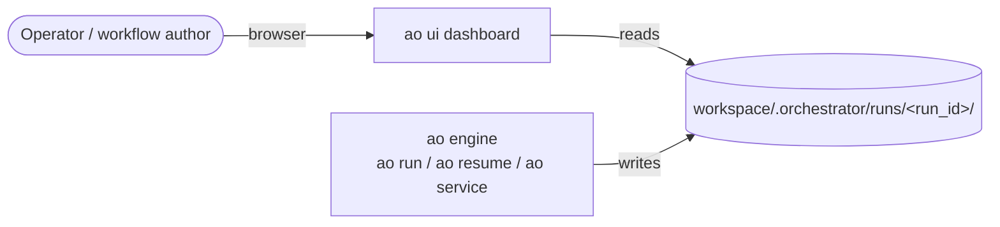
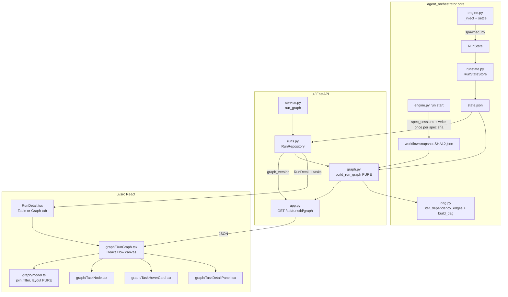
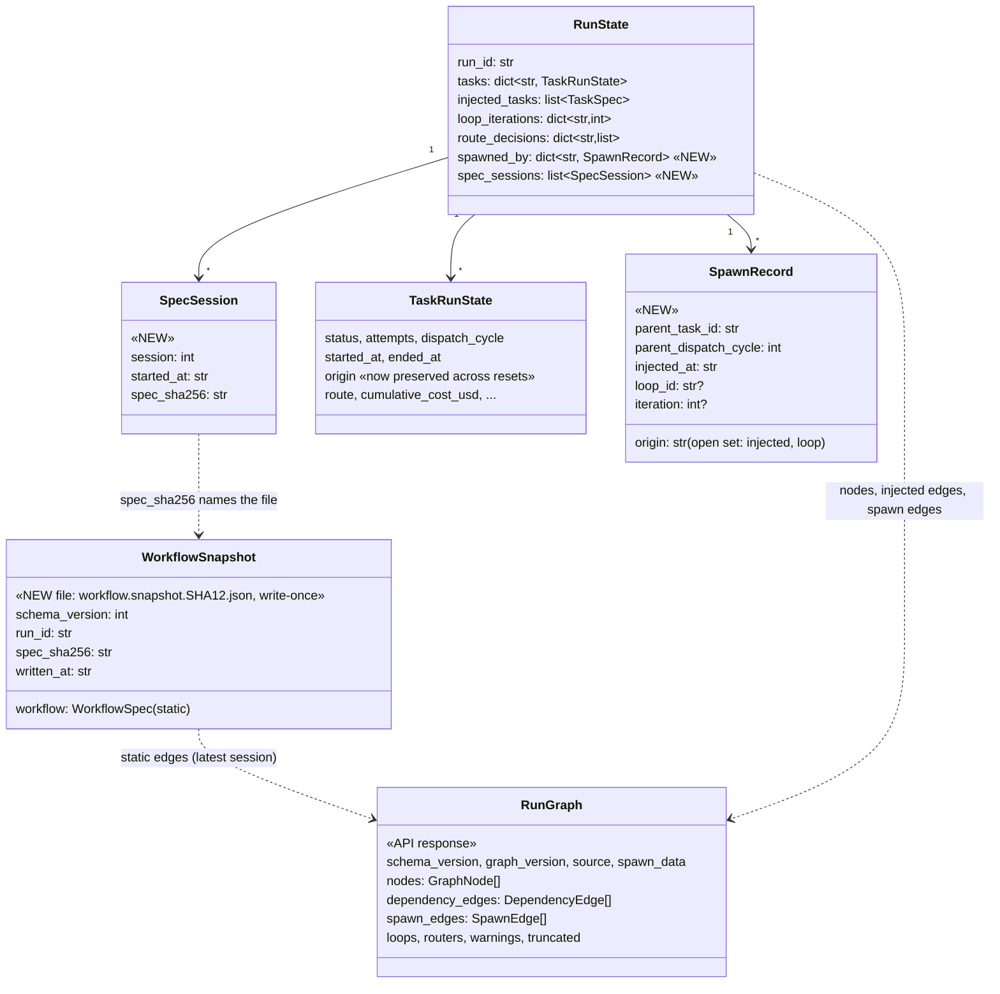
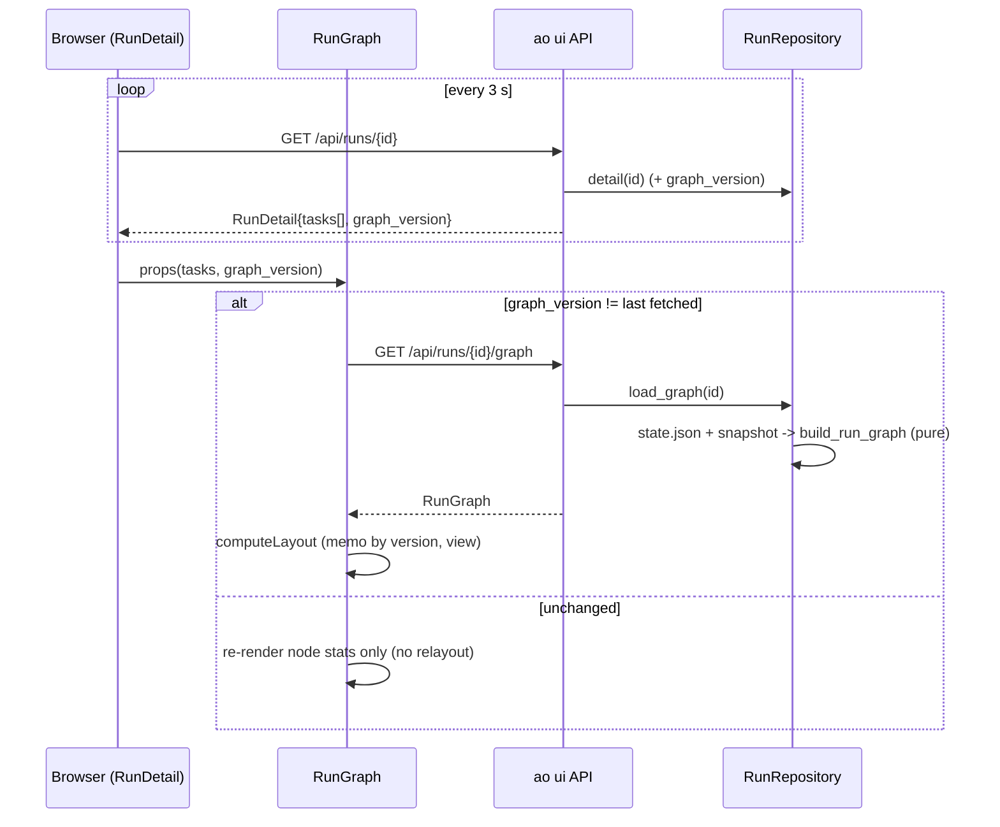
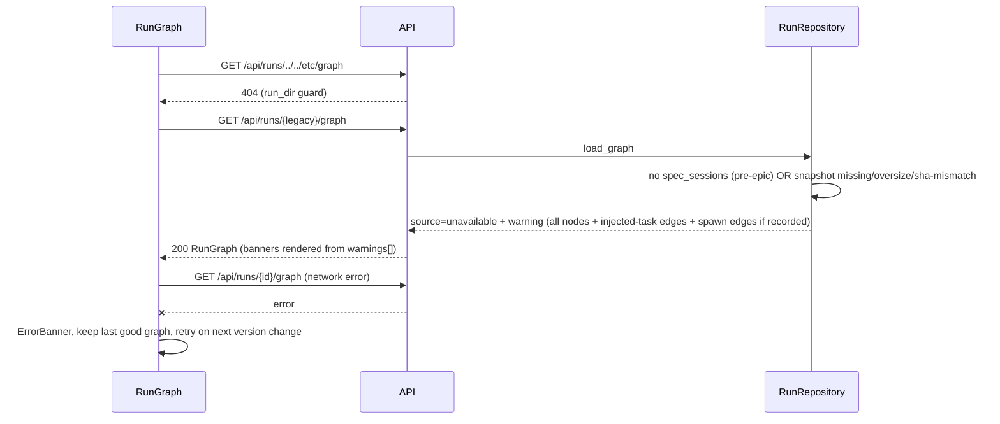

# Run graph canvas: HLD and LLD (E-k3AMEr)

**Status:** **Implemented** (all 10 MVP dev/test tasks Done; review gates G1, G2, and G3 closed
PASS on 2026-09-27; merged on `ad/run-graph-canvas` @ `dbd3657`). The body below is the design as
hardened by the Phase-4 consultations (§23.1). **Where the shipped code differs, §0 wins**:
read it first. · **Date:** 2026-09-27 (design) · 2026-09-27 (reconciled by `T-oroE5f`)
**Epic:** [`meta/tickets/E-k3AMEr-run-graph-canvas/`](../meta/tickets/E-k3AMEr-run-graph-canvas/EPIC.md)
**ADR:** [ADR-0017](adr/ADR-0017-run-graph-provenance-snapshot-and-canvas.md)
**Builds on:** [ADR-0010](adr/ADR-0010-dashboard-architecture-and-general-instructions.md) ·
[`dashboard-and-general-instructions-hld.md`](dashboard-and-general-instructions-hld.md) §2 ·
[ADR-0011](adr/ADR-0011-untrusted-workspace-content-rendering.md) (untrusted content, SPA CSP) ·
[`guide-dynamic-task-injection.md`](guide-dynamic-task-injection.md) ·
[`overseer-runner-hld.md`](overseer-runner-hld.md) (the largest real spawn trees)
**Roadmap item touched:** `meta/ROADMAP.md` §3.3 "UI-driven workflow construction" and
`dashboard-and-general-instructions-hld.md` §4. This epic delivered the **read-only**
half: seeing a run's graph. **Editing** a DAG in the browser remains deferred (see §2.2).

The dashboard shows a run as a flat task table. A workflow's actual shape is invisible there:
which task waits on which, which task created which, where the time and money went. It matters
most for the dynamic templates (`routed-runner`, `overseer-runner`), where the shape is decided
at run time and can reach 160 injected tasks.

This epic adds a **Graph** tab to the run detail page. The tab is a pannable, zoomable canvas
with no pagination. It has two toggleable edge sets over the same nodes, plus a task-detail
reveal. Two small, additive engine changes are included, because today the data needed for one
of the views is not recorded and the data needed for the other is not reliably reachable.

---

## 0. Implementation outcome and deviations (post-implementation, `T-oroE5f`)

Reconciled against the merged code at `ad/run-graph-canvas` @ `dbd3657`. Every claim here is
cited as `path:line` in `meta/tickets/E-k3AMEr-run-graph-canvas/T-oroE5f-docs-refresh/STATUS.md`.
Line anchors elsewhere in this document that say "as of 191da69" are **design-time** anchors;
§0.3 lists where the shipped code now lives.

### 0.1 What shipped (as designed)

- **Engine.** `RunState.spawned_by` / `SpawnRecord` (with `origin` as an open `str`) and
  `RunState.spec_sessions` / `SpecSession` / `WorkflowSnapshot` in `models.py`. `_inject` takes a
  keyword-only, required `parent_task_id` (plus `loop_id` / `iteration`). It has exactly 2 call
  sites (emit, loop gate). `origin` is carried across the 3 wholesale `TaskRunState` replacements,
  and `route` deliberately is not (F-2). `record_spec_session` runs before the run's first save, and
  a snapshot write `OSError` only warns (`run.snapshot_failed`).
- **`dag.py`.** `iter_dependency_edges` plus `DependencyEdge` / `EDGE_KIND_*`. `build_dag` consumes
  it, and the oracle test proves behavior identity.
- **Backend.** `ui/graph.py` is the pure builder (`build_run_graph`, `compute_graph_version`,
  `display_text`, `label_for`). `RunRepository.load_graph` and `DashboardService.run_graph` do the
  I/O, and `GET /api/runs/{run_id}/graph` serves the result. `RunDetail.graph_version` and
  `TaskStat.{dispatch_cycle, not_taken_reason}` are additive.
- **Frontend.** `ui/src/graph/*` (see the `ui/README.md` layout). The Graph tab is lazy-loaded in
  `RunDetail.tsx`, and Table stays the default. The new runtime deps are `@xyflow/react` `^12.12.0`
  and `@dagrejs/dagre` `^3.1.0`, both MIT.
- **Measured outcomes.**
  - Lazy `RunGraph` chunk: ≈ 79.4 KB JS + 2.0 KB CSS gzip (`gzip -9`), or 82.55 KB as Vite reports
    it. Both are under the NFR-4 ≤ 90 KB budget.
  - Perf: `build_run_graph` took 0.89 ms and `computeLayout` 136 ms for 200 nodes / 500 edges
    (NFR-3 targets are 150 ms and 300 ms).
  - Tests: pytest 4621 passed, 8 skipped. UI coverage 93.91%. vitest 224 passed.

### 0.2 Resolved assumptions and open questions

- **ASSUMPTION A-5: VERIFIED.** React Flow and dagre run under the unchanged `SPA_CSP`. The
  `T-F1caAt` real-browser smoke navigated a 180-node run and recorded zero
  `securitypolicyviolation` events, console errors, and page errors. The negative control imports
  the live `SPA_CSP` and proves the detector fires. `ui/security.py` is untouched by this epic.
  R-8 is closed.
- **OPEN_QUESTION (browser smoke in CI?): RESOLVED as opt-in.** The smoke test sits behind
  `@pytest.mark.browser` and a new optional `browser` extra (`playwright>=1.45`) in
  `pyproject.toml`. It drives the **system** Chrome (`channel="chrome"`, no bundled-browser
  download) and skips cleanly when playwright or `/usr/bin/google-chrome` is missing. Run it with
  `uv sync --extra ui --extra browser` and then `pytest -m browser`. The reason is its dependency
  footprint, not its runtime (≈ 7.5–10 s). A CI step is proposed in `T-F1caAt` STATUS if it is
  adopted later.
- The "third timeline view" question keeps its default: no. It is still the next roadmap step
  (R-10).

### 0.3 Deviations from this design

| # | Design said | Shipped | Why / status |
|---|---|---|---|
| DV-1 | §8.7 / FR-6: the pinned panel opens on node click or Enter. §8.6 item 4: search centers the match. | Toolbar search-select **also opens the detail panel**. The panel reuses the existing `selectedNodeId` state that `useSelectAndCenter`'s `onSelect` sets. | Intentional (T-pAi0Cv deviation #3). `hooks.ts` documented `onSelect` as driving "a future detail panel" before T-pAi0Cv existed. **Gate G3 judged it coherent, not a defect**: a second "panel target" state would let one node be selected while another node's panel is open. `T-aHktGB`'s own AC-3 predates this and does not mention it. |
| DV-2 | §7.5 / `types.ts`: "components receive view-models (`ViewNode`/`ViewEdge`), never the raw `RunGraph`". | `TaskHoverCard` and `TaskDetailPanel` take the raw `RunGraph` as their `graph` prop. | **Gate G3 Warning #1, deferred.** It is not a current defect. It matters once the deferred DAG-editor half reuses these components (FU-3). |
| DV-3 | §8.5: `model.ts::displayText`, a client mirror of the server sanitizer for ids reached via panel links. | **Not implemented.** `TaskDetailPanel.tsx::labelFor` uses the node's server-sanitized `label` when the id is a node, and otherwise falls back to the **raw id**, still rendered as a React text node. | **Gate G2 L-1, deferred.** Not independently exploitable: React escapes markup. Bidi and zero-width characters could reach the screen only for an id absent from `graph.nodes`, which engine-written state does not produce (FU-4). |
| DV-4 | §8.3.2: `_INVISIBLE_OR_BIDI`, a compiled regex over an enumerated Cc/Cf range. | `_INVISIBLE_OR_BIDI_TRANSLATION`: a `str.translate` table built at import from `unicodedata.category(ch) in ("Cc", "Cf")` over all codepoints. It costs ≈ 70 ms once, and only when `ui.graph` is imported. | **Gate G2 M-1, fixed.** The enumerated range missed 150 real Cc/Cf codepoints, including U+200E/U+200F and the Tags block. An exhaustive regression test now pins 0 misses. |
| DV-5 | §8.2 / §13.2: the `^[0-9a-f]{64}$` sha pattern is schema documentation only. | `load_workflow_snapshot_at` rejects a malformed sha (warn, return `None`) **before** building a path. `_workflow_snapshot_filename` independently raises `ValueError` as a second layer. | **Gate G1 SHOULD-FIX plus Gate G2 L-3, both fixed.** The sha is read back from the agent-writable `state.json` and spliced into a filename. |
| DV-6 | §15 log events: `run.snapshot_failed`, `run.spec_changed_on_resume`, and `ui.graph.degraded`. | Adds `run.workflow_snapshot_unavailable`, emitted by the shared snapshot reader for a malformed sha, a stat failure, an oversize file, invalid content, or a name/body sha mismatch. | Additive observability. §15 is updated. |
| DV-7 | §8.3.2 edge cases: "a warning is added when a cheap iterative DFS finds a back edge" in the dependency edges. | **Not implemented.** The builder emits cyclic dependency edges as-is and never topo-sorts, so it cannot fail on them. dagre's acyclic pass lays them out (`graph-layout.test.ts` "tolerates a cycle"). No cycle warning reaches `warnings[]`. | This was never carried into a task AC. Backlog note FU-6. A cycle is only possible in hand-edited or legacy state. |
| DV-8 | §8.5 refetch rule: when new nodes arrive, "a small '+N tasks' notice appears". | **Not implemented.** Layout recomputes and the viewport is kept, but there is no "+N" notice. | This was never carried into a task AC. Backlog note FU-7. (The non-MVP `T-hMNbDP` "+N tasks" chip is a different feature: subtree collapse.) |
| DV-9 | §8.6 Edges: the dependency edge dims when the upstream task is `failed`/`not_taken`. With a selection, edges touching the selected node are emphasized and the others dim to 35%. | **Not implemented.** Edges are styled only by set and kind (the §8.6 table), plus an arrow marker on every edge kind. | T-OjTS8O deviation #2 scoped these out (the prose sits below the table the task was scoped to), and no later task picked them up. Backlog note FU-8. |
| DV-10 | §8.6 Node: a bottom 3 px metric strip inside `TaskNode`. | The strip is rendered by a wrapper, `TaskNodeWithMetric` in `RunGraph.tsx`, around an unchanged `TaskNode`. Metric maxima are computed over the **visible** node set. | T-OjTS8O deviation #1 and T-aHktGB deviations #1/#2. Behavior matches the design, and the strip is proportional to `metricFraction`. |
| DV-11 | §8.6 Edges table: the inferred-edge artifact path appears "in tooltip `title`". | It is an on-path text label, gated by the same `EDGE_LABEL_MIN_ZOOM` as the other labels, and truncated to its tail (`EDGE_LABEL_PATH_MAX_CHARS = 24`). | T-OjTS8O deviation #4. One label mechanism for the whole Label column. |
| DV-12 | §7.5: React Flow's exit cost is bounded to `RunGraph.tsx`, `TaskNode.tsx`, and the hover card. | React Flow is imported by **4** files: those 3 plus the new `hooks.ts` (`useReactFlow`, for `useSelectAndCenter`). dagre is imported only by `layout.ts`. `model.ts` stays React-free. | Shared-hook extraction (T-aHktGB). The exit cost is still bounded to `ui/src/graph/`. |
| DV-13 | A-3: "the UI labels the [loop spawn] edge `loop <id> · iter N`". | The spawn-view loop edge label is `iter N` (as in the §8.6 table). The loop id and iteration appear in the detail panel's Spawn section as `loop: <id> · iteration N`. | Resolves an internal inconsistency in this document. The A-3 parent semantics themselves hold as designed. |
| DV-14 | §8.6: the Legend and every toolbar toggle persist in prefs. | View, metric, show-unrelated, and the Table/Graph tab persist (`ao.runGraph.prefs.v1`). The Legend's collapsed state is local and not persisted. "Reset layout" clears the drag-override map instead of re-running dagre, with an identical result. | T-aHktGB deviations #3/#5. |
| DV-15 | §17: `write_synthetic_run(root, waves, fanout)`. | `write_synthetic_run(root, waves, fanout, *, clock)`. It takes a keyword-only fixed clock, for deterministic timestamps. | Signature drift only. |

Everything else in §8 and §14 held as designed, including the §14.2 wire contract (field names,
order, and enums), which the `T-AsQ77e` contract test pins against the shared fixture.

### 0.4 Follow-ups (not done in this epic)

| ID | Follow-up | Source | Tracking |
|---|---|---|---|
| FU-1 | `TaskRunState.route` is lost on resume and on the 2 engine failure resets for tasks on a *selected* route. | Pre-existing defect, finding F-2 (§23) | **Backlog, no ticket yet.** A separate ticket is recommended (EPIC Risks). Explicitly out of this epic's scope. |
| FU-2 | Dispatch-interval history for a future timeline/Gantt view | R-10 (§23), dev-critic | **Accepted residual.** It belongs to a timeline epic (`meta/ROADMAP.md` §3.3). |
| FU-3 | `TaskHoverCard`/`TaskDetailPanel` should take `ViewNode`/view-model props instead of the raw `RunGraph` (DV-2). | Gate G3 Warning #1 | **Backlog note.** Do this before, or as the first step of, the deferred DAG-editor half. |
| FU-4 | Add the client-side `model.ts::displayText` mirror and use it in `TaskDetailPanel.tsx::labelFor`'s raw-id fallback (DV-3). | Gate G2 L-1 | **Backlog note.** Opportunistic, not independently exploitable. |
| FU-5 | Add an explicit size-bound justification comment (or bound) to `compute_graph_version`. It hashes every id in `state.tasks`/`spawned_by`/`injected_tasks` with no cap analogous to `GRAPH_MAX_NODES`. | Gate G2 L-4 | **Backlog note.** It reuses collections already iterated linearly elsewhere, so it is not a new DoS surface. |
| FU-6 | Dependency-cycle back-edge warning in `build_run_graph` (DV-7) | This reconciliation | **Backlog note.** |
| FU-7 | "+N tasks" notice on live topology growth (DV-8) | This reconciliation | **Backlog note.** It pairs naturally with `T-N8scZK` (incremental stable layout). |
| FU-8 | Edge dimming from a failed/`not_taken` upstream task, and selection-based edge emphasis (DV-9) | This reconciliation, T-OjTS8O deviation #2 | **Backlog note.** It pairs naturally with `T-ydMbJN` (critical path). |
| FU-9 | Extract the hover-timer and drag logic out of `RunGraph.tsx` (≈ 717 lines, ≈ 15 pieces of local state) into hooks, **before** the next non-MVP task adds state there. | Gate G3 Warning #3 | **Backlog note.** It precedes `T-hMNbDP`/`T-ydMbJN`/`T-N8scZK`. |
| FU-10 | Gate G3's 4 Suggestions: move the 3 pure edge-formatting helpers from `RunGraph.tsx` into `model.ts`; replace one inline `* 100` literal; give "spec changed" a typed field instead of regex-matching `warnings[]` in `Legend.tsx`; (the fourth confirmed that the `spawn-other` path is unreachable today by design). Also, `TaskDetailPanel.tsx::statusFor` still uses a literal `"pending"` instead of `PANEL_PENDING_STATUS`, a residue of the resolved Warning #2. | Gate G3 | **Nice-to-have.** Not acted on. |
| FU-11 | Non-MVP feature tickets | §2.3 | `T-VcN4pt-task-title-field`, `T-hMNbDP-spawn-subtree-collapse`, `T-ydMbJN-critical-path-edge-timing`, and `T-N8scZK-layout-persistence` (all Draft, backlog). |
| FU-12 | Wire the browser smoke into CI, if wanted (§0.2) | T-F1caAt AC-6 | **Optional.** The proposed step is in `T-F1caAt` STATUS. |
| FU-13 | `E-Grpp0X-injected-task-dag-validation-gap` edits the same `_inject` body. | R-1 | Coordination only. `spawned_by` is written in the same per-spec step, so validate-before-append composes. |

---

## 1. Requirements

### 1.1 Stated by the user

| ID | Requirement |
|---|---|
| U-1 | Show a workflow run diagrammatically: its structure, execution order, spawn relationships, and time and cost. |
| U-2 | Open-canvas feel "like Obsidian Canvas": free-flowing, pan and zoom, **not paginated**. |
| U-3 | **Execution-order view.** Edges mean "B must finish before A runs" (dependency order). |
| U-4 | **Spawn view.** Edges mean "task A *created* task D". The two edge sets can differ for the same run. |
| U-5 | The two views are **toggleable**. |
| U-6 | A task block shows **only the title**. |
| U-7 | Hover and/or click reveals details: at least cost, running time, and retries, plus anything else judged useful. Shape, interaction, and extra node/edge info are the architect's call. |

### 1.2 Derived (implicit) requirements

| ID | Requirement | Source |
|---|---|---|
| D-1 | Usable at **≥160 nodes** (overseer `max_injected_tasks` default) plus the static tasks, with no pagination. | Scale reality check |
| D-2 | Works for runs launched **any way**: `ao ui`, bare `ao run`, `ao resume`, `ao service` cron/event triggers. | CLAUDE.md "reproducible from spec + artifacts" |
| D-3 | Live runs update in place. Status and cost refresh at the existing 3 s poll, and newly injected tasks appear without a manual reload. | Existing `RunDetail` polling |
| D-4 | Old runs (pre-epic `state.json`) still render, degrading honestly with a visible reason and no crash. | NFR-5 backward-compat convention on `RunState` |
| D-5 | Agent-authored strings (task ids from `emit_tasks` manifests) are rendered as **text only**. | ADR-0011 threat model |
| D-6 | No new CSP relaxation. The SPA CSP (`ui/security.py::SPA_CSP`) stays byte-identical. | ADR-0011 |
| D-7 | Status is never conveyed by color alone. Theme tokens are used and both themes are explicit. | `ui/README.md` conventions |
| D-8 | Keyboard and screen-reader reachable: nodes focusable, panel dismissible with Esc. | Accessibility baseline |

### 1.3 Requirement IDs used by tickets

Functional (MVP):

- **FR-1**: Persist spawn provenance. Every injected task records `parent_task_id`, origin,
  and for loop clones `loop_id` and `iteration`, and the record survives resume.
- **FR-2**: Persist a static workflow snapshot per run session, so dependency edges are
  reconstructible without the original spec file.
- **FR-3**: A pure graph builder derives nodes, dependency edges (with kind), spawn edges,
  loop and router annotations, and execution ordinals from `RunState` plus the snapshot. It
  reuses `dag.py`'s edge logic and never re-implements it.
- **FR-4**: `GET /api/runs/{run_id}/graph` serves the graph. `RunDetail` gains `graph_version`
  so the client refetches topology only when it changes.
- **FR-5**: A frontend canvas has a two-view toggle, auto-layout, pan/zoom/fit, a minimap,
  search-to-focus, a legend, and a metric strip (duration or cost).
- **FR-6**: Task detail uses a hover preview card plus a pinned side panel. Related tasks
  (parent, children, dependencies, dependents) are navigable.
- **FR-7**: Degraded modes are explicit for a missing snapshot, missing spawn data, and
  unknown dependency ids.
- **FR-8**: The existing task table is unchanged. Graph is an additional tab.

Non-functional:

- **NFR-1**: Additive and backward-compatible only. New `RunState` fields default so old
  `state.json` loads, and no existing API field changes meaning.
- **NFR-2**: Deterministic. The same `state.json` plus snapshot always yields a byte-identical
  graph response, with sorted, stable ordering and no clock reads in the builder.
- **NFR-3**: Performance targets for a 200-node, 500-edge graph on a mid-range laptop:
  server build ≤ 150 ms, client layout ≤ 300 ms, pan/zoom ≥ 30 fps.
- **NFR-4**: Bundle discipline. The added gzip size is ≤ 90 KB, measured and recorded, and
  `npm audit --omit=dev --audit-level=high` stays clean.
- **NFR-5**: No magic literals. Caps, thresholds, sizes, and file names are named constants.
- **NFR-6**: Coverage. `agent_orchestrator.ui` stays ≥ 80% (the CI gate), and every new
  pure frontend module has vitest coverage of its branches.
- **NFR-7**: The engine hot path gains no measurable cost. One write-once file per run
  session and one dict insert per injected task.

---

## 2. Scope

### 2.1 In scope (MVP)

- Engine: `RunState.spawned_by` (spawn provenance), carrying `origin` forward across
  `TaskRunState` resets, the `RunState.spec_sessions` log, and write-once `workflow.snapshot.<sha12>.json` files.
- `dag.py`: extract an edge iterator (`iter_dependency_edges`) that `build_dag` consumes,
  with identical adjacency.
- Dashboard backend: `ui/graph.py` builder, `GET /api/runs/{id}/graph`, and additive
  `RunDetail.graph_version` and `TaskStat.{dispatch_cycle, not_taken_reason}`.
- Dashboard frontend: Graph tab, canvas, two views, hover card, detail panel, search, legend,
  metric strip, live-update, and degraded-mode banners.
- Tests: pytest (unit, integration, e2e through a real server and real `ao run`, fake
  executor), vitest (pure model and components), and one opt-in real-browser smoke test.
- Docs: this HLD, ADR-0017, and cross-links and roadmap updates. A post-implementation docs
  refresh is a separate task.

### 2.2 Out of scope (explicit)

- **Editing or building a DAG in the browser.** That is the roadmap item's other half. This
  epic adds no mutation endpoint. `/graph` is a run *read model*, not a spec round-trip format.
  Only the canvas components (which take generic view-models) and the layout seam are reusable by a
  future editor.
- A third "timeline/Gantt" view. It is a natural next step, but it is intentionally excluded
  to keep "two views" crisp (roadmap note in §23).
- Cross-run graph comparison, live streaming (SSE/WebSocket), and authentication (ADR-0010 D7
  stands).
- Showing agent transcripts inside the panel. The panel links paths and does not inline
  content.
- Fixing `route` loss on resume (pre-existing defect discovered in this design, §23 F-2). It is
  tracked as a follow-up and not folded in.
- `E-Grpp0X-injected-task-dag-validation-gap` scope (validation of injected `depends_on`). It
  touches the same function and is a coordination item only (§23).

### 2.3 Non-MVP (ticketed, backlog)

- Optional `TaskSpec.title` for friendlier labels (`T-VcN4pt-task-title-field`).
- Collapse and expand a spawner's subtree (`T-hMNbDP-spawn-subtree-collapse`).
- Critical-path highlight plus per-edge wait-time labels (`T-ydMbJN-critical-path-edge-timing`).
- Persisted manual node positions per run and view, and incremental stable layout for live runs
  (`T-N8scZK-layout-persistence`).

---

## 3. Assumption log

| # | Assumption | Risk if wrong | Mitigation |
|---|---|---|---|
| A-1 | "Task title" = task **id** for MVP. `TaskSpec` has no title field, and ids are human-authored slugs (or agent-authored in manifests). | Labels are cryptic for some templates. | Non-MVP `T-VcN4pt` adds an optional `title`. The label resolver is one function, so the switch is one line. |
| A-2 | "Execution-order view" means the **dependency DAG** (what must precede what), annotated with the **actual start ordinal** (`#n`) to show what happened. | The user wanted a strict timeline. | The ordinal badge shows actual order. Gantt is the documented next step (§23). |
| A-3 | The "parent" of a loop clone is the **gate task of the previous iteration** (the task whose verdict caused the clone). | The user expects "the loop" as parent. | `SpawnRecord` also stores `loop_id`/`iteration`. The UI labels the edge `loop <id> · iter N`. |
| A-4 | `@xyflow/react` 12.x is compatible with React 19 without `--legacy-peer-deps`. Verified 2026-09-27: `12.12.0` peerDeps `react >=17`, MIT. | Install conflict. | T-adVpTj AC-1 requires a clean `npm ci`. Fallback: pin the last compatible 12.x. |
| A-5 | **VERIFIED 2026-09-27 by T-F1caAt** (see §0.2). The SPA CSP (`default-src 'self'`, so no `unsafe-eval`; `style-src 'self' 'unsafe-inline'`) permits React Flow and dagre: inline style attributes are allowed, and neither library is expected to use `eval`/`new Function`/workers. | Canvas renders blank in production only. | Early signal from the T-adVpTj spike (week 1). Hard gate: T-F1caAt real-browser smoke under the real CSP, with a console scan **and a negative control**. |
| A-6 | Nothing but `ui/runs.py` reads `TaskRunState.origin` behaviorally (verified by grep: one read site). | Carrying `origin` across resets changes engine behavior. | Grep re-verified in T-AZzgT8, plus a regression test that engine scheduling is unchanged on resume. |
| A-7 | Run directories live under `<workspace>/.orchestrator/runs/<run_id>/`, and no task id equals a snapshot file name. | A collision with a per-task capture dir. | File names are `workflow.snapshot.<12 hex>.json`. Task-capture dirs are bare ids, and a test pins that a snapshot write never targets an existing directory. |
| A-8 | The dashboard's single-user, loopback trust model (ADR-0010 D7) is unchanged. | Exposure of the graph API off-loopback. | The graph exposes nothing new beyond what `/api/runs/{id}` plus the file browser already expose. No hook argv or instructions are returned (§8.3). |

---

## 4. Standards survey

| Standard | Applied how |
|---|---|
| **C4** | §7 gives the Context and Container views, and §10 gives the Component view. |
| **ADR** (Nygard) | ADR-0017 holds D1 to D7. The §9 log mirrors it. |
| **JSON Schema** | §13 has the JSON Schema (draft 2020-12) for `workflow.snapshot.<sha12>.json`, `spawned_by`/`spec_sessions`, and the `/graph` response. Pydantic models are authoritative and the schema is generated from them in tests. |
| **OpenAPI** | FastAPI's generated OpenAPI covers the new route. §14 lists status codes. |
| **AsyncAPI** | N/A. There are no new events. The graph is pulled via polling (§15 explains why no event contract). |
| **Test pyramid** | §18: many pure unit tests (builder, model, layout), fewer integration tests (API, engine), a handful of e2e (real server plus real `ao run`), and one browser smoke test. |
| **WAI-ARIA** | Radiogroup for the view toggle, `role="complementary"` panel, focusable nodes, Esc to close. |
| **Observability** | The builder logs degraded sources at `warning` with `event=ui.graph.degraded`. Responses carry `warnings[]` and `source`, so the operator sees *why* a view is partial. |
| **Rollout safety** | Everything is additive. Old runs degrade and do not fail. The frontend tab is feature-detected on `graph_version != null`. |

**Recommended approach vs alternatives** (the full evaluation is in §5, §6, and §9):
record provenance at the one point of truth (`_inject`), snapshot the static spec once per
session, derive everything else on demand in a pure builder, and render with an off-the-shelf
React graph canvas plus a layered auto-layout. Rejected alternatives: runtime spec lookup,
a hand-rolled SVG canvas, a physics or force layout, a canvas/WebGL renderer, and a separate
graph database or event store.

---

## 5. Solution landscape (build vs buy vs hybrid)

### 5.1 Graph rendering and interaction

Candidates were evaluated against the actual constraints: React 19 + TS + Vite, the bundle
ships **inside the Python wheel**, strict SPA CSP (no `unsafe-eval`, no remote hosts), jsdom
unit tests, ~160–300 nodes, rich HTML node content with accessible focus, and theming via CSS
tokens.

| Option | Render | React-native | Custom rich nodes | a11y / focus | 160–300 nodes | gzip (approx.) | Layout included | CSP risk | Verdict |
|---|---|---|---|---|---|---|---|---|---|
| **@xyflow/react (React Flow 12)** | DOM + SVG edges | Yes (components) | Yes (any JSX) | Nodes focusable, keyboard select; ARIA props | Comfortable. Offers `onlyRenderVisibleElements` for more | ~50 KB | No (bring your own) | Low: inline style attributes (already allowed) | **Chosen** |
| Cytoscape.js | Canvas | Wrapper only | Hard (canvas-drawn; HTML overlays are plugins) | Poor (canvas) | Excellent (thousands) | ~110 KB | Yes (plus extensions) | Low | Rejected: rich accessible nodes and jsdom testing both suffer |
| vis-network | Canvas | No | Limited | Poor | OK | ~200 KB+ | Physics | Medium (legacy build) | Rejected: heavy, dated, and physics layout is non-deterministic |
| Sigma.js + graphology | WebGL | No | Minimal | Poor | 10k+ | ~70 KB+ | Via graphology | WebGL off in some headless/VM contexts | Rejected: optimizes for a scale we don't have and sacrifices node richness |
| D3 (+ d3-dag) hand-built | SVG | No (imperative) | Yes, but hand-built | Hand-built | OK | ~30–60 KB | d3-dag | Low | Rejected: pan/zoom/minimap/selection/keyboard are all ours to write and test. Too much surface for junior implementers |
| Hand-rolled SVG + dagre | SVG | Yes | Yes | Hand-built | OK | ~25 KB (dagre only) | dagre | Low | Runner-up: honors the "few deps" convention but re-implements ~800 lines of solved interaction code |

### 5.2 Layout engine

| Option | Model | Deterministic | Size | Fit |
|---|---|---|---|---|
| **@dagrejs/dagre 3.x** | Layered (Sugiyama) DAG | Yes | ~25 KB gzip incl. graphlib | **Chosen.** Both views are DAGs (spawn view is a forest). Synchronous, runs in <50 ms at this scale |
| elkjs | Layered plus many | Yes | ~8 MB unpacked, ~400 KB+ gzip | Rejected: would 4× the whole dashboard bundle for marginally nicer edge routing. Its worker mode also needs `worker-src` (CSP change) |
| React Flow's d3-force example | Force | **No** (seeded at best) | small | Rejected: nodes drift and positions differ per load, which breaks "find the same task again" |
| Manual (Obsidian-style hand placement) | None | n/a | 0 | Rejected as **default**. At 160 nodes nobody hand-places. Kept as an **affordance**: nodes are draggable. Persistence is non-MVP |

**Recommendation: Hybrid.** Buy the canvas and interaction layer (React Flow) and the layout
algorithm (dagre). Build the domain model, the graph builder, the node component, the
detail panel, and the provenance and snapshot persistence. "Obsidian Canvas feel" is delivered by
the infinite pannable/zoomable surface, minimap, and draggable nodes. Legibility at 160 nodes
comes from auto-layout.

**Convention deviation, recorded:** `ui/README.md` said "no runtime dependencies beyond React".
That convention was already relaxed for `dompurify`/`marked`/`highlight.js` (E-Fp7Qv2, which
accepted 66→120 KB gzip). This epic adds two more MIT deps. It is justified in ADR-0017 D5, and
the budget is NFR-4 (≤ 90 KB). The README line was updated by `T-oroE5f` to name every runtime
dep and link ADR-0017 D5.

### 5.3 Data persistence

Built, and deliberately **not** a graph database or event log. Two additive pieces sit in the run
directory the engine already owns (see §8 and ADR-0017 D1–D3).

---

## 6. Orchestration landscape and competitor analysis

This epic is a *visualization* feature, so the comparison is scoped to **how each orchestrator
shows a run's graph** and whether it can show *dynamic/spawned* structure, which is the gap
this epic targets.

### 6.1 Comparison matrix

| Tool | Spec/DSL | Graph view of a run | Dynamic / spawned tasks shown as | Separate "who created whom" view? | Per-node detail | Layout | Operational note |
|---|---|---|---|---|---|---|---|
| **Airflow** | Python DAG | Graph view plus Grid view (per-run status matrix) | Dynamic task mapping shows `[n]` mapped instances collapsed under one node | No. Mapping is shown as fan-out of one node, and the mapper→instances relation is implicit | Click opens a task-instance panel (logs, duration, tries) | Layered (dagre-d3 historically) | Heavy stack (scheduler, webserver, DB) |
| **Prefect** | Python (imperative flows) | Flow-run "radar"/timeline graph | Subflows and tasks nest in the timeline and appear as they run | Partially: subflow nesting is parent/child, but task-created-task has no separate view | Side panel | Time-axis layout | Imperative, so no static DAG exists before the run |
| **Dagster** | Python assets/ops | Asset lineage graph plus run Gantt | Dynamic outputs fan out as `[key]` op instances | No | Sidebar with metadata and materializations | Layered | Asset-centric, heavy concept load |
| **Temporal** | Code (workflows) | Event history plus (newer) timeline; child workflows | Child workflows as links, activities in history | Yes for child workflows (parent/child), but no dependency DAG, since workflows are imperative code | Event detail | Timeline / list | Excellent durability, weak structural picture |
| **Argo Workflows** | YAML (DAG/steps) | Graph view of the workflow's node tree | `withItems`/`withParam` expansion shown as sibling nodes under a parent | Kind of: the node tree *is* the template-nesting tree, but it is conflated with dependencies | Side panel (inputs, outputs, logs, duration) | Layered, top-down | K8s-native, CRD operational burden |
| **n8n / Windmill** | Visual / JSON | Editor canvas *is* the graph, plus per-execution highlighting | Loops/sub-workflows as nodes | No | Node output inspector | Manual placement (canvas) | Canvas-first; hand-placed layouts degrade past ~50 nodes |
| **Luigi** | Python | Dependency graph visualizer | Dynamic requirements appear once yielded | No | Minimal | Layered | Aging UI |
| **Step Functions** | JSON (ASL) | Graph inspector plus event table | Map state iterations in a separate sub-view | Map parent → iterations only | Step detail panel | Layered, fixed | Vendor lock-in |
| **GitHub Actions** | YAML | Job graph (`needs:`) | Matrix jobs grouped under one node | No | Click to logs | Layered, left-to-right | No task-level spawning |

### 6.2 Gap analysis

- **What they do well.** Airflow and Argo prove layered auto-layout plus a click-for-detail
  side panel is the right default for DAG runs. Airflow's Grid view and Dagster's Gantt show
  timing better than any graph. Temporal is the only one that makes parent/child
  first-class.
- **Where they fall short.** Every one of them **conflates or omits "who spawned whom"**. They
  show dynamic expansion as fan-out of the *dependency* graph (Airflow mapping, Argo
  `withParam`, GitHub matrix). In agent workflows like `overseer-runner`, the spawn tree (a
  checkpoint creates units and the next checkpoint) and the dependency graph (the next
  checkpoint *waits on* those units) are genuinely different graphs. Collapsing them hides
  the causal story of how the run decomposed its own work.
- **Known complaints.** Airflow's graph view becomes an unreadable hairball for large mapped DAGs.
  Canvas-first tools (n8n) degrade with hand placement past a few dozen nodes. Timeline-only
  views (Prefect) make structure hard to read. Hover-only tooltips are frequently cited as
  unusable for dense graphs (you lose the tooltip as soon as you move toward it).

### 6.3 Differentiation and positioning

```
We will:
- Match Airflow/Argo in layered auto-laid-out run graphs with a click-to-pin side panel.
- Beat all of them in showing dynamic agent decomposition: a first-class, toggleable
  SPAWN view (who created whom), separate from the DEPENDENCY view (who waits on whom),
  over the same nodes with stable selection across the toggle.
- Beat Airflow in large-graph legibility: search-to-focus, minimap, per-view filtering of
  unrelated nodes, and a metric strip (duration/cost) instead of a hairball.
- Avoid the complexity of n8n/Windmill-style canvas editing (no hand-placed default layout,
  no in-browser editing) and of Dagster's asset model (no new concepts: a node is a task).
```

Design ties that prevent feature creep:
- **No editing** (§2.2), so no mutation API, no spec round-tripping, and no validation UI.
- **Two views only**, so the toggle is a two-option radiogroup, not a view framework.
- **Pull, not push** (§15), so no event contract, SSE, or WebSocket in this epic.
- **Provenance is recorded once, at injection.** No inference heuristics for missing data;
  degraded modes are shown honestly (FR-7).

---

## 7. High-level design

### 7.1 Context (C4 level 1)



### 7.2 Containers and the change set (C4 level 2)



### 7.3 Component breakdown

| Component | New/changed | Responsibility |
|---|---|---|
| `models.SpawnRecord`, `RunState.spawned_by` | new | Source of truth for spawn provenance (child id → record). |
| `models.WorkflowSnapshot`, `models.SpecSession`, `RunState.spec_sessions` | new | Snapshot file envelope (one per distinct static spec), plus the append-only session log that is the source of truth for which spec each session ran. |
| `engine._inject` | changed | Takes keyword-only **required** `parent_task_id` (plus optional `loop_id`/`iteration`) and writes `spawned_by`. |
| `engine` run start | changed | Calls `RunStateStore.record_spec_session` once per session, before the first save. |
| `engine` reset sites (2), `runstate.prepare_resume` | changed | Carry `origin` forward on wholesale `TaskRunState` replacement. |
| `runstate.RunStateStore` | changed | `record_spec_session` / `load_workflow_snapshot` (write-once atomic write, tolerant bounded read). |
| `dag.iter_dependency_edges` | new (extracted) | Single implementation of edge derivation with kinds. `build_dag` consumes it. |
| `ui/graph.py` | new | Pure `build_run_graph` plus `compute_graph_version`. No I/O. |
| `ui/runs.py` | changed | `load_graph(run_id)` does the I/O (state plus snapshot). `RunDetail.graph_version` (same `compute_graph_version`), `TaskStat` additive fields. |
| `ui/service.py`, `ui/app.py` | changed | `run_graph()` service method and route. |
| `ui/src/graph/*` | new | Canvas, node, toolbar/legend, hover card, panel, pure model and layout, and (as shipped) `hooks.ts` with the shared `useSelectAndCenter`. Lazy-loaded chunk. |
| `ui/src/components/RunDetail.tsx` | changed | Table/Graph tab switch. Passes `detail.tasks` and `graph_version` down. |

### 7.4 Integration points

- **Engine → run dir**: `state.json` (existing, plus `spawned_by` and `spec_sessions`) and `workflow.snapshot.<sha12>.json` (new, write-once).
- **Dashboard → run dir**: read-only, and the existing `RunRepository.run_dir` traversal guard is reused.
- **Dashboard → launch records**: **not used.** The draft's legacy fallback was removed after the security and critic reviews (§8.3.2).
- **Launch paths**: `ao ui` launch/resume (`ui/processes.py`) and the bench harness
  (`bench/subjects.py`) subprocess to real `ao run`/`ao resume`, which reach `Orchestrator.run`
  (verified by the developer review). `ao service` cron/event triggers (E-Sc9Rt4 / ADR-0014) are
  not yet wired to launch runs in production code (`scheduler.py` has no production importers
  today). When they land they will launch `ao run` and get snapshots with no extra work. D-2 is
  therefore verified for every path that exists.
- **Coordination:** `E-Grpp0X` edits the same `_inject` body (§23).

### 7.5 Plugin/extension strategy

- **Core is opinionated.** There are exactly two edge sets, one node component, and one layout
  engine behind one function (`computeLayout`).
- **Edges are extensible.** The graph response carries typed edge *sets* keyed by name
  (`dependency_edges`, `spawn_edges`). A future view (timeline, overlay) adds a key without
  changing existing consumers.
- **The layout seam is async by contract.** `computeLayout(...) → Promise<{positions, direction}>`
  means dagre can be swapped for elkjs (async/worker) without changing callers. Handle placement
  derives from the returned `direction`, not from the view name (dev-critic).
- **React Flow is a firm dependency** (dev-critic). Only the layout algorithm is swappable, and
  React Flow's exit cost is bounded to `RunGraph.tsx`, `TaskNode.tsx`, and the hover card. The pure
  model and builder never import it. *(As shipped, the new `hooks.ts` also imports it: see §0.3
  DV-12.)*
- `label_for(spec, id)` is the single seam for the non-MVP `title` field.
- Components receive **view-models** (`ViewNode`/`ViewEdge`), never the raw `RunGraph`, so a future
  editor could reuse the canvas with its own data. *(As shipped, `TaskHoverCard` and
  `TaskDetailPanel` still take the raw `RunGraph`: see §0.3 DV-2 and follow-up FU-3.)* `/graph` is a
  *read model* of a run (static plus injected merged) and is **not** a spec round-trip format. The
  deferred editor needs its own spec-shaped API.

---

## 8. Low-level design

Each module has definition, pseudocode, contracts, schema, subtasks, and edge cases.

### 8.1 Module M1: spawn provenance (engine, models, runstate)

**Purpose.** Record, at the single point where tasks are created at run time, which task
created each injected task. The record must survive resume and failure resets.

**Inputs.** `_inject(new, workflow, state, origin, route, *, parent_task_id, loop_id, iteration)`.
**Outputs.** `state.spawned_by[child_id] = SpawnRecord(...)`. `TaskRunState.origin` is preserved
across resets.
**Dependencies.** `models.py`, `engine.py`, `runstate.py`, and the engine clock (`self._clock`).

**Verified call-site inventory (main @ 191da69).** This corrects the epic brief. *As shipped
(`dbd3657`): the emit call is at `engine.py:2084`, the loop call at `engine.py:2201`, `_inject` at
`engine.py:4153`, the resets at `engine.py:1075` / `engine.py:1142` / `runstate.py:498`, and
`_on_router_success` at `engine.py:3155`.*

| # | Call site | Origin | `parent_task_id` | `loop_id` / `iteration` |
|---|---|---|---|---|
| 1 | `engine.py:~2052`, emit settle (`task.emit_tasks and ts.status == "succeeded"`) | `injected` | `tid` (the emitting task) | `None` / `None` |
| 2 | `engine.py:~2162`, loop-gate settle (`should_cont` true) | `loop` | `tid` (the gate task of the *current* iteration, which may itself be `gate__iterN`) | `loop.id` / `next_iter` |
| (3) | **Router expansion: not a call site.** `_on_router_success` (`engine.py:~3107`) only tags `route` on tasks already in the spec and marks unselected cones `not_taken`. It never creates tasks. | n/a | n/a (router → route membership is shown as a node **attribute**, not a spawn edge) | n/a |

Nested emit is covered by call site 1: an injected task that itself has `emit_tasks: true`
is settled through the same code path, so the tree builds recursively (overseer checkpoint
chains). A route's emitter is also covered by call site 1, and its children inherit `route` as today.

**Why not `TaskRunState.parent_task_id` (the brief's suggestion).** `TaskRunState` is **replaced
wholesale** in three places:

- `runstate.prepare_resume` (`~line 278`, every non-pending, non-succeeded, non-`not_taken` task on resume)
- `engine.py:~1051` (worktree collision)
- `engine.py:~1112` (missing inputs)

A field there would silently vanish on resume. This is exactly why `task_integration` already
lives on `RunState` (see the comment at `runstate.py:~291`). So provenance lives on
`RunState.spawned_by`, keyed by child id. The API still exposes it as `parent_task_id` per
node (the brief's naming). ADR-0017 D1 records this.

**Data schema.**

```text
SpawnRecord (pydantic, models.py):
- parent_task_id: str            # task whose settle created this task
- parent_dispatch_cycle: int     # parent's TaskRunState.dispatch_cycle at emit time (which dispatch spawned it)
- origin: str                    # OPEN set, known values SPAWN_ORIGIN_INJECTED="injected", SPAWN_ORIGIN_LOOP="loop"
- injected_at: str               # ISO-8601 UTC from Orchestrator._clock (deterministic under test clocks)
- loop_id: str | None = None     # set iff origin == "loop"
- iteration: int | None = None   # set iff origin == "loop"; by convention >= 2 (iteration 1 is the authored body)

RunState (additive):
- spawned_by: dict[str, SpawnRecord] = {}   # child task id -> record; default keeps old state.json loadable
```

Constants (models.py): `SPAWN_ORIGIN_INJECTED = "injected"` and `SPAWN_ORIGIN_LOOP = "loop"`.

**Why `origin` is `str` and not `Literal`** (dev-critic, HIGH). `extra="ignore"` protects old readers
from unknown *fields*, not from unknown *values*. A closed `Literal` means a future origin
(for example sub-workflow spawns or emitter re-emits) would make an older engine or dashboard fail to
validate the whole `state.json`, which ends free rollback. The engine writes only the known
constants. Readers render unknown values generically. A mixed-version test loads
`origin: "future-kind"`.

**Extension path, documented and not built.** Child runs would add an optional `parent_run_id`.
Multi-parent spawns would add a `schema_version` bump that moves the value to a list. `spawned_by`
is a *view* that a future event-sourced run log could rebuild. Nothing in this epic prevents that.

**Pseudocode.**

```text
FUNCTION _inject(new, workflow, state, origin, route=None, *, parent_task_id, loop_id=None, iteration=None):
  # parent_task_id is keyword-only and REQUIRED: mypy rejects any future call site that forgets it.
  ASSERT origin IN {"injected", "loop"}
  ASSERT (origin == "loop") == (loop_id is not None and iteration is not None)
  now_iso = self._clock().isoformat()          # one timestamp per batch
  existing = {t.id for t in workflow.tasks}
  FOR spec IN new:                               # UNCHANGED duplicate-id rule (NFR-6 of prior epic)
    IF spec.id IN existing: RAISE InjectionError(...)
    workflow.tasks.append(spec); existing.add(spec.id)
    state.injected_tasks.append(spec)
    state.tasks[spec.id] = TaskRunState(origin=origin, route=route)
    state.spawned_by[spec.id] = SpawnRecord(parent_task_id=parent_task_id,
                                            parent_dispatch_cycle=state.tasks[parent_task_id].dispatch_cycle,
                                            origin=origin, injected_at=now_iso,
                                            loop_id=loop_id, iteration=iteration)
    # INVARIANT (test-pinned): state.spawned_by[id].origin == state.tasks[id].origin for every injected id.
  # Persistence: unchanged. Both callers already self._runstate.save(state) after injection.
  # Atomicity: spawned_by is written in the SAME per-spec step as injected_tasks, so whatever
  # batch-atomicity E-Grpp0X adds (validate-before-append) covers spawned_by automatically.

CALL SITE 1 (emit):  self._inject(new_specs, workflow, state, origin="injected", route=ts.route,
                                  parent_task_id=tid)
CALL SITE 2 (loop):  self._inject(clones, workflow, state, origin="loop", route=ts.route,
                                  parent_task_id=tid, loop_id=loop.id, iteration=next_iter)

FUNCTION prepare_resume(...)   # existing wholesale-replace branch, one added kwarg
  state.tasks[task.id] = TaskRunState(status="pending", dispatch_cycle=..., cumulative_*=..., origin=ts.origin)
  # spawned_by is RunState-level, so it is preserved verbatim (no code needed). A test pins this.

engine.py ~1051 (worktree collision):  TaskRunState(status="failed", dispatch_cycle=..., origin=ts_pre.origin)
engine.py ~1112 (missing inputs):      prev = state.tasks.get(tid); TaskRunState(status="failed",
                                        origin=prev.origin if prev else "static")
```

**Interface contract.** `_inject` is private, and its signature change is compile-checked by mypy.
There is no public API change. `RunState` JSON gains `spawned_by`.

**Idempotency and versioning.** Resume never re-injects an already-injected id. `prepare_resume`
re-attaches `injected_tasks`, and `_inject` is not called for them, so `spawned_by` is never
rewritten. Old `state.json` has `spawned_by = {}`, which the builder reports as
`spawn_data: "not_recorded"` when injected tasks exist (FR-7).

**Subtasks.** (a) models plus constants. (b) `_inject` signature and write. (c) the two call sites.
(d) the three `origin` carry-forward sites. (e) tests: emit, nested emit, loop N iterations, resume
preserves, legacy-state load, the duplicate-id path leaves no record for the rejected id, the
`spawned_by[id].origin == tasks[id].origin` invariant across a resume (reviewer), and a mixed-version
unknown origin. (f) `status.json` unchanged (verify no schema drift).

**Trust note** (dev-security, MEDIUM). `state.json` lives in the agent-writable workspace. Spawn
provenance is **observability data, not a security boundary**: a task able to write
`.orchestrator/` could forge it, exactly as it could forge `status`/`cost` today. Its integrity
relies on the same task/workspace isolation posture as the rest of the run dir (ADR-0013,
ADR-0011 threat model). The dashboard therefore treats it as untrusted input: it bounds parsing,
never executes anything from it, and renders it as sanitized text.

**Edge cases.**

| Case | Behavior |
|---|---|
| Duplicate id in batch | `InjectionError` raised *before* that spec's `spawned_by` write. Earlier specs of the same batch are recorded, which matches today's partial-injection behavior. Tightening that is E-Grpp0X's scope. |
| Emitter emits zero tasks | No records. The node shows `children_count = 0`. |
| Nested emit (child emits grandchildren) | Recorded normally. Depth is computed by the builder. |
| Loop iteration 1 | Not injected (it is the authored body), so there is no record. The iteration-1 gate is the parent of iteration-2 clones. |
| Crash between `_inject` and `save` | Both `injected_tasks` and `spawned_by` are lost together (same save), so they stay consistent. Re-settle on resume re-emits, which is today's behavior. |
| Parallel execution (`max_parallel > 1`) | Settle and inject run on the main thread (R-21), so there is no lock. A test with `max_parallel: 4` confirms. |

### 8.2 Module M2: workflow snapshot (engine run start, runstate)

**Purpose.** Make static dependency edges available for **every** run, however it was
launched, without trusting the spec file to still exist or be unchanged.

**Inputs.** The live `WorkflowSpec` at run-session start, plus `RunState`.
**Outputs.**
- `<run_dir>/workflow.snapshot.<sha12>.json`: one **write-once, never-overwritten** file per
  distinct static spec used by the run.
- `RunState.spec_sessions`: an append-only list and **the source of truth** for which spec each
  session ran.

**Dependencies.** `runstate.RunStateStore` and the engine run start (`Orchestrator.run`, before
the first `save`).

**Design choice.** This is a **separate file per spec version** plus a tiny session log in
`state.json`. It replaced a first draft that rewrote a single snapshot each session (dev-critic,
HIGH: that draft mutated a finished run's files, lost the spec an earlier session actually ran,
and derived the session counter from a possibly corrupt file).
- `state.json` is rewritten on *every* save (many per second under `max_parallel`), so it
  carries only a ~100-byte record per session and never the spec.
- The snapshot is the **full static `WorkflowSpec`**, not just edges. Edge derivation depends on
  `loops` (loop-id deps resolve to the latest materialized iteration) and on `inputs`/`outputs`
  (inferred edges). Re-using `dag.py` on the full spec keeps the dashboard's edges identical to
  the engine's (ADR-0017 D2, D3).
- Because the latest session's `spec_sha256` is in `state.json`, **`graph_version` is computable
  from `state.json` alone** (§8.3.2). The 3 s `RunDetail` poll never opens a snapshot.

**Schema.**

```text
SpecSession (pydantic, models.py):
- session: int                    # 1-based; = len(spec_sessions) + 1 at append time
- started_at: str                 # ISO-8601 UTC, engine clock
- spec_sha256: str                # sha256 hex of canonical JSON of the STATIC spec (see canonical_spec_json)

RunState (additive):
- spec_sessions: list[SpecSession] = []        # empty for pre-epic runs -> dashboard source "unavailable"

WorkflowSnapshot (pydantic, models.py) -- file body:
- schema_version: int = 1                      # WORKFLOW_SNAPSHOT_SCHEMA_VERSION
- run_id: str
- spec_sha256: str                             # must equal the sha in the file name and a SpecSession
- written_at: str                              # ISO-8601 UTC
- workflow: WorkflowSpec                       # STATIC tasks only (injected ids filtered out)
```

Constants (in `runstate.py`, NFR-5):
- `WORKFLOW_SNAPSHOT_PREFIX = "workflow.snapshot."`
- `WORKFLOW_SNAPSHOT_SUFFIX = ".json"`
- `WORKFLOW_SNAPSHOT_SHA_CHARS = 12`
- `WORKFLOW_SNAPSHOT_SCHEMA_VERSION = 1`
- `WORKFLOW_SNAPSHOT_MAX_BYTES = 20_000_000` (read cap, checked with `stat()` **before** parsing)

**Pseudocode.**

```text
FUNCTION canonical_spec_json(static: WorkflowSpec) -> str:
  RETURN json.dumps(static.model_dump(mode="json"), sort_keys=True, separators=(",", ":"))

FUNCTION snapshot_path(run_id, sha) -> Path:
  RETURN run_dir(run_id) / f"{WORKFLOW_SNAPSHOT_PREFIX}{sha[:WORKFLOW_SNAPSHOT_SHA_CHARS]}{WORKFLOW_SNAPSHOT_SUFFIX}"

FUNCTION RunStateStore.record_spec_session(state, workflow) -> SpecSession:
  injected_ids = {t.id for t in state.injected_tasks}
  static = workflow.model_copy(update={"tasks": [t for t in workflow.tasks if t.id NOT IN injected_ids]})
  body = canonical_spec_json(static); sha = sha256(body).hexdigest()
  prev = state.spec_sessions[-1] if state.spec_sessions else None
  rec = SpecSession(session=len(state.spec_sessions) + 1, started_at=clock().isoformat(), spec_sha256=sha)
  state.spec_sessions.append(rec)                       # persisted by the engine's next save()
  p = snapshot_path(state.run_id, sha)
  IF NOT p.exists():                                    # write-once: identical spec => file already there
    atomic_write(p, WorkflowSnapshot(run_id=state.run_id, spec_sha256=sha, written_at=rec.started_at,
                                     workflow=static).model_dump_json(indent=2))   # tmp + os.replace, same idiom as save()
  IF prev AND prev.spec_sha256 != sha:
    log warning event="run.spec_changed_on_resume" (session, old sha12, new sha12)   # observable, not an error
  RETURN rec

FUNCTION RunStateStore.load_workflow_snapshot(run_id, sha) -> WorkflowSnapshot | None:
  p = snapshot_path(run_id, sha)
  IF NOT p.is_file(): RETURN None
  IF p.stat().st_size > WORKFLOW_SNAPSHOT_MAX_BYTES: log warning; RETURN None     # size check BEFORE parse
  TRY snap = WorkflowSnapshot.model_validate_json(p.read_text(encoding="utf-8"))
  EXCEPT (OSError, ValueError): log warning; RETURN None
  IF snap.spec_sha256 != sha: log warning; RETURN None                             # name/body mismatch = tampered or corrupt
  RETURN snap
  # Tolerant by design: the dashboard must degrade, never 500, on a bad snapshot.
  # AS SHIPPED (§0.3 DV-5/DV-6): the shared reader is runstate.load_workflow_snapshot_at(run_dir, sha).
  # It FIRST rejects any sha not matching ^[0-9a-f]{64}$ (warn + None, before any path is built),
  # uses stat() failure as "missing", and logs every tolerant-None branch with
  # event="run.workflow_snapshot_unavailable". _workflow_snapshot_filename(sha) independently
  # raises ValueError on a malformed sha (defense in depth, never reached by the tolerant path).

ENGINE (Orchestrator.run at engine.py ~656; as shipped, new_run is at engine.py:683,
record_spec_session at :695, and the first save at :703). Insert IMMEDIATELY AFTER
`state = run_state or self._runstate.new_run(workflow)` (~680) and BEFORE the existing
`self._runstate.save(state)` (~681), which is the run's FIRST save. (Corrected per developer
review: an earlier draft said "after the merge guard at ~705-715", but that guard runs after the
first save.) Ordering relative to the merge guard does not matter, because the static filter uses
`state.injected_tasks` ids, not `workflow.tasks` membership.
  TRY self._runstate.record_spec_session(state, workflow)
  EXCEPT OSError as exc: run_log.warning("workflow snapshot not written: %s", exc,
                                         extra={"event": "run.snapshot_failed"})
  # The SpecSession is appended even if the file write failed, so the dashboard reports
  # "snapshot missing" for that sha (source=unavailable plus a warning) rather than silently
  # using an older spec. Never fail a run because the observability snapshot could not be written.
```

**Resume semantics.** Each session appends one `SpecSession`. A resume with an unchanged spec
reuses the existing file (same sha, no write). A resume with a changed spec writes a *new* file
and leaves the old one intact for audit. The dashboard always graphs the **latest** session's
spec, which is the one currently executing. The legend shows "spec changed at session N" when
the shas differ.

**Security and sensitivity** (dev-critic and dev-security).
- The snapshot has the same sensitivity as the spec file already in the workspace
  (instructions, hook argv). `WorkflowSpec`/`HookSpec` have no env or secret fields by design
  (`HookSpec` is `{type, command}`). **No redaction**, because it would break reproducibility.
- Retention follows the run dir: it is deleted with the run by `DELETE /api/runs/{id}`.
- The dashboard **never returns it raw**. `/graph` projects only ids, edges, loop/router ids, and
  task flags (§8.3). No new file endpoint is added. The existing file browser could already read
  the run dir.
- The file is listed in ADR-0011's run-directory sensitivity inventory (added by `T-oroE5f`),
  with a note for benchmark bundles that copy run dirs.

**Subtasks.**
(a) models plus constants plus `canonical_spec_json`.
(b) `record_spec_session` / `load_workflow_snapshot`.
(c) engine call plus failure tolerance.
(d) tests:
- first session writes one file
- resume with the same spec means session 2, the same file, and no rewrite (mtime unchanged)
- resume with a changed spec means a second file, the first intact, and a warning logged
- injected ids are excluded
- unreadable, oversize, or sha-mismatched snapshots return `None`
- the cron/service path, covered by the bare `ao run` e2e

**Edge cases.**
- An empty `tasks` list is still written (a valid snapshot of an empty workflow).
- Disk full: the warning is logged and the run continues. The dashboard reports that snapshot as missing.
- A run whose `new_run` succeeded but which crashed before the first save leaves no
  `state.json`, so the dashboard ignores the dir as today. An orphan snapshot file is harmless.
- A file-name collision with a task-capture dir would need a task id equal to
  `workflow.snapshot.<hex>.json`. This is test-pinned as impossible in practice (A-7).

### 8.3 Module M3: edge derivation (`dag.py`) and the pure graph builder (`ui/graph.py`)

**Purpose.** Turn (`RunState`, static spec) into a deterministic, render-ready graph with both
edge sets, without duplicating engine edge logic.

#### 8.3.1 `dag.iter_dependency_edges` (extract, don't duplicate)

```text
DependencyEdge (NamedTuple, dag.py):
- source: str      # upstream: must settle first
- target: str      # downstream
- kind: "explicit" | "loop" | "inferred"
- via: str | None  # "explicit": None; "loop": the loop id; "inferred": the matching artifact path

FUNCTION iter_dependency_edges(workflow) -> Iterator[DependencyEdge]:
  loop_ids = {lp.id for lp in workflow.loops}
  output_to_task = {out: t.id for t in tasks for out in t.outputs}   # last writer wins, same as today
  seen = set()
  FOR task IN tasks:                                  # explicit, in authored order
    FOR dep IN task.depends_on:
      IF dep IN loop_ids: src = _resolve_loop_dep(dep, workflow); kind="loop"; via=dep
      ELSE: src = dep; kind="explicit"; via=None
      IF (src, task.id) NOT IN seen: seen.add(...); YIELD DependencyEdge(src, task.id, kind, via)
  FOR task IN tasks:                                  # inferred, second (same precedence as today)
    FOR inp IN task.inputs:
      producer = output_to_task.get(inp)
      IF producer AND producer != task.id AND (producer, task.id) NOT IN seen:
        seen.add(...); YIELD DependencyEdge(producer, task.id, "inferred", inp)

FUNCTION build_dag(workflow):                        # REFACTORED to consume the iterator
  adj = {t.id: [] for t in tasks}
  FOR e IN iter_dependency_edges(workflow):
    adj.setdefault(e.source, [])                     # preserves today's phantom-node behavior for unknown deps
    adj[e.source].append(e.target)
    IF e.kind == "inferred" AND e.source NOT IN task(e.target).depends_on: logger.warning(<unchanged text>)
  RETURN Graph(adj, tasks, output_to_task=output_to_task)
```

Behavior-identity is a hard AC. A parametrized test runs old and new `build_dag` over every spec
under `specs/`, `tests/**/fixtures`, and the builtin templates, and asserts equal `adj` including
list order. The old implementation is kept verbatim in the test module as the oracle.

**Subtasks (T-mzT3BW).**
(a) `DependencyEdge` NamedTuple plus `EDGE_KIND_*` constants.
(b) `iter_dependency_edges`.
(c) refactor `build_dag` to consume it.
(d) oracle test (`tests/test_dag_edge_iterator_oracle.py`) plus synthetic cases: a loop-id dep,
explicit and inferred on the same pair, an unknown dep (phantom), a self-inferred edge (ignored),
and last-writer-wins outputs.
(e) the inferred-edge warning text is byte-identical, asserted with `caplog`.

**Edge cases.**
- An explicit dep on a loop id whose resolved source equals an inferred producer is emitted once
  with `kind="loop"` (first writer wins, same as today's adjacency dedup).
- An unknown dep yields an edge whose source is not a task, and `build_dag` still creates the
  phantom `adj` key.
- A task listing the same dep twice yields one edge.

#### 8.3.2 `ui/graph.py`

**Inputs.** `state: RunState` and `snapshot: WorkflowSnapshot | None` (the snapshot for
`state.spec_sessions[-1].spec_sha256`, already loaded by the I/O layer).
**Outputs.** `RunGraph` (dataclass, JSON via `asdict`, same pattern as `ui/runs.py`).
**Dependencies.** `dag.iter_dependency_edges`, `models`. **No I/O, no clock** (NFR-2).

Constants (NFR-5):
- `GRAPH_SCHEMA_VERSION = 1`
- `GRAPH_MAX_NODES = 5000` (hard cap, applied **before** edge derivation)
- `GRAPH_LABEL_MAX_CHARS = 200`
- `GRAPH_SOURCE_SNAPSHOT = "snapshot"` and `GRAPH_SOURCE_UNAVAILABLE = "unavailable"`
- `GRAPH_VERSION_HEX_CHARS = 16`
- `_INVISIBLE_OR_BIDI`: a compiled regex covering Unicode categories Cc/Cf (bidi overrides
  U+202A–U+202E and U+2066–U+2069, zero-width U+200B–U+200D, U+FEFF, and other controls).
  **As shipped** this is `_INVISIBLE_OR_BIDI_TRANSLATION`, a `str.translate` table derived from
  `unicodedata.category` over every codepoint (§0.3 DV-4, Gate G2 M-1).
- *(As shipped, also:)* `SPAWN_DATA_RECORDED` / `SPAWN_DATA_NOT_RECORDED` / `SPAWN_DATA_NONE`.

There are **only two sources**. The launch-record fallback from the first draft was **removed**:
- **dev-security, HIGH:** a launch record lives in the agent-writable workspace, so its
  `workflow_path` would be an unconfined, attacker-steerable file read and YAML parse.
- **dev-critic:** it added a third source and an mtime-based version marker purely for pre-epic
  runs.

Pre-epic runs render as `unavailable`: all nodes, injected-task edges, and an honest banner.

**Pseudocode.**

```text
FUNCTION build_run_graph(state, snapshot) -> RunGraph:
  warnings = []
  IF snapshot:
    static = snapshot.workflow; source = SNAPSHOT
    IF len({s.spec_sha256 for s in state.spec_sessions}) > 1:
      warnings.append(f"The workflow spec changed during this run; showing the spec from session {state.spec_sessions[-1].session}.")
  ELSE:
    static = None; source = UNAVAILABLE
    warnings.append("Static task dependencies are unavailable: this run predates workflow snapshots, or its snapshot is missing or unreadable."
                    if state.spec_sessions else
                    "Static task dependencies are unavailable: this run predates workflow snapshots.")
  static_tasks = static.tasks if static else []
  static_ids = {t.id for t in static_tasks}
  merged = static_tasks + [t for t in state.injected_tasks if t.id NOT IN static_ids]   # engine's merge order
  orphans = sorted(set(state.tasks) - {t.id for t in merged})

  # ---- EARLY size cap (dev-security, MEDIUM): bound the work BEFORE edge derivation and BFS
  truncated = False
  IF len(merged) + len(orphans) > GRAPH_MAX_NODES:
    keep = GRAPH_MAX_NODES; merged = merged[:keep]; orphans = orphans[:max(0, keep - len(merged))]
    truncated = True; warnings.append(f"Graph truncated to the first {GRAPH_MAX_NODES} tasks.")

  wf = (static or EMPTY_WORKFLOW_SHELL).model_copy(update={"tasks": merged})             # loops/branches from static
  spec_by_id = {t.id: t for t in merged}
  node_ids = [t.id for t in merged] + orphans
  dep_edges = [e for e in iter_dependency_edges(wf)]
  known = set(node_ids)
  phantom = sorted({e.source for e in dep_edges} - known)           # unknown depends_on ids (E-Grpp0X scenario)
  IF truncated: dep_edges = [e for e in dep_edges if e.target IN known]; phantom = []   # don't invent phantoms from cut nodes
  ELIF phantom: warnings.append(f"{len(phantom)} dependency id(s) reference unknown tasks and are shown as missing nodes.")
  node_ids += phantom

  # ---- spawn edges (recorded only; never inferred)
  spawn_items = sorted(state.spawned_by.items(), key=lambda kv: (kv[1].injected_at, kv[0]))
  spawn_edges = [SpawnEdge(rec.parent_task_id, child, rec.origin, rec.loop_id, rec.iteration)
                 FOR child, rec IN spawn_items IF child IN known_or_phantom AND rec.parent_task_id IN known_or_phantom]
  spawn_data = "recorded" if state.spawned_by else ("not_recorded" if state.injected_tasks else "none")
  IF spawn_data == "not_recorded": warnings.append("Spawn relationships were not recorded for this run (it predates spawn tracking).")
  children = count spawn_edges by source
  depth = iterative BFS over spawn_edges from nodes with no incoming spawn edge (depth 0); a visited-set guards
          against a (forged) cycle; unreachable -> None

  # ---- execution ordinal: rank by parsed started_at, ties broken by node id; never-started -> None
  ordinal = {id: i+1 for i, id in enumerate(sorted(started_ids, key=lambda id: (parse(started_at[id]), id)))}

  # ---- flags
  router_task_ids = {r.router_task_id for r in wf.branches}
  gate_bases = {lp.gate_task_id for lp in wf.loops}
  FOR id IN node_ids:
    spec = spec_by_id.get(id); ts = state.tasks.get(id); rec = state.spawned_by.get(id)
    label, label_sanitized = display_text(id if spec is None else label_for(spec, id))
    node = GraphNode(id=id, label=label, label_sanitized=label_sanitized,
        origin = rec.origin if rec else (ts.origin if ts else "static"),   # spawned_by first; invariant-tested equal to ts.origin
        parent_task_id = rec.parent_task_id if rec else None,
        loop_id = rec.loop_id if rec else loop_of_body_task(id, wf),      # iteration-1 body tasks too
        iteration = rec.iteration if rec else (1 if loop_of_body_task(id, wf) else None),
        spawn_depth = depth.get(id), children_count = children.get(id, 0),
        is_emitter = bool(spec and spec.emit_tasks), is_router = id IN router_task_ids,
        is_loop_gate = strip_iter_suffix(id) IN gate_bases, exec_ordinal = ordinal.get(id),
        missing = id IN phantom, route = ts.route if ts else None)

  RETURN RunGraph(schema_version=GRAPH_SCHEMA_VERSION, run_id=state.run_id,
                  graph_version=compute_graph_version(state), source=source, spawn_data=spawn_data,
                  nodes, dependency_edges=[asdict(e) ...], spawn_edges, loops=[...], routers=[...],
                  warnings, truncated)

FUNCTION label_for(spec, id) -> str:   # THE seam for non-MVP TaskSpec.title
  RETURN id

FUNCTION display_text(raw) -> (str, bool):   # dev-security LOW: anti-spoofing, not just CSS truncation
  cleaned = _INVISIBLE_OR_BIDI.sub("", raw)
  IF len(cleaned) > GRAPH_LABEL_MAX_CHARS: cleaned = cleaned[:GRAPH_LABEL_MAX_CHARS - 1] + "…"
  RETURN cleaned, cleaned != raw
  # `id` stays RAW in the payload (it is the join key); every place that DISPLAYS an id uses `label`
  # (or the same sanitizer re-implemented in model.ts::displayText for ids reached via links).
  # AS SHIPPED: cleaned = raw.translate(_INVISIBLE_OR_BIDI_TRANSLATION); the model.ts mirror was
  # NOT built (§0.3 DV-3, FU-4).

FUNCTION compute_graph_version(state) -> str:   # THE ONLY version derivation (reviewer MUST-FIX)
  latest_sha = state.spec_sessions[-1].spec_sha256 if state.spec_sessions else None
  payload = canonical_json([GRAPH_SCHEMA_VERSION, latest_sha, [t.id for t in state.injected_tasks],
                            sorted(state.tasks), sorted(state.spawned_by), sorted(state.loop_iterations.items())])
  RETURN sha256(payload).hexdigest()[:GRAPH_VERSION_HEX_CHARS]
  # Reads state.json content ONLY, so RunDetail's 3 s poll never opens a snapshot (developer SHOULD).
  # Everything nodes/edges depend on is covered; status/cost are NOT (they come from RunDetail.tasks).
  # Known limitation: restoring a deleted snapshot file without any state change doesn't bump the
  # version; the next injection or page reload picks it up.
```

**Why ordinal by `started_at`.** It shows the order tasks *actually* began, including parallel
waves, where equal-ish timestamps are broken deterministically by id. Retries reset `started_at` on
each dispatch (engine `:1349`), so the ordinal reflects the **latest** dispatch. The panel labels it
"started #n (latest dispatch)".

**Subtasks.**
(a) node/edge dataclasses plus constants.
(b) builder.
(c) `display_text` sanitizer.
(d) `compute_graph_version`.
(e) unit tests over fixtures:
- static only; emit; nested emit; loop ×3
- router with a `not_taken` cone
- unknown dep; legacy (no `spawned_by`, no `spec_sessions`); snapshot missing but sessions present
- spec changed mid-run
- truncation (the early cap bounds work: 50,000-task state builds in < 1 s)
- bidi/zero-width/1,000-char ids
- forged spawn cycle (terminates)
- determinism (build twice, compare JSON bytes)
- version sensitivity: it changes with an injection or a new session, and does NOT change with a
  status or cost change

**Edge cases.**

| Case | Result |
|---|---|
| Empty workflow | `nodes=[]`, no error. The frontend shows the empty state. |
| Cyclic deps (only possible in a hand-edited or legacy state) | Edges are emitted as-is. The builder never topo-sorts. dagre handles cycles (its acyclic pass). A warning is added when a cheap iterative DFS finds a back edge. **As shipped, no back-edge warning is emitted** (§0.3 DV-7, FU-6). |
| Unknown `depends_on` (E-Grpp0X scenario) | Phantom node with `missing=true` and a warning. No exception. |
| Spawn record whose parent or child is not a node | The edge is dropped. This is impossible for engine-written state, and for forged state it is test-pinned as "no crash". |
| Forged spawn cycle | The BFS visited-set terminates it, and depth is `None` for the cycle members. |
| `state.tasks` id with no spec (orphan) | Node with `origin` from `ts`, no edges. |
| Duplicate edge across kinds (explicit and inferred on the same pair) | Emitted once as `explicit` (explicit wins). This matches `build_dag`, which adds the adjacency once. |
| Agent-authored id with bidi override or zero-width characters | `label` is sanitized and `label_sanitized=true`. The UI shows a "hidden characters removed" marker in the panel. |

### 8.4 Module M4: graph API (`ui/runs.py`, `ui/service.py`, `ui/app.py`)

**Purpose.** Do the I/O around the pure builder and serve JSON.

**Pseudocode.**

```text
RunRepository.load_graph(run_id) -> RunGraph:
  state = self.load_state(run_id)                               # raises RunNotFoundError -> 404 (existing guard)
  snapshot = None
  IF state.spec_sessions:
    snapshot = load_workflow_snapshot_at(self.run_dir(run_id), state.spec_sessions[-1].spec_sha256)
    # SHARED helper with RunStateStore.load_workflow_snapshot (one parser, one size cap): the
    # dashboard reads the run dir it already resolved; it does not construct an engine RunStateStore.
    IF snapshot is None: log warning event="ui.graph.degraded" reason="snapshot_missing_or_invalid"
  RETURN build_run_graph(state, snapshot)

RunRepository.detail(run_id)  (additive):
  RunDetail.graph_version = compute_graph_version(state)       # SAME function as the graph -> equal by construction
  TaskStat gains: dispatch_cycle: int, not_taken_reason: str | None     (additive)

DashboardService.run_graph(run_id) -> dict:
  RETURN asdict(self._repo.load_graph(run_id))                  # RunNotFoundError -> DashboardError("run not found: <id>")

app.py:
  @app.get(f"{API_PREFIX}/runs/{{run_id}}/graph")
  def run_graph(run_id: str) -> dict:
      try: return service.run_graph(run_id)
      except DashboardError as exc: raise HTTPException(404, str(exc)) from exc
```

**Edge cases.**
- A traversal id (`../x`) gets 404 via the existing `run_dir` guard.
- A corrupt, oversize, or sha-mismatched snapshot gives `source=unavailable` plus a warning (200).
- A huge graph is truncated early, with the flag set.
- Concurrent engine write mid-read: `state.json` and the snapshot are atomically replaced or
  write-once, so a reader sees an old or new whole file and never a torn one.
- `detail` and `graph` fetched one poll apart can have different versions. The client refetch rule
  (§8.5) converges on the next poll.
- Contract conformance: a pytest validates `ui/src/test/fixtures/run-graph.json` (the frontend's
  design-time fixture) against the `RunGraph` dataclass field set and enums, so the two sides
  cannot drift silently.

### 8.5 Module M5: frontend graph model and layout (`ui/src/graph/model.ts`, `layout.ts`)

All pure (no React, no fetch), so everything is unit-testable in vitest without rendering.

```text
TYPES (types.ts additions): RunGraph, GraphNode, DependencyEdge, SpawnEdge, GraphLoop, GraphRouter,
  GraphView = "dependency" | "spawn", MetricMode = "none" | "duration" | "cost"; TaskStat += dispatch_cycle, not_taken_reason;
  RunDetail += graph_version: string | null
  GraphNode.origin / SpawnEdge.origin are typed `string` (open set; unknown values render as a generic badge)
  ViewNode = GraphNode & { stat: TaskStat | null };  ViewEdge = (DependencyEdge | SpawnEdge) & { id: string; set: "dependency" | "spawn" }
  LayoutResult = { positions: Map<string, {x, y}>, direction: "LR" | "TB" }

CONSTANTS (model.ts): NODE_WIDTH=184, NODE_HEIGHT=48, RANK_SEP=64, NODE_SEP=24,
  LARGE_GRAPH_NODES=300, EDGE_LABEL_MIN_ZOOM=0.6, HOVER_OPEN_DELAY_MS=250, HOVER_CLOSE_DELAY_MS=150,
  SEARCH_MAX_RESULTS=50, PREFS_STORAGE_KEY="ao.runGraph.prefs.v1"

FUNCTION joinNodes(graph, tasks: TaskStat[]) -> ViewNode[]:
  byId = Map(tasks.map(t => [t.id, t]))
  RETURN graph.nodes.map(n => ({...n, stat: byId.get(n.id) ?? null}))   # stat null => "stats pending" in UI

FUNCTION edgesForView(graph, view) -> ViewEdge[]:
  IF view == "dependency": RETURN graph.dependency_edges.map(e => ({id:`dep:${e.source}->${e.target}`, ...e, set:"dependency"}))
  ELSE: RETURN graph.spawn_edges.map(e => ({id:`spawn:${e.source}->${e.target}`, ...e, set:"spawn"}))

FUNCTION nodesForView(nodes, edges, view, showUnrelated) -> {visible: ViewNode[], hiddenCount: number}:
  IF view == "dependency" OR showUnrelated: RETURN {visible: nodes, hiddenCount: 0}
  related = set of every edge endpoint
  visible = nodes.filter(n => related.has(n.id)); RETURN {visible, hiddenCount: nodes.length - visible.length}
  # Spawn view defaults to hiding static tasks that neither spawned nor were spawned, which avoids
  # a 100-wide row of disconnected roots.

ASYNC FUNCTION computeLayout(nodes, edges, view) -> Promise<LayoutResult>:   # async BY CONTRACT (swap seam, ADR-0017 D5)
  g = new dagre.graphlib.Graph(); g.setGraph({rankdir: view=="dependency" ? "LR" : "TB",
                                              ranksep: RANK_SEP, nodesep: NODE_SEP}); g.setDefaultEdgeLabel(() => ({}))
  FOR n IN nodes (in given order - deterministic): g.setNode(n.id, {width: NODE_WIDTH, height: NODE_HEIGHT})
  FOR e IN edges: IF g.hasNode(e.source) AND g.hasNode(e.target): g.setEdge(e.source, e.target)
  dagre.layout(g)
  RETURN { direction: rankdir, positions: Map(nodes.map(n => [n.id, {x: g.node(n.id).x - NODE_WIDTH/2, y: g.node(n.id).y - NODE_HEIGHT/2}])) }
  # Memoized by (graph_version, view, showUnrelated). Status/cost changes never re-layout.
  # A stale promise (version or view changed while awaiting) is discarded via a request counter.

FUNCTION metricFraction(stat, mode, maxima) -> number | null:   # 0..1 for the node's metric strip
  IF mode == "none" OR stat == null: RETURN null
  v = mode=="duration" ? stat.duration_seconds : stat.cost_usd;  max = maxima[mode]
  IF v == null OR max <= 0: RETURN null;  RETURN clamp(v / max, 0, 1)

FUNCTION searchNodes(nodes, query) -> string[]:   # case-insensitive substring over id/label; stable order; max 50
FUNCTION relatedIds(graph, id) -> {parent, children[], dependsOn[], dependents[]}   # from BOTH edge sets (panel links)
FUNCTION waitSeconds(id, graph, statsById) -> number | null:  # started_at - max(ended_at of dependency sources); null if any missing
FUNCTION readPrefs()/writePrefs(): localStorage wrapped in try/catch, validated against the enum, else defaults
FUNCTION displayText(raw) -> string:   # mirror of ui/graph.py display_text for ids shown via panel links (strip Cc/Cf, cap)
                                       # NOT BUILT as shipped (§0.3 DV-3, FU-4)
# AS SHIPPED, model.ts also exports PANEL_PENDING_STATUS, retriesFromAttempts, panelModel (the
# pure view-model behind TaskDetailPanel), RelatedIds/MetricMaxima, and GraphTab/GraphPrefs/
# DEFAULT_GRAPH_PREFS. computeLayout lives in layout.ts (the only dagre importer).
```

**Refetch rule (live runs).** `RunDetail` polls every `POLL_MS` (3 s, existing). `RunGraph`
fetches `/graph` on mount and whenever `detail.graph_version` differs from the last fetched
graph's `graph_version`. Node stats always come from the latest `detail.tasks`. When the graph
arrives with new nodes, layout recomputes. Viewport and selection are kept, and a small
"+N tasks" notice appears. *(As shipped, there is no "+N tasks" notice: §0.3 DV-8, FU-7.)*

### 8.6 Module M6: canvas component (`ui/src/graph/RunGraph.tsx`, `TaskNode.tsx`) and toolbar/legend (`GraphToolbar.tsx`, `Legend.tsx`)

The work is split across two tasks (manager review): **T-OjTS8O** covers the canvas core (React
Flow, node, edges, view toggle, tab, live refetch), and **T-aHktGB** covers the toolbar extras
(search, metric, unrelated filter, fit/reset), the legend, and the degraded banners.

**Layout.** The Graph tab body is a toolbar, then the canvas (flex:1, min-height `70vh`), then the right
detail panel (360 px, collapses to a bottom sheet under 720 px width).

**Toolbar (left to right).**

1. View toggle: `role="radiogroup"` with two `role="radio"` buttons, **"Execution order"** and
   **"Spawned by"**. Arrow keys switch between them. The selection persists in prefs.
2. "Show unrelated tasks" checkbox, visible only in the spawn view, labeled with the count hidden.
3. Metric select: **None / Duration / Cost** (default Duration).
4. Search input: Enter centers the first match, and ↑/↓ cycle through matches (`setCenter` with a zoom of at least 1).
5. Fit button and "Reset layout" (discard dragged positions).

**Canvas.** `<ReactFlow>` with `nodeTypes={{task: TaskNode}}`, `fitView` on first layout,
`minZoom=0.05`, `maxZoom=2`, `nodesDraggable`, `nodesConnectable={false}`,
`elementsSelectable`, `onlyRenderVisibleElements={nodes.length > LARGE_GRAPH_NODES}`, plus
`<MiniMap pannable zoomable nodeColor={statusToken}>`, `<Controls showInteractive={false}>`,
and `<Background variant="dots">` for the canvas feel. The stylesheet is `@xyflow/react/dist/base.css`
(the lighter one), themed via our CSS tokens in `styles.css`.

**Node (`TaskNode`, memoized).** A 184×48 rounded rectangle. Rectangles fit id-length labels far better than
circles.
- Left 4 px status stripe (token color) **and** the status glyph from the existing `StatusChip`
  vocabulary (never color alone).
- Label: the task id, single line, CSS ellipsis. Full text is in the hover card and `title`/`aria-label`.
  **Text node only, never `dangerouslySetInnerHTML`** (ids can be agent-authored).
- Top-right micro-badges: `#n` exec ordinal, ◆ injected, ↻`N` loop iteration, ⤴`k` children
  (emitter), ⑂ router, ⚑ missing (dashed border). **Every glyph badge has a text alternative**
  (reviewer): `aria-label`/visually-hidden text sourced from the same `BADGE_LABELS` map the legend
  uses, for example "injected task" or "loop iteration 3". The node's accessible name is
  `"<label>, <status>, <badge texts>"`.
- An unknown `origin` value (open set) renders a neutral "◇ <origin>" badge. It never throws.
- Bottom 3 px metric strip, width proportional to `metricFraction`.
- `not_taken` or `skipped` nodes are rendered at reduced opacity with a dashed outline.
- Handles: invisible source/target handles, positioned left/right for LR and top/bottom for TB.

**Edges.**

| Set | Kind | Style | Label (shown only at zoom ≥ `EDGE_LABEL_MIN_ZOOM`) |
|---|---|---|---|
| dependency | explicit | solid, arrow at target | none |
| dependency | inferred | dashed | artifact path (truncated) in tooltip `title` |
| dependency | loop | solid, loop-token color | `loop <id>` |
| spawn | injected | solid, spawn-token color, arrow at child | none (one parent fan-out) |
| spawn | loop | dotted, loop-token color | `iter N` |

When the upstream task is `failed` or `not_taken`, the dependency edge is dimmed. With a selection,
edges touching the selected node are emphasized and others are dimmed to 35%. *(As shipped,
neither is implemented, and every edge kind carries an arrow marker: §0.3 DV-9, FU-8.)*

**Legend.** A collapsible card in the bottom-left. It shows the edge styles for the *current* view, node
badges (with the same `BADGE_LABELS` text used for aria), status glyphs, and source/degraded notes
(`source`, `spawn_data`, "spec changed during run", `truncated`).

**Degraded banners (FR-7).** Rendered above the canvas from `warnings[]`, one per line. The banners are
text only. The dependency view with `source="unavailable"` still renders nodes and the injected-task edges
it has. The spawn view with `spawn_data="not_recorded"` shows nodes without spawn edges, and the banner
explains why.

**Tab integration.** `RunDetail.tsx`'s "Tasks" section gets a two-tab switch, **Table |
Graph**. Table stays the default and remains byte-identical in behavior. The selected tab persists
in prefs. Graph is rendered only when `detail.graph_version` is a non-empty string (feature
detection against an older backend). `RunGraph` is loaded with `React.lazy` + `Suspense`, so the
React Flow and dagre chunk downloads only when the Graph tab is first opened. The initial
dashboard load stays unchanged (NFR-4).

### 8.7 Module M7: detail reveal (`TaskHoverCard.tsx`, `TaskDetailPanel.tsx`)

**Decision: hover preview plus click-to-pin side panel** (ADR-0017 D6). Hover alone fails at
160 nodes: the card disappears when the pointer moves toward it, it can't hold links, and
it's unusable on touch and keyboard. A panel alone makes scanning slow. The combination is the
Airflow/Argo pattern, with a lighter hover.

**Hover card** (React Flow `<NodeToolbar isVisible>`, positioned beside the node and not scaled
by zoom). It opens after `HOVER_OPEN_DELAY_MS` on pointer hover **or keyboard focus** and closes
after `HOVER_CLOSE_DELAY_MS`. It holds the full id, the status chip, duration, cost, attempts
(`retries = attempts − 1`), and a hint to click for details. It is suppressed while panning.

**Pinned panel** (`<aside role="complementary" aria-label="Task details">`). It opens on click or Enter
on a focused node and closes with ×, Esc, or a click on empty canvas. Sections:

| Section | Fields | Source |
|---|---|---|
| Header | label (mono, `overflow-wrap:anywhere`), "hidden characters removed" marker when `label_sanitized`, status chip, origin tag, route tag | node + stat |
| Timing | started, ended, **duration**, **wait before start** (`waitSeconds`), exec ordinal | stat + model |
| Usage | **cost**, input/output tokens, cache hit rate, cache read/creation | stat |
| Retries | **attempts (last dispatch)**, **retries** = attempts−1, **dispatches** = `dispatch_cycle` | stat |
| Spawn | parent (link), children (links, count; first 20 plus "show all"), loop id and iteration | node + model |
| Dependencies | depends on (links with status glyphs), dependents (links) | model |
| Outcome | `not_taken_reason`, integration status/tier/conflicts, output artifact path (copy button), outputs | stat |

Every link calls `selectAndCenter(id)`, which works across views. If the target is hidden in the
spawn view, the "Show unrelated" filter is switched on automatically. **As shipped**, the panel's
target is the canvas's existing `selectedNodeId`. The toolbar's search-select sets the same state
through `useSelectAndCenter`, so **selecting a search result also opens the panel** (§0.3 DV-1,
judged intentional at Gate G3). The panel shows "Stats pending" when
`stat` is null, which happens when graph and detail are one poll apart.

---

## 9. ADR log

Full text is in [ADR-0017](adr/ADR-0017-run-graph-provenance-snapshot-and-canvas.md). Summary:

| ADR | Decision | Rejected alternatives |
|---|---|---|
| 0017-D1 | Spawn provenance lives on `RunState.spawned_by` (child → `SpawnRecord`, with `origin` as an open `str`), exposed as `parent_task_id` in the API | `TaskRunState.parent_task_id` (wiped on resume and on 2 failure resets), a field on `TaskSpec` (agent-authored manifests could forge it), inferring from injection order (ambiguous for nested emits) |
| 0017-D2 | Write-once `workflow.snapshot.<sha12>.json` per distinct static spec, plus the `RunState.spec_sessions` log | Rewriting one snapshot per session (loses history, per the critic), best-effort launch-record lookup (unreliable for `ao run`, plus an unconfined agent-steerable path read, per security), edges-only in `state.json` (loop-dep resolution and inferred edges would need re-derivation, plus write amplification), a content-addressed spec store (over-engineered) |
| 0017-D3 | Extract `dag.iter_dependency_edges`, consumed by both `build_dag` and the dashboard | Re-implementing edge rules in `ui/graph.py` (drift), or calling `build_dag` and losing edge kinds |
| 0017-D4 | Dedicated `GET /runs/{id}/graph` (topology only) plus `RunDetail.graph_version`, with stats joined client-side from `RunDetail.tasks` | Extending `RunDetail` with edges (payload on every 3 s poll), a graph endpoint duplicating per-task stats (two sources of truth, and re-sending topology every poll) |
| 0017-D5 | `@xyflow/react` 12 + `@dagrejs/dagre` 3 | Cytoscape, vis-network, Sigma, raw D3, hand-rolled SVG, elkjs (§5) |
| 0017-D6 | Hover preview plus click-to-pin side panel | Hover-only, panel-only, or a modal |
| 0017-D7 | Auto-layout by default, draggable nodes, no persisted positions in MVP | Hand-placed Obsidian-style layout, force layout |

---

## 10. Block diagram

```mermaid
flowchart LR
  subgraph Browser
    RDT[RunDetail\nTable | Graph]
    RG[RunGraph]
    M[model.ts\njoin, filter, search, related]
    L[layout.ts\ndagre]
    TN[TaskNode]
    HC[HoverCard]
    PANEL[DetailPanel]
    RDT -->|tasks, graph_version| RG
    RG --> M --> L
    RG --> TN & HC & PANEL
  end
  subgraph Server[ao ui]
    APP[app.py routes] --> SVC[service.py] --> REPO[runs.py\nload_graph / detail]
    REPO --> GB[graph.py\nbuild_run_graph]
    GB --> DAGE[dag.iter_dependency_edges]
  end
  subgraph Disk[run dir]
    ST[state.json\n+ spawned_by + spec_sessions]
    SN[workflow.snapshot.SHA12.json\nwrite-once]
  end
  RDT -- GET /api/runs/id (3s poll) --> APP
  RG -- GET /api/runs/id/graph (on version change) --> APP
  REPO --> ST & SN
```

## 11. Spec and data schema diagram



**Worked example (overseer-runner shape).** Checkpoint `cp1` emits `u1..u3` and `cp2`, and `cp2`
`depends_on: [u1,u2,u3]`.

- **Spawn view:** `cp1→u1`, `cp1→u2`, `cp1→u3`, and `cp1→cp2`. This is a tree, and `cp2` is a *sibling* of the units.
- **Execution-order view:** `cp1→u1`, `cp1→u2`, `cp1→u3`, then `u1→cp2`, `u2→cp2`, and `u3→cp2`. This is a diamond, and `cp2` is *downstream* of the units.

These are the same nodes with genuinely different graphs, which is exactly U-4.

## 12. Sequence diagrams

### 12.1 Run start, emit, and loop (provenance and snapshot written)

```mermaid
sequenceDiagram
  participant CLI as ao run / ao service / ao ui launch
  participant E as Orchestrator
  participant S as RunStateStore
  participant D as run dir
  CLI->>E: run(workflow)
  E->>S: new_run(workflow)
  E->>S: record_spec_session(state, workflow)  [spec_sessions += {1, sha}]
  S->>D: workflow.snapshot.<sha12>.json (write-once, atomic; skipped if exists)
  Note over E: on OSError: warn event=run.snapshot_failed, continue
  E->>S: save(state)  [first save, engine.py ~681, persists spec_sessions]
  E->>E: dispatch cp1 (emit_tasks) ... succeeded
  E->>E: read_task_manifest -> [u1,u2,u3,cp2]
  E->>E: _inject(..., origin=injected, parent_task_id="cp1")
  E->>S: save(state)  [injected_tasks + spawned_by together]
  S->>D: state.json (atomic)
  E->>E: gate g settles, continue=true -> _clone_body(iter 2)
  E->>E: _inject(..., origin=loop, parent_task_id="g", loop_id=L, iteration=2)
  E->>S: save(state)
```

### 12.2 Resume (provenance survives, a spec session is appended)

```mermaid
sequenceDiagram
  participant CLI as ao resume
  participant S as RunStateStore
  participant E as Orchestrator
  CLI->>S: load(run_id)
  CLI->>S: prepare_resume(state, workflow)
  Note over S: failed u2 -> TaskRunState(pending, origin="injected" carried)<br/>spawned_by untouched (RunState-level)
  CLI->>E: run(workflow, run_state=state)
  E->>S: record_spec_session  [session=2; same sha -> no file write; sha differs -> new file + warn run.spec_changed_on_resume]
```

### 12.3 Dashboard happy path and live update



### 12.4 Failure and degraded paths



Cancel: a cancelled run is terminal. The graph shows the final state, and running→cancelled status comes from the
`detail` poll. Retry: a retried task keeps one node, and attempts/dispatches increment in the panel. Resume
shows the same nodes, the spawn edges persist, and `spec_sessions` gains one entry.

## 13. Spec schema (JSON Schema, draft 2020-12)

### 13.1 `workflow.snapshot.<sha12>.json`

```json
{
  "$schema": "https://json-schema.org/draft/2020-12/schema",
  "$id": "ao/workflow-snapshot/v1",
  "type": "object",
  "required": ["schema_version", "run_id", "spec_sha256", "written_at", "workflow"],
  "properties": {
    "schema_version": {"const": 1},
    "run_id": {"type": "string", "minLength": 1},
    "spec_sha256": {"type": "string", "pattern": "^[0-9a-f]{64}$"},
    "written_at": {"type": "string", "format": "date-time"},
    "workflow": {"$ref": "ao/workflow-spec (generated from models.WorkflowSpec)"}
  },
  "additionalProperties": false
}
```

### 13.2 `RunState.spawned_by` and `RunState.spec_sessions` (additive to `state.json`)

```json
{
  "spawned_by": {
    "type": "object",
    "additionalProperties": {
      "type": "object",
      "required": ["parent_task_id", "parent_dispatch_cycle", "origin", "injected_at"],
      "properties": {
        "parent_task_id": {"type": "string"},
        "parent_dispatch_cycle": {"type": "integer", "minimum": 0},
        "origin": {"type": "string", "description": "open set; engine writes 'injected' | 'loop'"},
        "injected_at": {"type": "string", "format": "date-time"},
        "loop_id": {"type": ["string", "null"]},
        "iteration": {"type": ["integer", "null"], "description": "by convention >= 2"}
      }
    },
    "default": {}
  },
  "spec_sessions": {
    "type": "array",
    "items": {
      "type": "object",
      "required": ["session", "started_at", "spec_sha256"],
      "properties": {
        "session": {"type": "integer", "minimum": 1},
        "started_at": {"type": "string", "format": "date-time"},
        "spec_sha256": {"type": "string", "pattern": "^[0-9a-f]{64}$"}
      }
    },
    "default": []
  }
}
```

No workflow spec (`workflow.json`/`.yaml`) schema change in MVP. `ao validate` is unaffected.
The non-MVP `TaskSpec.title` would be the only spec-schema change.

## 14. Interface and API contracts

### 14.1 Python (internal)

```text
Orchestrator._inject(new: list[TaskSpec], workflow: WorkflowSpec, state: RunState,
                     origin: _TaskOrigin, route: str | None = None, *,
                     parent_task_id: str, loop_id: str | None = None,
                     iteration: int | None = None) -> None
    raises InjectionError (unchanged semantics)

RunStateStore.record_spec_session(state: RunState, workflow: WorkflowSpec) -> SpecSession  # appends; file write may raise OSError
RunStateStore.load_workflow_snapshot(run_id: str, sha: str) -> WorkflowSnapshot | None    # never raises on bad content
runstate.load_workflow_snapshot_at(run_dir: Path, sha: str) -> WorkflowSnapshot | None     # shared bounded parser (engine + dashboard); validates sha first
runstate.canonical_spec_json(static: WorkflowSpec) -> str
runstate._workflow_snapshot_filename(sha: str) -> str   # private; raises ValueError on a malformed sha (as shipped, DV-5)

dag.iter_dependency_edges(workflow: WorkflowSpec) -> Iterator[DependencyEdge]

ui.graph.build_run_graph(state: RunState, snapshot: WorkflowSnapshot | None) -> RunGraph   # pure
ui.graph.compute_graph_version(state: RunState) -> str                                     # the ONLY derivation
ui.graph.display_text(raw: str) -> tuple[str, bool]
ui.runs.RunRepository.load_graph(run_id: str) -> RunGraph
ui.service.DashboardService.run_graph(run_id: str) -> dict
```

### 14.2 HTTP

`GET /api/runs/{run_id}/graph` has no query parameters in MVP.

| Status | When | Body |
|---|---|---|
| 200 | Run exists and `state.json` is readable (including every degraded mode) | `RunGraph` |
| 404 | Unknown run, traversal id, or unreadable `state.json` | `{"detail": "run not found: <id>"}` |

Degraded is **200 with `warnings[]`**, never 5xx. A 5xx means a bug.

**Response (`RunGraph`).**

```json
{
  "schema_version": 1,
  "run_id": "overseer-20260927T101500",
  "graph_version": "3f9a1c0d2b7e4a61",
  "source": "snapshot",
  "spawn_data": "recorded",
  "truncated": false,
  "warnings": [],
  "nodes": [
    {"id": "cp1", "label": "cp1", "label_sanitized": false, "origin": "static", "parent_task_id": null, "route": null,
     "loop_id": null, "iteration": null, "spawn_depth": 0, "children_count": 4,
     "is_emitter": true, "is_router": false, "is_loop_gate": false,
     "exec_ordinal": 1, "missing": false},
    {"id": "u1", "label": "u1", "label_sanitized": false, "origin": "injected", "parent_task_id": "cp1", "route": null,
     "loop_id": null, "iteration": null, "spawn_depth": 1, "children_count": 0,
     "is_emitter": false, "is_router": false, "is_loop_gate": false,
     "exec_ordinal": 2, "missing": false}
  ],
  "dependency_edges": [
    {"source": "cp1", "target": "u1", "kind": "explicit", "via": null},
    {"source": "u1", "target": "cp2", "kind": "explicit", "via": null}
  ],
  "spawn_edges": [
    {"source": "cp1", "target": "u1", "origin": "injected", "loop_id": null, "iteration": null}
  ],
  "loops": [{"id": "review", "body": ["dev", "gate"], "gate_task_id": "gate",
             "max_iterations": 5, "iterations_materialized": 2}],
  "routers": [{"id": "classify", "router_task_id": "triage", "selected": ["bug"]}]
}
```

Enums (closed): `source ∈ {snapshot, unavailable}`, `spawn_data ∈ {recorded, not_recorded, none}`,
`kind ∈ {explicit, loop, inferred}`. **Open set:** `origin` (known values `static`, `injected`, and
`loop`; clients must render unknown values generically).

**Additive changes to `GET /api/runs/{run_id}`.** `graph_version: string` is always present on the new
backend. `tasks[].dispatch_cycle: int` and `tasks[].not_taken_reason: string|null` are added. No
field changes meaning.

**Explicitly not returned.** Instructions, hook argv, integration commands, agent config, and
file contents. Per-task stats are not duplicated in `/graph`.

**Versioning.** `schema_version` (currently 1) is on both the response and the snapshot file.
Changes are additive-only within a schema version. A breaking change bumps `schema_version`, and
the frontend shows "unsupported graph schema" rather than mis-rendering. The frontend detects the
feature via `RunDetail.graph_version`.

**Contract freeze.** This section (§14.2) is **frozen at design time** (manager review), so the
frontend starts on day 1 against it. `T-AsQ77e` *verifies conformance* (a pytest validates the
shared fixture `ui/src/test/fixtures/run-graph.json` against the backend dataclasses). It does
not define the contract. Any change after design needs an architect note in both the `T-AsQ77e`
and `T-adVpTj` TASK files.

## 15. Trigger and event schema

No new triggers or events. The graph is **pulled** on the existing 3 s poll, gated by
`graph_version` so topology transfers only on change. New structured **log** events (not
a contract, for operators):

| event | where | level |
|---|---|---|
| `run.snapshot_failed` | engine, snapshot write `OSError` | warning |
| `run.spec_changed_on_resume` | runstate, sha differs on resume | warning |
| `ui.graph.degraded` | dashboard, snapshot missing/invalid for a run with `spec_sessions` | warning |
| `run.workflow_snapshot_unavailable` | shared snapshot reader (`runstate.load_workflow_snapshot_at`): malformed sha, stat failure, oversize, unreadable/invalid, or name/body sha mismatch. *Added in implementation* (§0.3 DV-6) | warning |

Cron- and event-triggered runs (`ao service`, ADR-0014) need no special handling once they are
wired. They will launch `ao run`, which executes through `Orchestrator.run`, so the snapshot and
provenance are written identically. As of 191da69, trigger-to-run wiring is not yet live in
production code.
Streaming (SSE) remains roadmap §3.3 "Live updates".

## 16. Deployment and upgrade

- **Wheel.** The built frontend is committed under `src/agent_orchestrator/ui/static/`. Every frontend
  task must re-run `make ui-build` and commit the output (CI rebuilds to prove reproducibility).
- **Install.** Consumers of the non-editable `uv tool` snapshot (e.g. `ao-runner-finplan`) must
  re-run `install.sh --reinstall` to get the feature. `ao --version`/`install.sh --check`
  already detect staleness (see the memory note on install staleness).
- **`ao service`.** Restart the service after upgrade so long-lived supervisors serve the new
  static bundle and engine.
- **Mixed versions.**
  - New dashboard, old runs: degraded, handled (FR-7).
  - Old engine writing into a workspace read by a new dashboard: same as old runs.
  - New engine with an old dashboard or an old engine resuming a new run: `spawned_by` is
    **ignored**. Verified 2026-09-27: `models.py` sets no `model_config` anywhere, so pydantic's
    default `extra="ignore"` applies to `RunState`. T-AZzgT8 keeps a regression test that loads a
    new-format `state.json` into a model *without* the field, to pin this. The snapshot file is
    ignored by old code.
- **Rollback.** Revert the commits. New fields and files are simply ignored by old code. There is
  no data migration.
- **Feature flag.** None needed. The tab is additive and the table remains the default.
- **New optional extra (as shipped).** `pyproject.toml` gains `browser = ["playwright>=1.45"]` and a
  `browser` pytest marker. It is used only by the opt-in smoke test and is never imported by
  `src/`, so neither the runtime install nor the `ui` extra changes (§0.2).

## 17. Developer and operator experience

- **Operators** get "why is this graph partial?" answered on-screen (`warnings[]`, legend
  source), not in logs. The same info is in `ui.graph.degraded` log lines.
- **Workflow authors** get immediate visual feedback on emit manifests: a bad `depends_on`
  appears as a dashed ⚑ missing node, which pairs with the E-Grpp0X fix.
- **Local iteration.** `make ui-dev` (Vite HMR proxying to `make ui`) works unchanged. A fixture
  generator (`tests/ui/graph_fixtures.py::write_synthetic_run(root, waves, fanout, *, clock)`) creates a
  160-node run dir without running agents. It is also useful for manual UI work via `ao ui --workspace`.
- **Debuggability.** `curl /api/runs/<id>/graph | jq` shows exactly what the canvas renders. The builder
  is pure, so a bug report is reproducible from `state.json` plus the snapshot alone.

## 18. Test strategy

| Layer | Tooling | What | Target |
|---|---|---|---|
| Unit (Py) | pytest | `SpawnRecord`/`SpecSession`/`WorkflowSnapshot` models, `_inject` records (via engine unit harness), `prepare_resume` carry-forward plus the origin invariant, `iter_dependency_edges` **oracle equality** (`tests/test_dag_edge_iterator_oracle.py`, with the old `build_dag` body kept verbatim as the oracle and compared as JSON bytes of `adj` including order), `build_run_graph` over ~15 fixtures, determinism, version sensitivity, `display_text`, early cap | `ui/graph.py` ≥ 95% branch |
| Integration (Py) | pytest + FastAPI `TestClient` (Host accommodation from `tests/ui/conftest.py`) | `/graph` 200/404, each degraded mode, traversal, `detail.graph_version == graph.graph_version` for snapshot/unavailable/legacy runs, truncation, **contract test** of `ui/src/test/fixtures/run-graph.json` against the dataclasses | CI `agent_orchestrator.ui` ≥ 80% gate |
| Engine integration | pytest, fake executor | emit, nested emit, loop ×3, `max_parallel: 4`, resume after failure, `origin` plus `spawned_by` preserved, spec change on resume writes a second snapshot | existing suites green |
| E2E (Py) | real uvicorn subprocess + real `ao run` (pattern of `tests/ui/test_e2e_ui.py`, `executor: "fake"`) | emit-plus-loop workflow, then GET `/graph`, then assert both edge sets **differ as designed**. Bare `ao run` via `CliRunner` (not via ui) produces `spec_sessions` plus a snapshot (D-2) | 2 tests |
| Unit (TS) | vitest | `model.ts`/`layout.ts`: join, `edgesForView`, `nodesForView` hiding, layout determinism and no overlap, `metricFraction`, `searchNodes`, `relatedIds`, `waitSeconds`, `displayText`, prefs validation | every branch |
| Component (TS) | vitest + RTL + jsdom. **`setup.ts` currently has no shims**. T-adVpTj adds `ResizeObserver`, `DOMMatrixReadOnly` (with `m22`), and `offsetWidth/offsetHeight` getters, following React Flow's testing guide. Nodes also get an explicit `width`/`height` | toggle switches view and persists; hover card on focus; panel open/close via click, Enter, Esc; link navigation; banners rendered **as text** from `warnings[]` (a `<b>` in a warning appears literally); table tab unchanged | — |
| Browser smoke | opt-in pytest marker `browser` plus a new optional extra `browser = ["playwright>=1.45"]`. **Python Playwright drives the system Chrome** (`channel="chrome"`, no download). It is skipped if playwright or Chrome is missing. Playwright rather than `--dump-dom` because the dashboard has **no URL routing** (reaching the Graph tab needs clicks), and `--dump-dom` cannot see console or CSP events (tester) | against `ao ui` on a synthetic ≈ 180-node run **under the real SPA CSP**: node count == expected; after toggling to spawn, the edge count == expected (covers R-3 in a real browser); the panel opens; **zero** `securitypolicyviolation` events (init-script listener), console errors, and page errors; **negative control**: a fixture page with the same CSP header and an inline `<script>` **must** record a violation | pass/fail plus screenshots to `output/E-k3AMEr-run-graph-canvas/` |
| Perf | pytest timer (`time.perf_counter`) for `build_run_graph`; vitest timer for `computeLayout` (dagre is pure JS, so its timing is real under node); React render is **not** timed in jsdom (meaningless) | 200 nodes/500 edges | **Gate:** the measured value on the dev machine is ≤ the NFR-3 target (150 ms build, 300 ms layout), recorded in STATUS. **CI assertion** at 3× headroom (450/900 ms) to avoid flakes |

Deterministic clocks everywhere: the engine test clock for `injected_at`/`started_at`, and the fixture timestamps are fixed.

## 19. Acceptance criteria matrix

Every row is pass/fail. "Evidence" names the test or gate that must be green.

| Req | Verified by (task) | Pass/fail evidence |
|---|---|---|
| U-1, U-3, FR-3 | T-mzT3BW, T-M4qboy, T-F1caAt | builder unit tests; e2e asserts the exact dependency edge set |
| U-4, FR-1 | T-AZzgT8, T-M4qboy, T-F1caAt | engine tests; e2e asserts the spawn edge set ≠ the dependency edge set for the emit fixture |
| U-2, U-5, FR-5 | T-OjTS8O, T-aHktGB, T-F1caAt | component tests (toggle, pan/zoom controls present); browser smoke node count |
| U-6 | T-OjTS8O | test: the node's visible text == `label` only (no stats in the node body) |
| U-7, FR-6 | T-pAi0Cv | test: panel shows cost, duration, retries, dispatches, and wait for a fixture task, with exact formatted strings |
| D-1, NFR-3 | T-adVpTj, T-M4qboy, T-F1caAt | timed tests green at 3× headroom **and** STATUS values ≤ target |
| D-2, FR-2 | T-l7t6TT, T-F1caAt | bare `ao run` e2e: `spec_sessions` length 1 and the snapshot file exists |
| D-3 | T-OjTS8O | test: `/graph` fetched once for N polls with an unchanged version, and again after a version change |
| D-4, FR-7 | T-AsQ77e, T-aHktGB | API tests per degraded mode; banner tests |
| D-5 | T-OjTS8O, T-pAi0Cv | `grep -r dangerouslySetInnerHTML ui/src/graph` is empty (test); markup-in-id renders literally. *As shipped, the grep is a gate-time check run at each merge and at G2/G3, not an automated test. The literal-render tests exist (`task-detail-panel.test.tsx`, `graph-banners.test.tsx`).* |
| D-6 | T-F1caAt | CSP smoke: zero violations, and the negative control detects one |
| D-7, D-8 | T-OjTS8O, T-aHktGB, T-pAi0Cv | aria-name tests; keyboard tests (Tab/Enter/Esc/arrow keys) |
| FR-4 | T-AsQ77e | API integration tests, including version equality |
| FR-8 | T-OjTS8O | existing `run-detail.test.tsx` unchanged and green |
| NFR-1 | T-AZzgT8, T-l7t6TT | legacy `state.json` fixture loads; unknown-origin mixed-version test |
| NFR-2 | T-M4qboy | byte-identical double build |
| NFR-4 | T-adVpTj | main-chunk delta ≤ 5 KB, graph chunk measured, total ≤ 90 KB gzip, `npm audit` exit 0 |
| NFR-6 | all | CI: ruff, mypy, pytest (UI coverage ≥ 80%), tsc, vitest, build |

## 20. Design artifacts checklist

**After HLD:** [x] logical architecture diagram (§7.2, §10) · [x] component breakdown (§7.3)
· [x] integration points (§7.4) · [x] plugin/extension strategy (§7.5).
**After LLD:** [x] all interfaces/contracts defined (§14) · [x] all schemas defined (§8, §13)
· [x] pseudocode for every module (M1–M7) · [x] edge cases covered (per module) · [x] ADRs
created (ADR-0017).
**Before sprint planning:** [x] tasks atomic, single owner · [x] tasks testable (AC per task)
· [x] tasks unambiguous (pseudocode plus file/line anchors per task).

## 21. Execution readiness gate

| Question | Answer |
|---|---|
| Can a junior implement this without guessing? | **Yes.** Every task names files, line anchors (as of 191da69), signatures, constants, and pseudocode. The forward-compatibility question (`RunState` `extra` config) was verified during design (§16). |
| Can an AI agent execute without ambiguity? | **Yes.** ACs are pass/fail and test-backed, handoff boundaries are per task, and the contract is fixed in §14 before the frontend starts. |
| Are all interfaces and schemas fully defined? | **Yes** (§13, §14). The frontend types mirror §14 1:1. |
| Are all failure scenarios handled? | **Yes** (per-module edge-case tables, §12.4). Degraded returns 200 with warnings, and snapshot failure never fails a run. |

**Gate: PASS.** Ready for `dev-epic` execution. There are no BLOCKED items (§23 open questions are
non-blocking and have defaults).

## 22. Sprint plan

**Capacity math** (2-week sprints, 5-day weeks, 40% overhead, developers with <4 years of experience). The
**team is assumed to be 2 developers**: Dev A backend-leaning, Dev B frontend-leaning. The
`reviewer`/`tester`/`dev-security` agents act as gates (§24).

- `GrossHoursPerSprint = 2 × 10 × 8 = 160 h`
- `NetFocusHoursPerSprint = 160 × 0.60 = 96 h` (48 h per developer)
- `CommitmentHoursPerSprint = 96 × (0.70..0.85) = 67–82 h` (34–41 h per developer)

**MVP estimate: 132 h** (revised up from a 112 h first draft after the manager review split two
oversized tasks and added a React Flow spike). This exceeds one sprint's commitment, and more
people would not fix that:
- The **backend chain** T-AZzgT8→T-mzT3BW→T-M4qboy→T-AsQ77e→T-F1caAt→T-oroE5f is
  14+8+14+6+14+6 = **62 h serial**.
- The **frontend chain** T-adVpTj→T-OjTS8O→T-pAi0Cv is 16+14+16 = **46 h serial**.

Both exceed one developer's 34–41 h per-sprint commitment band. **Therefore: two sprints with 2 developers.**

| Task | Title | Est (focus h) | ≤3 d? | Depends on | Sprint | Owner |
|---|---|---|---|---|---|---|
| T-AZzgT8 | Spawn provenance (engine) | 14 | ✓ | — | S1 | Dev A |
| T-l7t6TT | Spec sessions plus write-once snapshot (engine) | 12 | ✓ | — | S1 | Dev A |
| T-mzT3BW | `dag.iter_dependency_edges` plus oracle (behavior-identical `build_dag`) | 8 | ✓ | — | S1 | Dev A |
| T-adVpTj | Frontend deps, types, pure model and layout (incl. 2 h spike) | 16 | ✓ | §14 (design-time freeze) | S1 | Dev B |
| T-OjTS8O | Canvas core: React Flow, TaskNode, edges, view toggle, Graph tab, live refetch | 14 | ✓ | T-adVpTj | S1 | Dev B |
| T-M4qboy | Pure graph builder (`ui/graph.py`) | 14 | ✓ | T-AZzgT8, T-l7t6TT, T-mzT3BW | S2 | Dev A |
| T-AsQ77e | Graph API, `graph_version`, `TaskStat` additions, contract test | 6 | ✓ | T-M4qboy | S2 | Dev A |
| T-aHktGB | Toolbar extras (search, metric, unrelated filter, fit/reset), legend, degraded banners | 12 | ✓ | T-OjTS8O | S2 | Dev B |
| T-pAi0Cv | Hover card plus detail panel | 16 | ✓ | T-OjTS8O (T-aHktGB for search-driven select) | S2 | Dev B |
| T-F1caAt | E2E, CSP browser smoke, perf verification | 14 | ✓ | T-AsQ77e, T-pAi0Cv, T-aHktGB | S2 | Dev A |
| T-oroE5f | Post-implementation docs refresh | 6 | ✓ | all MVP | S2 | Dev A |
| **MVP total** | | **132** | | | | |
| T-VcN4pt | *(non-MVP)* Optional `TaskSpec.title` | 6 | ✓ | T-M4qboy | S2 stretch | Dev B |
| T-hMNbDP | *(non-MVP)* Spawn subtree collapse | 12 | ✓ | T-OjTS8O | backlog | — |
| T-ydMbJN | *(non-MVP)* Critical path plus edge wait labels | 12 | ✓ | T-pAi0Cv | backlog | — |
| T-N8scZK | *(non-MVP)* Layout persistence and incremental layout | 10 | ✓ | T-OjTS8O | backlog | — |

- **Sprint 1: 64 h committed.**
  - Dev A: 34 h (engine data layer plus `dag.py`), plus ~7 h buffer for the S1 review gate on
    engine-touching code.
  - Dev B: 30 h (foundation plus canvas core against the fixture), plus ~8 h buffer for
    first-time React Flow ramp-up.
  - Deliberately at the bottom of the 67–82 h band. The riskiest work (the engine `_inject`/reset
    blast radius and a new library) lands on juniors here.
- **Sprint 2: 68 h committed, plus a 6 h stretch.**
  - Dev A: 40 h (builder, API, verification, docs).
  - Dev B: 28 h, plus the 6 h `T-VcN4pt` stretch.
  - Inside the band. The security gate and the final review land here.
- **Totals reconcile:** 64 + 68 = 132 h MVP. The 6 h stretch is non-MVP and counted separately.

Parallelism: Dev B starts T-adVpTj on day 1 against the frozen §14 JSON (checked-in fixture
`ui/src/test/fixtures/run-graph.json`), with no wait on the backend. The frontend is exercised
against the live API only in T-F1caAt and in manual `make ui-dev` checks once T-AsQ77e lands.

## 23. Risks, dependencies, open questions

**Risks.**

| # | Risk | L/I | Mitigation |
|---|---|---|---|
| R-1 | `E-Grpp0X` edits `_inject` concurrently, causing a merge conflict or a lost `spawned_by` write | M/M | Coordination note in both epics. Whichever lands second rebases. The pseudocode puts the record in the same per-spec step, so validate-before-append composes. A test pins "a rejected id has no spawn record". |
| R-2 | `iter_dependency_edges` refactor subtly changes `build_dag` (edge order changes topo order, which changes scheduling) | L/H | Oracle-equality test over every spec in the repo, including list order. |
| R-3 | jsdom cannot render React Flow edges reliably | M/L | Edge semantics are tested on the pure model. Component tests assert nodes and the toolbar. Edges are verified in the browser smoke test. |
| R-4 | Bundle growth or `npm audit` failure | L/M | NFR-4 budget measured in T-adVpTj. Both deps MIT, with small transitive trees (`@dagrejs/graphlib` only). |
| R-5 | Layout jumps on live injection disorient users | M/L | Viewport and selection kept, "+N" notice. Stable incremental layout is non-MVP (T-N8scZK). |
| R-6 | Someone later adds `extra="forbid"` to `RunState`, which breaks old readers of new state | L/M | Verified today: no `model_config`, default `ignore` (§16). A regression test in T-AZzgT8 pins forward compatibility. |
| R-7 | Agent-authored ids with pathological length, bidi controls, or zero-width characters spoof or break the display | M/L | Server-side `display_text` strips Cc/Cf and caps at 200 characters (`label`, `label_sanitized`), plus CSS ellipsis. Test with a 1,000-char RTL-override id (dev-security LOW). |
| R-8 | A-5 (CSP compatibility) is **unverified** until the real-browser smoke passes | L/H | T-F1caAt gate with a negative control. The T-adVpTj spike gives an early signal in week 1 (dev-security LOW). **CLOSED 2026-09-27:** A-5 verified (§0.2). |
| R-9 | Snapshot and `spawned_by` are agent-writable (workspace), so they can be forged | L/M | Documented as observability data, not a security boundary (§8.1 trust note). The dashboard bounds parsing (size cap before parse, early node cap) and renders text only. Integrity relies on the task-isolation posture. |
| R-10 | Dispatch-interval history is not recorded, so a future timeline view could only show the latest attempt for runs from this era (dev-critic) | M/L | **Accepted residual.** Recording per-dispatch intervals is an additive field on `RunState` and belongs with the timeline epic. It is not built speculatively here. |

**Discovered findings (outside scope, recorded so they aren't lost).**

- **F-1** The brief described "three `_inject` call paths including router expansion". Verified: **two**. Router
  activation tags `route` and does not inject (§8.1).
- **F-2** Pre-existing defect: `prepare_resume` (and engine resets at `~1051`/`~1112`) drop
  `TaskRunState.route`, so a resumed task on a *selected* route loses its route tag. `route` feeds
  observability and possibly per-route breaker counting. **Recommend a separate backlog ticket.** It is not
  folded in, because carrying `route` has behavioral reach this epic shouldn't own. `origin` has no
  behavioral reader (A-6), so it *is* carried here. **Still open after implementation** (§0.4 FU-1).
  As shipped, the three reset sites (`runstate.py:498`, `engine.py:1075`, `engine.py:1142`) carry
  `origin` and deliberately still drop `route`.

**Dependencies.** No blocking external dependencies. `@xyflow/react` and `@dagrejs/dagre` come from the npm
registry. The tester agent needs Chrome for the opt-in smoke test (present locally at
`/usr/bin/google-chrome`, and GitHub `ubuntu-latest` images include it).

**Open questions (non-blocking; the default is used if unanswered).**

- `OPEN_QUESTION`: Should the smoke test run in CI (the `frontend` job) or stay opt-in? **Default:** opt-in
  marker, and T-F1caAt records a recommendation after measuring its runtime. **RESOLVED: opt-in**
  (§0.2). Wiring it into CI remains optional (FU-12).
- `OPEN_QUESTION`: Is a third **timeline/Gantt** view wanted? **Default:** no, and it is recorded as the next
  roadmap step. The `exec_ordinal` plus wait time cover "how it was executed" for now.

### 23.1 Phase-4 hardening consultation record (2026-09-27)

All six were consulted **read-only** on the first draft of this document. Each was given the draft plus
the relevant source files. The design above is the revised version.

| Agent | Key feedback | Design update | Residual concern |
|---|---|---|---|
| `manager` | MUST: T-OjTS8O (20 h) and T-M4qboy (14 h) too big for juniors and straddling sprints. SHOULD: contract-freeze contradiction; no S1 buffer; no React Flow ramp-up; totals didn't reconcile; no review gate | Split into T-OjTS8O + **T-aHktGB** and **T-mzT3BW** + T-M4qboy. §14 frozen at design time, and T-AsQ77e verifies it. S1 committed at 64 h with explicit buffers. 2 h spike in T-adVpTj. Gates G1–G3 (§24). Totals reconciled (132 h) | Sprint 1 sits at the low edge of the band on purpose. If the team is faster, pull T-aHktGB forward. |
| `developer` | MUST: the snapshot insertion point was wrong (first save is at `engine.py:681`, before the merge guard). Confirmed: exactly 2 `_inject` sites, `_clock` available, exactly 3 reset sites, `build_dag` refactor feasible and identical, `spec.load_workflow` exists. D-2 is verified for `ao ui` and bench launches, but cron wiring isn't live yet. `graph_version` "cheap" was optimistic. The jsdom `ResizeObserver` gap | Insertion point corrected (§8.2). D-2 wording made precise (§7.4, §15). `graph_version` now reads `state.json` only (§8.3.2). jsdom shims are an explicit T-adVpTj AC | Pre-existing: `Graph._tasks` excludes phantom ids, so `validate_inputs()` would `KeyError` on one. This is not touched here and relates to E-Grpp0X. |
| `reviewer` | MUST: `graph_version` had two divergent derivations; `load_graph` pseudocode dropped an argument. SHOULD: `origin` double-encoded (needs an invariant test); glyph badges lacked text alternatives. NIT: `RunGraph` lacked `schema_version` | A single `compute_graph_version(state)` used by both detail and graph, with an equality test. Signatures simplified (§14.1). Origin invariant test. `BADGE_LABELS` aria text. `schema_version: 1` added | None open. |
| `tester` | MUST: `setup.ts` has no React Flow shims; `--dump-dom` cannot see console CSP violations. SHOULD: perf timing in jsdom is meaningless for render (but fine for pure dagre); oracle test must compare order; ACs must be boolean | Shims are an AC. The smoke uses **Playwright with the system Chrome**, capturing `securitypolicyviolation`, console, and page errors, plus a **negative control**. `--dump-dom` also cannot navigate, since the app has no routing, which the architect found while writing T-F1caAt. Perf times only the pure builder and layout. The oracle is named and compares JSON bytes. §19 rewritten as pass/fail. A banner-as-text test was added | A browser smoke that stays opt-in means CSP regressions after this epic are caught only if someone runs it (OPEN_QUESTION on CI). |
| `dev-security` | HIGH: the launch-record fallback = an agent-steerable arbitrary file read and YAML parse. MEDIUM: `state.json`/snapshot are agent-writable, so parse cost must be bounded before work. LOW: bidi and zero-width spoofing in ids; A-5 stated as fact before being tested. Clean: route traversal guard, no argv leakage, prefs | **Fallback removed** (two sources only). Size cap before parse, early node cap before edge derivation, a trust note (§8.1). Server-side `display_text` (strip Cc/Cf, cap 200) plus `label_sanitized`. A-5 marked unverified with a hard gate (R-8) | Provenance integrity still depends on task/workspace isolation. That is by design, and documented (R-9). |
| `dev-critic` | HIGH: a closed `origin` Literal breaks old readers on a new value; rewriting the snapshot loses history and corrupts the counter. MEDIUM: `SpawnRecord` assumes single-run spawn-once (add dispatch cycle); only layout is swappable, and sync layout blocks elkjs; timeline data (dispatch intervals) missing; snapshot sensitivity. LOW: editor claim overstated; the launch-record source is not worth it | `origin: str` open set plus a mixed-version test. Write-once per-sha files plus a `spec_sessions` log. `parent_dispatch_cycle` added, with extension paths documented (`parent_run_id`, list-valued multi-parent). `computeLayout` is async and returns `direction`; React Flow declared firm. Sensitivity and retention stated. Editor claim softened, and components take view-models. Launch-record source removed | **Declined:** recording dispatch intervals now (R-10). It is additive later and belongs to a timeline epic. |

**Developer and operator experience assessment.**
- Authors get immediate visual feedback on emit manifests (missing-node markers).
- Operators get on-screen reasons for partial graphs, not log-diving.
- Local iteration stays fast: HMR via `make ui-dev` plus a synthetic-run fixture generator that
  needs no agent runs.
- Failures are diagnosable, because `/graph` is inspectable with `curl` and the builder is pure
  and reproducible from the run dir alone.

## 24. Handoffs and ownership

| Boundary | From → To | Contract |
|---|---|---|
| Engine data → dashboard | T-AZzgT8/T-l7t6TT/T-mzT3BW → T-M4qboy | `SpawnRecord`, `SpecSession`, `WorkflowSnapshot` models; `iter_dependency_edges` (§8.1–§8.3.1) |
| Builder → API | T-M4qboy → T-AsQ77e | `build_run_graph` / `compute_graph_version` signatures (§14.1) |
| API → frontend | §14.2 (design-time freeze) → T-adVpTj; T-AsQ77e verifies conformance | `RunGraph` JSON plus the shared fixture. Changes need an architect note in both TASK files. |
| Model → components | T-adVpTj → T-OjTS8O/T-aHktGB/T-pAi0Cv | `model.ts`/`layout.ts` exports and view-models (§8.5) |
| **Gate G1 (end of S1)** | T-AZzgT8, T-l7t6TT, T-mzT3BW → `reviewer` + `tester` | Engine-touching changes are reviewed and their full suites run **before** T-M4qboy builds on them |
| **Gate G2 (before close)** | all frontend tasks plus T-F1caAt → `dev-security` | Rendering of agent-authored text, CSP smoke evidence, and the new deps audit |
| **Gate G3 (close)** | all → `reviewer`, then T-oroE5f | Final review, then the docs refresh reconciles against the shipped code |
| All → verification | → T-F1caAt | running system plus fixtures |
| All → docs | → T-oroE5f | shipped code is the source of truth |

Epic owner: `dev-epic` (execution). The architect is available for contract changes.

## 25. Post-implementation docs refresh

Task **`T-oroE5f-docs-refresh`** reconciles this HLD, ADR-0017,
`dashboard-and-general-instructions-hld.md` §2.5/§2.6/§4, `meta/ROADMAP.md` §3.3,
`guide-dynamic-task-injection.md` (spawn provenance), the root README's dashboard section, and
`ui/README.md` (layout plus the dependency-policy line) against the **implemented** code. That
includes every deviation from this design. It is marked Done only after each claim is checked against
code (file:line cited in its STATUS).

**Outcome:** done against `dbd3657`. The deviations and follow-ups are in §0, and the claim-to-citation
evidence table is in the task's `STATUS.md`. ADR-0011 also gained a run-directory sensitivity
inventory for `workflow.snapshot.<sha12>.json` and the text-only rendering of agent-authored ids.
