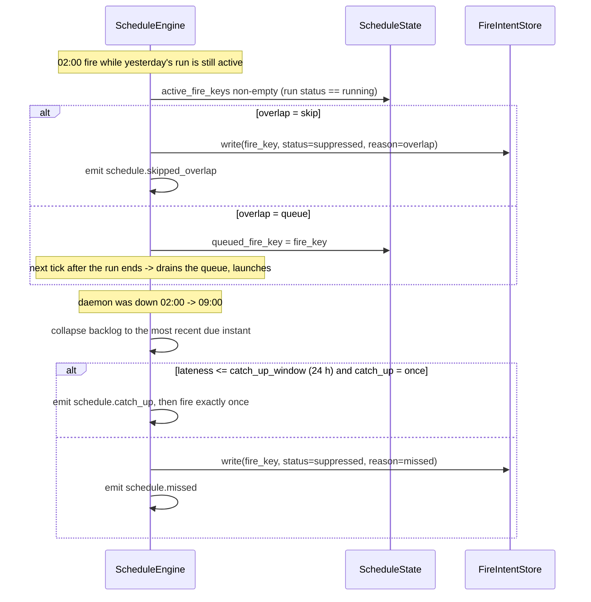
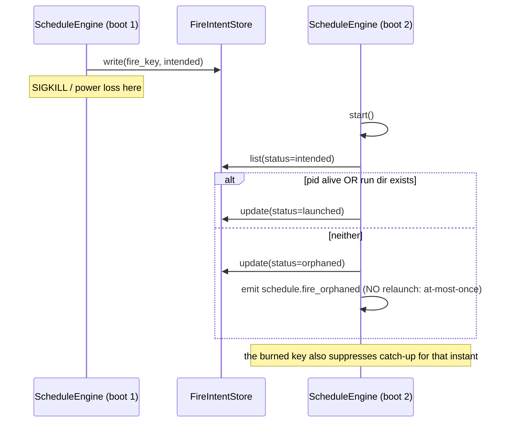
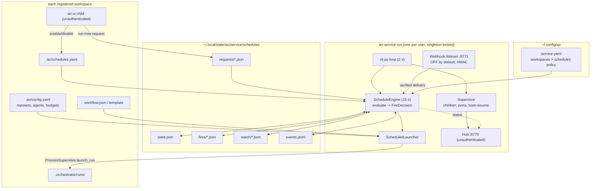

# Scheduler daemon — cron & event triggers owned by `ao service` — HLD (E-Sc9Rt4)

- Status: Proposed / design complete — not implemented. Awaiting the decisions in §16.
- Related: [`ADR-0014`](adr/ADR-0014-service-owned-scheduler-and-triggers.md) (this epic's decisions) · [`ADR-0012`](adr/ADR-0012-multi-workspace-service-supervisor.md) (the supervisor this scheduler lives in) · [`ADR-0010`](adr/ADR-0010-dashboard-architecture-and-general-instructions.md) (launch records, loopback/unauthenticated posture) · [`multi-workspace-service-hld.md`](multi-workspace-service-hld.md) · [`workflow-templates-hld.md`](workflow-templates-hld.md) (`ao new`, params) · [`logging-dynamic-workflows-hld.md`](logging-dynamic-workflows-hld.md) (`LoopSpec`, the *intra*-run loop this document deliberately does not duplicate) · epic ticket [`meta/tickets/E-Sc9Rt4-scheduler-triggers/EPIC.md`](../meta/tickets/E-Sc9Rt4-scheduler-triggers/EPIC.md) · roadmap [`§3.2`](../meta/ROADMAP.md)

---

## 1. Problem

`Trigger(type=manual|cron|event, schedule, timezone, event)` has been modelled on
`WorkflowSpec.triggers` and schema-validated since the MVP, and `scheduler.py` ships a working
`CronScheduler` (croniter, timezone-aware, injectable clock) plus an `EventScheduler`
sentinel-file stub. **Nothing calls any of it.** `grep` finds no importer of `scheduler.py`
anywhere in `src/` outside its own module; `WorkflowSpec.triggers` is parsed and then ignored by
the engine. The roadmap records this exactly: *"Cron / event triggers — **Spec'd, not
scheduled**"* (§1) and §3.2.

So today every run is started by a human: a terminal `ao run`, or the dashboard's *New run*
button. The concrete cost, from the primary consumer (`ao-runner-finplan`): an epic-runner run
takes days of wall-clock and is expected to be re-driven repeatedly ("keep pushing this epic
until STATUS says done"), and benchmark campaigns want to run nightly. Both currently require a
person to remember and type.

The ask: **schedules that fire themselves**, owned by the one process that is already always
running, without loosening the safety properties (budgets, breakers, quota waits, at-most-once
launches) the engine already guarantees.

## 2. Locked design decisions (from the user, not re-litigated here)

These were fixed before design work started. They are recorded so the implementation has one
place to check itself against; the *rationale* is in ADR-0014.

1. **`ao service` owns scheduling.** The supervisor daemon (`ao service run`) is the only
   always-on process, already holds the workspace registry, a singleton lock, a state
   directory, and a headless launch path. It evaluates schedules for **every registered
   workspace** and materializes runs. A per-workspace scheduler process is documented and
   rejected as the production topology (§3.1), but kept as a foreground **dev/test mode**
   (`ao schedule daemon`).
2. **Scheduled runs use the SAME launch path** as the dashboard and boot-resume —
   `ProcessSupervisor.launch_run(...)`, producing a real `LaunchRecord` with run-id
   attribution. No second way to start a run.
3. **Cron triggers** carry a per-schedule **overlap policy** (`skip` | `queue` | `allow`), a
   **catch-up policy** for downtime (`once` | `skip`), jitter, timezone handling, and a
   max-concurrent-scheduled-runs guard. Scheduled runs respect existing budgets, circuit
   breakers, and quota-exhaustion waiting — because they are ordinary `ao run` invocations.
4. **Event triggers sit behind the same `Scheduler` interface**: file-watch (a path/glob
   appears or changes) and webhook (e.g. a git push).
5. **The webhook endpoint requires authentication** — at minimum a shared-secret HMAC —
   because the dashboard and hub are unauthenticated (ADR-0010 D7, roadmap §3.1). The design
   must be the *minimum* that is actually safe, not a down-payment on the auth epic.
6. **Loop-style triggers** (`until`): re-run a workflow on a schedule until a condition holds
   (artifact exists / gate JSON field / max repetitions). Related to but distinct from the
   existing intra-run `LoopSpec`.
7. **Backward compatible**: a workspace with no schedules behaves exactly as today, and
   `Trigger(type="manual")` — the `WorkflowSpec.triggers` default — stays a no-op.

### 2.1 MVP vs non-MVP

The traceable, verification-bearing requirement list lives in the epic ticket
([`EPIC.md`](../meta/tickets/E-Sc9Rt4-scheduler-triggers/EPIC.md), FR-1..FR-12 / NFR-1..NFR-6).
Summary of the split:

| | Included |
|---|---|
| **MVP** (ships as one useful increment) | `.ao/schedules.yaml` binding model + JSON Schema; `ScheduleEngine` inside `ao service run` with an injectable clock; `cron` and `interval` kinds; overlap (`skip`/`queue`/`allow`), catch-up (`once`/`skip`), jitter, per-workspace + service-wide concurrency caps; at-most-once fire-intent store; `ao run --run-id`; the `ao schedule` CLI incl. the `daemon --once` dev mode; structured events + hub status. |
| **MVP-2** (same epic, later tasks) | `file_watch` event trigger (polling); the authenticated webhook listener; `until` (loop-style) termination; the dashboard Schedules panel and its five API routes. |
| **Non-MVP** (out — see §19) | Backfill; inotify/`watchdog`; distributed scheduling; cross-run dependency triggers; real authentication; notifications; run replacement. |

Every MVP-2 item is behind an explicit switch and is additive to what MVP ships, so the epic
can stop after MVP and still leave the system coherent.

## 3. Prior-art reuse audit

Everything below already exists and is tested. This epic is mostly *wiring*, and the design is
deliberately biased toward reuse over new machinery.

### 3.1 Is the supervisor really the right owner?

Checked against the four properties a scheduler needs:

| Property a scheduler needs | Supervisor status today |
|---|---|
| Exactly one evaluator (no double-fire) | `acquire_singleton_lock(state_dir/supervisor.lock)` — flock, already enforced, `SupervisorLockHeldError` on a second daemon. No leader election to invent. |
| Knows every workspace | `ServiceRegistry` (`~/.config/ao/service.yaml`) with a locked `mutate()` read-modify-write. |
| Durable state that survives reboot | `~/.local/state/ao/service/` with an established atomic write-then-rename idiom (`registry.py`, `boot_resume.py`, `supervisor.json`). |
| A headless way to start a run | `Supervisor._decide_and_act` already calls `ProcessSupervisor.launch_resume(...)` with no HTTP involved — proof the launch path works outside the dashboard. |
| A periodic loop | `service/cli.py::run`'s `while not stop_event.is_set(): stop_event.wait(HUB_TICK_INTERVAL_SECONDS=2.0); supervisor.tick()`. |

All five are already satisfied. **The alternative — one scheduler process per registered
workspace — is rejected** because it would need N clocks, N fire stores, N singleton locks, and
would make a service-wide concurrency cap impossible (the one guard that actually protects the
user's wallet when four workspaces all want 02:00). It also puts the scheduler inside a process
the supervisor *restarts with backoff*, which is the worst possible home for something that
must not double-fire. It survives only as `ao schedule daemon --workspace <root>` for local
iteration and for users who never install the systemd unit (§9.2).

Residual risk of the chosen topology, and its mitigation:

- *A scheduler bug takes down every dashboard.* → Every per-schedule evaluation is wrapped so a
  failure is isolated to that schedule (`schedule.eval_failed`, auto-disable after
  `MAX_CONSECUTIVE_EVAL_ERRORS`); the engine is optional per workspace (registry
  `schedules: false`) and per service (`ao service run --no-schedules`); the systemd unit is
  already `Restart=on-failure`.
- *Evaluation blocks child monitoring.* → Per-tick wall-clock budget
  (`SCHEDULE_TICK_BUDGET_SECONDS = 0.5`); launches are non-blocking `Popen`; file-watch scans
  are bounded and resumable (§6.7).

### 3.2 Is there an attempt-limiter to reuse?

`BootResumeGuard` (`service/boot_resume.py`) is a crash-safe, cooldown-aware attempt limiter
with `decide()`/`record_attempt()` persisted to `boot_resume.json`, and it enforces exactly the
rule this epic needs restated: *"an attempt not made must not consume the attempts/cooldown
budget."* We **mirror its idiom but do not generalize it into a shared class** — its policy
(per-boot dedup → quarantine → cooldown) answers a different question than a scheduler's
(has this logical fire already been attempted?). Forcing one abstraction would couple two
unrelated policies. What *is* extracted is the third copy of the same persistence code:
a small `service/statefile.py` (`read_json_model` / `write_json_model_atomic`) that
`registry.py`-style write-then-rename callers can share (CLAUDE.md: extract when logic appears
twice; this would be the fourth occurrence).

### 3.3 Is there a launch-argument allowlist to reuse?

Yes, and it is load-bearing for security. `ui/processes.py` already defines
`ALLOWED_OPTIONS` (`model`, `effort`, `max_attempts`, `max_turns`, `max_parallel`,
`budget_total`, `quota_max_wait`, `quota_poll_interval`) and `ALLOWED_BOOL_OPTIONS`
(`self_heal`), and silently drops anything else. A schedule file's `run_args` block maps
**exactly onto that existing allowlist** — no new argv surface is introduced, and a workspace
file can never inject arbitrary flags (§13.3).

## 4. Module layout

New code is a new `schedules/` package (workspace-facing: the binding file and its model) plus
four modules inside the existing `service/` package (daemon-facing). The engine core
(`models.py`, `engine.py`, `spec.py`, `executors/`) is **not touched**.

```
src/agent_orchestrator/
  scheduler.py                  MODIFIED — Scheduler ABC keeps `next_fire`; add
                                IntervalScheduler, FileWatchScheduler, WebhookScheduler;
                                EventScheduler retained as a deprecated alias (§7.1)
  schedules/                    NEW — workspace-facing binding file
    __init__.py                 public API: load_schedules, ScheduleFile, ScheduleBinding
    models.py                   pydantic: ScheduleBinding, ScheduleDefaults, UntilSpec,
                                WatchSpec, WebhookSpec, RunArgs
    store.py                    .ao/schedules.yaml load/save/mutate (flock + atomic rename,
                                mirrors service/registry.py exactly)
  service/
    statefile.py                NEW — shared atomic JSON state read/write (§3.2)
    schedule_engine.py          NEW — ScheduleEngine: signal-free, tick(now) -> [FireDecision]
    fire_store.py               NEW — FireIntentStore (at-most-once) + ScheduleStateStore
                                + ScheduleEventLog (events.jsonl)
    schedule_launch.py          NEW — ScheduledLauncher: FireDecision -> ProcessSupervisor
    watch.py                    NEW — polling file-watch source (digest + debounce)
    webhook.py                  NEW — HMAC verification + the webhook ASGI app
    cli.py                      MODIFIED — `ao service run` drives ScheduleEngine.tick()
  cli.py                        MODIFIED — mounts the new `ao schedule` sub-app;
                                `ao run` gains `--run-id` (§6.6)
  ui/
    app.py / service.py         MODIFIED — 5 schedule routes (thin adapter + behavior split)
ui/src/                         MODIFIED — one new "Schedules" panel (§11)
specs/schedules.schema.json     NEW — JSON Schema for .ao/schedules.yaml
```

Dependency direction: `schedules/` knows nothing about `service/`; `service/schedule_engine.py`
depends on `schedules/`, `scheduler.py`, `ui/processes.py`, `ui/runs.py`. Nothing in the engine
core depends on any of it. `fastapi` stays lazily imported inside function bodies only, so a
core install without the `[ui]` extra can still import every scheduler module (the rule
`service/hub.py` already documents).

## 5. Data model

Three levels, with deliberately distinct ownership, so nothing is configured in two places:

| Level | File | Owner | Holds |
|---|---|---|---|
| Workspace bindings | `<workspace>/.ao/schedules.yaml` | the workspace author (and `ao schedule` writes back) | *what* fires, *when*, and with which run arguments |
| Service opt-out | `~/.config/ao/service.yaml` → `WorkspaceEntry.schedules: bool = true` | the machine's operator | whether this daemon honors that workspace's schedules at all |
| Service-wide caps | `~/.config/ao/service.yaml` → top-level `schedules:` block | the machine's operator | global concurrency cap, evaluation interval, webhook listener |

### 5.1 Binding file — `<workspace>/.ao/schedules.yaml`

Separate from `.ao/config.yaml` on purpose: `ao schedule enable/disable/add/remove` **writes**
this file, and rewriting the hand-authored, heavily-commented `config.yaml` would destroy the
comments that file's users rely on. `config.yaml` gains nothing from this epic.

```yaml
version: "1.0"

# Defaults inherited by every binding below; each binding may override any of them.
defaults:
  timezone: UTC
  overlap: skip                  # skip | queue | allow
  catch_up: once                 # once | skip
  catch_up_window_seconds: 86400
  jitter_seconds: 0
  grace_seconds: 60              # a fire later than this is "late", not "on time"
  max_concurrent: 1              # concurrent scheduled runs for THIS workspace

schedules:
  # (a) the headline case: nightly epic-runner, until its own gate says done
  - id: nightly-epic
    enabled: true
    kind: cron                   # cron | interval | file_watch | webhook
    schedule: "0 2 * * *"
    timezone: Europe/Berlin
    workflow: workflows/epic-runner/runs/e-abc123-x/workflow.json
    overlap: skip
    catch_up: once
    jitter_seconds: 300
    run_args:                    # allowlisted keys ONLY — see §5.1.1
      max_parallel: 4
      model: claude-sonnet-5
    until:
      gate_file: workflows/epic-runner/runs/e-abc123-x/control/status.json
      gate_field: done
      gate_equals: true
      max_runs: 30

  # (b) event: re-run when the prompt is edited
  - id: on-prompt-change
    kind: file_watch
    workflow: workflows/epic-runner/runs/e-abc123-x/workflow.json
    watch:
      paths: ["epics/*/prompt.md"]
      on: [created, modified]
      debounce_seconds: 30
      poll_seconds: 30

  # (c) event: git push, via an authenticated webhook
  - id: on-push
    kind: webhook
    workflow: workflows/ci/workflow.json
    webhook:
      secret_env: AO_HOOK_SECRET_CI   # or secret_file: .ao/hook-ci.secret — never inline
      rate_per_minute: 10

  # (d) fresh template instance per fire (benchmarks, nightly sweeps)
  - id: nightly-bench
    kind: interval
    interval_seconds: 86400
    template: epic-runner
    params: { type: testing }
    instance_id: "nightly-{date}"     # {date}=YYYYMMDD (UTC), {rand6}
    prompt_file: benchmarks/nightly-prompt.md
```

Field reference (pydantic `ScheduleBinding`; JSON Schema in `specs/schedules.schema.json`):

| Field | Type | Default | Notes |
|---|---|---|---|
| `id` | `str` | required | `^[a-z0-9][a-z0-9-_]*$` — same pattern as task/router ids. Unique per workspace. |
| `enabled` | `bool` | `true` | Toggled by `ao schedule enable/disable` and the dashboard. |
| `kind` | `cron\|interval\|file_watch\|webhook` | required | |
| `schedule` | `str \| None` | `None` | 5/6-field cron; **required when `kind=cron`**. |
| `interval_seconds` | `int \| None` | `None` | `>= MIN_INTERVAL_SECONDS (60)`; required when `kind=interval`. |
| `timezone` | `str` | `defaults.timezone` | IANA name; validated via `ZoneInfo` at load. |
| `workflow` | `str \| None` | `None` | Workspace-relative path. Exactly one of `workflow` / `template` required. |
| `template` | `str \| None` | `None` | `ao new` template name; a **new instance per fire**. |
| `params` | `dict[str,str]` | `{}` | Template params (E-Tpl3x9). Only with `template`. |
| `instance_id` | `str \| None` | `None` | `{date}` / `{rand6}` tokens. Only with `template`. |
| `prompt_file` | `str \| None` | `None` | Workspace-relative; contents passed as the launch prompt. |
| `run_args` | `RunArgs` | `{}` | §5.1.1 — allowlisted. |
| `overlap` | `skip\|queue\|allow` | `defaults.overlap` | §6.4. |
| `catch_up` | `once\|skip` | `defaults.catch_up` | §6.5. |
| `catch_up_window_seconds` | `int` | `defaults.*` | §6.5. |
| `jitter_seconds` | `int` | `defaults.*` | `0..3600`; deterministic, §6.3. |
| `grace_seconds` | `int` | `defaults.*` | Lateness beyond which a fire counts as "missed". |
| `max_concurrent` | `int` | `defaults.*` | Per-workspace cap on live scheduled runs. |
| `until` | `UntilSpec \| None` | `None` | §6.8. |
| `watch` | `WatchSpec \| None` | `None` | Required when `kind=file_watch`. |
| `webhook` | `WebhookSpec \| None` | `None` | Required when `kind=webhook`. |

#### 5.1.1 `run_args` — the allowlist is the existing one

`RunArgs` is a closed pydantic model whose fields are **exactly** `ui/processes.py`'s
`ALLOWED_OPTIONS` ∪ `ALLOWED_BOOL_OPTIONS`, typed: `model: str`, `effort: Literal["low",
"medium","high","xhigh"]`, `max_attempts: int`, `max_turns: int`, `max_parallel: int`,
`budget_total: int`, `quota_max_wait: int`, `quota_poll_interval: int`, `self_heal: bool`.
`model_config = ConfigDict(extra="forbid")` so an unknown key is a **named load error**, not a
silent drop. There is no free-form `args:`/`command:` field, by design (§13.3).

`reposets` / `agents` are **not** schedule fields: they come from the workspace's
`.ao/config.yaml`, exactly as `Supervisor._decide_and_act` already does for boot-resume.

### 5.2 Service registry additions — `~/.config/ao/service.yaml`

```yaml
workspaces:
  - root: /home/me/ao-runner-finplan
    port: 8766
    host: 0.0.0.0
    autoresume: true
    schedules: true            # NEW — operator's per-workspace opt-out (default true)
schedules:                     # NEW — service-wide, all optional
  enabled: true
  eval_interval_seconds: 15
  max_concurrent_global: 3
  webhook:
    enabled: false
    host: 127.0.0.1
    port: 8771
```

Both additions are optional keys with defaults, so every existing registry file loads unchanged
(pydantic default `extra="ignore"` on `WorkspaceEntry` already tolerates the reverse direction —
an older `ao` reading a newer file).

### 5.3 Runtime state — `~/.local/state/ao/service/schedules/`

```
~/.local/state/ao/service/
  supervisor.json  boot_resume.json  port_resolution.json  logs/     (existing)
  schedules/
    state.json                       # per (workspace_slug, schedule_id) runtime state
    fires/<workspace_slug>/<fire_key>.json
    watch/<workspace_slug>/<schedule_id>.json     # file-watch digests
    requests/<request_id>.json       # run-now drop directory (§6.9)
    events.jsonl   events.jsonl.1    # structured event log, single rollover
```

`<workspace_slug>` uses `supervisor.py::_slug_for_root` (already exists: a readable basename
plus a hash suffix) so two workspaces with the same basename never collide.

State lives in the **service** state dir, not the workspace, because the service owns fires and
a workspace may be registered/unregistered without losing or leaking fire history; the CLI reads
it through `paths.default_state_dir()` from anywhere. (Consequence: fire history does not travel
with a cloned repo. Accepted — it is operational, not project, data.)

`ScheduleState` (one entry per `<workspace_slug>|<schedule_id>`):

```json
{
  "status": "active",
  "last_scheduled_for": "2026-09-06T00:00:00Z",
  "last_fire_at": "2026-09-06T00:05:00Z",
  "next_fire_at": "2026-09-07T00:00:00Z",
  "last_run_id": "e-abc123-x-20260906T000500Z",
  "last_status": "succeeded",
  "runs_count": 12,
  "consecutive_failures": 0,
  "consecutive_eval_errors": 0,
  "queued_fire_key": null,
  "active_fire_keys": ["..."],
  "disabled_reason": null
}
```

`status` ∈ `active | disabled | completed | quarantined`. `completed` is set by `until`
satisfaction (§6.8); `quarantined` by `MAX_CONSECUTIVE_EVAL_ERRORS` (§3.1).

`FireIntentRecord` (one file per logical fire, §6.6):

```json
{
  "fire_key": "9f2c…",
  "workspace_root": "/home/me/ao-runner-finplan",
  "schedule_id": "nightly-epic",
  "scheduled_for": "2026-09-06T00:00:00Z",
  "effective_due": "2026-09-06T00:05:00Z",
  "created_at": "2026-09-06T00:05:01Z",
  "status": "launched",
  "reason": null,
  "launch_id": "launch-20260906T000501123456Z",
  "pid": 41233,
  "run_id": "e-abc123-x-20260906T000501Z",
  "argv_digest": "sha256:…"
}
```

`status` ∈ `intended | launched | suppressed | orphaned | launch_failed`. **A record in any
status suppresses every future attempt at the same `fire_key`** — that single rule is what makes
the whole design at-most-once and clock-change-safe (§6.6).

## 6. Scheduler behavior

### 6.1 Where the tick comes from

`service/cli.py::run` already owns the loop and the signal handlers; `Supervisor` is
deliberately signal-free. The scheduler follows the identical shape — a plain, signal-free
`ScheduleEngine` with `start()` / `tick(now)` / `shutdown()` / `status_snapshot()`, driven from
the same loop as a **sibling of** `Supervisor`, not a member of it:

```python
while not stop_event.is_set():
    if not stop_event.wait(HUB_TICK_INTERVAL_SECONDS):   # 2.0 s
        supervisor.tick()
        engine.tick()                                    # NEW — self-rate-limited to 15 s
```

`ScheduleEngine` is not injected into `Supervisor` because the supervisor's single
responsibility is child processes; and because a sibling can be omitted entirely
(`--no-schedules`) without touching supervisor code. `status_snapshot()` is merged into the hub
payload by `service/cli.py::build_status_provider` — the designated enrichment point — so
`hub.py` stays the thin adapter ADR-0010 requires.

Startup order in `ao service run`: acquire the supervisor lock → `supervisor.start()` (ports,
orphan reclaim, boot-resume, spawn children) → `engine.start()` (reconcile orphaned fires,
§6.6) → hub thread → loop. The scheduler starts **after** boot-resume so a schedule's overlap
check sees an auto-resumed run as active.

### 6.2 One tick

```
FUNCTION ScheduleEngine.tick(now = clock()):
  IF now - self.last_eval < eval_interval:  RETURN []          # 15 s, independent of the 2 s loop
  self.last_eval = now
  deadline = monotonic() + SCHEDULE_TICK_BUDGET_SECONDS        # 0.5 s

  self.drain_run_now_requests()                                # §6.9
  decisions = []
  FOR entry IN registry.load().workspaces:
      IF NOT entry.schedules OR NOT service_schedules_enabled:  CONTINUE
      TRY:
         file = ScheduleStore(entry.root).load()               # missing file -> empty, NOT an error
      EXCEPT ScheduleFileError as e:
         emit("schedule.file_invalid", workspace=entry.root, error=str(e));  CONTINUE
      FOR b IN file.bindings:
          IF monotonic() > deadline:
             emit("schedule.tick_budget_exceeded", resume_from=b.id);  BREAK
          TRY:
             d = self.evaluate(entry, b, now)
          EXCEPT Exception as e:                               # isolate: never kill the loop
             state.bump_eval_error(entry.root, b.id, str(e))
             emit("schedule.eval_failed", schedule_id=b.id, error=str(e))
             IF state.consecutive_eval_errors >= MAX_CONSECUTIVE_EVAL_ERRORS:  # 5
                state.set_status(entry.root, b.id, "quarantined")
                emit("schedule.quarantined", schedule_id=b.id)
             CONTINUE
          state.clear_eval_errors(entry.root, b.id)
          IF d.fire:  decisions.append(d)

  FOR d IN decisions:                                          # launch is non-blocking
      self.launcher.launch(d)
  RETURN decisions
```

The `evaluate` → `launch` split exists so tests can assert decisions with no launcher at all,
and so a future queue/executor can batch launches without touching evaluation.

### 6.3 Evaluating one binding

```
FUNCTION evaluate(entry, b, now) -> FireDecision:
  st = state.get(entry.root, b.id)
  IF st.status IN ("completed", "quarantined") OR NOT b.enabled:  RETURN NO_FIRE(reason=st.status)

  IF b.until AND until_satisfied(entry.root, b, st):
      state.set_status(entry.root, b.id, "completed")
      emit("schedule.until_satisfied", schedule_id=b.id, runs=st.runs_count)
      RETURN NO_FIRE(reason="until_satisfied")

  IF st.queued_fire_key IS NOT NULL AND NOT overlap_active(entry.root, b, st):
      RETURN FIRE(from_queue=st.queued_fire_key)                # drain the buffered fire first

  sched   = SCHEDULERS[b.kind]                                  # §7.1
  anchor  = st.last_scheduled_for OR st.created_at
  nxt     = sched.next_fire(b.to_trigger(), anchor)
  IF nxt IS NULL:  state.set_next_fire(NULL);  RETURN NO_FIRE(reason="never")

  # Collapse a backlog: only the MOST RECENT due instant is a candidate. Never backfill.
  scheduled_for = nxt
  WHILE True:
      following = sched.next_fire(b.to_trigger(), scheduled_for)
      IF following IS NULL OR following > now:  BREAK
      scheduled_for = following                                 # bounded by MAX_CATCHUP_STEPS

  state.set_next_fire(entry.root, b.id, scheduled_for IF scheduled_for > now
                                        ELSE sched.next_fire(b.to_trigger(), now))
  emit_debug("schedule.evaluated", schedule_id=b.id, next_fire_at=st.next_fire_at)
  IF scheduled_for > now:  RETURN NO_FIRE(reason="not_due")

  # Deterministic jitter, derived from the fire key so it is stable across restarts.
  fire_key      = sha256(f"{entry.root}|{b.id}|{scheduled_for.isoformat()}").hexdigest()
  jitter        = int(fire_key[:8], 16) % (b.jitter_seconds + 1)
  effective_due = scheduled_for + seconds(jitter)
  IF now < effective_due:  RETURN NO_FIRE(reason="jitter_pending")

  lateness = now - scheduled_for
  IF lateness > seconds(b.grace_seconds):
      IF b.catch_up == "skip" OR lateness > seconds(b.catch_up_window_seconds):
          fires.write_suppressed(fire_key, reason="missed")     # burns the key: never retried
          state.advance_anchor(entry.root, b.id, scheduled_for)
          emit("schedule.missed", schedule_id=b.id, scheduled_for=..., lateness_seconds=...)
          RETURN NO_FIRE(reason="missed")
      emit("schedule.catch_up", schedule_id=b.id, lateness_seconds=lateness.total_seconds())

  IF fires.exists(fire_key):  RETURN NO_FIRE(reason="already_fired")   # at-most-once (§6.6)

  IF overlap_active(entry.root, b, st):
      IF b.overlap == "skip":
          fires.write_suppressed(fire_key, reason="overlap")
          emit("schedule.skipped_overlap", schedule_id=b.id, active=st.active_fire_keys)
          RETURN NO_FIRE(reason="overlap_skip")
      IF b.overlap == "queue":
          IF st.queued_fire_key IS NULL:  state.set_queued(entry.root, b.id, fire_key)
          ELSE: emit("schedule.skipped_overlap", reason="queue_full")
          fires.write_suppressed(fire_key, reason="queued") IF st.queued_fire_key != fire_key
          RETURN NO_FIRE(reason="overlap_queued")
      # b.overlap == "allow": fall through to the concurrency caps

  IF live_scheduled_runs(entry.root) >= b.max_concurrent
     OR live_scheduled_runs_global() >= service.max_concurrent_global:
      emit("schedule.skipped_concurrency", schedule_id=b.id)
      RETURN NO_FIRE(reason="concurrency")                      # NOTE: key NOT burned; retried next tick

  RETURN FIRE(fire_key, scheduled_for, effective_due, binding=b, workspace=entry.root)
```

Two deliberate asymmetries worth stating out loud, because they are easy to get wrong:

- **Overlap-skip and missed both *burn* the fire key** (a `suppressed` record is written), so the
  same instant is never reconsidered. **Concurrency-cap does not**, because that is a transient
  resource shortage: as soon as a slot frees within the grace window, the fire should still
  happen.
- `overlap: queue` holds **at most one** pending fire (Temporal's `buffer_one`), first-wins.
  Later suppressed fires are recorded as `suppressed(reason="queue_full")`, so `ao schedule
  history` shows the pile-up rather than hiding it.

### 6.4 Overlap policy

| Value | Semantics | Nearest prior art |
|---|---|---|
| `skip` (**default**) | An active run for this schedule suppresses the fire entirely. | Argo `concurrencyPolicy: Forbid`; Temporal `overlap_policy: SKIP` |
| `queue` | Hold exactly one pending fire; launch it on the first tick after the active run ends. | Temporal `BUFFER_ONE` |
| `allow` | Launch regardless; still bounded by `max_concurrent` and `max_concurrent_global`. | Argo `Allow`; Temporal `ALLOW_ALL` |

`skip` is the default because an agent run costs real money and takes hours; silently doubling
spend is the worse failure. There is deliberately **no `replace`/`Replace` policy** — killing an
in-flight agent run mid-task destroys unfinished paid work and would fight the cancel/resume
semantics ADR-0012 D2 established.

"Active" is computed the way boot-resume already computes liveness: for each `fire_key` in
`state.active_fire_keys`, the fire record's `run_id` is looked up via
`RunRepository.load_state(run_id).status == "running"`, with `ProcessSupervisor.is_running` as
the PID-level check. A run that reached a terminal status, or whose PID is gone, is retired from
`active_fire_keys` in the same pass.

### 6.5 Missed schedules and catch-up

Vocabulary is deliberately borrowed rather than invented (§15):

| Value | Behavior when the daemon was down across one or more fire instants |
|---|---|
| `once` (**default**) | Fire **exactly once**, for the most recent missed instant, provided its lateness ≤ `catch_up_window_seconds` (default 24 h). Earlier missed instants are recorded `schedule.missed` and burned. |
| `skip` | Fire nothing; record `schedule.missed`, advance to the next future instant. |

**Airflow-style backfill is an explicit non-goal.** `catchup=True` firing one run per missed
interval is famously the footgun that turns a week of downtime into a hundred queued runs; here
each of those runs would be a multi-hour, real-money agent job. The backlog-collapse loop in
§6.3 makes non-backfill structural, not merely a default.

The 24 h default window is the honest compromise for the actual use case: a laptop that was off
overnight still gets its 02:00 epic-runner when it boots at 09:00; a machine off for a week does
not silently start a run the instant it comes back — it does exactly one, which is what the user
would have done by hand.

### 6.6 Idempotent fire: at-most-once, and why

`ao run` derives its own run id and the dashboard learns it by diffing the runs directory
(roadmap §4, and `_discover_run_id` blocks up to 10 s per launch). That is tolerable for a human
clicking a button and unacceptable for a daemon, so this epic does two things:

1. **`ao run --run-id <id>` (new, task `T-Ri7Dz2`)** — the caller supplies the id; the engine
   uses it verbatim and refuses if a run directory with that id already exists. Scheduled fires
   pass `--run-id ao-<schedule_id>-<scheduled_for compact UTC>`, which makes fire→run linkage
   *exact* rather than inferred, and closes the roadmap §4 mis-attribution gap for this path.
   The scheduler additionally constructs its `ProcessSupervisor` with
   `run_id_discovery_timeout=0.0` so a launch never blocks the tick.
2. **A fire-intent record written before the launch.** Two-phase, atomic:

```
FUNCTION ScheduledLauncher.launch(d):
  fires.write(d.fire_key, status="intended", scheduled_for=d.scheduled_for,
              workspace_root=..., schedule_id=..., created_at=now())   # write-then-rename + fsync
  TRY:
      IF d.binding.template:  inst = templates.instantiate(...)        # fresh instance per fire
          workflow_path = inst.workflow_path
      ELSE: workflow_path = safe_join(workspace_root, d.binding.workflow)
      prompt = read_text(safe_join(root, d.binding.prompt_file)) IF d.binding.prompt_file ELSE None
      ps = ProcessSupervisor(workspace_root, run_id_discovery_timeout=0.0)
      rec = ps.launch_run(workflow_path=workflow_path, prompt=prompt,
                          reposets=cfg.reposets, agents=cfg.agents,
                          options={**d.binding.run_args.as_options(), "run_id": d.run_id})
      fires.update(d.fire_key, status="launched", launch_id=rec.launch_id,
                   pid=rec.pid, run_id=d.run_id)
      state.record_fire(root, id, scheduled_for=d.scheduled_for, run_id=d.run_id)
      emit("schedule.fired", schedule_id=..., run_id=..., fire_key=..., lateness_seconds=...)
  EXCEPT Exception as e:
      fires.update(d.fire_key, status="launch_failed", reason=str(e))
      state.record_failure(root, id, str(e))
      emit("schedule.fire_failed", schedule_id=..., error=str(e))
```

On restart, `ScheduleEngine.start()` reconciles:

```
FUNCTION recover_orphaned_fires():
  FOR r IN fires.list(status="intended"):
      IF r.pid AND pid_alive(r.pid):  fires.update(r.fire_key, status="launched");  CONTINUE
      IF r.run_id AND run_exists(r.workspace_root, r.run_id):
          fires.update(r.fire_key, status="launched");  CONTINUE
      fires.update(r.fire_key, status="orphaned")
      emit("schedule.fire_orphaned", fire_key=r.fire_key, schedule_id=r.schedule_id)
      # DELIBERATELY no relaunch — see below.
```

**We choose at-most-once over at-least-once.** A crash inside the ~millisecond window between
writing the intent and `Popen` returning could mean the run started or did not; relaunching risks
a duplicate multi-hour, real-money agent run against a workspace that may already have been
mutated. The orphaned record still burns the key, so catch-up will not resurrect it either. The
operator sees `schedule.fire_orphaned` in `ao schedule history` and in `ao service status`, and
`ao schedule run-now` is one command away. This is stated as a limitation, not hidden.

**Clock changes fall out of this for free.** A backwards NTP correction re-derives an already-
recorded `fire_key` and is suppressed; a forwards jump is handled by catch-up. No separate
monotonic-vs-wall-clock reconciliation is needed for *fires* (the tick interval itself uses
`time.monotonic`, as the supervisor already does).

### 6.7 File-watch event trigger

Polling, not inotify. Reasons: no new dependency, works identically on every platform the CLI
supports, is trivially deterministic under a fixed clock in tests, and cannot exhaust inotify
watch descriptors on a large workspace. `watchdog`-backed inotify is a documented non-goal for
this epic (§19) with the `Scheduler` seam left in place to add it later.

```yaml
watch:
  paths: ["epics/*/prompt.md", "specs/**/*.json"]   # workspace-relative globs, traversal-guarded
  on: [created, modified]                            # MVP: created | modified
  debounce_seconds: 30
  poll_seconds: 30
  max_files: 5000
```

```
FUNCTION FileWatchScheduler.next_fire(trigger, now):
  prev   = digest_store.load(ws, schedule_id)        # {rel_path: [mtime_ns, size]}
  cur, truncated = scan(ws, watch.paths, max_files, ignore=DEFAULT_IGNORES, budget=WATCH_SCAN_BUDGET)
  IF truncated: emit("schedule.watch_budget_exceeded"); RETURN None    # never a partial-scan fire
  changed = {p FOR p IN cur IF p NOT IN prev OR cur[p] != prev[p]}     # 'created' + 'modified'
  IF NOT changed:  digest_store.save(ws, id, cur);  RETURN None
  newest = max(mtime_ns FOR p IN changed)
  IF now - to_datetime(newest) < seconds(watch.debounce_seconds):
      RETURN None                                    # still settling — do NOT save the digest yet
  digest_store.save(ws, id, cur)
  RETURN to_datetime(newest).replace(microsecond=0)  # == scheduled_for: content-derived, idempotent
```

`scheduled_for` being the newest changed mtime (not "now") is what makes a file-watch fire
idempotent across a crash: the same file state derives the same `fire_key`, which the fire store
has already burned. `DEFAULT_IGNORES` covers `.git/`, `node_modules/`, `.venv/`, `__pycache__/`,
`.orchestrator/` and the run output tree, so a watch can never be triggered by the runs it
itself produces — the classic self-triggering loop.

### 6.8 `until` — loop-style, inter-run triggers

`LoopSpec` (`logging-dynamic-workflows-hld.md`) is an **intra-run** construct: the engine clones
body tasks per iteration inside one run and reads a gate JSON to continue or stop. `until` is
its **inter-run** sibling: the same *shape* of gate, evaluated between whole runs, by the
scheduler. They are deliberately separate models — merging them would put scheduler concerns
inside the engine, which is precisely what this design avoids. A schedule may of course point at
a workflow that itself uses `LoopSpec`; the two compose without knowing about each other.

```yaml
until:
  max_runs: 30                    # hard cap, always honored
  artifact_exists: outputs/DONE   # OR
  gate_file: control/status.json  # workspace-relative JSON
  gate_field: done
  gate_equals: true               # bool | str | int
```

```
FUNCTION until_satisfied(root, b, st) -> bool:
  u = b.until
  IF u.max_runs AND st.runs_count >= u.max_runs:  RETURN True         # checked first, always terminates
  IF u.artifact_exists AND safe_join(root, u.artifact_exists).exists(): RETURN True
  IF u.gate_file:
      p = safe_join(root, u.gate_file)
      IF NOT p.is_file():  RETURN False
      TRY: data = json.loads(p.read_text(encoding="utf-8"))
      EXCEPT (OSError, JSONDecodeError) as e:
          emit("schedule.until_unreadable", schedule_id=b.id, error=str(e))
          RETURN False                                                # never terminate on a bad read
      RETURN data.get(u.gate_field) == u.gate_equals
  RETURN False
```

`max_runs` is mandatory-by-default in `ao schedule add --until-*` (the CLI supplies
`DEFAULT_UNTIL_MAX_RUNS = 100` if the operator omits it) so no `until` schedule can loop forever
because a gate file never appears. Satisfaction sets `status: completed`, which stops evaluation
without deleting the binding — `ao schedule enable <id>` resets it (clearing `runs_count`).

`safe_join` is `LocalFsArtifactStore`'s existing workspace-root traversal guard, not a new one.

### 6.9 Run-now, and the drop directory

`ao schedule run-now <id>` and the dashboard's *Run now* button must produce the same result as
a natural fire — same overlap checks, same concurrency caps, same fire records, one launch
authority. Neither the CLI process nor the dashboard child process is the engine, so both write
a request file that the engine drains at the top of each tick:

```
~/.local/state/ao/service/schedules/requests/<uuid>.json
  {"workspace_root": "...", "schedule_id": "nightly-epic",
   "requested_at": "...", "force": false, "requested_by": "cli|ui"}
```

The engine drains, deletes, and synthesizes a `FireDecision` with
`scheduled_for = requested_at` (so the fire key is unique per request) running the full
policy path — except that `force: true` bypasses **overlap only**, never the concurrency caps
or `until`. Requests older than `REQUEST_TTL_SECONDS = 300` are discarded with
`schedule.request_expired`, so a request queued while the service was down does not fire
surprisingly hours later.

When the service is **not** running (no live `supervisor.json` / lock), `ao schedule run-now`
detects that and performs the fire in-process using the same `ScheduledLauncher` — so the
command is never a silent no-op. `--local` forces in-process; `--queue` forces the drop file.

## 7. Interfaces

### 7.1 `Scheduler` — one ABC, four implementations

The existing ABC is kept **unchanged** and its contract merely stated precisely:

```python
class Scheduler(ABC):
    @abstractmethod
    def next_fire(self, trigger: Trigger, now: datetime) -> datetime | None:
        """Next instant this trigger fires strictly after *now*, or None if it never will.

        Contract: a returned value <= the engine's current time means "fire now".
        Implementations must be pure with respect to wall-clock time (all time comes in
        through *now*), so a fixed clock makes evaluation fully deterministic.
        """
```

| Implementation | `next_fire` returns | State it holds |
|---|---|---|
| `ManualScheduler` (existing) | always `None` | — |
| `CronScheduler` (existing, unchanged) | croniter's next instant in `trigger.timezone` | injectable `clock` |
| `IntervalScheduler` (**new**) | `now + trigger.interval_seconds` | — |
| `FileWatchScheduler` (**new**) | newest changed mtime, or `None` | injected `digest_store`, `workspace_root`, `WatchSpec` |
| `WebhookScheduler` (**new**) | the queued delivery's receipt time, or `None` | injected thread-safe `delivery_queue` |
| `EventScheduler` (existing) | **deprecated alias** retained for one release: a sentinel path is a degenerate one-file watch. Its current tests keep passing unchanged. | `sentinel_path` |

Event triggers therefore genuinely sit behind the same interface — "has this fired?" is
`next_fire(...) <= now`, which is exactly what the existing sentinel stub already does.

`Trigger` gains two additive, optional fields so `IntervalScheduler` fits the same signature;
both are backward compatible (absent ⇒ today's behavior, old specs unchanged):

```python
class Trigger(BaseModel):
    type: Literal["manual", "cron", "event", "interval"]   # "interval" ADDED
    schedule: str | None = None
    timezone: str = "UTC"
    event: str | None = None
    interval_seconds: int | None = None                    # ADDED; required when type="interval"
```

`specs/workflow.schema.json`'s `$defs.trigger` gets the matching enum entry, the new property,
and an `if type==interval then required:[interval_seconds]` clause alongside the two that
already exist for `cron` and `event`.

### 7.2 Engine-facing contracts

```python
@dataclass(frozen=True)
class FireDecision:
    fire: bool
    reason: str                       # "due" | "not_due" | "overlap_skip" | "missed" | ...
    workspace_root: str
    schedule_id: str
    fire_key: str | None = None
    scheduled_for: datetime | None = None
    effective_due: datetime | None = None
    run_id: str | None = None
    binding: ScheduleBinding | None = None

class ScheduleEngine:
    def __init__(self, registry_path: Path, *, state_dir: Path,
                 clock: Callable[[], datetime] = _utcnow,
                 monotonic: Callable[[], float] = time.monotonic,
                 launcher: ScheduledLauncher | None = None,
                 schedule_store_factory: Callable[[str], ScheduleStore] = ScheduleStore,
                 process_supervisor_factory: Callable[[str], ProcessSupervisor] = ...,
                 run_repository_factory: Callable[[str], RunRepository] = RunRepository,
                 eval_interval_seconds: float = DEFAULT_EVAL_INTERVAL_SECONDS,
                 max_concurrent_global: int = DEFAULT_MAX_CONCURRENT_GLOBAL) -> None: ...
    def start(self) -> None: ...                   # reconcile orphaned fires; no I/O beyond state_dir
    def tick(self, now: datetime | None = None) -> list[FireDecision]: ...
    def evaluate(self, entry, binding, now) -> FireDecision: ...   # pure w.r.t. wall clock
    def shutdown(self) -> None: ...
    def status_snapshot(self) -> dict: ...

class ScheduledLauncher:
    def launch(self, decision: FireDecision) -> FireIntentRecord: ...
```

Every collaborator is constructor-injected, matching `Supervisor`'s existing style, so unit
tests need no monkeypatching and no subprocesses.

### 7.3 Errors

| Exception | Raised by | Meaning |
|---|---|---|
| `ScheduleFileError(ConfigError)` | `schedules/store.py` | `.ao/schedules.yaml` missing-required/unknown-key/bad-cron/bad-tz. Message names the schedule id and field. |
| `ScheduleNotFoundError` | store / CLI / UI service | no binding with that id |
| `DuplicateScheduleIdError` | store | two bindings share an `id` |
| `WebhookAuthError` | `service/webhook.py` | any authentication failure — deliberately one type, so the HTTP layer cannot leak *which* check failed |
| `LaunchError` (existing) | `ui/processes.py` | reused unchanged |

A malformed `schedules.yaml` **never** stops the daemon or other workspaces: it is caught per
workspace, logged as `schedule.file_invalid`, and surfaced in `ao schedule list` / hub status.

## 8. Webhook ingress

### 8.1 Where it listens — and why not the hub

The hub (`:8770`) is unauthenticated by design and lists every registered workspace. Mounting an
authenticated webhook route on it would mean that exposing the webhook to the internet also
exposes the workspace inventory — a bad trade the operator would not consciously make. The
per-workspace dashboard is worse: it is the unauthenticated, run-starting, file-browsing surface.

**Recommendation: a dedicated, default-OFF listener** — its own tiny FastAPI app on
`--webhook-port` (default `8771`), bound loopback unless `--webhook-host` is given, exposing
exactly two routes:

```
POST /hooks/{workspace_slug}/{schedule_id}     -> 202 | 401 | 404 | 409 | 413 | 429 | 503
GET  /healthz                                  -> 200 {"status":"ok"}
```

It mounts `ui.security.SecurityMiddleware` with `resolve_allowed_hosts(bound_host=...)` like
`hub.py` does — *mounted on the app, not merely imported*, the exact early-gate correction
ADR-0012 records. Recommended production shape is a TLS-terminating reverse proxy in front;
direct off-loopback binding prints the same loud warning `ao ui --host` already prints.

### 8.2 Verification — fail closed, uniform failures

```
FUNCTION handle_webhook(ws_slug, schedule_id, headers, raw_body):
  IF NOT webhooks_enabled:                       RETURN 404
  IF len(raw_body) > MAX_WEBHOOK_BODY_BYTES:     RETURN 413        # 64 KiB
  binding = lookup(ws_slug, schedule_id)                            # None -> fall through to 401
  secret  = resolve_secret(binding)              # secret_env | secret_file (mode must be 0600)
  IF binding IS None OR secret IS None:
      emit("webhook.rejected", reason="unknown_or_unconfigured", ws=ws_slug, id=schedule_id)
      RETURN 401 IF binding IS NULL ELSE 503     # unknown == bad-signature, deliberately
  sig = headers.get("X-AO-Signature") OR headers.get("X-Hub-Signature-256")   # GitHub-compatible
  expected = "sha256=" + hmac_sha256_hex(secret, raw_body)
  IF sig IS NULL OR NOT hmac.compare_digest(sig, expected):
      emit("webhook.rejected", reason="bad_signature");  RETURN 401
  ts = headers.get("X-AO-Timestamp")
  IF ts IS NOT NULL AND abs(now_epoch() - int(ts)) > REPLAY_WINDOW_SECONDS:    # 300
      emit("webhook.rejected", reason="stale");  RETURN 401
  delivery = headers.get("X-AO-Delivery") OR headers.get("X-GitHub-Delivery") OR sha256(raw_body)
  IF delivery IN nonce_cache:                                        # bounded LRU, 1024 entries
      emit("webhook.rejected", reason="duplicate");  RETURN 409
  IF NOT rate_limiter.allow(ws_slug, schedule_id):                   # token bucket, default 10/min
      emit("webhook.rejected", reason="rate_limited");  RETURN 429
  nonce_cache.add(delivery)
  queue.put(WebhookDelivery(ws_slug, schedule_id, received_at=now(), delivery_id=delivery))
  emit("webhook.received", ws=ws_slug, id=schedule_id, delivery=delivery)
  RETURN 202 {"accepted": true, "schedule_id": schedule_id}
```

Notes that are design decisions, not implementation detail:

- **A verified delivery only enqueues.** The actual fire happens on the next engine tick through
  the identical overlap / concurrency / `until` path, so a webhook can never bypass a guard or
  outrun the concurrency cap, and a delivery flood costs one queue entry, not one agent run.
- **Unknown schedule and bad signature both return 401.** Otherwise the endpoint is a free
  oracle for enumerating a machine's workspaces and schedule ids.
- **Secrets are never inline.** `secret_env: NAME` or `secret_file: <path>`; a literal `secret:`
  key is a named validation error pointing at the two alternatives. A `secret_file` whose mode is
  group/world-readable is refused (`503` + `webhook.secret_permissions`), matching the ssh-key
  convention operators already expect.
- **Timestamp is optional** so a stock GitHub webhook (which sends no timestamp header) works;
  when absent, the nonce cache is the only replay defense, which is why it is mandatory.
- `X-Hub-Signature-256` support means "run this workflow on git push" needs no adapter.

## 9. CLI surface

### 9.1 `ao schedule`

```
ao schedule list      [--workspace ROOT] [--all] [--json]
ao schedule next      [--workspace ROOT] [-n 10] [--json]      # upcoming fires, soonest first
ao schedule add ID    (--cron EXPR | --interval SECONDS | --watch GLOB | --webhook)
                      (--workflow PATH | --template NAME [--param k=v]... [--instance-id PAT])
                      [--tz TZ] [--prompt-file PATH] [--overlap skip|queue|allow]
                      [--catch-up once|skip] [--catch-up-window SECONDS] [--jitter SECONDS]
                      [--max-concurrent N] [--run-arg k=v]...
                      [--until-artifact PATH | --until-gate PATH --until-field F
                       [--until-equals V]] [--max-runs N]
                      [--secret-env NAME | --secret-file PATH]      # kind=webhook
                      [--from-workflow PATH]                        # adopt WorkflowSpec.triggers
                      [--disabled]
ao schedule remove ID [--workspace ROOT]
ao schedule enable ID | disable ID
ao schedule run-now ID [--force] [--local | --queue]
ao schedule history [ID] [-n 50] [--json]
ao schedule validate  [--workspace ROOT]         # also folded into `ao validate`
ao schedule daemon    [--workspace ROOT] [--once] [--interval SECONDS]   # dev/test, §9.2
```

`ao schedule list` prints `ID / KIND / ENABLED / NEXT FIRE / LAST FIRE / LAST RUN / STATUS`, and
— like `ao service list` — annotates from the live daemon when it is reachable, falling back to
persisted state. It prints a **warning line when no service daemon is running**, because
"my schedule never fired" is otherwise a silent, hard-to-diagnose failure.

`--from-workflow PATH` reads that workflow's own `WorkflowSpec.triggers`, and materializes a
binding per cron/interval trigger — the bridge that keeps §5's "declared in the spec" and
"bound in the workspace" consistent (§16 D-a).

### 9.2 Dev/test mode

`ao schedule daemon --workspace <root>` runs the same `ScheduleEngine` in the foreground against
exactly one workspace, using a state dir under `AO_SERVICE_STATE_DIR` (or `--state-dir`).
`--once` performs a single `tick()` and exits with the number of fires — which is what makes an
end-to-end test of a real cron fire possible in seconds with an injected clock, and what a
developer uses to iterate without installing a systemd unit.

## 10. HTTP API (per-workspace dashboard)

Five routes, following ADR-0010's thin-adapter split exactly: each route body calls one
`DashboardService` method and translates a typed exception into a status code. **A typed
exception hierarchy is used here rather than the substring-prefix matching the existing routes
grew** — the schedule routes are new surface, so they start clean, and the existing matching is
left alone.

| Method | Path | Service method | Codes |
|---|---|---|---|
| GET | `/api/schedules` | `list_schedules()` | 200; 400 on an invalid `schedules.yaml` (with the parse error) |
| GET | `/api/schedules/{id}/history?limit=` | `schedule_history(id, limit)` | 200, 404 |
| POST | `/api/schedules/{id}/enable` | `set_schedule_enabled(id, True)` | 200, 404 |
| POST | `/api/schedules/{id}/disable` | `set_schedule_enabled(id, False)` | 200, 404 |
| POST | `/api/schedules/{id}/run-now` | `request_schedule_fire(id, force)` | 202, 404, 409 (already active and not `force`) |

`enable`/`disable` write `.ao/schedules.yaml` through the locked `mutate()`; `run-now` writes a
drop-directory request (§6.9). The dashboard therefore never launches a scheduled run itself.

**Security note (deliberate, needs stating):** these routes let an unauthenticated dashboard
caller toggle a schedule and request a fire. That is *not* a new class of exposure — the same
caller can already `POST /api/runs` and start any workflow with any allowlisted options, and
`POST /api/runs/{id}/cancel`. The posture is unchanged and remains ADR-0010 D7's: loopback by
default, a loud warning off-loopback, real authentication deferred to roadmap §3.1. What these
routes must **not** do is accept a workflow path or run args from the request body — they act
only on schedules already declared in the workspace file.

## 11. Dashboard panel

Deliberately small and consistent with `ui/README.md`'s conventions (named-export function
component, hooks only, `setInterval` polling, theme tokens, glyph+word status never colour
alone). Files touched:

1. `ui/src/components/Schedules.tsx` (new) — table of schedules: id, kind, next fire (relative +
   absolute), last fire, last run (opens the existing `RunDetail` view), status chip,
   enable/disable toggle, *Run now*. An expandable row shows the last 20 history events.
2. `ui/src/App.tsx` — three edits: add `"schedules"` to the `View` union, one `NAV` entry
   (`{ id: "schedules", label: "Schedules", glyph: "⏱" }`), one ternary arm.
3. `ui/src/api.ts` — `schedules()`, `scheduleHistory(id, limit)`, `setScheduleEnabled(id, on)`,
   `runScheduleNow(id, force)`.
4. `ui/src/types.ts` — `Schedule`, `ScheduleEvent` interfaces (hand-maintained mirror of §10).
5. `ui/src/styles.css` — reuse `.table-wrap`, `StatusChip`, `Tile`; no new colour literals.
6. `ui/src/test/schedules.test.tsx` (new) — vitest + jsdom with mocked `fetch`.
7. `make ui-build` and commit `src/agent_orchestrator/ui/static/` (the manual step the README
   requires).

Poll interval `POLL_MS = 10000` — schedules change on the order of minutes, so the 3–4 s
run-polling cadence would be wasteful.

The panel also surfaces `GET /api/launches`, which exists on the backend today with **no UI at
all** — a free win while we are in this file.

## 12. Observability

Structured events are appended to `schedules/events.jsonl` (one JSON object per line) *and*
logged through the stdlib `logging` module at the level noted, so they land in the service's
per-workspace log files too. `events.jsonl` is capped at `EVENT_LOG_MAX_BYTES = 8 MiB` with a
single `.1` rollover — no external rotation dependency.

Common fields: `ts` (ISO-8601 UTC), `event`, `workspace`, `schedule_id`, `fire_key`,
`scheduled_for`, `run_id`, `reason`, `detail`.

| Event | Level | When |
|---|---|---|
| `schedule.evaluated` | DEBUG | every evaluation (DEBUG only — it would otherwise flood) |
| `schedule.fired` | INFO | a launch succeeded; carries `run_id`, `lateness_seconds`, `jitter_seconds` |
| `schedule.skipped_overlap` | INFO | overlap `skip`, or `queue` when the buffer is full |
| `schedule.skipped_concurrency` | INFO | per-workspace or global cap hit |
| `schedule.missed` | WARNING | lateness exceeded grace/catch-up window |
| `schedule.catch_up` | INFO | a late-but-within-window fire proceeded |
| `schedule.fire_failed` | ERROR | the launch itself raised |
| `schedule.fire_orphaned` | WARNING | an `intended` record with no live process on restart |
| `schedule.until_satisfied` | INFO | `until` terminated the schedule |
| `schedule.eval_failed` / `schedule.quarantined` | ERROR | isolated evaluation error / auto-disable |
| `schedule.file_invalid` | ERROR | `.ao/schedules.yaml` failed to load |
| `schedule.enabled` / `schedule.disabled` | INFO | operator action, with `requested_by` |
| `schedule.request_expired` | WARNING | a run-now request outlived its TTL |
| `schedule.watch_budget_exceeded` | WARNING | file-watch scan hit its bound |
| `webhook.received` / `webhook.rejected` | INFO / WARNING | `rejected` carries `reason`, **never** signature or secret material |

Hub status (`GET /api/service/status`) gains one top-level key, merged in by
`build_status_provider` so `hub.py` stays thin:

```json
"schedules": {
  "enabled": true, "eval_interval_seconds": 15,
  "totals": {"active": 3, "disabled": 1, "completed": 0, "quarantined": 0},
  "next_fire_at": "2026-09-07T00:00:00Z",
  "live_scheduled_runs": 1, "max_concurrent_global": 3,
  "recent_failures": 0, "last_tick_at": "…", "last_tick_duration_ms": 12,
  "webhook": {"enabled": false, "host": null, "port": null},
  "by_workspace": [{"root": "…", "schedules": [
     {"id": "nightly-epic", "kind": "cron", "enabled": true, "status": "active",
      "next_fire_at": "…", "last_fire_at": "…", "last_run_id": "…",
      "last_status": "succeeded", "consecutive_failures": 0}]}]
}
```

## 13. Security posture

### 13.1 What is new

Only one genuinely new exposure: the optional webhook listener (§8), which is **off by default,
loopback by default, and authenticated when on** — stricter than every other network surface
this project ships.

### 13.2 What is not new

A scheduler that starts runs is the same arbitrary-code-execution-and-spend primitive the
dashboard already is. Registering a workspace with `ao service add` is, and remains, the trust
boundary: it is an explicit operator action that says "this workspace's files may drive agent
runs on my machine." This epic does not widen it.

### 13.3 `.ao/schedules.yaml` is untrusted workspace content

It arrives via `git clone` like everything else in a workspace. Therefore:

- **No arbitrary argv.** `run_args` is a closed pydantic model over the *existing*
  `ALLOWED_OPTIONS`; `extra="forbid"` makes an unknown key a load error. There is no
  `command:`, `env:`, `shell:`, or free-form flag list, and none may be added later without an
  ADR.
- **No path escapes.** `workflow`, `prompt_file`, `until.*`, and `watch.paths` are all resolved
  through `LocalFsArtifactStore`'s existing workspace-root guard; an absolute path or a `..`
  escape is a named validation error. Glob expansion is performed *after* the root resolution,
  and symlinks that resolve outside the root are skipped with a warning.
- **No secrets in the file.** Webhook secrets are referenced by env-var name or by file path
  (mode-checked), never inlined — so a schedules file is safe to commit.
- **Bounded work.** `max_files`, a per-tick scan budget, a rate limiter on webhooks, a body-size
  cap, and `MIN_INTERVAL_SECONDS = 60` prevent a hostile or careless file from turning the
  daemon into a spin loop or a spend loop.
- **Bounded spend.** Scheduled runs are ordinary `ao run` invocations, so the workflow's own
  `budget`, `circuit_breakers`, and the workspace's quota settings all apply unchanged; the
  concurrency caps bound how many can be spending at once.

A dedicated security review task (`T-Se4Bk5`) exists to test these claims rather than assert
them.

## 14. Failure and restart behavior

| Scenario | Behavior |
|---|---|
| Daemon not running at the fire instant | Nothing fires. On next start, catch-up (§6.5) fires the most recent missed instant once, if within the window. |
| Crash between intent record and `Popen` | Record is `orphaned` on restart; **not** relaunched; key burned; `schedule.fire_orphaned` logged (§6.6). |
| Crash after `Popen` | The run is detached (`start_new_session=True`) and survives — the property ADR-0012 D2 already guarantees. On restart the record is reconciled to `launched` via PID/run-id liveness. |
| `systemctl --user restart ao` mid-run | Same as above: `KillMode=process` means systemd's cgroup kill does not reach the detached run. |
| Wall clock jumps backwards (NTP/DST) | Re-derived `fire_key` already exists ⇒ suppressed. No double fire. |
| Wall clock jumps forwards | Handled as a missed schedule ⇒ catch-up policy. |
| DST spring-forward gap | croniter skips the non-existent local time; that day does not fire. Documented; use `timezone: UTC` for cost-critical schedules. |
| DST fall-back repeated hour | The repeated local time is **two distinct UTC instants**, so a schedule at that hour fires twice. Known limitation (§19), mitigated by `timezone: UTC`. |
| `.ao/schedules.yaml` unparseable | That workspace is skipped; every other workspace and every dashboard is unaffected; `schedule.file_invalid` + surfaced in `list`/status. |
| One schedule raises repeatedly | Quarantined after `MAX_CONSECUTIVE_EVAL_ERRORS = 5`; other schedules unaffected. |
| Workspace deregistered with fires in flight | Runs continue (detached); the schedule stops being evaluated; fire records remain readable by `ao schedule history`. |
| Two `ao service run` processes | The second dies on `SupervisorLockHeldError` before the engine starts — the existing singleton guarantee, unchanged. |

### 14.1 Sequence: normal cron fire

```mermaid
sequenceDiagram
  participant L as service/cli.py loop
  participant E as ScheduleEngine
  participant St as ScheduleStore (.ao/schedules.yaml)
  participant F as FireIntentStore
  participant P as ProcessSupervisor
  participant R as ao run (detached)

  L->>E: tick(now)
  E->>St: load bindings
  E->>E: next_fire(cron) <= now, jitter elapsed
  E->>F: exists(fire_key)?  -> no
  E->>E: overlap / concurrency checks pass
  E->>F: write(fire_key, status=intended)   [atomic + fsync]
  E->>P: launch_run(workflow, prompt, options, run_id)
  P->>R: Popen(..., start_new_session=True)
  P-->>E: LaunchRecord(launch_id, pid)
  E->>F: update(fire_key, status=launched, pid, run_id)
  E->>E: emit schedule.fired
  R-->>R: engine runs; budgets/breakers/quota apply as usual
```

### 14.2 Sequence: overlap and catch-up



### 14.3 Sequence: crash mid-fire, then restart



### 14.4 Sequence: webhook

```mermaid
sequenceDiagram
  participant G as Git host
  participant W as Webhook listener (:8771, off by default)
  participant Q as delivery queue
  participant E as ScheduleEngine

  G->>W: POST /hooks/{ws}/{id}  X-Hub-Signature-256, body
  W->>W: size <= 64 KiB; resolve secret (env/file, 0600)
  W->>W: hmac.compare_digest -> ok; timestamp window; nonce; rate limit
  W->>Q: put(delivery)
  W-->>G: 202 Accepted
  E->>Q: WebhookScheduler.next_fire -> receipt time
  E->>E: SAME overlap / concurrency / until path as cron
  E->>E: fire (or skip, and say why)
```

### 14.5 Block diagram



## 15. Landscape survey

Vocabulary and defaults were taken from existing schedulers rather than invented.

| System | Schedule model | Overlap control | Catch-up / downtime | Jitter | Event triggers |
|---|---|---|---|---|---|
| **Airflow** | DAG `schedule` + Timetables; data-interval semantics | `max_active_runs` per DAG, `max_active_tasks` | `catchup=True` **backfills every missed interval** (notorious footgun); `start_date` governs | none native | Sensors (poke/reschedule/deferrable) — occupy worker slots |
| **Prefect** | Deployment schedules (cron/interval/rrule) | concurrency limits, work-pool/queue limits | `catchup`-equivalent via `LateRun` handling; late runs marked, `Automations` react | `jitter` on interval schedules | Automations + event feed; webhooks (Cloud) |
| **Dagster** | `@schedule` (cron) + `@sensor` (polled, cursor-based) | run coordinator with `max_concurrent_runs` + tag-based limits | schedules evaluate forward only; missed ticks visible as failed ticks | none native | Sensors are the first-class event mechanism; cursors give idempotency |
| **Temporal** | Schedules (cron/interval/calendar) | `overlap_policy`: `SKIP` / `BUFFER_ONE` / `BUFFER_ALL` / `CANCEL_OTHER` / `TERMINATE_OTHER` / `ALLOW_ALL` | `catchup_window` (bounded backfill) + `pause_on_failure` | `jitter` field | Signals; schedules are workflow-triggered |
| **Argo Workflows** | `CronWorkflow` (cron) | `concurrencyPolicy`: `Allow` / `Forbid` / `Replace` | `startingDeadlineSeconds` (skip if too late) | none native | Argo Events (sensors, event sources incl. webhook with auth) |
| **systemd timers** | `OnCalendar` / `OnUnitActiveSec` | serialized by the unit itself | `Persistent=true` → run **once** on boot if missed | `RandomizedDelaySec` | `.path` units (inotify) |
| **GitHub Actions / Step Functions** | cron (best-effort, no guarantee) / EventBridge | `concurrency` groups | none / no backfill | none | `on: push` webhooks; EventBridge rules |

What we adopted, and from where:

- **Overlap vocabulary and defaults** from Temporal (`skip` / `buffer_one` → our `queue` /
  `allow_all` → our `allow`) and Argo (`Forbid` as the default). We deliberately omit
  `Replace` / `CANCEL_OTHER` / `TERMINATE_OTHER`: killing an in-flight agent run destroys paid,
  unfinished work.
- **`Persistent=`-style catch-up from systemd timers** — "run once if missed" — rather than
  Airflow's backfill, which at agent-run prices would be a wallet incident.
- **A bounded catch-up window** from Temporal's `catchup_window` and Argo's
  `startingDeadlineSeconds`.
- **Jitter** from systemd's `RandomizedDelaySec` and Temporal's `jitter`, but made
  *deterministic* (derived from the fire key) so tests and post-hoc reasoning are exact —
  something none of the above offer.
- **Cursor-style idempotent event triggers** from Dagster's sensors: our file-watch digest is a
  cursor, and deriving `scheduled_for` from the newest changed mtime is what makes an event fire
  replay-safe.
- **Deliberately not adopted**: Airflow's data-interval/Timetable abstraction (our runs are not
  windowed data processing), Prefect/Temporal server-side infrastructure, and worker-slot-
  occupying sensors.

## 16. Decisions needed from the user

Each has a **recommended default already baked into this document**, so implementation is not
blocked; overturning one is a small, localized change.

| # | Question | Recommendation |
|---|---|---|
| D-a | Are schedules declared in `WorkspaceSpec.triggers` or a workspace-level file? | **Workspace-level `.ao/schedules.yaml`** is authoritative — a workflow file alone cannot say which params/prompt/run-args to use. `WorkflowSpec.triggers` stays a *declaration of intent*, adopted into a binding via `ao schedule add --from-workflow`, and `ao validate` warns (never errors) when a spec declares a cron trigger with no binding. |
| D-b | Where does the webhook listen? | **A dedicated, default-off listener on `:8771`** — not the hub, not the dashboard (§8.1). |
| D-c | Default overlap policy | **`skip`.** |
| D-d | Default catch-up policy and window | **`once`, 24 h.** |
| D-e | At-most-once vs at-least-once on a crash mid-fire | **At-most-once** (§6.6). |
| D-f | Default global concurrency cap | **3 service-wide, 1 per workspace.** |
| D-g | Is `interval` worth adding to `Trigger` (a spec-model change)? | **Yes** — additive and optional; "every 90 minutes" and `until` loops are awkward in cron. |
| D-h | Is `ao run --run-id` in scope here? | **Yes** (`T-Ri7Dz2`, ≤1 day) — it makes fire→run linkage exact and closes roadmap §4's mis-attribution note for this path. |
| D-i | Does fire history live in the service state dir or the workspace? | **Service state dir** (§5.3) — operational, not project, data. |
| D-j | MVP scope split | **MVP = cron/interval + policies + CLI + state/observability; MVP-2 (same epic, later tasks) = file-watch, webhook, `until`, dashboard panel.** Everything in §19 is out. |

## 17. Rollout, upgrade, and compatibility

- **Additive only.** No existing file changes shape. A registry without `schedules:` keys, a
  workspace without `.ao/schedules.yaml`, and a workflow with the default
  `triggers: [{type: manual}]` all behave exactly as today.
- **Forward/backward compatible files.** `WorkspaceEntry` already ignores unknown keys, so an
  older `ao` reads a newer registry; a newer `ao` supplies defaults for the new keys.
- **Ship order matches the task order** (§ epic ticket): cron/interval + policies + CLI is a
  complete, useful increment on its own; file-watch, webhook, `until`, and the dashboard panel
  land behind it without changing what shipped first.
- **Kill switches at three levels**: `ao service run --no-schedules` (whole daemon), registry
  `schedules: false` (one workspace), `enabled: false` / `ao schedule disable` (one schedule).
- **`ao service install` regeneration** is required only if the operator enables the webhook
  listener (the unit gains `--webhook-port`); otherwise the existing unit is unchanged.
- **Global installs are snapshots** — `install.sh` must be re-run before `ao schedule` exists on
  a globally-installed `ao`; `ao schedule` on a stale install fails with typer's unknown-command
  error, which is the documented staleness symptom.

## 18. Testing (see the epic ticket for task-level mapping)

Coverage target ≥80 % on every new module, matching the project standard.

### 18.1 Unit — fixed clocks, `tmp_path` state dirs, no subprocesses

Reuse `tests/conftest.py`'s `fixed_clock` and the `AO_SERVICE_STATE_DIR` env-redirection idiom
from `tests/service/test_cli_e2e.py`.

- `next_fire` for cron (existing tests unchanged), interval, file-watch, webhook.
- DST: spring-forward gap skipped; fall-back duplicate produces two distinct UTC instants
  (asserting the **documented** behavior, so a future change is a deliberate one).
- Catch-up boundaries: lateness at `grace_seconds ± 1`, at `catch_up_window ± 1`, `catch_up:
  skip` vs `once`; backlog of N missed instants collapses to exactly one fire.
- Overlap matrix: {skip, queue, allow} × {no active run, one active run, queue already full}.
- Concurrency: per-workspace and global caps; the asymmetry that a concurrency skip does **not**
  burn the fire key while an overlap skip does.
- Jitter determinism: the same `fire_key` yields the same offset across processes; the offset is
  in `[0, jitter_seconds]`; the fire key is derived from `scheduled_for`, not the jittered time.
- Fire store: at-most-once (a second `evaluate` at the same instant yields no fire); orphan
  reconciliation for all four outcomes; atomicity (a truncated `.tmp` never becomes a record).
- `until`: `max_runs`, `artifact_exists`, `gate_file` true/false/missing/malformed/wrong-type.
- Load errors: unknown `run_args` key, absolute/`..` path in `workflow`/`watch.paths`/`until.*`,
  bad cron, bad IANA timezone, duplicate ids, `interval_seconds < 60`, inline `secret:`.
- Webhook: valid HMAC, wrong secret, missing header, GitHub header form, oversized body, stale
  timestamp, duplicate delivery id, rate limit, unknown schedule → 401 (not 404), group-readable
  secret file → 503; and that no rejection log line contains the secret or the signature.

### 18.2 Integration — the real engine, single-stepped

- `ScheduleEngine` + a temp state dir + a fake registry + `StubSupervisor` (from
  `tests/ui/conftest.py`): assert `launch_run` was called with the exact expected kwargs — no
  process is ever spawned.
- Restart-mid-fire: write an `intended` record with a dead PID, `start()`, assert `orphaned` and
  **no** launch.
- `Supervisor.tick()` + `ScheduleEngine.tick()` interleaved in one loop: assert schedule work
  never leaves a child unmonitored and the tick budget is honoured.
- `.ao/schedules.yaml` invalid in workspace A: workspace B's schedules still fire.
- Hub `GET /api/service/status` contains the `schedules` key with the expected shape.
- Drop-directory: a request file leads to exactly one fire; an expired one to none.

### 18.3 End-to-end — via the CLI boundary, per CLAUDE.md

- `CliRunner` over the root `agent_orchestrator.cli:app`: `ao schedule add` → `list` → `disable`
  → `enable` → `run-now` → `history`, asserting on `.ao/schedules.yaml` content and exit codes.
- **The headline e2e**: a temp workspace with a `fake`-executor workflow and a
  `kind: interval, interval_seconds: 60` (or cron `* * * * *`) binding, driven by
  `ao schedule daemon --once` with an injected clock; assert a real run directory appears, its
  `status.json` is `succeeded`, and the fire record links `fire_key → run_id`.
- `ao schedule run-now` with no daemon running executes locally and produces a run.
- A file-watch binding: touch the watched file, `--once` after the debounce window, assert one
  fire; run `--once` again with no change, assert none.
- Webhook: `TestClient` against the listener app with a real HMAC, then `--once`, asserting the
  fire happened through the normal policy path.
- Backward compatibility: a workspace with **no** `.ao/schedules.yaml` produces zero schedule
  events and byte-identical `ao service status` output apart from the new `schedules` key.

## 19. Non-goals (this epic)

- **Backfill** of every missed interval (Airflow `catchup=True`). Structurally excluded.
- **inotify/`watchdog`** file watching. Polling only; the `Scheduler` seam is left for later.
- **Distributed or multi-host scheduling**, leader election, HA. One user, one daemon, one lock.
- **Cross-workspace or cross-run dependency triggers** ("run B when A succeeds").
- **Calendar/timetable abstractions**, data-interval semantics, business-day calendars.
- **Real authentication** for the dashboard/hub, per-user authorization on triggers, an audit
  trail of who scheduled what — roadmap §3.1's epic. The webhook HMAC here is the *minimum* for
  one endpoint and is explicitly not a general auth framework.
- **Notifications/alerting** on schedule failure (email/Slack). Events are logged and exposed;
  reacting to them is out.
- **Replacing/cancelling** an in-flight run from a schedule.
- **A schedule DSL** beyond cron/interval + the four condition forms in `until`.
- **Per-task git isolation** for concurrent scheduled runs — that is the concurrent epic behind
  `ADR-0013` / `docs-md/task-isolation-hld.md`; until it lands, `max_concurrent: 1` (the default)
  is the mitigation, and roadmap §4's parallel-write-conflict caveat applies to schedules too.

## 20. Open questions

1. `OPEN_QUESTION:` Should a schedule be able to `resume` the latest run of its workflow rather
   than starting a new one? For "keep pushing this epic forward" that is arguably more correct
   than a fresh run relying on `skip_if_outputs_exist`. Deferred: `action: run | resume_latest`
   is a one-field addition once the `until` task has real usage behind it.
2. `OPEN_QUESTION:` Should `until` satisfaction disable the schedule (current design) or delete
   the binding? Disabling is reversible and auditable, so it is what is specified — but it
   leaves stale entries in `ao schedule list` that operators must prune.
3. `OPEN_QUESTION:` Is a 24 h default catch-up window right for a laptop workflow, or should it
   be derived from the schedule's own interval (capped at 24 h)? Derivation is more principled
   and less explainable; the fixed default ships first.
4. `ASSUMPTION:` The primary consumer runs the service under `systemctl --user` with lingering
   enabled, so the daemon is up whenever the machine is. If not, catch-up carries far more
   weight than this design assumes and the window should be revisited.
5. `OPEN_QUESTION:` `launch_id` is microsecond-resolution (`launch-%Y%m%dT%H%M%S%fZ`). Two fires
   in the same microsecond would collide. The engine launches serially within a tick so this is
   currently unreachable, but a future batched launcher would need a collision-safe id.
