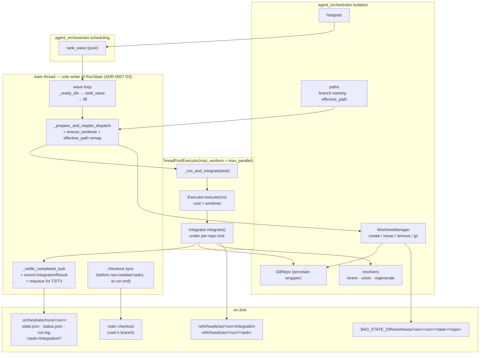
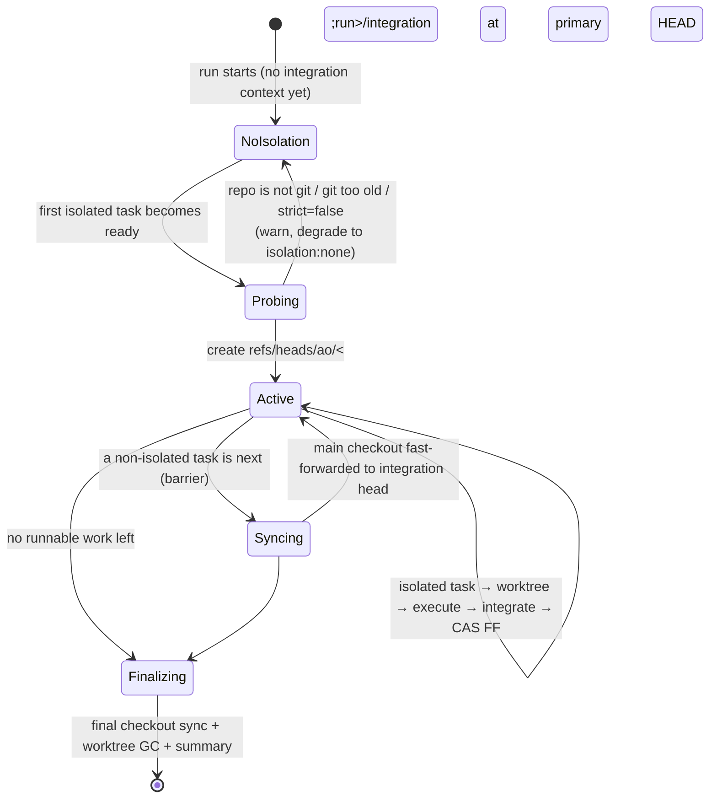
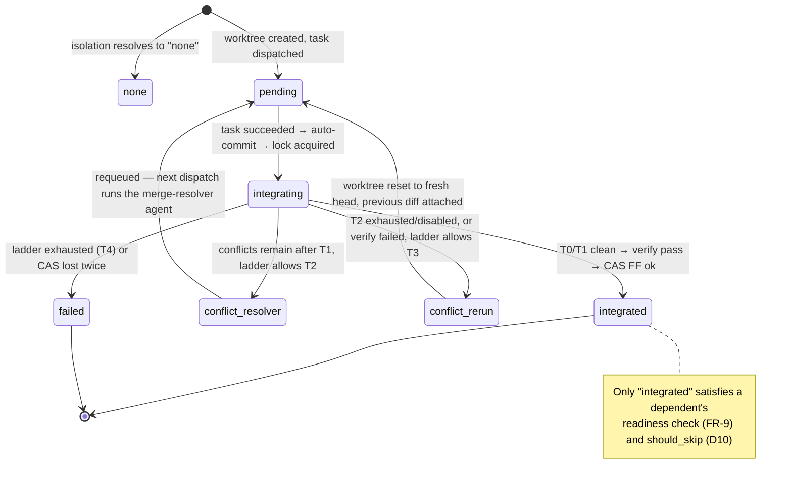

# Per-task git isolation & rebase-based integration — HLD/LLD (E-Wk9Tz3)

- Epic: [`E-Wk9Tz3-task-isolation`](../meta/tickets/E-Wk9Tz3-task-isolation/EPIC.md)
- Decision record: [`ADR-0013`](adr/ADR-0013-per-task-git-isolation-and-rebase-integration.md)
- Status: **Design — approved for implementation planning; no code written yet**
- Date: 2026-09-06
- Author: architect (agent)
- Related: [`ADR-0007`](adr/ADR-0007-parallel-task-execution.md) (wave/barrier scheduler — this epic closes its
  documented write-conflict gap) · [`parallel-execution-hld.md`](parallel-execution-hld.md) §11/§12 ·
  [`hld-agent-orchestrator.md`](hld-agent-orchestrator.md) (NFR-1 context hygiene) ·
  [`lld-agent-orchestrator.md`](lld-agent-orchestrator.md) · [`granular-task-decomposition-hld.md`](granular-task-decomposition-hld.md) ·
  [`workflow-templates-hld.md`](workflow-templates-hld.md) (`routed-runner` breakdown contract) ·
  [`meta/ROADMAP.md`](../meta/ROADMAP.md) §3.4 / §4 (the gap this closes) ·
  `docs-md/scheduler-triggers-hld.md` + ADR-0014 *(concurrent epic, not touched by this design)*

> Every claim about existing code in this document was verified against the working tree on
> **2026-09-06** (`engine.py` @ 2204 lines, `models.py` @ 586, `artifacts.py` @ 218, `runstate.py` @ 245,
> `cli.py` @ 1620, `specs/*.schema.json`). Line references are from that snapshot.

---

## 1. Problem

`max_parallel > 1` (ADR-0007) dispatches up to N ready tasks concurrently **into one shared working
tree**. `engine.py:304-305` computes `repo_paths` exactly once per run:

```python
repo_set   = reposets[workflow.repo_set]
repo_paths = {r.id: self._store.resolve(r.path) for r in repo_set.repos}
```

and every task, on every worker thread, receives that identical dict. There is no per-task working
directory, no branch, and no write-conflict detection anywhere in `src/` (a full sweep for
`git|worktree|branch|stash` finds git machinery only in `bench/swebench_provider.py`, `_version.py`
and the dashboard's ignore lists — the engine itself has none). ADR-0007 recorded "keeping outputs
disjoint is the spec author's job"; `meta/ROADMAP.md` §4 records that this has already failed in the
field.

Field evidence from the primary consumer (`../ao-runner-finplan`, read-only reference):

- One clone (`fin_plan/`), one branch (`epic/<epic-id>`), up to **101 injected tasks**, `max_parallel: 4`.
  Every `impl*`/`test*` agent runs `git -C fin_plan commit && push` on that same branch.
- A live run produced real contention on `src/server/fin_rust/src/apis/accounts.rs` (23 commits
  lifetime, 18 in the last six months — a genuine top-10 hotspot), survived only by a self-heal
  `git stash`, which their own `PARALLEL_DEVELOPMENT_GUIDELINES.md` §6.4 explicitly forbids
  ("never run a bare `git stash` in a shared worktree — the stash stack is shared").
- The breakdown agent is already **paying for the missing isolation in serialization**: across 18 real
  manifests, most `impl1-<tid>` entries carry an extra cross-task `depends_on` purely to avoid
  collisions (`e-yqqn8h`: 14 of 15; `e-u511z1`: 15 of 20). Its own `tasks.md` says why: *"The design
  mandates P0 → P1 → P2 sequential (they touch overlapping core Rust files)."*
- Their `PARALLEL_DEVELOPMENT_GUIDELINES.md` §8 names this exact epic as unbuilt orchestrator work.

**The payoff to buy with this epic is not "fewer conflicts" — it is "the breakdown agent can stop
serializing tasks it only serialized out of fear."**

---

## 2. Goal and non-goals

**Goal.** Give each parallel task its own git worktree on its own branch, integrate the results back
onto a run-scoped integration branch by *squash → rebase → verify → fast-forward* under a lock, and
resolve the conflicts that result through a cost-ordered ladder that only escalates to paid agent
work when free mechanical repair fails. Bias task assignment towards low-overlap co-scheduling with
**soft hints only** — never a gate.

**Non-goals (this epic).**
- Hard overlap gating, mandatory file-ownership declarations, or refusing to co-schedule.
- Copy-based isolation for non-git workspaces (`isolation: copy` — enum value reserved, not built).
- Container/VM sandboxing (that is ROADMAP §3.1 "per-run sandboxing", a different trust boundary).
- Distributed or multi-machine execution.
- A dashboard UI for conflicts beyond the fields that fall out of `status.json`.
- Changing anything in `../ao-runner-finplan` (read-only reference; consumer-side adoption is a
  follow-up ticket in **that** repo).

---

## 3. Requirements

### 3.1 MVP functional requirements

| ID | Requirement |
|---|---|
| **FR-1** | A task may declare `isolation: none \| worktree \| inherit` (default `inherit`); a workflow may declare `defaults.isolation: none \| worktree` (default `none`). Backward compatible: an unchanged spec behaves byte-identically to today. |
| **FR-2** | An isolated task runs in a git worktree created at dispatch time from the **current integration head**, on branch `ao/<run_id>/<task_id>`, with worktrees stored **outside every working tree** under an ao-owned state dir. |
| **FR-3** | Multiple `RepoRef`s that resolve into the same git repository share **one** worktree; distinct git repositories in a reposet each get their own worktree and branch. |
| **FR-4** | Every path handed to an isolated task (instruction, general instructions, inputs, outputs, output manifest, repo paths, cwd) is mapped through a deterministic `effective_path` function into that task's worktree when — and only when — it resolves inside an isolated repository, excluding ao-reserved shared prefixes. |
| **FR-5** | At task end the engine auto-commits the worktree (`git add -A` + commit, message built from **ids and paths only**, never file contents — NFR-1). |
| **FR-6** | Integration is *squash → rebase onto integration head → verify → compare-and-swap fast-forward of the integration ref*, serialized by a per-repository lock (in-process + cross-process `flock`). |
| **FR-7** | Conflicts are resolved by a tiered ladder: **T0** git auto-merge → **T1** deterministic mechanical resolvers (`rerere` replay, union merge for registry-style globs, regenerate for lockfiles) → **T2** a bounded LLM merge-resolver dispatch → **T3** re-run the task on the fresh base with its previous diff attached → **T4** fail the task. Each tier is configurable, observable, and budget-accounted. |
| **FR-8** | Every integration runs a **verify step** before the fast-forward. Default is a zero-cost structural check (leftover conflict markers / `git diff --check` over the changed paths); `integration.verify_command` replaces it with an argv command run in the task worktree. Verify failure enters the ladder at T3 (bounded by `max_reruns_per_task`), then T4. |
| **FR-9** | A dependent task may only dispatch after its predecessors are **integrated**, not merely `succeeded`. |
| **FR-10** | A task may declare `touches: [glob]` — a **soft** hint. The wave scheduler prefers co-scheduling tasks whose `touches` (and hotspot membership) do not overlap, deterministically, and **never** withholds a slot because of overlap. |
| **FR-11** | `ao hotspots` derives a hotspot list from git churn plus previously-observed conflicts, writes it as a workspace artifact, and feeds it to (a) the scheduler's ranking and (b) the breakdown agent as a declared input. |
| **FR-12** | A run whose repositories are not git repos, or whose git is too old, falls back to `isolation: none` with a logged warning — never a hard failure (unless `isolation.strict: true`). |
| **FR-13** | Non-isolated tasks in an isolation-enabled run are serial barriers, and the primary repo's main checkout is fast-forwarded to the integration head immediately before such a task dispatches, and once at run end. |
| **FR-14** | Worktrees, branches and refs created by a run are garbage-collected: after successful integration (`keep_worktrees: on_failure` default), on `ao prune`, and by an idempotent reconciliation pass at run start/resume. |
| **FR-15** | Structured events (`worktree.*`, `integration.*`), `TaskRunState`/`RunState` fields and `status.json` keys make the whole integration path traceable end-to-end. |
| **FR-16** | Ship a **conflict-friendly coding rules** instruction file, injectable through the existing `general_instructions` mechanism, plus `routed-runner` template wiring so the breakdown agent emits `touches` and per-task `isolation`. |

### 3.2 MVP non-functional requirements

| ID | Requirement |
|---|---|
| **NFR-1** | Context hygiene is preserved: the orchestrator core never reads artifact/instruction/conflict **contents**. Mechanical resolvers act via `git` subprocesses; conflict context reaching an agent is a manifest of *paths and refs*. |
| **NFR-2** | `max_parallel == 1` **and** `isolation: none` is byte-identical to today (blocking regression gate — the existing engine suite must pass unedited). |
| **NFR-3** | The engine core stays single-writer (ADR-0007 D3): only worker threads touch git; only the main thread mutates `RunState` and calls `save`. |
| **NFR-4** | Every git operation is bounded (timeout) and idempotent enough to be re-attempted after a crash; no step leaves a repository in a state that a resume cannot recover from mechanically. |
| **NFR-5** | Additive schema/state changes only; an old `RunState` loads, and a new `RunState` is readable by tolerant older code (pydantic `extra="ignore"`). |
| **NFR-6** | Disk cost is bounded and understood: worktrees copy **tracked files only** (an ignored 105 GB `target/` is *not* duplicated); the cold-rebuild cost is addressed by an explicit shared-build-cache recipe, not ignored. |

### 3.3 Explicitly non-MVP (reserved, not built)

`isolation: copy` for non-git workspaces · merge-commit integration strategy (enum value reserved) ·
speculative/optimistic parallel integration (Zuul-style) · a `integration_conflicts` circuit-breaker
condition · cross-repo atomic integration · per-task container sandboxes · learning `touches` from
observed diffs and feeding them back automatically · a conflict UI in the dashboard.

---

## 4. Landscape survey (branch-per-agent isolation & conflict handling)

| System | Isolation | Integration | Conflict handling | What we take |
|---|---|---|---|---|
| **Claude Code worktree mode** | `git worktree` per session: separate checkout, shared object store, one branch per agent | **Manual** — the human merges or opens a PR | None automated | The isolation primitive itself, and its cheapness (tracked files only). The gap is precisely the *integration* half — that is this epic. |
| **Cursor background agents** | Isolated cloud VM per agent, branch per agent | Agent opens a PR; a human reviews and merges | GitHub's own conflict UI; agent may be asked to rebase | Branch-per-agent + "the artifact is a branch, not a working tree" is the industry norm. But a PR-per-task loop is far too slow for a 100-task epic run. |
| **OpenHands / Devin-style** | Container/VM workspace per agent | Branch/PR; Devin exposes "resolve merge conflicts" as an agent capability | LLM-driven conflict resolution as an explicit, bounded action | Validates **T2**: an agent resolving a conflict is a normal, bounded task — not exotic. It must be budgeted and capped. |
| **CI merge queues** (Bors, GitHub merge queue, Zuul) | None — candidates are branches | **Serialized**: rebase/merge each candidate onto the queue tip, run required checks on the *post-merge* tree, then land | Failing candidate is **ejected**; the queue re-tests the rest. Zuul speculates ahead in parallel | Three things: (1) serialize the *landing*, parallelize the *work*; (2) verify the **post-merge** tree, never the pre-merge one; (3) an ejection policy is mandatory. Our T3/T4 are ejection — with the twist that we can first try to *repair* the candidate. |
| **git primitives** | — | — | `rerere` (replay recorded resolutions), `merge=union` driver, `merge-tree --write-tree` (worktree-free merge probe, git ≥ 2.38) | The whole of **T1**, plus a free "how hard is this rebase" oracle for telemetry. |

**What applies, condensed.** Branch-per-agent is settled practice; nobody in the agent space automates
the *repair* loop inside the run — that is where this design differentiates. Merge queues supply the
correctness discipline (serialize landing, verify post-merge, define ejection). Git supplies enough
mechanical machinery that most agent-generated collisions — append-only registries, lockfiles,
repeated identical resolutions — never need to reach an LLM.

**Positioning.**
```
We will:
- Match Claude Code / Cursor in per-agent worktree isolation (branch + private checkout, shared objects)
- Match a CI merge queue in landing discipline (serialized, verify the post-merge tree, explicit ejection)
- Beat all of them in in-run repair: a conflict is repaired by a bounded, budgeted ladder instead of
  waiting for a human PR review
- Beat Cursor/Devin in operational simplicity: no VM, no container, no hosted service — `git worktree`
  plus one lock in the existing single-process engine
- Avoid the complexity of Zuul-style speculative execution, hard overlap gating, and mandatory
  file-ownership manifests
```

---

## 5. Locked design decisions

Recorded here so the implementation has one place to check itself. Rationale lives in ADR-0013.

| # | Decision |
|---|---|
| **D1** | Worktree per task per **git repository**, branch `ao/<run_id>/<task_id>`, created at **dispatch time from the current integration head** (not at run start). |
| **D2** | Worktrees live **outside every working tree**: `$AO_STATE_DIR/worktrees/<workspace_key>/<run_id>/<task_id>/<repo_key>` (default `~/.local/state/ao/`), env-overridable. Never inside the workspace root. |
| **D3** | Integration = squash to one commit → `git rebase --onto <head> <base>` → resolve ladder → verify → **atomic CAS** `git update-ref <integration_ref> <new> <expected_old>`. Serialized per repository. |
| **D4** | The integration branch is an ao-owned ref `ao/<run_id>/integration`, created lazily at the first isolated dispatch from the primary repo's current `HEAD`. It is **never checked out**, so ref moves can never fail on a dirty tree. |
| **D5** | The user's main checkout is fast-forwarded to the integration head **on demand** — immediately before a non-isolated task dispatches, and once at run end. Non-isolated tasks are **barriers** whenever the run has an integration context. |
| **D6** | Structural tasks (`emit_tasks`, router, loop-gate) default to `isolation: none` — they are already barriers and usually need the shared checkout (e.g. `git-branch-off`). |
| **D7** | Isolation isolates **source**, not build caches. `isolation.env` injects per-repo env (e.g. a shared `CARGO_TARGET_DIR`); cargo's own lock on the target dir makes sharing safe-but-serializing. Documented, not hidden. |
| **D8** | `touches` is a **soft** hint. `rank_wave` is a pure, deterministic function that reorders the ready set within `max_parallel`; it never withholds a slot. At `N == 1` it is a provable no-op. |
| **D9** | The T2 merge-resolver is **not** a new injected DAG node. It is an extra *attempt of the same task* dispatched with a substituted agent + instruction, so budget gating, cost accumulation and `task_cost_usd` breakers all apply with zero new plumbing. |
| **D10** | A dependent dispatches only after its predecessors are **integrated** (FR-9), and `should_skip` for an isolated task additionally requires `integration_status == "integrated"`. |

---

## 6. HLD

### 6.1 Block diagram



### 6.2 Where things live on disk

```
<workspace_root>/                       # unchanged; may or may not be a git repo
  .ao/config.yaml                       # + isolation: block
  .orchestrator/runs/<run_id>/          # unchanged; NEVER inside a worktree
    state.json  status.json  run.log
    <task_id>/attempt-<n>/              # unchanged agent capture
    <task_id>/integration/              # NEW
      attempt-<n>/verify.{stdout,stderr,exit}
      conflict-<n>.json                 # paths + refs only (NFR-1)
      previous-<n>.patch                # T3 input
      merge-resolve.md                  # copy of the builtin resolver instruction
  <repo paths ...>                      # main checkout(s), user-owned

$AO_STATE_DIR/                          # default ~/.local/state/ao   (XDG_STATE_HOME aware)
  worktrees/<workspace_key>/<run_id>/<task_id>/<repo_key>/   # the private checkouts
  worktrees/<workspace_key>/index.json                       # GC bookkeeping (best effort)

<git repo>/.git/
  refs/heads/ao/<run_id>/integration    # the integration ref — never checked out
  refs/heads/ao/<run_id>/<task_id>      # one per isolated task per repo
  refs/ao/runs/<run_id>/<task_id>/squash-<n>   # keeps superseded squashes alive for T3
  rr-cache/                             # rerere, shared across worktrees by design
  info/exclude                          # ao appends `.orchestrator/` (never edits .gitignore)
```

`workspace_key` = a stable, filesystem-safe digest of the resolved workspace root
(`sha256(root)[:12]` prefixed by the sanitized basename), so two workspaces never collide and the
path stays humanly recognizable.

**Why outside the workspace.** A worktree under `<workspace_root>/.ao/worktrees/` would put N full
copies of the source tree *inside* the tree the agents search. Every `grep`/`rg`/glob in the main
checkout would match N duplicates, `git status` in the main checkout would be permanently noisy, and
a non-isolated task's `git add -A` could sweep them in. The cost of moving out is one explicit,
audited widening of the artifact path guard (§7.3) — a much smaller price.

### 6.3 Run-level lifecycle



### 6.4 Per-task integration state machine



---

## 7. Path, repo and artifact model

### 7.1 RepoRef is not a git repository

`specs/reposet.schema.json` lets a reposet list several `RepoRef`s that resolve into the *same* git
repository, or into no repository at all. The real consumer does exactly this:

```json
"repos": [ { "id": "core", "path": "./fin_plan",          "role": "primary" },
           { "id": "docs", "path": "./fin_plan/docs-md",  "role": "support" } ]
```

`docs` is a subdirectory of `core`. There is **one** git repository. Therefore:

```
FUNCTION group_repos(repo_paths) -> list[IsolatedRepo]:
  groups = {}                              # common_dir -> IsolatedRepo
  FOR repo_id, abs_path IN sorted(repo_paths.items()):        # sorted => deterministic
    probe = git_probe(abs_path)            # rev-parse --show-toplevel / --git-common-dir
    IF probe is None:                      # not a git repo
      RECORD non_git(repo_id); CONTINUE
    g = groups.setdefault(probe.common_dir,
          IsolatedRepo(key=slug(basename(probe.toplevel)) + "-" + sha256(probe.common_dir)[:8],
                       toplevel=probe.toplevel, common_dir=probe.common_dir, members=[]))
    g.members.append(RepoMember(repo_id=repo_id,
                                rel=relpath(abs_path, probe.toplevel)))   # "" for the toplevel itself
  RETURN sorted(groups.values(), key=lambda g: g.key)          # deterministic lock order
```

One worktree, one branch, one lock per `IsolatedRepo`. `repo_paths` handed to an isolated task become
`{member.repo_id: join(worktree_root, member.rel)}`.

**Edge cases.** A repo path that is a git *submodule* is its own repository (`--show-toplevel` returns
the submodule) → its own worktree; superproject/submodule co-ordination is **out of scope** and
detected + warned (`worktree.submodule_unsupported`). A repo path inside a worktree of another repo
is rejected at validation (`SpecValidationError`) — reposets must point at real checkouts.

### 7.2 `effective_path` — the one remapping rule

```
RESERVED_SHARED_PREFIXES = { "<workspace_root>/.orchestrator", "<workspace_root>/.ao" }

FUNCTION effective_path(resolved_abs: str, task_iso: TaskIsolation | None) -> str:
  IF task_iso is None:            RETURN resolved_abs        # not isolated -> unchanged
  IF under_any(resolved_abs, RESERVED_SHARED_PREFIXES): RETURN resolved_abs   # run state stays shared
  FOR repo IN task_iso.repos (longest toplevel first):       # innermost repo wins
    IF resolved_abs == repo.toplevel OR under(resolved_abs, repo.toplevel):
      RETURN join(repo.worktree_root, relpath(resolved_abs, repo.toplevel))
  RETURN resolved_abs                                        # outside every isolated repo -> shared
```

Pure, total, deterministic, and unit-testable without git. It is applied uniformly to
`instruction_path`, `general_instruction_paths`, `input_paths`, `output_paths`,
`output_manifest_path`, `repo_paths` and `cwd` — **but never** to `task_manifest_path`,
`gate_output_path` or `output_dir`, which live under `.orchestrator/` and are read back by the engine.

**Why this rule fits the real consumer.** In `ao-runner-finplan`, `workspace_root` is the runner root
(*not* a git repo) and all task artifacts live at `workflows/epic-runner/runs/<id>/outputs/...` —
outside every repo. Code changes live in `./fin_plan` — inside a repo. The containment rule therefore
splits exactly along the line the consumer already draws by hand: **artifacts stay shared; code is
isolated.** No spec change is needed to get that behaviour.

### 7.3 Widening the artifact path guard (security-relevant)

`LocalFsArtifactStore.resolve` (`artifacts.py:57-67`) resolves against a single root and rejects
anything that escapes it after symlink resolution. A worktree outside the workspace root would be
rejected. The change is deliberately narrow:

```
class LocalFsArtifactStore:
    def __init__(self, workspace_root, extra_roots: tuple[str, ...] = ()):   # NEW, default = today
        self._root = resolve(workspace_root)
        self._extra_roots = tuple(sorted(resolve(r) for r in extra_roots))

    def resolve(self, path):
        full = resolve(path) if isabs(path) else resolve(join(self._root, path))
        for root in (self._root, *self._extra_roots):
            if full == root or full.startswith(root + os.sep):
                return full
        raise ArtifactPathError(path)
```

Rules that keep this safe:
1. `extra_roots` is **never** taken from a spec file, a manifest, or an agent. The only producer is
   `WorktreeManager`, and the only values are worktree roots it just created under `$AO_STATE_DIR`.
2. Traversal is still rejected: `resolve()` happens *before* the containment test, so `../` and
   symlink escapes fail exactly as today.
3. The store used for **run state** (`RunStateStore`) keeps the un-widened root, so no run-state path
   can ever be steered into a worktree.
4. `$AO_STATE_DIR` is validated to be absolute and outside every repo toplevel at construction;
   otherwise isolation degrades to `none` with `worktree.unsafe_state_dir`.

Preferred implementation shape: rather than mutating the shared store, build a **per-task view**
(`IsolatedArtifactView(store, task_iso)`) that resolves via the base store and then applies
`effective_path`, adding the task's worktree roots as `extra_roots`. That keeps the run-wide store
untouched, which matters because the same instance is shared by the estimator, monitor and breakers.

### 7.4 Artifact visibility rules (the part that is easy to get wrong)

| Check | Where it runs | Why |
|---|---|---|
| **Pre-dispatch** `should_skip` (`runstate.py:156`) | shared/main root **and** requires `integration_status == "integrated"` for isolated tasks | "already done" must mean "already landed", otherwise a resumed run skips a task whose code was never integrated (real hazard: the consumer sets `skip_if_outputs_exist: true` on every fan-out entry). |
| **Pre-dispatch** missing-input gate (`engine.py:552`) | through `effective_path` | An input produced by an integrated predecessor is present in a worktree created from the post-integration head. |
| **Post-execution** missing-output check (`engine.py:1130`) | through `effective_path` (i.e. inside the worktree) | Verifies the agent actually produced what it declared, before anything is integrated. |
| **Post-integration** output check | shared/main root, after the checkout sync | Confirms the declared outputs are reachable from the integration branch. Outputs that are **git-ignored** never will be — see below. |
| **Untracked/ignored declared outputs** | copied back | After a successful integration, any declared output that exists in the worktree but is not tracked by git is copied to its shared path (`integration.untracked_outputs: copy \| fail \| ignore`, default `copy`), emitting `integration.artifact_copied`. Without this, a declared output under an ignored `build/` or `output/` directory would silently vanish. |

---

## 8. The integration protocol

### 8.1 Sequence — happy path (T0)

```mermaid
sequenceDiagram
    autonumber
    participant M as main thread
    participant W as worker thread
    participant WM as WorktreeManager
    participant G as git (subprocess)
    participant I as Integrator

    M->>WM: ensure_worktree(run, task, repos, base = integration head)
    WM->>G: worktree add -b ao/<run>/<task> <path> <base>
    G-->>WM: ok
    M->>M: remap paths (effective_path), ts.status = running, save()
    M->>W: submit _run_and_integrate(task)
    W->>W: _run_with_retries → Executor.execute(cwd = worktree)
    W->>I: integrate(task, worktrees, base)
    I->>G: add -A && commit  (auto-commit; ids/paths only)
    I->>I: acquire per-repo lock (threading.Lock + flock)
    I->>G: rev-parse refs/heads/ao/<run>/integration   → head
    I->>G: commit-tree <tip^{tree}> -p <base> -m <msg> → squash
    alt head == base
        I->>I: nothing to replay
    else
        I->>G: rebase --onto head base ao/<run>/<task>
        G-->>I: clean
    end
    I->>I: verify (default: conflict-marker + diff --check scan)
    I->>G: update-ref refs/heads/ao/<run>/integration <new> <head>   (CAS)
    G-->>I: ok
    I->>I: release lock
    I-->>W: IntegrationResult(status=integrated, tier=0)
    W-->>M: TaskResult + IntegrationResult
    M->>M: record integration state, copy untracked outputs, save()
    M->>WM: release_worktree(task)   (keep_worktrees = on_failure → remove)
```

**Why CAS and not `merge --ff-only`.** The integration ref is never checked out (D4), so it can be
moved with `git update-ref <ref> <new> <expected_old>`, which **fails atomically** if another
integrator moved it. That converts "the head moved under me" from a corruption risk into a clean,
retryable error — and it works across processes (a second `ao` run on the same repo), which a
working-tree merge does not.

**Lock-lost handling.** If the CAS fails (head moved between read and write — only possible if a
foreign writer bypassed the lock), the integrator retries the whole rebase once against the new head;
a second failure is `IntegrationResult(status="failed", reason="ref_race")` → T4.

### 8.2 Squash mechanics (exact)

```
base   = ts.integration.base_commit                       # recorded at worktree creation
tip    = git -C wt rev-parse HEAD
IF tip == base AND worktree_clean:  RETURN Empty          # task changed no repo file -> no-op integrate
git -C wt add -A                                          # respects .gitignore; run state is elsewhere
IF anything staged: git -C wt commit -m <auto message>
tip    = git -C wt rev-parse HEAD
squash = git -C wt commit-tree "${tip}^{tree}" -p base -m <squash message>
git -C wt reset --hard squash                             # branch is now exactly base + 1 commit
git update-ref refs/ao/runs/<run>/<task>/squash-<n> squash # keep alive for T3 / audit
```

`commit-tree` is used instead of `rebase -i`/`merge --squash` because it is a single deterministic
plumbing call with no index or editor involvement, and it makes the "one task = one commit" invariant
structural rather than procedural. Message template (`integration.commit_message_template`), default:

```
ao(<task_id>): <run_id>

AO-Run-Id: <run_id>
AO-Task-Id: <task_id>
AO-Agent: <agent_id>
AO-Base: <base_commit>
AO-Attempt: <n>
```

Only ids and commit shas — **no file contents are read by the orchestrator** (NFR-1).

### 8.3 Verify

- Runs in the task worktree **after** the rebase, so the tree under test is byte-identical to what the
  integration ref will point at (the merge-queue lesson: test the post-merge tree).
- `integration.verify_command: [string]` is an **argv list**, never a shell string
  (`verify_shell` is not offered in MVP). cwd = primary repo's worktree; env = process env +
  `isolation.env` + `AO_*`; timeout `integration.verify_timeout_seconds` (default 1800).
- stdout/stderr/exit are captured to `<run_dir>/<task_id>/integration/attempt-<n>/verify.*` and
  size-capped; only the exit code enters engine memory.
- **Default when unset** — a genuinely cheap, language-agnostic structural check:
  ```
  changed = git -C wt diff --name-only base..HEAD
  bad     = git -C wt grep -l -e '^<<<<<<< ' -e '^>>>>>>> ' HEAD -- <changed>   # -l: paths only, NFR-1
  ok      = (bad is empty) AND (git -C wt diff --check base..HEAD exits 0)
  ```
  This catches the single most common failure mode of an automatic resolution (a marker left behind)
  at zero cost and with no project-specific configuration.

### 8.4 The conflict-resolution ladder

Cost-ordered. `integration.ladder` is an ordered list, default `["auto", "mechanical", "llm", "rerun"]`;
removing an entry disables that tier.

| Tier | Name | Cost | Mechanism | Emits |
|---|---|---|---|---|
| **T0** | `auto` | free | `git rebase` succeeds; non-overlapping hunks merge themselves | `integration.rebased` |
| **T1** | `mechanical` | free | (a) `rerere` replay — every git call carries `-c rerere.enabled=true -c rerere.autoupdate=true`, so a resolution recorded once in this repo is replayed for free forever after (never written to the user's `git config`); (b) **union** merge for `integration.resolvers.union` globs (registries: `mod.rs`, `__init__.py`, `CHANGELOG.md`, barrel files) applied per-file over index stages, not via a global `merge` driver; (c) **regenerate** for `integration.resolvers.regenerate` entries (`{glob, command}` — lockfiles) | `integration.resolved` `tier=mechanical` `resolver=<rerere\|union\|regenerate>` |
| **T2** | `llm` | one bounded agent attempt | The task is **requeued** and its next dispatch runs `integration.resolver_agent` with the builtin `merge-resolve` instruction, inputs = `conflict-<n>.json` (paths + refs only) and the worktree left mid-rebase. On success the worker resumes `rebase --continue` → verify → CAS. Capped by `integration.max_resolver_attempts` (default 1) | `integration.resolver_dispatched` / `integration.resolved tier=llm` |
| **T3** | `rerun` | one full task attempt | Worktree `reset --hard` to the fresh integration head; the superseded squash is exported to `previous-<n>.patch` and added to the task's inputs; the original agent runs again on the clean base. Capped by `integration.max_reruns_per_task` (default 1). **Also the entry point for a verify failure** | `integration.rerun_dispatched` |
| **T4** | fail | — | `ts.status = failed`, integration state `failed`, branch + worktree retained (`keep_worktrees` forced to keep on failure), operator resolves and `ao resume` | `integration.failed` |

**Union resolver, precisely** (no global git config mutation, deterministic, NFR-1-safe):

```
FOR path IN conflicted_paths WHERE matches_any(path, union_globs):
    base_blob   = git -C wt show ":1:<path>"   -> tmp/base     # stage 1 (may be absent => /dev/null)
    ours_blob   = git -C wt show ":2:<path>"   -> tmp/ours     # stage 2
    theirs_blob = git -C wt show ":3:<path>"   -> tmp/theirs   # stage 3
    git merge-file --union -p tmp/ours tmp/base tmp/theirs > <wt>/<path>
    git -C wt add -- <path>
```
Contents flow through git subprocesses and temp files; nothing is read into orchestrator memory.

**Semantic conflicts.** Git only detects textual conflicts. Two tasks can each rebase cleanly and
still break together (task A renames a function, task B adds a caller). That is exactly what §8.3's
verify step exists for, and why it runs on the **post-rebase** tree. A verify failure is not a
conflict — it enters the ladder at **T3** (re-run on the fresh base, where the agent can *see* the
other task's landed change), and on exhaustion goes to **T4**.

### 8.5 Sequence — T1 → T2 → T3 escalation

```mermaid
sequenceDiagram
    autonumber
    participant M as main thread
    participant W as worker
    participant I as Integrator
    participant G as git

    W->>I: integrate(...)
    I->>G: rebase --onto head base branch
    G-->>I: CONFLICT: [apis/accounts.rs, mod.rs, uv.lock]
    I->>I: T1 plan = {mod.rs: union, uv.lock: regenerate, accounts.rs: unresolved}
    I->>G: rerere replay (autoupdate) → resolves nothing new
    I->>G: merge-file --union mod.rs ; run regenerate cmd for uv.lock ; add
    I-->>W: still conflicted: [apis/accounts.rs]
    alt "llm" in ladder AND resolver_attempts < max
        I->>I: write conflict-1.json (paths + refs), keep worktree mid-rebase
        I-->>M: IntegrationResult(status=conflict_resolver, tier_reached=mechanical)
        M->>M: reverse estimate, ts.status = pending, integration.mode = resolve, save()
        Note over M: next wave: budget gate + charge as a normal dispatch (D9)
        M->>W: dispatch task with resolver_agent + merge-resolve.md
        W->>I: resume_integration()
        I->>G: add -A ; rebase --continue ; verify ; update-ref CAS
        G-->>I: ok
        I-->>M: IntegrationResult(status=integrated, tier=llm)
    else ladder exhausted at llm
        I-->>M: IntegrationResult(status=conflict_rerun)
        M->>M: reset worktree to fresh head, export previous.patch, requeue original agent
    end
```

### 8.6 Sequence — verify failure (semantic conflict)

```mermaid
sequenceDiagram
    autonumber
    participant I as Integrator
    participant G as git
    participant M as main thread
    I->>G: rebase clean
    I->>I: verify_command → exit 1 (build broken by a sibling's landed rename)
    I->>I: reruns_used < max_reruns_per_task ?
    alt yes
        I-->>M: conflict_rerun (reason = verify_failed)
        M->>M: requeue; worktree reset --hard <fresh head>; previous-<n>.patch attached
    else no
        I-->>M: failed (reason = verify_failed)
        M->>M: ts.status = failed → existing HALT path (ADR-0007 D7 drain)
    end
```

---

## 9. Scheduling: soft overlap preference and hotspots

### 9.1 `rank_wave` — pure, deterministic, never blocking

```
FUNCTION rank_wave(ready: list[str],            # already in the deterministic sorted-Kahn order
                   touches: dict[str, list[str]],   # task id -> globs (may be missing/empty)
                   hotspots: dict[str, float],      # glob/path -> weight (>= 1.0)
                   n: int) -> list[str]:
  IF n <= 1 OR preference == "off": RETURN ready[:n]        # provable no-op at N=1 (NFR-2)
  selected = []
  # pass 1: greedy zero-overlap, original order preserved
  FOR tid IN ready:
      IF len(selected) >= n: BREAK
      IF overlap_score(tid, selected, touches, hotspots) == 0.0: selected.append(tid)
  # pass 2: fill remaining slots with the least-overlapping candidates
  IF len(selected) < n:
      rest = [t for t in ready if t not in selected]
      rest.sort(key=lambda t: (overlap_score(t, selected, touches, hotspots), ready.index(t)))
      FOR tid IN rest:
          IF len(selected) >= n: BREAK
          selected.append(tid)                              # ALWAYS admitted — soft, never a gate
  RETURN selected

FUNCTION overlap_score(tid, selected, touches, hotspots) -> float:
  mine = touches.get(tid) or []
  IF not mine: RETURN 0.0            # no hint == no opinion, never a penalty (FR-10)
  score = 0.0
  FOR other IN selected:
      theirs = touches.get(other) or []
      FOR g IN glob_intersection(mine, theirs):             # see below
          score += hotspot_weight(g, hotspots)              # 1.0 baseline, higher for hotspots
  RETURN score
```

`glob_intersection` is deliberately **syntactic and cheap**: two glob patterns "intersect" when one
matches the other as a literal, or when their non-wildcard prefixes are a prefix of one another
(`src/api/**` vs `src/api/accounts.rs` → intersect; `src/api/**` vs `src/ui/**` → do not). It does not
touch the filesystem, so it is pure and unit-testable. `touches` is *low certainty by construction*;
being wrong costs a slightly worse co-scheduling choice and nothing else.

**Determinism guarantees.** Same `(ready, touches, hotspots, n)` → same output. `ready.index(t)` is
the tie-break at every stage. At `n == 1` the function returns `ready[:1]` — literally today's
behaviour, which is what preserves ADR-0007 D1/D6 and this epic's NFR-2.

**Default.** `scheduling.overlap_preference: "soft"` when the run has any isolated task, `"off"`
otherwise — so a workflow that does not opt into isolation keeps today's exact co-scheduling. See
§20 "Decisions needed".

### 9.2 Hotspots

```
FUNCTION compute_hotspots(repo, since_days=180, top_k=40, conflicts=[]) -> Hotspots:
  raw   = git -C repo log --since=<since> --pretty=format: --name-only --no-merges
  churn = Counter(non-empty lines)                          # parse_churn(raw) is PURE -> unit-testable
  FOR path, count IN observed_conflicts(conflicts):         # from prior runs' state.json
      churn[path] += count * CONFLICT_WEIGHT                # default 5 — a real conflict beats churn
  RETURN Hotspots(generated_at=..., repo=..., window_days=..., entries=top_k by weight)
```

Written to `.ao/hotspots.json` (workspace-relative, git-ignorable) by `ao hotspots`. Consumed by:
1. `rank_wave` as `hotspot_weight` (a collision on a hotspot is worth avoiding more than a collision
   on a cold file);
2. the breakdown agent, as a **declared input path** on the `task-breakdown` task — so decomposition
   can steer away from hot files instead of guessing.

Known limitation, stated rather than hidden: raw `--name-only` churn is a noisy signal. In the real
consumer, the top churn file (`main.rs`) had already been *deleted* by a prior epic, and a 740-byte
`mod` declaration list ranked 6th. Mitigations: the conflict-observation term (which is ground truth),
a `since` window that defaults to 180 days, and dropping paths that no longer exist at HEAD.

---

## 10. Schema and model deltas

### 10.1 `specs/workflow.schema.json`

Everything below is **additive**; `additionalProperties: false` at every level means each field must
be added to the schema *and* the pydantic model or `ao validate` rejects specs that use it.

```jsonc
// $defs/task — two new properties
"isolation": {
  "enum": ["none", "worktree", "inherit"], "default": "inherit",
  "description": "Execution isolation for this task. 'inherit' takes defaults.isolation. 'worktree' runs the task in a private git worktree on branch ao/<run_id>/<task_id> and integrates by squash+rebase. Falls back to 'none' for non-git repos."
},
"touches": {
  "type": "array", "items": { "type": "string" }, "default": [],
  "description": "SOFT hint: glob patterns this task is expected to modify. Used only to PREFER co-scheduling non-overlapping tasks. Never a gate; may be incomplete or wrong."
},

// defaults — one new property
"isolation": { "enum": ["none", "worktree"], "default": "none" },

// workflow root — two new optional blocks
"integration": { "$ref": "#/$defs/integration" },
"scheduling":  { "$ref": "#/$defs/scheduling" },

"$defs": {
  "integration": {
    "type": "object", "additionalProperties": false,
    "properties": {
      "strategy":        { "enum": ["rebase", "merge"], "default": "rebase",
                           "description": "MVP implements 'rebase' only; 'merge' is reserved and rejected by cross-validation." },
      "branch":          { "type": "string", "description": "Integration branch name. Default: ao/<run_id>/integration." },
      "verify_command":  { "type": "array", "items": { "type": "string" },
                           "description": "argv (never a shell string) run in the task worktree after rebase, before landing. Unset = built-in structural check." },
      "verify_timeout_seconds": { "type": "integer", "minimum": 1, "default": 1800 },
      "ladder":          { "type": "array", "default": ["auto", "mechanical", "llm", "rerun"],
                           "items": { "enum": ["auto", "mechanical", "llm", "rerun"] } },
      "resolvers": {
        "type": "object", "additionalProperties": false,
        "properties": {
          "rerere": { "type": "boolean", "default": true },
          "union":  { "type": "array", "items": { "type": "string" }, "default": [] },
          "regenerate": { "type": "array", "default": [], "items": {
            "type": "object", "additionalProperties": false,
            "required": ["glob", "command"],
            "properties": { "glob": { "type": "string" },
                            "command": { "type": "array", "items": { "type": "string" } },
                            "take": { "enum": ["ours", "theirs"], "default": "theirs" } } } }
        }
      },
      "resolver_agent":  { "type": "string", "description": "Agent id used for T2 merge resolution. Required when 'llm' is in the ladder." },
      "resolver_instruction": { "type": "string", "description": "Path override for the T2 instruction. Default: builtin merge-resolve.md copied into the run dir." },
      "max_resolver_attempts": { "type": "integer", "minimum": 0, "default": 1 },
      "max_reruns_per_task":   { "type": "integer", "minimum": 0, "default": 1 },
      "untracked_outputs": { "enum": ["copy", "fail", "ignore"], "default": "copy" },
      "keep_worktrees":  { "enum": ["never", "on_failure", "always"], "default": "on_failure" },
      "sync_checkout":   { "enum": ["on_demand", "never"], "default": "on_demand" },
      "commit_message_template": { "type": "string" },
      "lock_timeout_seconds": { "type": "integer", "minimum": 1, "default": 1800 }
    }
  },
  "scheduling": {
    "type": "object", "additionalProperties": false,
    "properties": {
      "overlap_preference": { "enum": ["off", "soft"], "description": "Default: 'soft' when the run has any isolated task, else 'off'." },
      "hotspots_path":      { "type": "string", "default": ".ao/hotspots.json" }
    }
  }
}
```

### 10.2 `models.py`

```python
IsolationMode      = Literal["none", "worktree", "inherit"]     # task level
WorkflowIsolation  = Literal["none", "worktree"]                # workflow default level
ResolverTier       = Literal["auto", "mechanical", "llm", "rerun"]

class TaskSpec(BaseModel):
    ...                                              # unchanged fields
    isolation: IsolationMode = "inherit"             # NEW
    touches: list[str] = []                          # NEW (soft hint)

class WorkflowDefaults(BaseModel):
    retries: RetryPolicy = RetryPolicy()
    timeout_seconds: int = 1800
    isolation: WorkflowIsolation = "none"            # NEW

class RegenerateRule(BaseModel):                     # NEW
    glob: str
    command: list[str]
    take: Literal["ours", "theirs"] = "theirs"

class ResolverConfig(BaseModel):                     # NEW
    rerere: bool = True
    union: list[str] = []
    regenerate: list[RegenerateRule] = []

class IntegrationSpec(BaseModel):                    # NEW
    strategy: Literal["rebase", "merge"] = "rebase"
    branch: str | None = None
    verify_command: list[str] = []
    verify_timeout_seconds: int = DEFAULT_VERIFY_TIMEOUT_SECONDS      # 1800
    ladder: list[ResolverTier] = ["auto", "mechanical", "llm", "rerun"]
    resolvers: ResolverConfig = ResolverConfig()
    resolver_agent: str | None = None
    resolver_instruction: str | None = None
    max_resolver_attempts: int = 1
    max_reruns_per_task: int = 1
    untracked_outputs: Literal["copy", "fail", "ignore"] = "copy"
    keep_worktrees: Literal["never", "on_failure", "always"] = "on_failure"
    sync_checkout: Literal["on_demand", "never"] = "on_demand"
    commit_message_template: str | None = None
    lock_timeout_seconds: int = DEFAULT_INTEGRATION_LOCK_TIMEOUT_SECONDS   # 1800

class SchedulingSpec(BaseModel):                     # NEW
    overlap_preference: Literal["off", "soft"] | None = None   # None => derived (see §9.1)
    hotspots_path: str = DEFAULT_HOTSPOTS_PATH                 # ".ao/hotspots.json"

class WorkflowSpec(BaseModel):
    ...                                              # unchanged fields
    integration: IntegrationSpec = IntegrationSpec()   # NEW
    scheduling: SchedulingSpec = SchedulingSpec()      # NEW

class TaskContext(BaseModel):
    ...                                              # unchanged fields
    env: dict[str, str] = {}                         # NEW — overlaid on os.environ by the executor
```

`TaskContext.env` is required because `ClaudeCliExecutor` passes **no** `env=` to `Popen` today
(`claude_cli.py:476-482`), so there is no injection point for `AO_ISOLATION` / `AO_TASK_BRANCH` /
`isolation.env` build-cache variables. The executor change is exactly:
`env=({**os.environ, **ctx.env} if ctx.env else None)` — inheriting wholesale when `env` is empty, so
the no-isolation path is untouched.

### 10.3 Run state (`models.py`) — survives `prepare_resume`

`prepare_resume` (`runstate.py:212`) replaces every non-terminal `TaskRunState` with a **fresh**
object, so integration bookkeeping must not live there alone.

```python
class TaskIntegrationState(BaseModel):               # NEW
    isolation: Literal["none", "worktree"] = "none"
    repos: dict[str, str] = {}                       # repo_key -> worktree root
    branches: dict[str, str] = {}                    # repo_key -> branch name
    base_commits: dict[str, str] = {}                # repo_key -> base sha at worktree creation
    squash_commits: dict[str, str] = {}              # repo_key -> last squash sha
    status: Literal["none","pending","integrating","integrated",
                    "conflict_resolver","conflict_rerun","failed"] = "none"
    mode: Literal["normal", "resolve", "rerun"] = "normal"    # what the NEXT dispatch does
    tier_reached: ResolverTier | None = None
    attempts: int = 0
    resolver_attempts: int = 0
    reruns: int = 0
    conflicted_paths: list[str] = []                 # paths only (NFR-1)
    verify_status: Literal["not_run","passed","failed"] = "not_run"
    last_error: str | None = None

class RunIntegrationState(BaseModel):                # NEW
    active: bool = False
    branch: str | None = None                        # e.g. "ao/<run_id>/integration"
    repos: dict[str, str] = {}                       # repo_key -> git common dir
    heads: dict[str, str] = {}                       # repo_key -> current integration head
    base_heads: dict[str, str] = {}                  # repo_key -> sha the run branched from
    checkout_synced_to: dict[str, str] = {}          # repo_key -> sha the main checkout holds
    degraded_reason: str | None = None               # set when isolation fell back to none

class RunState(BaseModel):
    ...                                              # unchanged fields
    integration: RunIntegrationState = RunIntegrationState()          # NEW
    task_integration: dict[str, TaskIntegrationState] = {}            # NEW — keyed by task id
```

`prepare_resume` keeps `state.integration` and `state.task_integration` verbatim, and additionally
normalizes: any task whose `task_integration[tid].status` is `integrating` becomes `pending` with
`mode` preserved, so a crash mid-integration is retried rather than lost.

`status.json` (`runstate.py:64`) gains a top-level `integration` block (`active`, `branch`, per-repo
heads, counts of `integrated` / `conflict` / `failed`) and each `tasks[]` entry gains
`integration_status`, `tier_reached`, `conflicted_count`. Additive; existing dashboard readers ignore
unknown keys.

### 10.4 Cross-validation rules (`spec.py::cross_validate`)

| # | Rule | Severity |
|---|---|---|
| V1 | `integration.strategy == "merge"` → **fatal** ("reserved, not implemented in this version") | fatal |
| V2 | `"llm"` in `integration.ladder` and `integration.resolver_agent` unset → fatal | fatal |
| V3 | `integration.resolver_agent` not in the agents registry → fatal | fatal |
| V4 | Any task with `isolation == "worktree"` (or `defaults.isolation == "worktree"`) while `emit_tasks`/router/loop-gate → **warning**, forced to `none` at dispatch (D6) | warning |
| V5 | `integration.*` set but no task resolves to `worktree` → warning ("integration config has no effect") | warning |
| V6 | `touches` entry containing `..` or an absolute path → fatal (hint globs are workspace-relative) | fatal |
| V7 | `max_resolver_attempts > 0` while `"llm"` absent from the ladder → warning | warning |
| V8 | A `RepoRef` path that lies inside another reposet member's *worktree* → fatal | fatal |
| V9 | A task id that sanitizes to the reserved component `integration` (it would collide with the integration branch `ao/<run_id>/integration`) → fatal | fatal |

**Packaging note (pre-existing, inherited):** `config._validate_against_schema` silently no-ops when
`specs/*.schema.json` is missing, and the wheel does not ship `specs/` (`pyproject.toml` packages
`src/agent_orchestrator` plus `ui/static` only). For an installed `ao`, **pydantic is the real gate**.
Every rule above must therefore also exist in pydantic/`cross_validate`, not only in JSON Schema.

---

## 11. LLD

Module → task ownership is 1:1 with the epic's task tickets, so no two tasks edit the same new file.

| Module | New/edited files | Owning task |
|---|---|---|
| M1 `GitRepo` porcelain | `isolation/git.py` | `T-Gt4Pw8-git-porcelain` |
| M2 schema + models + state | `models.py`, `spec.py`, `specs/workflow.schema.json` | `T-Sc7Rm2-isolation-schema-models` |
| M3 paths + worktree lifecycle | `isolation/paths.py`, `isolation/worktrees.py` | `T-Wk3Nv6-worktree-lifecycle` |
| M4 integrator core | `isolation/integrator.py`, `isolation/locks.py` | `T-Ib5Qy9-integrator-core` |
| M5 engine wiring | `engine.py`, `artifacts.py`, `runstate.py`, `executors/claude_cli.py` | `T-En8Hd4-engine-isolation-wiring` |
| M6 mechanical resolvers | `isolation/resolvers.py` | `T-Rm2Lx7-mechanical-resolvers` |
| M7 T2/T3 escalation | `isolation/escalation.py` + engine hooks | `T-Lr6Ka3-llm-resolver-and-rerun` |
| M8 overlap ranking + hotspots | `scheduling/overlap.py`, `isolation/hotspots.py` | `T-Ov9Bt5-overlap-scheduling-hotspots` |
| M9 CLI / config / prune / events | `cli.py`, `project_config.py`, `logging_setup` callers | `T-Cx4Jf1-cli-config-prune-observability` |
| M10 instructions + templates | `templates/builtin/**`, new instruction assets | `T-Tp7Zs2-instructions-and-templates` |
| M11 e2e + review | `tests/**` | `T-Ee3Mn8-e2e-and-review` |

---

### M1 — `isolation/git.py` — `GitRepo` porcelain wrapper

**Purpose.** One typed, timeout-bounded, exception-safe surface for every git call. Nothing else in
the codebase shells out to git.
**Inputs.** A repo path or worktree path, argv fragments.
**Outputs.** Typed results; `GitError` (never a raw `CalledProcessError`).
**Dependencies.** `subprocess`, `errors.py`.

```
CONSTANTS:
  GIT_DEFAULT_TIMEOUT_SECONDS = 300
  GIT_MIN_VERSION             = (2, 30)          # worktree add/remove/prune, update-ref CAS
  GIT_MERGE_TREE_MIN_VERSION  = (2, 38)          # merge-tree --write-tree probe (optional)
  RERERE_ARGS = ["-c", "rerere.enabled=true", "-c", "rerere.autoupdate=true"]

CLASS GitError(AoError):   argv, exit_code, stderr_tail (truncated to 4 KiB)

CLASS GitRepo:
  __init__(path: str, timeout: int = GIT_DEFAULT_TIMEOUT_SECONDS, rerere: bool = True)

  # --- low level ---
  FUNCTION _run(args, *, cwd=None, check=True, timeout=None) -> CompletedProcess:
      argv = ["git", "--no-pager", *(RERERE_ARGS if self.rerere else []), *args]
      TRY: cp = subprocess.run(argv, cwd=cwd or self.path, capture_output=True,
                               text=True, timeout=timeout or self.timeout)
      EXCEPT TimeoutExpired: RAISE GitError(argv, None, "timeout")
      IF check AND cp.returncode != 0: RAISE GitError(argv, cp.returncode, tail(cp.stderr))
      RETURN cp

  # --- probes (never raise; return None/False) ---
  STATIC version() -> tuple[int,int,int] | None
  STATIC probe(path) -> RepoProbe | None            # {toplevel, common_dir, bare} via rev-parse
  FUNCTION is_dirty() -> bool                       # status --porcelain, tracked changes only
  FUNCTION current_branch() -> str | None           # None on detached HEAD
  FUNCTION rev_parse(ref) -> str | None
  FUNCTION is_ancestor(a, b) -> bool                # merge-base --is-ancestor
  FUNCTION merge_tree_probe(a, b) -> MergeProbe | None   # None when git < 2.38; else {clean, paths}

  # --- worktrees ---
  FUNCTION worktree_add(path, branch, start_point) -> None      # worktree add -b <branch> <path> <sp>
  FUNCTION worktree_remove(path, force=False) -> None
  FUNCTION worktree_prune() -> None
  FUNCTION worktree_list() -> list[WorktreeEntry]               # --porcelain parse (PURE parser split out)

  # --- refs & commits ---
  FUNCTION update_ref_cas(ref, new, expected_old) -> bool       # False on CAS loss, never raises
  FUNCTION create_ref(ref, sha) -> None
  FUNCTION delete_ref(ref) -> None
  FUNCTION list_refs(prefix) -> dict[str, str]
  FUNCTION commit_tree(tree_ish, parent, message) -> str
  FUNCTION add_all(cwd) -> None                                  # add -A
  FUNCTION commit(cwd, message, allow_empty=False) -> str | None # None when nothing staged
  FUNCTION reset_hard(cwd, ref) -> None
  FUNCTION diff_names(cwd, a, b) -> list[str]
  FUNCTION ls_files_untracked_ignored(cwd, paths) -> set[str]    # for untracked-output copy-back
  FUNCTION is_tracked(cwd, path) -> bool

  # --- rebase ---
  FUNCTION rebase_onto(cwd, onto, upstream, branch) -> RebaseOutcome    # {clean|conflicted, paths}
  FUNCTION rebase_continue(cwd) -> RebaseOutcome                        # env GIT_EDITOR=true
  FUNCTION rebase_abort(cwd) -> None
  FUNCTION rebase_in_progress(cwd) -> bool          # $GIT_DIR/rebase-merge | rebase-apply exists
  FUNCTION conflicted_paths(cwd) -> list[str]       # diff --name-only --diff-filter=U
  FUNCTION show_stage(cwd, stage:int, path) -> bytes|None   # show :N:<path>, None when stage absent
```

**Edge cases.** git absent → `version()` returns `None`, isolation degrades (FR-12). Repo is bare →
`probe().bare` true → not isolatable, warn + degrade. A path inside `.git` → `probe()` returns the
repo but `toplevel` differs from the path; the containment rule in §7.2 handles it. `worktree_add`
onto an existing dir → `GitError`; caller reconciles (M3). `update_ref_cas` returns `False` (not an
exception) so the integrator can retry.
**Subtasks.** (1) `_run` + `GitError` + timeouts; (2) probes; (3) worktree ops + pure `--porcelain`
parser; (4) refs/commits; (5) rebase ops; (6) unit tests over real `git init` temp repos (the
`tests/bench/test_swebench_provider.py::_git` pattern, with `-c user.email=... -c user.name=...`).

---

### M2 — schema, models, run state

**Purpose.** Make every new field expressible, validated, persisted and resume-safe.
**Inputs/Outputs.** §10.
**Dependencies.** none (must land first — every other module imports these types).

```
FUNCTION resolve_task_isolation(task: TaskSpec, workflow: WorkflowSpec) -> "none"|"worktree":
  IF task.emit_tasks OR is_router_task(task, workflow) OR is_loop_gate(task, workflow):
      IF task.isolation == "worktree": WARN once ("structural task forced to isolation=none")   # D6/V4
      RETURN "none"
  IF task.isolation == "inherit": RETURN workflow.defaults.isolation
  RETURN task.isolation
```

**Edge cases.** An injected (`emit_tasks` manifest) task carries `isolation`/`touches` because
`read_task_manifest` constructs `TaskSpec(**t)` — no parser change needed, but the routed-runner
contract's field allowlist must be widened (M10) or breakdown agents will keep omitting them.
A loop-body clone (`__iter` ids, `engine.py:2153`) inherits its source task's `isolation`/`touches` —
verify the clone copies both fields.
**Subtasks.** (1) pydantic models + constants; (2) `workflow.schema.json` `$defs`; (3)
`resolve_task_isolation`; (4) `cross_validate` rules V1-V8; (5) `RunState`/`TaskRunState`/status.json
additions + `prepare_resume` preservation; (6) round-trip and backward-compat tests (old `state.json`
loads; new one has defaults).

---

### M3 — `isolation/paths.py` + `isolation/worktrees.py`

**Purpose.** Deterministic naming, the `effective_path` rule, and idempotent worktree lifecycle.
**Inputs.** run id, task id, resolved repo paths, integration heads.
**Outputs.** `TaskIsolation` (worktree roots + branches + bases), GC actions.
**Dependencies.** M1, M2.

```
# --- paths.py (pure) ---
CONSTANTS: AO_REF_NAMESPACE = "ao"
           STATE_ENV = "AO_STATE_DIR"; WORKTREE_ENV = "AO_WORKTREE_ROOT"

FUNCTION sanitize_ref_component(s) -> str:
    out = re.sub(r"[^A-Za-z0-9._-]", "-", s).strip("-.")
    out = re.sub(r"\.\.+", ".", out)              # git forbids ".."
    IF out.endswith(".lock"): out = out[:-5] + "-lock"
    IF out == "": out = "x"
    RETURN out[:80]

RESERVED_BRANCH_COMPONENTS = {"integration"}     # a task id may not sanitize to this

FUNCTION task_branch(run_id, task_id)  -> "ao/<san(run_id)>/<san(task_id)>"
   # PRECONDITION (V9 at validate time, asserted here as defence in depth):
   #   san(task_id) NOT IN RESERVED_BRANCH_COMPONENTS
FUNCTION integration_branch(run_id)    -> "ao/<san(run_id)>/integration"
FUNCTION squash_ref(run_id, task_id,n) -> "refs/ao/runs/<san(run)>/<san(task)>/squash-<n>"
   # NOTE: "ao/<run>" is NEVER itself a branch -> no git D/F ref conflict with "ao/<run>/<task>".

FUNCTION workspace_key(workspace_root) -> f"{slug(basename(root))}-{sha256(root)[:12]}"
FUNCTION state_dir() -> Path:
    env AO_STATE_DIR > $XDG_STATE_HOME/ao > ~/.local/state/ao      # mirrors service/paths.py
FUNCTION worktree_root(ws_root, run_id, task_id, repo_key) -> Path:
    (env AO_WORKTREE_ROOT or state_dir()/"worktrees") / workspace_key(ws_root)
        / san(run_id) / san(task_id) / repo_key

FUNCTION effective_path(resolved_abs, task_iso) -> str        # exactly as §7.2

# --- worktrees.py ---
CLASS WorktreeManager:
  __init__(workspace_root, run_id, repos: list[IsolatedRepo], integration: RunIntegrationState)

  FUNCTION ensure(task_id, attempt) -> TaskIsolation:
      iso = TaskIsolation(task_id=task_id, repos=[])
      FOR repo IN self.repos:                                    # sorted, deterministic
          path   = worktree_root(ws, run_id, task_id, repo.key)
          branch = task_branch(run_id, task_id)
          head   = self.integration.heads[repo.key]              # base = CURRENT integration head
          IF path exists AND GitRepo(repo.toplevel).worktree_list() contains path:
              # resume/retry: reuse, but recover from a crash mid-rebase
              IF git.rebase_in_progress(path): git.rebase_abort(path)
              CURRENT = git.rev_parse_in(path, branch)
              LOG worktree.reused
          ELSE:
              IF path exists (stale dir, not registered): rmtree(path)
              git.worktree_prune()                               # clear stale registrations first
              IF branch already exists: git.delete_ref("refs/heads/" + branch)   # only when not registered
              git.worktree_add(path, branch, head)
              LOG worktree.created {task_id, repo=repo.key, branch, base=head}
          iso.repos.append(RepoIsolation(key=repo.key, toplevel=repo.toplevel,
                                         worktree_root=path, branch=branch, base=head,
                                         members=repo.members))
      RETURN iso

  FUNCTION release(task_id, outcome: "integrated"|"failed", policy) -> None:
      IF policy == "always": RETURN
      IF policy == "on_failure" AND outcome == "failed": RETURN            # keep for the operator
      FOR repo IN self.repos:
          TRY: git.worktree_remove(path, force=True); LOG worktree.removed
          EXCEPT GitError as e: LOG worktree.remove_failed {error}; CONTINUE   # never fail a run on GC

  FUNCTION reconcile(known_task_ids) -> ReconcileReport:
      """Run at run start and on resume; idempotent."""
      git.worktree_prune()
      FOR entry IN git.worktree_list():
          IF entry.path under our run's worktree_root AND entry.task_id NOT IN known_task_ids:
              remove it (orphan from a crashed/pruned run)
      FOR ref IN git.list_refs("refs/heads/ao/<run_id>/"):
          IF ref names a task not in known_task_ids AND has no worktree: delete_ref(ref)

  FUNCTION gc_run(run_id) -> None:      # used by `ao prune`
      remove every worktree under worktree_root(ws, run_id, *), then worktree_prune(),
      then delete refs/heads/ao/<run_id>/* and refs/ao/runs/<run_id>/*
```

**Edge cases.** Worktree path length near `PATH_MAX` → hash-shorten `task_id` beyond 80 chars.
Two runs of the same workflow within one second share a `run_id`? No — `run_id` embeds a UTC second
and the workflow id (`runstate.py:54`); a genuine collision would reuse branches, so `ensure` treats
"branch exists and points somewhere unrelated" as a hard error rather than silently reusing.
`$AO_STATE_DIR` on a different filesystem → fine (worktrees store an absolute `gitdir` pointer).
Deleting a worktree while a `claude` grandchild still holds a file open → `worktree_remove --force`
plus a logged failure; never fatal. A worktree whose repo was deleted → `worktree_prune` handles it.
**Subtasks.** (1) pure path/naming functions + property tests on `sanitize_ref_component`;
(2) `IsolatedRepo` grouping (§7.1); (3) `ensure` incl. crash recovery; (4) `release`; (5) `reconcile`;
(6) `gc_run`; (7) integration tests against real temp repos incl. an orphaned worktree.

---

### M4 — `isolation/integrator.py` + `isolation/locks.py`

**Purpose.** Land one task's work on the integration ref, or report exactly why it could not.
**Inputs.** `TaskIsolation`, `IntegrationSpec`, `RunIntegrationState`, attempt number, a resolver plan
hook (M6) and an escalation policy (M7).
**Outputs.** `IntegrationResult`.
**Dependencies.** M1, M2, M3, M6.

```
@dataclass(frozen=True)
class IntegrationResult:
    status: "integrated"|"conflict_resolver"|"conflict_rerun"|"failed"|"empty"
    tier_reached: "auto"|"mechanical"|"llm"|"rerun"|None
    heads: dict[str,str]            # repo_key -> new integration head (on success)
    squash: dict[str,str]           # repo_key -> squash sha
    conflicted_paths: list[str]     # paths only (NFR-1)
    verify_status: "not_run"|"passed"|"failed"
    reason: str | None              # "verify_failed" | "ref_race" | "lock_timeout" | "git_error" | ...
    untracked_outputs: list[str]    # declared outputs present but not tracked

CLASS IntegrationLock:              # locks.py
    """Per git-common-dir. In-process threading.Lock + cross-process flock on
       <common_dir>/ao-integration.lock (a companion file, never a file git replaces)."""
    acquire(timeout) -> bool ; release() ; __enter__/__exit__

CLASS Integrator:
  __init__(spec: IntegrationSpec, run_state_ref, logger, clock)

  FUNCTION integrate(task_iso, run_integration, attempt) -> IntegrationResult:
      # 1. auto-commit each worktree (outside the lock: pure local work)
      FOR repo IN task_iso.repos:
          git.add_all(repo.worktree_root)
          git.commit(repo.worktree_root, render_commit_message(...), allow_empty=False)
      IF all repos' HEAD == base AND no untracked declared outputs: RETURN Empty

      # 2. acquire every repo lock in deterministic key order (no deadlock possible)
      WITH ExitStack() AS stack:
          FOR repo IN task_iso.repos (sorted by key):
              lock = IntegrationLock(repo.common_dir)
              IF NOT lock.acquire(spec.lock_timeout_seconds):
                  RETURN failed(reason="lock_timeout")
              stack.enter(lock)

          # 3. squash + rebase every repo (still nothing landed)
          staged = {}
          FOR repo IN task_iso.repos:
              head   = git.rev_parse(integration_ref(repo)) OR repo.base
              squash = git.commit_tree(f"{HEAD_of(repo.worktree)}^{{tree}}", repo.base, msg)
              git.create_ref(squash_ref(run, task, attempt), squash)
              git.reset_hard(repo.worktree_root, squash)
              IF head == repo.base:
                  outcome = Clean                              # fast path: nothing to replay onto
              ELSE:
                  outcome = git.rebase_onto(repo.worktree_root, head, repo.base, repo.branch)
                  IF outcome.conflicted:
                      outcome = run_resolver_ladder(repo, outcome)      # T1 -> M6
                  IF outcome.conflicted:
                      RETURN escalate(task_iso, repo, outcome)          # T2 / T3 / T4 -> M7
              staged[repo.key] = (head, git.rev_parse_in(repo.worktree_root, "HEAD"))

          # 4. verify ONCE across all repos, on the post-rebase tree
          vr = run_verify(task_iso, spec)
          IF vr.failed:
              RETURN escalate_verify(task_iso, vr)                       # T3 then T4

          # 5. land: CAS per repo, in key order
          FOR repo IN task_iso.repos:
              (expected_old, new) = staged[repo.key]
              IF NOT git.update_ref_cas(integration_ref(repo), new, expected_old):
                  IF first_cas_loss: goto step 3 (retry once against the new head)
                  RETURN failed(reason="ref_race")
              LOG integration.merged {repo, from: expected_old, to: new}
          RETURN integrated(...)

  FUNCTION resume_integration(task_iso, ...) -> IntegrationResult:
      """Entered after a T2 resolver attempt: the worktree is mid-rebase and the agent
         has written resolutions. Re-acquires the lock and continues from step 3's
         rebase_continue, then falls through to verify + CAS."""
```

**Multi-repo atomicity (stated limitation).** Rebase-and-verify happen for every repo before any CAS,
so a *logical* failure lands nothing. Only an I/O failure between two CAS calls can land repo A and
not repo B; that is reported as `integration.partial` with both refs named, the task is failed, and
recovery is an operator `git update-ref`. Cross-repo atomicity is explicitly non-MVP.

**Edge cases.** Empty task (no repo change) → `Empty`, treated as integrated, no ref move — common
for a `review` task that only writes a markdown artifact. Rebase leaves the branch checked out but
detached mid-conflict → all state recoverable from `squash_ref`. Verify command missing/not
executable → `GitError`-equivalent `IntegrationError`, treated as verify failure with
`reason="verify_command_error"` (not a silent pass). `lock_timeout` while other tasks are in flight →
returns a *failure*, not a hang; the run's HALT path drains normally (ADR-0007 D7).
**Subtasks.** (1) `IntegrationLock` (thread + flock, tested with a real second process);
(2) auto-commit + message rendering; (3) squash + fast path; (4) rebase + ladder call-out; (5) verify
runner + capture; (6) CAS landing + single retry; (7) `resume_integration`; (8) `IntegrationResult`
plumbing + events.

---

### M5 — engine wiring

**Purpose.** Connect M2-M4 to the wave scheduler without breaking a single ADR-0007 invariant.
**Dependencies.** M1-M4, M6, M8.

```
# --- readiness (FR-9): a predecessor must be INTEGRATED, not merely succeeded ---
FUNCTION _settled_for_dependents(tid, state) -> bool:
    ts = state.tasks.get(tid)
    IF ts is None: RETURN False
    IF ts.status == "not_taken" OR ts.status == "skipped": RETURN True
    IF ts.status != "succeeded": RETURN False
    ti = state.task_integration.get(tid)
    RETURN ti is None OR ti.isolation == "none" OR ti.status IN ("integrated", "none")
# _ready_ids uses this in place of the plain `status in SETTLED` test.

# --- barrier rule (D5): shared-checkout tasks never overlap isolated ones ---
FUNCTION _is_barrier(task, workflow, state) -> bool:
    IF task.emit_tasks OR loop_gate OR router: RETURN True          # unchanged
    IF state.integration.active AND resolve_task_isolation(task, workflow) == "none": RETURN True
    RETURN False

# --- wave fill: soft preference, applied to the candidate list only ---
ready  = self._ready_ids(order, preds, state, ctx.done, in_flight_ids)
ranked = rank_wave(ready, touches_of(workflow), ctx.hotspots,
                   self._max_parallel - len(in_flight)) IF pref == "soft" ELSE ready
FOR tid IN ranked: ... unchanged fill logic ...

# --- _prepare_and_maybe_dispatch additions (main thread) ---
iso_mode = resolve_task_isolation(task, workflow)
IF iso_mode == "worktree":
    IF NOT state.integration.active:
        ok = self._activate_integration(state, workflow)        # probe git, create integration ref
        IF NOT ok: iso_mode = "none"                            # FR-12 degrade + warn, once per run
IF iso_mode == "worktree":
    task_iso = self._worktrees.ensure(tid, attempt=ti.attempts + 1)
    ctx_view = IsolatedArtifactView(self._store, task_iso)       # §7.3
    record base_commits/branches into state.task_integration[tid]
ELSE:
    IF state.integration.active AND state.integration.sync_needed():
        ok = self._sync_checkout(state)                          # git merge --ff-only, barrier-safe
        IF NOT ok: return DispatchPrep("halt")                   # structured integration.sync_failed
    ctx_view = self._store                                       # unchanged path
# ... unchanged: should_skip (now integration-aware), join, missing inputs (via ctx_view),
#     budget gate/charge, ts.status="running", save ...

# --- worker (ADR-0007 D3 preserved: no RunState writes here) ---
FUNCTION _run_and_integrate(task, ..., task_iso, mode) -> WorkerOutcome:
    IF mode == "resolve":
        result = self._run_with_retries(task, ..., agent_override=spec.resolver_agent,
                                        instruction_override=resolver_instruction_path,
                                        extra_inputs=[conflict_json])
        IF result.status != "succeeded": RETURN WorkerOutcome(result, None)
        integ = self._integrator.resume_integration(task_iso, ...)
    ELSE:
        result = self._run_with_retries(task, ...)               # unchanged body
        integ  = None
        IF result.status == "succeeded" AND task_iso is not None:
            integ = self._integrator.integrate(task_iso, state.integration_snapshot, attempt)
    RETURN WorkerOutcome(result, integ)

# --- _settle_completed_task additions (main thread, sole writer) ---
outcome = future.result()                                        # WorkerOutcome
... unchanged quota / 429 / self-heal / budget-reconcile handling on outcome.result ...
IF outcome.integration is not None:
    ti = state.task_integration[tid]
    ti.attempts += 1; ti.tier_reached = integ.tier_reached
    ti.conflicted_paths = integ.conflicted_paths; ti.verify_status = integ.verify_status
    SWITCH integ.status:
      CASE "integrated" | "empty":
          state.integration.heads.update(integ.heads); ti.status = "integrated"; ti.mode = "normal"
          copy_untracked_outputs(integ.untracked_outputs, policy)     # §7.4
          self._worktrees.release(tid, "integrated", spec.keep_worktrees)
          LOG integration.merged
      CASE "conflict_resolver":
          ti.status = "conflict_resolver"; ti.mode = "resolve"; ti.resolver_attempts += 1
          self._budget_manager.reverse_estimate(tid)                  # will be re-gated on redispatch
          ts.status = "pending"; LOG integration.resolver_dispatched
          RETURN SettleResult("requeue")
      CASE "conflict_rerun":
          ti.status = "conflict_rerun"; ti.mode = "rerun"; ti.reruns += 1
          export_previous_patch(tid, ti); reset_worktree_to_head(tid)
          ts.status = "pending"; LOG integration.rerun_dispatched
          RETURN SettleResult("requeue")
      CASE "failed":
          ti.status = "failed"; ts.status = "failed"; LOG integration.failed
          # falls into the existing `ts.status not in (succeeded, skipped)` -> HALT path
... unchanged: outputs check (through the isolated view), router hook, breakers, emit/loop ...

# --- run end ---
IF state.integration.active:
    self._sync_checkout(state)                # best effort; logged, never changes the run's verdict
    self._worktrees.reconcile(known_task_ids) # GC per keep_worktrees
    LOG integration.summary {branch, heads, integrated, conflicts, failed}
```

**`_activate_integration`.**
```
FUNCTION _activate_integration(state, workflow) -> bool:
    IF git.version() is None OR git.version() < GIT_MIN_VERSION:
        state.integration.degraded_reason = "git_unavailable_or_old"; WARN; RETURN False
    repos = group_repos(ctx.repo_paths)
    IF repos is empty: state.integration.degraded_reason = "no_git_repos"; WARN; RETURN False
    IF state_dir() is inside any repo toplevel:
        state.integration.degraded_reason = "unsafe_state_dir"; WARN; RETURN False
    FOR repo IN repos:
        head = git.rev_parse("HEAD") in repo.toplevel
        IF head is None: degrade("unborn_branch"); RETURN False       # brand-new repo, no commits
        IF git.is_dirty(repo.toplevel): LOG worktree.checkout_dirty {repo}  # warn only, not fatal
        git.create_ref("refs/heads/" + integration_branch(run_id), head)
        state.integration.heads[repo.key] = head; base_heads[repo.key] = head
        git.append_info_exclude(repo, ".orchestrator/")               # never edits .gitignore
    state.integration.active = True; state.integration.branch = integration_branch(run_id)
    LOG integration.activated; RETURN True
# `strict: true` turns every `RETURN False` above into a hard run failure instead of a degrade.
```

**Edge cases.** Degradation must happen **once per run** and be recorded, so a later isolated task
does not re-probe and re-warn. A task requeued in `resolve` mode whose worktree was removed by an
operator → `ensure` recreates it and the integrator finds no rebase in progress → falls back to a full
re-integration from `squash_ref` (recorded), else to T3. Cancel during integration → the worker
finishes the bounded git sequence (ADR-0007 D7 "drain, don't kill"); the CAS either happened or did
not, and both are consistent. `emit_tasks` injection while isolated tasks are in flight → impossible:
emitters are barriers (D6).
**Subtasks.** (1) readiness + barrier predicates; (2) `_activate_integration` + degrade; (3) dispatch
path (worktree ensure, isolated view, path remap, env); (4) `_run_and_integrate` worker; (5) settle
recording + requeue signals; (6) checkout sync; (7) run-end finalize; (8) `TaskContext.env` + executor
`env=` overlay; (9) the `N=1 && isolation:none` byte-identical regression gate.

---

### M6 — `isolation/resolvers.py` (T1, deterministic)

**Purpose.** Repair as many conflicts as possible for free, with no LLM and no file contents in
orchestrator memory.
**Inputs.** conflicted paths, `ResolverConfig`, worktree path.
**Outputs.** `ResolutionPlan` + applied results.
**Dependencies.** M1, M2.

```
@dataclass(frozen=True)
class ResolutionStep:  path: str ; resolver: "rerere"|"union"|"regenerate" ; rule: str | None
@dataclass(frozen=True)
class ResolutionPlan:  steps: list[ResolutionStep] ; unresolved: list[str]

FUNCTION plan_resolution(conflicted: list[str], cfg: ResolverConfig,
                         already_resolved: set[str]) -> ResolutionPlan:      # PURE
    steps, unresolved = [], []
    FOR path IN sorted(conflicted):
        IF path IN already_resolved:                       # rerere autoupdate already fixed it
            steps.append(ResolutionStep(path, "rerere", None)); CONTINUE
        rule = first_match(cfg.regenerate, path)           # ordered, first match wins
        IF rule: steps.append(ResolutionStep(path, "regenerate", rule.glob)); CONTINUE
        IF any(fnmatch(path, g) for g in cfg.union):
            steps.append(ResolutionStep(path, "union", matching_glob)); CONTINUE
        unresolved.append(path)
    RETURN ResolutionPlan(steps, unresolved)

FUNCTION apply_plan(plan, wt, git, run_env) -> list[str]:   # returns still-unresolved paths
    FOR step IN plan.steps:
        IF step.resolver == "rerere":   CONTINUE                       # git already wrote the file
        IF step.resolver == "union":
            base   = git.show_stage(wt, 1, step.path)  -> tmp (or empty file when absent)
            ours   = git.show_stage(wt, 2, step.path)  -> tmp
            theirs = git.show_stage(wt, 3, step.path)  -> tmp
            IF ours is None OR theirs is None:                          # add/delete conflict
                MARK unresolved(step.path); CONTINUE                    # union is meaningless here
            run(["git","merge-file","--union","-p",ours,base,theirs], stdout -> wt/step.path)
            git.add(wt, step.path)
        IF step.resolver == "regenerate":
            git.checkout_stage(wt, rule.take, step.path)                # --ours / --theirs
            cp = run(rule.command, cwd=wt, env=run_env, timeout=cfg_timeout)
            IF cp.returncode != 0: MARK unresolved(step.path); CONTINUE
            git.add_all(wt)                                             # a regenerate may touch siblings
    RETURN still_unresolved
```

**Default `union` globs shipped as documentation, not as a hidden default** (a silent union merge of
the wrong file is worse than a conflict). The instruction pack (M10) recommends:
`**/mod.rs`, `**/__init__.py`, `**/index.ts`, `CHANGELOG.md`, `**/*.gitignore`.
**Edge cases.** Add/add, add/delete, delete/modify conflicts → union is not applicable, mark
unresolved. A binary file conflict → never union/regenerate; unresolved. A regenerate command that
exits 0 but leaves the file still conflicted → detected by re-running `conflicted_paths` after
`apply_plan`. Rerere replays a *wrong* recorded resolution → caught by verify (§8.3) and, failing
that, by review; `resolvers.rerere: false` disables it wholesale.
**Subtasks.** (1) `plan_resolution` (pure) + table-driven unit tests; (2) union applier over index
stages; (3) regenerate applier + timeout/env; (4) rerere enablement via per-invocation `-c`;
(5) integration tests with fixtures that produce each conflict class.

---

### M7 — `isolation/escalation.py` (T2/T3)

**Purpose.** Turn an unresolved conflict or a verify failure into the *cheapest remaining* action,
with hard caps.
**Dependencies.** M2, M4, engine requeue.

```
FUNCTION escalate(ti: TaskIntegrationState, spec, cause: "conflict"|"verify") -> IntegrationResult:
    ladder = spec.ladder
    IF cause == "conflict" AND "llm" IN ladder AND ti.resolver_attempts < spec.max_resolver_attempts:
        write_conflict_manifest(ti)                                # paths + refs ONLY (NFR-1)
        RETURN IntegrationResult(status="conflict_resolver", tier_reached="mechanical", ...)
    IF "rerun" IN ladder AND ti.reruns < spec.max_reruns_per_task:
        export_previous_patch(ti)                                  # git diff base..squash > previous-<n>.patch
        RETURN IntegrationResult(status="conflict_rerun",
                                 tier_reached="llm" if llm tried else "mechanical",
                                 reason="verify_failed" if cause == "verify" else "conflict")
    RETURN IntegrationResult(status="failed", reason=cause + "_unresolved")

# conflict-<n>.json — the ENTIRE context an LLM resolver receives from the engine (NFR-1)
{
  "run_id": "...", "task_id": "...", "attempt": 2,
  "repo": {"key": "fin-plan-ab12cd34", "worktree": "/abs/path", "branch": "ao/<run>/<task>"},
  "base": "<sha>", "onto": "<sha>", "squash": "<sha>",
  "conflicted_paths": ["src/server/fin_rust/src/apis/accounts.rs"],
  "resolved_by_mechanical": [{"path": "src/.../mod.rs", "resolver": "union"}],
  "rebase_in_progress": true,
  "instructions": "Resolve the conflicts in the listed paths inside the worktree, `git add` each, and stop. Do NOT run `git rebase --continue`, do NOT commit, do NOT push, do NOT switch branches."
}
```

The **builtin resolver instruction** (`merge-resolve.md`, shipped in the package, copied into
`<run_dir>/<task_id>/integration/` at requeue time so it satisfies the artifact path guard) tells the
agent: read `conflict-<n>.json`; resolve only the listed paths; preserve **both** intents where the
conflict is additive; never delete a sibling's change to "make it compile"; `git add` each resolved
path; do not continue the rebase.

**Cost accounting (D9).** Because T2/T3 are extra *attempts of the same task*, the existing machinery
does everything: the budget gate/charge runs on redispatch, `TaskResult` actuals accumulate into
`TaskRunState.cumulative_cost_usd` (`engine.py:2020-2038`), `compute_run_usage_totals` picks them up,
and both `task_cost_usd` and `run_cost_usd` breakers evaluate them with **zero new plumbing**. A task
that conflicts repeatedly therefore trips its own per-task budget cap — which is the desired safety
behaviour.
**Edge cases.** `max_resolver_attempts: 0` → conflicts go straight to T3. Both caps `0` → straight to
T4 (pure "eject", merge-queue semantics). A resolver agent that "succeeds" without resolving anything
→ `rebase_continue` still reports conflicts → escalate again, and the attempt counter has already been
incremented, so it terminates.
**Subtasks.** (1) `escalate` decision function (pure, table-driven tests); (2) conflict manifest
writer; (3) previous-patch export; (4) resolver-mode dispatch overrides in the engine; (5) worktree
reset for rerun mode; (6) the builtin `merge-resolve.md` asset + copy-on-requeue.

---

### M8 — `scheduling/overlap.py` + `isolation/hotspots.py`

**Purpose.** Deterministic, non-blocking co-scheduling preference, and the hotspot signal that feeds
both it and the breakdown agent.
**Dependencies.** M2 only (deliberately: `rank_wave` must be importable and testable without git).

Pseudocode: §9.1 and §9.2 verbatim — they are the implementation contract.

```
# CLI surface
ao hotspots [--workspace DIR] [--repo REPO_ID] [--since-days 180] [--top 40]
            [--output .ao/hotspots.json] [--include-conflicts/--no-include-conflicts]
# Reads: git log churn (+ conflicted_paths from every run under .orchestrator/runs/*/state.json)
# Writes: {"version":"1.0","generated_at":...,"window_days":...,
#          "repos":{"<repo_id>":{"entries":[{"path":...,"churn":N,"conflicts":M,"weight":W}]}}}
```

**Edge cases.** Repo with no history / shallow clone → empty hotspots, `rank_wave` degrades to plain
order. A hotspots file that is missing, unreadable or schema-invalid → treated as empty with one
warning (never fatal). Paths in hotspots that no longer exist at HEAD are dropped at load.
`touches` globs are matched **syntactically** (§9.1) — never against the filesystem, so ranking cost
is O(ready x n x globs) and independent of repo size.
**Subtasks.** (1) `overlap_score` + `glob_intersection` (pure); (2) `rank_wave` + N=1 no-op proof;
(3) churn parser (pure, over captured `git log` text); (4) conflict-history merge; (5) `ao hotspots`
command + JSON schema; (6) engine wiring + `hotspots_path` load-with-fallback.

---

### M9 — CLI, config, prune, observability

**Purpose.** Operator-facing surface and the traceability contract.
**Dependencies.** M2-M8.

```
# --- precedence (ADR-0003 §3: run-pressure settings ride the invocation chain) ---
--isolation {none,worktree,auto}  >  AO_ISOLATION  >  .ao/config.yaml: isolation.mode  >  spec default
   "auto"  = honour the spec (the default; no override)
   "none"  = force every task to isolation:none (a global kill switch for a bad run)
   "worktree" = force every non-structural task to isolation:worktree
# Rationale: an operator must be able to disable isolation without editing a spec, exactly as
# --max-parallel can bound concurrency without editing one.

# --- .ao/config.yaml (new block; documented in _INIT_TEMPLATE) ---
isolation:
  mode: auto            # auto | none | worktree
  strict: false         # true => a non-git repo / old git is a hard failure, not a degrade
  state_dir: null       # override $AO_STATE_DIR for worktrees
  env:                  # per-repo env injected into isolated tasks AND verify (D7)
    core:
      CARGO_TARGET_DIR: /abs/shared/target        # cargo file-locks this => safe, serializing

# --- ao prune (extended) ---
ao prune --workspace DIR [--older-than N] [--dry-run] [--worktrees/--no-worktrees]
# For every run directory it deletes, also: remove that run's worktrees, `git worktree prune`,
# delete refs/heads/ao/<run_id>/* and refs/ao/runs/<run_id>/*. Default on; --no-worktrees opts out.
# Also grows a standalone reconciliation: `ao prune --worktrees-only` reaps worktrees whose run
# directory is already gone (the leak class already visible in the consumer repo, where a stray
# `.worktrees/full-test-e-sj7oim` and 14 `worktree-agent-<hex>` branches survive with no owner).

# --- events (all via logging_setup's extra={"event": ...}; existing <domain>.<event> convention) ---
integration.activated  integration.started  integration.squashed  integration.rebased
integration.conflict   integration.resolved integration.resolver_dispatched
integration.rerun_dispatched  integration.verify_started integration.verify_passed
integration.verify_failed integration.merged integration.partial integration.failed
integration.sync_ok    integration.sync_skipped integration.sync_failed integration.summary
integration.artifact_copied  integration.degraded
worktree.created worktree.reused worktree.removed worktree.remove_failed worktree.orphan_reaped
worktree.checkout_dirty worktree.submodule_unsupported
scheduling.overlap_preferred    # one line per wave: chosen ids + score, only at overlap_preference=soft
```

Every `integration.*` line carries `run_id`, `task_id`, `repo`, and — where meaningful — `tier`,
`resolver`, `conflicted` (count, not contents), `from`/`to` shas, `duration_ms`.

**Dashboard (minimal, in scope).** `status.json`'s new `integration` block and per-task
`integration_status` are already read by `ui/runs.py`; the epic adds one column to the run task table
and a run-header line showing the integration branch and head. No new API routes; no conflict UI.
**Subtasks.** (1) `--isolation` option on `run`+`resume` + env + config + `_INIT_TEMPLATE`;
(2) `isolation.env` plumbing to `TaskContext.env`; (3) `ao prune` worktree GC + `--worktrees-only`;
(4) event emission audit (every branch of M3-M7 emits exactly one terminal event); (5) `status.json`
fields; (6) the dashboard column.

---

### M10 — instructions and templates

**Purpose.** Make most collisions mechanical *before* they happen, and let the breakdown agent express
`touches`/`isolation`.
**Dependencies.** M2 (fields must exist first).

**(a) `conflict-friendly-coding.md`** — shipped in the package, added to a workspace via the existing
`general_instructions` mechanism (`.ao/config.yaml`, `AO_GENERAL_INSTRUCTIONS`,
`--general-instruction`, or `WorkflowSpec.general_instructions`; all four layers are additive). Rules:

1. Prefer a **new file** over editing a shared hub file. New module, new test file, new fixture.
2. Registrations are **append-only, one entry per line, trailing newline** — never reorder, never
   renumber, never re-sort an existing list. (This is what makes the union resolver correct.)
3. **No drive-by reformatting**, import re-sorting, or unrelated renames. A formatting-only hunk in a
   hot file turns a free merge into a conflict.
4. Keep the diff **focused**: only files your task needs. Do not commit build output or lockfiles you
   did not intentionally change.
5. **Additive-first** data/model changes (`#[serde(default)]`, optional fields, default arguments) so
   a sibling's code still compiles against your change.
6. You are on a **dedicated branch in a dedicated worktree**: commit freely, never `git checkout`
   another branch, never `git stash`, never `push`, never `rebase`/`reset` history the engine created.
7. If your task's real file set differs from its `touches` hint, say so in your output — the hint is
   advisory and improving it helps the next run.

Rules 1-3 and 5 map directly onto the consumer's own hand-written
`PARALLEL_DEVELOPMENT_GUIDELINES.md` §4/§5 ownership table (append-only / additive-field /
frozen-interface), so adoption there is a wiring job, not a culture change.

**(b) `merge-resolve.md`** — the T2 instruction (see M7).

**(c) `routed-runner` template wiring.**
- `breakdown-contract.md.tmpl`: widen the field allowlist (currently `id, agent, instruction,
  depends_on, inputs, outputs, timeout_seconds, skip_if_outputs_exist, effort, model, max_turns`) to
  add **`touches`** and **`isolation`**, with guidance: *"`touches` is a best-effort glob list; being
  incomplete is fine and never blocks scheduling. Because tasks are isolated, prefer NOT to add a
  cross-task `depends_on` purely to avoid file collisions — add it only for a genuine
  build-on-top-of dependency."*
- `instructions/07-task-breakdown.md`: add `.ao/hotspots.json` as a declared input and instruct the
  agent to name `touches` per task and to avoid concentrating tasks on hotspot files.
- `workflow.json.tmpl`: add a commented `integration` block plus `defaults.isolation: none` (opt-in
  stays opt-in), a `merge-resolver` entry in `required_agents`, and `git-branch-off` pinned to
  `isolation: none`.
- `README.md`: a short "parallel isolation" section.

**Edge cases.** A breakdown agent that emits `touches` on a workflow with `defaults.isolation: none`
→ harmless (hints are used only for ranking). A workspace whose `general_instructions` already has
many entries → additive, no precedence conflict.
**Subtasks.** (1) write the two instruction assets; (2) contract + instruction edits; (3) template
workflow edits; (4) `test_builtin_routed_runner_assets.py` extensions (asset presence + allowlist
text); (5) README.

---

### M11 — tests (see §17 for the full strategy)

Owned by `T-Ee3Mn8-e2e-and-review`; the other tasks each ship their own unit/integration tests.

---

## 12. Resume, crash and cancel

### 12.1 Sequence — crash mid-integration, then `ao resume`

```mermaid
sequenceDiagram
    autonumber
    participant P as ao (process 1)
    participant D as disk
    participant R as ao resume (process 2)

    P->>D: worktree created, branch ao/<run>/<task>, base recorded in state.json
    P->>D: squash created, refs/ao/runs/<run>/<task>/squash-1 written
    P->>P: rebase in progress ...
    Note over P: SIGKILL / reboot
    R->>D: load state.json (integration + task_integration survive prepare_resume)
    R->>R: prepare_resume: status "integrating" -> "pending", mode preserved
    R->>D: WorktreeManager.reconcile(): git worktree prune; reap orphans
    R->>D: ensure(task): worktree exists -> rebase_in_progress? -> rebase --abort
    R->>D: reset branch to squash-1 (recorded) -> full re-integration from a known point
    R->>R: integrate() as normal (idempotent: CAS makes a double-land impossible)
```

**Idempotency inventory.** Every step is safe to repeat:

| Step | Repeat-safety |
|---|---|
| `worktree add` | `ensure` detects an existing registered worktree and reuses it; an unregistered stale dir is removed first, after `worktree prune`. |
| auto-commit | `commit` with nothing staged returns `None`; no empty commits. |
| squash (`commit-tree`) | Deterministic given the same tree+parent+message; re-running yields the same sha (message includes the attempt number, so a *new* attempt yields a new sha — deliberate, for audit). |
| rebase | Aborted and restarted from the recorded `squash_ref`. |
| verify | Pure re-execution; results captured per attempt. |
| CAS land | If the previous process already landed, `expected_old` no longer matches → CAS fails → the integrator sees `new` is already an ancestor of the head and reports `integrated` (an explicit `already_landed` check precedes the retry). |
| worktree remove | `worktree_remove` on an absent worktree is caught and logged, never fatal. |

**`ao resume` guarantees.** `prepare_resume` (`runstate.py:174`) already resets non-terminal tasks to
`pending`. This epic adds: (a) `RunState.integration` / `task_integration` are **preserved verbatim**;
(b) `integrating` → `pending` with `mode` intact; (c) `reconcile()` runs before the first dispatch;
(d) a task whose `task_integration.status == "integrated"` is never re-integrated even if its
`TaskRunState` was reset (the CAS ancestor check is the backstop).

**Cancel.** Unchanged ADR-0007 D7 semantics: stop admitting, **drain** in-flight workers. An in-flight
worker inside `integrate()` completes its bounded git sequence — killing it mid-rebase is exactly the
failure mode the drain policy exists to avoid. Worst case the run is cancelled with one task
`conflict_resolver`, which a resume picks up.

### 12.2 What an operator sees on T4 (failure)

`ts.status = failed`, `task_integration[tid].status = failed`, the worktree and branch **retained**
(`keep_worktrees` is forced to keep on failure regardless of policy), and `run.log` carries
`integration.failed` with the conflicted paths, the worktree path and the branch name. Recovery:
`cd <worktree>; git rebase --continue` (or resolve by hand and `git update-ref`), then
`ao resume --run-id <id>`.

---

## 13. Cost, budget and breakers

- T2 (resolver) and T3 (rerun) are **attempts of the same task** (D9), so they are gated and charged
  by the existing budget manager on redispatch and accumulate into
  `TaskRunState.cumulative_cost_usd` / `cumulative_*_tokens` (`engine.py:2020-2038`), which
  `compute_run_usage_totals` already aggregates. The `task_cost_usd` and `run_cost_usd` breakers
  therefore bound conflict spending **for free**.
- T0/T1 are free (git only) and are still timed and logged, so "how easy is the rebase" is measurable:
  `integration.merged` carries `tier`, `duration_ms`, `conflicted` count.
- Estimation: a resolver/rerun redispatch is estimated exactly like any attempt of that task
  (`HeuristicTokenEstimator` over declared input sizes). The conflict manifest and previous patch are
  small, so the estimate is close.
- **Reserved, non-MVP:** an `integration_conflicts` breaker condition (`BREAKER_REGISTRY` entry +
  schema enum) to halt a run whose conflict rate has gone pathological. Recorded here because the
  counters this epic adds (`task_integration[*].attempts` / `.reruns`) are exactly its inputs.

---

## 14. Security considerations

| Surface | Analysis | Mitigation |
|---|---|---|
| `integration.verify_command` from a spec file | A workflow spec can already run arbitrary agents in the workspace, so this is not a new trust boundary — but it is a new *direct* code-execution surface that does not go through an agent. | argv list only (never a shell string); explicit timeout; cwd pinned to the worktree; output size-capped; `ao validate` prints the command so it is reviewable. |
| `resolvers.regenerate[].command` | Same class. | Same treatment; additionally only runs when a matching path actually conflicted. |
| Artifact path guard widening (§7.3) | The guard is the existing defence against path traversal into the workspace (ADR-0011 lineage). | `extra_roots` is producer-restricted to `WorktreeManager`, never spec- or agent-supplied; `resolve()` still runs before containment; the run-state store keeps the un-widened root; `$AO_STATE_DIR` is validated absolute and outside every repo. |
| Branch/ref names from task ids | Task ids are schema-constrained (`^[a-z0-9][a-z0-9-_]*$`) but injected ids arrive from an agent-written manifest. A crafted id could try `../` or `.lock` ref tricks. | `sanitize_ref_component` (allowlist regex + `.lock`/`..`/length handling), and refs are always created under the fixed `ao/<run>/` namespace, never at an agent-chosen path. |
| Auto-commit sweeping secrets | `git add -A` inside a worktree could commit a secret an agent wrote. | It respects `.gitignore`; run state and `.ao/` are outside the worktree by construction; the commit lands only on an ao-owned branch, never pushed by the engine (pushing stays an explicit agent task). Documented in the instruction pack. |
| `isolation.env` | Injects env into agent processes and verify commands. | Comes only from `.ao/config.yaml` (workspace-owned, same trust level as `env:` today); never from a workflow spec or a manifest. |
| Cross-process integration lock | A second `ao` run on the same repo could interleave. | `flock` on a companion `ao-integration.lock` file (never on a file `os.replace` swaps out), plus the CAS on the ref as the correctness backstop even if the lock is bypassed. |

---

## 15. Deployment, upgrade and backward compatibility

- **Opt-in by construction.** `defaults.isolation` is `none`; `TaskSpec.isolation` is `inherit`. An
  unchanged workflow, run by a new `ao`, takes the existing code path. NFR-2 is the blocking gate.
- **State forward/backward.** New `RunState` fields default, so an old `state.json` loads. A new
  `state.json` read by an older `ao` ignores the unknown keys (pydantic `extra="ignore"`) — it will
  simply not know about integration, which is correct for a resume it could not perform anyway.
- **Schema packaging.** `specs/*.schema.json` is *not* shipped in the wheel and
  `_validate_against_schema` no-ops when it is absent, so an installed `ao` validates through pydantic
  only. Every rule in §10.4 must exist in `cross_validate` as well as in JSON Schema. (Pre-existing
  behaviour; called out because this epic adds validation that users will assume runs everywhere.)
- **Install staleness.** A globally installed `ao` is a non-editable snapshot; `isolation:` keys in a
  spec will be **rejected** by an old binary (`additionalProperties: false` in a repo checkout) or
  **silently ignored** by an installed one. The release note must say "re-run `install.sh`".
- **git version floor.** `>= 2.30` for isolation; `merge-tree --write-tree` probing needs `>= 2.38`
  and is optional. Below the floor → degrade with `integration.degraded` (or fail with `strict: true`).
- **Rollout order.** (1) land schema/models (inert); (2) land git/worktree/integrator behind
  `isolation: none` defaults; (3) exercise on this repo's own self-dev workflow with
  `--isolation worktree --max-parallel 2`; (4) only then propose adoption in `ao-runner-finplan` (a
  ticket in **that** repo, out of this epic's scope).

---

## 16. Developer / operator experience

**The workflow author.** Two lines opt in:
```json
"defaults": { "isolation": "worktree" },
"integration": { "resolver_agent": "merge-resolver", "verify_command": ["cargo", "check", "--quiet"] }
```
Nothing else changes: `inputs`/`outputs` stay workspace-relative strings and the containment rule
(§7.2) sorts out what is isolated. `touches` is optional and may be wrong.

**Local iteration speed.** The default verify is free, worktree creation copies tracked files only,
and `--isolation none` is a one-flag kill switch that reproduces today's behaviour exactly. Unit-level
work on the ladder needs no agent at all: `plan_resolution`, `rank_wave`, `effective_path`,
`sanitize_ref_component` and the churn parser are pure functions.

**Diagnosability.** A failed integration leaves a *real, inspectable git state*: a named worktree, a
named branch, a recorded base and squash sha, a captured verify log, and a `run.log` line naming the
conflicted paths. That is strictly better than today's outcome (a shared checkout in an unknown state
after a self-heal `git stash`).

**Disk, honestly (NFR-6).** The consumer's `PARALLEL_DEVELOPMENT_GUIDELINES.md` §6 measured a 105 GB
Rust `target/` against ~18-21 GB free and concluded worktree-per-agent was unaffordable. That
measurement is about **duplicating build output**; `git worktree add` materializes **tracked files
only**, so an ignored `target/` is never copied. The real cost is a **cold rebuild** per worktree.
Mitigations, in order of preference:
1. `isolation.env` → a shared `CARGO_TARGET_DIR` (cargo takes its own file lock on the target dir, so
   concurrent builds serialize rather than corrupt — the collision risk their §6 worries about is a
   *source* collision, which isolation removes);
2. `sccache`/`ccache` via the same env mechanism;
3. keep heavy build/test stages (`full-test`) as `isolation: none` barriers running in the synced main
   checkout, where the warm cache already lives — which the D5/D13 barrier rule makes correct;
4. per-repo opt-in: isolate the fast-moving repo, leave the heavy one shared.

This is a documented recipe, not a solved problem; §20 carries it as an open decision.

---

## 17. Test strategy

**Coverage target: >= 80% on new modules** (project standard), and the existing suite must stay green.

### 17.1 Unit (no git, pure functions)
`effective_path` (inside/outside/reserved/nested-repo/longest-match) · `sanitize_ref_component`
(property test: output always a legal ref component; `..`, `.lock`, unicode, empty, 300 chars) ·
branch/ref naming (no D/F conflicts: `ao/<run>` is never a branch) · `group_repos` (nested RepoRefs
→ one group; non-git → skipped; deterministic order) · `plan_resolution` (table-driven over every
conflict class) · `escalate` (full decision table across ladder x caps x cause) · `rank_wave`
(**N=1 no-op**, zero-overlap preference, always-fills-N, deterministic tie-break, missing/empty
`touches` never penalized) · `overlap_score` / `glob_intersection` · churn parser · commit-message
rendering · `resolve_task_isolation` (structural tasks forced to `none`).

### 17.2 Integration (real temp git repos, deterministic fixtures)
Fixture builder `make_conflict_repo(kind)` producing, from a fixed base commit, two branches whose
merge is:
- `clean` — disjoint files;
- `mechanical_union` — both append a line to `mod.rs`;
- `mechanical_lock` — both regenerate `uv.lock`;
- `rerere_repeat` — the same conflict twice, to prove replay;
- `true_conflict` — both rewrite the same function body;
- `add_add` / `delete_modify` / `binary` — union must decline;
- `semantic` — both rebase cleanly, but the verify command fails only after both land.

Cases: worktree create/reuse/orphan-reap · CAS win/loss/already-landed · lock held by a real second
**process** (not just a thread) · full ladder T0→T1→T2→T3→T4 with a stub resolver · verify pass/fail
and the T3 entry · untracked-output copy-back · multi-repo (two repos, one lock order) ·
nested-RepoRef single-worktree · non-git repo degrade · git-too-old degrade · crash-mid-rebase then
`reconcile` + re-integrate · `ao prune` worktree GC · idempotency (run `integrate` twice).

Determinism rules for these tests: fixed `GIT_AUTHOR_DATE`/`GIT_COMMITTER_DATE`, fixed
`-c user.name/-c user.email`, `core.autocrlf=false`, no network, `tmp_path` only, and the frozen
`fixed_clock` fixture from `tests/conftest.py`.

### 17.3 e2e (`CliRunner`, outermost boundary — per CLAUDE.md)
1. `ao run --max-parallel 3` on a workflow with `defaults.isolation: worktree`, a real temp git repo
   as the reposet, and `executor: fake` agents that write files via a scripted side effect: assert
   three worktrees existed concurrently, all three landed on the integration branch, final tree
   contains all three changes, exit 0, and no worktree survives.
2. The same with a scripted collision on a registry file → lands via T1 union; `run.log` contains
   `integration.resolved tier=mechanical resolver=union`.
3. The same with a true conflict and a fake resolver agent → `integration.resolver_dispatched` then
   `integration.merged tier=llm`; the task's `cumulative_cost_usd` includes the resolver attempt.
4. Verify-failure path → `integration.rerun_dispatched` then success on the fresh base.
5. Ladder exhausted → exit code 1, task `failed`, worktree and branch retained, `ao resume` after a
   manual fix completes the run.
6. `--isolation none` on the same spec → today's shared-checkout behaviour.
7. Precedence matrix for `--isolation` / `AO_ISOLATION` / `.ao/config.yaml`, mirroring
   `tests/test_e2e_cli_max_parallel.py`.
8. **NFR-2 gate:** the entire pre-epic engine suite passes **unedited** at defaults.

### 17.4 Acceptance criteria matrix

| Req | Verified by | Gate |
|---|---|---|
| FR-1 | unit `resolve_task_isolation`; e2e 6, 7 | ✅ |
| FR-2 | integration worktree cases; e2e 1 | ✅ |
| FR-3 | unit `group_repos`; integration nested-RepoRef | ✅ |
| FR-4 | unit `effective_path`; integration artifact visibility | ✅ |
| FR-5 | integration auto-commit (incl. nothing-to-commit) | ✅ |
| FR-6 | integration CAS win/loss/already-landed; cross-process lock | ✅ |
| FR-7 | integration full-ladder cases; unit `escalate` | ✅ |
| FR-8 | integration verify pass/fail; default structural check | ✅ |
| FR-9 | integration "dependent waits for integrated" | ✅ |
| FR-10 | unit `rank_wave` (never withholds a slot, N=1 no-op) | ✅ |
| FR-11 | unit churn parser; e2e `ao hotspots` | ✅ |
| FR-12 | integration non-git + old-git degrade; `strict` variant | ✅ |
| FR-13 | integration barrier + checkout sync ordering | ✅ |
| FR-14 | integration `reconcile`, `ao prune --worktrees` | ✅ |
| FR-15 | log-event assertions in each ladder test; `status.json` keys | ✅ |
| FR-16 | `test_builtin_routed_runner_assets.py` extensions | ✅ |
| NFR-1 | assertion that no orchestrator code path reads a conflicted file's contents (conflict manifest contains paths only) | ✅ |
| NFR-2 | e2e 8 — existing suite unedited | **blocking** |
| NFR-3 | code review + a test asserting `RunState` is not mutated on a worker thread | ✅ |
| NFR-4 | integration crash/idempotency cases | ✅ |
| NFR-5 | old-state-loads / new-state-defaults round trip | ✅ |
| NFR-6 | documented recipe + a test that a worktree does not materialize an ignored directory | ✅ |

---

## 18. Design artifacts checklist

**After HLD:** [x] logical architecture diagram (§6.1) · [x] component breakdown (§11) ·
[x] integration points (engine/artifacts/runstate/executor/CLI/templates) · [x] plugin/extension
strategy (resolvers are a config-driven table; the ladder is an ordered enum list; `Integrator` and
`WorktreeManager` are injectable into `Orchestrator` for testing).

**After LLD:** [x] all interfaces/contracts defined (§11 M1-M10) · [x] all schemas defined (§10) ·
[x] pseudocode for every module · [x] edge cases per module · [x] ADR created (ADR-0013).

**Before sprint planning:** [x] tasks atomic (one owner, disjoint file ownership) · [x] tasks testable
(explicit AC per ticket) · [x] tasks unambiguous.

## 19. Execution readiness gate

| Question | Answer |
|---|---|
| Can a junior implement this without guessing? | **Yes** — every module has pseudocode with exact git argv, typed results, and an edge-case list; file ownership per task is disjoint. |
| Can an AI agent execute without ambiguity? | **Yes** — interfaces, enum values, defaults, event names and validation rules are all enumerated; ambiguity is confined to §20, which has recommended defaults. |
| Are all interfaces/schemas fully defined? | **Yes** (§10, §11). |
| Are all failure scenarios handled? | **Yes** — conflict (T0-T4), verify failure, CAS race, lock timeout, crash mid-rebase, non-git/old-git degrade, worktree removal failure, multi-repo partial land, cancel-during-integration. |

**Gate: PASS** for implementation planning. The six items in §20 have recommended defaults and do not
block starting — but items 1 and 3 should be confirmed before `T-Ib5Qy9-integrator-core` merges,
because they are the hardest to change afterwards.

---

## 20. Decisions needed from the user (recommended defaults already applied)

| # | Question | Recommendation (implemented unless overridden) |
|---|---|---|
| 1 | **Integration target.** ao-owned `ao/<run_id>/integration` ref (never checked out) with the main checkout fast-forwarded on demand — or integrate directly into the currently checked-out branch? | **ao-owned ref (D4/D5).** The consumer's checkout is chronically dirty (4106 `status --porcelain` entries today) and their `git-branch-off` agent aborts on dirt; a design that needs a clean tree to land each task would fail on their machine. Ref moves cannot fail on dirt; checkout sync is deferred to barrier points where it is safe. |
| 2 | **Rebase vs merge commit.** | **Squash + rebase (D3).** Linear history, one commit per task, one conflict resolution per task instead of one per intermediate agent commit, verify runs on exactly the landing tree, and CAS makes landing race-free. `strategy: "merge"` is reserved in the schema and rejected by validation. The cost is losing `git revert -m 1` as a one-shot undo for a task — mitigated by one-commit-per-task, which reverts just as cleanly. |
| 3 | **Default verify.** Structural-only (free), or require authors to supply a real build/test command? | **Structural-only by default.** A required command would make isolation unusable out of the box and would put a cold build on the critical path of every task. Authors opt into `verify_command`; the docs say plainly that semantic conflicts are only caught when they do. |
| 4 | **T2 (LLM resolver) on by default?** | **Yes, with `max_resolver_attempts: 1`** and `resolver_agent` required whenever `llm` is in the ladder (V2). It is the tier that buys the most, it is capped, and it is charged to the task's own budget so `task_cost_usd` bounds it. |
| 5 | **`scheduling.overlap_preference` default.** | **`soft` when the run has any isolated task, `off` otherwise.** This keeps non-isolated runs byte-identical (no co-scheduling change for existing users) while giving isolated runs the benefit. |
| 6 | **Heavy-build repos (the 105 GB `target/` case).** Shared build cache via `isolation.env`, or keep heavy stages unisolated? | **Both, documented:** ship the shared-`CARGO_TARGET_DIR` recipe *and* recommend keeping `full-test`-class stages `isolation: none` (they are barriers anyway). Not solved in code; measured on first adoption. |
| 7 | **Consumer adoption.** `../ao-runner-finplan` must widen its `breakdown-contract.md` field allowlist and add an `integration` block. | Out of scope here. Track as a ticket **in that repo** once this epic ships. |

## 21. Risks

| # | Risk | Likelihood | Impact | Mitigation |
|---|---|---|---|---|
| R1 | Cold rebuilds per worktree make isolated runs slower than the parallelism gains | High for Rust/monorepo consumers | High | §16 recipe (shared cache via `isolation.env`), per-task opt-in, heavy stages left unisolated, measured on first adoption |
| R2 | The LLM resolver produces a plausible-but-wrong merge (silently drops one task's intent) | Medium | High | Verify runs after resolution; the resolver instruction forbids deleting a sibling's change; T2 is capped at 1; the landed commit is a single reviewable commit per task; `rerere` never learns from an unverified resolution because verify precedes landing |
| R3 | Integration becomes the serial bottleneck (Amdahl) — N agents finish, then queue on one lock | Medium | Medium | Default verify is free; T0/T1 are pure git and fast; measure `integration.merged duration_ms`; speculative/parallel integration is a named non-MVP follow-on |
| R4 | Widening the artifact path guard introduces a traversal hole | Low | High | Producer-restricted `extra_roots`, resolve-before-contain preserved, run-state store un-widened, dedicated security review in `T-Ee3Mn8` |
| R5 | Worktree/branch/ref leakage fills the disk (already observed in the consumer: a stray `.worktrees/full-test-*` and 14 orphan `worktree-agent-*` branches) | Medium | Medium | `release` after success, `reconcile` at run start/resume, `ao prune --worktrees`, `--worktrees-only` sweep |
| R6 | `should_skip` + ephemeral worktrees strand work on resume (the consumer sets `skip_if_outputs_exist: true` on every fan-out entry) | High if unhandled | High | D10: `should_skip` requires `integration_status == "integrated"` for isolated tasks — an explicit AC, not an afterthought |
| R7 | Non-isolated tasks racing an integration land | Medium | High | D5: non-isolated tasks are barriers whenever the run has an integration context; checkout sync happens only at those barrier points |
| R8 | An agent fights the isolation (switches branch, stashes, pushes) | Medium | Medium | The instruction pack forbids it; git itself refuses to check out a branch already checked out elsewhere; the squash uses whatever tree the branch ends at, so most misbehaviour is absorbed |
| R9 | Scope creep into "declared file ownership" | Medium | Medium | FR-10 fixes `touches` as advisory in the schema description, the pseudocode and the tests (a test asserts a slot is never withheld) |
| R10 | `emit_tasks` manifests never carry `touches`/`isolation` because the consumer contract forbids extra fields | High | Low | M10 widens the builtin contract; the consumer change is tracked separately; absent hints degrade to today's ordering |

## 22. Open questions

- **OQ-1** Should `ao` ever push the integration branch, or does pushing stay entirely an agent task
  (`90-final-push.md`)? *Recommendation: stays an agent task; the engine never pushes.*
- **OQ-2** Should a run with `isolation` active refuse to start when the primary checkout is dirty?
  *Recommendation: warn only (`worktree.checkout_dirty`), because the ref-based design does not need a
  clean tree; escalate to an error only if `sync_checkout: on_demand` later fails.*
- **OQ-3** Is one integration branch per run right, or should long epics get one per route/wave?
  *Recommendation: one per run for MVP.*
- **OQ-4** Should `rerere` resolutions be shared across runs (they are, via `$GIT_DIR/rr-cache`)?
  *Recommendation: yes — that is most of T1's value — but document it, since it means a bad resolution
  can persist. `resolvers.rerere: false` is the escape hatch.*
- **OQ-5** Do we want `merge-tree --write-tree` pre-flight probing in MVP (a free "will this conflict"
  oracle for telemetry and for ranking a drain order)? *Recommendation: record the probe result for
  telemetry only; do not let it change scheduling in MVP.*

## 23. Non-MVP follow-ons

`isolation: copy` for non-git workspaces · merge-commit strategy · speculative/optimistic parallel
integration (Zuul-style) · an `integration_conflicts` breaker condition · cross-repo atomic landing ·
learning `touches` from observed diffs and feeding it back into the breakdown agent · a dashboard
conflict view with side-by-side hunks · per-task container sandboxes (ROADMAP §3.1) · adaptive
`max_parallel` driven by observed conflict rate.
