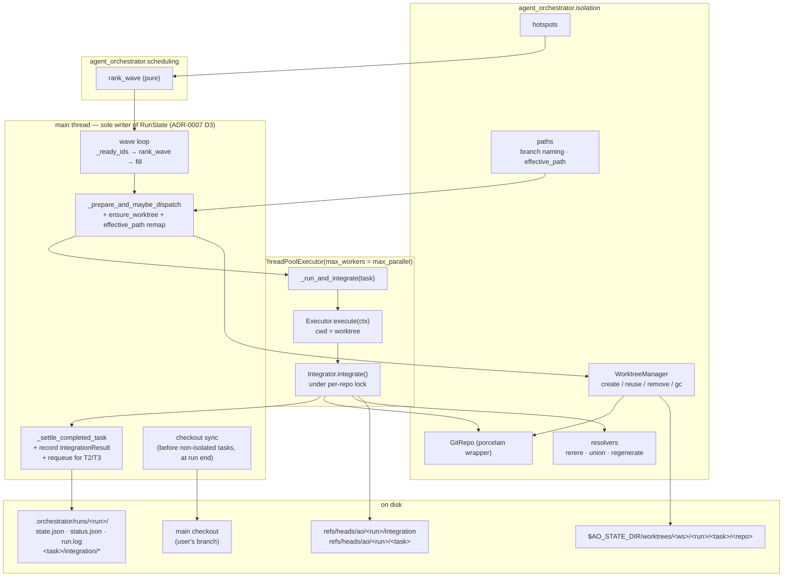
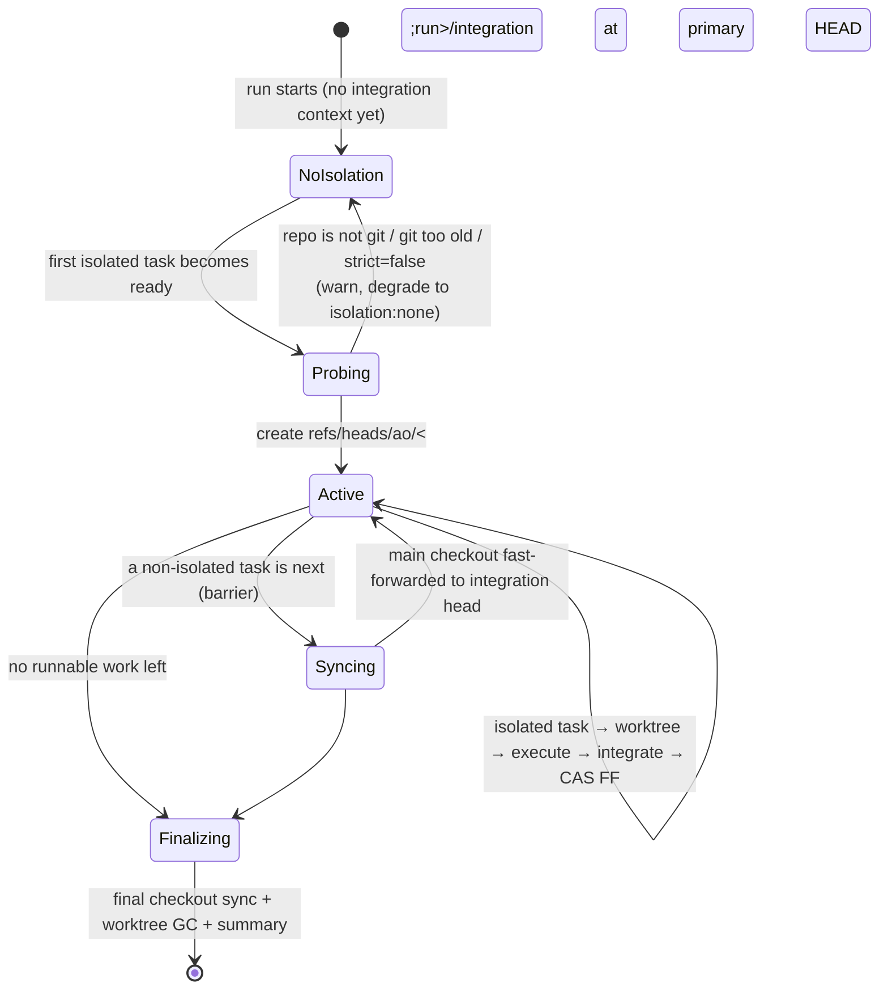
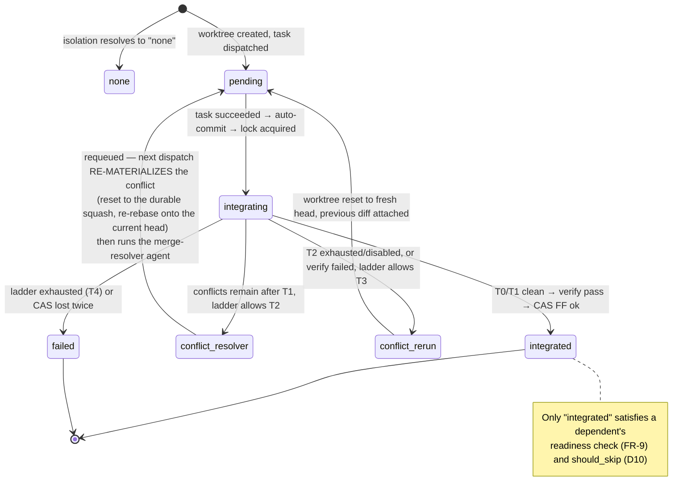

# Per-task git isolation & rebase-based integration — HLD/LLD (E-Wk9Tz3)

- Epic: [`E-Wk9Tz3-task-isolation`](../meta/tickets/E-Wk9Tz3-task-isolation/EPIC.md)
- Decision record: [`ADR-0013`](adr/ADR-0013-per-task-git-isolation-and-rebase-integration.md)
- Status: **Shipped (2026-09-07) — reconciled against the merged implementation.** See
  [§25 As-built deviations](#25-as-built-deviations-from-design-t-dr5yq6-2026-09-07) for every place the
  build differs from the design as first written, and §24 for the review-finding dispositions
  re-verified against merged code rather than against the tickets that claimed them.
- Date: 2026-09-06 (design) · 2026-09-07 (as-built reconciliation)
- Author: architect (agent)
- Related: [`ADR-0007`](adr/ADR-0007-parallel-task-execution.md) (wave/barrier scheduler — this epic closes its
  documented write-conflict gap) · [`parallel-execution-hld.md`](parallel-execution-hld.md) §11/§12 ·
  [`hld-agent-orchestrator.md`](hld-agent-orchestrator.md) (NFR-1 context hygiene) ·
  [`lld-agent-orchestrator.md`](lld-agent-orchestrator.md) · [`granular-task-decomposition-hld.md`](granular-task-decomposition-hld.md) ·
  [`workflow-templates-hld.md`](workflow-templates-hld.md) (`routed-runner` breakdown contract) ·
  [`meta/ROADMAP.md`](../meta/ROADMAP.md) §3.4 / §4 (the gap this closes) ·
  `docs-md/scheduler-triggers-hld.md` + ADR-0014 *(concurrent epic, not touched by this design)*

> **Review status (2026-09-07).** Two pre-implementation gates completed:
> [`REVIEW-design-2026-09-07.md`](../meta/tickets/E-Wk9Tz3-task-isolation/REVIEW-design-2026-09-07.md)
> (APPROVE WITH CHANGES — 6 Blocking / 11 Major / 7 Minor) and
> [`REVIEW-security-design-2026-09-07.md`](../meta/tickets/E-Wk9Tz3-task-isolation/REVIEW-security-design-2026-09-07.md)
> (conditional pass — 2 Blocking / 3 Major). **Phase 1 of the amendment pass is applied**: everything the
> two dependency-free tasks (`T-Gt4Pw8`, `T-Sc7Rm2`) need to be implementable correctly — S-1 (git-hook
> suppression), scoped worktree pruning (R-6), release-on-failure porcelain semantics (R-23), and the
> schema/model fields required by the R-1 / R-3 / R-5 / R-21 / S-2 / S-3 / S-5 / S-6 fixes so the schema
> is not reopened later. Phase 2 (every remaining Blocking/Major finding) was applied before the
> dependent tickets started. §24 records every finding's disposition, **re-verified against merged code
> on 2026-09-07** — three rows were re-dispositioned in that pass because what shipped was not what the
> owning ticket claimed.
>
> Line references in the pre-`§25` body are from the **2026-09-06 design snapshot** (`engine.py` @ 2204
> lines, `models.py` @ 586, `artifacts.py` @ 218, `runstate.py` @ 245, `cli.py` @ 1620) and are
> historical: they name the code the design was written *against*, not the code that shipped. Treat a
> `file.py:NNN` reference as "the function named nearby", not as a current line number. Symbol names,
> flags, defaults, ref names, file paths and event names outside §11 M9's event list **were** re-verified
> against merged code on 2026-09-07.

---

## 1. Problem

`max_parallel > 1` (ADR-0007) dispatches up to N ready tasks concurrently **into one shared working
tree**. `engine.py:304-305` computes `repo_paths` exactly once per run:

```python
repo_set   = reposets[workflow.repo_set]
repo_paths = {r.id: self._store.resolve(r.path) for r in repo_set.repos}
```

and every task, on every worker thread, receives that identical dict. There is no per-task working
directory, no branch, and no write-conflict detection anywhere in `src/` (a full sweep for
`git|worktree|branch|stash` finds git machinery only in `bench/swebench_provider.py`, `_version.py`
and the dashboard's ignore lists — the engine itself has none). ADR-0007 shipped `max_parallel` **without** any write-conflict
mechanism — its Consequences section addresses only executor thread-safety and log interleaving, and
neither it nor `parallel-execution-hld.md` claims otherwise. The characterization that keeping
co-scheduled tasks' outputs disjoint is the spec author's responsibility is `meta/ROADMAP.md` §4's
("keeping them disjoint is the spec author's job (ADR-0007)"), and §4 also records that this has
already failed in the field. (R-10: an earlier draft of this document and of ADR-0013 presented that
sentence as a verbatim ADR-0007 quotation; it is not, and the attribution is corrected here.)

Field evidence from the primary consumer (`../ao-runner-finplan`, read-only reference):

- One clone (`fin_plan/`), one branch (`epic/<epic-id>`), up to **101 injected tasks**, `max_parallel: 4`.
  Every `impl*`/`test*` agent runs `git -C fin_plan commit && push` on that same branch.
- A live run produced real contention on `src/server/fin_rust/src/apis/accounts.rs` (23 commits
  lifetime, 18 in the last six months — a genuine top-10 hotspot), survived only because an **agent**, acting on
  a self-heal retry, ran `git stash` in the shared checkout — something their own
  `PARALLEL_DEVELOPMENT_GUIDELINES.md` §6.4 explicitly forbids ("never run a bare `git stash` in a
  shared worktree — the stash stack is shared"). To be precise (R-17): this repo's `monitoring.py`
  self-heal subsystem does **not** run git commands; it re-dispatches a task, and it was the
  re-dispatched agent that reached for `git stash`. The lesson is about the shared checkout, not
  about the monitor.
- The breakdown agent is already **paying for the missing isolation in serialization**: across 18 real
  manifests, most `impl1-<tid>` entries carry an extra cross-task `depends_on` purely to avoid
  collisions (`e-yqqn8h`: 14 of 15; `e-u511z1`: 15 of 20). Its own `tasks.md` says why: *"The design
  mandates P0 → P1 → P2 sequential (they touch overlapping core Rust files)."*
- Their `PARALLEL_DEVELOPMENT_GUIDELINES.md` §8 names this exact epic as unbuilt orchestrator work.

**The payoff to buy with this epic is not "fewer conflicts" — it is "the breakdown agent can stop
serializing tasks it only serialized out of fear."**

---

## 2. Goal and non-goals

**Goal.** Give each parallel task its own git worktree on its own branch, integrate the results back
onto a run-scoped integration branch by *squash → rebase → verify → fast-forward* under a lock, and
resolve the conflicts that result through a cost-ordered ladder that only escalates to paid agent
work when free mechanical repair fails. Bias task assignment towards low-overlap co-scheduling with
**soft hints only** — never a gate.

**Non-goals (this epic).**
- Hard overlap gating, mandatory file-ownership declarations, or refusing to co-schedule.
- Copy-based isolation for non-git workspaces (`isolation: copy` — enum value reserved, not built).
- Container/VM sandboxing (that is ROADMAP §3.1 "per-run sandboxing", a different trust boundary).
- Distributed or multi-machine execution.
- A dashboard UI for conflicts beyond the fields that fall out of `status.json`.
- Changing anything in `../ao-runner-finplan` (read-only reference; consumer-side adoption is a
  follow-up ticket in **that** repo).

---

## 3. Requirements

### 3.1 MVP functional requirements

| ID | Requirement |
|---|---|
| **FR-1** | A task may declare `isolation: none \| worktree \| inherit` (default `inherit`); a workflow may declare `defaults.isolation: none \| worktree` (default `none`). Backward compatible: an unchanged spec behaves byte-identically to today. |
| **FR-2** | An isolated task runs in a git worktree created at dispatch time from the **current integration head**, on branch `ao/<run_id>/<task_id>`, with worktrees stored **outside every working tree** under an ao-owned state dir. |
| **FR-3** | Multiple `RepoRef`s that resolve into the same git repository share **one** worktree; distinct git repositories in a reposet each get their own worktree and branch. |
| **FR-4** | Every path handed to an isolated task (instruction, general instructions, inputs, outputs, output manifest, repo paths, cwd) is mapped through a deterministic `effective_path` function into that task's worktree when — and only when — it resolves inside an isolated repository, excluding ao-reserved shared prefixes. |
| **FR-5** | At task end the engine auto-commits the worktree (`git add -A` + commit, message built from **ids and paths only**, never file contents — NFR-1). |
| **FR-6** | Integration is *squash → rebase onto integration head → verify → compare-and-swap fast-forward of the integration ref*, serialized by a per-repository lock (in-process + cross-process `flock`). |
| **FR-7** | Conflicts are resolved by a tiered ladder: **T0** git auto-merge → **T1** deterministic mechanical resolvers (`rerere` replay, union merge for registry-style globs, regenerate for lockfiles) → **T2** a bounded LLM merge-resolver dispatch → **T3** re-run the task on the fresh base with its previous diff attached → **T4** fail the task. Each tier is configurable, observable, and budget-accounted. |
| **FR-8** | Every integration runs a **verify step** before the fast-forward. Default is a zero-cost structural check (leftover conflict markers / `git diff --check` over the changed paths); `integration.verify_command` replaces it with an argv command run in the task worktree. Verify failure enters the ladder at T3 (bounded by `max_reruns_per_task`), then T4. |
| **FR-9** | A dependent task may only dispatch after its predecessors are **integrated**, not merely `succeeded`. |
| **FR-10** | A task may declare `touches: [glob]` — a **soft** hint. The wave scheduler prefers co-scheduling tasks whose `touches` (and hotspot membership) do not overlap, deterministically, and **never** withholds a slot because of overlap. |
| **FR-11** | `ao hotspots` derives a hotspot list from git churn plus previously-observed conflicts, writes it as a workspace artifact, and feeds it to (a) the scheduler's ranking and (b) the breakdown agent as a declared input. |
| **FR-12** | A run whose repositories are not git repos, or whose git is too old, falls back to `isolation: none` with a logged warning — never a hard failure (unless `isolation.strict: true`). |
| **FR-13** | Non-isolated tasks in an isolation-enabled run are serial barriers, and the primary repo's main checkout is fast-forwarded to the integration head immediately before such a task dispatches, and once at run end. |
| **FR-14** | Worktrees, branches and refs created by a run are garbage-collected: after successful integration (`keep_worktrees: on_failure` default), on `ao prune`, and by an idempotent reconciliation pass at run start/resume. |
| **FR-15** | Structured events (`worktree.*`, `integration.*`), `TaskRunState`/`RunState` fields and `status.json` keys make the whole integration path traceable end-to-end. |
| **FR-16** | Ship a **conflict-friendly coding rules** instruction file, injectable through the existing `general_instructions` mechanism, plus `routed-runner` template wiring so the breakdown agent emits `touches` and per-task `isolation`. |

### 3.2 MVP non-functional requirements

| ID | Requirement |
|---|---|
| **NFR-1** | Context hygiene is preserved: the orchestrator core never reads artifact/instruction/conflict **contents**. Mechanical resolvers act via `git` subprocesses; conflict context reaching an agent is a manifest of *paths and refs*. |
| **NFR-2** | `max_parallel == 1` **and** `isolation: none` is byte-identical to today (blocking regression gate — the existing engine suite must pass unedited). |
| **NFR-3** | The engine core stays single-writer (ADR-0007 D3): only worker threads touch git; only the main thread mutates `RunState` and calls `save`. |
| **NFR-4** | Every git operation is bounded (timeout) and idempotent enough to be re-attempted after a crash; no step leaves a repository in a state that a resume cannot recover from mechanically. |
| **NFR-5** | Additive schema/state changes only; an old `RunState` loads, and a new `RunState` is readable by tolerant older code (pydantic `extra="ignore"`). |
| **NFR-6** | Disk cost is bounded and understood: worktrees copy **tracked files only** (an ignored 105 GB `target/` is *not* duplicated); the cold-rebuild cost is addressed by an explicit shared-build-cache recipe, not ignored. |

### 3.3 Explicitly non-MVP (reserved, not built)

`isolation: copy` for non-git workspaces · merge-commit integration strategy (enum value reserved) ·
speculative/optimistic parallel integration (Zuul-style) · a `integration_conflicts` circuit-breaker
condition · cross-repo atomic integration · per-task container sandboxes · learning `touches` from
observed diffs and feeding them back automatically · a conflict UI in the dashboard.

---

## 4. Landscape survey (branch-per-agent isolation & conflict handling)

| System | Isolation | Integration | Conflict handling | What we take |
|---|---|---|---|---|
| **Claude Code worktree mode** | `git worktree` per session: separate checkout, shared object store, one branch per agent | **Manual** — the human merges or opens a PR | None automated | The isolation primitive itself, and its cheapness (tracked files only). The gap is precisely the *integration* half — that is this epic. |
| **Cursor background agents** | Isolated cloud VM per agent, branch per agent | Agent opens a PR; a human reviews and merges | GitHub's own conflict UI; agent may be asked to rebase | Branch-per-agent + "the artifact is a branch, not a working tree" is the industry norm. But a PR-per-task loop is far too slow for a 100-task epic run. |
| **OpenHands / Devin-style** | Container/VM workspace per agent | Branch/PR; Devin exposes "resolve merge conflicts" as an agent capability | LLM-driven conflict resolution as an explicit, bounded action | Validates **T2**: an agent resolving a conflict is a normal, bounded task — not exotic. It must be budgeted and capped. |
| **CI merge queues** (Bors, GitHub merge queue, Zuul) | None — candidates are branches | **Serialized**: rebase/merge each candidate onto the queue tip, run required checks on the *post-merge* tree, then land | Failing candidate is **ejected**; the queue re-tests the rest. Zuul speculates ahead in parallel | Three things: (1) serialize the *landing*, parallelize the *work*; (2) verify the **post-merge** tree, never the pre-merge one; (3) an ejection policy is mandatory. Our T3/T4 are ejection — with the twist that we can first try to *repair* the candidate. |
| **git primitives** | — | — | `rerere` (replay recorded resolutions), `merge=union` driver, `merge-tree --write-tree` (worktree-free merge probe, git ≥ 2.38) | The whole of **T1**, plus a free "how hard is this rebase" oracle for telemetry. |

**What applies, condensed.** Branch-per-agent is settled practice; nobody in the agent space automates
the *repair* loop inside the run — that is where this design differentiates. Merge queues supply the
correctness discipline (serialize landing, verify post-merge, define ejection). Git supplies enough
mechanical machinery that most agent-generated collisions — append-only registries, lockfiles,
repeated identical resolutions — never need to reach an LLM.

**Positioning.**
```
We will:
- Match Claude Code / Cursor in per-agent worktree isolation (branch + private checkout, shared objects)
- Match a CI merge queue in landing discipline (serialized, verify the post-merge tree, explicit ejection)
- Beat all of them in in-run repair: a conflict is repaired by a bounded, budgeted ladder instead of
  waiting for a human PR review
- Beat Cursor/Devin in operational simplicity: no VM, no container, no hosted service — `git worktree`
  plus one lock in the existing single-process engine
- Avoid the complexity of Zuul-style speculative execution, hard overlap gating, and mandatory
  file-ownership manifests
```

---

## 5. Locked design decisions

Recorded here so the implementation has one place to check itself. Rationale lives in ADR-0013.

| # | Decision |
|---|---|
| **D1** | Worktree per task per **git repository**, branch `ao/<run_id>/<task_id>`, created at **dispatch time from the current integration head** (not at run start). |
| **D2** | Worktrees live **outside every working tree**: `$AO_STATE_DIR/worktrees/<workspace_key>/<run_id>/<task_id>/<repo_key>` (default `~/.local/state/ao/`), env-overridable. Never inside the workspace root. |
| **D3** | Integration = squash to one commit → `git rebase --onto <head> <base>` → resolve ladder → verify → **atomic CAS** `git update-ref <integration_ref> <new> <expected_old>`. Serialized per repository. |
| **D4** | The integration branch is an ao-owned ref `ao/<run_id>/integration`, created lazily at the first isolated dispatch from the primary repo's current `HEAD`. It is **never checked out**, so ref moves can never fail on a dirty tree. |
| **D5** | The user's main checkout is fast-forwarded to the integration head **on demand** — immediately before a non-isolated task dispatches, and once at run end. Non-isolated tasks are **barriers** whenever the run has an integration context. |
| **D6** | Structural tasks (`emit_tasks`, router, loop-gate) default to `isolation: none` — they are already barriers and usually need the shared checkout (e.g. `git-branch-off`). |
| **D7** | Isolation isolates **source**, not build caches. `isolation.env` injects per-repo env (e.g. a shared `CARGO_TARGET_DIR`); cargo's own lock on the target dir makes sharing safe-but-serializing. Documented, not hidden. |
| **D8** | `touches` is a **soft** hint. `rank_wave` is a pure, deterministic function that reorders the ready set within `max_parallel`; it never withholds a slot. At `N == 1` it is a provable no-op. |
| **D9** | The T2 merge-resolver is **not** a new injected DAG node. It is an extra *attempt of the same task* dispatched with a substituted agent + instruction, so budget gating, cost accumulation and `task_cost_usd` breakers all apply with zero new plumbing. |
| **D10** | A dependent dispatches only after its predecessors are **integrated** (FR-9), and `should_skip` for an isolated task additionally requires `integration_status == "integrated"`. |

---

## 6. HLD

### 6.1 Block diagram



### 6.2 Where things live on disk

```
<workspace_root>/                       # unchanged; may or may not be a git repo
  .ao/config.yaml                       # + isolation: block
  .orchestrator/runs/<run_id>/          # unchanged; NEVER inside a worktree
    state.json  status.json  run.log
    <task_id>/attempt-<n>/              # unchanged agent capture
    <task_id>/integration/              # NEW
      attempt-<n>/verify.{stdout,stderr,exit}
      conflict-<n>.json                 # paths + refs only (NFR-1)
      previous-<n>.patch                # T3 input
      merge-resolve.md                  # copy of the builtin resolver instruction
  <repo paths ...>                      # main checkout(s), user-owned

$AO_STATE_DIR/                          # default ~/.local/state/ao   (XDG_STATE_HOME aware)
  worktrees/<workspace_key>/<run_id>/<task_id>/<repo_key>/   # the private checkouts (mode 0700)
  runlocks/<workspace_key>.lock                              # the per-workspace run lock (§12.3)
  empty-hooks/                                               # the always-empty core.hooksPath dir (S-1)
  # As-built: the designed `worktrees/<workspace_key>/index.json` GC-bookkeeping file was NEVER built
  # and is not needed. GC works off what is actually on disk plus the run's own state: `reconcile()`
  # and `gc_run()` enumerate registered worktrees under this run's prefix, and `ao prune` discovers
  # repos by probing the surviving worktree directories. That is also why `ao prune` has the two
  # discovery limitations recorded in §11 M9 and §25 D-6.

<git repo>/.git/
  refs/heads/ao/<run_id>/integration    # the integration ref — never checked out
  refs/heads/ao/<run_id>/<task_id>      # one per isolated task per repo
  refs/ao/runs/<run_id>/<task_id>/squash-<n>   # keeps superseded squashes alive for T3
  rr-cache/                             # rerere, shared across worktrees by design
  info/exclude                          # ao appends `.orchestrator/` (never edits .gitignore)
```

`workspace_key` = a stable, filesystem-safe digest of the resolved workspace root
(`sha256(root)[:12]` prefixed by the sanitized basename), so two workspaces never collide and the
path stays humanly recognizable.

**Why outside the workspace.** A worktree under `<workspace_root>/.ao/worktrees/` would put N full
copies of the source tree *inside* the tree the agents search. Every `grep`/`rg`/glob in the main
checkout would match N duplicates, `git status` in the main checkout would be permanently noisy, and
a non-isolated task's `git add -A` could sweep them in. The cost of moving out is one explicit,
audited widening of the artifact path guard (§7.3) — a much smaller price.

### 6.3 Run-level lifecycle



### 6.4 Per-task integration state machine



---

## 7. Path, repo and artifact model

### 7.1 RepoRef is not a git repository

`specs/reposet.schema.json` lets a reposet list several `RepoRef`s that resolve into the *same* git
repository, or into no repository at all. The real consumer does exactly this:

```json
"repos": [ { "id": "core", "path": "./fin_plan",          "role": "primary" },
           { "id": "docs", "path": "./fin_plan/docs-md",  "role": "support" } ]
```

`docs` is a subdirectory of `core`. There is **one** git repository. Therefore:

```
FUNCTION group_repos(repo_paths) -> list[IsolatedRepo]:
  groups = {}                              # common_dir -> IsolatedRepo
  FOR repo_id, abs_path IN sorted(repo_paths.items()):        # sorted => deterministic
    probe = git_probe(abs_path)            # rev-parse --show-toplevel / --git-common-dir
    IF probe is None:                      # not a git repo
      RECORD non_git(repo_id); CONTINUE
    g = groups.setdefault(probe.common_dir,
          IsolatedRepo(key=slug(basename(probe.toplevel)) + "-" + sha256(probe.common_dir)[:8],
                       toplevel=probe.toplevel, common_dir=probe.common_dir, members=[]))
    g.members.append(RepoMember(repo_id=repo_id,
                                rel=relpath(abs_path, probe.toplevel)))   # "" for the toplevel itself
  RETURN sorted(groups.values(), key=lambda g: g.key)          # deterministic lock order
```

One worktree, one branch, one lock per `IsolatedRepo`. `repo_paths` handed to an isolated task become
`{member.repo_id: join(worktree_root, member.rel)}`.

**Edge cases.** A repo path that is a git *submodule* is its own repository (`--show-toplevel` returns
the submodule) → its own worktree; superproject/submodule co-ordination is **out of scope** and
detected + warned (`worktree.submodule_unsupported`). A repo path inside a worktree of another repo
is rejected at validation (`SpecValidationError`) — reposets must point at real checkouts.

### 7.2 `effective_path` — the one remapping rule

```
RESERVED_SHARED_PREFIXES = { "<workspace_root>/.orchestrator", "<workspace_root>/.ao" }

FUNCTION effective_path(resolved_abs: str, task_iso: TaskIsolation | None) -> str:
  IF task_iso is None:            RETURN resolved_abs        # not isolated -> unchanged
  IF under_any(resolved_abs, RESERVED_SHARED_PREFIXES): RETURN resolved_abs   # run state stays shared
  FOR repo IN task_iso.repos (longest toplevel first):       # innermost repo wins
    IF resolved_abs == repo.toplevel OR under(resolved_abs, repo.toplevel):
      RETURN join(repo.worktree_root, relpath(resolved_abs, repo.toplevel))
  RETURN resolved_abs                                        # outside every isolated repo -> shared
```

Pure, total, deterministic, and unit-testable without git. It is applied uniformly to
`instruction_path`, `general_instruction_paths`, `input_paths`, `output_paths`,
`output_manifest_path`, `repo_paths` and `cwd` — **but never** to `task_manifest_path`,
`gate_output_path` or `output_dir`, which live under `.orchestrator/` and are read back by the engine.

> **R-15 — do not invert these two.** `output_manifest_path` (`TaskSpec.output_manifest`) is written by
> the **agent** and lists produced artifacts, so it lives in the worktree and **is** remapped.
> `task_manifest_path` (`TaskSpec.task_manifest_path`) is the `emit_tasks` manifest the **engine**
> reads back to inject tasks, so it stays shared and is **not** remapped. The names differ by one word.
> Every `effective_path` call site must carry an inline comment saying which of the two it is handling.

**Why this rule fits the real consumer.** In `ao-runner-finplan`, `workspace_root` is the runner root
(*not* a git repo) and all task artifacts live at `workflows/epic-runner/runs/<id>/outputs/...` —
outside every repo. Code changes live in `./fin_plan` — inside a repo. The containment rule therefore
splits exactly along the line the consumer already draws by hand: **artifacts stay shared; code is
isolated.** No spec change is needed to get that behaviour.

### 7.3 Widening the artifact path guard (security-relevant)

`LocalFsArtifactStore.resolve` (`artifacts.py:57-67`) resolves against a single root and rejects
anything that escapes it after symlink resolution. A worktree outside the workspace root would be
rejected.

**Normative shape: a per-task wrapper, never a widened shared store (R-16).** The engine constructs
exactly one `LocalFsArtifactStore` and hands the *same instance* to the estimator, the monitor, the
breakers **and** `RunStateStore` (`cli.py`: `store = LocalFsArtifactStore(workspace);
rs_store = RunStateStore(workspace, store)`). Widening that instance's roots — even via a constructor
parameter — would silently widen run-state resolution too, violating rule 3 below. So the widening is
a **wrapper**, and mutating `LocalFsArtifactStore` is explicitly **not** the design:

```
class IsolatedArtifactView(ArtifactStore):          # NORMATIVE
    """Per-task view. Built once per dispatch, from THIS task's TaskIsolation only."""
    def __init__(self, base: ArtifactStore, task_iso: TaskIsolation):
        self._base  = base
        self._iso   = task_iso
        # rule 5: exactly this task's own worktree roots — never the WorktreeManager's registry
        self._roots = tuple(sorted(r.worktree_root for r in task_iso.repos))

    def resolve(self, path):
        full = self._base.resolve_unchecked(path)   # abspath + symlink resolution, no containment
        if full == self._base.root or full.startswith(self._base.root + os.sep):
            return effective_path(full, self._iso)  # inside the workspace: remap if repo-contained
        for root in self._roots:                    # already-absolute worktree path
            if full == root or full.startswith(root + os.sep):
                return full
        raise ArtifactPathError(path)

    def exists(self, path): ...   # delegates through self.resolve
    def size(self, path):   ...
```

**As-built (T-Wk3Nv6, merged 2026-09-07) — this is the shape to build against.** The wrapper shipped
as `isolation/view.py::IsolatedArtifactView(base: LocalFsArtifactStore, task_isolation: TaskIsolation)`.
`LocalFsArtifactStore` gained **no** `extra_roots` parameter: it gained only a read-only
`resolve_unchecked(path)` (abspath + symlink resolution, no containment test) and a `root` property,
both used **solely** by the view. `resolve()`'s own guard is byte-for-byte unchanged. The view keeps its
own private `_roots` tuple built from `task_isolation.repos[*].worktree_root`. Anywhere below that says
"`extra_roots`", read "the view's private `_roots`".

Rules that keep this safe:
1. The view's roots are **never** taken from a spec file, a manifest, or an agent. The only producer is
   `WorktreeManager` (via the `TaskIsolation` it returns), and the only values are worktree roots it
   just created under `$AO_STATE_DIR`.
2. Traversal is still rejected: abspath + symlink resolution happens *before* the containment test, so
   `../` and symlink escapes fail exactly as today.
3. The store used for **run state** (`RunStateStore`) keeps the un-widened root, so no run-state path
   can ever be steered into a worktree. This is structural, not conventional: `RunStateStore` is
   handed the base store, and an `IsolatedArtifactView` is never installed on it.
4. `$AO_STATE_DIR` is validated to be absolute and outside every repo toplevel at construction;
   otherwise isolation degrades to `none` with `worktree.unsafe_state_dir`.
5. **Per-task scoping is the security property, not merely producer-restriction (S-4).** A task's view
   is built from **that task's own** `task_iso.repos[*].worktree_root` and nothing else — never from
   the `WorktreeManager`'s full registry of every worktree it has created for the run. If it were built
   from the registry, task A could declare an **absolute** input/output/`cwd` path under task B's
   worktree and read B's uncommitted work, or *write into it* — laundering content through a sibling
   that never asked for it and whose own verify step would then run against tampered input. This must
   have its own test, distinct from the producer-restriction test: *"an absolute path under task B's
   worktree, submitted as an input, output or `cwd` for task A, raises `ArtifactPathError` from task
   A's view."*

### 7.4 Artifact visibility rules (the part that is easy to get wrong)

| Check | Where it runs | Why |
|---|---|---|
| **Pre-dispatch** `should_skip` (`runstate.py:156`) | shared/main root, **with the integration gate applied to BOTH of its branches** | See R-3 below — this is the single easiest thing in the epic to half-fix. |
| **Pre-dispatch** missing-input gate (`engine.py:552`) | through the task's `IsolatedArtifactView` | An input produced by an integrated predecessor is present in a worktree created from the post-integration head. |
| **Post-execution** missing-output check | **on the worker thread, through the isolated view, BEFORE `Integrator.integrate()` is called** (R-2) | See R-2 below. |
| **Post-integration** output check | **as-built: skipped entirely for an isolated task** (deviation 3, §25). For a non-isolated task it is the pre-epic main-thread check, unchanged. | The worker's gate above is authoritative for an isolated task; see the as-built callout under R-2. |

**R-2 — the missing-outputs check must gate integration, and today's code cannot do that.** The real
check lives in `_settle_completed_task` (`engine.py:1122-1138`), which is **main-thread only** and by
construction runs *after* the worker — including, under this design, after the worker's own
`integrate()` call. So a task that "succeeds" at the executor level but never wrote a declared output
would **land** on the shared integration ref, become visible to dependents through FR-9's `integrated`
gate, and only then be marked `failed` — with no undo, because T4's "retain, don't land" semantics were
never reached. The fix: `_run_and_integrate` performs the missing-outputs check itself, through the
task's isolated view, and calls `integrate()` **only** when it passes; a failure returns
`WorkerOutcome(result, None, missing_outputs=[...])` and the main-thread check in
`_settle_completed_task` stays exactly as it is (it will re-run and reach the same verdict, so the
existing non-isolated path is byte-identical — NFR-2).

> **As-built (deviation 3, §25) — the parenthesis above is false, and the table's ordering never
> shipped.** "It will re-run and reach the same verdict" holds only when a task's declared outputs live
> *outside* every isolated repo (the consumer's own convention, which is why the claim survived design
> review). For a task that declares an **in-repo** output, the main thread resolves that path against
> the shared checkout, where the output does not exist until the barrier sync — so the run **halted
> `failed` on a task whose code had demonstrably landed** (`ti.status == "integrated"`, verifiable with
> `git show`). `T-En8Hd4`'s reviewer reclassified the developer's own "documented limitation" as a
> blocking defect and it was fixed by making the worker's gate authoritative: for an isolated task the
> main-thread `self._store.exists()` verdict is **discarded**, not re-run. The non-isolated path is
> untouched and still byte-identical (NFR-2). The table row's original "after the checkout sync"
> ordering was therefore never implemented, and is corrected in the table above.

**R-3 — `should_skip` has two independent branches and the consumer exercises the second one.**
`runstate.py:156-172`:

```python
if ts and ts.status == "succeeded":                       # branch 1
    if not task.outputs or all(self._store.exists(o) for o in task.outputs):
        return True
if task.skip_if_outputs_exist and task.outputs:           # branch 2 — NO ts.status check at all
    if all(self._store.exists(o) for o in task.outputs):
        return True
```

`should_skip` runs on **every wave** (`engine.py:527`), not only at `ao resume`. A task parked in
`conflict_resolver`/`conflict_rerun` has `ts.status == "pending"` (so branch 1 does not fire) while its
declared output — written during the original execution, before the conflict was discovered — already
exists on disk. The consumer sets `skip_if_outputs_exist: true` on **every** fan-out entry, so branch 2
fires, marks the task `"skipped"` (`engine.py:534`), and adds it to `ctx.done` — and because
`_settled_for_dependents` treats `"skipped"` as settled, every dependent then proceeds as though this
predecessor's code had landed. It never did. **The integration gate must be applied to both branches**,
and the regression test must target branch 2 specifically, because that is the one the field-observed
usage pattern actually exercises.

> **As-built (deviation 4, §25) — the gate is at the call site, not inside `should_skip`.**
> `runstate.py::should_skip` was **not edited**: it is byte-identical to its pre-epic form, both
> branches included. The integration gate ships as `Orchestrator._integration_allows_skip(tid, state)`
> and is AND-ed in at the engine's single call site
> (`if self._runstate.should_skip(task, state) and self._integration_allows_skip(tid, state)`), which
> is why it covers both of `should_skip`'s branches for free — the requirement R-3 states is met, by a
> different construction than "edit `should_skip`". The rule is exactly: `ti is None` or
> `ti.isolation == "none"` → skipping is allowed (pre-epic behaviour, NFR-2); otherwise skipping
> requires `ti.status == "integrated"`. The sibling readiness rule (FR-9) is
> `_settled_for_dependents`, same file, same shape.

| **Untracked/ignored declared outputs** | copied back | After a successful integration, any declared output that exists in the worktree but is not tracked by git is copied to its shared path (`integration.untracked_outputs: copy \| fail \| ignore`, default `copy`), emitting `integration.artifact_copied`. Without this, a declared output under an ignored `build/` or `output/` directory would silently vanish. |

---

## 8. The integration protocol

### 8.1 Sequence — happy path (T0)

```mermaid
sequenceDiagram
    autonumber
    participant M as main thread
    participant W as worker thread
    participant WM as WorktreeManager
    participant G as git (subprocess)
    participant I as Integrator

    M->>WM: ensure_worktree(run, task, repos, base = integration head)
    WM->>G: worktree add -b ao/<run>/<task> <path> <base>
    G-->>WM: ok
    M->>M: remap paths (effective_path), ts.status = running, save()
    M->>W: submit _run_and_integrate(task)
    W->>W: _run_with_retries → Executor.execute(cwd = worktree)
    W->>I: integrate(task, worktrees, base)
    I->>G: add -A && commit  (auto-commit; ids/paths only)
    I->>I: acquire per-repo lock (threading.Lock + flock)
    I->>G: rev-parse refs/heads/ao/<run>/integration   → head
    I->>G: commit-tree <tip^{tree}> -p <base> -m <msg> → squash
    alt head == base
        I->>I: nothing to replay
    else
        I->>G: rebase --onto head base ao/<run>/<task>
        G-->>I: clean
    end
    I->>I: verify (default: conflict-marker + diff --check scan)
    I->>G: update-ref refs/heads/ao/<run>/integration <new> <head>   (CAS)
    G-->>I: ok
    I->>I: release lock
    I-->>W: IntegrationResult(status=integrated, tier=0)
    W-->>M: TaskResult + IntegrationResult
    M->>M: record integration state, copy untracked outputs, save()
    M->>WM: release_worktree(task)   (keep_worktrees = on_failure → remove)
```

**Why CAS and not `merge --ff-only`.** The integration ref is never checked out (D4), so it can be
moved with `git update-ref <ref> <new> <expected_old>`, which **fails atomically** if another
integrator moved it. That converts "the head moved under me" from a corruption risk into a clean,
retryable error — and it works across processes (a second `ao` run on the same repo), which a
working-tree merge does not.

**Lock-lost handling (R-7 — scoped, not global).** If a CAS fails (head moved between read and write —
only possible if a foreign writer bypassed the lock, or a second `ao` process is running), the
integrator retries **only the repository whose CAS lost**, once, against that repo's new head. It must
**never** re-run step 3 for a repo whose CAS already succeeded in the same pass: re-squashing an
already-landed repo produces a new attempt-numbered commit message → a new sha → a spurious duplicate
commit for content that is already there. A second loss on the same repo is
`IntegrationResult(status="failed", reason="ref_race")` → T4. Before retrying, the integrator checks
`is_ancestor(candidate, new_head)`: if the candidate is already an ancestor, a previous process landed
it and the result is `integrated`, not a retry (this is also the crash-recovery path, §12.1).

### 8.2 Squash mechanics (exact)

```
base   = ts.integration.base_commit                       # recorded at worktree creation
tip    = git -C wt rev-parse HEAD
# R-8: "Empty" needs the task's DECLARED OUTPUTS, because a task can leave the tree at `base` and
# still have produced a git-ignored declared output that must be copied back (§7.4). The declared
# output list is carried on `TaskIsolation.declared_outputs`, populated by WorktreeManager.ensure()
# at dispatch time (the one place that already has the TaskSpec). This is the authoritative wording;
# §11 M4 step 1 says the same thing.
IF tip == base AND worktree_clean AND no_untracked_declared_outputs:
    RETURN Empty                                          # task changed no repo file -> no-op integrate
# S-3: the ENGINE is the actor here, not the agent, so it screens what it sweeps.
untracked = git -C wt status --porcelain (untracked entries only)   # already-tracked files are the
                                                                    # repo author's decision, not ours
hits      = [p for p in untracked if matches_any(p, integration.commit_denylist)]
IF hits AND on_denylisted_path == "fail":  RETURN failed(reason="denylisted_path", paths=hits)
IF hits AND on_denylisted_path == "warn":  LOG integration.denylisted_path {paths: hits}
IF integration.auto_commit:
    git -C wt add -A                                      # respects .gitignore; run state is elsewhere
    IF anything staged: git -C wt commit -m <auto message>
tip    = git -C wt rev-parse HEAD
squash = git -C wt commit-tree "${tip}^{tree}" -p base -m <squash message>
git -C wt reset --hard squash                             # branch is now exactly base + 1 commit
git update-ref refs/ao/runs/<run>/<task>/squash-<n> squash # keep alive for T3 / audit
```

`commit-tree` is used instead of `rebase -i`/`merge --squash` because it is a single deterministic
plumbing call with no index or editor involvement, and it makes the "one task = one commit" invariant
structural rather than procedural. Message template (`integration.commit_message_template`), default:

```
ao(<task_id>): <run_id>

AO-Run-Id: <run_id>
AO-Task-Id: <task_id>
AO-Agent: <agent_id>
AO-Base: <base_commit>
AO-Attempt: <n>
```

Only ids and commit shas — **no file contents are read by the orchestrator** (NFR-1).

### 8.3 Verify

- Runs in the task worktree **after** the rebase, so the tree under test is byte-identical to what the
  integration ref will point at (the merge-queue lesson: test the post-merge tree).
- `integration.verify_command: [string]` is an **argv list**, never a shell string
  (`verify_shell` is not offered in MVP). cwd = primary repo's worktree; env = process env +
  `isolation.env` + `AO_*`; timeout `integration.verify_timeout_seconds` (default 1800).
- stdout/stderr/exit are captured to `<run_dir>/<task_id>/integration/attempt-<n>/verify.*` and
  size-capped; only the exit code enters engine memory.
- **Default when unset** — a genuinely cheap, language-agnostic structural check:
  ```
  changed = git -C wt diff --name-only base..HEAD
  bad     = git -C wt grep -l -e '^<<<<<<< ' -e '^>>>>>>> ' HEAD -- <changed>   # -l: paths only, NFR-1
  ok      = (bad is empty) AND (git -C wt diff --check base..HEAD exits 0)
  ```
  This catches the single most common failure mode of an automatic resolution (a marker left behind)
  at zero cost and with no project-specific configuration.

### 8.4 The conflict-resolution ladder

Cost-ordered. `integration.ladder` is an ordered list, default `["auto", "mechanical", "llm", "rerun"]`;
removing an entry disables that tier.

| Tier | Name | Cost | Mechanism | Emits |
|---|---|---|---|---|
| **T0** | `auto` | free | `git rebase` succeeds; non-overlapping hunks merge themselves | `integration.rebased` |
| **T1** | `mechanical` | free | (a) `rerere` replay — every git call carries `-c rerere.enabled=true -c rerere.autoupdate=true`, so a resolution recorded once in this repo is replayed for free forever after (never written to the user's `git config`); (b) **union** merge for `integration.resolvers.union` globs (registries: `mod.rs`, `__init__.py`, `CHANGELOG.md`, barrel files) applied per-file over index stages, not via a global `merge` driver; (c) **regenerate** for `integration.resolvers.regenerate` entries (`{glob, command}` — lockfiles) | `integration.resolved` `tier=mechanical` `resolver=<rerere\|union\|regenerate>` |
| **T2** | `llm` | one bounded agent attempt | The task is **requeued**. At its next dispatch the engine first **re-materializes the conflict** (`Integrator.materialize_conflict` — see the callout below), then runs `integration.resolver_agent` with the builtin `merge-resolve` instruction, inputs = `conflict-<n>.json` (paths + refs only) and a genuinely mid-rebase worktree. On success the worker resumes `rebase --continue` → verify → CAS. Capped by `integration.max_resolver_attempts` (default 1) | `integration.resolver_dispatched` / `integration.resolved tier=llm` |
| **T3** | `rerun` | one full task attempt | Worktree `reset --hard` to the fresh integration head; the superseded squash is exported to `previous-<n>.patch` and added to the task's inputs; the original agent runs again on the clean base. Capped by `integration.max_reruns_per_task` (default 1). **Also the entry point for a verify failure** | `integration.rerun_dispatched` |
| **T4** | fail | — | `ts.status = failed`, integration state `failed`, branch + worktree retained (`keep_worktrees` forced to keep on failure), operator resolves and `ao resume` | `integration.failed` |

> **As-built (deviation 2, §25) — T2 re-materializes the conflict; it does not inherit it.** This
> table's T2 row, §6.4's state machine and §8.5's sequence originally described the resolver as
> running against a worktree "left mid-rebase" by T1's own conflict — i.e. state that *survived*
> from the first dispatch. That is not what ships, and could not be: `WorktreeManager.ensure()`
> (AC-10c, `T-Wk3Nv6`) unconditionally `git rebase --abort`s any reused worktree it finds
> mid-rebase, and it runs on the main thread before every redispatch — so it fires on every T2
> redispatch, before the resolver agent ever starts. The shipped mechanism instead **re-derives the
> conflict deterministically at T2 dispatch-prep time**: `Integrator.materialize_conflict` resets
> each repo's worktree/branch to the durable squash recorded for this attempt
> (`refs/ao/runs/<run>/<task>/squash-<n>`) and re-rebases it onto the integration head read **fresh
> under the per-repo lock**, re-running the T1 mechanical resolvers exactly as a first-time conflict
> would. Functionally equivalent — the resolver still finds a real mid-rebase worktree with real
> conflict markers — and strictly better in one case the original wording could not express: if the
> conflict **no longer reproduces** (the head moved and whatever landed in between no longer
> collides), no resolver is dispatched at all and no LLM budget is spent; `resume_integration`
> lands it directly. `T-Ib5Qy9`'s "left mid-rebase for T2" acceptance criterion is *superseded*,
> not contradicted — `resume_integration`'s mid-rebase-continuation path is still what lands the
> result, just entered from a freshly re-materialized state rather than an assumed-surviving one.

**Union resolver, precisely** (no global git config mutation, deterministic, NFR-1-safe):

```
FOR path IN conflicted_paths WHERE matches_any(path, union_globs):
    base_blob   = git -C wt show ":1:<path>"   -> tmp/base     # stage 1 (may be absent => /dev/null)
    ours_blob   = git -C wt show ":2:<path>"   -> tmp/ours     # stage 2
    theirs_blob = git -C wt show ":3:<path>"   -> tmp/theirs   # stage 3
    git merge-file --union -p tmp/ours tmp/base tmp/theirs > <wt>/<path>
    git -C wt add -- <path>
```
Contents flow through git subprocesses and temp files; nothing is read into orchestrator memory.

**Semantic conflicts.** Git only detects textual conflicts. Two tasks can each rebase cleanly and
still break together (task A renames a function, task B adds a caller). That is exactly what §8.3's
verify step exists for, and why it runs on the **post-rebase** tree. A verify failure is not a
conflict — it enters the ladder at **T3** (re-run on the fresh base, where the agent can *see* the
other task's landed change), and on exhaustion goes to **T4**.

### 8.5 Sequence — T1 → T2 → T3 escalation

```mermaid
sequenceDiagram
    autonumber
    participant M as main thread
    participant W as worker
    participant I as Integrator
    participant G as git

    W->>I: integrate(...)
    I->>G: rebase --onto head base branch
    G-->>I: CONFLICT: [apis/accounts.rs, mod.rs, uv.lock]
    I->>I: T1 plan = {mod.rs: union, uv.lock: regenerate, accounts.rs: unresolved}
    I->>G: rerere replay (autoupdate) → resolves nothing new
    I->>G: merge-file --union mod.rs ; run regenerate cmd for uv.lock ; add
    I-->>W: still conflicted: [apis/accounts.rs]
    alt "llm" in ladder AND resolver_attempts < max
        I->>G: record durable squash ref refs/ao/runs/<run>/<task>/squash-1
        I-->>M: IntegrationResult(status=conflict_resolver, tier_reached=mechanical)
        M->>M: reverse estimate, ts.status = pending, integration.mode = resolve, save()
        Note over M: next wave: budget gate + charge as a normal dispatch (D9)
        M->>M: ensure(): reuses worktree, aborts any leftover rebase (AC-10c)
        M->>I: materialize_conflict(): reset to squash-1, re-rebase onto CURRENT head under lock
        alt conflict reproduces
            I->>I: write conflict-1.json (paths + refs) from the LIVE re-derived state
            M->>W: dispatch task with resolver_agent + merge-resolve.md
            W->>I: resume_integration()
            I->>G: add -A ; rebase --continue ; verify ; update-ref CAS
            G-->>I: ok
            I-->>M: IntegrationResult(status=integrated, tier=llm)
        else conflict no longer reproduces
            Note over M,I: no resolver dispatched, no LLM spend
            W->>I: resume_integration() lands it directly
        end
    else ladder exhausted at llm
        I-->>M: IntegrationResult(status=conflict_rerun)
        M->>M: reset worktree to fresh head, export previous.patch, requeue original agent
    end
```

### 8.6 Sequence — verify failure (semantic conflict)

```mermaid
sequenceDiagram
    autonumber
    participant I as Integrator
    participant G as git
    participant M as main thread
    I->>G: rebase clean
    I->>I: verify_command → exit 1 (build broken by a sibling's landed rename)
    I->>I: reruns_used < max_reruns_per_task ?
    alt yes
        I-->>M: conflict_rerun (reason = verify_failed)
        M->>M: requeue; worktree reset --hard <fresh head>; previous-<n>.patch attached
    else no
        I-->>M: failed (reason = verify_failed)
        M->>M: ts.status = failed → existing HALT path (ADR-0007 D7 drain)
    end
```

---

## 9. Scheduling: soft overlap preference and hotspots

### 9.1 `rank_wave` — pure, deterministic, never blocking

```
FUNCTION rank_wave(ready: list[str],            # already in the deterministic sorted-Kahn order
                   touches: dict[str, list[str]],   # task id -> globs (may be missing/empty)
                   hotspots: dict[str, float],      # glob/path -> weight (>= 1.0)
                   n: int) -> list[str]:
  IF n <= 1 OR preference == "off": RETURN ready[:n]        # provable no-op at N=1 (NFR-2)
  selected = []
  # pass 1: greedy zero-overlap, original order preserved
  FOR tid IN ready:
      IF len(selected) >= n: BREAK
      IF overlap_score(tid, selected, touches, hotspots) == 0.0: selected.append(tid)
  # pass 2: fill remaining slots with the least-overlapping candidates
  IF len(selected) < n:
      rest = [t for t in ready if t not in selected]
      rest.sort(key=lambda t: (overlap_score(t, selected, touches, hotspots), ready.index(t)))
      FOR tid IN rest:
          IF len(selected) >= n: BREAK
          selected.append(tid)                              # ALWAYS admitted — soft, never a gate
  RETURN selected

FUNCTION overlap_score(tid, selected, touches, hotspots) -> float:
  mine = touches.get(tid) or []
  IF not mine: RETURN 0.0            # no hint == no opinion, never a penalty (FR-10)
  score = 0.0
  FOR other IN selected:
      theirs = touches.get(other) or []
      FOR g IN glob_intersection(mine, theirs):             # see below
          score += hotspot_weight(g, hotspots)              # 1.0 baseline, higher for hotspots
  RETURN score
```

`glob_intersection` is deliberately **syntactic and cheap**: two glob patterns "intersect" when one
matches the other as a literal, or when their non-wildcard prefixes are a prefix of one another
(`src/api/**` vs `src/api/accounts.rs` → intersect; `src/api/**` vs `src/ui/**` → do not). It does not
touch the filesystem, so it is pure and unit-testable. `touches` is *low certainty by construction*;
being wrong costs a slightly worse co-scheduling choice and nothing else.

**Determinism guarantees.** Same `(ready, touches, hotspots, n)` → same output. `ready.index(t)` is
the tie-break at every stage. At `n == 1` the function returns `ready[:1]` — literally today's
behaviour, which is what preserves ADR-0007 D1/D6 and this epic's NFR-2.

**Default.** `scheduling.overlap_preference: "soft"` when the run has any isolated task, `"off"`
otherwise — so a workflow that does not opt into isolation keeps today's exact co-scheduling. See
§20 "Decisions needed".

### 9.2 Hotspots

```
FUNCTION compute_hotspots(repo, since_days=180, top_k=40, conflicts=[]) -> Hotspots:
  raw   = git -C repo log --since=<since> --pretty=format: --name-only --no-merges
  churn = Counter(non-empty lines)                          # parse_churn(raw) is PURE -> unit-testable
  FOR path, count IN observed_conflicts(conflicts):         # from prior runs' state.json
      churn[path] += count * CONFLICT_WEIGHT                # default 5 — a real conflict beats churn
  RETURN Hotspots(generated_at=..., repo=..., window_days=..., entries=top_k by weight)
```

Written to `.ao/hotspots.json` (workspace-relative, git-ignorable) by `ao hotspots`. Consumed by:
1. `rank_wave` as `hotspot_weight` (a collision on a hotspot is worth avoiding more than a collision
   on a cold file);
2. the breakdown agent, as a **declared input path** on the `task-breakdown` task — so decomposition
   can steer away from hot files instead of guessing.

Known limitation, stated rather than hidden: raw `--name-only` churn is a noisy signal. In the real
consumer, the top churn file (`main.rs`) had already been *deleted* by a prior epic, and a 740-byte
`mod` declaration list ranked 6th. Mitigations: the conflict-observation term (which is ground truth),
a `since` window that defaults to 180 days, and dropping paths that no longer exist at HEAD.

---

## 10. Schema and model deltas

### 10.1 `specs/workflow.schema.json`

Everything below is **additive**; `additionalProperties: false` at every level means each field must
be added to the schema *and* the pydantic model or `ao validate` rejects specs that use it.

```jsonc
// $defs/task — two new properties
"isolation": {
  "enum": ["none", "worktree", "inherit"], "default": "inherit",
  "description": "Execution isolation for this task. 'inherit' takes defaults.isolation. 'worktree' runs the task in a private git worktree on branch ao/<run_id>/<task_id> and integrates by squash+rebase. Falls back to 'none' for non-git repos."
},
"touches": {
  "type": "array", "items": { "type": "string" }, "default": [],
  "description": "SOFT hint: glob patterns this task is expected to modify. Used only to PREFER co-scheduling non-overlapping tasks. Never a gate; may be incomplete or wrong."
},

// defaults — one new property
"isolation": { "enum": ["none", "worktree"], "default": "none" },

// workflow root — two new optional blocks
"integration": { "$ref": "#/$defs/integration" },
"scheduling":  { "$ref": "#/$defs/scheduling" },

"$defs": {
  "integration": {
    "type": "object", "additionalProperties": false,
    "properties": {
      "strategy":        { "enum": ["rebase", "merge"], "default": "rebase",
                           "description": "MVP implements 'rebase' only; 'merge' is reserved and rejected by cross-validation." },
      "branch":          { "type": "string", "description": "Integration branch name. Default: ao/<run_id>/integration." },
      "verify_command":  { "type": "array", "items": { "type": "string" },
                           "description": "argv (never a shell string) run in the task worktree after rebase, before landing. Unset = built-in structural check." },
      "verify_timeout_seconds": { "type": "integer", "minimum": 1, "default": 1800 },
      "ladder":          { "type": "array", "default": ["auto", "mechanical", "llm", "rerun"],
                           "items": { "enum": ["auto", "mechanical", "llm", "rerun"] } },
      "resolvers": {
        "type": "object", "additionalProperties": false,
        "properties": {
          "rerere": { "type": "boolean", "default": true },
          "union":  { "type": "array", "items": { "type": "string" }, "default": [] },
          "regenerate": { "type": "array", "default": [], "items": {
            "type": "object", "additionalProperties": false,
            "required": ["glob", "command"],
            "properties": { "glob": { "type": "string" },
                            "command": { "type": "array", "items": { "type": "string" } },
                            "take": { "enum": ["ours", "theirs"], "default": "theirs" },
                            "timeout_seconds": { "type": "integer", "minimum": 1, "default": 120,
                              "description": "S-6: a regenerate command runs while the per-repo integration lock is held; without its own bound a hung command stalls every other task on that repo until lock_timeout_seconds." } } } }
        }
      },
      "auto_commit":     { "type": "boolean", "default": true,
                           "description": "S-3: the engine runs `git add -A` + commit in the worktree at task end. Set false to require tasks to commit their own work (the engine then integrates whatever the branch already holds)." },
      "commit_denylist": { "type": "array", "default": [".env", ".env.*", "*.pem", "*.key", "*.p12", "id_rsa*", "id_dsa*", "id_ecdsa*", "id_ed25519*", "*credentials*.json", "*.kdbx"],
                           "items": { "type": "string" },
                           "description": "S-3: globs that must never be swept into an auto-commit. Matched against paths that are UNTRACKED at auto-commit time (an already-tracked file is the repo author's decision, not this engine's)." },
      "on_denylisted_path": { "enum": ["fail", "warn", "allow"], "default": "fail",
                           "description": "What the auto-commit does when an untracked path matches commit_denylist. 'fail' aborts integration with a structured error naming the path." },
      "resolver_agent":  { "type": "string", "description": "Agent id used for T2 merge resolution. Required when 'llm' is in the ladder." },
      "resolver_disallowed_tools": { "type": "array", "default": ["WebFetch", "WebSearch"],
                           "items": { "type": "string" },
                           "description": "S-2: force-injected onto the resolver dispatch, UNIONed with the named agent's own disallowed_tools. The resolver reads raw, unreviewed conflict content from two different tasks, so its egress tools are closed by construction, not by prompt text (cf. ADR-0005)." },
      "resolver_deny_push": { "type": "boolean", "default": true,
                           "description": "S-2: for the duration of a T2 dispatch, neutralize the resolver worktree's push path (empty credential.helper, unreachable proxy, GIT_TERMINAL_PROMPT=0) so a hijacked `git push` has nowhere to go." },
      "workspace_lock":  { "enum": ["require", "skip_sync", "off"], "default": "require",
                           "description": "R-4: policy when a second run wants an isolation context in the same workspace. Semantics are fixed by T-En8Hd4; the field is reserved here so the schema is not reopened. Coordinated with E-Sc9Rt4's per-workspace concurrency cap." },
      "resolver_instruction": { "type": "string", "description": "Path override for the T2 instruction. Default: builtin merge-resolve.md copied into the run dir." },
      "max_resolver_attempts": { "type": "integer", "minimum": 0, "default": 1 },
      "max_reruns_per_task":   { "type": "integer", "minimum": 0, "default": 1 },
      "untracked_outputs": { "enum": ["copy", "fail", "ignore"], "default": "copy" },
      "keep_worktrees":  { "enum": ["never", "on_failure", "always"], "default": "on_failure" },
      "sync_checkout":   { "enum": ["on_demand", "never"], "default": "on_demand" },
      "commit_message_template": { "type": "string" },
      "lock_timeout_seconds": { "type": "integer", "minimum": 1, "default": 1800 }
    }
  },
  "scheduling": {
    "type": "object", "additionalProperties": false,
    "properties": {
      "overlap_preference": { "enum": ["off", "soft"], "description": "Default: 'soft' when the run has any isolated task, else 'off'." },
      "hotspots_path":      { "type": "string", "default": ".ao/hotspots.json" }
    }
  }
}
```

### 10.2 `models.py`

```python
# --- named constants (no magic literals anywhere downstream) ---
DEFAULT_VERIFY_TIMEOUT_SECONDS           = 1800
DEFAULT_INTEGRATION_LOCK_TIMEOUT_SECONDS = 1800
DEFAULT_REGENERATE_TIMEOUT_SECONDS       = 120                  # S-6
DEFAULT_HOTSPOTS_PATH                    = ".ao/hotspots.json"
DEFAULT_RESOLVER_DISALLOWED_TOOLS        = ["WebFetch", "WebSearch"]          # S-2
DEFAULT_COMMIT_DENYLIST                  = [".env", ".env.*", "*.pem", "*.key", "*.p12",
                                            "id_rsa*", "id_dsa*", "id_ecdsa*", "id_ed25519*",
                                            "*credentials*.json", "*.kdbx"]   # S-3

IsolationMode      = Literal["none", "worktree", "inherit"]     # task level
WorkflowIsolation  = Literal["none", "worktree"]                # workflow default level
ResolverTier       = Literal["auto", "mechanical", "llm", "rerun"]

class TaskSpec(BaseModel):
    ...                                              # unchanged fields
    isolation: IsolationMode = "inherit"             # NEW
    touches: list[str] = []                          # NEW (soft hint)

class WorkflowDefaults(BaseModel):
    retries: RetryPolicy = RetryPolicy()
    timeout_seconds: int = 1800
    isolation: WorkflowIsolation = "none"            # NEW

class RegenerateRule(BaseModel):                     # NEW
    glob: str
    command: list[str]
    take: Literal["ours", "theirs"] = "theirs"
    timeout_seconds: int = DEFAULT_REGENERATE_TIMEOUT_SECONDS   # 120 (S-6)

class ResolverConfig(BaseModel):                     # NEW
    rerere: bool = True
    union: list[str] = []
    regenerate: list[RegenerateRule] = []

class IntegrationSpec(BaseModel):                    # NEW
    strategy: Literal["rebase", "merge"] = "rebase"
    branch: str | None = None
    verify_command: list[str] = []
    verify_timeout_seconds: int = DEFAULT_VERIFY_TIMEOUT_SECONDS      # 1800
    ladder: list[ResolverTier] = ["auto", "mechanical", "llm", "rerun"]
    resolvers: ResolverConfig = ResolverConfig()
    auto_commit: bool = True                                        # S-3
    commit_denylist: list[str] = DEFAULT_COMMIT_DENYLIST            # S-3
    on_denylisted_path: Literal["fail", "warn", "allow"] = "fail"   # S-3
    resolver_agent: str | None = None
    resolver_instruction: str | None = None
    resolver_disallowed_tools: list[str] = DEFAULT_RESOLVER_DISALLOWED_TOOLS   # S-2
    resolver_deny_push: bool = True                                 # S-2
    workspace_lock: Literal["require", "skip_sync", "off"] = "require"   # R-4 (semantics: T-En8Hd4)
    max_resolver_attempts: int = 1
    max_reruns_per_task: int = 1
    untracked_outputs: Literal["copy", "fail", "ignore"] = "copy"
    keep_worktrees: Literal["never", "on_failure", "always"] = "on_failure"
    sync_checkout: Literal["on_demand", "never"] = "on_demand"
    commit_message_template: str | None = None
    lock_timeout_seconds: int = DEFAULT_INTEGRATION_LOCK_TIMEOUT_SECONDS   # 1800

class SchedulingSpec(BaseModel):                     # NEW
    overlap_preference: Literal["off", "soft"] | None = None   # None => derived (see §9.1)
    hotspots_path: str = DEFAULT_HOTSPOTS_PATH                 # ".ao/hotspots.json"

class WorkflowSpec(BaseModel):
    ...                                              # unchanged fields
    integration: IntegrationSpec = IntegrationSpec()   # NEW
    scheduling: SchedulingSpec = SchedulingSpec()      # NEW


def resolve_overlap_preference(workflow: WorkflowSpec) -> Literal["off", "soft"]:
    """R-5: the ONE place §9.1's derived default is computed, so the engine's wave-fill call
    site and every test agree. Explicit spec value wins; otherwise 'soft' iff any task in the
    workflow can resolve to isolation 'worktree', else 'off' (so a non-isolated run keeps
    today's exact co-scheduling order)."""
    if workflow.scheduling.overlap_preference is not None:
        return workflow.scheduling.overlap_preference
    if any(resolve_task_isolation(t, workflow) == "worktree" for t in workflow.tasks):
        return "soft"
    return "off"

class TaskContext(BaseModel):
    ...                                              # unchanged fields
    env: dict[str, str] = {}                         # NEW — overlaid on os.environ by the executor
```

`TaskContext.env` is required because `ClaudeCliExecutor` passes **no** `env=` to `Popen` today
(`claude_cli.py:476-482`), so there is no injection point for `AO_ISOLATION` / `AO_TASK_BRANCH` /
`isolation.env` build-cache variables. The executor change is exactly:
`env=({**os.environ, **ctx.env} if ctx.env else None)` — inheriting wholesale when `env` is empty, so
the no-isolation path is untouched.

### 10.3 Run state (`models.py`) — survives `prepare_resume`

`prepare_resume` (`runstate.py:212`) replaces every non-terminal `TaskRunState` with a **fresh**
object, so integration bookkeeping must not live there alone.

```python
class TaskIntegrationState(BaseModel):               # NEW
    isolation: Literal["none", "worktree"] = "none"
    repos: dict[str, str] = {}                       # repo_key -> worktree root
    branches: dict[str, str] = {}                    # repo_key -> branch name
    base_commits: dict[str, str] = {}                # repo_key -> base sha at worktree creation
    squash_commits: dict[str, str] = {}              # repo_key -> last squash sha
    status: Literal["none","pending","integrating","integrated",
                    "conflict_resolver","conflict_rerun","failed"] = "none"
    mode: Literal["normal", "resolve", "rerun"] = "normal"    # what the NEXT dispatch does
    tier_reached: ResolverTier | None = None
    attempts: int = 0
    resolver_attempts: int = 0
    reruns: int = 0
    conflicted_paths: list[str] = []                 # paths only (NFR-1)
    verify_status: Literal["not_run","passed","failed"] = "not_run"
    last_error: str | None = None

class RunIntegrationState(BaseModel):                # NEW
    active: bool = False
    tier_counts: dict[str, int] = {}                 # S-5: {"auto":N,"mechanical":N,"llm":N,"rerun":N}
    workspace_lock_held: bool = False                # R-4 (semantics fixed by T-En8Hd4)
    branch: str | None = None                        # e.g. "ao/<run_id>/integration"
    repos: dict[str, str] = {}                       # repo_key -> git common dir
    heads: dict[str, str] = {}                       # repo_key -> current integration head
    base_heads: dict[str, str] = {}                  # repo_key -> sha the run branched from
    checkout_synced_to: dict[str, str] = {}          # repo_key -> sha the main checkout holds
    degraded_reason: str | None = None               # set when isolation fell back to none

class TaskRunState(BaseModel):
    ...                                              # unchanged fields
    dispatch_cycle: int = 0                          # NEW — R-21

class BudgetCounters(BaseModel):
    ...                                              # unchanged fields
    reconciled_cycles: list[str] = []                # NEW — R-1(b): "<task_id>#<dispatch_cycle>"

class RunState(BaseModel):
    ...                                              # unchanged fields
    integration: RunIntegrationState = RunIntegrationState()          # NEW
    task_integration: dict[str, TaskIntegrationState] = {}            # NEW — keyed by task id
```

`prepare_resume` keeps `state.integration` and `state.task_integration` verbatim, and additionally
normalizes: any task whose `task_integration[tid].status` is `integrating` becomes `pending` with
`mode` preserved, so a crash mid-integration is retried rather than lost.

**`TaskRunState.dispatch_cycle` (R-21) — why a new field is required.** `_run_with_retries`'s internal
`for attempt in range(1, retry.max_attempts + 1)` loop restarts at 1 on **every call**, and
`output_dir` is derived from the task id alone (`engine.py:1969-1971` — no attempt/cycle component).
A T2/T3 (or self-heal, or quota) requeue is a brand-new call, so with the default
`RetryPolicy(max_attempts=1)` its one attempt is *also* `attempt-1` and overwrites the original
dispatch's transcript. `TaskRunState.attempts` cannot serve as the key because it is **assigned**
(`ts.attempts = result.attempts`), not accumulated, so it does not increase monotonically across
calls. `dispatch_cycle` is incremented by the main thread exactly once per dispatch, persists across
requeues and resumes, and keys the capture directory as
`<run_dir>/<task_id>/cycle-<dispatch_cycle>/attempt-<n>/` (cycle 1 may keep the legacy
`attempt-<n>` layout if a task never requeues — the engine ticket decides, and states which, in one
place).

**`BudgetCounters.reconciled_cycles` (R-1b) — why the existing guard is not enough.**
`DefaultBudgetManager.reconcile()` (`budget.py:146-159`) latches one-shot per `task_id`, and it runs
at the **first** settle of a completed dispatch — before the conflict outcome is even known. Every
later T2/T3 reconcile for the same `task_id` is therefore silently a no-op, and `reverse_estimate()`
(`budget.py:161-171`) does not un-latch it. Keying by `"<task_id>#<dispatch_cycle>"` makes each
redispatch independently gateable, chargeable and reconcilable. The model field is added here so the
schema is not reopened; the `budget.py` logic change itself is owned by **T-En8Hd4** (settle-time
bookkeeping) with the ladder-specific test in **T-Lr6Ka3**.

`status.json` (`runstate.py:64`) gains a top-level `integration` block (`active`, `branch`, per-repo
heads, counts of `integrated` / `conflict` / `failed`) and each `tasks[]` entry gains
`integration_status`, `tier_reached`, `conflicted_count`. Additive; existing dashboard readers ignore
unknown keys.

### 10.4 Cross-validation rules (`spec.py::cross_validate`)

| # | Rule | Severity |
|---|---|---|
| V1 | `integration.strategy == "merge"` → **fatal** ("reserved, not implemented in this version") | fatal |
| V2 | `"llm"` in `integration.ladder` and `integration.resolver_agent` unset → fatal | fatal |
| V3 | `integration.resolver_agent` not in the agents registry → fatal | fatal |
| V4 | Any task with `isolation == "worktree"` (or `defaults.isolation == "worktree"`) while `emit_tasks`/router/loop-gate → **warning**, forced to `none` at dispatch (D6) | warning |
| V5 | `integration.*` set but no task resolves to `worktree` → warning ("integration config has no effect") | warning |
| V6 | `touches` entry containing `..` or an absolute path → fatal (hint globs are workspace-relative) | fatal |
| V7 | `max_resolver_attempts > 0` while `"llm"` absent from the ladder → warning | warning |
| V8 | A `RepoRef` path that lies inside a **pre-existing, on-disk** git worktree of another reposet member (probed at validate time — ao's own worktrees do not exist yet, so this rule can only ever be about foreign checkouts; R-14) → fatal | fatal |
| V9 | A task id that sanitizes to the reserved component `integration` (it would collide with the integration branch `ao/<run_id>/integration`) → fatal | fatal |
| V10 | `"llm"` in `integration.ladder` and the named `resolver_agent`'s own `disallowed_tools` does not already contain every entry of `integration.resolver_disallowed_tools` → **warning** (the dispatch force-injects the union regardless, so this is a "your spec is misleading" notice, not a hole). S-2 | warning |
| V11 | `integration.resolver_disallowed_tools` set to `[]` while `"llm"` is in the ladder → **fatal** (an explicit request to hand raw, unreviewed conflict content to an agent with unrestricted egress; must be a deliberate `on_denylisted_path`-style opt-out, which this version does not offer). S-2 | fatal |
| V12 | Any `commit_denylist` / `touches` / `resolvers.union` glob that is absolute or contains `..` → fatal (all globs are workspace/worktree-relative) | fatal |
| V13 | **Added 2026-09-07 by the security remediation pass (audit M-2), not part of the original design.** Two *distinct* task ids among the tasks that resolve to `worktree` isolation that sanitize to the **same** ref component → fatal. `sanitize_ref_component` is not injective below its 80-character bound (it maps every character outside `[A-Za-z0-9._-]` onto `-`, so `svc/api` and `svc-api` collide), and without this rule two supposedly isolated tasks would silently share one branch **and one worktree**. `WorktreeManager.ensure()` rejects the same condition as a runtime backstop. Reachable from agent-emitted task manifests, which is the threat model `paths.py` already names. | fatal |

> **As-built (deviation 5, §25) — the table cannot be applied unconditionally, and `cross_validate`
> returns its warnings instead of logging them.** Two corrections, both proved empirically during
> `T-Sc7Rm2`:
> 1. **Rule gating.** `IntegrationSpec.ladder`'s own default already contains `"llm"`, so evaluating
>    V2 unconditionally would make `resolver_agent` mandatory for **every existing workflow**, isolated
>    or not — an NFR-2/NFR-5 break for the entire corpus (caught by the suite going 118 failures → 0
>    once gated). As shipped: **V1, V2, V3, V7, V8, V10, V11 run only when isolation is active**;
>    **V4, V6, V9, V12** (task/id/glob hygiene) run unconditionally; **V5 alone** warns when an
>    `integration` block is configured but no task resolves to `worktree`. "Isolation is active" is
>    `workflow.defaults.isolation == "worktree"` OR any task resolving to `"worktree"` via
>    `resolve_task_isolation` — the `defaults` half was a review fix (C-2), not the first cut.
> 2. **Warning channel.** `cross_validate` returns `list[str]` (it was pseudocoded as `-> None` with
>    `logger.warning`). `ao validate` attaches no log handler, so logged warnings printed as bare,
>    unlabelled text; `cli.py::_load_all` now echoes each as `WARNING: <text>` on stderr.
> 3. **V8 narrowed (R-14).** As shipped V8 is fatal only when two reposet members share a
>    `--git-common-dir` through *different* toplevels, and only for a **pre-existing, on-disk foreign**
>    worktree. A plain nested subdirectory of the same repo — §7.1's `docs`-inside-`core` shape, which
>    the real consumer uses — is explicitly **not** a violation. The `git rev-parse` probe is itself
>    gated on isolation being active, so a non-isolated `ao validate` never spawns git.
>
> Injected tasks are covered too: the engine re-runs `validate_isolation(workflow, [*workflow.tasks,
> *new_specs])` at `emit_tasks` injection time, so an agent-authored manifest cannot smuggle in an
> `isolation`/`touches` value that never faced these rules.

**Packaging note (pre-existing, inherited):** `config._validate_against_schema` silently no-ops when
`specs/*.schema.json` is missing, and the wheel does not ship `specs/` (`pyproject.toml` packages
`src/agent_orchestrator` plus `ui/static` only). For an installed `ao`, **pydantic is the real gate**.
Every rule above must therefore also exist in pydantic/`cross_validate`, not only in JSON Schema.

---

## 11. LLD

Module → task ownership is 1:1 with the epic's task tickets, so no two tasks edit the same new file.
`engine.py` is the one shared file: **five** tasks touch it, in a fixed order, each with a named,
narrow scope — `T-En8Hd4` (the main wiring) → `T-Ac6Vd9` (settle accounting + cycle-keyed capture) →
`T-Wl2Bq7` (sync/lock) → `T-Lr6Ka3` (resolver/rerun dispatch) → `T-Cx4Jf1` (event emission only). Each
later ticket must read the **merged** file rather than re-derive from this document.

| Module | New/edited files | Owning task |
|---|---|---|
| M1 `GitRepo` porcelain | `isolation/git.py` | `T-Gt4Pw8-git-porcelain` |
| M2 schema + models + state | `models.py`, `spec.py`, `specs/workflow.schema.json` | `T-Sc7Rm2-isolation-schema-models` |
| M3 paths + worktree lifecycle | `isolation/paths.py`, `isolation/worktrees.py` | `T-Wk3Nv6-worktree-lifecycle` |
| M4 integrator core | `isolation/integrator.py`, `isolation/locks.py` | `T-Ib5Qy9-integrator-core` |
| M5 engine wiring | `engine.py`, `artifacts.py`, `runstate.py`, `executors/claude_cli.py` | `T-En8Hd4-engine-isolation-wiring` |
| M5b requeue accounting | `budget.py`, narrow `engine.py` settle/cycle edits | `T-Ac6Vd9-requeue-accounting` |
| M5c workspace run lock | `isolation/runlock.py`, narrow `engine.py` sync edits | `T-Wl2Bq7-workspace-run-lock` |
| M6 mechanical resolvers | `isolation/resolvers.py` | `T-Rm2Lx7-mechanical-resolvers` |
| M7 T2/T3 escalation | `isolation/escalation.py` + engine hooks | `T-Lr6Ka3-llm-resolver-and-rerun` |
| M8 overlap ranking + hotspots | `scheduling/overlap.py`, `isolation/hotspots.py` | `T-Ov9Bt5-overlap-scheduling-hotspots` |
| M9 CLI / config / prune / events | `cli.py`, `project_config.py`, `logging_setup` callers | `T-Cx4Jf1-cli-config-prune-observability` |
| M10 instructions + templates | `templates/builtin/**`, new instruction assets | `T-Tp7Zs2-instructions-and-templates` |
| M11 e2e + review | `tests/**` | `T-Ee3Mn8-e2e-and-review` |

---

### M1 — `isolation/git.py` — `GitRepo` porcelain wrapper

**Purpose.** One typed, timeout-bounded, exception-safe surface for every git call. Nothing else in
the codebase shells out to git. It is also the **single choke point** where the engine's own git
invocations are made hook-free, editor-free, signature-free and network-free (S-1).
**Inputs.** A repo path or worktree path, argv fragments.
**Outputs.** Typed results; `GitError` (never a raw `CalledProcessError`).
**Dependencies.** `subprocess`, `errors.py`.

```
CONSTANTS:
  GIT_DEFAULT_TIMEOUT_SECONDS = 300
  GIT_MIN_VERSION             = (2, 30)          # worktree add/remove/prune, update-ref CAS
  GIT_MERGE_TREE_MIN_VERSION  = (2, 38)          # merge-tree --write-tree probe (optional)

  # Applied to EVERY engine-issued invocation. Per-invocation `-c` only: the engine never runs
  # `git config`, so nothing here persists into the user's repo/global config.
  SAFETY_ARGS = [
      "-c", "core.hooksPath=" + EMPTY_HOOKS_DIR,   # S-1: no repo-local hook ever fires
      "-c", "commit.gpgsign=false",                # never block on a GPG passphrase prompt
      "-c", "core.editor=true",                    # never block on an editor
      "-c", "gc.auto=0",                           # no surprise gc mid-integration
  ]
  RERERE_ARGS = ["-c", "rerere.enabled=true", "-c", "rerere.autoupdate=true"]   # when rerere=True

  # S-1 / network confinement: the engine's porcelain performs NO network operation, ever.
  # Enforced by construction (no clone/fetch/push/pull/remote method exists) AND by a runtime guard.
  FORBIDDEN_SUBCOMMANDS = {"push", "fetch", "pull", "clone", "remote", "submodule",
                           "request-pull", "send-email", "svn", "p4", "daemon", "credential"}

  EMPTY_HOOKS_DIR = state_dir()/"empty-hooks"     # created once, 0700, always empty

PROTOCOL Runner:                                  # injectable for tests — no real git needed
  __call__(argv: list[str], *, cwd: str, env: dict[str,str] | None,
           timeout: float) -> CompletedProcess

EXCEPTIONS (all under errors.OrchestratorError, matching the existing single-hierarchy convention):
  GitError(OrchestratorError)        argv, exit_code: int|None, stderr_tail (<= 4 KiB)
  GitTimeoutError(GitError)          exit_code is None
  GitUnavailableError(GitError)      git missing, or version < GIT_MIN_VERSION
  GitForbiddenCommandError(GitError) a FORBIDDEN_SUBCOMMANDS verb reached _run

CLASS GitRepo:
  __init__(path: str, *, timeout: int = GIT_DEFAULT_TIMEOUT_SECONDS, rerere: bool = True,
           runner: Runner | None = None, env: dict[str,str] | None = None)

  # --- low level ---
  FUNCTION _run(args, *, cwd=None, check=True, timeout=None, extra_env=None) -> CompletedProcess:
      IF args[0] IN FORBIDDEN_SUBCOMMANDS: RAISE GitForbiddenCommandError(args)
      argv = ["git", "--no-pager", *SAFETY_ARGS, *(RERERE_ARGS if self.rerere else []), *args]
      env  = {**(self.env or os.environ), "LC_ALL": "C", "GIT_EDITOR": "true",
              "GIT_TERMINAL_PROMPT": "0", "GIT_ASKPASS": "", **(extra_env or {})}
      TRY: cp = self.runner(argv, cwd=cwd or self.path, env=env, timeout=timeout or self.timeout)
      EXCEPT TimeoutExpired: RAISE GitTimeoutError(argv, None, "timeout")
      IF check AND cp.returncode != 0: RAISE GitError(argv, cp.returncode, tail(cp.stderr))
      RETURN cp

  # --- probes (never raise; return None/False) ---
  STATIC version(runner=None) -> tuple[int,int,int] | None
  STATIC probe(path, runner=None) -> RepoProbe | None    # {toplevel, common_dir, bare, is_worktree}
  FUNCTION is_dirty() -> bool                       # status --porcelain, tracked changes only
  FUNCTION current_branch() -> str | None           # None on detached HEAD
  FUNCTION rev_parse(ref) -> str | None
  FUNCTION is_ancestor(a, b) -> bool                # merge-base --is-ancestor
  FUNCTION merge_tree_probe(a, b) -> MergeProbe | None   # None when git < 2.38; else {clean, paths}

  # --- worktrees ---
  FUNCTION worktree_add(path, branch, start_point) -> None      # worktree add -b <branch> <path> <sp>
  FUNCTION worktree_list() -> list[WorktreeEntry]
        # WorktreeEntry{path, head, branch|None, bare, detached, locked, prunable, admin_dir}
        # --porcelain parse lives in the PURE parse_worktree_list(text, common_dir)
  FUNCTION worktree_remove(path, *, force=False) -> WorktreeRemoveOutcome
        # ENUM: "removed" | "already_absent" | "locked" | "in_use"
        # NEVER raises for already_absent/locked -> the lifecycle's release() can be best-effort (R-23)
  FUNCTION prune_worktrees_scoped(path_prefix: str) -> PruneReport      # R-6, see below
  # NOTE: a blanket `git worktree prune` is deliberately NOT part of the public API.

  # --- refs & commits ---
  FUNCTION update_ref_cas(ref, new, expected_old) -> bool       # False on CAS loss, never raises
  FUNCTION create_ref(ref, sha) -> None
  FUNCTION delete_ref(ref) -> None
  FUNCTION branch_exists(name) -> bool
  FUNCTION delete_branch(name, *, force=False) -> bool          # False when absent, never raises
  FUNCTION list_refs(prefix) -> dict[str, str]
  FUNCTION commit_tree(tree_ish, parent, message) -> str
  FUNCTION add_paths(cwd, paths) -> None                        # add -- <paths>   (S-3: scoped stage)
  FUNCTION add_all(cwd) -> None                                 # add -A
  FUNCTION status_porcelain(cwd, *, untracked=True) -> list[StatusEntry]   # {path, index, worktree}
  FUNCTION commit(cwd, message, allow_empty=False) -> str | None # None when nothing staged
  FUNCTION reset_hard(cwd, ref) -> None
  FUNCTION diff_names(cwd, a, b) -> list[str]
  FUNCTION is_tracked(cwd, path) -> bool
  FUNCTION ls_files_untracked_ignored(cwd, paths) -> set[str]    # for untracked-output copy-back

  # --- rebase ---
  FUNCTION rebase_onto(cwd, onto, upstream, branch) -> RebaseOutcome    # {clean|conflicted, paths}
  FUNCTION rebase_continue(cwd) -> RebaseOutcome                        # GIT_EDITOR=true via _run env
  FUNCTION rebase_abort(cwd) -> None
  FUNCTION rebase_in_progress(cwd) -> bool          # $GIT_DIR/rebase-merge | rebase-apply exists
  FUNCTION conflicted_paths(cwd) -> list[str]       # diff --name-only --diff-filter=U
  FUNCTION show_stage(cwd, stage:int, path) -> bytes|None   # show :N:<path>, None when stage absent
```

**Scoped worktree pruning (R-6).** `git worktree prune` is a **global** operation: it deregisters
every worktree of that repository whose directory is currently unreachable — including worktrees the
*user* created (the HLD's own landscape survey names Claude Code worktree mode as prior art, so
foreign worktrees on an ao-managed repo are expected, not hypothetical). ao must never deregister one.

```
FUNCTION prune_worktrees_scoped(path_prefix) -> PruneReport:
  entries  = worktree_list()
  ours     = [e for e in entries if under(e.path, path_prefix)]
  foreign_prunable = [e for e in entries if e.prunable and not under(e.path, path_prefix)
                                        and not e.locked]
  IF foreign_prunable == []:
      _run(["worktree", "prune"])                       # safe: nothing foreign would be affected
      RETURN PruneReport(mode="global", pruned=[e.path for e in ours if e.prunable])
  # A foreign worktree is currently unreachable (unmounted drive, moved path). A global prune would
  # silently deregister it, so remove ONLY our own stale registrations, exactly as prune would:
  FOR e IN ours WHERE e.prunable:
      rmtree(e.admin_dir)                               # $GIT_COMMON_DIR/worktrees/<id>
  LOG worktree.prune_scoped {foreign_prunable: len(...)}
  RETURN PruneReport(mode="scoped", pruned=[...], skipped_foreign=[e.path for e in foreign_prunable])
```

**Edge cases.** git absent or too old → `version()` returns `None` / `GitUnavailableError`, isolation
degrades (FR-12). Repo is bare → `probe().bare` true → not isolatable, warn + degrade. A path inside
`.git` → `probe()` returns the repo but `toplevel` differs; §7.2's containment rule handles it.
`worktree_add` onto an existing dir → `GitError`; caller reconciles (M3). `update_ref_cas` returns
`False` (not an exception) so the integrator can retry. `worktree_remove` on an absent path returns
`already_absent`, and on a locked worktree returns `locked` — both without raising, because M3's
`release()` runs on the failure path where raising would mask the real error (R-23). A repo whose user
config sets `commit.gpgsign=true` cannot hang the engine (`SAFETY_ARGS`).
**Subtasks.** (1) `_run` + `SAFETY_ARGS`/`FORBIDDEN_SUBCOMMANDS` + the exception hierarchy + the
injectable `Runner`; (2) probes; (3) worktree ops + the pure `parse_worktree_list` + scoped prune;
(4) refs/branches/commits/status; (5) rebase ops; (6) unit tests over real `git init` temp repos (the
`tests/bench/test_swebench_provider.py::_git` pattern, with `-c user.email=... -c user.name=...`), plus
a planted-hook fixture proving S-1.

### M2 — schema, models, run state

**Purpose.** Make every new field expressible, validated, persisted and resume-safe.
**Inputs/Outputs.** §10.
**Dependencies.** none (must land first — every other module imports these types).

```
FUNCTION resolve_task_isolation(task: TaskSpec, workflow: WorkflowSpec) -> "none"|"worktree":
  IF task.emit_tasks OR is_router_task(task, workflow) OR is_loop_gate(task, workflow):
      IF task.isolation == "worktree": WARN once ("structural task forced to isolation=none")   # D6/V4
      RETURN "none"
  IF task.isolation == "inherit": RETURN workflow.defaults.isolation
  RETURN task.isolation
```

This module also owns the two **resolution helpers** the rest of the epic must call rather than
re-derive: `resolve_task_isolation` (above) and `resolve_overlap_preference` (§10.2, R-5). Neither
belongs in the engine: putting them here is what stops the wave-fill call site, the dispatch path and
the tests from each computing the derived default slightly differently.

**Edge cases.** An injected (`emit_tasks` manifest) task carries `isolation`/`touches` because
`read_task_manifest` constructs `TaskSpec(**t)` — no parser change needed, but the routed-runner
contract's field allowlist must be widened (M10) or breakdown agents will keep omitting them.
A loop-body clone (`__iter` ids, `engine.py:2153`) inherits its source task's `isolation`/`touches`
**automatically**: `_clone_body` uses `base.model_copy(deep=True, update={...})` with only a handful of
fields overridden, so pydantic carries every other field forward. This was confirmed structurally in
review — no code change is needed, only a test that pins the behaviour so a future refactor of
`_clone_body` cannot silently drop the fields.

**Command/argv fields are workflow-root-only, by design.** `verify_command`,
`resolvers.regenerate[].command`, `commit_denylist` and `resolver_*` live on `WorkflowSpec.integration`
and **never** on `TaskSpec`. `read_task_manifest` constructs only `TaskSpec`, so an agent-authored
`emit_tasks` manifest can contribute a mode enum (`isolation`) and advisory globs (`touches`) and
nothing that executes. Keep it that way: a reviewer confirmed this containment, and moving any command
field onto `TaskSpec` would hand argv construction to an agent-written file.

**Subtasks.** (1) named constants; (2) pydantic models incl. the S-2/S-3/S-5/S-6/R-4/R-21/R-1b fields;
(3) `workflow.schema.json` `$defs`; (4) `resolve_task_isolation` + `resolve_overlap_preference`;
(5) `cross_validate` rules V1-V12; (6) `RunState`/`TaskRunState`/`BudgetCounters`/status.json additions
+ `prepare_resume` preservation; (7) round-trip and backward-compat tests (old `state.json` loads; new
one has defaults).

---

### M3 — `isolation/paths.py` + `isolation/worktrees.py`

**Purpose.** Deterministic naming, the `effective_path` rule, and idempotent worktree lifecycle.
**Inputs.** run id, task id, resolved repo paths, integration heads.
**Outputs.** `TaskIsolation` (worktree roots + branches + bases), GC actions.
**Dependencies.** M1, M2.

```
# --- paths.py (pure) ---
CONSTANTS: AO_REF_NAMESPACE = "ao"
           STATE_ENV = "AO_STATE_DIR"; WORKTREE_ENV = "AO_WORKTREE_ROOT"

FUNCTION sanitize_ref_component(s) -> str:
    out = re.sub(r"[^A-Za-z0-9._-]", "-", s).strip("-.")
    out = re.sub(r"\.\.+", ".", out)              # git forbids ".."
    IF out.endswith(".lock"): out = out[:-5] + "-lock"
    IF out == "": out = "x"
    RETURN out[:80]

RESERVED_BRANCH_COMPONENTS = {"integration"}     # a task id may not sanitize to this

FUNCTION task_branch(run_id, task_id)  -> "ao/<san(run_id)>/<san(task_id)>"
   # PRECONDITION (V9 at validate time, asserted here as defence in depth):
   #   san(task_id) NOT IN RESERVED_BRANCH_COMPONENTS
FUNCTION integration_branch(run_id)    -> "ao/<san(run_id)>/integration"
FUNCTION squash_ref(run_id, task_id,n) -> "refs/ao/runs/<san(run)>/<san(task)>/squash-<n>"
   # NOTE: "ao/<run>" is NEVER itself a branch -> no git D/F ref conflict with "ao/<run>/<task>".

FUNCTION workspace_key(workspace_root) -> f"{slug(basename(root))}-{sha256(root)[:12]}"
FUNCTION state_dir() -> Path:
    # R-11 (DRY): this would be the THIRD hand-copy of the same env->XDG->default shape. Factor it
    # once as xdg.resolve_state_dir(override_env, xdg_subdir, default_subdir), and have BOTH
    # isolation/paths.py and service/paths.py call it. (`project_config.py` is a DIFFERENT pattern --
    # config-file anchoring, not XDG state resolution -- and is deliberately left alone.)
    xdg.resolve_state_dir("AO_STATE_DIR", "ao", "ao")              # -> ~/.local/state/ao
FUNCTION worktree_root(ws_root, run_id, task_id, repo_key) -> Path:
    (env AO_WORKTREE_ROOT or state_dir()/"worktrees") / workspace_key(ws_root)
        / san(run_id) / san(task_id) / repo_key

FUNCTION effective_path(resolved_abs, task_iso) -> str        # exactly as §7.2

# --- worktrees.py ---
CLASS WorktreeManager:                  # as built (T-Wk3Nv6): integration_heads is a plain dict,
                                        # NOT a live RunIntegrationState — same NFR-3 reasoning as R-20
  __init__(workspace_root: str, run_id: str, repos: list[IsolatedRepo],
           integration_heads: dict[str, str], *, runner=None, hooks_dir=None)

  FUNCTION ensure(task_id, cycle, declared_outputs) -> TaskIsolation:
      # S-9: every directory ao creates under $AO_STATE_DIR is mode 0700 (worktree parents included),
      #      in case an operator points AO_STATE_DIR at a shared-host location.
      # R-8: `declared_outputs` rides on TaskIsolation so the Integrator can decide "Empty" and do the
      #      untracked-output copy-back without ever seeing a TaskSpec or RunState (R-20 / NFR-3).
      iso = TaskIsolation(task_id=task_id, cycle=cycle, declared_outputs=list(declared_outputs),
                          repos=[])
      FOR repo IN self.repos:                                    # sorted, deterministic
          path   = worktree_root(ws, run_id, task_id, repo.key)
          branch = task_branch(run_id, task_id)
          head   = self.integration.heads[repo.key]              # base = CURRENT integration head
          IF path exists AND GitRepo(repo.toplevel).worktree_list() contains path:
              # resume/retry: reuse, but recover from a crash mid-rebase
              IF git.rebase_in_progress(path): git.rebase_abort(path)
              CURRENT = git.rev_parse_in(path, branch)
              LOG worktree.reused
          ELSE:
              IF path exists (stale dir, not registered): rmtree(path)
              # R-6: SCOPED, never a blanket `git worktree prune` -- a global prune deregisters ANY
              # worktree of this repo whose directory is transiently unreachable, including ones the
              # USER created (Claude Code worktree mode is named prior art in §4, so foreign worktrees
              # on an ao-managed repo are expected, not hypothetical).
              git.prune_worktrees_scoped(worktree_root_prefix_for(repo, run_id))
              # ---- D-ENS (see below): ensure() NEVER deletes a user-visible ref ----
              IF NOT git.branch_exists(branch):
                  git.worktree_add(path, branch, head)                     # create: `-b <branch>`
                  LOG worktree.created {task_id, repo=repo.key, branch, base=head}
              ELSE IF branch is checked out in some OTHER registered worktree:
                  RAISE WorktreeCollisionError(branch, other_path,
                        remedy="ao prune --worktrees-only, or git worktree remove <other_path>")
              ELSE:
                  # Leftover from a crashed run with this same run id: re-attach, preserving its
                  # commits. The integrator's squash+rebase lands whatever is there (§12.1).
                  git.worktree_add(path, branch)                           # attach: NO `-b`
                  LOG worktree.branch_reattached {task_id, repo=repo.key, branch,
                                                  tip=git.rev_parse(branch)}
          iso.repos.append(RepoIsolation(key=repo.key, toplevel=repo.toplevel,
                                         worktree_root=path, branch=branch, base=head,
                                         members=repo.members))
      RETURN iso

  FUNCTION release(task_id, outcome: "integrated"|"failed", policy) -> None:
      IF policy == "always": RETURN
      IF policy == "on_failure" AND outcome == "failed": RETURN            # keep for the operator
      FOR repo IN self.repos:
          TRY: git.worktree_remove(path, force=True); LOG worktree.removed
          EXCEPT GitError as e: LOG worktree.remove_failed {error}; CONTINUE   # never fail a run on GC

  FUNCTION reconcile(known_task_ids) -> ReconcileReport:
      """Run at run start and on resume; idempotent."""
      git.prune_worktrees_scoped(worktree_root_prefix_for(run_id))     # R-6
      FOR entry IN git.worktree_list():
          IF entry.path under our run's worktree_root AND entry.task_id NOT IN known_task_ids:
              remove it (orphan from a crashed/pruned run)
      FOR ref IN git.list_refs("refs/heads/ao/<run_id>/"):
          IF ref names a task not in known_task_ids AND has no worktree: delete_ref(ref)

  FUNCTION gc_run(run_id) -> None:      # used by `ao prune`
      remove every worktree under worktree_root(ws, run_id, *), then prune_worktrees_scoped(...),
      then delete refs/heads/ao/<run_id>/* and refs/ao/runs/<run_id>/*
```

**D-ENS — `ensure()` never deletes a user-visible ref (resolves an internal contradiction).** An
earlier draft's pseudocode unconditionally `delete_ref`'d a pre-existing `ao/<run>/<task>` branch
before recreating it, while this section's own prose said `ensure` "treats 'branch exists and points
somewhere unrelated' as a hard error rather than silently reusing". Those cannot both be right, and
`T-Wk3Nv6`'s review surfaced the contradiction (deviation 4). **Decision — reuse when the state is
verifiably consistent, hard-error when another worktree owns the branch, and never destroy a ref:**

| State found | Action |
|---|---|
| Registered worktree at the expected path, on the expected branch | **Reuse** (abort any in-progress rebase first) — unchanged |
| Registered worktree at the expected path, on a **different** branch | **Hard error** `WorktreeCollisionError`, naming both branches |
| No worktree registered, branch **absent** | Create with `-b <branch>` — unchanged |
| No worktree registered, branch **present** | **Re-attach** (`worktree add <path> <branch>`, no `-b`), preserving its commits; log `worktree.branch_reattached` |
| Branch present and checked out in **another** registered worktree | **Hard error**, naming the branch, the other worktree path, and the remedy (`ao prune --worktrees-only`) |

Rationale. The `ao/` namespace is reserved (S-8), so a pre-existing `ao/<run_id>/<task_id>` branch is
almost always *our own* leftover from a crashed run — deleting it destroys that run's work, which is
exactly what §12.1's crash-recovery story promises to preserve. Re-attaching is non-destructive and
strictly better than both the old pseudocode (silent deletion) and the old prose (hard-error on a
recoverable state): the integrator's squash+rebase then lands whatever is on the branch. The genuinely
ambiguous case — a different run reaching the same `run_id` **and** `task_id` — is bounded by the
`run_id`'s workflow-id + UTC-second composition and by hashing on task-id truncation, and the one case
we cannot disambiguate safely (another live worktree already holds the branch) is a hard error naming
the remedy rather than a guess. **Ref deletion belongs only to `release()`, `reconcile()` and
`gc_run()`**, where ownership has already been established.

**S-4 — the per-task `IsolatedArtifactView` is built here.** `WorktreeManager` owns `TaskIsolation`,
and the view is constructed from **that one object**, never from the manager's registry of every
worktree it has created for the run. That narrower scoping *is* the security property — see §7.3 rule 5
and its dedicated test.

**Edge cases.** Worktree path length near `PATH_MAX` → hash-shorten (never plain-truncate — a
truncation collision silently merges two tasks' worktrees and defeats S-4). `run_id` embeds a UTC
second and the workflow id (`runstate.py:54`), so a cross-run `ao/<run>/<task>` collision needs two
runs of the same workflow in the same second; D-ENS above states exactly what `ensure` does in every
branch-collision state, and it never deletes a ref.
`$AO_STATE_DIR` on a different filesystem → fine (worktrees store an absolute `gitdir` pointer).
Deleting a worktree while a `claude` grandchild still holds a file open → `worktree_remove --force`
plus a logged failure; never fatal. A worktree whose repo was deleted → `worktree_prune` handles it.
**Subtasks.** (1) pure path/naming functions + property tests on `sanitize_ref_component`;
(2) `IsolatedRepo` grouping (§7.1); (3) `ensure` incl. crash recovery; (4) `release`; (5) `reconcile`;
(6) `gc_run`; (7) integration tests against real temp repos incl. an orphaned worktree.

---

### M4 — `isolation/integrator.py` + `isolation/locks.py`

**Purpose.** Land one task's work on the integration ref, or report exactly why it could not.
**Inputs.** `TaskIsolation`, `IntegrationSpec`, `RunIntegrationState`, attempt number, a resolver plan
hook (M6) and an escalation policy (M7).
**Outputs.** `IntegrationResult`.
**Dependencies.** M1, M2, M3, M6.

```
@dataclass(frozen=True)
class IntegrationResult:
    status: "integrated"|"conflict_resolver"|"conflict_rerun"|"failed"|"empty"
    tier_reached: "auto"|"mechanical"|"llm"|"rerun"|None
    heads: dict[str,str]            # repo_key -> new integration head (on success)
    squash: dict[str,str]           # repo_key -> squash sha
    conflicted_paths: list[str]     # paths only (NFR-1)
    verify_status: "not_run"|"passed"|"failed"
    reason: str | None              # "verify_failed" | "ref_race" | "lock_timeout" | "git_error" | ...
    untracked_outputs: list[str]    # declared outputs present but not tracked

CLASS IntegrationLock:              # locks.py
    """Per git-common-dir. In-process threading.Lock + cross-process flock on
       <common_dir>/ao-integration.lock (a companion file, never a file git replaces)."""
    acquire(timeout) -> bool ; release() ; __enter__/__exit__

CLASS Integrator:
  # R-20 — the HLD previously showed a `run_state_ref` parameter; that is WRONG and is corrected here
  # to match T-Ib5Qy9's locked signature. `integrate()` runs on a WORKER thread, and ADR-0007 D3 /
  # NFR-3 restrict every RunState mutation to the main thread. A live RunState reference reaching a
  # worker-thread object is exactly the shape of bug that invariant exists to prevent. Anything the
  # Integrator needs from run scope arrives as an IMMUTABLE SNAPSHOT VALUE (`run_integration`), never
  # as a reference to RunState itself.
  __init__(spec: IntegrationSpec, logger, clock, resolver_hook, escalation_hook)

  FUNCTION integrate(task_iso, run_integration: RunIntegrationSnapshot, attempt) -> IntegrationResult:
      # task_iso carries `declared_outputs` (R-8) — the Integrator never sees a TaskSpec or RunState.
      # 1. auto-commit each worktree (outside the lock: pure local work)
      FOR repo IN task_iso.repos:
          # S-3 — the ENGINE is the actor, so it screens what it sweeps. Untracked paths only:
          # an already-tracked file is the repo author's decision, not this engine's.
          untracked = [e.path for e in git.status_porcelain(repo.worktree_root) if e.is_untracked]
          hits = [pth for pth in untracked if matches_any(pth, spec.commit_denylist)]
          IF hits AND spec.on_denylisted_path == "fail":
              RETURN failed(reason="denylisted_path", paths=hits)      # names the path; never sweeps it
          IF hits AND spec.on_denylisted_path == "warn": LOG integration.denylisted_path {paths: hits}
          IF spec.auto_commit:
              git.add_all(repo.worktree_root)
              git.commit(repo.worktree_root, render_commit_message(...), allow_empty=False)
      # R-8: `task_iso.declared_outputs` is the source for the untracked-declared-output term.
      IF all repos' HEAD == base AND no untracked declared outputs: RETURN Empty

      # 2. acquire every repo lock in deterministic key order (no deadlock possible)
      WITH ExitStack() AS stack:
          FOR repo IN task_iso.repos (sorted by key):
              lock = IntegrationLock(repo.common_dir)
              IF NOT lock.acquire(spec.lock_timeout_seconds):
                  RETURN failed(reason="lock_timeout")
              stack.enter(lock)

          # 3. squash + rebase every repo (still nothing landed)
          staged = {}
          FOR repo IN task_iso.repos:
              head   = git.rev_parse(integration_ref(repo)) OR repo.base
              squash = git.commit_tree(f"{HEAD_of(repo.worktree)}^{{tree}}", repo.base, msg)
              git.create_ref(squash_ref(run, task, attempt), squash)
              git.reset_hard(repo.worktree_root, squash)
              IF head == repo.base:
                  outcome = Clean                              # fast path: nothing to replay onto
              ELSE:
                  outcome = git.rebase_onto(repo.worktree_root, head, repo.base, repo.branch)
                  IF outcome.conflicted:
                      outcome = run_resolver_ladder(repo, outcome)      # T1 -> M6
                  IF outcome.conflicted:
                      RETURN escalate(task_iso, repo, outcome)          # T2 / T3 / T4 -> M7
              staged[repo.key] = (head, git.rev_parse_in(repo.worktree_root, "HEAD"))

          # 4. verify ONCE across all repos, on the post-rebase tree
          vr = run_verify(task_iso, spec)
          IF vr.failed:
              RETURN escalate_verify(task_iso, vr)                       # T3 then T4

          # 5. land: CAS per repo, in key order
          landed = {}
          FOR repo IN task_iso.repos:
              (expected_old, new) = staged[repo.key]
              IF git.update_ref_cas(integration_ref(repo), new, expected_old):
                  landed[repo.key] = new
                  LOG integration.merged {repo, from: expected_old, to: new}
                  CONTINUE
              # R-7: retry is scoped to THIS repo only. Never re-process a repo in `landed` —
              # re-squashing an already-landed repo mints a new sha and duplicates the commit.
              head_now = git.rev_parse(integration_ref(repo))
              IF git.is_ancestor(new, head_now):
                  landed[repo.key] = head_now                 # a previous process already landed it
                  LOG integration.merged {repo, already_landed: true}; CONTINUE
              IF repo.key IN cas_retried:
                  IF landed: LOG integration.partial {landed: landed, failed: repo.key}
                  RETURN failed(reason="ref_race")
              cas_retried.add(repo.key)
              re-run step 3 FOR THIS REPO ONLY against head_now, then re-attempt its CAS
          RETURN integrated(heads=landed, ...)

  FUNCTION resume_integration(task_iso, ...) -> IntegrationResult:
      """Entered after a T2 resolver attempt: the worktree is mid-rebase and the agent
         has written resolutions. Re-acquires the lock and continues from step 3's
         rebase_continue, then falls through to verify + CAS."""
```

**Multi-repo atomicity (stated limitation).** Rebase-and-verify happen for every repo before any CAS,
so a *logical* failure lands nothing. Only an I/O failure between two CAS calls can land repo A and
not repo B; that is reported as `integration.partial` with both refs named, the task is failed, and
recovery is an operator `git update-ref`. Cross-repo atomicity is explicitly non-MVP.

**Edge cases.** Empty task (no repo change) → `Empty`, treated as integrated, no ref move — common
for a `review` task that only writes a markdown artifact. Rebase leaves the branch checked out but
detached mid-conflict → all state recoverable from `squash_ref`. Verify command missing/not
executable → `GitError`-equivalent `IntegrationError`, treated as verify failure with
`reason="verify_command_error"` (not a silent pass). `lock_timeout` while other tasks are in flight →
returns a *failure*, not a hang; the run's HALT path drains normally (ADR-0007 D7).
**Subtasks.** (1) `IntegrationLock` (thread + flock, tested with a real second process);
(2) auto-commit + message rendering; (3) squash + fast path; (4) rebase + ladder call-out; (5) verify
runner + capture; (6) CAS landing + single retry; (7) `resume_integration`; (8) `IntegrationResult`
plumbing + events.

---

### M5 — engine wiring

**Purpose.** Connect M2-M4 to the wave scheduler without breaking a single ADR-0007 invariant.
**Dependencies.** M1-M4, M6, M8.

```
# --- readiness (FR-9): a predecessor must be INTEGRATED, not merely succeeded ---
FUNCTION _settled_for_dependents(tid, state) -> bool:
    ts = state.tasks.get(tid)
    IF ts is None: RETURN False
    IF ts.status == "not_taken" OR ts.status == "skipped": RETURN True
    IF ts.status != "succeeded": RETURN False
    ti = state.task_integration.get(tid)
    RETURN ti is None OR ti.isolation == "none" OR ti.status IN ("integrated", "none")
# _ready_ids uses this in place of the plain `status in SETTLED` test.

# --- barrier rule (D5): shared-checkout tasks never overlap isolated ones ---
FUNCTION _is_barrier(task, workflow, state) -> bool:
    IF task.emit_tasks OR loop_gate OR router: RETURN True          # unchanged
    IF state.integration.active AND resolve_task_isolation(task, workflow) == "none": RETURN True
    RETURN False

# --- wave fill: soft preference, applied to the candidate list only ---
# R-5: THIS CALL SITE IS OWNED BY T-En8Hd4 AND HAS ITS OWN ACCEPTANCE CRITERION THERE.
# `rank_wave` is a pure function shipped by T-Ov9Bt5; without this line it is dead code, and an
# earlier draft left it unowned by every ticket. `pref` comes from models.resolve_overlap_preference
# (the single derived-default site), and `ctx.hotspots` from load_hotspots(...) with an
# empty-on-any-error fallback, resolved ONCE at run start (never per wave).
ready  = self._ready_ids(order, preds, state, ctx.done, in_flight_ids)
pref   = resolve_overlap_preference(workflow)
ranked = (rank_wave(ready, touches_of(workflow), ctx.hotspots,
                    self._max_parallel - len(in_flight)) if pref == "soft" else ready)
FOR tid IN ranked: ... unchanged fill logic ...

# --- _prepare_and_maybe_dispatch additions (main thread) ---
ts.dispatch_cycle += 1                     # R-21: monotonic across requeues/resumes; keys capture dirs
iso_mode = resolve_task_isolation(task, workflow)
IF iso_mode == "worktree":
    IF NOT state.integration.active:
        ok = self._activate_integration(state, workflow)        # probe git, create integration ref
        IF NOT ok: iso_mode = "none"                            # FR-12 degrade + warn, once per run
IF iso_mode == "worktree":
    task_iso = self._worktrees.ensure(tid, cycle=ts.dispatch_cycle, declared_outputs=task.outputs)
    ctx_view = IsolatedArtifactView(base=self._store, task_isolation=task_iso)   # as built, T-Wk3Nv6
                                                                 # §7.3 — THIS task's roots only (S-4)
    record base_commits/branches into state.task_integration[tid]
ELSE:
    IF state.integration.active AND state.integration.sync_needed():
        ok = self._sync_checkout(state)                          # §12.3; barrier-safe by D5
        IF NOT ok: return DispatchPrep("halt")                   # structured integration.sync_failed
    task_iso = None
    ctx_view = self._store                                       # unchanged path (NFR-2)
# should_skip is now integration-aware on BOTH branches (R-3) — see §7.4.
# The missing-inputs gate resolves through ctx_view.
# budget gate/charge is keyed by (tid, ts.dispatch_cycle) — R-1b.
# ... otherwise unchanged: join, ts.status="running", save ...
DispatchPrep(..., store=ctx_view, task_iso=task_iso, cycle=ts.dispatch_cycle)

# --- R-19: THE PRIMARY EXECUTION PATH. Without this the epic does nothing. ---
# `_run_with_retries` (engine.py:1921-1970) computes SIX of the seven remappable path categories
# INSIDE itself, from `self._store` — instruction_path, general_instruction_paths, input_paths,
# output_paths, output_manifest_path and agent_cwd. Only `repo_paths` is already a parameter. As
# previously pseudocoded, an "isolated" task would therefore still read and write the SHARED
# checkout while ao dutifully created a worktree nothing used. `self._store` cannot be swapped
# per-call: one instance is shared across every concurrent worker.
# Fix: `_run_with_retries` takes an explicit `store: ArtifactStore` parameter DEFAULTING to
# `self._store` (so the non-isolated path is byte-identical, NFR-2), and all six call sites use it.
FUNCTION _run_with_retries(task, workflow, agents, repo_paths, state,
                           dynamic_input_paths=None, task_manifest_path=None,
                           gate_output_path=None,
                           store: ArtifactStore | None = None,     # NEW (R-19)
                           cycle: int = 1,                         # NEW (R-21)
                           agent_override=None, instruction_override=None, extra_inputs=(),
                           env_overlay=None) -> TaskResult:
    st = store or self._store                                     # <-- the whole fix
    instruction_path          = st.resolve(instruction_override or task.instruction)
    general_instruction_paths = self._resolve_general_instructions(workflow, store=st)
    input_paths               = [st.resolve(pth) for pth in (*task.inputs, *extra_inputs)]
    output_paths              = [st.resolve(pth) for pth in task.outputs]
    output_manifest_path      = st.resolve(task.output_manifest) if task.output_manifest else None
    agent_cwd                 = st.resolve(effective_agent.working_dir or ".")
    # NOT through `st` (they live under .orchestrator/, read back by the engine — §7.2, R-15):
    #   task_manifest_path, gate_output_path, output_dir
    # R-21: capture dir carries the dispatch cycle so a T2/T3/self-heal/quota requeue cannot
    # overwrite the original dispatch's attempt-1 transcript.
    output_dir = self._store.resolve(join(".orchestrator","runs", state.run_id, task.id,
                                          f"cycle-{cycle}"))
    ... otherwise unchanged ...

# --- worker (ADR-0007 D3 preserved: no RunState writes here) ---
FUNCTION _run_and_integrate(task, ..., store, task_iso, mode, cycle) -> WorkerOutcome:
    IF mode == "resolve":
        result = self._run_with_retries(task, ..., store=store, cycle=cycle,
                                        agent_override=spec.resolver_agent,
                                        instruction_override=resolver_instruction_path,
                                        extra_inputs=[conflict_json],
                                        env_overlay=resolver_env(spec))          # S-2
        IF result.status != "succeeded": RETURN WorkerOutcome(result, None)
        integ = self._integrator.resume_integration(task_iso, ...)
        RETURN WorkerOutcome(result, integ)

    result = self._run_with_retries(task, ..., store=store, cycle=cycle)
    IF result.status != "succeeded" OR task_iso is None:
        RETURN WorkerOutcome(result, None)
    # R-2: outputs gate integration. The main-thread check in _settle_completed_task is UNCHANGED
    # and will re-run (reaching the same verdict), so the non-isolated path stays byte-identical.
    missing = [o for o in task.outputs if not store.exists(o)]
    IF missing:
        RETURN WorkerOutcome(result, None, missing_outputs=missing)   # nothing is ever landed
    integ = self._integrator.integrate(task_iso, run_integration_snapshot, cycle)
    RETURN WorkerOutcome(result, integ)

# --- _settle_completed_task additions (main thread, sole writer) ---
outcome = future.result()                                        # WorkerOutcome
... unchanged quota / 429 / self-heal / budget-reconcile handling on outcome.result ...
# R-23: a plain execution failure never reaches the integration switch below, so `release()` must
# be called here too — otherwise even `keep_worktrees: "never"` leaks the worktree and branch of
# (arguably) the most common failure path until the next reconcile()/`ao prune`.
IF task_iso is not None AND outcome.integration is None AND ts.status is a failure:
    ti.status = "failed"; ti.last_error = outcome.result.error or "execution_failed"
    self._worktrees.release(tid, "failed", spec.keep_worktrees)
    self._warn_if_retention_high(state)                          # S-7
IF outcome.integration is not None:
    ti = state.task_integration[tid]
    ti.attempts += 1; ti.tier_reached = integ.tier_reached
    ti.conflicted_paths = integ.conflicted_paths; ti.verify_status = integ.verify_status
    SWITCH integ.status:
      CASE "integrated" | "empty":
          state.integration.heads.update(integ.heads); ti.status = "integrated"; ti.mode = "normal"
          copy_untracked_outputs(integ.untracked_outputs, policy)     # §7.4
          self._worktrees.release(tid, "integrated", spec.keep_worktrees)
          LOG integration.merged
      CASE "conflict_resolver":
          # R-1a: accumulate THIS cycle's real actuals BEFORE returning "requeue". This is the exact
          # bug class already found and fixed once for self-heal (engine.py:1063-1071, with a comment
          # marking it a reviewer-caught Critical): `_run_with_retries`'s own `cum_*` accumulators
          # reset to zero on every CALL, so a cross-call requeue that skips this step silently
          # discards the cycle's cost and tokens.
          accumulate_actuals(ts, outcome.result)                      # cumulative_* += result.*
          ti.status = "conflict_resolver"; ti.mode = "resolve"; ti.resolver_attempts += 1
          ts.status = "pending"; LOG integration.resolver_dispatched
          RETURN SettleResult("requeue")
      CASE "conflict_rerun":
          accumulate_actuals(ts, outcome.result)                      # R-1a (both branches)
          ti.status = "conflict_rerun"; ti.mode = "rerun"; ti.reruns += 1
          export_previous_patch(tid, ti); reset_worktree_to_head(tid)
          ts.status = "pending"; LOG integration.rerun_dispatched
          RETURN SettleResult("requeue")
      # R-1b: `reverse_estimate` is deliberately NOT called here. By the time a conflict is known,
      # `reconcile()` has already run once for this task_id at the top of settle, and
      # DefaultBudgetManager latches one-shot per task_id — so `reverse_estimate` would be a no-op
      # (its own guard returns early once `charged_estimate[task_id]` is popped) and would not
      # un-latch reconcile either. The fix is in budget.py: key `charged_estimate` /
      # `reconciled_cycles` by "<task_id>#<dispatch_cycle>" so each redispatch is independently
      # gateable, chargeable and reconcilable. Owned by T-Ac6Vd9.
      CASE "failed":
          ti.status = "failed"; ts.status = "failed"; LOG integration.failed
          # T4 retains the worktree AND branch regardless of keep_worktrees, so the operator can
          # `cd <worktree>; git rebase --continue`. release() is deliberately NOT called here.
          self._warn_if_retention_high(state)                          # S-7
          # falls into the existing `ts.status not in (succeeded, skipped)` -> HALT path
... unchanged: outputs check (through the isolated view), router hook, breakers, emit/loop ...

# --- run end ---
IF state.integration.active:
    self._sync_checkout(state)                # best effort; logged, never changes the run's verdict
    self._worktrees.reconcile(known_task_ids) # GC per keep_worktrees
    LOG integration.summary {branch, heads, integrated, conflicts, failed}
```

**`_activate_integration`.**
```
FUNCTION _activate_integration(state, workflow) -> bool:
    # R-4: claim the workspace's isolation lock BEFORE creating any ref. See §12.3.
    claim = WorkspaceRunLock(workspace_root).try_acquire(run_id, policy=spec.workspace_lock)
    IF claim is DENIED:                       # another live run owns this workspace's checkout
        IF spec.workspace_lock == "require":
            state.integration.degraded_reason = "workspace_locked:" + claim.holder_run_id
            RETURN False                      # degrade to isolation:none (or fail, if strict)
        IF spec.workspace_lock == "skip_sync":
            state.integration.sync_disabled = True     # isolate + integrate, never touch the checkout
    state.integration.workspace_lock_held = (claim is GRANTED)
    IF git.version() is None OR git.version() < GIT_MIN_VERSION:
        state.integration.degraded_reason = "git_unavailable_or_old"; WARN; RETURN False
    repos = group_repos(ctx.repo_paths)
    IF repos is empty: state.integration.degraded_reason = "no_git_repos"; WARN; RETURN False
    IF state_dir() is inside any repo toplevel:
        state.integration.degraded_reason = "unsafe_state_dir"; WARN; RETURN False
    FOR repo IN repos:
        head = git.rev_parse("HEAD") in repo.toplevel
        IF head is None: degrade("unborn_branch"); RETURN False       # brand-new repo, no commits
        IF git.is_dirty(repo.toplevel): LOG worktree.checkout_dirty {repo}  # warn only, not fatal
        git.create_ref("refs/heads/" + integration_branch(run_id), head)
        state.integration.heads[repo.key] = head; base_heads[repo.key] = head
        git.append_info_exclude(repo, ".orchestrator/")               # never edits .gitignore
    state.integration.active = True; state.integration.branch = integration_branch(run_id)
    LOG integration.activated; RETURN True
# `strict: true` turns every `RETURN False` above into a hard run failure instead of a degrade.
```

**Edge cases.** Degradation must happen **once per run** and be recorded, so a later isolated task
does not re-probe and re-warn. A task requeued in `resolve` mode whose worktree was removed by an
operator → `ensure` recreates it and the integrator finds no rebase in progress → falls back to a full
re-integration from `squash_ref` (recorded), else to T3. Cancel during integration → the worker
finishes the bounded git sequence (ADR-0007 D7 "drain, don't kill"); the CAS either happened or did
not, and both are consistent. `emit_tasks` injection while isolated tasks are in flight → impossible:
emitters are barriers (D6).
**Subtasks.** (1) readiness + barrier predicates; (2) `_activate_integration` + degrade; (3) dispatch
path (worktree ensure, isolated view, path remap, env); (4) `_run_and_integrate` worker; (5) settle
recording + requeue signals; (6) checkout sync; (7) run-end finalize; (8) `TaskContext.env` + executor
`env=` overlay; (9) the `N=1 && isolation:none` byte-identical regression gate.

---

### M6 — `isolation/resolvers.py` (T1, deterministic)

**Purpose.** Repair as many conflicts as possible for free, with no LLM and no file contents in
orchestrator memory.
**Inputs.** conflicted paths, `ResolverConfig`, worktree path.
**Outputs.** `ResolutionPlan` + applied results.
**Dependencies.** M1, M2.

```
@dataclass(frozen=True)
class ResolutionStep:  path: str ; resolver: "rerere"|"union"|"regenerate" ; rule: str | None
@dataclass(frozen=True)
class ResolutionPlan:  steps: list[ResolutionStep] ; unresolved: list[str]

FUNCTION plan_resolution(conflicted: list[str], cfg: ResolverConfig,
                         already_resolved: set[str]) -> ResolutionPlan:      # PURE
    steps, unresolved = [], []
    FOR path IN sorted(conflicted):
        IF path IN already_resolved:                       # rerere autoupdate already fixed it
            steps.append(ResolutionStep(path, "rerere", None)); CONTINUE
        rule = first_match(cfg.regenerate, path)           # ordered, first match wins
        IF rule: steps.append(ResolutionStep(path, "regenerate", rule.glob)); CONTINUE
        IF any(fnmatch(path, g) for g in cfg.union):
            steps.append(ResolutionStep(path, "union", matching_glob)); CONTINUE
        unresolved.append(path)
    RETURN ResolutionPlan(steps, unresolved)

FUNCTION apply_plan(plan, wt, git, run_env) -> list[str]:   # returns still-unresolved paths
    FOR step IN plan.steps:
        IF step.resolver == "rerere":   CONTINUE                       # git already wrote the file
        IF step.resolver == "union":
            base   = git.show_stage(wt, 1, step.path)  -> tmp (or empty file when absent)
            ours   = git.show_stage(wt, 2, step.path)  -> tmp
            theirs = git.show_stage(wt, 3, step.path)  -> tmp
            IF ours is None OR theirs is None:                          # add/delete conflict
                MARK unresolved(step.path); CONTINUE                    # union is meaningless here
            run(["git","merge-file","--union","-p",ours,base,theirs], stdout -> wt/step.path)
            git.add(wt, step.path)
        IF step.resolver == "regenerate":
            git.checkout_stage(wt, rule.take, step.path)                # --ours / --theirs
            cp = run(rule.command, cwd=wt, env=run_env, timeout=rule.timeout_seconds)   # S-6
            IF cp.returncode != 0: MARK unresolved(step.path); CONTINUE
            git.add_all(wt)                                             # a regenerate may touch siblings
    RETURN still_unresolved
```

**Default `union` globs shipped as documentation, not as a hidden default** (a silent union merge of
the wrong file is worse than a conflict). The instruction pack (M10) recommends:
`**/mod.rs`, `**/__init__.py`, `**/index.ts`, `CHANGELOG.md`, `**/*.gitignore`.
**S-6 — every regenerate command carries its own `timeout_seconds`** (default 120), never an
undefined `cfg_timeout`. It runs while the per-repo integration lock is held, so without its own bound
a hung command (a lockfile regen that prompts, or reaches the network) stalls every other task
touching that repository for up to `lock_timeout_seconds` (1800s) before failing.

**Edge cases.** Add/add, add/delete, delete/modify conflicts → union is not applicable, mark
unresolved. A binary file conflict → never union/regenerate; unresolved. A regenerate command that
exits 0 but leaves the file still conflicted → detected by re-running `conflicted_paths` after
`apply_plan`. Rerere replays a *wrong* recorded resolution → caught by verify (§8.3) and, failing
that, by review; `resolvers.rerere: false` disables it wholesale.
**Subtasks.** (1) `plan_resolution` (pure) + table-driven unit tests; (2) union applier over index
stages; (3) regenerate applier + timeout/env; (4) rerere enablement via per-invocation `-c`;
(5) integration tests with fixtures that produce each conflict class.

---

### M7 — `isolation/escalation.py` (T2/T3)

**Purpose.** Turn an unresolved conflict or a verify failure into the *cheapest remaining* action,
with hard caps.
**Dependencies.** M2, M4, engine requeue.

```
FUNCTION escalate(ti: TaskIntegrationState, spec, cause: "conflict"|"verify") -> IntegrationResult:
    ladder = spec.ladder
    IF cause == "conflict" AND "llm" IN ladder AND ti.resolver_attempts < spec.max_resolver_attempts:
        write_conflict_manifest(ti)                                # paths + refs ONLY (NFR-1)
        RETURN IntegrationResult(status="conflict_resolver", tier_reached="mechanical", ...)
    IF "rerun" IN ladder AND ti.reruns < spec.max_reruns_per_task:
        export_previous_patch(ti)                                  # git diff base..squash > previous-<n>.patch
        RETURN IntegrationResult(status="conflict_rerun",
                                 tier_reached="llm" if llm tried else "mechanical",
                                 reason="verify_failed" if cause == "verify" else "conflict")
    RETURN IntegrationResult(status="failed", reason=cause + "_unresolved")

# --- As-built (deviation 2, §25): the T2 dispatch-prep step this pseudocode originally omitted.
# `escalate` above only DECIDES; it no longer leaves live git state behind for the next dispatch to
# inherit, because `WorktreeManager.ensure()` (AC-10c) aborts any leftover rebase before the resolver
# would ever see it. `Orchestrator._prepare_resolver_dispatch` therefore re-derives it:
FUNCTION materialize_conflict(task_iso, run_integration, attempt, base_commits) -> MaterializeResult:
  ACQUIRE the per-repo IntegrationLock for every repo, in sorted repo-key order
  FOR repo IN task_iso.repos:
      squash = read refs/ao/runs/<run>/<task>/squash-<attempt>          # durable, written by integrate()
      IF no squash recorded: re-create it from base_commits[repo.key]   # NOT repo.base -- ensure()
                                                                       # has already refreshed that
      reset_hard(worktree, squash)                                     # idempotent
      re-rebase onto the CURRENT integration head, read fresh UNDER THE LOCK
      run the T1 mechanical resolver_hook again, exactly as a first-time conflict would
  RELEASE every lock
  IF still conflicted: RETURN MaterializeResult(conflicted_paths=[...])  # worktree left mid-rebase,
                                                                        # real markers on disk
  RETURN MaterializeResult(status="clean")   # caller SKIPS T2 entirely -- no agent, no LLM spend;
                                             # resume_integration lands it idempotently

# conflict-<n>.json — the ENTIRE context an LLM resolver receives from the engine (NFR-1),
# built from the LIVE re-derived state above, never from a possibly-stale TaskIntegrationState
{
  "run_id": "...", "task_id": "...", "attempt": 2,
  "repo": {"key": "fin-plan-ab12cd34", "worktree": "/abs/path", "branch": "ao/<run>/<task>"},
  "base": "<sha>", "onto": "<sha>", "squash": "<sha>",
  "conflicted_paths": ["src/server/fin_rust/src/apis/accounts.rs"],
  "resolved_by_mechanical": [{"path": "src/.../mod.rs", "resolver": "union"}],
  "rebase_in_progress": true,
  "instructions": "Resolve the conflicts in the listed paths inside the worktree, `git add` each, and stop. Do NOT run `git rebase --continue`, do NOT commit, do NOT push, do NOT switch branches."
}
```

The **builtin resolver instruction** (`merge-resolve.md`, shipped in the package, copied into
`<run_dir>/<task_id>/integration/` at requeue time so it satisfies the artifact path guard) tells the
agent: read `conflict-<n>.json`; resolve only the listed paths; preserve **both** intents where the
conflict is additive; never delete a sibling's change to "make it compile"; `git add` each resolved
path; do not continue the rebase.

**S-2 — the resolver's containment is structural, not textual (BLOCKING security finding).** That
instruction is prompt text, and prompt text is not a boundary. The resolver is a **new,
engine-triggered** dispatch whose input is raw conflict content authored by two different tasks that
nobody reviewed together — a strictly larger and less-audited input surface than any existing dispatch,
where the workflow author chose the inputs. Per ADR-0005 an `AgentSpec` defaults to allow-all tools, so
without enforcement a hijacked resolver has `Bash`, `WebFetch`, `WebSearch` and `Task`, plus the main
repo's remotes and any cached credential helper (worktrees share them). Two enforced controls:

```
FUNCTION resolver_agent_spec(spec, agents) -> AgentSpec:
    base = agents[spec.resolver_agent]
    # FORCE-INJECT, never merely validate: the union wins regardless of what the agent declares.
    # Same pattern ADR-0005 §5 already uses for the background-shell tool set.
    RETURN base.model_copy(update={"disallowed_tools":
        sorted(set(base.disallowed_tools) | set(spec.resolver_disallowed_tools))})   # WebFetch, WebSearch

FUNCTION resolver_env(spec) -> dict[str,str]:            # rides TaskContext.env; no repo mutation
    IF NOT spec.resolver_deny_push: RETURN {}
    RETURN {"GIT_TERMINAL_PROMPT": "0", "GIT_ASKPASS": "/bin/false",
            "GIT_CONFIG_COUNT": "2",
            "GIT_CONFIG_KEY_0": "credential.helper", "GIT_CONFIG_VALUE_0": "",
            "GIT_CONFIG_KEY_1": "http.proxy",        "GIT_CONFIG_VALUE_1": "127.0.0.1:1"}
```

`resolver_env` is deliberately **environment-only**: it constrains any `git` the agent runs itself,
without writing to the repository's config, and it needs no new porcelain method. V11 makes an empty
`resolver_disallowed_tools` fatal; V10 warns when the named agent's own spec is misleading.

**R-9 — the default `RetryPolicy` must not starve the ladder.** `RetryPolicy.max_attempts` defaults to
**1**, and `_run_with_retries`'s internal loop resets on every call — so a T2/T3 requeue gets its own
fresh budget. That is the same relationship self-heal already has, and the engine already documents it
(`engine.py:199-204`: *"heal retries never consume `RetryPolicy.max_attempts` accounting (a completely
separate counter)"*). **Follow that precedent explicitly.** An implementer who instead gates redispatch
by comparing `ti.attempts` (or `dispatch_cycle`) against `retry.max_attempts` would silently break the
ladder for every workflow using the default policy. A test drives a full T1→T2→T3 escalation with the
**default** `RetryPolicy(max_attempts=1)` and asserts the task is never marked failed by retry
exhaustion.

**Cost accounting (D9).** Because T2/T3 are extra *attempts of the same task*, the existing machinery
does everything: the budget gate/charge runs on redispatch, `TaskResult` actuals accumulate into
`TaskRunState.cumulative_cost_usd` (`engine.py:2020-2038`), `compute_run_usage_totals` picks them up,
and both `task_cost_usd` and `run_cost_usd` breakers evaluate them with **zero new plumbing**. A task
that conflicts repeatedly therefore trips its own per-task budget cap — which is the desired safety
behaviour.
**Edge cases.** `max_resolver_attempts: 0` → conflicts go straight to T3. Both caps `0` → straight to
T4 (pure "eject", merge-queue semantics). A resolver agent that "succeeds" without resolving anything
→ `rebase_continue` still reports conflicts → escalate again, and the attempt counter has already been
incremented, so it terminates.
**Subtasks.** (1) `escalate` decision function (pure, table-driven tests); (2) conflict manifest
writer; (3) previous-patch export; (4) resolver-mode dispatch overrides in the engine; (5) worktree
reset for rerun mode; (6) the builtin `merge-resolve.md` asset + copy-on-requeue.

---

### M8 — `scheduling/overlap.py` + `isolation/hotspots.py`

**Purpose.** Deterministic, non-blocking co-scheduling preference, and the hotspot signal that feeds
both it and the breakdown agent.
**Dependencies.** M2 only (deliberately: `rank_wave` must be importable and testable without git).

Pseudocode: §9.1 and §9.2 verbatim — they are the implementation contract.

```
# CLI surface
ao hotspots [--workspace DIR] [--repo REPO_ID] [--since-days 180] [--top 40]
            [--output .ao/hotspots.json] [--include-conflicts/--no-include-conflicts]
# Reads: git log churn (+ conflicted_paths from every run under .orchestrator/runs/*/state.json)
# Writes: {"version":"1.0","generated_at":...,"window_days":...,
#          "repos":{"<repo_id>":{"entries":[{"path":...,"churn":N,"conflicts":M,"weight":W}]}}}
```

**Edge cases.** Repo with no history / shallow clone → empty hotspots, `rank_wave` degrades to plain
order. A hotspots file that is missing, unreadable or schema-invalid → treated as empty with one
warning (never fatal). Paths in hotspots that no longer exist at HEAD are dropped at load.
`touches` globs are matched **syntactically** (§9.1) — never against the filesystem, so ranking cost
is O(ready x n x globs) and independent of repo size.
**Subtasks.** (1) `overlap_score` + `glob_intersection` (pure); (2) `rank_wave` + N=1 no-op proof;
(3) churn parser (pure, over captured `git log` text); (4) conflict-history merge; (5) `ao hotspots`
command + JSON schema; (6) `load_hotspots(path)` with an empty-on-any-error fallback.

> **R-18/R-5 — ownership, stated once.** The `engine.py` wave-fill call site
> (`ranked = rank_wave(...)`) belongs to **`T-En8Hd4`**, which carries its own acceptance criterion and
> test for it. An earlier draft listed "engine wiring" as a subtask here while `T-Ov9Bt5`'s own ticket
> said "Do NOT touch `engine.py`" — the contradiction meant **no** ticket required the call site to
> exist, and `rank_wave` would have shipped as dead code. `T-Ov9Bt5` ships the pure function and
> `load_hotspots`; `T-En8Hd4` calls them.

---

### M9 — CLI, config, prune, observability

**Purpose.** Operator-facing surface and the traceability contract.
**Dependencies.** M2-M8.

```
# --- (a) the FILL-IN default (ADR-0003 §3 invocation chain; ADR-0006 fill-in, never clobber) ---
--isolation {none,worktree}  >  AO_ISOLATION  >  .ao/config.yaml: isolation.mode  >  built-in "none"
# This supplies the value for tasks that declare NO `isolation` of their own -- i.e. it is the
# fill-in for `TaskSpec.isolation == "inherit"`, exactly as `models.resolve_task_isolation` already
# resolves it, and it NEVER overrides an explicit per-task value. Same category as ADR-0006's
# per-agent-vs-run-level rule: a run-level flag fills gaps, it does not clobber authored intent.
# There is no "auto" mode -- "unset" already means "honour the spec".

# --- (b) the EMERGENCY KILL SWITCH (separate flag, deliberately) ---
--no-isolation            (env AO_NO_ISOLATION=1; NO config-file layer -- it is not a policy)
# Forces EVERY task to isolation:none regardless of what the spec says, and LOGS the ids of every
# task whose explicit `isolation` it overrode (so the override is auditable, not silent).
# Mutually exclusive with `--isolation worktree` -> Exit(1) with a message naming both.
# Rationale: overriding an author's explicit choice is a different act from filling in a default,
# so it gets a different flag. An operator can still disable isolation without editing a spec.

# --- .ao/config.yaml (new block; documented in _INIT_TEMPLATE) ---
isolation:
  mode: null            # UNSET (default) | none | worktree -- the FILL-IN default only; no kill
                        # switch here. `null` means "no override": every spec's own
                        # defaults.isolation and per-task isolation stand exactly as authored.
  strict: false         # true => a non-git repo / old git is a hard failure, not a degrade
  state_dir: null       # override $AO_STATE_DIR for worktrees -- fills the env var in ONLY when
                        # $AO_STATE_DIR is not already set in the process (explicit env wins)
  env:                  # per-repo env injected into isolated tasks AND verify (D7)
    core:
      CARGO_TARGET_DIR: /abs/shared/target        # cargo file-locks this => safe, serializing

# --- ao prune (extended) ---
ao prune --workspace/-w DIR [--older-than N (default 7)] [--dry-run]
         [--worktrees/--no-worktrees (default on)] [--worktrees-only]
# For every run directory it deletes, also: remove that run's worktrees (via
# WorktreeManager.gc_run / GitRepo.prune_worktrees_scoped -- never a blanket `git worktree prune`,
# never a foreign worktree), delete refs/heads/ao/<run_id>/* and refs/ao/runs/<run_id>/*.
# `--worktrees-only` is a standalone reconciliation: it reaps worktrees and ao-namespaced refs whose
# run directory is already gone (a crashed run's leftovers -- the leak class already visible in the
# consumer repo, where a stray `.worktrees/full-test-e-sj7oim` and 14 `worktree-agent-<hex>` branches
# survive with no owner). It deletes no run directory, and ignores --older-than/--worktrees.
#
# As-built limitation (deviation 6, §25): `ao prune` takes only --workspace, so the git repo(s) a
# run's worktrees belong to are discovered by probing the worktree DIRECTORIES still on disk. If every
# worktree directory for a run's repo is already gone, that repo cannot be discovered at all and its
# ao/-namespaced refs are unreapable by any variant of this command -- reported as "0 orphaned run(s)"
# with no error. Stated in `ao prune --help`. On the SUCCESS path this is currently a live defect, not
# just a limitation -- see §25 D-6.

# --- events (all via logging_setup's extra={"event": ...}; existing <domain>.<event> convention) ---
# AS-BUILT, reconciled 2026-09-07 against the emitting modules. Grouped BY EMITTER, because which
# module emits a line determines which common fields it carries (see the field contract below).
#
# engine.py (run-scoped LoggerAdapter -> every line carries run_id):
integration.activated  integration.degraded  integration.summary
integration.merged     integration.failed    integration.resolver_dispatched
integration.rerun_dispatched  integration.rerun_patch_skipped
integration.sync_ok    integration.sync_skipped  integration.sync_failed
integration.artifact_copied   integration.untracked_outputs_blocked
integration.runlock_acquired  integration.runlock_denied  integration.runlock_reclaimed
integration.workspace_lock_off
worktree.checkout_dirty  worktree.reconciled  worktree.retention_high
scheduling.overlap_preferred    # one line per wave: chosen ids + score, only at overlap_preference=soft
#
# isolation/integrator.py (run-scoped adapter -> run_id present; per-REPO granularity):
integration.started    integration.squashed  integration.rebased   integration.conflict
integration.resolved   integration.verify_started  integration.verify_passed
integration.verify_failed  integration.merged  integration.partial  integration.failed
integration.empty      integration.denylisted_path  integration.invalid_integration_ref
#
# isolation/worktrees.py, isolation/resolvers.py, isolation/git.py (MODULE-level loggers -> NO run_id):
worktree.created  worktree.reused  worktree.branch_reattached  worktree.removed
worktree.remove_failed  worktree.remove_skipped  worktree.orphan_reaped
worktree.non_git_repo   worktree.submodule_unsupported  worktree.prune_scoped
integration.resolved    # per-PATH, from resolvers.py -- distinct from the integrator's per-repo one
integration.resolver_merge_file_error  integration.resolver_regenerate_error
integration.resolver_regenerate_timeout
```

Every `integration.*` line carries `run_id`, `task_id`, `repo`, and — where meaningful — `tier`,
`resolver`, `conflicted` (count, not contents), `from`/`to` shas, `duration_ms`.

**Dashboard (minimal, in scope).** `status.json`'s new `integration` block and per-task
`integration_status` are already read by `ui/runs.py`; the epic adds one column to the run task table
and a run-header line showing the integration branch and head. No new API routes; no conflict UI.

**S-5 — make free-tier resolutions visible.** A `rerere` replay lands at the same zero-review tier as a
clean auto-merge, and the **documented default** verify is structural only — it cannot detect a
resolution that is syntactically clean but semantically wrong (silently keeping "ours" when "theirs"
was the fix). Because `$GIT_DIR/rr-cache` is shared across runs, such a resolution then replays
automatically, run after run, with no signal beyond a log line nobody is watching. Two cheap,
display-only mitigations (no new mechanism): (a) surface `RunIntegrationState.tier_counts` and each
task's existing `tier_reached` in `status.json` and the dashboard column, so
`mechanical`/`rerere`-resolved volume is visible per run; (b) the docs state plainly that **if
`verify_command` is unset, a rerere replay is functionally unreviewed** — set a real `verify_command`
on any repo where isolation is more than a convenience.

**S-7 — bound retained-worktree disk within a still-running run.** `keep_worktrees: "on_failure"`
retains **every** failed task's worktree by design, so a systemic failure (a broken `verify_command`)
in a ~100-task run retains ~100 worktrees before anyone runs `ao prune --worktrees-only`. Cleanup
tooling exists (FR-14); what is missing is a signal *during* the run. `_warn_if_retention_high(state)`
emits `worktree.retention_high` once, at a named threshold, naming `ao prune --worktrees-only`.
`T-En8Hd4` additionally confirms — by test, not assertion — that a verify-failure storm trips an
existing `consecutive_failures`/`task_failures` breaker and HALTs, rather than accumulating silently.

**S-8 — `ao/` is a reserved ref namespace.** `ensure` already treats an unexpected pre-existing
`ao/<run_id>/<task_id>` branch as a hard error (the right failure mode), but the reservation should be
stated, not merely enforced: the `.ao/config.yaml` template comment block and the operator docs both
say *"`refs/heads/ao/**` and `refs/ao/**` are reserved for the engine — do not create branches there."*
**Subtasks.** (1) `--isolation` (fill-in) and `--no-isolation` (kill switch) options on `run`+`resume`,
their env layers, the config `isolation.mode` layer, the mutual-exclusion guard, and `_INIT_TEMPLATE`;
(2) `isolation.env` plumbing to `TaskContext.env`; (3) `ao prune` worktree GC + `--worktrees-only`;
(4) event emission audit (every branch of M3-M7 emits exactly one terminal event); (5) `status.json`
fields; (6) the dashboard column.

---

### M10 — instructions and templates

**Purpose.** Make most collisions mechanical *before* they happen, and let the breakdown agent express
`touches`/`isolation`.
**Dependencies.** M2 (fields must exist first).

**(a) `conflict-friendly-coding.md`** — shipped in the package, added to a workspace via the existing
`general_instructions` mechanism (`.ao/config.yaml`, `AO_GENERAL_INSTRUCTIONS`,
`--general-instruction`, or `WorkflowSpec.general_instructions`; all four layers are additive). Rules:

1. Prefer a **new file** over editing a shared hub file. New module, new test file, new fixture.
2. Registrations are **append-only, one entry per line, trailing newline** — never reorder, never
   renumber, never re-sort an existing list. (This is what makes the union resolver correct.)
3. **No drive-by reformatting**, import re-sorting, or unrelated renames. A formatting-only hunk in a
   hot file turns a free merge into a conflict.
4. Keep the diff **focused**: only files your task needs. Do not commit build output or lockfiles you
   did not intentionally change.
5. **Additive-first** data/model changes (`#[serde(default)]`, optional fields, default arguments) so
   a sibling's code still compiles against your change.
6. You are on a **dedicated branch in a dedicated worktree**: commit freely, never `git checkout`
   another branch, never `git stash`, never `push`, never `rebase`/`reset` history the engine created.
7. If your task's real file set differs from its `touches` hint, say so in your output — the hint is
   advisory and improving it helps the next run.

Rules 1-3 and 5 map directly onto the consumer's own hand-written
`PARALLEL_DEVELOPMENT_GUIDELINES.md` §4/§5 ownership table (append-only / additive-field /
frozen-interface), so adoption there is a wiring job, not a culture change.

**(a2) R-22 — the shipped per-task instructions currently tell agents to `git push`, and that
contradicts the whole model.** Confirmed in the builtin template:
`instructions/08-implement-task.md:18,47` ("Production code committed and **pushed**…"; "Commit with
message … and **push**. … everything must be pushed."), and the identical pattern in
`11-fix-task.md:17,41`, `31-task-impl.md:12,41`, `34-task-fix.md:15,38`, `09-write-tests.md:18,51`,
`32-task-test.md:12,37`. These are exactly the per-task-type instructions the breakdown agent reuses
for the injected implement/fix/test tasks this epic wants isolated. Under isolation each runs on an
ephemeral, ao-owned `ao/<run_id>/<task_id>` branch that per ADR-0013 D4 nobody should ever push. A
compliant agent would therefore either fail on `git push` with no upstream (a spurious task failure
unrelated to its work) or succeed and litter the shared remote with dozens of disposable branches per
run. **All six files** must replace "commit **and push**" with "commit only — the engine integrates
your work; do not push", gated on the same isolation-awareness note. Also correct
`10-review-task.md` / `33-task-review.md`, which tell the reviewer to "inspect the **pushed** commits":
under isolation a review task's own worktree is created from the now-advanced integration head (FR-9),
so the predecessor's changes are present in ordinary local history — the review still works, but the
wording must not send an agent hunting for a remote push that will never exist.

**(b) `merge-resolve.md`** — the T2 instruction (see M7). The shipped `merge-resolver` agent entry
**must** declare `disallowed_tools: ["WebFetch", "WebSearch"]` (S-2). The engine force-injects the
union regardless, so this is belt-and-braces — but a template that ships an agent whose own spec looks
unrestricted is exactly what V10 warns about, and the template should not be the thing that warns.

**(b2) S-3 / S-5 documentation duties.** `conflict-friendly-coding.md` states plainly that **the engine
auto-commits everything staged in your worktree at task end** — so tasks must not write secret material
into a worktree at all, rather than relying on `.gitignore` (the denylist is a backstop, not a
guarantee). The README states that **with `verify_command` unset, a `rerere` replay is functionally
unreviewed**, and recommends setting a real one on any repo where isolation is more than a
convenience.

**(c) `routed-runner` template wiring.**
- `breakdown-contract.md.tmpl`: widen the field allowlist (currently `id, agent, instruction,
  depends_on, inputs, outputs, timeout_seconds, skip_if_outputs_exist, effort, model, max_turns`) to
  add **`touches`** and **`isolation`**, with guidance: *"`touches` is a best-effort glob list; being
  incomplete is fine and never blocks scheduling. Because tasks are isolated, prefer NOT to add a
  cross-task `depends_on` purely to avoid file collisions — add it only for a genuine
  build-on-top-of dependency."*
- `instructions/07-task-breakdown.md`: add `.ao/hotspots.json` as a declared input and instruct the
  agent to name `touches` per task and to avoid concentrating tasks on hotspot files.
- `workflow.json.tmpl`: add a commented `integration` block plus `defaults.isolation: none` (opt-in
  stays opt-in), a `merge-resolver` entry in `required_agents`, and `git-branch-off` pinned to
  `isolation: none`.
- `README.md`: a short "parallel isolation" section.

**Edge cases.** A breakdown agent that emits `touches` on a workflow with `defaults.isolation: none`
→ harmless (hints are used only for ranking). A workspace whose `general_instructions` already has
many entries → additive, no precedence conflict.
**Subtasks.** (1) write the two instruction assets; (2) contract + instruction edits; (3) template
workflow edits; (4) `test_builtin_routed_runner_assets.py` extensions (asset presence + allowlist
text); (5) README.

---

### M11 — tests (see §17 for the full strategy)

Owned by `T-Ee3Mn8-e2e-and-review`; the other tasks each ship their own unit/integration tests.

---

## 12. Resume, crash and cancel

### 12.1 Sequence — crash mid-integration, then `ao resume`

```mermaid
sequenceDiagram
    autonumber
    participant P as ao (process 1)
    participant D as disk
    participant R as ao resume (process 2)

    P->>D: worktree created, branch ao/<run>/<task>, base recorded in state.json
    P->>D: squash created, refs/ao/runs/<run>/<task>/squash-1 written
    P->>P: rebase in progress ...
    Note over P: SIGKILL / reboot
    R->>D: load state.json (integration + task_integration survive prepare_resume)
    R->>R: prepare_resume: status "integrating" -> "pending", mode preserved
    R->>D: WorktreeManager.reconcile(): git worktree prune; reap orphans
    R->>D: ensure(task): worktree exists -> rebase_in_progress? -> rebase --abort
    R->>D: reset branch to squash-1 (recorded) -> full re-integration from a known point
    R->>R: integrate() as normal (idempotent: CAS makes a double-land impossible)
```

**Idempotency inventory.** Every step is safe to repeat:

| Step | Repeat-safety |
|---|---|
| `worktree add` | `ensure` detects an existing registered worktree and reuses it; an unregistered stale dir is removed first, after `worktree prune`. |
| auto-commit | `commit` with nothing staged returns `None`; no empty commits. |
| squash (`commit-tree`) | Deterministic given the same tree+parent+message; re-running yields the same sha (message includes the attempt number, so a *new* attempt yields a new sha — deliberate, for audit). |
| rebase | Aborted and restarted from the recorded `squash_ref`. |
| verify | Pure re-execution; results captured per attempt. |
| CAS land | If the previous process already landed, `expected_old` no longer matches → CAS fails → the integrator sees `new` is already an ancestor of the head and reports `integrated` (an explicit `already_landed` check precedes the retry). |
| worktree remove | `worktree_remove` on an absent worktree is caught and logged, never fatal. |

**`ao resume` guarantees.** `prepare_resume` (`runstate.py:174`) already resets non-terminal tasks to
`pending`. This epic adds: (a) `RunState.integration` / `task_integration` are **preserved verbatim**;
(b) `integrating` → `pending` with `mode` intact; (c) `reconcile()` runs before the first dispatch;
(d) a task whose `task_integration.status == "integrated"` is never re-integrated even if its
`TaskRunState` was reset (the CAS ancestor check is the backstop).

**Cancel.** Unchanged ADR-0007 D7 semantics: stop admitting, **drain** in-flight workers. An in-flight
worker inside `integrate()` completes its bounded git sequence — killing it mid-rebase is exactly the
failure mode the drain policy exists to avoid. Worst case the run is cancelled with one task
`conflict_resolver`, which a resume picks up.

### 12.3 Concurrent runs in one workspace (R-4) — the multi-run policy

`meta/ROADMAP.md` §3.4 and the sibling scheduler epic (ADR-0014, `scheduler-triggers-hld.md`) both
defer this question **here**, explicitly: *"Keep the scheduler's per-workspace cap at 1 for isolated
workflows until the isolation epic states a multi-run policy."* This section is that policy.

**What is and is not already safe.** The per-repo `IntegrationLock` (thread + `flock` on the git common
dir) plus the `update-ref` CAS already serialize two runs' `integrate()` calls correctly, and each run
has its own distinct integration ref — so **landing is safe under concurrency by construction**. The
unsafe part is D5's checkout sync: fast-forwarding the shared checkout is a **working-tree mutation of
one shared physical checkout**, with no lock, no CAS, and no awareness that another run has a different
integration branch. Two runs' barrier-time syncs racing there can interleave partial checkouts or
fast-forward the checkout to the *other* run's head under a task that is about to read it.

> **As-built (deviation 1, §25).** This section originally specified the sync itself as
> `git merge --ff-only <integration_branch>`. As shipped, `Orchestrator._sync_checkout` calls
> `GitRepo.fast_forward_checkout(cwd, old, new)` (`isolation/git.py`), which never invokes `merge`
> porcelain at all. It is two plumbing calls — `git read-tree -u -m <old> <new>` (a two-tree
> index+working-tree merge that touches only the paths that actually differ, and refuses atomically,
> leaving index and working tree byte-for-byte unchanged, when one of those paths would overwrite a
> local modification or an untracked file) followed by `git update-ref HEAD <new> <old>` (a CAS ref
> move that writes the checked-out branch's reflog). Because plain `read-tree -u -m` does **not**
> self-verify that `old` is an ancestor of `new` — verified empirically, it will silently apply a
> nonsensical two-way diff instead of refusing — `fast_forward_checkout` runs its own `is_ancestor`
> check first, restoring genuine parity with `merge --ff-only`'s self-check by construction rather
> than by a caller's discipline. No merge commit, no `MERGE_HEAD`, no merge driver, no hook. Every
> safety property this section relies on is preserved; the R-12 collision-naming diagnostics below
> are unchanged, except that `_sync_checkout` classifies the cause itself from its own precomputed
> dirty/incoming path sets, because `read-tree`'s exit code does not distinguish "collision" from
> any other failure. A `T-Wl2Bq7` implementation choice, reviewed and approved.

**Decision — a per-workspace isolation run lock (`WorkspaceRunLock`).**

```
$AO_STATE_DIR/runlocks/<workspace_key>.lock        # flock'd; payload = {run_id, pid, boot_id, at}
```

- `_activate_integration` calls `try_acquire(run_id, policy)` **before** creating any ref. The lock is
  held for the life of the run and released in `run()`'s `finally`; a lock whose recorded pid is dead
  (or whose boot id differs) is reclaimed, exactly like `service/`'s supervisor singleton lock.
- `integration.workspace_lock` (already in the schema, reserved in Phase 1) selects the behaviour when
  the lock is already held by a **live** run:
  - **`"require"` (default)** — this run does **not** activate isolation. It degrades to
    `isolation: none` with `integration.degraded reason="workspace_locked:<holder>"` and runs exactly
    as it does today. Safe, obvious, and it means the *first* run keeps the guarantees; the second is
    never silently corrupted.
  - **`"skip_sync"`** — activate isolation, integrate normally (landing is already safe), but **never
    fast-forward the shared checkout**. Every non-isolated task then runs against a checkout that does
    not contain this run's work, so `ao validate` warns and this mode is only correct for workflows
    whose tasks are *all* isolated. The integration branch is still complete and mergeable by hand.
  - **`"off"`** — no lock, no protection. Recorded for operators who know their two runs touch disjoint
    repos; not recommended, and it prints a startup warning.
- **Interlock with E-Sc9Rt4.** The scheduler's per-workspace concurrency cap stays at 1 for isolated
  workflows; this lock is the *enforcement* that makes a cap violation (or a manual second `ao run`)
  degrade cleanly instead of racing. Neither document needs to change: `"require"` is exactly the
  behaviour ADR-0014 assumed.

**Why not lock the fast-forward itself?** Because a shared `IntegrationLock` around the FF would make
the *sync* atomic but not the window between it and the non-isolated task that reads the tree — the
task itself would still see another run's head appear mid-execution. Owning the workspace for the life
of the run is the only granularity that makes D5's guarantee true.

**R-12 — the dirty-checkout failure mode, and better diagnostics.** The fast-forward fails when an
incoming commit touches a path that also has uncommitted local changes. The target consumer's checkout
currently shows **4106** `status --porcelain` entries, so a realistic run has a non-trivial chance of
`sync_failed` at its first non-isolated barrier — undermining the very scenario this epic exists to
unblock. Mitigations, in order:
1. `_sync_checkout` computes the collision set **before** attempting the merge
   (`diff --name-only <checkout_head>..<integration_head>` ∩ dirty paths) and, on failure, emits
   `integration.sync_failed` **naming the colliding paths** plus the exact command to fix it — not a
   bare git error.
2. When the collision set is **empty** and the merge still fails, that is a genuine anomaly and is
   reported as such (it means the tree moved under us).
3. A run-start pre-flight computes the dirty set once and logs `worktree.checkout_dirty` with a count,
   so the risk is visible before the first barrier rather than at it.
4. `T-Ee3Mn8` measures this against a snapshot of the consumer's real dirty-file set and records the
   observed collision rate as a first-adoption risk. A stash-and-restore of only the non-overlapping
   dirty files was considered and **deferred**: it mutates the user's uncommitted work, which is
   exactly the class of action this design refuses to take on its own initiative.

### 12.2 What an operator sees on T4 (failure)

**State.** `ts.status = failed`, `task_integration[tid].status = failed`, and the worktree and branch
are **retained** — `release()` is deliberately not called on this path, so retention happens
regardless of `keep_worktrees` (including `"never"`). `run.log` carries one `integration.failed` line
naming, as structured fields: `reason`, `conflicted_paths`, `worktrees` (repo key → absolute worktree
path) and `branches` (repo key → `ao/<run_id>/<task_id>`).

**What is on disk to work with** (all workspace-relative, under
`.orchestrator/runs/<run_id>/<task_id>/integration/`):

| Artifact | What it is |
|---|---|
| `conflict-<n>.json` | The whole context the T2 resolver was given: repo key, worktree path, branch, `base`/`onto`/`squash` shas, `conflicted_paths`, `resolved_by_mechanical`, `rebase_in_progress`. Ids, paths and refs only (NFR-1). `<n>` is the integration attempt. |
| `previous-<n>.patch` | The superseded squash's diff, exported for the T3 rerun. Primary repo only (`task_iso.repos[0]`). |
| `merge-resolve.md` | The copy of the builtin resolver instruction the T2 dispatch used. |
| `attempt-<n>/verify.stdout` · `.stderr` · `.exit` | The verify capture for each integration attempt, each stream capped at 1 MiB (`.exit` is empty on a timeout). |

Plus the durable squash ref `refs/ao/runs/<run_id>/<task_id>/squash-<n>` — the exact commit the task
produced, still reachable after the failure, so nothing is lost even if the worktree is deleted.

**Recovery — as-built (deviation 7, §25).** The original text here said: `cd <worktree>;
git rebase --continue`, then `ao resume --run-id <id>`. **That is not reliably what happens.** On
resume, `prepare_resume` resets the failed task to `pending` but preserves `task_integration[tid]`
verbatim — including `mode`, which is only ever reset to `"normal"` on a *successful* land. A task
that reached T4 through the full ladder therefore resumes with `mode == "rerun"`, and
`_prepare_rerun_dispatch` **`git reset --hard`s every one of that task's worktrees to the current
integration head** before redispatching — discarding an operator's hand-resolution. `mode == "resolve"`
similarly re-derives from the durable squash via `materialize_conflict`. Only `mode == "normal"`
(reachable when the ladder is cut short, e.g. `max_reruns_per_task: 0`) preserves the worktree tree.
Verified against `runstate.prepare_resume` and `engine._prepare_rerun_dispatch`; **this is a code
defect, not a documentation gap** — see §25 D-7 for the recommended one-line fix.

Until that is fixed, the two recoveries that do work:

1. **Land the fix yourself, outside `ao`.** The integration branch is an ordinary ref. Resolve in the
   retained worktree, finish the rebase, and fast-forward the integration ref by hand:
   ```
   cd <worktree from the integration.failed event>
   # resolve the paths named in conflict-<n>.json, then:
   git add -- <resolved paths> && git rebase --continue
   git -C <repo> update-ref refs/heads/ao/<run_id>/integration <resolved-sha> <current-integration-sha>
   ```
   The trailing `<current-integration-sha>` makes it the same compare-and-swap the engine uses, so a
   concurrent land cannot be clobbered. **This lands the code but does not by itself unblock
   dependents**: `_settled_for_dependents` gates on `task_integration[tid].status == "integrated"`,
   which a manual ref move does not touch. Follow it with `ao resume --run-id <id>` — the task is
   re-dispatched onto a base that now already contains the fix, so its work is typically a no-op, which
   the integrator reports as `empty` and settle records as `integrated`. That is what releases the
   dependents.
2. **Let the engine redo the task.** `ao resume --run-id <id>` with nothing else: the task is
   re-dispatched, its agent runs again (against the current integration head, so it can *see* whatever
   conflicted with it), and the result is integrated fresh. This costs another agent attempt but needs
   no git knowledge. It is the right choice when the conflict was the agent's fault rather than a
   genuine semantic collision.

**Give up on the task instead.** `ao prune --workspace <ws> --worktrees-only` reaps the retained
worktree and its `ao/` branch once the run directory is gone; while the run directory still exists,
`ao prune --workspace <ws> --older-than 0` removes the run and its worktrees together.

---

## 13. Cost, budget and breakers

- T2 (resolver) and T3 (rerun) are **attempts of the same task** (D9). D9's "zero new plumbing" claim
  was **too strong** and is corrected here (R-1): two concrete defects have to be fixed for it to be
  true, and both are instances of bug classes this codebase has already found and fixed once.
  - **R-1a — accumulate before requeue.** `_run_with_retries`'s own `cum_*` accumulators reset to zero
    on **every call**, and a T2/T3 requeue is a brand-new call. Unless settle accumulates the finished
    cycle's actuals into `ts.cumulative_*` *before* returning `"requeue"`, that cycle's cost and tokens
    are silently discarded. This is exactly what the self-heal requeue path already had to add, with a
    comment marking it a reviewer-caught Critical (`engine.py:1063-1071`: *"the same bug class E-9h3m7k
    fixed for retries WITHIN one `_run_with_retries` call; self-heal's cross-call redispatch needed the
    identical treatment"*). The ladder needs the identical treatment again — see §11 M5.
  - **R-1b — the budget ledger is one-shot per task id.** `DefaultBudgetManager.reconcile()`
    (`budget.py:146-159`) latches per `task_id` in `reconciled_tasks`, and it runs at the **first**
    settle of a completed dispatch, before the conflict outcome is known — so every later T2/T3
    reconcile for the same task is silently a no-op. `reverse_estimate()` (`budget.py:161-171`) pops
    `charged_estimate[task_id]` but does not un-latch `reconciled_tasks`, and by then it is usually a
    no-op itself. Net: a conflicting task's real spend on its repair attempts is invisible to
    `total_tokens`/rate-window gating — precisely in the pathological-repeat-conflict scenario D9 and
    risk R2 claim is safety-bounded. Fix: key `charged_estimate`/`reconciled_cycles` by
    `"<task_id>#<dispatch_cycle>"` (the model field ships with `T-Sc7Rm2`; the `budget.py` logic with
    `T-Ac6Vd9`).
  With both fixed, the accumulation into `TaskRunState.cumulative_*` (`engine.py:2020-2038`) and
  `compute_run_usage_totals` do the rest, and the `task_cost_usd` / `run_cost_usd` breakers bound
  conflict spending as intended.
- **`RetryPolicy.max_attempts` does not gate the ladder (R-9).** T2/T3 redispatches are new calls with
  their own fresh internal retry budget — the same relationship self-heal already has and the engine
  already documents (`engine.py:199-204`). Never gate a redispatch on `retry.max_attempts`; a test
  drives a full T1→T2→T3 escalation under the **default** `RetryPolicy(max_attempts=1)`.
- T0/T1 are free (git only) and are still timed and logged, so "how easy is the rebase" is measurable:
  `integration.merged` carries `tier`, `duration_ms`, `conflicted` count.
- Estimation: a resolver/rerun redispatch is estimated exactly like any attempt of that task
  (`HeuristicTokenEstimator` over declared input sizes). The conflict manifest and previous patch are
  small, so the estimate is close.
- **Reserved, non-MVP:** an `integration_conflicts` breaker condition (`BREAKER_REGISTRY` entry +
  schema enum) to halt a run whose conflict rate has gone pathological. Recorded here because the
  counters this epic adds (`task_integration[*].attempts` / `.reruns`) are exactly its inputs.

---

## 14. Security considerations

> **As-built security posture (audit, 2026-09-07 — `REVIEW-security-asbuilt-2026-09-07.md`).** An
> as-built audit followed the design-time gate. Its verdict: **the architecture is sound and most
> design-time controls landed correctly** — S-1 (hook suppression), S-4 (the per-task
> `IsolatedArtifactView`), S-6 (regenerate timeouts), S-9 (0700 directories), NFR-1 (no file contents in
> logs or in the conflict manifest), the CAS/lock discipline and the ref/path sanitizer were each
> verified present and working, several by execution rather than by reading. The exception is the one
> control the design itself called blocking: **S-2, structural containment of the T2 LLM resolver, is
> not effective in the shipped code** — both halves of it fail — and that is being fixed in code rather
> than accepted. The table below is the *design* analysis; where the audit changed the answer, an
> as-built note says so. The remainder of the audit's findings are in remediation and are deliberately
> **not** recorded here as accepted limitations. The one finding accepted *as* a documented limitation
> is **M-1**, immediately below.

**M-1 (accepted as a documented limitation) — hooks are suppressed; git-attribute `filter`/`merge`
drivers are not.** S-1's control is real and was proven: with six hooks planted in a fixture repo, a
plain `git commit` fired eight hook invocations while the engine's `worktree_add` + `add_all` + `commit`
fired **zero**. It does not extend to `filter.*` / `merge.*` drivers. A repository with `git-lfs`,
`git-crypt`, `nbstripout` or similar bootstrapped has a `filter.<name>.clean`/`.smudge` **command in git
config** and a `filter=` attribute in a tracked `.gitattributes`; `git rebase` honours a
`merge=<driver>` attribute the same way. The engine executes those commands **once per task,
unattended, concurrently across worktrees** — the same amplification S-1 exists to prevent. In the same
fixture, engine `worktree_add` ran the smudge filter and `add_all` ran the clean filter four times.

*What is and is not covered.* Covered: every repository-local hook, on every engine-issued git call,
plus the forbidden-subcommand guard that means the engine can never `push`/`fetch`/`pull`/`clone`/
`remote`/`credential`. **Not covered:** any command reachable through `filter.*` or `merge.*` git
config. *Bounded by:* the command always comes from **git config**, never from tracked content alone, so
a fresh `git clone` cannot inject one — the exposure is a repository the operator has already
bootstrapped, which is exactly the case S-1 itself cites. *Guidance:* do not run a repository under
isolation whose configured filter/merge drivers are untrusted, or expensive enough that N concurrent
per-task invocations matter; unconfigure the driver for the duration, or keep the affected stages at
`isolation: "none"` so they run in the shared checkout. Stated for adopters in
`conflict-friendly-coding.md`. A `core.attributesFile=/dev/null` neutralization behind an
`integration.neutralize_attributes` opt-in is the recommended follow-on, deliberately not defaulted on:
these drivers are frequently load-bearing for a repository's own correctness.

**The worktree root must resolve outside the workspace root — now enforced.** `$AO_WORKTREE_ROOT`
(and `.ao/config.yaml`'s `isolation.state_dir`, which fills `$AO_STATE_DIR`) select where worktrees
live. Placing them **inside** the workspace root silently defeats S-4: `IsolatedArtifactView.resolve`
classifies a path by first asking whether it is inside the workspace root, so a sibling task's worktree
becomes an ordinary in-workspace path — admitted by the view, handed to `effective_path`, which does not
recognise it as any of *this* task's repo toplevels and returns it unchanged. Task A then reads and
writes task B's worktree with every S-4 check passing. Proven by the audit (M-3), which reached task B's
`secret.txt` from task A's view both absolutely and as a workspace-relative path.

As shipped, `paths.worktree_root_prefix_for` refuses this configuration: an overlapping worktree root
raises `ConfigError` naming the resolved prefix, the workspace root, and **which setting produced it**
(`$AO_WORKTREE_ROOT` vs `$AO_STATE_DIR` vs the resolved default state directory), because the two need
different fixes. Both directions are refused — the worktree root inside the workspace, and the workspace
inside the worktree root (e.g. a bare `AO_WORKTREE_ROOT=/`), since either makes the two
indistinguishable. The comparison is lexical, consistent with the rest of that module: a symlinked
spelling is not resolved, so the guard is a containment check, not a filesystem-identity check.
§6.2 explains the other reasons worktrees live outside every working tree.

| Surface | Analysis | Mitigation |
|---|---|---|
| `integration.verify_command` from a spec file | A workflow spec can already run arbitrary agents in the workspace, so this is not a new trust boundary — but it is a new *direct* code-execution surface that does not go through an agent. | argv list only (never a shell string); explicit timeout; cwd pinned to the worktree; output size-capped; `ao validate` prints the command so it is reviewable. |
| `resolvers.regenerate[].command` | Same class. | Same treatment; additionally only runs when a matching path actually conflicted. |
| Artifact path guard widening (§7.3) | The guard is the existing defence against path traversal into the workspace (ADR-0011 lineage). | The widening lives in a **separate wrapper** (`isolation/view.py::IsolatedArtifactView`), not in `LocalFsArtifactStore`, which gained no `extra_roots` parameter and whose `resolve()` guard is unchanged. The view's roots are producer-restricted to `WorktreeManager` and scoped to **one** task's `TaskIsolation`; abspath+symlink resolution still runs before containment; `RunStateStore` is never wrapped; `$AO_STATE_DIR` is validated absolute and outside every repo. The one new primitive, `resolve_unchecked`, must have **no caller outside `isolation/view.py`** — asserted structurally. |
| Branch/ref names from task ids | Task ids are schema-constrained (`^[a-z0-9][a-z0-9-_]*$`) but injected ids arrive from an agent-written manifest. A crafted id could try `../` or `.lock` ref tricks. | `sanitize_ref_component` (allowlist regex + `.lock`/`..`/length handling), and refs are always created under the fixed `ao/<run>/` namespace, never at an agent-chosen path. |
| **Repo-local git hooks (S-1)** | `worktree add` fires `post-checkout`, auto-commit fires `pre-commit`/`commit-msg`, rebase fires `post-checkout`/`post-rewrite`. Hooks are never cloned, but real projects install them via a bootstrap the operator ran **once, interactively**. This design would fire them **unattended, once per task** — dozens to ~100 times per consumer epic, concurrently, with the `ao` process's privileges. | Every engine-issued git call carries `SAFETY_ARGS` (§11 M1): `-c core.hooksPath=<always-empty dir>` so no hook is ever found, plus `-c commit.gpgsign=false` / `-c core.editor=true` / `GIT_TERMINAL_PROMPT=0` so the engine can never block on a passphrase, editor or credential prompt. Per-invocation `-c` only — nothing is written to any git config. Proven by a planted-hook fixture in `T-Gt4Pw8`, and re-proven by execution in the 2026-09-07 as-built audit (6 planted hooks: 8 invocations from a plain `git commit`, **0** from the engine). A hook the **task's own agent** chooses to run is unchanged and out of scope (same trust tier as today). **As-built gap: git-attribute `filter`/`merge` drivers are NOT suppressed — see M-1 above.** |
| **The T2 resolver agent's tool access (S-2)** | The resolver must open the conflicted files with its own tools — content authored by two different tasks, neither reviewed against the other, reaching an agent that per ADR-0005 defaults to allow-all tools (`Bash`, `WebFetch`, `WebSearch`, `Task`). This is a *new, engine-triggered* dispatch fed by unreviewed input, not a workflow-author-chosen one. `merge-resolve.md`'s "do not push" is prompt text, not a boundary — and a worktree shares the main repo's remotes and credential helper. | `integration.resolver_disallowed_tools` (default `["WebFetch","WebSearch"]`) is **force-injected** at the T2 dispatch, UNIONed with the named agent's own `disallowed_tools` — closed by construction, not by prompt (the same force-injection pattern ADR-0005 already uses). V11 makes an empty list fatal; V10 warns when the agent's own spec is misleading. `resolver_deny_push` (default true) neutralizes the push path for the duration (empty `credential.helper`, unreachable proxy, `GIT_TERMINAL_PROMPT=0`). **As-built: this is the design, and it is what the shipped code intends — but the 2026-09-07 audit proved both halves ineffective in the shipped path (the forced union is discarded before it reaches the CLI, and the push denial covers https remotes only). In remediation; do not read this row as a description of current behaviour until the fix lands.** | 
| Auto-commit sweeping secrets | **(S-3, upgraded)** Pre-epic, `git add`/`commit` happened only when an agent's own instructions chose to. Here the **engine** does it unconditionally at the end of every isolated task, and §14's original "only an ao-owned branch, never pushed" answer undersold the blast radius: that branch is exactly what D5 fast-forwards into the user's real checkout, and what a later `90-final-push.md`-style task is *expected* to push. An untracked, non-gitignored secret therefore reaches the main checkout and becomes a candidate for an entirely sanctioned push. | `.gitignore` is respected and run state/`.ao/` are outside the worktree by construction, but that is now the floor, not the mitigation. The auto-commit screens **untracked** paths against `integration.commit_denylist` (`.env*`, `*.pem`, `*.key`, `id_rsa*`, `*credentials*.json`, …) and, at the default `on_denylisted_path: "fail"`, aborts integration with a structured error naming the path rather than sweeping it. Already-tracked files are deliberately not screened — that is the repo author's decision, not this engine's. `auto_commit: false` disables engine-side committing entirely. The instruction pack states plainly that tasks must not write secret material into a worktree at all, rather than relying on `.gitignore`. |
| `isolation.env` | Injects env into agent processes and verify commands. | Comes only from `.ao/config.yaml` (workspace-owned, same trust level as `env:` today); never from a workflow spec or a manifest. |
| Cross-process integration lock | A second `ao` run on the same repo could interleave. | `flock` on a companion `ao-integration.lock` file (never on a file `os.replace` swaps out), plus the CAS on the ref as the correctness backstop even if the lock is bypassed. |

---

## 15. Deployment, upgrade and backward compatibility

- **Opt-in by construction.** `defaults.isolation` is `none`; `TaskSpec.isolation` is `inherit`. An
  unchanged workflow, run by a new `ao`, takes the existing code path. NFR-2 is the blocking gate.
- **State forward/backward.** New `RunState` fields default, so an old `state.json` loads. A new
  `state.json` read by an older `ao` ignores the unknown keys (pydantic `extra="ignore"`) — it will
  simply not know about integration, which is correct for a resume it could not perform anyway.
- **Schema packaging.** `specs/*.schema.json` is *not* shipped in the wheel and
  `_validate_against_schema` no-ops when it is absent, so an installed `ao` validates through pydantic
  only. Every rule in §10.4 must exist in `cross_validate` as well as in JSON Schema. (Pre-existing
  behaviour; called out because this epic adds validation that users will assume runs everywhere.)
- **Install staleness.** A globally installed `ao` is a non-editable snapshot; `isolation:` keys in a
  spec will be **rejected** by an old binary (`additionalProperties: false` in a repo checkout) or
  **silently ignored** by an installed one. The release note must say "re-run `install.sh`".
- **git version floor.** `>= 2.30` for isolation; `merge-tree --write-tree` probing needs `>= 2.38`
  and is optional. Below the floor → degrade with `integration.degraded` (or fail with `strict: true`).
- **Rollout order.** (1) land schema/models (inert); (2) land git/worktree/integrator behind
  `isolation: none` defaults; (3) exercise on this repo's own self-dev workflow with
  `--isolation worktree --max-parallel 2`; (4) only then propose adoption in `ao-runner-finplan` (a
  ticket in **that** repo, out of this epic's scope).

---

## 16. Developer / operator experience

### 16.0 Operator quick reference (as-built, verified 2026-09-07)

Everything in this subsection was checked against `ao --help` output and the merged source, not
against the design. Where a claim was executed to confirm it, that is stated.

**Turning isolation on and off.** There are deliberately **two** flags, because filling in a default
and overriding an author's explicit choice are different acts:

| Surface | Layers, highest first | What it does |
|---|---|---|
| `--isolation {none,worktree}` on `ao run` / `ao resume` | `--isolation` > `AO_ISOLATION` > `.ao/config.yaml` `isolation.mode` > unset | A **fill-in default**. It is written onto `WorkflowSpec.defaults.isolation` and therefore only affects tasks left at `isolation: "inherit"`. It **never** overrides a task's own explicit `isolation`. Unset (the default at every layer) means "honour the spec exactly as authored". |
| `--no-isolation` on `ao run` / `ao resume` | `--no-isolation` > `AO_NO_ISOLATION` (`1`/`true`/`yes`/`on`). **No config-file layer** — an emergency override is not a workspace setting. | The **kill switch**. Forces every task to `isolation: none` regardless of what the spec says, and logs one WARNING naming every task id it overrode, so the override is auditable rather than silent. |

There is **no `auto` mode** — "unset" already means "honour the spec". Executed to confirm:

```
$ ao run ... --isolation auto
ERROR: --isolation must be one of ('none', 'worktree'), got 'auto'

$ ao run ... --isolation worktree --no-isolation
ERROR: --isolation worktree and --no-isolation are mutually exclusive

$ AO_ISOLATION=worktree ao run ... --no-isolation
WARNING: --no-isolation forced isolation='none' for 1 task(s) that declared otherwise: t1
```

Note the asymmetry in the last two: mutual exclusion is checked against the **flag**, not the resolved
value, so `AO_ISOLATION=worktree` plus `--no-isolation` is not an error — the kill switch simply wins
and says so. That is the intended behaviour for an emergency override (you should not have to unset an
env var to disable isolation), and it is recorded here because the one-line summary "mutually exclusive
with `--isolation worktree`" does not convey it.

**`.ao/config.yaml`.** `ao init` writes this block, commented out, together with the reserved-namespace
warning:

```yaml
isolation:
  mode: null               # AO_ISOLATION / --isolation -- unset (default) | none | worktree
  strict: false            # true => a non-git repo / too-old git is a hard failure, not a degrade
  state_dir: null          # override $AO_STATE_DIR for worktrees (config-file only, no CLI/env)
  env:                     # per-repo env injected into isolated tasks + verify (config-file only)
    core:
      CARGO_TARGET_DIR: /abs/shared/target
```

`strict` and `env` are **config-file-only by design** — there is no `AO_ISOLATION_STRICT` or
`AO_ISOLATION_ENV`. `isolation.env` injects environment into agent processes and into `verify_command`,
so it is held at the same trust level as the top-level `env:` block: workspace-owned, never from a
workflow spec and never from an agent-written manifest. `state_dir` fills `$AO_STATE_DIR` in **only
when that variable is not already set** in the process — an explicit env var always wins.

Executed to confirm `strict`: with `isolation.strict: true` in a **non-git** workspace, the run logs
`worktree.non_git_repo`, then `integration.degraded reason="no_git_repos" strict=true` at ERROR, and
ends `failed` without dispatching the task. With `strict: false` (the default) the same workspace
degrades to `isolation: none` and the run proceeds — FR-12 as designed.

**Reserved git namespaces.** `refs/heads/ao/**` and `refs/ao/**` belong to the engine. Do not create
branches or refs there by hand, and do not point tooling at them for deletion: a branch found in that
namespace is treated as *this run's own* crash-recovered work and is re-attached, never deleted
(D-ENS, §11 M3). The three shapes ao creates:

| Ref | Meaning |
|---|---|
| `ao/<run_id>/integration` | The run's integration branch. Never checked out (D4). |
| `ao/<run_id>/<task_id>` | One per isolated task per repo — the branch its worktree sits on. |
| `refs/ao/runs/<run_id>/<task_id>/squash-<n>` | The durable squash for integration attempt `n`, kept alive so a T3 rerun (and a post-mortem) can still reach the exact commit the task produced. |

Run and task ids are pushed through `sanitize_ref_component` first (allowlist `[A-Za-z0-9._-]`, 80-char
bound, over-length gets an 8-hex digest of the *original* value appended so two long ids that share a
prefix cannot collide onto one branch). A task id that sanitizes to `integration` is rejected at
validate time (V9), because it would collide with the integration branch.

**Where worktrees live.** `<state_dir>/worktrees/<workspace_key>/<run_id>/<task_id>/<repo_key>`, where
`state_dir` is `$AO_STATE_DIR` > `$XDG_STATE_HOME/ao` > `~/.local/state/ao`, and `workspace_key` is
`<sanitized basename>-<sha256(abspath)[:12]>`. `$AO_WORKTREE_ROOT` overrides the `worktrees/` base
directly. Every directory ao creates there is mode `0700`. `workspace_key` is computed **lexically** —
two symlinked spellings of one directory produce two different keys, which matters if you pass
`ao prune --workspace` a different spelling than the run used.

**The worktree root must not overlap the workspace root, and the engine enforces it.** Pointing
`$AO_WORKTREE_ROOT` (or `$AO_STATE_DIR`, or `isolation.state_dir`) at a directory inside the workspace
is a natural thing to try — one tree, survives a small `$HOME` volume — and it silently removes the
per-task containment this epic exists to provide (§14 explains the mechanism). An overlapping
configuration now raises `ConfigError` naming the resolved worktree root, the workspace root and the
setting that produced it, in both directions (root inside workspace, and workspace inside root). §6.2
covers the other reasons worktrees live outside every working tree.

**Reclaiming disk: `ao prune`.**

```
ao prune --workspace <ws> [--older-than N] [--dry-run] [--worktrees/--no-worktrees] [--worktrees-only]
```

- Default behaviour deletes run directories older than `--older-than` days (default 7) **and** each
  deleted run's worktrees, `ao/` branches and `refs/ao/` refs. `--no-worktrees` opts out of the second
  half.
- `--worktrees-only` is the reconciliation sweep: it deletes **no** run directory and instead reaps
  worktrees and `ao/`-namespaced refs whose run directory is already gone — a crashed run's leftovers.
  `--older-than` and `--worktrees` are ignored in this mode.
- Reaping is always routed through `WorktreeManager.gc_run` / `GitRepo.prune_worktrees_scoped`, scoped
  to the run being reaped. A blanket `git worktree prune` is not in the porcelain's public API at all
  (R-6), so a foreign worktree in the same repo is never touched.

Executed end to end against a real temp repo: with a run directory absent and one live
`ao/run-orphan/t1` worktree registered, `--worktrees-only --dry-run` printed both the worktree path and
`ref: refs/heads/ao/run-orphan/t1`; the real run removed the directory, the registration and the branch,
and reported `1 orphaned run(s) reaped`.

Two limitations, both real: discovery probes the worktree **directories** still on disk, so if every
worktree directory for a run's repo is gone the repo cannot be found and its refs are permanently
unreapable — reported as `0 orphaned run(s)` with no error. And on the *success* path `ao prune`
currently leaks refs it should reap (§25 D-6, an open defect).

**The hotspot signal: `ao hotspots`.**

```
ao hotspots [--workspace <ws>] [--repo <label>] [--since-days 180] [--top 40]
            [--output <ws>/.ao/hotspots.json] [--include-conflicts/--no-include-conflicts]
```

Writes `.ao/hotspots.json`, consumed by `rank_wave`'s soft co-scheduling preference (via
`load_hotspots`) and declared as an input by the task-breakdown agent so decomposition can steer away
from hot files instead of guessing. Re-running for a different `--repo` accumulates into the same file
rather than overwriting other repos' entries; re-running for the same `--repo` against unchanged
history is idempotent. `--include-conflicts` (on by default) folds in conflicts actually observed in
this workspace's prior runs, weighted above raw commit churn. Treat the output as a hint: raw churn is
noisy, and in the real consumer the top-churn file had already been deleted by an earlier epic. A
missing or unreadable file is never fatal — it degrades to empty with one warning, which is why an
isolated run in a workspace that has never run `ao hotspots` logs one `hotspots: could not read ...`
line at startup.

**When a task fails at T4.** See §12.2 — it names the retained worktree and branch, the conflict
manifest and patch paths, and the two recovery routes that actually work today.

**Git LFS is not handled (R-13).** `git worktree add` on an LFS-tracked repo checks out LFS blobs per
worktree by default — a smaller but analogous disk-duplication cost to the build-cache discussion in
D7/NFR-6 — and LFS file-locking semantics across concurrent branches are untested here. No consumer of
`ao` uses LFS today. If one does, revisit `isolation.env` (`GIT_LFS_SKIP_SMUDGE`) and the NFR-6 disk
guidance below **together**; they are the same problem seen twice. Recorded so the silence is a
decision rather than an oversight.

### 16.1 Notes for the workflow author

**The workflow author.** Two lines opt in:
```json
"defaults": { "isolation": "worktree" },
"integration": { "resolver_agent": "merge-resolver", "verify_command": ["cargo", "check", "--quiet"] }
```
Nothing else changes: `inputs`/`outputs` stay workspace-relative strings and the containment rule
(§7.2) sorts out what is isolated. `touches` is optional and may be wrong.

**Local iteration speed.** The default verify is free, worktree creation copies tracked files only,
and `--no-isolation` is a one-flag kill switch that reproduces today's behaviour exactly (while
`--isolation none` merely supplies the default for tasks that did not choose). Unit-level
work on the ladder needs no agent at all: `plan_resolution`, `rank_wave`, `effective_path`,
`sanitize_ref_component` and the churn parser are pure functions.

**The one rough edge, named honestly (R-12).** The first non-isolated barrier in a run fast-forwards
the shared checkout (as-built: `GitRepo.fast_forward_checkout`, §12.3), and that fast-forward fails
when an incoming commit touches a path that also has uncommitted local changes. The target consumer's
checkout currently carries **4106**
`status --porcelain` entries, so this is a realistic first-adoption failure, not a corner case. §12.3
adds collision-naming diagnostics, a run-start pre-flight warning, and a measurement task; a
stash-and-restore was deliberately rejected as too invasive.

**Diagnosability.** A failed integration leaves a *real, inspectable git state*: a named worktree, a
named branch, a recorded base and squash sha, a captured verify log, and a `run.log` line naming the
conflicted paths. That is strictly better than today's outcome (a shared checkout in an unknown state
after a self-heal `git stash`).

**Disk, honestly (NFR-6).** The consumer's `PARALLEL_DEVELOPMENT_GUIDELINES.md` §6 measured a 105 GB
Rust `target/` against ~18-21 GB free and concluded worktree-per-agent was unaffordable. That
measurement is about **duplicating build output**; `git worktree add` materializes **tracked files
only**, so an ignored `target/` is never copied. The real cost is a **cold rebuild** per worktree.
Mitigations, in order of preference:
1. `isolation.env` → a shared `CARGO_TARGET_DIR` (cargo takes its own file lock on the target dir, so
   concurrent builds serialize rather than corrupt — the collision risk their §6 worries about is a
   *source* collision, which isolation removes);
2. `sccache`/`ccache` via the same env mechanism;
3. keep heavy build/test stages (`full-test`) as `isolation: none` barriers running in the synced main
   checkout, where the warm cache already lives — which the §5 D5 barrier rule makes correct
   (an earlier draft cited a "D13" that has never existed in either §5 or ADR-0013);
4. per-repo opt-in: isolate the fast-moving repo, leave the heavy one shared.

This is a documented recipe, not a solved problem; §20 carries it as an open decision.

---

## 17. Test strategy

**Coverage target: >= 80% on new modules** (project standard), and the existing suite must stay green.

### 17.1 Unit (no git, pure functions)
`effective_path` (inside/outside/reserved/nested-repo/longest-match) · `sanitize_ref_component`
(property test: output always a legal ref component; `..`, `.lock`, unicode, empty, 300 chars) ·
branch/ref naming (no D/F conflicts: `ao/<run>` is never a branch) · `group_repos` (nested RepoRefs
→ one group; non-git → skipped; deterministic order) · `plan_resolution` (table-driven over every
conflict class) · `escalate` (full decision table across ladder x caps x cause) · `rank_wave`
(**N=1 no-op**, zero-overlap preference, always-fills-N, deterministic tie-break, missing/empty
`touches` never penalized) · `overlap_score` / `glob_intersection` · churn parser · commit-message
rendering · `resolve_task_isolation` (structural tasks forced to `none`).

### 17.2 Integration (real temp git repos, deterministic fixtures)
Fixture builder `make_conflict_repo(kind)` producing, from a fixed base commit, two branches whose
merge is:
- `clean` — disjoint files;
- `mechanical_union` — both append a line to `mod.rs`;
- `mechanical_lock` — both regenerate `uv.lock`;
- `rerere_repeat` — the same conflict twice, to prove replay;
- `true_conflict` — both rewrite the same function body;
- `add_add` / `delete_modify` / `binary` — union must decline;
- `semantic` — both rebase cleanly, but the verify command fails only after both land.

Cases: worktree create/reuse/orphan-reap · CAS win/loss/already-landed · lock held by a real second
**process** (not just a thread) · full ladder T0→T1→T2→T3→T4 with a stub resolver · verify pass/fail
and the T3 entry · untracked-output copy-back · multi-repo (two repos, one lock order) ·
nested-RepoRef single-worktree · non-git repo degrade · git-too-old degrade · crash-mid-rebase then
`reconcile` + re-integrate · `ao prune` worktree GC · idempotency (run `integrate` twice).

Determinism rules for these tests: fixed `GIT_AUTHOR_DATE`/`GIT_COMMITTER_DATE`, fixed
`-c user.name/-c user.email`, `core.autocrlf=false`, no network, `tmp_path` only, and the frozen
`fixed_clock` fixture from `tests/conftest.py`.

### 17.3 e2e (`CliRunner`, outermost boundary — per CLAUDE.md)
1. `ao run --max-parallel 3` on a workflow with `defaults.isolation: worktree`, a real temp git repo
   as the reposet, and `executor: fake` agents that write files via a scripted side effect: assert
   three worktrees existed concurrently, all three landed on the integration branch, final tree
   contains all three changes, exit 0, and no worktree survives.
2. The same with a scripted collision on a registry file → lands via T1 union; `run.log` contains
   `integration.resolved tier=mechanical resolver=union`.
3. The same with a true conflict and a fake resolver agent → `integration.resolver_dispatched` then
   `integration.merged tier=llm`; the task's `cumulative_cost_usd` includes the resolver attempt.
4. Verify-failure path → `integration.rerun_dispatched` then success on the fresh base.
5. Ladder exhausted → exit code 1, task `failed`, worktree and branch retained, `ao resume` after a
   manual fix completes the run.
6. `--no-isolation` on the same spec → today's shared-checkout behaviour, and the run log names every
   task whose explicit `isolation: worktree` it overrode. `--isolation none` on a spec whose tasks
   declare `isolation: worktree` leaves them **isolated** (fill-in, not clobber);
   `--no-isolation --isolation worktree` exits 1.
7. Precedence matrix for `--isolation` / `AO_ISOLATION` / `.ao/config.yaml`, mirroring
   `tests/test_e2e_cli_max_parallel.py`.
8. **NFR-2 gate:** the entire pre-epic engine suite passes **unedited** at defaults.

### 17.5 Tests added by the review gates

Every one of these is a test that did **not** exist in the original plan and that a specific finding
requires. They are listed together so no ticket can quietly drop one.

| Finding | Test |
|---|---|
| R-19 | An isolated task's `TaskContext` has **all six** `_run_with_retries`-computed path categories pointing inside the worktree — asserted on the real `TaskContext` a `fake` executor receives, not on a helper's return value. Plus: with `store=None` the resolved paths are byte-identical to today. |
| R-2 | An isolated task that succeeds but is missing a declared output **lands nothing**: assert the integration ref did not move and the branch was not merged, then assert the task settles `failed`. |
| R-3 | `should_skip`'s **second** branch (`skip_if_outputs_exist`, `ts.status == "pending"`) does not skip a task parked in `conflict_resolver` whose output file exists. |
| R-1a | A T2 and a T3 cycle each add their actuals to `ts.cumulative_cost_usd`/`cumulative_*_tokens` — mirror the existing self-heal accumulation test. |
| R-1b | A redispatched task is gated, charged **and reconciled** again: the token ledger reflects both cycles; assert against `BudgetCounters`, not just the task's cumulative fields. |
| R-21 | A T2 cycle's transcript does not overwrite the original dispatch's — both capture dirs exist with distinct content. Add the analogous self-heal regression test if the same latent gap is confirmed there. |
| R-9 | A full T1→T2→T3 escalation completes under the **default** `RetryPolicy(max_attempts=1)`. |
| R-23 | A plain execution failure (retries exhausted, integration never reached) calls `release()` per `keep_worktrees`, including `"never"`. |
| R-4 | Two concurrent runs in one workspace: the second degrades with `workspace_locked` and never fast-forwards the checkout; a lock whose holder pid is dead is reclaimed. |
| R-5 | A live wave dispatch at `overlap_preference == "soft"` actually applies `rank_wave`'s ordering (assert the dispatched set, not the pure function). |
| R-6 | A hand-created **foreign** worktree, made unreachable, survives `reconcile()`/`ensure()` and `ao prune` untouched. |
| R-7 | Multi-repo: repo A's CAS succeeds, repo B's loses; assert repo A is **not** re-squashed and gains no duplicate commit. |
| R-8 | A task whose only product is a git-ignored declared output is **not** `Empty` and its output is copied back. |
| R-12 | `sync_failed` names the colliding paths; measure the collision rate against a snapshot of the consumer's real dirty-file set and record it. |
| R-20 | `Integrator` holds no `RunState`: assert by construction (signature) and by a test that fails if `save`/mutation is reachable from a worker thread. |
| R-22 | Every one of the six affected instruction files is free of a "push" directive; the two review instructions no longer reference pushed commits. |
| S-1 | Planted hooks never fire from engine-issued git calls — **and** the fixture is proven non-vacuous by firing them via raw `subprocess`. |
| S-2 | The T2 dispatch's effective `AgentSpec.disallowed_tools` contains `WebFetch`/`WebSearch` **even when the named agent declares none**; `resolver_env` is present on the `TaskContext`. |
| S-3 | An untracked `.env` in a worktree aborts integration with `denylisted_path` naming it, and is never committed; an already-**tracked** file is not screened. |
| S-4 | An absolute path under task B's worktree, submitted as an input/output/`cwd` for task A, raises `ArtifactPathError` from task A's view. |
| S-5 | `tier_counts` appears in `status.json` and increments for a rerere-resolved integration. |
| S-6 | A regenerate command that hangs is killed at its own `timeout_seconds`, not at `lock_timeout_seconds`. |
| S-7 | `worktree.retention_high` fires once at the threshold; a verify-failure storm trips an existing breaker and HALTs. |

### 17.4 Acceptance criteria matrix

| Req | Verified by | Gate |
|---|---|---|
| FR-1 | unit `resolve_task_isolation`; e2e 6, 7 | ✅ |
| FR-2 | integration worktree cases; e2e 1 | ✅ |
| FR-3 | unit `group_repos`; integration nested-RepoRef | ✅ |
| FR-4 | unit `effective_path`; integration artifact visibility | ✅ |
| FR-5 | integration auto-commit (incl. nothing-to-commit) | ✅ |
| FR-6 | integration CAS win/loss/already-landed; cross-process lock | ✅ |
| FR-7 | integration full-ladder cases; unit `escalate` | ✅ |
| FR-8 | integration verify pass/fail; default structural check | ✅ |
| FR-9 | integration "dependent waits for integrated" | ✅ |
| FR-10 | unit `rank_wave` (never withholds a slot, N=1 no-op) | ✅ |
| FR-11 | unit churn parser; e2e `ao hotspots` | ✅ |
| FR-12 | integration non-git + old-git degrade; `strict` variant | ✅ |
| FR-13 | integration barrier + checkout sync ordering | ✅ |
| FR-14 | integration `reconcile`, `ao prune --worktrees` | ✅ |
| FR-15 | log-event assertions in each ladder test; `status.json` keys | ✅ |
| FR-16 | `test_builtin_routed_runner_assets.py` extensions | ✅ |
| NFR-1 | assertion that no orchestrator code path reads a conflicted file's contents (conflict manifest contains paths only) | ✅ |
| NFR-2 | e2e 8 — existing suite unedited | **blocking** |
| NFR-3 | code review + a test asserting `RunState` is not mutated on a worker thread | ✅ |
| NFR-4 | integration crash/idempotency cases | ✅ |
| NFR-5 | old-state-loads / new-state-defaults round trip | ✅ |
| NFR-6 | documented recipe + a test that a worktree does not materialize an ignored directory | ✅ |

---

## 18. Design artifacts checklist

**After HLD:** [x] logical architecture diagram (§6.1) · [x] component breakdown (§11) ·
[x] integration points (engine/artifacts/runstate/executor/CLI/templates) · [x] plugin/extension
strategy (resolvers are a config-driven table; the ladder is an ordered enum list; `Integrator` and
`WorktreeManager` are injectable into `Orchestrator` for testing).

**After LLD:** [x] all interfaces/contracts defined (§11 M1-M10) · [x] all schemas defined (§10) ·
[x] pseudocode for every module · [x] edge cases per module · [x] ADR created (ADR-0013).

**Before sprint planning:** [x] tasks atomic (one owner, disjoint file ownership) · [x] tasks testable
(explicit AC per ticket) · [x] tasks unambiguous.

## 19. Execution readiness gate

| Question | Answer |
|---|---|
| Can a junior implement this without guessing? | **Yes** — every module has pseudocode with exact git argv, typed results, and an edge-case list; file ownership per task is disjoint. |
| Can an AI agent execute without ambiguity? | **Yes** — interfaces, enum values, defaults, event names and validation rules are all enumerated; ambiguity is confined to §20, which has recommended defaults. |
| Are all interfaces/schemas fully defined? | **Yes** (§10, §11). |
| Are all failure scenarios handled? | **Yes** — conflict (T0-T4), verify failure, CAS race, lock timeout, crash mid-rebase, non-git/old-git degrade, worktree removal failure, multi-repo partial land, cancel-during-integration. |

**Gate: PASS** for implementation planning. The seven items in §20 have recommended defaults and do not
block starting — but items 1 and 3 should be confirmed before `T-Ib5Qy9-integrator-core` merges,
because they are the hardest to change afterwards.

> **In hindsight (added 2026-09-07, on shipping).** The gate above was answered before any code
> existed, and it was **too confident**. Three ambiguities survived it and were found only by
> implementation or review, not by re-reading the design: (a) the primary execution path did not work
> as pseudocoded — six of seven remappable path categories were computed from the engine's shared store,
> so an "isolated" task would have read and written the shared checkout while worktrees were created and
> used by nothing (R-19, caught at the review gate, not here); (b) §11 M3's `ensure()` pseudocode and
> its own Edge Cases prose contradicted each other outright (resolved as D-ENS); (c) the T2 mechanism
> this document specified was impossible against a sibling ticket's shipped behaviour, and had to be
> replaced with re-materialization (§25 item 2). A fourth, R-2's disposition, asserted a behaviour that
> was false and shipped as a blocking defect (§25 item 3). The transferable lesson is narrow and
> specific: *"can an agent execute this without ambiguity"* is not answerable by inspecting the design
> alone when the design's correctness depends on code it does not quote. Each of these three was a
> claim about **existing or sibling code** that the design restated rather than re-derived. Nothing here
> argues the gate was wasted — it caught a great deal — only that a PASS on it is not evidence of
> executability.

---

## 20. Decisions needed from the user (recommended defaults already applied)

| # | Question | Recommendation (implemented unless overridden) |
|---|---|---|
| 1 | **Integration target.** ao-owned `ao/<run_id>/integration` ref (never checked out) with the main checkout fast-forwarded on demand — or integrate directly into the currently checked-out branch? | **ao-owned ref (D4/D5).** The consumer's checkout is chronically dirty (4106 `status --porcelain` entries today) and their `git-branch-off` agent aborts on dirt; a design that needs a clean tree to land each task would fail on their machine. Ref moves cannot fail on dirt; checkout sync is deferred to barrier points where it is safe. |
| 2 | **Rebase vs merge commit.** | **Squash + rebase (D3).** Linear history, one commit per task, one conflict resolution per task instead of one per intermediate agent commit, verify runs on exactly the landing tree, and CAS makes landing race-free. `strategy: "merge"` is reserved in the schema and rejected by validation. The cost is losing `git revert -m 1` as a one-shot undo for a task — mitigated by one-commit-per-task, which reverts just as cleanly. |
| 3 | **Default verify.** Structural-only (free), or require authors to supply a real build/test command? | **Structural-only by default.** A required command would make isolation unusable out of the box and would put a cold build on the critical path of every task. Authors opt into `verify_command`; the docs say plainly that semantic conflicts are only caught when they do. |
| 4 | **T2 (LLM resolver) on by default?** | **Yes, with `max_resolver_attempts: 1`** and `resolver_agent` required whenever `llm` is in the ladder (V2). It is the tier that buys the most, it is capped, and it is charged to the task's own budget so `task_cost_usd` bounds it. |
| 5 | **`scheduling.overlap_preference` default.** | **`soft` when the run has any isolated task, `off` otherwise.** This keeps non-isolated runs byte-identical (no co-scheduling change for existing users) while giving isolated runs the benefit. |
| 6 | **Heavy-build repos (the 105 GB `target/` case).** Shared build cache via `isolation.env`, or keep heavy stages unisolated? | **Both, documented:** ship the shared-`CARGO_TARGET_DIR` recipe *and* recommend keeping `full-test`-class stages `isolation: none` (they are barriers anyway). Not solved in code; measured on first adoption. |
| 7 | **Consumer adoption.** `../ao-runner-finplan` must widen its `breakdown-contract.md` field allowlist and add an `integration` block. | Out of scope here. Track as a ticket **in that repo** once this epic ships. |

## 21. Risks

| # | Risk | Likelihood | Impact | Mitigation |
|---|---|---|---|---|
| R1 | Cold rebuilds per worktree make isolated runs slower than the parallelism gains | High for Rust/monorepo consumers | High | §16 recipe (shared cache via `isolation.env`), per-task opt-in, heavy stages left unisolated, measured on first adoption |
| R2 | The LLM resolver produces a plausible-but-wrong merge (silently drops one task's intent) | Medium | High | Verify runs after resolution; the resolver instruction forbids deleting a sibling's change; T2 is capped at 1; the landed commit is a single reviewable commit per task; `rerere` never learns from an unverified resolution because verify precedes landing |
| R3 | Integration becomes the serial bottleneck (Amdahl) — N agents finish, then queue on one lock | Medium | Medium | Default verify is free; T0/T1 are pure git and fast; measure `integration.merged duration_ms`; speculative/parallel integration is a named non-MVP follow-on |
| R4 | Widening the artifact path guard introduces a traversal hole | Low | High | The widening is a separate per-task wrapper, not a widened shared store; producer-restricted roots, resolve-before-contain preserved, `RunStateStore` never wrapped, `resolve_unchecked` has no caller outside the view, dedicated security review in `T-Ee3Mn8` |
| R5 | Worktree/branch/ref leakage fills the disk (already observed in the consumer: a stray `.worktrees/full-test-*` and 14 orphan `worktree-agent-*` branches) | Medium | Medium | `release` after success, `reconcile` at run start/resume, `ao prune --worktrees`, `--worktrees-only` sweep |
| R6 | `should_skip` + ephemeral worktrees strand work on resume (the consumer sets `skip_if_outputs_exist: true` on every fan-out entry) | High if unhandled | High | D10: `should_skip` requires `integration_status == "integrated"` for isolated tasks — an explicit AC, not an afterthought |
| R7 | Non-isolated tasks racing an integration land | Medium | High | D5: non-isolated tasks are barriers whenever the run has an integration context; checkout sync happens only at those barrier points |
| R8 | An agent fights the isolation (switches branch, stashes, pushes) | Medium | Medium | The instruction pack forbids it; git itself refuses to check out a branch already checked out elsewhere; the squash uses whatever tree the branch ends at, so most misbehaviour is absorbed |
| R9 | Scope creep into "declared file ownership" | Medium | Medium | FR-10 fixes `touches` as advisory in the schema description, the pseudocode and the tests (a test asserts a slot is never withheld) |
| R10 | `emit_tasks` manifests never carry `touches`/`isolation` because the consumer contract forbids extra fields | High | Low | M10 widens the builtin contract; the consumer change is tracked separately; absent hints degrade to today's ordering |
| R11 | Two concurrent runs race on the shared checkout's fast-forward (R-4) | Medium (only via a manual second `ao run` or `E-Sc9Rt4` `overlap: allow`) | High | §12.3's per-workspace `WorkspaceRunLock`; `workspace_lock: "require"` (default) degrades the second run to `isolation: none` rather than racing. Landing was already safe (per-repo lock + CAS); only the checkout sync needed this |
| R12 | The first barrier's fast-forward (as-built `GitRepo.fast_forward_checkout`) fails on the consumer's chronically dirty checkout (R-12) | Medium-High on that consumer | Medium (run halts, nothing corrupted) | §12.3: collision-naming diagnostics (shipped, and covering untracked and renamed paths too) plus the run-start pre-flight warning (shipped). Stash-and-restore deliberately declined as too invasive. **The `T-Ee3Mn8` measurement against the real dirty-file set has NOT been performed**, so this likelihood is still predicted rather than observed |
| R13 | `engine.py` is edited by five tasks; a later one re-derives an interface from this doc instead of the merged code | Medium | Medium | Fixed edit order stated in §11; every dependent ticket says "read the merged file"; each publishes its hook points in `STATUS.md` |

## 22. Open questions

Each carried a recommendation at design time. Their **as-built resolution**, re-verified against merged
code on 2026-09-07:

| ID | Question | Resolution as shipped |
|---|---|---|
| **OQ-1** | Should `ao` ever push the integration branch, or does pushing stay entirely an agent task (`90-final-push.md`)? | **Closed — the engine never pushes.** Enforced structurally, not by convention: `GitRepo.FORBIDDEN_SUBCOMMANDS` rejects `push`/`fetch`/`pull`/`clone`/`remote`/`credential` and friends at the single choke point, with an alias-resolution guard so an aliased spelling cannot slip through. `T-Tp7Zs2` additionally rewrote the instruction pack's `git push` directives to "commit only — the engine integrates your work", pinning the five route-terminal push tasks to `isolation: "none"` so they still run in the real checkout. |
| **OQ-2** | Should an isolation-active run refuse to start when the primary checkout is dirty? | **Closed as recommended — warn only.** A run-start pre-flight emits `worktree.checkout_dirty` with a count; nothing fails until a genuine collision at a barrier sync, which then names the colliding paths (§12.3 R-12). |
| **OQ-3** | One integration branch per run, or one per route/wave? | **Closed for MVP — one per run.** `integration.branch` overrides the name; the *cardinality* is fixed. Revisit only if a long epic's single branch is shown to be the bottleneck. |
| **OQ-4** | Should `rerere` resolutions be shared across runs (they are, via `$GIT_DIR/rr-cache`)? | **Closed as recommended — yes, shared, documented.** Note that the `resolvers.rerere: false` escape hatch was **inert as first shipped**: `Integrator._git_for` never threaded the flag into `GitRepo`, so setting it changed nothing. Found and fixed by `T-Rm2Lx7` review C-2. The standing caveat holds: a bad resolution recorded once replays for free forever, and with `verify_command` unset a replay is functionally unreviewed. |
| **OQ-5** | `merge-tree --write-tree` pre-flight probing in MVP? | **Closed as recommended — telemetry only.** `GitRepo.merge_tree_probe` exists and returns `None` below git 2.38; nothing consumes it for scheduling. |

**HLD §20's user decisions.** All seven recommended defaults shipped as recommended and are now
observable in the code (`defaults.isolation: none`, `strategy: rebase` with `merge` V1-rejected,
structural-only default verify, T2 on with `max_resolver_attempts: 1`, derived `overlap_preference`,
the documented shared-build-cache recipe, consumer adoption left to that repo). Decisions 1 and 3 were
flagged as "confirm before `T-Ib5Qy9` merges"; `T-Ib5Qy9` merged without a recorded confirmation, so
they stand as **implemented-by-default rather than explicitly ratified**. Carried to the epic owner,
not silently closed.

## 23. Non-MVP follow-ons

**Git LFS is explicitly not handled (R-13).** `git worktree add` on an LFS-tracked repo checks out LFS
blobs per worktree by default — a smaller but analogous disk-duplication cost to the build-cache
discussion in D7/NFR-6 — and LFS file-locking semantics across concurrent branches are untested here.
No consumer of `ao` uses LFS today; if one does, revisit `isolation.env` (`GIT_LFS_SKIP_SMUDGE`) and
the NFR-6 disk guidance together. Recorded so the silence is a decision, not an oversight.

`isolation: copy` for non-git workspaces · merge-commit strategy · speculative/optimistic parallel
integration (Zuul-style) · an `integration_conflicts` breaker condition · cross-repo atomic landing ·
learning `touches` from observed diffs and feeding it back into the breakdown agent · a dashboard
conflict view with side-by-side hunks · per-task container sandboxes (ROADMAP §3.1) · adaptive
`max_parallel` driven by observed conflict rate.

---

## 24. Review dispositions

Two pre-implementation gates ran on 2026-09-07 against the design package as first written:
[`REVIEW-design-2026-09-07.md`](../meta/tickets/E-Wk9Tz3-task-isolation/REVIEW-design-2026-09-07.md)
(reviewer; APPROVE WITH CHANGES — 6 Blocking, 11 Major, 7 Minor) and
[`REVIEW-security-design-2026-09-07.md`](../meta/tickets/E-Wk9Tz3-task-isolation/REVIEW-security-design-2026-09-07.md)
(dev-security; conditional pass — 2 Blocking, 3 Major, 3 Minor, 3 Info). Every finding's disposition
is recorded below. "Fixed" means this document and the owning ticket now specify the fix and it has a
named test; nothing is marked fixed on the strength of prose alone.

> **Re-verified against merged code, 2026-09-07 (`T-Dr5Yq6`).** Every row marked *Fixed* was re-checked
> against the implementation rather than against the ticket that claimed it. **Six rows changed**:
> **R-2** and **R-3** were fixed by a different mechanism than the row described (and R-2's stated
> rationale was demonstrably false — it shipped as a blocking defect and was caught in code review, not
> here); **S-1** and **R-12** are fixed with a named residual; **S-5** and **S-7** are **downgraded to
> partially shipped / open**, because the observability half of each is assigned to `T-Cx4Jf1` Part B,
> which had not landed when this pass ran. Every other row holds as written. No finding shipped
> **unfixed without a recorded rationale**, which was this pass's blocking condition for closing the
> epic.

**Phase 1** (applied before development started) covered only what the two dependency-free tasks
needed. **Phase 2** (this pass) covers everything else. `T-Gt4Pw8`/`T-Sc7Rm2` were frozen at Phase 1
because implementation had begun against them.

### Blocking

| ID | Disposition | Where |
|---|---|---|
| **R-19** isolated tasks resolve paths via the shared store | **Fixed.** `_run_with_retries` takes an explicit `store: ArtifactStore \| None = None` defaulting to `self._store`; all six internal resolve call sites use it. Named as `T-En8Hd4`'s first and most heavily tested AC, because this is the primary execution path — without it ao creates worktrees nothing uses. | §11 M5, §17.5, `T-En8Hd4` AC-1/AC-2 |
| **R-1** T2/T3 requeue discards cost accounting + budget reconcile idempotency | **Fixed, split in two.** (a) settle accumulates the cycle's actuals before `"requeue"`, mirroring the self-heal fix verbatim; (b) `budget.py` keys `charged_estimate`/`reconciled_cycles` by `"<task_id>#<dispatch_cycle>"`. §13's "zero new plumbing" claim is corrected in place rather than defended. New owning task `T-Ac6Vd9-requeue-accounting`. | §13, §11 M5, `T-Ac6Vd9` |
| **R-2** missing-outputs checked after integration lands | **Fixed — but by a different mechanism than this row originally claimed (re-dispositioned 2026-09-07).** The worker-side gate shipped as designed. The rest of the original disposition — "the main-thread check … is left untouched (it will re-run and reach the same verdict)" — was **false for an in-repo declared output**, and shipped that way: the run halted `failed` on a task whose code had landed. `T-En8Hd4`'s review reclassified it as blocking; as-built, the main-thread verdict is **discarded** for an isolated task. Non-isolated path still byte-identical. | §7.4 (as-built callout), §25 D-3, `T-En8Hd4` AC-12 + review C-1 |
| **R-3** `should_skip`'s second branch has no integration gate | **Fixed — by a different construction (re-dispositioned 2026-09-07).** `runstate.py::should_skip` was never edited; it is byte-identical to pre-epic. The gate ships as `Orchestrator._integration_allows_skip`, AND-ed in at the engine's single call site, which covers both branches by construction. The requirement is met; the location is not the one this row implied. | §7.4 (as-built callout), §25 D-4, `T-En8Hd4` AC-13 |
| **R-4** concurrent-runs checkout-sync race | **Fixed — policy stated.** New §12.3: a per-workspace `WorkspaceRunLock` under `$AO_STATE_DIR`, with `integration.workspace_lock: require\|skip_sync\|off` (default `require` → the second run degrades to `isolation: none`). Landing was already safe; only the checkout sync needed this. Coordinated with `E-Sc9Rt4`'s per-workspace cap of 1, which needs no change. New owning task `T-Wl2Bq7-workspace-run-lock`. | §12.3, ADR-0013 D8, `T-Wl2Bq7` |
| **R-5** `rank_wave` wiring has no owning AC | **Fixed.** `T-En8Hd4` owns the call site with its own AC and a live-dispatch test; §11 M8's contradictory subtask (6) is corrected to `load_hotspots` and the ownership is stated in a callout. | §11 M5/M8, `T-En8Hd4` AC-14 |
| **S-1** engine git calls run repo-local hooks | **Fixed at the isolation choke point, with a named residual (re-dispositioned 2026-09-07).** `isolation/git.py::GitRepo._run` injects `-c core.hooksPath=<always-empty dir>` per instance ahead of the constant `SAFETY_ARGS` (`commit.gpgsign=false`, `core.editor=true`, `gc.auto=0`) plus a prompt-free child env; two tests prove `-c core.hooksPath` beats both a repo-local hook and a hostile `GIT_CONFIG_GLOBAL`. **Residual, accepted:** `spec.py::_git_rev_parse` (V8's validate-time probe) is a **second** git call site that deliberately does not import `isolation/git.py`; review C-4 gave it `GIT_TERMINAL_PROMPT=0` + `LC_ALL=C` but **left hook suppression unimplemented**, pending a later consolidation. It runs `rev-parse` only, and only when isolation is active. | §11 M1, §14, `T-Gt4Pw8` AC-4..7, `T-Sc7Rm2` C-4 |
| **S-2** resolver agent has allow-all tools, contained only by prompt text | **Fixed.** `resolver_disallowed_tools` is **force-injected** (union with the agent's own) rather than validated; `resolver_env` neutralizes the push path via environment only. V11 fatal / V10 warning. Schema fields landed in Phase 1. | §11 M7, §14, `T-Lr6Ka3`, `T-Tp7Zs2` |

### Major

| ID | Disposition | Where |
|---|---|---|
| **R-6** unscoped `git worktree prune` | **Fixed (Phase 1).** Blanket prune removed from the porcelain's public API; only `prune_worktrees_scoped`, with a foreign-worktree survival test. All M3 call sites updated. | §11 M1/M3, `T-Gt4Pw8`, `T-Wk3Nv6` |
| **R-7** multi-repo CAS-retry could double-land | **Fixed.** Retry is scoped to the losing repo; an `is_ancestor` check short-circuits an already-landed repo; a repo in `landed` is never re-processed. | §8.1, §11 M4, `T-Ib5Qy9` |
| **R-8** `Integrator` never receives declared outputs | **Fixed.** `declared_outputs` rides on `TaskIsolation` (populated by `ensure()`, the one place that already has the `TaskSpec`), so the Integrator still never sees a `TaskSpec` or `RunState` (R-20). §8.2 and §11 M4's disagreeing Empty-check wordings are reconciled. | §8.2, §11 M3/M4 |
| **R-9** `RetryPolicy.max_attempts` vs the ladder | **Fixed.** The self-heal precedent (`engine.py:199-204`) is cited normatively and a default-policy T1→T2→T3 test is required. | §11 M7, §13, `T-Lr6Ka3` |
| **R-10** ADR-0013 quotes a sentence not in ADR-0007 | **Fixed.** Both the ADR's Context and §1 now attribute the characterization to `meta/ROADMAP.md` §4 and state what ADR-0007 actually says. The blockquote is gone. | §1, ADR-0013 Context |
| **R-11** `state_dir()` would be a third near-duplicate | **Fixed, scoped.** A shared `xdg.resolve_state_dir(...)` helper, reused by `isolation/paths.py` **and** `service/paths.py`. `project_config.py` is deliberately excluded — its pattern is config-file anchoring, not XDG state resolution, so folding it in would be a false DRY. | §11 M3, `T-Wk3Nv6` |
| **R-12** dirty-checkout sync failure understated | **Fixed in mechanism; one evidence item outstanding (re-dispositioned 2026-09-07).** The diagnostics shipped and are stronger than designed: `_sync_checkout` precomputes the collision set and classifies the failure itself (`dirty_checkout` with `colliding_paths` + a hint, vs `sync_anomaly`, vs `not_fast_forward`), including **untracked**-file collisions and rename collisions (`GitRepo.diff_names_no_renames`, added because renames were being misclassified as anomalies). The run-start pre-flight (`worktree.checkout_dirty` with a count) shipped. **Stash-and-restore is declined, not deferred** — `T-Wl2Bq7` AC-10 records it as a decision. **Outstanding:** `T-Ee3Mn8` AC-19's measurement against the consumer's real dirty-file set was deferred to a separate ticket and has **not** been performed, so the predicted first-adoption collision rate is still a prediction. Carried as risk R12. | §12.3, §16, §21, `T-Wl2Bq7`, `T-Ee3Mn8` AC-19 |
| **R-20** `Integrator` ctor disagreement / NFR-3 risk | **Fixed.** The HLD now matches the ticket's locked hook-based signature; `run_state_ref` is gone and run-scoped data arrives as an immutable snapshot. An NFR-3 test asserts no `RunState` is reachable from the Integrator. | §11 M4, `T-Ib5Qy9` |
| **R-21** requeue clobbers the original attempt's transcript | **Fixed.** `TaskRunState.dispatch_cycle` (Phase 1 field) keys the capture directory as `cycle-<n>/attempt-<m>`. The reviewer's suspicion that self-heal already has this latent gap is carried as an explicit investigation item, not assumed. | §10.3, §11 M5, `T-Ac6Vd9` |
| **R-22** routed-runner instructions tell agents to `git push` | **Fixed.** `T-Tp7Zs2` widens to all **six** affected instruction files plus the two review instructions that reference "pushed commits"; re-estimated 1.5 → 2 days. | §11 M10, `T-Tp7Zs2` |
| **R-23** `release()` never called on a plain execution failure | **Fixed.** Settle releases on the non-integration failure path too, as its own named case. | §11 M5, `T-En8Hd4` AC-16 |
| **S-3** engine-forced `git add -A` sweeps secrets | **Fixed.** The auto-commit screens **untracked** paths against `commit_denylist` and, at the default `on_denylisted_path: "fail"`, aborts naming the path. Already-tracked files are deliberately not screened — that is the repo author's decision. §14's row is rewritten to stop underselling the blast radius (the branch *is* fast-forwarded into the main checkout and *is* meant to be pushed by a later task). | §8.2, §11 M4, §14, `T-Ib5Qy9`, `T-Tp7Zs2` |
| **S-4** path-guard scoping not stated/tested as per-task | **Fixed.** §7.3 gains rule 5 making per-task scoping normative, with a test distinct from the producer-restriction one: task A cannot resolve an absolute path into task B's worktree. | §7.3, §11 M3, `T-Wk3Nv6`, `T-Ee3Mn8` |
| **S-5** rerere replays land at the free, unreviewed tier | **Re-dispositioned 2026-09-07: DOCS FIXED, OBSERVABILITY NOT YET SHIPPED.** The documentation half landed (`T-Tp7Zs2`): the instruction pack and §11 M9 both state plainly that an unset `verify_command` makes a rerere replay functionally unreviewed. The observability half did **not**: a live-run gate found `RunIntegrationState.tier_counts` stays `{}` for an entire run — the increment is missing, not partial — and a conflicted-then-rerun task reports `tier_reached: "auto"` / `conflicted_count: 0` because the clean final attempt overwrites the conflicting one, so nothing outside `run.log` records that the task ever conflicted. The dashboard column (AC-9) is also unshipped. Assigned to `T-Cx4Jf1` **Part B**, which was still in flight when this reconciliation ran. **Open.** | §11 M9 (deferred block), §25 D-8, `T-Cx4Jf1` Part B AC-11 |

### Minor / Info

| ID | Disposition |
|---|---|
| **R-13** Git LFS unmentioned | **Fixed** — §23 records it as an explicit non-goal with the revisit trigger, rather than staying silent. |
| **R-14** V8 wording ambiguous | **Fixed (Phase 1)** — V8 now says "pre-existing, on-disk" worktree, probed at validate time. |
| **R-15** `output_manifest_path` vs `task_manifest_path` trap | **Fixed** — a callout in §7.2 plus a required inline comment at every `effective_path` call site. |
| **R-16** §7.3's mutating-constructor example | **Fixed** — the wrapper is now normative and the mutating shape is explicitly *not* the design, with the reason (one store instance is shared with `RunStateStore`). |
| **R-17** "self-heal git stash" framing | **Fixed** — §1 now says the *re-dispatched agent* ran `git stash`; `monitoring.py` runs no git. |
| **R-18** §11 M8 subtask contradicts `T-Ov9Bt5` | **Fixed** — subtask (6) is now `load_hotspots`; the call site is stated to be `T-En8Hd4`'s. |
| **R-24** `RepoRef.role` load-bearing claim | **No action** — the reviewer's own re-verification withdrew it; recorded for completeness. |
| **S-6** regenerate command has no timeout | **Fixed** — `RegenerateRule.timeout_seconds` (default 120) landed in Phase 1; wired in §11 M6 and `T-Rm2Lx7`. |
| **S-7** no cap on retained failed worktrees within a run | **Re-dispositioned 2026-09-07: PARTIALLY SHIPPED.** The breaker half holds — a verify-failure storm trips an existing `consecutive_failures`/`task_failures` breaker and HALTs, confirmed by test. The `worktree.retention_high` warning **is not implemented** (`T-Cx4Jf1` Part B AC-12, still in flight), so within a still-running ~100-task run there is currently no signal before `ao prune --worktrees-only`. The rejection of a hard cap stands: silently deleting the evidence an operator needs is worse than the disk. **Open.** |
| **S-8** `ao/` namespace not documented as reserved | **Fixed** — stated in the config template comment block and the operator docs; `ensure`'s hard error already enforced it. |
| **S-9** worktree directory permissions | **Fixed** — 0700 for every directory ao creates under `$AO_STATE_DIR`. |
| **S-10** captured verify output could echo secrets | **Accepted** — pre-existing pattern (agent transcripts already do this), size-capped, documented; no new gap introduced. |
| **S-11** `git worktree prune` scope | **No action** — the security reviewer's own analysis found it clean; R-6 tightens it anyway on the *registration* argument, which is a different concern. |

### Post-merge amendments (from the `T-Wk3Nv6` code review, 2026-09-07)

Two coordination items raised by that ticket's review are dispositioned here rather than in a separate
log, so §24 stays the single record.

| ID | Disposition | Where |
|---|---|---|
| **C-3** stale `extra_roots`-on-the-store design in downstream tickets | **Fixed.** `T-Wk3Nv6` implemented S-4 as the wrapper HLD §7.3 made normative and correctly did **not** add `extra_roots` to `LocalFsArtifactStore` (it added only a read-only `resolve_unchecked`/`root`, used solely by the view). `T-En8Hd4` and `T-Ee3Mn8` still described the pre-amendment shape — either could have reintroduced the exact widening S-4 exists to prevent, and `T-En8Hd4`'s AC-6 asserted an `_extra_roots` attribute that does not exist. Both rewritten to *consume* `isolation.view.IsolatedArtifactView`; `artifacts.py` removed from `T-En8Hd4`'s owned files; `T-Ee3Mn8`'s security AC now asserts **`resolve_unchecked` has no caller outside `isolation/view.py`** plus the S-4 sibling/cross-run/symlink property **at the engine boundary** (the unit-level cases are already covered by `T-Wk3Nv6` and are explicitly not duplicated). §7.3, §14, §21 R4, ADR-0013's Consequences, `EPIC.md` and the ai-epics page all restated to the as-built shape. | §7.3, §14, §21, `T-En8Hd4` AC-6, `T-Ee3Mn8` AC-17/AC-20 |
| **deviation 4 / C-6** `ensure()`'s branch-collision behaviour: pseudocode and prose contradicted each other | **Fixed — decision recorded as D-ENS (§11 M3).** The pseudocode silently `delete_ref`'d a pre-existing `ao/<run>/<task>` branch; the prose in the same section said that state was a hard error. Neither is right: the `ao/` namespace is reserved (S-8), so such a branch is almost always *this run's own* leftover from a crash, and deleting it destroys work §12.1 promises to preserve. D-ENS: reuse a consistent registered worktree; **re-attach** (no `-b`) to a leftover branch, preserving its commits; **hard error** naming the branch, the owning worktree and the `ao prune` remedy when another worktree already holds it; and **never** delete a ref in `ensure()` — deletion belongs to `release()`/`reconcile()`/`gc_run()`, where ownership is established. **This changes `T-Wk3Nv6`'s shipped behaviour** (it implemented the old pseudocode's unconditional `delete_ref` + `-b`); routed to that ticket's developer as a follow-up rather than edited here, since the ticket is in review. | §11 M3 (D-ENS table + rationale), `T-Wk3Nv6` follow-up |

| **C-1 (T-Cx4Jf1 Part A)** `--isolation` was specified as both a default *and* a per-task override | **Fixed — decision taken.** `--isolation {none,worktree}` / `AO_ISOLATION` / `isolation.mode` is a **fill-in default** for tasks that declare no `isolation` (i.e. the value behind `"inherit"`), consistent with ADR-0006 and with `models.resolve_task_isolation`; it never overrides an explicit per-task value. Overriding authored intent is a different act, so it gets a different flag: **`--no-isolation`** (env `AO_NO_ISOLATION=1`, **no** config-file layer) forces every task to `none`, logs the ids it overrode, and is mutually exclusive with `--isolation worktree`. The `"auto"` mode is **removed** — "unset" already means "honour the spec". `isolation.strict` and `isolation.env` stay config-file-only. | §11 M9, §16, §17.3, ADR-0013 Related-line |

Also corrected in passing while syncing to as-built: §11 M3's `WorktreeManager.__init__` signature
(`integration_heads: dict[str, str]`, not a live `RunIntegrationState` — the same NFR-3 reasoning as
R-20), and §11 M5's `IsolatedArtifactView(base=..., task_isolation=...)` construction.

### Deferred, with rationale

- **Stash-and-restore in `_sync_checkout` (from R-12).** Deferred, not merely unimplemented: it mutates
  the operator's uncommitted work without being asked. Revisit only if the `T-Ee3Mn8` measurement shows
  a high real collision rate.
- **A hard cap on retained failed worktrees (from S-7).** Rejected for MVP — deleting failure evidence
  to save disk inverts the priority. A warning plus existing breakers is the right first move.
- **Auto-migrating `project_config.py` onto the shared XDG helper (from R-11).** Out of scope: a
  different pattern, and a different ticket's file.
- **A self-heal transcript-clobber regression fix (from R-21).** This epic fixes the ladder's own path
  and *investigates* whether self-heal has the same latent gap; fixing a pre-existing self-heal defect
  is a separate ticket if confirmed.

---

## 25. As-built deviations from design (T-Dr5Yq6, 2026-09-07)

Reconciled against the merged `src/agent_orchestrator/isolation/*`, `engine.py`, `models.py`,
`spec.py`, `runstate.py`, `cli.py`, `project_config.py` and `specs/workflow.schema.json` on the
`ad/task-isolation` branch (14 tasks, 11 merged commits). The design holds — no ADR-0013 decision was
overturned by the build. The deviations below are recorded so this document describes the **shipped**
system; each says what changed and why. Corrections are also applied in place at the section named.

Verification standard for this pass: every flag, default, env var, ref name, file path and symbol below
was checked against `--help` output or merged source. Items marked **[executed]** were additionally run
against a real temporary git repository. §11 M9's event list and the `status.json`/dashboard
observability text are the one part **not** reconciled — see the note in §11 M9.

1. **The barrier checkout sync is git plumbing, not `git merge --ff-only`.** §12.3 specified
   `git merge --ff-only <integration_branch>`. As shipped, `Orchestrator._sync_checkout` calls
   `GitRepo.fast_forward_checkout(cwd, old, new)`: `git read-tree -u -m <old> <new>` followed by
   `git update-ref HEAD <new> <old>`, with an `is_ancestor` check first because plain `read-tree -u -m`
   does not self-refuse a non-fast-forward (verified empirically during `T-Wl2Bq7`). Safety-equivalent
   and narrower — it touches only the paths that actually differ, refuses atomically on collision,
   creates no merge commit and invokes no merge driver. A `T-Wl2Bq7` implementation choice, reviewed and
   approved; §12.3 was requiring a *behaviour*, not that specific porcelain verb. **Corrected in §12.3
   and §16.**

2. **T2 re-materializes the conflict; it does not inherit one.** §6.4, §8.4 and §8.5 described the T2
   resolver as running against a worktree "left mid-rebase" by T1's own conflict. That could not work:
   `WorktreeManager.ensure()` (AC-10c) unconditionally `git rebase --abort`s any reused mid-rebase
   worktree, on the main thread, before every redispatch. As shipped,
   `Integrator.materialize_conflict` re-derives the conflict deterministically at T2 dispatch-prep
   time — reset each repo to the durable squash `refs/ao/runs/<run>/<task>/squash-<n>`, re-rebase onto
   the integration head read fresh under the per-repo lock, re-run the T1 resolvers — so the resolver
   still finds a genuinely mid-rebase worktree with real conflict markers. Strictly better in one case
   the original wording could not express: if the conflict no longer reproduces, no resolver is
   dispatched and no LLM budget is spent. `T-Ib5Qy9`'s "left mid-rebase for T2" AC is **superseded, not
   contradicted** — `resume_integration`'s mid-rebase path still lands the result, entered from a
   freshly re-materialized state. **Corrected in §6.4, §8.4, §8.5 and §11 M7.**

3. **The post-integration output check is skipped for isolated tasks, and the R-2 rationale was
   wrong.** §7.4 claimed the main-thread missing-outputs check "will re-run and reach the same verdict".
   True only when declared outputs live outside every isolated repo. For an in-repo output the main
   thread resolves against the shared checkout, where the file does not exist until the barrier sync —
   so the run halted `failed` on a task whose code had demonstrably landed. Caught in `T-En8Hd4`'s code
   review (reclassified from the developer's own "documented limitation" to blocking) and fixed by
   discarding the main-thread verdict for isolated tasks; the worker's gate through
   `IsolatedArtifactView` is authoritative. Non-isolated path unchanged (NFR-2). **Corrected in §7.4
   and §24 R-2.**

4. **The `should_skip` integration gate is at the call site, not inside `should_skip`.**
   `runstate.py::should_skip` is byte-identical to pre-epic. The gate ships as
   `Orchestrator._integration_allows_skip`, AND-ed in at the engine's single call site — which covers
   both of `should_skip`'s branches by construction, including the `skip_if_outputs_exist: true` branch
   the consumer actually exercises. Requirement met, location different. **Corrected in §7.4 and §24
   R-3.**

5. **V1-V12 are conditionally gated, and `cross_validate` returns warnings instead of logging them.**
   Applying §10.4's table literally would have made `resolver_agent` mandatory for every existing
   workflow, because the default ladder contains `"llm"` — an NFR-2/NFR-5 break for the whole corpus,
   caught by the suite going 118 failures → 0 once gated. As shipped, V1/V2/V3/V7/V8/V10/V11 run only
   when isolation is active; V4/V6/V9/V12 always; V5 alone warns about an inert `integration` block.
   Separately, `logger.warning` proved to be no channel at all for `ao validate` (no handler attached),
   so `cross_validate` returns `list[str]` and `cli.py` echoes `WARNING: ...`. V8 was also narrowed
   (R-14) to pre-existing on-disk *foreign* worktrees sharing a common dir through different toplevels;
   a nested subdirectory of the same repo is explicitly not a violation. **Corrected in §10.4.**

6. **`ao prune`'s repo discovery is directory-probing, with a real leak on the success path.**
   `ao prune` takes only `--workspace`, so it finds the git repos a run's worktrees belong to by probing
   the worktree **directories** still on disk. The orphan path works: **[executed]** against a real temp
   repo, `--worktrees-only --dry-run` named both the worktree path and `refs/heads/ao/run-orphan/t1`,
   and the real run removed the directory, the worktree registration and the branch, reporting
   `1 orphaned run(s) reaped`. Two problems remain. (a) *Documented limitation:* if every worktree
   directory for a run's repo is already gone, the repo cannot be discovered and its `ao/` refs are
   permanently unreapable — reported as `0 orphaned run(s)` with no error. (b) *Open defect:* on the
   **success** path the engine has already removed the worktree directories, so discovery finds nothing
   and every `ao/` ref of a fully successful run leaks — the exact leak class FR-14 exists to eliminate,
   on the normal path. A live-run gate found this; the fix (fall back to `RunIntegrationState.repos`,
   which records the repos independently of what is on disk) is assigned to `T-Cx4Jf1` Part B.
   **Recorded in §11 M9 and §16.0.**

7. **`ao resume` after a T4 failure does not preserve an operator's hand-resolution.** §12.2 promised
   "resolve by hand, then `ao resume`". `prepare_resume` preserves `task_integration[tid]` verbatim and
   `mode` is only ever reset to `"normal"` on a successful land, so a task that exhausted the ladder
   resumes with `mode == "rerun"` — and `_prepare_rerun_dispatch` `git reset --hard`s every one of that
   task's worktrees to the current integration head before redispatching, discarding the manual fix.
   `mode == "resolve"` likewise re-derives from the durable squash. **[executed]** — driving
   `prepare_resume` over all three modes confirms `ti.mode` survives unchanged in every case while
   `ts.status` goes to `pending`. **This is a code defect, not a documentation gap.** The one-line fix
   is to set `ti.mode = "normal"` alongside `ti.status = "failed"` on the T4 branch of
   `_settle_completed_task`, so a resumed T4 task starts from the operator-fixed worktree instead of
   resetting it; the retained squash ref means nothing is lost either way. Routed to the epic owner.
   §12.2 now documents the two recoveries that **do** work today.

8. **The S-5/S-7 observability half is not shipped.** `RunIntegrationState.tier_counts` exists but is
   never incremented — it stays `{}` for a whole run — and a conflicted-then-rerun task reports
   `tier_reached: "auto"` / `conflicted_count: 0` because the clean final attempt overwrites the
   conflicting one, so nothing outside `run.log` records that the task ever conflicted.
   `worktree.retention_high` (S-7) and the dashboard integration column (AC-9) are likewise unshipped.
   All are `T-Cx4Jf1` Part B, in flight at the time of this pass. **Re-dispositioned in §24; §11 M9's
   event/observability block is explicitly marked not-yet-reconciled rather than left asserting the
   design.**

9. **Smaller, accepted refinements**, each recorded in its owning ticket and none changing a decision:
   `Integrator`'s constructor never takes a `run_state_ref` (R-20/NFR-3 — run-scoped data arrives as
   the immutable `RunIntegrationSnapshot`, which deliberately omits `heads` because a snapshot head is
   stale by lock-acquire time; the live value is read under the lock); `WorktreeManager`'s fourth
   parameter is `integration_heads: dict[str, str]`, not a live `RunIntegrationState`, for the same
   reason; `GitRepo` gained a `hooks_dir` parameter and sources its empty-hooks directory through a new
   shared `xdg.resolve_state_dir` rather than the then-unlanded `paths.state_dir()`; `core.hooksPath` is
   composed per-instance ahead of the constant `SAFETY_ARGS` rather than being a member of it;
   `rank_wave` takes four arguments and leaves the `overlap_preference` decision to its caller;
   `apply_plan` takes a fifth `cfg` parameter; per-attempt transcript capture keeps the **flat**
   pre-epic `attempt-<n>/` layout for dispatch cycle 1 and only nests under `cycle-<n>/` from cycle 2
   (uniform nesting was reverted after it broke a playground regression test);
   `BudgetCounters.reconciled_tasks` is retained and dual-written for old-`state.json` compatibility
   alongside the cycle-keyed `reconciled_cycles`; `WorkspaceRunLock` is constructed with the run id and
   exposes `acquire()`, with the `require`/`skip_sync`/`off` policy interpretation living in
   `engine.py`; the routed-runner template's example `integration` block lives in its README rather than
   in `workflow.json.tmpl`, because the renderer validates every render and a live block would trip V5
   on every default scaffold; and `.ao/hotspots.json` is a **prose-only** declared input in the
   task-breakdown instruction, never a spec `inputs:` entry, because the engine has no "optional input"
   concept and a hard entry would fail every workspace that has not yet run `ao hotspots`. §6.2's
   `worktrees/<workspace_key>/index.json` GC-bookkeeping file was **never built** and is not needed —
   corrected in §6.2.

10. **Two decisions were proved wrong by the build and corrected before merge**, both worth keeping
    visible: `ensure()`'s branch-collision behaviour (the §11 M3 pseudocode and its own Edge Cases prose
    contradicted each other — resolved as **D-ENS**: never delete a ref in `ensure()`, re-attach to a
    leftover `ao/` branch, hard-error when another worktree holds it); and the two disagreeing "Empty"
    definitions in §8.2 versus §11 M4 (reconciled by R-8 to "tip == base **and** the worktree is clean
    **and** there is no untracked declared output"). Both are recorded in §24's post-merge amendments.

### Known-defective as shipped (documentation cannot fix these)

Listed here because a reader of this document must not mistake them for described behaviour. All are
routed; none is being papered over.

| # | Defect | Where |
|---|---|---|
| D-6 | `ao prune` leaks every `ao/` ref of a fully **successful** run (discovery probes worktree directories the engine has already removed) | §25 item 6 · `T-Cx4Jf1` Part B |
| D-7 | `ao resume` after T4 discards an operator's hand-resolution (`ti.mode` never reset to `"normal"`) | §25 item 7 · §12.2 |
| D-8 | `tier_counts` never incremented; `tier_reached`/`conflicted_count` overwritten by a clean final attempt; `worktree.retention_high` and the dashboard column unshipped | §25 item 8 · §24 S-5/S-7 |
| D-9 | The S-2 resolver containment is ineffective as shipped (forced `disallowed_tools` union discarded before reaching the CLI; `resolver_deny_push` covers https remotes only) | §14 · security audit 2026-09-07, in remediation |
| D-10 | Stale text **in user-visible code**: `models.py::IntegrationSpec.workspace_lock` and the same field's `description` in `specs/workflow.schema.json` still read *"Semantics are fixed by T-En8Hd4; the field is reserved here so the schema is not reopened … this ticket implements no behaviour for it"*. `T-Wl2Bq7` implemented it; the schema description ships to every user who reads the spec | `models.py`, `specs/workflow.schema.json` |
*(A twelfth entry, D-11 — `sanitize_ref_component` not being injective below its 80-character bound, so
two distinct agent-emitted task ids could collide onto one branch and one worktree — was **fixed while
this pass was being written**: validation rule **V13** now rejects a colliding pair at validate time and
`WorktreeManager.ensure()` rejects it again at runtime. Recorded here rather than deleted, because the
window in which it shipped is part of the history. See §10.4 V13.)*

### Deferred with rationale, discovered during implementation

- **`git worktree list --porcelain` is parsed line-based, not `-z`** (`T-Gt4Pw8` C-9). Accepted because
  worktree paths here are engine-constructed and never contain a newline. Left as a fast-follow for
  whoever next touches `parse_worktree_list`; **no ticket filed**.
- **`_pid_alive` / `_read_os_boot_id` are now triplicated** across `ui/processes.py`,
  `service/supervisor.py` and `isolation/runlock.py` (`T-Wl2Bq7` W-2). Extraction to a leaf module was
  the reviewer's own recommendation for a fast-follow; **no ticket filed**.
- **A three-way race during the T2 resolver's own dispatch window** (a third task landing while the
  resolver works) is out of `T-Lr6Ka3`'s scope and filed as a follow-up for whoever next touches
  `resume_integration`; **no ticket named**.
- **`TestMaterializeConflict` has no multi-repo case** — flagged by the `T-Lr6Ka3` re-review, not closed.
- **`export_previous_patch` reaches `GitRepo._run(["diff", ...])`** because there is no public raw-diff
  method; a `GitRepo.diff_patch()` was filed as the follow-up.
- **The R-12 collision-rate measurement against the consumer's real dirty-file set** (`T-Ee3Mn8` AC-19)
  was deferred to a separate ticket and has not been performed.
